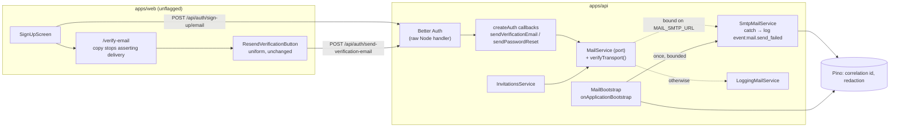
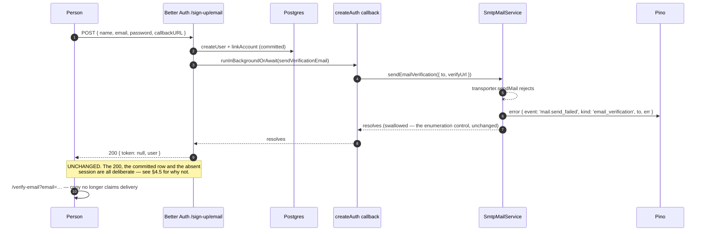
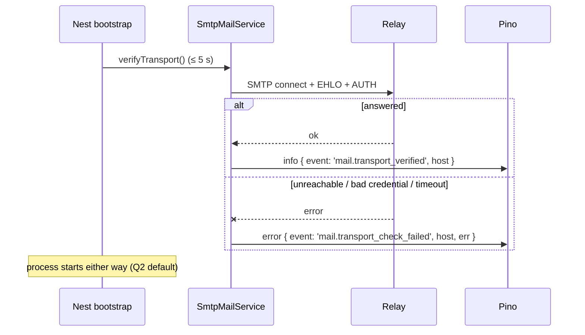
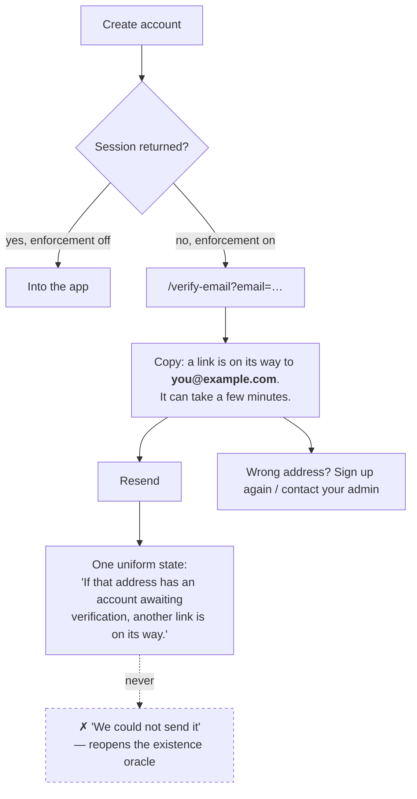

# Feature Spec: Mail delivery failure — who finds out, and when

- **Status:** Draft — **awaiting approval**
- **Author(s):** feature-analyst (Product Owner / Solution Architect / Technical Lead hats)
- **Date:** 2026-08-05
- **Tracking issue / epic:** — (the open half of `docs/TECH_DEBT.md` #94)
- **Roadmap link:** none — this is debt remediation, not a roadmap theme
- **Related ADR(s):** ADR-0074 (account recovery, verification enforcement), ADR-0003
  (Better Auth), ADR-0016 (identity & tenancy), ADR-0051 (uniform answers, `@Public()`
  discipline), ADR-0058 (verify the claim, do not trust the document). **This spec
  proposes a new ADR — ADR-0075** (see §4.7).

---

## 0. Findings that contradict the documents

ADR-0058's rule is _verify the claim; do not trust the document_. Applying it to this
subsystem before designing anything produced eight findings. Six are drift; two are
scoping corrections that change the shape of the answer. They are listed first because
three of them are load-bearing for the recommendation, and because routing around drift
leaves the register exactly as wrong as not noticing it (ADR-0071's own lesson).

Everything below was checked against the code or the installed
`better-auth@1.6.25` in `node_modules`, not against prose.

### D1 — `docs/TECH_DEBT.md` #94 says the adapter throws. It does not.

> "All three claims are now corrected; **the throw is kept**, because it is right at that
> seam and becomes true the moment the caller stops swallowing." — `docs/TECH_DEBT.md`
> #94, line 914

`SmtpMailService.sendEmailVerification`
(`apps/api/src/common/mail/smtp-mail.service.ts:93-109`) is a `try`/`catch` that logs and
returns. Its own docblock says so and explains why: **ADR-0074 M5-T1 inverted it** on
2026-08-05, one day after #94 was written, because a throw on
`/send-verification-email` is an account-existence oracle. The unit test that used to
assert `rejects` now asserts `resolves`
(`smtp-mail.service.spec.ts:82-105`). #94's remediation paragraph was never updated.

This is not cosmetic. #94's sentence is the premise of the whole "hard half" — _the throw
becomes true the moment the caller stops swallowing_ — and there is now **no throw to
become true**. Any design that assumes it exists is designing against a version of the
code that was deleted.

### D2 — `docs/DEPLOYMENT.md` tells the operator to watch for a line that a mail failure can no longer produce.

> "watch for `Failed to run background task` in the API log — today that unstructured
> line is the only signal of a broken relay" — `docs/DEPLOYMENT.md:166-168`

That line is emitted by Better Auth's `runInBackgroundOrAwait`
(`context/create-context.mjs:214-224`) **when the promise it is given rejects**. Since
D1, the promise resolves — the adapter has already caught. So on a host with
`MAIL_SMTP_URL` configured, a delivery failure produces:

- `SmtpMailService`'s own `logger.error({ err, to }, 'email-verification email failed to
send; …')`, in Pino, with the correlation id and the redaction rules; and
- **nothing at all** from `runInBackgroundOrAwait`.

The signal is strictly better than the doc describes. The instruction is strictly wrong.
An operator who set up an alert as told has an alert that can never fire.

The same paragraph also still says "**The adapter throws deliberately**", which is D1
again in a second file.

### D3 — `docs/DEPLOYMENT.md` §"What the application actually sends" describes a product two milestones out of date.

> "Two messages, and no others… There is no password-reset flow (nothing in the web UI, no
> `sendResetPassword` configured)… If a user forgets their password today the only route
> back is an operator resetting it in the database." — `docs/DEPLOYMENT.md:170-176`

There are **three** messages (`MailService` has `sendInvitation`,
`sendEmailVerification`, `sendPasswordReset`), `sendResetPassword` **is** configured
(`better-auth.ts:181-183`), and `VITE_PASSWORD_RESET` went **default-on** on 2026-08-05.
The same file contradicts itself 47 lines later with a section titled "Password reset: one
precondition that fails silently if you miss it". The heading of the stale section is
"What the application actually sends", which is precisely the section an operator reads to
decide what enabling SMTP will unleash.

### D4 — `mail.service.ts`'s port docblock claims an adapter asymmetry that no longer exists.

> "The recovery path is Better Auth's own resend endpoint, and **that asymmetry is the
> reason the two adapters treat failure differently rather than sharing one rule**." —
> `apps/api/src/common/mail/mail.service.ts:52-55`

`SmtpMailService` now treats all three messages identically — catch, log at `error`, never
the URL, return. `LoggingMailService` cannot fail at all. No adapter treats verification
differently from invitation. The sentence describes the code as it stood before ADR-0074
M5-T1.

### D5 — the "cheap half" of #94 is paid, but not by the mechanism #94 records.

`better-auth.ts:93-105` and `auth.module.ts:57-67` route Better Auth's logger into Pino,
described as the remedy for a swallowed mail failure ("which is where a swallowed
mail-send failure went to die"). Because of D1/D2 that route is now **inert for the mail
case**: the adapter catches first, so the library's logger is never reached. The operator
signal is real and is in Pino — it just comes from `SmtpMailService`, not from the wiring
credited with it. The claim "the cheap half is PAID" holds; the explanation of _how_ does
not.

### D6 — `docs/TECH_DEBT.md`'s footer says "Next free number: 94" while #94–#97 exist.

`docs/TECH_DEBT.md:1084`. The next free number is **98**. The file's own "Closed numbers"
preamble explains at length why a stale next-free pointer is dangerous — it is exactly how
two different items both became #83. One-line fix, and it belongs in this work because
this work touches #94.

### D7 — the harm is latent, not live. (Scoping, not an error.)

`AUTH_REQUIRE_EMAIL_VERIFICATION` defaults `false` (`env.validation.ts:46-49`) and
ADR-0074's acceptance ledger records **M5-T6/T7/T8 — verification enforced — "Pending —
operator"**. With the switch off, `shouldSkipAutoSignIn` is false
(`sign-up.mjs:162-163`), sign-up issues a session, and the new member lands in the
application. An undelivered verification email then costs exactly one thing: they cannot
accept an organisation invitation (ADR-0016 §5) — and that refusal is itself guarded by
the same switch.

`apps/api/test/mail-failure.e2e-spec.ts` sets `AUTH_REQUIRE_EMAIL_VERIFICATION=true`
explicitly in `beforeAll` (line 98) precisely because the behaviour it characterises is
not reachable otherwise.

So the honest statement of the problem is: **"a sign-up still succeeds and nobody is told"
is true today; "the user is locked out of an account they cannot use" becomes true the
moment an operator completes ADR-0074's last pending step.** That makes this work a
**prerequisite to the verification flip**, not an incident. It is also the single fact
that most changes the cost/benefit, which is why it is in §0 rather than buried in the
analysis.

### D8 — "sign-up has no enumeration oracle to protect" is not true once enforcement is on.

The task framing (and it is the natural reading) is that sign-up differs from reset
because the caller owns the address. That holds for the address the caller _types_. It
does not hold for the response, because `sign-up.mjs:162,169-207` derives
`shouldReturnGenericDuplicateResponse` from `requireEmailVerification` and, for an address
that **already exists**, returns a **synthetic 200** with a fabricated user and no
session — deliberately, so sign-up is not an enumeration oracle. That branch **sends
nothing**.

Therefore, with enforcement on:

| Address        | Send attempted? | Response today  |
| -------------- | --------------- | --------------- |
| new            | yes             | 200             |
| already exists | **no**          | 200 (synthetic) |

If a delivery failure were surfaced to the caller, then **during a mail outage** the two
rows stop matching: an error means "this address was free", a 200 means "this address is
taken". That is an account-existence oracle on the one endpoint anybody can call, opened
by the fix. It is weak (it requires an outage, and it is inverted) but it is the same
class of defect ADR-0074 went out of its way to close, and it is not mentioned anywhere in
the existing analysis.

**Consequence for the design:** "abort the sign-up on a send failure" is not admissible on
its own. It is only admissible together with a send on the duplicate branch, so that both
branches attempt exactly one message and fail identically. That materially changes the
cost of the structural option (§4.5, Option C).

---

## 1. Business understanding

### Problem

When SMTP delivery fails, the application reports success and nobody who could act finds
out.

Precisely, and only what has been measured (`apps/api/test/mail-failure.e2e-spec.ts`,
against a real Postgres with a rejecting `MailService`):

- `POST /api/auth/sign-up/email` returns **200** with the send having thrown.
- The `user` row is **committed** — the address is now taken.
- **No session cookie** is issued (`requireEmailVerification` overrides `autoSignIn`).
- The follow-up `POST /api/auth/sign-in/email` with the **correct** password returns
  **403**.

The mechanism is settled and is not configurable: Better Auth invokes the port through
`ctx.context.runInBackgroundOrAwait(...)` (`api/routes/sign-up.mjs:246`), whose default
implementation is `try { await promise } catch (e) { logger.error(...) }`
(`context/create-context.mjs:214-224`). It never rethrows, and the alternative
`advanced.backgroundTasks.handler` branch only `.catch()`es. **Verified in
`node_modules` for this spec, not taken from the row.**

The person is told the sign-up worked. Everything they can see says it did. Nothing on
the path from there mentions email, so nobody knows to press the resend button that would
recover them — and, since D1, pressing it would also report success and deliver nothing.

The operator's position is better than the documents claim (D2) and worse than it should
be: one `error` line exists in the Pino stream, under a message string nothing tells them
to alert on, and no proof of the relay is ever taken except by a user failing.

**Why now.** ADR-0074's last outstanding step is an operator flipping
`AUTH_REQUIRE_EMAIL_VERIFICATION=true`. That flip is what converts this from an
annoyance to a lockout (D7). Doing this work after the flip means learning about it from a
user who cannot sign in — which is exactly what `env.validation.ts:114-126`'s existing
cross-field guard was written to avoid for the neighbouring case.

### Users

| Who                              | Organisation role    | What they need                                                                                       |
| -------------------------------- | -------------------- | ---------------------------------------------------------------------------------------------------- |
| A person creating an account     | none yet (anonymous) | To not be told something worked when it did not; a next step that is not "email support"             |
| An invited colleague             | becomes Contributor+ | The same, arriving via `/accept-invite`                                                              |
| **The operator** (product owner) | host-level, not RBAC | To know the relay is broken **before** a user does, and to have one thing to alert on                |
| Org Admin                        | `ORG_ADMIN`          | Unaffected — the invitation path has an in-app fallback (§3, and see the invitation scoping in §4.4) |

Note the primary beneficiary is the **operator**, not an end user. That is the finding
that drives the recommendation: a broken relay is a **deployment fault with a
deployment-shaped remedy**, not a per-request event.

### Primary use cases

1. An operator configures SMTP and learns at **deploy time** whether the relay answers,
   rather than at the first user's sign-up.
2. An operator has one stable, documented log event to alert on when delivery starts
   failing in production.
3. A person who signed up and received nothing reads a screen that does not claim the
   email was delivered, and is told what to do.
4. A reader of `docs/TECH_DEBT.md` #94, `docs/DEPLOYMENT.md` or the mail port learns what
   the code actually does.

### User journeys

**Happy path (unchanged).** Sign up → 200 → `/verify-email?email=…` → message arrives →
follow the link → `GET /verify-email` verifies and redirects to `/verify-email?verified=1`
→ "Email verified" → sign in.

**Broken relay, today.** Sign up → 200 → `/verify-email` says "**We sent you a link** to
confirm your address" → nothing arrives → press **Resend** → reports success → nothing
arrives → the person concludes they mistyped their address or that the product is broken.
An `error` line exists in the API log that nobody is watching.

**Broken relay, proposed.** The relay never gets that far: the API refuses to come up
clean, logging `mail.transport_check_failed` at boot with the host and the error, and the
operator sees it in the deploy they are already reviewing (ADR-0047 — every release on
this host is reviewed by a person). If it breaks _after_ boot, each failed send logs
`mail.send_failed` with a stable `event` field, and the screen the stranded person lands
on no longer asserts delivery: it names the address, says the message may take a few
minutes, and offers the resend without promising it worked.

### Expected outcomes

- The window between "the relay broke" and "somebody knows" collapses from _indefinite_ to
  _the next boot_ (misconfiguration) or _the next log review_ (runtime failure).
- `AUTH_REQUIRE_EMAIL_VERIFICATION` becomes safe to flip, because the prerequisite is
  proved by the process rather than hoped for.
- Four documents and one port docblock stop describing a system that does not exist.
- **The recalculation parity gate is untouched by construction** — the CPM engine is not
  imported, no scheduling input changes, and no migration runs. In its honest form
  (ADR-0074 §6): there is nothing to hold parity _for_.

### Success criteria

| Criterion                                                                                          | How measured                                                                  |
| -------------------------------------------------------------------------------------------------- | ----------------------------------------------------------------------------- |
| A misconfigured relay is visible at boot, not at first sign-up                                     | API e2e: a transport that fails `verify()` produces the boot log line         |
| Exactly one grep term finds every delivery failure                                                 | Unit test pins `event: 'mail.send_failed'` on all three adapter failure paths |
| `/verify-email` makes no claim about delivery                                                      | Component test asserts the copy; flag-off parity untouched (there is no flag) |
| The enumeration guarantee on `/request-password-reset` is unchanged                                | `mail-failure.e2e-spec.ts` "stays uniform…" passes **untouched**              |
| Sign-up stays uniform between a new and an existing address under enforcement                      | **New** characterisation case (does not exist today — see §4.8)               |
| Every claim in `TECH_DEBT` #94, `DEPLOYMENT.md` §Transactional email and the port docblock is true | Read against the code in review; `pnpm check:doc-links` for the links         |

### Open questions

**CRITICAL — Q1. Do we accept that delivery stays best-effort?**
The recommendation (§4.6) is **yes**: do not send before handoff, do not abort the
sign-up, and spend the effort on catching a broken relay at deploy time and telling the
truth on screen. The argument is in §4.5; the two facts that decide it are D7 (the harm is
latent behind an operator flip) and D8 (the abort opens an enumeration oracle unless the
duplicate branch also sends). Answering "no" replaces M1–M2 with the wrapper design in
§4.5 Option C and roughly triples the work.
_Default if unanswered: yes — proceed with the recommendation._

**CRITICAL — Q2. Should a failed transport check ever refuse to boot?**
The proposal is **no — log at `error` and start**. A fatal check turns a transient relay
outage into a self-inflicted site outage, and the ADR-0047 Watchtower profile recreates
containers unattended, so a relay that is down during a 03:00 image pull would take the
API down with it and keep it down. The counter-argument is real: `env.validation.ts`
already refuses to boot on `AUTH_REQUIRE_EMAIL_VERIFICATION=true` with no
`MAIL_SMTP_URL`, and "configured but unreachable" is the same dead end one step along.
_Default if unanswered: warn-only. The fatal variant is recorded in the ADR as the
rejected alternative with the trigger that would revisit it._

**Q3. Is the invitation path in scope?** Proposed **no**, on verified evidence rather than
on the docblock's say-so — see §4.4. There is one narrow gap worth naming but not fixing
here.
_Default: out of scope; the gap is left to ADR-0074 §6's existing "no resend-invitation"
debt row._

**Q4. Unflagged?** Proposed **yes** for the `/verify-email` copy, by ADR-0074 §2: the
state it describes is a runtime consequence of a server-side switch, so a `VITE_` constant
would strand a flag-off bundle against a flag-on server. There is no prior behaviour worth
a parity suite — the change is one paragraph of copy that is wrong in both worlds.
_Default: unflagged._

---

## 2. Functional requirements

### User stories & acceptance criteria

> **US-1** — As the **operator**, I want the API to tell me at start-up that the mail relay
> does not answer, so that I find out during the deploy I am already watching instead of
> from a user who cannot sign in.
>
> **Acceptance criteria**
>
> - **Given** `MAIL_SMTP_URL` is set to an unreachable host, **when** the API boots,
>   **then** exactly one `error` log line is written with `event: 'mail.transport_check_failed'`,
>   the resolved host and port, and the underlying error — **and the process still starts**
>   (Q2 default).
> - **Given** `MAIL_SMTP_URL` is set and the relay answers, **when** the API boots, **then**
>   one `info` line is written with `event: 'mail.transport_verified'` and nothing else
>   changes.
> - **Given** `MAIL_SMTP_URL` is **unset**, **when** the API boots, **then** no verification
>   is attempted and no new line is written — dev, test and CI are byte-for-byte unchanged.
> - **Given** the relay accepts TCP but never completes the handshake, **when** the API
>   boots, **then** the check gives up after a bounded timeout and boot is not delayed
>   beyond it.

> **US-2** — As the **operator**, I want one stable term that finds every failed message,
> so that an alert I write today still fires next year.
>
> **Acceptance criteria**
>
> - **Given** any of the three messages fails to send, **when** the adapter handles it,
>   **then** the `error` log record carries `event: 'mail.send_failed'` and a `message`
>   field naming which message it was (`invitation` | `email_verification` |
>   `password_reset`).
> - **Given** any failure path, **then** the record contains **no** URL and no token — the
>   existing `acceptUrl`/`verifyUrl`/`resetUrl` prohibition is unchanged and re-asserted by
>   the existing tests.
> - **Given** `docs/DEPLOYMENT.md`, **then** it names `mail.send_failed` and
>   `mail.transport_check_failed` and does **not** name `Failed to run background task`
>   (D2).

> **US-3** — As a **person who has just signed up**, I want the screen not to tell me an
> email was delivered when the product does not know that, so that I do not spend twenty
> minutes concluding I mistyped my own address.
>
> **Acceptance criteria**
>
> - **Given** I land on `/verify-email` with no `verified` and no `error` param, **when**
>   the screen renders, **then** the description does not assert that a message was sent,
>   and instead says a link is on its way, may take a few minutes, and can be re-sent.
> - **Given** `?email=` is present, **then** the address is shown, so a typo is visible.
> - **Given** I press **Resend**, **then** the response is exactly as uniform as it is
>   today — one "check your email" state whatever the truth. **This is a requirement, not
>   an omission** (§4.3).
> - **Given** the `?verified=1` and `?error=` arrivals, **then** their copy is unchanged.

> **US-4** — As an **engineer or operator reading the documents**, I want them to describe
> the system that exists.
>
> **Acceptance criteria**
>
> - `docs/TECH_DEBT.md` #94's "the throw is kept" paragraph is corrected (D1), its
>   remediation names the real mechanism (D5), and its footer's next-free number is 98 (D6).
> - `docs/DEPLOYMENT.md` §Transactional email drops "the adapter throws deliberately" and
>   the `Failed to run background task` instruction (D2), and §"What the application
>   actually sends" says three messages and describes reset as shipped (D3).
> - `mail.service.ts`'s `sendEmailVerification` docblock stops claiming an adapter
>   asymmetry that does not exist (D4).
> - Each correction cites what was checked, so the next reader can re-check it.

> **US-5** — As the **operator**, I want the pre-flip checklist for
> `AUTH_REQUIRE_EMAIL_VERIFICATION` to include proof that a real message arrived, so that
> the flip does not arm three dead ends against a relay nobody tested.
>
> **Acceptance criteria**
>
> - `docs/DEPLOYMENT.md` §"Turning verification on" lists the steps in order, including a
>   real sign-up to a real mailbox, and cross-references ADR-0074's ledger row.

### Workflows

**W-1 Boot-time transport check.** `MailModule` binds `SmtpMailService` (it already does,
on `MAIL_SMTP_URL` alone) → on `onApplicationBootstrap`, if the bound adapter supports
verification, call it with a bounded timeout → log `mail.transport_verified` (info) or
`mail.transport_check_failed` (error) → return, never throw (Q2 default).

**W-2 Runtime send failure.** Caller (Better Auth callback, or `InvitationsService`) →
`MailService.send*` → `transporter.sendMail` rejects → adapter logs `event:
'mail.send_failed'` + `message` + `to` + `err`, no URL → resolves → the caller's request
proceeds exactly as it does today.

**W-3 The stranded sign-up.** Unchanged mechanically: 200, no session, redirect to
`/verify-email?email=…`. Only the copy changes.

### Edge cases

| Case                                                                 | Expected behaviour                                                                                                                                                                                                 |
| -------------------------------------------------------------------- | ------------------------------------------------------------------------------------------------------------------------------------------------------------------------------------------------------------------ |
| `MAIL_SMTP_URL` unset (dev, test, CI, and a host not yet configured) | No check, no new log line, `LoggingMailService` as today. This is the default path and must stay untouched.                                                                                                        |
| Relay reachable at boot, broken later                                | The boot check says nothing about later. `mail.send_failed` is the only signal, which is why US-2 exists and why the check is **not** sold as a guarantee.                                                         |
| Relay reachable, credential lacks _send_ permission                  | **The check passes and sending fails.** SMTP AUTH succeeds; the refusal comes at `RCPT`/`DATA`. `docs/DEPLOYMENT.md:196-198` already documents this exact Resend case. The doc must say the check cannot catch it. |
| Relay accepts, recipient bounces asynchronously                      | Not observable at all — no bounce webhook, no return path handling. Out of scope, stated.                                                                                                                          |
| A hung relay at boot                                                 | Bounded timeout (proposed 5 s). Boot must not block on a third party.                                                                                                                                              |
| Two API replicas                                                     | Both check; two log lines. Harmless. (Noted because Better Auth's rate limiter is already per-replica — ADR-0073 C2.1.)                                                                                            |
| Duplicate sign-up under enforcement                                  | Synthetic 200, no send, no session. Must remain **indistinguishable** from a new-address sign-up (D8). Currently untested — §4.8 adds the case.                                                                    |
| Enforcement **off** (today)                                          | A failed verification send costs only invitation-accept. The copy change is still correct; the boot check is still correct.                                                                                        |

### Permissions

Nothing here is RBAC-scoped, and that is worth stating rather than leaving blank:

- The boot check runs in the API process. **No endpoint, no permission, no new
  `@Public()` route** — ADR-0051 established that the public list stays short and each
  entry justified, and this adds none.
- `/verify-email` is a public web route already registered unconditionally.
- No organisation scope is involved; nothing reads or writes a plan; **the pen (ADR-0028)
  is not involved**.
- Deliberately **not** exposed on `GET /health/ready`: readiness is what a load balancer
  and the Docker healthcheck consume, and a mail outage must not remove the API from
  service or restart-loop the container. Mail is not a critical dependency of the API.

### Validation rules

None new. No user input is added. `MAIL_SMTP_URL`/`MAIL_FROM`'s existing cross-field rule
(`env.validation.ts:143-152`) and the production
`AUTH_REQUIRE_EMAIL_VERIFICATION` ⇒ `MAIL_SMTP_URL` rule (`:119-126`) are unchanged.

### Error scenarios

| Scenario                                          | Detection           | User-facing result                                          | Status |
| ------------------------------------------------- | ------------------- | ----------------------------------------------------------- | ------ |
| Verification send fails at sign-up                | adapter catch       | **Unchanged: 200**, then honest copy on `/verify-email`     | 200    |
| Verification send fails on resend (session-less)  | adapter catch       | **Unchanged: uniform 200** — the oracle stays closed        | 200    |
| Reset send fails                                  | adapter catch       | **Unchanged: uniform 200** — out of scope by design (§4.4)  | 200    |
| Invitation send fails                             | adapter catch       | Unchanged; the Org Admin still has the accept URL on screen | 201    |
| Relay unreachable at boot                         | `verifyTransport()` | None — operator-facing log only                             | n/a    |
| Relay unreachable at boot, **fatal variant (Q2)** | `verifyTransport()` | The API does not start; the deploy fails loudly             | n/a    |

---

## 3. Technical analysis

| Area           | Impact   | Notes                                                                                                                                                                                       |
| -------------- | -------- | ------------------------------------------------------------------------------------------------------------------------------------------------------------------------------------------- |
| Frontend       | **low**  | One screen's copy (`apps/web/src/routes/verify-email.tsx`), unflagged. No new route, no new state, no new form.                                                                             |
| Backend        | **low**  | `MailService` port gains one optional method; `SmtpMailService` implements it; `MailModule` (or a tiny lifecycle hook) calls it once at bootstrap. Three log records gain an `event` field. |
| Database       | **none** | No model, no migration, no index.                                                                                                                                                           |
| API            | **none** | No endpoint, no DTO, no OpenAPI change, no version bump to the contract.                                                                                                                    |
| Security       | **med**  | The whole design is constrained by two enumeration guarantees (reset — ADR-0074; session-less resend — ADR-0074 M5-T1) and by D8, which is a **new** finding. security-reviewer required.   |
| Performance    | **med**  | ~~One SMTP handshake at boot, bounded. No request-path cost.~~ **This row was wrong** — see the note below. Every send is on the request path, and M4 bounds it.                            |
| Infrastructure | **low**  | No new service, no new env var under the recommendation. `docs/DEPLOYMENT.md` gains the alert terms.                                                                                        |
| Observability  | **med**  | This _is_ the feature: two new boot events and a stable `event` discriminator on the failure records. `docs/OBSERVABILITY.md` may want the convention recorded.                             |
| Testing        | **med**  | Unit (adapter log shape, verify path), API e2e (boot behaviour), web component (copy). The characterisation suite is the interesting one — see §4.8.                                        |

> **The Performance row was false, and the review pass caught it.** "No request-path cost" was
> written from the mental model that Better Auth sends mail in the background. It does not:
> `runInBackgroundOrAwait` **awaits** unless `advanced.backgroundTasks.handler` is configured
> (`better-auth@1.6.25`, `dist/context/create-context.mjs:220`), nothing in `apps/api/src`
> configures one (`grep -rn "backgroundTasks"` → nothing), and `invitations.service.ts:119` awaits
> its send in the handler outright. Four endpoints therefore block on a live SMTP round trip whose
> only bound was nodemailer's defaults — up to **ten minutes** on a socket that connects and then
> goes quiet.
>
> The row is corrected rather than deleted. It was asserted, in a table, in the same document that
> established this epic's own rule about asserting things — and the wrong version is the useful
> part of the record. The remedy is M4's `SEND_TIMEOUT_MS`; the residual is a timing difference on
> `/request-password-reset`, `docs/TECH_DEBT.md` #99.

### Dependencies

- **Prerequisite for:** ADR-0074 M5-T6/T7/T8 (the verification flip). This work should land
  before that flip; it does not block anything else.
- **Depends on:** nothing unbuilt. `nodemailer`'s `Transporter.verify()` is already in the
  installed dependency; no new package.
- **Interacts with:** ADR-0074 M0-T6 (the Better Auth logger→Pino wiring — D5 says it is
  inert for this case and should be re-described, **not removed**: it still carries every
  other library log line).
- **Explicitly not depended on:** BullMQ/Redis (ADR-0009) and OpenTelemetry metrics
  (ADR-0013) are accepted-but-unimplemented (CLAUDE.md §17). No design here may assume a
  queue, a retry worker or a metric.

---

## 4. Solution design

### 4.1 Architecture overview



Everything new is inside the existing seam. The port keeps its single implementation
choice rule (`MAIL_SMTP_URL` is the switch — `mail.module.ts:14-19`), and no caller learns
about a transport.

### 4.2 Data flow — what changes, and what deliberately does not



The only server-side behavioural change is the boot check:



### 4.3 User flow



The dashed node is the thing this design refuses to build, and it is the single most
likely "improvement" a later reader will attempt. It is called out on the diagram for the
same reason the characterisation suite asserts uniformity at the point of temptation.

### 4.4 Scope: three paths, three different answers

**Sign-up verification — in scope, but not for a caller-visible failure.**
The caller owns the address, so there is no oracle in the address itself — but there is one
in the _response_, because the duplicate branch answers 200 without sending (D8). So the
remedy here is honesty on screen plus operator signal, not a different status code.

**Password reset — out of scope for caller-visible failure, and this is the hard
constraint.** `POST /api/auth/request-password-reset` answers identically for a known and
an unknown address; `password.mjs:60-72` performs a dummy `generateId` /
`findVerificationValue` on an unknown address purely to equalise timing. Any
caller-visible difference — status, body, or latency — tells an attacker which addresses
hold accounts. `MailService.sendPasswordReset`'s own docblock states this, and
`mail-failure.e2e-spec.ts:178-210` asserts it at the point of temptation. **The remedy on
this path is operator-facing only**, and the cheap half is already paid (D5 — with the
mechanism corrected). Nothing in this spec touches it.

**Invitation — out of scope, on verified evidence.** The port's docblock says an Org Admin
"can always read an invitation's accept URL off the screen and pass it on by another
route". Checked rather than trusted:

- `InvitationsService.create` returns `{ invitation, acceptUrl }`
  (`invitations.service.ts:131`);
- `org-invitations.controller.ts:63-64` returns `CreatedInvitationDto.fromWithUrl(...)`;
- `CreatedInvitationDto` carries `acceptUrl` and `InvitationResponseDto` (the list shape)
  does **not** (`invitation-response.dto.ts:33-53`);
- `InviteMemberDialog.tsx:41,53` renders it in a labelled **Invitation link** field with a
  Copy button, and three Playwright journeys read it from that field.

So the asymmetry holds and swallowing is safe **at creation time**. One narrow gap the
docblock does not mention: the URL is on the **create response only**, so an Org Admin who
closes the dialog cannot recover it, and there is no resend-invitation endpoint — which
ADR-0074 §6 already recorded as a debt row. Naming it here; not fixing it here. Adding a
resend-invitation surface to this epic would double it and is a membership-management
decision, not a mail-reliability one.

### 4.5 Options considered

Each option is judged against four questions: does it close the user-facing gap, does it
preserve the two enumeration guarantees, what does it cost, and what does it own that the
library currently owns.

---

**Option A — Mint the verification token ourselves and send before handing off.**

Send from application code, then call Better Auth with `sendOnSignUp: false`.

The token is a signed JWT of `{ email, updateTo, requestType }` created by
`createEmailVerificationToken` (`email-verification.mjs:13-19`), and the URL is
`` `${baseURL}/verify-email?token=${token}&callbackURL=${encodeURIComponent(cb)}` ``. It is
**not persisted**, so "single use" is not even enforced today. Reproducing both is
mechanically easy.

- ✅ Closes the gap absolutely — nothing is committed until the message is accepted.
- ❌ We own a **parallel** mint of a library credential. The drift is invisible: our link
  keeps working until the library changes its payload or URL shape, and then verification
  fails for everyone with a green test suite (our mint and our assertion agree with each
  other). This is the `routeOrthogonalAvoiding` failure (ADR-0065) applied to a security
  token.
- ❌ ADR-0074 §1 already rejected owning reset minting for the weaker version of this
  reason. Doing it for verification would contradict an ADR accepted yesterday.
- ❌ Does not, by itself, solve D8.

**Rejected.**

---

**Option B — Abort from a `hooks.after` middleware.**

Record the send outcome in request-scoped storage; in `hooks.after` on `/sign-up/email`,
throw an `APIError` when it failed.

This is more nearly viable than it looks. `runAfterHooks`
(`api/dispatch.mjs:117-126`) catches an `APIError` thrown by an after-hook and installs it
as `context.context.returned`, so the hook genuinely can replace a successful response.

But three things break:

- ⚠️ **The status code is probably wrong.** `dispatchAuthEndpoint` passes the _handler's_
  status into `toResponse(result.response, { status: result.status })`
  (`dispatch.mjs:255-257`), and `toResponse` resolves an `APIError` with
  `init?.status ?? data.statusCode` (`better-call/dist/to-response.mjs:125-129`) — so
  `init.status`, i.e. the handler's **200**, wins. The reader would get an error body under
  a 200. _This is read from source, not measured_; the plan makes measuring it the first
  task if this option is revived.
- ❌ **The user row is already committed** and would have to be hard-deleted, in an
  application whose §17 states plainly that every deletion is a soft delete, on a table
  Better Auth owns, with an `account` row and possibly an `auth.signed_up` audit row
  already written.
- ❌ **D8 is unsolved**, so it opens the oracle.

**Rejected.**

---

**Option C — A Nest sign-up wrapper that owns the ordering.**

`POST /api/v1/auth/sign-up` → `auth.api.signUpEmail(...)` → `auth.api.sendVerificationEmail(...)`
→ on failure, undo. Plus a send on the duplicate branch so both branches fail identically
(the D8 remedy), plus — to make a session-less resend honest for the person who _just_
signed up — a short-lived signed receipt they can present.

This is the only option that closes the gap **and** keeps sign-up uniform. It is also the
one with the highest hidden cost, and one of those costs is decisive:

- ❌ **It bypasses Better Auth's rate limiter.** The limiter runs at the router's
  `onRequest` (`api/index.mjs:168`, `onRequestRateLimit`), not inside the endpoint — so
  `auth.api.*` invoked server-side never reaches it. Sign-up would fall back to the global
  Nest throttle (100/60 s) instead of the auth-specific window, on the one open,
  unauthenticated, account-creating endpoint the product has. That is a security
  regression bought with a reliability improvement.
- ❌ It changes the public sign-up contract (`apps/web`'s `authClient.signUp.email` →
  a bespoke endpoint), which drags in the audit hook path, the IP/user-agent evidence
  (`requestEvidence` reads the hook's headers — we would have to forward them faithfully),
  and every sign-up test.
- ❌ The duplicate-branch send is a **new user-visible message** ("someone tried to sign up
  with your address") with its own copy, its own abuse profile and its own spec.
- ❌ An SMTP timeout becomes a user-visible sign-up failure at the top of the funnel. Worth
  arguing rather than assuming: on a healthy relay this costs latency (Better Auth's own
  `/send-verification-email` already imposes a **500 ms floor**, so ≥ 500 ms would be added
  to every sign-up); on a broken relay, sign-up stops working for everybody. That is not
  obviously better than "the account exists and we could not email you" — it is the same
  outage with a different face, and neither face reaches the operator any faster than a log
  line does.
- ✅ It is the right answer if the failure is _per-recipient_ rather than _per-relay_ (a
  synchronous 5xx at `RCPT TO` for a typo'd domain). That case is real, and it is the
  strongest argument for this option. It is also partial: most relays accept and bounce
  asynchronously, in which case this option reports success too.

**Rejected for now, recorded with its trigger** (§4.6).

---

**Option D — Make the signed-in resend honest.** (Considered and rejected on its own
merits, because the reasoning is not obvious.)

`/send-verification-email`'s **session-ful** branch (`email-verification.mjs:119-121`)
calls the port directly and propagates a failure, and it carries **no** oracle — the body's
address must match the session's or it is a 400 `EMAIL_MISMATCH`. So an honest "we could
not send it" is available there for free.

It is nearly worthless. The population that needs an honest resend is people stranded by
enforcement — and under enforcement they have **no session by construction** (sign-up
issues none, sign-in 403s). The honest branch is reachable only in the enforcement-**off**
world, where an undelivered verification email costs almost nothing. **Rejected: correct,
and aimed at the wrong people.** Recorded because it looks like a free win and is not.

---

**Option E (recommended) — Delivery stays best-effort; the failure is caught at deploy
time, named in the operator's stream, and no longer denied on screen.**

Three parts, none of which touches an auth boundary contract:

1. **Truth** — correct D1–D6, and give the three failure records one stable `event`
   discriminator so an alert can exist.
2. **Deploy-time proof** — `verifyTransport()` at bootstrap when SMTP is configured, so
   the commonest real failure (a misconfigured relay: wrong host, wrong port, wrong
   credential, unverified sending domain) is found by the operator during a deploy they
   are already reviewing, rather than by the first user.
3. **Honest copy** — `/verify-email` stops asserting that a message was sent, and shows
   the address so a typo is visible.

- ✅ Preserves both enumeration guarantees untouched; D8 never arises.
- ✅ No new endpoint, no new `@Public()` route, no new permission, no migration, no schema.
- ✅ Nothing new is owned that the library owns today.
- ⚠️ **Does not close the gap absolutely.** A relay that breaks after boot, or that accepts
  and bounces, still strands an individual sign-up silently to that person. The remedy for
  them is a resend that is uniform, and a person who has read a screen that told them a
  link "can take a few minutes" and can be re-sent. That is honest, and it is the trade
  being recommended.

### 4.6 Recommendation

**Do not send the message before handing off to Better Auth. Adopt Option E.**

The direct answer to the question asked: it _can_ be done (Option A or C), the installed
version does offer a supported route (Option C, and Option B is closer to viable than
expected), and it should not be done **now**, for four reasons in decreasing order of
weight:

1. **A broken relay is a deployment fault, and it has a deployment-shaped remedy.** If the
   relay is down, aborting the sign-up does not save anyone — it converts "you have an
   account we cannot email" into "sign-up is broken", for every user, with the operator
   still finding out at the same speed. What actually shortens the outage is the operator
   knowing. That is Option E part 2 and 3, and it costs a fraction of Option C.
2. **The abort is not admissible without also sending on the duplicate branch** (D8), and
   that turns a bug fix into a new user-visible message with its own spec.
3. **Option C loses Better Auth's router-level rate limiter on the open sign-up
   endpoint** — a security regression traded for a reliability gain, on the endpoint least
   able to afford it.
4. **The harm is latent** (D7). ADR-0074's ledger shows the switch that arms it is still
   pending. Landing Option E before the flip means the flip is made against a relay that
   has been proved to answer, which is the condition ADR-0074 M5-T6/T7/T8 already asks for
   informally.

**The trigger that would revive Option C**, recorded so the decision is revisitable rather
than permanent: a measured incidence of stranded accounts after enforcement is on — i.e.
`mail.send_failed` with `kind: 'email_verification'` appearing in production at all —
or a single operator report of a user stranded by a per-recipient rejection. Both are
observable **only once Option E part 1 exists**, which is the other reason to do it first.

### 4.7 Does this need an ADR? Yes — ADR-0075.

It changes an auth-boundary contract in the honest sense: it **decides, and writes down,
that verification delivery is best-effort by design**, converting three documents' claims
of a guarantee into a stated non-guarantee with a named compensating control. ADR-0074 set
the precedent that a client surface whose gate is a server condition is branched on
runtime evidence; this ADR is the companion decision about a server condition the client
cannot observe **at all**, and its answer is to move the signal to the operator rather than
to invent a client-visible one.

It also records four rejections that a future reader will otherwise re-litigate: token
minting (A), the after-hook abort (B), the sign-up wrapper (C, with its trigger), and the
honest signed-in resend (D — the one that looks free).

**Number check, per the ADR-0071 lesson.** `docs/adr/` holds 0001–0074 with no gaps at the
top; `docs/specs/**` contains no drafted ADR claiming 0075+; a repository-wide search for
`ADR-0075` (excluding `node_modules`) returns nothing. **0075 is free.**

Draft outline:

- **Title:** ADR-0075 — Mail delivery is best-effort: where a send failure surfaces, and
  why not at sign-up.
- **Context:** the measured behaviour (200 / committed row / no session / 403); the
  mechanism (`runInBackgroundOrAwait`, unconfigurable); D1–D8, with D8 as the finding that
  reshapes the option set; the fact that the harm is latent behind an operator flip.
- **Decision:** delivery stays best-effort; the port's contract is "report the failure to
  the operator, never to the caller"; the swallow stays in the adapter (not moved to call
  sites — §4.4's three paths want the same answer for three different reasons, and one rule
  that happens to suit all three is safer than three rules that must be kept in step); a
  bounded boot-time transport check, warn-only; a stable `event` vocabulary; the screen
  makes no delivery claim.
- **Alternatives:** A, B, C (with its revival trigger), D, and "fatal boot check" (Q2).
- **Consequences:** positive — the flip becomes safe, the alert becomes possible, four
  documents become true. Negative and accepted — an individual per-recipient failure is
  still invisible to that recipient; the boot check cannot catch a permission-scoped
  credential or an asynchronous bounce, and the ADR says so rather than implying a
  guarantee. **The CPM engine is not imported and no migration runs**, so the ADR-0034
  parity gate is untouched by construction.
- **References:** ADR-0003, ADR-0016, ADR-0051, ADR-0058, ADR-0074; `TECH_DEBT` #94, #16, #88.

### 4.8 `apps/api/test/mail-failure.e2e-spec.ts` — exactly what changes

This suite is a **characterisation** suite: it pins today's behaviour including the wrong
parts, so a fix has something that fails the moment the behaviour moves.

**Under the recommendation (Option E), not one existing assertion changes.** That is not a
convenient coincidence — it is the clearest possible statement of what Option E is: it
does not move the behaviour the suite pins. If the plan were to modify these assertions,
the recommendation would be a different one.

| Assertion (line)                                                        | Under Option E                                                                                                                                                                                                                       | Under Option C (if revived)                                                                                                   |
| ----------------------------------------------------------------------- | ------------------------------------------------------------------------------------------------------------------------------------------------------------------------------------------------------------------------------------ | ----------------------------------------------------------------------------------------------------------------------------- |
| `verificationAttempts === 1` (142)                                      | **untouched**                                                                                                                                                                                                                        | untouched (a send is still attempted)                                                                                         |
| `response.status === 200` (143)                                         | **untouched**                                                                                                                                                                                                                        | **flips** — becomes the abort status (proposed 502 `MAIL_DELIVERY_FAILED`)                                                    |
| user row exists, `emailVerified === false` (147-150)                    | **untouched**                                                                                                                                                                                                                        | **flips** to "no user row remains", **only if** the rollback half is built; otherwise it must stay and the suite must say why |
| `set-cookie` undefined (154)                                            | **untouched**                                                                                                                                                                                                                        | becomes moot; delete rather than weaken                                                                                       |
| sign-in that follows returns 403 (157-174)                              | **untouched**                                                                                                                                                                                                                        | **case deleted** — unreachable once the account is rolled back                                                                |
| **reset: `known.status === unknown.status` and equal bodies (208-209)** | **UNTOUCHED — and this is not negotiable under any option.** Changing it reintroduces the enumeration oracle ADR-0074 closed. It is the one assertion in the file that is asserting a guarantee rather than characterising a defect. |

**What is added, under Option E:**

1. **A new case in this file: sign-up is uniform between a new and an existing address
   under enforcement.** It does not exist today, and D8 is the reason it must: it is the
   property that makes the abort inadmissible, and nothing currently pins it. Shape: sign
   up an address successfully, then sign up the **same** address again with the mail port
   failing, and assert the two responses' status and body shape match, and that
   `verificationAttempts` did **not** increase on the second (the duplicate branch sends
   nothing). Written as a **guarantee**, not a characterisation — so unlike its neighbours
   it is allowed to be the thing that fails a future change.
2. **A docblock amendment.** The file's opening comment says the open half of #94 is "a
   design change — sending from application code before handing off, so a failure can
   abort the request". Once ADR-0075 is accepted, that sentence describes a **rejected**
   option and must instead say the design change was considered and declined, and point at
   the ADR — otherwise the file becomes the next reader's brief to build the thing we
   rejected.
3. **A boot-behaviour case lives elsewhere**, not in this file: this suite overrides
   `MailService` with a double, so it structurally cannot see `SmtpMailService`'s
   verification or its log shape. Those are a unit test on the adapter and a small
   bootstrap test. Naming that here so nobody tries to wedge it in — the same mistake
   #94 recorded when the throw was tested one level below where it was claimed.

### 4.9 Database changes

**None.** No model, column, index, constraint or migration. `database-architect` is not
needed for this feature; that is stated so its absence is a decision rather than an
oversight.

### 4.10 API changes

**None.** No new endpoint, no changed DTO, no OpenAPI delta, no new permission, no new
`@Public()` route, no status-code change on any existing route. The only backend surface
that changes is the `MailService` port's **internal** shape (one optional method) and three
log records' fields.

Proposed port addition:

```
MailService (abstract)
  + verifyTransport?(): Promise<void>      // resolves when the relay answers; rejects otherwise
```

Optional rather than required, so `LoggingMailService` is unchanged and no test double in
the repository (`FailingMailService`, `CapturingMailService`, and the doubles in the
invitations specs) has to be edited. That matters: forcing every double to implement a
method they do not care about is how an unrelated suite ends up carrying an assertion
about mail.

### 4.11 Component changes

One file: `apps/web/src/routes/verify-email.tsx`, the neither-verified-nor-failed branch
(lines 57-74). No new component, no new token, no new variant — the change is the
`description` string plus rendering `email` when present. `AuthShell`,
`ResendVerificationButton` and the `?verified=1` / `?error=` branches are untouched.

States: this screen has no loading or error state of its own; the resend button owns its
own pending/settled states and keeps them. Accessibility: no new interactive element, so
the change is copy inside an existing described region — `accessibility-reviewer` still
runs, because the address is new content and its association with the resend control is
worth a look (the ADR-0073 C2.5 finding, one screen along).

Copy direction (final wording to be settled with `ux-reviewer`, who owns it):

- Today: "We sent you a link to confirm your address. Open it to finish setting up your
  account."
- Proposed: "A confirmation link is on its way to **you@example.com**. It can take a few
  minutes to arrive — check your spam folder, then send another." — asserts intent, not
  delivery; surfaces the address so a typo is visible; makes the resend the obvious next
  action rather than a fallback.

### 4.12 Implementation approach

Smallest change that fully solves the problem as scoped: no new module, no new endpoint,
no new dependency, one optional port method, one lifecycle hook, one screen's copy, and
four documents made true. Every part is independently revertable and none of it is behind
a flag, because none of it has a prior behaviour worth preserving.

---

## 5. Links

- Implementation plan: [`./implementation-plan.md`](./implementation-plan.md)
- Docs this change updates: `docs/TECH_DEBT.md` (#94, and the next-free footer),
  `docs/DEPLOYMENT.md` (§Transactional email, §What the application actually sends,
  §Turning verification on), `docs/OBSERVABILITY.md` (the `event` convention, if adopted),
  `docs/SECURITY_STANDARDS.md` (§Rate limiting & abuse protection — the enumeration bullet
  gains the sign-up uniformity case from D8), `apps/api/src/common/mail/mail.service.ts`
  (docblock), and a new `docs/adr/0075-*.md`.
- Prior art: ADR-0074 §1 (why we do not own token minting), ADR-0074 §2 (why a server
  condition is not gated by a `VITE_` constant), ADR-0051 (uniform answers; the short
  `@Public()` list), ADR-0058 (verify the claim).
