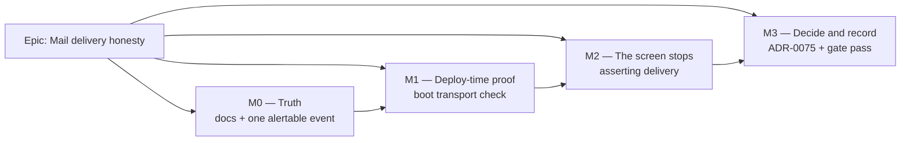

# Implementation Plan: Mail delivery failure — who finds out, and when

- **Feature spec:** [`./feature-spec.md`](./feature-spec.md) — **Draft, awaiting approval**
- **Status:** Draft
- **Owner:** unassigned (product owner to confirm)

> This plan assumes the spec's recommendation (§4.6, **Option E**): delivery stays
> best-effort, the failure is caught at deploy time and named in the operator's stream, and
> the product stops asserting delivery. If **CQ-1** is answered "no — build the structural
> abort", this plan is replaced, not amended: M1 and M2 disappear and Option C's wrapper
> becomes a four-milestone epic of its own (sketched in §"If CQ-1 is answered no").

## Breakdown

### Epic

**Mail delivery honesty** — close the open half of `docs/TECH_DEBT.md` #94 by deciding
that verification delivery is best-effort, moving the signal to the operator, and making
four documents describe the system that exists. Roadmap theme: none — this is debt
remediation and a **prerequisite to ADR-0074 M5-T6/T7/T8** (the
`AUTH_REQUIRE_EMAIL_VERIFICATION` flip).

**Epic-wide invariants**, asserted in review at every milestone:

- **The CPM engine is not imported**, no scheduling input changes, no migration runs — the
  ADR-0034 recalculation parity gate is untouched by construction.
- **The pen (ADR-0028) is not involved**; nothing here is a plan write.
- **No new endpoint, no new `@Public()` route, no new permission, no OpenAPI change.**
- **Two enumeration guarantees are held, not weakened**: `/request-password-reset` and the
  session-less `/send-verification-email` both stay uniform. Any diff that changes a
  status code or a body on either is wrong by construction.
- **`MAIL_SMTP_URL` unset ⇒ byte-for-byte today's behaviour** (dev, test, CI, and a host
  not yet configured). That is the rollback contract in place of a feature flag.

---

## Milestone: M0 — Truth (shippable slice)

**Outcome:** an operator can write an alert that will fire, and every document about this
subsystem is true. No behaviour changes for any user.

**Why it is first, and not last:** the spec's own revival trigger for the rejected
structural option (§4.6) is "does `mail.send_failed` ever appear in production?" — which
is unobservable until this milestone exists. Doing the documents last is also how they do
not get done.

---

#### Feature: One alertable event vocabulary

> **Description:** every mail failure record carries a stable `event` discriminator and a
> `message` naming which of the three messages failed, so one grep term finds all of them
> and an alert survives a copy edit.
> **Complexity:** S
> **Dependencies:** none
> **Risks:** the log line's _message string_ is what `docs/DEPLOYMENT.md` currently tells
> operators to watch (and it is the wrong string — spec D2) → the doc change lands in the
> same PR as the field, never after it.
> **Testing requirements:** unit — `smtp-mail.service.spec.ts` asserts the field on all
> three failure paths and re-asserts (unchanged) that no URL or token reaches the record.

##### Task M0-T1 — Add `event` / `message` to the three failure records (≈ one PR)

- **Description:** in `SmtpMailService`, the three `catch` blocks gain
  `event: 'mail.send_failed'` and `kind: 'invitation' | 'email_verification' |
'password_reset'`. The human-readable second argument is unchanged. Nothing else moves —
  the swallow stays exactly where it is, which is the decision, not an oversight.
- **Complexity:** S
- **Dependencies:** none
- **Risks:** a reviewer reads "add a field to the error log" as licence to also "fix" the
  swallow → the PR description and the docblock state that the swallow is ADR-0074 M5-T1's
  enumeration control and is deliberate.
- **Testing:** extend the three existing `RESOLVES when …` cases with a field assertion;
  the existing "never logs the URL" cases stay untouched.
- **Development steps:**
  1. Add the two fields in the three `catch` blocks.
  2. Extend the three unit cases; verify each fails against the pre-change code first.
  3. Correct the `SmtpMailService.sendEmailVerification` docblock's cross-references so
     they point at the new event name.

##### Task M0-T2 — Correct `docs/TECH_DEBT.md` #94 (D1, D5, D6)

- **Description:** the row is the subject of this work and three of its statements do not
  hold.
- **Complexity:** S
- **Dependencies:** M0-T1 (so the row can name the real event)
- **Risks:** rewriting the row as if it had always been right → keep the register's house
  style: record **what was found wrong**, dated, with what was checked.
- **Testing:** `pnpm check:doc-links`; review.
- **Development steps:**
  1. Replace "the throw is kept …" with the fact that ADR-0074 M5-T1 inverted it on
     2026-08-05, and why (`/send-verification-email` is an existence oracle).
  2. Correct the remediation paragraph: the Better Auth logger→Pino route is real but is
     **inert for the mail case**, because the adapter catches first; the operator signal is
     `SmtpMailService`'s own record, now `event: 'mail.send_failed'`.
  3. Replace "What is still open (the hard half)" with the decision and a link to
     ADR-0075, once M3-T1 lands — **or**, if this PR precedes it, say the design question
     is in `docs/specs/mail-delivery-failure-visibility/` and pending approval.
  4. Fix the footer: **Next free number: 98.**

##### Task M0-T3 — Correct `docs/DEPLOYMENT.md` (D2, D3) and the pre-flip checklist (US-5)

- **Description:** three corrections in one file, all operator-facing.
- **Complexity:** S
- **Dependencies:** M0-T1
- **Risks:** the stale §"What the application actually sends" is the section an operator
  reads before enabling SMTP; leaving it while fixing the others is the worse half-fix →
  all three in one PR.
- **Testing:** review + `pnpm check:doc-links`.
- **Development steps:**
  1. §Transactional email: drop "the adapter throws deliberately"; replace the
     `Failed to run background task` instruction with `event: mail.send_failed`, and say
     why the old string can no longer be produced by a mail failure.
  2. §What the application actually sends: **three** messages; password reset exists and
     is default-on; delete "the only route back is an operator resetting it in the
     database".
  3. §Turning verification on: make the order explicit and add "complete a real sign-up to
     a real mailbox and follow the link" as a step, cross-referencing ADR-0074's ledger row
     M5-T6/T7/T8.

##### Task M0-T4 — Correct the port docblock (D4)

- **Description:** `mail.service.ts`'s `sendEmailVerification` docblock claims the two
  adapters treat failure differently. They do not.
- **Complexity:** S
- **Dependencies:** none
- **Risks:** none.
- **Testing:** review.
- **Development steps:**
  1. Replace the asymmetry sentence with what is true: all three messages are swallowed and
     logged; the asymmetry that survives is about **recovery** (an invitation has an in-app
     fallback, verification and reset do not), and it is why an undelivered verification is
     worse than an undelivered invitation even though the code path is identical.
  2. Point at ADR-0075 for the reason the swallow is at the adapter rather than the call
     sites.

##### Task M0-T5 — Add the sign-up uniformity guarantee to the characterisation suite

- **Description:** `apps/api/test/mail-failure.e2e-spec.ts` gains one case: under
  enforcement, a sign-up for an **existing** address is indistinguishable from one for a
  new address, and attempts no send.
- **Complexity:** S
- **Dependencies:** none
- **Risks:** it will read as unrelated to a broken relay → its docblock must say it is the
  property that makes "abort the sign-up on a send failure" inadmissible (spec D8), and
  that it is a **guarantee**, unlike its neighbours which characterise a defect.
- **Testing:** it _is_ the test. Must be run locally via `scripts/e2e-local.sh api` — it
  needs a real Postgres and is skipped without `DATABASE_URL`.
- **Development steps:**
  1. Sign up address X successfully; sign up X again with the port failing.
  2. Assert equal status and body shape between the two responses, and that
     `verificationAttempts` did not increase on the second.
  3. Docblock: cite `sign-up.mjs:162` + `sign-up.mjs:169-207` and explain the inverted oracle.

---

## Milestone: M1 — Deploy-time proof

**Outcome:** an operator who configures SMTP wrongly learns during the deploy, from the
API's own log, instead of from the first user who cannot sign in.

---

#### Feature: Boot-time transport verification

> **Description:** when a transport is configured, the API performs one bounded SMTP
> handshake at start-up and records the outcome. It never fails the boot (spec CQ-2
> default) and is never part of readiness.
> **Complexity:** M
> **Dependencies:** M0-T1 (the event vocabulary)
> **Risks:**
>
> - _A hung relay delays boot_ → bounded timeout (5 s), enforced by our own race rather
>   than by trusting the transport's own settings.
> - _Someone adds it to `/health/ready`_ → the readiness probe is what the Docker
>   healthcheck and any load balancer consume; a mail outage must not restart-loop the
>   container. Stated in the controller's docblock and in the ADR.
> - _It is mistaken for a guarantee_ → the doc states the two cases it cannot catch (a
>   credential that authenticates but lacks send permission — `docs/DEPLOYMENT.md:196-198`
>   already documents that exact Resend case — and asynchronous bounces).
>   **Testing requirements:** unit on the adapter (verify resolves / rejects / times out);
>   a bootstrap-level test that a failing verification logs and does **not** throw; an
>   explicit case that with `MAIL_SMTP_URL` unset nothing is attempted and nothing is
>   logged.

##### Task M1-T1 — `verifyTransport()` on the port and the SMTP adapter

- **Description:** add an **optional** `verifyTransport?(): Promise<void>` to the
  `MailService` abstract class; implement it on `SmtpMailService` over
  `Transporter.verify()`, wrapped in a bounded timeout.
- **Complexity:** S
- **Dependencies:** none
- **Risks:** making it **required** would force every existing test double
  (`FailingMailService`, `CapturingMailService`, the invitations spec doubles) to implement
  a method it does not care about, dragging mail assertions into unrelated suites →
  optional, and the caller feature-detects.
- **Testing:** unit — resolves on a transport whose `verify` resolves; rejects on one that
  rejects; rejects with a timeout error when `verify` never settles (fake timers).
- **Development steps:**
  1. Add the optional method to the port with a docblock stating what it does **not**
     prove.
  2. Implement on `SmtpMailService` with `Promise.race` against a 5 s timer.
  3. Unit tests, each verified to fail against the absent method first.

##### Task M1-T2 — Call it once at bootstrap and record the outcome

- **Description:** a small `MailBootstrap` provider (or `OnApplicationBootstrap` on the
  existing module) that calls `verifyTransport()` when present, logging
  `event: 'mail.transport_verified'` (info) or `event: 'mail.transport_check_failed'`
  (error) with the host and port — **never the credential**, which is inside
  `MAIL_SMTP_URL` and must be parsed out or omitted entirely.
- **Complexity:** M
- **Dependencies:** M1-T1
- **Risks:**
  - _The SMTP URL contains a password_; logging the URL leaks it → log host and port only,
    with a unit test asserting the credential never appears. This is the ADR-0074-adjacent
    "never log a live credential" rule applied one field along.
  - _Boot ordering_ — the check must not run before configuration is validated → it hangs
    off Nest's bootstrap lifecycle, after `validateEnv`.
- **Testing:** a Nest testing-module test with a double whose `verifyTransport` rejects:
  the app initialises, the error record is written with the right `event`, and the process
  does not throw. A second case with no `verifyTransport` (the stub) asserting silence.
- **Development steps:**
  1. Add the provider; feature-detect the method.
  2. Parse host/port out of the URL for the log context; assert in a test that the password
     substring never appears in any record.
  3. Tests as above, each verified to fail first.
  4. `docs/OBSERVABILITY.md`: record the three `event` names as a small vocabulary, if that
     file has a home for one — otherwise leave it to `docs/DEPLOYMENT.md` and say so.

##### Task M1-T3 — Document the check, and what it cannot see

- **Description:** `docs/DEPLOYMENT.md` §Transactional email gains a short subsection.
- **Complexity:** S
- **Dependencies:** M1-T2
- **Risks:** over-claiming → the subsection's second paragraph is the limits, not an
  afterthought.
- **Testing:** review.
- **Development steps:**
  1. What it does, when it runs, what it logs, and that it never blocks the boot.
  2. What it cannot catch: a send-scoped permission failure, an asynchronous bounce, and a
     relay that breaks after boot.
  3. Cross-reference the pre-flip checklist from M0-T3.

---

## Milestone: M2 — The screen stops asserting delivery

**Outcome:** a person who received nothing reads a screen that does not claim otherwise,
can see the address the link went to, and is pointed at the resend.

---

#### Feature: Honest `/verify-email` copy

> **Description:** the neither-verified-nor-failed branch of
> `apps/web/src/routes/verify-email.tsx` stops asserting that a message was sent, and shows
> the address when `?email=` is present.
> **Complexity:** S
> **Dependencies:** none (independently shippable; sequenced here because M0's documents
> should not lag a user-visible change)
> **Risks:**
>
> - _A reviewer proposes surfacing the resend failure_ → the resend must stay uniform; the
>   spec's §4.3 diagram and the characterisation suite both mark the temptation. Call it out
>   in the PR description.
> - _Copy drifts toward apology_ → `ux-reviewer` owns the wording; the requirement is
>   "assert intent, not delivery", not a tone.
>   **Testing requirements:** component test on the three arrivals (`verified`, `error`,
>   neither); a case asserting the address renders when `?email=` is present and that the
>   screen does not render an empty placeholder when it is not.

##### Task M2-T1 — Rewrite the pending-state copy and surface the address

- **Description:** one branch of one file. `AuthShell`, `ResendVerificationButton`, and
  the `verified` / `error` branches are untouched.
- **Complexity:** S
- **Dependencies:** none
- **Risks:** `?email=` arrives through the router's `parseSearch`, which JSON-parses every
  value (`docs/TECH_DEBT.md` #96) — an all-digits local part is already mangled before any
  validator runs → the existing `typeof === 'string'` guard at
  `verify-email.tsx:40` stays, and the screen degrades to the no-address wording rather
  than rendering something wrong. Add a test for the degraded path; do **not** widen the
  guard here (that is #96's own pass).
- **Testing:** component tests as above, each verified to fail against the current copy.
- **Development steps:**
  1. Update the description string; render the address when present.
  2. Tests, including the `?email` absent and `?email` non-string cases.
  3. **Unflagged** — record why in the file's docblock (ADR-0074 §2: the state is a runtime
     consequence of a server switch, so a `VITE_` constant would strand a bundle; and the
     prior copy is wrong in both worlds, so there is nothing worth a parity suite).
  4. Changeset — this is user-visible.

##### Task M2-T2 — Amend the characterisation suite's docblock

- **Description:** the file's opening comment currently describes the open half of #94 as
  "sending from application code before handing off, so a failure can abort the request".
  After ADR-0075 that is a **rejected** option, and leaving the sentence turns the file into
  a brief to build it.
- **Complexity:** S
- **Dependencies:** M3-T1 (the ADR) — or land with a "pending ADR-0075" note and tighten in
  M3.
- **Risks:** none; no assertion changes.
- **Testing:** the suite must still pass **unchanged** — that is the point.
- **Development steps:**
  1. Rewrite the paragraph to say the design change was considered and declined, with the
     ADR link and the one-line reason.
  2. Leave every assertion alone, and say in the comment that leaving them alone is the
     evidence that the shipped fix did not move the behaviour.

---

## Milestone: M3 — Decide, record, and run the gates

**Outcome:** the decision is written down where the next reader will find it, and the diff
has been through the specialists this repository's last six epics say will find something.

---

#### Feature: ADR-0075 and the gate pass

> **Description:** write the ADR, run the deferred specialist reviews over the combined
> M0–M2 diff, fold the blocking findings.
> **Complexity:** M
> **Dependencies:** M0, M1, M2
> **Risks:** _the gate pass is treated as a formality_ → six epics running have found
> defects that passed a human read, four of them the same shape (one correct pattern
> applied to a control and not its neighbour). Budget it as work.
> **Testing requirements:** every folded finding carries a regression test **verified to
> fail against the pre-fix code first**.

##### Task M3-T1 — Write ADR-0075

- **Description:** per the spec's §4.7 outline.
- **Complexity:** M
- **Dependencies:** approval of the spec
- **Risks:** the ADR-0071 failure — a decision cited by shipped code that never reached
  `docs/adr/` → the ADR is **filed in `docs/adr/` in the PR that first cites it**, and
  CLAUDE.md §16's register entry is added in the same PR.
- **Testing:** `pnpm check:doc-links`.
- **Development steps:**
  1. Re-run the number check immediately before filing (0075 was free at spec time).
  2. Write it, including the four rejections and Option C's revival trigger.
  3. Add the CLAUDE.md §16 entry and update `docs/TECH_DEBT.md` #94 to point at it.

##### Task M3-T2 — Specialist gate pass

- **Description:** run the reviewers named below over the combined diff.
- **Complexity:** M
- **Dependencies:** M0–M2, M3-T1
- **Risks:** _reviewers re-derive nothing and rubber-stamp_ → each is given the specific
  question below rather than "review this".
- **Testing:** regression test per folded finding.
- **Development steps:**
  1. **security-reviewer** — the load-bearing one. Question: does anything in this diff
     make a caller able to distinguish "this address has an account" from "it does not", on
     `/sign-up/email`, `/send-verification-email` or `/request-password-reset`, in **either**
     the healthy-relay or broken-relay world? Second question: does any new log record
     carry a credential, a token or a URL?
  2. **backend-performance-reviewer** — the boot check's timeout and its interaction with
     container start-up and the ADR-0047 unattended recreate.
  3. **devops-reviewer** — the deployment doc's accuracy against the compose files, and
     whether the check belongs anywhere near the healthcheck (expected answer: no).
  4. **api-reviewer** — confirm the claim that nothing in the public contract moved.
  5. **ux-reviewer** and **accessibility-reviewer** — the `/verify-email` copy and the
     address's association with the resend control.
  6. Fold blocking findings with tests; record non-blocking ones as a new `TECH_DEBT` row
     (**#98**, per M0-T2's footer fix).

##### Task M3-T3 — Pre-push gate and release

- **Description:** the gate in `docs/TESTING.md` "Before you push", run rather than
  written.
- **Complexity:** S
- **Dependencies:** all
- **Risks:** skipping the e2e half because "it is only docs and copy" — this epic touches
  `apps/api`, so `scripts/e2e-local.sh api` is not optional (CLAUDE.md §19.7).
- **Testing:** —
- **Development steps:**
  1. `pnpm lint && pnpm typecheck && pnpm test`.
  2. `scripts/e2e-local.sh api` — includes `mail-failure.e2e-spec.ts` with its new case.
  3. Changeset (patch for the API, patch for the web copy — no contract break).
  4. Confirm the ADR-0074 ledger row M5-T6/T7/T8 now has its prerequisite, and say so in
     the release notes.

---

## Sequencing & slices

| Order | Slice                                                                       | Independently shippable? | User-visible? | Rollback                                                |
| ----- | --------------------------------------------------------------------------- | ------------------------ | ------------- | ------------------------------------------------------- |
| 1     | **M0** — event field + four document corrections + the uniformity guarantee | yes                      | no            | revert; nothing depends on it                           |
| 2     | **M1** — boot check                                                         | yes                      | no            | revert; `MAIL_SMTP_URL` unset is already the no-op path |
| 3     | **M2** — copy                                                               | yes                      | **yes**       | revert one file                                         |
| 4     | **M3** — ADR + gates                                                        | yes                      | no            | n/a                                                     |

`main` stays releasable after each. **There is no feature flag anywhere in this epic**, and
that is deliberate: M0 and M1 have no user-visible behaviour to preserve, and M2's prior
behaviour is a sentence that is wrong in both worlds — a parity suite pinning it would be
pinning the defect. The rollback contract is instead the structural one: **`MAIL_SMTP_URL`
unset ⇒ byte-for-byte today's behaviour**, which every milestone must hold and which M1-T2
tests directly.

## Definition of Done (per task)

Each task's PR must satisfy the Feature Completion Criteria in
[`docs/PROCESS.md`](../../PROCESS.md) — code, tests, docs, security review, performance,
accessibility, Docker build, CI green, changeset, version impact. Two additions specific to
this epic:

- **Every corrected claim names what was checked**, so the next reader can re-check it
  rather than trusting a second confident sentence (ADR-0058).
- **The two enumeration assertions are re-read before merge.** A diff that changes a status
  code or body on `/request-password-reset` or the session-less
  `/send-verification-email` is wrong regardless of what else it does.

## Recommended agents

| When      | Agent                                       | What to ask it                                                                            |
| --------- | ------------------------------------------- | ----------------------------------------------------------------------------------------- |
| M1 design | **backend-performance-reviewer**            | Is a bounded handshake at bootstrap safe under the ADR-0047 unattended recreate?          |
| M3 gate   | **security-reviewer**                       | The two questions in M3-T2 step 1 — this is the review that matters                       |
| M3 gate   | **devops-reviewer**                         | Deployment doc vs. the compose files; healthcheck boundary                                |
| M3 gate   | **api-reviewer**                            | Verify "nothing in the public contract moved"                                             |
| M3 gate   | **ux-reviewer**, **accessibility-reviewer** | The `/verify-email` copy and the address association                                      |
| M0-T5, M1 | **test-engineer** (optional)                | The uniformity case's shape, and the bootstrap test's seams                               |
| —         | **database-architect**                      | **Not needed.** No schema, no migration, no index. Recorded so its absence is a decision. |

## Risks & assumptions (rollup)

| Risk / assumption                                                                                                                   | Likelihood         | Impact                  | Mitigation                                                                                                                                         |
| ----------------------------------------------------------------------------------------------------------------------------------- | ------------------ | ----------------------- | -------------------------------------------------------------------------------------------------------------------------------------------------- |
| A reviewer or a later reader "fixes" the resend/reset invisibility and reopens the enumeration oracle                               | **med**            | **high**                | Assertions at the point of temptation (existing, plus M0-T5); the spec's §4.3 diagram marks it; M3-T2 asks security-reviewer the question directly |
| The boot check is read as a guarantee that mail works                                                                               | med                | med                     | M1-T3 documents the two cases it cannot catch, in the same subsection                                                                              |
| Someone wires the check into `/health/ready`                                                                                        | low                | **high** — restart loop | Stated in the controller docblock, the ADR and M3-T2's devops question                                                                             |
| The SMTP password reaches a log record via the URL                                                                                  | low                | **high**                | Host/port only, with a unit assertion on the password substring                                                                                    |
| A fatal boot check is adopted (CQ-2 answered "fatal") and a transient relay outage takes the API down during an unattended recreate | med **if adopted** | **high**                | Default is warn-only; if adopted, gate it on production **and** `AUTH_REQUIRE_EMAIL_VERIFICATION=true`, and say so in `DEPLOYMENT.md`              |
| The harm is judged latent (D7) and the work is deprioritised until after the verification flip                                      | med                | med                     | The plan's whole value is being **before** the flip; M3-T3 step 4 ties it to ADR-0074's ledger row                                                 |
| `nodemailer`'s `verify()` behaves differently from expectation on the deployed relay                                                | low                | low                     | M1-T1's timeout bounds it; the outcome is a log line either way                                                                                    |
| Option C is revived later and finds the ground shifted                                                                              | low                | med                     | Its trigger and its two decisive costs (rate limiter, duplicate-branch send) are recorded in ADR-0075, not just here                               |

## If CQ-1 is answered "no" — the shape of the structural alternative

Recorded so the decision is a real choice and not a default. Option C (spec §4.5) would
become its own epic, and this plan is **replaced**:

- **C-M0** — measure the after-hook status-code behaviour and the `auth.api.*` rate-limit
  bypass against a running instance, before designing anything (ADR-0074 §5's "drive a real
  hook before writing each producer" rule). Both are currently source readings.
- **C-M1** — a Nest sign-up wrapper (`POST /api/v1/auth/sign-up`) that owns the ordering,
  **with** a compensating rate limit at least as strict as Better Auth's, since the library's
  router-level limiter is bypassed.
- **C-M2** — a send on the **duplicate** branch, which is a new user-visible message with
  its own copy and abuse profile, and is what keeps sign-up uniform (spec D8). Without it
  C-M1 is a security regression, not a fix.
- **C-M3** — the rollback of the created account on failure, which needs an answer to
  "what is a hard delete in an application whose §17 says every deletion is soft".
- **C-M4** — the client change, the audit-hook evidence forwarding, and the flag structure.

Under that path the characterisation suite changes as tabulated in spec §4.8: three
assertions flip, one case is deleted, and **the reset uniformity assertion stays untouched**.
