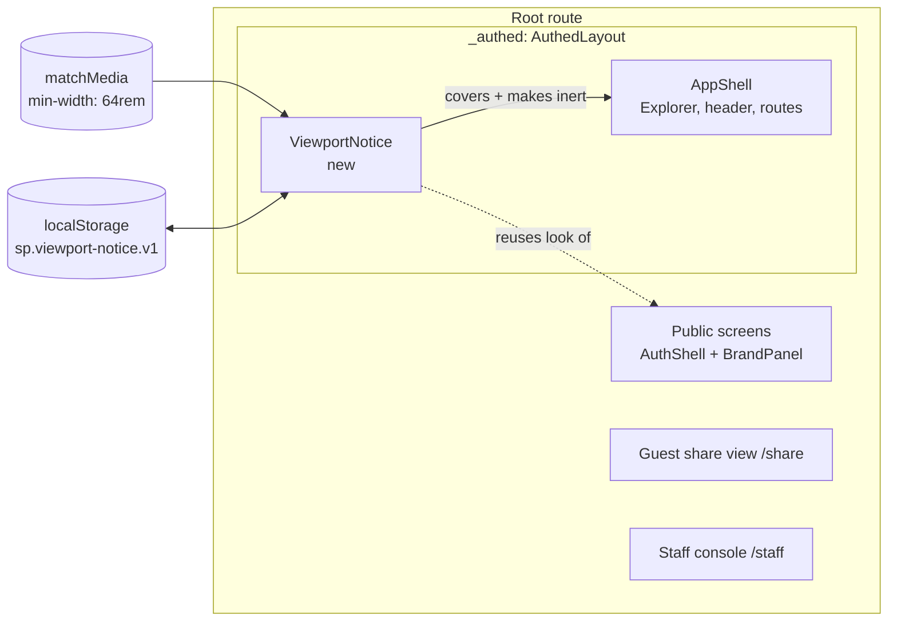
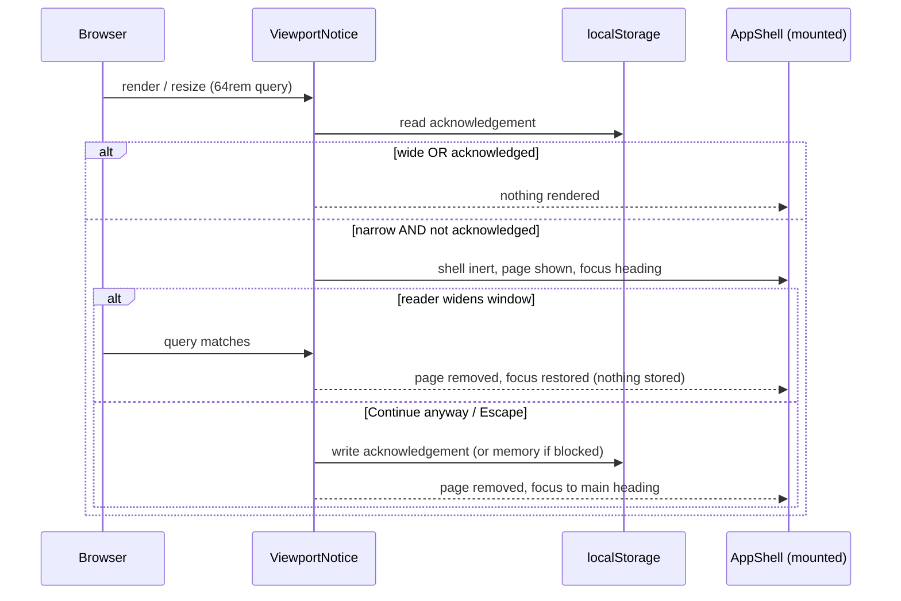
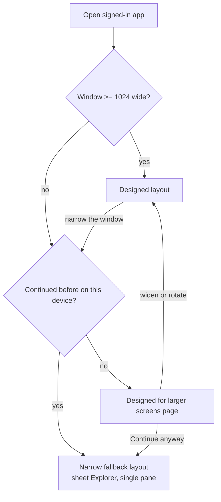

# Feature Spec: A minimum screen size — designed for a laptop or 11-inch tablet and up

- **Status:** Draft — awaiting approval before implementation.
- **Author(s):** Claude Code (feature-analyst), for James Ewbank (product owner)
- **Date:** 2026-10-08
- **Tracking issue / epic:** none yet
- **Roadmap link:** `docs/ROADMAP.md` — Next, "A minimum screen size"
- **Related ADR(s):** ADR-0179 (Proposed, drafted with this spec); amends ADR-0118's coarse width
  list; builds on ADR-0077 (brand surface), ADR-0029 (shell), ADR-0088 D1 (no flag), ADR-0105

## 0. Summary in plain English

**What you asked for.** Stop designing SchedulePoint for phones. Set a smallest screen it is built
for — a laptop, or an 11-inch tablet held sideways — and below that, show a polished page that says
the app is designed for a bigger screen.

**What we recommend.**

1. **The smallest designed screen is 1024 × 600** (width × height, in browser pixels). Every 11-inch
   tablet held sideways is 1180 or wider; every common laptop is 1272 or wider. Your monitor
   (1912 × 948) and your Surface (1912 × 1114) are comfortably above it. We recommend **600 tall,
   not 640**: a common 1366 × 768 laptop leaves only about 608–636 of height once Windows and the
   browser take their share (worked out from your own monitor, §3.2), so 640 would put that laptop
   outside the design.
2. **Below 1024 wide, the signed-in app shows a full-screen, on-brand page** — the same navy panel
   and floating card as the sign-in screen — saying "SchedulePoint is designed for larger screens",
   stating the minimum size and the current window size, with tips (turn the tablet sideways, widen
   the window).
3. **The page has a "Continue anyway" button, and that is the one thing we recommend you keep.**
   Accessibility law-of-the-land (WCAG 2.2 AA, which this project treats as a merge requirement)
   says a page must still work at narrow widths because **people who zoom in get narrow widths on
   big screens**: your own monitor at 200 % zoom is only 956 wide, and a 1366 laptop at 150 % is 911. A page with no way past it locks those people out. With the button, they press it once on
   their device and never see the page again.
4. **What you gain:** nobody designs the phone layout first any more; toolbars, panels and the
   command band are laid out for 1024 and up; the tests that check the workspace at phone width
   (390 px) are retired; the open item "the Gantt shows no chart at 390 px" (#438) is closed as out
   of scope.
5. **What stays:** large touch targets on the Surface (a finger is not a phone thing), keyboard and
   screen-reader support, and a small set of checks that ordinary pages (lists, settings, dialogs,
   sign-in) don't break when someone zooms right in.

**Four questions for you** are in §1.7.

## 1. Business understanding

### 1.1 Problem

The product owner has said three times that this is a desktop product, and the design rules still
say the opposite:

- 2026-09-17: _"remember this isn't a mobile app it's a desktop app"_ —
  `docs/specs/page-composition/feature-spec.md:404`.
- ADR-0146 quotes _"this isn't a mobile app its a desktop app"_ —
  `docs/adr/0146-a-page-has-one-measure-and-a-column-has-a-reason.md:12`, `docs/ROADMAP.md:478`.
- 2026-10-08 (this request): _"i want to drop the phone aspect from this whole application … its
  hamstringing the GUI and layout"_.

The brief agrees with him (`docs/PROJECT_BRIEF.md:30` "Not a mobile-first field app in v1",
`:284` "Screen size ≥ 13" laptop or larger is the target"). But each time the instruction was
adopted **inside one epic** and never written into the standing rules, so the next epic read the
rules and designed small-screen-first again. The rules that say so today:

- `CLAUDE.md` §12 — "**Mobile-first**, and no one-off component styling — ever."
- `docs/UX_STANDARDS.md:18` — "Works and feels good from 320px to widescreen".
- `docs/UX_STANDARDS.md:329-330` — "**Mobile-first.** Design the small-screen experience first; it is
  not a degraded desktop."
- `docs/UX_STANDARDS.md:357-359` — "The TSLD surface must stay usable at every breakpoint the shell
  supports".
- `docs/DESIGN_SYSTEM.md:14` — "**Mobile-first & responsive.** Design for small screens, enhance
  upward."; `:203` "Mobile-first Tailwind defaults".
- `docs/FRONTEND_ARCHITECTURE.md:356-358` — "**Mobile-first.** Base styles target small screens".
- `CLAUDE.md` §15 and `docs/FRONTEND_QUALITY.md:64-65` — performance measured "on a mid-tier mobile
  over 4G".

And gates enforce phone widths on the workspace (inventory in §3.4): a whole CI journey at 390 × 844
(`apps/web/playwright.narrow-shell.config.ts:45`), a 390 px row in the coarse-pointer sweep
(`apps/web/e2e-workspace-fit/command-surface.spec.ts:1058`), and phone-width layout assertions
(`e2e-page-composition/composition.spec.ts:758`, `e2e-workspace-chrome/activities-panel-scroll.spec.ts:277`).

**The cost is real and recorded.** Two of the defects ADR-0110 and ADR-0114 spent milestones on lived
only in the below-`md` single-pane layout (`docs/adr/0110-…:34-37`, `docs/adr/0114-…:265-276`); ADR-0118
M3/M4 repaired plan-header controls at 390 px (`docs/adr/0118-…:184`, `:235`); #438 asks "what is the
Gantt at phone width" (`docs/TECH_DEBT.md:11843`). Meanwhile the floor the product owner actually uses
was **never gated**: the fine-pointer command-surface sweep stops at 1280
(`command-surface.spec.ts:38-43`), so nothing measures 1024.

**Re-verified 2026-10-08 (CLAUDE.md §19.11, "re-verify the problem"):** every line cited above was read
in this worktree on that date.

### 1.2 Users

- **Planner / Org Admin / Contributor / Viewer** — all signed-in roles get the same layout rules;
  the floor is not role-dependent.
- **A low-vision planner who zooms** — on a laptop or monitor, at 150–400 %. Gets a narrow window on
  a big screen. This person is the reason the below-floor behaviour is not a dead end.
- **External Guest** (share link, ADR-0051) — read-only; may well open a link on a phone. Question
  CQ-3.
- **The product owner's devices** — a PC monitor at 1912 × 948 (mouse) and a Surface Pro at
  1912 × 1114, DPR 1.5, finger and stylus (`docs/HANDOFF.md:38-39`).

### 1.3 Primary use cases

1. A planner on a laptop or a sideways 11-inch tablet gets a layout designed for that size.
2. Someone opening the signed-in app in a window narrower than the floor is told, politely and
   on-brand, that it is designed for larger screens — and can carry on.
3. A low-vision planner zoomed in on a laptop dismisses that page once and works normally.
4. Designers and agents stop designing and gating phone layouts.

### 1.4 User journeys

See the user-flow diagram in §4.3. Happy path: open the app at ≥ 1024 → no change at all.
Alternate: open at < 1024 → the "larger screens" page → widen the window (page disappears by
itself) **or** press Continue anyway (page disappears and is not shown again on this device).

### 1.5 Expected outcomes

- The standing rules say "designed from 1024 × 600 up" and stop saying "mobile-first".
- Below the floor, a polished page instead of a cramped layout — with a way through.
- Fewer, more relevant gates: phone-width workspace checks retired; the floor itself gated.
- WCAG 2.2 AA still holds (§3.3).

### 1.6 Success criteria

- **SC-1** No standing rule in `CLAUDE.md` or `docs/*.md` (outside history and specs) says
  "mobile-first" or makes the workspace obligatory at a phone width.
  Verified by `grep -rn "Mobile-first" CLAUDE.md docs/*.md` returning nothing.
- **SC-2** The fine-pointer command-surface sweep includes 1024 × 600 and passes.
- **SC-3** At 1023 px the signed-in app shows the page; at 1024 it does not; pressing Continue
  anyway reaches the product with focus placed, and a reload does not bring the page back.
- **SC-4** The page passes axe (WCAG 2.2 AA tags, `target-size` on), does not overflow at 320 px, and
  is legible under forced colours.
- **SC-5** No Playwright test sets a viewport narrower than 1024 on a signed-in route except the
  page's own journey and the reflow checks listed in §3.4 as kept.

### 1.7 Critical questions (for James)

Answered already (2026-10-08, via the coordinator): the floor is **tablet sideways, about
1024 × 640**; below it, **a polished "designed for a larger screen" page**. The four below change
what gets built.

- **CQ-1 — Height: 600 or 640?** _Recommendation: **600**._ Your monitor loses 132 px of height to
  Windows and the browser (1080 → 948). On a 1366 × 768 laptop the same loss leaves **636**, and a
  bookmarks bar takes it to roughly **608**. At 640, the commonest cheap laptop is outside the
  design. Either way, height never **triggers** the page — only width does (§4.6) — so a short
  window just gets a shorter diagram, never a blocked app.
- **CQ-2 — Is there a "Continue anyway" button?** _Recommendation: **yes, remembered on the
  device**._ The options are compared in §4.7. In short: with the button, the app stays accessible
  and the page still does its job; without it (a hard block), anyone who zooms in — including you
  on your monitor at 200 % — is locked out, and the project would have to formally give up its
  accessibility standard for that case. Detecting "is this a phone?" from the device instead of the
  window is **not reliable** across browsers (§4.7 (b)), so we don't recommend it.
- **CQ-3 — Where does the page appear?** _Recommendation: **only inside the signed-in app.** Not on
  sign-in / sign-up / password screens, not on the staff console, and **not on a guest's share
  link**._ The public screens already work at phone width and are tested there
  (`apps/web/e2e-public/support.ts:22-29`). A guest opening a share link on site, on a phone, is a
  real case: the guest view is read-only, already checked at 320 px
  (`apps/web/e2e-share/share.spec.ts:175-181`), and putting a wall in front of a client or
  subcontractor you sent a link to is the wrong first impression. (If you'd rather guests see it
  too, it is the same page with the same button — a small change.)
- **CQ-4 — 11-inch tablets held upright (portrait, ~820–834 wide).** _Recommendation: **below the
  floor — they see the page, with "turn your tablet sideways" as the first tip, and can continue
  anyway.**_ Your Surface is about 1272 wide even when upright, so it is above the floor both ways.
  Making iPads in portrait a designed size would pull the floor down to ~820 and give back much of
  the freedom this change buys. We cannot **refuse** portrait outright: WCAG 1.3.4 (Orientation, AA)
  forbids locking an app to one orientation, which is one more reason for the Continue button.

Defaults taken without asking (say if any is wrong):

- **D-a** Continue anyway is remembered **per device** (browser storage), not per sign-in — a
  zoomed user should not meet the same barrier every morning. If storage is unavailable it lasts
  for the visit.
- **D-b** Widening the window past the floor removes the page automatically, without counting as a
  Continue.
- **D-c** No banner or nag is shown after Continue anyway.
- **D-d** No feature flag (ADR-0088 D1). The rollback is the commit.
- **D-e** Performance targets are re-worded from "mid-tier mobile over 4G" to "mid-tier 11-inch
  tablet over 4G" — the slow network on site stays, the phone CPU goes.
- **D-f** Phones are "not supported", not "never": `docs/PROJECT_BRIEF.md` §19's "Mobile field app
  for progress capture" stays a future possibility, which would be its own product decision.

## 2. Functional requirements

### 2.1 User stories & acceptance criteria

> **US-1** — As a planner on a laptop or a sideways 11-inch tablet, I want the app laid out for my
> screen, so that I get the most of the diagram and the commands.
>
> - **Given** a window ≥ 1024 × 600 **when** any signed-in screen renders **then** no command is
>   clipped or pointer-unreachable (the existing command-surface sweep, now including 1024 × 600).
> - **Given** a coarse pointer at ≥ 1024 wide **then** every swept control is ≥ 44 px or a named
>   ADR-0118 / ADR-0177 exception (unchanged house rule).

> **US-2** — As someone opening the signed-in app in a window narrower than 1024, I want to be told
> clearly that it is designed for larger screens and what to do, so that I am not left with a
> cramped layout and no explanation.
>
> - **Given** the window is < 1024 wide and this device has not chosen Continue anyway **when** any
>   route under the signed-in shell renders **then** the "larger screens" page covers it, its
>   heading receives focus, and the rest of the app is inert.
> - **Given** the page is showing **when** the window widens to ≥ 1024 **then** the page disappears,
>   focus returns to where it was (or the shell's main heading), and nothing is stored.
> - **Given** the page is showing **then** it states the minimum (1024 × 600) and the current window
>   size, and the tips match the situation (a coarse pointer gets "turn your tablet sideways" first).

> **US-3** — As a low-vision planner who zooms in, I want to carry on past that page, so that I can
> use the product at the size I need.
>
> - **Given** the page is showing **when** I press Continue anyway (or Escape) **then** the page
>   closes, the app is fully usable, and focus lands on the shell's main heading.
> - **Given** I pressed Continue anyway **when** I reload, sign out and back in, or narrow the
>   window again on this device **then** the page does not reappear.
> - **Given** I continued **then** text, forms, dialogs, menus and lists reflow without sideways
>   scrolling down to 320 px; the diagram, Gantt and data tables may scroll in both directions.

> **US-4** — As the product owner, I want the design rules and tests to stop requiring phone
> layouts, so that new work is designed for the screens the product is used on.
>
> - **Given** M1 has landed **then** SC-1 holds.
> - **Given** M2 has landed **then** SC-2 and SC-5 hold.

### 2.2 Workflows

1. Sign in on any device → land in the signed-in shell.
2. Shell checks: window width < 1024 (`(min-width: 64rem)` does not match — the same query the shell
   already uses, `apps/web/src/components/layout/navigator/app-shell.tsx:19`) **and** no stored
   acknowledgement → show the page as a layer over the mounted shell.
3. The reader either widens / rotates (page goes by itself) or presses Continue anyway (stored,
   page goes).
4. Below the floor after Continue, the existing narrow behaviour applies unchanged: the Project
   Explorer as a sheet below `lg` (ADR-0029, `docs/adr/0029-…:106`), the single-pane workspace below
   `md` (`docs/UX_STANDARDS.md:335-336`).

### 2.3 Edge cases

- **Window narrowed mid-edit** (snap to half a 1920 monitor = 960; open DevTools docked right): the
  page appears **over** the shell; the shell stays mounted, so an open editor, an unsaved form and
  the pen are untouched (ADR-0169 working state survives). Widening removes the page.
- **Rem-based threshold.** `64rem` is 1024 px at the default 16 px font. A reader who raised the
  browser's default font size to 20 px meets the page below 1280 — correct, since their text needs
  the room; and Continue anyway covers them.
- **Storage blocked / private mode**: acknowledgement held in memory for the visit; no error.
- **Height below 600**: never triggers the page; the workspace's vertical budget simply shrinks.
- **Print** (`@media print`): the page never prints; the printed programme is unaffected.
- **Deep link** to a plan opened at < 1024: the page shows over the plan route; Continue reveals
  the plan already loaded.
- **Portrait → landscape rotation** on a tablet: width crosses the floor, page disappears (D-b).
- **Two tabs**: acknowledgement is shared via storage; the other tab picks it up on next check.

### 2.4 Permissions

No permission changes. The page is presentation inside the signed-in shell, shown to every role
equally; it reads nothing from the server. No API, no RBAC, no organisation scope. **Not
structural**: it writes nothing to a plan, so the pen (ADR-0028) is not involved.

### 2.5 Validation rules

None (no input). The stored acknowledgement is a single boolean under one versioned key
(e.g. `sp.viewport-notice.v1`), read defensively: anything other than the expected value is "not
acknowledged".

### 2.6 Error scenarios

- **Storage throws** (quota, blocked) → caught; in-memory for the visit; logged at debug level only.
  No user-visible error.
- **`matchMedia` unavailable** (very old engine / test env) → treated as wide; the page never shows.
  This mirrors the shell's own fallback (`useMediaQuery(query, fallback)`,
  `apps/web/src/components/ui/use-media-query.ts:9`).

## 3. Technical analysis

### 3.1 Impact

- **Frontend — medium.** One new component (the page) mounted in the authed layout; one tiny hook
  for the acknowledgement; no route changes. Docs-heavy.
- **Backend / Database / API — none.** No schema change, so database-architect is not needed.
- **Security — low.** No new data; one non-sensitive local-storage key. CSP unaffected.
- **Performance — negligible.** One media-query listener already exists in the shell.
- **Infrastructure / CI — low.** Playwright configs and one CI step comment change; no new job.
- **Observability — none.**
- **Testing — medium.** Re-scope of several e2e files (§3.4), one acknowledgement fixture, the page's
  own journey.

This spec is mandatory under ADR-0105 / CLAUDE.md §19.1 because it adds a user-facing surface,
changes Playwright configs and a CI step, and changes a shared gate.

### 3.2 The floor — measured where possible, derived where not

**Measured** (the product owner's `/pointer-check.html`, which prints `innerWidth x innerHeight`,
`apps/web/public/pointer-check.js:39`): monitor **1912 × 948**, Surface **1912 × 1114**
(`docs/HANDOFF.md:38-39`). So on a 1920 × 1080 Windows screen the browser and taskbar cost
**132 px of height and 8 px of width**; on the Surface (1920 × 1280 CSS at DPR 1.5) they cost 166.

**Derived** — published logical screen sizes minus that measured overhead. These are estimates and
M0 of the plan records any real reading that disagrees.

- iPad Pro 11" (M4): 1210 × 834 sideways; earlier 11" Pros 1194 × 834. In Safari roughly 1194–1210
  wide × ~740–770 tall.
- iPad Air 11" and iPad 10.9": 1180 × 820 → ~1180 × ~740.
- Surface Go 3/4 (10.5", 150 % default): 1280 × 853 → ~1272 × ~687.
- Surface Pro (yours) upright: ~1272 wide. Above the floor in both orientations.
- Laptop 1366 × 768 at 100 %: ~1358 × **636**; with a bookmarks bar ~**608**.
- Laptop 1920 × 1080 at 125 % (Windows' default on 15–16"): 1536 × 864 → ~1528 × 732.
- Laptop 1920 × 1080 at 150 % (Windows' default on 13–14"): 1280 × 720 → ~1272 × **588**.
- MacBook Air 13": 1440–1470 wide × ~790–860 in Safari.
- **Below the floor:** 11" tablets upright (820–834 wide), every phone.

**Why 1024 wide.** It sits 156 px under the narrowest sideways 11-inch tablet (1180), leaving room for
a tablet at modest zoom; and it is **already** the shell's one structural switch — Tailwind `lg`,
`LG_QUERY = '(min-width: 64rem)'` (`app-shell.tsx:19`), where the pinned Project Explorer becomes a
sheet. Choosing it invents no new breakpoint: "designed" means exactly "the pinned-Explorer shell".
It also means the monitor at up to ~186 % browser zoom (1912 / 1024) is still in the designed range.

**Why 600 tall (CQ-1).** 640 is above both 1366 × 768 readings (608–636). 600 keeps that laptop in.
The 13–14" laptop at 150 % (~588) stays slightly under; because height never triggers the page, it
works with ~12 px less diagram than designed. M0 measures what the workspace gives the diagram at
1024 × 600 before M1 writes the number into the rules (ADR-0113: measure the problem first).

### 3.3 WCAG 2.2 AA — what is and is not given up

CLAUDE.md §13 makes AA a merge requirement. The criteria in play:

- **1.4.10 Reflow (AA).** Content works without two-direction scrolling at **320 CSS px** wide,
  "except for parts of the content which require two-dimensional layout for usage or meaning". The
  W3C's note explains 320 px is a 1280 px window at 400 % zoom, and lists diagrams, maps, data
  tables and "interfaces where it is necessary to keep toolbars in view while manipulating content"
  as two-dimensional examples. (Cited from WCAG 2.2 §1.4.10 and its Understanding document; the
  W3C site was unreachable from this environment, so the wording is from the published standard
  rather than a fetch on this date. This project's own reading of it is at
  `docs/specs/page-composition/feature-spec.md:408-424` and matches.)
- **1.4.4 Resize text (AA)** — 200 % text without loss of content or function. A 1366 laptop at
  200 % is 683 px wide: below the floor.
- **1.3.4 Orientation (AA)** — no locking to portrait or landscape unless essential.
- **2.5.8 Target size (AA)** — 24 px minimum at every width; 2.4.11 Focus not obscured.

**Consequences for the design:**

- **The trigger is the window width, and zoom changes the window width.** So "below the floor" is
  not "on a phone": it includes the product owner's monitor at 200 % (956), a 1366 laptop at 150 %
  (911) and at 200 % (683). A page with **no way past it** removes all content and function from
  those users: a failure of 1.4.10 and of 1.4.4, and — for an upright tablet — of 1.3.4.
- **With Continue anyway** (CQ-2), the content stays one keyboard-reachable press away, the choice
  is remembered, and after it the existing narrow layouts apply. That is the defensible reading: an
  explanatory interstitial that does not remove function. WCAG has no text that names
  interstitials explicitly, so this is a judgement, and **the accessibility-reviewer reviews it
  before M3 ships** (ADR-0111's practice).
- **What is exempt below the floor:** the diagram, the Gantt (chart and grid), the activities table
  and the workspace's command band may scroll in two directions. What is **not** exempt: lists and
  settings pages, dialogs and forms, menus, the Project Explorer sheet, the page itself, public
  screens and the guest view must reflow at 320 px — those gates are **kept** (§3.4).
- **Touch targets are not a phone rule.** ADR-0118's ≥ 44 px under `pointer: coarse` is for the
  Surface and tablets and **stays** at and above the floor. Below the floor only the AA 24 px floor
  is gated (axe `target-size`, already in the narrow-shell journey, `narrow-shell.spec.ts:159-174`).

### 3.4 Inventory — every rule, gate and register row that encodes phone/narrow widths

**Rules (docs) — rewrite in M1:**

1. `CLAUDE.md` §12 "Mobile-first" → "Designed from a laptop or 11-inch tablet up (ADR-0179)".
2. `CLAUDE.md` §13 — add one line: reflow and orientation hold below the floor.
3. `CLAUDE.md` §15, `docs/FRONTEND_QUALITY.md:64-65` — "mid-tier mobile over 4G" → D-e.
4. `docs/UX_STANDARDS.md:18` (principle 4), `:329-338` (Responsive behaviour), `:357-359` (canvas at
   every breakpoint → at and above the floor; below it, keyboard/SR equivalents still owed),
   `:319` (sticky list "covers a tenth of a phone viewport" → "of a short or zoomed viewport").
5. `docs/DESIGN_SYSTEM.md:14` (principle 4), `:201-204` (Breakpoints), `:247-249` (wrap cost stated
   for "a narrow window" — keep, re-scoped to ≥ floor). **Keep** `:817-818` (`fit` columns are `md:`
   so tables reflow at 320) — that is a reflow rule, not a phone rule.
6. `docs/FRONTEND_ARCHITECTURE.md:354-389` (Responsive strategy).
7. `docs/PROJECT_BRIEF.md:30`, `:230`, `:284` — align with the floor.
8. `docs/TESTING.md` — a short "viewports we test" note (designed sizes, floor, reflow checks).

**ADRs — status-line amendments only (ADRs are not rewritten, CLAUDE.md §6):**

- **ADR-0118** — its M4 added 390 × 844 to the coarse width list (`docs/adr/0118-…:235-238`); ADR-0179
  retires that width. Status line gains "amended by ADR-0179".
- Read and **not** amended, because they describe the below-floor fallback that remains: ADR-0029
  (`:106`, Explorer → sheet below `lg`), ADR-0110 (`:34-37`, facts fallback below `md`), ADR-0114
  (`:265-276`), ADR-0101 (`:50`), ADR-0061 (dialog container queries), ADR-0109 (`:66`, `:78`),
  ADR-0146 (`:54`, `fit` and reflow), ADR-0178 (`:88`, non-sticky in-page list). ADR-0112, ADR-0115
  and ADR-0165 were searched and carry no phone or narrow-width obligation.

**Gates and tests — M2 (re-scope) and M3 (the page):**

Retire:

- `e2e-workspace-fit/command-surface.spec.ts:1058` — the 390 × 844 coarse width (ADR-0118 M4). The
  coarse list becomes 1646 × 1097 and **1024 × 600**; 834 × 1112 is retired too unless CQ-4 makes
  portrait a designed size. The Gantt grid's `minWidth: 834` (`:1001`, set because of #438) becomes 1024.
- `e2e-page-composition/composition.spec.ts:748-786` — "subject facts and primary action share one
  line below md" at 375 px. It asserts a **designed** layout below the floor; the 320 px overflow
  check beside it (`:798-811`) keeps the reflow obligation.
- `e2e-public/support.ts:25` — the 375 × 812 "phone" viewport, redundant with 320 × 568 (`:23`).

Re-scope (keep the obligation, drop the phone rationale):

- `playwright.narrow-shell.config.ts:45` and `e2e-narrow-shell/narrow-shell.spec.ts:90,151` — 390 × 844
  → **640 × 480** ("a 1280 window at 200 %"), still below `md` and `lg`, so every branch it exists
  for is entered. M3 makes it the page's journey: assert the page, press Continue anyway, then run
  its existing FR-1…FR-5. Its first run found the Explorer sheet had no background at all
  (`.github/workflows/ci.yml:962-964`) — the below-floor path is still shipped code and still needs a
  browser.
- `e2e-workspace-chrome/activities-panel-scroll.spec.ts:268-298` — 390 → 640 (a broken scroll container
  hides rows, which is lost function in the zoom band).
- `e2e-staff/staff.spec.ts:265-266` — the in-shell not-found check at `[1368, 390]` → `[1368, 320]`:
  the real reflow floor, stricter than today. Risk: may surface a genuine 1.4.10 defect.
- `e2e-share/share.spec.ts:171-181` — keep 320 and 360; re-word "360 is the commonest real phone
  width" to "360 is a 1440 window at 400 %".
- `e2e-public/support.ts:11-29` — re-label 640 × 360 "a 1280 × 720 window at 200 %"; keep 768 and 1024.

Keep unchanged (WCAG reflow or designed-range checks):

- `composition.spec.ts:798-811` (no list screen overflows 320); `staff.spec.ts:1687`, `:1962`
  (`/staff` at 320 — outside the signed-in shell, so the page never shows there);
  `share.spec.ts:165-169`; `public-screens.spec.ts:176`, `:338`;
  `e2e-workspace-chrome/dock.spec.ts:237` (facts survive at 700 — zoom band function);
  `e2e-workspace-chrome/activity-editor-chrome.spec.ts:74-85`; `e2e-gantt/column-widths.spec.ts:179`
  (1024 × 768, in range).

Add:

- `command-surface.spec.ts:38-43` fine-pointer `WIDTHS` gains **1024 × 600** — the floor gated for the
  first time.
- A Playwright fixture that pre-acknowledges the page (`addInitScript` setting the storage key) for
  every suite that deliberately runs a signed-in route below 1024: dock (700), activities-panel
  (640), staff not-found (320), composition (320), the coarse sweep if 834 survives.

**Register rows:**

- **#438 "The Gantt shows no chart at 390 px"** (`docs/TECH_DEBT.md:11834-11845`) — **close as out of
  scope.** Its own "Next" offers "a stated desktop-only surface"; ADR-0179 states it. The Gantt is
  two-dimensional content under 1.4.10. In the zoom band the chart is still visible: with the
  584 px pinned grid (`:11839`), a 956 px window shows 372 px of chart and a 683 px window ~99 px.
  Below ~600 it shows none; the activities table and editor remain the equivalent route.
- **#439** (`:11847-11858`) — stays open (touch-action is a Surface issue); delete its "At 390 px the
  separator … cannot be touched at all (see #438)" clause.
- **#333** (`:10386-10409`, landing two columns cramped at 1280) — unchanged and **inside** the
  designed range; listed as an optional candidate (M4).
- **#215** (dense rows 28 px on touch) — unchanged; coarse is not a phone matter.
- `docs/BACKLOG.md:133` — drop "the Gantt at 390 px (#438)" from the Gantt residue.
- `docs/specs/gantt-coarse-pointer/device-checklist.md` — **not affected.** It tests the Gantt by
  finger and stylus on the Surface and contains no width, portrait or phone step (searched for
  `portrait|rotate|landscape|390|narrow|phone|viewport`: no matches). Item for the hand-off only: if
  the product owner wants, one line is added to try the new page by snapping a window narrow.

### 3.5 Dependencies

- None external. The page reuses `AuthShell`'s visual language (`apps/web/src/components/layout/
auth-shell.tsx:56-61`: the ground gradient, the 900 px floating card, `<Surface tone="auth">`) and
  `BrandPanel` (`brand-panel.tsx:41`), and the existing `Dialog` primitive for top layer, inertness
  and focus.
- M1 must land before M2/M3 so the rules and the gates agree.

## 4. Solution design

### 4.1 Architecture overview

The page lives **only** in `AuthedLayout` (`apps/web/src/routes/authed-layout.tsx:27-33`), so by
construction it never reaches `/sign-in` (`router.tsx:124`), `/share` (`:535`) or `/staff` (`:517-519`),
which are children of the root route (CQ-3's recommendation is the cheap one).

### 4.2 Data flow

### 4.3 User flow

### 4.4 Database changes

None.

### 4.5 API changes

None.

### 4.6 Component changes — the "designed for larger screens" page

**Where:** `apps/web/src/components/layout/viewport-notice/` (layout-level, beside `navigator/`),
mounted once in `AuthedLayout` next to `AppShell`. The ui-architect pass decides one detail before
build: a full-viewport `Dialog` (preferred — it already gives top layer, inertness, focus return and
Escape) versus an `inert` sibling layer.

**Look (ADR-0077, the brand surface):** the full-screen ground gradient (`from-ground to-ground-end`),
the floating 900 px card with `BrandPanel` on the leading half — the sign-in screen's exact
composition, so it reads as a considered page rather than an error. Below `md` the card stacks, as
`AuthShell` already does, and it must not overflow at 320 px.

**Content (copy, en-GB, final wording reviewed by ux-reviewer):**

- Heading (`h1`): **"SchedulePoint is designed for larger screens"**
- Lead: "It is laid out for a laptop, a desktop monitor, or an 11-inch tablet turned sideways — a
  window at least **1024 × 600**. This window is **{w} × {h}**."
- Tips (a short list, ordered by pointer): coarse pointer — "Turn your tablet sideways"; then "Make
  the browser window wider"; then "If you have zoomed in, you can carry on — everything still
  works, it is just arranged for a wider screen."
- Primary action: **Continue anyway**. Secondary text beneath: "We won't show this again on this
  device."
- The `{w} × {h}` reading updates on resize but is **not** announced live (resize noise).

**States:**

1. Hidden — wide, or acknowledged.
2. Shown — narrow, unacknowledged (coarse-pointer variant reorders tips).
3. Dismissed by widening — removed, nothing stored, focus restored.
4. Dismissed by Continue / Escape — stored, focus to the shell's main heading.
5. Storage unavailable — as 4, for the visit only.

**Accessibility:**

- Real `h1`, focused on show (`tabIndex={-1}`), matching `OrgNotFoundScreen`'s pattern
  (`docs/UX_STANDARDS.md:308-314`); Tab reaches Continue anyway; Escape = Continue anyway.
- Everything behind is inert (no focus, no AT reading) while shown.
- Forced colours: card edge and button stay visible (system colours; the focus ring fix of ADR-0146
  applies); the motif is decorative and `aria-hidden`.
- Reduced motion: no entrance animation under `prefers-reduced-motion: reduce` (or none at all).
- Button ≥ 44 px under a coarse pointer, ≥ 36 px fine (ADR-0118).
- Reflows at 320 px; contrast is the brand family's already-computed pairs (ADR-0077 §1(3)).

### 4.7 Implementation approach & alternatives (CQ-2)

**(a) A page with "Continue anyway", remembered per device — recommended.** Keeps the page's
purpose (an honest, polished message) and keeps every user's access. Cost: a reader can choose
the cramped narrow layout, so the narrow fallback stays as shipped code we maintain for function
(not design), and a handful of e2e tests carry the acknowledgement fixture.

**(b) Trigger on the device being small (screen size), not the window — not recommended.** The idea
is to catch phones and spare zoomed laptops. Evidence it cannot be relied on:

- **Firefox reports `screen.width` in CSS pixels that change with zoom**: a 1600 px display read 1600
  at 100 % and **1067 at 150 %**, and Mozilla defended this as the spec's definition
  ([Mozilla bug 1292571](https://bugzilla.mozilla.org/show_bug.cgi?id=1292571); the opposing request
  is [bug 1022006](https://bugzilla.mozilla.org/show_bug.cgi?id=1022006)). So in Firefox a zoomed
  laptop **looks like a small device** — the exact case (b) exists to spare.
- Chrome and Safari were reported to keep `screen.width` fixed under zoom in the same thread, but
  that report is from the Chrome 47 era and nothing current confirms it; and `devicePixelRatio`,
  the usual zoom signal, does not move with zoom in Safari
  ([CSS-Tricks](https://css-tricks.com/can-javascript-detect-the-browsers-zoom-level/),
  [QuirksBlog](https://www.quirksmode.org/blog/archives/2013/12/desktop_media_q_1.html),
  [SiteLint](https://www.sitelint.com/blog/detect-browser-zoom-level)).
- Even if it were reliable, a phone at 320 px is still a 320 px viewport, and 1.4.10 is measured on
  the viewport; a hard block on phones still fails it.

These sources are partly old and disagree; that disagreement **is** the finding. A rule that behaves
differently per browser cannot be gated in Chromium-first CI (CLAUDE.md §17).

**(c) A hard block with no way through — possible only as a recorded deviation, not recommended.**
What it costs, plainly:

- The product would **fail WCAG 2.2 AA** (1.4.10 and 1.4.4 for zoomed users; 1.3.4 for upright
  tablets), and CLAUDE.md §13's "AA is a merge requirement" would need an explicit carve-out.
- It locks out anyone using the app zoomed to roughly 190 % or more on the product owner's monitor
  (1912 / 1024), or 135 % or more on a 1366 laptop.
- Buyers who require accessibility conformance (public-sector and large contractors commonly do)
  would get a documented failure.
- The 320 px reflow gates for signed-in screens would be deleted rather than kept.

Saving: the narrow fallback layouts could be deleted. That saving is real but small next to the
cost, and (a) can still delete them later if usage evidence ever says nobody presses Continue.

**Alternatives also rejected:** a dismissible banner instead of a page (James asked for a polished
page); a native "open on desktop" deep-link (no native app).

## 5. Links

- Implementation plan: [`implementation-plan.md`](implementation-plan.md), beside this spec.
- ADR: [`docs/adr/0179-the-layout-is-designed-from-a-laptop-up.md`](../../adr/0179-the-layout-is-designed-from-a-laptop-up.md)
- Related docs updated by this change: §3.4 "Rules (docs)".
