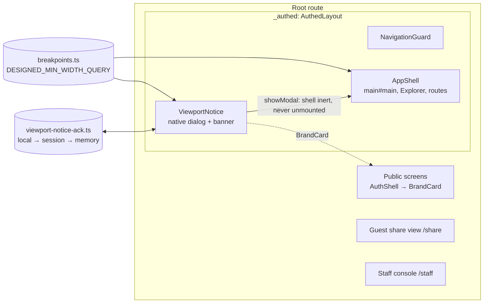
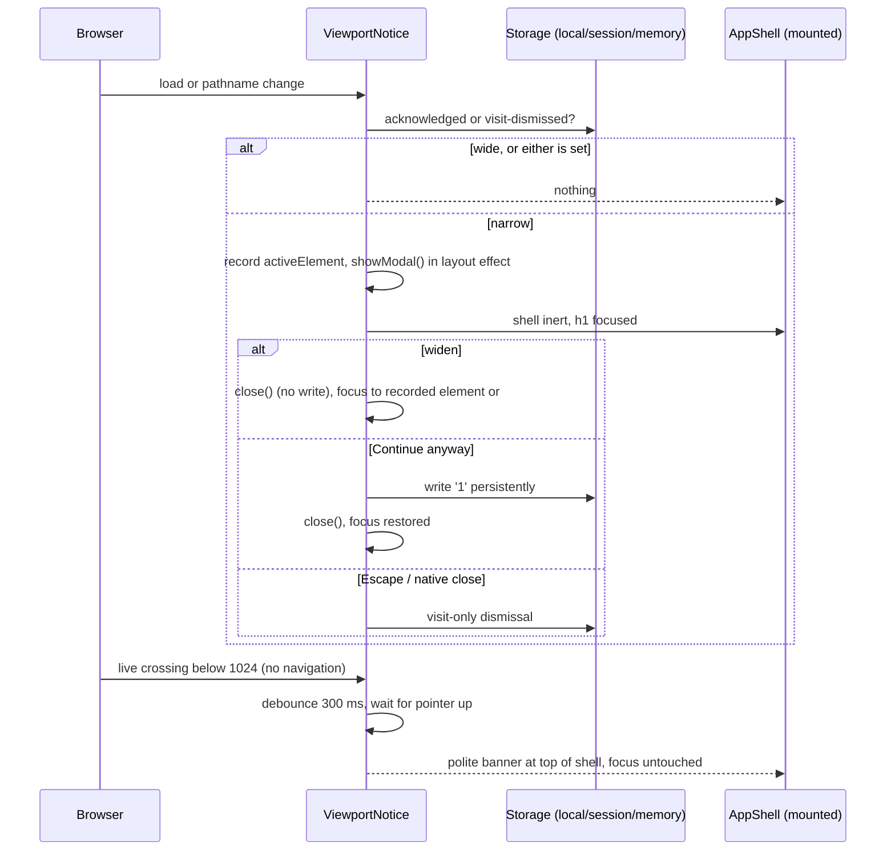
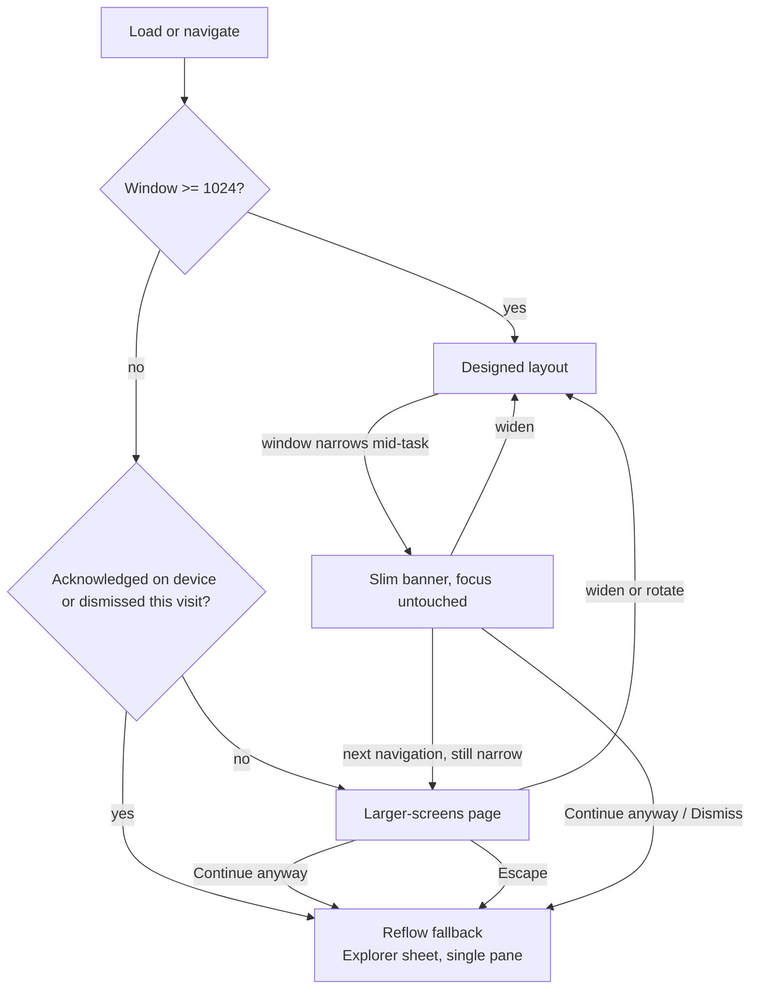

# Feature Spec: A minimum screen size — designed for a laptop or 11-inch tablet and up

- **Status:** Approved — by the product owner, 2026-10-08 ("approve, go with all four recommendations"), after all four reviewers (accessibility, UX, component, ui-architect) agreed on the second pass.
- **Decision:** CQ-1 height floor 600; CQ-2 Continue anyway, remembered per device; CQ-3 signed-in app only; CQ-4 upright tablets see the page with the rotate tip first; CQ-5 keep 1024 ("keep 1024, half-screen is fine with continue").
- **Author(s):** Claude Code (feature-analyst), for James Ewbank (product owner); revised after the
  accessibility, UX, component and ui-architect reviews of 2026-10-08
- **Date:** 2026-10-08
- **Tracking issue / epic:** none yet
- **Roadmap link:** `docs/ROADMAP.md` — Next, "A minimum screen size"
- **Related ADR(s):** ADR-0179 (Accepted, drafted with this spec). Amends ADR-0029 and ADR-0118;
  notes ADR-0030 and ADR-0077. Builds on ADR-0088 D1 (no flag) and ADR-0105.

## 0. Summary in plain English

**What you asked for** (2026-10-08, verbatim): _"i want to drop the phone aspect from this whole
application we should set a minimum screen size that this app works on. its going to be a laptop /
11inch tablet at the very lowest i would say. this is a big thing for me, using this on a phone is not
required and the design rules should reflect this as its hamstringing the GUI and layout"_ — and,
for narrower screens, _"App should just show a screen to the user highlight the app is designed for a
set resolution / minimum screen size. this should be a polished page so it looks amazing"_.

**What we recommend.**

1. **The smallest designed screen is 1024 × 600** (width × height, in browser pixels). Every 11-inch
   tablet held sideways is 1180 or wider, and every common laptop is 1272 or wider. Your monitor
   (1912 × 948) and your Surface (1912 × 1114) are well above it.
2. **We recommend 600 tall, not 640.** A common 1366 × 768 laptop has only about 608–636 pixels of
   height left once Windows and the browser take their share (worked out from your own monitor,
   §3.2). At 640 that laptop would fall outside the design.
3. **Below 1024 wide, the signed-in app shows a polished full-screen page** in the same navy-and-card
   style as the sign-in screen. It says SchedulePoint is designed for screens at least 1024 pixels
   wide, tells you how wide your window is, and gives tips: zoom out, widen the window, or turn the
   tablet sideways. It also shows who you are signed in as, so it never looks like you were signed
   out.
4. **The page has a "Continue anyway" button.** The project requires WCAG 2.2 AA accessibility, and
   that standard expects pages to keep working when people zoom in. Zooming makes a big screen
   behave like a narrow one: your monitor at 200 % zoom is only 956 wide, and a 1366 laptop at 150 %
   is 911. Without the button those people would be locked out. With it, they press it once on their
   device and the page never comes back there. The accessibility reviewer has agreed this approach.
5. **The page never jumps out at you mid-task.** If the window gets narrower while you are working
   (zooming in, or snapping it to half the screen), you get a small strip at the top instead. The
   full page only appears when you next open the app or move to another page.
6. **What you gain:**
   - Nobody designs the phone layout first any more.
   - A committed piece of work makes the app fit properly at 1024: the Project Explorer, the stage
     and the command band are laid out for 1024 and up.
   - The phone-width (390 px) workspace tests are retired.
   - The "Gantt at 390 px" item (#438) is closed as out of scope.
7. **What stays:**
   - Large touch targets on the Surface (a finger is not a phone thing).
   - Keyboard and screen-reader support.
   - Checks that ordinary pages (lists, settings, dialogs, menus, sign-in) still work when someone
     zooms right in. The narrow layouts stay working; they just stop being designed.

**Four questions for you** are in §1.7. A fifth, about half-screen windows, you have already answered:
keep 1024.

## 1. Business understanding

### 1.1 Problem

The product owner has said three times that this is a desktop product, and the design rules still
say the opposite:

- 2026-09-17: _"remember this isn't a mobile app it's a desktop app"_ —
  `docs/specs/page-composition/feature-spec.md:404`.
- ADR-0146 quotes _"this isn't a mobile app its a desktop app"_ —
  `docs/adr/0146-a-page-has-one-measure-and-a-column-has-a-reason.md:12`, `docs/ROADMAP.md:478`.
- 2026-10-08: the request quoted in §0.

The brief agrees with him (`docs/PROJECT_BRIEF.md:30` "Not a mobile-first field app in v1",
`:284` "Screen size ≥ 13" laptop or larger is the target"). But each time, the instruction was
adopted **inside one epic** and never written into the standing rules. So the next epic read the
rules and designed small-screen-first again. The rules that say so today:

- `CLAUDE.md` §12 — "**Mobile-first**, and no one-off component styling — ever."
- `docs/UX_STANDARDS.md:18` — "Works and feels good from 320px to widescreen".
- `docs/UX_STANDARDS.md:329-330` — "**Mobile-first.** Design the small-screen experience first".
- `docs/UX_STANDARDS.md:357-359` — "The TSLD surface must stay usable at every breakpoint the shell
  supports".
- `docs/DESIGN_SYSTEM.md:14` — "**Mobile-first & responsive.**"; `:203` "Mobile-first Tailwind
  defaults".
- `docs/FRONTEND_ARCHITECTURE.md:356-358` — "**Mobile-first.** Base styles target small screens".
- `docs/adr/0029-persistent-hierarchy-navigator.md:110` — "Mobile-first and theme-aware are
  non-negotiable".
- `docs/adr/0030-canvas-first-plan-workspace.md:87` — the single-pane toggle exists because "a phone
  can't usefully split canvas + table".
- `CLAUDE.md` §15 and `docs/FRONTEND_QUALITY.md:64-65` — performance measured "on a mid-tier mobile
  over 4G".

Gates also enforce phone widths on the workspace (inventory in §3.4):

- a whole CI journey at 390 × 844 (`apps/web/playwright.narrow-shell.config.ts:45`);
- a 390 px row in the coarse-pointer sweep
  (`apps/web/e2e-workspace-fit/command-surface.spec.ts:1058`);
- a Pixel 7 phone as the coarse project of the splitting suite
  (`apps/web/playwright.splitting.config.ts:55`);
- phone-width layout assertions (`e2e-page-composition/composition.spec.ts:758`,
  `e2e-workspace-chrome/activities-panel-scroll.spec.ts:277`).

**The cost is real and recorded.**

- Two of the defects that ADR-0110 and ADR-0114 spent milestones on lived only in the below-`md`
  single-pane layout (`docs/adr/0110-…:34-37`, `docs/adr/0114-…:265-276`).
- ADR-0118 M3/M4 repaired plan-header controls at 390 px (`docs/adr/0118-…:184`, `:235`).
- #438 asks "what is the Gantt at phone width" (`docs/TECH_DEBT.md:11843`).
- Meanwhile the floor the product owner actually uses was **never gated**. The fine-pointer
  command-surface sweep stops at 1280 (`command-surface.spec.ts:38-43`), so nothing measures 1024.

**Re-verified 2026-10-08 (CLAUDE.md §19.11, "re-verify the problem"):** every line cited in this spec
was read in this worktree on that date.

### 1.2 Users

- **Planner / Org Admin / Contributor / Viewer** — all signed-in roles get the same layout rules; the
  floor does not depend on role.
- **A low-vision planner who zooms** — on a laptop or monitor, at 150–400 %. They get a narrow window
  on a big screen. This person is the reason the below-floor behaviour is not a dead end.
- **External Guest** (share link, ADR-0051) — read-only, and may well open a link on a phone. See
  CQ-3.
- **The product owner's devices** — a PC monitor at 1912 × 948 (mouse) and a Surface Pro at
  1912 × 1114, DPR 1.5, finger and stylus (`docs/HANDOFF.md:38-39`). Either one snapped to half its
  screen is about 956 wide, which stays below the floor (CQ-5, decided).

### 1.3 Primary use cases

1. A planner on a laptop or a sideways 11-inch tablet gets a layout designed for that size.
2. Someone who opens or navigates the signed-in app in a window narrower than the floor is told,
   politely and on-brand, that it is designed for larger screens — and can carry on.
3. Someone whose window gets narrower mid-task is told quietly, without losing focus or work.
4. A low-vision planner zoomed in on a laptop dismisses the page once and works normally.
5. Designers and agents stop designing and gating phone layouts.

### 1.4 User journeys

See the user-flow diagram in §4.3.

- **Happy path:** open the app at ≥ 1024 → no change at all.
- **Narrow on arrival:** the "larger screens" page appears. The reader either widens the window (the
  page closes by itself) or presses Continue anyway (the page closes and never returns on this
  device).
- **Narrowed mid-task:** a slim banner appears at the top of the shell. Focus stays where it was. The
  full page waits for the next navigation.

### 1.5 Expected outcomes

- The standing rules say "designed from 1024 × 600 up; content still reflows below" and stop saying
  "mobile-first".
- Below the floor: a polished page instead of an unexplained cramped layout, with a way through.
- The app fits properly at 1024 (the "Fit at the floor" milestone).
- Fewer, more relevant gates: the phone-width workspace checks retired, and the floor gated for the
  first time.
- WCAG 2.2 AA still holds (§3.3).

### 1.6 Success criteria

- **SC-1 — no phone rules left.** A case-insensitive search for `mobile|phone|320 ?px|small screen`
  across `CLAUDE.md` and `docs/*.md` (top level, not specs or history) returns only:
  - lines that state the reflow obligation;
  - lines that state that phones are not supported;
  - references to history.

  `docs/UX_STANDARDS.md:18` and `:357-359` are named targets. After the change, `:357-359` says the
  diagram may scroll in both directions below the floor and keeps its keyboard and screen-reader
  equivalents.

- **SC-2 — the floor is gated.** The fine-pointer command-surface sweep includes 1024 × 600, with the
  Explorer at its default width (276), and passes.
- **SC-3 — the page appears where it should.**
  - At 1023 px, arriving at a signed-in route shows the page; at 1024 it does not.
  - Continue anyway reaches the product with focus restored.
  - A reload does not bring the page back.
  - Escape dismisses it for the visit only.
- **SC-4 — no surprises mid-task.** Narrowing the window across 1024 while a field has focus never
  opens the modal and never moves focus. Typed text and the editor's dirty state survive narrowing
  to 700 and widening back.
- **SC-5 — the page itself is accessible.** It passes axe (WCAG 2.2 AA tags, `target-size` on) and
  does not overflow at 320 × 256. Its `h1` and Continue are visible without scrolling at 640 × 480,
  667 × 375, 911 × 424 and 320 × 256. It is legible under forced colours.
- **SC-6 — few narrow tests remain.** No Playwright test sets a viewport narrower than 1024 on a
  signed-in route except the page's own journey and the checks listed as kept in §3.4.

### 1.7 Critical questions (for James)

Already answered (2026-10-08): the floor is **tablet sideways, about 1024 × 640**, and below it there
is **a polished "designed for a larger screen" page**. CQ-1 to CQ-4 below change what gets built;
CQ-5 is recorded as decided.

- **CQ-1 — Height: 600 or 640?** _Recommendation: **600**._
  - Your monitor loses 132 px of height to Windows and the browser (1080 → 948).
  - On a 1366 × 768 laptop the same loss leaves **636**, and a bookmarks bar takes it to about
    **608**. At 640, the commonest cheap laptop is outside the design.
  - Either way, height never triggers the page — only width does — so a short window just gets a
    shorter diagram.
- **CQ-2 — Keep the "Continue anyway" button?** _Recommendation: **yes, remembered on the device**._
  The accessibility reviewer agrees.
  - Without it (a hard block), anyone who zooms in is locked out, including you at 200 % on your
    monitor. The project would have to formally give up its accessibility standard for those people.
  - Detecting "is this a phone?" from the device rather than the window does not work reliably
    across browsers (§4.7 (b)).
- **CQ-3 — Where does the page appear?** _Recommendation: **only inside the signed-in app.**_ Not on
  the sign-in, sign-up or password screens, not on the staff console, and **not on a guest's share
  link**.
  - The public screens already work at phone width and are tested there
    (`apps/web/e2e-public/support.ts:22-29`).
  - A guest opening a share link on site, on a phone, is a real case. The guest view is read-only
    and already checked at 320 px (`apps/web/e2e-share/share.spec.ts:175-181`).
  - Putting a wall in front of a client or subcontractor you sent a link to is the wrong first
    impression. If you would rather guests see it too, it is the same page — a small change.
- **CQ-4 — 11-inch tablets held upright (~820–834 wide).** _Recommendation: **below the floor — they
  see the page, with "turn your tablet sideways" as the first tip, and can continue anyway.**_
  - Your Surface is about 1272 wide even when upright, so it is above the floor both ways.
  - Making iPads in portrait a designed size would pull the floor down to about 820 and give back
    much of the freedom this change buys.
- **CQ-5 — Half a screen. Decided 2026-10-08:** _"keep 1024, half-screen is fine with continue"_.
  - A window snapped to half the monitor or Surface (~956 wide) stays below the floor.
  - It sees the slim strip once; after Continue it uses the existing narrow layout, where the
    Explorer is a pull-out panel.
  - A designed half-screen width (a floor around 940, detached from the shell's 1024 switch) was
    considered and declined.

**Defaults taken without asking** (say if any is wrong):

- **D-a** Continue anyway is remembered **per device**, not per sign-in, so a zoomed user does not
  meet the same barrier every morning.
- **D-b** Widening past the floor closes the page or banner by itself, and does not count as a
  Continue.
- **D-c** After Continue anyway there is no banner and no nag.
- **D-d** No feature flag (ADR-0088 D1). The rollback is the commit.
- **D-e** Performance targets change from "mid-tier mobile over 4G" to "mid-tier 11-inch tablet over
  4G". The slow network on site stays; the phone processor goes.
- **D-f** Phones are "not supported", not "never". `docs/PROJECT_BRIEF.md` §19's "Mobile field app
  for progress capture" stays a future possibility, which would be its own product decision.

## 2. Functional requirements

### 2.1 User stories & acceptance criteria

> **US-1** — As a planner on a laptop or a sideways 11-inch tablet, I want the app laid out for my
> screen, so that I get the most of the diagram and the commands.
>
> - **Given** a window ≥ 1024 × 600 with the Explorer at its default width **when** any signed-in
>   screen renders **then** no command is clipped or pointer-unreachable (the command-surface sweep,
>   now including 1024 × 600).
> - **Given** a coarse pointer at ≥ 1024 wide **then** every swept control is ≥ 44 px or a named
>   ADR-0118 / ADR-0177 exception (unchanged house rule).

> **US-2** — As someone who opens the signed-in app in a window narrower than 1024, I want to be told
> clearly that it is designed for larger screens and what to do, so that I am not left with a cramped
> layout and no explanation.
>
> - **Given** the window is < 1024 wide and this device has neither acknowledged the page nor
>   dismissed it this visit **when** a signed-in route loads or the pathname changes **then** the page
>   opens as a modal over the still-mounted shell, its `h1` receives focus, and the shell is inert.
> - **Given** the page is open **then** it states the minimum width (1024) and the window's current
>   width, shows who is signed in to which organisation, and orders its tips by pointer.
> - **Given** the page is open **when** the window widens to ≥ 1024 **then** it closes, focus returns
>   to the element that held it before (or `#main`), and nothing is stored.

> **US-3** — As a planner whose window gets narrower mid-task, I want to be told without being
> interrupted, so that I don't lose my place.
>
> - **Given** the window crosses below 1024 while the app is in use **then** no modal opens and focus
>   does not move. After ~300 ms below the floor, and never while a pointer button is down, a slim,
>   polite, non-modal banner appears at the top of the shell with Continue anyway and Dismiss.
> - **Given** the banner is showing **when** the window widens to ≥ 1024 **then** it hides at once.
> - **Given** the banner was neither acknowledged nor dismissed **when** the pathname next changes
>   while still narrow **then** the full page opens.

> **US-4** — As a low-vision planner who zooms in, I want to carry on past the page, so that I can use
> the product at the size I need.
>
> - **Given** the page is open **when** I press Continue anyway **then** it closes, focus is restored,
>   and neither the page nor the banner appears again on this device.
> - **Given** the page is open **when** I press Escape **then** it closes for this visit only; a new
>   visit while narrow shows it again.
> - **Given** I continued **then** text, forms, dialogs, menus, lists and the Explorer sheet reflow
>   without two-direction scrolling down to 320 px. Only the diagram, the Gantt, data tables and the
>   command band may scroll both ways.

> **US-5** — As the product owner, I want the rules and tests to stop requiring phone layouts, and the
> app to fit properly at 1024, so that the GUI is designed for the screens it is used on.
>
> - **Given** M1 has landed **then** SC-1 holds.
> - **Given** M2 has landed **then** SC-2 and SC-6 hold.
> - **Given** M4 has landed **then** the Explorer/stage budget at 1024 and the deck order are measured
>   from 1024 up (plan M4).

### 2.2 Workflows

1. The reader signs in on any device and lands in the signed-in shell.
2. `ViewportNotice` sits beside `AppShell` and evaluates `DESIGNED_MIN_WIDTH_QUERY`
   (`'(min-width: 64rem)'`). It checks it:
   - on mount (a load);
   - on every **pathname** change (search-param changes such as selecting an activity or switching
     view do not count, ADR-0123);
   - on every media-query change.
3. On **load or pathname change**, if the window is narrow and the page is neither acknowledged nor
   dismissed this visit, the page opens with `showModal()` from `useLayoutEffect`, so there is no
   first-paint flash.
4. On a **live crossing** (the media query changes with no navigation), if the window is narrow and
   the page is neither acknowledged nor dismissed, the banner shows after a 300 ms debounce, deferred
   while a pointer button is down. The banner hides immediately when the window widens. There is no
   hysteresis band.
5. **Continue anyway** (on the page or the banner) writes the acknowledgement and closes both.
   **Escape**, the dialog's native close, or **Dismiss** on the banner record a visit-only dismissal.
6. Below the floor after either, the existing narrow behaviour applies unchanged: the Explorer as a
   sheet below `lg` (`docs/adr/0029-…:106`) and the single-pane workspace below `md`
   (`docs/UX_STANDARDS.md:335-336`).

### 2.3 Edge cases

- **Window narrowed mid-edit** (zoom, window drag, snap, DevTools docked): banner only. The shell is
  never unmounted and no modal opens, so an open editor, a typed value and its dirty state survive
  (ADR-0169). The journey asserts this (plan M3).
- **Only width triggers.**
  - On-screen keyboards change the visual viewport's height, never the layout width, so they never
    trigger it.
  - Pinch-zoom changes the visual viewport, not the layout viewport that `min-width` media queries
    read, so it never triggers it either.
  - Height below 600 never triggers it; the workspace's vertical budget simply shrinks.
- **The threshold is in rem.** `64rem` is 1024 px at the default 16 px font. A reader who raised the
  browser's default font size to 20 px meets the page below 1280. That is correct, because their text
  needs the room, and Continue anyway covers them.
- **Storage blocked or private mode:**
  - the persistent write falls back to `sessionStorage`, then to module memory;
  - no error is shown.
- **Two tabs:** the `storage` event carries an acknowledgement from one tab to the other.
- **Sign-out:** the acknowledgement is **deliberately not swept**, because it describes the device
  and the reader's eyes, not the account. ADR-0173 keeps column widths per device for the same
  reason.
- **Undoing Continue anyway:** no control is offered; clearing site data resets it. This is an
  accepted limitation, since nothing is lost by not seeing the page.
- **Two modals at once:** if the notice is open on load and the reader presses Back with unsaved work,
  `NavigationGuard`'s dialog (`navigation-guard.tsx:34`) opens above it in the top layer. Closing the
  guard returns to the notice. Chrome may close a modal opened without a user gesture without firing
  `cancel`, so `close` is treated as the source of truth (`useNativeDialogClose`,
  `components/ui/native-dialog-close.ts:22`), and a native close counts as a visit-only dismissal.
- **The pen (ADR-0028):** while the page is open over a plan, the shell is inert but mounted:
  - the edit-lock heartbeat continues, so the pen stays held;
  - `EditLockBanner` (`features/plan-lock/components/EditLockBanner.tsx:45`) is inert, so a peer's
    request cannot be answered;
  - after the grace period the peer's takeover proceeds, exactly as for an idle window.

  This is acceptable because the page appears only on load or navigation, never mid-edit.

- **Print** (`@media print`): neither the page nor the banner prints.
- **Deep link** to a plan opened below 1024: the page opens over the plan route, and closing it
  reveals the plan already loaded.
- **Rotation:** turning a tablet sideways widens it past the floor, and the page closes itself (D-b).

### 2.4 Permissions and the pen

There are no permission changes. The page and banner are presentation inside the signed-in layout,
shown equally to every role. They read nothing from the server except the signed-in identity the
shell already holds. There is no API, no RBAC and no organisation scope.

The notice **writes nothing to a plan**, so it is not a structural write. It **does** interact with
the pen indirectly, as §2.3 records: an open modal makes the edit-lock banner inert while the
heartbeat continues.

### 2.5 Validation rules

There is no input. Storage is read defensively:

- the key is `schedulepoint:viewport-notice-acknowledged`, exported from source so the e2e fixture
  imports the same string;
- only the exact value `'1'` counts as acknowledged;
- any other value, or a read that throws, counts as not acknowledged.

### 2.6 Error scenarios

- **Storage throws** (quota, blocked) → caught; fall back to `sessionStorage`, then module memory. No
  user-visible error.
- **`matchMedia` unavailable** (very old engine, test environment) → treated as wide, so the page
  never shows. The query uses `useMediaQuery(query, true)`, the same wide fallback the shell relies on
  (`apps/web/src/components/ui/use-media-query.ts:9`).

## 3. Technical analysis

### 3.1 Impact

- **Frontend — medium.**
  - One component pair (page and banner) beside `AppShell`.
  - One acknowledgement module and a small breakpoints module.
  - Two extractions: `BrandCard` from `AuthShell`, and `useNativeModal` from `dialog.tsx`/`sheet.tsx`.
  - A one-line Escape guard in the canvas.
  - No route changes.
- **Backend / Database / API — none.** There is no schema change, so database-architect is not
  needed.
- **Security — low.** No new data; one non-sensitive storage key. CSP unaffected.
- **Performance — negligible.** The shell already listens to the same media query.
- **Infrastructure / CI — low.** Playwright configs and CI step comments change; no new job and no new
  suite, so the suite count in `check:counts` is unchanged.
- **Observability — none.**
- **Testing — medium.** See §3.4 and plan M2/M3.

This spec is mandatory under ADR-0105 / CLAUDE.md §19.1, because the change:

- adds a user-facing surface;
- changes Playwright configs and CI steps;
- changes shared gates and shared primitives.

### 3.2 The floor — measured where possible, derived where not

**Measured.** The product owner's `/pointer-check.html` prints `innerWidth x innerHeight`
(`apps/web/public/pointer-check.js:39`). It read:

- monitor **1912 × 948**;
- Surface **1912 × 1114** (`docs/HANDOFF.md:38-39`).

So on a 1920 × 1080 Windows screen the browser and taskbar cost **132 px of height and 8 px of
width**. On the Surface (1920 × 1280 CSS at DPR 1.5) they cost 166 px of height.

**Derived.** These are published logical screen sizes minus that measured overhead. They are
estimates, and M0 records any real reading that disagrees.

- iPad Pro 11" (M4): 1210 × 834 sideways; earlier 11" Pros 1194 × 834. In Safari roughly 1194–1210
  wide × ~740–770 tall.
- iPad Air 11" and iPad 10.9": 1180 × 820 → ~1180 × ~740.
- Surface Go 3/4 (10.5", 150 % default): 1280 × 853 → ~1272 × ~687.
- Surface Pro (yours) upright: ~1272 wide, so above the floor in both orientations.
- Laptop 1366 × 768 at 100 %: ~1358 × **636**; with a bookmarks bar ~**608**.
- Laptop 1920 × 1080 at 125 % (Windows' default on 15–16"): 1536 × 864 → ~1528 × 732.
- Laptop 1920 × 1080 at 150 % (Windows' default on 13–14"): 1280 × 720 → ~1272 × **588**.
- MacBook Air 13": 1440–1470 wide × ~790–860 in Safari.
- **Below the floor:** 11" tablets upright (820–834 wide), any window snapped to half a 1920 screen
  (~956), and every phone.

**Why 1024 wide.**

- It sits 156 px under the narrowest sideways 11-inch tablet (1180), which leaves room for a tablet at
  modest zoom.
- It is **already** the shell's one structural switch: Tailwind `lg`, `LG_QUERY = '(min-width:
64rem)'` (`app-shell.tsx:19`), where the docked Explorer becomes a sheet. So "designed" means "the
  docked-Explorer shell", and no breakpoint is invented.
- The monitor at up to ~186 % browser zoom (1912 / 1024) is still in the designed range.

**The floor includes the Explorer.** It is designed and gated with the Explorer at its **default**
width, 276 (`use-explorer-prefs.ts:25`), which leaves a stage of 748 at 1024. M0 also measures the
Explorer at its maximum (420, `:24`, leaving a stage of 604) and folded (34 px spine). M4 decides the
Explorer/stage budget at the floor.

**Why 600 tall (CQ-1).**

- 640 is above both 1366 × 768 readings (608–636); 600 keeps that laptop in.
- The 13–14" laptop at 150 % (~588) stays slightly under. Height never triggers anything, so it gets
  about 12 px less diagram than designed.
- M0 measures what the workspace gives the diagram at 1024 × 600 before M1 writes the number into the
  rules (ADR-0113: measure the problem first).

**One constant.** The floor lives in one exported constant,
`DESIGNED_MIN_WIDTH_QUERY = '(min-width: 64rem)'`, in a small breakpoints module.

- `app-shell.tsx:19` imports it instead of declaring its own `LG_QUERY`.
- A unit test pins it to Tailwind's `lg` (64rem).
- Two other literals are known drift: `ActivityEditorSession.tsx:677` (`'(min-width: 768px)'`) and
  `plan-workspace-toolbar.tsx:156` (`MD_QUERY`). Migrating them is optional tidy-up.

### 3.3 WCAG 2.2 AA — what is and is not given up

CLAUDE.md §13 makes AA a **project merge requirement**. The criteria in play:

- **1.4.10 Reflow (AA).**
  - Content works without two-direction scrolling at **320 CSS px** wide, "except for parts of the
    content which require two-dimensional layout for usage or meaning".
  - The W3C's note explains that 320 px is a 1280 px window at 400 % zoom. It lists diagrams, maps,
    data tables and "interfaces where it is necessary to keep toolbars in view while manipulating
    content" as two-dimensional examples.
  - The W3C site was unreachable from this environment, so this wording is taken from the published
    WCAG 2.2 text and its Understanding document, not from a fetch on this date.
  - This project's own reading, at `docs/specs/page-composition/feature-spec.md:408-424`, matches.
- **1.4.4 Resize text (AA)** — text at 200 % without loss of content or function. A 1366 laptop at
  200 % is 683 px wide, which is below the floor.
- **2.5.8 Target size (AA)** — 24 px minimum at every width; 2.4.11 Focus not obscured.
- **1.3.4 Orientation (AA)** — **not** what this design turns on. A width floor is not an orientation
  lock: a sideways and an upright window are treated alike, by width. The grounds for a way through
  are 1.4.10 and 1.4.4.

**Consequences for the design:**

- **The trigger is the window width, and zoom changes the window width.** So "below the floor" does
  not mean "on a phone". It includes:
  - the product owner's monitor at 200 % (956);
  - a 1366 laptop at 150 % (911) and at 200 % (683).

  A page with **no way past it** removes all content and function from those users. That fails 1.4.10
  and 1.4.4.

- **A documented minimum size does not take 1.4.10 or 1.4.4 out of a conformance claim.** Stating
  "designed for 1024 and up" is a design statement. It is not an exemption.
- **With Continue anyway (CQ-2):**
  - the content stays one keyboard-reachable press away, and the choice is remembered;
  - after it, the existing narrow layouts apply;
  - the explanatory page therefore does not remove function.

  WCAG has no text that names interstitials, so this is a judgement. **The accessibility-reviewer gave
  its verdict at spec stage (2026-10-08) and agreed.** It re-reviews the built page and banner before
  M3 ships (ADR-0111's practice).

- **What may scroll in two directions below the floor:** the diagram, the Gantt (chart and grid), data
  tables, and the workspace's command band, which is a toolbar kept in view while manipulating
  content.
- **What must reflow at 320 px:** lists and settings pages, dialogs and forms, menus, the Explorer
  sheet, the notice page itself, public screens and the guest view. Those gates are **kept** (§3.4).
- **What is freed is design effort and gates, not the reflow obligation.** Below the floor, content
  must still work. It need not look designed.
- **Touch targets are not a phone rule.**
  - ADR-0118's ≥ 44 px under `pointer: coarse` serves the Surface and tablets, and stays at and above
    the floor.
  - Below the floor, the AA 24 px floor now rests on the narrow-shell journey's axe `target-size`
    check (`narrow-shell.spec.ts:159-174`), run at 320 × 256 after Continue.

### 3.4 Inventory — every rule, gate and register row that encodes phone or narrow widths

**Rules (docs) — rewritten in M1.** The new rule, stated once:

- Tailwind's min-width cascade stays, and `md:`/`lg:` stay legal.
- The layout is **designed** at the floor and up.
- Below the floor, content must reflow (lists, forms, dialogs, menus) but need not look designed.
- The 2-D surfaces (diagram, Gantt, data tables, command band) may scroll.
- The designed layout wins any conflict.

Edits:

1. `CLAUDE.md` §12: "Mobile-first" → "Designed from a laptop or 11-inch tablet up (ADR-0179); content
   still reflows below".
2. `CLAUDE.md` §13: one line saying reflow (1.4.10) and resize text (1.4.4) hold below the floor.
3. `CLAUDE.md` §15 and `docs/FRONTEND_QUALITY.md:64-65`: "mid-tier mobile over 4G" → D-e.
4. `docs/UX_STANDARDS.md`:
   - `:18` (principle 4);
   - `:319` ("a tenth of a phone viewport" → "of a short or zoomed viewport");
   - `:329-338` (Responsive behaviour);
   - `:357-359` (the canvas is designed at and above the floor; below it the diagram may scroll in
     both directions, and its keyboard and screen-reader equivalents are retained).
5. `docs/DESIGN_SYSTEM.md`:
   - `:14` (principle 4);
   - `:201-204` (Breakpoints);
   - `:247-249` (the wrap cost, re-scoped to ≥ floor);
   - **keep** `:817-818` (`fit` columns are `md:` so tables reflow at 320). That is a reflow rule, not
     a phone rule.
6. `docs/FRONTEND_ARCHITECTURE.md:354-389` (Responsive strategy, including the new constant).
7. `docs/PROJECT_BRIEF.md:30`, `:230`, `:284`.
8. `docs/TESTING.md`: a short "viewports we test" note (designed sizes, the floor, the reflow checks).

**ADRs — status-line amendments; the reasoning lives in ADR-0179:**

- **ADR-0029** — `:110` "Mobile-first and theme-aware are non-negotiable" is amended. Mobile-first is
  withdrawn; "no one-off styling" stands.
- **ADR-0030** — `:87` gave "a phone can't usefully split canvas + table" as the reason for the
  below-`md` toggle. The toggle stays as a reflow fallback, and its reason becomes zoom, not phones.
  Noted, not amended.
- **ADR-0118** — M4 added 390 × 844 to the coarse width list (`:235-238`). ADR-0179 retires that
  width. Below 1024 the 24 px floor now rests on the narrow-shell journey's axe `target-size` check.
- **ADR-0077** — its `auth` surface scope gains a signed-in consumer (the notice, via `BrandCard`).
  This is one line; §1's five-condition bar is unaffected, because it is the same scope on the same
  tokens.
- **Read and not amended**, because they describe the fallback that remains: ADR-0110 (`:34-37`),
  ADR-0114 (`:265-276`), ADR-0101 (`:50`), ADR-0061 (dialog container queries), ADR-0109 (`:66`,
  `:78`), ADR-0146 (`:54`) and ADR-0178 (`:88`).
- ADR-0112, ADR-0115 and ADR-0165 were searched and carry no phone or narrow-width obligation.

**Gates and tests — M2 (re-scope) and M3 (the page).**

Retire:

- `e2e-workspace-fit/command-surface.spec.ts:1058`, the 390 × 844 coarse width (ADR-0118 M4).
  - The coarse list becomes 1646 × 1097 and **1024 × 600**.
  - **One 834 × 1112 coarse check is kept**, as axe plus document overflow only (an upright tablet
    after Continue).
  - The Gantt grid's `minWidth: 834` (`:1001`) becomes 1024.
- `e2e-page-composition/composition.spec.ts:748-786` ("subject facts and primary action share one line
  below md", at 375 px). It asserts a **designed** layout below the floor. The 320 px overflow check
  beside it (`:798-811`) keeps the reflow obligation.
- `e2e-public/support.ts:25`, the 375 × 812 "phone" viewport, which is redundant with 320 × 568
  (`:23`).

Re-scope (keep the obligation, drop the phone rationale):

- **The narrow-shell journey.** `playwright.narrow-shell.config.ts:45` and
  `e2e-narrow-shell/narrow-shell.spec.ts:90,151` move from 390 × 844 to **640 × 480** (a 1280 window
  at 200 %). That is still below `md` and `lg`, so every branch it exists for is entered. M3 makes it
  the page's journey (plan M3). After Continue it drives, at **320 × 256**:
  - the Explorer sheet;
  - one dialog (the activity editor);
  - one settings page;
  - a `Menu`;
  - axe with `target-size`;
  - no two-direction scroll except in the diagram, Gantt, tables and command band.

  Its first run found the Explorer sheet had no background at all (`.github/workflows/ci.yml:962-964`).
  The below-floor path is still shipped code and still needs a browser.

- `e2e-workspace-chrome/activities-panel-scroll.spec.ts:268-298`: 390 → 640.
- `e2e-staff/staff.spec.ts:265-266`, the in-shell not-found check: `[1368, 390]` → `[1368, 320]`. That
  is the real reflow floor, and stricter than today.
- `playwright.splitting.config.ts:55`: the `chromium-coarse` project uses `devices['Pixel 7']` (a
  phone). It moves to a touch tablet at ≥ 1024 (for example `hasTouch`, coarse, 1180 × 820).
- `e2e-share/share.spec.ts:171-181`: keep 320 and 360, and re-word "360 is the commonest real phone
  width" to "360 is a 1440 window at 400 %".
- `e2e-public/support.ts:11-29`: re-label 640 × 360 as "a 1280 × 720 window at 200 %"; keep 768 and 1024.

Keep unchanged (WCAG reflow or designed-range checks):

- `composition.spec.ts:798-811`;
- `staff.spec.ts:1687` and `:1962` (`/staff` sits outside the signed-in layout, so the notice never
  shows there);
- `share.spec.ts:165-169`;
- `public-screens.spec.ts:176`, `:338`;
- `e2e-workspace-chrome/dock.spec.ts:237` (the plan's facts survive at 700);
- `e2e-workspace-chrome/activity-editor-chrome.spec.ts:74-85`;
- `e2e-gantt/column-widths.spec.ts:179`.

Add:

- `command-surface.spec.ts:38-43`: the fine `WIDTHS` gain **1024 × 600** (Explorer at default). This
  gates the floor for the first time.
- A **911 × 424** reading (a 1366 laptop at 150 %) in the narrow-shell journey: the page fits, and
  Continue works.
- The resize-survival journey and the no-flicker/no-focus-steal assertion (plan M3).
- An **opt-in** fixture option in `apps/web/e2e-support/test.ts`:
  `test.use({ acknowledgeViewportNotice: true })`.
  - It sets the exported storage key via `addInitScript`.
  - It is never on by default, so the notice's own journey sees the notice.
  - The suites that need it are **derived by grep**, not listed from memory (plan M3-T1).

**Register rows:**

- **#438 "The Gantt shows no chart at 390 px"** (`docs/TECH_DEBT.md:11834-11845`): **closed as out of
  scope.**
  - Its own "Next" offers "a stated desktop-only surface", and ADR-0179 states it.
  - With the 584 px pinned grid (`:11839`), a 956 px window shows 372 px of chart and a 683 px window
    about 99 px.
  - Below ~600 the chart shows none, and the activities table and editor are the equivalent route.
- **#439** (`:11847-11858`): stays open, because touch-action is a Surface issue. Its "At 390 px the
  separator … cannot be touched at all (see #438)" clause is deleted.
- **#333** (`:10386-10409`, the landing's two columns cramped at 1280): inside the designed range. It
  is a named follow-up spec (plan, "Next in line").
- **#215** (dense rows 28 px on touch): unchanged, because coarse pointers are not a phone matter.
- `docs/BACKLOG.md:133`: drop "the Gantt at 390 px (#438)".
- `docs/specs/gantt-coarse-pointer/device-checklist.md`: **not affected**.
  - A search for `portrait|rotate|landscape|390|narrow|phone|viewport` found no matches.
  - The hand-off may add one optional line: snap a window to half the screen and look at the banner.

### 3.5 Dependencies

- None external.
- The page reuses the brand surface through a new presentational **`BrandCard`**. It is extracted
  from `apps/web/src/components/layout/auth-shell.tsx:56-62` (the ground, the floating card,
  `<Surface tone="auth">`, `BrandPanel` from `brand-panel.tsx:41`).
  - It takes `as`, so the notice renders a `div` inside the dialog while `AuthShell` keeps `main`.
  - It takes a content-sized option, so the notice has no fixed `md:h-[40rem]`.
  - The public screens must be visually unchanged; `web:public` is run.
- It reuses **`useNativeDialogClose`** (`components/ui/native-dialog-close.ts:22`).
- A new **`useNativeModal({ ref, open })`** is extracted from the duplicated open→`showModal` effect
  in `dialog.tsx:71` and `sheet.tsx:46`. That is a shared-primitive change, so it is reviewed per
  ADR-0111.
- It does **not** reuse the `Dialog` primitive, which brings an `h2`, an X button and card widths the
  page does not want.
- M1 lands before M2/M3, so that the rules and the gates agree.

## 4. Solution design

### 4.1 Architecture overview

The notice sits **beside** `<AppShell/>` in `apps/web/src/routes/authed-layout.tsx:27-33`. It is never
inside the workspace, never unmounts the shell, and never registers with `UnsavedWorkProvider`.

Because it lives in the signed-in layout, it can never reach `/sign-in` (`router.tsx:124`), `/share`
(`:535`) or `/staff` (`:517-519`), which are children of the root route. CQ-3's recommendation is
therefore the cheap one, and a unit test pins it.

### 4.2 Data flow

### 4.3 User flow

### 4.4 Database changes

None.

### 4.5 API changes

None.

### 4.6 Component changes

**Where:** `apps/web/src/components/layout/viewport-notice/`:

- `ViewportNotice` (the page and the banner);
- `viewport-notice-ack.ts` (the key, read/write, the three storage tiers, the `storage` listener).

Shared changes:

- `apps/web/src/lib/breakpoints.ts` (the constant);
- `components/layout/brand-card.tsx` (extracted);
- `components/ui/use-native-modal.ts` (extracted).

**Mechanism:**

- The page is a native `<dialog>` opened with `showModal()` from `useLayoutEffect`, so there is no
  first-paint flash. It has `role="dialog"`, `aria-labelledby` pointing at the `h1` and
  `aria-describedby` pointing at the lead.
- "Closed" means `close()` on a dialog that **stays mounted**. It is never unmounted.

**Storage idiom — decision.** We write a dedicated `viewport-notice-ack.ts` and do **not** promote
`useFirstUseHint`.

- `useFirstUseHint` (`features/tsld/toolbar/use-first-use-hint.ts:19-48`) stores a JSON map under
  `schedulepoint-hints`. It has no visit-only tier, no `sessionStorage` fallback and no `storage`
  event, and it fails _open_ (shows the hint).
- Extending it would change a working hook's storage shape and semantics for one consumer.
- A unified per-device preference hook is listed as optional tidy-up (plan, Next in line). The cost of
  a fifth idiom is accepted and stated here.

**Look (ADR-0077, the brand surface) via `BrandCard`:**

- the ground gradient and the floating card, sized to its content;
- `BrandPanel` on the leading half, which collapses to a slim strip below `md` or in short windows, so
  the `h1` and Continue fit without scrolling at 640 × 480, 667 × 375, 911 × 424 and 320 × 256;
- **no entrance animation**;
- a **token-built pictogram of a laptop beside a sideways tablet** (inline SVG drawn in
  `currentColor` and brand tokens, `aria-hidden` because the text says the same thing).

To be distinguishable from the signed-out screens, it shows "Signed in as {name} · {organisation}"
and a **Sign out** link.

**Copy (en-GB; final wording reviewed by ux-reviewer).** No sentence claims that "everything still
works".

- `h1`: **"SchedulePoint is designed for larger screens"**
- Lead (`aria-describedby`): "It's designed for screens at least 1024 pixels wide. Your window is
  {w} pixels wide." (Width only, in plain words.)
- Tips (a list with **no focusable controls**):
  - Fine pointer: "Zoom out — press Ctrl and minus, or Ctrl and 0 to reset (⌘ on a Mac)", then "Make
    the browser window wider".
  - Coarse pointer: "Turn your tablet sideways" first, then the same two.
- After the tips: "Zoomed in on purpose? You can continue — the diagram and Gantt will need
  scrolling." Then **Continue anyway**, a secondary (outline) button from the existing `Button`
  variants. Beneath it: "We won't show this again on this device."
- Last: the signed-in line and **Sign out**.
- `{w}` updates on resize and is **not** announced live.

**Focus and order:**

- The `h1` (`tabIndex={-1}`) is focused on open.
- Continue anyway is the first tab stop in DOM order, because the tips contain no links. Sign out
  comes after it.
- On Continue, Escape or widening, native dialog focus restoration returns focus to the
  `activeElement` recorded at open. After `close()`, if `document.activeElement` is not that element
  (gone, or connected but unfocusable — e.g. a tree item inside the closed Explorer `Sheet`, which
  stays mounted, `app-shell.tsx:231-235`), focus goes to
  `<main id="main" tabIndex={-1}>` (`app-shell.tsx:198-203`). The shell has no heading of its own to
  fall back to.

**Banner (live crossing only):**

- a slim, non-modal strip rendered _inside_ the shell's grid as an `auto` row after the skip link —
  never a sibling before `<AppShell/>`, because the shell is `h-dvh … overflow-hidden`
  (`app-shell.tsx:134`) and the skip link must stay first (`app-shell.tsx:135-141`, WCAG 2.4.1); it
  never takes focus;
- its polite live region is mounted empty at all times and only its text changes;
- at 320 × 256 its two buttons stay reachable and do not obscure the focused element (SC 2.4.11) —
  asserted in the narrow-shell journey;
- text: "This window is narrower than SchedulePoint is designed for";
- buttons: **Continue anyway** (persistent) and **Dismiss** (visit-only);
- it waits 300 ms below the floor before showing, never shows while a pointer button is down, and
  hides at once on widening.

**States:**

1. Hidden — wide, acknowledged, or dismissed this visit.
2. Page open — load or navigation while narrow (coarse variant reorders the tips).
3. Banner showing — live crossing while narrow.
4. Closed by widening — nothing stored; focus restored.
5. Continue anyway — persistent; focus restored.
6. Escape, native close or Dismiss — visit-only.
7. Storage unavailable — as 5 or 6, held in `sessionStorage` or memory.

**Accessibility:**

- Everything behind the open page is inert (top layer).
- The shell's Escape handlers must yield to it. `TsldCanvas.tsx:2050-2113`'s window `keydown` listener
  ignores `defaultPrevented` and `aNativeModalIsOpen()`, so M3 adds the one-line guard. That is a
  keyboard change, reviewed by accessibility-reviewer (ADR-0111).
- **Forced colours:** an opaque system-colour card and a visible focus ring on Continue.
  - The hermetic `e2e-forced-colors` suite is public-only, so the notice is checked with
    `page.emulateMedia({ forcedColors: 'active' })` inside the signed-in narrow-shell journey.
  - The existing forced-colours suite continues to cover `BrandCard` on the public screens.
- **Targets:** the buttons are ≥ 44 px under a coarse pointer and ≥ 36 px under a fine one (ADR-0118).
- **Contrast** uses the brand family's already-computed pairs (ADR-0077 §1(3)).

### 4.7 Implementation approach & alternatives (CQ-2)

**(a) A page with Continue anyway, remembered per device — recommended, and agreed by the
accessibility reviewer.**

- It keeps the page's purpose and every user's access.
- Cost: the reflow fallback stays as shipped code, maintained for function, not design.
- Cost: a handful of e2e tests opt in to pre-acknowledgement.

**(b) Trigger on the device being small (screen size) instead of the window — not recommended.** The
idea is to catch phones and spare zoomed laptops. Evidence that it cannot be relied on:

- **Firefox reports `screen.width` in CSS pixels that change with zoom.** A 1600 px display read 1600
  at 100 % and **1067 at 150 %**, and Mozilla defended this as the spec's definition
  ([Mozilla bug 1292571](https://bugzilla.mozilla.org/show_bug.cgi?id=1292571); the opposing request
  is [bug 1022006](https://bugzilla.mozilla.org/show_bug.cgi?id=1022006)). So in Firefox a zoomed
  laptop **looks like a small device**, which is the exact case (b) exists to spare.
- The same thread reported that Chrome and Safari keep `screen.width` fixed under zoom. That report is
  from the Chrome 47 era, and nothing current confirms it.
- `devicePixelRatio`, the usual zoom signal, does not move with zoom in Safari
  ([CSS-Tricks](https://css-tricks.com/can-javascript-detect-the-browsers-zoom-level/),
  [QuirksBlog](https://www.quirksmode.org/blog/archives/2013/12/desktop_media_q_1.html),
  [SiteLint](https://www.sitelint.com/blog/detect-browser-zoom-level)).
- Even if it were reliable, a phone's 320 px is still a 320 px viewport, and 1.4.10 is measured on the
  viewport.

These sources are partly old and disagree, and that disagreement **is** the finding. A rule that
behaves differently per browser cannot be gated in Chromium-first CI (CLAUDE.md §17).

**(c) A hard block with no way through — possible only as a recorded deviation; not recommended.**
What it costs, plainly:

- The product would **fail WCAG 2.2 AA** (1.4.10 and 1.4.4 for zoomed users), and CLAUDE.md §13 would
  need an explicit carve-out.
- It locks out anyone zoomed to about 186 % or more on the product owner's monitor (1912 / 1024), or
  about 135 % or more on a 1366 laptop.
- Buyers who require accessibility conformance (commonly public-sector clients and large contractors)
  would be handed a documented failure.
- The 320 px reflow gates for signed-in screens would be deleted, not kept.
- What it saves: the narrow fallback layouts could be deleted. That saving is real but small next to
  the cost. A named follow-up already removes the worst of them (the single-pane workspace) without
  the block.

**Mid-session behaviour — alternatives.** Raising the modal on any crossing would steal focus from a
field during a zoom or a snap, and would cover work mid-edit. Ignoring crossings entirely would leave
an unexplained cramped layout until the next load. The banner sits between the two (decision
D-when).

**Also rejected:** a native "open on desktop" deep link (there is no native app).

## 5. Links

- Implementation plan: [`implementation-plan.md`](implementation-plan.md), beside this spec.
- ADR: [`docs/adr/0179-the-layout-is-designed-from-a-laptop-up.md`](../../adr/0179-the-layout-is-designed-from-a-laptop-up.md)
- Related docs updated by this change: §3.4 "Rules (docs)".
