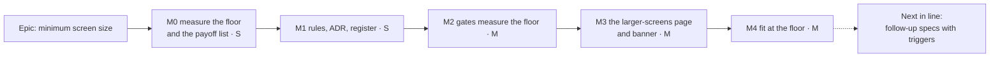

# Implementation Plan: A minimum screen size — designed for a laptop or 11-inch tablet and up

- **Feature spec:** [feature-spec.md](feature-spec.md)
- **Status:** Approved — by the product owner, 2026-10-08, with the spec (all four recommendations).
- **Owner:** web

## Breakdown

### Epic

**A minimum screen size.**

- The layout is designed from 1024 × 600 up.
- Below 1024 wide, the signed-in app shows an on-brand page on load or navigation, and a quiet banner
  when the window narrows mid-session. Both offer a way through.
- Phone-width obligations leave the rules and the gates, and the app is made to fit properly at the
  floor.

Roadmap theme: product direction (`docs/ROADMAP.md`, Next).

**No feature flag** (ADR-0088 D1). A published image carries every flag at its default, so a flag is
never a rollback. Each milestone is one or two commits, and the rollback is the commit.

---

### Milestone M0: Measure the floor, and list the payoff (S)

**Outcome:** the CQ-1 height and the workspace at the floor are measured rather than derived, and
every compromise made for widths under 1024 that is visible at ≥ 1024 is listed. That list is what
M4 spends.

**Ships dark:** a measurement record only; no product change.

#### Feature: floor reading and payoff list

> **Description:** read the workspace at the floor before a number is written into the rules
> (ADR-0113, ADR-0142), and find what the narrow obligation has cost the wide layout.
> **Complexity:** S · **Dependencies:** spec approved.
> **Risks:** the fixed-height budget (ADR-0092; `DOCK_MIN_HEIGHT` 360,
> `e2e-workspace-chrome/dock.spec.ts:254`) may leave too little diagram at 600 with a dock open. If
> so, it is recorded as an M4 input; it does not block.
> **Testing requirements:** none (this is a record).

##### Task M0-T1 — Readings at the floor

- **Description:** using the existing measurement-harness pattern, read at 1024 × 600, 1024 × 640 and
  1272 × 588, both pointers, dock closed and open, with the Explorer at default (276), maximum (420)
  and folded (34):
  - canvas height;
  - deck rows;
  - every clipped or pointer-unreachable control.

  Also take one 911 × 424 reading. Ask the product owner for one `/pointer-check.html` reading on any
  laptop to hand.

- **Complexity:** S · **Dependencies:** — · **Risks:** container Chromium is not the target hardware,
  so this measures layout only and makes no frame-rate claims.
- **Testing:** n/a.
- **Development steps:** take the readings; write `docs/specs/minimum-viewport/m0-measurement.md`.

##### Task M0-T2 — The payoff list

- **Description:** list each compromise made for widths under 1024 that is visible at ≥ 1024. Known
  examples:
  - labels dropped by `showLabel`;
  - wrap and give-way rules defended down to narrow rows (`docs/UX_STANDARDS.md:361-390`);
  - deck group order and captions defended down to 390 (ADR-0118 M3/M4);
  - the `md:` points at which `PageGrid` and the activity editor switch layout.

  Each entry gets the file and line, what it costs at 1024–1440, and whether M4 or a follow-up takes
  it.

- **Complexity:** S · **Dependencies:** — · **Risks:** none.
- **Testing:** n/a.

---

### Milestone M1: The rules say it (S)

**Outcome:** every standing rule says "designed from 1024 × 600 up; content still reflows below", and
ADR-0179 is Accepted with the answered questions.

**Ships dark:** documentation only. M3 surfaces the user-facing page.

#### Feature: rule rewrite

> **Description:** the edits listed in spec §3.4 "Rules", the ADR status lines, and the register rows.
> **Complexity:** S · **Dependencies:** M0, spec approved.
> **Risks:** a missed phone line keeps teaching the old rule. To prevent that, SC-1's grep is run and
> its output quoted in the PR.
> **Testing requirements:** `pnpm prepush` (`check:adr-coverage`, `check:spec-status`, `check:counts`,
> `check:debt-status`).

##### Task M1-T1 — Rewrite the responsive rules

- **Description:** make the spec §3.4 edits (`CLAUDE.md` §12/§13/§15; `UX_STANDARDS.md`;
  `DESIGN_SYSTEM.md`; `FRONTEND_ARCHITECTURE.md`; `FRONTEND_QUALITY.md`; `PROJECT_BRIEF.md`;
  `TESTING.md`). The Tailwind min-width cascade stays, and nothing is rewritten into `max-*`.
- **Complexity:** S · **Dependencies:** — · **Risks:** over-correcting into "nothing works below 1024".
  Every rewritten paragraph keeps the reflow sentence.
- **Testing:** prepush docs gates.
- **Development steps:**
  1. Edit the files. Keep `DESIGN_SYSTEM.md:817-818`.
  2. Link the spec from ADR-0179 and flip it to Accepted. Flip this spec to `Approved` in the same
     commit, so `check:spec-status` S3 stays green.
  3. Add status-line amendments to ADR-0029 and ADR-0118, and update their CLAUDE.md §16 lines. Add
     the ADR-0077 one-liner and the ADR-0030 note.
  4. Add a one-line entry to `docs/DECISIONS.md`.

##### Task M1-T2 — Register rows

- **Description:**
  - close #438 into the Closed-numbers ledger;
  - trim #439's 390 px clause;
  - trim `docs/BACKLOG.md:133`;
  - leave #333 and #215 open.
- **Complexity:** XS · **Dependencies:** M1-T1 · **Risks:** the ledger's row shape. Run
  `check:debt-status`.
- **Testing:** `check:debt-status`.

---

### Milestone M2: The gates measure the floor, not a phone (M)

**Outcome:** the floor is gated, phone-width checks are retired or re-scoped, and the reflow checks
are kept.

**Ships dark:** tests only, plus any small layout fix the floor gate demands.

#### Feature: gate re-scope

> **Description:** every item in spec §3.4 "Gates and tests" except the M3 items (the page, the
> fixture, and the journey additions).
> **Complexity:** M · **Dependencies:** M1.
> **Risks:** adding 1024 × 600 (Explorer at default) may find real clipping at the floor. **A finding
> is fixed inside M2, which makes M2 bigger. It is never landed red and never skipped.** Moving
> `staff.spec.ts` to 320 may find a real 1.4.10 defect; that is fixed too, because it is AA.
> **Testing requirements:** `scripts/e2e-local.sh` for `web:workspace-fit`, `web:narrow-shell`,
> `web:page-composition`, `web:workspace-chrome`, `web:public`, `web:share`, `web:staff`,
> `web:splitting`.

##### Task M2-T1 — Command-surface widths

- **Description:**
  - `command-surface.spec.ts:38-43` gains 1024 × 600, with the Explorer at its default width.
  - `COARSE_WIDTHS` (`:1054-1059`) becomes 1646 × 1097 and 1024 × 600.
  - One 834 × 1112 coarse check is kept, as axe plus document overflow.
  - The Gantt `minWidth` 834 → 1024 (`:1001`).
  - The `:1041-1053` docblock is rewritten to say why 390 left.
- **Complexity:** S · **Dependencies:** — · **Risks:** as above.
- **Testing:** `web:workspace-fit`, both projections.

##### Task M2-T2 — Narrow suites to the zoom band; phone devices out

- **Description:**
  - Narrow-shell journey: 390 × 844 → 640 × 480 (config `:45`, spec `:90`, `:151`, the comment at
    `:159`, and `ci.yml:955-964`).
  - activities-panel-scroll: 390 → 640.
  - staff not-found: `[1368, 390]` → `[1368, 320]`.
  - `playwright.splitting.config.ts:55` (`devices['Pixel 7']`) → a coarse touch tablet at ≥ 1024.
  - Re-label the share and public viewports.
  - Retire `composition.spec.ts:748-786` and `e2e-public/support.ts:25`.
- **Complexity:** S · **Dependencies:** — · **Risks:** at 640 × 480, the narrow-shell FR-4 facts
  assertion depends on the fallback status row being in view. Measure it in the run; do not assume.
- **Testing:** the suites named above.

---

### Milestone M3: The "designed for larger screens" page and banner (M)

**Outcome:**

- A signed-in reader who loads or navigates in a window under 1024 sees the on-brand page.
- A reader whose window narrows mid-task sees a quiet banner instead, and keeps focus and work.
- Continue anyway is remembered on the device; Escape lasts the visit.

**Entry point:** automatic, on any route under the signed-in layout below 1024 CSS px. The controls
are **"Continue anyway"** (page and banner) and **"Dismiss"** (banner).

**Journey** (`e2e-narrow-shell/narrow-shell.spec.ts`, at 640 × 480 unless stated):

1. The page's `h1` is focused. Axe (WCAG 2.2 AA, `target-size` on) is clean. Forced colours are
   checked via `page.emulateMedia({ forcedColors: 'active' })`.
2. The `h1` and Continue are visible without scrolling at 640 × 480, 667 × 375, 911 × 424 and
   320 × 256, and the page does not overflow at 320 × 256.
3. Widening to 1200 closes the page and stores nothing.
4. Escape closes it for the visit; a fresh context while narrow shows it again.
5. Continue anyway closes it and restores focus; a reload does not show it.
6. At 320 × 256 after Continue, drive:
   - the Explorer sheet;
   - the activity editor;
   - one settings page;
   - a `Menu`;
   - axe with `target-size`;
   - an assertion of no two-direction scrolling outside the diagram, Gantt, tables and command band.
7. The existing FR-1…FR-5.

**Resize survival** (same suite, separate test):

1. At 1280, open the activity editor and type into a field.
2. Narrow to 700:
   - no modal opens;
   - focus stays in the field;
   - after ~300 ms the banner is present in a polite region;
   - nothing flickers while the width is dragged across 1024.
3. Widen back: the banner is gone, the typed value is intact, and the editor's dirty state is
   intact.

#### Feature: the notice

> **Description:** spec §4.6.
> **Complexity:** M · **Dependencies:** M2, which leaves fewer suites needing the fixture.
> **Risks:**
> (1) Unmounting would discard work. The dialog stays mounted, `close()` is the only removal, and a
> component test asserts the same DOM node across open and close, with an editor open underneath.
> (2) Suites below 1024 go red when this lands. The opt-in fixture lands in the same commit.
> (3) The `useNativeModal` extraction touches `Dialog` and `Sheet`. Under ADR-0111 that means
> accessibility-reviewer and component-reviewer before it ships, and the existing dialog and sheet
> suites must stay green.
> (4) `BrandCard` must leave the public screens visually unchanged. Run `web:public` before and after.
> **Testing requirements:** the unit tests listed under M3-T3, plus the journeys above.

##### Task M3-T1 — Shared pieces and the fixture

- **Description:**
  - `lib/breakpoints.ts` with `DESIGNED_MIN_WIDTH_QUERY`; `app-shell.tsx:19` imports it; a unit test
    pins it to Tailwind `lg` (64rem).
  - `viewport-notice-ack.ts`:
    - key `schedulepoint:viewport-notice-acknowledged`, read against exactly `'1'`;
    - local storage, then session storage, then module memory;
    - a visit-only tier;
    - a `storage`-event subscription;
    - the key exported for e2e.
  - `useNativeModal({ ref, open })`, extracted from `dialog.tsx:71` and `sheet.tsx:46`.
  - `BrandCard`, extracted from `auth-shell.tsx:56-62`, with `as` and content-sized options.
  - The opt-in fixture option `acknowledgeViewportNotice` in `apps/web/e2e-support/test.ts`.
  - **Derive** which suites need the fixture: grep `setViewportSize|viewport:|devices\[` across
    `apps/web/e2e*/` and `playwright*.config.ts`, including `test.use` blocks. Keep every hit below
    1024 on a signed-in route. Paste the derived list into the PR.
- **Complexity:** S–M · **Dependencies:** — · **Risks:** a fixture switched on by default would hide
  the notice from its own journey, so it is opt-in only.
- **Testing:**
  - unit tests for the breakpoint pin and the storage tiers;
  - the existing `Dialog` and `Sheet` suites;
  - `web:public` unchanged.

##### Task M3-T2 — The page, the banner and the canvas Escape guard

- **Description:**
  - `ViewportNotice`, beside `<AppShell/>` in `authed-layout.tsx`, built per spec §4.6:
    `showModal` from `useLayoutEffect`; triggers on load and pathname change; the debounced banner on
    live crossings, deferred while a pointer is down.
  - Copy and pictogram, with the signed-in line and Sign out.
  - The one-line guard in `TsldCanvas.tsx:2050-2113`'s window `keydown` listener: honour
    `defaultPrevented` and `aNativeModalIsOpen()`.
  - Changeset: `@repo/web` minor.
- **Complexity:** M · **Dependencies:** M3-T1.
- **Risks:** the canvas guard is a keyboard change, so accessibility-reviewer (ADR-0111).
- **Testing:** M3-T3 and the journeys.

##### Task M3-T3 — Unit tests and reviews

- **Description:** unit tests for:
  - `matchMedia` absent → treated as wide, so nothing shows;
  - storage throws → falls back without error;
  - focus returns to the recorded element, or to `#main` when `document.activeElement` is not it after
    `close()` — including the case of an element connected but inside the closed Explorer `Sheet`;
  - the banner renders inside the shell grid after the skip link, its live region present while empty;
  - Escape is visit-only and the button is persistent;
  - the notice never mounts on `/sign-in`, `/share` or `/staff`;
  - pathname changes trigger it and search-param changes do not;
  - the banner never takes focus;
  - the dialog node is the same across open and close.

  Then run accessibility-reviewer (a **re-review of the built page and banner** — the
  Continue-anyway reading itself was agreed at spec stage), ux-reviewer (copy) and component-reviewer
  (`BrandCard`, `useNativeModal`).

- **Complexity:** S · **Dependencies:** M3-T2.
- **Testing:** as listed.
- **Development steps:**
  1. Run `scripts/e2e-local.sh web:narrow-shell`, plus every suite that uses the fixture.
  2. Hand-off note for the product owner: snap a window to half the screen (~956) to see the banner,
     then navigate to see the page.

---

### Milestone M4: Fit at the floor — COMMITTED (M)

**Outcome:** the app is laid out for 1024 and up rather than defended down to 390. This is the payoff
the product owner asked for.

**Entry point:** the plan workspace and the shell at 1024–1440. There is no new control; the existing
surfaces change layout.

**Journey:** the `e2e-workspace-fit` sweep at 1024 × 600 (Explorer at default), plus a
before/after photograph at 1024 and 1280 attached to the PR (ADR-0081's "names its entry point").

#### Feature: floor fit

> **Description:** spend M0-T2's payoff list.
> **Complexity:** M · **Dependencies:** M2 (the floor gate exists), M0 (the list).
> **Risks:** a shared primitive changes (the Explorer's width bounds, the deck order) → ux-reviewer,
> component-reviewer, accessibility-reviewer. Any change to the `Deck` keyboard contract goes through
> ADR-0111.
> **Testing requirements:** `web:workspace-fit` (fine and coarse), `web:workspace-chrome`,
> `web:narrow-shell`, plus updated unit tests for the Explorer bounds.

##### Task M4-T1 — Explorer/stage budget at 1024 (new item)

- **Description:** at 1024 the Explorer at its 420 maximum leaves a 604 px stage. Choose one of the
  following, measured in M0, and implement it:
  - **(a)** clamp the Explorer's effective maximum against the viewport, so the stage never drops
    below a stated width;
  - **(b)** auto-fold the Explorer to its spine below a stated stage width, without overwriting the
    planner's stored preference (`use-explorer-prefs.ts`).
- **Complexity:** S–M · **Dependencies:** M0-T1 · **Risks:** (b) moves the planner's chrome without
  asking. Prefer (a) unless M0 shows (a) is not enough.
- **Testing:** unit tests for the bounds; the workspace-fit sweep.

##### Task M4-T2 — Deck order and label policy measured from 1024 up

- **Description:** re-derive group order, captions and `showLabel` choices at 1024, 1280, 1440 and
  1646, no longer defending them down to 390.
- **Complexity:** M · **Dependencies:** M4-T1.
- **Risks:** this is a `Deck` change, so ADR-0111 review.
- **Testing:** the sweep, and the deck's unit suites.

##### Task M4-T3 — Every wrap and clip the floor sweep reports

- **Description:** M2 fixed anything that turned the gate red. M4 also fixes the wraps and
  near-misses the 1024 sweep reports that are legal but cost the diagram height.
- **Complexity:** S–M · **Dependencies:** M4-T2.
- **Testing:** the sweep; a canvas-height reading compared with M0.

---

### Next in line — named follow-up specs, with triggers

None of these is committed by this plan. Each needs its own spec under ADR-0105.

- **Retire the below-`md` single-pane workspace.** Below the floor, the designed workspace would
  scroll in two directions instead, and the `plan-workspace-toolbar.tsx:670` branch and the outlet
  gating behind ADR-0110/0114's defects would be removed.
  - **Prerequisite:** accessibility agreement that the command band counts as a toolbar kept in view
    under 1.4.10.
  - **Trigger:** M4 has landed, or the next defect found only in the single-pane layout.
- **Landing two columns from `xl`, not `md`** (#333). This changes the shared `PageGrid`.
  - **Trigger:** M4 has landed, or the next report that the landing is cramped at 1024–1280.
- **Optional:** a Gantt default grid width chosen at 1024 (#437); migrating the
  `ActivityEditorSession.tsx:677` and `plan-workspace-toolbar.tsx:156` literals to the breakpoints
  module; one per-device preference hook unifying `useFirstUseHint`, the Explorer and column-width
  preferences, and the notice.

## Sequencing & slices

M0 → M1 → M2 → M3 → M4. Each milestone is releasable on its own:

- M1 and M2 change no product behaviour, apart from fixes the floor gate demands.
- M3 is the first user-visible change and lands with its journey.
- M4 is the payoff.

The Next-in-line items are independent.

## Definition of Done (per task)

Each task's PR must satisfy the Feature Completion Criteria in
[`docs/PROCESS.md`](../../PROCESS.md): code, tests, docs, security, performance, accessibility,
Docker build, CI, changelog, and version impact.

Changesets:

- M1 and M2: none, because there is no user-visible change. The exception is a layout fix forced by
  the floor gate, which carries a patch changeset.
- M3: a `@repo/web` minor changeset.
- M4: a `@repo/web` minor changeset.

## Risks & assumptions (rollup)

- **The Continue reading of 1.4.10 is challenged** — likelihood low, impact high. It was agreed at
  spec stage, and the built surface is re-reviewed before M3 ships.
- **The floor gate finds real clipping at 1024** — medium/medium. Fixed in M2, never skipped.
- **The `useNativeModal` extraction regresses `Dialog` or `Sheet`** — low/high. The existing suites
  stay green, and the ADR-0111 review happens before ship.
- **`BrandCard` changes the public screens** — low/medium. `web:public` is run before and after.
- **The height derivations are wrong on real laptops** — medium/low. M0 asks for one real reading.
  Height never triggers the notice.
- **Suites below 1024 break when M3 lands** — high/low. The fixture is in the same commit, and the
  list of suites needing it is derived by grep.
- **A zoomed user meets the page once per device** — certain/low. Accepted: it is one press, and it
  explains the layout they are about to see.
- **Firefox's `screen.width` behaviour** — not applicable: the design reads the window, never the
  screen.
