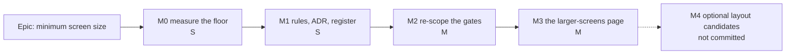

# Implementation Plan: A minimum screen size — designed for a laptop or 11-inch tablet and up

- **Feature spec:** [feature-spec.md](feature-spec.md)
- **Status:** Draft
- **Owner:** web

## Breakdown

### Epic

**A minimum screen size** — the layout is designed from 1024 × 600 up; below it the signed-in app
says so on an on-brand page with a way through; phone-width obligations leave the rules and the
gates. Roadmap theme: product direction (`docs/ROADMAP.md`, Next).

**No feature flag** (ADR-0088 D1): a published image carries every flag at its default, so a flag is
not a rollback. Each milestone is one or two commits and the rollback is the commit.

---

### Milestone M0: Measure the floor (S)

**Outcome:** the height in CQ-1 and the workspace's behaviour at the floor are measured rather than
derived. **Ships dark:** a measurement record, no product change.

#### Feature: floor reading

> **Description:** read what the workspace gives the diagram at 1024 × 600 and 1024 × 640, fine and
> coarse, before a number is written into the rules (ADR-0113, ADR-0142).
> **Complexity:** S · **Dependencies:** spec approved · **Risks:** the workspace's fixed-height
> budget (ADR-0092, `DOCK_MIN_HEIGHT` 360, `e2e-workspace-chrome/dock.spec.ts:254`) may leave too
> little diagram at 600 with a dock open → record it; it informs CQ-1 rather than blocking.
> **Testing requirements:** none (a record).

##### Task M0-T1 — Measure at the floor

- **Description:** with the existing measurement harness pattern, read canvas height, deck rows, and
  any clipped / pointer-unreachable control at 1024 × 600, 1024 × 640 and 1272 × 588, both pointers,
  dock closed and open. Ask the product owner for one `/pointer-check.html` reading on any laptop to
  hand, to confirm the §3.2 derivation.
- **Complexity:** S · **Dependencies:** — · **Risks:** container Chromium is not the target
  hardware → layout only, no frame-rate claims.
- **Testing:** n/a.
- **Development steps:**
  1. Run the readings; write `docs/specs/minimum-viewport/m0-measurement.md`.
  2. If 600 loses a control at the floor, list it as an M2 defect, not a reason to raise the floor.

---

### Milestone M1: The rules say it (S)

**Outcome:** every standing rule says "designed from 1024 × 600 up; reflow below"; ADR-0179 is
Accepted. **Ships dark:** documentation only; M3 surfaces the user-facing page.

#### Feature: rule rewrite

> **Description:** the doc edits in spec §3.4 "Rules", the ADR status flip, the register rows.
> **Complexity:** S · **Dependencies:** M0, spec approved · **Risks:** a missed "mobile-first" line
> keeps teaching the old rule → SC-1's grep is run and quoted in the PR.
> **Testing requirements:** `pnpm prepush` (docs gates: `check:adr-coverage`, `check:spec-status`,
> `check:counts`, `check:debt-status`).

##### Task M1-T1 — Rewrite the responsive rules

- **Description:** `CLAUDE.md` §12/§13/§15; `docs/UX_STANDARDS.md:18`, `:319`, `:327-359`;
  `docs/DESIGN_SYSTEM.md:14`, `:201-204`; `docs/FRONTEND_ARCHITECTURE.md:354-389`;
  `docs/FRONTEND_QUALITY.md:64-65`; `docs/PROJECT_BRIEF.md:30`, `:230`, `:284`; a "viewports we
  test" note in `docs/TESTING.md`. Coding convention stated once: unprefixed styles describe the
  designed layout; narrow fallbacks use `max-lg:` / `max-md:` only where reflow needs them.
- **Complexity:** S · **Dependencies:** — · **Risks:** over-correcting into "nothing works below
  1024" → every rewritten paragraph keeps the reflow sentence.
- **Testing:** prepush docs gates.
- **Development steps:**
  1. Edit the files; keep `DESIGN_SYSTEM.md:817-818` (`fit` is `md:` for reflow) as is.
  2. ADR-0179 → Accepted with the answered CQs; ADR-0118 status line "amended by ADR-0179"; update
     CLAUDE.md §16 lines for both.
  3. `docs/DECISIONS.md` one-line entry.

##### Task M1-T2 — Register rows

- **Description:** close #438 into the Closed-numbers ledger with the reasoning in spec §3.4; trim
  #439's 390 px clause; trim `docs/BACKLOG.md:133`; leave #333 and #215.
- **Complexity:** XS · **Dependencies:** M1-T1 · **Risks:** `check:debt-status` shape → run it.
- **Testing:** `check:debt-status`.
- **Development steps:** edit; run the gate.

---

### Milestone M2: The gates measure the floor, not a phone (M)

**Outcome:** the floor is gated; phone-width workspace checks are retired or re-scoped; reflow checks
kept. **Ships dark:** tests only — no product change.

#### Feature: gate re-scope

> **Description:** every item in spec §3.4 "Gates and tests" except the fixture and the page's
> journey (M3).
> **Complexity:** M · **Dependencies:** M1 · **Risks:** (1) adding 1024 × 600 to the fine sweep
> finds real clipping at the floor → that is the point; fix in this milestone if small, else file a
> row and keep the gate red-free by fixing first, never by skipping; (2) `staff.spec.ts` at 320
> finds a real 1.4.10 defect in the in-shell not-found → fix it (it is AA).
> **Testing requirements:** `scripts/e2e-local.sh web:workspace-fit`, `web:narrow-shell`,
> `web:page-composition`, `web:workspace-chrome`, `web:public`, `web:share`, `web:staff`.

##### Task M2-T1 — Command-surface widths

- **Description:** `command-surface.spec.ts:38-43` adds 1024 × 600; `COARSE_WIDTHS` (`:1054-1059`)
  becomes 1646 × 1097 and 1024 × 600 (834 only if CQ-4 says designed); Gantt `minWidth` 834 → 1024
  (`:1001`); rewrite the `:1041-1053` docblock to say why 390 left.
- **Complexity:** S · **Dependencies:** — · **Risks:** above.
- **Testing:** `web:workspace-fit`, both projections.
- **Development steps:** edit; run; fix or file anything the floor finds.

##### Task M2-T2 — Narrow suites to the zoom band

- **Description:** narrow-shell 390 × 844 → 640 × 480 (config `:45`, spec `:90`, `:151`, comment
  `:159`, CI comment `ci.yml:955-964`); activities-panel-scroll 390 → 640; staff not-found
  `[1368, 390]` → `[1368, 320]`; share/public re-labels; retire composition `:748-786` and
  public `support.ts:25`.
- **Complexity:** S · **Dependencies:** — · **Risks:** at 640 × 480 the narrow-shell FR-4 facts
  assertion may need the fallback status row in view → measured in the run, not assumed.
- **Testing:** the suites named.
- **Development steps:** edit; run each suite locally; record any retirement's reason in the PR.

---

### Milestone M3: The "designed for larger screens" page (M)

**Outcome:** a signed-in reader in a window under 1024 wide sees the on-brand page, can widen or
continue, and is never shown it again on that device after continuing.
**Entry point:** automatic — any route under the signed-in shell at < 1024 CSS px wide; the control
is the page's **"Continue anyway"** button.
**Journey:** `e2e-narrow-shell/narrow-shell.spec.ts` at 640 × 480: the page's heading is focused; axe
(WCAG 2.2 AA tags, `target-size` on) is clean; widening to 1200 removes it with nothing stored;
narrowing shows it again; Continue anyway removes it and focus is on the main heading; reload →
not shown; then the existing FR-1…FR-5.

#### Feature: the page

> **Description:** spec §4.6.
> **Complexity:** M · **Dependencies:** M2 (fewer suites need the fixture) · **Risks:**
> (1) unmounting the shell would discard an open editor → the page is a layer over a **mounted**
> shell, asserted by a unit test that an editor's working state survives show/hide;
> (2) every suite still below 1024 on a signed-in route goes red → the fixture lands in the same
> commit; (3) the Continue reading of 1.4.10 is a judgement → accessibility-reviewer before ship.
> **Testing requirements:** unit (hook: storage read/write/blocked; component: states 1–5, focus,
> Escape, coarse tip order); e2e journey above; forced-colours check in `e2e-forced-colors`
> (one assertion that the card edge and button are visible); `e2e-public`-style 320 overflow
> assertion on the page itself.

##### Task M3-T0 — ui-architect pass

- **Description:** choose full-viewport `Dialog` vs `inert` layer; confirm it reuses `AuthShell`'s
  ground and `BrandPanel` without a second `main` landmark in the accessibility tree.
- **Complexity:** S · **Dependencies:** — · **Risks:** none.
- **Testing:** n/a. **Development steps:** run ui-architect; record the choice in the ADR.

##### Task M3-T1 — Acknowledgement hook and fixture

- **Description:** `useViewportNotice()` (64rem query via `useMediaQuery`, one versioned storage key,
  memory fallback); Playwright fixture that pre-acknowledges via `addInitScript`; apply it to dock
  (700), activities-panel (640), staff not-found (320), composition (320).
- **Complexity:** S · **Dependencies:** M3-T0 · **Risks:** a fixture applied globally would hide the
  page from its own journey → opt-in per test, never in the shared base.
- **Testing:** unit for the hook; the four suites stay green.

##### Task M3-T2 — The page

- **Description:** component, copy, states, a11y per spec §4.6; mount in `AuthedLayout`; changeset
  (`@repo/web`, minor: a user-visible surface).
- **Complexity:** M · **Dependencies:** M3-T1 · **Risks:** above.
- **Testing:** unit + journey + forced colours + 320 reflow of the page.
- **Development steps:**
  1. Build on `Surface tone="auth"` + `BrandPanel`; no one-off styling.
  2. Journey in narrow-shell; run `scripts/e2e-local.sh web:narrow-shell`.
  3. Reviews: accessibility-reviewer, ux-reviewer (copy), component-reviewer.
  4. Hand-off note: the product owner can see it by snapping a window to half the monitor (956).

---

### Milestone M4 (optional): Use the freedom — candidates, not commitments

Each would be its own spec or register row if wanted. Listed so the gain is visible:

- **Landing two columns from `xl`, not `md`** (#333) — the 1024–1280 band is now the designed low
  end, where columns are 464 px and cramped. S–M (shared `PageGrid`, so a spec under ADR-0105).
- **Retire the below-`md` single-pane workspace** in favour of the designed workspace scrolling
  in two directions below the floor (2-D content under 1.4.10). Removes `plan-workspace-toolbar.tsx:670`'s
  branch and the outlet-gating that caused ADR-0110/0114's defects. M; needs the accessibility
  reviewer to agree the command band counts as a toolbar kept in view.
- **Command deck tuned for 1024** — group order and label policy measured from the floor upward
  rather than defended down to 390. S–M.
- **Gantt default grid width chosen for 1024** — #437's preset framing measured at the floor. S.
- **Denser rows on the landing** (the open `m5-verdict.md` §3 question) now judged at 1024. S.

## Sequencing & slices

M0 → M1 → M2 → M3, each releasable alone: M1 and M2 change no product behaviour; M3 is the only
user-visible change and lands with its journey. M4 items are independent and optional.

## Definition of Done (per task)

Each task's PR must satisfy the Feature Completion Criteria in
[`docs/PROCESS.md`](../../PROCESS.md) (code, tests, docs, security, performance, accessibility,
Docker build, CI, changelog, version impact). M1 and M2 carry no changeset (no user-visible change);
M3 carries a `@repo/web` minor changeset.

## Risks & assumptions (rollup)

- **The Continue reading of 1.4.10 is challenged** — likelihood low, impact high. Accessibility
  review before M3 ships; the fallback layouts stay maintained for function.
- **The floor gate finds real clipping at 1024** — medium / medium. That is the gate working; fix in
  M2.
- **Height derivations are wrong on real laptops** — medium / low. M0 asks for one real reading;
  height never triggers the page, so an error costs diagram height, not access.
- **Suites below 1024 break when M3 lands** — high / low. Fixture in the same commit (M3-T1).
- **The page appears for a zoomed user once per device** — certain / low. Accepted: it is one
  press, and it explains the layout they are about to see.
- **Firefox `screen.width` behaviour changes** — n/a: the design reads the window, never the screen.
