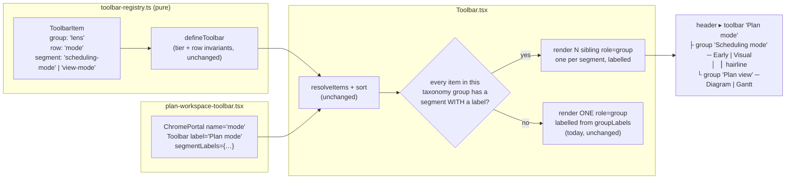
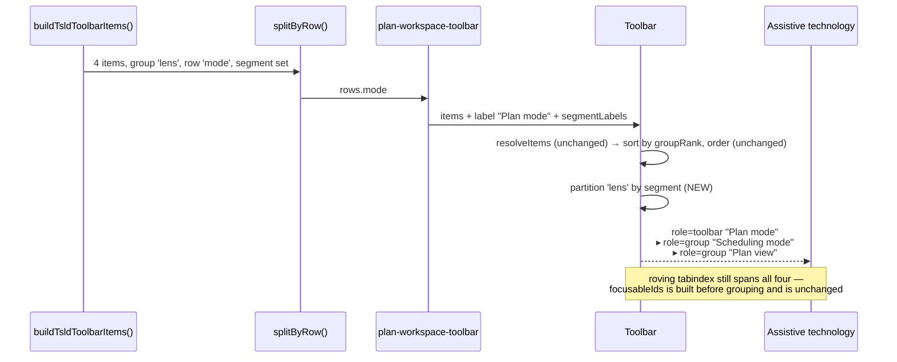
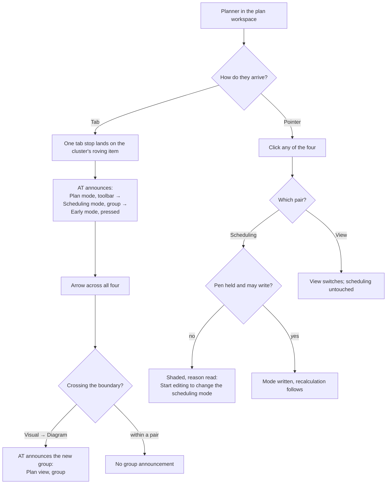

# Feature Spec: Two mode switches, named as two

- **Status:** Draft — awaiting product-owner approval
- **Author(s):** feature-analyst
- **Date:** 2026-08-30
- **Tracking issue / epic:** `docs/TECH_DEBT.md` **#201**
- **Roadmap link:** none — debt register item, workspace chrome
- **Related ADR(s):** ADR-0031 (toolbar registry & taxonomy — **amended, not extended**),
  ADR-0033 (scheduling modes), ADR-0059 (the view seam), ADR-0091 (a mode is not a command),
  ADR-0082 (shade with a reason / omit), ADR-0105 (why this is a spec at all),
  ADR-0109 D1 (the ladder deleted), ADR-0110 D5 (a gate is verified red), ADR-0111 (a primitive's
  keyboard contract), ADR-0112 (the wrapping header row). A **new ADR is required** — see §4.6.

---

## 0. Re-verification of the problem statement (done first, per CLAUDE.md §19)

The row was filed 2026-08-26. ADR-0109/0110/0112/0114/0115/0117/0118 have all worked this surface
since, and this register has repeatedly been found describing behaviour that has changed. Every
claim in #201 was therefore re-derived from the code on **2026-08-30**, before anything was
designed.

| #201's claim                                       | Verdict                                              | Evidence (read, not recalled)                                                                                                                                                                                                                                                                                                                                                  |
| -------------------------------------------------- | ---------------------------------------------------- | ------------------------------------------------------------------------------------------------------------------------------------------------------------------------------------------------------------------------------------------------------------------------------------------------------------------------------------------------------------------------------ |
| Both scheduling-mode items declare `group: 'lens'` | **Holds**                                            | `apps/web/src/features/tsld/toolbar/tsld-toolbar-items.tsx:2324` (`mode-early`), `:2349` (`mode-visual`)                                                                                                                                                                                                                                                                       |
| Both view items declare `group: 'lens'`            | **Holds**                                            | same file `:2380` (`view-tsld`), `:2395` (`view-gantt`)                                                                                                                                                                                                                                                                                                                        |
| One `<Toolbar>` renders all four                   | **Holds**                                            | all four also carry `row: 'mode'` (`:2325`, `:2350`, `:2381`, `:2396`); `plan-workspace-toolbar.tsx:1541-1550` renders `<Toolbar items={rows.mode} label="Plan mode" …>` inside `<ChromePortal name="mode">` (`:1502`)                                                                                                                                                         |
| The caption is that group's accessible name        | **Holds**                                            | `plan-workspace-toolbar.tsx:121` `ROW_MODE_GROUP_LABELS = { lens: 'Scheduling and view' }`, passed at `:1549`; `Toolbar.tsx:191-201` renders one `<div role="group" aria-label={labels[group]}>` per taxonomy group                                                                                                                                                            |
| The gaps are visually identical                    | **Holds, and provably rather than photographically** | `Toolbar.tsx:197` applies `gap-1` uniformly to every child of a group; the only differentiating chrome — `ml-1 border-l pl-2` (`:199`) — is gated on `i > 0`, i.e. it separates **taxonomy groups**, and all four items are in one. There is no code path by which the gap between `Visual mode` and `Diagram` can differ from the gap between `Early mode` and `Visual mode`. |
| `demotionGroup` distinguishes them                 | **Holds**                                            | `'scheduling-mode'` at `:2335`, `:2355`; `'view-mode'` at `:2386`, `:2400`                                                                                                                                                                                                                                                                                                     |
| `demotionGroup` has no visual or ARIA expression   | **Holds, and is now stronger than filed**            | `demotionGroup` appears in exactly four files: the four item declarations, `toolbar-registry.ts` (the field + two `defineToolbar` invariants, `:284-295`, `:436-471`), `toolbar-registry.test.ts`, and one comment in `app-header.tsx:200`. It appears **nowhere in `Toolbar.tsx` or `Deck.tsx`**.                                                                             |

**One claim is understated and is corrected here.** #201 says `demotionGroup` "only ever affected
width-fit demotion, and ADR-0109 D1 deleted the ladder that consumed it". True — and the field now
has **no runtime consumer at all**. What survives are two `defineToolbar` invariants
(`toolbar-registry.ts:436-453`, `:455-471`) that guard a demotion which cannot happen, and **both
cite `companionsOf`, a function that does not exist**: `rg companionsOf apps/web/src` returns two
comments and no definition. The field is in the state `docs/TECH_DEBT.md` #190 records for
`Toolbar`'s `orientation` prop — dead machinery kept alive by documentation — which matters here
because this change is the moment to either give it an honest job or rename it. See §4.5.

**Nothing has lapsed. The row is live, in full, and the scope is unchanged.** Two things have moved
around it and both make the width question sharper rather than softer: the cluster now sits inside a
**wrapping** header row (ADR-0112 D4), and the pen sentence has left that row for the plan's facts
(ADR-0112 D1), so the slack figures in `docs/specs/one-row-header/m2-measurement.md` are from before
two later epics and must be re-measured rather than quoted (§M0).

**One incidental stale citation found on the way**, unrelated to the fix but inside the file it
touches: `app-header.tsx:197` cites `isWidthConstrained` at `Toolbar.tsx:81-84`. That identifier
exists **nowhere in `apps/web/src` except that comment** (`rg isWidthConstrained apps/web/src` →
one hit), and `Toolbar.tsx:81-87` is the "this toolbar is horizontal, full stop" paragraph. It went
with the ladder at ADR-0109 D1. Folded as a comment repair in M2-T1 rather than filed, because it is
in a file the change already opens and correcting it costs three lines.

---

## 1. Business understanding

### Problem

The plan header carries four buttons under one amber `MODE` caption:

```
MODE   [Early mode] [Visual mode] [Diagram] [Gantt]
```

They are **two unrelated binary switches**. `Early` / `Visual` is ADR-0033's scheduling mode — it
changes how the engine's output is placed and is a **write**, gated on the pen. `Diagram` / `Gantt`
is ADR-0059's view seam — it changes which renderer draws the same data, is a **read**, and is
offered to every role. Nothing in the rendered output says so:

- **To assistive technology** there is one region named "Scheduling and view" holding four
  `aria-pressed` buttons. A serial reader hears four independent booleans, two of which happen to be
  on, with no statement that pressing `Gantt` leaves `Early mode` alone.
- **To a sighted planner** the four are equidistant (`gap-1`, uniformly — see §0), under one caption
  naming a compound. The visual grouping is a lie of omission in exactly the same way.
- **The two sets do not even behave alike**, which is the strongest evidence that they are not one
  set: `mode-early`/`mode-visual` shade with a reason when the caller cannot write
  (`tsld-toolbar-items.tsx:2339-2343`), while `view-tsld`/`view-gantt` carry no `isEnabled` at all
  and are deliberately never shaded (`:2376-2377`). Under one name, a planner without the pen sees
  two of four buttons go quiet with no reason to expect the other two to stay live.

**Why now.** The fix is small and the surface is stable for the first time in six epics: ADR-0109 D1
deleted the width ladder, so the primitive no longer has machinery that must be reasoned about
alongside a rendering change, and `demotionGroup` — the field that already carries the correct
partition — is now inert and can be given an honest job in the same commit.

### Users

| Role                                                  | What changes                                                                                                                              |
| ----------------------------------------------------- | ----------------------------------------------------------------------------------------------------------------------------------------- |
| **Planner** (org role `PLANNER`)                      | Operates both switches. Gains a visible boundary between the pair that changes their schedule and the pair that changes their picture.    |
| **Contributor / Viewer**                              | Operates the view pair only; the scheduling pair is shaded with a reason (ADR-0082). Gains a name that explains why two of four are shut. |
| **Org Admin**                                         | As Planner.                                                                                                                               |
| **External Guest** (ADR-0051)                         | **Unaffected** — the guest `/share` view does not render this toolbar.                                                                    |
| **Screen-reader / keyboard user of any of the above** | The principal beneficiary: two named regions instead of one mis-named one.                                                                |

### Primary use cases

1. A planner switches the scheduling mode without wondering whether it also changes the view.
2. A planner switches Diagram ↔ Gantt without wondering whether it also changes how the plan
   schedules.
3. A screen-reader user arrives at the cluster and is told which two options belong to which
   question.
4. A Contributor understands that the two shaded buttons are one question they may not answer, not
   a general failure of the cluster.

### User journeys

**Happy path (sighted).** Planner opens a plan → the header shows `MODE  Early | Visual ⎪ Diagram |
Gantt` with a hairline between the pairs → they press `Gantt` → the view changes, the scheduling
pair is visibly untouched and visibly on the other side of the divider.

**Happy path (AT).** Same planner tabs to the cluster → "Plan mode, toolbar" → "Scheduling mode,
group" → "Early mode, toggle button, pressed" → Arrow → "Visual mode, toggle button, not pressed" →
Arrow → "Plan view, group" → "Diagram, toggle button, pressed". The group change is the sentence
that is missing today.

**Alternate (no pen).** Contributor arrives → "Scheduling mode, group" → "Early mode, toggle button,
pressed, dimmed, Start editing to change the scheduling mode" → the reason is now scoped to a named
question rather than to an unexplained half of a four-button cluster.

### Expected outcomes

- The programmatic structure and the visual structure both state the partition the product has
  always had internally.
- The compound name "Scheduling and view" — a name that exists only because two things share a
  region — disappears, along with the `ROW_MODE_GROUP_LABELS` override that produced it.
- No pixel of canvas is lost. This is the binding constraint, not a hope (§M0).

### Success criteria

| Criterion                              | Measured by                                                                                                                                                                                                                                                      |
| -------------------------------------- | ---------------------------------------------------------------------------------------------------------------------------------------------------------------------------------------------------------------------------------------------------------------- |
| Two named regions, correctly populated | Unit test on the rendered `rows.mode`: exactly two `role="group"`s, named `Scheduling mode` and `Plan view`, each holding exactly its two buttons; **no** group named `Scheduling and view`. Verified red against today's code.                                  |
| A visible boundary between the pairs   | The existing inter-group hairline appears between `Visual mode` and `Diagram` and nowhere inside a pair. Asserted structurally.                                                                                                                                  |
| No keyboard-model change               | One tab stop into the cluster; Arrow/Home/End still traverse all four; `aria-pressed` unchanged. Asserted in the unit suite and by `e2e-workspace-fit`.                                                                                                          |
| **No vertical cost**                   | `aboveCanvas` unchanged at 1646 and 1920 against the pre-change build, header still one line at 1646/1920 and the mode cluster still one line at every measured width. `measure-toolbar` + the existing `e2e-workspace-fit/pen-status.spec.ts` assertions (§M0). |
| Target size unregressed                | `e2e-workspace-fit/command-surface.spec.ts`, whose `plan header` surface (`root: 'header'`, `command-surface.spec.ts:503`) already sweeps this cluster.                                                                                                          |

### Open questions

**Both CRITICAL questions were answered by the product owner on 2026-08-30, as proposed. The spec
is approved to build.**

**Q1. Sub-group names — ANSWERED 2026-08-30 (product owner): "Scheduling mode" and "Plan view".**
The proposal as put, confirmed. The first is ADR-0033's own word. The second avoids "View", which is
already the deck's `View ▾` trigger name and the `lens` group's default label — `Toolbar.tsx:44-46`
records a UX review rejecting exactly that collision once, and taking it here would give a
screen-reader user one word for a mode group, a menu of lenses and a trigger.

**Q2. The divider's fallback — ANSWERED 2026-08-30 (product owner): ship the ARIA half alone if the
divider costs a line.** §M0 measures it. The ARIA half costs **zero** width; the hairline costs
~13 px (`ml-1 border-l pl-2` = 4 + 1 + 8). So: if the header still fits at **1646** — the product
owner's own screen, and the width ADR-0113's retrospective established two epics had never used —
and `aboveCanvas` is unchanged, both halves ship. If not, **the divider is withdrawn on the
measurement** and gets its own design pass rather than being forced.

**The accepted cost is stated rather than implied:** in that branch half of #201 stays open, and a
sighted planner still meets one undifferentiated four-way group. It was put to the product owner in
those words alongside the alternative — ship both and accept a wrapped header row — which was
declined, because that row is the width ADR-0112 spent an epic buying back and ADR-0113 measured the
canvas at 72 % of the screen partly on that win. A third option, hunting the 13 px elsewhere first,
was declined with it: this surface has had **eight** consecutive width expectations contradicted by
their own measurement, always in the same direction, so a width hunt is the option most likely to
cost time and return nothing (`docs/TECH_DEBT.md` #134's closing observation, which outlived the
mechanism it was filed against).

**Non-critical, defaults stated and proceeding:**

| Question                                                  | Default                                                                                                                                                                                                                                                                                   |
| --------------------------------------------------------- | ----------------------------------------------------------------------------------------------------------------------------------------------------------------------------------------------------------------------------------------------------------------------------------------- |
| Rename `demotionGroup` → `segment`?                       | **Yes.** It has no runtime consumer, its two surviving invariants cite a deleted function, and the change is compiler-enforced and mechanical (4 declarations, 1 field, 2 test blocks). Keeping a name that describes a deleted mechanism while giving it a new one is how #190 happened. |
| Visible per-pair captions as well as names?               | **No.** They cost real width on the row this product is judged on and the hairline plus the caption `MODE` already carry the visual half.                                                                                                                                                 |
| Convert each pair to `SegmentedControl` (APG radiogroup)? | **No** — rejected on evidence, §4.4.                                                                                                                                                                                                                                                      |
| An eighth taxonomy group?                                 | **No** — rejected, §4.4.                                                                                                                                                                                                                                                                  |
| A `VITE_` flag?                                           | **No.** ADR-0088 D1: a `VITE_` constant is inlined at build time and is not an operator rollback. The rollback is a commit boundary.                                                                                                                                                      |
| Does the Gantt-only or Diagram-only build change?         | **No.** Both view items are `isVisible: () => GANTT_VIEW_ENABLED` (`:2389`, `:2403`); with the flag off the `Plan view` group has no items and is not rendered — see the edge cases.                                                                                                      |

---

## 2. Functional requirements

### User stories & acceptance criteria

> **US-1** — As a **screen-reader user**, I want the two mode switches announced as two named
> groups, so that I know which options are alternatives to which.
>
> - **Given** the plan workspace with `VITE_SCHEDULING_MODES` and `VITE_GANTT_VIEW` on, **when** I
>   move focus onto `Early mode`, **then** the enclosing group's accessible name is
>   `Scheduling mode`.
> - **Given** the same, **when** I move focus onto `Diagram`, **then** the enclosing group's
>   accessible name is `Plan view`.
> - **Given** the same, **then** no element in the mode toolbar has the accessible name
>   `Scheduling and view`.
> - **Given** the same, **then** the toolbar's own name is unchanged (`Plan mode`).

> **US-2** — As a **planner**, I want a visible boundary between the two switches, so that the
> picture agrees with the structure.
>
> - **Given** the cluster at any width where it renders on one line, **when** I look at it, **then**
>   a hairline separates `Visual mode` from `Diagram`, and no hairline appears inside either pair.
> - **Given** the cluster, **then** the spacing inside a pair is unchanged from today.

> **US-3** — As a **keyboard user**, I want the cluster to behave exactly as it does today, so that
> a naming fix costs me no muscle memory.
>
> - **Given** focus in the header, **when** I Tab, **then** the cluster takes **one** tab stop, as
>   today.
> - **Given** focus on `Early mode`, **when** I press ArrowRight three times, **then** focus reaches
>   `Visual mode`, `Diagram`, `Gantt` in that order, and a fourth press wraps to `Early mode`.
> - **Given** focus on any of the four, **when** I press Home / End, **then** focus goes to
>   `Early mode` / `Gantt`.
> - **Given** any of the four, **then** its role is `button` with `aria-pressed`, unchanged.

> **US-4** — As a **Contributor**, I want the shaded pair to be named, so that the refusal is
> attached to a question rather than to a region.
>
> - **Given** I cannot change the scheduling mode, **when** I focus `Early mode`, **then** I hear
>   the group name `Scheduling mode`, the button name, its pressed state, that it is dimmed, and the
>   ADR-0082 reason — all unchanged in wording from today except the group name.
> - **Given** the same, **then** `Diagram` and `Gantt` remain unshaded.

> **US-5** — As a **maintainer**, I want a later fifth mode item to be impossible to add without a
> group, so that the partition cannot silently collapse back to one region.
>
> - **Given** a registry item on `row: 'mode'` with no segment key, **when** the structural test
>   runs, **then** it fails and names the item.

### Workflows

1. `buildTsldToolbarItems()` produces the four items, each carrying `group: 'lens'`, `row: 'mode'`
   and a segment key (unchanged except for the field's name).
2. `splitByRow` gives `rows.mode` to `plan-workspace-toolbar.tsx`.
3. `<Toolbar>` resolves and sorts items exactly as today (`Toolbar.tsx:157-170`).
4. **New:** when every item in a taxonomy group carries a segment key and the caller supplied a
   label for each, that taxonomy group renders as N sibling `role="group"` elements — one per
   distinct key, in first-appearance order — instead of one. The outer wrapper carries no role. The
   existing inter-group hairline rule applies between them unchanged.
5. Otherwise the group renders exactly as today. Every existing caller takes this branch.

### Edge cases

| Case                                         | Expected behaviour                                                                                                                                                                                                                                                                      |
| -------------------------------------------- | --------------------------------------------------------------------------------------------------------------------------------------------------------------------------------------------------------------------------------------------------------------------------------------- |
| `VITE_GANTT_VIEW` off                        | `view-tsld`/`view-gantt` are not visible (`:2389`, `:2403`); the `Plan view` group has no items and **is not rendered**. The remaining `Scheduling mode` group is the only one, and — because it is index 0 — carries no hairline. Byte-identical to today apart from the group's name. |
| `VITE_SCHEDULING_MODES` off                  | Mirror image: only `Plan view` renders.                                                                                                                                                                                                                                                 |
| Both flags off                               | `rows.mode` is empty, the `Toolbar` renders no groups, `ChromeSlot`'s `empty:hidden` collapses the section — as today.                                                                                                                                                                  |
| A future third pair on `row: 'mode'`         | Renders as a third named group with its own hairline; the structural test forces a label to exist for it.                                                                                                                                                                               |
| An item on `row: 'mode'` with no segment key | The partition precondition fails, the group falls back to today's single-region rendering, and the structural test fails loudly naming the item (US-5). Fallback rather than a throw, so a mistake degrades to the status quo instead of blanking the header.                           |
| The header wraps to two lines (≤ 1440)       | Unchanged. The cluster is inside the wrapping row and both groups travel together; `pen-status.spec.ts:192-201` already asserts the cluster itself stays one line and continues to.                                                                                                     |
| Coarse pointer / 390 px                      | Unchanged. No control's box changes; only chrome between two of them. Already swept by `command-surface.spec.ts`'s `plan header` surface.                                                                                                                                               |
| Deck (`rows.strip`)                          | **Untouched.** No deck item carries a segment key and the deck's caller passes no label map, so the new branch is unreachable there.                                                                                                                                                    |

### Permissions

No permission changes. Mapped for completeness (ADR-0012):

| Control                      | Gate today                                                                                                     | After     |
| ---------------------------- | -------------------------------------------------------------------------------------------------------------- | --------- |
| `Early mode` / `Visual mode` | `ctx.setSchedulingMode !== null` — i.e. `plan:update` **and** the ADR-0028 pen; shaded with a reason otherwise | identical |
| `Diagram` / `Gantt`          | none — a read, offered to every role                                                                           | identical |

This is chrome. **No API, no schema, no engine, no authorisation surface is touched**, so there is
nothing for `database-architect`, `security-reviewer` or `api-reviewer` to design here (§3).

### Validation rules

One, enforced at build/test time rather than at runtime: **within one taxonomy group, either every
item carries a segment key present in the caller's label map, or the group is not partitioned.**
Partial partition is not a state the product can reach (US-5's test).

### Error scenarios

There is no request, no user input and no failure mode with a status code. The table is stated as
empty deliberately rather than omitted, because the template's presence invites invention.

| Scenario                                                     | Detection | User-facing result | Status |
| ------------------------------------------------------------ | --------- | ------------------ | ------ |
| _(none — this change makes no request and accepts no input)_ | —         | —                  | —      |

---

## 3. Technical analysis

| Area           | Impact                                 | Notes                                                                                                                                                                                                            |
| -------------- | -------------------------------------- | ---------------------------------------------------------------------------------------------------------------------------------------------------------------------------------------------------------------- |
| Frontend       | **medium**                             | One primitive (`Toolbar.tsx`) gains an optional prop and a rendering branch; one registry field is renamed; one consumer (`plan-workspace-toolbar.tsx`) passes labels and **deletes** an override.               |
| Backend        | none                                   | Not imported.                                                                                                                                                                                                    |
| Database       | **none**                               | No model, column, index, constraint or migration — so `database-architect` is not engaged **because there is nothing to design**, not because it was judged small (CLAUDE.md §19.3's distinction).               |
| API            | none                                   | —                                                                                                                                                                                                                |
| Security       | none                                   | No authorisation path, no input, no secret.                                                                                                                                                                      |
| Performance    | **none expected, and measured anyway** | The added DOM is at most one `<div>` per extra group. The real risk is **layout**, not render cost: ~13 px of chrome on a wrapping row whose height is a function of its width (§M0).                            |
| Infrastructure | none                                   | No new Playwright config, no new CI step — the existing `e2e-workspace-fit` and `measure:toolbar` are reused. (Had either been added, ADR-0105 would have required this spec on that ground alone.)              |
| Observability  | none                                   | —                                                                                                                                                                                                                |
| Testing        | **medium**                             | New unit tests on `Toolbar` and on `rows.mode`; one structural test; existing `tsld-toolbar-scheduling-modes.test.tsx` and `Toolbar.test.tsx` updated; `e2e-workspace-fit` re-run and extended by one assertion. |

**The CPM engine is not imported and no migration runs**, so the ADR-0034 recalculation parity gate
is untouched by construction — in its honest form: there is nothing here to hold parity for.

### Dependencies

- **Nothing must land first.** The change is self-contained in `apps/web`.
- **Affected by, not blocking:** `docs/TECH_DEBT.md` #190 (dead primitive props) — the
  `demotionGroup` rename is the same class and is done here rather than filed again.
- **Reviewers:** ADR-0111 applies **only if the keyboard model changes**. The recommended design
  changes none of it — no new listener, no new key claim, no change to `focusableIds`,
  `containerShouldStandDown` or `vetoesKey`. It is nevertheless in the neighbourhood of a shared
  primitive, so `accessibility-reviewer` + `component-reviewer` run before merge (M3), which is what
  §19.13 asks for and what the rejected radiogroup option would have made mandatory.

---

## 4. Solution design

### 4.1 Architecture overview



The registry is **not** given a new concept. The partition already exists in the data
(`demotionGroup`); what changes is that the primitive is allowed to see it.

### 4.2 Data flow



### 4.3 User flow



### 4.4 Implementation approach & alternatives

**Chosen — D-A: a taxonomy group may render as N named sub-groups.**

`Toolbar` gains one optional prop:

```ts
/** Accessible name per segment key. Supplying this partitions any taxonomy group whose items all
 *  carry a key present here; absent, every group renders exactly as before. */
segmentLabels?: Record<string, string>;
```

and one branch in the `groups.map` render (`Toolbar.tsx:191-244`). The consumer passes
`{ 'scheduling-mode': 'Scheduling mode', 'view-mode': 'Plan view' }` and **deletes**
`ROW_MODE_GROUP_LABELS` (`plan-workspace-toolbar.tsx:116-121`, `:1546-1549`), because with the
partition there is no `lens` region left on that row to name and therefore no collision to work
around. The fix removes an override rather than adding one.

Why this and not the others:

- **It changes no keyboard behaviour whatsoever.** `focusableIds` is derived from `resolved`
  before grouping (`Toolbar.tsx:112-115`) and the focus call is a **descendant** query on the
  container (`:148-150`), so an extra wrapper element is invisible to both. One tab stop, same
  Arrow/Home/End, same wrap. That is the property that keeps this out of ADR-0111's hard case.
- **It reuses the divider the register itself proposes**, at its existing values, so there is one
  idiom for "these are different groups" on this surface and not two.
- **It gives the inert `demotionGroup` field an honest job** rather than adding a parallel one.
- **The outer wrapper loses its role**, so the DOM is `toolbar ▸ group ▸ buttons` and **not**
  `toolbar ▸ group ▸ group ▸ buttons`. Nested `role="group"` announcement is inconsistent across
  screen readers and this repository has an **open, undischarged** item about exactly that —
  `docs/TECH_DEBT.md` #154(1), "Real-AT behaviour of `role="group"` + coalesced announcements
  (NVDA / VoiceOver) — NOT observed: no screen reader runs in the build container". Designing a
  second unverifiable nesting question into the fix would be building on the thing we already
  cannot check.

**Rejected — B: render each pair as `SegmentedControl` (APG `radiogroup`).**

This is the semantically ideal answer and the product already owns the primitive
(`components/ui/segmented-control.tsx`), documented at `docs/COMPONENT_LIBRARY.md:254-269` with the
rule _"the choice is semantic, not visual, and getting it backwards misdescribes the control"_ —
which today's four `aria-pressed` buttons arguably do. It is rejected on three pieces of evidence,
not on taste:

1. **Focus follows selection, and one of these pairs is a write.**
   `segmented-control.tsx:73-76` — `move()` calls `onChange(next)` and _then_ focuses. Arrowing
   across a scheduling radiogroup would therefore **change the scheduling mode on every arrow
   press**: a pen-gated write that triggers a recalculation. Making a keyboard user unable to
   traverse the cluster without mutating the plan is materially worse than the defect being fixed.
2. **It cannot express ADR-0082's shading.** `ToolbarButton` carries the whole disabled-with-a-
   reason idiom — `aria-disabled` rather than native `disabled` so the control stays focusable and
   the reason stays reachable (`ToolbarButton.tsx:11-13`, `:151-152`). `SegmentedControl` has no
   disabled state at all. The scheduling pair needs one on every non-writer's screen.
3. **It reverses a documented idiom for no gain in the missing information.** The registry's own
   comment (`tsld-toolbar-items.tsx:2367-2370`) says a segment is _two registry items whose
   `isActive` reads the same state, not one item rendering a control_, precisely so overflow, label
   policy and gating treat each half like every other button. Converting to a `render` item gives
   that up — and the fact that is missing (which two are alternatives) is delivered by D-A anyway.

Recorded honestly: the objection is to **this primitive as built plus this idiom**, not to
radiogroup semantics in the abstract. If the product later wants true radio semantics here it needs
a focus-without-selection mode on `SegmentedControl` and a disabled state, which is its own spec and
squarely ADR-0111 territory.

**Rejected — C: add an eighth (and ninth) taxonomy group.**

Mechanically the _cheapest_ change of all — two entries in `TOOLBAR_GROUPS`, four `group:` edits,
and everything else (the hairline, the per-group `role` and `aria-label`) already works. Rejected
because:

- One new group cannot split a pair from a pair; it needs **two**, and both would be members of a
  taxonomy that `toolbar-registry.ts:19-32` documents as **command** groups in a canonical
  left→right order shared with the deck. ADR-0091's whole thesis is that _a mode is not a command_;
  filing modes as two command groups states the opposite.
- `groupRank` is global, so two new members change the ordering vocabulary of every surface that
  renders a `Toolbar`, to serve one row.
- It is a direct ADR-0031 amendment to a **closed union whose closure is the point** ("a new command
  must pick an existing group, it can't invent one", `:16-17`).

D-A amends ADR-0031's **rendering** ("a group may render as N named sub-groups") while leaving the
taxonomy closed, which is the smaller and more honest amendment.

**Rejected — D: two `<Toolbar>` instances side by side.**

Zero primitive change, and genuinely tempting. Rejected because it costs a **second tab stop** in
the header for a naming fix, and because each toolbar would still render its own `lens`
`role="group"` inside itself — producing "Scheduling mode, toolbar → Display, group" unless both
names are overridden, i.e. the same override problem twice. It also splits `authoringEnabled` across
two components that must not disagree.

### 4.5 The `demotionGroup` → `segment` rename

Included in the same change, defaulted to **yes** (§1 Open questions):

- The field has **no runtime consumer** (§0), and its two surviving `defineToolbar` invariants cite
  `companionsOf`, which does not exist.
- After this change it has exactly one job — naming a segment — and `demotionGroup` describes a
  mechanism deleted at ADR-0109 D1. Keeping the old name while giving it a new meaning is how a
  reader is misled by a field that reads as correct.
- The rename is compiler-enforced: four declarations, one interface field, two test blocks, one
  comment. Nothing can be missed silently.
- The two invariants are **kept**, with their docblocks rewritten to say what they now guard (a
  segment's members share a tier and a row, so a segment cannot be split across surfaces) rather
  than citing a deleted demotion pass.

### 4.6 ADR

**Required.** This changes a shared primitive's public contract and amends ADR-0031's rendering
model. Per `docs/PROCESS.md` "Change management" it is recorded as an ADR — number chosen **at
filing**, not reserved here (ADR-0071 and ADR-0079 both record a number being taken between the plan
and the milestone; the highest filed today is ADR-0118). Its shape:

> **A group of buttons says which of them are alternatives.** The toolbar taxonomy stays closed at
> seven; a taxonomy group may render as N named sub-groups when its items declare one. `segment`
> replaces `demotionGroup`, a field whose mechanism ADR-0109 D1 deleted. Radiogroup semantics are
> rejected with the focus-follows-selection evidence. No WCAG success criterion applies; this is a
> design-system compliance and usability defect (see §4.7), and overstating it would repeat ADR-0082.

### 4.7 The accessibility claim, stated at its true strength

**No WCAG 2.2 success criterion applies**, and that is said plainly because this register records
overstating a citation once (ADR-0082, where a #111 raised as an accessibility blocker turned out to
have no applicable SC).

- **1.3.1 Info and Relationships (A) — does not apply.** It requires that relationships _conveyed
  through presentation_ be programmatically determinable. Here the relationship is conveyed through
  presentation **not at all** (§0: the gaps are provably uniform). There is nothing visual being
  withheld from the accessibility tree; both channels are equally silent.
- **4.1.2 Name, Role, Value (A) — is met.** Each control has a name, the role `button`, and a state
  (`aria-pressed`) that is accurate as a boolean. A set of toggle buttons of which one is pressed is
  a permitted pattern; it is a weaker description than a radiogroup, not an incorrect one.
- **2.4.6 Headings and Labels (AA) — arguably strained but not failed.** "Scheduling and view" _is_
  descriptive of what the region contains. Its fault is that the region should not exist.

**What it actually is:** a **design-system compliance defect** — `docs/COMPONENT_LIBRARY.md:256-257`
states that choosing between "one of a set" and "independent boolean" is semantic and that getting
it backwards misdescribes the control — plus a **usability defect** against ADR-0031's own grouping
intent. That is sufficient reason on its own.

**One forward-looking consequence, which is why the two halves ship together.** 1.3.1 does not apply
today _because_ there is no visual grouping. Adding a hairline **without** the programmatic groups
would create a presentational relationship with no programmatic equivalent — at which point 1.3.1
would apply and would fail. So the divider may ship without the names only over a corpse; the names
may ship without the divider safely (which is exactly the §M0 fallback direction, and it is the safe
one).

### 4.8 Database changes

None.

### 4.9 API changes

None.

### 4.10 Component changes

| File                                                                  | Change                                                                                                                                                                                            |
| --------------------------------------------------------------------- | ------------------------------------------------------------------------------------------------------------------------------------------------------------------------------------------------- |
| `apps/web/src/components/ui/toolbar/toolbar-registry.ts`              | `demotionGroup` → `segment`; docblock rewritten (it currently describes demotion and cites `companionsOf`). Two `defineToolbar` invariants kept, re-explained. **No change to `TOOLBAR_GROUPS`.** |
| `apps/web/src/components/ui/toolbar/Toolbar.tsx`                      | New optional `segmentLabels`; partition branch in the group render; comment repair for the stale `isWidthConstrained` citation is in `app-header.tsx`, not here.                                  |
| `apps/web/src/features/tsld/toolbar/tsld-toolbar-items.tsx`           | Four `demotionGroup:` → `segment:` (`:2335`, `:2355`, `:2386`, `:2400`). No other change.                                                                                                         |
| `apps/web/src/components/layout/workspace/plan-workspace-toolbar.tsx` | Delete `ROW_MODE_GROUP_LABELS` (`:116-121`) and its `groupLabels` prop (`:1546-1549`); pass `segmentLabels`.                                                                                      |
| `apps/web/src/components/layout/app-header.tsx`                       | Comment repair: `demotionGroup` → `segment` at `:200`, and the stale `isWidthConstrained` / `Toolbar.tsx:81-84` / `Toolbar.tsx:352` citations (§0).                                               |

No new component, no new token, no one-off styling: the hairline is the class string already at
`Toolbar.tsx:199`.

---

## 5. Links

- Implementation plan: [`./implementation-plan.md`](./implementation-plan.md)
- Register row: `docs/TECH_DEBT.md` #201
- Width evidence quoted and **due for re-measurement**: `docs/specs/one-row-header/falsification.md`,
  `docs/specs/one-row-header/m2-measurement.md`
- Docs to update on landing: `docs/COMPONENT_LIBRARY.md` (the `Toolbar` section — when a group
  partitions), `docs/DESIGN_SYSTEM.md` if the hairline rule is restated there, `docs/TECH_DEBT.md`
  #201 (close), the new ADR, `docs/adr/README.md` (gated by `check:adr-coverage`), `CLAUDE.md` §16.
