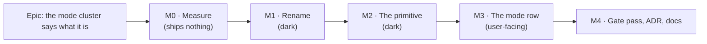

# Implementation Plan: Two mode switches, named as two

- **Feature spec:** [`./feature-spec.md`](./feature-spec.md) (Draft — **not yet approved**)
- **Status:** Draft — awaiting product-owner approval
- **Owner:** unassigned
- **Register row:** `docs/TECH_DEBT.md` #201

## Breakdown

### Epic

**The mode cluster says what it is** — express the partition the registry has always carried
(`segment`, née `demotionGroup`) in both the accessibility tree and the picture, without costing the
diagram a pixel. Roadmap theme: workspace chrome / debt.

---

## Milestone M0 — Measure the width cost (ships nothing)

**Outcome:** a committed number that decides whether the visible divider ships at all.
**Ships dark:** nothing reaches a user; this milestone changes only `apps/web/measure-toolbar/`
and writes one document. Nothing is reachable because nothing is built.
**Journey:** none — ADR-0081 §2's journey obligation attaches to the first **user-facing**
milestone, which is M3.

> **Why this milestone exists at all.** Every width expectation on this surface has been
> contradicted by its own measurement — ADR-0090 M4 (three of three figures wrong), ADR-0091 D4
> (withdrawn), ADR-0092 M4/M5 (withdrawn), ADR-0093 (the width argument withdrawn), ADR-0097
> Landing C (withdrawn on its own falsification condition), ADR-0113 (two of four ideas did not
> exist as work), ADR-0114 (164 px freed bought **zero** height), ADR-0115 (58 px to save 36). Seven
> epics, all in the same direction. The change proposed here is ~13 px on a **wrapping** row whose
> height is a function of its width, and where the failure mode is not a truncation but a second
> line — measured at **36 → 84 px** (`docs/specs/one-row-header/m2-measurement.md:9-14`), i.e. **48
> px of canvas**, to gain a hairline.

#### Feature: the falsification condition, then the run

> **Description:** commit the pass/fail rule, then measure baseline and candidate.
> **Complexity:** M
> **Dependencies:** none
> **Risks:** a harness that measures the wrong thing → see T1's void clauses, both taken from
> recorded instrument failures rather than invented.
> **Testing requirements:** none — this milestone asserts nothing. It is a harness (ADR-0081 §3),
> and its output document says so.

##### Task M0-T1 — Write and commit the falsification condition **before** the run (≈ one PR)

- **Description:** create `docs/specs/mode-toggles/falsification.md` containing the verdict rule
  below, verbatim, and commit it in its own commit before any measurement is taken.
- **Complexity:** S
- **Dependencies:** none
- **Risks:** writing it after seeing a number — the failure ADR-0097 Landing C's harness records
  (a verdict produced from an `undefined`, `undefined >= 120` being `false`: the right answer from a
  missing number). Mitigation: separate commit, timestamped, referenced by the run's output.
- **Testing:** n/a
- **Development steps:**
  1. Record the arithmetic the candidate is expected to cost, **as a prediction to be checked, not
     as the answer**: `Toolbar.tsx:199`'s inter-group chrome is `ml-1 border-l pl-2`; on Tailwind's
     4 px scale that is 4 + 1 + 8 = 13 px, on top of the parent's existing `gap-1`. Predicted spacing
     between `Visual mode` and `Diagram`: **4 px → 17 px, net +13 px**. Everything else unchanged.
  2. Commit this verdict rule:

     > **PROCEED with the divider** if and only if, on a populated plan with a **long** plan name and
     > a **real** project crumb, with the **pen held**, measured in Chromium:
     >
     > 1. at **1646** and **1920** the live header row is **one line** with the candidate chrome
     >    present; **and**
     > 2. `aboveCanvas` with the candidate **equals** `aboveCanvas` without it at 1646 and 1920 — an
     >    equality, not a bound. ADR-0115 records a `<= 120 px` bound that could not tell the fixed
     >    state from the broken one; **and**
     > 3. at **1440** and **1280**, `aboveCanvas` does not grow; **and**
     > 4. the mode cluster is **one line** at every measured width.
     >
     > **WITHDRAW the divider and ship the accessible names alone** if any of 1–4 fails. That
     > fallback is safe in the direction that matters: names without a divider is not a WCAG
     > exposure, whereas a divider without names would create one (feature-spec §4.7). The visual
     > half then gets its own design pass rather than being forced.
     >
     > **The measurement is VOID and re-run if** the fixture's plan name is short (ADR-0097 Landing
     > C's harness reported "307 px of slack, PROCEED" from a 37 px placeholder), or the pen is not
     > held (ADR-0115: every reading was taken in the one state where the schedule region renders
     > nothing), or the probe reports a band it cannot locate (ADR-0091 M7: a missing band was
     > `.filter()`ed out rather than throwing, and every surviving number stayed plausible).

  3. Record the slack figures the run must report, so the decision is legible either way:
     `container`, `headerRowRequired`, `perOccupant.mode`, live `lines`, `aboveCanvas` — baseline
     and candidate, at 1280 / 1440 / 1646 / 1920.

##### Task M0-T2 — Run the harness: baseline and candidate

- **Description:** extend `apps/web/measure-toolbar/m1-merged-probe.spec.ts` to report the mode
  cluster's required width **with and without** an injected 13 px chrome between the two segments,
  and run `vertical-stack.spec.ts` for `aboveCanvas`. Record both in
  `docs/specs/mode-toggles/m0-measurement.md`.
- **Complexity:** M
- **Dependencies:** M0-T1
- **Risks:**
  - _The injected spacer is not the real markup._ → It is an approximation and is labelled one. M3-T4
    re-measures against the **shipped** build and compares to this prediction; a divergence is the
    finding, not an embarrassment.
  - _The probe measures something under another thing's name._ → `m1-merged-probe.spec.ts:104-112`
    and `:178-186` record this happening **three times in that one file**. Locate the cluster by
    `getByRole('toolbar', { name: 'Plan mode' })` and its parent, and print the node's own text
    beside every figure.
  - _A dev server left over from another harness is silently adopted._ → ADR-0099 records
    `reuseExistingServer` producing three consecutive false diagnoses in one session. Run through
    `scripts/e2e-local.sh`, which refuses to start while anything answers on 3000 or 5173.
- **Testing:** none — harness. Its docblock states, in ADR-0081 §3's terms, that it injects chrome
  the product does not yet contain.
- **Development steps:**
  1. Use the existing fixture shape: a long plan name and a real project crumb (the pattern
     `e2e-workspace-fit/pen-status.spec.ts:139-146` already uses, and for the stated reason).
  2. Report baseline: `container`, `headerRowRequired`, `perOccupant.mode`, live `lines`.
  3. Inject a spacer of the derived width into the live mode toolbar between `Visual mode` and
     `Diagram`, re-read the same five figures, and remove it.
  4. Run `vertical-stack.spec.ts` for `aboveCanvas` in both states.
  5. Write `m0-measurement.md`: the numbers, the slack at each width, and the **verdict against
     M0-T1's rule, quoted rather than paraphrased**.
  6. **If the verdict is WITHDRAW**, stop and report to the product owner before M1 — the scope
     shrinks to the ARIA half and Q2's default is exercised.

---

## Milestone M1 — `demotionGroup` becomes `segment` (dark)

**Outcome:** the registry field names what it is about to do.
**Ships dark:** a pure rename. No rendered output changes anywhere; `pnpm typecheck` is the proof
that nothing was missed.
**Journey:** none (dark).

#### Feature: an honest field name

> **Description:** rename the field and rewrite the two invariants' docblocks, which currently cite
> `companionsOf` — a function that no longer exists (`rg companionsOf apps/web/src` → two comments,
> no definition; deleted with the ladder at ADR-0109 D1).
> **Complexity:** S
> **Dependencies:** M0 (only so the scope is settled before work starts)
> **Risks:** a string-keyed usage the compiler cannot see → the field is only ever read through
> typed access; a repository-wide grep for the literal `demotionGroup` at the end of the task proves
> it, and the two documentation hits are part of the task.
> **Testing requirements:** the two existing `defineToolbar` invariant suites
> (`toolbar-registry.test.ts:288-303`, `:313-329`) must pass unchanged in substance — they are the
> before/after oracle for a rename.

##### Task M1-T1 — Rename and re-explain

- **Description:** `ToolbarItem.demotionGroup` → `ToolbarItem.segment`; update the four declarations
  and both invariants.
- **Complexity:** S
- **Dependencies:** none
- **Risks:** rewriting an invariant's meaning while renaming it. → The invariants' **behaviour** does
  not change; only their docblocks do. Any assertion change in `toolbar-registry.test.ts` beyond the
  identifier is out of scope for this task.
- **Testing:** existing suites, unchanged assertions.
- **Development steps:**
  1. `toolbar-registry.ts:283-295` — rename; replace the docblock's demotion story with: a segment is
     a set of items that are alternatives to one another, and the two invariants exist so a segment
     cannot be split across a tier or a row.
  2. `toolbar-registry.ts:436-471` — keep both checks; rewrite their comments so neither cites
     `companionsOf`, and say plainly that the demotion pass they were written for was deleted at
     ADR-0109 D1 and the invariants are retained because a split segment is still wrong.
  3. `tsld-toolbar-items.tsx:2335`, `:2355`, `:2386`, `:2400` — rename.
  4. `toolbar-registry.test.ts:288-329` — rename in the fixtures; assertions untouched.
  5. `app-header.tsx:200` — rename in the comment, **and** repair the stale citations found during
     re-verification: `isWidthConstrained` at `Toolbar.tsx:81-84` and `Toolbar.tsx:352`
     name nothing that exists (feature-spec §0). Say what is true instead: the
     ladder is gone, and the reason for the provider is density, not fit.
  6. `rg demotionGroup` returns nothing.

---

## Milestone M2 — A taxonomy group may render as N named sub-groups (dark)

**Outcome:** the primitive can express a partition. Nothing uses it yet.
**Ships dark:** `segmentLabels` has no caller, so every rendered toolbar in the product is
byte-identical. That is the milestone's acceptance condition, not a hope — see M2-T2.
**Journey:** none (dark).

#### Feature: `Toolbar.segmentLabels`

> **Description:** one optional prop and one branch in the group render.
> **Complexity:** M
> **Dependencies:** M1
> **Risks:** the keyboard model. → The branch adds a wrapper element and nothing else;
> `focusableIds` is built from `resolved` before grouping (`Toolbar.tsx:112-115`) and focus is moved
> by a **descendant** query on the container (`:148-150`), so neither can see it. Pinned by a test
> rather than argued (M2-T3).
> **Testing requirements:** three new unit cases, two of them verified red, plus the existing
> `Toolbar.test.tsx` passing unchanged as the before/after oracle.

##### Task M2-T1 — The prop and the branch

- **Description:** add `segmentLabels?: Record<string, string>`; in `groups.map`
  (`Toolbar.tsx:191-244`), if **every** item in the taxonomy group has a `segment` present in
  `segmentLabels`, render one `role="group"` per distinct segment in first-appearance order, each
  `aria-label`ed from the map, with the existing `i > 0 && 'border-border ml-1 border-l pl-2'`
  applied between them and the outer wrapper carrying **no role**. Otherwise render exactly as today.
- **Complexity:** M
- **Dependencies:** M1-T1
- **Risks:**
  - _Partial partition._ A group where some items carry a segment must **not** produce an unnamed
    region. The precondition is "every item, with a label" and the fallback is today's rendering.
    Pinned by M2-T2's second case.
  - _Nested `role="group"`._ Deliberately avoided: the outer wrapper loses its role rather than
    keeping it. Real-AT behaviour of nested groups is **not observable in this environment** —
    `docs/TECH_DEBT.md` #154(1) records that no screen reader runs in the build container — so the
    design avoids the question instead of reasoning about it.
- **Testing:** M2-T2, M2-T3.
- **Development steps:**
  1. Add the prop with a docblock stating the precondition and the fallback.
  2. Implement the partition as a pure helper beside the component so it is unit-testable without a
     DOM, and keep the ordering derived from the already-sorted `groupItems` (never re-sorted).
  3. Leave `groupLabels`, `alignEndGroup`, `authoringEnabled` and the roving tabindex untouched.

##### Task M2-T2 — The gates, each verified red against the defect it names (ADR-0110 D5)

- **Description:** three cases.
- **Complexity:** S
- **Dependencies:** M2-T1
- **Risks:** a gate that passes for the wrong reason. → Each carries a pinned positive so a green run
  cannot mean "there was nothing to check" (the ADR-0093 / ADR-0108 shape: a census whose glob
  matched zero files passed its "nothing unclassified" assertion perfectly).
- **Testing:** this task is the testing.
- **Development steps:**
  1. **Partition case.** Given a group whose items all carry labelled segments, exactly N
     `role="group"`s render with the expected names, each containing exactly its own items, and the
     outer wrapper has no `role`. **Verified red** against the pre-M2-T1 code (which renders one
     group).
  2. **Fallback case.** Given a group where one item has no segment, exactly **one**
     `role="group"` renders, named from `groupLabels`. **Verified red against a deliberately naive
     implementation** that partitions anyway and emits an unnamed region — stated as such in the
     test's docblock, because "verified red" for a negative case means red against the wrong
     implementation, not against today's.
  3. **No-caller case.** `Toolbar.test.tsx`'s existing render, with no `segmentLabels`, produces the
     same DOM as before — the dark-ship claim, asserted rather than asserted-about.

##### Task M2-T3 — Pin the keyboard model across the change

- **Description:** assert that with the partition active the toolbar still exposes **one** tab stop
  and that Arrow/Home/End traverse all items across the sub-group boundary.
- **Complexity:** S
- **Dependencies:** M2-T1
- **Risks:** jsdom cannot see focus rings or layout, so this pins the model and not the experience —
  stated in the test's docblock. The browser half is M3-T3. This is exactly ADR-0111's weak-instrument
  caveat, written down rather than implied.
- **Testing:** this task is the testing.
- **Development steps:**
  1. Case: exactly one element in the toolbar has `tabIndex={0}`.
  2. Case: ArrowRight from the last item of segment A lands on the first item of segment B, and
     wraps from the last item overall to the first.
  3. Verified red by making the partition wrap each sub-group in its own `onKeyDown` (the mistake a
     later reader would plausibly make).

---

## Milestone M3 — The mode row names its two switches (user-facing)

**Outcome:** a planner sees `MODE  Early | Visual ⎪ Diagram | Gantt` with a boundary, and a
screen-reader user hears `Scheduling mode` and `Plan view`.
**Entry point:** the mode cluster in the **plan header** — the `role="toolbar"` named **"Plan
mode"** on `/orgs/$orgSlug/plans/$planId`. It is always present on a plan route with either flag on;
nothing new is added to reach it.
**Journey:** `apps/web/e2e-workspace-fit/pen-status.spec.ts` — extended, not created (no new
Playwright config and no new CI step, which is deliberate: adding either would have been an
independent ADR-0105 trigger). One step opens a plan and asserts both named groups are present at
1646 and at 1440, alongside the existing line-count assertions.

#### Feature: two named groups on the mode row

> **Description:** the consumer passes `segmentLabels` and deletes the compound-name override.
> **Complexity:** S
> **Dependencies:** M2; **M0's verdict** (if WITHDRAW, T2 ships without the divider)
> **Risks:** the width cost lands differently in the shipped markup than in M0's injected
> approximation → M3-T4 re-measures and compares.
> **Testing requirements:** unit (the mode row's rendered groups), structural (US-5), journey
> (M3-T3), plus the existing `e2e-workspace-fit` and `command-surface` suites re-run.

##### Task M3-T1 — Pass the labels, delete the override

- **Description:** `plan-workspace-toolbar.tsx` — remove `ROW_MODE_GROUP_LABELS` (`:116-121`) and the
  `groupLabels` prop (`:1546-1549`); pass
  `segmentLabels={{ 'scheduling-mode': 'Scheduling mode', 'view-mode': 'Plan view' }}`.
- **Complexity:** S
- **Dependencies:** M2-T1, Q1 answered
- **Risks:** deleting the override leaves a future segment-less item on `row: 'mode'` rendering an
  unnamed-by-intent `lens` group called "Display" — the exact collision the override existed to
  prevent (`Toolbar.tsx:44-46`). → M3-T2's structural test makes that state fail CI.
- **Testing:** M3-T2.
- **Development steps:**
  1. Pass the map; delete the constant and its docblock.
  2. Update `tsld-toolbar-scheduling-modes.test.tsx:48-59`'s `renderModeRow` helper, which passes
     `groupLabels={{ lens: 'Scheduling and view' }}` today, so the unit surface matches the host.
  3. Add a unit case: rendering `rows.mode` yields exactly two groups named `Scheduling mode` and
     `Plan view`, and **no** accessible name `Scheduling and view` exists anywhere in the output.
     **Verified red** against the pre-M3 build.

##### Task M3-T2 — The structural gate (US-5)

- **Description:** assert that every item in `rows.mode` carries a `segment`, and that every distinct
  segment has a label in the host's map.
- **Complexity:** S
- **Dependencies:** M3-T1
- **Risks:** a gate that would pass against an **empty** `rows.mode` — both flags off. → It carries a
  pinned positive asserting at least four items, for the reason ADR-0093's duplication gate carries
  its second assertion: a green suite must not be able to mean "the capability is gone".
- **Testing:** this task is the testing. **Verified red** by deleting one item's `segment`, and again
  by removing one key from the label map.
- **Development steps:**
  1. Import the built registry and the host's label map from one place, so the test compares the two
     real objects rather than two restatements of them.
  2. Both assertions, plus the pinned positive.

##### Task M3-T3 — The journey step

- **Description:** extend `e2e-workspace-fit/pen-status.spec.ts` with a step asserting both groups
  exist inside the `Plan mode` toolbar at 1646 and at 1440, and that no element there is named
  `Scheduling and view`.
- **Complexity:** S
- **Dependencies:** M3-T1
- **Risks:** locating the controls by copy → locate by role and name, and the toolbar by
  `getByRole('toolbar', { name: 'Plan mode' })`, which that file already does (`:146`). ADR-0091 M7's
  standing rule after three journeys broke on a label change: prefer role+name, and after any label
  or layout change **run every journey**, not the one CI happens to name.
- **Testing:** this task is the testing.
- **Development steps:**
  1. Add the assertions inside the existing width loop, so they run at both line counts.
  2. Run `scripts/e2e-local.sh web:workspace-fit` locally. **CI is the second opinion, never the
     first.**

##### Task M3-T4 — Re-measure against the shipped build

- **Description:** re-run M0's probe and `vertical-stack` against the built change and write
  `docs/specs/mode-toggles/m3-measurement.md`.
- **Complexity:** S
- **Dependencies:** M3-T1
- **Risks:** quoting M0's prediction as the result. → The document reports the shipped figures first
  and the prediction second, as a comparison. If they differ, the divergence is the headline.
- **Testing:** n/a (harness).
- **Development steps:**
  1. Run both harnesses; record `container`, `headerRowRequired`, `perOccupant.mode`, live `lines`,
     `aboveCanvas` at 1280 / 1440 / 1646 / 1920.
  2. State the verdict against M0-T1's rule, quoted.
  3. If the shipped cost exceeds M0's prediction and breaches the rule, **revert the divider in this
     milestone** rather than deferring it — the fallback is one class string.

##### Task M3-T5 — File the ADR

- **Description:** write the ADR described in feature-spec §4.6.
- **Complexity:** S
- **Dependencies:** M3-T1
- **Risks:** the number is taken between plan and landing (ADR-0071 was cited by shipped code and
  never filed; ADR-0079 was filed under a different number than its plan named). → Choose the number
  **at filing**, from `docs/adr/`, and record the collision if there is one rather than routing
  around it.
- **Testing:** `pnpm prepush` — which runs `check:adr-coverage` (both directions since ADR-0110 D6)
  and `check:doc-links`. **Run `pnpm prepush`, not its parts**: ADR-0106 records an ADR reaching CI
  and being refused by a gate that could not fail locally because the instruction named the parts by
  hand.
- **Development steps:**
  1. Draft from `docs/adr/_template.md`: problem, the four options with the evidence in §4.4, the
     choice, trade-offs, consequences.
  2. Add it to `docs/adr/README.md` in the same commit.

---

## Milestone M4 — Gate pass, docs, release

**Outcome:** the change is reviewed by the specialists this surface has repeatedly needed, the
register row closes, and the release is cut.
**Ships dark:** no new capability; this milestone folds findings and updates documents.
**Journey:** none new — M3's runs again as part of the sweep.

#### Feature: the reviews and the paperwork

> **Description:** the specialist pass, then documentation.
> **Complexity:** M
> **Dependencies:** M3
> **Risks:** treating the pass as a formality. Seven consecutive epics here have had blocking
> findings at this stage in code that had already passed a human read; four of the last six were
> "one correct pattern applied to a control and not its neighbour".
> **Testing requirements:** every fix folded carries a regression test **verified red first**.

##### Task M4-T1 — Specialist reviews

- **Description:** run `accessibility-reviewer`, `component-reviewer` and `ux-reviewer` over the
  combined diff.
- **Complexity:** M
- **Dependencies:** M3
- **Risks:** the reviewers are read-only advisors; blocking findings are folded in this milestone,
  non-blocking ones are filed as a `docs/TECH_DEBT.md` row **with reasons**, never dropped.
- **Testing:** regression tests per finding, verified red.
- **Development steps:**
  1. `accessibility-reviewer` — the group naming, the announcement order, and the **honest strength
     of the claim** (feature-spec §4.7 says no SC applies; ask the reviewer to confirm or refute
     that, since overstating one is the ADR-0082 defect and understating one is also wrong).
  2. `component-reviewer` — the prop's shape, the precondition, whether the partition helper belongs
     in `toolbar-registry.ts` rather than beside the component, and whether `Toolbar.test.tsx` still
     proves the dark-ship claim.
  3. `ux-reviewer` — the two names against the surrounding vocabulary (`View ▾`, `MODE`), and whether
     the hairline reads as a boundary at the shipped density.
  4. `security-reviewer`, `api-reviewer`, `backend-performance-reviewer`, `database-architect` are
     **not run**, and the reason is stated rather than assumed: this change imports no server code,
     makes no request, and touches no schema (feature-spec §3).

##### Task M4-T2 — Documentation, register, changeset

- **Description:** close the loop.
- **Complexity:** S
- **Dependencies:** M4-T1
- **Risks:** a document left describing the old rendering. This register's own commonest defect.
- **Testing:** `pnpm prepush` (which includes `check:doc-links`, `check:adr-coverage`,
  `check:counts`, `check:claims`).
- **Development steps:**
  1. `docs/COMPONENT_LIBRARY.md` — document `segmentLabels` in the `Toolbar` section: when a group
     partitions, the precondition, and the fallback.
  2. `docs/TECH_DEBT.md` — close **#201** with what was found (including the correction that
     `demotionGroup` had no runtime consumer at all, and the deleted-`companionsOf` citations); note
     whether the divider shipped or was withdrawn on M0/M3's measurement.
  3. `CLAUDE.md` §16 — the new ADR's entry.
  4. `pnpm changeset` — patch on `@repo/web`; user-visible (an accessible name and a hairline change).

---

## Sequencing & slices

| Slice | Ships                                | Releasable alone?                  | Reversible by                                     |
| ----- | ------------------------------------ | ---------------------------------- | ------------------------------------------------- |
| M0    | nothing (a harness + two documents)  | yes                                | —                                                 |
| M1    | a rename                             | yes — no rendered output changes   | one commit                                        |
| M2    | an unused prop                       | yes — DOM byte-identical, asserted | one commit                                        |
| M3    | the two named groups (± the divider) | yes                                | one commit; the divider alone is one class string |
| M4    | reviews, docs, changeset             | yes                                | —                                                 |

**No feature flag.** ADR-0088 D1: `Vite` inlines `import.meta.env.VITE_*` at build time, the
published images pass no `VITE_` build args, so a flag would not be an operator rollback — it would
be a second product maintained forever. The rollback is the commit boundary, which is what the table
above is for.

**M0 gates M3's second half only.** If the verdict is WITHDRAW, M1–M3 still ship the accessible
names — which is the half that closes the more serious part of #201 and costs zero pixels — and the
divider becomes a follow-up row with the measurement attached.

## Definition of Done (per task)

Each task's PR satisfies the Feature Completion Criteria in [`docs/PROCESS.md`](../../PROCESS.md).
Two are called out because this surface has been bitten by both:

- **The pre-push gate is one command — `pnpm prepush`** — plus `scripts/e2e-local.sh web:workspace-fit`
  for M3, and `scripts/e2e-local.sh web` for the base journey, because M3 changes a screen
  (`docs/TESTING.md`, the ADR-0096 finding).
- **Every new gate is verified red against the specific defect it names** (ADR-0110 D5), and where
  "red" means red against a deliberately wrong implementation rather than against today's code, the
  test's docblock says so.

## Risks & assumptions (rollup)

| Risk / assumption                                                                   | Likelihood | Impact | Mitigation                                                                                                                                                                                                                                   |
| ----------------------------------------------------------------------------------- | ---------- | ------ | -------------------------------------------------------------------------------------------------------------------------------------------------------------------------------------------------------------------------------------------- |
| The 13 px costs the header a second line at 1646 → **48 px of canvas**              | med        | high   | M0 measures before anything is built; M0-T1's rule withdraws the divider rather than negotiating it; M3-T4 re-measures the shipped build                                                                                                     |
| M0's injected spacer misrepresents the real markup                                  | med        | med    | Labelled an approximation; M3-T4 compares prediction to shipped reality and reports any divergence as the finding                                                                                                                            |
| Sub-group announcement differs on real AT from the specification                    | med        | med    | **Reasoned from specification, not observed** — no screen reader runs in this environment (`docs/TECH_DEBT.md` #154(1)). Nesting is avoided rather than reasoned about; the residual listen is added to #154's owed pass rather than claimed |
| The rename misses a usage                                                           | low        | low    | Compiler-enforced; a final `rg demotionGroup` returning nothing is a development step                                                                                                                                                        |
| Deleting `ROW_MODE_GROUP_LABELS` re-opens the "Display" collision for a future item | low        | med    | M3-T2's structural gate fails CI on a segment-less item on `row: 'mode'`                                                                                                                                                                     |
| The keyboard model changes without anyone noticing                                  | low        | high   | M2-T3 pins one tab stop and cross-boundary traversal, verified red; M4-T1 runs `accessibility-reviewer` + `component-reviewer` **before** release, which is ADR-0111's rule for the neighbourhood of a shared primitive                      |
| A journey elsewhere locates a mode control by copy and breaks                       | low        | med    | Nothing's accessible **name** changes except the group's; M3-T3's sweep runs the workspace-fit and base journeys, per ADR-0091 M7's standing rule                                                                                            |
| The problem statement goes stale between approval and build                         | low        | med    | §0 re-verified it on 2026-08-30 with file:line; M1's first step re-runs the two greps                                                                                                                                                        |
