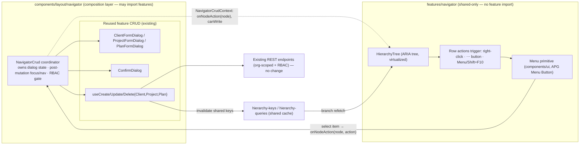
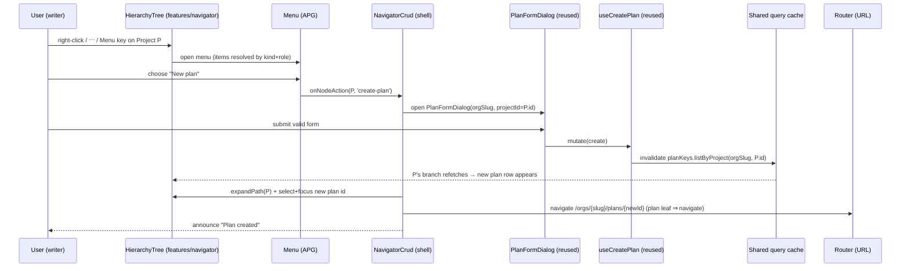
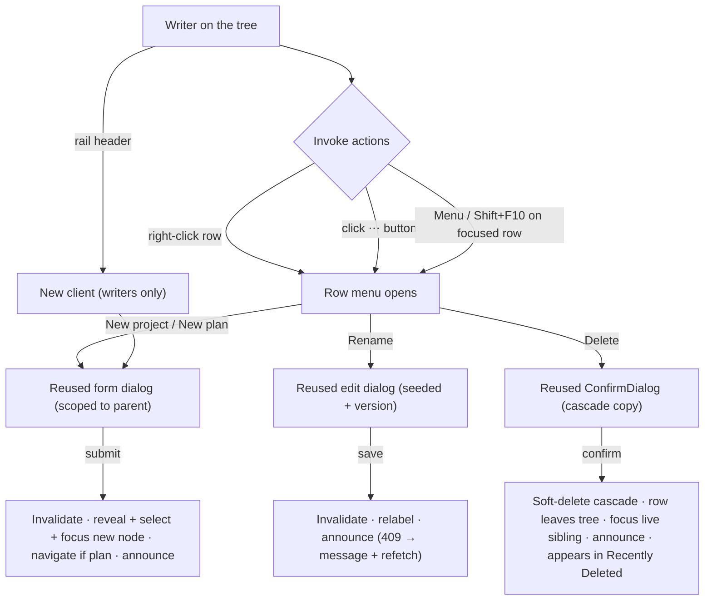

<!--
Feature Spec — Stages 1–4 of docs/PROCESS.md.
Navigator in-tree CRUD (Project Explorer — Phase 2). NO application code at this stage.
-->

# Feature Spec: Navigator in-tree CRUD (Project Explorer — Phase 2)

- **Status:** Approved — implemented behind `VITE_NAV_TREE_CRUD` (off by default);
  Playwright journeys + default-on flip pending. CQ-1 & CQ-2 approved as recommended.
- **Author(s):** Feature Analyst (Product Owner / Solution Architect / Technical Lead hats)
- **Date:** 2026-07-12
- **Tracking issue / epic:** _TBD_ — Epic "Domain hierarchy & navigation" (navigation UX)
- **Roadmap link:** `docs/ROADMAP.md` — navigation UX (the named "Phase 2 — in-tree CRUD" follow-on of the shipped navigator)
- **Related ADR(s):** **ADR-0029** (persistent app-shell + hierarchy navigator — this
  feature is the context-menu-CRUD extension ADR-0029 §6 explicitly designed the seam
  for), honouring ADR-0004 (state split), ADR-0005 (TanStack Router), ADR-0006
  (tokens/shadcn/CVA), ADR-0012/0016 (RBAC + tenancy). Builds on the shipped
  [hierarchy-navigator](hierarchy-navigator.md) and `hierarchy-crud` slices.

> **Scope frame.** This is **Phase 2** of the Project Explorer, named as an
> explicitly-deferred follow-on in the shipped navigator spec/plan and ADR-0029 §6.
> It makes the tree **no longer navigation-only**: **create / rename / delete
> (soft-delete)** of clients, projects and plans **directly from the rail**, via a
> right-click **context menu** and a **keyboard-accessible** affordance (a per-row
> "⋯" button + the Menu/Shift-F10 key), reusing **the existing mutation endpoints,
> form dialogs, confirm dialog, optimistic-locking, soft-delete/cascade semantics,
> and permission gating**. Deleted nodes flow to the **existing** Recently Deleted /
> restore surface unchanged — **no new delete model, no new endpoints**.
>
> **Explicitly out of scope (not designed here):** server-side search / jump-to
> (Phase 3); drag-and-drop move / reparent; multi-select bulk operations; **restore
> from the tree** (the recycle bin page stays the restore surface — ADR-0029 §6:
> "Recently deleted stays a header/page entry point, not a tree node"); anything
> touching the TSLD canvas.

## 1. Business understanding

### Problem

The Project Explorer (ADR-0029, shipped) made navigation fast and persistent, but it
is **read-only**: to create a plan under a project, rename a mis-named client, or
delete a defunct project, a planner must **leave the tree**, navigate to the relevant
management page, act there, and navigate back. That round-trip is exactly the
context-loss the navigator exists to remove — for the app's most structural actions
(shaping the Org → Client → Project → Plan hierarchy) it is still the old
click-through model. Every desktop tool these users came from (P6, Windows Explorer,
VS Code) lets you right-click a node to act on it in place; the navigator's own ADR
named this the first post-v1 slice and left the RBAC + flattened-model seams open for
it precisely so it could land without rework.

**Why now.** The persistent shell, the accessible tree, the shared read-cache (so a
mutation invalidates the same keys the tree reads and the branch refreshes for free),
the reusable form/confirm dialogs, and the write-RBAC helper are all **already on
`main`**. Phase 2 is almost entirely **composition of existing parts** with **zero
backend change** — the highest-leverage, lowest-risk increment available on the
navigation theme.

### Users

Organisation members (ADR-0012/0016). CRUD is **writer-gated** exactly as the
management pages are today: only **Planner** and **Org Admin** (`canManageHierarchy`)
may create/rename/delete hierarchy rows; **Contributor** and **Viewer** get a
navigation-only tree with **no** create/rename/delete affordances visible.

| Role               | What Phase 2 gives them                                                           |
| ------------------ | --------------------------------------------------------------------------------- |
| **Planner**        | Create/rename/delete clients, projects, plans in place, without leaving the tree. |
| **Org Admin**      | Same as Planner; shape the whole org's hierarchy from one surface.                |
| **Contributor**    | **No** write affordances in the tree (unchanged navigation-only experience).      |
| **Viewer**         | **No** write affordances in the tree (unchanged navigation-only experience).      |
| **External Guest** | **Out of scope** — a guest holds a single per-plan share link, not an org tree.   |

### Primary use cases

1. **Create a child in place** — a writer right-clicks (or focuses + opens the menu
   on) a client and picks "New project", or a project and picks "New plan"; the
   existing form dialog opens pre-scoped to that parent.
2. **Create a root client** — a writer uses a root-level "New client" affordance in
   the rail header (there is no node to right-click in a brand-new org).
3. **Rename in place** — a writer opens a node's menu → "Rename", editing name (and
   description) via the existing edit dialog, with optimistic-lock conflict handling.
4. **Delete (soft) in place** — a writer opens a node's menu → "Delete", confirms the
   cascade in the existing confirm dialog; the node (and, for a client/project, its
   descendants) soft-deletes and disappears from the tree, landing in Recently Deleted.
5. **Stay oriented after acting** — after create the new node is revealed, selected,
   and (for a plan) opened; after delete, focus lands safely on a sensible sibling/parent.

### User journeys

- **Create a plan under a project (happy path).** A Planner has Project P expanded.
  They right-click P (or focus its row and press the Menu key / click its "⋯"
  button) → the row menu opens → "New plan". The existing `PlanFormDialog` opens
  scoped to P. On submit, the plan is created, `planKeys.listByProject(orgSlug, P)`
  is invalidated, P's branch refreshes, the new plan row appears, is **selected and
  focused**, and — because a plan leaf activates navigation (ADR-0029 Q3) — the
  workspace **navigates to the new plan**. A live-region announcement confirms it.
- **Rename a client.** An Org Admin opens Client C's menu → "Rename" → the existing
  `ClientFormDialog` opens in edit mode seeded from the cached `ClientSummary`
  (carrying its `version`). On save the list invalidates and the tree row relabels.
  A stale `version` surfaces the API's 409 message in the dialog; the list refetches
  so a retry carries the current version (identical to the page behaviour).
- **Delete a project (cascade).** A Planner opens Project Q's menu → "Delete" → the
  existing `ConfirmDialog` shows the cascade copy ("Delete "Q" and all its plans?
  You can restore it later."). On confirm the project soft-deletes (cascading to its
  plans), the branch refreshes it away, focus moves to the next sibling (or the
  parent client if none), and an announcement confirms. Q now appears in Recently
  Deleted, restorable there.
- **Empty org.** A new Org Admin lands on the neutral welcome state with an empty
  rail ("No clients"). The rail header's **"New client"** affordance (and the welcome
  card's existing getting-started hint) lets them create the first client without a
  node to right-click; it appears as the first root and is selected.
- **Read-only member.** A Viewer/Contributor right-clicks a node — **no menu of write
  actions appears** (the menu is either absent or contains only future read actions);
  no "⋯" button renders; the rail header shows no "New client". The tree is exactly
  today's navigation-only experience.
- **Small screen.** Inside the rail **drawer**, the same "⋯" button + menu work; the
  menu is a popover positioned within the sheet; activating an action opens the
  dialog over the drawer (native `<dialog>` modality already stacks correctly).

### Expected outcomes

- Writers shape the hierarchy **without leaving the navigator** — creating a plan,
  renaming a client, or deleting a project is a right-click away, in context.
- The tree becomes the **single primary surface** for both navigation and structural
  edits; the management pages remain as the fuller table/bulk/restore surface
  (augment, not replace — unchanged).
- Zero backend change and full reuse of the existing dialogs/mutations means the
  behaviour (validation, optimistic locking, cascade, soft-delete, announcements) is
  **identical** to the pages — one mental model, one code path per operation.

### Success criteria

- A writer creates a plan under a visible project in **≤ 2 interactions** from the
  tree (open menu → New plan → submit), the rail never unmounting, and lands on the
  new plan.
- Rename and delete from the tree produce **byte-for-byte the same** API calls,
  validation, conflict handling, and cascade/soft-delete as the management pages
  (verified by reusing the same hooks/dialogs and by e2e parity tests).
- The context menu is **fully keyboard-operable** and passes automated **axe**: it
  follows the WAI-ARIA APG Menu Button pattern (roving focus, arrow keys, Esc,
  type-ahead optional, focus return to the trigger) and **does not break** the tree's
  existing roving-tabindex keyboard model (WCAG 2.2 AA — a merge gate).
- **Contributors and Viewers see no write affordances** in the tree (menu items,
  "⋯" buttons, and the root "New client" are all `canManageHierarchy`-gated), and the
  API remains the trust boundary (a forged request from a non-writer is rejected 403).
- After any mutation the tree stays consistent with the pages automatically (shared
  query keys), and focus lands on a sensible, non-disorienting element (WCAG 2.4.3).

### Open questions

**Critical (surface for approval — answers change design/scope):**

- **CQ-1 — New architectural artifacts: the Menu primitive + the CRUD-wiring seam.**
  There is **no menu/context-menu primitive** in `components/ui` today, and the
  `no feature → feature` rule forbids `features/navigator` importing the three CRUD
  features. The recommended design (a) adds one hand-rolled **`Menu` design-system
  primitive** (APG Menu Button, consistent with the house's own-our-primitives, no-Radix
  posture) and (b) wires CRUD via a **shell-layer coordinator** that composes the
  feature dialogs/mutations and injects intent handlers into the tree (§4). **Default/
  recommendation:** proceed as designed; record both as an **extension within ADR-0029**
  plus a `DECISIONS.md` + `COMPONENT_LIBRARY.md` entry for the `Menu` primitive — **no
  new ADR** (justified in §4). Needs explicit sign-off because it introduces a shared
  primitive and a composition-layer convention.
- **CQ-2 — Root "New client" entry point in the rail header.** A brand-new org has no
  node to right-click. **Default/recommendation: YES** — add a small,
  `canManageHierarchy`-gated "New client" control to the rail header (mirroring the
  welcome card's existing hint). Flagged because it adds a persistent control to the
  rail chrome.

**Non-critical (defaults stated — proceeding):**

- **Menu invocation surface.** **Default:** support **all three** — right-click
  context menu, a roving per-row **"⋯" more-actions button**, and the keyboard
  **Menu / Shift+F10** key on the focused row. (Keyboard + button are required for
  a11y; right-click matches the desktop mental model. All three open the same menu.)
- **Dialogs: reuse the page dialogs vs. lighter inline affordances.** **Default:**
  **reuse** the existing `ClientFormDialog` / `ProjectFormDialog` / `PlanFormDialog`
  and `ConfirmDialog` unchanged — identical validation/locking/cascade, one code path,
  least risk. (Inline rename-in-row is rejected: it would fork validation + a11y.)
- **Where a new node lands.** **Default:** auto-expand the parent, then **select +
  focus** the new node; for a **plan** additionally **navigate** to it (a plan leaf
  activates navigation — ADR-0029 Q3); for a **client/project** (folders) reveal +
  select **without** navigating (folders expand-only).
- **Delete confirmation + cascade copy.** **Default:** reuse `ConfirmDialog` with the
  **existing cascade copy** already used on the pages ("Delete "X" and all its
  projects and plans? You can restore it later."), so the cascade warning is surfaced
  in-tree verbatim.
- **Optimistic vs. invalidate-only.** **Default:** match the existing hooks —
  **invalidate-on-settle** (not optimistic list mutation); the tree refreshes from the
  refetch. No new optimistic-update logic (keeps parity and avoids rollback edge cases).
- **Restore from the tree.** **Default:** **NO** — deleted nodes leave the tree;
  restore stays on the Recently Deleted page (ADR-0029 §6).
- **Type-ahead within the menu.** **Default:** optional/nice-to-have, not gated;
  arrow/Home/End/Esc are required.

## 2. Functional requirements

### User stories & acceptance criteria

> **US-1 — Create a child in place.** As a writer (Planner/Org Admin), I want to
> create a project under a client or a plan under a project from the tree, so I can
> extend the hierarchy without leaving the navigator.
>
> - **Given** I am a writer focused on (or right-clicking) a **client** row **when** I
>   open its menu **then** it offers **"New project"**; choosing it opens the existing
>   `ProjectFormDialog` scoped to that client.
> - **Given** a **project** row **when** I open its menu **then** it offers **"New
>   plan"**; choosing it opens the existing `PlanFormDialog` scoped to that project.
> - **Given** the create dialog **when** I submit valid input **then** the existing
>   create mutation runs, the parent's children query is invalidated, the branch
>   refreshes, the parent auto-expands, and the new node is **selected + focused**
>   (and, if a plan, the workspace navigates to it); a live-region message confirms.
> - **Given** a **plan** row **when** I open its menu **then** there is **no** "New …"
>   (plans are leaves).

> **US-2 — Create a root client.** As a writer, I want a "New client" affordance in
> the rail, so I can create the first/next top-level client (including in an empty org
> with nothing to right-click).
>
> - **Given** I am a writer **when** the rail renders **then** a `canManageHierarchy`-
>   gated **"New client"** control is present in the rail header.
> - **Given** an empty org **when** I use it **then** the existing `ClientFormDialog`
>   opens; on submit the new client appears as the first root and is selected + focused.
> - **Given** I am **not** a writer **when** the rail renders **then** no "New client"
>   control is shown.

> **US-3 — Rename in place.** As a writer, I want to rename a client/project/plan from
> its menu, so I can fix names without opening its page.
>
> - **Given** any node's menu **when** I choose **"Rename"** **then** the existing edit
>   dialog opens in edit mode, seeded from the cached summary (name, description,
>   **version**).
> - **Given** I save a valid change **when** it succeeds **then** the update mutation
>   runs with the optimistic-lock `version`, the relevant queries invalidate, and the
>   tree row relabels; a message confirms.
> - **Given** the cached `version` is stale **when** I save **then** the API's **409**
>   message shows in the dialog and the list refetches so a retry carries the current
>   version (identical to the page).

> **US-4 — Delete (soft) in place.** As a writer, I want to delete a node from its
> menu with a clear cascade warning, so I can remove hierarchy safely and reversibly.
>
> - **Given** any node's menu **when** I choose **"Delete"** **then** the existing
>   `ConfirmDialog` opens showing the **cascade** copy appropriate to the kind
>   (client → "all its projects and plans"; project → "all its plans"; plan → itself),
>   ending "You can restore it later."
> - **Given** I confirm **when** the delete succeeds **then** the existing soft-delete
>   (cascading) mutation runs, the branch invalidates and the node disappears, and the
>   node becomes available in Recently Deleted (restorable there).
> - **Given** the deleted node (or an ancestor) was the current selection **when** it
>   is removed **then** the workspace shows its existing not-found/neutral state and the
>   tree shows no orphaned highlight.
> - **Given** deletion completes **when** the row unmounts **then** focus moves to the
>   next sibling, else the previous sibling, else the parent, else the tree container
>   (never lost to `<body>`).

> **US-5 — Writer-only affordances (RBAC).** As a Contributor/Viewer, I should see no
> create/rename/delete controls in the tree, so the UI matches what I'm permitted to do.
>
> - **Given** I am not a writer **when** I interact with any node **then** no "⋯"
>   button renders, the Menu/Shift+F10 key opens **no** write menu, right-click is not
>   hijacked for a write menu, and no "New client" shows.
> - **Given** any role **when** a write request reaches the API **then** authorisation
>   is enforced server-side (403 for non-writers) — the client gate is UX, not trust.

> **US-6 — Accessible menu that preserves the tree keyboard model.** As a keyboard/
> screen-reader user, I want the node actions menu to be fully operable and to not
> break tree navigation.
>
> - **Given** a focused treeitem **when** I press **Menu** or **Shift+F10** (or click
>   its "⋯" button) **then** an APG menu opens (`role="menu"`/`menuitem`), focus moves
>   into it, ↑/↓ move between items, **Esc** closes and **returns focus to the
>   originating row**, and selecting an item runs the action.
> - **Given** the menu is open **when** I read the tree **then** the treeitem exposes
>   `aria-haspopup="menu"` and the tree's roving tabindex is intact when the menu closes.
> - **Given** the menu/dialogs **when** audited **then** they pass automated **axe** and
>   a keyboard-only pass (open → navigate → act → focus-return).

### Workflows

- **Open node menu:** trigger (right-click on row / click "⋯" / Menu|Shift+F10 on
  focused row) → the shell CRUD coordinator resolves the node's available actions from
  its `kind` + the viewer's `canManageHierarchy` → render the APG `Menu` anchored to
  the row → move focus into the menu.
- **Create:** menu → "New project"/"New plan"/(header) "New client" → open the matching
  existing form dialog scoped to the parent (`orgSlug` [+ `clientId` | `projectId`]) →
  on success: invalidate the parent's list key (existing hook), `expandPath` the parent,
  set selection/focus to the new node id, navigate if the new node is a plan, announce.
- **Rename:** menu → "Rename" → look up the full summary (with `version`) from the
  cached list query for the node's parent → open the existing edit dialog seeded from it
  → on success invalidate + relabel + announce; on 409 show the message + refetch.
- **Delete:** menu → "Delete" → open `ConfirmDialog` with kind-appropriate cascade copy
  → on confirm run the existing delete hook (needs `orgSlug` + parent id, both known
  from the tree node's `parentId`) → invalidate + focus-management + announce.
- **Route change / invalidation:** unchanged — selection stays a projection of the URL;
  branches refresh from shared keys.

### Edge cases

- **Empty org:** no nodes to right-click → the rail-header "New client" (US-2) is the
  entry point; after creating the first client it is revealed + selected.
- **Deleting the selected node / an ancestor of it:** workspace falls to its existing
  not-found/neutral state; tree shows no selection; focus managed to a live sibling.
- **Deleting a currently-expanded branch:** the expansion set may retain now-dead ids;
  they are harmless (flatten ignores unknown ids) and pruned on next persist; no crash.
- **409 optimistic-lock conflict on rename:** existing dialog behaviour — show the API
  message, refetch the list, retry carries the fresh version.
- **Create/delete while a child query is still loading:** the mutation targets the
  parent list key regardless; the branch reconciles on the invalidation refetch.
- **Concurrent peer deletes the node** while its menu is open: the action's request 404s;
  surface the existing not-found/error toast/message; the branch refetch removes the row.
- **Plan edit-lock (ADR-0028) interaction:** hierarchy CRUD (rename/delete a plan row)
  is **not** a canvas edit and is unaffected by the plan edit-lock; no `assertHoldsPen`
  gate applies (delete of a plan is a hierarchy operation, same as the page today).
- **Right-click on empty rail space / a state row (loading/empty/error):** no write
  menu; native context menu behaviour is left alone (only real node rows are hijacked).
- **Menu open when the row scrolls out of the virtualized window:** the menu is anchored
  to the row; if the row would unmount, keep it force-rendered while its menu is open
  (extend the existing focused/selected force-render rule) or close the menu on scroll.

### Permissions

Deny-by-default, org-scoped (ADR-0012/0016), **enforced by the API** — the tree makes
no trust decision. Client-side, every write affordance (row menu write items, "⋯"
button, root "New client") is gated by `canManageHierarchy(useOrgRole(orgSlug))` —
**Planner + Org Admin only** — exactly mirroring the management pages and the API's
`client|project|plan:create/update/delete` grants. No new permission codes. Reads are
unchanged (all members browse). A non-writer who forges a request is rejected 403 by
the existing controllers.

### Validation rules

No **new** validation. Create/rename reuse the existing feature Zod schemas
(`client-schemas` / `project-schemas` / `plan-schemas`) via the reused form dialogs,
which already mirror the server `class-validator` DTOs. Delete takes no input beyond a
confirm. The intent payload passed from the tree to the coordinator is an existing,
already-validated `TreeNodeData` (`kind`, `id`, `name`, `parentId`) — internal, not
user input.

### Error scenarios

| Scenario                                   | Detection                   | User-facing result                                             | Status  |
| ------------------------------------------ | --------------------------- | -------------------------------------------------------------- | ------- |
| Non-writer forges a create/update/delete   | API RBAC guard              | request rejected; no UI path exposes it                        | 403     |
| Rename with stale optimistic-lock version  | version check (existing)    | 409 message in the edit dialog; list refetches; retry succeeds | 409     |
| Duplicate/invalid name on create/rename    | Zod + server DTO (existing) | inline field error in the reused form dialog                   | 400/409 |
| Delete a node a peer already deleted       | not-found on mutate         | existing not-found message; branch refetch removes the row     | 404     |
| Child/parent list query fails after mutate | TanStack Query error        | existing per-node "Couldn't load — retry" row (unchanged)      | 5xx     |
| Menu opened by a non-writer (no items)     | client gate                 | no write menu appears (nothing to action)                      | —       |

## 3. Technical analysis

| Area           | Impact   | Notes                                                                                                                                                                                                                 |
| -------------- | -------- | --------------------------------------------------------------------------------------------------------------------------------------------------------------------------------------------------------------------- |
| Frontend       | **high** | New `Menu` design-system primitive (APG); tree gains an actions trigger + intent emission; a shell-layer **CRUD coordinator** composing the existing feature dialogs/mutations; focus-management.                     |
| Backend        | **none** | Reuses existing create/update/delete/restore endpoints for clients/projects/plans (confirmed present). No new/changed modules, services, or DTOs.                                                                     |
| Database       | **none** | No schema change — soft-delete cascade + restore already exist.                                                                                                                                                       |
| API            | **none** | No new/changed endpoints, contracts, or OpenAPI.                                                                                                                                                                      |
| Security       | **low**  | No new server surface; write affordances gated client-side by `canManageHierarchy`, enforced server-side (unchanged RBAC). No new IDOR surface (same endpoints, same org scope).                                      |
| Performance    | **low**  | Mutations invalidate the same keys the tree already reads; no new N+1. Menu is a light popover; keep the force-render rule so an open menu's row survives virtualization.                                             |
| Infrastructure | **none** | No new services/env/secrets/deps (the `Menu` is hand-rolled on semantic HTML; no new npm dependency).                                                                                                                 |
| Observability  | **low**  | Optional: reuse the existing telemetry facade for create/rename/delete-from-tree events; no new backend signals.                                                                                                      |
| Testing        | **high** | Unit (action-resolution by kind + role; focus-target computation); component (menu APG semantics, roving/return focus, dialogs open scoped, RBAC hiding) + **axe**; Playwright CRUD-from-tree journeys + page-parity. |

### Dependencies

- **Prerequisite (on `main`):** the shipped [hierarchy-navigator](hierarchy-navigator.md)
  (M1 shell + M2 tree, on by default) and `hierarchy-crud` (the three features' create/
  update/delete/restore hooks, form dialogs, `ConfirmDialog`, `canManageHierarchy`, the
  Recently Deleted page, and the shared `hierarchy-queries` / `hierarchy-keys`).
- **Architecture:** conforms to **ADR-0029** (this is its named Phase 2); adds no new
  ADR (see §4).
- **New shared primitive:** a hand-rolled `Menu` (APG Menu Button) in `components/ui`
  — recorded in `docs/COMPONENT_LIBRARY.md` + `docs/DECISIONS.md` (not a new npm dep).
- **Blocks / blocked-by:** independent of Phase 3 (search) and of the M3 view-migration;
  can ship on its own behind a flag.
- **Third parties:** none.

## 4. Solution design

> Conforms to **ADR-0029**. Governing principles carried forward: **selection is a
> projection of the URL**; **the tree (`features/navigator`) depends only on shared
> code** (no `feature → feature`); **reuse before inventing**; **tokens/primitives
> only, no one-off styling**; **the API is the trust boundary**.

### Architecture overview

The design resolves one real tension — **`features/navigator` may not import the
clients/projects/plans features**, yet in-tree CRUD needs their mutation hooks and form
dialogs. We keep the tree pure and push the feature-composing glue **up** to the shell
composition layer (`components/layout/navigator`, which already legitimately composes
features — it renders `HierarchyTree` and, via `Sheet`, the drawer). A new
**`NavigatorCrud` coordinator** there:

1. Provides the tree (via a small `NavigatorCrudContext`) with an **`onNodeAction(node)`**
   opener and the viewer's writer flag, so the tree only **emits intents** and renders
   the APG menu — never importing a CRUD feature.
2. Owns the dialog state and renders the **existing** `ClientFormDialog` /
   `ProjectFormDialog` / `PlanFormDialog` / `ConfirmDialog`, calling the **existing**
   `useCreate/Update/Delete*` hooks; it looks up the full summary (with `version`) for
   rename/delete from the already-cached list queries using the node's `parentId`.
3. Handles post-mutation orientation (expandPath + select/focus the new node, navigate
   if a plan; focus a live sibling after delete) and announcements.

The tree gains one new UI concern — the **actions trigger** (right-click / "⋯" button /
Menu key) rendered with the new **`Menu` primitive**, a hand-rolled APG **Menu Button**
in `components/ui` (own-our-primitives; no Radix; same posture that produced the tree
and `Dialog`). All writes still go through the **existing endpoints**; **no backend
change**.

### Data flow — create a plan from the tree

### User flow

### Database changes

**None.**

### API changes

**None.** The coordinator calls the existing endpoints via the existing hooks:

| Method | Path (existing)                                          | Used for            |
| ------ | -------------------------------------------------------- | ------------------- |
| POST   | `/organizations/:orgSlug/clients`                        | create client       |
| POST   | `/organizations/:orgSlug/clients/:clientId/projects`     | create project      |
| POST   | `/organizations/:orgSlug/projects/:projectId/plans`      | create plan         |
| PATCH  | `/organizations/:orgSlug/clients/:clientId`              | rename client       |
| PATCH  | `/organizations/:orgSlug/projects/:projectId`            | rename project      |
| PATCH  | `/organizations/:orgSlug/plans/:planId`                  | rename plan         |
| DELETE | `/organizations/:orgSlug/{clients\|projects\|plans}/:id` | soft-delete cascade |

Restore endpoints exist but are **not** wired into the tree (restore stays on the
Recently Deleted page).

### Component changes

- **New shared primitive — `components/ui/menu.tsx`** (`Menu` / `MenuItem`): a
  hand-rolled **WAI-ARIA APG Menu Button** on semantic HTML — `role="menu"`/`menuitem`,
  focus into menu on open, ↑/↓/Home/End roving, **Esc closes + returns focus to the
  trigger**, click-away close, `aria-haspopup="menu"` + `aria-expanded` on the trigger,
  tokenised styling (reuse `Dialog`/popover conventions and `sidebar*`/surface tokens),
  theme-aware, reduced-motion-safe. Positioned as a popover anchored to the trigger
  (also used for right-click, anchored at the pointer). Recorded in
  `docs/COMPONENT_LIBRARY.md`. **No new npm dependency.**
- **`features/navigator` (tree, stays shared-only):**
  - `TreeItemRow` gains an **actions trigger**: a roving-focusable **"⋯" button**
    (writers only), a `contextmenu` handler on the row, and Menu/Shift+F10 handling
    folded into the existing `treeKeydown`/keyboard path — all emitting a single
    `onNodeAction(node)` from `NavigatorCrudContext`. `aria-haspopup="menu"` when the
    node has actions. The row keeps its single-tab-stop roving-tabindex model; the menu
    is a separate focus scope that returns focus to the row on close.
  - A pure `nodeActions(kind, canWrite)` helper (unit-tested): returns the ordered
    action list (`create-project`/`create-plan`/`rename`/`delete`) for a node — no UI.
  - A pure `nextFocusAfterDelete(rows, deletedKey)` helper (unit-tested): next sibling →
    prev sibling → parent → container.
  - Keep the **force-render** rule extended so an open menu's row survives windowing.
- **`components/layout/navigator` (composition layer):**
  - New **`NavigatorCrud`** coordinator: provides `NavigatorCrudContext`
    (`onNodeAction`, `canWrite`), owns dialog/confirm state, composes the reused feature
    dialogs + hooks, resolves the target's full summary (with `version`) from the cached
    list query via `parentId`, and runs post-mutation orientation + announcements. It is
    rendered by/near `NavigatorRail` so both pinned rail and drawer share it.
  - `NavigatorRail` header gains a writer-gated **"New client"** control (CQ-2) opening
    `ClientFormDialog` via the coordinator.
- **Reuse, do not duplicate:** the three `*FormDialog`s, `ConfirmDialog` (with its
  existing cascade copy), `useCreate/Update/Delete*`, `canManageHierarchy`/`useOrgRole`,
  `useExpansionState.expandPath`, the `AnnouncerProvider`, and all design tokens.

### Implementation approach & alternatives

**Chosen:** **compose, don't fork.** Add exactly one new primitive (`Menu`), keep the
tree shared-only by having it **emit intents**, and put the feature-composing CRUD glue
in a **shell-layer coordinator** that reuses the existing dialogs, hooks, cascade copy,
optimistic-locking, and soft-delete/restore model verbatim. Ship behind a
**`VITE_NAV_TREE_CRUD`** flag (house pattern) so `main` stays releasable and the tree is
navigation-only until the a11y/RBAC gates are green.

**Alternatives considered:**

- **Promote the mutation hooks + form dialogs to `shared` and import them from
  `features/navigator`.** Rejected: the dialogs are feature UI (their schemas, copy, and
  ownership belong with the feature); promoting them inverts ownership and bloats
  `shared`. Read `queryOptions` were promoted (a thin contract) precisely because they
  are not UI; mutations/dialogs are. The coordinator-in-the-composition-layer seam
  respects `features → shared` without moving UI.
- **Inline rename (edit the label in the row) / inline mini-forms in the rail.**
  Rejected: forks validation + a11y from the pages, diverging behaviour and doubling
  maintenance. Reusing the dialogs guarantees parity.
- **Adopt a headless menu library (Radix/Ariakit/react-aria).** Rejected: contradicts
  the deliberate no-Radix, own-our-primitives posture (ADR-0029 §4, CLAUDE.md §2); a
  small APG menu is a house asset like the tree and `Dialog`.
- **Add restore/undo to the tree.** Rejected for v2: ADR-0029 keeps Recently Deleted as
  the restore surface; deleted nodes simply leave the tree. (A future toast-with-undo is
  a possible fast-follow, not designed here.)
- **Optimistic tree mutations.** Rejected as default: the existing hooks invalidate on
  settle; matching them keeps behaviour identical and avoids rollback edge cases at the
  cost of a refetch (cheap; cache is warm).

**Is an ADR required?** **No — this is an extension within ADR-0029.** ADR-0029
**explicitly designed the seam** ("future context-menu CRUD will gate on
`canManageHierarchy(role)` exactly like the list pages, with the API remaining the trust
boundary"; "the RBAC seam leaves room for context-menu CRUD without rework"). This
feature introduces **no new architectural decision**: no new endpoints, no new data
model, no change to the URL-is-source-of-truth or lazy-load contracts, and the
composition-layer-imports-features pattern is already how the shell renders the tree. The
only genuinely new artifact is the **`Menu` design-system primitive**, which is a
**component-library addition**, not an architectural decision — recorded in
`docs/COMPONENT_LIBRARY.md` + a `docs/DECISIONS.md` line, and a one-paragraph note in
CLAUDE.md §12. **Fallback:** if reviewers judge the `Menu` primitive + the
"composition-layer coordinator" convention worth formalising, the lightest correct
option is a short **ADR-0030** (or an appended note referencing ADR-0029) — but the
recommendation is `DECISIONS.md`, because neither changes a cross-cutting standard.

## 5. Links

- Implementation plan: [`docs/plans/navigator-in-tree-crud.md`](../plans/navigator-in-tree-crud.md)
- Related docs to update by this change: `docs/COMPONENT_LIBRARY.md` (new `Menu`
  primitive), `docs/DECISIONS.md` (Menu primitive + coordinator convention),
  `CLAUDE.md` §12 (one line for `Menu`), `docs/FRONTEND_ARCHITECTURE.md` (navigator CRUD
  coordinator seam), `docs/UX_STANDARDS.md` (tree context-menu pattern), `docs/ROADMAP.md`
  (mark navigator Phase 2 in progress/done), and a changeset. ADR-0029 is referenced
  (its named Phase 2), not amended.
