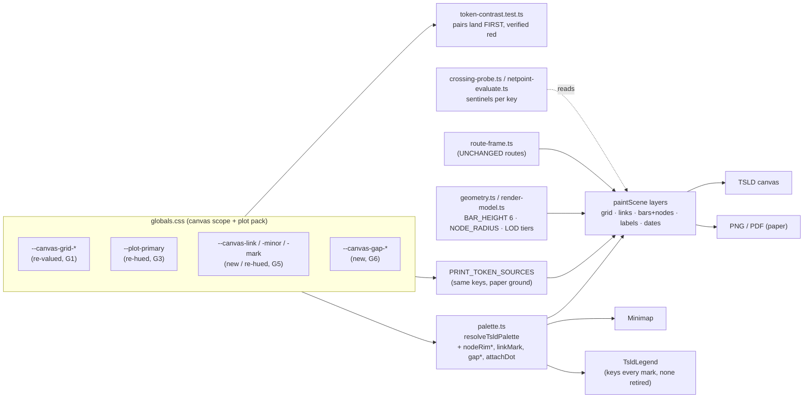
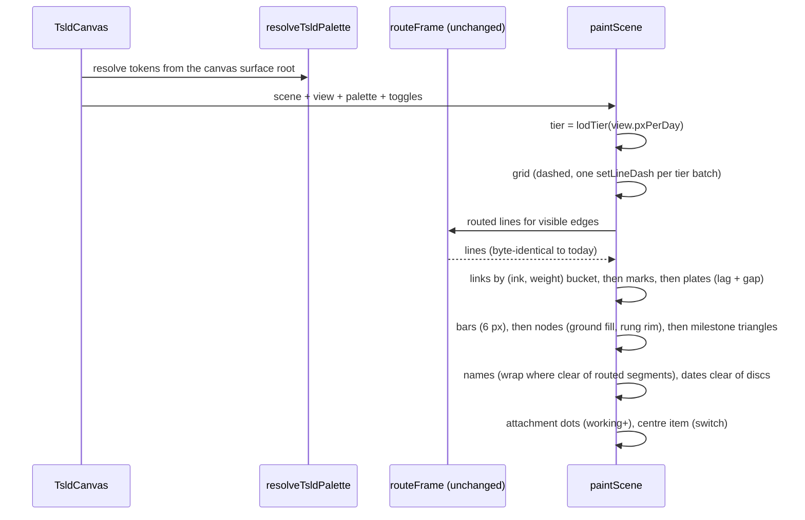
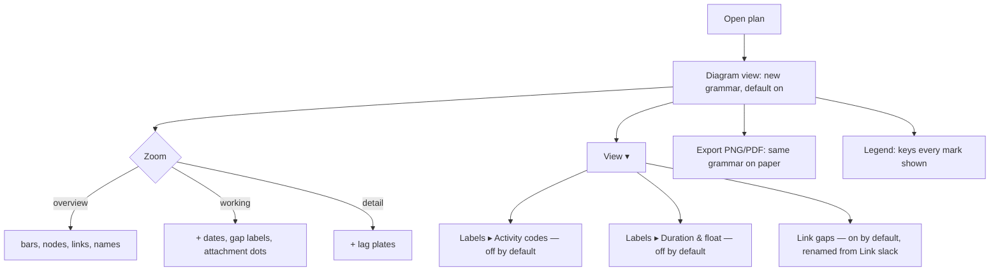

# Feature Spec: NetPoint grammar — how bars, nodes, links and text look on the TSLD canvas

- **Status:** Draft — awaiting approval before implementation
- **Author(s):** feature-analyst, for the product owner
- **Date:** 2026-09-24
- **Tracking issue / epic:** none yet
- **Roadmap link:** the TSLD legibility programme that `docs/specs/netpoint-layout/` began
- **Related ADR(s):** ADR-0157 (to be filed at M6; outline in §4.10). Amends ADR-0056 §2, ADR-0151
  D3/D4 and CQ-6, ADR-0154 D1/D3, and ADR-0054 §5. It amends ADR-0065, ADR-0063 or ADR-0102 only
  if CQ-8, CQ-7 or CQ-2 is answered against its default.
- **Evidence:** [`./reference-observations.md`](./reference-observations.md), the measured NetPoint
  reference. The prototype pictures are in [`./prototype-comparison.md`](./prototype-comparison.md),
  written separately (§4.12).

## 0. How to read this

**This spec changes only how things look.** Every bar, node, link and label stays where it is today.
Routing (ADR-0065, ADR-0149, ADR-0150), lane assignment (ADR-0152, ADR-0153), the row pitch
(ADR-0151 D6, `LANE_HEIGHT = 60`) and the CPM engine are all unchanged. There is no API change, no
schema change and no migration. FC-G1 (§4.9) turns "positions unchanged" into a checkable condition
instead of a promise.

**Where the citations point.** Code citations are at commit `12bac438`
(`.git/refs/heads/claude/schedulepoint-project-setup-naacjj`). `paint.ts` is cited by the layer comment an edit would keep (for example "Layer 3.8: the
CENTRE ITEM"), not by line number, because the prototype was applied to it while this spec was
being written. The prototype has since been reverted and kept only as
[`prototype/prototype.patch`](./prototype/prototype.patch). Other files are cited by line, and
those lines were read for this spec.

**The reference picture is not in the repository.** It is a vendor's copyrighted screenshot and the
repository is public. `reference-observations.md` records every figure taken from it, with the
method, so a reader who has the picture can re-derive each one.

**Contrast figures come from the brief and are re-derived before they are relied on.** The main
session measured the ratios in §1.2 on 2026-09-24 using the standard OKLCH → sRGB → WCAG
relative-luminance formulas. This spec checked each token value against its line. Two of the ratios
also match figures already committed: 3.15:1 and 7.57:1 at `globals.css:826-828`. The rest are
from the brief. No shell was available to recompute them. CLAUDE.md §19.11 says the brief is not
evidence, so M0-T1 recomputes every ratio in `token-contrast.test.ts` before any value moves.

## 1. Business understanding

### 1.1 Problem

The product owner asked for a first-principles review of how the canvas draws activity bars and
logic links, using what we know about NetPoint, and then supplied a real NetPoint picture to review
against. The review found that **our canvas has most of NetPoint's structure and little of its
grammar**. The previous epic already copied NetPoint's structure: a thin bar, a node at each end, the
name above, the dates below, and chevrons along each link (ADR-0151, ADR-0154). What it did not copy
is the rule that makes the reference readable: **each class of mark has its own hue and its own
shape, and the time grid is the quietest mark on the picture** (`reference-observations.md`,
principles 1–2).

The reference plan `apps/seed-cli/src/references/netpoint-power-plant.ts` was rendered in the real
app at 1646 px wide on 2026-09-24. These are the observations and their causes:

| #   | What the screenshot shows                                                                                                                              | Why (evidence)                                                                                                                                                                                                                                                                                                                                                                                          |
| --- | ------------------------------------------------------------------------------------------------------------------------------------------------------ | ------------------------------------------------------------------------------------------------------------------------------------------------------------------------------------------------------------------------------------------------------------------------------------------------------------------------------------------------------------------------------------------------------- |
| P1  | At whole-plan zoom a row of back-to-back activities reads as one continuous line. The only separator is a small hollow circle.                         | The node is 10 px across (`NODE_RADIUS = Math.max(2, BAR_HEIGHT)`, `render-model.ts:209`) and is not filled for non-critical or near-critical activities, so the bar shows through it (`paint.ts`, the node block under "The node at each end, and criticality's second channel": `if (filled) ctx.fill()` only when `rung === 'critical'`).                                                            |
| P2  | The bar and the driving link have the same colour.                                                                                                     | Both read `--primary`: `bar` and `linkDriving` at `palette.ts:164,166`. ADR-0154 D1 chose this deliberately and gave the link its own palette key so a harness could tell the two apart.                                                                                                                                                                                                                |
| P3  | The month gridlines form a cage of verticals that compete with the vertical link segments.                                                             | Month gridline 3.98:1 and year gridline 5.78:1 on the ground (`globals.css:591-592`) are both louder than a non-driving link at 3.35:1 (`:654`) or a bar at 3.15:1 (`:844`). Month gridline against non-driving link is 1.19:1, and bar against non-driving link is 1.06:1. On a time-scaled diagram most link segments are vertical, so the grid and the logic share one shape and one luminance band. |
| P4  | Each activity carries five text items (code and name above; start date, `Nd · Nd float left` and finish date below), all in one size, weight and grey. | `activityLabel` returns `{code} {name}` (`a11y.ts:48-55`). `centreItemText` returns `5d · 3d float left` (`a11y.ts:77-90`). Every text layer uses `palette.labelBeside` and `LABEL_FONT` (`geometry.ts:481`).                                                                                                                                                                                           |
| P5  | Codes double the label width and force truncation (`P_START St…`).                                                                                     | Same cause as P4. The name row is one line (`rowSlots`, `geometry.ts:135-144`), and names that do not fit are truncated, never wrapped.                                                                                                                                                                                                                                                                 |
| P6  | Neighbouring dates run together.                                                                                                                       | `docs/TECH_DEBT.md` #379 fixed one case: two dates at a shared node (`paint.ts` Layer 3.7, "One date per node"). The flanking rung still places dates beside neighbours when they do not fit inside the bar.                                                                                                                                                                                            |
| P7  | `0d float left` is printed on every critical bar.                                                                                                      | `centreItemText` prints the float whatever it is (`a11y.ts:89`), so the most common critical fact appears as text on every critical bar.                                                                                                                                                                                                                                                                |
| P8  | A 365-day waiting dash from C_SET is the loudest non-critical ink on the picture.                                                                      | ADR-0154 D3: the waiting part of a non-driving link is dashed across its whole length, so a long gap becomes a long dashed line.                                                                                                                                                                                                                                                                        |
| P9  | The whole-plan view and the detail view draw the same marks.                                                                                           | On the reserved-row path, names and dates skip their zoom gates on purpose: Layer 3 names (`reservesTextRows \|\| view.pxPerDay >= LABEL_MIN_PX_PER_DAY`, #378) and Layer 3.7 dates (`reservesTextRows \|\| … DATE_LABEL_MIN_PX_PER_DAY`). #378 was right to stop withholding names (see §4.2 G11). No layer applies a level-of-detail rule to dates, marks or labels as a set.                         |

**Why now.** The product owner says the canvas is the product. NetPoint-layout (ADR-0151–0154)
made the lines route and the rows pack. This epic makes them readable.

### 1.2 Users

Everyone who sees the TSLD canvas: Org Admin, Planner, Contributor, Viewer, and the External Guest
on a share link (`GuestPlanView.tsx` mounts `TsldPanel` inside the canvas surface, as ADR-0102
requires). This epic changes no permission and no write. The canvas does not require the pen
(ADR-0028) to be seen, and nothing here writes.

Two readers matter most:

- **The planner at the desk**, working at the Week and Month presets. They need to tell bar from
  link from grid at a glance, and to read a gap without selecting anything.
- **The reader who did not build the plan**, meaning a guest, a viewer or a printed PDF. They get the
  whole picture at once and cannot hover or select to disambiguate it. This is also why the export
  must match the screen (ADR-0103).

### 1.3 Primary use cases

1. Tell at a glance which marks are activities, which are logic and which are calendar.
2. Follow a chain of back-to-back activities and see where one ends and the next begins.
3. See how long a link waits without selecting it.
4. Read an activity's name in full, without its code and without truncation where there is room.
5. Look at the whole plan without a wall of dates, then zoom in and get the dates back.
6. Print or export the diagram and get the same grammar on paper.

### 1.4 User journeys

Open a plan → Diagram view → the canvas shows the new grammar by default. Zooming between presets
moves through the three level-of-detail tiers (§4.2 G11). `View ▾` gains two switches: activity codes
(default off) and duration & float (default off). The existing `Link slack` switch is renamed and
governs gap labels (§4.2 G6). Export → PNG/PDF shows the same grammar on paper. There is no other
journey, because this is not a workflow change. The user flow is in §4.5.

### 1.5 Expected outcomes

A planner can separate the four classes of mark (bar, node, link, grid) by hue and by shape before
reading any text. The time grid stops competing with the logic. Every text item is identity or a date,
unless a planner turns on duration and float.

### 1.6 Success criteria

Each criterion is measurable and is gated in §4.9:

- **Positions unchanged.** Routed-polyline fingerprints are byte-identical before and after on the
  four yardstick plans at three zooms, so crossings and hidden links are unchanged by construction
  (FC-G1).
- **Hue and luminance separation.** Every link ink is ≥ 3:1 on `--canvas`, `--canvas-band` and paper
  `--print` (FC-G2). The grid is ≤ its ceiling (FC-G2). Link against grid is therefore ≥ 1.67:1 by
  arithmetic (§4.2 G1). Link ink against every bar rung clears the ΔE floor (FC-G3).
- **No fact carried by colour alone** (WCAG 1.4.1, FC-G4).
- **No text collisions.** Zero text–text and zero text–node intersections, and name wrapping adds
  zero text–link intersections, all counted from the recorded painter (FC-G5).
- **Paint cost.** The ADR-0128 `canvas-draw` Week reading on the product owner's hardware is within
  baseline + 2.00 pp (FC-G7).
- **The product owner's judgement.** The prototype pictures (§4.12) and the M6 pictures read better
  than today's. This is judged, not gated, and the spec says so.

### 1.7 Open questions

The critical questions are in §5 (CQ-1 to CQ-11), each with a stated default. Work proceeds on the
defaults unless an answer overrides one.

## 2. Functional requirements

### 2.1 User stories and acceptance criteria

> **US-1 (grid)** — As any reader, I want the time grid to be the quietest mark, so that vertical
> link segments are not lost among gridlines.
>
> - **Given** the canvas at any preset **when** it paints **then** unit and month rules are drawn
>   1 px, at ≤ 1.80:1 against `--canvas` and `--canvas-band`, and the year rule is at ≤ 2.50:1 (both
>   bars committed in FC-G2). Under CQ-1's default the rules are dashed 3 on / 3 off.
> - **Given** a month boundary **when** a reader needs its date **then** the ruler above the canvas
>   states it. The ruler's month and year rows are unchanged by this epic.
> - **Given** the `Month grid` / `Year grid` switches (`tsld-toolbar-items.tsx:464-466`) **when**
>   they are off **then** nothing changes from today's off state.

> **US-2 (bars)** — As any reader, I want an ordinary activity bar to have a colour no other mark
> uses, so that I never mistake it for a link or a button.
>
> - **Given** a non-critical activity **then** its bar is 6 px, in the non-critical rung re-hued from
>   blue to green (CQ-3). Its lightness is solved (§4.2 G3), not asserted.
> - **Given** the criticality ladder **then** the existing gates hold unedited: each rung ≥ 3:1 on
>   the ground and ≥ 1.5:1 from its neighbour (`token-contrast.test.ts:314-333`).

> **US-3 (nodes)** — As any reader, I want each activity's ends to be clearly marked, so that a row of
> back-to-back activities reads as separate activities.
>
> - **Given** a task bar **then** a node of up to 15 px diameter (§4.2 G4) is drawn at each end. It
>   has a fill in the diagram ground and a rim in the rung colour. Rim weight carries criticality:
>   none < near < critical (CQ-11).
> - **Given** a bar whose finish meets the next bar's start in the same lane (the
>   `nextDrawsStartAtNode` rule, Layer 3.7) **then** exactly one node is drawn there, with the heavier
>   of the two rims.
> - **Given** an LOE, hammock or WBS-summary bracket, or a milestone **then** no node is drawn. This
>   keeps today's rule (`paint.ts`: "A bracketed span draws no node either").

> **US-4 (links)** — As any reader, I want logic links in a hue of their own, with direction marks I
> can see from the middle of a line, so that I can follow logic without confusing it with bars or grid.
>
> - **Given** an ordinary link **then** it is drawn in the link hue (CQ-4). A driving link is 2 px and
>   a non-driving link is 1 px, both ≥ 3:1 on all three grounds. Weight carries drivingness, as it
>   does today (ADR-0154 D1).
> - **Given** a link whose ends are both critical **then** it is drawn in the critical ink, as today.
>   Given both ends at least near-critical, it is drawn in the near-critical ink, as today.
> - **Given** any link longer than two mark spacings **then** filled direction marks are drawn about
>   every 40 px in the link hue's darker shade (≥ 3:1 against the link line and against the ground).
>   The per-link cap is kept so the layer stays bounded (ADR-0154 D4, `link-marks.ts:115-116`).

> **US-5 (gaps)** — As any reader, I want to read how long a link waits without selecting it, so that I
> can see slack in the logic.
>
> - **Given** a non-driving link whose waiting span (`waitingSpanX`, `link-marks.ts:47-57`) is wider
>   than the label plus 4 px, at the working tier or finer, **then** a boxed number is drawn on the
>   waiting run giving the gap in the unit CQ-5 chooses (default: working days on the plan calendar,
>   `12d`).
> - **Given** that label **then** the words spoken for that link (`summarizeLogic`, fed by
>   `slackByDependencyId`, `geometry.ts:253-289`) state the same number in the same unit.
> - **Given** CQ-5's default **then** the waiting dash is retired and the waiting run is drawn solid.

> **US-6 (text)** — As any reader, I want each activity to show its name and its dates and nothing
> else, so that the text says who and when without clutter.
>
> - **Given** an activity **then** its canvas label is the name only. The code is off by default and
>   comes back with `View ▾ ▸ Labels ▸ Activity codes` (CQ-10).
> - **Given** a name that would truncate on one line **when** a second line fits clear of every routed
>   link segment and every neighbour's text **then** the name wraps to two lines. Otherwise it
>   truncates, as today.
> - **Given** the dates **then** each date sits in the below-bar row, horizontally clear of its
>   node's disc.
> - **Given** the duration-and-float centre item **then** it is off by default and comes back with
>   `View ▾ ▸ Labels ▸ Duration & float`. When it is on, a critical activity prints its duration only,
>   because the node rim already says critical.
> - **Given** a milestone **then** its name is drawn in the same ink as other names, in bold. It is
>   never drawn in the critical red (the reference's red labels are rejected,
>   `reference-observations.md` "What does not transfer").

> **US-7 (level of detail)** — As any reader, I want the whole-plan view to show structure and the
> close view to show detail, so that neither drowns the other.
>
> - **Given** the overview, working and detail tiers (§4.2 G11) **then** each layer draws only in the
>   tiers listed for it there. Names are never withheld by tier (the #378 lesson).

> **US-8 (paper and parity surfaces)** — As a reader of an exported or printed diagram, I want the same
> grammar on paper.
>
> - **Given** Export → PNG/PDF **then** the image uses the new grammar on `--print` white. Every link
>   ink is ≥ 3:1 there (FC-G2), which is checked by decoding the real download (`e2e-export`,
>   ADR-0103).
> - **Given** the legend **then** it names every mark on the canvas and no mark that has been retired
>   (FC-G8).
> - **Given** the minimap **then** its criticality marks follow the re-hued rung and its frame gates
>   (`token-contrast.test.ts:381-390`) still pass.

### 2.2 Workflows

This epic adds no workflow. The canvas repaints under the existing ADR-0026 loop. Two new view
switches join the existing `View ▾` registry (`tsld-toolbar-items.tsx:464-507`). Like every view
switch, they are session state and are not persisted (`view-toggles.ts:32-36`).

### 2.3 Edge cases

- **A plan with no computed schedule.** No bars and no dates are drawn, as today.
- **An activity on a non-plan calendar** (ADR-0037), for the gap label. The default measures in plan
  working days (CQ-5). The label is a reading of the picture and the engine stays authoritative on
  float (`geometry.ts:218-221`).
- **A 24-hour lag calendar.** The gap is still measured on the plan calendar. The lag plate keeps
  its own meaning (ADR-0154 D5).
- **A negative waiting span (a lead that overlaps).** `waitingSpanX` returns null, so no label is
  drawn (`link-marks.ts:56`).
- **A lag plate and a gap label on one link.** One plate carries both (`+2d │ 12d`). The plate is
  never drawn twice.
- **Back-to-back bars of different rungs.** One shared node with the heavier rim.
- **Dense rows at the overview tier.** Dates are withheld by tier. Names follow today's shared-gap
  rule (Layer 3, "A gap is shared, so each side claims HALF of it"). Names never enter a shared node's
  disc, because the budget excludes the node (FC-G5).
- **A Colour-by lens** (`lenses.ts`). The lens repaints bars in its own ramp. The node rim follows the
  bar ink the lens chose (`barInkColour`, so rim and bar never disagree). The link hue is unchanged.
- **Late-Start overlay, revision ghosts, levelled ghosts, feasible window.** These keep their own
  treatments. Their pairs are re-swept against the new ground and link inks in M0.
- **The WBS band** (ADR-0063, default off, `view-toggles.ts:68-73`). Its summary bars read
  `--primary` / `--primary-foreground` at 4.5:1 (`token-contrast.test.ts:302-311`). That pair is
  re-swept after the re-hue.
- **The resource strip.** It reads `--primary` in the canvas scope for demand bars (`palette.ts`,
  `resolveResourceStripPalette`'s docblock). After the re-hue, demand bars would be green like
  activity bars. §4.11 R9 covers this.
- **A browser without `roundRect`.** Nodes fall back to squares, as today (`beginRoundedRect`).

### 2.4 Permissions

No change. Viewing the canvas is `plan:read` (or the guest share token). The two new switches are
client view state, available to anyone who can see the canvas. Nothing is pen-gated, because nothing
writes.

### 2.5 Validation rules

None at a boundary. The rules are on tokens and constants:

- Every new or re-valued colour is **inside the sRGB gamut**. `globals.css:868-872` records an
  out-of-gamut value once producing a ratio the screen never showed. It is gated by
  `token-contrast.test.ts` before the painter reads it.
- Every new geometry constant is derived with its justification. Where it depends on `BAR_HEIGHT`,
  `geometry.constant-derivation.test.ts` asserts the relationship (ADR-0151 D2).

### 2.6 Error scenarios

| Scenario                                             | Detection                                                  | User-facing result                                                                                        | Status |
| ---------------------------------------------------- | ---------------------------------------------------------- | --------------------------------------------------------------------------------------------------------- | ------ |
| A token does not resolve in jsdom or the export root | `token(name, fallback)` in `palette.ts`                    | The fallback literal paints. Fallbacks are the shipped values, computed (`palette.ts:239-250`)            | n/a    |
| A colour string that Canvas 2D cannot parse          | `fillStyle` silently keeps its previous value (ADR-0121)   | The painter throws in development, which is the ADR-0121 guard, extended to every new key                 | n/a    |
| The web font has not loaded when a label is measured | the `layers/text-measure.ts` guard (`geometry.ts:476-480`) | Bold milestone names get their own memo key (§4.2 G7), so a regular-weight width is never reused for bold | n/a    |
| A new mark is stroked in a link sentinel colour      | the `crossing-probe.ts` control throws on a count mismatch | Harness refuses to judge (FC-G0)                                                                          | n/a    |

## 3. Technical analysis

| Area           | Impact   | Notes                                                                                                                                                                                                                                                                                                                                                                                    |
| -------------- | -------- | ---------------------------------------------------------------------------------------------------------------------------------------------------------------------------------------------------------------------------------------------------------------------------------------------------------------------------------------------------------------------------------------- |
| Frontend       | **high** | Tokens (`globals.css`), palette (`palette.ts`), painter layers (`paint.ts`: grid, links, bars/nodes, labels, dates, centre item), link marks (`link-marks.ts`), geometry constants (`geometry.ts`, `render-model.ts`), legend (`TsldLegend.tsx`), view switches (`view-toggles.ts`, `tsld-toolbar-items.tsx`), print palette (`PRINT_TOKEN_SOURCES`), minimap (resolves the same tokens) |
| Backend        | none     | `computeSchedule` is not imported. No module is touched                                                                                                                                                                                                                                                                                                                                  |
| Database       | none     | No model, column, index or migration. `database-architect` is not engaged because there is nothing to design (§19.3 protects that judgement, it does not forbid it)                                                                                                                                                                                                                      |
| API            | none     | No endpoint or DTO changes                                                                                                                                                                                                                                                                                                                                                               |
| Security       | none     | No input, no auth change. The CSP is unaffected (no new origin, no font file)                                                                                                                                                                                                                                                                                                            |
| Performance    | **med**  | Dashed grid (`setLineDash` per tier batch), gap labels (one `measureText` per visible label, memoised), wrap test (per truncating name, against the frame's routed segments), bold font key. ADR-0056 rejected dashed gridlines partly on "rasterisation cost" without recording a measurement (`0056:129-130`), so FC-G7 measures it                                                    |
| Infrastructure | low      | One new Playwright config and CI step for the journey (ADR-0138 shard assignment, `check:e2e-roster`). This is an ADR-0105 trigger, and this spec is its answer                                                                                                                                                                                                                          |
| Observability  | none     |                                                                                                                                                                                                                                                                                                                                                                                          |
| Testing        | **high** | Contrast pairs (M0), constant derivations, lane containment, text intersection counts, recorder controls, golden log re-baseline by hand, paint budgets, legend census, export decode, a new journey, and the ADR-0128 reading owed on the product owner's hardware                                                                                                                      |

### 3.1 Files named (at `12bac438`)

- `apps/web/src/styles/globals.css`: `--canvas` `:407`, `--canvas-band` `:408`,
  `--canvas-grid-day/-month/-year` `:582,591,592`, `--canvas-link-minor` `:654`,
  `--plot-primary` `:844`, `--plot-ring` `:853`, `--plot-destructive` `:879`,
  `--plot-warning` `:886`, `--print` `:550`. The ladder's derivation is at `:819-843`.
- `apps/web/src/styles/token-contrast.test.ts`: the criticality ladder `:250-333`, the plot pack
  `:335-368`, grid and link floors `:850-899`, minimap grounds `:381-390`, WBS band `:299-312`.
- `apps/web/src/features/tsld/render/geometry.ts`: `LANE_HEIGHT` `:70`, `BAR_HEIGHT` `:80`,
  `BAR_PAD` `:93`, `rowSlots` `:135-144`, `MIN_TARGET_PX` `:159`, `LABEL_LINE_H` `:176`,
  `edgeGapDays` `:223-242`, `slackByDependencyId` `:253-289`, `LABEL_FONT` `:481`, `ZOOM_TARGET_DAYS`
  `:504-510`.
- `apps/web/src/features/tsld/render/render-model.ts`: `NODE_RADIUS` `:209`, `CriticalityRung`
  `:244-255`.
- `apps/web/src/features/tsld/render/link-marks.ts`: `linkRung` `:24-31`, `waitingSpanX` `:47-57`,
  `splitRunsByX` `:67-112`, chevron constants `:115-123`, `lagPlateAt` `:182-200`.
- `apps/web/src/features/tsld/render/palette.ts`: live keys `:149-220`, `PRINT_TOKEN_SOURCES`
  `:251-284`.
- `apps/web/src/features/tsld/render/route-frame.ts`: `workingWalk` `:90-94`, lag handles gated on
  `scene.lagHandles` `:126-129`.
- `apps/web/src/features/tsld/render/a11y.ts`: `activityLabel` `:48-55`, `centreItemText` `:77-90`.
- `apps/web/src/features/tsld/render/view-toggles.ts`: `linkSlack` `:46-50`, defaults `:87-122`.
- `apps/web/src/features/tsld/toolbar/tsld-toolbar-items.tsx`: view switches `:464-507`.
- `apps/web/scripts/crossing-probe.ts`: `LINK_SENTINELS` `:209-216`, `linkPaths` `:266-271`, and
  `apps/web/scripts/netpoint-evaluate.ts`, which imports the same sentinels.

### 3.2 What does not change, and why that holds

- **The routed polylines.** Routing reads the bar's centre-line and the clear half-band. At
  `BAR_HEIGHT` 5 the centre-line is `BAR_PAD + BAR_HEIGHT / 2 = 27.5 + 2.5 = 30` px into the lane. At
  6 it is `27 + 3 = 30`. `clearHalfBandPx` (`geometry.ts:142`) is `27.5 − 2 − 14 = 11.5` at 5 and
  `27 − 2 − 14 = 11` at 6. `gutterChannels` (`link-routing.ts:559-567`) gives `⌊(11.5 − 1)/3⌋ = 3`
  steps and `⌊(11 − 1)/3⌋ = 3` steps respectively, so 7 channels either way. **That is arithmetic
  from the code, not a measurement.** FC-G1 is the measurement: it compares route fingerprints before
  and after.
- **`rowSlots` stays derived from the bar, not the node.** A 15 px node overhangs a 6 px bar by
  4.5 px on each side. Deriving the text rows from the node would shrink the clear band to
  `(60 − 15)/2 − 16 = 6.5` px, dropping `gutterChannels` from 7 to 5 (`⌊5.5/3⌋ = 1` step, 3 channels)
  and **moving links**. So text keeps its rows, and G4/G7 keep text horizontally clear of the discs.
- **The engine and the ADR-0034 parity gate.** The CPM engine is not imported. There is nothing
  here to hold parity for.

### 3.3 Dependencies

- NetPoint-layout has landed (ADR-0151–0154). This epic changes its marks, not its geometry.
- The prototype (§4.12) must be photographed before M0 commits the conditions. The pictures inform
  CQ answers and are not a measurement.
- The owed ADR-0128 baseline reading at Week on the **current** painter. `docs/TECH_DEBT.md` #75
  item 9 records one taken on 2026-09-23 (CLAUDE.md §17). M0-T6 uses it if it is still valid and
  records whether it is.

## 4. Solution design

### 4.1 The grammar

| G   | Mark               | Today                                                                                                 | Proposed                                                                                                                             | Token / constant                                                       | Amends                                                                                        |
| --- | ------------------ | ----------------------------------------------------------------------------------------------------- | ------------------------------------------------------------------------------------------------------------------------------------ | ---------------------------------------------------------------------- | --------------------------------------------------------------------------------------------- |
| G1  | Time grid          | Solid. Month 3.98:1, year 5.78:1, day texture                                                         | Unit and month ≤ 1.80:1, year ≤ 2.50:1, 1 px, dashed 3/3 (CQ-1)                                                                      | `--canvas-grid-*` re-valued                                            | ADR-0056 §2 (no dash), and the 1.4.11 month floor in `token-contrast.test.ts:342-344,853-856` |
| G2  | Ground             | `oklch(0.958 0.004 250)`                                                                              | Unchanged by default (CQ-2)                                                                                                          | `--canvas`                                                             | ADR-0102 only if CQ-2 = white                                                                 |
| G3  | Bar                | 5 px, blue `--plot-primary` 3.15:1                                                                    | 6 px, non-critical rung re-hued to green at solved lightness                                                                         | `BAR_HEIGHT`, `--plot-primary`                                         | ADR-0151 D3 (5 → 6)                                                                           |
| G4  | Node               | 10 px, filled only when critical, rim `--foreground`/`--border`                                       | ≤ 15 px, fill = ground, rim in rung colour, rim weight = rung. Shared at back-to-back ends                                           | `NODE_RADIUS`, palette keys `nodeRim*`                                 | ADR-0151 D4 / CQ-6 (filled/hollow → rim weight)                                               |
| G5  | Link               | Driving `--primary` (the bar's colour), non-driving `--canvas-link-minor` grey                        | Link hue of its own. Driving 2 px, non-driving 1 px. Critical/near keep rung inks. Marks every ~40 px in a darker shade              | `--canvas-link`, `--canvas-link-minor` re-hued, `--canvas-link-mark`   | ADR-0154 D1, D4                                                                               |
| G6  | Waiting / gap      | Dash over the waiting run. `Nd` chip only on the selected activity's links (`linkSlack`, default off) | Dash retired. Boxed gap label on every waiting run ≥ label + 4 px, working tier and finer. Unit per CQ-5                             | `--canvas-gap-ink`, `--canvas-gap-plate` (or reuse the lag plate pair) | ADR-0154 D3, ADR-0054 §5                                                                      |
| G7  | Text               | `code name` above, dates + centre item below, all `LABEL_FONT` grey, truncate                         | Name only (codes toggle, CQ-10). Wrap to two lines where clear. Dates clear of discs. Centre item off (toggle). Milestone names bold | `activityLabel` split, font keys                                       | ADR-0151 D3 text rows kept                                                                    |
| G8  | Milestone          | Diamond, `MILESTONE_RADIUS = 7`                                                                       | Downward triangle, filled in rung colour (CQ-6). No hourglass by default                                                             | glyph path                                                             | ADR-0052 M4 glyph                                                                             |
| G9  | Area label         | WBS band (default off)                                                                                | Unchanged by default (CQ-7)                                                                                                          | —                                                                      | ADR-0063 only if CQ-7 changes                                                                 |
| G10 | Diagonals          | Rejected (ADR-0065)                                                                                   | Unchanged by default (CQ-8)                                                                                                          | —                                                                      | ADR-0065 only if CQ-8 changes                                                                 |
| G11 | Level of detail    | Names and dates at every zoom on the reserved-row path                                                | Three tiers keyed to px/day. Thresholds derived in M0                                                                                | `LOD_*` constants                                                      | ADR-0054 §3 date gate, restated                                                               |
| G12 | Mid-bar attachment | A dot only while the lag drag is armed (`route-frame.ts:126-129`)                                     | A small filled dot at every mid-bar anchor, always drawn                                                                             | palette key `attachDot`                                                | ADR-0052 M1 (handles unchanged)                                                               |

### 4.2 Each decision, with its reason

**G1 — the grid is the quietest mark.** The reference draws one 1 px rule per schedule unit, dashed
3 on / 3 off, in `#C8C8C8`. That measures 1.67:1 on white, and there is no heavier month or year rule
in the plot (`reference-observations.md`, "Time grid"). Ours is louder than the logic (P3).

Proposed: unit and month rules ≤ 1.80:1 and the year rule ≤ 2.50:1 against both plot grounds, 1 px,
dashed. The bars are **ceilings** and are gated as ceilings (FC-G2). They would be the first ceilings
in `token-contrast.test.ts` on decoration loudness. ADR-0102 declined a ceiling for halation
(`docs/TECH_DEBT.md` #157, closed by that ADR). That was a different subject: a ceiling on a
foreground ink over a ground. This one bounds how loud a rule may be, and it is well-defined because
the rule has a job only while it stays below the logic.

**What this reverses, stated plainly.** `token-contrast.test.ts:342-344` records the month rule at
2.08:1 as "a live WCAG 1.4.11 failure", on the argument that "a month boundary on a time-scaled
diagram is the axis a planner reads a bar's position off". G1 overturns that assertion, and needs an
argument, not just a new value. The argument: under G7 every activity prints its own dates at its
nodes, and the ruler states every month and year at the top of the canvas. So the rule is no longer
the only way to read a position. It becomes texture, like the day tier, which is already reported
and not asserted (`:354-357`).

**That argument goes to the accessibility reviewer at M0, before any value moves.** If the
reviewer rejects it, CQ-1's fallback applies: the month rule stays ≥ 3:1 in ink but is dashed, so its
ink coverage halves and it reads quieter while still meeting 1.4.11 in its pixels.

**The dash conflict with ADR-0056.** ADR-0056 §2 reserves dash for the Today line and the cursor
guideline (`0056:61-62`), and lists dashed gridlines as rejected (`:129-130`). G6 retires the waiting
dash, which frees one meaning. The Today line stays separable by three things that do not depend on
dash: its ink (`--destructive`, 7.57:1, which is at least 4:1 against a ≤ 1.80:1 rule on the same
ground), its weight, and its pill. The rasterisation-cost objection has no recorded measurement, so
FC-G7 measures it. If the dash fails that limb, the rules go solid at the same ceilings.

**Arithmetic that comes free.** On one ground, a link at ≥ 3:1 and a rule at ≤ 1.80:1 are at least
`3 / 1.80 = 1.67:1` apart, because both ratios share the ground term. Today month against non-driving
link is 1.19:1.

**G2 — the ground stays near-white by default.** The reference ground is pure white. Ours is
`oklch(0.958 0.004 250)` (`globals.css:407`), deliberately darker than the page so the diagram has a
ground of its own (`:396-400`). Pure white would collapse `--canvas` onto `--card` and move every
canvas contrast pair. CQ-2 asks. By default G2 changes nothing.

**G3 — the ordinary bar gets a hue no other mark uses.** Today the ordinary bar is the blue of the
driving link (`palette.ts:164,166`) and shares hue 249 with the selection ring `--plot-ring`
(`globals.css:853`). The reference bar is 6 px (`reference-observations.md`, "Activity bar").

Proposed: 6 px, and `--plot-primary` re-hued to green, starting from lightness L 0.624. **The
lightness is solved, not kept.** The ladder at `globals.css:819-843` was searched so that each rung
is ≥ 3:1 on the ground and ≥ 1.5:1 from its neighbour. The ordinary↔near pair also has a 1.70:1
ceiling (`:874-878`), and 3.15:1 on the ground has "little margin" (`token-contrast.test.ts:874`).
WCAG luminance at equal OKLCH L is not identical across hues, so a green at L 0.624 may fall below
3:1 or leave the 1.5–1.70 window. M0-T2 solves the lightness for the chosen hue against all ladder
constraints and the gamut, the way the existing rungs were solved.

`--plot-primary-foreground` stays the paired ink and keeps its 4.5:1 gate for the WBS band and lens
labels (`token-contrast.test.ts:302-311`). `--plot-primary` means "an ordinary activity" only inside
the canvas scope (`globals.css:810-817`). M0-T3 lists every DOM consumer that resolves under that
scope, because each one turns green with it.

**G4 — the node is the largest mark, and it separates activities.** The reference node is a 15 px
hollow circle with a white centre, one per start and finish, shared where a finish meets the next
start (`reference-observations.md`, "Node").

Proposed: diameter up to 15 px, fill in the diagram ground (`--canvas` on screen, `--print` on
paper, through the palette, never a literal), rim in the rung colour. **The ground fill is what
breaks a continuous line into separate activities** (P1).

**Criticality's non-colour channel moves from filled/hollow to rim weight.** A red-filled disc on a
red line would not interrupt the line, which defeats the reason for the fill. Default rims: 1 px
none, 2 px near, 3 px critical. The three states must survive a greyscale render at 100 % zoom,
judged by the accessibility reviewer in M2 (FC-G4). If they do not, critical also gets a filled
centre dot of `NODE_RADIUS / 2`. This settles ADR-0151 CQ-6 ("which glyph carries each rung",
`render-model.ts:240-242`), so it is a product-owner decision (CQ-11). The count stays three rungs
in and three rungs out.

**Diameter and text.** A 15 px disc on a 6 px bar overhangs by 4.5 px, 2.5 px into each text row
(`rowSlots`: text starts `ROW_TEXT_GAP_PX = 2` from the bar). `rowSlots` does not change (§3.2).
Instead, names and dates are budgeted to stay horizontally clear of the discs. FC-G5 counts
text–node intersections from the recorded painter and requires zero. If 15 px cannot meet that
without withholding more than today's text, M2 takes the largest diameter that can and records the
number.

**New palette keys.** `nodeRim`, `nodeRimNear` and `nodeRimCritical` resolve to the rung tokens,
following ADR-0154's `linkDriving` precedent: a mark gets its own key so a harness can tell it from
a link. See §4.11 R2.

**G5 — links get a hue of their own.** The reference link is yellow with red direction marks every
~41 px, and its line fails 1.4.11 at 1.28:1. It is visible only because of its marks
(`reference-observations.md`, "What does not transfer"). We keep the principle and drop the value.

Proposed: a new `--canvas-link` for ordinary driving links. `--canvas-link-minor` is re-hued to the
same family for non-driving links, still ≥ 3:1, with weight separating the two as today. Each is
≥ 3:1 on `--canvas`, `--canvas-band` and `--print`. Default hue family: violet, around hue 300 (CQ-4).
Green (bar), amber (near), red (critical), blue (selection ring) and grey (grid) are all taken, and
teal sits too close to the new green.

Critical and near-critical driving links keep the rung inks (ADR-0154 D1, `linkRung`,
`link-marks.ts:24-31`). Direction marks are drawn about every 40 px, in a darker shade
(`--canvas-link-mark`), ≥ 3:1 against the link line and against the ground. On critical links the
mark uses the critical ink's darker step. The cap stays at six per link unless FC-G7 allows more
(ADR-0154 D4 bounds the layer by it). A 40 px spacing reaches six marks in 280 px of path, which
changes where the cap binds, and FC-G7 measures it.

**Link hue against bar hue cannot be judged by contrast ratio.** `globals.css:437-439` records that a
contrast ratio "is blind to a chroma shift at equal lightness". FC-G3 therefore uses the ΔE
instrument that file already gates, with a floor, and reports the value.

**G6 — the gap is a number on the link.** The reference puts a small boxed number on every link that
crosses time, in schedule units (five links checked, `reference-observations.md`). We draw a dash
across the waiting run (ADR-0154 D3) and a chip only on the selected activity's links (`linkSlack`,
`view-toggles.ts:46-50`).

Proposed: retire the dash (the run is drawn solid) and draw a boxed label on the waiting run of
every non-driving link whose run is wider than the label plus 4 px, at the working tier or finer
(G11). The `Link slack` switch is renamed `Link gaps`, defaults **on**, and governs the label, so
the product does not have two marks for one fact (ADR-0093's defect). Where a lag plate
(`lagPlateAt`, `link-marks.ts:182-200`) and a gap label fall on one link, one plate carries both.

**Three consequences this spec states rather than hides:**

1. ADR-0154 D3 is one day old and was the product owner's own request ("the free-float gap shown as
   a line"). CQ-5 asks them to reverse it with the prototype pictures in hand.
2. `view-toggles.ts:46-50` gives a reason against labels on every link: "a number on every edge of
   a real network is noise". The reference is the counter-evidence, and the tier and minimum-length
   rules are the mitigation. FC-G10 has the product owner judge the result on Unit 300, not just the
   reference plan.
3. **The unit.** `edgeGapDays` is calendar days by design (`geometry.ts:218-221`). Every other `d`
   on the canvas (duration, float) is working days. CQ-5's default is working days on the plan
   calendar, walked with the client's existing `makeWorkingDayWalk` (`route-frame.ts:90-94`). With no
   calendar loaded, the label falls back to elapsed days and says so (`12 cal d`). The spoken slack
   (`slackByDependencyId`) switches unit in the same change, so screen and speech state one number
   (WCAG 1.1.1, the `geometry.ts:245-251` rule).

**A basis to verify before M3 builds on it.** `slackByDependencyId` reads `earlyStart` /
`earlyFinish` from the plan's activities (`geometry.ts:275-283`). The painter's `waitingSpanX` reads
the drawn rects, and the canvas draws the placed span (ADR-0148). If those differ on a placed plan,
spoken slack and drawn gap already disagree today. M0-T5 checks this on `chain-3-placed` and files it
if it is true. The spec does not assert it.

`docs/TECH_DEBT.md` #374 item 6 (a zero-lag link's type is not spoken) matters more once the label's
meaning depends on type. M3-T4 folds it in.

**G7 — text says identity and dates.** The reference prints names without codes, wraps long names to
two lines, prints dates under the nodes, and prints no duration or float
(`reference-observations.md` principle 4).

- **Name only.** `activityLabel` (`a11y.ts:48-55`) is currently the single source for both the
  canvas label and the accessible name, "so the visible label and the spoken/AT name can never
  disagree on which activity a bar is". The canvas gets its own `canvasLabel` (name, or `code name`
  when codes are on). The accessible name keeps `code name`. The canvas is `aria-hidden`, and the
  control is the listbox option (ADR-0026 D7), whose accessible name still contains the visible
  words. That is WCAG 2.5.3's requirement. It is no longer a leading substring, which is 2.5.3's
  best practice. §4.11 R7 and M0-T4 take this to the accessibility reviewer. There is **no canvas
  tooltip today** (a search of `features/tsld/components` for tooltip finds no file), so the code
  stays reachable through the selection panel, the Activities table and the listbox. A canvas
  tooltip would be a new surface and is out of scope.
- **Wrap where clear.** The name row is one 14 px line (`LABEL_LINE_H`, `geometry.ts:176`). A second
  line needs `2 × 14 + 2 = 30` px above the bar against a 27 px pad, so it reaches across the lane
  boundary into the clear band where gutter legs run. Moving the rows would move links (§3.2), so the
  rule is local: the painter already has the frame's routed lines (`routeFrame` runs before labels)
  and wraps a name only where the second line's box meets no routed segment and no other text. Where
  it does meet one, the name truncates as today. FC-G5 counts it.
- **Dates clear of discs.** A start date begins at the start node's right edge plus a gap. A finish
  date ends at the finish node's left edge minus a gap. The `nextDrawsStartAtNode` "one date per
  node" rule (#379) stays.
- **Centre item off.** Default off, behind `View ▾ ▸ Labels ▸ Duration & float`. When on, a critical
  activity prints its duration only (P7).
- **Bold milestone names.** The label width memo is keyed by text alone ("the module-scope width memo
  is keyed by text alone, so a metric change would poison it", `paint.ts` Layer 3 label comment), so
  a bold face needs its own memo key. Bold, never red.

**G8 — milestones (CQ-6).** The reference draws a downward triangle, green or red, and an hourglass
for the project's start and finish. The default here is a downward triangle for every milestone,
filled in its rung colour, sized to the existing `MILESTONE_RADIUS` envelope so hit-testing and lane
containment keep their numbers. The **hourglass is not built by default**, because nothing in the
data says "this is the project's start". Inferring it from topology (a start milestone with no
predecessor) would be a guess, and a plan can have several.

Criticality's non-colour channel for a milestone moves with its glyph: critical gets a 2 px
foreground outline, near gets a 1.5 px outline, none gets no outline. FC-G4 checks this in
greyscale. ADR-0155's end-of-day placement for finish milestones is unchanged; only the glyph is new.

**G9 — area labels (CQ-7).** The reference prints bold labels inline at the start of a row. We have no
per-lane label entity. A row is a lane, and a lane can hold activities from several WBS parents. The
options are: derive a label only when every activity in the lane shares one WBS parent; persist a
lane label (a schema change, which goes through `database-architect` and triggers ADR-0105); or keep
the WBS band. The default is to keep the band and build nothing here. ADR-0149 D7 measured the band's
row compression at +11.6 % to +26.9 % crossings, which is why it defaults off, and that is
unchanged.

**G10 — diagonals (CQ-8).** The reference draws some links as straight diagonals. ADR-0065 rejected
diagonals because on a time axis "a diagonal run asserts that something is happening across the days
it crosses" (`0065:168-173`). Every crossing instrument also counts diagonals separately and refuses
to judge them (`crossing-probe.ts:283-301`). The default is to keep routing orthogonal.

**G11 — three tiers of detail.** The tiers are keyed to `view.pxPerDay`:

| Tier     | Draws                                                                                                                              | Withholds                                                   |
| -------- | ---------------------------------------------------------------------------------------------------------------------------------- | ----------------------------------------------------------- |
| overview | grid, bars, nodes, links, direction marks (the cap is proportional to link length), names (never withheld, #378), milestone glyphs | dates, gap labels, lag plates, centre item, attachment dots |
| working  | + dates, gap labels, attachment dots                                                                                               | lag plates, centre item unless its switch is on             |
| detail   | + lag plates, and the centre item when its switch is on                                                                            | —                                                           |

**The thresholds are measured, not written.** M0-T4 renders the reference plan and Unit 300 across
zooms and records, for each layer, the fraction of its items the existing collision ladders suppress.
A layer's tier starts at the zoom where that fraction falls below one half. The constants are then
committed with that reason beside them (ADR-0151 D2). For orientation only: at 1646 px the presets
land around 117, 55, 18, 4.5 and 1.5 px/day for Day through Year (`ZOOM_TARGET_DAYS`,
`geometry.ts:504-510`). The reference draws its dates at whole-plan scale because its plan runs at
about 2 px/day in 32 px half-month columns. Ours runs at about 1 px/day. So the overview tier is not
a departure from the reference, just a response to a denser scale.

**G12 — the mid-bar attachment dot.** The reference draws a small filled dot where an SS or FF link
joins partway along a bar. We already compute that anchor (`lagAnchorPoints`, `route-frame.ts:151-161`)
and draw a lag run on the bar for a non-zero lag. The dot exists only as the **lag-drag handle**, and
only while `scene.lagHandles` is set (`route-frame.ts:126-129`), which is editing-only. Proposed: a
small (4 px) always-drawn dot at every anchor that is not at a node, in the link hue's mark shade, at
the working tier and finer. The drag handle is unchanged and still draws above it when armed.

### 4.3 Architecture overview

### 4.4 Data flow (one frame)

### 4.5 User flow

### 4.6 Database and API changes

None. No model, column, index, constraint, migration, endpoint or DTO changes.

### 4.7 Component changes

- `TsldLegend.tsx`: new entries for the node rungs, link hue and marks, gap label, attachment dot
  and milestone triangle. The waiting-dash entry is removed (ADR-0154 D7's rule: key every mark and
  none retired).
- `tsld-toolbar-items.tsx` / `view-toggles.ts`: `activityCodes` (default off) and `centreItem`
  (default off) join the Labels group. `linkSlack` is relabelled `Link gaps` and defaults on. Keys
  are kept where possible (the `floatTails` precedent, `view-toggles.ts:27-31`).
- No new component and no new primitive.

### 4.8 Approach and alternatives

- **Default-on with no flag (CQ-9).** ADR-0088 D1: a `VITE_` flag is inlined at build time and no
  operator can switch it off, so it is not a rollback. The rollback is a commit boundary, one per
  milestone. A "classic look" switch in `View ▾` would keep two painters alive indefinitely, the
  Class A shape ADR-0088 names.
- **Re-hue `--plot-primary` rather than add `--canvas-bar`.** `globals.css:810-817` says the
  diagram's `--primary` "now HAS somewhere to change". A second bar token would split one meaning
  across two names. The cost is M0-T3's consumer inventory.
- **A palette key per new mark rather than reusing rung keys.** Harnesses tell marks apart by key and
  sentinel. A rim stroked with `palette.critical` would share the critical-link sentinel
  (`crossing-probe.ts:211`).
- **Keep text rows bar-derived rather than node-derived.** Node-derived rows would move links (§3.2).
- **Rejected: NetPoint's yellow link line.** It measures 1.28:1 and fails WCAG 1.4.11
  (`reference-observations.md`).
- **Rejected: NetPoint's red milestone and area labels.** Using red for emphasis weakens red's
  meaning (ibid.).
- **Rejected: hue alone for criticality.** Red against green measures 1.01:1 in luminance (ibid.).
  The ladder and the node rims keep a lightness and shape channel.

### 4.9 Falsification conditions (committed at M0, before building)

M0 copies these verbatim into `./conditions.md` in their own commit. After that a bar may be amended
only in a dated entry that quotes that commit, never edited in place (the NetPoint-layout pattern,
`docs/specs/netpoint-layout/conditions.md:7-10`).

**Yardstick plans:** `plan:reference-netpoint-power-plant`, `chain-3-placed`, `small-17`, Unit 300
(`p6_torture_test_v1.xer`), `scale-2000`. **Zooms:** 1, 4, 12 and 40 px/day.

| ID         | Condition                     | Bar                                                                                                                                                                                                                                                                                                                                                                                                                                                                                     | If it fails                                                                                                      |
| ---------- | ----------------------------- | --------------------------------------------------------------------------------------------------------------------------------------------------------------------------------------------------------------------------------------------------------------------------------------------------------------------------------------------------------------------------------------------------------------------------------------------------------------------------------------- | ---------------------------------------------------------------------------------------------------------------- |
| **FC-G0**  | Instruments see the new marks | Every new mark has its own palette key and a distinct harness sentinel. `crossing-probe.ts` and `netpoint-evaluate.ts` controls re-verified red against a node rim and a gap-label box stroked in a link sentinel. `linkPaths` count equals the visible-edge count                                                                                                                                                                                                                      | No milestone that adds a mark ships                                                                              |
| **FC-G1**  | Positions unchanged           | Routed-polyline fingerprints (`crossing-probe.ts`) **byte-identical** before and after each milestone on all yardstick plans at all zooms. Hence `x/link` and hidden-link counts identical                                                                                                                                                                                                                                                                                              | Any difference is a defect in that milestone and it does not ship                                                |
| **FC-G2**  | Contrast                      | Pairs land in `token-contrast.test.ts` before the painter reads the token, each verified red. Every link ink (driving, minor, near, critical) ≥ 3:1 on `--canvas`, `--canvas-band`, `--print`. Mark shade ≥ 3:1 on its line and on the ground. Node rims ≥ 3:1 on the ground. Gap-label text ≥ 4.5:1 on its plate. Ladder: each rung ≥ 3:1, neighbours ≥ 1.5:1, the 1.70:1 ceiling kept. Grid ceilings: unit and month ≤ 1.80:1, year ≤ 2.50:1. Every value in gamut                    | The value is re-solved. No bar moves                                                                             |
| **FC-G3**  | Hue separation                | ΔE (the `globals.css:433-439` instrument) between link ink and each bar rung ≥ 5 asserted (the existing "must differ" floor), value reported                                                                                                                                                                                                                                                                                                                                            | Re-solve the link hue                                                                                            |
| **FC-G4**  | WCAG 1.4.1                    | Each fact has a non-colour channel: criticality (rim weight / milestone outline + Tier-2 words), drivingness (weight), direction (marks + head), gap (label text), attachment (dot shape). A unit case per mark, plus a greyscale render reviewed by the accessibility reviewer                                                                                                                                                                                                         | Critical node gets a centre dot (§4.2 G4). The milestone keeps an outline                                        |
| **FC-G5**  | Text                          | From the recorded painter on all plans at 4 and 12 px/day: text–text intersections **0** (the FC-N6a instrument), text–node-disc intersections **0**, text–routed-segment intersections added by wrapping **0**. `paint.lane-containment.test.ts` green with new cases for node, triangle, gap plate and attachment dot                                                                                                                                                                 | Node diameter reduced to the largest that holds. Wrapping withdrawn if its limb fails                            |
| **FC-G6**  | Golden log                    | `paint.golden.test.ts` re-baselined by hand against a prediction committed first, listing which layers' entries change and roughly how. The diff is confined to the predicted layers. No `-u` (ADR-0034)                                                                                                                                                                                                                                                                                | An unpredicted change is investigated before the baseline moves                                                  |
| **FC-G7**  | Paint cost                    | ADR-0128 `canvas-draw` at 500 and 2,000, on the product owner's hardware: Week dropped-frame % ≤ baseline + **2.00 pp**, spread reported, delta < spread = INDETERMINATE. Fit reported only. The probe scene paints the new marks (gap labels > 0, attachment dots > 0, dashed grid on). Counting-stub budgets: `setLineDash` calls per frame ≤ 1 per grid tier, gap labels ≤ visible links, `measureText` memoised per (text, font). `paint.routing-budget.test.ts` green **unedited** | Grid goes solid at the same ceilings. Gap labels move to detail tier. Mark spacing reverts to 56 px. Re-measured |
| **FC-G8**  | Legend                        | A structural test maps every palette key the painter reads for a mark to a legend entry, and every legend entry to a key the painter reads                                                                                                                                                                                                                                                                                                                                              | Defect: the milestone does not ship                                                                              |
| **FC-G9**  | Paper and parity              | `print-palette.structural.test.ts` sweeps the new keys. `e2e-export` decodes the real PNG and finds link-hue pixels and node-ground pixels. Minimap gates green. Guest view renders under the canvas scope                                                                                                                                                                                                                                                                              | Defect                                                                                                           |
| **FC-G10** | The picture                   | Before/after of the reference plan and Unit 300 at the three tiers, shown to the product owner at M2, M3 and M4                                                                                                                                                                                                                                                                                                                                                                         | Judged, not gated, and recorded as judged                                                                        |

**Honest limits.** FC-G1 proves the lines did not move. It does not prove the picture is easier to
read, which only FC-G10 can speak to. FC-G7's Fit limb stays ungraded, as ADR-0128 requires. The
greyscale review in FC-G4 is a judgement, the weak instrument §19.11 describes.

### 4.10 ADR-0157 outline (filed at M6)

ADR-0156 is the highest number in `docs/adr/` (listed 2026-09-24), so this is 0157. It is to be
re-checked at filing.

- **Title:** A mark's class is its hue and its shape, and the grid is the quietest mark.
- **Context:** the observations table (§1.1). The reference's measured grammar and its measured
  defects.
- **Decisions:** D1 grid ceilings and dash (amends ADR-0056 §2 and the 1.4.11 month floor, with the
  accessibility reviewer's ruling). D2 bar 6 px, green rung solved (amends ADR-0151 D3). D3 node rim
  weight (settles ADR-0151 CQ-6). D4 link hue, marks every ~40 px (amends ADR-0154 D1/D4). D5 gap
  label replaces waiting dash and the selection chip, with its unit (amends ADR-0154 D3, ADR-0054 §5).
  D6 text: name-only canvas label split from the accessible name, wrap-where-clear, centre item off.
  D7 LOD tiers, measured thresholds. D8 milestone triangle. D9 attachment dot. D10 no flag (ADR-0088
  D1).
- **Alternatives:** yellow link line, red labels, hue-only criticality, node-derived text rows,
  `--canvas-bar`, a classic-look switch.
- **Consequences:** golden log re-baselined; harness sentinels extended; a ceiling gate exists for
  the first time; legend changes; any rejected CQ defaults recorded.
- **Parity:** the CPM engine is not imported and no migration runs.

### 4.11 Risks

| #   | Risk                                                                                                                                                                                                                                                                   | Mitigation                                                                                                                                                            |
| --- | ---------------------------------------------------------------------------------------------------------------------------------------------------------------------------------------------------------------------------------------------------------------------- | --------------------------------------------------------------------------------------------------------------------------------------------------------------------- |
| R1  | **Golden paint log re-baseline** hides an unintended change among many intended ones                                                                                                                                                                                   | FC-G6: a written prediction, by layer, committed before the re-baseline. One milestone at a time, so each re-baseline is small                                        |
| R2  | **Recorder harnesses identify links by sentinel colour and flush kind** (`crossing-probe.ts:201-271`). A node rim stroked in `palette.critical` shares the critical-link sentinel (`:211`). A gap-label box stroked in link ink is a stroke flush in a sentinel colour | Every new mark gets its own palette key and sentinel (FC-G0). Controls re-verified red against both shapes before the mark ships                                      |
| R3  | **The 1.4.11 month-rule reversal** is refused                                                                                                                                                                                                                          | Accessibility review at M0, before M1. CQ-1's fallback (dashed at ≥ 3:1 ink) is ready                                                                                 |
| R4  | **The re-hued green cannot sit in the ladder window** (≥ 3:1, 1.5–1.70 from near) and in gamut                                                                                                                                                                         | M0-T2 solves before anything is built. If no green fits, CQ-3 goes back to the product owner with the nearest candidates and their numbers                            |
| R5  | **Print/export parity** (ADR-0103). New keys missing from `PRINT_TOKEN_SOURCES` would paint fallbacks on paper, and jsdom suites cannot see the shipped branch (ADR-0103)                                                                                              | FC-G9: structural sweep of the keys plus decoding the real download. Fallback literals recomputed from the shipped tokens (`palette.ts:305-313`)                      |
| R6  | **Minimap palette** turns green and its frame gate crosses a new bar ink                                                                                                                                                                                               | The minimap reads the same tokens. `MINIMAP_GROUNDS` gates re-run (`token-contrast.test.ts:381-390`). ADR-0142 D2's data-date ordering is unaffected                  |
| R7  | **Accessible name vs visible label** once the code leaves the canvas (WCAG 2.5.3 best practice)                                                                                                                                                                        | Accessibility reviewer rules at M0-T4. Fallback: the accessible name becomes `name, code` so the visible text leads                                                   |
| R8  | **The legend keys a mark that is not on the canvas** (the shipped defect ADR-0151 M6 recorded)                                                                                                                                                                         | FC-G8 census, both directions                                                                                                                                         |
| R9  | **Every `--primary` consumer in the canvas scope turns green**: WBS band summaries, lens `bar`, resource strip demand bars (`palette.ts` resource-strip resolver)                                                                                                      | M0-T3 inventory. The strip is pointed at a `--chart-*` ramp member if the product owner prefers demand not to share the activity hue (decided in M2, not guessed now) |
| R10 | **The 3:1 floor for every link ink on all three grounds** leaves little room for a light, quiet link                                                                                                                                                                   | Solve, not choose (FC-G2). Quietness comes from weight (1 px non-driving), not from lightness                                                                         |
| R11 | **Gap labels on every link read as noise** (`view-toggles.ts:46-50`'s own objection)                                                                                                                                                                                   | Working tier only, minimum run length, a switch, and FC-G10 judged on Unit 300                                                                                        |
| R12 | **Paint cost** of the dashed grid, labels, wrap test and bold font                                                                                                                                                                                                     | FC-G7 counting-stub budgets plus the ADR-0128 reading. Remedies are named in advance                                                                                  |
| R13 | **The prototype is mistaken for the implementation.** Its edits exist as a patch file                                                                                                                                                                                  | The prototype is photographed and then discarded. Every milestone starts from `main`, not from the prototype's branch state                                           |
| R14 | **Spoken slack and drawn gap may already disagree on placed plans** (§4.2 G6)                                                                                                                                                                                          | M0-T5 checks it and files it if true, before M3 builds on it                                                                                                          |

### 4.12 Prototype comparison

**The pictures and their measurements are in [`./prototype-comparison.md`](./prototype-comparison.md),
written separately by the main session.** The prototype is being built in parallel and photographed
against today's canvas and the reference. That file owns the pictures, what was rendered, at which
widths and zooms, and any contrast figures taken from them.

This spec does not restate them, and any figure there that decides something is re-derived under
FC-G2 before it is relied on. If the pictures contradict a default here, the default changes in a
dated amendment to this section. The pictures are not overridden by the default.

## 5. Critical questions

Each question has a default. Work proceeds on the defaults unless an answer overrides one.

| CQ        | Question                                                                                                                                          | Default                                                                                                                                                                                  | What changes if answered otherwise                                                      |
| --------- | ------------------------------------------------------------------------------------------------------------------------------------------------- | ---------------------------------------------------------------------------------------------------------------------------------------------------------------------------------------- | --------------------------------------------------------------------------------------- |
| **CQ-1**  | Grid: the reference's quiet dashed rules (month ≤ 1.80:1), which reverses a recorded 1.4.11 finding, or a dashed month rule that keeps ≥ 3:1 ink? | Quiet and dashed, **if the accessibility reviewer accepts the M0 argument** (ruler + node dates carry position). Otherwise dashed at ≥ 3:1                                               | M1's token values and one test block                                                    |
| **CQ-2**  | Canvas ground: pure white like the reference, or keep today's near-white?                                                                         | Keep `oklch(0.958 0.004 250)` (ADR-0102's reasons, `globals.css:396-400`)                                                                                                                | Every canvas pair re-solved. ADR-0102 amended                                           |
| **CQ-3**  | Non-critical bars green (re-hued from blue at solved lightness)?                                                                                  | Yes                                                                                                                                                                                      | Bars stay blue and G5's link hue must avoid blue instead                                |
| **CQ-4**  | Link hue?                                                                                                                                         | Violet family around hue 300, lightness solved to ≥ 3:1 on three grounds. Alternatives: a dark slate neutral (strong, colourless), teal (rejected by default for its closeness to green) | M3's tokens                                                                             |
| **CQ-5**  | Gaps: retire the waiting dash you asked for on 2026-09-23 (ADR-0154 D3) in favour of a boxed number on every waiting link? If so, in what unit?   | Yes. **Working days on the plan calendar** (`12d`), matching every other `d` on the canvas. Spoken slack changes with it. No calendar loaded → `cal d`                                   | Keep the dash (M3 draws labels only on the selection) or calendar days (no walk needed) |
| **CQ-6**  | Milestone glyph: the reference's downward triangle (and hourglass for project start/finish), or keep diamonds?                                    | Triangle for every milestone. No hourglass, because nothing in the data names the project's start                                                                                        | M5 builds nothing, or adds a rule for the hourglass                                     |
| **CQ-7**  | Area labels inline at the start of a row (reference) vs today's WBS band?                                                                         | Keep the band. Build no inline labels (no per-lane label exists; a persisted one is a schema change)                                                                                     | Derived-when-unanimous labels in M5, or a separate epic with `database-architect`       |
| **CQ-8**  | Allow diagonal links as the reference does?                                                                                                       | No: keep ADR-0065's orthogonal routing                                                                                                                                                   | A separate epic: routing, every crossing instrument, and ADR-0065                       |
| **CQ-9**  | New grammar default-on for everyone, or behind a `View ▾` "classic look" switch?                                                                  | Default-on, no flag and no switch (ADR-0088 D1). Rollback is a commit boundary                                                                                                           | A second painter path maintained indefinitely                                           |
| **CQ-10** | Activity codes off the canvas by default, with a `View ▾` switch to bring them back?                                                              | Yes, off by default with a switch (P6 users do navigate by code)                                                                                                                         | Codes stay on, and wrapping carries more of P5                                          |
| **CQ-11** | Criticality on the node by rim weight (reference-style) instead of today's filled/hollow?                                                         | Rim weight 1/2/3 px, with a critical centre dot added if the greyscale review cannot separate near from critical                                                                         | Keep filled critical nodes, and accept that a red disc does not break a red line        |

## 6. Links

- Implementation plan: [`./implementation-plan.md`](./implementation-plan.md)
- Evidence: [`./reference-observations.md`](./reference-observations.md); prototype:
  [`./prototype-comparison.md`](./prototype-comparison.md) (written separately)
- Previous epic: [`../netpoint-layout/`](../netpoint-layout/) (ADR-0151–0154)
- Docs to update in the build: `docs/DESIGN_SYSTEM.md` (canvas marks), `docs/adr/README.md` and
  CLAUDE.md §16 (ADR-0157), `docs/TEST_PLAYBOOK.md` if a catalogue plan's "what wrong looks like"
  row describes the old marks
