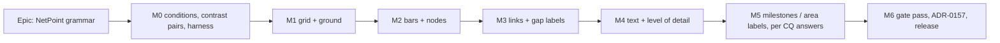

# Implementation Plan: NetPoint grammar — how bars, nodes, links and text look on the TSLD canvas

- **Feature spec:** [`./feature-spec.md`](./feature-spec.md)
- **Status:** Approved — 2026-09-24 (feature-spec §5.1), conditional on agent agreement (§5.2)
- **Owner:** web

## Breakdown

### Epic

**NetPoint grammar.** Give each class of canvas mark its own hue and shape, and make the time grid
the quietest mark. Positions, routing, layout and the engine stay unchanged. This follows the
NetPoint-layout programme (ADR-0151–0154).

### Round-1 amendments (2026-09-24)

The spec's §4.13 records fifteen decisions from the agent agreement round (A1–A5, A-n1–A-n3, U1–U3,
X1–X3, C1, P1–P3). **They override any task text below that conflicts with them.** The inline edits
below mark the tasks they move.

### Rules for every milestone

- **Start from `main`, not from the prototype.** The prototype's edits are kept only as
  `prototype/prototype.patch`, reverted from `apps/web/src` (feature-spec §0). The prototype is photographed and then discarded (spec R13).
- **Contrast pairs land before the painter reads a token, verified red** (FC-G2). This is the
  `--canvas-grid-month` lesson (`token-contrast.test.ts:342-344,586`).
- **Each milestone re-checks FC-G1** (route fingerprints byte-identical) and **re-baselines the
  golden log by hand against a prediction committed first** (FC-G6). It never runs `-u`.
- **Each milestone that adds a mark adds its palette key, its print source, its harness sentinel and
  its legend entry in the same PR** (FC-G0, FC-G8, FC-G9).
- **No `VITE_` flag** (ADR-0088 D1, CQ-9). Each milestone is one revertible commit boundary.
- **Pre-push:** `pnpm prepush`, plus `scripts/e2e-local.sh web:netpoint-grammar` from M1 onwards, plus
  `web:export` from M2 onwards (CLAUDE.md §19.8).

---

### Milestone M0: conditions, contrast pairs and the harness (shippable, dark)

**Outcome:** the bars are committed, every new colour is solved and gated, and the instruments can
see every new mark. No planner-visible change.
**Entry point:** `Ships dark: M0 changes gates, harnesses and documents only. M1 is the first
milestone a planner can see, on the canvas itself.`
**Journey:** none at M0. The journey lands with M1 (ADR-0081 §2).

#### Feature M0-A: commit the conditions

> **Description:** Copy FC-G0–FC-G10 verbatim into `./conditions.md` in a commit of their own, before
> any reading is taken.
> **Complexity:** S
> **Dependencies:** approval of the spec, and CQ answers or acceptance of the defaults
> **Risks:** a bar is tuned after a reading → the file's header forbids in-place edits and requires
> dated amendments quoting the commit (the `netpoint-layout/conditions.md:7-10` pattern)
> **Testing requirements:** none (a document)

##### Task M0-T1: recompute the brief's ratios and commit the conditions

- **Description:** Before anything else, recompute every ratio in spec §1.1 (P3) in
  `token-contrast.test.ts` as reported, unasserted rows. The brief is not evidence (§19.11). Then
  commit `conditions.md`.
- **Complexity:** S
- **Dependencies:** none
- **Risks:** a figure differs from the brief → record the difference in `conditions.md` and in spec
  §0 before any decision uses it
- **Testing:** new reported rows (the day-tier "reported, not asserted" precedent,
  `token-contrast.test.ts:889-898`)
- **Development steps:**
  1. Add a reported block for month/year/day rules, the non-driving link, `--plot-primary`, and the
     three cross pairs (month↔link, bar↔link, bar↔driving link).
  2. Write the output into `conditions.md` as "Measured before M1".
  3. Commit `conditions.md` alone.

#### Feature M0-B: solve and gate the palette

> **Description:** Solve every new or re-valued colour against its constraints, then land its pairs
> in `token-contrast.test.ts` and verify them red. No CSS value changes yet.
> **Complexity:** M
> **Dependencies:** M0-T1
> **Risks:** no green fits the ladder window → escalate CQ-3 with candidates and numbers (spec R4)
> **Testing requirements:** each pair verified red against a deliberately wrong value, and the
> command recorded

##### Task M0-T2: solve the green rung, the link family, the gap plate and the grid ceilings

- **Description:** Search, the way the ladder was searched (`globals.css:819-843`):
  - The **green** `--plot-primary`: ≥ 3:1 on `--canvas` and `--canvas-band`, 1.5–1.70:1 from
    `--plot-warning`, and 4.5:1 with `--plot-primary-foreground`. Start from L 0.624.
  - The **link** family (`--canvas-link`, `--canvas-link-minor`, `--canvas-link-mark`): ≥ 3:1 on
    `--canvas`, `--canvas-band` and `--print`. Mark ≥ 3:1 on its line. ΔE ≥ 5 from each bar rung
    (FC-G3).
  - The **gap label** ink on its plate at ≥ 4.5:1.
  - **Grid** values under their ceilings: unit and month ≤ 1.80:1, year ≤ 2.50:1.
  - Every value checked **in gamut**.
- **Complexity:** M
- **Dependencies:** M0-T1, the CQ-3/CQ-4 answers or defaults
- **Risks:** the link's 3:1 on three grounds pushes it darker than looks quiet → quietness comes from
  weight (spec R10)
- **Testing:** a small solver script under `apps/web/scripts/` (reported, not gated), whose output is
  committed beside `conditions.md`
- **Development steps:**
  1. Write `solve-netpoint-grammar.mjs`, reusing `token-contrast.test.ts`'s ratio and gamut helpers
     by import rather than by copy (ADR-0124: a copy of an instrument measures the copy).
  2. Record the solved values and every pair's ratio.

##### Task M0-T3: land the pairs, verified red, and inventory the scope consumers

- **Description:** Add every FC-G2 pair to `token-contrast.test.ts`. Assert the grid **ceilings**
  (new: a ceiling on decoration). Add the gap-plate and link-mark pairs, and `--canvas-link*` on
  `--print`. Extend `MINIMAP_GROUNDS` if the frame crosses a new ink. Then list every DOM and canvas
  consumer that resolves `--primary` under `[data-surface="canvas"]` (spec R9).
  **Every pair is solved against the near-white ground `oklch(0.995 0.002 250)` (CQ-2), not today's
  `0.958`.** Solving against the old ground and re-valuing it at M1 would move every pair twice.
- **Complexity:** M
- **Dependencies:** M0-T2
- **Risks:** the month floor at `:853-856` must be **replaced, not deleted**. Its replacement ceiling
  carries the reason, and ships only after M0-T4's ruling
- **Testing:** each new assertion verified red. The inventory is a written list in
  `m0-measurement.md`
- **Development steps:**
  1. Add the pairs with the current values, so they are red where the current value violates the new
     rule. Record the red run.
  2. Grep for `--primary` / `bg-primary` / `text-primary` inside components mounted under
     `CanvasSurfaceProvider` (`plan-workspace.tsx:33`, `GuestPlanView.tsx`, `TsldMinimap.tsx`,
     `resource-strip-panel.tsx`) and palette resolvers (`palette.ts:142,340,366,472`).

#### Feature M0-C: rulings and baseline checks

##### Task M0-T4: accessibility ruling on the month rule and the canvas label, and the LOD thresholds

- **Description:** Two reviews and one measurement.
  - Run **accessibility-reviewer** on (a) spec §4.2 G1's argument that the ruler plus node dates
    carry position, so the month rule becomes texture, and (b) spec R7, the canvas label no longer
    being a leading substring of the accessible name. Record the rulings in `conditions.md`. They
    decide CQ-1's branch and R7's fallback.
  - Measure, on the reference plan and Unit 300 across zooms 0.5–60 px/day, the fraction of each
    layer's items (dates, gap labels, lag plates, attachment dots) that the existing collision
    ladders suppress. Set each tier's threshold where the fraction first drops below one half. Commit
    the `LOD_*` values with that reason (ADR-0151 D2).
  - **Land `lodTier` and its structural test here, dark** (spec §4.13 A5). Commit a concrete
    overview-tier ceiling on direction marks per frame (P3).
  - The CQ-1 ruling must state that it evaluated the overview tier, and that the ruler is present on
    the workspace, export, print and guest surfaces (X3).
- **Complexity:** M
- **Dependencies:** M0-T3
- **Risks:** the reviewer refuses → CQ-1 fallback, with no loss of schedule
- **Testing:** the measurement script is a harness that throws on vacuity (a zoom where no item was
  considered)
- **Development steps:**
  1. Write the brief for the reviewer, citing `token-contrast.test.ts:342-344` and spec §4.2 G1.
  2. Write `measure-netpoint-lod.mjs` using the recorded painter (`crossing-probe.ts`'s recording
     context).
  3. Record thresholds and rulings.

##### Task M0-T5: check the spoken-slack basis, and extend the harness sentinels

- **Description:**
  - On `chain-3-placed`, compare `slackByDependencyId` (early basis, `geometry.ts:275-283`) with the
    drawn `waitingSpanX` gap. If they differ, M3 unifies both on the placed, drawn basis before any
    label ships (spec §4.13 X1). Filing a row is not enough.
  - Add sentinel entries for every new palette key to `crossing-probe.ts` / `netpoint-evaluate.ts`'s
    `PALETTE`. Add a control that throws if a stroke flush in a link sentinel has a node-rim or
    plate-box shape (FC-G0).
- **Complexity:** S
- **Dependencies:** none
- **Risks:** the harness change alters a recorded verdict → the probes are extended, not edited in
  their judging paths, and existing fixtures' outputs are re-run and shown identical
- **Testing:** the control is verified red by stroking a synthetic rim in `LINK_SENTINELS.critical`
- **Development steps:**
  1. Write the comparison as a unit case, not an assertion about product behaviour until it is
     understood.
  2. Extend the sentinels and the control. Re-run existing probe outputs and diff them.

##### Task M0-T6: baseline readings and the journey scaffold

- **Description:** Record the ADR-0128 `canvas-draw` Week baseline on the current painter. Use
  `docs/TECH_DEBT.md` #75 item 9 if it is still the shipped painter, and say whether it is. Record the
  route fingerprints for all yardstick plans at all zooms (FC-G1's before). Create
  `apps/web/playwright.netpoint-grammar.config.ts`, `apps/web/e2e-netpoint-grammar/`, its CI step
  and its shard assignment (`check:e2e-roster`, ADR-0138), with one spec that seeds
  `plan:reference-netpoint-power-plant` and opens the Diagram view.
- **Complexity:** M
- **Dependencies:** none
- **Risks:** a new CI step without a shard fails the roster gate → add both in one PR
- **Testing:** the scaffold spec passes locally via `scripts/e2e-local.sh web:netpoint-grammar`
- **Development steps:**
  1. Record fingerprints to `m0-measurement.md`.
  2. Add the config, the CI step and the roster assignment.

---

### Milestone M1: grid and ground

**Outcome:** the time grid is the quietest mark on the canvas, on a near-white ground (CQ-2,
answered 2026-09-24 against its default).
**Entry point:** plan workspace → Diagram view → the TSLD canvas (no new control).
`View ▾ ▸ Structure ▸ Month grid / Year grid` (`tsld-toolbar-items.tsx:464-466`) are unchanged.
**Journey:** `e2e-netpoint-grammar/grid.spec.ts` opens the reference plan. It reads
`getComputedStyle` on the canvas surface root for `--canvas-grid-month` and compares it with the
solved value, and samples canvas pixels on a known month boundary to find the grid ink and the dash
gaps (under CQ-1's default).

#### Feature M1-A: re-value the grid

> **Description:** Apply the solved grid values. Under CQ-1's default, dash the unit and month tiers
> 3/3. The year tier stays solid 1 px at its own ceiling.
> **Complexity:** M
> **Dependencies:** M0 (all)
> **Risks:** dash cost (ADR-0056's unmeasured objection) → one `setLineDash` per tier batch, a
> counting-stub budget, and the solid fallback named in FC-G7
> **Testing requirements:** `paint.grid-budget.test.ts` extended with a `setLineDash` count.
> Crispness invariant kept (odd width at half-pixel x). Golden log by prediction. FC-G1 fingerprints
> identical. Journey.

##### Task M1-T1: tokens and the grid layer

- **Description:** Change `--canvas-grid-*` (`globals.css:582-592`) and the grid layer in `paint.ts`
  (Layer 1, the `toggles.dayGrid/monthGrid/yearGrid` batches). Replace the month 1.4.11 floor
  (`token-contrast.test.ts:853-856`) with the ceiling plus the M0-T4 ruling's reason. Update the
  `PRINT_TOKEN_SOURCES` fallbacks (`palette.ts:257-259`) to the solved values.
- **Complexity:** M
- **Dependencies:** M0-T3, M0-T4
- **Risks:** the Today line's separability from a dashed rule → assert Today ink against the rule ≥
  4:1 on the same ground (a new pair). The Today pill is unchanged
- **Testing:** new pairs, a budget case, the golden prediction, `print-palette.structural.test.ts`
- **Development steps:**
  1. Write the golden prediction (grid entries only: stroke style values and `setLineDash` calls).
  2. Change tokens and layer. Re-baseline by hand against the prediction.
  3. Update `docs/DESIGN_SYSTEM.md` canvas section and the ADR-0056 amendment note in `conditions.md`.

##### Task M1-T2: journey assertions and the near-white ground (CQ-2)

- **Description:** Add the grid journey. Re-value `--canvas` to the near-white ground and
  `--canvas-nonworking` with it, and re-run every canvas pair. Every pair was already solved against
  the new ground in M0-T3, so this step changes values, not the solving.
  Check that the canvas panel's edge still reads against `--card` (spec §4.2 G2 amendment).
- **Complexity:** M
- **Dependencies:** M1-T1
- **Risks:** pixel sampling at a DPR mismatch → sample at DPR 1 with a fixed viewport of 1646 × 1000
- **Testing:** the journey. An axe scan of the legend panel
- **Development steps:**
  1. Write `grid.spec.ts`.
  2. Run `scripts/e2e-local.sh web:netpoint-grammar`.

---

### Milestone M2: bars and nodes

**Outcome:** an ordinary bar is green and 6 px, and every activity end has a ground-filled node
whose rim weight says its criticality. Back-to-back activities are visibly separate.
**Entry point:** the TSLD canvas (Diagram view). The legend panel (`TsldLegend.tsx`) shows the new
node rungs.
**Journey:** `nodes.spec.ts` samples the pixel at a shared node's centre and finds the ground colour,
not the bar colour. It samples a non-critical bar and finds the solved green. It opens the legend and
finds three node rungs.

#### Feature M2-A: the bar

> **Description:** `BAR_HEIGHT` 5 → 6 and the green `--plot-primary`.
> **Complexity:** M
> **Dependencies:** M1
> **Risks:** derived constants move (`SUMMARY_TAB_H`, the lane containment pad) → ADR-0151 D2's
> derivation test asserts the relationships, and they hold by construction. The resource strip and
> the WBS band turn green (spec R9) → decided with the product owner at this milestone, from the
> M0-T3 inventory
> **Testing requirements:** `geometry.constant-derivation.test.ts` unchanged in its relationships.
> FC-G1 fingerprints identical (spec §3.2 predicts it: centre-line 30 px and 7 channels at both
> heights). Lane containment. Minimap gates. Golden by prediction.

##### Task M2-T0: decouple the node and the layout reach first (spec §4.13 A2)

- **Description:** Add `LAYOUT_CONTACT_REACH_PX = 5` to `layout-objective.ts` and use it at `:251`.
  Set `NODE_RADIUS` to a literal 5 with a docblock, so that nothing moves.
- **Testing:** FC-G1b (Tidy/Re-layout identical). Golden log unchanged.

##### Task M2-T1: bar height and rung hue

- **Description:** Change `geometry.ts:80` and `globals.css:844`. Update the ladder comment
  (`:819-843`) with the solved values, `PRINT_TOKEN_SOURCES` `bar`, and the harness `PALETTE`
  literals.
- **Complexity:** S
- **Dependencies:** M0-T2
- **Risks:** a fingerprint differs → stop. The §3.2 arithmetic is wrong somewhere and must be found
  before shipping (FC-G1)
- **Testing:** as the feature
- **Order:** lands after M2-T0 below.
- **Development steps:**
  1. Golden prediction: bar rect heights +1, bar fill values changed (via `--canvas-bar`, spec
     §4.13 A-n1). Span bars at half height (U1). Node boxes unchanged, because M2-T0 has already
     decoupled `NODE_RADIUS` from `BAR_HEIGHT`.
  2. Change, re-baseline, and compare fingerprints.

#### Feature M2-B: the node

> **Description:** Node up to 15 px, ground fill, rung-coloured rim, rim weight per rung, one shared
> node at back-to-back ends, new palette keys `nodeRim`, `nodeRimNear`, `nodeRimCritical`.
> **Complexity:** L
> **Dependencies:** M2-A
> **Risks:** text–node intersections (the disc overhangs into text rows by 2.5 px, spec §4.2 G4) →
> names and dates budgeted clear of discs (FC-G5), and if that withholds text, the diameter shrinks.
> Recorder confusion (spec R2) → own keys and M0-T5's control. Greyscale separability (CQ-11) →
> review, with the centre-dot fallback
> **Testing requirements:** new lane-containment case for a 15 px node. Text–node intersection count
> 0 on all yardstick plans. A unit case per rung. Recorder control green. Accessibility review of a
> greyscale render. Legend census (FC-G8). Export decode (FC-G9).

##### Task M2-T2: node geometry and derivation

- **Description:** Replace `NODE_RADIUS = Math.max(2, BAR_HEIGHT)` (`render-model.ts:209`) with a
  derivation carrying its justification (the reference's measured 15 px, bounded by the pad), and
  assert it in `geometry.constant-derivation.test.ts`.
- **Complexity:** S
- **Dependencies:** M2-T1
- **Risks:** none beyond the feature's
- **Testing:** derivation case
- **Development steps:**
  1. Write the derivation and its docblock.
  2. Assert the relationship, not the value.

##### Task M2-T3: paint the nodes and share them

- **Amended (spec §4.13 A1, A3):** the arrowhead tip is pulled back to the rim at paint time, with
  a unit case asserting ≥ 6 px of head outside the disc. Dates are placed clear of discs here: the
  old M4-T3 is done in this milestone. A name on a short bar paints above the disc.

- **Description:** Rewrite the node block in `paint.ts` (under "The node at each end"): fill with the
  ground key, stroke in the rung key, weight by rung. Share a node where
  `nextDrawsStartAtNode`'s adjacency holds (extract that adjacency so the date layer and the node
  layer ask one question).
- **Complexity:** M
- **Dependencies:** M2-T2
- **Risks:** two copies of the adjacency test disagree → one exported predicate, pinned by a
  structural test (the ADR-0065 one-implementation rule)
- **Testing:** unit cases for each rung, the shared node, and brackets/milestones drawing none
- **Development steps:**
  1. Golden prediction (node entries only).
  2. Implement, re-baseline, run the recorder control, and render the greyscale picture for review.

##### Task M2-T4: palette, print, legend, minimap

- **Description:** Add the keys to `resolveTsldPalette` and `PRINT_TOKEN_SOURCES`. Update the
  `TsldLegend` node entries. Check that minimap marks follow the rung.
- **Complexity:** S
- **Dependencies:** M2-T3
- **Risks:** a legend entry for a mark not drawn → FC-G8 census, both directions
- **Testing:** `print-palette.structural.test.ts`, the legend census (new), `TsldLegend.criticality.test.tsx`
  updated, the `e2e-export` decode
- **Development steps:**
  1. Write the census test first and see it red.
  2. Add the entries.

##### Task M2-T5: journey and review

- **Description:** `nodes.spec.ts`, then **accessibility-reviewer** on the greyscale render and the
  legend, and **ux-reviewer** on the before/after pictures (FC-G10).
- **Complexity:** S
- **Dependencies:** M2-T4
- **Risks:** none
- **Testing:** the journey
- **Development steps:**
  1. Write the spec. Run the local e2e.
  2. Show the pictures to the product owner.

---

### Milestone M3: links and gap labels

**Outcome:** links have a hue of their own, direction marks every ~40 px, and a boxed gap label on
every waiting link at the working tier. The waiting dash is retired (CQ-5 default).
**Entry point:** the TSLD canvas. `View ▾ ▸ Link gaps` (renamed from `Link slack`,
`tsld-toolbar-items.tsx:507`) now defaults on.
**Journey:** `links.spec.ts` samples a non-driving link's pixels and finds the link hue, not the bar
green. At the Week preset it finds a gap label on the reference plan's C_SET link (via the parallel
listbox's logic summary saying the same number). It toggles `Link gaps` off and finds no label.

#### Feature M3-A: link inks and marks

> **Description:** `--canvas-link` for ordinary driving links (palette `linkDriving` re-pointed from
> `--primary`), `--canvas-link-minor` re-hued, `--canvas-link-mark` for chevrons, spacing about
> 40 px.
> **Complexity:** M
> **Dependencies:** M2
> **Risks:** the cap binds sooner at 40 px spacing → FC-G7 measures it, and the cap is raised only if
> the budget allows. The recorder's flush-kind rule (`crossing-probe.ts:261-270`) — chevrons stay
> fills
> **Testing requirements:** `link-marks.test.ts` spacing cases, `paint.link-marks-budget.test.ts`
> green, `paint.routing-budget.test.ts` **unedited**, FC-G1, the golden prediction, a recorder
> control

##### Task M3-T1: tokens, palette, spacing

- **Description:** Tokens (`globals.css:654` and new). `palette.ts:163-164` and
  `PRINT_TOKEN_SOURCES:261-262`. `CHEVRON_SPACING_PX` (`link-marks.ts:115`) re-derived with its
  reason. The mark ink in the `drawBucket` fill.
- **Complexity:** M
- **Dependencies:** M0-T3
- **Risks:** as the feature
- **Testing:** as the feature
- **Development steps:**
  1. Golden prediction (edge layer: stroke/fill values and chevron counts).
  2. Implement, re-baseline, and compare fingerprints.

#### Feature M3-B: gap labels replace the waiting dash and the selection chip

> **Description:** A boxed label on each waiting run ≥ label + 4 px, at the working tier and finer.
> One plate with the lag where both exist. The `linkSlack` chip layer is replaced. The spoken slack
> switches to the same unit.
> **Complexity:** L
> **Dependencies:** M3-A, M0-T4 (tier thresholds), M0-T5 (basis check), the CQ-5 answer
> **Risks:** noise on dense plans (spec R11) → tier plus minimum length plus the switch, judged on
> Unit 300. A working-day walk per label on the paint path → the walk is memoised per (pred-end, gap)
> day pair and budgeted. The unit and basis must match between screen and speech → one function
> feeds both
> **Testing requirements:** a unit case per dependency type (FS/SS/FF/SF) and for a lead (no label),
> the combined plate, a label-count budget ≤ visible links, `a11y.test.ts` for the spoken number,
> the recorder control against a plate box, FC-G5 (labels count as text)

##### Task M3-T2: the gap function, shared by painter and speech

- **Description:** One `linkGapWorkingDays` (or `linkGapDays`, per CQ-5) consumed by the painter and
  by `slackByDependencyId`, replacing `edgeGapDays`' two call sites' units in lock-step. Delete
  `splitRunsByX`'s waiting output use in the painter (the function stays if another caller needs it;
  otherwise it is deleted).
- **Complexity:** M
- **Dependencies:** M0-T5
- **Risks:** the calendar-day docblock at `geometry.ts:218-221` is the stated reason for the current
  unit → rewritten with the new reason, not left contradicting the code
- **Testing:** unit cases, and `link-marks.test.ts:243-246`'s "spans exactly the gap edgeGapDays
  reports" case replaced by its new equivalent
- **Development steps:**
  1. Write the cases first and see them red.
  2. Implement and switch both consumers.

##### Task M3-T3: paint the labels and rename the switch

- **Description:** The label layer after links (the lag-plate pass). Plate tokens. The `Link slack`
  → `Link gaps` label with the key kept (the `floatTails` precedent). Default on.
- **Complexity:** M
- **Dependencies:** M3-T2
- **Risks:** the combined plate is too wide to fit → the lag moves to the next-longest segment, as
  `lagPlateAt` already does (`link-marks.ts:197-199`)
- **Testing:** unit cases, the budget, `tsld-view-toggles.registry.test.ts`
- **Development steps:**
  1. Golden prediction.
  2. Implement, re-baseline, and update the legend (remove the waiting dash, add the gap label).

##### Task M3-T4: fold in `docs/TECH_DEBT.md` #374 items 6 and 7

- **Description:** Speak a zero-lag link's type, now that the gap's meaning depends on it. Pin
  `linkRung` and `describeActivity` to one criticality read with a structural test.
- **Complexity:** S
- **Dependencies:** M3-T2
- **Risks:** none
- **Testing:** `a11y.test.ts`, a structural test
- **Development steps:**
  1. Cases first, then the change. Update #374.

#### Feature M3-C: the attachment dot (G12)

> **Description:** A 4 px dot at every anchor not at a node, at the working tier and finer, own
> palette key `attachDot`, beneath the lag-drag handle.
> **Complexity:** S
> **Dependencies:** M3-A
> **Risks:** it reads as the drag handle → smaller, and in the mark shade not `--foreground`. The
> handle keeps its size and draws above
> **Testing requirements:** unit case (SS with lag → dot, FS zero-lag → none), lane containment,
> legend census

##### Task M3-T5: collect anchors and paint dots

- **Description:** Collect mid-bar anchors in `route-frame.ts`'s `lineOf` (unconditionally, beside
  `lagHandlePoints`, `:126-129`) without changing any returned line.
- **Complexity:** S
- **Dependencies:** M3-A
- **Risks:** a routing file edit changes a route → FC-G1 fingerprints, and `route-frame.structural.test.ts`
- **Testing:** as the feature
- **Development steps:**
  1. Add the collection and the paint pass. Journey assertion on a known SS-with-lag link.

---

### Milestone M4: text and level of detail

**Outcome:** names without codes, wrapped where clear, dates clear of nodes, the centre item off by
default, bold milestone names, and three detail tiers.
**Entry point:** the TSLD canvas, plus `View ▾ ▸ Markers ▸ Activity codes` and
`View ▾ ▸ Markers ▸ Duration & float` (new, both default off).
**Journey:** `text.spec.ts` toggles `Activity codes` and finds the parallel listbox option's
accessible name unchanged either way (the canvas is `aria-hidden`; the name is the ruling from
M0-T4). At the Year preset no date text is recorded; at Week, dates are present (via a test hook
reading the painter's text log, the recorder already used by FC-N6a).

#### Feature M4-A: the canvas label and its switches

> **Description:** `canvasLabel` split from `activityLabel` (`a11y.ts:48-55`). `activityCodes` and
> `centreItem` switches. A critical activity's centre item prints its duration only. Bold milestone
> names with their own width-memo key.
> **Complexity:** M
> **Dependencies:** M3, the M0-T4 ruling (R7)
> **Risks:** the accessible name / visible label relationship → the ruling's fallback (`name, code`).
> The width memo poisoned by a bold face → the memo key includes the font (the `paint.ts` Layer 3
> comment names this hazard)
> **Testing requirements:** `a11y.test.ts` (accessible name unchanged or per the ruling),
> `paint.centre-item.test.ts` (default off, critical prints duration only),
> `tsld-view-toggles.registry.test.ts`, a memo-key unit case

##### Task M4-T1: split the label and add the switches

- **Description:** As the feature. The switches join the `markers` group beside the `labels` toggle (`tsld-toolbar-items.tsx:133,490`; spec §4.13 C1).
- **Complexity:** M
- **Dependencies:** M0-T4
- **Risks:** as the feature
- **Testing:** as the feature
- **Development steps:**
  1. Cases first.
  2. Implement, and write the golden prediction (label text strings shorten).

#### Feature M4-B: wrap where clear, and dates clear of discs

> **Description:** A two-line name only where the second line's box meets no routed segment of the
> frame and no text. Dates offset horizontally by the node radius plus a gap.
> **Complexity:** L
> **Dependencies:** M2 (node size), M4-A
> **Risks:** per-name segment tests cost paint time → only names that would truncate are tested,
> against the frame's per-lane segment index, budgeted. The wrap reaches into the clear band (spec
> §4.2 G7) → FC-G5's "added text–link intersections 0"
> **Testing requirements:** FC-G5 counts on all yardstick plans, `paint.dates-budget.test.ts`, a new
> wrap budget case, lane containment for a wrapped name

##### Task M4-T2: the wrap

- **Description:** In the Layer 3 names block (the `placement === 'above'` branch), try a two-line
  break at a word boundary when truncation would occur. Test each line's box against the routed
  segments in that y-band. Draw two lines or fall back to today's truncation.
- **Complexity:** L
- **Dependencies:** M4-T1
- **Risks:** as the feature
- **Testing:** as the feature
- **Development steps:**
  1. Cases: wraps when clear, truncates when a gutter leg passes, never wraps a milestone into a
     neighbour.
  2. Implement, measure FC-G5, and write the golden prediction.

##### Task M4-T3: dates clear of discs — MOVED to M2-T3 (spec §4.13 A3)

- **Description:** In the Layer 3.7 reserved-row branch, offset start and finish by the node radius.
  Keep the "one date per node" rule (#379) and its shared predicate from M2-T3.
- **Complexity:** S
- **Dependencies:** M2-T3
- **Risks:** fewer dates fit inside bars → the ladder's flanking rung still applies, and FC-G5
  reports the share of bars with both dates against M0's before
- **Testing:** `paint.dates-budget.test.ts`, FC-G5
- **Development steps:**
  1. Implement and re-measure.

#### Feature M4-C: level-of-detail tiers

> **Description:** `lodTier(pxPerDay)` with thresholds from M0-T4. Each layer consults the tier per
> spec §4.2 G11. Names are never withheld by tier.
> **Complexity:** M
> **Dependencies:** M0-T4, M3, M4-B
> **Risks:** re-introducing #378's defect (names withheld at whole-plan zoom) → a regression case that
> the reference plan at 1 px/day labels every bar that labelled before
> **Testing requirements:** a unit case per tier per layer, the #378 regression, the journey's Year
> vs Week assertion

##### Task M4-T4: the tier function's remaining consumers (`lodTier` itself lands in M0-T4, spec §4.13 A5)

- **Description:** As the feature. One function, pinned by a structural test that every layer's gate
  reads it (not a copy of a threshold).
- **Complexity:** M
- **Dependencies:** M4-T3
- **Risks:** as the feature
- **Testing:** as the feature
- **Development steps:**
  1. Structural test first.
  2. Implement, golden prediction, and journey.

---

### Milestone M5: milestones and area labels (per CQ-6 and CQ-7)

**Outcome (defaults):** milestones draw as downward triangles filled in their rung colour, with a
non-colour outline for criticality. No hourglass. No inline area labels (the WBS band stays).
**Entry point:** the TSLD canvas. The legend shows the triangle.
**Journey:** `milestones.spec.ts` samples the milestone at a known position and finds a triangle's
apex row (a narrow run) above its base row (a wide run). It opens the legend and finds a triangle
entry.

#### Feature M5-A: the triangle

> **Description:** A glyph path within the `MILESTONE_RADIUS` envelope (`geometry.ts:162`), so the hit
> rect and lane containment keep their numbers. Rung fill, outline weight by rung.
> **Complexity:** M
> **Dependencies:** M4
> **Risks:** ADR-0155's finish-milestone day shift is geometric → the glyph's anchor x is unchanged
> (`finish-milestone-day.structural.test.ts` stays green unedited). The minimap draws milestones too
> → it follows, or keeps its own mark, decided and recorded
> **Testing requirements:** unit cases per rung, lane containment, `paint.golden.test.ts` prediction,
> legend census, greyscale review, export decode

##### Task M5-T1: the glyph

- **Description:** Replace the diamond path in the bar/milestone layer. Update the legend and
  `docs/DESIGN_SYSTEM.md`.
- **Complexity:** M
- **Dependencies:** M4
- **Risks:** as the feature
- **Testing:** as the feature
- **Development steps:**
  1. Prediction, implement, re-baseline, and review.

#### Feature M5-B: area labels (only if CQ-7 is answered "derived")

> **Description:** A bold label at a lane's left end, only when every activity in the lane shares one
> WBS parent, using the one WBS label producer (`lenses.ts:545`). A persisted lane label is **not**
> this epic; it is a schema change for `database-architect` and triggers ADR-0105.
> **Complexity:** M
> **Dependencies:** M5-A
> **Risks:** it collides with the first activity's name → it goes in the name row, before the first
> bar, with the halved-gap rule
> **Testing requirements:** unit cases (unanimous / mixed / empty lane), FC-G5, legend census

(No tasks unless CQ-7 is answered "derived". Under the default, M5-B is recorded as not built.)

---

### Milestone M6: gate pass, ADR-0157 and release

**Outcome:** the specialist reviews run over the combined diff, their blocking findings are folded,
ADR-0157 is filed and indexed, and the release is cut.
**Entry point:** unchanged, the TSLD canvas.
**Journey:** the full `e2e-netpoint-grammar` suite, plus `e2e-export`, `e2e-share` and
`e2e-minimap` (every surface that paints this grammar), run locally before push.

#### Feature M6-A: reviews and readings

> **Description:** **accessibility-reviewer** (1.4.1, 1.4.11, 2.5.3, legend, greyscale), **component-
> reviewer** (palette keys, one-implementation rules, memo keys, derivations), **ux-reviewer**
> (pictures at three tiers on the reference plan and Unit 300), and **performance-reviewer**
> (budgets). The ADR-0128 reading on the product owner's hardware (FC-G7) is owed to them and is
> recorded as untaken if not taken, never as met.
> **Complexity:** M
> **Dependencies:** M1–M5
> **Risks:** a finding lands on a shared gate → ADR-0105 applies, and it is filed, not folded
> **Testing requirements:** every fix carries a regression test verified red first

##### Task M6-T1: run the reviews and fold findings

- **Complexity:** M
- **Dependencies:** M5
- **Risks:** as above
- **Testing:** per finding
- **Development steps:**
  1. Run the four reviewers with the combined diff and `conditions.md`.
  2. Fold the blocking findings. File the non-blocking ones as one `docs/TECH_DEBT.md` row.

##### Task M6-T2: file ADR-0157 and the documents

- **Description:** Re-check the next free ADR number. File ADR-0157 per spec §4.10. Add it to
  `docs/adr/README.md` and CLAUDE.md §16 (`check:adr-coverage` gates both, ADR-0147). Update this
  spec's and plan's status lines together (`check:spec-status`). Update `docs/DESIGN_SYSTEM.md`,
  `docs/ROADMAP.md` (or its exemption), and the amended ADRs' amendment notes.
- **Complexity:** S
- **Dependencies:** M6-T1
- **Risks:** the ADR is left out of CLAUDE.md §16, which has happened ten times (`docs/TECH_DEBT.md`
  #291) → the gate now refuses it
- **Testing:** `pnpm prepush`
- **Development steps:**
  1. Write the ADR, index it, and run `pnpm prepush`.

##### Task M6-T3: changeset and release

- **Description:** A `web` minor changeset describing the visible change. Merge per CLAUDE.md §19.9,
  with the check runs deduped for the current head.
- **Complexity:** S
- **Dependencies:** M6-T2
- **Risks:** none
- **Testing:** CI
- **Development steps:**
  1. Changeset, PR, checks, merge.

## Sequencing & slices

M0 → M1 → M2 → M3 → M4 → M5 → M6, one milestone per PR (or two where a feature is L), each a
revertible commit boundary with `main` releasable throughout. **No `VITE_` flag** (ADR-0088 D1,
CQ-9). Every milestone after M0 is visible on the canvas, which is its entry point, and extends the
journey that lands at M1 (ADR-0081). M1 and M2 can each ship and be judged alone. M3 depends on M2's
hue decision, so that the link hue is solved against the final bar hue. M4's tier thresholds come
from M0, and its date offsets from M2's node size. M5 is small under the defaults.

**Agents to involve:** accessibility-reviewer at M0-T4 (before M1, not only at M6),
component-reviewer on the palette-key and one-predicate structure in M2/M3, ux-reviewer at every
picture (M2, M3, M4), performance-reviewer at M6 with the FC-G7 budgets. `database-architect` is not
engaged, because there is no schema change. It **must** be engaged if CQ-7 is answered "persisted
lane labels", which would then be a separate epic.

## Definition of Done (per task)

Each task's PR must satisfy the Feature Completion Criteria in
[`docs/PROCESS.md`](../../PROCESS.md) (code, tests, docs, security, performance, accessibility,
Docker build, CI, changelog, version impact). In addition, for this epic:

- FC-G1 fingerprints identical.
- A golden re-baseline made by hand against a committed prediction.
- New pairs verified red before the value landed.
- Palette key, print source, sentinel and legend entry added together.

## Risks & assumptions (rollup)

| Risk / assumption                                                       | Likelihood | Impact | Mitigation                                                            |
| ----------------------------------------------------------------------- | ---------- | ------ | --------------------------------------------------------------------- |
| The accessibility reviewer refuses the month-rule reversal (spec R3)    | med        | med    | CQ-1 fallback (dashed at ≥ 3:1). Decided at M0, before M1             |
| No green fits the ladder window in gamut (R4)                           | low        | med    | Solved in M0-T2. Escalate CQ-3 with candidates                        |
| A route fingerprint moves (FC-G1)                                       | low        | high   | The milestone stops. §3.2's arithmetic is found wrong before shipping |
| Harnesses mistake a new mark for a link (R2)                            | med        | high   | Own keys and sentinels. Controls verified red (M0-T5)                 |
| Golden re-baseline hides an unintended change (R1)                      | med        | med    | A prediction per milestone. Small diffs                               |
| Gap labels read as noise (R11)                                          | med        | med    | Tier, minimum length, switch. Judged on Unit 300                      |
| Paint cost of dash, labels, wrap (R12)                                  | med        | med    | Budgets plus the ADR-0128 reading. Named fallbacks                    |
| Spoken slack already disagrees with the drawn gap on placed plans (R14) | unknown    | med    | Checked in M0-T5 and filed if true                                    |
| Every `--primary` consumer in the canvas scope turns green (R9)         | high       | low    | M0-T3 inventory. Decided at M2                                        |
| The prototype's working-tree edits leak into the build (R13)            | med        | med    | Each milestone starts from `main`                                     |
| The owed paint reading is not taken                                     | med        | low    | Recorded as untaken, never as met (ADR-0128)                          |
