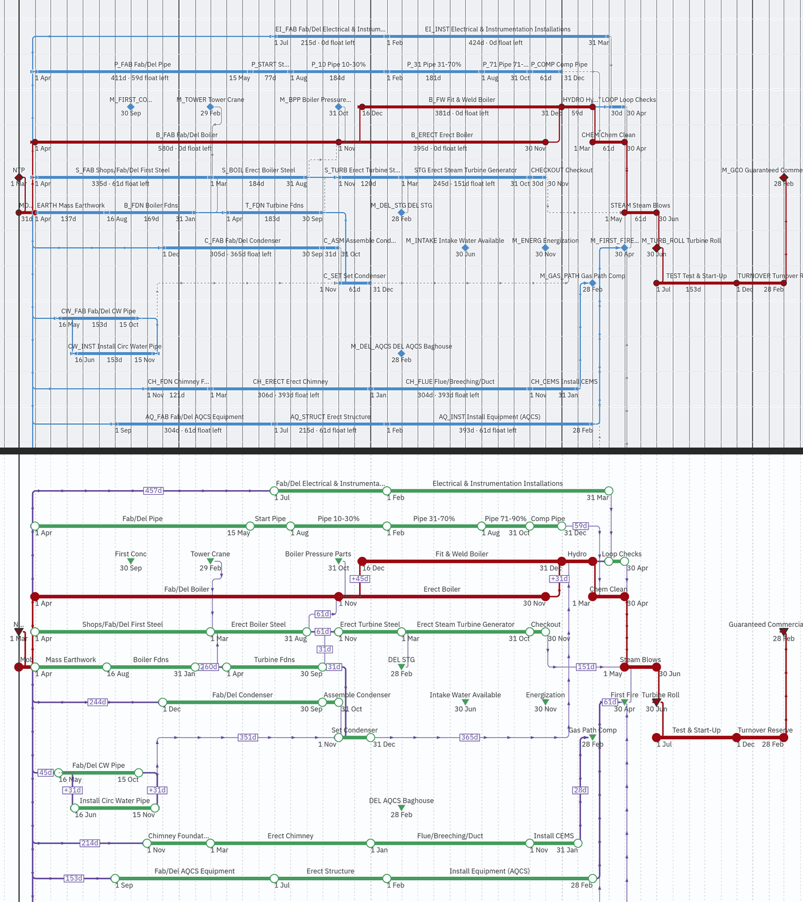
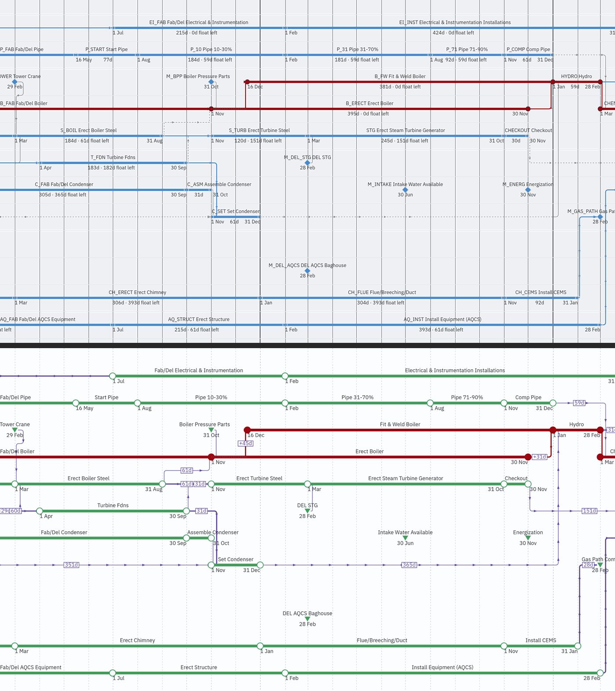
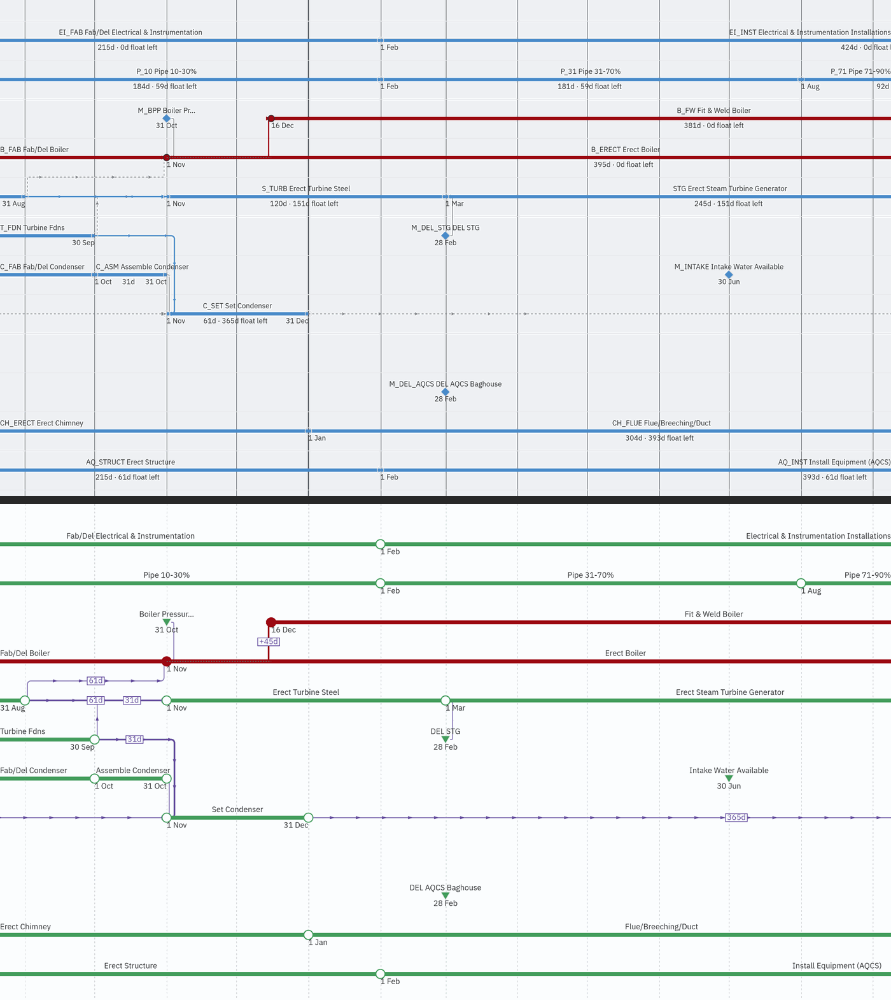
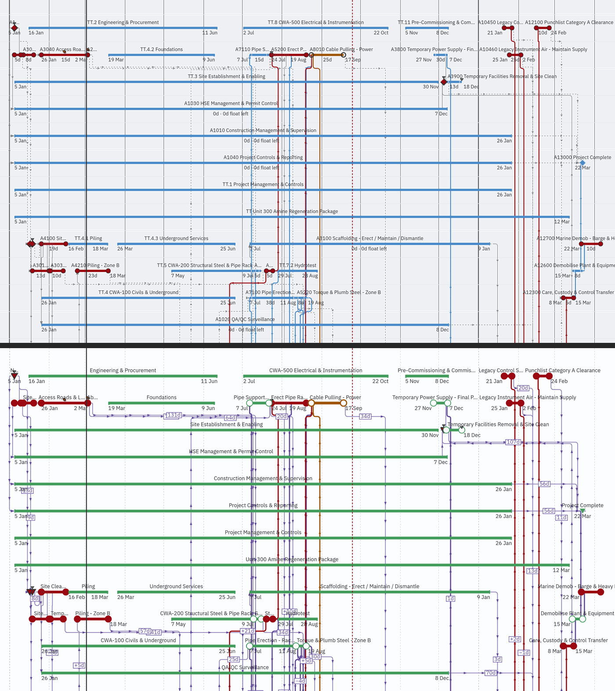
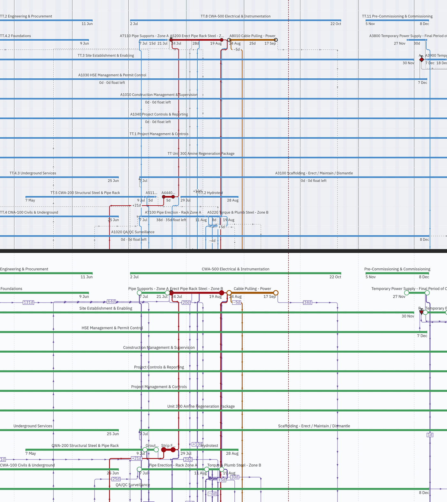
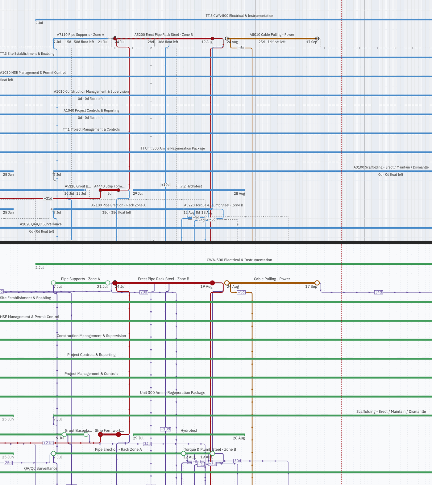

# Prototype comparison: today's canvas against a NetPoint-grammar prototype

**Status:** Evidence for [`feature-spec.md`](./feature-spec.md). Nothing here has shipped. The
prototype is a throwaway patch, [`prototype/prototype.patch`](./prototype/prototype.patch). It was
applied, photographed and reverted on 2026-09-24. `apps/web/src` is unchanged.

The pictures answer one question: **does the grammar measured in
[`reference-observations.md`](./reference-observations.md) improve our canvas once it is applied to
our own data?** The patch applies that grammar with the smallest edits that would show it. It does
not try to be the design. Several things the spec proposes were not prototyped; they are listed
below.

## How to read the pictures

Each picture has **today on top and the prototype below**, split by a dark rule. Both halves show the
same plan, at the same zoom and scroll, in the same viewport. The shots are the canvas clip only, at
1646 × 1000 CSS px and DPR 2, scaled to 1400 px wide and reduced to a 256-colour palette to keep the
files small. Colours are faithful to the eye; do not sample them for contrast. The figures below
come from the tokens.

There are two plans:

- **The NetPoint reference plan** is our seeded copy of the product owner's power-plant picture
  (`--tier reference`). It is the closest thing we have to a like-for-like comparison.
- **Unit 300** is `packages/engine-conformance/fixtures/p6_torture_test_v1.xer`, imported through the
  real import dialog. It is dense, mixed and hostile, with LOE and WBS-summary bars, constraints and
  near-critical work. A grammar that only works on a tidy plan is not worth building.

Each plan is shown at three zooms: the default framing, and one and two presses of **Zoom in**.

### NetPoint reference plan

Whole plan:



Working zoom:



Detail zoom:



### Unit 300 (imported torture file)

Whole plan:



Working zoom:



Detail zoom:



## What the patch changes

| Area             | Today                                                                                                   | Prototype                                                                                                                    | File                                    |
| ---------------- | ------------------------------------------------------------------------------------------------------- | ---------------------------------------------------------------------------------------------------------------------------- | --------------------------------------- |
| Ground           | `oklch(0.958 0.004 250)`                                                                                | `oklch(0.995 0.002 250)`, near white                                                                                         | `globals.css`                           |
| Time grid        | Solid lines. The month line is 3.98:1 and the year line 5.78:1 on the ground.                           | Dashed 3 on / 3 off at 1 px in every tier: day 1.18, month 1.51, year 1.97                                                   | `globals.css`, `paint.ts`               |
| Lane rule        | —                                                                                                       | Dotted 1 on / 3 off, 1.09:1                                                                                                  | `globals.css`, `paint.ts`               |
| Non-working wash | `oklch(0.947 0.01 252)`                                                                                 | `oklch(0.979 0.004 250)`, about 1.05:1 on the new ground                                                                     | `globals.css`                           |
| Bar              | 5 px, `--primary` blue, 3.15:1                                                                          | **6 px** in a green `--plot-primary: oklch(0.624 0.13 150)`, 3.34:1                                                          | `geometry.ts`, `globals.css`            |
| Node             | Filled in the bar's ink, so it merges into the bar                                                      | Radius **7**, a hollow white centre with the bar's ink as a rim. Filled only where it was filled before (critical, started). | `render-model.ts`, `paint.ts`           |
| Link             | Driving link in `--primary`, the same colour as the bar (1.06:1 between them). Non-driving link 3.35:1. | Its own hue (violet, 295). Minor link 3.70:1 at 1.5 px; driving link 7.10:1 at 2.5 px.                                       | `globals.css`, `palette.ts`, `paint.ts` |
| Direction marks  | Chevrons capped at six per link                                                                         | One every **40 px**, 7 px long, up to 40 per link, always on                                                                 | `link-marks.ts`, `paint.ts`             |
| Waiting dash     | The part of a non-driving link inside its gap is dashed (ADR-0154)                                      | Off, so the gap is carried by a number                                                                                       | `paint.ts`                              |
| Gap label        | None. Lag plates only (`+45d`).                                                                         | A boxed number on every link with a gap, in the link's ink (`61d`, `365d`)                                                   | `paint.ts`                              |
| Name             | `CODE Name`                                                                                             | Name only                                                                                                                    | `to-render-model.ts`                    |
| Centre item      | `215d · 0d float left` under the bar                                                                    | Removed                                                                                                                      | `paint.ts`                              |
| Milestone        | Diamond                                                                                                 | Downward triangle                                                                                                            | `paint.ts`                              |
| Label font       | 11 px                                                                                                   | 12 px                                                                                                                        | `geometry.ts`                           |

The link hue was calculated before anything was drawn. The first choice, an ochre, was **rejected on
arithmetic**: it sat next to the near-critical amber in both hue and lightness. Violet is not used by
any other class of mark on the canvas.

### The measured contrast, on the prototype's ground

| Mark                          | Contrast           | Note                                                                                             |
| ----------------------------- | ------------------ | ------------------------------------------------------------------------------------------------ |
| Grid day / month / year       | 1.18 / 1.51 / 1.97 | Decoration, exempt from 1.4.11. Now the quietest marks, as in the reference (1.67:1 and dashed). |
| Bar, non-critical green       | 3.34:1             |                                                                                                  |
| Near-critical amber           | 5.44:1             |                                                                                                  |
| Critical red                  | 8.43:1             |                                                                                                  |
| Green vs amber / amber vs red | 1.63 / 1.55        | The lightness ladder survives, so criticality is not carried by hue alone (ADR-0151 M6).         |
| Link, minor                   | 3.70:1             | Passes 1.4.11. NetPoint's own link is **1.28:1**.                                                |
| Link, driving                 | 7.10:1             |                                                                                                  |

## What the pictures show

The prototype reads as a different kind of drawing, and that is the finding worth taking to the
product owner. Line by line:

- **The grid stops competing with the logic.** Today the month and year lines are the loudest
  verticals on the canvas: louder than any non-driving link or bar. That is worst on Unit 300, where
  most link segments are vertical. In the prototype the grid is a faint dashed texture behind
  everything else.
- **Bars and links are different things.** Today a driving link is the bar's blue at 1.06:1 against
  the bar. In the prototype, green bars and violet links sort themselves before you read them.
- **Links land on something.** The hollow node is the largest mark on a bar, as in the reference,
  and links visibly end at it. Today the node merges into the bar and a link seems to end in mid-bar.
- **Direction is readable without zooming.** On the long links from Mob in the reference plan, a
  mark every 40 px makes direction obvious at every zoom. Today a link carries at most six chevrons.
- **The text is shorter and says less.** Removing codes and the `…d · …d float left` line takes the
  reference plan from two lines of text per bar to one name and its dates. That is the reference's
  density.

## Defects the prototype shows

These are defects in the prototype, not in the grammar. The spec has to answer each one:

1. **Gap plates collide with things.**
   - Some plates sit on short segments beside a node or a bar, such as `61d` and `31d` on Erect
     Boiler Steel.
   - On Unit 300, `+10d` lies across the name "Hydrotest".
   - `lagPlateAt` only refuses a segment too short for the plate. It does not check against names,
     nodes or other plates.
2. **Gap numbers are calendar days.** `edgeGapDays` counts calendar days, while NetPoint writes the
   gap in the plan's schedule unit (half months in the reference). A planner will read "61d" as
   working days. The spec's CQ on the gap unit decides this.
3. **A lag plate and a gap plate look the same.** `+31d` and `61d` share one box style. The `+` is
   all that separates "the link carries lag" from "the link is 61 days long".
4. **Unit 300 at whole-plan zoom is busier, not quieter.** Forty marks per link and a plate on every
   link fill the whole diagram with violet. The reference plan is sparse enough to take it, and the
   torture file is not. This is the strongest argument for level-of-detail tiers (spec G11). Dense
   marks and plates should appear as the zoom allows.
5. **Long bars are as heavy as short ones.** On Unit 300 the LOE and WBS-summary bars (Site
   Establishment, HSE Management, Project Controls) are the same 6 px green as the work. In the
   picture they read as the most important rows on the plan. Today they are at least a lighter blue.
6. **Names still truncate** ("Grout…", "Strip F…", "Boiler Pressur…"). The reference wraps to two
   lines and never truncates. Wrapping was not prototyped.
7. **The weekend wash had to be retuned.** With today's `--canvas-nonworking` on the new ground, every
   weekend became a visible stripe. The prototype lightens the wash to about 1.05:1, which is still
   visible on Unit 300 at whole-plan zoom (the pale columns). Any change to the ground re-values
   this token.

## What the prototype did not attempt

The spec proposes these, and they are **not** in the pictures:

- Wrapping names onto two lines.
- Level-of-detail tiers for direction marks and plates.
- Bold milestone labels. The label-width memo is keyed on text alone, so a bold label would measure
  wrong.
- The hourglass glyph for a project's start and finish.
- Inline area labels, as an alternative to the WBS band.
- Diagonal links. ADR-0065 rejected them; the spec leaves it to the product owner.
- The attachment dot where an SS or FF link joins partway along a bar.
- A separate look for LOE and summary bars.
- Any change outside the canvas: legend, export, print, Gantt or minimap. The legend in particular
  still describes today's marks.

## How to reproduce

The patch applies to `main` at `12bac438`:

```sh
git apply docs/specs/netpoint-grammar/prototype/prototype.patch
```

Then shoot both plans with a throwaway journey under `apps/web/e2e-arrange/` (the pen is enforced
there, so the seeded plan must be recalculated after the pen is taken). Its steps:

1. Onboard.
2. Seed `--tier reference` with `@repo/seed-cli`.
3. Open the plan, take the pen and recalculate.
4. Import the torture file through the import dialog.
5. Shoot the canvas bounding box at default zoom, then +1 and +2 zoom-in presses.

Revert with `git checkout -- apps/web/src`. The journey was deliberately not committed; it
photographs and asserts nothing.
