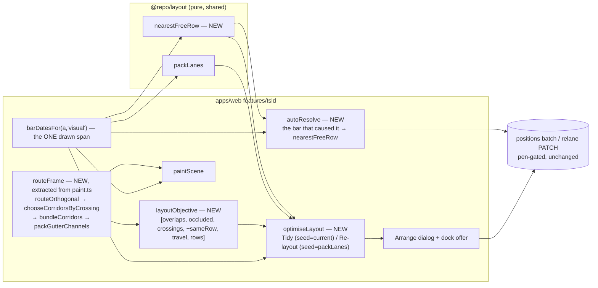
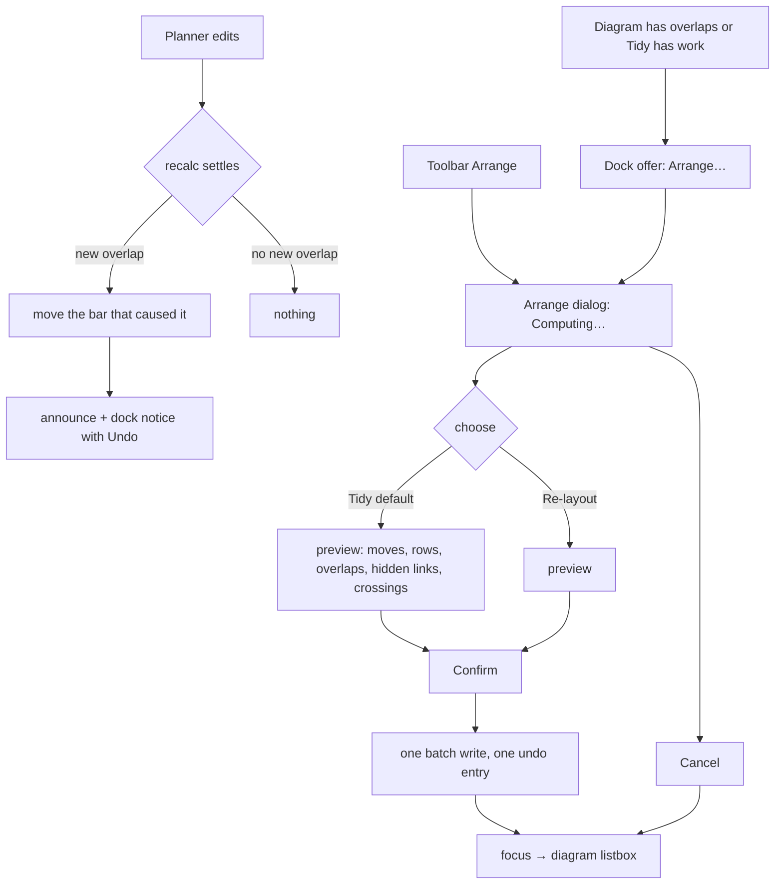

# Feature Spec: NetPoint layout — rows chosen for how the logic routes, and a diagram that reads like the reference

- **Status:** Approved — by the product owner on 2026-09-23, with CQ-1 answered (see §0.11); not yet built
- **Author(s):** feature-analyst agent
- **Date:** 2026-09-23
- **Tracking issue / epic:** _(none yet)_
- **Roadmap link:** _(none — a canvas-legibility epic, the fourth after ADR-0149/0150/0151)_
- **Implementation plan:** [`./implementation-plan.md`](./implementation-plan.md)
- **Conditions:** `./conditions.md` — **to be written and committed ALONE, as M0's first task, before
  any harness is edited or run** (ADR-0128's ordering). §5 below states every condition and its bar so
  that file is a transcription, not a design act.
- **Related ADR(s):** three drafts in §4.9 — **ADR-0152** (the layout objective and the Tidy /
  Re-layout optimiser), **ADR-0153** (an edit moves only the bar that caused an overlap), **ADR-0154**
  (the link's visual language). Numbers are the next three free today (`docs/adr/` holds up to
  `0151-the-row-is-the-unit.md`, verified by listing the directory 2026-09-23) and **must be
  re-verified at filing** — ADR-0079 records a number being taken between a plan and its milestone.
  Amends ADR-0065, ADR-0069, ADR-0149 D5/D6, ADR-0150 D5, ADR-0151 D3/D6/D7 and ADR-0054 §5.

> **Precondition, not in scope.** The `Arrange` defect the product owner reported first — "two simple
> overlapping activities draw on top of each other" — is being fixed **separately and before this
> epic**. `computeLaneArrangement` packs on `a.earlyStart`/`a.earlyFinish`
> (`apps/web/src/features/tsld/model/arrange-lanes.ts:142-152`), while since ADR-0148 every bar is
> drawn from `barDatesFor(a, 'visual')` (`apps/web/src/features/tsld/render/to-render-model.ts:42`,
> with `barDateSourceFor(false) === 'visual'` at `apps/web/src/lib/bar-dates.ts:54-56`). A bar placed
> earlier than logic allows is therefore packed at one span and drawn at another. **M0-T0 verifies
> the fix has landed before any other M0 task runs**; if it has not, this epic does not start.

---

## 0. What changed while reading the code

The brief was checked claim by claim (CLAUDE.md §19.11: _the brief is not evidence_). Most of it
holds. **Seven claims do not, and four of them change the design.** Each names what was read.

### 0.1 "Add dates under the nodes" — the dates already ship; they are switched off by default

Dates below the bar exist today: `paint.ts:2137-2186` draws the start date from the bar's left end
and the finish date to its right end on `rowSlots(...).belowY`, with a measured ladder (inside the
bar's ends → flanking on **halved** gaps → suppressed). It is gated on `toggles.dates === true`
(`paint.ts:2093`), and `dates` is **absent from `DEFAULT_VIEW_TOGGLES`**
(`render/view-toggles.ts:21`, `:87-115`), so it is off for every planner who has not found
`View ▾ ▸ Dates`. What is new is therefore **the default** and **the centre item**, not the dates.

### 0.2 "Duration + float centred under the bar" — the duration is already on screen, in the name row

`activityBarLabel` composes `{code} {name} · {n}d` (`render/a11y.ts:58-65`), and that is what the
name row above the bar paints. ADR-0151 considered drawing the duration below and **rejected it
twice over** (`docs/adr/0151-the-row-is-the-unit.md:175-178`, restated at `paint.ts:2128-2136`): it
would be one fact drawn twice (ADR-0093), and the only duration the dates layer could reach was the
drawn **calendar** span, not the **working-day** `durationDays`.

Both objections are answered, not overridden: the duration **moves** from the name row to the centre
of the row below (drawn once), and it is carried to the painter as `durationDays` from the activity —
the same datum `activityBarLabel` prints today — not re-derived from the span (§4.6).

### 0.3 "Driving/critical links" — a link has no criticality; it has `isDriving`

`toRenderEdges` carries `isDriving` and nothing about criticality (`render/to-render-model.ts:91-103`).
Criticality is an **activity** property (`isCritical`/`isNearCritical`). Driving and critical are
different facts: a driving link can join two activities with thirty days of float. §4.7 defines a
link's colour rung from its endpoints, and states the rule.

### 0.4 "The non-colour channel becomes weight" — it already is

The painter draws non-driving links 1 px **dashed** and driving 2 px **solid** in one colour
(`paint.ts:1338-1344`). Weight is already a channel and ADR-0151 said so (`0151:163-165`). Retiring
the dash therefore loses a **redundant** channel, not the only one — which is why WCAG 1.4.1 holds
(§4.7).

### 0.5 "Colours come from the existing tokens" — not for the grey, and that is measured

`TECH_DEBT.md` #368 measured, in Chromium under the canvas scope, every dependency line at **5.31:1**
against the ground (`--muted-foreground`) and the on-schedule bar at **3.14:1** (`--primary`)
(`docs/TECH_DEBT.md:11466-11476`). So "non-driving thin and grey, driving bold and coloured" built from
existing tokens makes the **grey non-driving line louder than a blue driving line** — the inverse of
the request. One new canvas token is required: `--canvas-link-minor`, valued for a 1 px line on
`--canvas` between 3.0:1 and ~3.6:1. That is exactly `docs/TECH_DEBT.md` #367's remedy (`:11454-11457`),
which that row deferred only because nobody then had a reason to change the value. The product owner
now has one. The contrast pair lands in `token-contrast.test.ts` **before** the painter reads the
token (§4.7, FC-N7).

### 0.6 "A free-float gap line" — the drawable quantity is the per-link gap, and its spoken twin disagrees with its drawn one

Activity `freeFloat` exists (`packages/types/src/index.ts:612`) but it is a working-day engine figure
about one activity, not a length on a link. What NetPoint draws is the **gap between a relationship's
two ends**, which this product already computes as `edgeGapDays` off the drawn day offsets
(`render/geometry.ts:201-220`) and already draws as the `Nd` slack chip on the selected activity's
links (`paint.ts:1910-1935`, ADR-0054 §5).

**Finding nobody had reported.** The chip is fed `RenderActivity`, whose `earlyStart` is the **drawn**
start (`to-render-model.ts:58`). The spoken twin — `slackByDependencyId`, whose docblock promises
"the same computation, not two similar ones (WCAG 1.1.1)" (`geometry.ts:222-230`) — is fed raw
`ActivitySummary` rows (`components/TsldPanel.tsx:1776-1782`) and reads `earlyStart`/`earlyFinish`,
the **network** dates. For every hand-placed activity the number a screen-reader user hears differs
from the number drawn. It is the arrange defect's shape one derivation over, and M2 fixes it, because
a gap **line** drawn for every link makes the disagreement visible at scale.

### 0.7 "Rows last" taken literally produces one bar per row, and that was measured

ADR-0150's M0 used **one-per-row** as a control: on Unit 300 at 4 px/day it measured **0 foreign
occlusions and fewer crossings than shipped** (1.505 against 1.691) — at **144 rows against 21**
(`docs/specs/logic-legibility/m0-measurement.md:148-149`). A lexicographic objective with occlusion
first and rows last has that as a global optimum. The product owner said height is not the
constraint; they did not say seven times the height is acceptable, and **travel** (how far a line
runs vertically — one of the four symptoms ADR-0150 recorded them confirming) is absent from the
ordering they gave. This is the one question the spec cannot default its way past: **CQ-1**.

### 0.8 Two more things the design must not break, found by reading the instruments

- **Today's `Arrange` offer compares against `packLanes`' answer** (`arrange-lanes.ts:87-98`,
  `TsldPanel.tsx:1673-1677`). The moment a Tidy produces a layout that differs from `packLanes` — its
  whole purpose — the offer would reappear permanently, saying "Arrange would move 40 activities"
  about a diagram the planner has just tidied. The predicate changes (§4.8).
- **The crossing/occlusion recorder identifies links by sentinel colour and flush kind**
  (`apps/web/scripts/crossing-probe.ts:180-237`). A **stroked** chevron has diagonal arms, which trips
  its `diagonal !== 0` control (`measure-occlusion.mjs:140-145`); a lag box stroked in the link colour
  is a closed 4-segment path it would count as a link; a driving link painted in `palette.bar` carries
  no sentinel and would vanish from the count, tripping `visibleLinks !== edges` (`:134-139`). Every
  new link mark is therefore designed to be **separable by the recorder** (§4.7), and the recorder is
  taught about each before the mark ships.

### 0.9 Claims in the brief that hold (checked, not assumed)

| Claim                                                                                                 | Evidence                                                                                                                       |
| ----------------------------------------------------------------------------------------------------- | ------------------------------------------------------------------------------------------------------------------------------ |
| Row pitch is 52                                                                                       | `render/geometry.ts:48` `LANE_HEIGHT = 52`                                                                                     |
| Pitch 60 measured +13.2 % crossings, outside FC-L4, worst bunching 2 → 1                              | `docs/adr/0151-the-row-is-the-unit.md:139-146`; `docs/specs/logic-legibility/m6-gate-pass.md:176-177`                          |
| `packLanes` is greedy first-fit + predecessor hint, inclusive-day spans                               | `packages/layout/src/pack-lanes.ts:8-10`, `:55-91`                                                                             |
| Routing is `routeOrthogonal` → `chooseCorridorsByCrossing` → `bundleCorridors` → `packGutterChannels` | `render/paint.ts:1233-1298`                                                                                                    |
| Three assignment rules measured worse than shipped; lane re-indexing the one qualifier                | `docs/adr/0149-…:96-107`; `docs/adr/0150-…:106-132`                                                                            |
| Unit 300 is the P6 torture-test fixture, 144 activities / 188 links                                   | `apps/web/scripts/measure-occlusion.mjs:65`, `:89`; `docs/specs/logic-legibility/m0-measurement.md:148`                        |
| `occl/link` = foreign-occluded links ÷ attributed links                                               | `apps/web/scripts/measure-occlusion.mjs:26-28`, `:148`                                                                         |
| The 2,000-activity synthetic is `scaleScene(2000)`, not a CPM result                                  | `apps/web/src/features/perf-probe/scenes/scale-scene.ts:20-28`, `:41`                                                          |
| `Arrange` is pen-gated and one undo entry                                                             | `toolbar/tsld-toolbar-items.tsx:2917-2933` (`penGated: true`); `features/undo-redo/commands.ts:879-902` (`autoArrangeCommand`) |
| The positions batch asserts the pen                                                                   | `apps/api/src/modules/activities/activities.service.ts:729-739`                                                                |
| FC-L5's paint reading was never taken                                                                 | `docs/specs/logic-legibility/m6-gate-pass.md:113-126`                                                                          |
| `e2e-arrange/` exists and is the only journey that presses `Arrange`                                  | `apps/web/e2e-arrange/{arrange,gutter-channel}.spec.ts`; `apps/web/package.json:55`; ADR-0149 Consequences                     |

### 0.10 The small plan the brief describes does not exist yet

The harness's "small plan" is a 17-activity / 29-link extension programme computed by a pure ASAP
pass with **no placements** (`apps/web/scripts/small-plan-fixture.ts:55-114`, `:158-206`). It
structurally cannot exhibit the defect the product owner reported, which needs a hand-placed bar.
M0 adds a third fixture, **`chain-3-placed`**: A (5 d) → B (5 d) → C (4 d), all FS, all started in
one row, with C **placed** two days before B finishes (a `visualConflict`). It is the smallest plan
on which the reported defect is observable, and it is the yardstick's floor.

---

### 0.11 Decisions recorded at approval (2026-09-23)

Put to the product owner as clickable questions after this spec was written, and recorded here
rather than folded silently into the sections they change:

- **Approved to build**, in the plan's suggested order (M0 → M3 → M1 → M2 → M4 → M5 → M6).
- **CQ-1 — the row budget: the default stands, confirmed at M0.** `B = seedRows + max(4,
⌈0.5 × seedRows⌉)` (Unit 300: 21 → 32). M0's FC-N10 frontier at {seed, +25 %, +50 %, +100 %, ∞}
  is shown to the product owner **before M4 is built**, and the budget can move on those numbers.
  Travel stays the proposed tiebreak after chains and before rows.
  **Answered on the frontier (2026-09-23): no extra rows, `B = seedRows`, plus an unlinked
  glyph-contact term below crossings.** See `conditions.md`'s amendment and the M0-T4 record.
- **The precondition fix is PR #663**, and it went further than §0.6 anticipated: the same
  early-date read was in seven places, not one, including the spoken slack this spec assigned to M2.
  So M2-T4's slack half is already shipped; `docs/TECH_DEBT.md` #372 files the naming trap behind all
  seven (`RenderActivity.earlyStart` holds the drawn date).

## 1. Business understanding

### Problem

Three epics (ADR-0149, ADR-0150, ADR-0151) improved logic legibility by **routing around whatever
rows the layout produced**, and the product owner's verdict after all three is that "it still doesn't
work". Their words, 2026-09-23:

> "on a simple plan when i press re-arrange it has made two simple overlapping activities draw on top
> of each other? the key driver to all of this was not to have any overlapping bars and or activities
> where possible. Also i want the bars and logic links to be more like the netpoint example. For me
> there has to be a great algorithm to get this mapping right. i know we had one before for the bars
> but surely there is one for the logic and bars together."

Three distinct problems are in that sentence:

1. **Overlap is not treated as the hard constraint it is.** `Arrange` could produce it (the
   precondition defect), and an ordinary edit — a longer duration, a drag, a recalculation that
   pushes a successor — can produce it silently and leave it, flagged only by a small badge
   (`render/lane-overlap.ts`, `TECH_DEBT.md` #24c).
2. **Rows are chosen without asking how the logic will route.** `packLanes` minimises the row count
   and uses a predecessor hint among lanes that are already free (`pack-lanes.ts:36-53`); routing is
   then asked to cope. ADR-0150 measured that of the links still hidden behind a bar, **4 could be
   rescued by a different corridor and 13 by any orthogonal means at all** (`docs/adr/0150-…:149-152`)
   — the rest is a **row-choice** problem nobody has attacked with an objective. The three rules
   ADR-0149/0150 tried were **rules**, not optimisers; none of them measured its own result.
3. **The picture does not read like the reference.** Dates are off by default, the duration sits in
   the name, every non-driving link is a dashed line, direction is one arrowhead at the far end, and
   lag is invisible unless you drag it.

### Users

| Role (ADR-0016/0051)                      | Needs from this epic                                                                                                                                      |
| ----------------------------------------- | --------------------------------------------------------------------------------------------------------------------------------------------------------- |
| **Planner** (holding the pen)             | Edits that never leave two bars on top of each other; a Tidy / Re-layout that optimises how the logic reads; a diagram that looks like the GPM reference. |
| **Org Admin** (holding the pen)           | As Planner.                                                                                                                                               |
| **Planner / Org Admin without the pen**   | The new row and link treatment; Arrange shaded with its reason (unchanged gating).                                                                        |
| **Contributor, Viewer**                   | The new row and link treatment. No layout writes (they cannot hold the pen).                                                                              |
| **External Guest** (share link, ADR-0051) | The new row and link treatment on the read-only share view. Nothing else.                                                                                 |

### Primary use cases

1. A planner lengthens, drags, places or creates an activity; if that makes two bars overlap in a
   row, the bar that caused it moves to the nearest free row and nothing else moves.
2. A planner presses **Arrange → Tidy**: the diagram improves on how the logic reads without the
   planner's hand-built rows being thrown away, and can never come out worse than it was.
3. A planner presses **Arrange → Re-layout**: the rows are recomputed from scratch, optimised for how
   the logic routes, and can never come out worse than today's `Arrange` would.
4. Any reader sees each activity's dates under its nodes, its duration and float under the bar, and
   links whose direction, drivingness, waiting time and lag can be read off the line.

### User journeys

- **Edit → overlap → resolved** (use case 1): the planner drags C's finish edge right; the coalesced
  recalculation (ADR-0032) settles; C now overlaps D in its row; C moves to the nearest free row; a
  polite announcement and a dock notice say "Moved ‘C’ to row 7 so it no longer overlaps ‘D’", with
  Undo. See the user-flow diagram (§4.3).
- **Tidy** (use case 2): toolbar `Arrange` (or the dock offer's `Arrange…`) opens the dialog, which
  computes both options and shows, for each, the moves, the rows either side, overlaps, links hidden
  behind bars, crossings; Tidy is preselected; the planner confirms; one batch write; one undo entry.
- **Re-layout** (use case 3): as Tidy, choosing Re-layout.

### Expected outcomes

- No two bars overlap in a row after any planner action, except where the planner explicitly undid
  the resolution.
- On Unit 300, fewer links run behind bars than any layout this product has shipped, within a row
  budget the product owner sets (CQ-1).
- The diagram carries NetPoint's reading aids: dates at the nodes, duration and float under the bar,
  chevrons along the line, driving links bold and coloured, waiting time dashed, lag in a box.

### Success criteria

Stated as falsification conditions in §5, each with a bar written before the build. In summary:

- **Zero** same-row drawn-span overlaps after any edit, on every yardstick plan (FC-N5).
- Re-layout on Unit 300 cuts foreign-occluded links by **≥ 40 %** against the pitch-60 `packLanes`
  baseline at 4 px/day, within the row budget, with crossings up **≤ 10 %** (FC-N4).
- Tidy and Re-layout are **never worse** on the objective than their seeds: zero violations across
  the yardstick and a 200-plan property sweep (FC-N3).
- Paint cost at Week on the product owner's hardware **≤ baseline + 2.00 pp** dropped frames (FC-N8).

### Open questions

**Critical (answer changes design or scope):**

- **CQ-1 — the row budget.** §0.7: with rows last, the optimiser's global optimum is roughly one bar
  per row. **Default:** a **hard row budget** `B = seedRows + max(4, ⌈0.5 × seedRows⌉)` (Unit 300's
  seed at pitch 60 is 21 rows → budget 32), and **travel** (Σ |Δlane| over links) inserted into the
  objective **after chains and before rows**. M0-T4 measures the occlusion/crossings/travel frontier
  at budgets {seed, +25 %, +50 %, +100 %, unbounded} on Unit 300 and the product owner confirms or
  moves the budget with those numbers in front of them before M4 is built. The objective's order is
  theirs and is not changed; only the budget and the travel tiebreak are new.

**Non-critical (defaults stated; work proceeds on them):**

- **CQ-2 — undo shape for an auto-resolved overlap.** Default: its **own** undo entry, pushed after
  the edit's, so the first `Ctrl+Z` puts the bar back in the overlapping row (with the overlap cue)
  and the second undoes the edit. Merging it into the edit's entry would need a new "amend the last
  command" API on the ADR-0048 stack — there is no composite command today (`commands.ts` exports,
  read 2026-09-23) — and the displacement arrives after an asynchronous recalculation, well outside
  the 500 ms coalescing window (`use-plan-edit-history.ts:18`).
- **CQ-3 — which toggle governs the new row items.** Default: the two **dates** stay on `Dates`, whose
  default flips to **on**; the **centre item** (duration · float) rides `Labels`, because it replaces
  the `· Nd` suffix `Labels` has always governed (`view-toggles.ts:16`). Each toggle keeps governing
  the facts it governed.
- **CQ-4 — the float wording in the centre item.** Default: `5d · 3d float left` (ADR-0148's
  "float left" wording, `render/a11y.ts:15-25`), degrading to `5d` when the full form does not fit.
  Without the word the sentence silently changes meaning the first time somebody places a bar
  (ADR-0148).
- **CQ-5 — should the importer (ADR-0069 phase 3) run the optimiser?** Default: **no**. The router is
  web code in screen coordinates (`render/link-routing.ts`), phase 3 is best-effort and server-side
  (`interchange.service.ts:1041-1116`), and a fresh import has no placements so its drawn span is its
  early span. The first open of an imported plan shows the Arrange offer if Tidy has something to do.
  Revisit if M0-T3 shows the optimiser is cheap enough to extract into `@repo/layout`.
- **CQ-6 — a minimum horizontal gap between bars in a row.** Default: **no gap in the layout**
  (§4.5, decision D-G).

---

## 2. Functional requirements

### User stories & acceptance criteria

> **US-1 — An edit never leaves two bars on top of each other.** As a Planner holding the pen, when an
> edit of mine makes two bars overlap in a row, I want only the bar that caused it to move to the
> nearest free row, so that my hand-built layout survives and nothing is drawn on top of anything.
>
> - **Given** activities C and D in row 4, C finishing day 10, D starting day 14, **when** I lengthen C
>   to finish on day 16 and the recalculation settles, **then** C moves to the nearest row free across
>   its drawn span, D and every other activity keep their `laneIndex`, and the change is announced.
> - **Given** the same, **when** I press `Ctrl+Z` once, **then** C returns to row 4 (overlapping, with
>   the lane-overlap cue); **when** I press it again, **then** C's duration is restored.
> - **Given** I drop a bar onto a row where it would overlap another, **when** I release, **then** it
>   is placed in the nearest free row to the one I dropped on, in the same single write, and the
>   announcement names the row it landed in.
> - **Given** a plan that already has an overlap from before this epic, **when** I make an unrelated
>   edit, **then** the old overlap is not touched (it is not new; "nothing else shifts").
> - **Given** I undo or redo, **when** the replay's recalculation settles, **then** no resolution runs.
> - **Given** I do not hold the pen when the recalculation settles, **then** nothing is written and the
>   lane-overlap cue remains.

> **US-2 — Tidy.** As a Planner holding the pen, I want Tidy to improve how the logic reads starting
> from my current rows, accepting only improvements, so it can never make my diagram worse.
>
> - **Given** any plan, **when** Tidy runs, **then** its objective (§4.5) is lexicographically ≤ the
>   current layout's, at the reference zoom.
> - **Given** Tidy finds nothing, **then** "Already tidy — nothing to move" is announced and no dialog
>   is left open with nothing to confirm (today's rule, `TsldPanel.tsx:2273-2282`).
> - **Given** I confirm, **then** exactly the previewed moves are written in one all-or-nothing batch
>   and recorded as one undo entry.

> **US-3 — Re-layout.** As a Planner holding the pen, I want Re-layout to discard my rows and compute
> them from scratch for how the logic routes, never worse than today's `Arrange`.
>
> - **Given** any plan, **when** Re-layout runs, **then** its objective is ≤ that of the `packLanes`
>   layout it is seeded from.
> - **Given** the preview, **then** it states moves, rows before/after, overlaps, links hidden behind
>   bars and crossings for both options, computed from the same derivation the confirm writes.

> **US-4 — The row reads like the reference.** As any reader, I want each activity's start date under
> its start node, its finish date under its finish node, and its duration and float centred under the
> bar, without any of them colliding with a neighbour.
>
> - **Given** a bar wide enough, **then** all three appear under it; **given** a narrower bar, **then**
>   the ladder in §4.6 degrades in a fixed order, suppression last; **then** no two text runs in the
>   diagram intersect (FC-N6 measures zero).
> - **Given** `Dates` is on by default, **when** I open any plan, **then** dates are visible without
>   finding a menu item.

> **US-5 — A link reads like the reference.** As any reader, I want chevrons along each link showing
> direction, driving links bold and coloured, non-driving links thin and grey, a dashed run where a
> relationship waits, and a lag value in a small box.
>
> - **Given** a driving link between two critical activities, **then** it is 2 px in the critical ink.
> - **Given** a non-driving link, **then** it is 1 px, solid, in `--canvas-link-minor`.
> - **Given** a relationship whose drawn gap is > 0 days, **then** the part of its route spanning the
>   gap is dashed.
> - **Given** a non-zero lag, **then** a box reading `+2d` / `−1d` sits on the link where there is room.
> - **Given** the legend is opened, **then** every one of these marks is keyed and no retired mark is.
> - **Given** a screen-reader user asks for the logic summary, **then** the slack spoken equals the gap
>   drawn (fixing §0.6).

### Workflows

1. **Auto-resolve** (US-1): see §4.4. Snapshot at command time → edit write(s) → recalculation settles
   (or, for a lane drop, immediately) → new-overlap pairs → mover per rule → nearest free row → relane
   write → undo entry → announcement + dock notice.
2. **Arrange** (US-2/3): press → dialog opens with a **Computing…** state → both options computed
   (worker or main thread per FC-N2) → figures shown, Tidy preselected → Confirm → batch write →
   announcement → focus to the diagram listbox (ADR-0149 D8).
3. **Row and link rendering** (US-4/5): no workflow; paint-time.

### Edge cases

| Case                                                       | Behaviour                                                                                                                                                                                                                         |
| ---------------------------------------------------------- | --------------------------------------------------------------------------------------------------------------------------------------------------------------------------------------------------------------------------------- |
| Two bars overlap and both changed in the edit              | The one that is **not** the command's subject moves; if neither or both are subjects, the one with the later drawn start, then larger id (§4.4).                                                                                  |
| A chain push cascades into several overlaps                | Movers resolved in drawn-start order, each seeing the rows the previous resolutions chose.                                                                                                                                        |
| An overlap existed before the edit                         | Untouched (only pairs new to this command are resolved).                                                                                                                                                                          |
| Late overlay on                                            | Edits are already suppressed (`view-toggles.ts:51-54`); Arrange and auto-resolve are suppressed too. Layout always uses the `visual` basis (§4.5 D-B), never the overlay's.                                                       |
| WBS band on                                                | Overlap domain is **every dated activity** (band-off picture), so toggling the band never reveals an overlap (the `#364` argument, `arrange-lanes.ts:43-52`). Arrange still packs the scene then appends band summaries as today. |
| Undated activity                                           | Occupies no span; never a mover, never an obstacle (as `lane-overlap.ts:32` and `pack-lanes`).                                                                                                                                    |
| Milestone                                                  | Span `[d, d]`; overlaps a same-day milestone or a bar covering `d` (`lane-overlap.ts` convention). Glyph contact at coarse zoom is not an overlap (D-G) and is measured (FC-N6).                                                  |
| Re-layout would move > 2,000 activities                    | The positions batch caps at 2,000 (`update-positions.dto.ts:45`). The dialog shades Re-layout with that reason; Tidy is bounded by the same count. No API change.                                                                 |
| Plan never scheduled                                       | Nothing to arrange (today's rule, `arrange-lanes.ts:138`); auto-resolve has no spans.                                                                                                                                             |
| Recalculation fails                                        | No resolution runs (no settled spans); the existing failure announcement stands.                                                                                                                                                  |
| Pen lost between edit and settle                           | No write; the overlap cue stays; Tidy offer appears.                                                                                                                                                                              |
| 409 on the relane (stale version)                          | Existing ADR-0048 conflict contract: refetch, clear redo, show the conflict strip.                                                                                                                                                |
| Programme recalculation (ADR-0045) pushes bars server-side | No client edit → no resolution; the overlap cue and the Arrange offer surface it.                                                                                                                                                 |
| Import                                                     | Unchanged (CQ-5).                                                                                                                                                                                                                 |

### Permissions

- **Layout writes** (auto-resolve relane, Tidy/Re-layout batch) reuse the existing endpoints and
  their gates unchanged: `activity:update` RBAC, organisation scope, optimistic `version`, and the
  ADR-0028 pen (`activities.service.ts:440`, `:739`). They are **structural writes** in the pen's
  sense. Deny-by-default holds because nothing new is exposed.
- **Arrange** stays `penGated: true` (`tsld-toolbar-items.tsx:2926`); the dock offer stays **omitted**
  without the pen (ADR-0149 D6).
- **Rendering** applies to every role including External Guest; the guest share view mounts the same
  canvas (ADR-0102 found it mounting outside the canvas provider once — the M2 journey covers it).

### Validation rules

No new input. `laneIndex` is a non-negative integer already validated by the positions DTO; a
resolution or an optimiser result is validated client-side to be overlap-free before it is written,
and the server's existing validation is unchanged.

### Error scenarios

| Scenario                                    | Detection                 | User-facing result                                                              | Status            |
| ------------------------------------------- | ------------------------- | ------------------------------------------------------------------------------- | ----------------- |
| Pen not held at write                       | `assertHoldsPen`          | existing pen contract (shaded controls / conflict strip)                        | 423               |
| Stale version (someone else wrote)          | optimistic lock           | existing conflict strip, refetch, redo cleared                                  | 409               |
| Batch over 2,000 rows                       | DTO `@ArrayMaxSize(2000)` | never sent: Re-layout shaded with the reason                                    | 400 (unreachable) |
| Optimiser exceeds its evaluation bound      | deterministic cap         | returns best-so-far (still never worse); dialog says the search was bounded     | —                 |
| Worker fails to start (if a worker is used) | `error` event             | falls back to main-thread chunked run with a sentence saying it may take longer | —                 |

---

## 3. Technical analysis

| Area           | Impact   | Notes                                                                                                                                                                                                                                                                                                                                                                       |
| -------------- | -------- | --------------------------------------------------------------------------------------------------------------------------------------------------------------------------------------------------------------------------------------------------------------------------------------------------------------------------------------------------------------------------- |
| Frontend       | **high** | `features/tsld/`: routing pipeline extracted from `paint.ts` into one derivation; objective + optimiser (new model files); auto-resolve in the workspace model; the row's centre item and new defaults; link language (chevrons, weight/colour rungs, gap runs, lag boxes); Arrange dialog; offer predicate; legend; possibly the app's first Web Worker (FC-N2 decides).   |
| Backend        | **none** | Positions batch and relane PATCH reused. `packLanes` gains one pure sibling export (`nearestFreeRow`) in `@repo/layout`, consumed by the web only. Import unchanged (CQ-5).                                                                                                                                                                                                 |
| Database       | **none** | `laneIndex` exists. No model, column, index or migration. `database-architect` is **not engaged because there is nothing to design** — recorded so it cannot read as an oversight (CLAUDE.md §19.3). If any task finds a schema need, work stops and the agent designs it.                                                                                                  |
| API            | none     | No endpoint, DTO or OpenAPI change.                                                                                                                                                                                                                                                                                                                                         |
| Security       | low      | No new surface. Writes reuse pen-gated routes. No audit event: lane writes are `PLAN_CONTENT`, permanently excluded (ADR-0073). A same-origin module worker, if adopted, is permitted by the shipped CSP (`script-src 'self'` with no `worker-src`, `docker-compose.yml:148`; CSP3 falls back `worker-src → child-src → script-src`), and `e2e-csp` would report otherwise. |
| Performance    | **high** | Optimiser cost (FC-N2); auto-resolve on every settled recalculation (FC-N5b); paint cost of chevrons, labels, gap runs, lag boxes (FC-N8, counting-stub budgets).                                                                                                                                                                                                           |
| Infrastructure | low      | No new service. If a worker is adopted, Vite's `new Worker(new URL(…), { type: 'module' })` builds it; the bundle-graph gate (ADR-0136) sees it.                                                                                                                                                                                                                            |
| Observability  | none     | Client-only; announcements are the user-facing signal.                                                                                                                                                                                                                                                                                                                      |
| Testing        | **high** | Unit (objective, optimiser determinism/never-worse property, auto-resolve rule, ladder, palette); counting-stub paint budgets; golden log re-baselined **by hand against a written prediction** (ADR-0034 forbids `-u`); harness conditions; `e2e-arrange` journeys against a real API with the pen enforced.                                                               |

### Dependencies

- **Precondition**: the `computeLaneArrangement` drawn-span fix (M0-T0).
- Existing, reused: `@repo/layout` `packLanes`; `render/link-routing.ts`; `render/lane-overlap.ts`;
  `render/geometry.ts` `rowSlots`/`edgeGapDays`; `features/undo-redo` (`relaneCommand`,
  `autoArrangeCommand`); `usePlanAutoRecalc`; `model/dock-strip.ts`; the ADR-0128 probe for FC-N8.
- **Product owner**: CQ-1 answered on M0-T4's numbers before M4; two presses of the canvas-draw probe
  (M0 baseline, M6 after).
- Specialist agents during build: **ui-architect** (M4 worker/pipeline boundary), **component-reviewer**,
  **accessibility-reviewer**, **ux-reviewer**, **performance-reviewer** (M6 gate pass; accessibility
  and component also **before release** of M3's focus/announce rules and M5's dialog, per §19.13).
  `api-reviewer`/`security-reviewer`/`backend-performance-reviewer` are not needed (no API/backend
  change); `database-architect` not engaged (no schema).

---

## 4. Solution design

### 4.1 Architecture overview



The load-bearing property is **one derivation per question**: one drawn span (`barDatesFor(…,
'visual')`) for every layout decision and the painter; one routing pipeline (`routeFrame`) for the
painter and the objective; one nearest-free-row search for auto-resolve and Tidy's overlap repair.
Each is the ADR-0065 / ADR-0121 argument: two implementations drift and the drift is invisible.

### 4.2 Data flow — auto-resolve

```mermaid
sequenceDiagram
  participant U as Planner
  participant W as Workspace model
  participant H as Edit history (ADR-0048)
  participant R as usePlanAutoRecalc
  participant A as API
  U->>W: edit (resize / drag / place / create)
  W->>W: snapshot S0 = {lane, drawn span} for every dated activity + subject ids
  W->>A: edit write (pen-gated)
  W->>H: push edit command
  R->>A: coalesced recalculation (ADR-0032)
  A-->>W: rows with new visualEffective* dates
  W->>W: S1; pairs = overlaps(S1) \ overlaps(S0)
  W->>W: movers per the rule; nearestFreeRow for each, in drawn-start order
  alt holds pen and movers non-empty
    W->>A: relane PATCH per mover (or one positions batch if > 1)
    W->>H: push "Keep clear" command (own entry, CQ-2)
    W->>U: announce + dock notice with Undo
  else no pen
    W->>U: overlap cue stays; Arrange offer appears
  end
```

A **lane drop** resolves before writing: the drop target is replaced by `nearestFreeRow` from the
dropped-on row, and the single relane write carries the resolved row (one command, no second entry).

### 4.3 User flow



### 4.4 Auto-resolve — the rule (ADR-0153)

**Definitions.** `S0` = for every dated activity, `(laneIndex, drawnStart, drawnFinish)` from
`barDatesFor(a, 'visual')`, captured when the planner's command is issued, plus the command's
**subject** ids (the activity or selection it acts on; a create's new id joins when the response
returns). `S1` = the same after the command's writes **and** the recalculation they trigger have
settled. `overlaps(S)` = the unordered pairs `laneOverlapIds`' sweep would flag (`lane-overlap.ts`:
inclusive `YYYY-MM-DD` spans; overlap iff neither finishes strictly before the other starts). The
function returns pairs rather than ids so the rule can reason about them; it is the **same sweep**,
extended, never a second predicate.

**New pairs** `P = overlaps(S1) \ overlaps(S0)`. Pre-existing overlaps are never resolved (US-1).

**"The bar that caused it"** — for a pair `(a, b)` in `P`, with `changed(x) ⇔ S1[x] ≠ S0[x]` (span or
lane differs, or `x ∉ S0` because it was created):

1. exactly one of `a, b` changed → **it** moves (the other is where the planner left it);
2. both changed, exactly one is a **subject** → the **non-subject** moves (the planner just put the
   subject there; the other was pushed by the engine into it);
3. otherwise (both pushed, or both subjects of one bulk command) → the one with the **later drawn
   start** moves, then the larger id.

Rule 2 is the case the product owner's example implies — a recalculation pushing an un-edited
successor into a neighbour — and rule 1 covers the planner stretching their own bar into someone
else's. Neither ever moves a bar whose span and lane were untouched, which is "nothing else shifts".

**Where it moves.** `nearestFreeRow(span, fromLane, rows)` in `@repo/layout`: rows ordered by
`|Δ|` from the mover's current lane, ties to the **lower** index (the `nearestFreeLane` tie rule,
`pack-lanes.ts:111-129`); a row is free iff no other dated activity's span in it overlaps the mover's;
one past the current maximum is always free. Movers are processed in drawn-start order (then id), each
seeing the rows the previous resolutions chose, so a cascade cannot resolve two bars into one row.
Cost is O(rows × bars per row) per mover; FC-N5b bounds it.

**Never during replay.** Undo/redo restore recorded states; a resolution during their recalculation
would fight the replay. The snapshot is taken only on a planner-originated command, so a replay has no
`S0` and cannot resolve.

### 4.5 The layout objective and the optimiser (ADR-0152)

**The quantity.** `x` is fixed by time, so a layout is the vector of `laneIndex`. The objective is a
**lexicographic** vector, in the product owner's order, with the two additions CQ-1 proposes:

| #   | Term        | Definition                                                                                                       | Source of the definition                                   |
| --- | ----------- | ---------------------------------------------------------------------------------------------------------------- | ---------------------------------------------------------- |
| 1   | `overlaps`  | same-row drawn-span overlap pairs — **hard**: every accepted state is 0 once repair has run                      | `lane-overlap.ts` sweep                                    |
| 2   | `occluded`  | links with ≥ 1 **foreign** occlusion incident (a horizontal leg inside a bar that is not one of its own anchors) | ADR-0150's `foreign` column, `measure-occlusion.mjs:26-28` |
| 3   | `crossings` | horizontal meets vertical strictly interior to both, distinct links                                              | ADR-0149 D1, `crossing-probe.ts:269-294`                   |
| 3b  | `contacts`  | **unlinked** adjacent same-row pairs whose node glyphs touch — **added on CQ-1's answer, 2026-09-23**            | FC-N6b's unlinked count, `measure-netpoint-row.mjs`        |
| 4   | `−sameRow`  | links whose two endpoints share a row (chains read along one row)                                                | ADR-0150 D5's "same-row bucket"                            |
| 5   | `travel`    | Σ \|Δlane\| over links — **proposed, CQ-1**                                                                      | ADR-0150 FC-L6 `mean                                       | Δlane | `   |
| 6   | `rows`      | `worldExtent`'s rule: max lane among scene activities + 1                                                        | `arrange-lanes.ts:70-77`                                   |

subject to `rows ≤ B` (CQ-1; answered `B = seedRows`, 2026-09-23).

**Evaluated on the router the painter uses, not on a proxy** (ADR-0149's lesson). `routeFrame(...)`
is extracted from `paint.ts:1169-1298` — `lineOf`'s anchor mapping, `routeOrthogonal` with the leg
obstacles, then `chooseCorridorsByCrossing` → `bundleCorridors` → `packGutterChannels` — as a pure
function returning the polylines **and** the lag runs/handles `lineOf` collects on the way (the edge
layer "returns a value", ADR-0078). `paint.ts` calls it; a structural test asserts the painter has no
second copy. The objective calls it over **every** edge with a whole-plan synthetic viewport at the
**reference zoom of 4 px/day** (ADR-0150's headline figure and the harness's middle zoom), because
the painter routes only the culled set and a layout is persisted independently of zoom. FC-N4 reports
1 and 12 px/day beside it.

**Occlusion and crossing counters in product code** are new pure functions over `routeFrame`'s output
and `activityRect`. The harness keeps its own recorder-based counters (`crossing-probe.ts`) and the two
**must agree exactly** on every yardstick plan at every measured zoom (FC-N0): two instruments that
share no code, agreeing, is the evidence that the optimiser optimises what the harness measures.

**The search** (a Sugiyama/storyline adaptation to a fixed time axis — _ordering → alignment →
compaction_):

- **Repair** (phase 0): resolve every overlap in the seed with `nearestFreeRow`, in drawn-start order
  — the auto-resolve derivation, not a second one.
- **Ordering** (phase 1): **adjacent-row swaps** — exchanging two whole rows never creates an overlap,
  so the move is always feasible. This is ADR-0150 D5's lane re-indexing done as a search rather than
  a rule, which is why that qualifier is **subsumed** by Tidy and not built separately.
- **Alignment** (phase 2): **single-bar moves** of each activity, in drawn-start order, to each lane
  among {its link neighbours' lanes, current ± 1, current ± 2, one new row if `rows < B`} where its
  span fits.
- **Compaction** (phase 3): delete empty rows (strictly improves `rows`, changes nothing else).
- A move is accepted **only on a strict lexicographic improvement**, in a fixed candidate order,
  best-of-candidates per bar. Passes repeat phases 1–3 until a pass accepts nothing or the pass cap
  `P` is reached, and each pass is bounded by an evaluation cap `E`. **Both caps are counts, never
  wall-clock**: a time budget would make the result depend on the machine, and a layout that differs
  between two planners' machines is the diagram twitching ADR-0065 forbids.

**Tidy** seeds from the current rows; **Re-layout** seeds from `packLanes` over the drawn spans (the
precondition fix's output). Because every accepted move strictly improves the objective, **Tidy ≤
current and Re-layout ≤ today's Arrange, by construction, at the reference zoom** — stated with its
limit: the guarantee is on the objective as evaluated; at other zooms it is reported, not guaranteed.

**Incremental evaluation** — the cost question M0-T3 answers. A candidate move changes the obstacles
in two lanes and the routes of the links incident to the bar and of links whose corridor or legs touch
those lanes; the three post-passes are frame-global. So an incremental evaluator is at best a
**filter**: if M0-T3's equivalence control shows it disagrees with a full evaluation on any sampled
move, the optimiser uses it only to rank candidates and **confirms every accepted move with a full
evaluation**, which preserves the never-worse guarantee exactly. FC-N2 sets P, E and where the search
runs from the numbers.

**Where it runs.** Client-side, like `Arrange` today — no server change (CQ-5). Main thread if FC-N2's
run limb passes with every chunk ≤ 50 ms (the long-task threshold); otherwise a **module Web Worker**,
which would be the first in `apps/web` (`grep "new Worker"` over `apps/web/src`: no files, 2026-09-23)
and is therefore part of ADR-0152. The offer (below) never runs the optimiser on the render path.

**D-G — no minimum horizontal gap between bars in a row.** A gap in **days** would break the
product owner's fourth priority: a zero-lag FS chain on one row has no gap by definition. A gap in
**pixels** is a function of zoom, and a layout is persisted independently of zoom, so it would either
spend rows at every zoom to buy label room at one, or be wrong at the others. Label collision is
already prevented by the ladders' halved-gap rule, which makes non-collision **provable** rather than
likely (`paint.ts:2029-2035`, `:2164-2175`); §4.6 keeps that property for the new centre item by
construction. What a gap would have bought is freedom from **glyph contact** — a milestone's 14 px
diamond touching a neighbour's node at coarse zoom. That is measured, not assumed (FC-N6 limb c): if
same-row glyph contacts at 4 px/day exceed 5 % of same-row adjacent pairs on Unit 300, contact joins
the objective as a term after `crossings`.

**D-B — the layout's basis is the planning surface.** Every layout decision reads
`barDatesFor(a, 'visual')`, which is what the painter reads except while the read-only Late overlay is
on (`bar-dates.ts:54-56`). The overlay suppresses edits (`view-toggles.ts:51-54`); this epic also
suppresses Arrange and auto-resolve under it, so no layout is ever computed on an overlay's dates.

### 4.6 The row (amends ADR-0151 D3/D6)

- **Pitch 60** (`LANE_HEIGHT` 52 → 60, `geometry.ts:48`), the product owner's answer to ADR-0151's
  owed item 3. `BAR_PAD` becomes 27.5 and `rowSlots`' clear half-band 11.5 px (from 7.5); the extra
  room goes to gutter channels, not text. `rowReservesTextRows()` stays true (`geometry.ts:797-799`).
- **Name row: identity only.** `RenderActivity.label` becomes `activityLabel(a)`; the `· Nd` suffix
  leaves it. `RenderActivity` gains `durationDays` (the activity's working-day figure — the one datum
  `activityBarLabel` prints today) so the painter never re-derives a duration from the span.
- **Below row: three items.** S = start date (left-aligned at the start node), F = finish date
  (right-aligned at the finish node), C = centre item `5d · 3d float left` (full) or `5d` (short); a
  milestone's C is its float clause alone and its S/F collapse to one date centred under the diamond.
  Float is `remainingFloat` via `windowFloatFor` (`to-render-model.ts:119-124`) — the number the
  feasible window already draws — omitted when null.
- **The ladder — dates keep today's behaviour exactly; C takes only what is left inside the bar:**
  1. S and F fit inside the bar's ends (today's rung 1) → draw them; C is drawn iff its full (else
     short) form fits in the gap **between** them;
  2. otherwise S and F flank on halved gaps (today's rung 2); C is drawn iff it fits inside the bar;
  3. otherwise S/F suppressed (today's rung 3); C as in rung 2.
     C never leaves its own bar, and bars in a row never overlap (the hard constraint), so **C cannot
     collide with a neighbour by construction** — the same provability the halved-gap rule gives dates.
     The dates' behaviour is untouched, so `paint.dates-budget.test.ts` keeps meaning what it meant.
- **Defaults (CQ-3).** `Dates` default **on**; C rides `Labels` (and its LOD, `LABEL_MIN_PX_PER_DAY`).
  Both remain switchable; neither is persisted (unchanged).
- **Unchanged:** the node criticality rule (filled / ring / hairline, ADR-0151 M6), bar colours, the
  hit rect (`activityHitRect`, WCAG 2.5.8).
- **Accessibility:** the canvas is `aria-hidden`; the Tier-1 sentence already speaks duration, dates
  and float (`a11y.ts:67-76`), so nothing new needs a text equivalent.

### 4.7 The link (ADR-0154; amends ADR-0065, ADR-0151 D7, ADR-0054 §5)

| Mark                                     | Rule                                                                                                                                                                                                       | Channel(s)                                                          |
| ---------------------------------------- | ---------------------------------------------------------------------------------------------------------------------------------------------------------------------------------------------------------- | ------------------------------------------------------------------- |
| Driving link                             | 2 px solid, colour by its **rung**: critical ink if both endpoints are critical; near-critical ink if both are at least near-critical; otherwise `--primary`                                               | weight (driving), colour + the endpoints' node shapes (criticality) |
| Non-driving link                         | 1 px **solid**, `--canvas-link-minor` (NEW token)                                                                                                                                                          | weight                                                              |
| Direction                                | small **filled** chevrons along each segment at a fixed spacing (cap per link), plus the existing terminal head                                                                                            | shape                                                               |
| Waiting time                             | the part of the route whose x-extent lies inside the relationship's drawn gap (`edgeGapDays > 0`, FS/SS/FF/SF as `geometry.ts:210-219`) is dashed                                                          | dash (the dash's new, only meaning)                                 |
| Lag                                      | a plate in the canvas ground with a hairline `--border` outline and `labelBeside` text, `+2d` / `−1d`, centred on the link's longest horizontal segment, else its vertical, else suppressed; LOD as labels | text                                                                |
| Highlight (selected/hovered bar's links) | unchanged: selection ink, one weight step heavier (`paint.ts:1346-1361`)                                                                                                                                   | weight + colour                                                     |

- **WCAG 1.4.1**: drivingness is weight; criticality is carried by the endpoints' node shapes and by
  the Tier-2 logic summary; waiting time is a dash; lag is text. No fact is colour-only.
- **WCAG 1.4.11**: `--canvas-link-minor` ≥ 3:1 on `--canvas` **and** on `--canvas-band`, added to the
  plot-pack sweep in `token-contrast.test.ts` and verified red with a too-light value **before** the
  painter reads the token. `--primary`/`--warning`/`--destructive` on the ground are already gated
  (`token-contrast.test.ts:325-331`) and their mutual ≥ 1.5:1 separation too (`:260-264`, `:317-323`).
- **The three canvas colour traps**, each closed: ADR-0102's (the painter reads **unprefixed** names
  resolved on the canvas element, `palette.ts:142-147`, so the new token is read as
  `--canvas-link-minor`, declared in the theme block beside `--canvas-lane-rule`); ADR-0100 M4's (the
  legend is DOM — it takes the value by an inline `var(--canvas-link-minor)` style like its siblings
  (`TsldLegend.tsx:147`), never a Tailwind utility, so no `@theme inline` alias is needed; the journey
  asserts the legend swatch's **computed** colour is non-empty); ADR-0121's (`resolveTsldPalette`
  returns computed values, never `var(...)`; the journey resolves the palette **in Chromium** and
  asserts `linkMinor` equals the token and not the `'#…'` fallback). `PRINT_TOKEN_SOURCES` gains the
  key (`palette.ts:247-269`) and its structural test sweeps it.
- **The non-driving dash is retired** (ADR-0151's owed item 5), and the dash acquires one meaning —
  waiting time — which is also a length on the time axis. Stated honestly: most non-driving links have
  a gap, so many will still show a dash, but only along the waiting part rather than end to end. M2
  re-runs `measure-ink.mjs` and the dash-mark count per link (the continuity measure ADR-0151 D7
  pointed at) and reports both.
- **The lag run** (dashed hairline over a bar, `paint.ts:1784-1801`) is kept — it is on the bar, not
  the link, and its dash pattern differs (`LAG_RUN_DASH`). The legend keys both.
- **The recorder is taught first** (§0.8): chevrons are **filled** (flush `fill`, the arrowhead's
  class); lag plates use non-sentinel inks; gap runs are drawn under a harness-visible palette key
  (`linkGap`, resolved in the product to the link's own ink) so the recorder can stitch a route's solid
  and dashed runs back into one polyline; driving links in `palette.bar` get a sentinel. Both existing
  controls (`visibleLinks === edges`, `diagonal === 0`) are re-verified **red** against a deliberately
  stroked chevron before M2 ships (FC-N7).
- **The spoken slack is fixed** (§0.6): `slackByDependencyId` is fed the drawn dates, through the same
  `barDatesFor(a,'visual')` resolver, so the gap a screen-reader user hears is the gap drawn.
- **Legend**: rows for driving (three rung swatches), non-driving, direction, waiting time, lag, lag
  run; the "Non-driving link — dashed" row (`TsldLegend.tsx:83-85`) is removed. A key naming a mark not
  on the canvas is the ADR-0151 M6 defect.

### 4.8 Arrange: the dialog and the offer (amends ADR-0149 D6)

- **One registry item** (`auto-arrange`, label `Arrange`) — no second toolbar button, so the deck's
  width is unchanged (eight consecutive epics here record width expectations contradicted by
  measurement; this one does not add a width question). It opens a **dialog** (not the current
  `ConfirmDialog`) with a two-option radio group, **Tidy** preselected, each option showing moves, rows
  before → after, overlaps, links behind bars, crossings — all from the one objective evaluation the
  confirm writes. Busy state is `aria-busy` + a polite status; Confirm is `aria-disabled` (never native
  `disabled`, ADR-0145's lesson) until a result exists.
- **Focus**: the dock offer's button focuses the listbox before opening, and the dialog returns there
  on close (ADR-0149 D8's rule — "a control that destroys itself names its successor").
- **The offer's predicate stops comparing against `packLanes`** (§0.8). It shows when the diagram has
  **same-row overlaps** (already computed per render by `laneOverlapIds`, `to-render-model.ts:45-52`),
  or — only if FC-N2's offer limb passes — when a whole-plan `occluded` count is > 0. Its sentence
  states what is known ("3 activities overlap in their rows" / "12 links run behind bars"), never a
  Tidy result it has not computed. It stays omitted without the pen and dismissible per session.
- **The existing `e2e-arrange` import negative control changes deliberately**: an imported plan is
  overlap-free (phase 3 packs it), so under the overlap-only predicate it stays silent; under the
  occlusion predicate it may not, and the journey's assertion is updated **in the same commit that
  changes the predicate**, with the reason in the spec's M5 record.

### 4.9 ADR drafts (outlines)

**ADR-0152 — A row is chosen for how its links will route** _(Proposed)_

- Context: three epics routed around rows chosen by a rule; ADR-0150's residue is a row-choice problem;
  three rules measured worse than shipped; product owner's priority order.
- Decision: D1 the lexicographic objective (§4.5 table) and the row budget; D2 evaluation on the
  painter's own `routeFrame` at a reference zoom, with product counters that must agree with the
  harness's; D3 the search (repair → ordering → alignment → compaction), strict improvement, count caps
  not time; D4 Tidy (seed = current) and Re-layout (seed = `packLanes`), never-worse by construction and
  what that guarantee does not cover; D5 where it runs (main thread or module worker, from FC-N2);
  D6 no horizontal gap (D-G); D7 lane re-indexing subsumed; D8 the offer's predicate.
- Consequences: ADR-0069's `packLanes` stays the seed and the importer's packer; ADR-0149 D5/0150 D5's
  rejected rules stay rejected (they were rules, this is a search); the CPM engine is not imported.
- Alternatives: global ILP/SAT (exact, unbounded cost, a dependency — rejected); simulated annealing
  (non-monotone, can end worse than its seed — violates Tidy's guarantee); force-directed y (continuous,
  rows are discrete); a weighted sum (the product owner gave an order, not weights).

**ADR-0153 — An edit moves only the bar that caused an overlap** _(Proposed)_

- Decision: the snapshot/settle/new-pairs rule, the three-clause mover definition, `nearestFreeRow`
  shared with Tidy, lane drops resolved before the write, never during replay, own undo entry (CQ-2),
  pen required at write, pre-existing overlaps untouched.
- Alternatives: move the other bar (would move work the planner did not touch); refuse the edit
  (blocks legitimate scheduling); re-pack the plan (destroys hand-built layouts); resolve server-side
  (the engine would have to know about lanes — rejected, `laneIndex` is presentation and the engine has
  never seen it, ADR-0069).

**ADR-0154 — The link's visual language** _(Proposed)_

- Decision: §4.7's table; the dash's single meaning; `--canvas-link-minor` and its contrast pair first;
  the recorder-separability rule for every link mark; the legend; the spoken slack on the drawn basis.
- Amends: ADR-0065 (arrowhead → chevrons + head), ADR-0151 D7 (link ink is re-weighted on the product
  owner's instruction; the measured premise is re-reported, not overruled), ADR-0054 §5 (the gap is
  drawn for every link; the chip remains the inspection affordance).

### 4.10 Database changes

None.

### 4.11 API changes

None. The positions batch (`@Patch('positions')`, `plan-activities.controller.ts:97`, ≤ 2,000 rows
per `update-positions.dto.ts:45`) and the per-activity relane PATCH are reused exactly.

### 4.12 Component changes

| Where                                                                                | Change                                                                               | States                                              |
| ------------------------------------------------------------------------------------ | ------------------------------------------------------------------------------------ | --------------------------------------------------- |
| `features/tsld/render/route-frame.ts` (new)                                          | the routing pipeline, extracted from `paint.ts`                                      | pure                                                |
| `features/tsld/model/layout-objective.ts` (new)                                      | occluded / crossings / sameRow / travel / rows counters over `routeFrame`            | pure                                                |
| `features/tsld/model/optimise-layout.ts` (new)                                       | Tidy / Re-layout search                                                              | pure; bounded                                       |
| `features/tsld/model/arrange.worker.ts` (conditional)                                | runs the search off-thread                                                           | loading / error fallback                            |
| `features/tsld/model/auto-resolve.ts` (new)                                          | the §4.4 rule                                                                        | pure                                                |
| `@repo/layout` `nearestFreeRow` (new export)                                         | shared search                                                                        | pure                                                |
| `components/layout/workspace/use-plan-workspace-model.ts`                            | snapshot, settle hook, relane write, undo entry, announce                            | —                                                   |
| `features/tsld/model/dock-strip.ts`                                                  | a `layout-resolved` rung after `mode` (a live consequence of the planner's own edit) | pure precedence, asserted                           |
| `features/tsld/components/ArrangeDialog.tsx` (new, replaces the `ConfirmDialog` use) | two-option preview                                                                   | computing / ready / nothing-to-do / bounded / error |
| `render/paint.ts`                                                                    | row centre item; link rungs, chevrons, gap runs, lag plates                          | —                                                   |
| `render/geometry.ts`                                                                 | `LANE_HEIGHT` 60                                                                     | —                                                   |
| `render/view-toggles.ts`                                                             | `dates: true` default                                                                | —                                                   |
| `render/palette.ts`                                                                  | `linkMinor`, `linkGap` keys; print sources                                           | —                                                   |
| `components/TsldLegend.tsx`                                                          | new rows, retired row removed                                                        | —                                                   |
| `styles/globals.css` + `token-contrast.test.ts`                                      | `--canvas-link-minor` and its pairs                                                  | —                                                   |

No one-off styling: the dialog is built from `Dialog` + the form-layout primitives (ADR-0061) and the
existing `components/ui/segmented-control.tsx` for the Tidy / Re-layout choice (there is no separate
radio primitive in `components/ui/` — listed 2026-09-23); the dock notice is `NoticeStrip`. If the
segmented control cannot carry a per-option description, the component-reviewer decides between
extending it and a native `<fieldset>` of radios, before M5 builds.

### 4.13 Implementation approach & alternatives

Chosen: measure first (M0), then ship the parts that need no optimiser (the row, the link, the edit
rule) as independent slices while the optimiser's shape is fixed by M0's numbers, then the optimiser
dark, then its surface, then the gate pass.

Rejected:

- **Tune `packLanes` again.** Three rules measured worse; a fourth rule has no objective to be judged
  against.
- **A server-side optimiser.** The router is web code in screen coordinates; moving it is a large
  extraction for no user-visible gain today (CQ-5).
- **One option only (Tidy or Re-layout).** The product owner asked for both.
- **A `VITE_` flag.** ADR-0088 D1: a `VITE_` constant is inlined at build time and is not an operator
  rollback. **No flag**; the rollback is a commit boundary, and each milestone is one.
- **Colour only for criticality on links.** Fails 1.4.1 without the endpoint node shapes; the design
  relies on them explicitly and says so.

**The CPM engine is not imported and not changed.** Every input the objective reads is already on the
client (drawn dates, lanes, links); `computeSchedule` is not called, imported or reachable from any new
module, and the ADR-0034 recalculation parity gate is untouched by construction. A structural test
(M4) bans `engine` imports from the new model files.

---

## 5. Falsification conditions (to be transcribed into `conditions.md` and committed alone first)

Every condition names its instrument, its bar, and what happens if it fails. Figures marked **M0**
are formulas whose denominators M0 measures; the formula is committed first and cannot be adjusted
afterwards (FC-L4's pattern).

**Yardstick plans:** `chain-3-placed` (new, §0.10), `small-17` (`small-plan-fixture.ts`), Unit 300
(`p6_torture_test_v1.xer`, 144 / 188), `scale-2000` (`scaleScene(2000)`). Zooms {1, 4, 12} px/day,
pans {0, 32, 200, 500} (`measure-occlusion.mjs:37-49`). Pitch 52 **and** 60 at M0.

| ID         | Condition                                                                                                                                                                                                                                                                                                                                                                        | Bar                                                                                                                                                                                                                                                                                                                           | If it fails                                                                                                                                                                       |
| ---------- | -------------------------------------------------------------------------------------------------------------------------------------------------------------------------------------------------------------------------------------------------------------------------------------------------------------------------------------------------------------------------------- | ----------------------------------------------------------------------------------------------------------------------------------------------------------------------------------------------------------------------------------------------------------------------------------------------------------------------------- | --------------------------------------------------------------------------------------------------------------------------------------------------------------------------------- |
| **FC-N0**  | Instruments discriminate and agree. Harness controls throw on vacuity (`visibleLinks === edges`, `diagonal === 0`, gutter legs found); the product counters equal the harness counters on every yardstick plan at every zoom                                                                                                                                                     | **exact equality**; each control verified red once                                                                                                                                                                                                                                                                            | the optimiser is not built until they agree                                                                                                                                       |
| **FC-N1**  | Precondition holds                                                                                                                                                                                                                                                                                                                                                               | `chain-3-placed` after `Arrange`: **0** same-row drawn-span overlaps; a red run against the pre-fix code committed                                                                                                                                                                                                            | epic does not start                                                                                                                                                               |
| **FC-N2**  | Cost sets the architecture. (a) **offer limb**: full whole-plan objective at `scale-2000` p95 ≤ **8 ms** (half a frame, because the offer derivation already costs 8.15 ms, ADR-0149 D6); (b) **run limb**: a whole Tidy at `scale-2000` p95 ≤ **2,000 ms** in node; main thread only if every chunk ≤ **50 ms**; (c) incremental-vs-full equivalence over ≥ 1,000 sampled moves | (a) pass → offer may state occluded count, fail → overlap-only; (b) pass → ship, ≤ 10,000 ms → worker + progress, > 10,000 ms → optimiser offered only below the measured size N with the dialog saying why; (c) any disagreement → incremental is a ranking filter and every accepted move is confirmed by a full evaluation | as stated                                                                                                                                                                         |
| **FC-N3**  | Never worse, deterministic                                                                                                                                                                                                                                                                                                                                                       | Tidy(L) ≤lex L and Re-layout ≤lex packLanes, **0 violations** over the four plans + a 200-plan seeded property sweep; output byte-identical across two runs and across permuted input order                                                                                                                                   | a violation is a defect; the milestone does not ship                                                                                                                              |
| **FC-N4**  | It buys what it is for (Unit 300, pitch 60, 4 px/day, within budget B)                                                                                                                                                                                                                                                                                                           | Re-layout: `occluded` ≤ **60 %** of the pitch-60 `packLanes` baseline (≥ 40 % cut); `x/link` ≤ baseline **+10 %**; `chain-3-placed` and `small-17`: 0 overlaps, and `chain-3-placed` 0 occluded. 1 and 12 px/day reported                                                                                                     | < 15 % cut → Re-layout withdrawn (Tidy keeps repair + ordering); +10 % crossings breach → to the product owner with both numbers and both pictures, never resolved in a milestone |
| **FC-N5**  | Auto-resolve does exactly one thing                                                                                                                                                                                                                                                                                                                                              | (a) per new overlap exactly **one** `laneIndex` changes, asserted via the API in the journey; (b) resolution of a 50-bar cascade at `scale-2000` p95 ≤ **2 ms** in node; (c) no resolution on undo/redo; (d) pre-existing overlaps untouched                                                                                  | (b) over → resolve off the render path (idle callback); others are defects                                                                                                        |
| **FC-N6**  | The row does not collide                                                                                                                                                                                                                                                                                                                                                         | (a) text runs that intersect, counted from the recorded painter on all four plans at 4 and 12 px/day: **0**; (b) share of bars showing S+F and C at 4 px/day, reported; (c) same-row glyph contacts at 4 px/day ≤ **5 %** of adjacent same-row pairs on Unit 300; `paint.lane-containment.test.ts` green with new cases       | (a) defect; (c) over → contact joins the objective after `crossings` (ADR-0152 amended), not a gap                                                                                |
| **FC-N7**  | The link language is honest                                                                                                                                                                                                                                                                                                                                                      | contrast pairs land **before** the painter reads the token and are verified red; browser-resolved `linkMinor` equals the token (journey); recorder controls re-verified red against a stroked chevron; dash marks per link reported against today with `measure-ink.mjs`                                                      | any gate missing → M2 does not ship                                                                                                                                               |
| **FC-N8**  | Paint cost on the product owner's hardware (ADR-0128 `canvas-draw`, 500 and 2,000, Week judged, Fit reported only)                                                                                                                                                                                                                                                               | dropped-frame % ≤ baseline **+2.00 pp** at Week, spread reported beside it, delta < spread = **INDETERMINATE**; the probe scene paints the new layers (chevron count > 0, centre items > 0 — non-vacuity); `paint.routing-budget.test.ts` green **unedited**; `paint.dates-budget.test.ts` and a new link-marks budget green  | over → chevron spacing and lag-plate LOD raised, re-measured; a routing-budget edit withdraws the milestone (FC-L5 limb B, verbatim)                                              |
| **FC-N9**  | The crossings ceiling is restated, not moved                                                                                                                                                                                                                                                                                                                                     | ADR-0151 FC-L4's +10 % vs 1.691 is recorded as **knowingly breached** by the product owner's pitch-60 decision (+13.2 %, `0151:139`); this epic's crossing bars are judged against **B_X(60)** measured at M0                                                                                                                 | — (a record, not a gate)                                                                                                                                                          |
| **FC-N10** | CQ-1 frontier                                                                                                                                                                                                                                                                                                                                                                    | occluded / x-link / travel / rows at budgets {seed, +25 %, +50 %, +100 %, ∞} on Unit 300 and `scale-2000`, reported with pictures                                                                                                                                                                                             | the product owner sets B before M4                                                                                                                                                |

**Honest limits, stated now.** FC-N3's guarantee holds at the reference zoom only; FC-N8's baseline is
the owed FC-L5 reading on the **pre-epic** painter at pitch 52, so the before/after pair spans a
pitch change as well as new marks, and the two are separated by also measuring pitch 60 without the
link marks at M1. Headless CI timings are not the target envelope (CLAUDE.md §17, `TECH_DEBT.md`
#75): FC-N2's node figures bound the algorithm, not the product owner's experience.

---

## 6. Links

- Implementation plan: [`./implementation-plan.md`](./implementation-plan.md)
- Prior epics: `docs/specs/diagram-legibility/`, `docs/specs/logic-legibility/`
- Related docs updated by this change: `docs/adr/0152…0154` (new), `CLAUDE.md` §16 (three entries),
  `docs/DESIGN_SYSTEM.md` (the link language and `--canvas-link-minor`), `docs/UX_STANDARDS.md`
  (auto-resolve announcement), `docs/TECH_DEBT.md` (#367 closed by M2; #370 answered by M2's budget;
  new rows for anything filed), `docs/TEST_PLAYBOOK.md` (the `chain-3-placed` fixture if seeded),
  `docs/TESTING.md` (no change expected).
