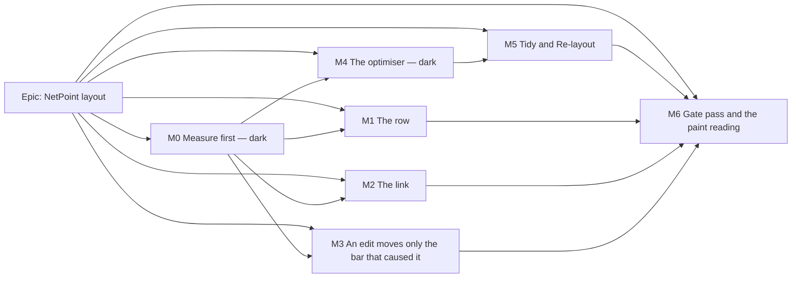

# Implementation Plan: NetPoint layout — rows chosen for how the logic routes, and a diagram that reads like the reference

- **Feature spec:** [`./feature-spec.md`](./feature-spec.md)
- **Status:** Approved — by the product owner on 2026-09-23, with CQ-1 answered (see §0.11); not yet built
- **Owner:** web

## Breakdown

### Epic

**NetPoint layout** — overlap as a hard constraint on every edit; rows chosen by an objective that
judges how the links route; the NetPoint row and link reading aids. Canvas legibility theme, fourth
epic after ADR-0149/0150/0151. **No `VITE_` flag** (ADR-0088 D1): each milestone is a commit boundary,
and that is the rollback. **No schema, API or engine change**; `database-architect` not engaged
because there is nothing to design (re-open if any task finds otherwise — CLAUDE.md §19.3).

### Precondition

The `computeLaneArrangement` drawn-span fix (`arrange-lanes.ts:142-152` → `barDatesFor(a, 'visual')`)
lands **separately, before M0**. It is not planned here.

---

### Milestone M0: Measure first (shippable slice — ships dark)

**Outcome:** the conditions are committed, the yardstick exists, the baselines and costs are measured,
the optimiser's shape and the row budget are fixed from numbers, and the owed FC-L5 paint reading is
taken.
**Entry point:** `Ships dark: harness scripts and documents only; nothing a planner can reach. M1 is
the first user-facing milestone.`
**Journey:** none (dark). M1 carries the first.

#### Feature: Conditions, fixtures and baselines

> **Description:** commit `conditions.md` alone, add the `chain-3-placed` fixture, measure every
> yardstick plan at pitch 52 and 60, measure the optimiser's cost with a harness prototype, and put
> the row-budget frontier to the product owner.
> **Complexity:** L
> **Dependencies:** the precondition
> **Risks:** an instrument that measures nothing looks like a triumph (ADR-0150's gutter-leg blind
> spot) → every harness throws on vacuity; a prototype optimiser in the harness diverges from the
> product one → M4's structural test makes the product one the harness's import, not a copy.
> **Testing requirements:** every control verified red once; FC-N0 agreement run.

##### Task M0-T0 — Verify the precondition (≈ one PR, or none)

- **Description:** confirm the fix is on `main`; write FC-N1's red/green run.
- **Complexity:** S
- **Dependencies:** —
- **Risks:** fix landed on a different basis (e.g. the Late overlay's) → assert `barDatesFor(a,'visual')`
  by reading, and assert the result on the fixture.
- **Testing:** unit case in `arrange-lanes.test.ts` on the three-activity placed chain: 0 overlaps.
- **Development steps:**
  1. Read `arrange-lanes.ts`; record the line that now reads the drawn span.
  2. Check out the pre-fix commit in a worktree, run the case red, record the output; run green on `main`.
  3. If absent: **stop the epic** and report.

##### Task M0-T1 — Commit the conditions alone

- **Description:** transcribe spec §5 into `docs/specs/netpoint-layout/conditions.md`, including the
  honest limits and CQ-1's default budget formula. **One commit, no other file** (ADR-0128 ordering).
- **Complexity:** S
- **Dependencies:** M0-T0
- **Risks:** a bar edited after a measurement → the commit hash is quoted in every later write-up.
- **Testing:** `pnpm prepush` (`check:spec-status`, `check:doc-links`).
- **Development steps:**
  1. Write the file; 2. commit alone; 3. record the hash in the spec header.

##### Task M0-T2 — The `chain-3-placed` fixture and the baseline vector

- **Description:** add `chain-3-placed` to the harness family (A 5 d → B 5 d → C 4 d, FS, one row, C
  placed two days before B finishes; drawn span = the placement). Extend `measure-occlusion.mjs` /
  `measure-assignment-vector.mjs` to read all four plans and report `overlaps`, `occluded`, `occl/link`,
  `x/link`, `sameRow`, `travel`, `rows`, `legs/y`, `overlap/y` at {1, 4, 12} px/day × pans
  {0, 32, 200, 500}, at pitch 52 and 60 (the `measure-row-pitch.mjs` mechanism).
- **Complexity:** M
- **Dependencies:** M0-T1
- **Risks:** the ASAP pass cannot express a placement → the fixture carries its drawn spans directly,
  documented as a layout rather than a schedule (the `scale-scene.ts` honesty); the 500-pan culling
  trap (`measure-occlusion.mjs:44-49`) → positive pans only.
- **Testing:** FC-L12-style self-properties on the fixture (it must exhibit an overlap under the
  pre-fix pack and none under the fixed one); non-vacuity controls.
- **Development steps:**
  1. Fixture module beside `small-plan-fixture.ts`.
  2. Harness reads four plans; controls throw per row.
  3. Record `m0-measurement.md` with the commit hash; produce B_X(60) for FC-N9.

##### Task M0-T3 — Cost of evaluation (FC-N2)

- **Description:** in the harness, compose a **full** whole-plan evaluation (routing all edges through
  the same functions `paint.ts:1169-1298` calls, at 4 px/day, plus the counters) and an **incremental**
  one (re-route incident links and links touching the two lanes, re-run the three post-passes); time
  both at 144 / 500 / 2,000 (nine runs, p95); run the ≥ 1,000-move equivalence control.
- **Complexity:** M
- **Dependencies:** M0-T2
- **Risks:** harness routing differs from the painter's → FC-N0's agreement check is the gate; node
  timings are not the product owner's envelope → they bound the algorithm only (spec §5 limits).
- **Testing:** equivalence control verified red by deliberately skipping one lane's re-route.
- **Development steps:**
  1. Harness composition; 2. timings; 3. equivalence; 4. write the FC-N2 verdict, choosing main thread
     / worker / size cap and the offer's predicate from the committed rule.

##### Task M0-T4 — Prototype search and the CQ-1 frontier

- **Description:** a harness-only prototype of spec §4.5's search (repair → ordering → alignment →
  compaction, strict improvement, count caps) run as Tidy and Re-layout on all four plans at budgets
  {seed, +25 %, +50 %, +100 %, ∞}; report the frontier (FC-N10) with `shoot-layouts.mjs` pictures.
- **Complexity:** L
- **Dependencies:** M0-T3
- **Risks:** a prototype good enough to be copied into the product → **it is not copied**; M4 writes
  the product module and the harness then imports it (FC-N0).
- **Testing:** never-worse and determinism checked on the prototype as an early read of FC-N3.
- **Development steps:**
  1. Prototype; 2. frontier table + pictures; 3. **put CQ-1 to the product owner** with the table;
     record their answer (budget B, travel tiebreak yes/no) in `conditions.md` as a dated amendment.

##### Task M0-T5 — Glyph contact and text collision baselines (FC-N6c)

- **Description:** count same-row glyph contacts and intersecting text runs from the recorded painter
  at 4 and 12 px/day on all four plans, pitch 52 and 60.
- **Complexity:** S
- **Dependencies:** M0-T2
- **Risks:** the recorder cannot see `fillText` extents → measure with the painter's own `measure`
  function passed through the recording context.
- **Testing:** control: a fixture with two deliberately colliding labels must count ≥ 1.
- **Development steps:** 1. counter; 2. control red; 3. record.

##### Task M0-T6 — The owed paint reading (FC-L5 → FC-N8 baseline)

- **Description:** ask the product owner for one sweep of the ADR-0128 `canvas-draw` probe on their own
  hardware against the current release (500 and 2,000; Week judged, Fit reported); record it as
  **both** FC-L5's owed reading (closing ADR-0151's "untaken" record) and FC-N8's baseline, with the
  viewport, spread and power-state caveat (`docs/TECH_DEBT.md` #75/#261/#283).
- **Complexity:** S (for us) — the reading is the product owner's
- **Dependencies:** none; can run in parallel
- **Risks:** machine-state drift between sittings (#75 item 6) → report spread; judge only deltas
  larger than it.
- **Testing:** the probe's own non-vacuity floor.
- **Development steps:** 1. request; 2. paste the block into `m0-measurement.md`; 3. update #75.

---

### Milestone M1: The row (shippable slice)

**Outcome:** every reader sees dates under the nodes by default and duration · float centred under
each bar at pitch 60, with the duration no longer in the name.
**Entry point:** opening any plan's diagram (the default view); the governing controls are
`View ▾ ▸ Dates` (now on by default) and `View ▾ ▸ Labels`.
**Journey:** a new spec in the existing `e2e-arrange` suite (no new Playwright config, so no ADR-0105
trigger and no roster change): open a seeded plan, assert `View ▾ ▸ Dates` is `aria-checked="true"`
on first open, and assert by pixel probe (the `gutter-channel.spec.ts` technique) that ink exists in the
below-row band under a known wide bar and none in the name row's former duration position.

#### Feature: Pitch 60 and the three-item below row

> **Description:** spec §4.6.
> **Complexity:** M
> **Dependencies:** M0-T2 (pitch-60 baselines), M0-T5
> **Risks:** the golden log shrinks silently when rows grow (ADR-0151 Consequences) → it derives from
> lane count and is re-baselined by hand against a written prediction; export height cap binds earlier
> (86 lanes at 52 → about 74 at 60) → reported, not gated; the centre item's text changes
> `paint.dates-budget.test.ts`'s shape → the dates' path is untouched by design, and C gets its own
> budget case.
> **Testing requirements:** unit (ladder rungs, milestone single date, C never outside its bar);
> `paint.lane-containment.test.ts` new cases; counting-stub budget for C; golden log hand re-baseline;
> FC-N6a zero-collision run; journey above.

##### Task M1-T1 — Pitch 60

- **Description:** `LANE_HEIGHT` 52 → 60; update every docblock whose reason names 52; re-run
  `geometry.constant-derivation.test.ts`; re-derive `canvas-draw.ts`'s visible-bar table.
- **Complexity:** S
- **Dependencies:** M0-T2
- **Risks:** a stale number in a docblock (ADR-0151 M6 found `canvas-draw.ts`'s table stale) → grep
  for `52` across `features/tsld` and `perf-probe`.
- **Testing:** derivation suite; golden log re-baseline (written prediction first, then compare).
- **Development steps:** 1. constant; 2. prediction list; 3. re-baseline; 4. harness pitch-60 reading
  **without** link marks (separates the pitch's paint cost from M2's, spec §5 limits).

##### Task M1-T2 — Move the duration; add the centre item; flip `Dates`

- **Description:** `RenderActivity.label` = `activityLabel`; add `durationDays`; centre item per the
  ladder; `DEFAULT_VIEW_TOGGLES.dates = true`; `scale-scene.ts` label updated.
- **Complexity:** M
- **Dependencies:** M1-T1
- **Risks:** another consumer of `activityBarLabel` → list every caller first and decide each;
  export picture changes (ADR-0103 scene parity) → the export uses the same painter and defaults, and
  the export journey is re-run.
- **Testing:** ladder unit cases; FC-N6a; journey.
- **Development steps:** 1. render model; 2. painter; 3. defaults; 4. `docs/DESIGN_SYSTEM.md`; 5. changeset
  (web minor).

---

### Milestone M2: The link (shippable slice)

**Outcome:** chevrons along every link, driving links bold in their criticality ink, non-driving thin
and grey (`--canvas-link-minor`), waiting time dashed, lag in a box, a legend that keys all of it, and
a spoken slack that equals the drawn gap.
**Entry point:** opening any plan's diagram; the legend at `View ▾ ▸ Legend` (or wherever it is
reached today — confirmed in M2-T4, not assumed).
**Journey:** `e2e-arrange` spec: (1) resolve the palette in Chromium on the canvas element and assert
`linkMinor` equals `getComputedStyle(canvas).getPropertyValue('--canvas-link-minor')` and is not the
fallback; (2) open the legend and assert the rows and the computed swatch colour; (3) open the guest
share view of the same plan and repeat (1) (ADR-0102's provider finding); (4) Tier-2 logic summary on
a placed activity speaks the drawn gap.

#### Feature: Token first, recorder first, then marks

> **Description:** spec §4.7.
> **Complexity:** L
> **Dependencies:** M1
> **Risks:** the three canvas colour traps (spec §4.7) → each closed by a named check; the recorder
> miscounts links once chevrons/gap runs/plates exist → taught before the marks ship; ADR-0151 D7's
> measured premise (links already louder than bars) → `measure-ink.mjs` re-run and reported to the
> product owner with pictures, not used to overrule their instruction.
> **Testing requirements:** contrast pairs red-first; recorder controls red-first; unit (rung rule,
> gap extent per type, lag plate placement ladder); new `paint.link-marks-budget.test.ts` (answers
> `docs/TECH_DEBT.md` #370 for this layer); `paint.routing-budget.test.ts` unedited; golden log hand
> re-baseline; journey above.

##### Task M2-T1 — `--canvas-link-minor` and its contrast pairs

- **Description:** add the token to the theme block beside `--canvas-lane-rule`, the pairs to the plot
  sweep (`--canvas`, `--canvas-band`), `PRINT_TOKEN_SOURCES`, the palette key. **Pairs first**, red with
  a too-light value, then the value.
- **Complexity:** S
- **Dependencies:** —
- **Risks:** value chosen for looks and failing 3:1 → the gate decides.
- **Testing:** `token-contrast.test.ts`; `print-palette.structural.test.ts`.
- **Development steps:** 1. test red; 2. value; 3. green; 4. close #367 in the register.

##### Task M2-T2 — Teach the recorder

- **Description:** harness sentinels for `bar`-inked driving links and `linkGap`; stitching of a route's
  solid and dashed runs; chevrons excluded by flush kind; plates by colour. Re-verify
  `visibleLinks === edges` and `diagonal === 0` **red** against a stroked chevron.
- **Complexity:** M
- **Dependencies:** M2-T1
- **Risks:** stitching joins two different links that share an endpoint → stitch only within one edge's
  emitted sequence; the reconstruction control (`measure-avoidable.mjs`) must still report IDENTICAL.
- **Testing:** the controls above.
- **Development steps:** 1. sentinels; 2. stitcher; 3. red runs recorded; 4. green.

##### Task M2-T3 — Paint the link language

- **Description:** rung colours, weights, dash retirement, filled chevrons (spacing and per-link cap
  derived and justified in a docblock), gap runs, lag plates.
- **Complexity:** L
- **Dependencies:** M2-T2
- **Risks:** chevrons at Fit on 4,000 edges → bounded by the culled set and the per-link cap, pinned by
  the new budget test; lag plate over a bar → placed on the link's segments only, suppressed otherwise.
- **Testing:** unit + budgets + golden log.
- **Development steps:** 1. rung derivation (pure, tested); 2. gap extent (pure, tested per type); 3. painter; 4. budgets; 5. re-baseline by hand.

##### Task M2-T4 — Legend, spoken slack, docs

- **Description:** legend rows (spec §4.7); ADR-0154 filed. **The spoken-slack half already shipped** in PR #663 (`TsldPanel.drawn-slack.test.tsx`, verified red first), as the seventh site of the drawn-span defect that PR fixes — so this task is the legend and the ADR only.
- **Complexity:** M
- **Dependencies:** M2-T3
- **Risks:** the legend keys a retired mark (ADR-0151 M6) → a legend test asserts the absence of
  "Non-driving link — dashed".
- **Testing:** legend tests; a unit case where early ≠ drawn and the spoken slack equals the drawn gap
  (red against today's builder); journey.
- **Development steps:** 1. legend; 2. slack source; 3. accessibility-reviewer **before release**
  (§19.13 — the legend and the spoken summary are AT-facing); 4. ADR-0154; 5. changeset.

---

### Milestone M3: An edit moves only the bar that caused it (shippable slice)

**Outcome:** no planner edit leaves two bars overlapping in a row; only the causing bar moves, it is
announced, and it is undoable.
**Entry point:** any structural edit on the canvas — drag, finish-edge resize, placement, create —
and the lane drop (`Alt+↑/↓` and vertical drag). The notice is the dock's new `layout-resolved` strip
with `Undo`.
**Journey:** `e2e-arrange/auto-resolve.spec.ts`, against a real API with the pen enforced: seed C and D
in one row via the API; lengthen C through the canvas (`Shift+→` on the selected bar); after the
recalculation, read every activity's `laneIndex` from the API and assert **exactly one** changed (C's)
and no drawn-span overlap remains; assert the announcement text and the dock notice; press `Ctrl+Z` and
assert C's lane is restored via the API; drop a bar onto an occupied row and assert it landed in the
nearest free row in one write; assert focus is not on `<body>` after the notice's `Dismiss`/`Undo`.

#### Feature: `nearestFreeRow` and the resolution rule

> **Description:** spec §4.4.
> **Complexity:** M
> **Dependencies:** M0 (FC-N5 bars)
> **Risks:** resolution fights an undo replay → no snapshot on replay (tested); the edit comes from the
> table or the Gantt, where there is no canvas → the rule lives in the workspace model, view-independent;
> the dock notice unmounts under focus → it names its successor (ADR-0149 D8).
> **Testing requirements:** unit (the three mover clauses, cascade order, pre-existing overlaps
> untouched, replay inert, no-pen inert); `@repo/layout` spec for `nearestFreeRow`; FC-N5b timing
> harness; journey above; accessibility + component review **before release** (focus/announce rules
> on a shared surface, §19.13).

##### Task M3-T1 — `nearestFreeRow` in `@repo/layout`

- **Description:** pure export beside `packLanes`, sharing its tie rule; `laneOverlapIds`' sweep
  extended to return pairs (one predicate).
- **Complexity:** S
- **Dependencies:** —
- **Risks:** ADR-0019 build contract → the package builds to `dist`; `check-build-contract`.
- **Testing:** `pack-lanes.spec.ts` sibling cases; `lane-overlap` pairs cases.
- **Development steps:** 1. function; 2. tests; 3. build.

##### Task M3-T2 — `auto-resolve.ts` (pure)

- **Description:** `(S0, S1, subjects) → moves` per spec §4.4.
- **Complexity:** M
- **Dependencies:** M3-T1
- **Risks:** a clause that never fires in practice → a unit case per clause with the example that
  motivates it.
- **Testing:** unit; FC-N5b timing at `scale-2000` (50-bar cascade).
- **Development steps:** 1. function; 2. tests; 3. timing.

##### Task M3-T3 — Wire into the workspace model

- **Description:** snapshot at command time; hook recalculation settlement (`usePlanAutoRecalc`); relane
  write (`relaneCommand` for one mover, the `autoArrangeCommand` shape for several); own undo entry
  (CQ-2 default); lane-drop pre-resolution; suppression under the Late overlay; `layout-resolved` dock
  rung; announcement copy.
- **Complexity:** L
- **Dependencies:** M3-T2
- **Risks:** the snapshot misses a command path (table, Gantt, logic editor, bulk move, paste) → a
  census test enumerates the command constructors in `features/undo-redo/commands.ts` and asserts each
  structural one is snapshotted or explicitly exempted with a reason (pinned positive case, ADR-0093).
- **Testing:** hook tests; `dock-strip.test.ts` precedence; journey.
- **Development steps:** 1. snapshot; 2. settle hook; 3. writes + undo; 4. dock rung; 5. ADR-0153; 6. `docs/UX_STANDARDS.md`; 7. changeset.

---

### Milestone M4: The optimiser (shippable slice — ships dark)

**Outcome:** a pure, deterministic, bounded Tidy / Re-layout search evaluated on the painter's own
routing pipeline, proven never-worse, with the harness importing it.
**Entry point:** `Ships dark: a pure model with no caller in the product; M5 surfaces it through
Arrange.`
**Journey:** none (dark). M5 carries it.

#### Feature: `routeFrame`, the objective, the search

> **Description:** spec §4.5.
> **Complexity:** XL
> **Dependencies:** M0-T3/T4 (shape, caps, CQ-1 answered), M1 (pitch), M2 (the painter's final routing
> inputs), M3-T1 (`nearestFreeRow`)
> **Risks:** extracting `routeFrame` changes the painter → barrel-preserving move; the golden log and
> every routing suite pass **unedited** as the before/after oracle (ADR-0078); the product counters
> drift from the harness → FC-N0 exact agreement; a time-dependent result → count caps only, a test
> asserts no `performance.now`/`Date` in the search module; the engine creeps in → import-ban structural
> test.
> **Testing requirements:** FC-N0, FC-N3 (property sweep + determinism), FC-N4 (harness verdict),
> structural tests (painter uses `routeFrame`; no engine import; no clock), unit cases per phase.

##### Task M4-T1 — Extract `routeFrame`

- **Description:** move `lineOf` + the three post-passes out of `paint.ts` into `render/route-frame.ts`,
  returning polylines and lag runs/handles as values.
- **Complexity:** L
- **Dependencies:** M2
- **Risks:** a behaviour change hidden in a move → no assertion changes in the PR; ui-architect review
  of the boundary.
- **Testing:** existing suites unedited; structural test.
- **Development steps:** 1. move; 2. structural test; 3. run the whole render suite + golden log.

##### Task M4-T2 — `layout-objective.ts`

- **Description:** counters for spec §4.5's table over `routeFrame`'s output at the reference zoom.
- **Complexity:** M
- **Dependencies:** M4-T1
- **Risks:** counters disagree with the harness → FC-N0 blocks M4-T3.
- **Testing:** unit; FC-N0 run (harness imports the product counters' **inputs** but keeps its own
  recorder-based counting — two instruments).
- **Development steps:** 1. counters; 2. FC-N0 verdict recorded.

##### Task M4-T3 — `optimise-layout.ts` (+ the worker if FC-N2 chose it)

- **Description:** repair → ordering → alignment → compaction; Tidy and Re-layout entry points; caps P
  and E from M0; incremental filter + full confirmation if FC-N2c required it; module worker wrapper
  only if FC-N2b chose it (then ADR-0152 D5 records the app's first worker and the CSP reasoning).
- **Complexity:** XL
- **Dependencies:** M4-T2
- **Risks:** a never-worse violation from a counter bug → FC-N3's property sweep is the gate; worker
  build/CSP surprises → `e2e-csp` run locally before push.
- **Testing:** FC-N3; FC-N4 harness verdict on the product module; determinism across permutations.
- **Development steps:** 1. search; 2. property sweep; 3. harness switched to import the product module
  and prototype deleted; 4. FC-N4 verdict; 5. ADR-0152 drafted to Accepted-on-M5 wording.

---

### Milestone M5: Tidy and Re-layout (shippable slice)

**Outcome:** a planner holding the pen chooses Tidy or Re-layout, sees both previews, confirms one
batch write, and can undo it in one step; the dock offer appears when the diagram has overlaps (or
hidden links, if FC-N2a passed) and never nags after a Tidy.
**Entry point:** the Tools strip's `Arrange` (label unchanged) and the dock offer's `Arrange…` button.
**Journey:** `e2e-arrange/tidy.spec.ts` against a real API with the pen enforced: (1) seed
`chain-3-placed`'s shape via the API with an existing overlap; the offer appears; press `Arrange…`;
the dialog shows **Computing…** then both options; Tidy selected; confirm; read lanes from the API and
assert 0 overlaps; press `Ctrl+Z` once and assert every lane restored via the API; (2) import the
existing `.xer` fixture, press `Arrange`, choose Re-layout, confirm, assert 0 overlaps and a single undo
restores; (3) assert focus lands on the diagram listbox on confirm, cancel and close (ADR-0149 D8);
(4) update the import negative control deliberately if the predicate changed (spec §4.8), in the same
commit, with the reason.

#### Feature: The dialog, the offer, the write

> **Description:** spec §4.8.
> **Complexity:** L
> **Dependencies:** M4
> **Risks:** focus loss on the success path (ADR-0149 D8) → listbox first; native `disabled` blur →
> `aria-disabled`; the batch cap → Re-layout shaded with the reason above 2,000 moves; the offer reads
> a stale derivation → one memoised predicate, one call site.
> **Testing requirements:** dialog unit tests (all states); `dock-strip` precedence; journey above;
> accessibility + component + ux review **before release** (new dialog on a shared surface, §19.13).

##### Task M5-T1 — `ArrangeDialog`

- **Description:** replaces the `ConfirmDialog` use at `TsldPanel.tsx:3449-3465`; computing / ready /
  nothing-to-do / bounded / error states; Tidy default; figures from the one evaluation the confirm
  writes.
- **Complexity:** M
- **Dependencies:** M4-T3
- **Risks:** segmented control cannot carry descriptions → component-reviewer decides before build.
- **Testing:** unit; journey.
- **Development steps:** 1. component; 2. states; 3. copy review with ux-reviewer.

##### Task M5-T2 — Offer predicate and message

- **Description:** replace the `packLanes`-comparison predicate (`TsldPanel.tsx:1673-1677`,
  `arrange-lanes.ts:87-134`) with overlaps (+ occluded if FC-N2a); message states known facts only.
- **Complexity:** S
- **Dependencies:** M5-T1
- **Risks:** the offer reappears after a Tidy → a unit case: after applying a Tidy result the predicate
  is false.
- **Testing:** unit; journey.
- **Development steps:** 1. predicate; 2. message function + tests; 3. journey update.

##### Task M5-T3 — Write, undo, announce

- **Description:** `autoArrangeCommand` reused (one entry); announcement names the option and counts.
- **Complexity:** S
- **Dependencies:** M5-T1
- **Risks:** none new.
- **Testing:** journey undo step.
- **Development steps:** 1. wire; 2. ADR-0152 Accepted; 3. changeset (web minor).

---

### Milestone M6: Gate pass and the paint reading (shippable slice)

**Outcome:** four specialist reviews over the combined diff, every blocking finding folded with a
regression test verified red first; the after-epic paint reading taken on the product owner's hardware;
ADRs, `CLAUDE.md` §16 and the register reconciled.
**Entry point:** no new capability — the epic's existing entry points (M1–M5) are re-driven.
**Journey:** the whole `e2e-arrange` suite plus the base journey and every suite the sweep names
(`scripts/e2e-sweep.sh`), run locally before push (CLAUDE.md §19.8).

#### Feature: Reviews, reading, reconciliation

> **Description:** close the epic honestly.
> **Complexity:** M
> **Dependencies:** M1–M5
> **Risks:** a finding waved through as "non-blocking" → each non-blocking finding becomes a
> `docs/TECH_DEBT.md` row with a status; the paint reading is not taken → recorded as untaken, never as
> met (ADR-0151 M6 §3's precedent).
> **Testing requirements:** every fix red-first; FC-N8 verdict.

##### Task M6-T1 — Specialist reviews

- **Description:** accessibility-reviewer, component-reviewer, ux-reviewer, performance-reviewer over
  the combined diff; fold blocking findings.
- **Complexity:** M
- **Dependencies:** M1–M5
- **Testing:** one regression test per fix, verified red against the unfixed code.
- **Development steps:** 1. run all four; 2. fold; 3. `m6-gate-pass.md`.

##### Task M6-T2 — FC-N8 after-reading

- **Description:** the product owner presses the canvas-draw sweep on the same machine and viewport as
  M0-T6; judge per FC-N8.
- **Complexity:** S (for us)
- **Dependencies:** M6-T1
- **Development steps:** 1. request; 2. verdict with spread; 3. update #75.

##### Task M6-T3 — Reconciliation

- **Description:** ADR-0152/0153/0154 filed and indexed; `CLAUDE.md` §16 entries (gated by
  `check:adr-coverage` since ADR-0147); `docs/DESIGN_SYSTEM.md`; register rows (#367 closed, #370
  partly answered, new rows); spec and plan headers → `Accepted — shipped (ADR-0152…0154)`.
- **Complexity:** S
- **Dependencies:** M6-T2
- **Development steps:** 1. docs; 2. `pnpm prepush`; 3. changeset review.

## Sequencing & slices

1. **M0** (dark) — nothing else starts until M0-T1 is committed alone and M0-T3's FC-N2 verdict exists.
   CQ-1 is answered at M0-T4, before M4.
2. **M1, M2, M3** are independent vertical slices on `main`; each is releasable on its own and each
   lands its own journey step (ADR-0081). Suggested order M3 → M1 → M2: M3 is the product owner's most
   felt defect and needs no visual change; M1 then M2 because M2's link marks sit in the room M1's pitch
   makes.
3. **M4** (dark) after M1/M2 so `routeFrame` is extracted from the final painter.
4. **M5** surfaces M4.
5. **M6** closes.

**No feature flags** (ADR-0088 D1). Each milestone is one or a few commits whose revert is the rollback.
Adding specs to `e2e-arrange` changes that suite's duration, not the CI roster; the shard balance
(ADR-0138) is re-checked with `check:e2e-roster` after M5.

## Definition of Done (per task)

Each task's PR must satisfy the Feature Completion Criteria in [`docs/PROCESS.md`](../../PROCESS.md)
(code, tests, docs, security, performance, accessibility, Docker build, CI, changelog, version impact),
with `pnpm prepush` and `scripts/e2e-local.sh web:arrange` **run** before push for any task touching the
canvas or the suite.

## Risks & assumptions (rollup)

| Risk / assumption                                                                       | Likelihood          | Impact | Mitigation                                                                   |
| --------------------------------------------------------------------------------------- | ------------------- | ------ | ---------------------------------------------------------------------------- |
| Rows-last objective drives toward one bar per row (spec §0.7)                           | high                | high   | CQ-1 row budget + travel tiebreak, set on M0-T4's frontier                   |
| The optimiser is too slow at 2,000 on the main thread                                   | med                 | high   | FC-N2 decides main thread / worker / size cap before M4                      |
| Product counters and harness counters disagree                                          | med                 | high   | FC-N0 exact agreement blocks M4-T3                                           |
| Never-worse holds at 4 px/day but a zoom planners use gets worse                        | med                 | med    | FC-N4 reports 1 and 12 px/day; a > 10 % regression goes to the product owner |
| New link marks break the recorder's controls silently                                   | high                | high   | M2-T2 teaches it first; controls red-first                                   |
| A new canvas token paints nothing in a real browser (ADR-0100 M4 / ADR-0102 / ADR-0121) | med                 | high   | journey resolves the palette and the legend swatch in Chromium               |
| Paint cost of chevrons and labels exceeds the Week bar on the product owner's machine   | med                 | med    | FC-N8; spacing/LOD remedies named in advance; counting-stub budgets          |
| Auto-resolve surprises a planner (a bar jumps)                                          | med                 | med    | announcement + dock notice + one-step undo; ux review before release         |
| Offer nags after a Tidy                                                                 | high if unaddressed | med    | predicate no longer compares with `packLanes`; unit case                     |
| The precondition fix has not landed                                                     | low                 | high   | M0-T0 stops the epic                                                         |
| Glyph contact at coarse zoom reads as overlap                                           | med                 | low    | FC-N6c measures; escalates to an objective term, never a layout gap          |
| CPM engine touched                                                                      | low                 | high   | import-ban structural test on every new module                               |
