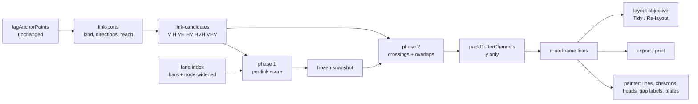
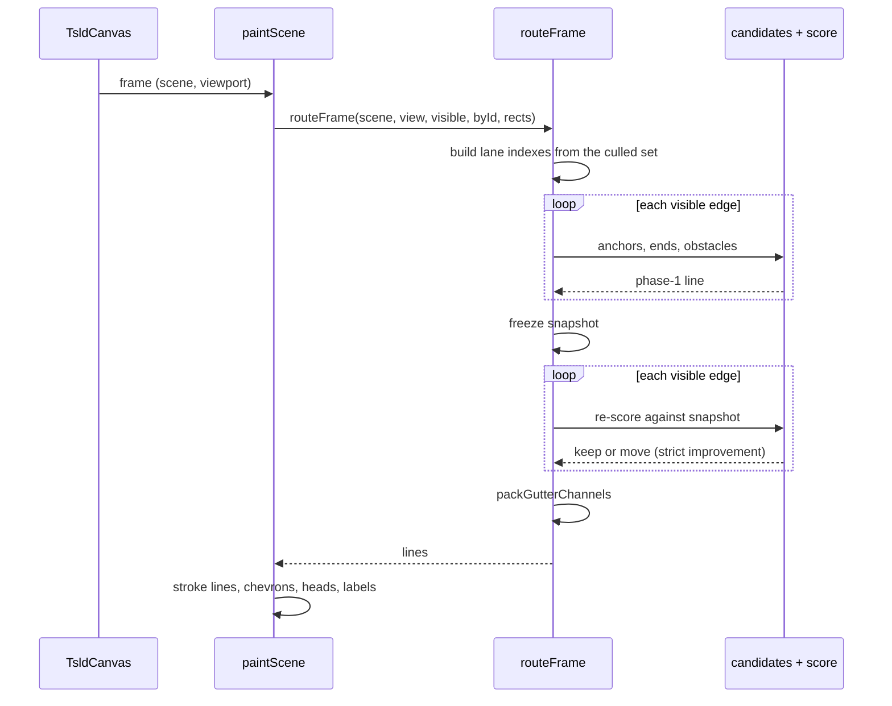
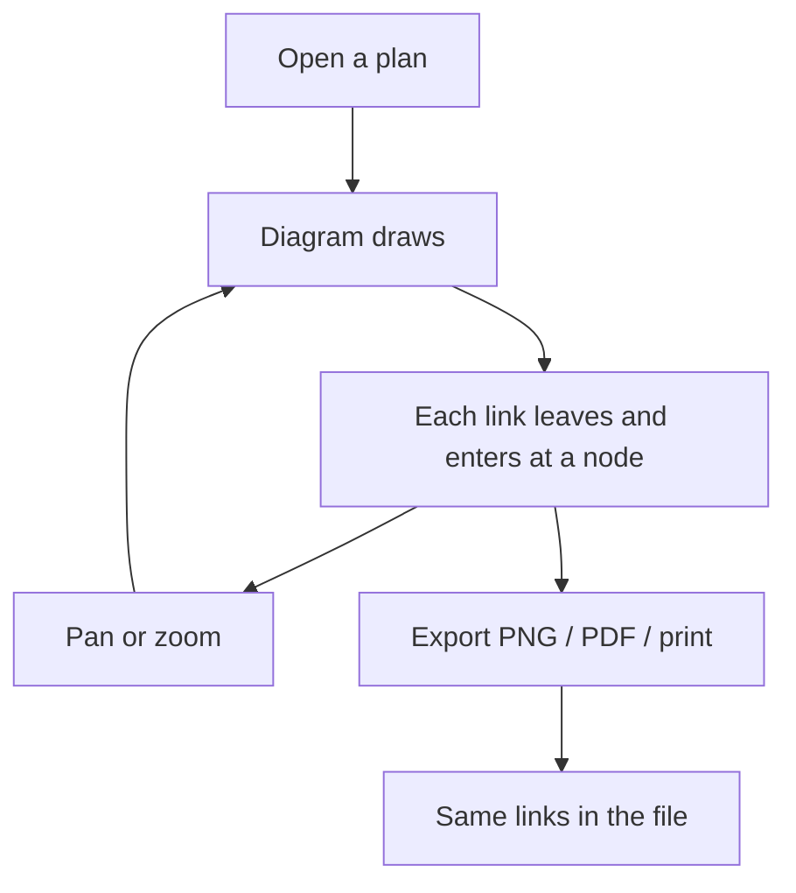

# Feature Spec: Node-to-node link routing on the TSLD canvas

- **Status:** Approved 2026-09-25 (product owner; CQ-1 answered "+10 %"). Built under this plan.
- **Author(s):** feature-analyst, for the product owner
- **Date:** 2026-09-25
- **Tracking issue / epic:** none yet
- **Roadmap link:** the TSLD legibility programme (`docs/specs/netpoint-layout/`,
  `docs/specs/netpoint-grammar/`)
- **Related ADR(s):** ADR-0158 (to be filed at M3; outline in §4.10). It amends ADR-0065 (the elbow
  rule and M3 bundling), ADR-0149 D4 (the crossing chooser) and ADR-0150 (where the gutter route's
  verticals sit). ADR-0065's rejection of diagonals is **superseded only if M4 passes its own
  conditions**; otherwise it stands and ADR-0158 records why (§4.8).
- **Evidence:** the NetPoint 5.4 manual section "Links, Embeds, and Logic", pasted by the product
  owner on 2026-09-25 (the vendor site is blocked from this environment, so the pasted text is the
  source), and our own measured record of a NetPoint picture,
  [`../netpoint-grammar/reference-observations.md`](../netpoint-grammar/reference-observations.md).

## 0. How to read this

**This spec changes where links run. Nothing else moves.** Bars, nodes, lanes, dates and the text
rows stay where they are. The anchors a link attaches to (`lagAnchorPoints`) do not change, so the
lag drag, lag runs, lag handles and attachment dots are untouched. There is no API change, no schema
change and no migration. The CPM engine is not imported.

**Diagonals are conditional.** The product owner first chose "scored geometry, diagonals allowed",
then added on 2026-09-25: _"if the diagonal is an issue lets leave it as not valid"_. So the core of
this epic is **orthogonal** (V, H, VH, HV, HVH, VHV). Diagonals are a separate, last milestone (M4)
with its own committed conditions. If they fail, they are dropped and recorded as not valid, and
nobody is asked again. Nothing before M4 depends on it.

**Citations** are at commit `8b85e910`. `paint.ts` is cited by function or layer name, not by line:
its line numbers moved between two reads made for this spec, so it is being edited in parallel.
Other files are cited by line, and those lines were read for this spec.

### 0.1 What the brief said, checked

CLAUDE.md §19.11 says a brief is not evidence. Each claim below was read in the code.

| Brief claim                                                                                        | What the code says                                                                                                                                                                                                                                                                                   |
| -------------------------------------------------------------------------------------------------- | ---------------------------------------------------------------------------------------------------------------------------------------------------------------------------------------------------------------------------------------------------------------------------------------------------- |
| An FS elbow sits at `from.x + corridorGap(view)`, 4–12 px right of the predecessor's finish.       | True. `link-routing.ts:352-354` (`preferred = from.x + gap + shift` for FS) and `:304-306` (`corridorGap = min(12, max(4, pxPerDay))`).                                                                                                                                                              |
| The stubs joining that vertical to the nodes are hidden under the node disc (`NODE_REACH_PX = 9`). | True. `NODE_RADIUS = min(15 / 2, …) = 7.5` and `NODE_REACH_PX = NODE_RADIUS + 3 / 2 = 9` (`render-model.ts:216, 245-248, 345`). A 4–9 px stub ends inside the disc; 9–12 px ends at its rim.                                                                                                         |
| When the preferred corridor is blocked, the last leg can run along the successor's own bar.        | True, and this is why: the leg test excludes each endpoint's **own** bar span by identity (`link-routing.ts:378-382`, `isLegClear` at `:242-267`). A leg along its own bar is never refused, so the line reaches the start node from the right, over the bar, and the arrow appears to land mid-bar. |
| The gutter route (VHV) is node-to-node.                                                            | **False.** Its two verticals sit one gap **outside** each anchor (`link-routing.ts:510-512`: `near = from.x + gap`, `far = to.x - gap`). The same arithmetic detaches it.                                                                                                                            |
| `routeResidue` should be kept, adapted or deleted.                                                 | **It does not exist.** The only match in the repository is a `{@link routeResidue}` in a docblock (`link-routing.ts:458`). M0-T1 removes the dangling link.                                                                                                                                          |
| ADR-0154's "dashed waiting run" must work on diagonals.                                            | **It no longer exists.** ADR-0157 retired it: waiting time is a gap label now (the link-language docblock in `paint.ts`, "The dash ADR-0154 D3 gave it is retired"). Gap labels and lag plates are what must work.                                                                                   |
| After `routeOrthogonal`, three frame passes move geometry.                                         | True: `chooseCorridorsByCrossing`, `bundleCorridors`, `packGutterChannels`, in that order (`route-frame.ts:253-282`).                                                                                                                                                                                |

The brief's pixel positions (x = 1088 on Roof, start node at 1035) came from a scratch harness that
was not committed. M0 rebuilds both cases as a committed fixture before anything relies on them.

## 1. Business understanding

### 1.1 Problem

The product owner, 2026-09-25: _"can we review the logic links. they should come directly to the
nodes unless a lead/lag is there."_

On today's canvas a link does not visibly start or end at a node. Three causes, each read in code:

1. **The first bend is inside the node.** An FS link leaves the predecessor's finish node with a
   4–12 px horizontal stub, then turns (§0.1). The node disc covers 9 px. So the stub is hidden and
   the vertical seems to float a few pixels to the right of the node (the product owner's screenshot:
   `gfdsa` 27 Nov → `ccfcc` 30 Nov).
2. **A link can arrive from the wrong side.** For an FS across lanes where the successor starts the
   moment the predecessor finishes, the vertical sits right of both nodes. The last leg then runs
   **left** into the successor's start node, over its own bar.
3. **A link can land mid-bar.** When the preferred corridor is blocked, a corridor further right is
   chosen, and the last leg runs along the successor's own bar, hidden under it (Frame → Roof).

Then three frame-wide passes move lines after they are routed (`route-frame.ts:253-282`). Each can
move a vertical further from the node it serves.

NetPoint's rule is simpler. A link is drawn from the first object to the second. An FS link runs from
the predecessor's finish node to the successor's start node. A link can bend vertically,
horizontally and (optionally) diagonally, and each possible shape is **scored**: _"based on how many
grids it passes through, or if it crosses over other objects or overlaps with other links … The more
intersections and overlaps, the higher the score. Whichever geometry receives the lowest possible
score will be chosen."_ (NetPoint 5.4 manual, as pasted.) Our measured reference picture agrees: _"A
shared vertical bus runs down the left from Mob, with horizontal branches into each row"_, and some
links are straight diagonals (`reference-observations.md:24`).

**Why now.** The previous three epics made the diagram readable at the scale of the whole plan:
fewer crossings (ADR-0149), no legs behind bars (ADR-0150), a thin bar with a node at each end
(ADR-0151, ADR-0157). ADR-0151's own premise was that _"every link converges on the node glyph"_
(`render-model.ts:228-231`). The router never made that true.

### 1.2 Users

Everyone who reads the diagram: Planner, Contributor, Viewer, Org Admin, and an External Guest on a
share link (the guest view mounts the same painter). No role gains or loses a capability. There is
nothing to press: the diagram draws differently.

### 1.3 Primary use cases

1. A planner follows a link from one activity to the next and sees exactly which node it leaves and
   which node it enters.
2. A planner reads a lag or lead: the link attaches partway along a bar (an embed), as today.
3. A planner hands a printed or exported diagram to someone who was not in the room, and the links
   read the same there.

### 1.4 User journeys

Open a plan. The diagram shows every link leaving its predecessor's node and entering its
successor's node, from the correct side, with the arrowhead on the node. Pan and zoom: the links
re-route for the new view but never leave their nodes. Export a PNG or PDF: the same lines.

### 1.5 Expected outcomes

- No link appears to float beside a node, enter a node over its own bar, or land in the middle of a
  bar (except an embed, which is meant to).
- Links still avoid bars, and still cross each other about as rarely as today (CQ-1 sets the limit).
- A hub's links share one vertical stem from its node, the "bus" of the reference picture.

### 1.6 Success criteria

The falsification conditions in §4.9, measured on Unit 300 and the NetPoint reference plan. The
headline one is FC-T1: **unattached ends = 0**, on a metric that M0 must first prove fires on
today's code.

### 1.7 Open questions

**Critical (one):**

| #        | Question                                                                                                                                                                                                                                                    | Default if not answered                                                                                                                                                                                   |
| -------- | ----------------------------------------------------------------------------------------------------------------------------------------------------------------------------------------------------------------------------------------------------------- | --------------------------------------------------------------------------------------------------------------------------------------------------------------------------------------------------------- |
| **CQ-1** | Attaching every end to its node removes corridor positions the crossing chooser uses today, so crossings may rise. Attachment is treated as a hard rule. **How much rise in crossings per link is acceptable before the work stops and comes back to you?** | **+10 %** against today's shipped routing, at each of the three measured zooms (the same ceiling ADR-0150 used as FC-L4). Past that, M2 stops and reports the numbers; it is not withdrawn automatically. |

**Stated defaults (not questions; overturn any of them if you disagree):**

| #   | Default                                                                                                                                                              | Why                                                                                                                                                                                                                                   |
| --- | -------------------------------------------------------------------------------------------------------------------------------------------------------------------- | ------------------------------------------------------------------------------------------------------------------------------------------------------------------------------------------------------------------------------------- |
| D-1 | A link may enter a start node **from above or below** as well as from the left.                                                                                      | NetPoint's V geometry does this, and it is the only way to reach a start node that begins the moment its predecessor finishes.                                                                                                        |
| D-2 | Score order: through a bar or a foreign node first, then crossings, then overlaps, then length, then bends, then a fixed candidate order. Lexicographic, no weights. | Your order (bar, crossings, overlaps, length). A foreign node is part of a bar's glyph, and a line through one reads as a link to it. Bends break ties between shapes of equal length. Lexicographic matches ADR-0152.                |
| D-3 | Candidate order puts **VH before HV**.                                                                                                                               | Among equal scores this gives the reference picture's bus: one vertical from the predecessor's node, horizontal branches into each successor.                                                                                         |
| D-4 | Links from the same node may **share a stem**, and links into the same node may share their final approach. Neither counts as an overlap.                            | That is the bus. It is readable because every link on it starts (or ends) at one node.                                                                                                                                                |
| D-5 | A milestone gets a vertical port at its glyph's centre, beside today's side anchors.                                                                                 | A milestone has no node. A vertical arriving at its side anchor would pass beside the glyph, not into it.                                                                                                                             |
| D-6 | Links crossing an activity's **name or dates** are measured (FC-T6) but not scored.                                                                                  | You did not rank text. #391 item 11 already records it. If FC-T6 fails, adding a text term is the first remedy (§4.9).                                                                                                                |
| D-7 | No new View toggle. If diagonals pass M4, they are simply part of the scorer.                                                                                        | NetPoint has a "disallow diagonals" setting. Here a toggle would be a second routing state that the export parity gate, the Tidy objective and every fingerprint would have to carry, for a preference. Easy to add later if you ask. |
| D-8 | Ends with a lead or lag keep today's embed anchor (`lagAnchorPoints`).                                                                                               | Your instruction.                                                                                                                                                                                                                     |

## 2. Functional requirements

### 2.1 User stories and acceptance criteria

> **US-1 — A link leaves and enters at its nodes.** As any reader of the diagram, I want every link
> to visibly leave its predecessor's node and enter its successor's node, so that I can tell which
> activities it joins.
>
> - **Given** an FS link with no lag **then** the line starts at the predecessor's finish node centre
>   and ends at the successor's start node centre, and each end segment runs out of its node along a
>   direction the node allows (§4.1).
> - **Given** any bend next to a node **then** that bend lies outside the node's disc with room for
>   the corner (predecessor end) or the arrowhead (successor end) (§4.1, stub rule).
> - **Given** the successor starts exactly when the predecessor finishes, in another lane **then**
>   the link is a single vertical (V) where no bar or node is in the way.
> - **Given** any link **then** its arrowhead sits on the successor's node rim, pointing into it.

> **US-2 — A lag or lead still attaches along the bar.** As a planner, I want a link with a lag to
> attach where the lag says, so that the lag reads as time.
>
> - **Given** an SS+3 link **then** it leaves the predecessor 3 working days along its bar, from the
>   same point as today, and it leaves **vertically** (an embed has no sideways exit).
> - **Given** any lag **then** the attachment dot, lag run, lag handle and lag drag behave exactly as
>   today.

> **US-3 — A link does not run through things.** As a reader, I want links to avoid bars and other
> activities' nodes, so that a line never seems to join an activity it does not.
>
> - **Given** a shape that avoids every foreign bar and node exists **then** that shape is chosen.
> - **Given** no such shape exists **then** the shape through the fewest is chosen, and the case is
>   counted by the instrument (so a shortfall can be explained).

> **US-4 — Links are stable.** As a reader, I want a link to stay put while nothing changes.
>
> - **Given** the same plan and viewport **then** every frame draws identical lines, whatever order
>   the dependencies arrived from the server.

> **US-5 — The deliverable matches the screen.** As a planner sending an export, I want the PNG, PDF
> and printed diagram to show the same links as the canvas.
>
> - **Given** an export **then** it is composed by the same `routeFrame` (ADR-0103).

> **US-6 — Diagonals where they help (conditional, M4).** As a reader, I want a link that waits across
> time and changes lane to be drawn as a straight slope where that is clearer, as NetPoint does.
>
> - **Given** M4's conditions pass **then** a diagonal is drawn only across the link's own waiting
>   time, forward in time (§4.8).
> - **Given** they fail **then** no diagonal is ever drawn, and ADR-0158 records why.

### 2.2 Workflows

None. The planner does nothing new; the diagram draws differently.

### 2.3 Edge cases

| Case                                                                      | Behaviour                                                                       |
| ------------------------------------------------------------------------- | ------------------------------------------------------------------------------- |
| Same lane, clear between the two nodes                                    | H: a straight line, as today.                                                   |
| Same lane, a bar between                                                  | VHV through the gutter below (or above), with both verticals **on** the nodes.  |
| Successor starts the moment the predecessor finishes, other lane          | V if nothing is in the way; otherwise VHV with a short jog in a gutter.         |
| Waiting time too short for a corner outside the disc (under 31 px, §4.1)  | HVH is not generated; V, VH, HV or VHV only.                                    |
| Overlap in time (a lead, or a successor placed earlier than logic allows) | VHV running back in time through a gutter. HVH is invalid here (§4.2).          |
| Two links from one node                                                   | They may share the stem (D-4).                                                  |
| An unrelated node at the same date in a lane the link crosses             | Counted as an obstruction; another shape is preferred (US-3).                   |
| One end off screen                                                        | Obstacles are known only for visible bars, as today (`route-frame.ts:119-133`). |
| Milestone, LOE, WBS summary                                               | No node disc. Ports as §4.1; the stub rule uses a reach of 0.                   |
| A link whose ends are both hidden under nodes (very short H)              | Drawn as a straight line; no stub rule applies to a line with no bend.          |
| Flag-off paths (no routing, no refresh, no time-true)                     | Unchanged byte for byte (§4.5).                                                 |

### 2.4 Permissions

No change. Reading the diagram needs `schedule:read` as today. No write, so the pen (ADR-0028) is
not involved.

### 2.5 Validation rules

None. There is no input.

### 2.6 Error scenarios

| Scenario                    | Detection                                                                                                                                      | Result |
| --------------------------- | ---------------------------------------------------------------------------------------------------------------------------------------------- | ------ |
| No candidate is valid       | Cannot happen: VHV is always constructible between two points in different lanes, and H or VHV in one lane. Pinned by a property test (M1-T2). | —      |
| A route leaves the viewport | Drawn and clipped by the canvas, as today.                                                                                                     | —      |

## 3. Technical analysis

| Area           | Impact   | Notes                                                                                                                                                           |
| -------------- | -------- | --------------------------------------------------------------------------------------------------------------------------------------------------------------- |
| Frontend       | **med**  | `apps/web/src/features/tsld/render/` only: new pure modules for ports, candidates and scoring; `route-frame.ts` rewired; two frame passes retired; one adapted. |
| Backend        | none     |                                                                                                                                                                 |
| Database       | none     | No schema change, so `database-architect` is not engaged. Nothing to design.                                                                                    |
| API            | none     |                                                                                                                                                                 |
| Security       | none     | No input, no data.                                                                                                                                              |
| Performance    | **med**  | Routing runs on the paint path (ADR-0026) and inside the Tidy worker (ADR-0152). Bounded candidates, counting gates, a browser reading (FC-T8).                 |
| Infrastructure | none     | No new Playwright config or CI step: the journey joins `e2e-netpoint-grammar/`.                                                                                 |
| Observability  | none     |                                                                                                                                                                 |
| Testing        | **high** | Unit (ports, candidates, scorer, frame pass, determinism), counting gates, hand re-baselined golden log, the journey, and harness measurements.                 |

### 3.1 What is downstream of the route geometry

Every consumer of `routeFrame`'s lines was found by search (`routeFrame`, `lineOf`, `lines.get`,
`lagAnchorPoints`, `link-routing` imports).

| Consumer                                                                             | Reads                                           | Effect of this change                                                                                                                                                         |
| ------------------------------------------------------------------------------------ | ----------------------------------------------- | ----------------------------------------------------------------------------------------------------------------------------------------------------------------------------- |
| Painter, link language (`paint.ts`, `paintLinkLanguage`)                             | `lines`                                         | Strokes the new lines. Nothing else changes.                                                                                                                                  |
| Arrowhead (`headLineFor` in `paint.ts`, `trimPolylineEnd` `link-routing.ts:908-924`) | line end                                        | Works for any direction: it trims by length along the line. Every node end now **is** on a node centre, so the head always stops at the rim.                                  |
| Chevrons (`chevronsAlong`, `link-marks.ts:63-100`)                                   | whole line                                      | Direction-agnostic. Unchanged.                                                                                                                                                |
| Gap labels (`gapLabelAt`, `link-marks.ts:111-128`)                                   | horizontal segments inside the waiting interval | Unchanged for orthogonal lines. An HVH splits the waiting run in two, so a label has less room; measured (FC-T7). A diagonal has no horizontal at all (§4.8).                 |
| Lag plates (`lagPlateAt`, `link-marks.ts:142-160`)                                   | longest H, else longest V                       | Unchanged for orthogonal lines; ignores diagonals (§4.8).                                                                                                                     |
| Wrapped names (`createWrapClearance`, `layers/wrap-clearance.ts:48-62`)              | segment bounding boxes                          | Unchanged. It tests boxes, so it is exact for H and V and conservative for a diagonal (§4.8).                                                                                 |
| Attachment dots, lag runs, lag handles (`route-frame.ts:187-211`)                    | anchors                                         | Unchanged: anchors do not change.                                                                                                                                             |
| Lag drag hit-test (`hit-test.ts:204-230`)                                            | `lagAnchorPoints` only                          | Unchanged.                                                                                                                                                                    |
| Incident-link highlight                                                              | `lines`                                         | Follows automatically.                                                                                                                                                        |
| Revision ghosts, removed links (`paint.ts`, compare-links pass)                      | `lineOf` per link                               | Gets the new per-link route (phase 1 only; §4.4). Added and changed links reuse `lines`.                                                                                      |
| PNG/PDF export, printed diagram (ADR-0103)                                           | `paintScene`                                    | Same painter, same routes. `e2e-export` re-run.                                                                                                                               |
| Tidy / Re-layout objective (`layout-objective.ts:77-96`)                             | `routeFrame`                                    | Scores the new routes, so its choices can change. Its counters are orthogonal-only (`:157-178`, `:193-218`), which is correct for the core. Worker cost re-measured (FC-T8d). |
| Gantt dependency arrows                                                              | —                                               | **Untouched.** The Gantt imports only date helpers from `render-model` (`gantt/layout/bar-geometry.ts:3`, `gantt/layout/ruler-ticks.ts:1`), never `link-routing`.             |
| Minimap                                                                              | —                                               | **Untouched.** It draws no links (`TsldMinimap.tsx` has no edge or polyline reference).                                                                                       |
| Accessible logic summary (`summarizeLogic` in `TsldPanel.tsx`)                       | dependencies, not routes                        | **Untouched.** Links are canvas-only; the text tier is unchanged.                                                                                                             |
| Harnesses (`netpoint-evaluate.ts:11-16`, `crossing-probe.ts`, others)                | rebuild the old pipeline by hand                | Their digest controls will fail loudly. M0 points them at `routeFrame`/`layoutLines` so they cannot drift again.                                                              |

### 3.2 Dependencies

- Nothing must land first. The epic builds on shipped code only.
- M4 (diagonals) depends on M2. Nothing depends on M4.

## 4. Solution design

### 4.1 Ends and ports

An **end** is one side of a link. Its **anchor** is today's `lagAnchorPoints` point, unchanged. Each
end has a kind, a set of allowed directions and a **reach** (how far its glyph covers the line):

| End kind    | When                                                | Leaves / enters along                                                        | Reach               |
| ----------- | --------------------------------------------------- | ---------------------------------------------------------------------------- | ------------------- |
| Start node  | anchor on a task bar's start node                   | West, North, South. **Never East**, which runs along its own bar.            | `NODE_REACH_PX` (9) |
| Finish node | anchor on a task bar's finish node                  | East, North, South. **Never West.**                                          | 9                   |
| Embed       | anchor strictly inside a bar's span (a lag or lead) | North, South only                                                            | `ATTACH_DOT_R` (2)  |
| Milestone   | a milestone endpoint                                | East/West at today's side anchors; North/South at the glyph's centre x (D-5) | 0                   |
| Span end    | LOE, hammock or WBS summary endpoint                | as a start or finish node                                                    | 0                   |

"Leaves along West" means the first segment travels west. "Enters along North" means the last
segment arrives from above.

**The stub rule.** Where an end segment is followed by a bend, it must be long enough that the bend
is visible:

- predecessor end: `reach + LINK_ELBOW_RADIUS` (9 + 5 = **14 px** at a node)
  (`link-routing.ts:930`), so the rounded corner lies outside the disc;
- successor end: `reach + ARROWHEAD_ROUTED_PX` (9 + 8 = **17 px** at a node) (`link-routing.ts:858`),
  so the whole arrowhead lies on one straight segment.

Both numbers are derived from existing constants, not tuned (ADR-0151's rule for constants). A line
with no bend (V or H) is exempt: it runs straight through the centre, so nothing is hidden.

These two rules alone rule out all three defects in §1.1: a 4–12 px stub is shorter than 14, and
arriving over one's own bar is a forbidden direction.

### 4.2 Candidate shapes (the orthogonal core)

`P` is the predecessor anchor `(px, py)`, `S` the successor anchor `(sx, sy)`. A gutter `g` is a lane
boundary y (the datum ADR-0150 set: `originY + (lane + 1) * LANE_HEIGHT`).

| Shape   | Points                    | Generated when                                                                                   | Count                                            |
| ------- | ------------------------- | ------------------------------------------------------------------------------------------------ | ------------------------------------------------ |
| **H**   | P → S                     | same lane                                                                                        | 1                                                |
| **V**   | P → S                     | different lanes and `px = sx` (within 0.5 px)                                                    | 1                                                |
| **VH**  | P → (px, sy) → S          | different lanes; ports allow                                                                     | 1                                                |
| **HV**  | P → (sx, py) → S          | different lanes; ports allow                                                                     | 1                                                |
| **HVH** | P → (c, py) → (c, sy) → S | different lanes; `c` between the two stub limits                                                 | ≤ 5 (both stub limits, midpoint, quarter points) |
| **VHV** | P → (px, g) → (sx, g) → S | always; `g` = the gutter below the upper lane or above the lower one (same lane: below or above) | ≤ 2                                              |

So at most **11 candidates per link**. Each is built, then dropped if it breaks a port direction or
the stub rule. VHV cannot break either (both ends are vertical, and each vertical is at least half a
lane long), so every link always has a candidate.

Notes on specific cases:

- **HVH needs room.** For an FS link, `c` must satisfy `px + 14 ≤ c ≤ sx − 17`, so HVH exists only
  when the waiting run is at least 31 px. At 4 px a day that is 8 days. Below it, VH, HV, V or VHV.
- **Overlap in time** (FS with `sx < px`): an HVH would have to go east then west, so it is never
  generated. VHV runs back through a gutter. This is what NetPoint's manual says needs an embed; our
  anchors already place one where a lead lands inside the successor's span.
- **Today's four-point elbow is an HVH** whose first H is 4–12 px. It is simply no longer valid.
- **Today's gutter route is a VHV** whose verticals sit one gap outside each node. The new VHV puts
  them on the nodes.

### 4.3 The score

Each candidate gets a vector. Lower is better on every term. Compared term by term (lexicographic,
D-2):

1. **Obstructions**: how many foreign glyphs the line passes through. A foreign glyph is any bar other
   than the link's own two, with a task bar's span widened by `NODE_REACH_PX` at each end so a node
   counts as part of it. A line through an unrelated node reads as a link to that node, which is
   worse than crossing a line. Tested with the existing lane interval index (`link-routing.ts:91-119`),
   one index for bars and one widened by node reach, both built from `activityRect` (one source of
   where a bar is, as ADR-0065 requires). Horizontal segments use the span test
   (`laneOverlapBetween`); vertical segments test each lane they cross at their x.
2. **Crossings** with other links (phase 2 only; §4.4).
3. **Overlaps**: collinear runs longer than 0.5 px shared with another link on a lane centre-line or a
   vertical. Not counted between two links that share an end (D-4). Not counted in gutters, because
   `packGutterChannels` separates gutter runs afterwards.
4. **Length** in px.
5. **Bends**.
6. **Candidate index** in the fixed order V, H, VH, HV, HVH (by position), VHV (by gutter). This makes
   the choice deterministic.

NetPoint also scores "how many grids it passes through". We have no routing grid; length and bends
stand in for it.

### 4.4 Two phases, one frozen snapshot

Crossings and overlaps depend on the other links, so one pass cannot know them.

- **Phase 1, per link**: choose the best candidate on terms 1, 4, 5 and 6.
- **Snapshot**: record every phase-1 line once.
- **Phase 2, per link**: re-score that link's candidates on all six terms **against the snapshot**,
  and move only on a strict improvement.

This is ADR-0149 D4's contract, generalised from moving one corridor to choosing among whole shapes:
it never measures its own output (the snapshot is frozen), it moves only on strict improvement, and
because every decision reads the same snapshot, the result does not depend on the order the links
arrive in. ADR-0149 measured re-snapshotting after each move at 1.2 % more benefit for an O(N²)
rebuild and declined it (`link-routing.ts:1237-1240`); the same holds here.

Then `packGutterChannels` separates VHV gutter runs by y. It moves y only, so every vertical stays on
its node.

### 4.5 What happens to the existing passes

| Pass                                                  | Decision                           | Reason                                                                                                                                                                                                                                                                                                                                                      |
| ----------------------------------------------------- | ---------------------------------- | ----------------------------------------------------------------------------------------------------------------------------------------------------------------------------------------------------------------------------------------------------------------------------------------------------------------------------------------------------------- |
| `routeOrthogonal` without obstacles                   | **Keep**, unchanged                | It serves the flag-off paths (`route-frame.ts:159-175, 214`). Their parity suites stay as they are.                                                                                                                                                                                                                                                         |
| `routeOrthogonal`'s obstacle branch and `gutterRoute` | **Delete** in M2                   | Replaced by the candidate set. Their elbow rule is the defect.                                                                                                                                                                                                                                                                                              |
| `chooseCorridorsByCrossing` (ADR-0149 D4)             | **Replace** with phase 2           | Same contract, wider choice. It moved only four-point elbows; phase 2 chooses among every valid shape.                                                                                                                                                                                                                                                      |
| `bundleCorridors` (ADR-0065 M3)                       | **Retire** from the routed path    | Every vertical it could move is either on a node (moving it detaches the link) or a scored corridor (moving it re-decides the score from outside with less information, the argument `link-routing.ts:1222-1226` already makes for six-point routes). The bus it was built for now comes from D-3 and D-4. Crossings are measured before and after (FC-T3). |
| `packGutterChannels` (ADR-0150)                       | **Adapt**                          | It finds gutter runs by "a 6-point line's middle segment" (`link-routing.ts:610-621`). The new VHV has 4 points. It will find them by geometry: a horizontal segment whose y is a lane boundary.                                                                                                                                                            |
| Harness copies of the pipeline                        | **Re-point** at `routeFrame` in M0 | So a harness measures the painter, not a copy of it.                                                                                                                                                                                                                                                                                                        |

The routing flag `VITE_CANVAS_LINK_ROUTING` stays. No new `VITE_` flag (ADR-0088 D1): the rollback is
a commit boundary.

### 4.6 Downstream marks

Covered in §3.1. In short: arrowheads, chevrons, lag plates, gap labels, attachment dots and the lag
drag all keep working on orthogonal lines with no change. The two risks are measured, not assumed:
fewer gap labels where an HVH splits the waiting run (FC-T7), and more names crossed where a link
now arrives vertically into a node that has a name above it (FC-T6).

### 4.7 Cost

- **Paint path.** Per link: at most 11 candidates, each tested against the culled lane index with
  binary searches. Today's router tries up to 5 corridors and the crossing chooser up to 17 more
  positions (`link-routing.ts:421-426`, `:1063`), so the order of work is similar. A counting gate
  pins the candidate cap (`paint.routing-budget.test.ts`); the obstruction tests follow from it, one
  per candidate (corrected at M3, see `conditions.md` FC-T8 (a)). Phase 2 reuses the existing
  snapshot index (`link-routing.ts:1086-1163`).
- **Tidy.** Every Tidy evaluation calls `routeFrame` (`layout-objective.ts:84-90`). The search uses
  count caps, not time (ADR-0152), so its answer cannot depend on the machine, but its wall time can
  grow. Measured in M0 and M2 (FC-T8d).

### 4.8 Diagonals (M4, conditional)

**The objection.** ADR-0065 rejected diagonals for two reasons (`docs/adr/0065-canvas-link-routing.md:168-173`):

1. _On a time-scaled diagram x is time, so a diagonal asserts that something is happening across the
   days it crosses._ **This still stands**, and M4 must answer it.
2. _The diagonal channel is spoken for_ by the weekend hatch and the float-tail hatch. **This has
   mostly lapsed.** The weekend hatch is gone (the non-working layer in `paint.ts`: "A flat wash, no
   hatch", workspace redesign 2026-08-24). The float-tail hatch is now the feasible-window hatch,
   behind `floatTails`, which is absent from `DEFAULT_VIEW_TOGGLES` and so off by default
   (`view-toggles.ts:107-139`).

**The answer to reason 1 is a construction rule.** A diagonal segment is allowed only where:

- its x-extent lies **inside the link's own waiting interval** (from the predecessor's finish plus
  lag, to the successor's constrained edge, `linkGapSpan`), and
- it runs **forward** in time, and
- it spans at least 24 px in x, so it does not read as a misdrawn vertical.

Under that rule, a slope covers exactly the days a horizontal waiting run would cover. It asserts
nothing a horizontal leg does not already assert. That is what the NetPoint picture shows: its
diagonals join a finish to a later start in another row (`reference-observations.md:24`, four
examples). A driving link has no waiting time, so it never gets a diagonal.

**Shapes.** D (a straight slope P → S), and the four compound shapes the manual names: VDV, HDH, HDV,
VDH, each with its diagonal inside the waiting interval and its end segments obeying §4.1.

**What would have to change, found before building.** None of these is a blocker on its own; each is
work, and M4-T0 checks them first.

| Item                      | Today                                                                                                                                                                                                                                            | For diagonals                                                  |
| ------------------------- | ------------------------------------------------------------------------------------------------------------------------------------------------------------------------------------------------------------------------------------------------ | -------------------------------------------------------------- |
| Product crossing counters | Orthogonal only: `countCrossings` (`layout-objective.ts:193-218`), `crossingsOf` (`link-routing.ts:1152-1163`). A diagonal is neither horizontal nor vertical, so it would be **silently uncounted**, and Tidy would favour it for looking free. | General segment intersection, identical on orthogonal input.   |
| Product occlusion         | `legBehindForeignBar` reads horizontal legs only (`layout-objective.ts:157-178`).                                                                                                                                                                | A sloped segment's crossing of each lane's bar band.           |
| Instruments               | `crossing-probe.ts:327-389` counts diagonals separately and skips them; `measure-occlusion.mjs:140-145` **throws** on one, by design.                                                                                                            | Generalised first, or M4 cannot be measured at all.            |
| Gap labels                | Horizontal only (`link-marks.ts:111-128`). A straight D has no horizontal, so **its gap label would never draw**.                                                                                                                                | Extend to the diagonal's x-extent inside the waiting interval. |
| Lag plates                | H or V only (`link-marks.ts:142-160`).                                                                                                                                                                                                           | Extend.                                                        |
| Wrapped names             | Bounding boxes (`wrap-clearance.ts:48-62`). A slope's box is large, so more names would truncate.                                                                                                                                                | Measured, not changed (FC-D5).                                 |
| Gutter channels           | Horizontal runs only.                                                                                                                                                                                                                            | A diagonal is never in a gutter, so no change.                 |

**Where each goes wrong if it does.** A slope crosses the name and date rows of every lane it passes
through at an angle, which is the likeliest real failure (FC-D3). And the benefit may be small: a
slope removes one or two bends but not a crossing, unless it takes a different path.

**Gating.** M4 builds diagonals behind a module constant, off, measures them with it on, and judges
FC-D1 to FC-D8 (§4.9). **Any failure drops them**: the candidate code and constant are deleted, the
generalised counters are reverted (the orthogonal counters plus the throwing control are the stronger
instrument when a diagonal cannot exist), and ADR-0158 gains a section recording diagonals as not
valid, with the numbers. The product owner is not asked again.

### 4.9 Measurement first, and the falsification conditions

The repository's rule (ADR-0142 D4, CLAUDE.md §19.11): a remedy is measured before it is built, and
the conditions are committed before any code. M0 writes `conditions.md` with the numbers from its own
baseline, **in a commit before M1's first commit**.

**New metrics** (M0-T1), all read from the paths the **real painter** strokes, using the
`crossing-probe.ts` recorder, which already tells a stroke from a fill:

- **Unattached end.** For each end of a drawn link whose anchor is a node or an embed: the end is
  unattached if (a) its end segment travels in a direction its kind forbids (§4.1), or (b) its end
  segment is followed by a bend and is shorter than the stub rule. (a) catches "enters over its own
  bar" and "lands mid-bar"; (b) catches "floats beside the node". A line with no bend is never
  unattached.
- **False junction.** A link segment passing within `NODE_REACH_PX` of a node centre that is not one
  of its two ends.
- **Overlap.** Collinear shared length above 0.5 px between two links that share no end, off gutter
  lines.
- **Text crossing.** A link segment meeting the box of a painted name or date (`RecordedText`).
- **Labels placed.** Gap labels and lag plates actually drawn.

**Fixtures.** Unit 300 (`packages/engine-conformance/fixtures/p6_torture_test_v1.xer`, shipped
packing and ASAP layout as the prior harnesses use), the NetPoint reference plan
(`apps/seed-cli/src/references/netpoint-power-plant.ts`), the small-plan fixture
(`apps/web/scripts/small-plan-fixture.ts`), and a **new committed fixture** of the brief's two cases
(an abutting FS across lanes; Frame → Roof with "In the way" between). Zooms 1, 4 and 12 px/day; pans
0, 32, 200 and 500, as `measure-occlusion.mjs:127-128` does.

**Core conditions (judged at M2):**

| ID        | Condition                                                                                                                                                                                                                                                                                                                                                                            | Pass bar                                                                                                                                                   |
| --------- | ------------------------------------------------------------------------------------------------------------------------------------------------------------------------------------------------------------------------------------------------------------------------------------------------------------------------------------------------------------------------------------ | ---------------------------------------------------------------------------------------------------------------------------------------------------------- |
| **FC-T0** | Non-vacuity. The new metric fires on today's code: unattached ends > 0 on every fixture, and **both** brief cases are flagged. Every edge is attributed (`visibleLinks === edges`).                                                                                                                                                                                                  | Verified red at M0. Without this, FC-T1 is worthless.                                                                                                      |
| **FC-T1** | Unattached ends.                                                                                                                                                                                                                                                                                                                                                                     | **0** on every fixture, zoom and pan.                                                                                                                      |
| **FC-T2** | Obstructions: foreign-occluded links, and false junctions.                                                                                                                                                                                                                                                                                                                           | Each **≤ today's shipped figure** at every zoom.                                                                                                           |
| **FC-T3** | Crossings per link.                                                                                                                                                                                                                                                                                                                                                                  | **≤ baseline × 1.10** at each zoom (CQ-1). Past it: stop and report.                                                                                       |
| **FC-T4** | Overlaps.                                                                                                                                                                                                                                                                                                                                                                            | ≤ baseline.                                                                                                                                                |
| **FC-T5** | Determinism.                                                                                                                                                                                                                                                                                                                                                                         | Identical lines across two runs, and across 200 seeded shuffles of `scene.edges` (the FC-N3 fixture).                                                      |
| **FC-T6** | Text crossings.                                                                                                                                                                                                                                                                                                                                                                      | ≤ baseline × 1.10. **Remedy if it fails:** add names as a score term after overlaps (a single-line name's box does not depend on routes), then re-measure. |
| **FC-T7** | Gap labels and lag plates drawn.                                                                                                                                                                                                                                                                                                                                                     | Each ≥ baseline × 0.90.                                                                                                                                    |
| **FC-T8** | Cost. (a) Candidates per edge ≤ 11 and obstruction tests per edge bounded, pinned in jsdom. (b) `routeFrame` p95 in Chromium at `scale-2000`, Week framing ≤ 2 × baseline and ≤ 8 ms. (c) One press of the staff console perf probe on the product owner's hardware, Week at 2,000: dropped-frame delta ≤ 2.00 pp (ADR-0127's bar). (d) Tidy on Unit 300 ≤ 1.5 × baseline wall time. | (c) is **owed**, not claimed, until taken, as in prior epics.                                                                                              |
| **FC-T9** | Orthogonality control.                                                                                                                                                                                                                                                                                                                                                               | No diagonal segment anywhere (the existing throwing control stays).                                                                                        |

**Diagonal conditions (judged at M4, against the M2 result, not against today):**

| ID        | Condition                                                                                      | Pass bar                                                                                                   |
| --------- | ---------------------------------------------------------------------------------------------- | ---------------------------------------------------------------------------------------------------------- |
| **FC-D0** | Eligibility. Links that differ in lane and have a positive waiting interval of at least 24 px. | ≥ 1 on the NetPoint reference plan at 4 px/day. Zero means the rule leaves nothing to draw: drop.          |
| **FC-D1** | Unattached ends.                                                                               | 0.                                                                                                         |
| **FC-D2** | Obstructions (occluded links, false junctions).                                                | ≤ M2.                                                                                                      |
| **FC-D3** | Text crossings.                                                                                | ≤ M2.                                                                                                      |
| **FC-D4** | Gap labels drawn (with `gapLabelAt` extended).                                                 | ≥ M2.                                                                                                      |
| **FC-D5** | Wrapped names.                                                                                 | ≥ M2 × 0.95.                                                                                               |
| **FC-D6** | Benefit.                                                                                       | Crossings per link ≤ M2 × 0.95, **or** bends per link ≤ M2 × 0.80. A new kind of mark must earn its place. |
| **FC-D7** | Non-vacuity.                                                                                   | At least one diagonal drawn on each fixture at 4 px/day.                                                   |
| **FC-D8** | Cost.                                                                                          | Within FC-T8's bars.                                                                                       |

Any FC-D failure drops diagonals (§4.8).

### 4.10 ADR outline (ADR-0158, filed at M3)

**Title:** A link leaves and enters at its node.

- **Context.** The product owner's request; the three measured defects; ADR-0151's premise that
  links converge on the node, never made true by the router.
- **Decision.** Ports and the stub rule (§4.1); the orthogonal candidate set (§4.2); a lexicographic
  score (§4.3); two phases on a frozen snapshot (§4.4).
- **Amends.** ADR-0065 (the elbow sits outside the anchored edge; M3 bundling retired from the routed
  path); ADR-0149 D4 (the crossing chooser becomes phase 2); ADR-0150 (the gutter route's verticals
  move onto the nodes; gutter runs found by geometry).
- **Unchanged.** ADR-0052 lag anchors; ADR-0154 and ADR-0157 marks; ADR-0152's objective, which now
  scores the new routes.
- **Consequences.** The FC-T results, including any rise in crossings (CQ-1), stated as a number.
- **Diagonals.** Left open at filing. M4 either files **ADR-0159** superseding ADR-0065's "Diagonal
  segments" clause, or adds a section to ADR-0158 recording them as not valid, with the numbers.

### 4.11 Diagrams

**Architecture.**

**Data flow.**

**User flow.**

### 4.12 Database, API and component changes

- **Database:** none.
- **API:** none.
- **Components:** none visible. New pure modules under `apps/web/src/features/tsld/render/`:
  `link-ports.ts`, `link-candidates.ts`, `link-score.ts` (names settled at M1). `route-frame.ts` calls
  them. `link-routing.ts` loses the obstacle branch, `gutterRoute`, `bundleCorridors` and
  `chooseCorridorsByCrossing`. No design-system change, no new token.

### 4.13 Approach and alternatives

**Chosen:** ports + candidates + lexicographic score + two phases (above).

| Alternative                                               | Why not                                                                                                                                                  |
| --------------------------------------------------------- | -------------------------------------------------------------------------------------------------------------------------------------------------------- |
| Keep the router and push the elbow out to `px + 14`       | Fixes "floats beside the node" only. Arriving over one's own bar and landing mid-bar remain, because the leg test still excludes the endpoint's own bar. |
| Always leave vertically, then run into the successor node | Rendered by the main session for this brief: it cuts straight through intervening bars. That is why scoring is needed.                                   |
| Weighted score like NetPoint's                            | The product owner gave an order, not weights. Weights would be tuned to the fixtures. ADR-0152 made the same choice.                                     |
| A global solve over all links                             | Unbounded work on the paint path, and lines would move that nothing touched (ADR-0065 rejected it for the same reason).                                  |
| Re-snapshot after each phase-2 move                       | Measured by ADR-0149 at +1.2 % for O(N²). Not worth it.                                                                                                  |
| A View toggle for diagonals                               | D-7.                                                                                                                                                     |
| Diagonals in the core                                     | The product owner made them conditional. Their instruments do not exist yet (§4.8).                                                                      |

## 5. Links

- Implementation plan: [`./implementation-plan.md`](./implementation-plan.md)
- Evidence: [`../netpoint-grammar/reference-observations.md`](../netpoint-grammar/reference-observations.md)
- Related docs updated by this change (at M3): `docs/adr/0158-…` (new), `docs/adr/README.md`,
  CLAUDE.md §16, `docs/TECH_DEBT.md` (#391 item 11 re-measured), `docs/DESIGN_SYSTEM.md` if it
  describes corridors (checked at M3), `docs/TEST_PLAYBOOK.md` if it describes the reference plan's
  links (`pnpm check:playbook`).
