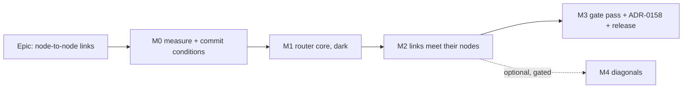

# Implementation Plan: Node-to-node link routing on the TSLD canvas

- **Feature spec:** [`./feature-spec.md`](./feature-spec.md)
- **Status:** Approved 2026-09-25 (product owner; CQ-1 answered "+10 %"). Built under this plan.
- **Owner:** feature-analyst draft; build owner to be named on approval

## Breakdown

### Epic

**Node-to-node links** — every link leaves and enters at its node, chosen from scored orthogonal
shapes; diagonals only if they pass their own conditions. Theme: TSLD legibility.

**Scope.** `apps/web` only. No API, no schema, no migration, CPM engine not imported. No new `VITE_`
flag (ADR-0088 D1): each milestone is a commit boundary, and that is the rollback.

**Order is a decision.** M0 commits the conditions before M1's first commit (ADR-0142 D4). M3 ships
the orthogonal work on its own. M4 is last and nothing depends on it.

---

### Milestone M0: Measure first, commit the conditions

**Outcome:** a committed instrument that counts today's defect, a baseline on four fixtures, and
`conditions.md` with every number filled in.
**Entry point:** `Ships dark: instruments and documents only; no product change.`
**Journey:** none (no user-facing change).

#### Feature: The attachment instrument

> **Description:** new metrics read from the painter's own strokes: unattached ends, false
> junctions, overlaps, text crossings, labels placed (spec §4.9).
> **Complexity:** M
> **Dependencies:** none
> **Risks:** the metric passes against the defect (a vacuous gate) → FC-T0 requires it to fire on
> today's code and to flag both brief cases, verified red before anything else is built.
> **Testing requirements:** unit tests for each metric on hand-built polylines; the red run recorded.

##### Task M0-T1 — Attachment probe and the brief's fixture (≈ one PR)

- **Description:** add `apps/web/scripts/attachment-probe.ts` (reusing `crossing-probe.ts`'s
  recorder, which already tells a stroke from a fill) and `measure-attachment.mjs`. Add a committed
  fixture of the brief's two cases: an FS across lanes where the successor starts at the
  predecessor's finish, and Frame → Roof with a bar "In the way" in the lane between. Remove the
  dangling `{@link routeResidue}` (`link-routing.ts:458`; the function does not exist).
- **Complexity:** M
- **Dependencies:** none
- **Risks:** the recorder cannot attribute a path to its edge → reuse the existing
  `visibleLinks === edges` control, throwing.
- **Testing:** unit cases for each metric, including a line with no bend (never unattached) and a
  shared stem (not an overlap). Run on the fixture and confirm both cases are flagged.
- **Development steps:**
  1. Define end kinds from the scene exactly as spec §4.1 does.
  2. Implement the five metrics against recorded paths and `RecordedText`.
  3. Build the fixture; run; record that both cases fire.

##### Task M0-T2 — Point the harnesses at the painter

- **Description:** `netpoint-evaluate.ts` rebuilds the routing pipeline by hand
  (`netpoint-evaluate.ts:11-16`), and so do other probes. Re-point each at `routeFrame` or
  `layoutLines`, so a harness cannot measure a copy of the router after M2.
- **Complexity:** S
- **Dependencies:** none
- **Risks:** changing an instrument after its verdict → run each re-pointed harness at the current
  tip and require its digest control to match the old output exactly, recorded in `m0-baseline.md`.
- **Testing:** each harness's existing digest control, before and after.
- **Development steps:**
  1. List every script importing `routeOrthogonal`, `chooseCorridorsByCrossing`, `bundleCorridors`
     or `packGutterChannels`.
  2. For each: re-point at `routeFrame`, or mark it as the frozen record of a closed epic that M2
     will delete (its verdict lives in that epic's docs).
  3. Record the list in `m0-baseline.md`.

#### Feature: Baseline and conditions

> **Description:** today's numbers on every metric, and the committed conditions.
> **Complexity:** S
> **Dependencies:** M0-T1, M0-T2
> **Risks:** a noisy machine makes a cost bar meaningless → report run-to-run spread beside every
> timing (ADR-0128's INDETERMINATE rule).
> **Testing requirements:** the measurement itself, reproducible by one command.

##### Task M0-T3 — Take the baseline

- **Description:** run the attachment probe, `measure-crossings.mjs` and `measure-occlusion.mjs` on
  Unit 300, the NetPoint reference plan, the small-plan fixture and the brief's fixture, at 1, 4 and
  12 px/day and pans 0/32/200/500. Time `routeFrame` in Chromium at `scale-2000` (Week), and one Tidy
  on Unit 300 in the worker.
- **Complexity:** S
- **Dependencies:** M0-T1, M0-T2
- **Risks:** none beyond noise (above).
- **Testing:** n/a (a measurement).
- **Development steps:**
  1. Run each harness twice; record both runs and the spread.
  2. Write `docs/specs/node-to-node-links/m0-baseline.md`.

##### Task M0-T4 — Commit `conditions.md`

- **Description:** write FC-T0–T9 and FC-D0–D8 (spec §4.9) with the baseline numbers substituted,
  and the CQ-1 answer. Commit it alone, **before** M1's first commit.
- **Complexity:** S
- **Dependencies:** M0-T3; CQ-1 answered or its default taken
- **Risks:** a bar tuned to the answer → the bars are the spec's, written before the baseline; only
  the reference numbers are filled in.
- **Testing:** n/a.
- **Development steps:**
  1. Copy the tables; fill the baseline column; commit.

---

### Milestone M1: The router core (dark)

**Outcome:** pure, tested modules that choose a node-to-node route. Not yet called by the painter.
**Entry point:** `Ships dark: routeFrame still calls routeOrthogonal; M2 wires the new router in.`
**Journey:** none yet; M2 is the first user-facing milestone.

#### Feature: Ports, candidates and score

> **Description:** spec §4.1–§4.4 as pure functions.
> **Complexity:** L
> **Dependencies:** M0-T4
> **Risks:** a second opinion about where a bar is → both lane indexes are built from `activityRect`
> through `laneIntervalIndex`, one with a node-reach widening option.
> **Testing requirements:** unit and property tests; a counting gate on candidates.

##### Task M1-T1 — Ports

- **Description:** `link-ports.ts`: from an anchor, its activity and its rect, return the end kind,
  allowed directions and reach (spec §4.1, including milestone centre ports, D-5). Stub lengths
  derived from `NODE_REACH_PX`, `LINK_ELBOW_RADIUS` and `ARROWHEAD_ROUTED_PX`, never literals.
- **Complexity:** S
- **Dependencies:** M0-T4
- **Risks:** an embed misread as a node → classify by the same test `route-frame.ts:147-154` uses
  for attachment dots (`midBar`), shared, not copied.
- **Testing:** every row of the spec's §4.1 table; a derivation test in the style of
  `geometry.constant-derivation.test.ts`.
- **Development steps:**
  1. Extract `midBar` so ports and dots share it.
  2. Write `portsOf` and the two stub constants.

##### Task M1-T2 — Candidates

- **Description:** `link-candidates.ts`: V, H, VH, HV, HVH (≤ 5), VHV (≤ 2), in the fixed order;
  drop any that break a port or the stub rule.
- **Complexity:** M
- **Dependencies:** M1-T1
- **Risks:** a link with no candidate → property test over random anchor pairs asserts at least one
  valid candidate always exists (VHV for different lanes, H or VHV for one lane).
- **Testing:** one case per shape and per end kind; the overlap-in-time case (no HVH); the
  short-waiting case (no HVH under 31 px); the property test; `MAX_ROUTE_CANDIDATES = 11` pinned.
- **Development steps:**
  1. Generate the shapes.
  2. Validate directions and stubs.
  3. Property test.

##### Task M1-T3 — Phase 1 score

- **Description:** `link-score.ts`: obstructions (bars, and nodes via the widened index), length,
  bends, candidate index; `routeNodeToNode(from, to, ends, obstacles)` returns the best.
- **Complexity:** M
- **Dependencies:** M1-T2
- **Risks:** a vertical crossing many lanes costs many searches → bounded by lanes crossed, as today;
  a counting assertion on obstruction tests per edge.
- **Testing:** both brief cases produce attached lines; a false-junction case prefers another shape;
  ties resolve by order.
- **Development steps:**
  1. Add a reach option to `laneIntervalIndex`.
  2. Implement the terms and the comparison.
  3. Cases.

##### Task M1-T4 — Phase 2 frame pass

- **Description:** `chooseRoutesByCrossing`: freeze a snapshot of phase-1 lines, then re-score each
  link's candidates on all six terms against it, moving only on strict improvement. Reuse the
  snapshot index at `link-routing.ts:1086-1163`, adding a collinear-overlap count that skips links
  sharing an end and gutter y-values.
- **Complexity:** M
- **Dependencies:** M1-T3
- **Risks:** order dependence → a property test shuffles the input 200 times and requires identical
  output (FC-T5).
- **Testing:** a crossing that phase 2 removes; a shared stem not counted; the shuffle property.
- **Development steps:**
  1. Generalise the snapshot from corridors to whole candidates.
  2. Add the overlap count.
  3. Property test.

---

### Milestone M2: Links meet their nodes

**Outcome:** on every plan, every link leaves and enters at its node.
**Entry point:** the TSLD diagram itself, on any plan with links (there is no control to press). The
guest share view and the export follow, because they use the same painter.
**Journey:** `apps/web/e2e-netpoint-grammar/links.spec.ts`, under the existing
`playwright.netpoint-grammar.config.ts` (no new config or CI step). It seeds the brief's two cases
through the API with the pen enforced, recalculates, reads canvas pixels, and asserts: link ink
leaves each node outside its rim on an allowed side; no link ink in the successor's pad above its bar
beyond the node (the mid-bar landing); the arrowhead touches the successor's rim. **Written first
and verified red against the shipped build** (ADR-0081).

#### Feature: Wire the router in

> **Description:** `routeFrame` uses the new router on its routed branch.
> **Complexity:** L
> **Dependencies:** M1
> **Risks:** the flag-off paths change by accident → they keep calling `routeOrthogonal` without
> obstacles, and `paint.routing-budget.test.ts`'s coordinate-by-coordinate parity stays unedited.
> **Testing requirements:** structural, unit, golden, journey, harness.

##### Task M2-T1 — `routeFrame` rewiring

- **Description:** on the refreshed, routed branch (`route-frame.ts:214-231`), call
  `routeNodeToNode`; after the loop, call phase 2 then `packGutterChannels`. Remove the calls to
  `chooseCorridorsByCrossing` and `bundleCorridors`. Adapt `packGutterChannels` to find gutter runs by
  geometry (a horizontal at a lane boundary), not by point count (`link-routing.ts:610-621`). Delete
  `routeOrthogonal`'s obstacle branch and `gutterRoute` with their tests; keep the no-obstacle path.
- **Complexity:** M
- **Dependencies:** M1-T4
- **Risks:** the revision overlay's removed links → they route through `lineOf`, so they get phase 1;
  asserted by a case.
- **Testing:** `route-frame.structural.test.ts` updated (one router per frame, no deleted primitive
  imported); gutter packing finds 4-point VHV runs; after packing every VHV vertical is still ≥ 17 px.
- **Development steps:**
  1. Rewire.
  2. Adapt packing.
  3. Delete the replaced code and its tests; keep flag-off parity suites.

##### Task M2-T2 — Downstream marks

- **Description:** prove each mark on the new shapes: the arrowhead trims to the rim from any
  direction; chevrons; `gapLabelAt` on VH, HV and HVH; `lagPlateAt`; attachment dots, lag runs and
  lag handles unchanged; `hit-test.ts` unchanged; wrap clearance unchanged.
- **Complexity:** S
- **Dependencies:** M2-T1
- **Risks:** a head from above collides with the name row → measured by FC-T6; a case asserts the
  head lies inside the lane.
- **Testing:** one case per mark and shape; `lagAnchorPoints` output byte-identical before and after
  on the golden scene.
- **Development steps:**
  1. Cases in `paint.link-marks.test.ts` and `nodes.test.ts`.

##### Task M2-T3 — Golden log and budgets

- **Description:** re-baseline `render/__snapshots__/paint.golden.test.ts.snap` **by hand, against a
  written prediction** of which link lines change and how (never `-u`, ADR-0034). Extend
  `paint.routing-budget.test.ts` with the candidate and obstruction bounds (FC-T8a);
  `paint.link-marks-budget.test.ts` re-run.
- **Complexity:** M
- **Dependencies:** M2-T1
- **Risks:** the golden scene holds no case that reaches a new shape (ADR-0150 found one with no VHV
  at all) → the prediction lists which shapes the scene reaches; missing shapes get their own cases.
- **Testing:** the golden log itself, verified red once with a deliberately wrong prediction.
- **Development steps:**
  1. Write the prediction.
  2. Compare line by line; update the snapshot.

##### Task M2-T4 — Tidy and Re-layout

- **Description:** the layout objective now scores the new routes (`layout-objective.ts:84-90`).
  Re-derive any test that pins optimiser output, against a written prediction. Measure Tidy on
  Unit 300 in the worker (FC-T8d).
- **Complexity:** S
- **Dependencies:** M2-T1
- **Risks:** Tidy grows past the 300-activity offer's comfort → FC-T8d; if it fails, the fallback is
  to lower the offer threshold, recorded, not to fork the router for Tidy (that would be two
  opinions about the picture, ADR-0149).
- **Testing:** `optimise-layout.test.ts`, `layout-objective.test.ts`, FC-N3's no-worse-than-seed
  property.
- **Development steps:**
  1. Run; predict; update.

#### Feature: Prove it and judge it

> **Description:** the journey, the other suites, and the verdict.
> **Complexity:** M
> **Dependencies:** M2-T1 to T4
> **Risks:** a condition fails → see the remedies in the spec (§4.9: FC-T3 stop and report, FC-T6
> add a text term).
> **Testing requirements:** the whole e2e sweep, the harnesses.

##### Task M2-T5 — Journey and sweep

- **Description:** write `links.spec.ts` (above). Re-run `e2e-arrange` (its gutter-channel specs
  assert a gutter run), `e2e-export`, and the full sweep (`scripts/e2e-sweep.sh`).
- **Complexity:** M
- **Dependencies:** M2-T1
- **Risks:** a pixel assertion passes for the wrong reason → every assertion verified red on the
  shipped build first, and a control that finds link ink at all.
- **Testing:** the journey; the sweep.
- **Development steps:**
  1. Write the journey against the shipped build; see it fail.
  2. Land it with M2-T1.
  3. Run the sweep.

##### Task M2-T6 — Verdict, harness clean-up, changeset

- **Description:** run M0's measurements on the new code and judge FC-T0–T9 in `m2-verdict.md`.
  Delete or re-point the frozen harnesses M0-T2 listed. Add a changeset (`feat(web)`).
- **Complexity:** S
- **Dependencies:** M2-T5
- **Risks:** a harness still importing a deleted symbol → `pnpm prepush` typecheck, plus a grep over
  `apps/web/scripts/`, recorded.
- **Testing:** the measurements.
- **Development steps:**
  1. Measure; write the verdict with numbers and spreads.
  2. Clean up; changeset.

---

### Milestone M3: Gate pass, ADR-0158, release

**Outcome:** the orthogonal work reviewed, recorded and released.
**Entry point:** as M2.
**Journey:** as M2.

#### Feature: Reviews and records

> **Description:** specialist reviews over M0–M2 together; ADR-0158; docs.
> **Complexity:** M
> **Dependencies:** M2
> **Risks:** a finding that spans milestones (ADR-0152's M6 found one) → reviewers read the combined
> diff, not per milestone.
> **Testing requirements:** every blocking fix carries a test verified red first.

##### Task M3-T1 — Reviews

- **Description:** run **component-reviewer**, **performance-reviewer**, **ux-reviewer** (on rendered
  pictures of Unit 300 and the reference plan) and **accessibility-reviewer** (to confirm nothing a
  reader relies on moved: the text tier, the lane contents, contrast unchanged). **test-engineer** for
  the journey. `database-architect` is not engaged: there is no schema change.
- **Complexity:** M
- **Dependencies:** M2-T6
- **Risks:** none beyond findings.
- **Testing:** fixes with red-first regression tests.
- **Development steps:**
  1. Run; fold blocking findings; file the rest in `docs/TECH_DEBT.md`.

##### Task M3-T2 — ADR-0158 and docs

- **Description:** file ADR-0158 (spec §4.10). Add its CLAUDE.md §16 entry and its
  `docs/adr/README.md` row (`check:adr-coverage` refuses either missing). Update `docs/TECH_DEBT.md`
  #391 item 11 with the FC-T6 number. Check `docs/DESIGN_SYSTEM.md` and `docs/TEST_PLAYBOOK.md` for
  corridor or link-shape claims. Set the spec and plan status to Accepted.
- **Complexity:** S
- **Dependencies:** M3-T1
- **Risks:** a doc claim left describing the old elbow → grep for `corridorGap`, "elbow", "bundl".
- **Testing:** `pnpm prepush` (all `check:*` gates).
- **Development steps:**
  1. Write; run the gate; release.

---

### Milestone M4: Diagonals (optional, gated)

**Outcome:** either diagonals ship where they help, or they are recorded as not valid.
**Entry point:** the diagram itself, if they pass. `Ships dark` until the verdict.
**Journey:** if they pass, a case in `links.spec.ts` asserting a diagonal on the reference plan. If
they fail, none.

**Nothing before M4 depends on it.** If M4 never starts, the epic is complete at M3.

#### Feature: Diagonal evaluation

> **Description:** spec §4.8, judged by FC-D0–D8.
> **Complexity:** L
> **Dependencies:** M3
> **Risks:** diagonals are uncounted by today's counters and would look free → T1 generalises every
> counter first; they are measured only after that.
> **Testing requirements:** counters byte-identical on orthogonal input; the FC-D measurements.

##### Task M4-T0 — Structural pre-check

- **Description:** count eligible links (FC-D0) on the M2 routes. If zero on the reference plan at
  4 px/day, stop: diagonals are not valid, go to M4-T4b.
- **Complexity:** S
- **Dependencies:** M3
- **Risks:** none.
- **Testing:** the count, recorded.
- **Development steps:**
  1. Count; record in `m4-verdict.md`.

##### Task M4-T1 — Generalise the counters

- **Description:** general segment intersection and sloped-segment occlusion in
  `layout-objective.ts` (`:157-178`, `:193-218`), the phase-2 snapshot, `crossing-probe.ts`
  (`:327-389`) and `measure-occlusion.mjs` (`:140-145`, whose throwing control becomes a count).
- **Complexity:** M
- **Dependencies:** M4-T0
- **Risks:** a counter change moves Tidy for plans with no diagonal → required byte-identical to M2's
  numbers on orthogonal input, as a test.
- **Testing:** the identity test; hand-built diagonal crossings.
- **Development steps:**
  1. Generalise; assert identity.

##### Task M4-T2 — Diagonal candidates, behind a constant

- **Description:** D, VDV, HDH, HDV, VDH under the construction rule (inside the waiting interval,
  forward, ≥ 24 px in x), behind `ALLOW_DIAGONAL_LINKS = false`. Extend `gapLabelAt` and
  `lagPlateAt` to diagonal segments.
- **Complexity:** M
- **Dependencies:** M4-T1
- **Risks:** candidate count grows → the counting gate's bound moves by a stated number.
- **Testing:** one case per shape; the rule's three limbs each refuse a case.
- **Development steps:**
  1. Generate; validate; extend the two label functions.

##### Task M4-T3 — Measure and judge

- **Description:** run M0's measurements with the constant on; judge FC-D0–D8 against M2 in
  `m4-verdict.md`, with pictures.
- **Complexity:** S
- **Dependencies:** M4-T2
- **Risks:** a reading tuned to pass → the bars were committed at M0.
- **Testing:** the measurements.
- **Development steps:**
  1. Measure; write the verdict.

##### Task M4-T4a — If every condition passes

- **Description:** remove the constant (diagonals on), add the journey case, re-baseline the golden
  log by hand, file ADR-0159 superseding ADR-0065's "Diagonal segments" clause, run component, ux,
  performance and accessibility reviews, changeset.
- **Complexity:** M
- **Dependencies:** M4-T3
- **Risks:** as M2.
- **Testing:** as M2.
- **Development steps:**
  1. Flip; journey; golden; ADR; reviews; release.

##### Task M4-T4b — If any condition fails

- **Description:** delete the candidate code and the constant; revert M4-T1's counter changes (the
  orthogonal counters and the throwing control are the stronger instrument when a diagonal cannot
  exist); add a section to ADR-0158 recording diagonals as **not valid** with the failing numbers.
  The product owner is not asked again.
- **Complexity:** S
- **Dependencies:** M4-T3 (or M4-T0)
- **Risks:** leaving half the generalisation behind → the revert is checked by the M2 numbers
  reproducing exactly.
- **Testing:** M2 measurements reproduce.
- **Development steps:**
  1. Revert; record; commit.

## Sequencing & slices

1. **M0** (docs and scripts only). `conditions.md` lands in its own commit before M1.
2. **M1** (dark modules). `main` stays releasable: nothing calls them.
3. **M2** (the visible change). One slice: the rewiring, deletion, golden log and journey land
   together, because a half-wired router would ship detached and attached links side by side.
4. **M3** (reviews, ADR-0158, release). The epic is complete here.
5. **M4** (optional). Its own release if it passes; a record if it fails.

No `VITE_` flag. The existing `VITE_CANVAS_LINK_ROUTING` stays and its flag-off path is untouched.

## Definition of Done (per task)

Each task's PR must satisfy the Feature Completion Criteria in
[`docs/PROCESS.md`](../../PROCESS.md) (code, tests, docs, security, performance, accessibility,
Docker build, CI, changelog, version impact). `pnpm prepush` is run, and
`scripts/e2e-local.sh web:netpoint-grammar` for any task touching the journey or the painter.

## Risks & assumptions (rollup)

| Risk / assumption                                                                             | Likelihood            | Impact | Mitigation                                                                                                             |
| --------------------------------------------------------------------------------------------- | --------------------- | ------ | ---------------------------------------------------------------------------------------------------------------------- |
| Attaching ends to nodes raises crossings (fewer free corridor positions)                      | high                  | med    | CQ-1 sets the ceiling; phase 2 keeps ADR-0149's gain where shapes allow; the number is reported, not hidden.           |
| Vertical arrivals cross the successor's name (a name wider than its bar)                      | med                   | med    | FC-T6; VH ordered before HV (D-3); remedy is a text term in the score.                                                 |
| Retiring bundling produces combs of near-parallel verticals                                   | low                   | low    | Shared stems replace most (D-4); FC-T3 and FC-T4 measure it; pictures reviewed at M3.                                  |
| The new metric is vacuous                                                                     | med                   | high   | FC-T0: verified red on today's code and on both brief cases before M1.                                                 |
| Paint or Tidy cost grows                                                                      | med                   | med    | Bounded candidates; counting gates; FC-T8 in the browser and the worker; (c) is owed until the product owner takes it. |
| The golden scene does not reach the new shapes                                                | med                   | med    | M2-T3's written prediction names which shapes it reaches; the rest get their own cases.                                |
| A harness keeps measuring a copy of the old router                                            | med                   | med    | M0-T2 re-points them before anything changes.                                                                          |
| Diagonals were rejected once for a stated reason (x is time)                                  | —                     | —      | M4's construction rule answers it; its conditions can drop diagonals without asking.                                   |
| Diagonals look free to orthogonal-only counters                                               | high (if unaddressed) | high   | M4-T1 generalises every counter before anything is measured.                                                           |
| Prior epics measured corridor choice against crossings, and this changes what corridors exist | certain               | med    | ADR-0158 records it; the crossing result is reported against today's shipped figure, not against a new baseline.       |
| `paint.ts` is being edited in parallel                                                        | high                  | low    | Citations by function name; M2 rebases before re-baselining the golden log.                                            |
