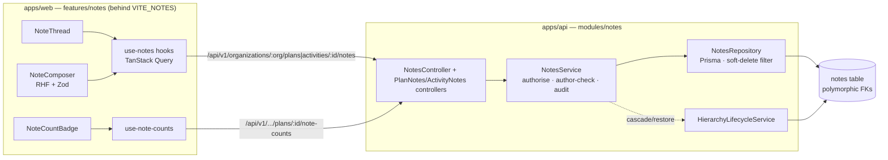
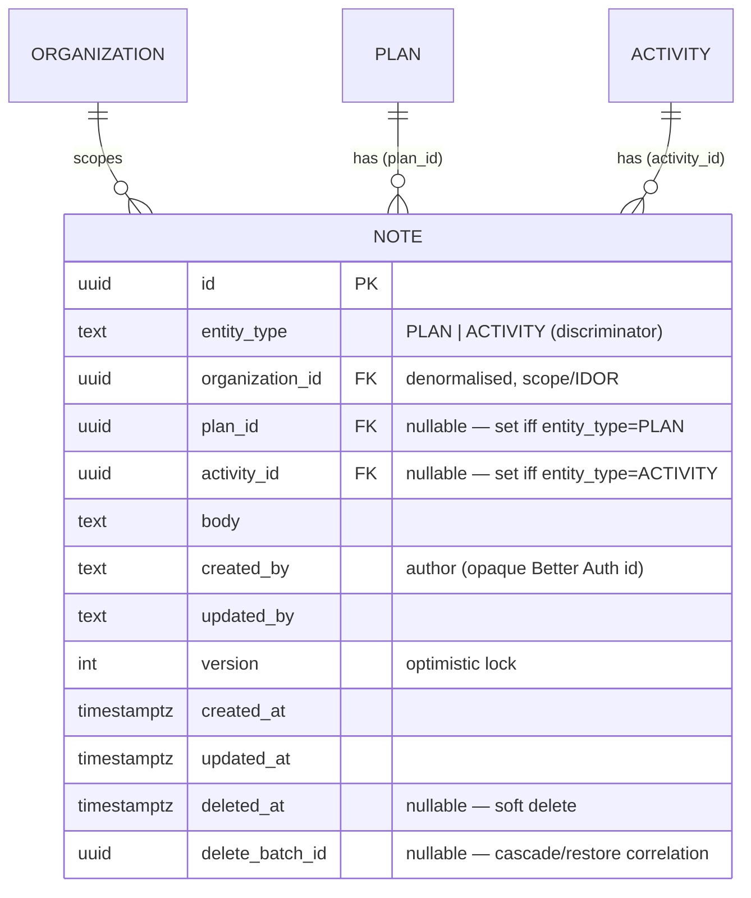
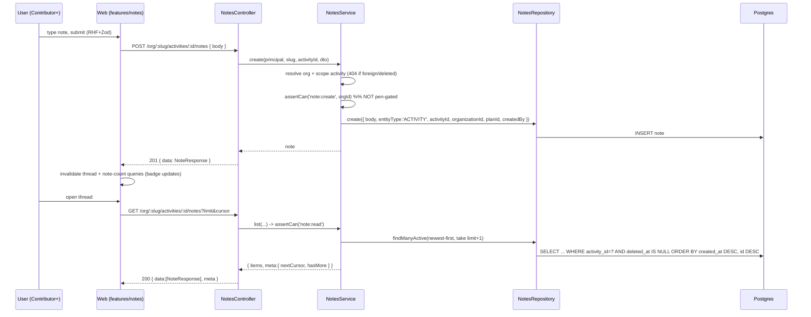
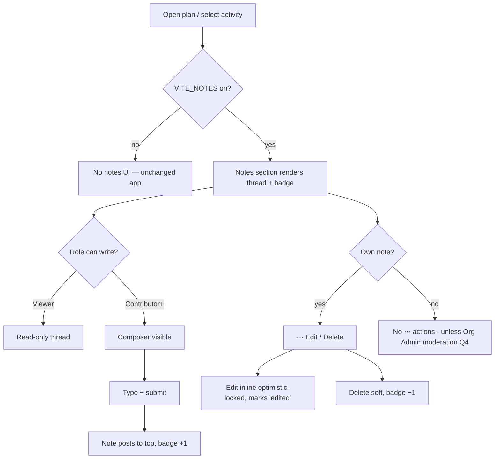

# Feature Spec: Notes (threaded annotations on plans & activities)

- **Status:** Draft (awaiting approval)
- **Author(s):** feature-analyst (Claude Code)
- **Date:** 2026-07-19
- **Tracking issue / epic:** _TBD_
- **Roadmap link:** collaboration / plan-annotation theme (`docs/ROADMAP.md`)
- **Related ADR(s):** proposes **ADR-0046 — Polymorphic entity notes** (see §4); builds on
  ADR-0012 (RBAC + scope), ADR-0016 (tenancy/roles), ADR-0014/0015 (reference template),
  ADR-0028 (edit-lock "pen" — deliberately **not** applied here), and the
  `HierarchyLifecycleService` cascade/restore machinery (`docs/DATABASE.md`).

> **Scope note (locked with the product owner — not re-litigated here):** notes are
> **threaded** (many authored, timestamped entries per entity — a "weekly progress
> journey"), **not** a single overwritable textarea; authors **edit/delete their own**;
> v1 covers **plans + activities** only but the model must drop client/project in later
> with no rework; notes are **non-structural** and therefore **not pen-gated**;
> Contributor + Planner + Org Admin write, Viewer reads; org-scoped, audited,
> soft-deleted, and cascaded/restored with the parent entity via the existing
> `HierarchyLifecycleService`. The new web surface ships behind a **`VITE_NOTES`
> default-off** flag.

---

## 1. Business understanding

### Problem

Planners and site teams capture the _story_ of a schedule as it evolves — why an activity
slipped, what a subcontractor committed to on a call, the outcome of a weekly progress
review — but SchedulePoint has nowhere to record it. That context lives today in email,
spreadsheets, and WhatsApp, detached from the plan and lost at handover. The schedule
answers _what_ and _when_; it cannot answer _why_. As collaborative, browser-native team
use grows (multi-tenant, four roles), the absence of an in-app, attributed, time-ordered
commentary is the single most-requested annotation gap.

A **single "notes" field** would not solve this: it would be overwritten on every edit,
lose authorship, and destroy the weekly-progress narrative. The requirement is an
**append-accumulating thread** per entity.

### Users

Mapped to the organisation role set (ADR-0016):

- **Contributor** — reports progress on site; needs to annotate an activity ("poured slab,
  2 days late, weather") or a plan ("week 12 review: steel package recovered") **without**
  seizing the plan edit-lock, exactly as they report progress today.
- **Planner** — owns the plan; reads the running commentary to understand variance, adds
  planning notes, and edits/removes their own.
- **Org Admin** — same as Planner plus (pending decision, §Open questions) moderation of
  others' notes.
- **Viewer** — read-only stakeholder; reads the thread to stay informed, writes nothing.
- **External Guest** — _out of scope for v1_ (per-plan share link; see Open questions).

### Primary use cases

1. Add a note to an **activity** (from its Logic/detail panel).
2. Add a note to a **plan** (from the plan detail / canvas workspace Notes section).
3. Read an entity's **thread** — every note, newest first, with author + timestamp.
4. **Edit** one's own note (fix a typo / add detail); an edited note is marked "edited".
5. **Delete** one's own note (soft delete).
6. See at a glance which activities carry notes via a **count badge** on the
   ActivitiesTable row.

### User journeys

**Happy path (activity note):** Contributor opens a plan → selects an activity → the
Logic/detail panel shows a **Notes** section with the existing thread and an "Add note"
box → types → submits → the note appears at the top of the thread attributed to them with
"just now"; the ActivitiesTable row's note badge increments. No pen is required and no
recalculation is triggered.

**Plan note:** Planner opens the plan workspace → the **Notes** section (in the plan
detail panel / workspace rail) lists plan-level notes → adds "Week 12: steel recovered,
groundworks still 3 days behind" → it posts and is visible to every member.

**Edit / delete own:** author opens the ⋯ menu on their own note → **Edit** (inline form,
pre-filled) or **Delete** (confirm) → thread updates optimistically; a stale edit (someone
else — i.e. the same author on another device — changed it) returns 409 and the client
refetches.

**Read-only:** a Viewer sees the full thread and per-row badges but no Add/Edit/Delete
affordances (the write controls are RBAC-hidden _and_ server-enforced).

See the user-flow diagram in §4.

### Expected outcomes

- The _why_ behind a schedule lives **with** the schedule, attributed and time-ordered.
- Contributors annotate freely without the friction of the edit-lock.
- Handover and audit improve: the weekly-progress narrative is reconstructable per entity.

### Success criteria

- A member adds a note in **< 15s** from opening an entity (no navigation away, no pen).
- Thread list p95 latency **< 200ms** for a plan/activity of typical size (cursor-paginated).
- Adding/reading a note **never** triggers a CPM recalculation and **never** requires the
  plan pen (verified: the write endpoints carry no edit-lock write-gate).
- Zero cross-tenant leakage (every route org-scoped; anti-IDOR load-then-scope, like the
  reference service).
- Deleting/restoring a parent plan or activity correctly hides/reveals its notes (cascade
  covered by tests reusing the `HierarchyLifecycleService` batch mechanism).

### Open questions

See the consolidated **Critical questions** at the end of this spec. Each has a stated
default so the design is complete and buildable as-is.

---

## 2. Functional requirements

### User stories & acceptance criteria

> **US-1** — As a **Contributor/Planner/Org Admin**, I want to **add a note to an
> activity**, so that the reason behind its progress is recorded in place.
>
> **Acceptance criteria**
>
> - **Given** I have `note:create` in the activity's org **when** I POST a note to the
>   activity **then** it is created with my user id as author, `createdAt`/`updatedAt` now,
>   and returned in the `{ data }` envelope (201).
> - **Given** I do **not** hold the plan pen **when** I add the note **then** it still
>   succeeds (notes are not pen-gated) and **no** recalculation occurs.
> - **Given** an empty or over-length body **when** I submit **then** I get 422 with a
>   field error and nothing is created.

> **US-2** — As any **member**, I want to **read an entity's note thread**, so that I can
> follow the weekly-progress story.
>
> **Acceptance criteria**
>
> - **Given** I have `note:read` **when** I GET the plan's/activity's notes **then** I
>   receive a cursor-paginated `{ data, meta }` list, **newest first**, each note carrying
>   `id, body, authorId, authorName?, createdAt, updatedAt, edited, version`.
> - **Given** more notes exist than the page limit **when** I read **then** `meta.nextCursor`
>   is set and following it returns the next page with no gaps/dupes.
> - **Given** the entity has no notes **when** I read **then** I get an empty list + an
>   empty-state in the UI.

> **US-3** — As a **member**, I want to **add a note to a plan**, so that plan-level context
> (weekly reviews, decisions) is captured. _(ACs mirror US-1 against the plan route.)_

> **US-4** — As the **author**, I want to **edit my own note**, so that I can correct or
> extend it.
>
> **Acceptance criteria**
>
> - **Given** I am the author **and** send the current `version` **when** I PATCH the body
>   **then** it updates, `updatedAt` moves, `edited` becomes true, `version` increments (200).
> - **Given** I am **not** the author **when** I PATCH **then** I get **403** (author-scoped
>   even though my role grants `note:update`).
> - **Given** a stale `version` **when** I PATCH **then** I get **409** and refetch.

> **US-5** — As the **author** (or **Org Admin**, pending §Open questions), I want to
> **delete a note**, so that a wrong entry can be removed.
>
> **Acceptance criteria**
>
> - **Given** I am the author **when** I DELETE my note **then** it is soft-deleted (204)
>   and disappears from the thread and the count badge.
> - **Given** I am **not** the author **and** not a moderator **when** I DELETE **then** 403.

> **US-6** — As a **planner scanning the table**, I want a **note-count badge** on each
> ActivitiesTable row, so that I can see which activities carry commentary.
>
> **Acceptance criteria**
>
> - **Given** activities with notes **when** the table renders (flag on) **then** each row
>   shows the count of that activity's **active** notes; zero shows no badge (or a muted 0).
> - **Given** a note is added/deleted **when** the mutation settles **then** the badge
>   updates (query invalidation).

> **US-7** — As a **Viewer**, I want the thread to be **read-only**, so that I cannot alter
> commentary I do not own.
>
> **Acceptance criteria**
>
> - **Given** my role is Viewer **when** I open an entity **then** I see the thread and
>   badges but no Add/Edit/Delete controls, **and** any forged write returns 403.

### Workflows

**Create:** resolve org from `:orgSlug` → resolve + scope the parent (plan or activity)
active & in-org (404 otherwise) → `assertCan('note:create', orgId)` → persist with author +
audit + denormalised `organization_id`/`plan_id` (copied from the parent, never client
input) → return the note.

**List:** resolve org → scope parent → `assertCan('note:read', orgId)` → cursor query
(over-fetch by one) ordered newest-first → `{ data, meta }`.

**Edit:** load note active-or-404 → scope to org → `assertCan('note:update', orgId)` →
**author check** (`note.createdBy === principal.userId` else 403) → optimistic-locked update.

**Delete:** load → scope → `assertCan('note:delete', orgId)` → author check (or moderator) →
soft delete (own fresh `deleteBatchId`, like a directly-deleted dependency leaf).

### Edge cases

- **Empty / whitespace-only body** → 422 (trim then validate min length 1).
- **Max length** → 422 above the cap (default 5000 chars — see Validation).
- **Concurrent edit of the same note** (author on two devices) → optimistic `version` → 409.
- **Parent soft-deleted while thread open** → parent load returns 404; the note write 404s.
- **Cascade:** deleting the parent plan/activity soft-deletes its notes in the **same
  batch**; restoring the parent restores them (no endpoint guard needed — a note has exactly
  one parent, unlike a dependency's two endpoints).
- **A note whose author later leaves the org** → author id is an opaque TEXT stamp (like
  `created_by` everywhere); the note remains, attributed by id; display name resolves
  best-effort (falls back to "Former member").
- **Large thread** → cursor pagination + "load older" bounds the payload.
- **Restore of an individually-deleted note** → not offered in v1 (mirrors dependencies:
  notes return only with their parent's batch). Stated as a default.

### Permissions (RBAC + resource scope, ADR-0012)

New permission codes (added to `apps/api/src/common/auth/org-permissions.ts`):

| Code            | Granted to (role)                   | Notes                                                                                                    |
| --------------- | ----------------------------------- | -------------------------------------------------------------------------------------------------------- |
| `note:read`     | Viewer → Org Admin (all members)    | joins `HIERARCHY_READ`                                                                                   |
| `note:create`   | Contributor → Org Admin             | the **progress precedent** — a new `NOTE_WRITE` group, granted Contributor-up, **not** `HIERARCHY_WRITE` |
| `note:update`   | Contributor → Org Admin             | role grants the capability; **service enforces author-ownership**                                        |
| `note:delete`   | Contributor → Org Admin             | as above; author-ownership enforced                                                                      |
| `note:moderate` | Org Admin only _(pending decision)_ | delete/redact **others'** notes; omitted from v1 unless the owner approves                               |

**Not pen-gated.** None of the note write endpoints assert the plan edit-lock
(`assertHoldsPen`) or carry `@ApiLockedResponse` — identical to the
`PATCH …/activities/:id/progress` precedent. Row-ownership ("edit/delete own") is a
**service-layer** check on top of the role permission, because the RBAC model is
role→permission, not row-level.

### Validation rules (shared client ↔ server)

| Field            | Rule                                                           | Client (Zod)           | Server (class-validator + DB)                         |
| ---------------- | -------------------------------------------------------------- | ---------------------- | ----------------------------------------------------- |
| `body`           | required, trimmed, 1–5000 chars, plain text (default — see Q1) | Zod `min(1).max(5000)` | `@IsString @MinLength(1) @MaxLength(5000)`; DB `text` |
| `version` (edit) | integer ≥ 0                                                    | number                 | `@IsInt @Min(0)`                                      |
| parent ids       | UUID (from path)                                               | —                      | `ParseUuidPipe`                                       |

Body is stored/returned verbatim; the client renders with **preserved line breaks and no
HTML execution** (React text nodes are escaped by default — no `dangerouslySetInnerHTML`).
If markdown is approved (Q1), rendering uses a sanitising renderer and links open safely.

### Error scenarios

| Scenario                                         | Detection                     | User-facing result              | Status |
| ------------------------------------------------ | ----------------------------- | ------------------------------- | ------ |
| Not a member / wrong org                         | org resolve + scope check     | "not found" (indistinguishable) | 404    |
| Lacks `note:create`/`read` (e.g. Viewer writing) | `assertCan`                   | friendly forbidden              | 403    |
| Editing/deleting someone else's note             | author check in service       | forbidden                       | 403    |
| Empty / over-length body                         | DTO validation                | inline field error              | 422    |
| Stale note version on edit                       | optimistic `version` (0 rows) | "changed elsewhere — refresh"   | 409    |
| Parent plan/activity missing/soft-deleted        | parent load                   | "not found"                     | 404    |
| Malformed UUID in path                           | `ParseUuidPipe`               | bad request                     | 400    |

---

## 3. Technical analysis

| Area           | Impact | Notes                                                                                                                                                                                                                                                                                                                                        |
| -------------- | ------ | -------------------------------------------------------------------------------------------------------------------------------------------------------------------------------------------------------------------------------------------------------------------------------------------------------------------------------------------- |
| Frontend       | med    | New `features/notes/` (API hooks, `NoteThread`, `NoteComposer`, `NoteItem`, count badge). Extends the activity Logic/detail panel and the plan workspace. All behind `VITE_NOTES` (default off).                                                                                                                                             |
| Backend        | med    | New `notes` module copied from the reference template (controller→service→repository, DTOs, permissions). Plus a small note-counts read for the badge.                                                                                                                                                                                       |
| Database       | med    | One new `notes` table (polymorphic; see §4) + partial/scoped indexes + a CHECK (exactly-one-parent). `HierarchyLifecycleService` gains a `'note'`-aware sweep in the plan-cascade and activity-cascade paths, and a batch restore for notes. **Design/migration owned by the database-architect agent — no migration written in this spec.** |
| API            | med    | New nested routes under plan & activity; flat item routes by note id; a counts endpoint. Standard `{ data, meta }` / `{ error }` envelopes; OpenAPI via `@nestjs/swagger`.                                                                                                                                                                   |
| Security       | med    | Deny-by-default RBAC + org scope; anti-IDOR load-then-scope; author-ownership on edit/delete; input validation; audit (`created_by`/`updated_by`). No new secrets.                                                                                                                                                                           |
| Performance    | low    | Cursor-paginated list; index `(entity FK, created_at desc, id)`; batch counts endpoint avoids N+1 for the table badge. No engine impact.                                                                                                                                                                                                     |
| Infrastructure | none   | No new services, env, or containers (a build-time Vite flag only).                                                                                                                                                                                                                                                                           |
| Observability  | low    | Structured logs on create/update/delete with `noteId`/parent/user (reference-service pattern).                                                                                                                                                                                                                                               |
| Testing        | med    | Unit (service: scope/author/version/cascade), API e2e (Supertest: RBAC matrix, pagination, cascade, not-pen-gated), web component + a11y (thread, composer, badge, keyboard/focus).                                                                                                                                                          |

### Dependencies

- **Prerequisite:** none blocking — hierarchy (plan/activity), RBAC, and lifecycle machinery
  already exist. The reference template is the build source.
- **Touches:** the activities module only lightly (the badge is served by a **separate**
  notes counts endpoint, so the activities list/response DTO need not change — keeps notes
  fully additive and flag-isolated).
- **ADR:** the data-model choice (polymorphic single table) is architecturally significant →
  **ADR-0046** to be drafted with the database-architect before the migration.

---

## 4. Solution design

### Architecture overview

Notes are a **new leaf module** that sits beside activities/dependencies in the modular
monolith, reusing the reference template's layering and the shared lifecycle service. It is
a **sibling annotation table**, not a hierarchy level: it hangs off a parent (plan or
activity) via a nullable typed FK.

### Data model

**Recommendation — polymorphic single `notes` table** with a `entity_type` discriminator +
**nullable typed FKs** (`plan_id`, `activity_id`; `client_id`/`project_id` added later) and
a DB **CHECK** that **exactly one** parent FK is set and matches `entity_type`. Rationale:

- **One module, one table, one thread component** serve every entity type; adding
  client/project notes later is a nullable-column + one-line-per-cascade change (the locked
  "no rework" requirement) — no new module, no schema fork.
- **Real referential integrity** is retained (each typed FK is a real `RESTRICT` FK to its
  table), unlike a pure `entity_id`-with-no-FK polymorphic shape.
- **Clean cascade integration.** The plan-cascade sweep matches
  `plan_id IN planIds OR activity.planId IN planIds`; the activity-cascade sweep matches
  `activity_id IN activityIds`; both stamp the shared `delete_batch_id`. Restore is a plain
  `updateMany where deleteBatchId` — **no endpoint guard** (a note has exactly one parent).
- Denormalised `organization_id` (and `plan_id` even on activity notes, for the plan sweep)
  is copied from the parent by the service inside the create transaction, **never** from
  client input — the `Activity`/`ActivityDependency` invariant.

**Alternative — per-entity tables (`plan_notes`, `activity_notes`, …).** Simpler FKs, but
duplicates the module/table/component per entity type, multiplies the cascade wiring, and
directly violates the "drop client/project in later with no rework" requirement. **Rejected.**

Because this introduces a **new cross-cutting table shape (polymorphic + CHECK) and new
cascade integration**, it is architecturally significant → **draft ADR-0046 (Polymorphic
entity notes)** capturing the two options, the CHECK invariant, and the lifecycle wiring.
The **database-architect** agent owns the final schema, indexes, CHECK, and migration.

**Indexes (proposed, for the database-architect to finalise):**
`idx_notes_plan_created` `(plan_id, created_at DESC, id)` partial `WHERE deleted_at IS NULL`;
`idx_notes_activity_created` `(activity_id, created_at DESC, id)` partial `WHERE deleted_at IS NULL`;
`notes_organization_id_idx` for IDOR loads; `idx_notes_delete_batch_id` partial for restore;
counts served by the two composite indexes grouped by parent id.

### Data flow (create + list)

### User flow

### Database changes

- **New `notes` table** (polymorphic, above) following every house standard: UUID v7 PK,
  `snake_case` via `@map`, `timestamptz` UTC, `text` audit ids (`created_by`/`updated_by`),
  optimistic `version`, soft delete + `delete_batch_id`, denormalised `organization_id` (+
  `plan_id`).
- **CHECK** `ck_notes_exactly_one_parent` — exactly one of the typed FKs is non-null and
  consistent with `entity_type` (raw SQL in the migration; Prisma can't express CHECK).
- **`HierarchyLifecycleService`** — extend the plan/project/client cascade to sweep notes
  under the affected plans (both plan-notes by `plan_id` and activity-notes by the activity's
  `plan_id`), extend the activity cascade to sweep that activity's notes by `activity_id`,
  and extend `restoreBatch` to reactivate notes by `deleteBatchId` (no endpoint guard). Add
  a `notes` count to `CascadeCounts`.
- Migration is **expand-only/additive** (a new table + non-breaking service change), so M1
  ships dark with zero behaviour change. **Designed and written by the database-architect.**

### API changes (all under `/api/v1`, cookie-auth, org-scoped by `:orgSlug`)

| Method & path                                                               | Permission                                  | Body / query        | Success                                  | Errors          |
| --------------------------------------------------------------------------- | ------------------------------------------- | ------------------- | ---------------------------------------- | --------------- |
| `GET  /organizations/:orgSlug/plans/:planId/notes`                          | `note:read`                                 | `?limit&cursor`     | 200 `{ data:[Note], meta }`              | 400/403/404     |
| `POST /organizations/:orgSlug/plans/:planId/notes`                          | `note:create`                               | `{ body }`          | 201 `{ data:Note }`                      | 403/404/422     |
| `GET  /organizations/:orgSlug/activities/:activityId/notes`                 | `note:read`                                 | `?limit&cursor`     | 200 `{ data:[Note], meta }`              | 400/403/404     |
| `POST /organizations/:orgSlug/activities/:activityId/notes`                 | `note:create`                               | `{ body }`          | 201 `{ data:Note }`                      | 403/404/422     |
| `PATCH  /organizations/:orgSlug/notes/:noteId`                              | `note:update` + author                      | `{ body, version }` | 200 `{ data:Note }`                      | 403/404/409/422 |
| `DELETE /organizations/:orgSlug/notes/:noteId`                              | `note:delete` + author (or `note:moderate`) | —                   | 204                                      | 403/404         |
| `GET /organizations/:orgSlug/plans/:planId/note-counts?entityType=activity` | `note:read`                                 | —                   | 200 `{ data: { [activityId]: number } }` | 403/404         |

- **Pagination:** cursor over `id` with `created_at DESC, id DESC` ordering (reference-service
  pattern: over-fetch by one, `meta.nextCursor`/`hasMore`). Default `limit` per
  `PaginationQueryDto`.
- **No pen / lock semantics** on the write routes (no `@ApiLockedResponse`) — the deliberate
  contrast with activity definition/positions writes.
- **`NoteResponse` DTO** exposes `id, entityType, planId?, activityId?, body, authorId,
authorName?, edited, version, createdAt, updatedAt`; internal columns (`deletedAt`,
  `deleteBatchId`, `updatedBy`, `organizationId` optional) are not leaked (reference DTO rule).
  `edited` is derived (`updatedAt > createdAt`). `authorName` is resolved best-effort from
  membership; falls back gracefully.
- **Counts endpoint** returns a small map so the ActivitiesTable badge avoids N+1 and the
  activities response DTO is untouched (notes stay additive/flag-isolated).

### Component changes (web — `apps/web/src/features/notes/`, behind `VITE_NOTES`)

- `api/use-notes.ts` — TanStack Query hooks: `useNotes(entityType, id)` (infinite/cursor
  list), `useCreateNote`, `useUpdateNote`, `useDeleteNote` (optimistic + invalidation of the
  thread and the note-counts query).
- `api/use-note-counts.ts` — batch counts for a plan's activities (drives the badge).
- `components/NoteThread.tsx` — ordered list with "load older"; loading/empty/error states.
- `components/NoteComposer.tsx` — RHF + Zod add/edit form (shared min/max with the server),
  submit-on-Ctrl/Cmd+Enter, disabled while pending.
- `components/NoteItem.tsx` — one note: author, relative time, "edited" marker, and (own
  note) the hand-rolled APG `Menu` (`components/ui/menu.tsx`) with Edit/Delete — **never
  hover-only** (UX standard).
- `components/NoteCountBadge.tsx` — shadcn/ui `Badge` on the ActivitiesTable row using
  semantic tokens (no one-off styling).
- **Surfacing:** the `NoteThread` mounts in the **activity Logic/detail panel** (the
  `features/dependencies/components/DependencyEditor` area of the activity panel) and in a
  **Notes section** on the plan detail / canvas workspace. All states (loading skeleton,
  empty "No notes yet", error retry, success) covered. Mobile-first, theme-aware, WCAG 2.2
  AA (labelled controls, focus management on open/submit, keyboard-operable menu, live-region
  announcement on post).
- **Canvas note-pin indicator:** called out as a **nice-to-have, deferred by default** (Q3).

### Implementation approach & alternatives

**Chosen:** copy the reference feature template into a new `notes` module (the canonical way
to add a feature, ADR-0014/0015), adopt the **real** org-scoped routing convention
(`organizations/:orgSlug/...`, as activities/dependencies do — **not** the template's
`organizationId` query param), model a **polymorphic single table**, wire it into the shared
lifecycle service, and ship in **three additive vertical slices** (schema dark → API → flagged
web) mirroring how resources/earned-value/inter-project were sliced.

**Alternatives considered:**

- _Per-entity note tables_ — rejected (duplication + violates the no-rework extension goal).
- _Comments-on-anything generic engine_ — over-scoped for v1; the polymorphic table already
  extends cleanly to client/project without that complexity.
- _Badge via a `_count` on the activities list response_ — rejected in favour of a separate
  counts endpoint so the activities module and its DTO stay untouched and notes remain fully
  behind the flag.
- _Reusing progress-warning `meta`_ — N/A; notes use the plain `{ data, meta }` list shape.

---

## 5. Links

- Implementation plan: `docs/specs/notes/implementation-plan.md`
- Reference template: `apps/api/examples/reference-feature/` (ADR-0014/0015)
- Lifecycle machinery: `apps/api/src/common/hierarchy/hierarchy-lifecycle.service.ts`
- Permissions: `apps/api/src/common/auth/org-permissions.ts`
- Flag convention: `apps/web/src/config/env.ts` (`flagDefaultOff` → `VITE_NOTES`)
- Docs to update on build: `docs/API.md`, `docs/DATABASE.md`, `CLAUDE.md` (ADR list),
  new `docs/adr/0046-polymorphic-entity-notes.md`.

---

## Critical questions (please decide; defaults chosen so build can proceed)

1. **Body format & max length.** _Default:_ **plain text**, 1–5000 chars, rendered with
   preserved line breaks and no HTML. Alternative: sanitised **markdown** (adds a renderer +
   XSS-sanitisation surface). Which for v1, and confirm the 5000 cap?
2. **Edit lifetime.** _Default:_ author may **edit their own note indefinitely** (shown as
   "edited"). Alternatives: a fixed edit window (e.g. 15 min), or **append-only/immutable**
   once posted. Which?
3. **Canvas note-pin indicator.** _Default:_ **deferred** (out of v1; thread + row badge
   only). Include an on-canvas pin/indicator in v1, or defer?
4. **Org Admin moderation.** _Default:_ authors edit/delete **only their own**; **no**
   moderation of others' in v1. Add a `note:moderate` (Org Admin can delete/redact others')
   now, or defer?
5. **External Guest (share-link) visibility.** _Default:_ **out of v1** (guests neither read
   nor write notes). Confirm, or should guests at least **read** plan notes?
