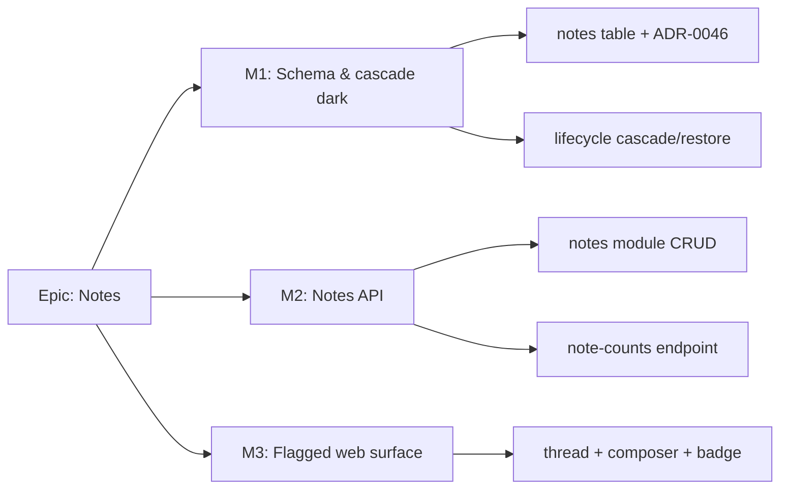

# Implementation Plan: Notes (threaded annotations on plans & activities)

- **Feature spec:** `docs/specs/notes/feature-spec.md` (awaiting approval)
- **Status:** Draft (awaiting approval — do not implement yet)
- **Owner:** _TBD_

> Sliced as **thin additive vertical increments** that keep `main` releasable, mirroring the
> resources / earned-value / inter-project epics: **schema+cascade dark → API → flagged web**.
> Each slice is independently mergeable; behaviour only becomes user-visible when the
> `VITE_NOTES` flag is flipped on (default off).

## Breakdown

### Epic

**Notes** — attributed, time-ordered, threaded annotations on plans and activities (a
"weekly progress journey"), non-structural and not pen-gated, extensible to client/project.
Maps to the collaboration / plan-annotation roadmap theme.

---

### Milestone 1 — Schema & cascade (dark) — _shippable, no behaviour change_

**Outcome:** the `notes` table and its lifecycle wiring exist and are covered by tests; no
routes, no UI. `main` stays releasable; nothing user-visible changes.

#### Feature: `notes` table, `@repo/types`, permissions, ADR-0046

> **Description:** the polymorphic `notes` schema, shared types, new `note:*` permission
> codes (not yet used by any route), and the ADR.
> **Complexity:** M
> **Dependencies:** none.
> **Risks:** polymorphic CHECK / cascade correctness → mitigate with the **database-architect**
> agent designing schema+indexes+CHECK, and unit tests for the exactly-one-parent invariant.
> **Testing requirements:** migration applies cleanly; Prisma model round-trips; type build.

##### Task 1.1 — ADR-0046 + Prisma model + migration (with database-architect)

- **Description:** draft **ADR-0046 (Polymorphic entity notes)** (options, CHECK invariant,
  cascade wiring); add the `notes` Prisma model + partial/scoped indexes + the
  `ck_notes_exactly_one_parent` CHECK (raw SQL) via `prisma migrate`.
- **Complexity:** M
- **Dependencies:** none.
- **Risks:** getting the polymorphic FK + CHECK right → database-architect review; index
  choices measured against the list/count queries.
- **Testing:** migration up/down in CI; a schema round-trip test.
- **Development steps:**
  1. Run the **database-architect** agent on the §4 model; finalise columns, FKs, indexes, CHECK.
  2. Write `docs/adr/0046-polymorphic-entity-notes.md`; add it to the CLAUDE.md ADR list.
  3. Add the Prisma model + migration; verify `prisma migrate` + partial-index raw SQL.
  4. Changeset (minor; additive schema).

##### Task 1.2 — `@repo/types` additions

- **Description:** `NoteEntityType` (`'PLAN' | 'ACTIVITY'`), `Note`/`NoteResponse`,
  `CreateNoteInput`, `UpdateNoteInput`, exported from `packages/types/src/index.ts`.
- **Complexity:** S
- **Dependencies:** 1.1 (field shape).
- **Risks:** drift between Prisma enum and the union → keep in lock-step (the
  `LagCalendarSource` precedent).
- **Testing:** type-level build (`pnpm typecheck`).
- **Development steps:** add types; export; ensure api/web compile against them.

##### Task 1.3 — permission codes

- **Description:** add `note:read` to `HIERARCHY_READ`; add a `NOTE_WRITE` group
  (`note:create`, `note:update`, `note:delete`) granted **Contributor → Org Admin** (the
  `PROGRESS_WRITE` precedent, **not** `HIERARCHY_WRITE`); `note:moderate` gated on Q4.
- **Complexity:** S
- **Dependencies:** none.
- **Risks:** wrong grant surface → covered by `org-permissions.spec.ts` role→permission tests.
- **Testing:** unit — each role resolves exactly the intended note permissions.
- **Development steps:** extend `OrgPermission` union + `ROLE_PERMISSIONS`; update the spec test.

#### Feature: lifecycle cascade/restore for notes

> **Description:** `HierarchyLifecycleService` sweeps & restores notes with their parent.
> **Complexity:** M
> **Dependencies:** 1.1.
> **Risks:** batch correctness (activity-notes swept by both an activity delete and a plan
> delete) → thorough unit tests reusing the existing cascade spec patterns.
> **Testing:** unit — plan/project/client delete sweeps plan+activity notes under one batch;
> activity delete sweeps only that activity's notes; restore reactivates by batch; individually
> deleted note stays deleted on parent restore of a **different** batch.

##### Task 1.4 — extend cascade & restore

- **Description:** add `deleteNotesUnderPlans(planIds)` (matches `plan_id IN planIds OR
activity.planId IN planIds`) to the plan/project/client paths; add
  `deleteNotesForActivities(activityIds)` to the activity path; add `notes` to
  `CascadeCounts`; add a `notes` restore (`updateMany where deleteBatchId`, no endpoint guard).
- **Complexity:** M
- **Dependencies:** 1.1.
- **Risks:** double-counting a note (matched by both plan and activity predicate) → use a
  single sweep keyed on the note's own `plan_id` (denormalised on every note) to make the
  plan cascade one `updateMany`; unit-test the counts.
- **Testing:** extend `hierarchy-lifecycle.service.spec.ts`.
- **Development steps:** implement sweeps; extend restore; update `CascadeCounts` + docs
  (`docs/DATABASE.md` cascade section); changeset.

---

### Milestone 2 — Notes API — _shippable; usable via API, still no UI_

**Outcome:** members can create/list/edit-own/delete-own notes and read counts over HTTP,
fully RBAC-scoped and **not** pen-gated. No web surface yet (so no user-visible change in the
app, but the contract is live and OpenAPI-documented).

#### Feature: `notes` module (CRUD)

> **Description:** the reference-template module: controllers (plan-notes, activity-notes,
> flat note item), `NotesService`, `NotesRepository`, DTOs, wired into `AppModule`.
> **Complexity:** L
> **Dependencies:** M1.
> **Risks:** author-ownership + org-scope IDOR → load-then-scope + author check, mirrored in
> the reference service; **security-reviewer** on the module.
> **Testing:** unit (service) + API e2e (Supertest) — full RBAC matrix, pagination, 409, 404,
> not-pen-gated assertion.

##### Task 2.1 — module skeleton from the reference template

- **Description:** copy `apps/api/examples/reference-feature/module` → `apps/api/src/modules/notes`;
  adapt to org-slug routing (`PlanNotesController`, `ActivityNotesController`, `NotesController`),
  DTOs (`CreateNoteDto`, `UpdateNoteDto`, `NoteResponseDto`), repository with the soft-delete filter.
- **Complexity:** M
- **Dependencies:** M1.
- **Risks:** diverging from template cross-cutting patterns → keep layering/envelopes/DTOs;
  `scripts/verify-template.sh` stays green.
- **Testing:** module compiles; controllers registered; OpenAPI renders.
- **Development steps:** scaffold; wire `NotesModule` into `AppModule`; DTOs with class-validator.

##### Task 2.2 — service: create / list / update-own / delete-own

- **Description:** `create` (scope parent, `assertCan('note:create')`, denormalise
  org/plan, audit), `list` (cursor, newest-first), `update` (author check + optimistic
  `version`), `remove` (author check, soft delete). **No `assertHoldsPen`** anywhere.
- **Complexity:** M
- **Dependencies:** 2.1.
- **Risks:** forgetting the author check → explicit unit tests for 403-on-other's-note.
- **Testing:** unit — scope/permission/author/version/soft-delete; log assertions.
- **Development steps:** implement; log with `noteId`/parent/user; map `NotFound/Forbidden/Conflict`.

##### Task 2.3 — API e2e (Supertest)

- **Description:** RBAC matrix (Viewer read-only, Contributor writes, cross-author 403,
  cross-tenant 404), pagination continuity, 409 on stale version, 422 on bad body, and an
  explicit **"note write succeeds without holding the pen"** test.
- **Complexity:** M
- **Dependencies:** 2.2.
- **Risks:** flaky ordering → deterministic seed + stable `created_at, id` sort.
- **Testing:** `notes.e2e-spec.ts` against real Postgres.
- **Development steps:** write e2e; update `docs/API.md`; changeset (minor).

#### Feature: note-counts endpoint

> **Description:** `GET …/plans/:planId/note-counts?entityType=activity` → `{ data: { [activityId]: number } }`.
> **Complexity:** S
> **Dependencies:** 2.1.
> **Risks:** N+1 if done per-row → a single grouped `groupBy(activity_id)` query.
> **Testing:** unit + e2e — counts reflect active notes only, exclude soft-deleted.

##### Task 2.4 — counts read

- **Description:** grouped count over active activity-notes for a plan; org-scoped; `note:read`.
- **Complexity:** S
- **Dependencies:** 2.1.
- **Risks:** none material.
- **Testing:** e2e — badge counts match; deleted notes excluded.
- **Development steps:** implement repository `groupBy`; controller; OpenAPI; e2e.

---

### Milestone 3 — Flagged web surface (`VITE_NOTES`, default off) — _shippable_

**Outcome:** with the flag on, members read/write threads in the activity Logic/detail panel
and the plan workspace, and see per-row count badges. Default off ⇒ the app is byte-identical.

#### Feature: notes thread, composer, item, badge + surfacing

> **Description:** `features/notes/` (hooks + components) mounted in the activity panel and the
> plan workspace, behind `VITE_NOTES`.
> **Complexity:** L
> **Dependencies:** M2.
> **Risks:** a11y + state coverage + one-off styling → **accessibility/ux/component** reviewers;
> semantic tokens + shadcn/ui only.
> **Testing:** component (Vitest + RTL), a11y (jsx-a11y + Playwright axe), e2e journey (flag-on).

##### Task 3.1 — flag + API hooks

- **Description:** add `NOTES_ENABLED = flagDefaultOff(import.meta.env.VITE_NOTES)` to
  `config/env.ts`; `use-notes.ts` (cursor list + create/update/delete, optimistic +
  invalidation) and `use-note-counts.ts`.
- **Complexity:** M
- **Dependencies:** M2.
- **Risks:** cache-key drift between thread and counts → shared query-key factory.
- **Testing:** hook unit tests (mock fetch); invalidation asserted.
- **Development steps:** add flag (with a doc comment in the `env.ts` house style); hooks; Zod schema shared with server bounds.

##### Task 3.2 — components + surfacing + states

- **Description:** `NoteThread`, `NoteComposer` (RHF+Zod), `NoteItem` (APG `Menu` for own
  Edit/Delete — never hover-only), `NoteCountBadge`; mount the thread in the activity
  Logic/detail panel and a plan-workspace **Notes** section; loading/empty/error/success states.
- **Complexity:** L
- **Dependencies:** 3.1.
- **Risks:** row-action discoverability / focus management → follow UX_STANDARDS row-actions
  guidance + manage focus on open/submit; live-region announce on post.
- **Testing:** component tests for each state + role gating (Viewer sees no write controls).
- **Development steps:** build components; wire into panels behind the flag; theme-aware, mobile-first.

##### Task 3.3 — a11y + e2e journey + quality gates

- **Description:** flag-on Playwright journey (add → appears → edit → "edited" → delete →
  badge updates; Viewer read-only); axe checks; run accessibility/ux/component reviewers.
- **Complexity:** M
- **Dependencies:** 3.2.
- **Risks:** flag-on CI wiring → add a `test:e2e:notes` script gated on the flag (the
  resources/EV precedent).
- **Testing:** Playwright + axe; component coverage ≥ 80% on changed code.
- **Development steps:** e2e; fold review findings; update `docs/` + `CLAUDE.md`; changeset;
  decide flag-flip separately once gates are green.

---

## Sequencing & slices

1. **M1 (dark):** table + types + permissions + cascade — no routes/UI. `main` releasable,
   zero behaviour change.
2. **M2 (API):** CRUD + counts over HTTP; RBAC-scoped, not pen-gated; OpenAPI + e2e. Still no
   UI, so no user-visible change.
3. **M3 (flagged web):** thread/composer/badge behind `VITE_NOTES` (default **off**). Flip on
   only after a11y/ux/component/e2e gates are green (the resources/EV/inter-project rollout
   pattern). Each milestone is an independently mergeable, releasable slice.

**Feature flag:** `VITE_NOTES` (default off via `flagDefaultOff`) governs the entire web
surface; the API is always on (harmless without a caller).

## Definition of Done (per task)

Each task's PR satisfies the Feature Completion Criteria in `docs/PROCESS.md` — code, tests
(unit + API + e2e/a11y as applicable, ≥ 80% on changed code), docs (`docs/API.md`,
`docs/DATABASE.md`, ADR-0046, `CLAUDE.md`), **security-reviewer** (RBAC/scope/IDOR/author-check/
validation), **backend-performance-reviewer** (counts query, pagination, indexes),
**accessibility-reviewer** (WCAG 2.2 AA for the web surface), Docker build, CI green, a
changeset, and a version-impact note (all additive ⇒ minor pre-1.0).

## Recommended specialised agents (build time)

- **database-architect** — before the migration: finalise the polymorphic schema, indexes,
  the exactly-one-parent CHECK, and the cascade integration (M1).
- **security-reviewer** — the RBAC matrix, org-scope/IDOR, author-ownership on edit/delete,
  input validation (M2).
- **api-reviewer** — routes, status codes, envelopes, pagination (M2).
- **backend-performance-reviewer** — the grouped counts query + list indexes (M2).
- **component-reviewer / ux-reviewer / accessibility-reviewer** — the thread/composer/badge
  and their surfacing, token/variant usage, state coverage, keyboard/focus (M3).
- **test-engineer** — the unit/e2e/journey suites across all milestones.

## Risks & assumptions (rollup)

| Risk / assumption                                            | Likelihood | Impact | Mitigation                                                                               |
| ------------------------------------------------------------ | ---------- | ------ | ---------------------------------------------------------------------------------------- |
| Polymorphic table + CHECK modelled wrong                     | med        | high   | database-architect + ADR-0046 + invariant unit tests                                     |
| Cascade double-counts/misses activity notes                  | med        | med    | single sweep keyed on note's denormalised `plan_id`; cascade spec tests                  |
| Author-ownership bypass (IDOR)                               | low        | high   | load-then-scope + explicit author check; security-reviewer + e2e cross-author 403        |
| Accidental pen-gating (regressing the non-structural intent) | low        | med    | explicit e2e "write without pen"; no `assertHoldsPen` in the module                      |
| Badge N+1 on large plans                                     | low        | med    | single grouped counts endpoint, not per-row                                              |
| Scope creep (markdown/mentions/reactions/guest access)       | med        | med    | v1 = plain text threads; extensions gated behind the Critical questions                  |
| Client/project notes need rework later                       | low        | high   | polymorphic model chosen precisely to make them a nullable-column + one-line-cascade add |

## Open decisions blocking a flag-flip (not a merge)

The five **Critical questions** in the spec (body format/length, edit lifetime, canvas pin,
Org-Admin moderation, guest visibility) each carry a default so M1–M3 can be **built** as
specified; only Q1 (markdown vs plain) and Q4 (moderation) change code shape if answered
against the default, so confirm those before M2/M3 respectively.
