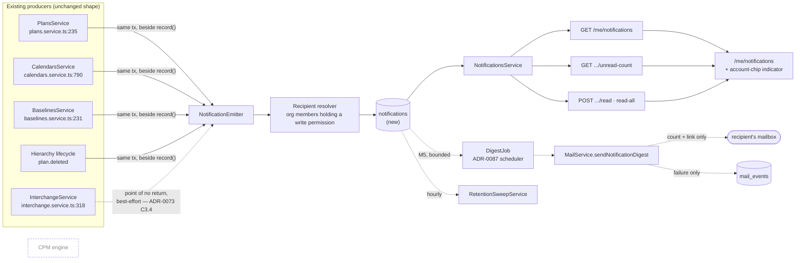
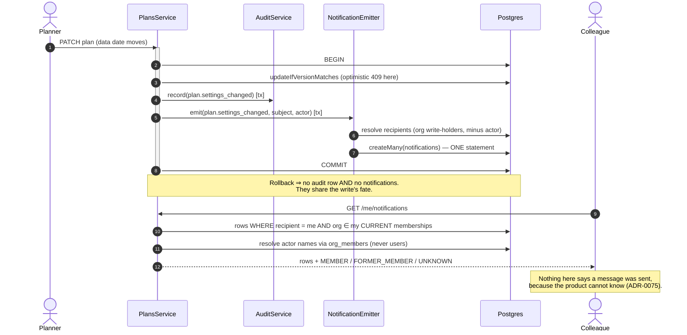

# Feature Spec: Notifications

- **Status:** Approved — the design is accepted; the **build waits on ADR-0137's trigger** (a
  second person holding a write permission in any organisation). At one member the recommended
  recipient rule yields the empty set, so the feature would emit nothing. Not shelved: loaded.
- **Author(s):** feature-analyst (Product Owner / Solution Architect / Technical Lead hats)
- **Date:** 2026-09-11
- **Tracking issue / epic:** _(none yet)_
- **Roadmap link:** _none_ — `docs/ROADMAP.md` has **no** notifications entry (verified:
  `grep -n "otification" docs/ROADMAP.md` returns nothing). Add one on approval.
- **Related ADR(s):** builds on ADR-0012/0016 (RBAC + tenancy), ADR-0028 (the pen), ADR-0046
  (polymorphic parent + fail-closed CHECK), ADR-0073 (the two coverage tests), ADR-0075 (mail is
  best-effort), ADR-0081 (entry point + journey), ADR-0087 (the scheduler), ADR-0088 D1 (no
  `VITE_` flag), ADR-0096 (retention), ADR-0098 (actor resolution). **This spec proposes a new ADR**
  — see §4.9.

---

## 0. What was verified, and what was inherited

Per `docs/PROCESS.md` "Decision-bearing claims carry their evidence" and CLAUDE.md §19.11. The brief
that commissioned this spec supplied six facts. **All six were re-verified; one of them turned out to
be materially incomplete and the correction changes the design.**

| #   | Claim (from the brief)                                                         | Verdict       | Evidence                                                                                                                                           |
| --- | ------------------------------------------------------------------------------ | ------------- | -------------------------------------------------------------------------------------------------------------------------------------------------- |
| 1   | `LOCK_HANDOFF_GRACE_MS = 45_000`                                               | **confirmed** | `apps/api/src/modules/plan-lock/plan-lock.policy.ts:29`                                                                                            |
| 2   | `MailService` is an abstract port with one typed method per message type       | **confirmed** | `apps/api/src/common/mail/mail.service.ts:45-84` — `sendInvitation`, `sendEmailVerification`, `sendPasswordReset`, plus optional `verifyTransport` |
| 3   | Two adapters, selected on `MAIL_SMTP_URL`                                      | **confirmed** | `mail.service.ts:6-10` docblock; `smtp-mail.service.ts:74-82`                                                                                      |
| 4   | `MailEvent` records failures only                                              | **confirmed** | `schema.prisma:3201-3246`; `outcome` is `FAILED`/`ABANDONED` (`:3213-3218`)                                                                        |
| 5   | No `Notification` model, no in-app inbox                                       | **confirmed** | `grep -i "notification" apps/api/prisma/schema.prisma` → no matches                                                                                |
| 6   | Existing consumers: invitations, better-auth, operational alerts, audit, staff | **confirmed** | `smtp-mail.service.ts:109-258`                                                                                                                     |

**The incomplete one is #1, and it is the most important correction in this document.** The brief
frames the pen tension as "45 seconds versus email latency". The 45 s grace is only one of four
timing constants, and the other three change the answer:

| constant                 | value    | file:line                                                      |
| ------------------------ | -------- | -------------------------------------------------------------- |
| `LOCK_HANDOFF_GRACE_MS`  | 45 s     | `plan-lock.policy.ts:29`                                       |
| `LOCK_INACTIVE_AFTER_MS` | **90 s** | `plan-lock.policy.ts:24`                                       |
| `LOCK_TTL_MS`            | 120 s    | `plan-lock.policy.ts:15`                                       |
| client status **poll**   | **15 s** | `apps/web/src/features/plan-lock/api/use-plan-edit-lock.ts:20` |
| client heartbeat         | 30 s     | `use-plan-edit-lock.ts:22`                                     |

Worked through in §1 "The pen hand-off", these produce a conclusion the brief did not anticipate:
**there is no state of the world in which an email to the pen holder changes the outcome.** That is
argued from the code rather than from an opinion about how fast email is — which matters, because
the product cannot observe how fast its email is (fact #4) and therefore cannot design a
45-second interaction on it.

Two further things were established by reading, not assumed:

- **Import is synchronous.** `POST …/interchange/commit` returns **201 with the plan id and the
  report** to the caller who is waiting (`interchange.controller.ts:112-170`). There is no queue —
  ADR-0009's BullMQ is unimplemented (CLAUDE.md §17). So "import completion currently surfaces only
  in-app" is true in a way the backlog did not mean: it surfaces as **the HTTP response to the
  importer's own request**. The importer needs no notification. Their colleagues might.
- **Every organisation member can read every plan.** `HIERARCHY_READ` (which contains `plan:read`) is
  granted to `VIEWER` and upward (`org-permissions.ts:307-340`). There is no per-plan ACL. This
  bounds the disclosure question tightly and is used in §2 Permissions.

---

## 1. Business understanding

### Problem

SchedulePoint tells you things **only while you are looking at the thing it is telling you about**.
A planner who spends a morning away comes back to a plan whose bars have moved and has no way to
learn what happened, or that it happened at all. Concretely, today:

- The **data date** or **scheduling mode** moves and every date in the plan is re-derived. The person
  who authored that work is not told. They see different bars.
- A **shared calendar's working week** changes and re-dates every plan that uses it. Nobody using
  those plans is told.
- A **baseline is captured or activated**, changing what "late" means for every later variance
  report. Nobody is told.
- A **plan is imported** — a whole 500-activity programme appears in a project. Only the importer
  knows.
- A **plan is deleted**. Since ADR-0096 it now has a **90-day expiry clock** on it and then it is
  gone permanently. Nobody whose work it was is told, and nobody is told before the clock runs out.

Each of those is recorded in `audit_events`, so the facts exist. But the audit log is **Org Admin
only** (`AUDIT_READ`, `org-permissions.ts:287`), is a forensic feed rather than a personal one, and
requires you to go and look — which you only do if you already suspect something. It is evidence,
not a notification.

**Why now.** `docs/BACKLOG.md:150-166` has carried this as an `M` blocked on "the mail transport
first". That blocker **lapsed on 2026-08-05** and nobody noticed for a month; the entry itself was
corrected on 2026-09-11 and now states what it genuinely needs: _a decision about which events earn
a notification and through what channel_. This spec is that decision. It also finds — see §4 — that
**mail was never the blocker**, and that the real missing piece was that there was nothing durable
for a message to point at.

### Users

All five roles are in scope as **recipients**; none of them is in scope as an administrator of this
feature (there is nothing to administer in v1).

| Role               | What they need                                                                                                                                                                              |
| ------------------ | ------------------------------------------------------------------------------------------------------------------------------------------------------------------------------------------- |
| **Planner**        | To know when somebody else's governance change has re-dated the work they own, and when a plan they work on has arrived, been deleted, or had its baseline moved.                           |
| **Contributor**    | The same, narrowed: their progress reporting is re-interpreted by a data-date move exactly as a Planner's logic is.                                                                         |
| **Org Admin**      | The above, plus the ability to reconstruct what happened to an organisation without reading a forensic log.                                                                                 |
| **Viewer**         | Reads plans; authors nothing. Deliberately **not** a default recipient — see §2 Permissions and CQ-2.                                                                                       |
| **External Guest** | **Out of scope, permanently for this epic.** A guest is a session-less bearer token with a fixed `SCHEDULE_READ` scope (ADR-0051) and no `users` row to address. There is nobody to notify. |

**Staff (ADR-0086) are also out of scope**, and structurally so: `StaffPrincipal` carries no
memberships and reaching customer data from it is a compile error.

### Primary use cases

1. **"What changed while I was away?"** — one place, per person, spanning every organisation they
   belong to, that answers this without asking them to guess where to look.
2. **"Someone moved the data date on a plan I am working on"** — learn it, and get to the plan.
3. **"A plan I work on is in the recycle bin and will be permanently deleted"** — learn it while
   there is still time to restore it.
4. **"An import landed in my project"** — learn that a programme arrived that I did not create.
5. **Mark it read, and stop seeing it.**

### User journeys

**Happy path (M2).** A Planner signs in. The account chip carries an unread dot; the account menu
carries **Notifications**. They open `/me/notifications`, see a reverse-chronological list — each row
naming the organisation, the plan, what changed, who changed it and when — press one, land on the
plan, and the row is marked read.

**Alternate — nothing to show.** The inbox is empty and says so in the words that distinguish
"nothing has happened yet" from "you have read everything" (ADR-0073 C1's finding: collapsing two
different empty states into one sentence is a real defect, and it shipped once).

**Alternate — the actor has left the organisation.** The row says so rather than rendering a blank
where a name should be (ADR-0098's `MEMBER` / `FORMER_MEMBER` / `UNKNOWN` union, reused not
reinvented).

**Alternate — the subject has been deleted since.** The row survives (it is a record of an event,
not a projection of a plan) and its link is shaded with a reason rather than 404-ing (ADR-0082).

See the user-flow diagram in §4.

### Expected outcomes

- A member can answer "what changed in my organisations while I was away?" from one screen. Today
  they cannot answer it at all unless they are an Org Admin willing to read a forensic log.
- The product acquires its **first durable per-person record of anything**, which is the thing every
  later channel (mail, push, digest) points at — rather than each channel being its own separate,
  unverifiable claim.
- The 90-day hard-delete clock ADR-0096 armed stops being silent.

### Success criteria

| #    | Criterion                                                                                                                      | How it is measured                                                                                                                 |
| ---- | ------------------------------------------------------------------------------------------------------------------------------ | ---------------------------------------------------------------------------------------------------------------------------------- |
| SC-1 | A member who was away for a day can name every governance change in their organisations from one screen, within one page load. | The M2 journey drives it end to end against a real API.                                                                            |
| SC-2 | `GET /api/v1/me/notifications` p95 < 200 ms for a recipient holding 10,000 rows.                                               | A measurement task with the condition committed **before** the run (M1-T5), per CLAUDE.md §19.11 and the ADR-0116/0128 precedent.  |
| SC-3 | Emitting notifications adds ≤ 10 ms p95 to the plan-settings save at 50 recipients.                                            | M1-T5, same run, same rule. **Falsification condition committed first**; exceeding it changes the design to a derived feed (§4.6). |
| SC-4 | **No screen, DTO or message in the product claims a notification was sent.**                                                   | A structural gate over the copy and DTO field names (§4.5).                                                                        |
| SC-5 | **No notification payload carries a field the recipient may not be entitled to read.**                                         | A role-invariance scanner over the notification DTOs, on the ADR-0116 G4 shape **with its three known bypasses closed** (§4.5).    |
| SC-6 | The `notifications` table is in `RETENTION_TABLES` and its period is enforced.                                                 | An assertion in the retention census, plus the boot line naming the table count.                                                   |

### Open questions

**ANSWERED by the product owner, 2026-09-12. The three CRITICAL questions below are kept as written
rather than rewritten, because the reasoning each carries is what the answer was chosen against.**

| Question                                                | Answer                                                                                                                                                                | What it settles                                                                                                                   |
| ------------------------------------------------------- | --------------------------------------------------------------------------------------------------------------------------------------------------------------------- | --------------------------------------------------------------------------------------------------------------------------------- |
| **CQ-1** — the pen hand-off gets nothing from this epic | not put; ADR-0137 D4 had already **disproved the premise** (a peer takes the pen from an absent holder on inactivity alone, so no faster channel changes the outcome) | nothing owed; the residual background-tab case stays filed                                                                        |
| **CQ-2** — who receives a plan-governance notification  | **(a) members holding a write permission, minus the actor**                                                                                                           | **no subscription model.** Viewer excluded; the audience is the people who author, because the event re-interprets authored work  |
| **CQ-3** — does mail ship in the first release          | **(a) inbox first; mail is M5, behind preferences at M4**                                                                                                             | `MailEvent` records failures only, so the product cannot honestly claim a message was sent until a durable row exists to point at |

**And the ordering question, which was not in this spec and outranks all three.** ADR-0137 D1 defers
the build on a **checkable fact** — a second person holding a write permission in any organisation.
"Prepare for it" is not that fact: with one member the CQ-2 recipient set is **empty**, so the
feature would emit zero rows, render an empty inbox and be indistinguishable from its own absence.
Put to the product owner as an ordering choice, the answer was **invite the second person first**.

So **the trigger has still not fired**, and this epic does not start until it does — but the event
that fires it is now expected rather than hypothetical, and it fires **ADR-0085 (privacy operations)
at the same moment**, which is exactly why D1 chose the same trigger for both.

_(The original text follows unchanged.)_

Three are **CRITICAL** — their answers change the design or the scope. Everything else has a stated
default and is not blocking.

> **CQ-1 (CRITICAL) — the pen hand-off gets nothing from this epic. Do you accept that?**
>
> It is the case the backlog names first, and §1 "The pen hand-off" below argues from four timing
> constants that mail cannot serve it and that the residual case is a small frontend change belonging
> to ADR-0028's own surface rather than to a notifications epic.
>
> - **(a) Accept — recommended.** The pen is untouched. The residual (a holder with the plan open in
>   a **background tab**) is filed as a `docs/TECH_DEBT.md` row with a named trigger: the first report
>   of a planner surprised by a take-over.
> - **(b) Accept, and add the background-tab attention channel as one extra milestone** (~1 task:
>   a document-title flash and an in-page toast driven by the **existing** 15 s poll; no server
>   change, no schema, no mail). Cheap, and it is the only option that actually addresses the case.
> - **(c) Mail the outcome** ("your pen was taken on _Riverside Tower_"). **Not recommended** and
>   argued against in §4.2 — it is a second copy of something the product already tells the holder
>   the instant they touch the canvas, and it fires loudest in the case where the holder is offline
>   and would have lost the pen anyway.
> - **(d) Lengthen the grace window to fit mail.** **Rejected on argument**, not preference — see
>   §4.2: it inverts the policy, making an _absent_ holder taken over faster (90 s) than a _present_
>   one being politely asked.

> **CQ-2 (CRITICAL) — who receives a plan-governance notification?**
>
> This decides the schema (a subscription model or not) and the fan-out arithmetic.
>
> - **(a) Every member holding a write permission, minus the actor — recommended.** Contributor,
>   Planner, Org Admin; Viewer excluded. **Derived rather than chosen**: the blast-radius test says
>   the event earns a notification because it re-interprets _authored_ work, so its audience is the
>   people who author. A Viewer authors nothing. No new model.
> - **(b) Every member, minus the actor.** Simpler to explain, noisier, and includes people whose
>   work is not affected.
> - **(c) Explicit per-plan subscription ("Follow this plan").** Correct at scale and the eventual
>   answer, but it is a second model, a second write surface and a second empty state, and it makes
>   the feature useless until people have followed things. **Deferred with a trigger**: the first
>   organisation above the fan-out bound measured in SC-3, or the first complaint about noise.

> **CQ-3 (CRITICAL) — does mail ship in this epic at all?**
>
> The backlog's headline was mail. This spec recommends **no mail in the first release**, and the
> reasoning (§4.3, §4.4) is that mail is the _second_ half of this feature and cannot be built
> honestly until the first half exists.
>
> - **(a) Inbox first; mail is a later milestone (M5) behind preferences (M4) — recommended.**
> - **(b) Inbox and mail in the same release.** Possible; it makes the release roughly twice as long
>   and puts an SMTP round trip into the decision space before anyone has used an inbox.
> - **(c) Mail only, no inbox.** **Rejected** — §4.3. The product cannot record that a message was
>   sent (fact #4), so a mail-only design can never re-show, mark-read or honestly describe itself,
>   and a message delivered after a membership is revoked leaks plan content past the permission
>   check that would have refused it.

**Non-blocking defaults** (stated, and proceeding):

| Question                                   | Default                                                                                                                                                                                                                                                    |
| ------------------------------------------ | ---------------------------------------------------------------------------------------------------------------------------------------------------------------------------------------------------------------------------------------------------------- |
| Retention period for notifications         | **90 days**, matching `RETENTION_HIERARCHY_DAYS`. Joins `RETENTION_TABLES` (ADR-0087/0096).                                                                                                                                                                |
| Read model                                 | Per-row `read_at TIMESTAMPTZ NULL` rather than a per-user watermark. "When" costs the same as "whether" and a watermark cannot express "mark this one read", which is the interaction the list actually offers.                                            |
| Cross-organisation                         | **One inbox spanning every organisation the reader belongs to**, each row labelled with its organisation. The `/me/audit-events` precedent (`audit.controller.ts:75`).                                                                                     |
| Digest vs per-event mail (when mail lands) | **Digest.** Per-event mail is inadmissible — see §4.4.                                                                                                                                                                                                     |
| `VITE_` flag                               | **None.** ADR-0088 D1: a `VITE_` constant is inlined at build time, `docker-publish.yml` passes no `VITE_` build arg, so every published image carries every flag at its default and an operator cannot switch one off. The rollback is a commit boundary. |
| Grouping / threading in the inbox          | None in v1. A flat reverse-chronological list. Grouping is a read-model change with no schema cost, addable later.                                                                                                                                         |
| Real-time push (SSE/WebSocket)             | **Out of scope.** There is no WebSocket gateway or SSE anywhere in `apps/api`. It is the correct channel for a sub-minute window and it is infrastructure, not a milestone. Named in §4.2 with its trigger.                                                |

### The pen hand-off — the tension, confronted

The brief asks that this not be smoothed over. It is not, and the answer is sharper than "mail is
too slow".

`useLockHeartbeat` **releases the pen on unmount and on `pagehide`**
(`use-plan-edit-lock.ts:168-185`). So a holder who navigates away or closes the tab has already given
the pen up. The lock only survives while the tab is open **on that plan**. Enumerate what is left:

| Holder's situation            | Heartbeating?                                                                | Told today?                                | Peer may take over after                            |
| ----------------------------- | ---------------------------------------------------------------------------- | ------------------------------------------ | --------------------------------------------------- |
| Plan open, foreground         | yes                                                                          | **yes, within 15 s** — the status poll     | 45 s grace                                          |
| Plan open, **background tab** | yes (throttled; the docblock at `:117-119` says a beat can slip toward 60 s) | poll is throttled too → **effectively no** | 45 s grace                                          |
| Navigated away / tab closed   | no — released on the way out                                                 | n/a, the lock is `FREE`                    | immediately                                         |
| Crashed / offline / asleep    | no                                                                           | no                                         | **90 s** (`isHolderInactive`) — **no grace at all** |

**Read the last row carefully. It is the whole argument.** If the holder is genuinely gone, the peer
does not need the holder's response: `canTakeOverNow` returns true on `isHolderInactive` alone
(`plan-lock.policy.ts:81-92`), with no grace. So the case an email would serve — reach somebody who
is not at their screen — is **already resolved without them**, faster than any email, by a rule that
shipped with ADR-0028.

And if the holder _is_ at their screen, they are told within 15 s and have 30 s of the grace left.

That leaves exactly one residual: **a holder with the plan open in a background tab.** Mail does not
serve it either — a message read in a mail client asks the holder to come back and respond inside a
window that closed long ago, and the product has no evidence at all about how long its own mail takes
(fact #4: there is no record of a successful send anywhere). What serves it is the browser's own
attention channel: a document-title flash and an in-page toast, driven by the poll that already
exists. That is CQ-1 option (b), one task, frontend-only.

Its honest limit, stated rather than discovered: **a background tab's timers are throttled**, so the
15 s poll may fire at ~60 s — outside the 45 s grace. The existing `visibilitychange` handler
(`:158-166`) fires an immediate beat on return to the foreground, so the holder learns the instant
they look. So option (b) **narrows the window; it does not close it** — which is exactly ADR-0075's
shape, and is why the only thing that would close it is a server push, which this application does
not have.

**What is given up by recommending (a).** A holder in a background tab still loses the pen without a
chance to say "one minute". That is a real loss. It is also a loss the product has never had a report
of, against a 45-second window it would take new infrastructure to defend.

---

## 2. Functional requirements

### User stories & acceptance criteria

> **US-1** — As a **member of an organisation**, I want one list of the things that happened to work
> I am involved in, so that I can catch up after being away.
>
> **Acceptance criteria**
>
> - **Given** I belong to two organisations and a governance change occurred in each **when** I open
>   Notifications **then** I see both, newest first, each labelled with its organisation.
> - **Given** I have no notifications at all **when** I open Notifications **then** I see "Nothing has
>   happened yet" — **and not** the all-read wording.
> - **Given** every notification I have is read **when** I open Notifications **then** I see the
>   read list with a distinct "You are up to date" summary. The two empty-ish states are worded
>   differently (ADR-0073 C1's recorded defect).
> - **Given** the list exceeds one page **when** I reach the end **then** a keyboard-reachable
>   "Load more" is the last item in the arrow-key sequence (ADR-0053 M6's recorded WCAG 2.1.1 fix).
> - **Given** the list settles **then** its result count is announced in a live region (WCAG 4.1.3).

> **US-2** — As a **member**, I want a notification to tell me what changed and who changed it, so
> that I can decide whether to act.
>
> **Acceptance criteria**
>
> - **Given** a `plan.settings_changed` notification **then** it names the plan, the organisation, the
>   **kind** of governance change, the actor and the time.
> - **Given** the actor has since left the organisation **then** the row says "a former member", never
>   a blank (ADR-0098's three-outcome union).
> - **Given** the actor's id resolves to nobody at all **then** the row says the actor is unknown — a
>   third state, not folded into the second.
> - **Given** any notification **then** it carries **no cost, rate, budget or earned-value field** —
>   `cost:read` is Planner + Org Admin only (`org-permissions.ts:254`) and a notification is delivered
>   to a role-mixed audience.

> **US-3** — As a **member**, I want to open the thing a notification is about.
>
> **Acceptance criteria**
>
> - **Given** a notification about a live plan **when** I activate the row **then** I navigate to that
>   plan in that organisation, and the row becomes read.
> - **Given** the plan has since been deleted **then** the row's link is **shaded with a reason**
>   ("this plan is in Recently deleted"), never removed and never a 404 (ADR-0082).
> - **Given** I have been removed from that organisation since **then** the row is no longer returned
>   to me at all — the read is org-scoped per row against my **current** memberships.

> **US-4** — As a **member**, I want to mark notifications read so the unread signal means something.
>
> **Acceptance criteria**
>
> - **Given** an unread notification **when** I mark it read **then** the unread count decreases and
>   the change survives a reload.
> - **Given** unread notifications **when** I press "Mark all as read" **then** all of mine become
>   read, and only mine.
> - **Given** I mark a row read twice **then** the second is a no-op, not an error (idempotent).
> - Marking read is **not** undoable and the product does not pretend otherwise; there is no "mark
>   unread" in v1.

> **US-5** — As a **member**, I want to see that something is waiting without opening a menu.
>
> **Acceptance criteria**
>
> - **Given** I have unread notifications **then** the account chip carries an unread indicator and
>   its accessible name states the count.
> - **Given** I have none **then** there is no indicator and the accessible name is unchanged.
> - The indicator adds **zero** layout width to the header row — asserted by measurement, not by
>   inspection. (The header wraps below a 1480 px container and eight consecutive epics have had
>   their width expectations contradicted by their own measurements; see §3 Frontend.)

> **US-6** _(M4)_ — As a **member**, I want to choose what I am notified about, so that a busy
> organisation does not make the inbox useless.
>
> **Acceptance criteria**
>
> - **Given** preferences **when** I turn a kind off **then** no new notification of that kind is
>   created for me; existing ones are untouched.
> - Preferences are **per person, per organisation, per kind**, and default **on** for the kinds a
>   role's write permissions make relevant (CQ-2a).
> - Turning a kind off does **not** suppress the corresponding `audit_events` row. The audit log is
>   not a preference.

> **US-7** _(M5, blocked on M4)_ — As a **member**, I want an email when I have unread notifications,
> so that I find out without opening the app.
>
> **Acceptance criteria**
>
> - **Given** I have unread notifications and have not been sent a digest since they arrived **then**
>   at most one digest email per interval names **how many** and links to the inbox.
> - **Given** the email **then** it carries **no plan content** — no plan name, no organisation name,
>   no actor, no dates. A count and a link. (§4.4 — this is a disclosure control, not brevity.)
> - **Given** the send fails **then** nothing in the product changes for me and nothing tells me it
>   was sent, because it may not have been (ADR-0075). The failure is recorded as a `MailEvent` for
>   the operator.
> - **Given** I have turned digests off **then** none is sent.

### Workflows

**Emission.** A producer that already writes an `audit_events` row for a blast-radius act writes, in
the **same transaction and immediately beside it**, one `createMany` of notification rows — one per
recipient, actor excluded. If the transaction rolls back, no audit row and no notifications: they
share the write's fate. **One producer is the exception and must not follow this rule** —
`interchange.imported`, for the reason stated verbatim at `interchange.service.ts:297-316`: phase 2
hard-deletes the plan when recalculation fails, so a row written in phase 1 would outlive its subject.
The import notification is written at the **point of no return**, best-effort, alongside
`recordBestEffort`.

**Reading.** `GET /api/v1/me/notifications` resolves the caller's current memberships, returns rows
whose `organization_id` is in that set, cursor-paginated, newest first. Actor names are resolved
through `org_members` and **never** through `users` — ADR-0098's control, reused.

**Marking read.** `POST …/:id/read` and `POST …/read-all`, scoped to the caller's own rows by
`recipient_user_id`. There is no route by which one user marks another's row.

**Expiry.** The hourly retention sweep (ADR-0087) deletes rows older than the period. No soft delete:
a notification is not content and has no recycle bin.

### Edge cases

| Case                                                    | Expected behaviour                                                                                                                                                                                                                                                                                                        |
| ------------------------------------------------------- | ------------------------------------------------------------------------------------------------------------------------------------------------------------------------------------------------------------------------------------------------------------------------------------------------------------------------- |
| Actor is the only member                                | Zero recipients. `createMany` of an empty array, no rows, no error.                                                                                                                                                                                                                                                       |
| Actor is removed from the org between emission and read | Their id no longer resolves through `org_members` → `FORMER_MEMBER`.                                                                                                                                                                                                                                                      |
| Recipient is removed from the org                       | Their rows stop being returned (the read filters on **current** memberships), and are swept by retention. They are **not** deleted eagerly — an eager delete on membership removal is a second cascade to maintain and ADR-0126 records thirteen hand-maintained copies of that sweep already (`docs/TECH_DEBT.md` #253). |
| Subject plan soft-deleted                               | Row survives; link shaded with a reason.                                                                                                                                                                                                                                                                                  |
| Subject plan hard-deleted by the ADR-0096 expiry        | Row survives (no FK cascade to it — see §4.6 CQ for the database-architect); link shaded with a different reason.                                                                                                                                                                                                         |
| Two governance fields change in one save                | **One** notification, naming that a governance change occurred, mirroring the audit producer's own value-diff (`plans.service.ts:231`). Not one per field.                                                                                                                                                                |
| The same planner saves fifteen times in a minute        | Fifteen rows in v1. Named as the noise risk that triggers CQ-2c; the inbox's own grouping is the cheaper first remedy.                                                                                                                                                                                                    |
| Recipient count is very large                           | Bounded by SC-3's measurement. Exceeding it is the design trigger, not a tuning exercise.                                                                                                                                                                                                                                 |
| Concurrent mark-read from two tabs                      | Idempotent: `updateMany … WHERE read_at IS NULL`.                                                                                                                                                                                                                                                                         |
| A notification kind is added later                      | One `CHECK` widening migration (the `mail_events.kind` / `audit_events.action` precedent) — **not** two, as a Postgres enum would cost.                                                                                                                                                                                   |

### Permissions

Deny-by-default, RBAC + organisation scope (ADR-0012).

| Action                                 | Permission                                                                                                                                                            | Scope                                                                                                                          |
| -------------------------------------- | --------------------------------------------------------------------------------------------------------------------------------------------------------------------- | ------------------------------------------------------------------------------------------------------------------------------ |
| Read **my** notifications              | none beyond an authenticated session                                                                                                                                  | Rows are filtered to `recipient_user_id = me` **and** `organization_id ∈ my current memberships`. Both conditions, not either. |
| Mark **my** notifications read         | same                                                                                                                                                                  | same                                                                                                                           |
| Read **anyone else's**                 | **impossible** — there is no route that takes a recipient id. The caller's id comes from the session, never a parameter (ADR-0051's anti-IDOR-by-construction shape). |
| Receive a plan-governance notification | recipient holds a write permission in that organisation (`HIERARCHY_WRITE` or `PROGRESS_WRITE`)                                                                       | CQ-2a                                                                                                                          |
| Manage preferences (M4)                | none beyond a session; own rows only                                                                                                                                  |                                                                                                                                |

**Disclosure.** A notification names a plan, an organisation and a colleague. Within the app that
discloses nothing new: every member holds `plan:read` on every plan in the organisation
(`org-permissions.ts:307`), and `member:read` on the roster (`:290`). **Outside** the app is a
different question and is why the M5 email carries a count and a link and nothing else (§4.4).

**No new permission code is proposed.** A per-person inbox is not an organisation-scoped capability,
so a code in `OrgPermission` would be the wrong shape — the `/me/audit-events` precedent
(`audit.controller.ts:75`) takes no permission either.

### Validation rules

| Field                 | Rule                                                                                                                                                                                                                   |
| --------------------- | ---------------------------------------------------------------------------------------------------------------------------------------------------------------------------------------------------------------------- |
| `kind`                | Member of the closed vocabulary; `TEXT` + value-list `CHECK` in the database, a union type in `@repo/types`, shared client↔server.                                                                                     |
| `payload`             | **Scalars only**, allow-listed **per kind** (the `audit-redactor.ts:131-165` precedent — one allow-list per action, with a `NEVER_RECORD` substring ban). Non-scalars are reduced to a type marker rather than dumped. |
| `payload` field names | May not match the cost-shaped pattern (SC-5).                                                                                                                                                                          |
| Cursor                | Opaque, `(occurred_at, id)`, per `docs/API.md`.                                                                                                                                                                        |
| Page size             | Default 25, max 100.                                                                                                                                                                                                   |
| `read_at`             | Server-set only; never accepted from a client.                                                                                                                                                                         |

### Error scenarios

| Scenario                                               | Detection                         | User-facing result                                                                                         | Status                    |
| ------------------------------------------------------ | --------------------------------- | ---------------------------------------------------------------------------------------------------------- | ------------------------- |
| Unauthenticated                                        | session guard                     | redirect to sign-in                                                                                        | 401                       |
| Mark-read on an id that is not mine, or does not exist | `updateMany` affects 0 rows       | **uniform 404** — no existence oracle across recipients                                                    | 404                       |
| Malformed cursor                                       | DTO validation                    | "Your list could not be loaded. Refresh."                                                                  | 422                       |
| Page size out of range                                 | DTO validation                    | inline correction                                                                                          | 422                       |
| Emission fails inside a governance transaction         | the transaction throws            | the governance save fails and reports its own error; **nothing partial is written**                        | 5xx per existing handling |
| Emission fails after an import's point of no return    | best-effort catch                 | the import succeeds; **no notification** — silence, never a false claim (`interchange.service.ts:307-316`) | 201                       |
| Digest send fails (M5)                                 | `SmtpMailService` swallow-and-log | **nothing visible to the recipient.** A `MailEvent` row for the operator                                   | n/a                       |

---

## 3. Technical analysis

| Area               | Impact   | Notes                                                                                                                                                                                                                                                                                                                                                                                                                                                                                                                                                                                                                                                                                                                                                                                                                                                                                                                                    |
| ------------------ | -------- | ---------------------------------------------------------------------------------------------------------------------------------------------------------------------------------------------------------------------------------------------------------------------------------------------------------------------------------------------------------------------------------------------------------------------------------------------------------------------------------------------------------------------------------------------------------------------------------------------------------------------------------------------------------------------------------------------------------------------------------------------------------------------------------------------------------------------------------------------------------------------------------------------------------------------------------------- |
| **Frontend**       | **med**  | One new route `/me/notifications` (a `/me/activity` sibling, outside any organisation). One new `MenuItem` in `account-chip.tsx`. An unread indicator on the existing avatar. A preferences section on `/account` (M4). Built from the ADR-0097 archetypes — `PageContainer`, `SectionCard`, `DataTable`/list — never a bespoke layout. Reuses `ActorName.tsx` (`apps/web/src/features/overview/components/ActorName.tsx`). **The header is under severe width pressure** — it wraps below a 1480 px container (`app-header.tsx:85-91`) and ADR-0090/0091/0092/0110/0112/0113/0114/0115 record eight consecutive width expectations contradicted by their own measurements. The entry point is therefore inside the **existing portalled menu** (zero layout width) and the indicator sits **on the avatar that already exists**. A separate bell button is a measured decision deferred to its own task with a falsification condition. |
| **Backend**        | **med**  | One new module `modules/notifications` (controller → service → repository, the `modules/clients` shape per ADR-0057). One new emitter called from five existing producers. One new `MailService` method (M5) — the port is a closed vocabulary of typed methods (`mail.service.ts:45-84`), so a digest is a fourth method, **not** a generic `send()`. One new job on the ADR-0087 scheduler (M5).                                                                                                                                                                                                                                                                                                                                                                                                                                                                                                                                       |
| **Database**       | **high** | 1–2 new models (`notifications`; `notification_preferences` at M4), a polymorphic subject with a fail-closed CHECK, at least two indexes, one `CHECK` widening on `mail_events.kind` (M5). **Every one of these goes through the `database-architect` agent, without exception — CLAUDE.md §19.3.** The plan names this at each point.                                                                                                                                                                                                                                                                                                                                                                                                                                                                                                                                                                                                   |
| **API**            | **med**  | 4 new endpoints under `me/notifications` (+2 for preferences at M4). OpenAPI + `docs/API.md` updated in lock-step. `docs/API.md` was missed once for a comparable change (ADR-0130 gate pass) — it is an explicit development step here, not an implied one.                                                                                                                                                                                                                                                                                                                                                                                                                                                                                                                                                                                                                                                                             |
| **Security**       | **med**  | Recipient identity from the session, never a parameter. Uniform 404. Role-invariant, cost-free payloads (SC-5). Mail carries no plan content (§4.4). A revoked membership must not be able to receive content by email — the pointer design makes that structurally impossible rather than checked.                                                                                                                                                                                                                                                                                                                                                                                                                                                                                                                                                                                                                                      |
| **Performance**    | **med**  | Fan-out `createMany` inside a governance transaction (SC-3). Unread count on every authenticated page (see below). Inbox read (SC-2). Retention sweep batch shape reuses ADR-0087 D6's `ctid` finding.                                                                                                                                                                                                                                                                                                                                                                                                                                                                                                                                                                                                                                                                                                                                   |
| **Infrastructure** | **low**  | No new service. No Redis, no queue: ADR-0009 stays unimplemented and the digest reuses ADR-0087's `setInterval` lifecycle — with the **caveat in §4.4 that this fires one of ADR-0087 D2's own named triggers (fan-out) and must be bounded**. Two new env vars at M5 (`NOTIFICATION_DIGEST_ENABLED`, default `false`; interval).                                                                                                                                                                                                                                                                                                                                                                                                                                                                                                                                                                                                        |
| **Observability**  | **low**  | Structured logs on emission failure. The retention boot line's table count changes — and CLAUDE.md §17 records that exact sentence going stale once already when `perf_probe_results` joined; updating it is a development step.                                                                                                                                                                                                                                                                                                                                                                                                                                                                                                                                                                                                                                                                                                         |
| **Testing**        | **high** | Unit (emitter, redaction, read model, copy), API e2e against a real Postgres (scope, IDOR, idempotence, uniform 404), **one new Playwright config + CI step** for the flag-on journey — which is itself an ADR-0105 trigger and is why this spec exists. Structural gates: SC-4, SC-5, the audit-census classification, the retention census.                                                                                                                                                                                                                                                                                                                                                                                                                                                                                                                                                                                            |

### The unread count is the one genuinely new load

The indicator is on the shell, so its query runs on **every authenticated page**, for every user,
forever. Three choices, and the default is stated rather than assumed:

- **Poll it** — simple, and a per-user count query at, say, 60 s is the cheapest thing here **if it
  is indexed for it**. ADR-0073 C2.3 is the cautionary precedent: a _partial_ index on
  `actor_user_id IS NOT NULL` structurally could not serve rows where that column was null, and the
  read fell to a 49–52 ms sequential scan. An index for `WHERE read_at IS NULL` has exactly that
  shape and must be designed deliberately.
- **Fold it into an existing shell request** — ADR-0098's "Jump back in" precedent rides ids on a
  request the screen already makes. There is no such shell-wide request today.
- **Derive it from the list response** — free, but then the indicator only updates when you open the
  inbox, which defeats it.

**Default: poll at 60 s, with the index designed by `database-architect` and the cost measured
before the indicator ships** (M3-T1, condition committed first). If the measurement fails its bar,
the fallback is the third option and the indicator becomes an on-open count.

### Dependencies

**Prerequisites — all already shipped.** Nothing blocks this.

| Needed                         | State                  | Evidence                                                                                                                                     |
| ------------------------------ | ---------------------- | -------------------------------------------------------------------------------------------------------------------------------------------- |
| Mail transport                 | **shipped 2026-08-05** | `smtp-mail.service.ts`; product owner confirmed the deployed host sending (CLAUDE.md §17)                                                    |
| A scheduler                    | **shipped 2026-08-10** | `HeartbeatService` shape, ADR-0087                                                                                                           |
| Retention machinery            | **shipped**            | `RETENTION_TABLES`, ADR-0087/0096                                                                                                            |
| Audited blast-radius producers | **shipped**            | `plans.service.ts:235`, `calendars.service.ts:790`, `baselines.service.ts:231`, `interchange.service.ts:318`, plus the hierarchy delete path |
| Actor resolution               | **shipped**            | `overview.service.ts:178-187`, `OverviewActor` in `@repo/types`                                                                              |

**Affected features.** Five producers gain a call. The audit route census gains classifications for
the new routes. The retention census gains a table. `docs/API.md`, `docs/DATABASE.md`,
`docs/OBSERVABILITY.md` and CLAUDE.md §17 each gain a paragraph.

**Third parties.** None new. Nodemailer via the existing adapter at M5.

---

## 4. Solution design

### 4.1 The rule that decides which events earn a notification

ADR-0073 refused to maintain a list of opinions about which endpoints are interesting and derived
coverage from two stated tests instead. That method is the model here; the tests themselves do not
transfer, because "does the product keep a durable record?" is a question about evidence and a
notification is a question about **attention**. So two new tests, negative by default:

> **Test N1 — absence.** _Is the person who needs to know necessarily somewhere else?_
> An event whose consequence appears on a screen the recipient is already looking at needs no
> notification; the screen **is** the notification, and a second copy arriving later is noise.
>
> **Test N2 — a channel that arrives while it still matters.** _Is there something the recipient can
> still do, and will the channel reach them while it is still true?_
> A notification whose channel is slower than the window it describes is not a notification. It is a
> record with an apology, and a record belongs in the audit log or on the screen.

**N1 decides whether an event earns a notification. N2 decides which channel may carry it — and can
disqualify an event entirely when no available channel is fast enough.** That separation is what
makes the pen case answerable rather than arguable: the pen request **passes N1** (for a holder who
is elsewhere) and **fails N2 for every channel this product has**.

Applied, the v1 catalogue is:

| Kind                                              | Producer (exists today)                                           | N1                                                                                                                                                                                                                                    | N2                                                          | In v1?                                                                                                                 |
| ------------------------------------------------- | ----------------------------------------------------------------- | ------------------------------------------------------------------------------------------------------------------------------------------------------------------------------------------------------------------------------------- | ----------------------------------------------------------- | ---------------------------------------------------------------------------------------------------------------------- |
| `plan.settings_changed`                           | `plans.service.ts:235`                                            | ✓ re-dates work its authors are not watching                                                                                                                                                                                          | ✓ no window                                                 | **yes**                                                                                                                |
| `calendar.working_time_changed`                   | `calendars.service.ts:790`                                        | ✓ re-dates every plan on that calendar                                                                                                                                                                                                | ✓                                                           | **yes**                                                                                                                |
| `baseline.captured` / `.activated`                | `baselines.service.ts:231`                                        | ✓ changes what "late" means                                                                                                                                                                                                           | ✓                                                           | **yes**                                                                                                                |
| `plan.imported`                                   | `interchange.service.ts:318`                                      | ✓ **for colleagues only** — the importer is answered synchronously                                                                                                                                                                    | ✓                                                           | **yes**                                                                                                                |
| `plan.deleted`                                    | hierarchy lifecycle (`plans.service.spec.ts:371` pins the action) | ✓ work vanished                                                                                                                                                                                                                       | ✓ window is the 90-day expiry — long, and mail would fit it | **yes**                                                                                                                |
| Pen hand-off **request**                          | `plan-lock`                                                       | ✓ only for a background-tab holder                                                                                                                                                                                                    | ✗ **45 s; no channel here reaches it**                      | **no** — CQ-1                                                                                                          |
| Pen **taken**                                     | `plan-lock`                                                       | ✗ the holder is told by the 423 the instant they touch the canvas                                                                                                                                                                     | —                                                           | **no** — §4.2                                                                                                          |
| Ordinary content edits (duration, lane, progress) | —                                                                 | ✗ and permanently: **there is no event source.** ADR-0073 §3 excludes content edits from the audit log by design, and `docs/BACKLOG.md:167-177` names per-activity revision history as a **different feature** with a different table | —                                                           | **no**                                                                                                                 |
| Failed sign-in on your account                    | `auth.*`                                                          | ✓                                                                                                                                                                                                                                     | ✓                                                           | **no** — already surfaced on `/me/activity` (ADR-0073 C2); adding a second surface is the duplication ADR-0093 removed |

**The convergence is worth naming**: the five kinds that pass N1 are exactly the audit catalogue's
**blast-radius** subset plus hierarchy deletes. That is not a coincidence — ADR-0073's Test 2 asks
whether an act _"changes the rules other people's work is judged by"_, and the people whose work is
re-judged are, by definition, elsewhere. **Two different questions, one underlying population.**

**This is not a proposal to read `audit_events` as an event source**, and the brief is right to ask.
It is a proposal to call an emitter **beside** the existing `record(…)` call, in the same producer.
Tailing the table would be wrong three ways: (a) it permanently cannot answer "plan changes" in the
sense the backlog means, because content edits are excluded by design; (b) it makes a second machine
consumer of a table whose value is that nothing depends on reading it; (c) a notification must be
able to _not_ exist (preferences, suppression) while an audit row must **always** exist — one rule
cannot serve both, and coupling them is how a preference silently becomes an audit gap.

### 4.2 The pen hand-off — options, recommendation, and what is given up

| Option                                                          | Verdict                                                                                                                                                                                                                                                                                                                                                                                                     |
| --------------------------------------------------------------- | ----------------------------------------------------------------------------------------------------------------------------------------------------------------------------------------------------------------------------------------------------------------------------------------------------------------------------------------------------------------------------------------------------------- |
| **P1 — mail the request** ("Jane wants the pen; you have 45 s") | **Rejected.** Fails N2. The window is 45 s and the product has **no evidence at all** about its own delivery latency — `MailEvent` records failures only (`schema.prisma:3213-3218`), so there is no successful-send record anywhere to measure. Designing a 45-second interaction on an unmeasurable channel is designing on an assumption.                                                                |
| **P2 — mail the outcome** ("your pen was taken")                | **Rejected, and not merely on speed.** Fails **N1**: the holder is already told by the 423 `PLAN_EDIT_LOCK_LOST` path, which drops them to read-only with a banner (`use-plan-edit-lock.ts:132-138`). It would also fire loudest in the `isHolderInactive` case — the holder is offline and would have lost the pen regardless — so its commonest instance is an email about a lock nobody could have kept. |
| **P3 — lengthen the grace to fit mail**                         | **Rejected on the policy's own arithmetic.** `LOCK_INACTIVE_AFTER_MS` is 90 s. Raising the grace above that inverts the policy: an **absent** holder is taken over faster than a **present** one being politely asked. Lengthening it below 90 s buys nothing mail can use.                                                                                                                                 |
| **P4 — a server push (SSE/WebSocket)**                          | **Correct and out of scope.** It is the only channel that beats background-tab timer throttling. There is no gateway in `apps/api` and ADR-0009's Redis/BullMQ is unimplemented (CLAUDE.md §17). **Trigger to reopen:** a second sub-minute notification case, or a report that the background-tab residual matters.                                                                                        |
| **P5 — reach the background tab with what exists**              | **Available, cheap, CQ-1(b).** Title flash + toast on the existing 15 s poll. Narrows the window; does not close it, because a throttled poll may fire at ~60 s.                                                                                                                                                                                                                                            |
| **P6 — nothing; file the residual**                             | **Recommended, CQ-1(a).**                                                                                                                                                                                                                                                                                                                                                                                   |

**What is given up by recommending P6:** a holder with the plan open in a background tab loses the
pen with no chance to object. Against that: it has never been reported, the holder who is genuinely
away is handled without them in 90 s, and the holder who is present is told in 15 s.

### 4.3 The load-bearing decision: the notification **is** the row; mail is a pointer to it

This inverts the usual arrangement and it is forced, not chosen.

ADR-0075 decided that mail is best-effort and its failure belongs to the operator. `MailEvent`
therefore records **failures only** — `FAILED` and `ABANDONED` — and there is no record anywhere in
this product that a message **succeeded**. Take that seriously and a mail-only notification design
has no honest form:

- It cannot tell the recipient anything, because the recipient is not in the app.
- It cannot tell the recipient **later** that it tried, because there is no attempt record to read.
- It cannot be marked read, re-shown, counted, or filtered.
- And when a send silently fails — which it can, and the product cannot know — the notification
  **did not happen at all**. Nothing is left behind.

So:

> **D1 — the durable row is the notification. Any channel is a best-effort pointer to it, and the
> product never claims a message was sent.**

That single decision resolves the honesty problem completely. The inbox row exists; saying "here is
your notification" is true because the row is the thing being shown. Nothing in the product ever says
"we emailed you", because the product does not know.

It also answers the disclosure problem in the same stroke, and this is the second, independent
argument for the same design. **An email is delivered to an address, and a membership can be revoked
between emission and delivery.** A message carrying "the data date on _Riverside Tower_ moved to
12 March", delivered to a mailbox belonging to someone removed from the organisation yesterday — or
auto-forwarded — is a disclosure the app's own org-scope check would have refused. A pointer
carrying a **count and a link** cannot leak plan content, because it contains none, and the link
goes through the ordinary session + membership check. Two independent arguments converging on one
design is the strongest form this decision has.

**This is why mail was never the blocker.** The backlog said notifications needed the transport
first. They needed something to point at.

### 4.4 Mail, when it lands (M5) — a digest, not per-event

Three constraints decide this, all from code:

1. **Mail is on the request path.** ADR-0075 corrected its own risk table on exactly this point:
   `runInBackgroundOrAwait` awaits when no background handler is configured, and
   `InvitationsService` awaits `sendInvitation` outright. Every send is bounded at
   `SEND_TIMEOUT_MS = 10_000` (`smtp-mail.service.ts:71`). **So a per-event email emitted inside a
   plan-settings save would put a live, 10-second-bounded SMTP round trip on a planner pressing
   Save — once per recipient.** That is inadmissible.
2. **There is no queue.** ADR-0009's BullMQ/Redis is unimplemented (CLAUDE.md §17). There is,
   however, a **scheduler**: ADR-0087's `setInterval`, `.unref()`'d, no Redis, no dependency —
   already running the retention sweep.
3. **A digest is idempotent and time-predicated**, which is precisely the shape ADR-0087 chose that
   mechanism for: a second run finds nothing, and a restart is repaired by the next tick.

So the digest is a second job on the ADR-0087 scheduler, watermarked by a per-recipient
`last_digest_at`, off by default.

**One thing must not be smoothed over.** ADR-0087 D2 names the triggers to reopen ADR-0009 and
**"fan-out" is one of them**. A digest sweep performs external I/O per recipient, which a batched
`DELETE` does not. The honest position: it is admissible only **bounded** — a cap on sends per tick,
a watermark that makes the sweep resumable, and idempotence such that a crash re-sends at most one
duplicate digest. **If the bound is exceeded in practice, ADR-0087 D2's trigger has fired and
ADR-0009 is reopened.** That is stated in the plan as a measurement, not left as a hope.

**Port shape.** `MailService` is a closed vocabulary of typed methods, not a generic `send()`
(`mail.service.ts:45-84`). A digest is a **fourth typed method**, `sendNotificationDigest`, which
preserves the port's property that the set of messages this product sends is enumerable by reading
one file. `MailFailureKind` gains `notification_digest`, and `mail_events.kind` is `TEXT` + `CHECK`
precisely so that costs **one** migration rather than the two a Postgres enum costs
(`schema.prisma:3205-3211`).

### 4.5 Two structural gates

Both exist because the failures they guard have shipped in this repository before.

**G1 — nothing claims a message was sent (SC-4).** A comment-stripped scan over the notifications
feature's copy and DTO field names for send-claiming language ("sent", "emailed", "delivered",
"notified you"). Comment-stripping is not optional: **four gates in this repository have matched
their own docblocks** — ADR-0097's weight ratchet, ADR-0106's reset-fills test, ADR-0116's G3, and
ADR-0124's advisory-agreement check. Verified red against a deliberately inserted "We emailed you".

**G2 — role-invariant, cost-free payloads (SC-5).** `cost:read` is Planner + Org Admin only, and a
notification goes to a role-mixed audience — and, at M5, outside the app. A scanner rejects
cost-shaped key names in the notification DTOs, on ADR-0116 G4's shape **with its three recorded
bypasses closed from the start**: G4's pattern was line-anchored, so a Prettier-clean single-line
`{ …, cost: 0 }` and a banned-named shorthand property both passed (ADR-0116 M5), and a key preceded
by a decorator on the same line passed too (ADR-0129). All three ship as fixtures on day one.

### 4.6 Database changes — **to be designed by `database-architect`, without exception**

Per CLAUDE.md §19.3 and `docs/PROCESS.md` §Stage 4. **The shapes below are the requirements handed
to that agent, not the design.** In particular the indexes are deliberately _not_ prescribed: this
spec states the read shapes and the measurement obligations and leaves the index decision to the
agent, because ADR-0053 M4's finding was that a plausible candidate index saved 0.14 ms for 1,296 kB
and two others would have been cascade-correctness bugs.

**`notifications`** (M1):

| Column                                 | Shape                       | Why                                                                                                                                                                                                                                       |
| -------------------------------------- | --------------------------- | ----------------------------------------------------------------------------------------------------------------------------------------------------------------------------------------------------------------------------------------- |
| `id`                                   | `uuid v7` PK                | house convention                                                                                                                                                                                                                          |
| `organization_id`                      | FK, NOT NULL                | the scope every read filters on                                                                                                                                                                                                           |
| `recipient_user_id`                    | FK `users`, NOT NULL        | the other half of every read                                                                                                                                                                                                              |
| `kind`                                 | `TEXT` + value-list `CHECK` | the `mail_events.kind` / `audit_events.action` precedent — this vocabulary is **observed to grow**, and a `CHECK` costs one migration per label where an enum costs two (`schema.prisma:3205-3211`)                                       |
| `occurred_at`                          | `timestamptz(3)` NOT NULL   | list order, cursor, retention predicate                                                                                                                                                                                                   |
| `read_at`                              | `timestamptz(3)` **NULL**   | NULL = unread. "When" costs the same as "whether"                                                                                                                                                                                         |
| `actor_user_id`                        | FK `users`, **NULL**        | NULL is a real state (a system-originated event). Resolved to a name through `org_members` at **read** time, never joined to `users` — ADR-0098's control                                                                                 |
| `subject_type`                         | `TEXT` + `CHECK`            | discriminator                                                                                                                                                                                                                             |
| `plan_id` / `project_id` / `client_id` | nullable typed FKs          | **the ADR-0046 `notes` precedent**, chosen deliberately: one polymorphic table with a **fail-closed** `ck_notifications_exactly_one_subject` (`CASE … ELSE false`), so a subject vocabulary that grows costs a column rather than a table |
| `payload`                              | `JSONB` NOT NULL            | scalars only, allow-listed per kind, gated by G2                                                                                                                                                                                          |
| `correlation_id`                       | `TEXT` NULL                 | joins the row to its Pino line and to the sibling audit row                                                                                                                                                                               |

**No soft delete, no `deleted_at`.** A notification is not content; it expires. It therefore does
**not** join the thirteen hand-maintained delete sweeps ADR-0126 records (`docs/TECH_DEBT.md` #253),
and that omission is deliberate rather than an oversight.

**Questions explicitly for the agent** (each of which this spec declines to answer):

1. **What happens to a notification when its subject is hard-deleted** by the ADR-0096 expiry? A
   `RESTRICT` FK would make the expiry fail on exactly the organisations that use the product most —
   ADR-0096 D5's own finding, where a batch-keyed delete violated a foreign key on resourced and
   programme-linked plans. `SET NULL` keeps the row and loses the link; `CASCADE` silently destroys
   the record of the deletion. **This spec's preference is `SET NULL` with `subject_type` retained**,
   so the row can still say what it was about, but the agent decides and the expiry's census must
   cover it.
2. The unread-count index, given ADR-0073 C2.3's finding that a **partial** index on a nullable
   column cannot serve rows where that column is null.
3. Whether the list read wants `(recipient_user_id, occurred_at, id)` declared ASC and read
   backwards — the correction ADR-0087/`mail_events` already made once (`schema.prisma:3243-3246`).
4. Whether the fan-out `createMany` inside a governance transaction needs anything beyond the
   existing plan advisory lock.

**`notification_preferences`** (M4) and the **`mail_events.kind` CHECK widening** (M5) are separate
schema changes and each opens its own `database-architect` task.

### 4.7 API changes

All under `me/`, mirroring `audit.controller.ts:75`. None takes a recipient id: **the caller's id
comes from the session, never a parameter** — ADR-0051's anti-IDOR-by-construction shape.

| Method      | Path                                    | Returns                                                                                                       |
| ----------- | --------------------------------------- | ------------------------------------------------------------------------------------------------------------- |
| `GET`       | `/api/v1/me/notifications`              | `{ data: NotificationDto[], meta: { nextCursor } }`. Query: `cursor`, `limit`, `unreadOnly`, `organizationId` |
| `GET`       | `/api/v1/me/notifications/unread-count` | `{ data: { count: number } }`                                                                                 |
| `POST`      | `/api/v1/me/notifications/:id/read`     | `204`. Idempotent. **Uniform 404** for another recipient's id or a nonexistent one                            |
| `POST`      | `/api/v1/me/notifications/read-all`     | `{ data: { markedCount } }`                                                                                   |
| `GET`/`PUT` | `/api/v1/me/notification-preferences`   | M4                                                                                                            |

`NotificationDto` carries `id`, `kind`, `occurredAt`, `readAt`, `organization { slug, name }`,
`subject { type, id, label, state }`, `actor` (the existing `OverviewActor` union from
`@repo/types` — reused, not reinvented) and `payload`.

`subject.state` is a **discriminated state, not a nullable id**: `LIVE` / `DELETED` / `GONE`. A
nullable id would give the reader an absence they cannot tell from a defect — the mistake
`overview.service.ts:178-182` exists to avoid.

### 4.8 Component changes

| Component                 | Where                                        | Note                                                                                                                                  |
| ------------------------- | -------------------------------------------- | ------------------------------------------------------------------------------------------------------------------------------------- |
| `NotificationsPage`       | `apps/web/src/routes/me/notifications.tsx`   | Built from `PageContainer` (`narrow`) + `SectionCard` — the ADR-0097 archetypes, never a bespoke layout. Two distinct empty states.   |
| `NotificationRow`         | `features/notifications/components/`         | Reuses `ActorName.tsx`. Shaded link with a reason when the subject is not `LIVE` (ADR-0082).                                          |
| `UnreadIndicator`         | on the existing avatar in `account-chip.tsx` | **Zero layout width.** Count in the accessible name; a dot is presence/absence (a shape channel), not colour-alone.                   |
| Menu item                 | `account-chip.tsx`, above `My activity`      | Both are the reader's own; this menu is already the account's. The exact reasoning the file records for `/me/activity` at `:108-113`. |
| `NotificationPreferences` | a section on `/account`                      | M4. Reuses the form-layout primitives (ADR-0061).                                                                                     |

**No new design-system primitive is proposed.** If one turns out to be needed, ADR-0111 applies and
the change is reviewed by `accessibility-reviewer` and `component-reviewer` **before** it ships.

### 4.9 Implementation approach, alternatives, and the ADR

**Chosen:** a durable per-recipient record, emitted in-transaction beside the existing audit
producers, read through a per-person inbox, with every other channel a best-effort pointer to it.

| Alternative                                                      | Why not                                                                                                                                                                                                                                                   |
| ---------------------------------------------------------------- | --------------------------------------------------------------------------------------------------------------------------------------------------------------------------------------------------------------------------------------------------------- |
| **Mail only, no model**                                          | §4.3. Cannot be re-shown, marked read or honestly described; a silent failure loses the notification entirely; and content leaves the permission boundary.                                                                                                |
| **Tail `audit_events`**                                          | §4.1. Permanently cannot answer "plan changes"; makes a machine consumer of a write-only table; and one rule cannot serve both "must always be recorded" and "may be suppressed by preference".                                                           |
| **Derive the feed at read time** (no table; query the producers) | Attractive — no fan-out, no retention. But there is nothing to derive from for three of the five kinds (the facts live only in `audit_events`, which is Org-Admin-only), and "read" state has nowhere to live. It is also the **fallback** if SC-3 fails. |
| **A per-user watermark instead of per-row `read_at`**            | Cheaper, and cannot express "mark this one read", which is the list's actual interaction. Named as the fallback if the unread-count index measurement (§3) fails its bar.                                                                                 |
| **Real-time push**                                               | §4.2 P4. Right channel, wrong epic, no infrastructure.                                                                                                                                                                                                    |

**This needs an ADR.** It introduces a new model, a new module, a new per-person surface, a second
consumer of the `MailService` port, a second job on the ADR-0087 scheduler, and — most significantly
— **a decision rule (N1/N2) that every future event will be classified by**. The draft outline:

> **ADR-NNNN — A notification is a durable row; a channel is a pointer to it.**
> _Context:_ the backlog's blocker had lapsed and the real gap was elsewhere; `MailEvent` records
> failures only; content edits are permanently outside the audit log; the pen's four timing constants.
> _Decision:_ D1 the row is the notification (§4.3); D2 the N1/N2 tests (§4.1); D3 the catalogue is a
> consequence of the tests; D4 recipients are the people whose work the event re-interprets (CQ-2);
> D5 the pen gets nothing, with the arithmetic (§4.2); D6 mail is a bounded digest on the ADR-0087
> scheduler, and this fires that ADR's own fan-out trigger; D7 no `VITE_` flag (ADR-0088 D1).
> _Consequences:_ narrows ADR-0087 further; amends nothing; the CPM engine is not imported.

**The CPM engine is not imported and the ADR-0034 recalculation parity gate is untouched** — in its
honest form: `computeSchedule` has never seen a notification and there is nothing here to hold parity
_for_. To be enforced by an import ban on the new module, on ADR-0125's shipped pattern, rather than
asserted.

### Architecture overview



### Data flow



### User flow

```mermaid
flowchart TD
  A[Signed in, any screen] --> B{Unread?}
  B -- no --> C[Avatar, no indicator]
  B -- yes --> D[Avatar carries a dot;<br/>accessible name states the count]
  C --> E[Account menu]
  D --> E
  E --> F["Notifications" menu item]
  F --> G["/me/notifications"]
  G --> H{Any rows?}
  H -- none ever --> I["Nothing has happened yet"]
  H -- all read --> J["You are up to date"]
  H -- rows --> K[Reverse-chronological list,<br/>each labelled with its organisation]
  K --> L{Subject state}
  L -- LIVE --> M[Activate → the plan; row marked read]
  L -- DELETED --> N[Link shaded:<br/>"in Recently deleted"]
  L -- GONE --> O[Link shaded:<br/>"permanently deleted"]
  K --> P[Mark all as read]
  K --> Q[Load more — last in the arrow-key sequence]
```

---

## 5. Links

- Implementation plan: [`./implementation-plan.md`](./implementation-plan.md)
- Docs this change updates: `docs/API.md`, `docs/DATABASE.md`, `docs/OBSERVABILITY.md`,
  `docs/ROADMAP.md` (a new entry), `docs/BACKLOG.md` (the `M` row closes), `CLAUDE.md` §16 (the ADR)
  and §17 (the retention table count — a sentence that has gone stale once already), plus a new ADR
  in `docs/adr/`.
