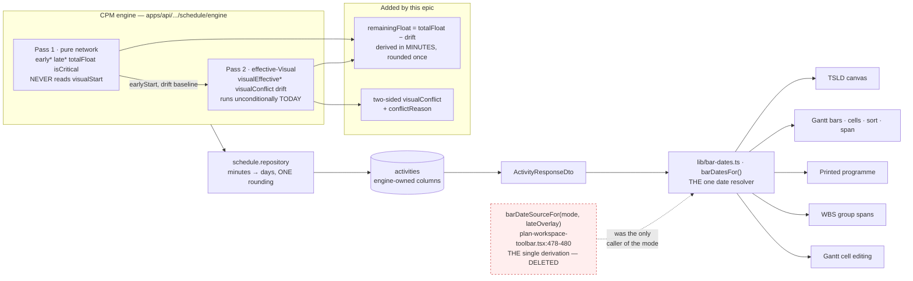
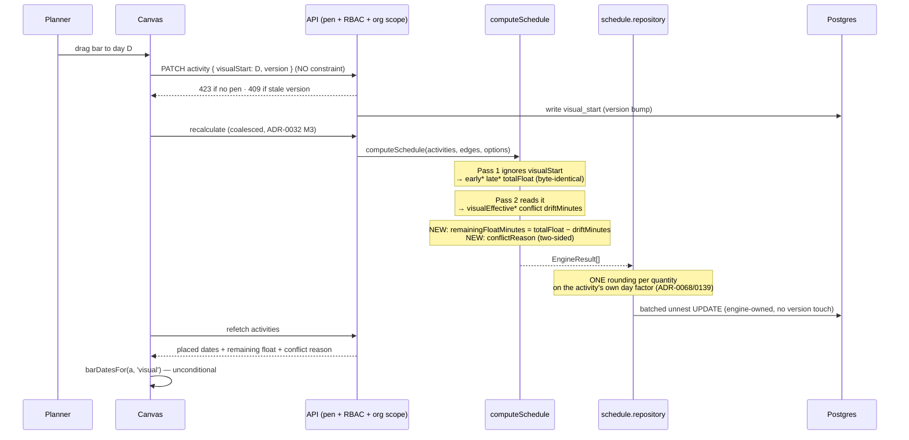
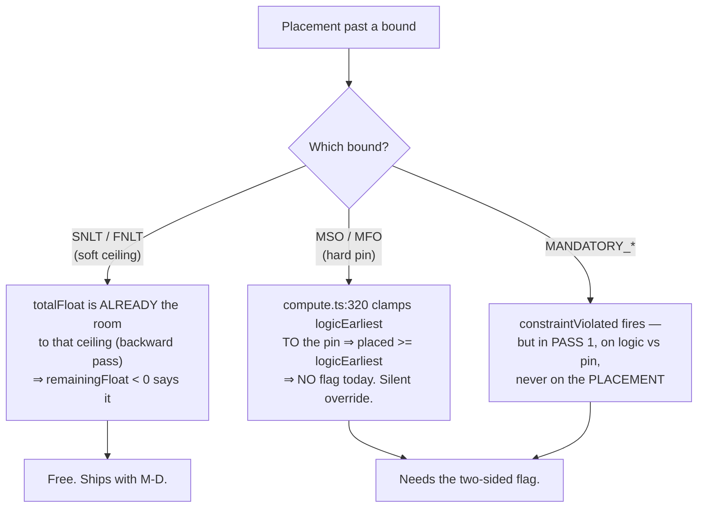
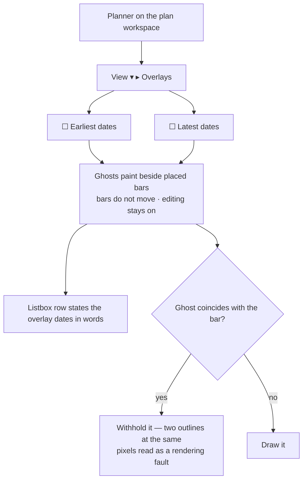

# Feature Spec: One planning surface — Visual is the plan, Early and Late are overlays

- **Status:** Draft
- **Author(s):** feature-analyst (Product Owner / Solution Architect / Technical Lead hats)
- **Date:** 2026-09-20
- **Tracking issue / epic:** _(to be assigned)_
- **Roadmap link:** `docs/ROADMAP.md` — scheduling model (the ADR-0033 line, §53–54)
- **Related ADR(s):** amends **ADR-0033** (D3, D5, D6, D7); amends **ADR-0025** and **ADR-0126**
  (baseline capture); amends **ADR-0050** (mapping contract); touches **ADR-0034** (parity),
  **ADR-0054** (float/drift tails), **ADR-0088** (no flag), **ADR-0140** (the M0 instrument).
  **A new ADR is required** — see §4.9.

---

## 0. Corrections to the brief, before anything rests on it

ADR-0076 §Class 2/3 and `docs/PROCESS.md` "The brief is not evidence either": every
decision-bearing claim in the briefing was re-read against the code. **Five were wrong, and four
of them change the work.** They are recorded here rather than silently fixed, because three of
them make the epic _smaller_ and one makes a milestone _unnecessary_ — and a plan written from the
brief would have built all four.

| #      | The brief said                                                                                                                                    | What the code says                                                                                                                                                                                                                                                                                                                                                                                                                                                                                                                                                                                                                                                                              | Consequence                                                                                                                                                                                                                                                                   |
| ------ | ------------------------------------------------------------------------------------------------------------------------------------------------- | ----------------------------------------------------------------------------------------------------------------------------------------------------------------------------------------------------------------------------------------------------------------------------------------------------------------------------------------------------------------------------------------------------------------------------------------------------------------------------------------------------------------------------------------------------------------------------------------------------------------------------------------------------------------------------------------------- | ----------------------------------------------------------------------------------------------------------------------------------------------------------------------------------------------------------------------------------------------------------------------------- |
| **C1** | "The Gantt does **not** read `visualEffective*` (grep of `apps/web/src/features/gantt` returns nothing)."                                         | The grep is literally true and **the inference is false.** The Gantt reads placed dates through the shared resolver `lib/bar-dates.ts` (`barDatesFor`, `barDateSourceFor`), which `features/gantt` imports by **name, not by field**. It is threaded through the bars (`bar-geometry.ts:52,60`), the **text cells** (`grid-columns.ts:92,100`), the **sort** (`row-model.ts:140-148`), the **framed span** (`row-model.ts:306`), the **printed programme** (`GanttPrintSurface.tsx:150,290`), **cell editing** (`cell-commit.ts:175`) and the **WBS group derivation** (`wbs-groups.ts:77`). This is `docs/TECH_DEBT.md` #135's fix, and `date-source-consistency.test.ts` pins all four sites. | **Milestone "teach the Gantt the placed dates" does not exist.** The Gantt already reads them **conditionally**; the work is deleting the condition at the one derivation site, `plan-workspace-toolbar.tsx:478-480`. This is the single largest scope reduction in the epic. |
| **C2** | Interchange export should "read the placed dates"; `packages/interchange/src` does not reference `visualEffective`.                               | True, **and neither does it reference `earlyStart`, `earlyFinish` or any computed date.** The exporter emits the **network**: durations, constraints, secondary constraints, ALAP, logic, calendars, resources, assignments, progress, and `plan.dataDate` (`export.service.ts:194-226`). The receiving tool recomputes.                                                                                                                                                                                                                                                                                                                                                                        | "Export reads placed dates" is **not a date-column change and cannot be one.** The real defect is different and sharper: **`visualStart` is silently dropped on export and is absent from the mapping contract in both directions.** See §4.6.                                |
| **C3** | "Naming drift to resolve: ADR-0033 D5 says `visualDriftDays`; the engine/test use `visualDriftMinutes`. Check which ships and correct the loser." | **Neither is a loser; they are two layers.** `visualDriftMinutes` is the engine-internal unit (ADR-0036 working minutes, `engine/types.ts:318`); `visualDriftDays` is the persisted column and the wire field (`packages/types/src/index.ts:646`, `activity-response.dto.ts:348`), converted once at `schedule.repository.ts:770-773`. ADR-0033 D5 (`0033-…:103`) names the **wire** field and is correct.                                                                                                                                                                                                                                                                                      | **No rename. Nothing to correct.** Two docblocks in `apps/web/src/config/env.ts:783,790` describe the wire field correctly too. Removing this task.                                                                                                                           |
| **C4** | Inference: an Early-mode drag "writes an SNET that has no effect (a lit-but-inert interaction)".                                                  | **Established: it writes a real, load-bearing SNET** — `use-plan-workspace-model.ts:1109-1110` sends `constraintType: 'SNET', constraintDate: droppedDate`, and `constraints.ts:155-156` applies it as `Math.max(logicEarlyStart, constraint.startAbs)`. So dragging **later** than logic allows **works** and moves the bar. Only dragging **earlier** is inert (the `max` discards it). The same handler's comment records the other half: the write "by design **overwrites any prior constraint**".                                                                                                                                                                                         | Migration is a **real question, not a formality** (§2 US-2, §4.5). Every Early-mode drag in every existing plan has left a constraint in the data that was authored as a _placement_ and will keep behaving as a _contractual lower bound_ after the enum goes.               |
| **C5** | (Implied by Q4) the upper-bound gap is an unflagged hole with no register row.                                                                    | True about the row. But the gap is **against ADR-0033 D5's own accepted text**, which defines `visualConflict` as `(visualStart < effectiveLogicEarliest) OR (a breaks its explicit constraint)` (`0033-…:100-103`). `compute.ts:345` implements the **first disjunct only**. `constraintViolated` does not cover it either: `compute.ts:247-249` fires on `isMandatory(...)` in **Pass 1**.                                                                                                                                                                                                                                                                                                    | The gap is a **decision that was accepted and never built**, which is a stronger argument for building it than a todo. And part of it is answered for free by remaining float — see §4.4.                                                                                     |

**A sixth finding nobody asked about**, and it decides where remaining float is computed:
`totalFloat` and `visualDriftDays` are **independently rounded** day conversions of two minute
quantities against the same per-activity factor (`schedule.repository.ts:752` and `:770-773`,
both `Math.round(x / factorFor(id))`). `round(a/f) − round(b/f)` is not `round((a−b)/f)`, so a
client-side `totalFloat − visualDriftDays` can be **a day out** on any non-24-hour calendar. See
§4.3 — remaining float is derived in minutes, once, server-side.

**A seventh**, measured rather than counted: `VITE_SCHEDULING_MODES` appears **16 times across 15
config files**; **13 of those are live pins to `'false'`**. The other three are docblocks —
`playwright.library.config.ts:13` (prose beside its own pin at `:76`),
`playwright.gantt-editing.config.ts:17-23` (explains why it pins **nothing**) and
`playwright.workspace-chrome.config.ts:8` (explains why it leaves the flag **on**). The brief said
"do not trust a count"; this one is derived, and §4.8 lists all thirteen by name.

---

## 1. Business understanding

### Problem

SchedulePoint asks a planner to choose, per plan, between two incompatible answers to _where is
this bar_: `EARLY` (the CPM earliest dates) and `VISUAL` (where the planner put it). The choice is
`plans.scheduling_mode` (`schema.prisma:715`), default `EARLY`, and it is not a preference — it
changes **what a drag means**, **which dates the Gantt prints**, **which dates a baseline freezes**
and **whether drift is visible at all**.

Three things follow, and none of them was intended:

1. **The product's headline promise is off by default.** ADR-0033's own Consequences call Visual
   Planning "the product's headline promise" (`0033-…:166-167`) and then default it off. A planner
   who never finds the mode selector never uses the Graphical Path Method this application exists
   to implement, and `VITE_SCHEDULING_MODES` is not an operator rollback either (ADR-0088 D1), so
   "default EARLY" is the shipped behaviour for every installation.
2. **Early is not a different scheduling model — it is Visual's resting state.**
   `compute.visual.spec.ts:71-80` asserts that with no `visualStart` anywhere,
   `visualEffectiveStart === earlyStart` and `visualEffectiveFinish === earlyFinish` for **every**
   activity, `visualConflict` false, drift null. The engine has **no** `schedulingMode`: the
   identifier does not occur anywhere under
   `apps/api/src/modules/schedule/engine/` (measured, zero matches). Pass 2 runs unconditionally on
   every recalculation of every plan, today. **So the mode is a client-side render-selector and
   drag-selector over an engine that has already computed both answers.**
3. **The mode is a live defect surface.** A drag in Early mode writes an `SNET` that overwrites
   whatever constraint was there (C4), so "move this bar" and "commit to a contractual earliest
   date" are the same gesture. And `docs/TECH_DEBT.md` #204(c) recorded — then **measured in two
   independent runs** — a WCAG 2.2 §2.4.3 failure caused by nothing but the mode existing: a second
   Planner flipping `schedulingMode` (which needs no pen —
   `assertHoldsPen` appears nowhere in `apps/api/src/modules/plans/`) unmounts `Clear visual start`
   under the first Planner's focus, dropping it to `<body>`.

**Why now.** The product owner's decision, 2026-09-20, in their words: _"early and late planning as
overlays and just one planning portal which is the visual mode."_ The engine, the shared date
resolver (C1) and the drift datum are all already built; what remains is a coherence problem, and
it gets worse with every feature that has to ask which mode it is in.

### Users

All roles are organisation-scoped (ADR-0012/0016). **No role gains or loses a permission** — this
epic removes a setting and changes what existing writes mean; it adds no capability that was not
already reachable in `VISUAL`.

| Role                          | What changes for them                                                                                                                                                                                                                                                                                         |
| ----------------------------- | ------------------------------------------------------------------------------------------------------------------------------------------------------------------------------------------------------------------------------------------------------------------------------------------------------------- |
| **Planner** (primary)         | Drag always hand-places (`visualStart`, no constraint write). Earliest and latest become **ghosts beside** their bars rather than a mode that replaces them. Float on screen becomes **remaining** float. Constraints become something they author deliberately rather than something a drag writes for them. |
| **Contributor**               | Unchanged — progress is not pen-gated (ADR-0060 Q-C) and this epic touches no progress field. Sees the same overlays read-only.                                                                                                                                                                               |
| **Viewer**                    | Sees placed dates everywhere, including the Gantt and the printed programme. Overlays are reads, so Viewers get them (ADR-0080's "selecting is a read", applied to a lens).                                                                                                                                   |
| **Org Admin**                 | As Planner. Loses the plan-settings `Scheduling mode` control.                                                                                                                                                                                                                                                |
| **External Guest** (ADR-0051) | The share view's `SCHEDULE_READ` scope already carries `visualEffective*` (`guest-dto.spec.ts`, `guest-api.ts:230`). A guest currently sees **early** dates for a Visual plan, because `TsldPanel` is mounted there without a mode. That silently corrects. See §2 edge cases.                                |

### Primary use cases

1. **Place work where it will happen.** Drag a bar; it stays where it was dropped; unplaced
   successors move out of its way; nothing writes a constraint.
2. **See how much room is left.** Read the float on the bar and know it is the room remaining
   _after_ the placement, not the room the CPM optimum had.
3. **Check the placement against the arithmetic.** Turn on `Earliest` and/or `Latest` and see
   ghosts beside the placed bars — without the bars moving and without editing being switched off.
4. **Hand the plan to somebody who was not in the room.** The Gantt, the printed programme, the
   exported picture and the baseline comparison all show the same dates the planner placed.
5. **Commit a milestone to a date.** Author an explicit constraint, deliberately, from the activity
   editor — and be told when a placement breaks it.

### User journeys

**Happy path.** Planner opens a plan → takes the pen → drags three bars into the sequence the site
will actually run → each keeps its position, successors shuffle right → the float read-out on each
bar falls by what was spent → the planner turns on `Latest` → ghost tails appear to the right → one
bar's ghost sits **before** its placed bar, so the placement has eaten past the deadline → the
remaining-float read-out on that bar is negative and its conflict cue is lit → the planner drags it
back → the cue clears → switches to Gantt → the grid prints the placed dates → prints the
programme → the QS receives the dates the planner placed.

**Alternate — the migrated plan.** Planner opens a plan built before this epic that was dragged in
Early mode. Its bars sit where they sat (the SNETs still bind — C4). Nothing has moved. The
`Scheduling mode` control is gone. The activity editor shows the SNETs as what they are: authored
constraints, which the planner may now remove if they were only ever a placement. §4.5 and M-A.

**Alternate — the overlay disagrees.** Planner turns on `Earliest`. One bar's ghost is far to the
left: that work could start much sooner. The drift tail (ADR-0054 §4 — already shipped) shows the
gap. The planner decides the placement is right anyway and leaves it. **The tool never moves the
bar** (ADR-0033's stay-and-flag, preserved).

### Expected outcomes

- One answer to "when is this activity", everywhere a reader can reach: canvas, Gantt grid, Gantt
  chart, printed programme, exported picture, CSV, baseline variance, revision comparison, guest
  share view.
- Float on screen means what a planner means by float.
- A drag stops writing constraints. Constraints become authored.
- One less plan-level setting, one less enum, one less `VITE_` flag, thirteen fewer config pins,
  and the dissolution of `docs/TECH_DEBT.md` #204(c)'s **cause** (its symptom is already fixed by
  ADR-0135's focus hand-off; this removes the thing that triggers it).

### Success criteria

Measured, with the bars committed before the harness runs — see `falsification.md`.

- **SC-1** After the epic, `grep -r "schedulingMode\|SchedulingMode\|scheduling_mode" apps/ packages/`
  returns **zero** outside the migration file and its test. Baseline today: 19 files in `apps/api/src`,
  75 in `apps/web/src`.
- **SC-2** `computeSchedule`'s inputs, outputs and golden snapshots are **byte-identical** for
  every conformance fixture — except the deliberate, enumerated additions of M-D (remaining float
  and the two-sided conflict). Judged by the ADR-0034 golden suite. See §4.10 for the parity claim
  in its correct form.
- **SC-3** On a plan with no `visualStart` anywhere, **every** user-visible date is unchanged from
  today's Early rendering. This is the migration's whole safety argument and it is
  `compute.visual.spec.ts:71-80` restated as a product-level assertion.
- **SC-4** A placement past a "no later than" ceiling is visible to the planner — as a negative
  remaining float _and_ a conflict cue — where today it is visible as neither.
- **SC-5** Every canvas Playwright journey runs with placement live (13 configs unpinned), and the
  suite is green. **This is the headline risk, not a footnote** — see §3 and FC-6.

### Open questions

Critical ones are in §6 and want an answer before M-B. Everything else has a stated default below
and does not block.

---

## 2. Functional requirements

### User stories & acceptance criteria

> **US-1** — As a **Planner**, I want every drag to place the bar where I dropped it, so that the
> diagram is a picture of my plan rather than of the arithmetic.
>
> **Acceptance criteria**
>
> - **Given** any plan **when** I drag a bar in time **then** the client sends `visualStart` (and
>   `laneIndex` if the lane changed) through the minimal PATCH, and **no** `constraintType` or
>   `constraintDate` is written.
> - **Given** an activity with an existing authored constraint **when** I drag it **then** that
>   constraint is **unchanged** — the drag neither writes nor clears it. (Today's Early path
>   overwrites it: `use-plan-workspace-model.ts:1058-1059` says so in its own comment.)
> - **Given** I drag a bar **earlier** than its logic allows **then** the bar **stays where I
>   dropped it** and is flagged (ADR-0033 stay-and-flag), rather than snapping back. _This is a
>   behaviour change for every plan that is EARLY today, and it is the point of the epic._
> - **Given** I drag a bar **later** than its logic allows **then** it stays, its unplaced
>   successors move right, and its drift tail grows.
> - **Given** I drag a bar and then press Ctrl+Z **then** the placement is restored to its prior
>   `visualStart` (ADR-0048; the `visualStartCommand` inverse already exists).

> **US-2** — As a **Planner** with a plan built before this epic, I want nothing to move when I
> open it, so that I can trust the upgrade.
>
> **Acceptance criteria**
>
> - **Given** a plan whose activities have no `visualStart` and no drag-authored constraints
>   **when** the epic ships **then** every bar, every grid cell, every printed date and every
>   exported date is **identical** to before.
> - **Given** an activity carrying an `SNET` a drag wrote in Early mode **then** that constraint
>   **still binds** and the bar does not move — and the activity editor shows it as a constraint,
>   which is what it always was in the data.
> - **Given** any pre-epic plan **then** the migration writes **no `visualStart` values**. Nothing
>   is back-filled. (§4.5 — a placement nobody made is not a fact.)

> **US-3** — As a **Planner**, I want the float I read to be the room I have left, so that I can
> tell whether a placement has spent my slack.
>
> **Acceptance criteria**
>
> - **Given** an activity with total float `T` and drift `d` **then** the read-out shows
>   `T − d`, labelled so a reader knows which it is.
> - **Given** an activity with no placement (`visualDriftDays` null) **then** remaining float
>   equals total float, and the read-out is **unchanged from today**. (The null case is not a blank
>   — see Edge cases.)
> - **Given** a placement that spends more than the available float **then** remaining float is
>   **negative** and reads as such (`−3 d`, the existing `formatFloat` convention,
>   `schedule-format.ts:27-31`).
> - **Given** an eight-hour calendar **then** remaining float is derived in **minutes** and rounded
>   **once** — it is never `round(T/f) − round(d/f)` (finding C6).
> - Total float remains available and unchanged wherever it is the right number (the health check's
>   DCMA metrics, ADR-0116; baseline float variance; the float-paths lens).

> **US-4** — As a **Planner**, I want to see the earliest and latest dates **beside** my bars, so
> that I can judge a placement without losing it.
>
> **Acceptance criteria**
>
> - **Given** `Earliest` is on **then** each activity draws a ghost at `earlyStart…earlyFinish`
>   **in its own lane, beside its placed bar**; the placed bar does not move.
> - **Given** `Latest` is on **then** each activity draws a ghost at `lateStart…lateFinish`, same
>   rule.
> - **Given** either or both overlays are on **then editing is fully available** — the pen, the
>   drag, the resize, the link tool, the selection bar. _This amends ADR-0033 D6, which suppresses
>   all editing under the Late overlay (`0033-…:115-118`). See §4.7._
> - **Given** a ghost coincides exactly with the placed bar (drift 0 and float 0) **then** the ghost
>   is **withheld**, not drawn underneath — a ghost the reader cannot distinguish from the bar is
>   noise, and two overlapping outlines at the same pixels read as a rendering fault.
> - **Given** an overlay is on **then** the screen-reader listbox row for each activity states the
>   overlay dates in words (ADR-0026 D7's parallel DOM; ADR-0122's rule that a canvas claim is not
>   an accessible claim).
> - Ghosts are distinguished by **shape** (outline, dash) and not by colour alone (WCAG 1.4.1).

> **US-5** — As a **Planner**, I want a placement that breaks a "no later than" commitment to be
> flagged, so that a deadline I authored is not silently overrun.
>
> **Acceptance criteria**
>
> - **Given** an activity with `SNLT`/`FNLT` **when** I place it past the ceiling **then** it is
>   flagged, with a reason distinguishing it from the existing "earlier than logic allows" case.
> - **Given** an activity with `MSO`/`MFO` **when** I place it away from the pin **then** it is
>   flagged. (Today `compute.ts:320` clamps `logicEarliest` to the pin, so a placement **later**
>   than an `MSO` is `>= logicEarliest` and produces **no** flag — the pin is silently overridden.)
> - **Given** no explicit constraint **then** the new flag never fires.
> - The flag reaches `Next conflict` (ADR-0094's closed `ConflictKey` record is **total**, so a new
>   key is a typecheck failure until its remedy is written — this is a feature, not an obstacle).

> **US-6** — As a **Planner**, I want a baseline to freeze where the work was **placed**, so that
> variance measures what I committed to.
>
> **Acceptance criteria**
>
> - **Given** a capture after this epic **then** the snapshot records the placed dates, and records
>   **which basis** it froze.
> - **Given** a baseline captured before this epic **then** the comparison says what it can and does
>   **not** claim a placed basis it never had. A reader can tell an old baseline from a new one.
> - **Given** an old baseline of a plan that had no placements **then** the comparison is exact,
>   because placed ≡ early for that plan (`compute.visual.spec.ts:71-80`). **This is the case that
>   decides whether the migration is cheap — M0 measures it** (FC-1).

> **US-7** — As a **Planner**, I want an export to carry my placements or tell me it could not, so
> that I find out before the other party opens the file.
>
> **Acceptance criteria**
>
> - **Given** a plan with placements **when** I export **then** the `InterchangeReport` states
>   what happened to them, per the chosen option in §6 CQ-3.
> - **Given** a plan with no placements **then** the export is **byte-identical** to today's.
> - The ADR-0050 mapping-contract table gains `visualStart` in **both** directions — it is absent
>   today, which means the current silent drop is not even a documented approximation.

### Workflows

**Drag** → client PATCHes `{ visualStart, laneIndex?, version }` → 423 if the pen is not held, 409
on a stale version → coalesced auto-recalc (ADR-0032 M3) → engine Pass 1 unchanged, Pass 2 reads
the new placement → repository converts drift and remaining float to days → refetch → canvas,
Gantt and status bar all read `barDatesFor(a, 'visual')`.

**Overlay toggle** → a `View ▾ ▸ Overlays` checkbox → client-only state (URL-backed, per ADR-0053
M6's rule that a filter should survive a reload) → the ghost layer paints from columns already
loaded → **no round trip**.

**Baseline capture** → inside the plan advisory lock the capture already holds → writes placed
dates **and** the basis discriminator, alongside the existing early/late columns.

### Edge cases

| Case                             | Expected behaviour                                                                                                                                                                                                                                                    |
| -------------------------------- | --------------------------------------------------------------------------------------------------------------------------------------------------------------------------------------------------------------------------------------------------------------------- |
| Plan never recalculated          | `visualEffective*` are null. `barDatesFor` returns nulls and the Gantt cell prints `—` (`date-source-consistency.test.ts:98-105` already pins this: "a fallback would print a date the engine never assigned"). **Do not add a fallback to `earlyStart`.**            |
| No placement anywhere            | Everything identical to today (SC-3). Remaining float ≡ total float. Drift tail absent (`geometry.ts:181` returns null for null/≤0 — unchanged).                                                                                                                      |
| Drift is null                    | Remaining float = total float. **Not** a blank and **not** zero: a blank loses a real number and a zero claims a placement.                                                                                                                                           |
| Total float is null (uncomputed) | Remaining float is null → `—` via the existing `formatFloat`.                                                                                                                                                                                                         |
| Negative total float already     | Remaining float is more negative. Reads correctly; no special case.                                                                                                                                                                                                   |
| Milestone (zero duration)        | Ghost is a point, like the bar (`compute.visual.spec.ts:206-213`).                                                                                                                                                                                                    |
| `WBS_SUMMARY`                    | Dates are an engine rollup; the summary is select-only (ADR-0063). Ghosts follow the same rule — drawn, never draggable.                                                                                                                                              |
| LOE                              | Never pushes a successor in Pass 2 either (`compute.ts:311-312`, unchanged).                                                                                                                                                                                          |
| Levelled plan                    | `leveledStart/Finish` are a separate additive overlay (ADR-0041 Q2) and are **out of scope**. Two overlays' interaction is CQ-4's default: levelling wins the bar it already wins today; placement ghosts are unaffected.                                             |
| Guest share view                 | Guest currently sees `early*` for a Visual plan (no mode is threaded; `TsldPanel` is mounted outside the workspace host). After the epic the guest sees placed dates — a **silent correction**, and it must be asserted rather than assumed (`e2e-share`).            |
| Cross-plan / programme           | ADR-0045 derives a downstream bound from the **upstream plan's persisted computed dates**. Which column it reads is a real question and is **CQ-5**; default: unchanged (`early*`), because changing it changes programme arithmetic and belongs in its own decision. |
| Two planners                     | `schedulingMode` is gone, so #204(c)'s trigger is gone with it.                                                                                                                                                                                                       |

### Permissions

No change. `visualStart` rides the existing activity-update gate + org scope + the ADR-0028 pen
(`assertHoldsPen`). **Every write in this epic is structural and pen-gated** — it is the same
write `VISUAL` mode already performs. Overlays are **reads**: not pen-gated, available to Viewers
and to guests (ADR-0080's rule).

`PATCH /organizations/:orgSlug/plans/:planId` loses `schedulingMode` from its accepted body. That
is a **contract narrowing** — §4.4 and CQ-2.

### Validation rules

| Rule                                                   | Where             | Notes                                                                                                                                                                                                                                           |
| ------------------------------------------------------ | ----------------- | ----------------------------------------------------------------------------------------------------------------------------------------------------------------------------------------------------------------------------------------------- |
| `visualStart` is a calendar day or null                | DTO (unchanged)   | Already validated.                                                                                                                                                                                                                              |
| `schedulingMode` is **rejected**                       | `UpdatePlanDto`   | Removing the field makes it an unknown property. **Whether that is a 400 or a silent ignore depends on the global validation pipe's `forbidNonWhitelisted`** — must be read before M-F, not assumed, and stated in the OpenAPI spec either way. |
| Remaining float is derived, never stored from a client | engine/repository | Engine-owned, like every other computed column (ADR-0022).                                                                                                                                                                                      |
| Overlay toggles are client-only                        | URL search params | Typed through the ADR-0123 codec — `?overlay=early,late` is a **string**; do not let a lone `late` become a boolean.                                                                                                                            |

### Error scenarios

| Scenario                                                 | Detection        | User-facing result                                         | Status        |
| -------------------------------------------------------- | ---------------- | ---------------------------------------------------------- | ------------- |
| Drag without the pen                                     | `assertHoldsPen` | "Start editing to move activities" — existing copy         | 423           |
| Stale version on a drag                                  | optimistic lock  | Existing non-destructive conflict message; not re-sent     | 409           |
| Not a member of the organisation                         | org scope        | Uniform not-found (no existence oracle)                    | 404           |
| `schedulingMode` sent by an old client                   | validation pipe  | See Validation above — **must be decided, not discovered** | 400 or ignore |
| Recalculation fails after a drag                         | existing handler | Placement persisted, dates stale, existing message         | 200 + warning |
| Export of a plan with placements, option "reject" (CQ-3) | export service   | Report states the loss before the file is produced         | 200 + report  |

---

## 3. Technical analysis

| Area               | Impact                                          | Notes                                                                                                                                                                                                                                                                                                                                                                                                                                                                |
| ------------------ | ----------------------------------------------- | -------------------------------------------------------------------------------------------------------------------------------------------------------------------------------------------------------------------------------------------------------------------------------------------------------------------------------------------------------------------------------------------------------------------------------------------------------------------- |
| **Frontend**       | **high**                                        | 75 files reference `SCHEDULING_MODES`/`schedulingMode`. But the _shape_ is favourable (C1): one derivation site feeds everything, and most of the 75 are tests. New: a ghost layer (a fifth canvas layer, ADR-0078's `PaintFrame` model), an overlay toggle pair, a remaining-float read-out. Deleted: the mode segmented control, `PlanScheduleSettings`' mode field, the `lateOverlay` view toggle in its current suppress-editing form.                           |
| **Backend**        | **med**                                         | `plans` module loses a settable field and a governance-audit field (`plan-governance-fields.ts` — ADR-0073 C3.2's set is **one `const` the redactor spreads**, so removing a member stops it being recordable in the same commit; that is the designed behaviour, but the **audit history keeps rows naming it**, which is correct and permanent). Baselines module gains capture columns. Interchange gains a report finding.                                       |
| **Database**       | **med — and this is the gate**                  | Three changes: drop `plans.scheduling_mode` + the `SchedulingMode` enum; add placed-date columns + a basis discriminator to `baseline_activities`/`baselines`; **optionally** a `remaining_float` column (or derive at the DTO — CQ-1). **Every one goes through `database-architect`, without exception** (CLAUDE.md §19.3/§20). Dropping an enum in use and dropping a `NOT NULL DEFAULT` column both want the two-release ordering ADR-0107 established.          |
| **API**            | **med**                                         | `PlanResponseDto` loses `schedulingMode` (**breaking**, pre-1.0 → minor, ADR-0010/§10). `ActivityResponseDto` gains `remainingFloatDays` and a conflict reason. `docs/API.md` + OpenAPI in lock-step.                                                                                                                                                                                                                                                                |
| **Security**       | **low**                                         | No new endpoint, no new permission, no new scope. The guest share view's field set is unchanged — it already carries `visualEffective*`. Worth one explicit check that nothing newly exposed reaches `ShareGuestController`'s stripped DTOs.                                                                                                                                                                                                                         |
| **Performance**    | **low, and it must be measured anyway**         | Engine: Pass 2 already runs on every recalculation, so no new pass. Remaining float is one subtraction per activity. **The canvas is the risk**: a ghost layer draws up to 2× the rects. `docs/TECH_DEBT.md` #75 records the painter at 32.2 fps at Fit/2,000 against §9's 30 fps floor — **2.2 fps of headroom**. A naive ghost layer can spend that. FC-5 is the bar and it is the only condition in this epic with a withdrawal clause that can remove a feature. |
| **Infrastructure** | **none**                                        | No new service, no env var, no CI job. Thirteen config pins **deleted**, not added.                                                                                                                                                                                                                                                                                                                                                                                  |
| **Observability**  | **low**                                         | One audit governance field disappears (above). Retention/diagnostics: **one new registry entry** for M0 (ADR-0140), removed or kept per CQ-6.                                                                                                                                                                                                                                                                                                                        |
| **Testing**        | **high — this is the epic's centre of gravity** | See below.                                                                                                                                                                                                                                                                                                                                                                                                                                                           |

### The coverage inversion is the headline risk

ADR-0092 recorded that `e2e-workspace-chrome` is **the first journey in this repository to run in
Visual mode at all**, because the other canvas configs pin the flag off — _"and that is exactly
where a real placement defect was hiding"_ (the `Snap to grid` toggle that had no effect and
rounded a Saturday drop **backwards** to Friday).

Unpinning thirteen configs means **every canvas journey now exercises placement**. That is:

- **an opportunity** — thirteen suites of existing assertions suddenly cover the drag semantics
  that one suite covers today;
- **a risk of exactly the ADR-0084 batch-1 shape** — that retirement retired three flags and CI
  found two of them were pinned off by a whole Playwright config, stranding six editing specs. The
  lesson is explicit in CLAUDE.md: _convert the harness **before** the flag goes._

So the ordering is a hard gate, not a preference: **M-B converts all thirteen configs and proves
them green with placement live, before M-F deletes the flag.** A config that cannot be converted is
a finding to triage, not a config to re-pin.

### Dependencies

- **Nothing must land first.** Every prerequisite is already shipped: the engine's Pass 2, the
  shared `barDatesFor` resolver (C1), the drift datum and its tails (ADR-0054), the `visualStart`
  write path and its undo inverse (ADR-0048), the pen, the diagnostics registry (ADR-0140).
- **`database-architect` is a blocking dependency** for M-A, M-C and M-F.
- **M0 blocks M-C** (the baseline basis default) and **M-A** (whether the migration is a formality).

---

## 4. Solution design

### 4.1 Architecture overview

**The load-bearing fact of this whole design is the one the brief got wrong.** `barDatesFor` is
already the single resolver for every surface that draws or prints a date (C1), and
`plan-workspace-toolbar.tsx:478-480` is its **only** mode-dependent input in the product. So "one
truth downstream" is achieved by **deleting a ternary**, not by threading a new field through six
features. The counterfactual is the ADR-0065 `routeOrthogonal` argument: had `docs/TECH_DEBT.md`
#135 not been fixed in August, this epic would have had to fix it first, and the drift between two
resolvers would have been invisible.

### 4.2 Data flow — a drag, end to end

### 4.3 Remaining float — where it is computed, and why not on the client

**Decision: derive in the engine, in minutes, and convert once in the repository.**

`remainingFloatMinutes = totalFloat − (visualDriftMinutes ?? 0)`, emitted on `EngineResult`;
`schedule.repository.ts` converts it with the **same** `factorFor(activityId)` it already uses for
`totalFloat` and `visualDriftDays` (`:750-754`, `:770-773`).

Three reasons, in order of force:

1. **Correctness (finding C6).** The client only has the two rounded day values. `round(T/f) −
round(d/f)` differs from `round((T−d)/f)` by up to a day on any calendar where `f ≠ 1440`, and
   ADR-0140's first press measured **19 of 164** activities on the deployed installation inheriting
   a non-24-hour plan calendar. This is not hypothetical arithmetic.
2. **One derivation.** The number is wanted on the canvas bar, the Gantt Float column, the
   activities table, the CSV export and the printed programme. Five client derivations of one
   subtraction is the ADR-0065 shape.
3. **It is the same quantity the engine already owns.** `totalFloat` and drift are both
   engine-owned; a third value derived from two engine-owned values belongs beside them.

**Whether it is persisted or computed at the DTO is CQ-1** — both are defensible, the trade is a
column against a read-time derivation, and it is a schema question, so `database-architect`
decides. **Default: persist**, for symmetry with `free_float` (which is exactly this shape: a
second float column the engine derives and the repository day-converts, `:754`) and so the Gantt
can sort on it without the client reconstructing it.

**Naming.** `remainingFloat` on the wire, `remainingFloatDays` if it follows the day-suffix
convention `visualDriftDays`/`durationDays` set. **Not** "free float" — that is taken and means
something else (ADR-0035 §17–§20). The label on screen should say which float it is; a bare
"Float" that silently changed meaning is the defect this register files most often.

### 4.4 The upper-bound conflict — build it, and here is the argument

The brief asks whether the gap gets built here. **Yes, and it is smaller than it looks, because
half of it is a free consequence of remaining float.**

**Four reasons to build it in this epic rather than defer it:**

1. **It is not new scope — it is an accepted decision that was never built.** ADR-0033 D5
   (`0033-…:100-103`) defines `visualConflict` with a second disjunct, "_OR (a breaks its explicit
   constraint)_". `compute.ts:345` implements the first only. Deferring again means deferring a
   decision the product owner already ratified in 2026-07.
2. **Its materiality is created by this epic.** Today a planner who wants a ceiling respected can
   stay in Early mode, where a placement is an `SNET` that cannot pass a ceiling unnoticed because
   the bar simply does not go there. Removing Early removes that escape. The gap goes from "a
   `it.todo` on a mode most plans do not use" to "the only surface, silently overriding pins".
3. **The remedy machinery is already total.** ADR-0094's `Record<ConflictKey, ConflictRemedy>` is a
   **total** record — adding a key is a typecheck failure until its remedy exists, which prevents
   the exact failure of a conflict reaching a planner with nothing behind it.
4. **Deferring it costs a second engine change.** The remaining-float work already opens
   `EngineResult`, the repository's unnest and the golden suite. Two visits to the parity gate for
   one coherent change is the expensive way round.

**What it is:** `visualConflict` stays a boolean (so no consumer breaks) and gains a sibling
`visualConflictReason: 'EARLIER_THAN_LOGIC' | 'LATER_THAN_BOUND' | null`. The upper bound is
derived from the **existing** `clampBackwardFinish`/`clampSecondaryBackwardFinish` — **not** a new
constraint interpretation, which would be a semantics change needing ADR-0035 to move.

**What it is not:** it is **not** a second backward pass. ADR-0033 D5 settled SQ-e — "there is
**no effective backward pass**" — and that stands. This reads a per-activity bound the forward
machinery already resolves.

### 4.5 `schedulingMode` and the drag-authored SNETs — the migration

**Two questions, two different answers, and conflating them is the trap.**

**(a) The enum.** `plans.scheduling_mode` is dropped. Ordered over **two releases**, ADR-0107's
rule that a migration a pristine database cannot test is the dangerous kind:

1. **Release N** — the client stops reading and stops writing it; the DTO stops accepting it; the
   column stays, unread. Deployable and reversible.
2. **Release N+1** — the migration drops the column, then the enum type (Postgres will not drop a
   type still referenced).

Dropping in one release means a rollback to the previous image meets a missing column, which is the
ADR-0107 finding exactly: _a rollback causing a worse outage than the fault._

**(b) The SNETs a drag wrote (finding C4).** These are the real question, and the answer is
**leave every one of them alone.**

- A drag-authored `SNET` is **indistinguishable in the data** from a deliberately authored one.
  There is no provenance column, no audit distinction (`activity.updated` is a content edit and
  ADR-0073 permanently excludes those), and no heuristic that is not a guess. "`constraintDate`
  equals `earlyStart`" matches a deliberate constraint too.
- Converting them to `visualStart` would **change the schedule**: an `SNET` binds successors through
  Pass 1 (`clampForwardStart`), a `visualStart` does not — it only pushes through Pass 2. So a
  conversion moves dates on plans whose owners changed nothing. That is the opposite of US-2.
- Deleting them moves bars.
- So: **nothing is migrated, and the product says so.** A one-time in-app notice on a plan that
  carries constraints is CQ-7's subject; the default is a documented release note plus the activity
  editor, which already shows constraints plainly.

**Nothing is back-filled into `visual_start` either.** `budgetedExpense`'s "0 is a claim" rule
(ADR-0071 M3) generalises: a placement is an assertion that a human put a bar somewhere, and
writing one for every activity in the estate to make a column look tidy is a fabrication at the
scale of the whole installation.

### 4.6 Interchange — the real defect is a silent drop

Given C2, the design is not "export the placed dates". It is:

- **`visualStart` is currently dropped on export with no report finding and no mapping-contract
  row.** A planner exports a Visual plan, the other party opens it, and every bar is at its
  earliest date — a different plan, silently.
- The exporter emits `constraintType`/`constraintDate` already (`export.service.ts:213-214`), so
  the **representation** question is real: P6 and MSPDI have no concept of an advisory placement.
  The honest options are in **CQ-3**.
- Whatever is chosen, **the report says it** (ADR-0050's "best-effort fidelity is reported, never
  silent") and the mapping-contract table gains the row in both directions. Import is symmetric: a
  P6 file has no placement to read, so import writes no `visualStart` — which is a _documented_
  drop rather than the current undocumented one.

**Default (CQ-3 option B): report, do not translate.** Emitting an `SNET` for every placement
would export a **contractual constraint the planner never authored** into somebody else's
scheduling tool — which is ADR-0033's own rejected alternative, verbatim: _"a non-clamping
constraint is `visualStart` in disguise and risks being mistaken for a real SNET in exports/
baselines"_ (`0033-…:146-148`). The ADR rejected the inverse of this for exactly this reason, and
the reasoning survives the epic.

### 4.7 The overlays — ghosts beside the bar, and editing stays on

**This amends ADR-0033 D6, and the amendment is recorded with its reasoning rather than slipped
in.** D6 says Late Start "suppresses all editing while on", on the ground that _"authoring at latest
dates consumes all float (everything becomes critical), so it is deliberately not a mode you build
in"_ (`0033-…:115-118`).

**That reasoning is sound and it is about a mode that moves the bars.** It does not survive the
change: under this design the overlay **draws a ghost beside an unmoved bar**. There is no "the
bar is at its late date, so a drag means place-at-late" ambiguity, because the bar is never at its
late date. A drag with the overlay on means exactly what a drag with it off means. **Suppressing
editing would therefore be suppressing it for a hazard that no longer exists** — and would make the
one lens most likely to prompt an edit the one lens that forbids it.

**Reuse, do not invent** (ADR-0065's rule, and ADR-0054 §4/§5 is the machinery). The float tail and
the drift tail already draw hollow bounded rects from the same `Viewport` (`geometry.ts:145-184`)
behind a lens toggle. The ghost layer is that vocabulary extended, not a parallel one:

- One `ghostRect(bar, start, finish, view)` beside `floatTailRect`/`driftTailRect` in
  `render/geometry.ts`.
- One painter in the ADR-0078 layer model, taking the `PaintFrame`, drawn **before** the bars so a
  ghost can never occlude the thing it describes.
- Colour from the **canvas surface scope** (ADR-0102's finding: `resolveTsldPalette` must read the
  canvas root, not `document.documentElement`, and the `var()`/resolved-value distinction is why
  ADR-0121's stack painted one solid block). A new pair must be in `@theme inline` or it paints
  **nothing at all in a real browser while the contrast gate stays green** (ADR-0100 M4).
- **Shape carries the meaning** (WCAG 1.4.1): earliest = dashed outline leading, latest = dashed
  outline trailing, both hollow. Not two colours.
- The accessible channel is the **listbox row**, not the canvas (ADR-0026 D7, ADR-0122).

### 4.8 Database changes

**Every item below is a proposal for `database-architect`, not a decision.** CLAUDE.md §19.3/§20 is
unconditional, and the judgement about whether a change is small enough to skip the agent is the
judgement the agent exists to make.

| Change                          | Table                 | Shape                                                               | The argument                                                                                                                                                                  |
| ------------------------------- | --------------------- | ------------------------------------------------------------------- | ----------------------------------------------------------------------------------------------------------------------------------------------------------------------------- |
| **Drop** `scheduling_mode`      | `plans`               | Two releases (§4.5a)                                                | Enum type dropped after the column.                                                                                                                                           |
| **Drop** `SchedulingMode` enum  | —                     | Release N+1                                                         | Postgres refuses while referenced.                                                                                                                                            |
| **Add** placed dates            | `baseline_activities` | `placed_start DATE NULL`, `placed_finish DATE NULL`, **no DEFAULT** | ADR-0126's rule: the value is **unknowable** for a pre-existing row, so a DEFAULT would state as history something the capture never saw. `budgetedExpense`'s "0 is a claim". |
| **Add** the basis discriminator | `baselines`           | `date_basis` — **see below**                                        | A count of non-null placed columns cannot distinguish "zero rows" from "nobody looked" (ADR-0126's central rule, and `revision_snapshot_level`'s reason for existing).        |
| **Add** remaining float         | `activities`          | `remaining_float INT NULL` — **CQ-1**                               | Mirrors `free_float` exactly (`:754`). Engine-owned; never from a DTO; outside the version/`updated_at` path.                                                                 |

**The discriminator's default is the one place this epic can be cheaper than ADR-0126, and M0
decides it.** ADR-0126's ten columns took no DEFAULT because their values were unknowable. Here,
`baselineStart`'s basis **is** knowable: `baseline.repository.ts:207-208` writes
`baselineStart: a.earlyStart` **unconditionally, with no branch on `schedulingMode`**, and it is
the only write path. So every pre-existing row froze the early dates — which is a true statement
about every row, exactly the condition that made `hours_per_day_minutes DEFAULT 1440` legal.

`date_basis BaselineDateBasis NOT NULL DEFAULT 'EARLY'` is therefore **defensible**, and it is
**gated on FC-1**: if M0 finds a non-zero count of baselines captured from plans carrying
placements, those rows' `baselineStart` is an early date for a plan whose bars were somewhere else,
and the epic needs the nullable sentinel instead. **One measurement, two migrations, and the
measurement is cheap** — see §4.11.

### 4.9 API changes

| Endpoint                                    | Change                                                                                                                             | Breaking?                            |
| ------------------------------------------- | ---------------------------------------------------------------------------------------------------------------------------------- | ------------------------------------ |
| `GET /organizations/:orgSlug/plans/:planId` | `schedulingMode` **removed** from `PlanResponseDto`                                                                                | **Yes** — pre-1.0, minor bump        |
| `PATCH …/plans/:planId`                     | `schedulingMode` **removed** from `UpdatePlanDto`                                                                                  | **Yes**                              |
| `POST …/plans`                              | same on `CreatePlanDto`                                                                                                            | **Yes**                              |
| `GET …/activities`                          | `+ remainingFloat`, `+ visualConflictReason`                                                                                       | No (additive)                        |
| `GET …/baselines/:id`                       | `+ placedStart`, `+ placedFinish`, `+ dateBasis`                                                                                   | No (additive)                        |
| `GET …/baselines/:id/variance`              | live side reads placed dates; response gains the basis                                                                             | **Behaviourally**, for a placed plan |
| `POST …/export/:format`                     | report gains a placement finding                                                                                                   | No                                   |
| `GET …/schedule/health-check`               | **unchanged** — DCMA metrics read **total** float, and that is correct: DCMA is an assessment of the network, not of the placement | No                                   |

`docs/API.md` and the OpenAPI spec move in the same PR (ADR-0130's finding: `docs/DATABASE.md` got
a full update for a change `docs/API.md` never heard about).

### 4.10 The parity claim, in its correct form

The brief warns against reaching for a stronger claim than the work earns. **This epic cannot use
ADR-0125 D1's strong form** ("`computeSchedule` is not called, not imported and not reachable") —
it calls the engine and it **changes the engine's output type**. So the honest claim has three
parts, and they must not be blurred:

1. **Pass 1 is untouched.** `early*`, `late*`, `totalFloat`, `freeFloat`, `isCritical`,
   `isNearCritical` are byte-identical for every input. Pinned by the existing
   `pureFields` assertion (`compute.visual.spec.ts:55-64,82-96`) and by the ADR-0034 golden suite,
   both of which must pass **unedited** — and needing to edit one is the signal that the milestone
   did more than it says (ADR-0140's acceptance condition, borrowed).
2. **Pass 2's existing outputs are byte-identical.** `visualEffective*`, `visualConflict` (for the
   lower-bound case) and drift are unchanged. The two-sided flag is **additive**: a new reason
   field, and `visualConflict` itself only ever gains `true` where it is `false` today, never the
   reverse — asserted, not assumed.
3. **Two fields are added and the golden suite governs them.** `remainingFloatMinutes` and
   `visualConflictReason` change the golden snapshots. That is a **deliberate, enumerated**
   re-baseline, audited line by line against a written list rather than taken with `-u`
   (ADR-0106's procedure for exactly this).

**The no-placement path is byte-identical end to end** — the third claim collapses to the second
when `visualStart` is null everywhere, because drift is null and remaining float equals total
float. That is SC-3, and it is what makes the migration safe.

### 4.11 M0 — what is measured before anything is built

The brief is right that this repository's strongest recorded lesson is that expectations are
contradicted by their own measurements. Four M0 readings, all of which change decisions:

1. **Does any deployed plan use placement?** Count plans with `scheduling_mode = 'VISUAL'`, and
   separately count activities with `visual_start IS NOT NULL`. The second matters more than the
   first: a plan can be `VISUAL` with no placements (identical to `EARLY`) and — because the column
   is writable in either mode at the API — could in principle carry placements while `EARLY`.
2. **Does any existing baseline need the sentinel?** Count baselines whose source plan carries any
   placement. **Zero ⇒ `DEFAULT 'EARLY'` is provably safe and the migration is a formality**
   (FC-1).
3. **What does the drag-authored-SNET population look like?** Count activities with
   `constraint_type = 'SNET'`. It cannot distinguish provenance (§4.5b) and is not meant to — it
   sizes how many planners will meet §4.5b's release note.
4. **What does a ghost layer cost?** The canvas paint bar, FC-5, on the ADR-0128 staff panel.

**The instrument for 1–3 is ADR-0140's diagnostics registry**, and the fit is exact: _"Adding a
diagnostic is one entry here and nothing else — no controller change, no service change, no screen
change."_ Each question is a `count(*)` denominator plus a numerator with
`affected_plans`/`affected_organizations`, which is the fixed all-numeric row shape clause 3
mandates. The queries take **no caller input**, so ADR-0140's no-oracle property is preserved by
construction. The alternative — `docker compose exec db psql` — is precisely the unreachable
measurement ADR-0128 and ADR-0140 exist to remove, and it cannot be run by the one person with the
data.

**CQ-6 asks whether the entries are removed afterwards.** Default: **keep them, re-natured.**
ADR-0140's `nature` field exists for this — `prospective` while the epic is open, `retrospective`
after, since "whose plan carried a placement before the collapse" is exactly the retrospective
question its two existing entries answer.

### 4.12 Component changes

| Component                            | Change                                                                                                                                                                                                                                                                                                                                            |
| ------------------------------------ | ------------------------------------------------------------------------------------------------------------------------------------------------------------------------------------------------------------------------------------------------------------------------------------------------------------------------------------------------- |
| `lib/bar-dates.ts`                   | `barDateSourceFor(mode, lateOverlay)` **deleted**. `BarDateSource` narrows `'early' \| 'visual' \| 'late'` → **`'visual'` only**, or the parameter goes entirely. **Prefer deleting the parameter**: a one-value union is a seam that invites a second value back, and the 40-odd call sites are a mechanical removal the compiler drives.        |
| `plan-workspace-toolbar.tsx:476-480` | Both derivations deleted. The `schedulingMode` narrowing at `:476` goes with them.                                                                                                                                                                                                                                                                |
| `TsldPanel`                          | Ghost layer mounted; `barDateSource` prop removed; the `barDateSource === 'visual'` guards at `:997` and `:2325` become unconditional.                                                                                                                                                                                                            |
| `render/geometry.ts`                 | `+ ghostRect`, beside the existing tail rects.                                                                                                                                                                                                                                                                                                    |
| `render/paint.ts`                    | One new layer in the ADR-0078 model.                                                                                                                                                                                                                                                                                                              |
| `features/tsld/toolbar`              | Mode segmented control **deleted** (this is ADR-0119's `segment` partition — removing one of its two switches means the group is no longer a partition, so **check `partitionBySegment`'s all-or-nothing precondition still holds**; a partial partition leaves an unnamed region). `Late Start overlay` toggle → `Overlays ▸ Earliest / Latest`. |
| `PlanScheduleSettings`               | Mode field deleted.                                                                                                                                                                                                                                                                                                                               |
| `features/gantt`                     | **No change** (C1) beyond the Float column reading remaining float.                                                                                                                                                                                                                                                                               |
| `lib/schedule-format.ts`             | `formatFloat` gains a sibling or a label parameter — **one formatter**, not a second copy (ADR-0065).                                                                                                                                                                                                                                             |
| `conflict-remedy.ts` / `ConflictKey` | New key + remedy (total record forces it).                                                                                                                                                                                                                                                                                                        |
| `clear-visual-placement`             | Its `isVisible`/applicability gate on Visual mode becomes **unconditional** — it always applies now. This dissolves `docs/TECH_DEBT.md` #204(c)'s cause.                                                                                                                                                                                          |

### 4.13 Implementation approach & alternatives

**Chosen: collapse the selector, keep both engine passes, add the two derived fields, overlay by
ghosts.**

| Alternative                                           | Why not                                                                                                                                                                                                                                                                                                                                                                                                                                            |
| ----------------------------------------------------- | -------------------------------------------------------------------------------------------------------------------------------------------------------------------------------------------------------------------------------------------------------------------------------------------------------------------------------------------------------------------------------------------------------------------------------------------------- |
| **Keep the enum, default it to `VISUAL`**             | Cheapest, and it keeps every defect: the two drag semantics, the two date bases, the 13 config pins, #204(c)'s trigger. It also leaves `EARLY` as a documented mode nobody tests, which is worse than a mode nobody uses.                                                                                                                                                                                                                          |
| **Delete Pass 1**                                     | Catastrophic and tempting. `early*`/`late*`/float/criticality **are** Pass 1; drift is measured from `earlyStart`; the Late overlay reads `late*`; DCMA reads total float; the whole ADR-0034 conformance matrix is Pass 1. Pass 1 is not the "Early mode" being removed — **the mode is a render-selector, the pass is the arithmetic.** Conflating them is the single most dangerous misreading available here, which is why it is written down. |
| **Overlay by moving the bars** (today's Late overlay) | The product owner's decision #3 rejects it, and correctly: a lens that moves the thing you are judging cannot be used to judge a placement. It is also what forced ADR-0033 D6's edit suppression.                                                                                                                                                                                                                                                 |
| **Ghosts in a reserved band below the scene**         | ADR-0127 D2 considered and rejected the analogous design for revision ghosts: a lane is recorded, never guessed, and here the ghost's lane **is** the bar's lane, which is the honest answer. A band also costs canvas height permanently (ADR-0092's whole subject).                                                                                                                                                                              |
| **Remaining float on the client**                     | Finding C6 — wrong by a day on non-24-hour calendars, and five copies.                                                                                                                                                                                                                                                                                                                                                                             |
| **Migrate drag-authored SNETs to `visualStart`**      | §4.5b — indistinguishable from authored constraints, and the conversion **moves dates** on plans nobody changed.                                                                                                                                                                                                                                                                                                                                   |
| **Translate `visualStart` to `SNET` on export**       | §4.6 — ADR-0033 rejected precisely this shape of disguise, and it exports a commitment the planner never made.                                                                                                                                                                                                                                                                                                                                     |
| **Ship behind a `VITE_` flag**                        | ADR-0088 D1: a `VITE_` constant is inlined at build time, `docker-publish.yml` passes none, so every published image carries it at its default and an operator cannot switch it off. A flag here would be a second JSX root maintained forever **plus** a second date basis — the exact thing being deleted. **The rollback is a commit boundary**, and the epic is sliced so each milestone is one.                                               |

**An ADR is required** and should be drafted at M-A. Outline:

> **ADR-01NN — Visual is the plan; Early and Late are overlays.**
> _Context_: the mode is a client-side selector over an engine that computes both, and `EARLY` is
> `VISUAL`'s resting state (`compute.visual.spec.ts:71-80`). _Decisions_: (D1) `schedulingMode` is
> deleted; placed dates are the single downstream truth. (D2) Pass 1 is untouched and is **not**
> "Early mode" — the parity claim is §4.10's three-part form, not ADR-0125 D1's. (D3) Screen float
> is remaining float, derived in minutes and rounded once. (D4) Overlays are ghosts beside unmoved
> bars, **amending ADR-0033 D6** — its edit-suppression reasoning was about a mode that moves bars
> and does not survive a lens that does not. (D5) The two-sided conflict flag builds ADR-0033 D5's
> unbuilt second disjunct. (D6) Drag-authored `SNET`s are **not** migrated, and no `visualStart` is
> back-filled — a placement nobody made is not a fact. (D7) Export reports the placement loss;
> translation to `SNET` is refused on ADR-0033's own rejected-alternative reasoning. (D8) No
> `VITE_` flag (ADR-0088 D1); the thirteen config pins are converted **before** the flag is deleted
> (ADR-0084 batch-1). _Consequences_: one date basis; `docs/TECH_DEBT.md` #204(c)'s cause
> dissolved; thirteen journeys gain placement coverage — which is the largest risk and the largest
> win; two breaking DTO changes; a deliberate golden re-baseline.

---

## 5. Links

- Implementation plan: [`./implementation-plan.md`](./implementation-plan.md)
- Falsification conditions: [`./falsification.md`](./falsification.md) — **committed before any
  harness runs** (ADR-0128's ordering)
- Docs this change updates: `CLAUDE.md` §16, `docs/API.md`, `docs/DATABASE.md`,
  `docs/ROADMAP.md`, `docs/TESTING.md`, `docs/UX_STANDARDS.md`, `docs/DESIGN_SYSTEM.md`,
  ADR-0050's mapping-contract table, `docs/TECH_DEBT.md` (#204(c) cause; the `it.todo` gap closes)

---

## 6. Critical questions

Seven. Everything else in this spec states a default and proceeds.

> _This line read "Six" over a list of seven when the spec was delivered — ADR-0076 Class 1,
> a count nobody re-derived, in the section whose whole job is to be answered exhaustively._

> **CQ-1 — Is remaining float a persisted column or a DTO-time derivation?**
> _Why it matters:_ it is a schema change either way it goes, and it decides whether the Gantt can
> sort on it server-side. **Default: persist**, mirroring `free_float` (`schedule.repository.ts:754`).
> **`database-architect` decides; this spec does not.**

> **CQ-2 — What happens when an old client sends `schedulingMode` after the field is removed?**
> _Why it matters:_ a 400 on a field a previous image sent is a bad upgrade experience; a silent
> ignore is a lie. The answer depends on the global validation pipe's `forbidNonWhitelisted`, which
> **must be read, not assumed**. **Default: whatever the pipe already does, stated explicitly in
> the OpenAPI description** — do not add a bespoke branch.
>
> **ANSWERED 2026-09-20 by reading `apps/api/src/app.module.ts:141-147`.** The global pipe is
> `whitelist: true, forbidNonWhitelisted: true, errorHttpStatusCode: 422`. So an old bundle
> sending `schedulingMode` after the field is removed gets a **422, not a 400** — this question's
> own framing guessed 400, which is why it insisted the pipe be read rather than assumed. No
> bespoke branch; the behaviour is stated in the OpenAPI description. The consequence to carry:
> the host recreates `web` and `api` independently (ADR-0047), so there is a window in which a
> cached bundle's plan-settings save 422s. It is a refusal rather than a silent wrong write,
> which is the right way round, and one reload clears it.

> **CQ-3 — What does an export do with a placement?**
> **(A)** Emit `SNET` at the placed date. Highest fidelity of _position_; exports a contractual
> commitment the planner never made, into somebody else's tool. ADR-0033 rejected this shape by
> name (`0033-…:146-148`).
> **(B)** Drop it and **report it** — the file carries the network, the report says the placements
> did not travel. **Default.**
> **(C)** Emit `SNET` **only when the user opts in** at export time, reported either way (the
> `globalCalendarScope` precedent, ADR-0053 M5).
> _Why it matters:_ it is the only question in this epic where the honest answer produces a
> materially worse deliverable for the recipient, and the product owner may reasonably prefer (C).

> **CQ-4 — Does the epic touch the levelling overlay?**
> _Why it matters:_ `leveledStart/Finish` is a third position for a bar. **Default: no** — out of
> scope, unchanged, ADR-0041 Q2's rule stands. But once Visual is universal, "which of three
> positions is this bar at" is a live question and someone will ask it. Confirm the deferral
> deliberately rather than by omission.

> **CQ-5 — Does cross-plan / programme scheduling read placed dates?**
> _Why it matters:_ ADR-0045 derives a downstream plan's external bound from the **upstream plan's
> persisted computed dates**. If a programme should honour where the upstream planner _placed_ the
> work, that is arguably the whole point of the epic — and it changes programme arithmetic for
> every linked plan. **Default: unchanged (`early*`), deferred to its own decision**, because it is
> a cross-plan semantics change wearing a one-line diff's clothes.

> **CQ-6 — Do the M0 diagnostics entries stay after the epic?**
> **Default: keep, re-natured `retrospective`** — the question "which plans carried a placement
> before the collapse" is exactly what ADR-0140's `nature` field distinguishes. Removing them
> throws away the only cheap way to ask it again.

> **CQ-7 — Does a plan carrying drag-authored `SNET`s get told, in the app?**
> _Why it matters:_ §4.5b leaves them binding and indistinguishable. A planner may be carrying
> constraints they never meant to author. **Default: no in-app notice** — a banner that cannot tell
> a deliberate constraint from a drag-authored one would be a false statement on most plans it
> appeared on, which this register files as a defect class of its own. A release note and the
> activity editor's existing constraint display instead.
