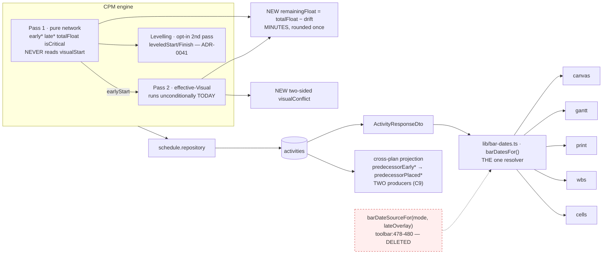
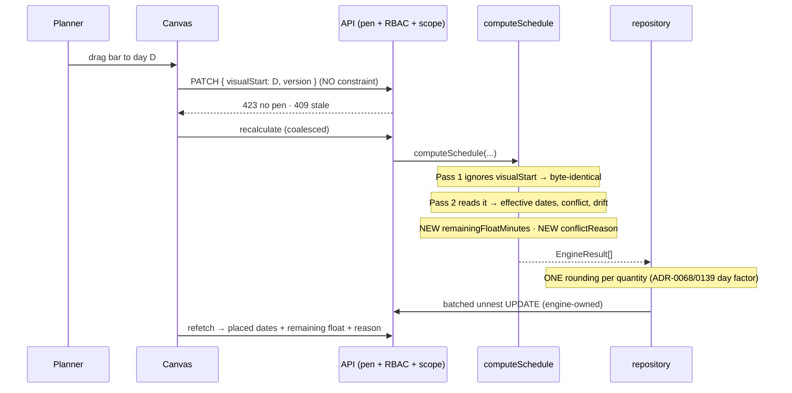
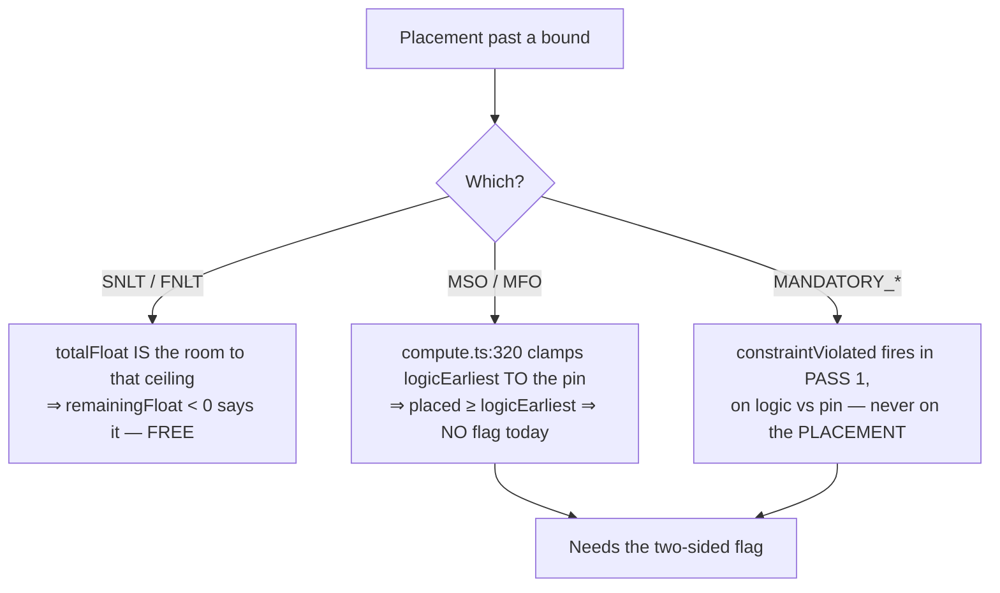
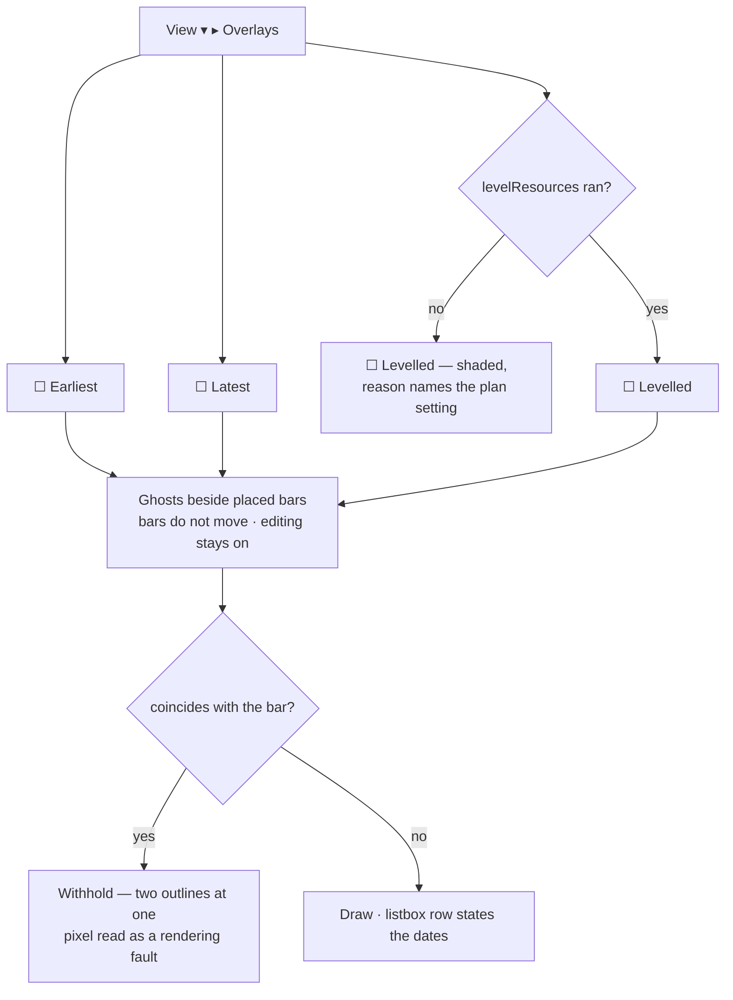
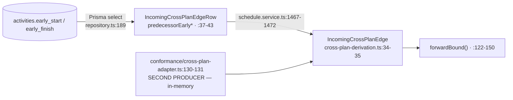

# Feature Spec: One planning surface — Visual is the plan, Early, Late and Levelled are overlays

- **Status:** Draft
- **Author(s):** feature-analyst (Product Owner / Solution Architect / Technical Lead hats)
- **Date:** 2026-09-20 · **Revised 2026-09-20** after the product owner answered §6 (three answers
  went against the stated defaults; everything downstream of them is re-derived, not patched)
- **Tracking issue / epic:** _(to be assigned)_
- **Roadmap link:** `docs/ROADMAP.md` — scheduling model (the ADR-0033 line, §53–54)
- **Related ADR(s):** amends **ADR-0033** (D3, D5, D6, D7); amends **ADR-0025**/**ADR-0126**
  (baseline capture); amends **ADR-0041 Q2** (rendering, not authority); amends **ADR-0045** (the
  upstream basis); amends **ADR-0050** (mapping contract); touches **ADR-0034** (parity),
  **ADR-0054** (tails), **ADR-0088** (no flag), **ADR-0140** (the M0 instrument).
  **A new ADR is required** — see §4.15.

---

## 0. Corrections to the brief, and to this spec's own first draft

ADR-0076 Class 2/3 and `docs/PROCESS.md` "The brief is not evidence either". **Five claims in the
original briefing were wrong (C1–C5 below, plus C6–C7 found while reading). Three more (C8–C10)
were found while re-deriving the product owner's answers, and two of those change a milestone's
size.** Every one is recorded rather than silently fixed.

| #       | Claimed                                                                    | What the code says                                                                                                                                                                                                                                                                                                                                                                                                                                                                                                                                                     | Consequence                                                                                                                                                                                                                                                                                                                                                                                               |
| ------- | -------------------------------------------------------------------------- | ---------------------------------------------------------------------------------------------------------------------------------------------------------------------------------------------------------------------------------------------------------------------------------------------------------------------------------------------------------------------------------------------------------------------------------------------------------------------------------------------------------------------------------------------------------------------- | --------------------------------------------------------------------------------------------------------------------------------------------------------------------------------------------------------------------------------------------------------------------------------------------------------------------------------------------------------------------------------------------------------- |
| **C1**  | The Gantt does **not** read `visualEffective*`.                            | The grep is literally true; **the inference is false.** The Gantt reads placed dates through `apps/web/src/lib/bar-dates.ts` (`barDatesFor`/`barDateSourceFor`), imported **by name, not by field** — bars (`bar-geometry.ts:52,60`), **text cells** (`grid-columns.ts:92,100`), **sort** (`row-model.ts:140-148`), **framed span** (`row-model.ts:306`), **printed programme** (`GanttPrintSurface.tsx:150,290`), **cell editing** (`cell-commit.ts:175`), **WBS spans** (`wbs-groups.ts:77`). TECH_DEBT #135's fix; `date-source-consistency.test.ts` pins all four. | **A milestone does not exist.** "One truth downstream" is deleting one ternary at `plan-workspace-toolbar.tsx:478-480`.                                                                                                                                                                                                                                                                                   |
| **C2**  | Export should "read the placed dates".                                     | The exporter emits **no computed dates at all** — the network, constraints, calendars, progress, `plan.dataDate` (`export.service.ts:194-226`).                                                                                                                                                                                                                                                                                                                                                                                                                        | Not a date-column change. The real defect: **`visualStart` is dropped silently and is absent from ADR-0050's mapping contract in both directions.**                                                                                                                                                                                                                                                       |
| **C3**  | `visualDriftMinutes`/`visualDriftDays` is naming drift; correct the loser. | **Two layers.** Engine minutes (`engine/types.ts:318`) → persisted/wire days (`packages/types/src/index.ts:646`), converted at `schedule.repository.ts:770-773`. ADR-0033 D5 (`:103`) names the wire field correctly.                                                                                                                                                                                                                                                                                                                                                  | No rename. Task deleted.                                                                                                                                                                                                                                                                                                                                                                                  |
| **C4**  | An Early drag writes an SNET "that has no effect".                         | **A real, binding SNET** (`use-plan-workspace-model.ts:1109-1110`), applied as `max(logicEarlyStart, constraintStart)` (`constraints.ts:155-156`). Dragging **later works**; only dragging **earlier** is inert. It **overwrites any prior constraint** (its own comment).                                                                                                                                                                                                                                                                                             | Migration is real — and under CQ-7's answer it is now the epic's one irreversible act. §4.5.                                                                                                                                                                                                                                                                                                              |
| **C5**  | The upper-bound gap is an unfiled todo.                                    | It is **ADR-0033 D5's own accepted second disjunct, never built** (`0033-…:100-103` vs `compute.ts:345`). `constraintViolated` covers **MANDATORY only, in Pass 1** (`compute.ts:247-249`).                                                                                                                                                                                                                                                                                                                                                                            | Stronger argument to build than a todo. §4.4.                                                                                                                                                                                                                                                                                                                                                             |
| **C6**  | —                                                                          | `totalFloat` and `visualDriftDays` are **independently** `Math.round`ed (`schedule.repository.ts:752`, `:770-773`). `round(T/f) − round(d/f) ≠ round((T−d)/f)`. ADR-0140's first press: **19 of 164** deployed activities on a non-24-hour inherited calendar.                                                                                                                                                                                                                                                                                                         | Remaining float derived in **minutes**, rounded once. §4.3.                                                                                                                                                                                                                                                                                                                                               |
| **C7**  | "Do not trust a count" of flag pins.                                       | Derived: **16 occurrences / 15 config files, 13 live pins.** The other three are docblocks.                                                                                                                                                                                                                                                                                                                                                                                                                                                                            | All thirteen listed in FC-6.                                                                                                                                                                                                                                                                                                                                                                              |
| **C8**  | _(CQ-4 assumed levelling had a renderer to fold in.)_                      | **`leveledStart`/`leveledFinish` are rendered by NOTHING.** Three matches in `apps/web/src` and all three are projections, not renderers: `guest-api.ts:230` nulls them, `activity-fixture.ts` is a fixture, `clone-projection.ts` is a field census. No canvas layer, no Gantt column, no table cell, no read-out.                                                                                                                                                                                                                                                    | **CQ-4 is not "fold an existing renderer in". The overlay model is the first renderer levelled dates have ever had** — ADR-0041 shipped the pass and the columns and never the surface. This is the ADR-0067/0070/0071 shape (a field the engine computes, the API exposes, and nothing can display). It makes M-E **larger**, and it brings ADR-0081 into force: entry point and journey required. §4.7. |
| **C9**  | _(CQ-5 asked: column or projection?)_                                      | **A projection over two columns, at four layers, with the basis in the NAME at every one** — `cross-plan-dependency.repository.ts:189` (Prisma `select` of `earlyStart`/`earlyFinish`) → `IncomingCrossPlanEdgeRow.predecessorEarly*` (`:37-43`) → `schedule.service.ts:1467-1472` → `cross-plan-derivation.ts:34-35`, consumed by `forwardBound` (`:122-150`). **And there are TWO producers**: the repository, and `conformance/cross-plan-adapter.ts:130-131`, which builds the same shape from an in-memory map for the programme conformance harness.             | The change is one `select` plus a **rename cascade through three named types** — and the rename is the load-bearing half, because leaving `predecessorEarlyFinish` while feeding it placed dates is the silent-redefinition defect this spec refuses for baselines. **Both producers must move together** or the harness certifies a basis the product does not use. §4.14.                               |
| **C10** | _(CQ-5, the half nobody asked about.)_                                     | The **backward** bound reads the downstream successor's **late** dates (`loadOutgoingWithSuccessorDates`, `:201-206`). **There is no placed-late.** Pass 2 is forward-only and ADR-0033 D5 settled SQ-e — "there is **no effective backward pass**".                                                                                                                                                                                                                                                                                                                   | **The programme change is necessarily asymmetric**: the forward bound becomes placed, the backward bound stays late. Stated explicitly in §4.14, because a reader meeting half a change assumes the other half was forgotten.                                                                                                                                                                             |

**A correction to this spec's own §6, made by the product owner and preserved here**: CQ-2's framing
guessed "400 or a silent ignore". The pipe is `errorHttpStatusCode: 422`
(`app.module.ts:141-147`, verified) — so it is a **422**. §6 also read "Six" over a list of seven,
ADR-0076 Class 1 in the section whose whole job is to be exhaustive.

---

## 1. Business understanding

### Problem

SchedulePoint asks a planner to choose, per plan, between two incompatible answers to _where is
this bar_: `EARLY` and `VISUAL` (`plans.scheduling_mode`, `schema.prisma:715`, default `EARLY`).
It is not a preference — it changes what a drag means, which dates the Gantt prints, which dates a
baseline freezes, and whether drift is visible at all.

1. **The headline promise is off by default.** ADR-0033's own Consequences call Visual Planning
   "the product's headline promise" (`0033-…:166-167`) and default it off; `VITE_SCHEDULING_MODES`
   is not an operator rollback either (ADR-0088 D1).
2. **Early is not a different model — it is Visual's resting state.**
   `compute.visual.spec.ts:71-80`: with no `visualStart` anywhere, `visualEffective*` mirrors
   `early*` for **every** activity. `schedulingMode` does not occur **anywhere** under
   `apps/api/src/modules/schedule/engine/` (zero matches). Pass 2 runs unconditionally today.
3. **The mode is a live defect surface.** A drag writes an `SNET` that overwrites whatever was
   there (C4), so "move this bar" and "commit to a contractual earliest date" are one gesture. And
   `docs/TECH_DEBT.md` #204(c) **measured** a WCAG 2.2 §2.4.3 failure caused by nothing but the
   mode existing — a second Planner flipping it (no pen needed: `assertHoldsPen` appears nowhere in
   `apps/api/src/modules/plans/`) unmounts a control under the first Planner's focus.

**And a fourth, surfaced by the product owner's CQ-4 answer:** a bar already has **three** possible
positions in this system — earliest, placed, and levelled — and the third has been computed,
persisted and exposed since ADR-0041 with **no way to see it** (C8). "Which of three positions is
this bar at" is not a question the epic creates; it is one the product has been unable to answer.

**Why now.** The product owner, 2026-09-20: _"early and late planning as overlays and just one
planning portal which is the visual mode."_

### Users

Organisation-scoped (ADR-0012/0016). **No role gains or loses a permission.**

| Role                          | What changes                                                                                                                                                                                                                                                                                        |
| ----------------------------- | --------------------------------------------------------------------------------------------------------------------------------------------------------------------------------------------------------------------------------------------------------------------------------------------------- |
| **Planner** (primary)         | Drag always hand-places. Earliest, latest **and levelled** become ghosts beside their bars. Float becomes remaining float. Drag-created constraints are stripped once, reported, and reversible in principle.                                                                                       |
| **Contributor**               | Unchanged — progress is not pen-gated (ADR-0060 Q-C). Sees the overlays read-only.                                                                                                                                                                                                                  |
| **Viewer**                    | Placed dates everywhere. Overlays are reads (ADR-0080's "selecting is a read" applied to a lens).                                                                                                                                                                                                   |
| **Org Admin**                 | As Planner; loses the `Scheduling mode` control.                                                                                                                                                                                                                                                    |
| **External Guest** (ADR-0051) | Currently sees **early** dates for a Visual plan (no mode is threaded; `TsldPanel` mounts outside the workspace host). That silently corrects. `guest-api.ts:230` nulls `leveledStart`, so the **levelled overlay is structurally absent for a guest** — correct, and asserted rather than assumed. |

### Primary use cases

1. Place work where it will happen; it stays; successors move out of the way; no constraint written.
2. Read the room that is **left** after the placement.
3. Judge the placement against earliest, latest **and levelled** — ghosts beside unmoved bars, with
   editing never suppressed.
4. Hand the plan on: Gantt, printed programme, export, baseline, **and a linked downstream plan**
   all read the placed dates.
5. Author a constraint deliberately, and be told when a placement breaks it.

### User journeys

**Happy path.** Take the pen → drag three bars into the sequence the site will run → each keeps its
position, successors shuffle right → remaining float falls by what was spent → turn on `Latest` →
one ghost sits **before** its placed bar, so the placement has eaten past the deadline; remaining
float is negative and the conflict cue is lit → drag back → cue clears → turn on `Levelled` → a
third ghost shows where the resource constraint would actually put it → switch to Gantt → the grid
prints the placed dates → print → the QS receives the dates the planner placed.

**Alternate — the migrated plan.** Opens a plan built before this epic. **Its bars are where they
were.** A dock strip says _N activities had a drag-created constraint converted to a placement;
their bars have not moved, and their successors may now show more float._ The planner reads the
list, agrees, dismisses. §4.5.

**Alternate — the programme.** An upstream plan's planner moves a placed bar two weeks later. The
downstream plan's next recalculation pushes its interface activity by two weeks, because the
programme now derives from where the work was **placed** rather than from where it could theoretically
have started. §4.14.

### Expected outcomes

One answer to "when is this activity", everywhere a reader can reach — including across a plan
boundary. Float means what a planner means by float. A drag stops writing constraints, and the ones
it already wrote are cleaned up once, visibly. Levelled dates become visible for the first time.
One less setting, one less enum, one less flag, thirteen fewer config pins, and `docs/TECH_DEBT.md`
#204(c)'s **cause** dissolved.

### Success criteria

Bars committed before the harness runs — see `falsification.md`.

- **SC-1** After the epic, `schedulingMode`/`SchedulingMode`/`scheduling_mode` returns **zero**
  outside the migration and its test. Baseline: 19 files in `apps/api/src`, 75 in `apps/web/src`.
- **SC-2** `computeSchedule`'s Pass 1 is byte-identical for every conformance fixture; Pass 2's
  existing outputs are byte-identical; **two fields are added** under an enumerated re-baseline.
  §4.10.
- **SC-3** On a plan with no `visualStart` **and no stripped constraint**, every user-visible date
  is unchanged. _(Narrowed from the first draft: the strip changes Pass 1 downstream — §4.5.)_
- **SC-4** A placement past a "no later than" ceiling is visible where today it is visible as
  neither a flag nor a number.
- **SC-5** All 13 canvas journeys run with placement live and are green.
- **SC-6** A programme whose upstream plans carry **no** placement produces byte-identical
  downstream bounds. §4.14, FC-9.
- **SC-7** Every stripped constraint is recoverable from a durable record, and the planner is told.
  §4.5, FC-10.

---

## 2. Functional requirements

### User stories & acceptance criteria

> **US-1** — As a **Planner**, I want every drag to place the bar where I dropped it.
>
> - **Given** any plan **when** I drag in time **then** the client sends `visualStart` (+
>   `laneIndex` if changed) and **no** constraint field.
> - **Given** an activity with an authored constraint **when** I drag it **then** that constraint
>   is **unchanged** — today's Early path overwrites it (`use-plan-workspace-model.ts:1058-1059`).
> - **Given** I drag **earlier** than logic allows **then** the bar **stays** and is flagged
>   (stay-and-flag), rather than snapping back. _A behaviour change for every plan that is EARLY
>   today, and the point of the epic._
> - **Given** I drag **later** **then** it stays, unplaced successors move right, drift grows.
> - **Given** I then press Ctrl+Z **then** the prior `visualStart` is restored (ADR-0048's
>   `visualStartCommand` inverse already exists).

> **US-2** — As a **Planner** with a pre-epic plan, I want the constraints my drags created to be
> cleaned up **without my bars moving**, and I want to be told.
>
> _(Rewritten: CQ-7 was answered against the default of leaving them alone.)_
>
> - **Given** an activity whose `SNET` is **binding** (`early_start === constraint_date`) **then**
>   the migration writes `visual_start = constraint_date`, clears the constraint, **and the bar does
>   not move** — because `visualEffectiveStart = placed ?? logicEarliest` and `placed` is exactly
>   where the bar is today.
> - **Given** an activity whose `SNET` is **inert** (`early_start > constraint_date`, logic already
>   pushed it later) **then** it is **left alone**. Converting it would place the bar _earlier_ than
>   logic allows and raise a conflict flag on a plan nobody touched.
> - **Given** an activity whose plan has **never been recalculated** (`early_start` null) **then**
>   it is **left alone and counted** — the binding/inert discriminator is unavailable, and guessing
>   is the failure mode this whole spec is written against.
> - **Given** any stripped constraint **then** its `(activity_id, plan_id, organization_id,
prior_constraint_type, prior_constraint_date)` is written durably **before** the delete.
> - **Given** a plan with stripped constraints **then** the planner sees a dismissible notice
>   stating the count and **naming the consequence**: bars have not moved, successors may now show
>   more float.
> - **Given** a non-`SNET` constraint (`FNET`, `SNLT`, `FNLT`, `MSO`, `MFO`, `MANDATORY_*`) **then**
>   it is **never touched** — a drag has only ever written `SNET`.

> **US-3** — As a **Planner**, I want the float I read to be the room I have left.
>
> - **Given** total float `T` and drift `d` **then** the read-out shows `T − d`, labelled.
> - **Given** no placement (`visualDriftDays` null) **then** remaining float **equals** total float
>   and the read-out is unchanged from today. Not a blank, not a zero.
> - **Given** a placement that overspends **then** remaining float is **negative** (`−3 d`, the
>   existing `formatFloat` convention, `schedule-format.ts:27-31`).
> - **Given** an eight-hour calendar **then** it is derived in **minutes** and rounded **once**.
> - Total float stays available and unchanged where it is the right number: DCMA health metrics
>   (ADR-0116), baseline float variance, the float-paths lens.

> **US-4** — As a **Planner**, I want to see earliest, latest **and levelled** beside my bars.
>
> _(Widened: CQ-4 was answered against the default of deferring levelling.)_
>
> - **Given** any overlay is on **then** each activity draws a ghost **in its own lane, beside its
>   placed bar**; the placed bar does not move.
> - **Given** any overlay is on **then editing is fully available.** _Amends ADR-0033 D6 —
>   §4.7._
> - **Given** two or three overlays are on **then** their ghosts are distinguishable **from each
>   other** and from the bar, by **shape** and not by colour alone (WCAG 1.4.1).
> - **Given** a ghost coincides exactly with the placed bar **then** it is **withheld** — two
>   outlines at the same pixels read as a rendering fault.
> - **Given** `levelResources` has never run on this plan (`leveledStart` null on every activity)
>   **then** the `Levelled` toggle is **shaded with a reason** naming the plan setting (ADR-0082),
>   never silently empty.
> - **Given** levelling **has** run and this activity was not delayed (`leveledStart` non-null,
>   `levelingDelay` 0) **then** the ghost coincides with the bar and is withheld by the rule above
>   — which is a _different fact_ from "levelling never ran" and must not collapse into it.
> - **Given** an overlay is on **then** the listbox row states its dates in words (ADR-0026 D7,
>   ADR-0122).
> - **The levelled overlay does not make levelling authoritative.** ADR-0041 Q2 stands: the network
>   float and criticality remain authoritative and levelled start/finish remain an additive
>   overlay. This gives that overlay a **rendering**, not a promotion.

> **US-5** — As a **Planner**, I want a placement that breaks a "no later than" commitment flagged.
>
> - **Given** `SNLT`/`FNLT` **when** I place past the ceiling **then** flagged, with a reason
>   distinguishing it from "earlier than logic allows".
> - **Given** `MSO`/`MFO` **when** I place away from the pin **then** flagged. _(Today
>   `compute.ts:320` clamps `logicEarliest` **to** the pin, so a placement later than an `MSO`
>   produces **no** flag and the pin is silently overridden.)_
> - **Given** no explicit constraint **then** the new flag never fires.
> - It reaches `Next conflict` — ADR-0094's `Record<ConflictKey, ConflictRemedy>` is **total**, so
>   the key is a typecheck failure until its remedy exists.

> **US-6** — As a **Planner**, I want a baseline to freeze where work was **placed**.
>
> - **Given** a capture after this epic **then** the snapshot records the placed dates **and which
>   basis** it froze.
> - **Given** a pre-epic baseline **then** the comparison says what it can and does **not** claim a
>   basis it never had.
> - **Given** a pre-epic baseline of a plan that had no placements **then** the comparison is exact,
>   because placed ≡ early there. **M0 measures whether any other kind exists** (FC-1).

> **US-7** — As a **Planner**, I want an export to carry my placements or tell me it could not.
>
> _(CQ-3 answered (B).)_
>
> - **Given** placements **when** I export **then** the `InterchangeReport` states that they did not
>   travel and how many there were. The file is **not** given a synthetic `SNET`.
> - **Given** no placements **then** the export is **byte-identical** to today's.
> - ADR-0050's mapping-contract table gains `visualStart` in **both** directions.

> **US-8** — As a **programme planner**, I want a downstream plan to be driven by where the upstream
> work is **placed**, not by where it could theoretically have started.
>
> _(New: CQ-5 answered against the default of deferring.)_
>
> - **Given** an upstream predecessor with a placement **then** the downstream external early-start
>   bound derives from its **placed** finish/start.
> - **Given** an upstream closure with **no** placement anywhere **then** every downstream bound is
>   **byte-identical** to today's (SC-6/FC-9).
> - **Given** the upstream predecessor has never been calculated **then** the bound is reported
>   missing exactly as today (`cross-plan-derivation.ts:128-129`'s `missing: true` path is
>   unchanged).
> - The **backward** bound (external late finish) continues to read the downstream successor's
>   **late** dates, **and the product says so** — there is no placed-late (C10).

> **US-9** — As a **Planner**, I want to know what the migration did to my plan and be able to get
> it back.
>
> - **Given** stripped constraints **then** a dock strip states the count, names the consequence,
>   and links to the affected activities.
> - **Given** I dismiss it **then** it stays dismissed for me, and the record stays.
> - **Given** an Org Admin asks **then** the pre-strip values are retrievable.

### Workflows

**Drag** → PATCH `{ visualStart, laneIndex?, version }` → 423 without the pen, 409 on a stale
version → coalesced auto-recalc → Pass 1 unchanged, Pass 2 reads the placement → repository converts
drift **and remaining float** with one rounding → refetch.

**Overlay toggle** → `View ▾ ▸ Overlays` → client-only, URL-backed → ghosts paint from columns
already loaded → **no round trip**.

**Programme recalc** → unchanged topological pass (ADR-0045) → the upstream projection now carries
placed dates under a renamed field → `forwardBound` unchanged in shape.

**Migration** → measure (M0) → gate (FC-10) → write the durable record → strip → report.

### Edge cases

| Case                                    | Behaviour                                                                                                                                        |
| --------------------------------------- | ------------------------------------------------------------------------------------------------------------------------------------------------ |
| Plan never recalculated                 | `visualEffective*` null → `—` (`date-source-consistency.test.ts:98-105`). **No fallback to `earlyStart`.** Also: excluded from the strip (US-2). |
| No placement anywhere                   | Identical to today. Remaining float ≡ total float.                                                                                               |
| Drift null                              | Remaining float = total float. Not blank, not zero.                                                                                              |
| Total float null                        | Remaining float null → `—`.                                                                                                                      |
| Negative total float                    | Remaining float more negative. No special case.                                                                                                  |
| Milestone                               | Ghost is a point (`compute.visual.spec.ts:206-213`).                                                                                             |
| `WBS_SUMMARY`                           | Engine rollup, select-only (ADR-0063). Ghosts drawn, never draggable.                                                                            |
| LOE                                     | Never pushes a successor in Pass 2 (`compute.ts:311-312`), unchanged.                                                                            |
| **Levelling never ran**                 | `leveledStart` null on every activity → toggle **shaded with a reason**.                                                                         |
| **Levelling ran, activity not delayed** | `leveledStart` non-null, `levelingDelay` 0 → ghost coincides → withheld. **A different fact from the row above**; the two must not collapse.     |
| Guest share view                        | Sees placed dates (a silent correction, asserted in `e2e-share`). Levelled overlay **structurally absent** — `guest-api.ts:230` nulls it.        |
| **Upstream plan with no placement**     | Downstream bounds byte-identical (FC-9).                                                                                                         |
| **Upstream predecessor uncalculated**   | `missing: true` path unchanged.                                                                                                                  |
| **Cross-plan backward bound**           | Reads `late*`, necessarily (C10).                                                                                                                |
| Two planners                            | `schedulingMode` gone; #204(c)'s trigger gone.                                                                                                   |

### Permissions

No change. `visualStart` rides the existing activity-update gate + org scope + the ADR-0028 pen.
Overlays are **reads** — not pen-gated, available to Viewers and guests. The migration report is a
read of the plan. `PATCH …/plans/:planId` loses `schedulingMode` — a **contract narrowing**.

### Validation rules

| Rule                                         | Where             | Notes                                                                                                                                                                        |
| -------------------------------------------- | ----------------- | ---------------------------------------------------------------------------------------------------------------------------------------------------------------------------- |
| `visualStart` is a calendar day or null      | DTO (unchanged)   | Already validated.                                                                                                                                                           |
| `schedulingMode` is **rejected with 422**    | global pipe       | `app.module.ts:141-147` is `whitelist: true, forbidNonWhitelisted: true, errorHttpStatusCode: 422` (**verified**). **No bespoke branch**; stated in the OpenAPI description. |
| Remaining float is derived, never client-set | engine/repository | Engine-owned (ADR-0022).                                                                                                                                                     |
| Overlay toggles are client-only              | URL search params | ADR-0123 codec — `?overlay=early,late,levelled` is a **string**; a lone value must not coerce.                                                                               |
| The strip touches `SNET` only                | migration         | Every other constraint kind is out of scope by construction.                                                                                                                 |

### Error scenarios

| Scenario                                | Detection        | User-facing result                   | Status        |
| --------------------------------------- | ---------------- | ------------------------------------ | ------------- |
| Drag without the pen                    | `assertHoldsPen` | Existing copy                        | 423           |
| Stale version on a drag                 | optimistic lock  | Existing non-destructive message     | 409           |
| Not a member of the organisation        | org scope        | Uniform not-found                    | 404           |
| **Old bundle sends `schedulingMode`**   | global pipe      | Save refused; one reload clears it   | **422**       |
| Recalculation fails after a drag        | existing handler | Placement persisted, dates stale     | 200 + warning |
| Export with placements                  | export service   | Report states the loss and the count | 200 + report  |
| Programme recalc, upstream uncalculated | `forwardBound`   | Bound reported missing, as today     | 200 + flag    |

---

## 3. Technical analysis

| Area               | Impact                        | Notes                                                                                                                                                                                                                                                                                                                                   |
| ------------------ | ----------------------------- | --------------------------------------------------------------------------------------------------------------------------------------------------------------------------------------------------------------------------------------------------------------------------------------------------------------------------------------- |
| **Frontend**       | **high**                      | Favourable shape (C1): one derivation feeds everything. New: a ghost layer with **three** members, three toggles, a remaining-float read-out, a migration notice. **The levelled ghost is a new capability, not a re-render** (C8). Deleted: the mode control, `PlanScheduleSettings`' field, the suppress-editing Late overlay.        |
| **Backend**        | **med-high**                  | `plans` loses a settable + governance-audit field. Baselines gain capture columns. Interchange gains a finding. **Programme gains a basis change across two producers** (C9). **A migration that deletes customer data** (§4.5).                                                                                                        |
| **Database**       | **high — and it is the gate** | Drop `plans.scheduling_mode` + enum; baseline placed columns + basis; remaining float (CQ-1); **a new durable strip record**. **Every one goes through `database-architect`, without exception.**                                                                                                                                       |
| **API**            | **med**                       | Three DTOs lose a field (**breaking**, pre-1.0 → minor). Activities gain two fields. Baselines gain three. A new read for the strip record. `docs/API.md` + OpenAPI in lock-step.                                                                                                                                                       |
| **Security**       | **low**                       | No new permission or scope. The strip record is org-scoped like everything else; it holds no new class of data (a constraint date). Guest field set unchanged.                                                                                                                                                                          |
| **Performance**    | **low, measured anyway**      | Engine: no new pass; one subtraction. **Canvas is the risk and it has grown**: **three** ghost kinds, not two, against `docs/TECH_DEBT.md` #75's **2.2 fps of headroom** at Fit/2,000. FC-5 is re-derived for three.                                                                                                                    |
| **Infrastructure** | **none**                      | No new service, no env var. Thirteen pins **deleted**.                                                                                                                                                                                                                                                                                  |
| **Observability**  | **low-med**                   | One governance field disappears (rows naming it correctly persist). **The strip is invisible to the audit log by construction** — `PATCH …/activities/:activityId` is `REASONS.PLAN_CONTENT` (`audit-coverage.structural.spec.ts:264`, verified), permanently excluded under ADR-0073. That absence is _why_ the durable record exists. |
| **Testing**        | **high**                      | See below.                                                                                                                                                                                                                                                                                                                              |

### Three risks of a different kind from each other

1. **The coverage inversion (unchanged, still the headline).** ADR-0092 records that
   `e2e-workspace-chrome` is the **first journey ever to run in Visual mode** — _"and that is exactly
   where a real placement defect was hiding"_. Thirteen suites are about to exercise placement.
   M-B converts them **before** M-F deletes the flag (ADR-0084 batch-1).
2. **The levelled overlay is dark capability being lit (new, C8).** There is no existing behaviour to
   preserve and therefore **no parity suite to lean on** — the usual safety net for this epic's other
   surfaces does not exist here. ADR-0081 applies in full: entry point named, journey with the
   milestone.
3. **The strip is the epic's one irreversible act (new, CQ-7).** It deletes customer data, it is
   **unauditable by construction**, and its only historic copy is a post-ADR-0126 **FULL**-level
   baseline (`schema.prisma:584-585`, verified) — which covers a minority of activities and **must
   not be assumed**. §4.5 designs the rails; FC-10 gates it on a measurement.

### Dependencies

Nothing must land first — every prerequisite is shipped. **`database-architect` blocks M-A, M-C,
M-F and M-I.** **M0 blocks M-A** (the baseline default) **and M-I** (the strip gate).

---

## 4. Solution design

### 4.1 Architecture overview

### 4.2 Data flow — a drag, end to end

### 4.3 Remaining float — engine, minutes, one rounding

`remainingFloatMinutes = totalFloat − (visualDriftMinutes ?? 0)` on `EngineResult`; the repository
converts with the **same** `factorFor(activityId)` it already uses (`:750-754`, `:770-773`).

1. **Correctness (C6)** — `round(T/f) − round(d/f)` is up to a day wrong on `f ≠ 1440`; ADR-0140
   measured 19 of 164 deployed activities there.
2. **One derivation** — wanted on the bar, the Gantt column, the table, the CSV and the printout.
3. **It is the same quantity the engine already owns.**

Persist-vs-derive is **CQ-1**, unchanged and **`database-architect`'s call**; default persist,
mirroring `free_float` (`:754`). **Not** named "free float" — that is taken (ADR-0035 §17–§20). The
label says _which_ float; a bare "Float" that silently changed meaning is the defect class this
register files most often.

### 4.4 The upper-bound conflict

Build it: it is **ADR-0033 D5's accepted, unbuilt second disjunct**; its materiality is _created_ by
removing the Early escape; ADR-0094's total record prevents a conflict with no remedy; and deferring
costs a second visit to the parity gate.

`visualConflict` stays boolean (no consumer breaks) and gains
`visualConflictReason: 'EARLIER_THAN_LOGIC' | 'LATER_THAN_BOUND' | null`, derived from the
**existing** `clampBackwardFinish`/`clampSecondaryBackwardFinish`. **Not a second backward pass** —
ADR-0033 D5 settled SQ-e and that stands.

### 4.5 The migration — stripping drag-created constraints

**CQ-7 was answered against the default.** The first draft left them alone on the ground that a
drag-authored `SNET` is indistinguishable from an authored one. **That ground is half wrong, and
finding out why is what makes the strip designable.**

#### The discriminator that exists

A drag writes `constraintDate = droppedDate` (`use-plan-workspace-model.ts:1062,1109-1110`), and an
`SNET` is applied as `max(logicEarlyStart, constraintStart)` (`constraints.ts:155-156`). So:

| Class       | Test                              | What it means                                         | Action                                                                                                                     |
| ----------- | --------------------------------- | ----------------------------------------------------- | -------------------------------------------------------------------------------------------------------------------------- |
| **Binding** | `early_start === constraint_date` | The SNET **is** what puts the bar there.              | **Convert**: write `visual_start = constraint_date`, clear the constraint.                                                 |
| **Inert**   | `early_start > constraint_date`   | Logic already pushed it later; the SNET does nothing. | **Leave alone.** Converting would place the bar _earlier than logic allows_ and raise a conflict on a plan nobody touched. |
| **Unknown** | `early_start IS NULL`             | Never recalculated.                                   | **Leave alone, count, report.**                                                                                            |

This does not identify _provenance_ and does not need to: it identifies **effect**, which is what
the conversion has to preserve.

#### Why the bar does not move

Today, binding: `earlyStart = constraintDate`, bar at `constraintDate`.
After: no constraint, so Pass 1's `earlyStart` falls back to logic-earliest; `visualStart =
constraintDate`, so Pass 2 gives `display = placed = constraintDate`. **Same pixel.** And
`visualConflict = placed < logicEarliest` is **false**, because `placed` is later.

#### What _does_ change, and this is the half a careless reading misses

An `SNET` binds through **Pass 1**. A `visualStart` does not — it pushes only through Pass 2. So
after the strip, **downstream `early*` move earlier, total float grows, criticality can change, the
critical path can change, and the project finish can move earlier.**

**The bars stay put; the arithmetic changes.** Three consequences, stated rather than discovered:

- **SC-3 is narrowed** to plans with no placement **and no stripped constraint**. FC-7 cannot cover
  the stripped population, and FC-10 covers it on a _bars_ bar rather than a _float_ bar.
- The DCMA health check, the float-paths lens and baseline float variance will all read differently
  on a migrated plan. That is **correct**: a drag-created SNET was never a network commitment, and
  its Pass-1 effect was suppressing float the plan really had. The strip **restores float that was
  never genuinely constrained** — which is the strongest argument for doing it at all.
- A migrated plan compared against a pre-migration baseline will show a float variance. The
  comparison must not read that as slippage; it is a basis change, and §4.8's `date_basis` is the
  vocabulary for saying so.

#### Rails, because this deletes customer data

1. **It is unauditable by construction.** `PATCH …/activities/:activityId` is `REASONS.PLAN_CONTENT`
   (`audit-coverage.structural.spec.ts:264`, verified) — permanently excluded under ADR-0073's
   content-edit rule. Nothing in `audit_events` will ever record a stripped constraint. **That
   absence is the reason the durable record exists**, not an oversight to work around.
2. **The only historic copy is a FULL baseline.** ADR-0126 froze `constraint_type`/`constraint_date`
   at FULL level (`schema.prisma:584-585`, verified) and `revision_snapshot_level` (`:1882`)
   distinguishes FULL from NONE. Coverage is a **minority** and **must not be assumed** — a plan
   with no post-ADR-0126 FULL baseline has no copy at all.
3. **So the migration writes its own record, before deleting.** A narrow, write-once
   `placement_migration_log`: `(activity_id, plan_id, organization_id, prior_constraint_type,
prior_constraint_date, migrated_at)`. **`activity_id` is a reference, not a foreign key** — the
   ADR-0025 `source_activity_id` precedent, which also avoids the RESTRICT-FK trap that broke 557 of
   587 API e2e tests when ADR-0126 added a fourth child table off `baseline`. It survives the
   activity being deleted, which is exactly when somebody will want it.
   _Rejected: capturing a FULL baseline instead._ It reuses shipped machinery, but a capture is a
   **service** operation needing a computed schedule and the plan lock, and a migration is SQL;
   ADR-0025's one-active-per-plan invariant would also have to be dodged. The mismatch is worse than
   the table.
4. **The planner is told, after the fact, with a number they can act on.** A dock strip (ADR-0092's
   outlet — 0 px of canvas): _"N activities had a drag-created constraint converted to a placement.
   Their bars have not moved. Their successors may now show more float."_ Derived from the log,
   dismissed per-user in `localStorage` keyed by user id (ADR-0098's "Jump back in" precedent;
   sign-out sweeps it).
   _Rejected: a plan note (ADR-0046)._ Durable and visible, but a note needs an author and a
   migration has no user.
5. **It is gated on a measurement, not on confidence.** FC-10.

### 4.6 Interchange — report, do not translate

**CQ-3 answered (B).** `visualStart` is dropped and **reported**; the mapping-contract table gains
it in both directions. Translating to `SNET` is refused on ADR-0033's own words: _"a non-clamping
constraint is `visualStart` in disguise and risks being mistaken for a real SNET in exports/
baselines"_ (`0033-…:146-148`) — and it would export a commitment the planner never made. Import is
symmetric: a P6 file has no placement, so import writes none, as a **documented** drop.

### 4.7 The overlay model — three members

**CQ-4 was answered against the default**, and C8 changes what that answer costs: levelled dates
have **no renderer anywhere in the product**, so this is not folding an existing surface into a
model — it is **the first time a planner can see them at all.**

**This amends ADR-0033 D6**, which suppresses editing under the Late overlay because _"authoring at
latest dates consumes all float"_ (`0033-…:115-118`). Sound — **about a mode that moves the bars.**
Under a lens that draws a ghost beside an unmoved bar, a drag means exactly what it means with the
lens off, so suppressing editing would suppress it for a hazard that no longer exists, on the one
lens most likely to prompt an edit.

**It does not amend ADR-0041 Q2's authority rule, and the ADR must say so in those words.** Network
float and criticality stay authoritative; levelled start/finish stay an additive overlay. This gives
that overlay a **rendering**, not a promotion. A reader who meets a levelled ghost beside a placed
bar will otherwise conclude levelling has become a third authoring mode.

**One model, three members** — `OverlayKind = 'earliest' | 'latest' | 'levelled'`, each a
`{ start, finish }` pair read from columns already loaded:

| Member     | Source columns                   | Absent when                      |
| ---------- | -------------------------------- | -------------------------------- |
| `earliest` | `earlyStart` / `earlyFinish`     | never calculated                 |
| `latest`   | `lateStart` / `lateFinish`       | never calculated                 |
| `levelled` | `leveledStart` / `leveledFinish` | **the levelling pass never ran** |

**The levelled member's two absences are different facts and must not collapse.** Verified:
`goldens.ts:628-635` shows an _undelayed_ activity receiving `leveledStart` with `levelingDelay: 0`
when the pass runs, and `schedule.repository.ts:776-777` writes all-null when levelling is off. So
`leveledStart === null` ⇔ **the pass did not run**, and that is representable — unlike ADR-0126's
case. **Assert it rather than assume it**, because the whole toggle state depends on it:

- pass never ran → toggle **shaded with a reason** naming the plan setting (ADR-0082);
- pass ran, activity undelayed → ghost coincides → **withheld** by the coincidence rule.

**Reuse, do not invent** (ADR-0065): one `ghostRect(bar, start, finish, view)` beside
`floatTailRect`/`driftTailRect` (`geometry.ts:145-184`), **one** painter in the ADR-0078 layer model
taking the `PaintFrame`, drawn **before** the bars so a ghost never occludes its subject. **A
per-member painter is the drift this argument exists to prevent.**

**Three kinds must be distinguishable from each other by shape**, not colour (WCAG 1.4.1, and FC-8
now has three-way clauses): earliest = dashed outline, leading; latest = dashed outline, trailing;
levelled = **dotted** outline with a distinct stroke rhythm. Colour resolves from the **canvas
surface scope** (ADR-0102), and the pair must be in `@theme inline` or it paints **nothing at all in
a browser while the contrast gate stays green** (ADR-0100 M4) — and a `var()` handed to `fillStyle`
is **discarded silently, keeping the previous colour** (ADR-0121).

### 4.8 Database changes

**Every item is a proposal for `database-architect`, not a decision** (CLAUDE.md §19.3/§20).

| Change                   | Table                             | Shape                                                                                                                   | Argument                                                                                                                |
| ------------------------ | --------------------------------- | ----------------------------------------------------------------------------------------------------------------------- | ----------------------------------------------------------------------------------------------------------------------- |
| Drop `scheduling_mode`   | `plans`                           | two releases                                                                                                            | ADR-0107: a rollback meeting a missing column is worse than the fault.                                                  |
| Drop `SchedulingMode`    | —                                 | release N+1                                                                                                             | Postgres refuses while referenced.                                                                                      |
| Add placed dates         | `baseline_activities`             | `placed_start`/`placed_finish` `DATE NULL`, **no DEFAULT**                                                              | Unknowable for a pre-existing row (ADR-0126; `budgetedExpense`'s "0 is a claim").                                       |
| Add basis                | `baselines`                       | `date_basis` — **default gated on FC-1**                                                                                | A row count cannot distinguish "zero rows" from "nobody looked".                                                        |
| Add remaining float      | `activities`                      | `remaining_float INT NULL` — **CQ-1**                                                                                   | Mirrors `free_float` (`:754`). Engine-owned.                                                                            |
| **Add the strip record** | **new** `placement_migration_log` | `activity_id` **non-FK**, `plan_id`, `organization_id`, `prior_constraint_type`, `prior_constraint_date`, `migrated_at` | §4.5 rail 3. Non-FK is the ADR-0025 `source_activity_id` precedent **and** avoids ADR-0126's RESTRICT trap. Write-once. |

**The basis default is the one place this epic can be cheaper than ADR-0126, and M0 decides it.**
`baseline.repository.ts:207-208` writes `baselineStart: a.earlyStart` **unconditionally, with no
branch on the mode**, and is the only write path — so `'EARLY'` is **true of every pre-existing
row**, which is exactly the condition that made `hours_per_day_minutes DEFAULT 1440` legal. If FC-1
reading 3 is non-zero, the DEFAULT is withdrawn for the nullable sentinel.

### 4.9 API changes

| Endpoint                                      | Change                                                                                            | Breaking?                 |
| --------------------------------------------- | ------------------------------------------------------------------------------------------------- | ------------------------- |
| `GET …/plans/:planId`                         | `schedulingMode` **removed**                                                                      | **Yes** (pre-1.0 → minor) |
| `PATCH …/plans/:planId`, `POST …/plans`       | `schedulingMode` **removed** → **422**                                                            | **Yes**                   |
| `GET …/activities`                            | `+ remainingFloat`, `+ visualConflictReason`                                                      | No                        |
| `GET …/baselines/:id`                         | `+ placedStart`, `+ placedFinish`, `+ dateBasis`                                                  | No                        |
| `GET …/baselines/:id/variance`                | live side reads placed; response carries the basis                                                | Behaviourally             |
| `POST …/export/:format`                       | report gains a placement finding                                                                  | No                        |
| **`GET …/plans/:planId/placement-migration`** | **new** — the strip report                                                                        | No                        |
| `GET …/schedule/health-check`                 | **unchanged** — DCMA reads **total** float, correctly: it assesses the network, not the placement | No                        |

### 4.10 The parity claim, in its correct form

**This epic cannot use ADR-0125 D1's strong form** — it calls the engine _and_ changes its output
type. Three parts, not to be blurred:

1. **Pass 1 is untouched.** Byte-identical for every input, pinned by the existing `pureFields`
   assertion (`compute.visual.spec.ts:55-64,82-96`) and the golden suite, both passing **unedited** —
   needing to edit one is the signal the milestone did more than it says.
2. **Pass 2's existing outputs are byte-identical.** The two-sided flag is additive; `visualConflict`
   only ever gains `true` where it is `false` today.
3. **Two fields are added** under an **enumerated** re-baseline, audited line by line against a
   written list, never `-u` (ADR-0106).

**The no-placement path is byte-identical end to end** — claim 3 collapses to claim 2 when
`visualStart` is null everywhere. That is SC-3 and it is the migration's safety argument, **now
qualified**: it holds for plans with no stripped constraint (§4.5).

### 4.11 M0 — what is measured before anything is built

Six readings. The instrument for 1–5 is **ADR-0140's diagnostics registry** (_"adding a diagnostic is
one entry here and nothing else"_), whose fixed all-numeric row shape each question already fits and
whose no-caller-input rule keeps the no-oracle property by construction. The alternative — `psql` —
is the unreachable measurement ADR-0128 and ADR-0140 exist to remove.

1. Plans with `scheduling_mode = 'VISUAL'`.
2. Activities with `visual_start IS NOT NULL`. **Matters more than 1** — a plan can be `VISUAL` with
   no placements, and `visualStart` is accepted **regardless of the plan's mode**
   (`activities.service.ts:388`, `:526-528` — verified, no mode check).
3. Baselines whose source plan carries any placement → **the `date_basis` DEFAULT** (FC-1).
4. **Activities with `constraint_type = 'SNET'`, split binding / inert / unknown** (§4.5) → **the
   strip population** (FC-10).
5. **Of the binding set, how many are covered by a post-ADR-0126 FULL baseline** → how much of the
   strip has a second copy already.
6. **The ghost layer's paint cost, for three members** (FC-5) — on the product owner's hardware
   through the ADR-0128 panel, never a container (ADR-0127 D8 disqualified that environment by name).

**CQ-6: the entries stay, re-natured `retrospective`.**

### 4.12 Component changes

| Component                            | Change                                                                                                                                                                                         |
| ------------------------------------ | ---------------------------------------------------------------------------------------------------------------------------------------------------------------------------------------------- |
| `lib/bar-dates.ts`                   | `barDateSourceFor` **deleted**. **Prefer removing the `source` parameter** over narrowing to one value — a one-value union invites a second back, and the compiler drives the ~40 sites.       |
| `plan-workspace-toolbar.tsx:476-480` | Both derivations deleted.                                                                                                                                                                      |
| `TsldPanel`                          | Ghost layer mounted; `barDateSource` prop removed; the `=== 'visual'` guards at `:997`, `:2325` become unconditional.                                                                          |
| `render/geometry.ts`                 | `+ ghostRect` beside the existing tails.                                                                                                                                                       |
| `render/paint.ts`                    | **One** layer, three members.                                                                                                                                                                  |
| `features/tsld/toolbar`              | Mode control **deleted** — re-check ADR-0119's `partitionBySegment` all-or-nothing precondition still holds with one switch. `Late Start overlay` → `Overlays ▸ Earliest / Latest / Levelled`. |
| `PlanScheduleSettings`               | Mode field deleted.                                                                                                                                                                            |
| `features/gantt`                     | **No change** (C1) beyond the Float column reading remaining float.                                                                                                                            |
| `lib/schedule-format.ts`             | One labelled sibling to `formatFloat`, not a second copy.                                                                                                                                      |
| `conflict-remedy.ts`                 | New key + remedy (total record forces it).                                                                                                                                                     |
| `clear-visual-placement`             | Unconditional — dissolves #204(c)'s cause.                                                                                                                                                     |
| **new** `PlacementMigrationNotice`   | Dock strip (ADR-0092 outlet, 0 px of canvas).                                                                                                                                                  |

### 4.13 Alternatives considered

| Alternative                                | Why not                                                                                                                                                                                                                                         |
| ------------------------------------------ | ----------------------------------------------------------------------------------------------------------------------------------------------------------------------------------------------------------------------------------------------- |
| Keep the enum, default `VISUAL`            | Keeps every defect: two drag semantics, two bases, 13 pins, #204(c)'s trigger, and `EARLY` as a mode nobody tests.                                                                                                                              |
| **Delete Pass 1**                          | Catastrophic and tempting. Pass 1 **is** the float, criticality, Late dates, the drift baseline, DCMA and the whole ADR-0034 matrix. **The mode is a render-selector; the pass is the arithmetic.** Written down because it reads as a tidy-up. |
| Overlay by moving the bars                 | Rejected by the product owner, correctly: a lens that moves what you are judging cannot judge it. It is also what forced ADR-0033 D6.                                                                                                           |
| Ghosts in a band below the scene           | ADR-0127 D2 rejected the analogue: the lane is recorded, never guessed, and here the ghost's lane **is** the bar's. A band also costs canvas height permanently (ADR-0092).                                                                     |
| A painter per overlay member               | Three near-identical painters drift, and the drift is invisible because each looks right alone (ADR-0065, ADR-0121).                                                                                                                            |
| Remaining float on the client              | C6 — a day wrong on non-24-hour calendars, in five copies.                                                                                                                                                                                      |
| **Leave drag-created SNETs alone**         | The first draft's default, **overturned**. It leaves every migrated plan carrying network constraints nobody authored, suppressing float the plan really has, permanently and invisibly.                                                        |
| **Strip _all_ SNETs**                      | Would convert inert ones too, placing bars _earlier than logic allows_ and raising conflicts on plans nobody touched. The binding/inert test is what makes the strip safe.                                                                      |
| Translate `visualStart` → `SNET` on export | §4.6 — ADR-0033 rejected this shape by name; it exports an unauthored commitment.                                                                                                                                                               |
| **Leave the programme on early dates**     | The first draft's default, **overturned**: a programme that ignores where the upstream work was placed answers the question the epic exists to fix with the old answer.                                                                         |
| A `VITE_` flag                             | ADR-0088 D1 — inlined at build time, `docker-publish.yml` passes none, so no operator can switch it off. The rollback is a commit boundary.                                                                                                     |

### 4.14 The programme — the upstream basis

**CQ-5 was answered against the default.** ADR-0045 derives a downstream plan's external early-start
bound from the upstream plan's persisted computed dates; it now derives from the **placed** ones.

**The shape, verified (C9).** It is a projection over two columns at four layers, with the basis in
the **name** at every one:

**Three consequences, each of which would be a defect if left implicit:**

1. **The rename is the load-bearing half.** Leaving `predecessorEarlyFinish` while feeding it placed
   dates is the silent-redefinition defect this spec refuses for `baselineStart`. The three named
   types are renamed (`predecessorPlacedStart/Finish`) so a reader of any layer knows the basis.
   `forwardBound`'s arithmetic is untouched.
2. **Both producers move together.** `cross-plan-adapter.ts:130-131` builds the same shape from an
   in-memory map for the programme conformance harness. Move one and the harness certifies a basis
   the product does not use — green, and wrong.
3. **The change is necessarily asymmetric (C10).** The backward bound reads the downstream
   successor's **late** dates (`:201-206`), and **there is no placed-late**: Pass 2 is forward-only
   and ADR-0033 D5 settled SQ-e. So the forward bound becomes placed and the backward bound stays
   late, **and the ADR says so** — a reader meeting half a change otherwise assumes the other half
   was forgotten.

**It gets its own milestone and its own falsification condition** (M-H, FC-9), because it alters the
arithmetic of every linked plan and its blast radius is not this epic's other surfaces. FC-9 is
FC-7's shape one boundary out: a programme whose upstream plans carry **no** placement must produce
**byte-identical** downstream bounds.

### 4.15 The ADR

> **ADR-01NN — Visual is the plan; Early, Late and Levelled are overlays.**
> _Context_: the mode is a client-side selector over an engine that computes both, and `EARLY` is
> `VISUAL`'s resting state. _Decisions_: **(D1)** `schedulingMode` deleted; placed dates are the
> single downstream truth. **(D2)** Pass 1 untouched and **not** "Early mode" — the parity claim is
> §4.10's three-part form, not ADR-0125 D1's. **(D3)** Screen float is remaining float, in minutes,
> rounded once. **(D4)** Overlays are ghosts beside unmoved bars, **amending ADR-0033 D6** — its
> suppression reasoning was about a mode that moves bars. **(D5)** The two-sided conflict flag builds
> ADR-0033 D5's unbuilt second disjunct. **(D6)** Drag-created `SNET`s are **stripped** on the
> binding/inert test, recorded durably first, reported after — **and the strip changes Pass 1
> downstream while leaving every bar in place**, which is the point rather than a side effect.
> **(D7)** Export reports the placement loss; translation is refused on ADR-0033's own rejected-
> alternative reasoning. **(D8)** No `VITE_` flag; the thirteen pins convert **before** the flag goes.
> **(D9)** **Levelled joins the overlay model as a renderer, not as an authority** — ADR-0041 Q2's
> rule that network float and criticality stay authoritative is **not** overturned; this is the
> first renderer those columns have ever had. **(D10)** The programme's **forward** bound derives
> from placed dates across **both** producers, with the named projection renamed; the **backward**
> bound stays on late dates **because there is no placed-late**.
> _Consequences_: one basis; #204(c)'s cause dissolved; thirteen journeys gain placement coverage;
> two breaking DTO changes; a deliberate golden re-baseline; one irreversible-in-effect migration
> with a durable record, gated on a measurement.

---

## 5. Links

- Implementation plan: [`./implementation-plan.md`](./implementation-plan.md)
- Falsification conditions: [`./falsification.md`](./falsification.md) — **committed before any
  harness runs** (ADR-0128's ordering)
- Docs updated: `CLAUDE.md` §16, `docs/API.md`, `docs/DATABASE.md`, `docs/ROADMAP.md`,
  `docs/TESTING.md`, `docs/UX_STANDARDS.md`, `docs/DESIGN_SYSTEM.md`, ADR-0050's mapping-contract
  table, `docs/TECH_DEBT.md` (#204(c) cause; the `it.todo` gap closes)

---

## 6. Critical questions

Seven. **All seven are now answered** (2026-09-20). Everything else in this spec states a default
and proceeds.

> _This line read "Six" over a list of seven when the spec was delivered — ADR-0076 Class 1,
> a count nobody re-derived, in the section whose whole job is to be answered exhaustively._

> **CQ-1 — Is remaining float a persisted column or a DTO-time derivation?**
> _Why it matters:_ it is a schema change either way it goes, and it decides whether the Gantt can
> sort on it server-side. **Default: persist**, mirroring `free_float` (`schedule.repository.ts:754`).
> **`database-architect` decides; this spec does not.**
>
> **ANSWERED: unchanged — `database-architect` decides at M-A. Not the product owner's call.**

> **CQ-2 — What happens when an old client sends `schedulingMode` after the field is removed?**
> _Why it matters:_ a 400 on a field a previous image sent is a bad upgrade experience; a silent
> ignore is a lie. The answer depends on the global validation pipe's `forbidNonWhitelisted`, which
> **must be read, not assumed**. **Default: whatever the pipe already does, stated explicitly in
> the OpenAPI description** — do not add a bespoke branch.
>
> **ANSWERED 2026-09-20 by reading `apps/api/src/app.module.ts:141-147`.** The global pipe is
> `whitelist: true, forbidNonWhitelisted: true, errorHttpStatusCode: 422`. So an old bundle
> sending `schedulingMode` after the field is removed gets a **422, not a 400** — this question's
> own framing guessed 400, which is why it insisted the pipe be read rather than assumed. No
> bespoke branch; the behaviour is stated in the OpenAPI description. The consequence to carry:
> the host recreates `web` and `api` independently (ADR-0047), so there is a window in which a
> cached bundle's plan-settings save 422s. It is a refusal rather than a silent wrong write,
> which is the right way round, and one reload clears it.

> **CQ-3 — What does an export do with a placement?**
> **(A)** Emit `SNET` at the placed date. **(B)** Drop it and **report it**. **(C)** Emit `SNET`
> only on an explicit opt-in.
>
> **ANSWERED: (B), the stated default.** The work is the mapping-contract entry in both directions
> plus the report finding — **no date columns** (C2). §4.6.

> **CQ-4 — Does the epic touch the levelling overlay?**
> **Default was: no** — out of scope, ADR-0041 Q2 stands.
>
> **ANSWERED AGAINST THE DEFAULT: fold it into the overlay model.** Levelled position becomes a
> peer overlay alongside earliest and latest, so "which of three positions is this bar at" is
> answered in this epic rather than deferred. **ADR-0041 Q2 is NOT overturned** — network float and
> criticality stay authoritative and levelled start/finish stay additive; they are being given a
> shared **rendering**. The ADR says so explicitly (D9), because a reader will otherwise conclude
> levelling has become a third authoring mode.
>
> **Re-derived, and it costs more than the answer implies (C8):** `leveledStart`/`leveledFinish`
> are rendered by **nothing** in `apps/web/src` today — so this is **the first renderer those
> columns have ever had**, not a fold-in. M-E grows; ADR-0081 applies (entry point + journey);
> there is **no parity suite to lean on**; FC-5 is re-derived for **three** ghost kinds and FC-8
> gains three-way distinguishability clauses. §4.7.

> **CQ-5 — Does cross-plan / programme scheduling read placed dates?**
> **Default was: no** — unchanged (`early*`), deferred to its own decision.
>
> **ANSWERED AGAINST THE DEFAULT: a programme reads placed dates.** It gets **its own milestone
> (M-H) with its own measurement**, and its own falsification condition in FC-7's shape (**FC-9**:
> a programme whose upstream plans carry no placement produces byte-identical downstream bounds).
>
> **Column or projection — answered by reading (C9):** a **projection over two columns at four
> layers**, basis in the name at each, with **two producers** (the repository and the conformance
> adapter). The rename is the load-bearing half; both producers move together. **And the change is
> necessarily asymmetric (C10)** — the backward bound reads **late** dates and there is no
> placed-late. §4.14.

> **CQ-6 — Do the M0 diagnostics entries stay after the epic?**
> **ANSWERED: keep, re-natured `retrospective`** — the stated default.

> **CQ-7 — Does a plan carrying drag-authored `SNET`s get told, in the app?**
> **Default was: leave them alone; no in-app notice.**
>
> **ANSWERED AGAINST THE DEFAULT: strip them during migration**, converting to placements. _"This
> is the one irreversible decision in the epic and it needs rails, not a warning."_
>
> **Re-derived into a design (§4.5), and the default's premise was half wrong**, which is what made
> a safe strip possible: the discriminator is not provenance but **effect** —
> `early_start === constraint_date` means the SNET **is** what puts the bar there, so converting it
> preserves the bar to the pixel; `early_start > constraint_date` means it is inert and converting
> it would move the bar **earlier than logic allows**. Inert and never-calculated activities are
> **left alone and counted**.
>
> **The consequence the answer did not name, and the most important line in this revision:** an
> `SNET` binds through **Pass 1** and a placement does not, so the strip **changes downstream
> `early*`, float, criticality and the critical path while leaving every bar exactly where it is.**
> That is the point — a drag-created constraint was never a network commitment, and stripping it
> restores float the plan really had — but it narrows SC-3, it means FC-7 cannot cover the stripped
> population, and it means a migrated plan will show float variance against a pre-migration
> baseline.
>
> Rails, per the three findings supplied: **(a)** the strip is **unauditable by construction**
> (`REASONS.PLAN_CONTENT`, verified) — which is _why_ a durable record exists rather than a problem
> to route around; **(b)** the only historic copy is a post-ADR-0126 **FULL** baseline
> (`schema.prisma:584-585`, verified), a minority, **not assumed**; **(c)** the deployed blast
> radius is small **and measurable**, so **M0 reading 4 measures the exact population before M-I
> strips anything and FC-10 gates it with a stated bar.** The record is a narrow write-once
> `placement_migration_log` with a **non-FK** `activity_id` (ADR-0025's `source_activity_id`
> precedent; also avoids ADR-0126's RESTRICT trap), and the planner gets a dock strip stating the
> count and naming the consequence.
