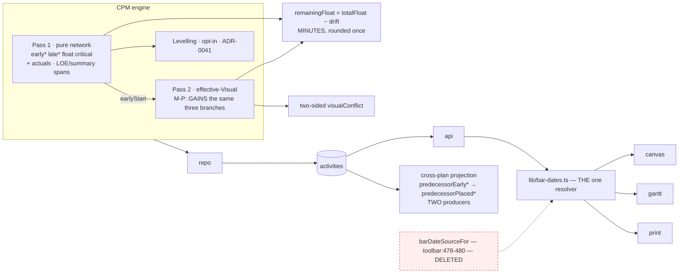
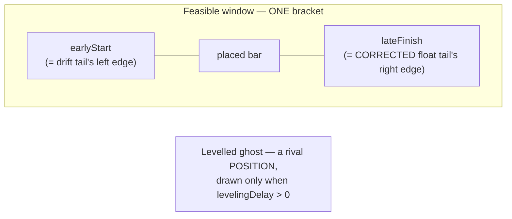

# Feature Spec: One planning surface — Visual is the plan; the feasible window and the levelled ghost are overlays

- **Status:** Draft
- **Author(s):** feature-analyst (Product Owner / Solution Architect / Technical Lead hats)
- **Date:** 2026-09-20 · **Revised twice**: after the product owner answered §6, and after four
  specialist reviews (two blocking) plus a product-owner decision on the overlay shape.
- **Tracking issue / epic:** _(to be assigned)_
- **Roadmap link:** `docs/ROADMAP.md` — scheduling model (the ADR-0033 line, §53–54)
- **Related ADR(s):** amends **ADR-0033** (D3, D5, D6, D7); amends **ADR-0025**/**ADR-0126**
  (capture); amends **ADR-0041 Q2** (rendering, not authority); amends **ADR-0045** (upstream
  basis); amends **ADR-0050** (mapping contract); amends **ADR-0054 §4** (the float tail's datum);
  touches **ADR-0034**, **ADR-0088**, **ADR-0103**, **ADR-0140**. **A new ADR is required** — §4.16.

---

## 0. Corrections — the record of what this spec got wrong

`docs/PROCESS.md`: _"The brief is not evidence either."_ **Thirteen decision-bearing claims have
been corrected across three drafts. C11 is the one that changes what the epic is.**

| #       | Claimed                                                                                      | Verified                                                                                                                                                                                                                                                                                                                                                                                                                                                                                                                                                                                                                                                                                                                                                                                            | Consequence                                                                                                                                                                                                                                     |
| ------- | -------------------------------------------------------------------------------------------- | --------------------------------------------------------------------------------------------------------------------------------------------------------------------------------------------------------------------------------------------------------------------------------------------------------------------------------------------------------------------------------------------------------------------------------------------------------------------------------------------------------------------------------------------------------------------------------------------------------------------------------------------------------------------------------------------------------------------------------------------------------------------------------------------------- | ----------------------------------------------------------------------------------------------------------------------------------------------------------------------------------------------------------------------------------------------- |
| **C1**  | The Gantt does not read `visualEffective*`.                                                  | Grep true, **inference false** — it reads them through `lib/bar-dates.ts` (`bar-geometry.ts:52,60`, `grid-columns.ts:92,100`, `row-model.ts:140-148,306`, `GanttPrintSurface.tsx:150,290`, `cell-commit.ts:175`, `wbs-groups.ts:77`).                                                                                                                                                                                                                                                                                                                                                                                                                                                                                                                                                               | A milestone does not exist.                                                                                                                                                                                                                     |
| **C2**  | Export should read placed dates.                                                             | Exporter emits **no computed dates at all** (`export.service.ts:194-226`).                                                                                                                                                                                                                                                                                                                                                                                                                                                                                                                                                                                                                                                                                                                          | The defect is a silent drop, not a basis.                                                                                                                                                                                                       |
| **C3**  | `visualDriftMinutes`/`Days` is drift.                                                        | Two layers, converted at `schedule.repository.ts:770-773`.                                                                                                                                                                                                                                                                                                                                                                                                                                                                                                                                                                                                                                                                                                                                          | No rename.                                                                                                                                                                                                                                      |
| **C4**  | An Early drag writes an inert SNET.                                                          | **Binding** (`:1109-1110` + `constraints.ts:155-156`); only _earlier_ drags are inert.                                                                                                                                                                                                                                                                                                                                                                                                                                                                                                                                                                                                                                                                                                              | The strip is real.                                                                                                                                                                                                                              |
| **C5**  | The upper-bound gap is an unfiled todo.                                                      | **ADR-0033 D5's accepted, unbuilt second disjunct.**                                                                                                                                                                                                                                                                                                                                                                                                                                                                                                                                                                                                                                                                                                                                                | Stronger reason to build.                                                                                                                                                                                                                       |
| **C6**  | —                                                                                            | `totalFloat`/`visualDriftDays` independently rounded (`:752`, `:770-773`).                                                                                                                                                                                                                                                                                                                                                                                                                                                                                                                                                                                                                                                                                                                          | Remaining float in minutes.                                                                                                                                                                                                                     |
| **C7**  | "Do not trust a count."                                                                      | 16 occurrences / 15 files, **13 live pins**.                                                                                                                                                                                                                                                                                                                                                                                                                                                                                                                                                                                                                                                                                                                                                        | Enumerated in FC-6.                                                                                                                                                                                                                             |
| **C8**  | Levelling had a renderer to fold in.                                                         | **Rendered by nothing** — three matches, all projections.                                                                                                                                                                                                                                                                                                                                                                                                                                                                                                                                                                                                                                                                                                                                           | M-E lights dark capability.                                                                                                                                                                                                                     |
| **C9**  | —                                                                                            | Programme basis is a **projection over two columns at four layers, two producers**.                                                                                                                                                                                                                                                                                                                                                                                                                                                                                                                                                                                                                                                                                                                 | The rename is the work.                                                                                                                                                                                                                         |
| **C10** | —                                                                                            | The backward bound reads **late** dates; there is **no placed-late**.                                                                                                                                                                                                                                                                                                                                                                                                                                                                                                                                                                                                                                                                                                                               | Necessarily asymmetric.                                                                                                                                                                                                                         |
| **C11** | **§1.2: "Early is Visual's resting state."**                                                 | **TRUE OF THE FIXTURE, FALSE IN GENERAL.** `compute.ts:763-772` gives `early*` three branches Pass 2 has no analogue for — a started activity's `earlyStart` is `activity.actualStart!` **verbatim**, bypassing the clamp ("actuals never move", ADR-0035 §1); a complete one's `earlyFinish` is `actualFinish!`; and LOE/WBS-summary spans come from the **derived** instants via `pointLike` (`:752-753`). `compute.ts:815-816` is bare `workingIndexDate(...)` and `vInclusiveFinishOwn` (`:757`) spans the **full** duration. Pass 2 (`:305-352`) never reads progress, the LOE span or the WBS rollup. My citation `compute.visual.spec.ts:71-80` is **five plain tasks**, and the whole 220-line file contains **zero** `actualStart`, `percentComplete`, `WBS_SUMMARY` or `LEVEL_OF_EFFORT`. | **The largest correction in the epic. A new milestone (M-P) exists ahead of M-C; §4.10 claim 2 is WITHDRAWN, not stretched; FC-7 is re-derived.** §4.2.                                                                                         |
| **C12** | `leveledStart === null` ⇔ the pass never ran; an undelayed ghost coincides with the **bar**. | **Both false.** `level.ts:186` — `if (finiteAsgs.length === 0) continue; // not a participant → no overlay` — so a levelled plan can leave every `leveledStart` null. And `pinAtNetwork` sets `leveledStart: r.earlyStart` (`:174`), so an undelayed participant's ghost coincides with **earliest**. **Both errors came from deriving semantics from `goldens.ts:628-635`, the one levelling golden, where every activity is a participant** — ADR-0076 Class 2, committed in the milestone that quotes it.                                                                                                                                                                                                                                                                                        | Three states, not two; the discriminator is `plan.levelResources`; the withholding rule was aimed at the wrong collision. §4.8.                                                                                                                 |
| **C13** | _(This revision's instruction: "add the `visual_start` + `EARLY` reading.")_                 | **Already shipped.** `placement-on-early-plan` is at `staff-diagnostics.registry.ts:29`, `:296-297`, `:520`. M0-T1 shipped **eight** new entries (ten total), not seven.                                                                                                                                                                                                                                                                                                                                                                                                                                                                                                                                                                                                                            | The task would have been a duplicate the closed `DIAGNOSTIC_IDS` union catches at typecheck — but the plan would have carried a **false task**. Second time in this epic that re-verifying a problem statement removed work (C1 was the first). |

---

## 1. Business understanding

### Problem

SchedulePoint asks a planner to choose, per plan, between two answers to _where is this bar_:
`EARLY` and `VISUAL` (`plans.scheduling_mode`, `schema.prisma:715`, default `EARLY`). It changes
what a drag means, which dates the Gantt prints, which dates a baseline freezes, and whether drift
is visible at all.

1. **The headline promise is off by default** (ADR-0033's own Consequences, `:166-167`), and
   `VITE_SCHEDULING_MODES` is not an operator rollback (ADR-0088 D1).
2. **`EARLY` and `VISUAL` are two renderings of one engine run — but they are not the same
   rendering when nothing is placed.** `schedulingMode` does not occur anywhere under
   `apps/api/src/modules/schedule/engine/` (zero matches) and Pass 2 runs unconditionally today. But
   **Pass 2 is not a superset of Pass 1** (C11): for a **started, complete, LOE or WBS-summary**
   activity the two disagree **with no placement anywhere**. Measured: in-progress reads early
   02 Jan / visualEffective 10 Jan; complete 02–05 vs 10–14; a summary over a four-day child and a
   two-day LOE each collapse to a point. **So the collapse cannot simply switch renderers — Pass 2
   has to be taught the three branches first.** That is M-P, and it is the epic's real foundation.
3. **The mode is a live defect surface.** A drag writes an `SNET` that overwrites whatever was
   there (C4). `docs/TECH_DEBT.md` #204(c) **measured** a WCAG 2.2 §2.4.3 failure caused by nothing
   but the mode existing.
4. **A bar already has three possible positions and the third has never been visible.** Earliest,
   placed and levelled — the last computed and exposed since ADR-0041 with **no renderer anywhere**
   (C8).

**Why now.** The product owner, 2026-09-20: _"early and late planning as overlays and just one
planning portal which is the visual mode."_

### Users

Organisation-scoped (ADR-0012/0016). **No role gains or loses a permission.**

| Role               | What changes                                                                                                                                                                                                    |
| ------------------ | --------------------------------------------------------------------------------------------------------------------------------------------------------------------------------------------------------------- |
| **Planner**        | Drag always hand-places. A **feasible window** brackets each bar; a **levelled ghost** shows the rival position. Float becomes remaining float. Drag-created constraints are stripped once, recorded, reported. |
| **Contributor**    | Unchanged (progress is not pen-gated, ADR-0060 Q-C). Overlays read-only.                                                                                                                                        |
| **Viewer**         | Placed dates everywhere; overlays are reads (ADR-0080).                                                                                                                                                         |
| **Org Admin**      | As Planner; loses the `Scheduling mode` control.                                                                                                                                                                |
| **External Guest** | Currently sees **early** dates for a Visual plan — silently corrects. `guest-api.ts:230` nulls `leveledStart`, so the levelled ghost is **structurally absent** for a guest; asserted, not assumed.             |

### Primary use cases

1. Place work where it will happen; it stays; successors move; no constraint written.
2. Read the room **left** after the placement.
3. See the **window** the bar may legally occupy, and the **levelled** position resources would force.
4. Hand the plan on — Gantt, print, export, baseline **and a linked downstream plan** agree.
5. Author a constraint deliberately, and be told when a placement breaks it.

### User journeys

**Happy path.** Take the pen → drag three bars into the sequence the site will run → each keeps its
position, successors shuffle right → remaining float falls → turn on **Feasible window** → one bar
sits hard against the right edge of its bracket, so there is nothing left → drag it back → turn on
**Levelled** → a ghost shows where the resource constraint would put it → switch to Gantt → placed
dates → print → the QS gets the dates the planner placed.

**Alternate — the migrated plan.** Bars are where they were. A dock strip names what changed.

**Alternate — the progressed plan.** A plan with actuals opens after M-P and **every bar is where it
was**, because Pass 2 now honours the actual start the way Pass 1 always did. Without M-P this
journey ends with every in-progress bar jumping to the data date.

### Expected outcomes

One answer to "when is this activity", everywhere, including across a plan boundary. Float means
what a planner means. A drag stops writing constraints. Levelled dates become visible for the first
time. One less setting, enum and flag; thirteen fewer config pins; #204(c)'s cause dissolved.

### Success criteria

- **SC-1** `schedulingMode`/`scheduling_mode` returns **zero outside `apps/api/prisma/schema.prisma`
  and the migration** — and **only at M-J**, because M-F must keep the Prisma field (§4.9).
- **SC-2** Pass 1 byte-identical for every fixture. **Pass 2 changes deliberately at M-P and M-D**,
  enumerated. §4.10.
- **SC-3** On a plan with no placement, **no stripped constraint, and no progress, LOE or summary**,
  every user-visible date is unchanged. _(Twice narrowed — C11 and the strip.)_
- **SC-4** A placement past a "no later than" ceiling is visible where today it is neither.
- **SC-5** All 13 canvas journeys run with placement live and are green.
- **SC-6** A programme with no upstream placement produces byte-identical downstream bounds.
- **SC-7** Every stripped constraint is recoverable and the planner is told.
- **SC-8** **After M-P, a plan with progress, an LOE or a summary and no placement renders
  identically under both bases** — the assertion that makes C11's correction checkable.

---

## 2. Functional requirements

### User stories & acceptance criteria

> **US-0** — As a **Planner** with a progressed plan, I want the placed view to honour my actuals.
> _(New, from C11.)_
>
> - **Given** an activity with an actual start **then** `visualEffectiveStart` is that actual start,
>   verbatim, exactly as `earlyStart` is (`compute.ts:765`).
> - **Given** a complete activity **then** `visualEffectiveFinish` is its actual finish.
> - **Given** an LOE or `WBS_SUMMARY` **then** its effective span is the **derived** span, not a
>   point.
> - **Given** any of the above **and no placement anywhere** **then** `visualEffective*` equals
>   `early*` for that activity.
> - **Given** a placement on a **not-started** activity **then** behaviour is unchanged from today.

> **US-1** — Every drag places the bar where I dropped it. _(Unchanged: no constraint written; a
> prior constraint is left alone; earlier-than-logic stays and is flagged; later pushes unplaced
> successors; Ctrl+Z restores the prior `visualStart`.)_

> **US-2** — Drag-created constraints are cleaned up without my bars moving, and I am told.
>
> - **Binding** (`early_start = constraint_date`) → `visual_start = constraint_date`, constraint
>   cleared, **bar unmoved**.
> - **Inert** (`early_start > constraint_date`) → left alone; converting would place the bar
>   _earlier than logic allows_.
> - **Unclassified** (`early_start IS NULL OR early_start < constraint_date`) → left alone, counted,
>   reported. **This class arises two ways and only one of them clears** (§4.6).
> - **An activity already carrying a `visual_start`** → **left alone, counted, reported.** _(New,
>   from review: `visual_start` is accepted regardless of mode (`activities.service.ts:388`,
>   `:526-528`), so a row can carry a stale placement **and** a binding SNET, and the naive strip
>   would destroy the placement.)_
> - Every strip writes its prior `(constraint_type, constraint_date, visual_start)` durably first.
> - Non-`SNET` constraints are never touched.

> **US-3** — Screen float is remaining float. _(Unchanged; `T − d`, minutes, rounded once; null
> drift ⇒ equals total float; negative reads as such; total float stays where it is right.)_

> **US-4** — As a **Planner**, I want to see the window my bar may legally occupy, and the position
> resources would force. _(Re-derived: the product owner chose **one window plus one rival ghost**
> over three peer ghosts.)_
>
> - **Given `Feasible window` is on** **then** each activity draws **one bracket** from its
>   `earlyStart` to its `lateFinish` — the span it may legally occupy — with the placed bar inside
>   it. **Not two ghosts.**
> - **Given** the bar sits hard against the right edge **then** remaining float is zero and the
>   picture says so without a number.
> - **Given `Levelled` is on and the activity is a levelling participant that was delayed** **then**
>   a ghost draws at `leveledStart…leveledFinish`.
> - **Given** it is a participant that was **not** delayed **then** no ghost draws — its levelled
>   position **coincides with the window's left edge**, not with the bar (C12).
> - **Given** it is **not a participant** (no finite assignments) **then** no ghost and **no
>   shading** — the overlay does not apply to it, which is different from being unavailable.
> - **Given** `plan.levelResources` is off **then** the `Levelled` control is **shaded with a
>   reason** naming the plan setting (ADR-0082).
> - **Given** any overlay is on **then editing is fully available** — _amends ADR-0033 D6_.
> - **Given** an overlay is on and **drew nothing** **then** it says so (`compareOverlaySummary`'s
>   `undrawnLabel` shape) — **this is the common case on every plan in the estate today**, because
>   FC-1 predicts zero placements.
> - Ghosts are distinguished by **shape**, and must be distinguishable from the **two ghost layers
>   that already exist** — `baselineGhosts` (`GHOST_DASH [2,2]`) and `compareGhosts`
>   (`COMPARE_DASH [6,3]`), whose own docblock records them having been pixel-identical once.
> - **ADR-0041 Q2 is not overturned**: network float and criticality stay authoritative; the levelled
>   overlay gains a **rendering**, not a promotion.

> **US-5** — A placement past a ceiling is flagged. _(Unchanged; `SNLT`/`FNLT` and `MSO`/`MFO`; today
> a placement later than an `MSO` produces no flag because `compute.ts:320` clamps to the pin.)_

> **US-6** — A baseline freezes where work was **placed**, and says what it froze.
>
> - A post-epic capture writes `placed_start`, `placed_finish` **and `visual_start`** — _(new: after
>   this epic `visual_start` is **the** planner input, and without it a comparison cannot tell "the
>   planner moved it" from "the logic moved it")_.
> - It records a **snapshot level**, not a two-valued basis — _(new: every post-epic capture writes
>   both column sets, so the row is not one **or** the other, and only a level distinguishes "no
>   placement" from "nobody looked")_.

> **US-7** — An export carries my placements or tells me it could not. _(CQ-3 = (B): dropped and
> **reported**, one aggregate finding; no synthetic `SNET`; byte-identical when nothing is placed.)_

> **US-8** — A programme is driven by where upstream work is **placed**. _(Forward bound from
> `visualEffectiveStart`/`Finish`; byte-identical with no upstream placement; the backward bound
> stays on late dates because there is no placed-late.)_

> **US-9** — I am told what the migration did, and it is recoverable.

### Edge cases

| Case                                  | Behaviour                                                                                                                               |
| ------------------------------------- | --------------------------------------------------------------------------------------------------------------------------------------- |
| Plan never recalculated               | `visualEffective*` null → `—`. **No fallback to `earlyStart`.** Excluded from the strip.                                                |
| **Started / complete activity**       | After M-P, `visualEffective*` honours the actuals (US-0). **Before M-P this is a live divergence** and is why M-P precedes M-C and M-F. |
| **LOE / WBS summary**                 | After M-P, the derived span. Before M-P, a point.                                                                                       |
| No placement anywhere                 | Identical to today **once M-P has landed**.                                                                                             |
| Drift null                            | Remaining float = total float.                                                                                                          |
| **Levelling: pass never ran**         | Control **shaded with a reason**.                                                                                                       |
| **Levelling: not a participant**      | **Not applicable** — no ghost, no shading.                                                                                              |
| **Levelling: participant, undelayed** | Ghost coincides with the **window's left edge** → withheld; the listbox still states the **offset** (0).                                |
| **Overlay on, nothing drawn**         | Explicit `undrawnLabel`. The **default state of every existing plan**.                                                                  |
| Guest share view                      | Placed dates; levelled structurally absent (`guest-api.ts:230`).                                                                        |
| Upstream with no placement            | Byte-identical bounds.                                                                                                                  |
| Cross-plan backward bound             | Reads `late*`, necessarily.                                                                                                             |

### Permissions · Validation · Errors

No permission changes. Overlays are reads. `schedulingMode` is **rejected with 422** — the global
pipe is `whitelist: true, forbidNonWhitelisted: true, errorHttpStatusCode: 422`
(`app.module.ts:141-147`, verified); no bespoke branch, stated in the OpenAPI description.

**The response side is not symmetric with the request, and that is the sharper risk** _(new, from
api-review)_: removing the field from `PlanResponseDto` makes a stale bundle **not error** —
`plan-workspace-toolbar.tsx:476` defaults to `'EARLY'` — so it **silently renders Early dates for
placed plans** until it refreshes. ADR-0047 recreates `web` and `api` independently, so that window
is real. It is in the ADR's consequences.

| Scenario                          | Result                                         | Status  |
| --------------------------------- | ---------------------------------------------- | ------- |
| Drag without the pen              | existing copy                                  | 423     |
| Stale version                     | existing non-destructive message               | 409     |
| Old bundle sends `schedulingMode` | save refused; one reload clears it             | **422** |
| Old bundle **reads** a plan       | **silently renders Early dates** until refresh | 200     |

---

## 3. Technical analysis

| Area              | Impact              | Notes                                                                                                                                                                          |
| ----------------- | ------------------- | ------------------------------------------------------------------------------------------------------------------------------------------------------------------------------ |
| **Frontend**      | high                | One derivation feeds everything (C1). New: a window layer, a levelled lens, a remaining-float read-out, a migration notice, a float-tail datum fix.                            |
| **Backend**       | high                | **Pass 2 gains three branches (M-P).** Plans lose a field. Baselines gain capture columns. Programme basis moves across two producers. A migration that deletes customer data. |
| **Database**      | **high — the gate** | Baseline columns + level; remaining float; the migration log; the drop. **Every one through `database-architect`, without exception.**                                         |
| **API**           | med                 | Three DTOs lose a field; activities gain two; baselines gain four; a new read. **`POST …/schedule/recalculate` and `…/recalculate-programme` both change** (below).            |
| **Security**      | low                 | No new permission or scope.                                                                                                                                                    |
| **Performance**   | low, measured       | **The window is one bracket, not two ghosts** — cheaper than the withdrawn three-peer design. FC-5 re-scoped.                                                                  |
| **Observability** | low-med             | The strip is **unauditable by construction** (`REASONS.PLAN_CONTENT`, `audit-coverage.structural.spec.ts:264`) — which is _why_ the durable record exists.                     |
| **Testing**       | high                | Four falsification gaps closed (§ below).                                                                                                                                      |

**The programme change is not confined to the programme route** _(new, from api-review)_: the
cross-plan derivation runs inside **ordinary** recalculation whenever `countActiveForPlan > 0`
(`schedule.service.ts:1425-1432`). So `POST …/schedule/recalculate` **and**
`…/recalculate-programme` both change behaviour, and §4.11's table carries both — the ADR-0130
documentation-gap shape this spec's own risk table names.

### Four risks, different in kind

1. **Pass 2 is not a superset of Pass 1 (C11)** — the premise. Mitigated by M-P landing first, with
   a parity case verified red.
2. **The coverage inversion** — thirteen suites about to exercise placement for the first time
   (ADR-0092). M-B before M-F.
3. **The levelled overlay is dark capability being lit (C8)** — no parity suite to lean on.
4. **The strip is irreversible and unauditable** — rails in §4.6, gated by FC-10.

---

## 4. Solution design

### 4.1 Architecture overview

### 4.2 M-P — teaching Pass 2 the three branches

**The epic's foundation, and it did not exist in either earlier draft.** `early*` has three
branches Pass 2 has no analogue for (C11):

| Branch        | Pass 1                                    | Pass 2 today                                            | After M-P                  |
| ------------- | ----------------------------------------- | ------------------------------------------------------- | -------------------------- |
| Started       | `activity.actualStart!` verbatim (`:765`) | `workingIndexDate(cal, dataDate, vDisplayOwn)` (`:815`) | the actual start, verbatim |
| Complete      | `activity.actualFinish!` (`:766-768`)     | `vDisplayOwn + duration − 1` (`:757`)                   | the actual finish          |
| LOE / summary | derived span via `pointLike` (`:752-753`) | full input duration → a **point**                       | the derived span           |

**Why it is additive and safe.** M-P changes **only** `visualEffectiveStart`/`Finish` for activities
that are started, complete, LOE or summary. It adds no field in either direction, so **FC-2 (Pass 1
byte-identical) is unaffected** — a property to assert, not assume.

**§4.10 claim 2 is WITHDRAWN, not stretched.** "Pass 2's existing outputs are byte-identical" was
true of the earlier design and is false of this one. The honest claim is §4.10's replacement.

**Its parity case is the assertion that pins §1.2** and it is the one thing that would have caught
C11: a fixture with a started activity, a complete one, an LOE and a summary, **no placement
anywhere**, asserting `visualEffective* === early*` for every activity — verified red first.
`compute.visual.spec.ts`'s 220 lines contain none of those four today.

### 4.3 Remaining float

`remainingFloatMinutes = totalFloat − (visualDriftMinutes ?? 0)`, converted with the same
`factorFor(activityId)` (`:750-754`, `:770-773`).

**CQ-1 answered: persist.** `activities.remaining_float INT NULL`, day-denominated, engine-owned,
the 22nd column of the existing `unnest` batch, never in a write DTO, **no index**, **no CHECK**
(negative is the feature).

**Two things the docblock must say, because both are corrections:**

- **The DTO alternative does not exist.** Minutes are persisted for neither input, so a read-time
  derivation could only compute `round(T/f) − round(d/f)` — precisely the C6 defect.
- **CQ-1's own stated reason was false.** It said persisting lets the Gantt sort server-side. The
  Gantt sorts **in the browser** (`row-model.ts:154`) and the activities list has no sort parameter,
  so persisting buys **no sorting capability anyone uses**. Say so, or the next reader adds the
  index.
- **Why day-only, when the same DTO pairs `remainingDurationDays`/`Minutes`** _(from api-review)_:
  it follows `totalFloat`/`freeFloat`, because it **is** a float — derived from two day-denominated
  float quantities, compared against float thresholds, and read beside them. The paired convention
  belongs to **durations**, which are planner inputs needing sub-day precision (ADR-0070). A float
  is an output.

### 4.4 The upper-bound conflict

Unchanged: `visualConflict` stays boolean and gains
`visualConflictReason: 'EARLIER_THAN_LOGIC' | 'LATER_THAN_BOUND' | null`, from the existing
`clampBackwardFinish`/`clampSecondaryBackwardFinish`. Not a second backward pass (SQ-e stands).
`SNLT`/`FNLT` are covered for free by remaining float going negative; `MSO`/`MFO` need the flag.

### 4.5 The float tail's datum — a live defect this epic must fix

**Found by the ui-architect review, independent of this epic, and it is on the window's critical
path.** `paint.ts:1635` passes the **bar** rect with `activity.totalFloat`. Total float is measured
from the **early** finish; from a **placed** finish the room left is `T − d`. **The tail overshoots
by exactly the drift on every Visual plan with a placement.**

Two consequences:

1. It gets **its own `docs/TECH_DEBT.md` row** — it predates this epic and its provenance belongs
   to ADR-0054 §4, whose datum this amends.
2. **It cannot be left open while the window ships**, because the window's right edge is
   `lateFinish` and an overshooting tail would disagree with it on screen. The fix is a prerequisite
   task inside M-E, and the row closes there.

**And it is the strongest support for the product owner's decision.** The corrected tail _is_ the
window's right portion; the drift tail _is_ the window's left portion back to earliest. **Two
thirds of the feasible window is already drawn** — so the window is largely a **reframing of two
existing tails into one bracket**, not a new layer.

### 4.6 The migration — stripping drag-created constraints

**Four classes, not three** _(corrected against what M0-T1 shipped, C13)_:

| Class              | Test                                                   | Action                                                                            |
| ------------------ | ------------------------------------------------------ | --------------------------------------------------------------------------------- |
| **Binding**        | `early_start = constraint_date`                        | **Convert**: `visual_start = constraint_date`, clear the constraint. Bar unmoved. |
| **Inert**          | `early_start > constraint_date`                        | Leave — converting places the bar _earlier than logic allows_.                    |
| **Unclassified**   | `early_start IS NULL OR early_start < constraint_date` | Leave, count, report.                                                             |
| **Already placed** | `visual_start IS NOT NULL`                             | **Leave, count, report** — _(new)_.                                               |

**"Already placed" is a destruction path the earlier draft would have taken.** `visual_start` is
accepted regardless of mode (`activities.service.ts:388`, `:526-528`), so a row can carry a stale
placement **and** a binding SNET; the naive `WHERE` would overwrite the placement. It is excluded,
and **FC-10 clause B's bound is read against the population after that exclusion**.

**The unclassified class arises two ways and only one clears** _(from M0-T1's shipped docblock)_: the
weak one is a stored schedule predating the constraint, which clears on recalculation; the strong
one **never** clears, because a started activity's actual start bypasses the clamp (`compute.ts:765`
— C11 again, one surface along) and reads below its constraint in a schedule computed seconds ago.
**The planner-facing notice must not imply these resolve.**

**What changes, and what does not.** Bars stay put. **Downstream `early*`, float, criticality and
the critical path change**, because an SNET binds through Pass 1 and a placement does not. That is
the point — the strip **restores float that was never genuinely constrained** — and it narrows SC-3,
puts the stripped population outside FC-7, and means a migrated plan shows float variance against a
pre-migration baseline that M-C-T2 must not present as slippage.

**Rails.** Unauditable by construction (`REASONS.PLAN_CONTENT`, verified) → a durable record.
The only historic copy is a post-ADR-0126 **FULL** baseline (`schema.prisma:584-585`), a minority,
**not assumed** — M0 measures it. Gated by FC-10. Reported after the fact.

### 4.7 Interchange

CQ-3 = **(B)**. **Copy `export-mapper.ts:226-242` (`lagMinutes`) exactly** _(from api-review)_: one
**aggregate** finding, one producer, never duplicated in both serialisers.

**The import direction needs a mapping-table row only, not a runtime finding** _(corrected — the
earlier draft implied symmetry)_: no format has ever encoded a hand-placement, so nothing is lost
and nothing is ambiguous, and a standing finding on every import is exactly the noise that comment
warns against.

### 4.8 The overlay model — one window, one rival ghost

**Re-derived. The product owner chose one feasible window plus one levelled ghost over three peer
ghosts**, and it is both smaller and better-founded: the simultaneous case is answered in **one
shape**, the ghost-vs-ghost collision disappears, and §4.5 shows two thirds of the window is already
on screen.

**The discriminating idea: a BOUND and a POSITION are different objects.** Earliest and latest are
the ends of the window the bar may occupy. Levelled is a **rival place the bar could be**. Drawing
all three as peer ghosts asserted they were the same kind of thing.

**The window is a view TOGGLE; levelled is a LENS** _(from review, and the discriminator is already
written down)_: `view-toggles.ts:22-32` says a lens exists because it needs data that can be loading
or absent, and float/drift are "already on every activity, so the control can never be unavailable".
`early*`/`late*` are the same — always present. `leveledStart` can be absent. So the window joins
`floatTails` as a toggle and levelled joins the lenses. **`tsld-toolbar-items.tsx:209-247` already
has the `reason` field and the ADR-0082 wiring — do not invent the mechanism**, and both go in the
**existing `Insight overlays` group**, not a new group beside it.

**The levelled lens has three states** (C12, from `level.ts`'s three exit paths — **not** from
`goldens.ts`):

| State                  | Test                                           | Treatment                                                                                                                                        |
| ---------------------- | ---------------------------------------------- | ------------------------------------------------------------------------------------------------------------------------------------------------ |
| Pass never ran         | `plan.levelResources === false`                | Control **shaded with a reason** naming the setting                                                                                              |
| Ran; not a participant | `leveledStart === null` while `levelResources` | **Not applicable** — no ghost, no shading                                                                                                        |
| Ran; participant       | `leveledStart !== null`                        | Ghost **iff `levelingDelay > 0`**; an undelayed one coincides with the window's **left edge** (`pinAtNetwork` sets `leveledStart: r.earlyStart`) |

**Ghost vocabulary.** The canvas already has **two** ghost layers this spec never mentioned —
`baselineGhosts` (`paint.ts:1321-1372`, `GHOST_DASH [2,2]`) and `compareGhosts` (`:1374-1432`,
`COMPARE_DASH [6,3]`) — and `COMPARE_DASH`'s docblock records those two having been **pixel-identical
once**, found by a ux review. So the window is a **bracket, not a dashed outline** (a different
shape class, which is what keeps it out of that collision), and the levelled ghost takes a third
distinct rhythm. **FC-8 is re-derived over the full vocabulary** with a fixture carrying an active
baseline and a selected revision pair.

**Accessibility.** **One** `ListboxRowParts` member composed by one function beside
`baselineGhostClause`, stating the **offset, not the span** — `a11y.ts:136-137` records the
row-length budget. An overlay that is on and drew nothing takes `compareOverlaySummary`'s
`undrawnLabel` shape.

**The empty state is the common case and must be designed, not discovered.** FC-1 predicts **zero
placements across the estate**, so on every existing plan the window brackets a bar with no drift
and the levelled lens draws nothing. A control that lights and does nothing is the lit-but-inert
dead end ADR-0081 records four times.

**Export and print.** The window and the levelled ghost **do** reach the exported PNG/PDF and the
printed programme — ADR-0103's rule that the exported diagram _is_ the diagram. **M-E's first task
reads and reports what the existing float/drift tails do** rather than assuming symmetry, because
if lens state does not currently reach the export (`docs/TECH_DEBT.md` #167) then two thirds of the
window already does and the asymmetry is a regression risk.
`scene-parity.structural.test.ts` forces an answer at implementation time; this gives it one.

### 4.9 Database changes

**Every item is a proposal for `database-architect`.**

| Change                                     | Table                         | Shape                                                                         |
| ------------------------------------------ | ----------------------------- | ----------------------------------------------------------------------------- |
| Add placed dates **and the planner input** | `baseline_activities`         | `placed_start`, `placed_finish`, **`visual_start`** — `DATE NULL`, no DEFAULT |
| Add the **snapshot level**                 | `baselines`                   | **`placement_snapshot_level ∈ {NONE, FULL} DEFAULT NONE`**                    |
| Add remaining float                        | `activities`                  | `remaining_float INT NULL`, no index, no CHECK                                |
| Add the strip record                       | new `placement_migration_log` | below                                                                         |
| Drop the column **and** the enum           | `plans`                       | **ONE migration**, at M-J                                                     |

**Why a level rather than a two-valued basis** _(accepted from review)_: post-epic **every** capture
writes both column sets, so the row is not one **or** the other; and only a level distinguishes "this
plan had no placement" from "this capture predates the columns". It is `revision_snapshot_level`'s
own argument (ADR-0126), and `DEFAULT NONE` is the literal truth of every existing row.

**Why `visual_start` is frozen too** _(accepted from review)_: after this epic it is **the** planner
input, and without it a comparison cannot distinguish "the planner moved it" from "the logic moved
it" — the same question `placed_*` alone cannot answer.

**`placement_migration_log`** _(substantially corrected from review)_:

- **A primary key** — every sibling operational table has one.
- **Real FKs for `plan_id` (Cascade) and `organization_id` (Restrict).** Non-FK is right for
  `activity_id` **only**. Two reasons, and the first is one I had backwards:
  `hierarchy-expiry.structural.spec.ts:118-140` derives its completeness census **from the Prisma
  DMMF**, so a table with **no FK at all is structurally invisible to it**; and ADR-0096's expiry
  **hard-deletes plans**, which would leave org-scoped rows orphaned forever. Cascade is the shape
  that census explicitly excludes, so the row dies with its plan and no hand-maintained list grows.
- **A denormalised activity code and name** — the `audit_events.subject_label` rule: after a hard
  delete the log can otherwise only say "N activities".
- **`prior_visual_start`** alongside the prior constraint.
- **It does NOT join `RETENTION_TABLES` and has no window** — it is **org-scoped customer content
  read by a member**, which that set has never contained (`docs/DATABASE.md:1389-1396`), and
  `retention-boundary.structural.spec.ts:53-58` asserts the set **by equality**, so this is a
  decision to write down rather than an omission. The Cascade FK already gives it the right
  lifecycle.

**The RESTRICT-trap justification is WITHDRAWN** _(from review)_. `docs/TECH_DEBT.md` #253 records
that ADR-0126 breakage as **test teardown**, since fixed by `clearBaselineTree` — never a production
hazard, and gone. The non-FK `activity_id` stands on ADR-0025's `source_activity_id` leg alone, which
is sufficient. **Carrying the stale reason is what would lead a reader to extend non-FK to
`plan_id`**, which is the defect above.

**M-F must KEEP `scheduling_mode` and `enum SchedulingMode` in `schema.prisma`.** Measured: a
datamodel without the field against a database with it makes `prisma migrate diff --exit-code` exit 2. **SC-1's grep pushes a reader to violate this** — so M-F-T4 says so, and SC-1 is satisfiable only
at M-J.

**The drop is ONE migration, not two** _(corrected)_. Measured on a populated 200k-row table:
`DROP TYPE` alone fails on the dependency; `BEGIN; ALTER TABLE … DROP COLUMN; DROP TYPE; COMMIT;`
succeeds, metadata-only, no rewrite. The ADD VALUE hazard has no mirror on the drop side. **The
releases still split one apart — for the rollback**: a release-N image still selecting
`plans.scheduling_mode` **500s on every plan read**, which is worse than ADR-0107's write-path case.
So the rollback is a **restore, not a redeploy**, and M-J-T2 says so.

### 4.10 The parity claim — restated, with claim 2 withdrawn

1. **Pass 1 is untouched.** Byte-identical for every input; `pureFields` (`compute.visual.spec.ts:55-64,82-96`) and the golden suite pass **unedited**.
2. ~~Pass 2's existing outputs are byte-identical.~~ **WITHDRAWN (C11).** Pass 2 **changes
   deliberately at M-P** for started, complete, LOE and summary activities — and that change makes
   Pass 2 agree with Pass 1 where it did not before.
3. **Two fields are added** (M-D) under an enumerated re-baseline.
4. **New:** _after_ M-P, a plan with no placement renders identically under both bases **including**
   progress, LOE and summary — SC-8, which is the assertion C11's absence allowed to be assumed.

### 4.11 API changes

| Endpoint                                      | Change                                                                                                          | Breaking?     |
| --------------------------------------------- | --------------------------------------------------------------------------------------------------------------- | ------------- |
| `GET …/plans/:planId`                         | `schedulingMode` removed — **a stale bundle silently renders Early**                                            | **Yes**       |
| `PATCH`/`POST …/plans`                        | removed → **422**                                                                                               | **Yes**       |
| `GET …/activities`                            | `+ remainingFloat`, `+ visualConflictReason`                                                                    | No            |
| `GET …/baselines/:id`                         | `+ placedStart`, `+ placedFinish`, `+ visualStart`, `+ placementSnapshotLevel`                                  | No            |
| `GET …/baselines/:id/variance`                | live side reads placed; carries the level                                                                       | Behaviourally |
| **`POST …/schedule/recalculate`**             | **the cross-plan derivation runs here too** whenever `countActiveForPlan > 0` (`schedule.service.ts:1425-1432`) | Behaviourally |
| **`POST …/schedule/recalculate-programme`**   | the upstream basis moves                                                                                        | Behaviourally |
| `POST …/export/:format`                       | one aggregate placement finding                                                                                 | No            |
| **`GET …/plans/:planId/placement-migration`** | new                                                                                                             | No            |
| `GET …/schedule/health-check`                 | **unchanged** — DCMA reads total float, correctly                                                               | No            |

### 4.12–4.15

Unchanged from the previous revision: the component inventory (§4.12), the programme's four-layer
projection and two producers (§4.14), and the alternatives table (§4.13) — with three rows added:
**three peer ghosts** (withdrawn by the product owner in favour of one window plus one rival),
**a two-valued `date_basis`** (rejected for a snapshot level), and **a non-FK `plan_id`** (rejected
on the DMMF-census and orphan grounds above).

### 4.16 The ADR

> **ADR-01NN — Visual is the plan; the feasible window and the levelled ghost are overlays.**
> **(D0)** _(new)_ **Pass 2 is taught Pass 1's three branches — actual start, actual finish, derived
> LOE/summary span — before anything reads it as authoritative.** Pass 2 was never a superset of
> Pass 1, and the belief that it was rested on a fixture of five plain tasks.
> **(D1)** `schedulingMode` deleted; placed dates are the single downstream truth.
> **(D2)** Pass 1 untouched and **not** "Early mode"; the parity claim is §4.10's four-part form and
> **its second clause is withdrawn**, not stretched.
> **(D3)** Screen float is remaining float, persisted, day-denominated, rounded once.
> **(D4)** **One feasible window plus one rival ghost**, amending ADR-0033 D6 (editing is never
> suppressed) and **ADR-0054 §4** (the float tail's datum is the placed finish, so its length is
> `T − d`).
> **(D5)** The two-sided conflict flag builds ADR-0033 D5's unbuilt second disjunct.
> **(D6)** Drag-created `SNET`s are stripped on a **four-class** test, recorded durably first,
> reported after — and the strip changes Pass 1 downstream while leaving every bar in place.
> **(D7)** Export reports; translation refused.
> **(D8)** No `VITE_` flag; the thirteen pins convert first.
> **(D9)** Levelled joins the overlays as a **lens** and a **rendering**, not an authority — ADR-0041
> Q2 stands — with **three** states derived from `level.ts`'s exit paths.
> **(D10)** The programme's **forward** bound reads `visualEffectiveStart`/`Finish` across **both**
> producers; the **backward** bound stays on late dates because there is no placed-late.
> **(D11)** _(new)_ The migration log is org-scoped customer content: **Cascade FK on `plan_id`, no
> retention window**, outside `RETENTION_TABLES` by decision.
> _Consequences include_: a stale bundle **silently renders Early dates** for placed plans until it
> refreshes (the response side is not symmetric with the request); and the rollback from M-J is a
> **restore, not a redeploy**.

---

## 5. Links

- Implementation plan: [`./implementation-plan.md`](./implementation-plan.md)
- Falsification conditions: [`./falsification.md`](./falsification.md)
- Docs updated: `CLAUDE.md` §16, `docs/API.md`, `docs/DATABASE.md`, `docs/ROADMAP.md`,
  `docs/TESTING.md`, `docs/UX_STANDARDS.md`, `docs/DESIGN_SYSTEM.md`, ADR-0050's mapping-contract
  table, `docs/TECH_DEBT.md` (#204(c) cause; the float-tail row; the `it.todo` gap)

---

## 6. Critical questions — all answered

**CQ-1 — remaining float persisted or derived? → PERSIST.** `activities.remaining_float INT NULL`,
day-denominated, engine-owned, 22nd column of the existing unnest batch, never in a write DTO, **no
index, no CHECK**. The DTO alternative **does not exist** (minutes are persisted for neither input).
**CQ-1's own stated reason was false** — the Gantt sorts in the browser (`row-model.ts:154`) and the
activities list has no sort parameter, so persisting buys no sorting anyone uses; the docblock says
so, or the next reader adds the index.

**CQ-2 — old client sends `schedulingMode`? → 422**, verified at `app.module.ts:141-147`. No bespoke
branch. **And the response side is the sharper half**: a stale bundle does not error, it silently
renders Early dates.

**CQ-3 — export? → (B), drop and report.** One aggregate finding on the `lagMinutes` pattern; the
import direction is a **mapping-table row only**, no runtime finding.

**CQ-4 — levelling? → in, but as ONE RIVAL GHOST beside ONE FEASIBLE WINDOW**, not as a third peer.
Its two semantic claims were false (C12) and are re-derived from `level.ts`.

**CQ-5 — programme? → reads placed dates**, own milestone, own condition, asymmetric by necessity.

**CQ-6 — M0 entries? → keep, re-natured `retrospective`.**

**CQ-7 — drag-created SNETs? → strip, on a FOUR-class test**, with a row already carrying a
`visual_start` excluded, recorded durably first, reported after, gated by FC-10.

**CQ-8 _(new, answered in review)_ — retention of the migration log? → NO window, outside
`RETENTION_TABLES`**, by decision, because it is org-scoped customer content read by a member and
the Cascade FK already gives it the right lifecycle.
