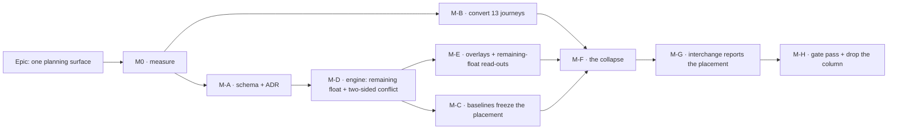

# Implementation Plan: One planning surface — Visual is the plan, Early and Late are overlays

- **Feature spec:** [`./feature-spec.md`](./feature-spec.md) — **Draft, awaiting approval**
- **Falsification conditions:** [`./falsification.md`](./falsification.md) — **committed in its own
  commit before any harness runs** (ADR-0128's ordering)
- **Status:** Draft
- **Owner:** _(to be assigned)_

---

## Breakdown

**Why this order and not the obvious one.** The tempting sequence starts with the collapse — it is
the headline and it is a small diff (§4.1 of the spec: one ternary). It is also the sequence in
which a planner gets placed bars with **total** float printed beside them, no earliest/latest lens
to judge a placement by, a Late overlay that has been deleted with the mode that gated it, and
thirteen journeys going red at once. **The collapse is last among the behavioural milestones**
because everything it makes universal must be right first.

### Epic

**One planning surface** — delete `schedulingMode`; the placed dates become the single downstream
truth; earliest and latest become ghost overlays beside unmoved bars; screen float becomes
remaining float. Roadmap theme: the scheduling model (`docs/ROADMAP.md` §53–54, the ADR-0033 line).

---

## Milestone M0 — Measure before anything is built

**Outcome:** four readings that decide three design questions, taken on the deployed installation
and on the product owner's hardware.
**Ships dark:** nothing user-facing changes. The only deployed artefact is two or three new entries
in the staff diagnostics registry, reachable at `/staff` by a staff account and by nobody else.
**Entry point (staff, not planner):** `Staff console → Diagnostics → Run`.
**Journey:** `e2e-staff` gains one case asserting the new entries render with the fixed all-numeric
row shape. (The planner-facing journey lands at M-E, which is the first user-facing milestone —
ADR-0081.)

> **Why a whole milestone.** Three of this epic's decisions are currently guesses: whether any
> deployed plan carries a placement, whether any baseline needs the nullable sentinel, and whether
> the canvas can afford a second outline per bar. Two of the three can be answered for the cost of
> a registry entry each (ADR-0140: _"adding a diagnostic is one entry here and nothing else"_), and
> the third is the one this repository has been wrong about seven consecutive times.

#### Feature: estate readings

> **Description:** answer FC-1's three questions through the ADR-0140 diagnostics panel.
> **Complexity:** S
> **Dependencies:** none
> **Risks:** the registry's row shape is closed and all-numeric (gate S-1/S-4) → every question is
> phrased as `count(*)` with `affected_plans`/`affected_organizations`, which it already is. ·
> A query that takes caller input would reintroduce the differencing oracle ADR-0140 D2 clause 2
> forbids → all three take **no parameters**, so injection and oracles are structurally impossible
> rather than parameterised away.
> **Testing requirements:** the structural gates the registry already carries (S-1 literals, S-3 no
> `$queryRawUnsafe`, S-4 aliased counts only); one repository spec per entry with a seeded fixture
> proving the numerator is a strict subset of the denominator.

##### Task M0-T1 — three diagnostics entries

- **Description:** `visual-placement-plans` (plans in `VISUAL`), `visual-placement-activities`
  (activities with `visual_start IS NOT NULL`), `baselines-over-placed-plans` (baselines whose
  source plan carries any placement). `nature: 'prospective'` while the epic is open.
- **Complexity:** S · **Dependencies:** none
- **Risks:** a query cost nobody measured → ADR-0140's M0 found the "obvious" anchoring argument
  false and the chosen index **not chosen at all**; so cost each entry against a diluted estate
  before shipping, and record the re-arm trigger in `m0/measurements.md`.
- **Testing:** repository spec per entry, verified against a fixture where the count is non-zero
  **and** one where it is zero (a query that always returns zero passes a subset assertion).
- **Development steps:**
  1. Add three `DiagnosticEntry` constants; extend `DIAGNOSTIC_IDS`.
  2. Cost each on a diluted estate; commit `m0/measurements.md` with the plan output.
  3. Take the readings on the deployed host; commit `m0/estate-readings.md`.
  4. **Apply FC-1's decision table** — record which branch fired, in writing, before M-A opens.

#### Feature: the ghost-overlay cost probe

> **Description:** FC-5's reading, taken before the layer is designed rather than after it is built.
> **Complexity:** M
> **Dependencies:** none
> **Risks:** a measurement taken in a container is worthless here — ADR-0127 D8 disqualified that
> environment by name after its no-change baseline moved 0.93 → 10.00 pp between two runs an hour
> apart → the reading is taken on the product owner's hardware through the ADR-0128 panel, in one
> sitting, with its spread reported. · A prototype that bypasses the real painter measures the
> prototype → the probe paints through `paintScene` with a throwaway ghost layer, and its docblock
> says where it bypasses the product (ADR-0081's third decision).
> **Testing requirements:** the probe's own non-vacuity control — assert the ghost layer drew a
> non-zero number of rects while it was measured, as ADR-0129 P3 did (37 of 264 bars). A benchmark
> over a scene with no ghosts reports the fastest number the layer can produce and says nothing.

##### Task M0-T2 — `ghost-overlay` probe scenario

- **Complexity:** M · **Dependencies:** M0-T1 (none technically; sequenced so one staff release
  carries both)
- **Risks:** judging at Fit alone → FC-5 splits the limbs deliberately; `docs/TECH_DEBT.md` #260
  records a Fit baseline of 98.33 pp leaving less headroom than the bar, so a pp delta there cannot
  fail.
- **Testing:** the probe judge's `INDETERMINATE` branch must be reachable and is asserted.
- **Development steps:**
  1. Add the scenario to the probe registry; throwaway ghost painter behind it.
  2. Take Week/500, Week/2,000, Fit/500, Fit/2,000, both overlays on and off, one sitting.
  3. Commit the readings **with the run-to-run spread**; apply FC-5's withdrawal ladder if limb 2
     fails, and record which rung was needed.

---

## Milestone M-A — The schema, and the ADR

**Outcome:** the columns this epic needs exist and are described; the decision is on the record.
**Ships dark:** every new column is unwritten and unread. `PlanResponseDto` still carries
`schedulingMode`. No surface changes.
**Journey:** none — nothing is reachable. The API e2e suite asserts the new columns default and
migrate correctly against a **populated** database.

> **Every item here goes through `database-architect`, without exception** (CLAUDE.md §19.3/§20).
> The agent is not run "because the change looks significant" — deciding that is the judgement the
> agent exists to make. If it returns nothing, fails, or is slow, **re-run it**; waiting is cheap
> and a checksummed migration against a real database is not.

#### Feature: baseline placement columns + the basis discriminator

> **Complexity:** M
> **Dependencies:** M0 (FC-1 decides the DEFAULT)
> **Risks:** a migration a pristine database cannot test → ADR-0107's whole subject; every case is
> rehearsed against a database populated by replaying the earlier migrations, and the negative
> control names the constraint. · A fourth child table off `baseline` broke 557 of 587 API e2e
> tests at once on a RESTRICT FK (ADR-0126) → **no new table here**, columns only, and the
> DMMF-derived retention census ADR-0126 M4 added is re-run.
> **Testing requirements:** migration spec reading the SQL **from the shipped migration file**,
> never restated; each case verified red against the specific defect it guards.

##### Task M-A-T1 — `baseline_activities.placed_start` / `placed_finish`

- **Description:** two nullable `DATE` columns, **no DEFAULT**. The value is unknowable for a
  pre-existing row, so a DEFAULT would state as history something the capture never saw
  (ADR-0126; `budgetedExpense`'s "0 is a claim").
- **Complexity:** S · **Dependencies:** M0
- **Testing:** metadata-only `ADD COLUMN`, no rewrite, proven against a populated table.

##### Task M-A-T2 — `baselines.date_basis`

- **Description:** records **what the existing `baseline_start`/`baseline_finish` mean**, which is
  the question a row count structurally cannot answer (ADR-0126's central rule, and
  `revision_snapshot_level`'s reason for existing).
- **Complexity:** S · **Dependencies:** M-A-T1, **and FC-1's decision**
- **Risks:** shipping `DEFAULT 'EARLY'` when a baseline exists over a placed plan would assert a
  basis that row never had → FC-1 reading 3 gates it, and the withdrawal is written down.
- **Development steps:**
  1. Apply FC-1's branch. **If reading 3 is zero**, `NOT NULL DEFAULT 'EARLY'`, justified in the
     migration comment by `baseline.repository.ts:207-208` being the only write path and carrying
     no branch on the mode. **If non-zero**, nullable with no default; NULL is a permanent sentinel.
  2. Enum + column in two migrations if the enum is new — Postgres forbids using a label in the
     transaction that added it (ADR-0053 M3's recorded reason).
  3. Test both the zero and non-zero worlds regardless of which shipped, so the branch not taken is
     still described.

##### Task M-A-T3 — `activities.remaining_float` (**CQ-1**)

- **Description:** nullable `INT`, engine-owned, written by the existing batched `unnest`, outside
  the version/`updated_at` path. Mirrors `free_float` exactly.
- **Complexity:** S · **Dependencies:** CQ-1's answer
- **Risks:** if CQ-1 answers "derive at the DTO", this task **does not exist** and M-D writes a
  computed field instead. Do not build both.

#### Feature: the ADR

##### Task M-A-T4 — draft ADR-01NN

- **Description:** the outline in spec §4.13, filed at the next free number — **checked at the
  moment of filing, not reserved earlier** (ADR-0079 took `0079` rather than the `0078` its plan
  named, because the number was taken in between; ADR-0071 was cited by shipped code for a whole
  epic while absent from the register).
- **Complexity:** M · **Dependencies:** M0's readings (the ADR quotes them)
- **Testing:** `pnpm check:adr-coverage` (index **and** `docs/ROADMAP.md`) and
  `pnpm check:adr-register` — **and the `CLAUDE.md` §16 entry is written in the same commit.**
  ADR-0147 exists because that entry was missed ten times; the gate now refuses the commit.
- **Development steps:**
  1. Write the ADR; record every correction from spec §0 as the ADR's own findings.
  2. Add the `CLAUDE.md` §16 bullet **and** the `docs/ROADMAP.md` entry.
  3. Update the spec header to `Approved` — `check:spec-status` refuses a `Draft` spec any ADR
     cites (ADR-0131).

---

## Milestone M-B — Convert the thirteen journeys, before the flag goes

**Outcome:** every canvas Playwright journey runs with placement live and is green.
**Ships dark:** test-only. No product code.
**Journey:** this milestone **is** the journeys.

> **This is the ADR-0084 batch-1 lesson applied in advance, and it is a hard gate rather than a
> preference.** That retirement retired three flags; CI found two were pinned off by a whole
> Playwright config and six editing specs stranded. The recorded rule is: convert the harness
> **before** the flag goes.
>
> **It is also the largest coverage change in the epic.** ADR-0092 records that
> `e2e-workspace-chrome` is the first journey in this repository ever to run in Visual mode — _"and
> that is exactly where a real placement defect was hiding"_ (`Snap to grid`, which had no effect
> and rounded a Saturday drop **backwards** to Friday). Thirteen suites are about to exercise
> placement for the first time. Expect findings; that is the point.

#### Feature: unpin and triage

> **Complexity:** L — **the largest single unknown in the plan, and deliberately unpredicted**
> (FC-6's stated absent prediction: there is no basis for a number)
> **Dependencies:** none — this can run in parallel with M-A
> **Risks:** the cheap way out of a red suite is a pin, and a pin restores the condition the epic
> exists to delete while leaving the suite green → FC-6 clause 2 forbids it, unwaivably. · A spec
> asserting the Early surface is not a failure to fix → FC-6's withdrawal clause allows **deletion**
> under ADR-0088's finding that the base journey proved a behaviour "in a world no shipped bundle
> can produce".
> **Testing requirements:** `scripts/e2e-sweep.sh` over the **derived** suite list — ADR-0112 found
> that list wrong in both directions (naming a deleted suite, omitting seven), which is why it is
> derived and why a hand-typed subset is not acceptable evidence here.

##### Task M-B-T1 — remove the thirteen pins, one commit per suite

- **Description:** the thirteen, by file and line: `interchange:65`, `loe:63`,
  `authoring-flow:75`, `library:76`, `wbs:77`, `resource-view:81`, `search-nav:88`,
  `copy-paste:101`, `gantt:73`, `share:69`, `undo:61`, `authoring:62`, `multi-select:94`.
- **Complexity:** L · **Dependencies:** none
- **Risks:** a suite that is green for the wrong reason → each conversion is run locally
  (`scripts/e2e-local.sh web:<suite>`) before it is pushed; CI is the second opinion, never the
  first.
- **Testing:** each suite green with placement live.
- **Development steps:**
  1. One suite at a time, smallest first. Remove the pin; run locally; record the outcome.
  2. Triage every failure into FC-6 clause 3's three classes with a one-line reason.
  3. Commit `m-b/triage.md` with the classification. **A count with no classification does not
     satisfy the clause** — the point is to know which failures are the product's.
  4. Fix class (a) defects **in this milestone**, each with a regression test verified red first.
     They are pre-existing product defects the pins were hiding, not this epic's regressions, and
     each one may deserve its own register row.

##### Task M-B-T2 — delete the three flag docblocks that will stop being true

- **Description:** `playwright.library.config.ts:13`, `playwright.gantt-editing.config.ts:17-23`
  and `playwright.workspace-chrome.config.ts:8` all explain a decision about a flag that is about
  to not exist. Two of them are load-bearing history (gantt-editing's records a real defect) →
  rewrite rather than delete, preserving the finding and dropping the flag name.
- **Complexity:** S · **Dependencies:** M-B-T1

---

## Milestone M-C — A baseline freezes the placement

**Outcome:** a capture records where the work was placed, and says which basis it froze.
**Ships dark:** the columns are written and returned; no screen reads them yet — the variance
comparison still reads early dates until M-F. **This is a deliberate dark milestone and it says so**
(ADR-0081: there is no third state).
**Journey:** none. API e2e covers it.

#### Feature: capture and report the basis

> **Complexity:** M · **Dependencies:** M-A-T1, M-A-T2, M-D (the placed dates must be trustworthy)
> **Risks:** a capture that writes the placed dates into `baseline_start` would **silently
> redefine** a public field five consumers read (`variance.ts`, the revision delta, the DTO, the
> Gantt baseline bar, the canvas baseline ghost) → the existing columns keep their meaning and the
> placement gets new columns, which is what makes `date_basis` meaningful rather than decorative.
> **Testing requirements:** a capture over a placed plan and over an unplaced one, asserting that
> the unplaced capture's placed columns **equal** its early columns (`compute.visual.spec.ts:71-80`
> at the product level) — which is also FC-7's baseline case.

##### Task M-C-T1 — capture writes placed dates + basis

- **Description:** `baseline.repository.ts:207-208` gains `placedStart: a.visualEffectiveStart`,
  `placedFinish: a.visualEffectiveFinish`; the `baselines` row gains `date_basis: 'PLACED'`. Both
  inside the plan advisory lock the capture already holds — the same pairing argument
  `criticalPathDefinition` uses (ADR-0125 CQ-1): the copy must be paired with the recalculation
  that produced the rows being frozen.
- **Complexity:** S · **Dependencies:** M-A-T1/T2
- **Testing:** API e2e; the immutability assertion (a soft-delete/restore stamps only
  `deletedAt`/`deleteBatchId`) extended to the new columns.

##### Task M-C-T2 — the comparison reports what it cannot assess

- **Description:** variance and the revision delta read `date_basis`. An `EARLY`-basis baseline
  compared against a placed live plan reports the mismatch as a **typed reason**, never as a
  number. Reuse ADR-0126's `NOT_ASSESSABLE` vocabulary rather than inventing a second one.
- **Complexity:** M · **Dependencies:** M-C-T1
- **Risks:** a `?? 'MATCH'` coalesce is the exact lie the discriminator exists to prevent
  (ADR-0125's words) → asserted with a case verified red against a coalesce.
- **Testing:** unit cases for all four basis pairings; an API e2e comparing whole payloads rather
  than three empty arrays — an oracle is a difference (ADR-0098).

---

## Milestone M-D — The engine: remaining float and the two-sided conflict

**Outcome:** the two derived quantities exist and are on the wire.
**Ships dark:** no screen reads them yet. The fields are additive and absent-safe.
**Journey:** none. Engine unit suites, conformance, API e2e.

#### Feature: remaining float

> **Complexity:** M · **Dependencies:** M-A-T3 (if CQ-1 persists it)
> **Risks:** **the golden suite is the gate and FC-2/FC-3 govern it.** A re-baseline taken with
> `-u` and then read is how a correct value beside a silent second change becomes invisible
> (ADR-0106). · Deriving on the client would be wrong by a day on the 19-of-164 activities
> ADR-0140's first press measured on a non-24-hour inherited calendar (finding C6).
> **Testing requirements:** FC-2 (Pass 1 byte-identical, suites **unedited**), FC-3 (enumerated
> re-baseline), FC-4 (a fixture where the naive and correct expressions **disagree**, verified red
> against a client-side subtraction).

##### Task M-D-T1 — `remainingFloatMinutes` on `EngineResult`

- **Description:** `totalFloat − (visualDriftMinutes ?? 0)`, in minutes, beside the existing
  outputs. Null drift ⇒ equals total float, which is what makes the no-placement path identical.
- **Complexity:** S · **Dependencies:** none
- **Testing:** the null-drift case asserted explicitly — it is the one every plan in the estate
  takes today.

##### Task M-D-T2 — one rounding in the repository

- **Description:** `schedule.repository.ts` converts with the same `factorFor(activityId)` it
  already uses at `:750-754` and `:770-773`. **Never** `round(T/f) − round(d/f)`.
- **Complexity:** S · **Dependencies:** M-D-T1
- **Testing:** FC-4's disagreeing fixture.

#### Feature: the two-sided conflict flag

> **Complexity:** M · **Dependencies:** M-D-T1 (same engine visit)
> **Risks:** reaching for a second backward pass → ADR-0033 D5 settled SQ-e ("there is **no
> effective backward pass**") and that stands; the bound comes from the existing
> `clampBackwardFinish`/`clampSecondaryBackwardFinish`. · Changing what a constraint **means** would
> move ADR-0035, which is out of scope → the clamps are read, never reinterpreted.
> **Testing requirements:** the `it.todo` at `compute.visual.spec.ts:216-219` becomes a real case
> and its sibling for `MSO`/`MFO` is written beside it (today a placement **later** than an `MSO`
> pin produces no flag at all, because `compute.ts:320` clamps `logicEarliest` **to** the pin —
> verified by reading, and to be verified red).

##### Task M-D-T3 — `visualConflictReason`

- **Description:** `visualConflict` stays boolean (no consumer breaks); a sibling
  `'EARLIER_THAN_LOGIC' | 'LATER_THAN_BOUND' | null` says which. Assert that `visualConflict` only
  ever gains `true` where it is `false` today, never the reverse.
- **Complexity:** M · **Dependencies:** M-D-T1
- **Testing:** the todo case, the `MSO` case, and a no-constraint case proving the new branch never
  fires without one.

##### Task M-D-T4 — the conflict key and its remedy

- **Description:** ADR-0094's `Record<ConflictKey, ConflictRemedy>` is **total**, so adding the key
  is a typecheck failure until the remedy exists. That is the feature, not the obstacle.
- **Complexity:** S · **Dependencies:** M-D-T3
- **Risks:** a remedy rendering nothing → ADR-0094 records that one of its three legitimately
  renders nothing because the fix is a control that already exists; if that is the answer here,
  **say so** rather than building a conflict-flavoured twin of an existing control (ADR-0093's
  defect reproduced inside one surface).

---

## Milestone M-E — Overlays and the remaining-float read-out

**Outcome:** a planner can see earliest and latest **beside** their placed bars, keep editing, and
read the float they have left.
**Entry point:** the plan workspace, `View ▾ ▸ Overlays ▸ Earliest dates` / `Latest dates`; and the
float read-out on the bar, the Gantt `Float` column and the activities table.
**Journey:** `e2e-workspace-chrome` — **the one config that already runs with placement live**
(ADR-0092), extended to toggle both overlays, assert a ghost is present and the bar has not moved,
assert the listbox row states the overlay dates, and assert editing is still available with an
overlay on. **This is ADR-0081's rule: the journey lands with the first user-facing milestone, not
at enablement.**

#### Feature: the ghost layer

> **Complexity:** L · **Dependencies:** M0-T2 (FC-5's verdict), M-D
> **Risks:** **FC-5's withdrawal ladder may remove the overlays below a `pxPerDay` floor** — that
> is a designed outcome, not a failure. · A new canvas token pair absent from `@theme inline`
> paints **nothing at all in a browser while the contrast gate stays green** (ADR-0100 M4), and a
> `var()` handed to `fillStyle` is **discarded silently, keeping the previous colour** (ADR-0121)
> → FC-8 clause 2 asserts reachability in a browser, and the palette resolves against the **canvas
> root**, not `document.documentElement` (ADR-0102's finding that the canvas painter had never once
> used the canvas surface scope).
> **Testing requirements:** FC-8 all three clauses; the paint counting-stub gates (ADR-0054's
> pattern — assert the **shape** of per-frame cost, because a runner's absolute timings are noise);
> the golden paint log re-baselined against a written list (ADR-0106).

##### Task M-E-T1 — `ghostRect` beside the existing tails

- **Description:** one function in `render/geometry.ts`, beside `floatTailRect` and
  `driftTailRect` (`:145-184`). **Reuse the ADR-0054 vocabulary; do not invent a parallel one** —
  the ADR-0065 `routeOrthogonal` argument, where two implementations drift and the drift is
  invisible because each looks right alone.
- **Complexity:** S · **Dependencies:** none
- **Testing:** the coincidence case — a ghost equal to the bar returns null (US-4), verified red.

##### Task M-E-T2 — the layer, in the ADR-0078 model

- **Description:** one painter taking the `PaintFrame`, drawn **before** the bars so a ghost can
  never occlude what it describes.
- **Complexity:** M · **Dependencies:** M-E-T1
- **Risks:** the layer culling by `visibleIds` is right here and was **wrong** in ADR-0127's
  analogous layer (removed work is by definition not in the scene) → here the ghost's subject **is**
  a scene activity, so culling is correct; assert it rather than inherit the instruction.

##### Task M-E-T3 — the toggles

- **Description:** `View ▾ ▸ Overlays`, two checkboxes, URL-backed. **Typed through the ADR-0123
  codec** — `?overlay=early,late` is a string, and a lone value must not be coerced.
- **Complexity:** M · **Dependencies:** M-E-T2
- **Risks:** the existing `Late Start overlay` toggle suppresses editing (ADR-0033 D6) and its
  replacement must not → assert editing is available with an overlay on, in the journey, since no
  unit test can see a suppressed pointer handler in a real browser.

##### Task M-E-T4 — the accessible channel

- **Description:** the listbox row states the overlay dates in words. **A canvas claim is not an
  accessible claim** (ADR-0122, written after two places in this repository asserted a text
  equivalent for the WBS band that did not exist).
- **Complexity:** M · **Dependencies:** M-E-T2
- **Testing:** the a11y suite; the journey asserts the row text, not the canvas.

#### Feature: remaining float on screen

##### Task M-E-T5 — one formatter, three surfaces

- **Description:** `lib/schedule-format.ts` gains a labelled sibling to `formatFloat` — **one
  formatter**, consumed by the bar read-out, the Gantt `Float` column and the activities table.
- **Complexity:** M · **Dependencies:** M-D-T2
- **Risks:** **a bare "Float" label that silently changed meaning is the defect class this register
  files most often** → the label says which float it is, and the Gantt column header changes with
  it. · Total float is still the right number in three places (DCMA health metrics, baseline float
  variance, the float-paths lens) → a structural test pins that those three still read
  `totalFloat`, verified red against a global swap.
- **Testing:** unit per surface; the journey reads the number off the bar.

---

## Milestone M-F — The collapse

**Outcome:** `schedulingMode` is gone. Every surface reads the placed dates unconditionally. Every
drag hand-places.
**Entry point:** none added — this milestone **removes** the `Scheduling mode` control from the plan
workspace and from plan settings. What becomes reachable is that every planner now gets the
behaviour M-E built.
**Journey:** the full sweep. `scripts/e2e-sweep.sh` over the derived list, plus FC-7's
no-placement parity comparison.

> **Blocked on M-B.** Deleting the flag before the thirteen configs are converted is the ADR-0084
> batch-1 failure, and it is written into FC-6 clause 1 as an ordering gate rather than a
> suggestion.

#### Feature: delete the selector

> **Complexity:** L · **Dependencies:** M-B (all clauses), M-C, M-E
> **Risks:** **the single most dangerous misreading available in this epic is "Early mode is Pass 1,
> so deleting the mode means deleting Pass 1".** It is not: Pass 1 **is** `early*`/`late*`/float/
> criticality, drift is measured from `earlyStart`, the Late overlay reads `late*`, DCMA reads total
> float, and the whole ADR-0034 conformance matrix is Pass 1. The mode is a render-selector; the
> pass is the arithmetic. This risk is written in the plan, in the ADR and in the engine docblock,
> because it is the kind that reads as a tidy-up.
> **Testing requirements:** FC-7 (nothing moves on an unplaced plan), the full sweep, SC-1's grep.

##### Task M-F-T1 — delete the one derivation

- **Description:** `plan-workspace-toolbar.tsx:476-480` — both the `schedulingMode` narrowing and
  `barDateSource`. **This is the whole of "one truth downstream"** (spec finding C1): `barDatesFor`
  is already the single resolver for the canvas, the Gantt bars, the grid cells, the sort, the
  framed span, the printed programme, cell editing and the WBS spans.
- **Complexity:** S · **Dependencies:** M-E
- **Testing:** `date-source-consistency.test.ts` is the before/after oracle — its Visual cases
  become the only cases and its Early cases are deleted or inverted, deliberately and one at a time.

##### Task M-F-T2 — narrow or remove `BarDateSource`

- **Description:** **prefer removing the parameter** over narrowing the union to one value. A
  one-value union is a seam that invites a second value back, and the compiler drives the ~40 call
  sites mechanically. `'late'` survives only if the overlay needs it — and under M-E's design it
  does **not**, because a ghost is drawn from the late columns directly rather than by re-sourcing
  the bar.
- **Complexity:** M · **Dependencies:** M-F-T1

##### Task M-F-T3 — the drag always places

- **Description:** delete the `isVisualMode` branches in `use-plan-workspace-model.ts`
  (`:659-661`, `:1064-1112`, `:1181-1220`, and `moveMany`'s branch at `:776-780`). The SNET-writing
  arms go; the `setVisualStart` arms become unconditional.
- **Complexity:** M · **Dependencies:** M-F-T1
- **Risks:** `moveMany` branches through `bulkMoveSnapshots` precisely so the plural and singular
  paths cannot disagree (its own comment says so) → remove the branch in **one** place, not two.

##### Task M-F-T4 — DTO and plan settings

- **Description:** `schedulingMode` out of `CreatePlanDto`, `UpdatePlanDto`, `PlanResponseDto`,
  `PlanScheduleSettings`, and `plan-governance-fields.ts`.
- **Complexity:** M · **Dependencies:** M-F-T1
- **Risks:** the governance field set is **one `const` the audit redactor spreads**, so removing a
  member stops it being recordable in the same commit (ADR-0073 C3.2's designed behaviour) — but
  **existing audit rows keep naming it**, which is correct and permanent. Do not "clean up" history.
  · **CQ-2**: what an old client sending the field now gets depends on the validation pipe's
  `forbidNonWhitelisted`, which must be **read** and then stated in the OpenAPI description.
- **Testing:** API e2e for the removed field; `docs/API.md` and OpenAPI in the same PR.

##### Task M-F-T5 — the flag, and the segmented control

- **Description:** delete `SCHEDULING_MODES_ENABLED` from `config/env.ts:161-162`. **Note it is
  derived** (`&& CANVAS_AUTHORING_ENABLED`), so the deletion is not a single-line removal. Delete
  the mode segmented control from the toolbar registry.
- **Complexity:** M · **Dependencies:** M-B, M-F-T1..T4
- **Risks:** the mode control is one half of an ADR-0119 `segment` partition, whose precondition is
  **all-or-nothing** — a partial partition leaves an unnamed region a reader must enter to discover
  is empty → re-check `partitionBySegment` holds with one switch, and its development-only warning
  fires if not.
- **Testing:** `pnpm check:flags`; the toolbar structural tests; FC-6 clause 2 (**zero** re-pins).

##### Task M-F-T6 — `clear-visual-placement` becomes unconditional

- **Description:** its Visual-mode applicability gate goes. **This dissolves `docs/TECH_DEBT.md`
  #204(c)'s cause** — the control can no longer be unmounted by another Planner flipping a mode,
  because there is no mode. (Its symptom is already fixed by ADR-0135's focus hand-off; this removes
  the trigger.) Update the row rather than closing it silently.
- **Complexity:** S · **Dependencies:** M-F-T1

---

## Milestone M-G — Interchange reports the placement

**Outcome:** an export says what happened to the placements instead of dropping them in silence.
**Entry point:** the existing export dialog; the report gains a finding (and, under CQ-3 option C,
a checkbox).
**Journey:** `e2e-interchange` — now unpinned by M-B — asserts the finding on a placed plan and
asserts a byte-identical export for an unplaced one.

#### Feature: the mapping contract tells the truth

> **Complexity:** M · **Dependencies:** M-F, **CQ-3's answer**
> **Risks:** translating a placement to an `SNET` exports a contractual commitment the planner never
> made — **ADR-0033 rejected exactly this shape by name** (`0033-…:146-148`: _"a non-clamping
> constraint is `visualStart` in disguise and risks being mistaken for a real SNET in exports/
> baselines"_) → CQ-3's default is **report, do not translate**, and option C gates translation
> behind an explicit opt-in that re-runs the dry run (the `globalCalendarScope` precedent).
> **Testing requirements:** round-trip (export → re-import → structural equivalence), which ADR-0050
> calls the strongest correctness gate interchange can have; plus a byte-identical assertion for the
> unplaced path.

##### Task M-G-T1 — the finding and the table

- **Description:** the `InterchangeReport` states the placement outcome; ADR-0050's
  mapping-contract table gains `visualStart` in **both** directions. It is absent today, so the
  current drop is not even a documented approximation.
- **Complexity:** M · **Dependencies:** CQ-3
- **Testing:** a placed-plan export and an unplaced one; the second must be byte-identical.

---

## Milestone M-H — The gate pass, and the column goes

**Outcome:** the specialist reviews are folded, and release N+1 drops the column and the enum.
**Entry point:** none.
**Journey:** the full sweep, once more, on the release that drops the column.

> **Two releases, and the ordering is ADR-0107's.** M-F stops reading and writing
> `scheduling_mode`; M-H drops it. Dropping it in one release means a rollback to the previous image
> meets a missing column — _a rollback causing a worse outage than the fault_, which is that ADR's
> recorded finding.

#### Feature: the specialist gate pass

> **Complexity:** L · **Dependencies:** M-G
> **Risks:** this repository has run a gate pass at the end of nine consecutive epics and **every
> one blocked on defects that had passed a human read**; the commonest shape is _one correct pattern
> applied to a control and not its neighbour_. Budget for fold-ins, not for a rubber stamp.
> **Testing requirements:** every fold-in carries a regression test **verified red first**.

##### Task M-H-T1 — six reviews over the combined diff

- **Description:** `database-architect` (the migrations, again, against the final code),
  `security-reviewer`, `api-reviewer`, `backend-performance-reviewer`, `component-reviewer`,
  `accessibility-reviewer`, `ux-reviewer`. Ask each to **re-derive this epic's own numbers from the
  shipped code** rather than trusting the spec — three recent epics had a headline figure corrected
  that way.
- **Complexity:** L · **Dependencies:** M-G
- **Development steps:**
  1. Run the reviews; classify blocking vs. suggested.
  2. Fold every blocking finding with a red-verified regression test.
  3. File the rest as `docs/TECH_DEBT.md` rows with numbers, not intentions.

##### Task M-H-T2 — drop the column and the enum

- **Complexity:** S · **Dependencies:** M-H-T1, and **one release of separation from M-F**
- **Testing:** the migration rehearsed against a populated database; the retention census re-run.

##### Task M-H-T3 — close the documents

- **Description:** spec header → `Accepted — shipped (ADR-01NN)` in the same commit that files the
  ADR's final state (ADR-0131). `docs/TECH_DEBT.md` #204(c) updated with its cause dissolved. The
  `it.todo` at `compute.visual.spec.ts:216-219` is gone, and the register says so. Re-nature the M0
  diagnostics entries per **CQ-6**.
- **Complexity:** S · **Dependencies:** M-H-T2

---

## Sequencing & slices

| Order | Milestone                                        | Releasable alone? | User-visible?               |
| ----- | ------------------------------------------------ | ----------------- | --------------------------- |
| 1     | **M0** measure                                   | yes               | staff console only          |
| 2     | **M-A** schema + ADR                             | yes               | no (dark)                   |
| 2′    | **M-B** convert journeys (**parallel with M-A**) | yes               | no (test-only)              |
| 3     | **M-D** engine                                   | yes               | no (dark; additive fields)  |
| 4     | **M-C** baselines                                | yes               | no (dark)                   |
| 5     | **M-E** overlays + float                         | yes               | **yes — first user-facing** |
| 6     | **M-F** the collapse                             | yes               | **yes — breaking DTO**      |
| 7     | **M-G** interchange                              | yes               | yes                         |
| 8     | **M-H** gate pass + drop                         | yes               | no                          |

**No feature flag** (ADR-0088 D1: a `VITE_` constant is inlined at build time, `docker-publish.yml`
passes none, so every published image carries it at its default and an operator cannot switch one
off). **The rollback is a commit boundary**, which is why each milestone above is one — and why
M-E lands the overlays _before_ M-F makes placement universal, so that reverting the collapse
leaves a coherent product rather than a half-built one.

**Version impact:** M-F is **breaking** (three DTOs lose a field). Pre-1.0, so a **minor** bump
(CLAUDE.md §10), with a `BREAKING CHANGE:` footer and a migration note in the changeset.

## Definition of Done (per task)

Each task's PR satisfies the Feature Completion Criteria in [`docs/PROCESS.md`](../../PROCESS.md).
Three of them carry extra weight here and are called out because each has been missed in this
repository within the last month:

- **The pre-push gate is `pnpm prepush`, one command.** Running its parts by hand is how a gate gets
  missed — following the older wording sent an ADR to CI that `check:adr-coverage` refused, in a
  change whose whole subject was filing one.
- **`scripts/e2e-local.sh api`** for every `apps/api` change and **`web:<suite>`** for every touched
  journey, **before** pushing. CI is the second opinion.
- **Every schema change goes through `database-architect`.** No exceptions, and an unavailable agent
  is a reason to wait, never to proceed.

## Risks & assumptions (rollup)

| Risk / assumption                                                             | Likelihood                          | Impact           | Mitigation                                                                                                                                                                                                                          |
| ----------------------------------------------------------------------------- | ----------------------------------- | ---------------- | ----------------------------------------------------------------------------------------------------------------------------------------------------------------------------------------------------------------------------------- |
| **Thirteen journeys find real placement defects on their first unpinned run** | **high**                            | med              | M-B is its own milestone, runs in parallel, and blocks M-F. ADR-0092 records the one Visual journey finding a real defect immediately. Findings are the point; the schedule absorbs them.                                           |
| **The ghost layer costs more than the canvas's 2.2 fps of headroom at Fit**   | **med-high**                        | med              | FC-5's withdrawal ladder, measured **before** the layer is designed (M0-T2). The pitch-floor remedy (ADR-0141) is free and is tried first.                                                                                          |
| Somebody reads "delete Early mode" as "delete Pass 1"                         | low                                 | **catastrophic** | Written in the plan, the ADR and the engine docblock. FC-2 makes it a hard test failure: Pass 1 byte-identical, suites **unedited**.                                                                                                |
| A baseline exists over a placed plan, so `DEFAULT 'EARLY'` would lie          | **unknown until M0**                | med              | FC-1 reading 3 gates the DEFAULT; the nullable-sentinel branch is designed and will be tested either way.                                                                                                                           |
| A drag-authored `SNET` is indistinguishable from an authored one              | **certain**                         | med              | Nothing is migrated (spec §4.5b); converting them would **move dates** on plans nobody changed. CQ-7 decides whether planners are told, and the default is no in-app banner because it would be false on most plans it appeared on. |
| Remaining float's correctness motive turns out to be unexhibitable            | low                                 | low              | FC-4's withdrawal clause narrows the justification in place; the design does not change (one derivation, three surfaces).                                                                                                           |
| A new canvas token paints nothing in a browser while the gate stays green     | **med**                             | med              | FC-8 clause 2 — the ADR-0100 M4 reachability limb, plus ADR-0121's `var()`-to-`fillStyle` finding and ADR-0102's canvas-root resolution. Three recorded instances in this token family.                                             |
| The golden re-baseline hides a second change                                  | med                                 | high             | FC-3: a written list committed **before** the re-baseline, diffed line by line. Never `-u`.                                                                                                                                         |
| Guest share view silently changes what a guest sees                           | **certain, and it is a correction** | low              | Asserted in `e2e-share` (unpinned by M-B) rather than assumed.                                                                                                                                                                      |
| CQ-3 answers (A) and interchange exports an unauthored commitment             | low                                 | high             | The default is (B). ADR-0033 rejected this shape by name; (C) gates it behind an explicit opt-in.                                                                                                                                   |
| `docs/API.md` not updated with the DTO change                                 | med                                 | med              | ADR-0130's recorded finding: `docs/DATABASE.md` got a full update for a change `docs/API.md` never heard about. Same PR, checked at review.                                                                                         |
| This epic's own claims go stale                                               | med                                 | med              | Spec §0 records five brief corrections; the ADR records them again as findings. Re-verify the **problem** statement at each milestone, not only the design (CLAUDE.md §19.11).                                                      |
