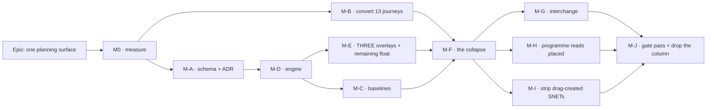

# Implementation Plan: One planning surface — Visual is the plan, Early, Late and Levelled are overlays

- **Feature spec:** [`./feature-spec.md`](./feature-spec.md) — **Draft, awaiting approval**
- **Falsification conditions:** [`./falsification.md`](./falsification.md) — **committed in its own
  commit before any harness runs** (ADR-0128's ordering)
- **Status:** Draft
- **Owner:** _(to be assigned)_
- **Revised 2026-09-20** after the product owner answered §6. Three answers went against the stated
  defaults; **two new milestones exist that did not before (M-H programme, M-I the strip), M-E
  roughly doubled, and the strip created a hard ordering constraint** — everything is re-derived
  rather than patched.

---

## Breakdown

**Why the collapse is late among the behavioural milestones.** The tempting sequence starts with it
— it is the headline and it is one ternary (spec C1). It is also the sequence in which a planner
gets placed bars with _total_ float beside them, no lens to judge a placement by, a Late overlay
deleted with the mode that gated it, and thirteen journeys going red at once.

**Why the strip is later still, and this is a hard constraint rather than a preference.** Converting
a binding `SNET` to a `visualStart` preserves the bar **only for a renderer reading
`visualEffective*`**. Before M-F, an `EARLY` plan renders from `early*` — and stripping the
constraint makes `early*` fall back to logic-earliest, which is **earlier**. So running the strip
before the collapse would move every affected bar on every `EARLY` plan: the precise outcome FC-10
clause C exists to forbid. **M-I cannot precede M-F**, and the plan says so where somebody
resequencing under pressure will read it.

### Epic

**One planning surface** — delete `schedulingMode`; placed dates become the single downstream truth,
including across a plan boundary; earliest, latest **and levelled** become ghost overlays beside
unmoved bars; screen float becomes remaining float; drag-created constraints are stripped once,
recorded and reported. Roadmap theme: the scheduling model (`docs/ROADMAP.md` §53–54).

---

## Milestone M0 — Measure before anything is built

**Outcome:** six readings that decide four design questions.
**Ships dark:** the only deployed artefact is new entries in the staff diagnostics registry.
**Entry point (staff, not planner):** `Staff console → Diagnostics → Run`.
**Journey:** `e2e-staff` gains a case asserting the new entries render with the fixed all-numeric row
shape. (The planner-facing journey lands at M-E, the first user-facing milestone — ADR-0081.)

> **Grown by CQ-7's answer.** M0 now sizes the strip population as well as the baseline question,
> because the product owner's instruction was explicit: _measure the exact population before M-I
> strips anything_, and that measurement **gates** the strip (FC-10 clause B) rather than informing
> it.

#### Feature: estate readings

> **Complexity:** M (was S — two more entries, one with a three-way split)
> **Dependencies:** none
> **Risks:** the registry's row shape is closed and all-numeric (gates S-1/S-4) → every question is
> `count(*)` plus `affected_plans`/`affected_organizations`, which they already are. · A query taking
> caller input reintroduces the differencing oracle ADR-0140 D2 clause 2 forbids → all take **no
> parameters**. · An uncosted query → ADR-0140's own M0 found the obvious anchoring argument false
> and the candidate index **not chosen at all**; cost each against a diluted estate first.
> **Testing requirements:** the registry's structural gates; one repository spec per entry with a
> fixture where the count is non-zero **and** one where it is zero (a query that always returns zero
> passes a subset assertion).

##### Task M0-T1 — five diagnostics entries

- **Description:** `visual-placement-plans`; `visual-placement-activities`;
  `baselines-over-placed-plans`; **`drag-created-snet-population`** (three-way split: binding
  `early_start = constraint_date`, inert `early_start > constraint_date`, unknown
  `early_start IS NULL`); **`snet-full-baseline-coverage`** (of the binding set, how many a
  post-ADR-0126 `revision_snapshot_level = 'FULL'` baseline covers). `nature: 'prospective'` while
  the epic is open.
- **Complexity:** M · **Dependencies:** none
- **Risks:** the three-way split must be **exhaustive and disjoint** — an activity is binding, inert
  or unknown and nothing else → assert `binding + inert + unknown === total SNET count` in the
  repository spec, which is the cheapest possible guard against a mis-written `WHERE`.
- **Development steps:**
  1. Add five `DiagnosticEntry` constants; extend `DIAGNOSTIC_IDS`.
  2. Cost each on a diluted estate; commit `m0/measurements.md` with the plan output and the
     re-arm trigger.
  3. Take the readings on the deployed host; commit `m0/estate-readings.md`.
  4. **Apply FC-1's decision table and FC-10 clause B's bound**, in writing, before M-A and M-I open.

#### Feature: the ghost-overlay cost probe

> **Complexity:** M
> **Dependencies:** none
> **Risks:** a container measurement is worthless — ADR-0127 D8 disqualified that environment by
> name after its no-change baseline moved 0.93 → 10.00 pp in an hour → taken on the product owner's
> hardware, one sitting, spread reported. · **A fixture with levelling off draws two ghosts and
> reports a number for a model the product does not have** → the fixture sets `levelResources` and
> the probe asserts a non-zero count of **levelled** ghosts drawn while measured (ADR-0129 P3's
> rule; ADR-0066's finding that a draw benchmark once measured the cull rather than the painter). ·
> A prototype that bypasses the real painter measures the prototype → it paints through
> `paintScene`, and its docblock says where it bypasses the product (ADR-0081's third decision).
> **Testing requirements:** the probe judge's `INDETERMINATE` branch is reachable and asserted.

##### Task M0-T2 — `ghost-overlay` probe scenario, **three members**

- **Complexity:** M · **Dependencies:** M0-T1 (sequenced so one staff release carries both)
- **Risks:** judging at Fit alone → FC-5 splits the limbs; #260 records a Fit baseline of 98.33 pp
  leaving less headroom than the bar, so a pp delta there cannot fail.
- **Development steps:**
  1. Add the scenario; throwaway three-member ghost painter behind it.
  2. Take Week/500, Week/2,000, Fit/500, Fit/2,000, with 0, 1, 2 and 3 overlays on — **the
     per-member increment is what the withdrawal ladder needs**, and a single all-on reading cannot
     supply it.
  3. Commit the readings **with the spread**; apply FC-5's ladder if limb 2 fails and record which
     rung was needed.

---

## Milestone M-A — The schema, and the ADR

**Outcome:** the columns and the table this epic needs exist and are described.
**Ships dark:** every new column is unwritten and unread.
**Journey:** none. API e2e asserts the migrations against a **populated** database.

> **Every item goes through `database-architect`, without exception** (CLAUDE.md §19.3/§20). If it
> returns nothing, fails, or is slow, **re-run it**. Waiting is cheap; a checksummed migration
> against a real database is not.

#### Feature: baseline placement columns + the basis discriminator

> **Complexity:** M · **Dependencies:** M0 (FC-1 decides the DEFAULT)
> **Risks:** a migration a pristine database cannot test (ADR-0107) → rehearsed against a database
> populated by replaying the earlier migrations, negative control naming the constraint. · A fourth
> child table off `baseline` broke 557 of 587 API e2e tests on a RESTRICT FK (ADR-0126) → **columns
> only here**, and the DMMF-derived retention census is re-run.
> **Testing requirements:** a migration spec reading the SQL **from the shipped file**, never
> restated; each case verified red against the defect it guards.

##### Task M-A-T1 — `baseline_activities.placed_start` / `placed_finish`

- **Description:** two nullable `DATE`, **no DEFAULT** — unknowable for a pre-existing row
  (ADR-0126; `budgetedExpense`'s "0 is a claim").
- **Complexity:** S · **Dependencies:** M0

##### Task M-A-T2 — `baselines.date_basis`

- **Description:** records what the existing `baseline_start`/`baseline_finish` **mean** — the
  question a row count structurally cannot answer.
- **Complexity:** S · **Dependencies:** M-A-T1, **FC-1's decision**
- **Risks:** `DEFAULT 'EARLY'` over a baseline captured from a placed plan asserts a basis that row
  never had → FC-1 reading 3 gates it.
- **Development steps:**
  1. Apply FC-1's branch, justifying it in the migration comment by `baseline.repository.ts:207-208`
     being the only write path and carrying no branch on the mode.
  2. Enum + column in two migrations — Postgres forbids using a label in the transaction that added
     it (ADR-0053 M3).
  3. Test both worlds regardless of which shipped, so the branch not taken is still described.

##### Task M-A-T3 — `activities.remaining_float` (**CQ-1**)

- **Description:** nullable `INT`, engine-owned, written by the existing `unnest`, outside the
  version/`updated_at` path. Mirrors `free_float`.
- **Complexity:** S · **Dependencies:** **CQ-1's answer — `database-architect`'s, not the product
  owner's.** If the answer is "derive at the DTO", **this task does not exist**. Do not build both.

##### Task M-A-T4 — `placement_migration_log` (**new, for CQ-7**)

- **Description:** write-once: `activity_id` (**non-FK**), `plan_id`, `organization_id`,
  `prior_constraint_type`, `prior_constraint_date`, `migrated_at`.
- **Complexity:** M · **Dependencies:** none
- **Risks:** **an FK to `activities` would reproduce ADR-0126's RESTRICT trap** and would also
  delete the record exactly when somebody wants it (after the activity is gone) → non-FK, the
  ADR-0025 `source_activity_id` precedent. · A table nobody ever reads is dead weight → M-I ships
  its read endpoint and its notice in the same milestone, so it is never write-only.
- **Testing:** the retention census (ADR-0126 M4) is re-run — a new table is exactly what that
  census exists to notice. **Whether this table is swept by ADR-0096 retention is a question for
  `database-architect`**, and the spec does not answer it: a record of an irreversible act arguably
  should outlive a 90-day window, and that is a decision, not an omission.

#### Feature: the ADR

##### Task M-A-T5 — draft ADR-01NN

- **Description:** spec §4.15's outline, **ten decisions** (D9 levelled-as-renderer and D10 the
  programme basis are new). Filed at the next free number, **checked at the moment of filing** —
  ADR-0079 took `0079` rather than the `0078` its plan named, because the number was taken in
  between.
- **Complexity:** M · **Dependencies:** M0's readings (the ADR quotes them)
- **Testing:** `pnpm check:adr-coverage` (index **and** `docs/ROADMAP.md`), `check:adr-register` —
  **and the `CLAUDE.md` §16 entry is written in the same commit** (ADR-0147 exists because that was
  missed ten times; the gate now refuses the commit).
- **Development steps:**
  1. Write it; record every §0 correction as the ADR's own findings.
  2. `CLAUDE.md` §16 bullet **and** `docs/ROADMAP.md` entry.
  3. Spec header → `Approved` (`check:spec-status` refuses a `Draft` spec any ADR cites, ADR-0131).

---

## Milestone M-B — Convert the thirteen journeys, before the flag goes

**Outcome:** every canvas journey runs with placement live and is green.
**Ships dark:** test-only.
**Journey:** this milestone **is** the journeys.

> **ADR-0084 batch-1 applied in advance**, and a hard gate: that retirement retired three flags, CI
> found two were pinned off by a whole config, six editing specs stranded. Convert the harness
> **before** the flag goes.
>
> **It is also the largest coverage change in the epic.** ADR-0092 records `e2e-workspace-chrome` as
> the first journey ever to run in Visual mode — _"and that is exactly where a real placement defect
> was hiding"_. Expect findings; that is the point.

#### Feature: unpin and triage

> **Complexity:** L — **the largest single unknown, deliberately unpredicted** (FC-6's stated absent
> prediction)
> **Dependencies:** none — parallel with M-A
> **Risks:** the cheap way out of a red suite is a pin, which restores the condition the epic deletes
> while leaving the suite green → FC-6 clause 2, unwaivable. · A spec asserting the Early surface is
> not a failure to fix → FC-6's clause allows **deletion** (ADR-0088's "a world no shipped bundle can
> produce").
> **Testing requirements:** `scripts/e2e-sweep.sh` over the **derived** list — ADR-0112 found it
> wrong in both directions, so a hand-typed subset is not evidence.

##### Task M-B-T1 — remove the thirteen pins, one commit per suite

- **Description:** `interchange:65`, `loe:63`, `authoring-flow:75`, `library:76`, `wbs:77`,
  `resource-view:81`, `search-nav:88`, `copy-paste:101`, `gantt:73`, `share:69`, `undo:61`,
  `authoring:62`, `multi-select:94`.
- **Complexity:** L · **Dependencies:** none
- **Risks:** a suite green for the wrong reason → each conversion run locally
  (`scripts/e2e-local.sh web:<suite>`) before pushing; CI is the second opinion.
- **Development steps:**
  1. Smallest first. Remove the pin, run locally, record the outcome.
  2. Triage every failure into FC-6 clause 3's three classes with a one-line reason.
  3. Commit `m-b/triage.md`. **A count with no classification does not satisfy the clause.**
  4. Fix class (a) defects **here**, each with a regression test verified red first. They are
     pre-existing defects the pins were hiding, not this epic's regressions, and each may deserve
     its own register row.

##### Task M-B-T2 — rewrite the three flag docblocks

- **Description:** `library:13`, `gantt-editing:17-23`, `workspace-chrome:8` explain decisions about
  a flag that will not exist. Two carry load-bearing history (gantt-editing's records a real defect)
  → **rewrite, preserving the finding, dropping the flag name**; do not delete.
- **Complexity:** S · **Dependencies:** M-B-T1

---

## Milestone M-C — A baseline freezes the placement

**Outcome:** a capture records where the work was placed and which basis it froze.
**Ships dark, deliberately, and says so** (ADR-0081: there is no third state) — the columns are
written and returned; no screen reads them until M-F.
**Journey:** none. API e2e.

#### Feature: capture and report the basis

> **Complexity:** M · **Dependencies:** M-A-T1/T2, M-D
> **Risks:** writing placed dates into `baseline_start` would **silently redefine** a public field
> five consumers read → the existing columns keep their meaning and the placement gets new ones,
> which is what makes `date_basis` meaningful rather than decorative.
> **Testing requirements:** a capture over a placed plan and an unplaced one, asserting the unplaced
> capture's placed columns **equal** its early columns (`compute.visual.spec.ts:71-80` at product
> level).

##### Task M-C-T1 — capture writes placed dates + basis

- **Description:** `baseline.repository.ts:207-208` gains `placedStart: a.visualEffectiveStart`,
  `placedFinish: a.visualEffectiveFinish`; the `baselines` row gains `date_basis: 'PLACED'`. Inside
  the plan advisory lock the capture already holds — ADR-0125 CQ-1's pairing argument: the copy must
  be paired with the recalculation that produced the frozen rows.
- **Complexity:** S · **Dependencies:** M-A-T1/T2
- **Testing:** the immutability assertion (soft-delete/restore stamps only `deletedAt`/
  `deleteBatchId`) extended to the new columns.

##### Task M-C-T2 — the comparison reports what it cannot assess

- **Description:** variance and the revision delta read `date_basis`; an `EARLY`-basis baseline
  against a placed live plan reports a **typed reason**, never a number. Reuse ADR-0126's
  `NOT_ASSESSABLE` vocabulary rather than inventing a second.
- **Complexity:** M · **Dependencies:** M-C-T1
- **Risks:** `?? 'MATCH'` is the exact lie the discriminator prevents (ADR-0125's words) → asserted
  with a case verified red against a coalesce. · **A migrated plan (M-I) will show float variance
  against a pre-migration baseline** — that is a basis change, not slippage, and the comparison must
  not present it as slippage.
- **Testing:** unit cases for all four basis pairings; an API e2e comparing **whole payloads**
  rather than three empty arrays — an oracle is a difference (ADR-0098).

---

## Milestone M-D — The engine: remaining float and the two-sided conflict

**Outcome:** the two derived quantities exist and are on the wire.
**Ships dark:** additive, absent-safe; no screen reads them.
**Journey:** none. Engine units, conformance, API e2e.

#### Feature: remaining float

> **Complexity:** M · **Dependencies:** M-A-T3 (if CQ-1 persists it)
> **Risks:** FC-2/FC-3 govern the golden suite; a `-u` re-baseline makes a correct value beside a
> silent second change invisible (ADR-0106). · Client derivation is a day wrong on the 19-of-164
> deployed activities ADR-0140 measured (C6).
> **Testing requirements:** FC-2 (Pass 1 byte-identical, suites **unedited**), FC-3 (enumerated
> re-baseline), FC-4 (a fixture where naive and correct **disagree**, verified red).

##### Task M-D-T1 — `remainingFloatMinutes` on `EngineResult`

- **Description:** `totalFloat − (visualDriftMinutes ?? 0)`, in minutes. Null drift ⇒ equals total
  float, which is what makes the no-placement path identical.
- **Complexity:** S · **Testing:** the null-drift case asserted explicitly — it is what every plan in
  the estate takes today.

##### Task M-D-T2 — one rounding in the repository

- **Description:** the same `factorFor(activityId)` used at `:750-754`/`:770-773`. **Never**
  `round(T/f) − round(d/f)`.
- **Complexity:** S · **Dependencies:** M-D-T1 · **Testing:** FC-4's disagreeing fixture.

#### Feature: the two-sided conflict flag

> **Complexity:** M · **Dependencies:** M-D-T1 (same engine visit)
> **Risks:** reaching for a second backward pass → ADR-0033 D5 settled SQ-e and that stands; the
> bound comes from the existing `clampBackwardFinish`/`clampSecondaryBackwardFinish`. · Changing what
> a constraint **means** would move ADR-0035 → the clamps are read, never reinterpreted.
> **Testing requirements:** the `it.todo` at `compute.visual.spec.ts:216-219` becomes real, with an
> `MSO`/`MFO` sibling beside it — today a placement **later** than an `MSO` produces no flag at all,
> because `compute.ts:320` clamps `logicEarliest` **to** the pin.

##### Task M-D-T3 — `visualConflictReason`

- **Description:** `visualConflict` stays boolean; a sibling says which. Assert it only ever gains
  `true` where it is `false` today.
- **Complexity:** M · **Dependencies:** M-D-T1

##### Task M-D-T4 — the conflict key and its remedy

- **Description:** ADR-0094's record is **total**, so the key is a typecheck failure until the remedy
  exists. That is the feature.
- **Complexity:** S · **Dependencies:** M-D-T3
- **Risks:** a remedy rendering nothing → ADR-0094 records one of its three legitimately doing so;
  if that is the answer, **say so** rather than building a conflict-flavoured twin of an existing
  control (ADR-0093's defect inside one surface).

---

## Milestone M-E — Three overlays, and the remaining-float read-out

**Outcome:** a planner sees earliest, latest **and levelled** beside their placed bars, keeps
editing, and reads the float they have left.
**Entry point:** `View ▾ ▸ Overlays ▸ Earliest dates / Latest dates / Levelled dates`; and the float
read-out on the bar, the Gantt `Float` column and the activities table.
**Journey:** `e2e-workspace-chrome` — **the one config already running with placement live**
(ADR-0092) — toggles all three, asserts a ghost is present and the bar has **not** moved, asserts
the listbox row states the overlay dates, asserts **editing is still available** with an overlay on,
and asserts the `Levelled` toggle is **shaded with a reason** on a plan where levelling never ran.
**ADR-0081: the journey lands here, not at enablement.**

> **Roughly doubled by CQ-4's answer, and the reason is spec finding C8: `leveledStart`/
> `leveledFinish` are rendered by NOTHING today.** This is not folding an existing surface into a
> model — it is the first renderer those columns have ever had, which means there is **no existing
> behaviour to preserve and no parity suite to lean on**, the usual safety net for this epic's other
> surfaces. ADR-0041 shipped the pass and the columns and never the surface: the ADR-0067/0070/0071
> shape, one field along.

#### Feature: the ghost layer

> **Complexity:** L · **Dependencies:** M0-T2 (FC-5's verdict), M-D
> **Risks:** **FC-5's withdrawal ladder may cap or remove overlays below a `pxPerDay` floor** — a
> designed outcome, not a failure. · A new canvas token pair absent from `@theme inline` paints
> **nothing in a browser while the contrast gate stays green** (ADR-0100 M4), and a `var()` handed to
> `fillStyle` is **discarded silently, keeping the previous colour** (ADR-0121) → FC-8 clause 2
> asserts reachability in a browser; the palette resolves against the **canvas root** (ADR-0102's
> finding that the painter had never once used the canvas surface scope). · **Three kinds that are
> distinguishable from the bar but not from each other** is a 1.4.1 failure a two-member design
> cannot exhibit → FC-8 clause 3 is three-way and its fixture draws all three on one activity.
> **Testing requirements:** FC-8 all four clauses; the paint counting-stub gates (ADR-0054's shape-
> not-milliseconds pattern); the golden paint log re-baselined against a written list (ADR-0106).

##### Task M-E-T1 — `ghostRect` beside the existing tails

- **Description:** one function in `render/geometry.ts` beside `floatTailRect`/`driftTailRect`
  (`:145-184`). **Reuse the ADR-0054 vocabulary; do not invent a parallel one** (ADR-0065).
- **Complexity:** S · **Testing:** the coincidence case — a ghost equal to the bar returns null —
  verified red.

##### Task M-E-T2 — **one** layer, three members

- **Description:** one painter taking the `PaintFrame`, drawn **before** the bars so a ghost never
  occludes its subject. **A painter per member is the drift this argument exists to prevent.**
- **Complexity:** M · **Dependencies:** M-E-T1
- **Risks:** culling by `visibleIds` is **correct here** (the ghost's subject is a scene activity)
  and was **wrong** in ADR-0127's analogous layer (removed work is by definition not in the scene) →
  assert it rather than inherit the instruction.

##### Task M-E-T3 — the levelled member's two absences

- **Description:** `leveledStart === null` ⇔ the pass never ran → toggle **shaded with a reason**
  naming the plan setting (ADR-0082). `leveledStart` non-null with `levelingDelay` 0 ⇔ the pass ran
  and this activity did not move → ghost coincides → withheld by M-E-T1's rule.
- **Complexity:** M · **Dependencies:** M-E-T2
- **Risks:** **collapsing the two is the ADR-0126 "zero rows vs nobody looked" defect one field
  along** → the distinction is **asserted, not assumed**: `goldens.ts:628-635` shows an undelayed
  activity receiving `leveledStart` with `levelingDelay: 0` when the pass runs, and
  `schedule.repository.ts:776-777` writes all-null when it is off. A structural test pins that the
  engine writes a value for **every** activity when the pass runs, because the whole toggle state
  depends on it.
- **Testing:** both states in the journey, since only a real browser shows a shaded toggle's reason.

##### Task M-E-T4 — the toggles

- **Description:** `View ▾ ▸ Overlays`, three checkboxes, URL-backed through the **ADR-0123 codec** —
  `?overlay=early,late,levelled` is a string; a lone value must not coerce.
- **Complexity:** M · **Dependencies:** M-E-T3
- **Risks:** the existing `Late Start overlay` suppresses editing (ADR-0033 D6) and its replacement
  must not → asserted in the journey; no unit test sees a suppressed pointer handler.

##### Task M-E-T5 — the accessible channel

- **Description:** the listbox row states each active overlay's dates in words. **A canvas claim is
  not an accessible claim** (ADR-0122, written after two places asserted a text equivalent for the
  WBS band that did not exist).
- **Complexity:** M · **Dependencies:** M-E-T2
- **Testing:** the a11y suite; the journey asserts the row text, not the canvas.

#### Feature: remaining float on screen

##### Task M-E-T6 — one formatter, three surfaces

- **Description:** a labelled sibling to `formatFloat` in `lib/schedule-format.ts`, consumed by the
  bar read-out, the Gantt `Float` column and the activities table.
- **Complexity:** M · **Dependencies:** M-D-T2
- **Risks:** **a bare "Float" label that silently changed meaning is the defect class this register
  files most often** → the label says which float it is. · Total float is still right in three places
  (DCMA health metrics, baseline float variance, float-paths) → a structural test pins that those
  three still read `totalFloat`, verified red against a global swap.

---

## Milestone M-F — The collapse

**Outcome:** `schedulingMode` is gone; every surface reads placed dates unconditionally; every drag
hand-places.
**Entry point:** none added — this **removes** the `Scheduling mode` control. What becomes reachable
is that every planner now gets what M-E built.
**Journey:** the full sweep, plus FC-7's no-placement parity comparison.

> **Blocked on M-B** (FC-6 clause 1). Deleting the flag before the configs are converted is the
> ADR-0084 batch-1 failure.

#### Feature: delete the selector

> **Complexity:** L · **Dependencies:** M-B (all clauses), M-C, M-E
> **Risks:** **the most dangerous misreading available is "Early mode is Pass 1, so deleting the mode
> means deleting Pass 1".** Pass 1 **is** the float, criticality, Late dates, the drift baseline,
> DCMA and the whole ADR-0034 matrix. The mode is a render-selector; the pass is the arithmetic.
> Written in the plan, the ADR and the engine docblock because it reads as a tidy-up.
> **Testing requirements:** FC-7 (narrowed — see its own text), the full sweep, SC-1's grep.

##### Task M-F-T1 — delete the one derivation

- **Description:** `plan-workspace-toolbar.tsx:476-480`. **This is the whole of "one truth
  downstream"** (spec C1).
- **Complexity:** S · **Dependencies:** M-E
- **Testing:** `date-source-consistency.test.ts` is the before/after oracle — its Visual cases become
  the only cases; its Early cases are deleted or inverted deliberately, one at a time.

##### Task M-F-T2 — narrow or remove `BarDateSource`

- **Description:** **prefer removing the parameter** over a one-value union, which invites a second
  value back; the compiler drives the ~40 sites. `'late'` survives only if the overlay needs it — and
  under M-E it does **not**, because a ghost reads the late columns directly rather than re-sourcing
  the bar.
- **Complexity:** M · **Dependencies:** M-F-T1

##### Task M-F-T3 — the drag always places

- **Description:** delete the `isVisualMode` branches (`:659-661`, `:1064-1112`, `:1181-1220`, and
  `moveMany`'s at `:776-780`). The SNET arms go; the `setVisualStart` arms become unconditional.
- **Complexity:** M · **Dependencies:** M-F-T1
- **Risks:** `moveMany` branches through `bulkMoveSnapshots` precisely so singular and plural cannot
  disagree (its own comment) → remove the branch in **one** place.

##### Task M-F-T4 — DTO and plan settings

- **Description:** out of `CreatePlanDto`, `UpdatePlanDto`, `PlanResponseDto`, `PlanScheduleSettings`
  and `plan-governance-fields.ts`.
- **Complexity:** M · **Dependencies:** M-F-T1
- **Risks:** the governance set is **one `const` the redactor spreads**, so removing a member stops it
  being recordable in the same commit (ADR-0073 C3.2, designed) — but **existing audit rows keep
  naming it**, which is correct and permanent. Do not "clean up" history.
- **Testing:** API e2e asserting the removed field yields **422** (`app.module.ts:141-147`,
  verified); `docs/API.md` and OpenAPI in the same PR, stating the 422 and the ADR-0047 window in
  which a cached bundle's save is refused.

##### Task M-F-T5 — the flag, and the segmented control

- **Description:** delete `SCHEDULING_MODES_ENABLED` (`config/env.ts:161-162`) — **note it is
  derived** (`&& CANVAS_AUTHORING_ENABLED`), so not a one-line removal. Delete the mode segmented
  control.
- **Complexity:** M · **Dependencies:** M-B, M-F-T1..T4
- **Risks:** the control is one half of an ADR-0119 `segment` partition whose precondition is
  **all-or-nothing** — a partial partition leaves an unnamed region a reader must enter to discover
  is empty → re-check `partitionBySegment` holds with one switch; its development-only warning fires
  if not.
- **Testing:** `pnpm check:flags`; toolbar structural tests; FC-6 clause 2 (**zero** re-pins).

##### Task M-F-T6 — `clear-visual-placement` becomes unconditional

- **Description:** its Visual-mode gate goes. **Dissolves `docs/TECH_DEBT.md` #204(c)'s cause** (its
  symptom is already fixed by ADR-0135's focus hand-off). Update the row rather than closing it
  silently.
- **Complexity:** S · **Dependencies:** M-F-T1

---

## Milestone M-G — Interchange reports the placement

**Outcome:** an export says what happened to the placements instead of dropping them in silence.
**Entry point:** the existing export dialog; the report gains a finding.
**Journey:** `e2e-interchange` — unpinned by M-B — asserts the finding on a placed plan and a
byte-identical export for an unplaced one.

#### Feature: the mapping contract tells the truth

> **Complexity:** M · **Dependencies:** M-F · **CQ-3 answered (B)**
> **Risks:** translating to `SNET` exports a commitment the planner never made — **ADR-0033 rejected
> this shape by name** (`0033-…:146-148`) → (B) is the decision; option (C) is not built.
> **Testing requirements:** round-trip (export → re-import → structural equivalence), ADR-0050's
> strongest correctness gate; plus the byte-identical assertion for the unplaced path.

##### Task M-G-T1 — the finding and the table

- **Description:** the `InterchangeReport` states that placements did not travel and how many there
  were; ADR-0050's mapping-contract table gains `visualStart` **in both directions** (absent today,
  so the current drop is not even a documented approximation).
- **Complexity:** M · **Dependencies:** M-F

---

## Milestone M-H — The programme reads placed dates

**Outcome:** a downstream plan is driven by where upstream work was **placed**.
**Entry point:** none added — a programme recalculation, which already exists, now derives from a
different basis. **Ships as a behaviour change, and the release note says so.**
**Journey:** `e2e-programme` asserts a downstream bound moving when an upstream bar is placed, and
**not** moving when the upstream closure carries no placement.

> **New, from CQ-5's answer against the stated default.** It is its own milestone because it alters
> the arithmetic of every linked plan, and its blast radius is not this epic's other surfaces.

#### Feature: the upstream basis

> **Complexity:** M · **Dependencies:** M-F
> **Risks:** **leaving the field named `predecessorEarlyFinish` while feeding it placed dates is the
> silent-redefinition defect this spec refuses for `baselineStart`** → the rename is part of the
> change, not a follow-up. · **Two producers** (spec C9) → both move together, or the conformance
> harness certifies a basis the product does not use, **green**.
> **Testing requirements:** FC-9, both clauses, with the harness shown to fail when **either**
> producer alone is switched.

##### Task M-H-T1 — switch the projection and rename it

- **Description:** `cross-plan-dependency.repository.ts:189` selects the placed columns;
  `IncomingCrossPlanEdgeRow` (`:37-43`), `IncomingCrossPlanEdge`
  (`cross-plan-derivation.ts:34-35`) and the `schedule.service.ts:1467-1472` mapping rename to
  `predecessorPlaced*`. **`forwardBound`'s arithmetic (`:122-150`) is untouched.**
- **Complexity:** M · **Dependencies:** M-F
- **Testing:** FC-9 clause 1 (byte-identical with no upstream placement) and clause 2.

##### Task M-H-T2 — move the second producer with it

- **Description:** `conformance/cross-plan-adapter.ts:130-131` builds the same shape from an
  in-memory map. Move it in the same commit.
- **Complexity:** S · **Dependencies:** M-H-T1
- **Risks:** moving one and not the other is green and wrong → a structural test asserts both
  producers name the same field.

##### Task M-H-T3 — state the asymmetry

- **Description:** the **backward** bound keeps reading the successor's **late** dates
  (`:201-206`) because **there is no placed-late** — Pass 2 is forward-only and ADR-0033 D5 settled
  SQ-e. Record it in the ADR (D10), in the repository docblock and in `docs/API.md`.
- **Complexity:** S · **Dependencies:** M-H-T1
- **Risks:** a reader meeting half a change assumes the other half was forgotten and "fixes" it →
  the docblock says why it cannot exist, not merely that it was not done.

---

## Milestone M-I — Strip the drag-created constraints

**Outcome:** the constraints a drag wrote are converted to placements, recorded, and reported.
**Entry point:** `Plan workspace → dock notice: "N activities had a drag-created constraint
converted to a placement"`, with a link to the affected activities.
**Journey:** a new `e2e-placement-migration` — seeds a plan with a binding SNET, an inert SNET and an
uncalculated activity; runs the migration; asserts **every bar is where it was**, asserts the inert
and uncalculated ones were **not touched**, asserts the notice states the count, asserts dismissal
persists.

> **New, from CQ-7's answer against the stated default: _"this is the one irreversible decision in
> the epic and it needs rails, not a warning."_**
>
> **It cannot precede M-F.** The conversion preserves a bar only for a renderer reading
> `visualEffective*`; before the collapse an `EARLY` plan renders from `early*`, which the strip
> makes **earlier**. Running it first would move every affected bar — exactly what FC-10 clause C
> forbids.

#### Feature: the conversion

> **Complexity:** L · **Dependencies:** M-F, M-A-T4, **M0-T1 reading 4 + FC-10 clause B**
> **Risks:** **stripping an inert SNET places the bar earlier than logic allows and raises a conflict
> on a plan nobody touched** → the binding/inert test is the whole safety argument, and FC-10 clause
> C is verified red against a strip that converts the inert one. · **The strip is unauditable by
> construction** (`REASONS.PLAN_CONTENT`, `audit-coverage.structural.spec.ts:264`, verified) → the
> durable record is not a nicety. · A plan never recalculated has no discriminator → **left alone,
> counted, reported**. · **Downstream `early*`, float and criticality change**, legitimately → said
> out loud in the notice and in the release note, and FC-10 clause C asserts it **positively**.
> **Testing requirements:** FC-10 clauses C and D; the journey above.

##### Task M-I-T1 — the migration

- **Description:** for each activity with `constraint_type = 'SNET'` and
  `early_start = constraint_date`: write the `placement_migration_log` row, set
  `visual_start = constraint_date`, clear `constraint_type`/`constraint_date` — **in one
  transaction**, record first.
- **Complexity:** L · **Dependencies:** M-A-T4, FC-10 clause B's verdict
- **Risks:** **Prisma does not chunk an `{ in: [...] }` list** — ADR-0096 hit a bind-parameter error
  at 16,384 ids that its catch block reported as a retryable failure → batch explicitly. · Touching a
  non-`SNET` constraint → the `WHERE` names the kind, and a test asserts every other kind is
  untouched.
- **Development steps:**
  1. Apply FC-10 clause B: **unattended** if within bound, otherwise the planner-initiated form.
  2. Write the record, then the conversion, in one transaction, batched.
  3. Assert the three-way split is exhaustive and disjoint (M0-T1's guard, reused).

##### Task M-I-T2 — the report

- **Description:** `GET …/plans/:planId/placement-migration` over the log; a dock strip (ADR-0092's
  outlet — **0 px of canvas**) stating the count and **naming the consequence**: bars have not moved,
  successors may now show more float. Dismissed per user in `localStorage` keyed by user id
  (ADR-0098's precedent; sign-out sweeps it).
- **Complexity:** M · **Dependencies:** M-I-T1
- **Risks:** a notice that states a count without the consequence leaves the planner to discover the
  float change themselves, which is the silence CQ-7 rejected → the copy names both. · A write-only
  table is dead weight → this endpoint is why M-A-T4 is not.
- **Testing:** the journey; an a11y check on the strip; **the notice's copy is reviewed by
  `ux-reviewer` before M-J**, because it is the only place the product explains an irreversible act.

---

## Milestone M-J — The gate pass, and the column goes

**Outcome:** the specialist reviews are folded; release N+1 drops the column and the enum.
**Entry point:** none.
**Journey:** the full sweep on the release that drops the column.

> **Two releases, ADR-0107's ordering.** M-F stops reading and writing `scheduling_mode`; M-J drops
> it. One release means a rollback meets a missing column — _a rollback causing a worse outage than
> the fault._

#### Feature: the specialist gate pass

> **Complexity:** L · **Dependencies:** M-G, M-H, M-I
> **Risks:** nine consecutive epics here have run a gate pass and **every one blocked on defects that
> passed a human read**; the commonest shape is _one correct pattern applied to a control and not its
> neighbour_. Budget for fold-ins.
> **Testing requirements:** every fold-in carries a regression test **verified red first**.

##### Task M-J-T1 — the reviews

- **Description:** `database-architect` (the migrations again, against the final code — **including
  whether `placement_migration_log` is swept by ADR-0096 retention**), `security-reviewer`,
  `api-reviewer`, `backend-performance-reviewer`, `component-reviewer`, `accessibility-reviewer`,
  `ux-reviewer` (**the migration notice copy specifically**). Ask each to **re-derive this epic's
  numbers from the shipped code** rather than trusting the spec.
- **Complexity:** L · **Dependencies:** M-G, M-H, M-I

##### Task M-J-T2 — drop the column and the enum

- **Complexity:** S · **Dependencies:** M-J-T1, **one release of separation from M-F**
- **Testing:** rehearsed against a populated database; the retention census re-run.

##### Task M-J-T3 — close the documents

- **Description:** spec header → `Accepted — shipped (ADR-01NN)` in the same commit that files the
  ADR's final state (ADR-0131). `#204(c)` updated with its cause dissolved. The `it.todo` at
  `compute.visual.spec.ts:216-219` is gone and the register says so. Re-nature the M0 diagnostics
  entries `retrospective` (**CQ-6**).
- **Complexity:** S · **Dependencies:** M-J-T2

---

## Sequencing & slices

| Order | Milestone                               | Releasable alone? | User-visible?                               |
| ----- | --------------------------------------- | ----------------- | ------------------------------------------- |
| 1     | **M0** measure                          | yes               | staff console only                          |
| 2     | **M-A** schema + ADR                    | yes               | no (dark)                                   |
| 2′    | **M-B** convert journeys (**parallel**) | yes               | no (test-only)                              |
| 3     | **M-D** engine                          | yes               | no (dark)                                   |
| 4     | **M-C** baselines                       | yes               | no (dark)                                   |
| 5     | **M-E** three overlays + float          | yes               | **yes — first user-facing**                 |
| 6     | **M-F** the collapse                    | yes               | **yes — breaking DTO (422)**                |
| 7     | **M-G** interchange                     | yes               | yes                                         |
| 8     | **M-H** programme                       | yes               | **yes — behaviour change for linked plans** |
| 9     | **M-I** the strip                       | yes               | **yes — irreversible; gated on FC-10**      |
| 10    | **M-J** gate pass + drop                | yes               | no                                          |

**No feature flag** (ADR-0088 D1). **The rollback is a commit boundary**, which is why each milestone
is one — and why M-E lands the overlays _before_ M-F makes placement universal, so reverting the
collapse leaves a coherent product.

**Two orderings are hard constraints, not preferences:** M-B before M-F (FC-6 clause 1), and
**M-F before M-I** (the strip's bar-preservation depends on the renderer reading `visualEffective*`).

**Version impact:** M-F is **breaking** (three DTOs lose a field; an old bundle gets 422). Pre-1.0 →
**minor** (CLAUDE.md §10), `BREAKING CHANGE:` footer, migration note. M-H is a behaviour change for
linked plans and needs its own release note. M-I is irreversible-in-effect and needs the loudest note
of the three.

## Definition of Done (per task)

Each PR satisfies the Feature Completion Criteria in [`docs/PROCESS.md`](../../PROCESS.md). Three
carry extra weight, each missed in this repository within the last month:

- **The pre-push gate is `pnpm prepush`, one command.** Running its parts by hand is how a gate gets
  missed — following the older wording sent an ADR to CI that `check:adr-coverage` refused, in a
  change whose whole subject was filing one.
- **`scripts/e2e-local.sh api`** for every `apps/api` change and **`web:<suite>`** for every touched
  journey, **before** pushing.
- **Every schema change goes through `database-architect`.** No exceptions; an unavailable agent is a
  reason to wait, never to proceed.

## Risks & assumptions (rollup)

| Risk / assumption                                                              | Likelihood                    | Impact                    | Mitigation                                                                                                                                                         |
| ------------------------------------------------------------------------------ | ----------------------------- | ------------------------- | ------------------------------------------------------------------------------------------------------------------------------------------------------------------ |
| **Thirteen journeys find real placement defects on first unpinned run**        | **high**                      | med                       | M-B is its own milestone, parallel, blocking M-F. Findings are the point.                                                                                          |
| **Three ghost kinds exceed the canvas's 2.2 fps of headroom at Fit**           | **med-high** (raised by CQ-4) | med                       | FC-5's ladder, measured **before** the layer is designed, with a **per-member** increment so the cap is derivable. ADR-0141's pitch floor is free and tried first. |
| **The levelled overlay is dark capability being lit — no parity suite exists** | **certain** (C8)              | med                       | ADR-0081 in full: entry point named, journey with the milestone. M-E-T3's two-absence distinction asserted structurally, not assumed.                              |
| **The strip moves a bar**                                                      | low                           | **high, irreversible**    | The binding/inert test; FC-10 clause C verified red against a strip that converts an inert one; M-F before M-I.                                                    |
| **The strip is unauditable**                                                   | **certain** (verified)        | med                       | The durable non-FK record, written before the delete, in the same transaction — and a read endpoint so it is never write-only.                                     |
| **The estate is bigger than the one measurement suggests**                     | low                           | med                       | FC-10 clause B's bound **fails loudly** rather than scaling silently; above it the strip becomes planner-initiated.                                                |
| **A migrated plan shows float variance against a pre-migration baseline**      | **certain**                   | low-med                   | It is a basis change, not slippage. `date_basis` is the vocabulary; M-C-T2 must not present it as slippage.                                                        |
| **The programme rename is done on one producer only**                          | med                           | **high, green and wrong** | FC-9's "shown to fail when either producer alone is switched"; a structural test asserts both name the same field.                                                 |
| Somebody reads "delete Early mode" as "delete Pass 1"                          | low                           | **catastrophic**          | In the plan, the ADR and the engine docblock. FC-2 makes it a hard failure.                                                                                        |
| A baseline exists over a placed plan, so `DEFAULT 'EARLY'` would lie           | **unknown until M0**          | med                       | FC-1 reading 3 gates it; both branches designed and tested.                                                                                                        |
| Remaining float's correctness motive is unexhibitable                          | low                           | low                       | FC-4's withdrawal clause narrows the justification in place.                                                                                                       |
| A new canvas token paints nothing while the gate stays green                   | **med**                       | med                       | FC-8 clause 2 (ADR-0100 M4), plus ADR-0121's `var()` finding and ADR-0102's canvas-root resolution.                                                                |
| The golden re-baseline hides a second change                                   | med                           | high                      | FC-3: a written list committed **before**. Never `-u`.                                                                                                             |
| Guest sees placed dates; levelled overlay absent                               | **certain, and correct**      | low                       | Asserted in `e2e-share`; `guest-api.ts:230` nulls `leveledStart`.                                                                                                  |
| `docs/API.md` not updated                                                      | med                           | med                       | ADR-0130's finding: `docs/DATABASE.md` got a full update for a change `docs/API.md` never heard about. Same PR.                                                    |
| This epic's own claims go stale                                                | med                           | med                       | Spec §0 records ten corrections. Re-verify the **problem** statement at each milestone (CLAUDE.md §19.11).                                                         |
