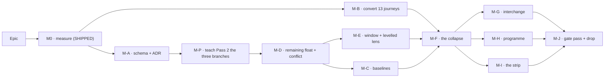

# Implementation Plan: One planning surface

- **Feature spec:** [`./feature-spec.md`](./feature-spec.md) — **Draft, awaiting approval**
- **Falsification conditions:** [`./falsification.md`](./falsification.md)
- **Status:** Draft
- **Owner:** _(to be assigned)_
- **Revised twice.** After §6 was answered (three answers against the stated defaults), and after
  four specialist reviews — two blocking — plus a product-owner decision on the overlay shape.
  **This revision adds a foundation milestone (M-P) the epic cannot ship without, rebuilds M-E
  around one window plus one rival ghost, and corrects M0-T1 to what has actually shipped.**

---

## Breakdown

**Three orderings are hard constraints, not preferences.**

1. **M-P before M-C and M-F.** Pass 2 is **not** a superset of Pass 1 (spec C11): a started
   activity's `earlyStart` is its actual start verbatim (`compute.ts:765`), a complete one's finish
   is its actual finish, and an LOE or summary spans its **derived** instants (`:752-753`) — none of
   which Pass 2 knows (`:305-352`, `:815-816`). Without M-P, **M-C freezes the data date instead of
   the actual start for every progressed activity, and a zero-length point for every summary and
   LOE — immutably and unbackfillably, under a column asserting it is a faithful record** — and M-F
   moves every such bar on screen.
2. **M-B before M-F** (FC-6 clause 1; ADR-0084 batch-1).
3. **M-F before M-I.** The strip preserves a bar only for a renderer reading `visualEffective*`.
   Before the collapse an `EARLY` plan renders from `early*`, which the strip makes **earlier** — so
   running it first moves every affected bar, which FC-10 clause C forbids.

### Epic

Delete `schedulingMode`; placed dates become the single downstream truth including across a plan
boundary; the **feasible window** and the **levelled ghost** become overlays beside unmoved bars;
screen float becomes remaining float; drag-created constraints are stripped once, recorded and
reported.

---

## Milestone M0 — Measure before anything is built · **SHIPPED**

**Status: landed** (`6b63bd82`, corrected by `5e6fb3ef`). Recorded here as built, not as planned —
and **corrected against what shipped**, because the instruction for this revision asked for a
reading that already exists.

**What shipped, and how it differs from this plan's previous version:**

- **Eight** new registry entries, **ten** total — not five, and not the "seven" the revision brief
  named. `DIAGNOSTIC_IDS` (`staff-diagnostics.registry.ts:24-35`) holds
  `visual-placement-plans`, `visual-placement-activities`, **`placement-on-early-plan`**,
  `baselines-over-placed-plans`, `snet-binding`, `snet-inert`, `snet-unclassified`,
  `snet-full-baseline-coverage`.
- **`placement-on-early-plan` is already there** (`:29`, `:296-297`, `:520`) — the
  `visual_start IS NOT NULL AND scheduling_mode = 'EARLY'` reading this revision was told to add.
  **The task would have been a duplicate, and what caught it was re-reading the registry — not a
  gate.** The closed `DIAGNOSTIC_IDS` union catches a duplicate **id**; it cannot catch a **second
  entry asking the same question under a different id**, which is the shape a task saying "add this
  reading" would actually have produced. _(An earlier draft of this bullet credited the union with
  catching it. A safety net described as wider than it is will be relied on, so the claim is
  narrowed to what it covers.)_ **Second time in this epic that re-verifying a problem statement
  removed work** (spec C1 was the first) — CLAUDE.md §19.11.
- **Four SNET classes, not three.** The fourth is
  `early_start IS NULL OR early_start < constraint_date`. It **arises two ways and only one
  clears**: a stored schedule predating the constraint (clears on recalculation), and a started
  activity whose actual start bypasses the clamp (`compute.ts:765` — spec C11 one surface along), so
  it reads below its constraint in a schedule computed seconds ago and **never** clears. M-I's
  notice must not imply these resolve.
- **The three-way split lives across three entries, not inside one.** Gate S-5's fixed all-numeric
  row shape makes an in-entry split inexpressible; three entries share one denominator and
  exhaustiveness is asserted **across** them, verified red against the plan's own earlier
  three-class version.
- **Neither `EXISTS` survived gate S-4**; both are joins with `count(DISTINCT …)`. **What that
  refusal costs is now known to depend on placement density, and this epic is what changes it** —
  `m0/measurements.md:65-106` records the original "the gate cost this registry nothing" finding and
  its stated mechanism as **withdrawn**: re-measured at three densities, the join and the refused
  `EXISTS` have **opposite cost models and cross over** (at 8-of-40 plans placed the join wins
  141 ms to 340; with every activity placed it loses 516 to 2.7). The escalation trigger is the
  crossover, and **M-J must re-run that harness rather than inherit the verdict** — see M-J-T1.

**Still owed from M0:** the ghost-cost probe, re-scoped by the product owner's overlay decision.

##### Task M0-T2 — the overlay cost probe _(re-scoped, not yet run)_

- **Description:** measure **window only**, **levelled only**, **both**, and **neither**, at Week and
  Fit, 500 and 2,000 — per FC-5's increments.
- **Complexity:** M
- **Risks:** a container reading is worthless (ADR-0127 D8 disqualified that environment by name).
  · **A fixture where almost nothing is levelling-delayed reports the cost of almost nothing** →
  FC-5's strengthened non-vacuity: a **stated proportion** of delayed activities, using
  `plan:capability-levelling` from the seed catalogue. · **The Fit limb needs the spread safeguard
  its Week sibling already had** — CLAUDE.md §17 records that framing needing five sittings and a
  measured 0.4 fps noise floor after two readings disagreed by 8.9 fps with no code change.
- **Development steps:** add the scenario; take the four increments at both framings; commit with
  spreads; apply FC-5's ladder if limb 2 fails and record which rung.

---

## Milestone M-P — Teach Pass 2 the three branches

**Outcome:** with no placement anywhere, `visualEffective*` equals `early*` for **every** activity,
including started, complete, LOE and `WBS_SUMMARY`.
**Ships dark:** no screen reads Pass 2 as authoritative yet; nothing user-visible changes for a plan
without progress, LOE or summary. **A progressed plan's placed-view dates change — to the correct
ones.**
**Journey:** none. FC-11 (engine) and FC-7 Part B (product, over the seed catalogue).

> **New, and the epic's foundation.** It exists because spec §1.2's premise — "Early is Visual's
> resting state" — was **true of the fixture and false in general**, and its citation
> (`compute.visual.spec.ts:71-80`) is five plain tasks in a 220-line file containing **zero**
> `actualStart`, `percentComplete`, `WBS_SUMMARY` or `LEVEL_OF_EFFORT`.

#### Feature: the three branches

> **Complexity:** L · **Dependencies:** M-A (ADR only — no schema)
> **Risks:** **touching Pass 1 while adding Pass 2 branches** → FC-2, with clause 3's verified-red
> step run here. · **Reading the actual-start rule from Pass 1 by paraphrase rather than by
> reference** → the branch conditions are `started`/`isComplete`/`pointLike` as Pass 1 computes
> them (`:752`, `:763-764`), shared rather than restated, or the two will drift exactly where they
> are meant to agree. · The `pointLike` rule is **type-dependent** (`activityIsLoe || activityIsSummary
? efInst === esInst : duration === 0`) and a careless port collapses a zero-duration TASK.
> **Testing requirements:** FC-11, verified red on all four rows first; FC-2 clause 3.

##### Task M-P-T1 — the parity case, red first

- **Description:** a `compute.visual.spec.ts` case with a started activity, a complete one, an LOE
  and a summary over a multi-day child, **no placement**, asserting `visualEffective* === early*`
  for every activity.
- **Complexity:** M · **Dependencies:** none
- **Testing:** **this is written and confirmed red before M-P-T2 exists.** Expected failures:
  in-progress early 02 Jan vs visualEffective 10 Jan; complete 02–05 vs 10–14; summary and LOE each
  collapsing to a point.

##### Task M-P-T2 — the branches

- **Description:** `visualEffectiveStart` takes the actual start verbatim when started;
  `visualEffectiveFinish` takes the actual finish when complete; `vInclusiveFinishOwn` uses the
  **derived** span for LOE and summary rather than the input duration.
- **Complexity:** L · **Dependencies:** M-P-T1
- **Risks:** a placed **and** started activity is a real combination — the actual start wins, as it
  does in Pass 1 ("actuals never move", ADR-0035 §1), and the placement is then inert for that
  activity. **Assert it**; it is the case a reader will assume goes the other way.
- **Testing:** FC-11; plus a placed-and-started case; plus FC-2 clause 3's mutation.

##### Task M-P-T3 — the product-level parity run

- **Description:** FC-7 Part B over the seed catalogue — a plan with progress, an LOE and a summary
  renders identically before and after.
- **Complexity:** M · **Dependencies:** M-P-T2
- **Testing:** committed as `m-p/progress-parity.md`. ADR-0066's rule: the engine half and the
  product half do not substitute for each other.

---

## Milestone M-A — The schema, and the ADR

**Outcome:** the columns and the table exist and are described. **Ships dark.**
**Journey:** none; API e2e against a **populated** database.

> **Every item through `database-architect`, without exception.** Re-run on failure; waiting is
> cheap, a checksummed migration is not.

##### Task M-A-T1 — baseline capture columns

- **Description:** `baseline_activities.placed_start`, `.placed_finish` **and `.visual_start`** —
  `DATE NULL`, no DEFAULT.
- **Complexity:** S · **Dependencies:** M0
- **Risks:** omitting `visual_start` leaves a comparison unable to distinguish **"the planner moved
  it"** from **"the logic moved it"** — after this epic it is _the_ planner input.

##### Task M-A-T2 — `baselines.placement_snapshot_level`

- **Description:** `{NONE, FULL} DEFAULT NONE` — a **level**, not a two-valued basis.
- **Complexity:** S · **Dependencies:** M-A-T1
- **Risks:** a two-valued `date_basis` cannot describe a post-epic row, because **every** post-epic
  capture writes both column sets — the row is not one **or** the other; and only a level
  distinguishes "no placement" from "nobody looked". `revision_snapshot_level`'s own argument
  (ADR-0126). `DEFAULT NONE` is the literal truth of every existing row.
- **Testing:** enum + column in **ONE** migration.

  > **This note previously said "two migrations (Postgres forbids using a label in the transaction
  > that added it — ADR-0053 M3)", and that was wrong.** ADR-0053 M3's rule is about
  > `ALTER TYPE … ADD VALUE` on an **existing** enum. `PlacementSnapshotLevel` is a **new** enum
  > created whole, and `CREATE TYPE` + immediate use in one transaction is legal.
  >
  > **The repository refutes it at the line, on the same table, for the enum this column is
  > explicitly modelled on.** `20260906120000_baseline_revision_snapshot/migration.sql:54-63`
  > records having re-proved it against PostgreSQL 16.13 **both ways round** — `CREATE TYPE` + use
  > in one explicit transaction COMMITs; `ALTER TYPE … ADD VALUE` + use in one transaction raises
  > **55P04** — and notes that the negative control is what makes the positive result mean
  > something. That migration then does it in **one file**: `CREATE TYPE "RevisionSnapshotLevel"`
  > at `:74`, `ADD COLUMN … NOT NULL DEFAULT 'NONE'` at `:97`. A second shipped precedent is one
  > table along (`20260802140000_baseline_assignment_costs`).
  >
  > **This document already stated the rule correctly at M-J-T2** — "the ADD VALUE hazard has no
  > mirror on the drop side" — so it was internally inconsistent, which is the evidence the note
  > was written from memory rather than read. Recorded rather than quietly fixed, because a
  > checksummed redundant migration is cheap and **a wrong restatement of the Postgres rule, inside
  > the document that will be copied for the next enum, is not.**

##### Task M-A-T3 — `activities.remaining_float` (**CQ-1 answered: persist**)

- **Description:** `INT NULL`, day-denominated, engine-owned, the **22nd column of the existing
  `unnest` batch**, never in a write DTO, **no index**, **no CHECK** (negative is the feature).
- **Complexity:** S
- **Risks:** **a reader adds the index later** → the docblock states that the Gantt sorts **in the
  browser** (`row-model.ts:154`) and the activities list has no sort parameter, so persisting buys
  **no sorting capability anyone uses** — and that CQ-1's own stated reason was therefore false. ·
  **A reader proposes the DTO alternative** → it does not exist: minutes are persisted for neither
  input, so a read-time derivation can only compute `round(T/f) − round(d/f)`, the C6 defect.
  · **A reader "fixes" the unit to match `remainingDurationDays`/`Minutes`** in the same DTO → the
  docblock says why: this is a **float**, following `totalFloat`/`freeFloat`; the paired convention
  belongs to **durations**, which are planner inputs needing sub-day precision (ADR-0070).

##### Task M-A-T4 — `placement_migrations` _(named `placement_migration_log` in this plan; renamed at M-A — see the note in the task body)_

- **Description:** **a primary key**; `activity_id` **non-FK**; **`plan_id` FK Cascade**;
  **`organization_id` FK Restrict**; **denormalised activity code and name**;
  `prior_constraint_type`, `prior_constraint_date`, **`prior_visual_start`**; `migrated_at`.
- **Complexity:** M
- **Risks:** **a table with no FK at all is structurally invisible to
  `hierarchy-expiry.structural.spec.ts:118-140`**, which derives its completeness census from the
  Prisma DMMF — and ADR-0096's expiry **hard-deletes plans**, orphaning org-scoped rows forever.
  **Cascade is the shape that census explicitly excludes**, so the row dies with its plan and no
  hand-maintained list grows. · After a hard delete the log can otherwise only say "N activities" →
  the denormalised code/name, the `audit_events.subject_label` rule. · **Do not carry the
  RESTRICT-trap justification** — `docs/TECH_DEBT.md` #253 records that ADR-0126 breakage as **test
  teardown**, since fixed by `clearBaselineTree`; never a production hazard, and gone. **Carrying
  the stale reason is what would lead a reader to extend non-FK to `plan_id`.** The non-FK
  `activity_id` stands on ADR-0025's `source_activity_id` leg alone.
- **Renamed at M-A: `placement_migration_log` → `placement_migrations`.** `docs/DATABASE.md`'s
  naming rule is "**Tables:** plural `snake_case`", and all 33 existing tables comply — this would
  have been the first exception, permanently. The house answer to the identical question already
  exists one table along: faced with a "things that happened" table, this repository chose
  `audit_events` (the plural row-noun) over `audit_log` (the collective). A row here **is** one
  activity's placement migration. Recorded rather than done quietly, and cheap to revert while
  nothing consumes the table.
- **Testing:** **it does NOT join `RETENTION_TABLES` and takes no window** (CQ-8) — it is org-scoped
  customer content read by a member, which that set has never contained
  (`docs/DATABASE.md:1389-1396`), and `retention-boundary.structural.spec.ts:53-58` asserts the set
  **by equality**, so this is a decision written down rather than an omission. The Cascade FK
  already gives the right lifecycle.

##### Task M-A-T5 — draft ADR-01NN

- **Description:** spec §4.16's outline, **twelve decisions** (D0 Pass-2 branches and D11 the log's
  lifecycle are new). Filed at the next free number, **checked at filing** (ADR-0079 took `0079`
  rather than the `0078` its plan named).
- **Complexity:** M
- **Testing:** `check:adr-coverage`, `check:adr-register` — **and the `CLAUDE.md` §16 entry in the
  same commit** (ADR-0147). Spec header → `Approved` (ADR-0131).

---

## Milestone M-B — Convert the thirteen journeys · _(unchanged in substance)_

**Ships dark:** test-only. **Journey:** this milestone is the journeys.

##### Task M-B-T1 — remove the thirteen pins, one commit per suite

- **The thirteen:** `interchange:65`, `loe:63`, `authoring-flow:75`, `library:76`, `wbs:77`,
  `resource-view:81`, `search-nav:88`, `copy-paste:101`, `gantt:73`, `share:69`, `undo:61`,
  `authoring:62`, `multi-select:94`.
- **Complexity:** L
- **Risks:** a pin is the cheap way out of a red suite and restores the condition the epic deletes →
  FC-6 clause 2, unwaivable.
- **Testing:** **FC-6 now triages PASSES as well as failures** — every green suite carries a
  one-line note stating whether it holds an assertion **provably sensitive to placement being
  live**, and if not, that is recorded as coverage the conversion did **not** buy. A converted
  journey can pass for three indistinguishable reasons and thirteen green ticks report all three
  identically. **`test-engineer` reviews the triage itself** before M-F opens.

##### Task M-B-T2 — rewrite the three flag docblocks _(unchanged)_

#### Feature: seed an estate these conditions can actually fail against

> **New** _(product-owner decision, 2026-09-20)_. **FC-1 predicts every reading is zero**, and if
> that holds, several conditions **cannot discriminate**: FC-7's "nothing moves where nothing was
> placed" is vacuous when nothing was ever placed, and the collapse's central behaviour would ship
> without once running against **real persisted rows**. That is the ADR-0093 vacuity shape at estate
> scale — a green result that cannot tell "correct" from "there was nothing to test" — and it is
> exactly what the ADR-0066 catalogue exists to prevent: plans built through the **public REST API**,
> so the write path, the DTOs and the guards are exercised and not just `computeSchedule`.
>
> **Seeded into TEST databases, never the product owner's host** — so the deployed estate stays
> representative of a **fresh** installation, which is what makes FC-1's readings meaningful.
> **Nothing in this task may write to their installation.**

##### Task M-B-T3 — extend the seed catalogue

- **Description:** **extend `packages/seed` and `docs/TEST_PLAYBOOK.md`; do not build a parallel
  estate.** Checked before writing this task, and **four of the six shapes already exist** (spec
  C16):

  | Shape                                                                                                  | Status                                                          |
  | ------------------------------------------------------------------------------------------------------ | --------------------------------------------------------------- |
  | Started / complete / suspended                                                                         | **exists** — `plan:capability-progress` (`TEST_PLAYBOOK.md:79`) |
  | LOE + WBS summary over a multi-day child                                                               | **exists** — `plan:capability-types-and-wbs` (`:87`)            |
  | Levelled plan with delayed participants                                                                | **exists** — `plan:capability-levelling` (`:94`)                |
  | Every constraint type, one activity each                                                               | **exists** — `plan:capability-constraints` (`:65`)              |
  | **Placements** (differing from logic-earliest; coinciding with it; on a plan switched back to `EARLY`) | **ABSENT** — no playbook row claims one                         |
  | **The four SNET classes, classified**; **negative remaining float**; **negative drift**                | **ABSENT**                                                      |

- **The model already supports it.** `SeedSpec` carries `visualStart`
  (`packages/seed/src/spec.ts:309-310`, "the advisory hand-placement read in VISUAL mode") and every
  builder defaults it to `null` (`pairwise/cases.ts:322`). **So the gap is a documented plan and its
  playbook rows, not a mechanism** — which is why this is an extension and not a new harness.
- **Complexity:** M · **Dependencies:** none (parallel with M-A)
- **Risks:** **duplicating a shape that already exists** — third time this epic would have carried a
  task describing work already done (C1, C13, C16) → the table above is the check, and
  `pnpm check:playbook` gates that every row resolves **in both directions**. · **Seeding by direct
  SQL** would reproduce the exact defect ADR-0066 was written about: two defects green at the engine
  and wrong in the product because nothing drove the write path. **Public API only.** · A shape
  seeded but not _claimed_ is invisible to the catalogue → every new plan gets its playbook row with
  its "what wrong looks like".
- **One existing row needs widening rather than a new plan**, and it is the sharpest thing this
  check turned up: `TEST_PLAYBOOK.md:87`'s "what wrong looks like" for `plan:capability-types-and-wbs`
  is **the C11 defect verbatim** — _"a summary at the data date with zero length (`parentId` not
  reaching the engine); an LOE as a zero-duration task (the importer's coercion). **Both shipped**"_
  — but it claims that only for the **early** basis. FC-7 Part B needs the same plans read through
  the **placed** basis, so the row's claim widens; the plan does not change.
- **Testing:** `pnpm check:playbook` green in both directions; each new plan's row states what wrong
  looks like; FC-5's levelling proportion, FC-7 Part A/B, FC-8 clause 4 and FC-11 all name the plan
  they run against.

---

## Milestone M-D — Remaining float and the two-sided conflict

**Ships dark.** **Journey:** none.

##### Task M-D-T1/T2 — `remainingFloatMinutes`, one rounding

- Unchanged in substance. **Dependencies: M-P** (same engine area; M-P's parity case must be green
  first, or a failure here is unattributable).
- **Testing:** FC-4's disagreeing fixture; **FC-3's named artefacts** — `goldens.spec.ts` is
  `.toEqual()` against hand-typed literals (rule: **purely additive inside each expected block, zero
  modified lines**, ~30–40 pairs), and `level.parity.spec.ts:185` is the module's only real snapshot
  and **must not move**.

##### Task M-D-T3 — `visualConflictReason`

- Unchanged. **Testing:** the `it.todo` at `compute.visual.spec.ts:216-219` becomes real, with an
  `MSO`/`MFO` sibling. **Per FC-2's scope clause, this fixture carries its own purity assertion** —
  FC-2 clauses 1–2 cover the existing corpus only.

##### Task M-D-T4 — the conflict key and its remedy _(unchanged)_

---

## Milestone M-C — A baseline freezes the placement

**Ships dark, deliberately.** **Dependencies: M-P** — without it the capture freezes the data date
for every progressed activity and a point for every summary and LOE, **immutably**.

##### Task M-C-T1 — capture writes placed dates, the planner input, and the level

- **Description:** `baseline.repository.ts:207-208` gains `placedStart: a.visualEffectiveStart`,
  `placedFinish: a.visualEffectiveFinish`, **`visualStart: a.visualStart`**; the `baselines` row
  gains `placement_snapshot_level: 'FULL'`. Inside the plan advisory lock the capture already holds
  (ADR-0125 CQ-1's pairing argument).
- **Complexity:** M
- **Testing:** an unplaced capture's placed columns **equal** its early columns — which after M-P is
  true for progressed, LOE and summary activities too, and **was not before**.

##### Task M-C-T2 — the comparison reports what it cannot assess

- **Description:** reads `placement_snapshot_level`; a `NONE`-level baseline against a placed live
  plan reports a **typed reason**. Reuse ADR-0126's `NOT_ASSESSABLE` vocabulary.
- **Complexity:** M
- **Risks:** `?? 'MATCH'` is the exact lie the level prevents. · **A migrated plan (M-I) shows float
  variance against a pre-migration baseline** — a basis change, not slippage, and this must not
  present it as slippage.

---

## Milestone M-E — The feasible window and the levelled lens

**Outcome:** a planner sees the window their bar may legally occupy, the position resources would
force, and the float they have left.
**Entry point:** the **existing `Insight overlays` group** — `Feasible window` (a view **toggle**)
and `Levelled` (a **lens**) — plus the float read-out on the bar, the Gantt `Float` column and the
activities table.
**Journey:** `e2e-workspace-chrome` (the one config already running with placement live) toggles
both, asserts the window brackets an unmoved bar, asserts the levelled lens is **shaded with a
reason** when `levelResources` is off, asserts **editing is still available**, and asserts the
**undrawn** state says so.

> **Rebuilt.** The product owner chose **one feasible window plus one rival ghost** over three peer
> ghosts: the simultaneous case is answered in one shape, the ghost-vs-ghost collision disappears,
> and **two thirds of the window is already on screen** — the drift tail's left edge is earliest and
> the corrected float tail's right edge is latest. **A bound and a position are different objects**,
> which is why levelled stays separate.

#### Feature: the float tail's datum — now inside the window's derivation

##### Task M-E-T0 — fix the float tail (`docs/TECH_DEBT.md` #348)

- **Description:** `paint.ts:1635` passes the **bar** rect with `activity.totalFloat`. Total float is
  measured from the **early** finish; from a **placed** finish the room left is `T − d`. **The tail
  overshoots by exactly the drift on every Visual plan with a placement.**
- **Complexity:** S · **Dependencies:** M-D-T2 (remaining float is the corrected length)
- **Risks:** **the fix now lands inside the window's own derivation, not beside it** — the product
  owner's decision that the window **replaces** the tails (§4.8) means there is no separate tail
  left to correct; the corrected quantity **is** the window's right edge.
- **The row stays its own.** #348 was raised and verified 2026-09-20 and **must not be closed by
  pointing at this epic**: the defect is true today on shipped code and stays open if the epic is
  abandoned. This task closes it by fixing it, which is a different thing.
- **Testing:** a paint case verified red against the current datum.

#### Feature: the window

> **Complexity:** M _(down from L — one bracket, and two thirds already drawn)_
> **Dependencies:** M0-T2 (FC-5), M-D, M-E-T0
> **Risks:** a new token pair absent from `@theme inline` paints **nothing in a browser while the
> contrast gate stays green** (ADR-0100 M4); a `var()` handed to `fillStyle` is **silently
> discarded** (ADR-0121) → FC-8 clause 2. · **Two ghost layers already exist** — `baselineGhosts`
> (`GHOST_DASH [2,2]`) and `compareGhosts` (`COMPARE_DASH [6,3]`), whose docblock records them
> having been **pixel-identical once** → the window is a **bracket**, a different shape class, and
> FC-8 clause 4 requires a fixture carrying an active baseline **and** a selected revision pair.
> **Testing requirements:** FC-8 all five clauses; the counting-stub gates (ADR-0054's
> shape-not-milliseconds pattern); the golden paint log re-baselined against a written list.

##### Task M-E-T1 — the bracket **replaces** the tails, and **read what the export does today**

- **Description:** one window derivation **replacing** `floatTailRect`/`driftTailRect` — not beside
  them (§4.8, product-owner decision). One hollow rect `[earlyStart, lateFinish]` at the inherited
  tails band (`y = bar.y + (bar.h − TAIL_HEIGHT) / 2`, `h = TAIL_HEIGHT = 6`,
  `geometry.ts:141,152-164,175-184`) with a cap at each end; one painter in the ADR-0078 layer
  model, drawn **before** the bars, so the bar occludes the middle and the span reads as two
  flanking tails with no special-casing.
- **Complexity:** M
- **Risks:** **the right edge must derive from `remainingFloat`, never independently from
  `lateFinish`.** `totalFloat` and `visualDriftDays` are independently rounded day columns
  (`schedule.repository.ts:752`, `:770-773`), so two derivations could put a cap and a tail end a
  day apart on a non-24-hour calendar — a population ADR-0140 measured at **19 of 164** deployed
  activities. One derivation makes that unreachable rather than untested.
  · **The negative-remaining-float case inverts the draw order.** When the bar overflows its window
  (US-5), the right cap falls _inside_ the bar and must draw **after** it — the single exception to
  "before the bars", stated so it is designed rather than discovered. Today `floatTailRect` returns
  `null` for `totalFloatDays <= 0` (`geometry.ts:157`), so that state draws **nothing at all**.
  · Bar-coincident and lane-enclosing geometries are both **rejected** with reasons in §4.8 — the
  first re-creates the `COMPARE_DASH` collision, the second lands a cap on ADR-0109 D4's lane
  hairline (`LANE_HEIGHT` 28 vs `BAR_HEIGHT` 18, `geometry.ts:35,37`; `paint.ts:976-992`).
- **Risks:** **the export/print question must be answered by reading, not assumed** → this task
  **reads and reports** whether the existing float/drift tails reach the exported PNG and the
  printed programme. The decision is that the window **does** reach them (ADR-0103: the exported
  diagram _is_ the diagram) — but if lens state currently does not (`docs/TECH_DEBT.md` #167), then
  two thirds of the window already does and the asymmetry is a **regression risk**, not a gap.
  `scene-parity.structural.test.ts` forces an answer at implementation time; this gives it one.

##### Task M-E-T2 — the toggle is a **rename**, not a new control

- **Description:** the shipped **`Float & drift`** toggle **becomes** the feasible window — same
  `view-toggles.ts` member (`floatTails`), renamed, staying a **view toggle** in the existing
  `Insight overlays` group. **Not a new "Overlays" group beside it, and not a second control.**
- **Complexity:** S _(was S for a new toggle; it is S for a rename with three consumers)_
- **Risks:** **`Float & drift` is shipped and planners use it**, so this task states what the control
  is **called** afterwards and **preserves its state rather than resetting it** — a planner who had
  it on keeps it on. · **Two consumers locate it by copy and must move with it**: `TsldLegend.tsx`'s
  key, and any journey locating the control by its label. Grep by copy before renaming, not after.
  · **Inventing the mechanism** → `view-toggles.ts:22-32` already states the discriminator (a lens
  exists because its data can be absent; float/drift "are already on every activity, so the control
  can never be unavailable"). `early*`/`late*` are the same. Do not build a second one.
- **Testing:** a unit case pinning that the persisted toggle state survives the rename.

#### Feature: the levelled lens

##### Task M-E-T3 — three states, derived from `level.ts`

- **Description:**
  - `plan.levelResources === false` → **lens shaded with a reason** naming the plan setting;
  - `levelResources` true, `leveledStart === null` → **not applicable**: no ghost, **no shading**;
  - participant → ghost **iff `leveledStart !== earlyStart`**.
- **The predicate is chosen, not discovered.** `leveledStart !== earlyStart`, **not**
  `levelingDelayDays > 0`. The wire field is `levelingDelayDays` in **whole working days**
  (`packages/types/src/index.ts:657`) — the client never sees minutes, so the sub-day disagreement
  raised in review cannot arise in the form described, and at day granularity the two predicates
  agree. The reason to prefer the date test is this epic's own rule: the ghost is a rect positioned
  **from date strings**, and `levelingDelayDays` is a **separately rounded** day quantity (the C6
  shape one field along), so using it to decide whether to draw would be two derivations of one
  fact. It also collapses the draw predicate and the coincidence test into **one rule**.
- **Complexity:** M · **Dependencies:** M-E-T1
- **Risks:** **the previous plan's semantics were false in both directions** and came from
  `goldens.ts:628-635`, the one levelling golden where every activity is a participant — ADR-0076
  Class 2. Derive from `level.ts`'s three exit paths: `:186` (`if (finiteAsgs.length === 0)
continue; // not a participant → no overlay`) and `pinAtNetwork` (`:174`,
  `leveledStart: r.earlyStart`). · **An undelayed participant's ghost coincides with the window's
  LEFT EDGE, not with the bar** — the old withholding rule was aimed at the wrong collision.
- **Testing:** all three states; the journey covers the shaded one, since only a browser shows a
  shaded control's reason.

##### Task M-E-T4 — `tsld-toolbar-items` wiring

- **Description:** use the existing `reason` field and ADR-0082 wiring at
  `tsld-toolbar-items.tsx:209-247`. **Do not invent the mechanism.**
- **Complexity:** S

#### Feature: the accessible channel and the empty state

##### Task M-E-T5 — one listbox member, stating the **offset**

- **Description:** **one** `ListboxRowParts` member composed by one function beside
  `baselineGhostClause`, stating the **offset, not the span** — `a11y.ts:136-137` records the
  row-length budget.
- **Complexity:** M
- **Risks:** a per-overlay member blows the budget → one member, composed.

##### Task M-E-T6 — the undrawn state, which is the **common** case

- **Description:** an overlay that is on and drew nothing says so, in `compareOverlaySummary`'s
  `undrawnLabel` shape.
- **Complexity:** S
- **Risks:** **FC-1 predicts zero placements across the estate**, so on every existing plan the
  window brackets a bar with no drift and the levelled lens draws nothing. **A control that lights
  and does nothing is the lit-but-inert dead end ADR-0081 records four times** — this is not an
  edge case, it is the default state of the product on the day it ships.

##### Task M-E-T7 — remaining float on screen _(one formatter, three surfaces)_

- **Risks:** a bare "Float" label that silently changed meaning is the defect class this register
  files most often → the label says which float. · Total float stays right in three places (DCMA,
  baseline float variance, float-paths) → a structural test pins them, verified red against a global
  swap.

---

## Milestone M-F — The collapse

**Entry point:** none added — this **removes** the `Scheduling mode` control.
**Journey:** the full sweep, plus FC-7 Part A.

##### Task M-F-T1/T2/T3 — the derivation, `BarDateSource`, the drag _(unchanged in substance)_

- **Risks:** **"Early mode is Pass 1, so deleting the mode means deleting Pass 1"** — Pass 1 **is**
  the float, criticality, Late dates, the drift baseline, DCMA and the whole ADR-0034 matrix. In the
  plan, the ADR and the engine docblock.

##### Task M-F-T4 — DTOs, and **keep the Prisma field**

- **Description:** `schedulingMode` out of `CreatePlanDto`, `UpdatePlanDto`, `PlanResponseDto`,
  `PlanScheduleSettings`, `plan-governance-fields.ts`.
- **Complexity:** M
- **Risks:** **`schema.prisma` MUST KEEP `scheduling_mode` and `enum SchedulingMode` until M-J.**
  Measured: a datamodel without the field against a database with it makes
  `prisma migrate diff --exit-code` **exit 2**. **SC-1's grep pushes a reader to violate this** — so
  it is said here, and **SC-1 is satisfiable only at M-J**. · The governance set is one `const` the
  redactor spreads, so removing a member stops it being recordable in the same commit — but
  **existing audit rows keep naming it**, correctly and permanently. Do not clean up history.
- **Testing:** an API e2e asserting the removed field yields **422** (`app.module.ts:141-147`).
  **And the response side, which is not symmetric:** a stale bundle does **not** error —
  `plan-workspace-toolbar.tsx:476` defaults to `'EARLY'` — so it **silently renders Early dates for
  placed plans** until it refreshes. ADR-0047 recreates `web` and `api` independently, so the window
  is real. It goes in the ADR's consequences and in `docs/API.md`.

##### Task M-F-T4b — convert the four `e2e-gantt-editing` mode tests _(added by FC-6 clause 5)_

- **Description:** `bar-drag.spec.ts` and `grid-edit.spec.ts` each carry a private `useVisualMode`
  helper that PATCHes `{ schedulingMode: 'VISUAL' }` through a browser `fetch`, plus an EARLY-mode
  sibling asserting the contrasting behaviour. **M-F-T4's own 422 is what breaks them**, so this is
  a conversion M-F owns rather than fallout it discovers.
- **Measured, not estimated** — the two halves fail differently and only one of them fails loudly:
  - **`grid-edit.spec.ts:480` and `bar-drag.spec.ts:157` break outright.** They are the only two
    callers of the helper (`:175` and `:72` are the definitions), and it throws on a non-`ok`
    response.
  - **`grid-edit.spec.ts:437` and `bar-drag.spec.ts:138` become WRONG, which is worse.** They assert
    that a typed date pins an SNET and that a keyboard move writes a constraint — EARLY-mode
    behaviour M-F-T3 deliberately replaces with a placement. They will not break; they will pass
    until somebody reads them.
- **The conversion is the epic's own thesis**: there is one surface, so each PAIR collapses into one
  test asserting the placement is written and **no constraint** is. That is the surviving half of
  each pair, and also the half that matters.
- **Complexity:** S · **Dependencies:** M-F-T3, M-F-T4
- **Risks:** deleting the EARLY sibling without reading it would lose the "and NO constraint"
  assertion, which is the only end-to-end proof that the collapse did not quietly leave the SNET
  write in place. Keep the assertion, drop the mode.
- **Testing:** `scripts/e2e-local.sh web:gantt-editing` green after the conversion, and both helpers
  deleted rather than pointed elsewhere — a helper surviving with no caller is how the next reader
  concludes the mode still exists.

##### Task M-F-T5 — the flag and the segmented control _(unchanged)_

- **Risks:** `SCHEDULING_MODES_ENABLED` is **derived** (`&& CANVAS_AUTHORING_ENABLED`). · The mode
  control is one half of an ADR-0119 `segment` partition whose precondition is **all-or-nothing**.

##### Task M-F-T6 — `clear-visual-placement` unconditional _(unchanged; dissolves #204(c)'s cause)_

---

## Milestone M-G — Interchange reports the placement

##### Task M-G-T1 — one aggregate finding, and a table row for import

- **Description:** **copy `export-mapper.ts:226-242` (`lagMinutes`) exactly** — one **aggregate**
  finding, **one producer, never duplicated in both serialisers**.
- **Complexity:** M
- **Risks:** **the import direction needs a mapping-TABLE row only, NOT a runtime finding** — no
  format has ever encoded a hand-placement, so nothing is lost and nothing is ambiguous, and a
  standing finding on every import is exactly the noise that comment warns against. _(The previous
  revision implied symmetry.)_
- **Testing:** round-trip; byte-identical export when nothing is placed.

---

## Milestone M-H — The programme reads placed dates

**Entry point:** none added — a behaviour change, with a release note.
**Journey:** `e2e-programme`.

##### Task M-H-T1 — switch the projection and rename it

- **Description:** `cross-plan-dependency.repository.ts:189` selects
  **`visualEffectiveStart`/`visualEffectiveFinish`** — named explicitly here, because it was
  previously only inferable from `falsification.md` and getting it wrong breaks both the rename and
  FC-9. `IncomingCrossPlanEdgeRow` (`:37-43`), `IncomingCrossPlanEdge`
  (`cross-plan-derivation.ts:34-35`) and the `schedule.service.ts:1467-1472` mapping rename to
  `predecessorPlaced*`. **`forwardBound`'s arithmetic (`:122-150`) is untouched.**
- **Complexity:** M
- **Risks:** leaving the field named `predecessorEarlyFinish` while feeding it placed dates is the
  silent-redefinition defect this spec refuses for `baselineStart`.

##### Task M-H-T2 — move the second producer, and guard the backward side

- **Description:** `conformance/cross-plan-adapter.ts:130-131` moves in the same commit. **Plus a
  NEGATIVE structural guard that the backward side is _not_ renamed to a "Placed" variant** — the
  plan asserts the positive half only, and a reader completing the symmetry would introduce a basis
  that cannot exist.
- **Complexity:** S
- **Testing:** FC-9 clause 3 — the harness **shown to fail when either producer alone is switched**.

##### Task M-H-T3 — document both recalculate routes

- **Description:** the cross-plan derivation runs inside **ordinary** recalculation whenever
  `countActiveForPlan > 0` (`schedule.service.ts:1425-1432`), so **`POST …/schedule/recalculate`
  and `…/recalculate-programme` both change** and both get rows in `docs/API.md` and the OpenAPI
  spec **before this milestone ships**.
- **Complexity:** S
- **Risks:** this is the ADR-0130 documentation-gap shape the epic's own risk table names.

---

## Milestone M-I — Strip the drag-created constraints

**Entry point:** the dock notice.
**Journey:** `e2e-placement-migration`.
**Blocked on M-F** — see the ordering note at the top.

##### Task M-I-T1 — the migration, four classes

- **Description:** convert **binding** rows only. **Leave, count and report: inert, unclassified,
  and — new — any row already carrying a `visual_start`.**
- **Complexity:** L · **Dependencies:** M-A-T4, FC-10 clause B's verdict
- **Risks:** **the naive `WHERE` destroys an existing placement.** `visual_start` is accepted
  regardless of mode (`activities.service.ts:388`, `:526-528`), so a row can carry a stale placement
  **and** a binding SNET. Excluded — and **FC-10 clause B's bound is read against the population
  after that exclusion**. · **Prisma does not chunk an `{ in: [...] }` list** — ADR-0096 hit a
  bind-parameter error at 16,384 ids that its catch block reported as retryable → batch explicitly.
  · Touching a non-`SNET` kind → the `WHERE` names the kind and a test asserts the others untouched.
- **Development steps:** apply FC-10 clause B; write the record (including **`prior_visual_start`**)
  then convert, one transaction, batched; reuse M0's cross-entry exhaustiveness assertion.

##### Task M-I-T2 — the report

- **Description:** `GET …/plans/:planId/placement-migration`; a dock strip (ADR-0092's outlet, 0 px
  of canvas) stating the count and **naming the consequence**: bars have not moved, successors may
  now show more float. Dismissed per user (ADR-0098's precedent).
- **Complexity:** M
- **Risks:** **the notice must not imply the unclassified rows resolve** — one of the two ways that
  class arises **never clears** (a started activity's actual start bypasses the clamp). · A
  write-only table is dead weight → this endpoint is why M-A-T4 is not.
- **Testing:** the journey; an a11y check; **`ux-reviewer` reviews the copy before M-J** — it is the
  only place the product explains an irreversible act.

---

## Milestone M-J — The gate pass, and the drop

##### Task M-J-T1 — the reviews

- **Description:** `database-architect`, `security-reviewer`, `api-reviewer`,
  `backend-performance-reviewer`, `component-reviewer`, `accessibility-reviewer`, `ux-reviewer`.
  Ask each to **re-derive this epic's numbers from the shipped code**.
- **Complexity:** L
- **One re-run is mandatory rather than discretionary:** the M0 join-vs-`EXISTS` harness
  (`m0/measurements.md:65-106`, `m0/join-vs-exists.sql`). Its two shapes have **opposite cost
  models and cross over with placement density**, and **this epic is what moves the estate across
  that crossover** — an estate with no placements today becomes one where plans carry them. So M-J
  **re-runs it against the post-epic estate** and does not inherit M0's verdict. A measurement whose
  independent variable the epic itself changes is not a measurement the epic may quote forward.

##### Task M-J-T2 — drop the column and the enum, **in ONE migration**

- **Description:** `BEGIN; ALTER TABLE plans DROP COLUMN scheduling_mode; DROP TYPE "SchedulingMode"; COMMIT;`
- **Complexity:** M · **Dependencies:** M-J-T1, **one release of separation from M-F**
- **Risks:** **not two migrations** — measured on a populated 200k-row table: `DROP TYPE` alone
  fails on the dependency; the combined transaction succeeds, metadata-only, no rewrite. **The ADD
  VALUE hazard has no mirror on the drop side.** · **The releases still split one apart, and the
  reason is the rollback, not the transaction**: a release-N image still selecting
  `plans.scheduling_mode` **500s on every plan read**, which is worse than ADR-0107's write-path
  case. **So the rollback is a RESTORE, not a redeploy**, and that is stated in the migration's
  comment and the release note.
- **Testing:** the ADR-0107 proof shape — **replay all migrations, populate, apply, assert** — plus
  a **negative control** issuing `DROP TYPE` first and asserting the failure **names the
  constraint**. SC-1's grep becomes satisfiable here and nowhere earlier.

##### Task M-J-T3 — close the documents _(unchanged; plus the float-tail row from M-E-T0)_

---

## Sequencing & slices

| Order | Milestone                                 | User-visible?                                            |
| ----- | ----------------------------------------- | -------------------------------------------------------- |
| 0     | **M0** measure — **shipped**              | staff console only                                       |
| 1     | **M-A** schema + ADR                      | no                                                       |
| 1′    | **M-B** journeys (**parallel**)           | no                                                       |
| 2     | **M-P** Pass 2's three branches           | **progressed plans' placed dates correct themselves**    |
| 3     | **M-D** engine                            | no                                                       |
| 4     | **M-C** baselines                         | no                                                       |
| 5     | **M-E** window + levelled lens            | **yes — first planner-facing**                           |
| 6     | **M-F** the collapse                      | **yes — breaking DTO (422); stale bundles render Early** |
| 7     | **M-G** interchange                       | yes                                                      |
| 7′    | **M-H** programme (**parallel with M-G**) | **yes — linked plans**                                   |
| 8     | **M-I** the strip                         | **yes — irreversible; gated on FC-10**                   |
| 9     | **M-J** gate pass + drop                  | no                                                       |

**No feature flag** (ADR-0088 D1); the rollback is a commit boundary — **except M-J, where it is a
database restore**.

**Version impact:** M-F is **breaking** → minor (pre-1.0), `BREAKING CHANGE:` footer. M-H and M-I
each need their own release note; M-I's is the loudest.

## Definition of Done (per task)

Per [`docs/PROCESS.md`](../../PROCESS.md). Three with extra weight: **`pnpm prepush` is one
command**; **`scripts/e2e-local.sh api` / `web:<suite>` before pushing**; **every schema change
through `database-architect`, no exceptions**.

## Risks & assumptions (rollup)

| Risk                                                           | Likelihood                                  | Impact                              | Mitigation                                                                                           |
| -------------------------------------------------------------- | ------------------------------------------- | ----------------------------------- | ---------------------------------------------------------------------------------------------------- |
| **Pass 2 is not a superset of Pass 1**                         | **certain — measured**                      | **was catastrophic, now scheduled** | M-P first, FC-11 red-first, FC-7 Part B.                                                             |
| **A baseline freezes the data date for a progressed activity** | **certain without M-P**                     | **irreversible**                    | M-C depends on M-P.                                                                                  |
| Thirteen journeys find real defects                            | high                                        | med                                 | M-B parallel, blocking M-F; FC-6 now triages passes too.                                             |
| Window + levelled exceed the canvas headroom                   | med                                         | med                                 | FC-5, measured before the layer is built, per-member increments, spread on **both** limbs.           |
| **The overlay draws nothing on every existing plan**           | **certain — FC-1 predicts zero placements** | med                                 | M-E-T6's undrawn state is designed, not discovered.                                                  |
| The strip destroys an existing placement                       | **was certain, now excluded**               | high                                | The fourth class; FC-10's bound read after exclusion.                                                |
| The strip moves a bar                                          | low                                         | high, irreversible                  | Binding/inert test; FC-10 clause C red-verified; M-F before M-I.                                     |
| A stale bundle silently renders Early                          | **certain for one release**                 | med                                 | Stated in the ADR and `docs/API.md`; one refresh clears it.                                          |
| The programme rename done on one producer                      | med                                         | **green and wrong**                 | FC-9 clause 3; the negative backward guard.                                                          |
| `prisma migrate diff` exits 2 at M-F                           | **certain if SC-1's grep is obeyed early**  | med                                 | M-F-T4 says keep the Prisma field; SC-1 only at M-J.                                                 |
| Migration log invisible to the expiry census                   | **was certain with no FK**                  | med                                 | Cascade `plan_id`, Restrict `organization_id`; outside `RETENTION_TABLES` by decision.               |
| This epic's own claims go stale                                | med                                         | med                                 | §0 records thirteen corrections across three drafts. Re-verify the **problem**, not only the design. |
