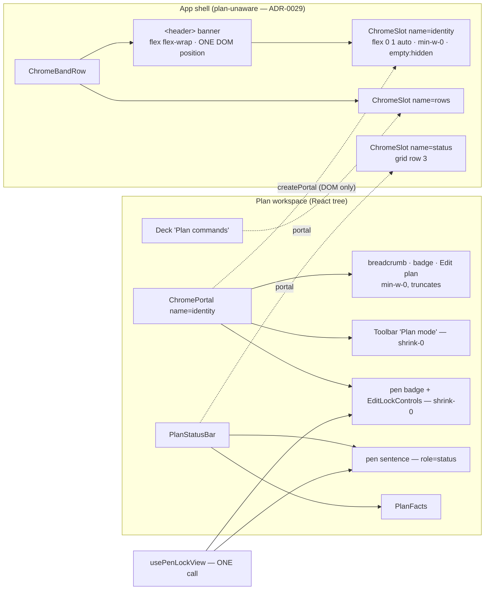
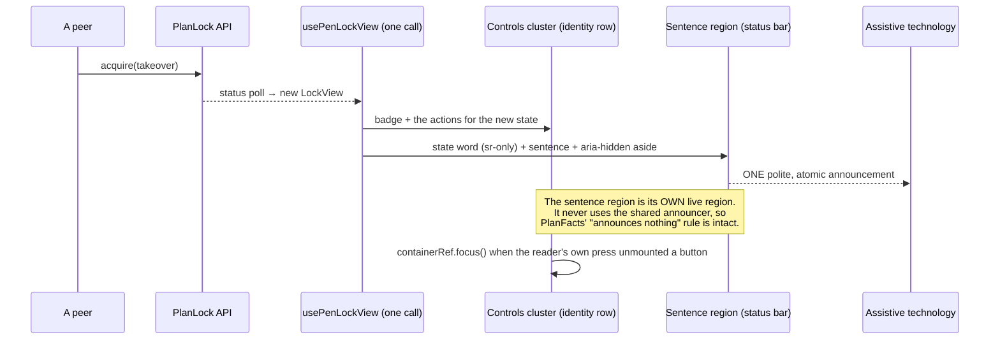
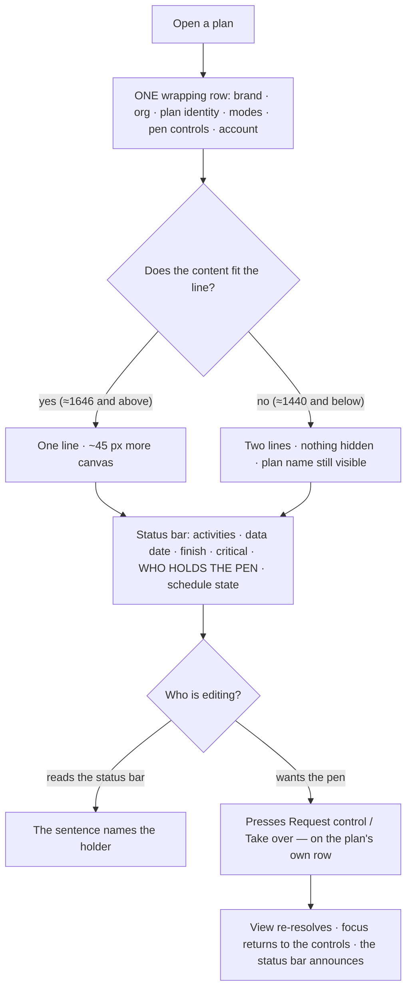

# Feature Spec: The one-row header

- **Status:** Draft — **awaiting approval**
- **Author(s):** feature-analyst (Product Owner / Solution Architect / Technical Lead hats)
- **Date:** 2026-08-26
- **Tracking issue / epic:** _(none yet)_
- **Roadmap link:** _(none — a product-owner requirement carried since `web-v0.103.0`)_
- **Related ADR(s):** **ADR-0112, to be written by this epic.** `docs/adr/` currently ends at
  ADR-0111 — verified by `Glob docs/adr/01*.md` on 2026-08-26, not taken from the brief — so 0112 is
  free. It amends ADR-0110 D3 (the withdrawal this reverses), ADR-0092 D6 and ADR-0091 D4 (the two
  earlier withdrawals of the same merge), ADR-0099 D5 (what the status bar carries), ADR-0093 (an
  object action belongs on the object), ADR-0028 (where the pen speaks) and extends ADR-0109 D1
  (a surface wraps) one surface up.

---

## 1. Business understanding

### Problem

The product owner, on `web-v0.103.0`: _"The header being split over two rows … needs to fit on one
line without question."_ It is the firmest of the three complaints raised against that release and
the **only one still unfixed** — ADR-0110's own Consequences say so: _"one is fixed and released, one
is fixed here, one is withdrawn with its arithmetic on the page."_

The plan workspace stacks two full-width bands above the canvas that a reader perceives as one
surface split in half:

| band                    | occupants                                                              | height                                                                   |
| ----------------------- | ---------------------------------------------------------------------- | ------------------------------------------------------------------------ |
| app header (`<header>`) | brand, organisation switcher, account chip                             | `h-14` = 56 px (`app-header.tsx:108`)                                    |
| identity + mode row     | breadcrumb, status badge, Edit-plan pencil, `Mode` toolbar, pen status | 45 px (measured; `plan-workspace-toolbar.tsx:1338-1343` records 53 → 45) |

**This would be the fourth costing and the fourth withdrawal.** ADR-0091 D4 withdrew a three-band
merge on measurement; ADR-0092 D6 withdrew this one at "134 px short at 1646"; ADR-0110 D3 withdrew
it at "536 px short at 1440". What makes this attempt different is not optimism: the instrument was
twice found to be answering a different question from the one being asked of it, and was twice
repaired — **and the falsification condition was fixed in writing before any repaired instrument was
run** (`falsification.md`, "condition fixed 2026-08-26, **before** the repaired instrument was
run"), so no number could be chosen to suit an answer.

### The measurement, and it is the factual base of this spec

Three runs on 2026-08-26, all in a real Chromium against a real plan named
`Riverside Quarter — Phase 2 Substructure`. **Nothing below is restated from memory or inherited
from the brief that commissioned this spec** — two of that brief's claims were checked and found
void, and they are corrected in §3.

| run | instrument                                                 | question                                    | verdict                                         |
| --- | ---------------------------------------------------------- | ------------------------------------------- | ----------------------------------------------- |
| 1   | `m0-merged-row.spec.ts` → `m0-merged-row.json`, 09:21Z     | how much **ink** does each occupant have?   | superseded — it under-counted the row by 266 px |
| 2   | `m1-merged-probe.spec.ts` → `m1-merged-probe.json`, 09:47Z | what width does the merged row **require**? | **1482 px**                                     |
| 3   | the same probe, narrowing sweep, 10:00Z                    | where does a **wrapping** row break?        | **a container of 1480 px** (12 px gaps)         |

**Run 2 supersedes run 1 by more than the whole decision bar.** Hypothesis 3, written in advance, is
confirmed: _"if measured gaps turn out to dominate the occupant ink, then this whole per-occupant
approach is the wrong frame."_ `inkOf` sums **leaf** rectangles, so a `<button>`'s own padding is
invisible to it; five 12 px gaps are 60 px of the 266 px shortfall and **~206 px is padding a leaf
measure cannot see**.

**The probe is credible because it was pointed at two rows whose answer is already known.** Today's
identity row requires **1218 px against a 1222 px container at 1280** — four pixels — which is
exactly what ships: it just fits, and truncates the plan name on anything longer. Today's header row
requires 415 against the same 1222. And the per-occupant parts sum to the composed whole exactly
(139 + 431 + 443 + 320 + 192 + 52 = 1577, plus five 12 px gaps = 1637 = `gap12.withSentence`). A
probe that reports only the number under test cannot be checked; this one can.

**Required widths (constant across viewports — the content does not grow, the container does):**

| occupant                                       | required |
| ---------------------------------------------- | -------- |
| brand (+ the below-`lg` drawer trigger)        | 139      |
| identity — project crumb, plan name, status, ✎ | 431      |
| mode cluster — `Mode` + four buttons           | 443      |
| pen — badge + sentence + hand-off controls     | 320      |
| **pen — badge + controls, sentence removed**   | **165**  |
| organisation switcher                          | 192      |
| account chip                                   | 52       |
| **merged row, sentence removed, 12 px gaps**   | **1482** |

**Against the containers:**

| viewport | container | required | slack    | the +120 px bar |
| -------- | --------- | -------- | -------- | --------------- |
| 1280     | 1222      | 1482     | **−260** | fails           |
| 1440     | 1382      | 1482     | **−100** | fails           |
| 1646     | 1588      | 1482     | **+106** | misses by 14    |
| 1920     | 1862      | 1482     | **+380** | passes          |

The arithmetic had put 1440 at **+166**; the probe puts it at **−100**. This is the fifth
consecutive width expectation in this register contradicted by its own measurement, and the fifth in
the same direction.

**What the readings do not say, carried forward rather than dropped:**

- The pen sentence on screen during run 2 was the 147 px `holding` state, not the 432 px worst
  (`heldByOtherAdmin`). So `withSentence` understates the un-rescoped row: its worst case is
  1637 − 147 + 432 = **1922 px**, which fails at every width **including 1920**. The
  `withoutSentence` column is unaffected — removing a node removes whatever width it had.
- The fixture's project crumb reads `Project`. A real project name makes the 431 px identity block
  larger, so that figure is **optimistic**.
- **Truncation is not overflow.** The identity block carries `min-w-0` and a `title`, so a row over
  its container truncates the plan name rather than breaking controls out of a box.

### The decisions already taken by the product owner

Put to them twice, with the numbers in front of them each time:

1. **The pen sentence moves off the identity row, and its new home is the status bar.** Approved
   **unconditionally** on run 1, and unaffected by runs 2 and 3.
2. **The merged row lands at 1600 px and above; at 1440 and below the chrome stays two rows.**
   Approved on run 2's corrected figures.

**Both are approved. This spec documents them; it does not re-open either.** What it does is state
the arithmetic honestly, name what is still unmeasured, and refuse to assert a number nobody has
run.

#### Why 1600, stated as the decision rather than as a compromise

- **1646 is the width the complaint was raised from and the width this product is judged at.**
  ADR-0091's retrospective records two epics measuring 1920/1440/1024/768 and never the product
  owner's Surface Pro (2880 × 1920 at 175% = 1646 CSS px). A result that fits at 1920 and fails at
  1646 is a withdrawal.
- **At 1646 the merged row clears its container by 106 px, on a test plan name already chosen to be
  long** (`m0-merged-row.spec.ts:58` says why: _"Short names are how the last budget lied"_).
- **It misses the +120 px bar by 14 px, and that bar was judgement, not law.** It was set in
  `falsification.md` because "a row that fits exactly is a row that overflows on the first longer
  plan name" — and it is that premise which fails here, not the arithmetic.
- **The reason the miss is acceptable is structural and must not be summarised away.** This row
  degrades by **truncating the plan name, which carries a `title`**. It does not degrade by pushing
  controls out of an `overflow-hidden` box where they become pointer-unreachable — the ADR-0090
  WCAG 2.2 §2.5.8 defect, which is a different failure entirely and is the one the bar was written
  against. The shipped identity row already truncates at 1280 today and nobody has reported it.

#### And 1600 is implemented as a **wrap**, not as a breakpoint — this is the design's load-bearing decision

Before writing a constant, run 3 asked the same probe a different question: **if the merged row
simply wraps, where does it break on its own?** That is ADR-0109 D1's principle — _a command surface
wraps; it never hides_ — applied one surface up.

| gap   | widest container at which the row is two lines |
| ----- | ---------------------------------------------- |
| 12 px | **1480**                                       |
| 16 px | **1500**                                       |

Against the four containers: **one line at 1646 and 1920, two lines at 1440 and 1280.** The break
lands at a container of 1480 px — a viewport of roughly 1538 — which sits between 1440 and 1646,
which is where the product owner put it.

> **The threshold is a decision expressed in widths; the wrap is how it is implemented.** There is
> **no `MERGE_MIN_PX` constant, no media query, no `ResizeObserver` and no state**, and that absence
> is deliberate. A later reader must not "fix" the missing constant — the browser and the product
> owner agree on where this row should break, and only one of them has to be maintained.

Two further things it disposes of, recorded so they are not re-derived:

- **Tailwind's `2xl` is 1536 px, and the container there is ~1478 against a required 1482 — four
  pixels short.** A breakpoint design would therefore have needed a **custom** screen. With a
  wrapping row there is no cliff to place, so being either side of one stops mattering.
- A breakpoint moves a DOM node between two parents, which re-targets a portal and **remounts** the
  portalled subtree (the mode toolbar's roving `tabindex` resets). A wrapping row has one DOM
  position at every width, so that class of defect does not exist.

### Users

Everyone who opens a plan; the surface is chrome, so it is role-independent. Three roles feel it
differently:

| Role                                  | What changes                                                                                                                                                                                            |
| ------------------------------------- | ------------------------------------------------------------------------------------------------------------------------------------------------------------------------------------------------------- |
| **Planner / Org Admin** (pen-capable) | ~45 px more diagram wherever the row is one line. Reads "who holds the pen" in the status bar; still presses Start/Stop/Request/Take-over beside the plan.                                              |
| **Contributor / Viewer**              | Same saving. The pen sentence is the only thing telling them **why** authoring is shaded, so it must stay unmissable in its new home.                                                                   |
| **External Guest** (ADR-0051)         | **Unaffected** — verified, not assumed: `CompactPenStatus` has exactly one production consumer, `plan-workspace-toolbar.tsx:1311` (grep over `apps/web/src`), and the `/share` route does not mount it. |

### Primary use cases

1. A planner opens a plan on a 1646 px screen and sees **one** band of chrome above the diagram.
2. A planner asks "who is editing this?" and finds the answer in the status bar, announced when it
   changes.
3. A Contributor finds authoring shaded and reads why.
4. A planner on a 1440 px laptop gets the same information over two lines, with nothing hidden and
   nothing truncated to nothing.

### User journeys

Happy path in §4 "User flow". Alternates: (a) a peer takes the pen mid-session — the status bar's
live region announces it and the identity row's controls change; (b) the window narrows past the
wrap point — the band goes from one line to two with no control lost, no focus dropped and no
remount; (c) below `md` the activities bar is not mounted at all (measured —
`docs/specs/workspace-chrome-fit/m0-measurement.md`) and the status bar carries both the facts and
the pen sentence.

### Expected outcomes

- One chrome band above the canvas, one line wherever the content fits — measured as 1646 and above
  — and two lines below, which is today's height.
- **Expected ~45 px back to the diagram** where the row is one line — `aboveCanvas` 295 → ~250 at
  1646/1920 (`m0-repaired.json`), i.e. canvas 748 → ~793 at 1646, about **+6%**.
  **This is an expectation, not a measurement.** M3 re-measures it. ADR-0092 D6 costed the same row
  at "45 px of the 240 px above the canvas … about 8% more canvas"; the denominator has since moved,
  which is why it is re-derived rather than carried.
- **M1 alone removes a truncation that is live today**, derived from the probe's own figures: in the
  worst pen state today's identity row requires 431 + 443 + (320 − 147 + 432) + 24 = **1503 px**,
  against containers of 1222 / 1382 / 1588 / 1862 — so **today, at 1280 and 1440, an Org Admin
  viewing a plan someone else holds is reading a truncated plan name**. With the sentence gone the
  row requires 431 + 443 + 165 + 24 = **1063 px** and fits everywhere with room to spare. The saving
  is **155 px** in the state the probe reached and **440 px** in the worst.
- The product owner's outstanding complaint is closed at the width it was raised from, with its
  arithmetic on the page and its one knowing miss stated rather than rounded away.

### Success criteria

| #   | Criterion                                                                                                                                                            | Proof                                                                                                             |
| --- | -------------------------------------------------------------------------------------------------------------------------------------------------------------------- | ----------------------------------------------------------------------------------------------------------------- |
| S1  | **The merged row is ONE line at 1646 and TWO lines at 1440**, measured as the row's own height, **with the plan name visible — not truncated to nothing — in both.** | The flag-on journey, in a real browser, at both widths. This is the epic's headline falsifiable condition.        |
| S2  | At every width every control on the row is visible and pointer-reachable, and clears 24 × 24 CSS px (WCAG 2.2 §2.5.8).                                               | `apps/web/e2e-workspace-fit/` — the sweep exists and already runs at four widths.                                 |
| S3  | The four mode controls are **on one line with each other** at every width — the cluster never wraps internally.                                                      | Journey measures the mode toolbar's own height and compares it with a single control's.                           |
| S4  | The merged row's **required** width is re-measured against the shipped markup, and the wrap point re-derived.                                                        | `m1-merged-probe` re-pointed at the shipped row; the numbers go in the milestone write-up whatever they say.      |
| S5  | `aboveCanvas` falls, **by a measured amount, net of any height grid row 3 gains**.                                                                                   | The `measure-toolbar` harness, before/after, same fixture, same widths. If it does not fall, that is the finding. |
| S6  | The pen sentence is announced on every transition it is announced on today, as a complete statement.                                                                 | `CompactPenStatus.test.tsx` extended; the region keeps `role="status" aria-live="polite" aria-atomic="true"`.     |
| S7  | Every ADR-0028 hand-off control stays reachable **beside the plan** at every width, and focus returns to the cluster after a press that unmounts it.                 | Unit + the journey with `PLAN_EDIT_LOCK_ENFORCED=true` — the only place the pen is real.                          |
| S8  | Exactly **one** `banner` landmark; the `sr-only <h1>` still inside `<main>`.                                                                                         | Unit assertion + axe in the journey.                                                                              |

### Open questions

**CRITICAL — Q1. The organisation switcher stops being centred.** The header is a `1fr auto 1fr`
grid whose centre cell holds the switcher, and `app-header.tsx:43-47` explains the choice: _"the
centre cell sits at the true midpoint between the brand and the account chip rather than merely
absorbing whatever space the edges don't claim."_ A merged row cannot keep that: a grid does not
wrap, and the identity content is ~1039 px with no cell for it that does not squeeze the brand. §4
makes the header a **wrapping flex row**, so the switcher moves from **centred** to **leading**, on
**all thirteen `_authed` routes** — not only plan screens.
**Stated default: accept.** The switcher is navigation and belongs beside the brand; a plan's
identity is the subject and wants the middle. It is on this list because it changes twelve screens
the epic is not otherwise about, and a screenshot pass (`apps/web/scripts/shoot.mjs`) makes it
visible before it is judged.

**Q2 (default stated). Does the pen sentence keep its `(active 2 min ago)` / `(~12s)` aside?**
**Default: yes, unchanged** — it is already `aria-hidden` precisely so a ticking clock never
re-announces the region (`lock-copy.ts:42-58`).

**Q3 (default stated). Does the sentence move at every width, or only where the row is one line?**
**Default: at every width, unconditionally.** Two homes chosen by a width is the drift this register
keeps recording (ADR-0062: a tab and a dialog that each look right alone, and only a reader who
opens both ever sees one is a version behind). It is also what makes M1 shippable and revertible on
its own — and M1 is worth shipping on its own, since it removes a truncation live today at 1280 and 1440.

**Q4 (default stated). Should this epic arm `scripts/frontend-only.json`?**
**Default: no.** The gate is sound and has gone stale **three times out of three**
(`docs/TECH_DEBT.md` #194; the file's own `reason` field, read 2026-08-26, records the third and its
deactivation). A stale declaration does not go quiet — it goes wrong about a **different** change.
The epic is frontend-only and says so in its ADR instead.

**Q5 (answered here, not left open). `docs/TECH_DEBT.md` #193's five dead exports** — `priorityOf`,
`partitionByTier`, `resolveLayoutMode`, `TOOLBAR_LAYOUT_BANDS`, `TOOLBAR_LAYOUT_HYSTERESIS_PX` —
were kept on the product owner's instruction (2026-08-26: _"keep, revisit with the header"_). **This
epic revisits them and does not resurrect any of them.** The merged row's fit is handled by
**wrapping, then truncation on a `min-w-0` identity block** — there is no layout mode, no band
floor, no hysteresis and no priority order anywhere in it. **Recommendation: they stay dead, and
removing them is a separate, ADR-0105-triggering public-contract change.** What would change that:
a decision to make some occupant _fold_ rather than wrap — which would be a new decision needing its
own ADR, because ADR-0109 D1's premise is that this surface does not hide things.

---

## 2. Functional requirements

### User stories & acceptance criteria

> **US-1** — As a **planner**, I want the plan's chrome on one row, so that more of the screen is the
> diagram I came to read.
>
> **Acceptance criteria**
>
> - **Given** a plan open at 1646 px **when** the workspace renders **then** the brand, organisation
>   switcher, plan breadcrumb, status badge, Edit-plan control, the four mode controls, the pen badge,
>   its hand-off controls and the account chip are all on **one line**, asserted as the row's own
>   height being that of a single line.
> - **Given** a plan open at 1440 px **then** the same row is **two lines**, every one of those
>   controls is still present, visible and pointer-reachable, **and the plan name is still visible** —
>   not truncated away to buy the line.
> - **Given** any width **then** the four mode controls are on **one line with each other**; the mode
>   cluster never wraps internally.
> - **Given** a plan name longer than a line can hold **then** the **plan name truncates with its
>   `title` intact** and no other control moves, shrinks below 24 px or leaves the box.
> - **Given** the merge has landed **when** `aboveCanvas` is measured at 1646 and 1920 **then** the
>   number is recorded in the milestone write-up — whatever it is.

> **US-2** — As a **planner or contributor**, I want to know who is editing this plan, so that I know
> why I can or cannot change it.
>
> **Acceptance criteria**
>
> - **Given** any lock state **when** the workspace renders **then** the sentence for that state is
>   visible in the plan status bar, at **every** width including below `md`.
> - **Given** the lock state changes **then** the change is announced **once**, politely, as a
>   complete statement — the state word **and** the sentence — by a region keeping
>   `role="status" aria-live="polite" aria-atomic="true"`.
> - **Given** the `heldByOtherAdmin` state **then** the announcement names the holder
>   (`lock-copy.ts:41` + `:65`).
> - **Given** the sentence has moved **when** a reader looks at the identity row **then** the pen
>   **badge** is still there, so the hand-off buttons beside it are not left unlabelled by state.
> - **Given** the pen layer is disabled (`penManaged === false`) **then** **neither** half renders —
>   no empty live region is left in the status bar.

> **US-3** — As a **planner**, I want to take, hold and hand over the pen from the plan's own row, so
> that the control is where the work is.
>
> **Acceptance criteria**
>
> - **Given** any lock state **when** the view resolves an action **then** the corresponding control
>   (`Start editing` / `Stop editing` / `Request control` / `Take over now` / `Take over` /
>   `Hand over` / `Keep editing` / `Dismiss` — `lock-copy.ts:74-81`) renders **on the identity row**,
>   never in the status bar.
> - **Given** a reader presses a control whose own success unmounts it **then** focus lands on the
>   **identity-row** cluster — not `<body>`, and **not** the status bar (WCAG 2.4.3).
> - **Given** the pen is lost to a take-over **then** the surface scrolled into view is the one
>   carrying the controls.
> - **Given** `lockCopy.scheduleReadOnlyHint` says _"use 'Start editing' at the top of Schedule"_
>   (`lock-copy.ts:67`) **then** that sentence is still true after this change. _(Copy is a reviewed
>   artefact; a relocation that falsifies shipped copy is a defect.)_

> **US-4** — As a **planner on a 1440 px laptop**, I want the same information over two lines, so
> that nothing is hidden from me to buy a line I do not have the width for.
>
> **Acceptance criteria**
>
> - **Given** any viewport narrower than the wrap point **then** the chrome is two lines and **every**
>   control present at 1920 is present, visible and pointer-reachable.
> - **Given** the viewport narrows or widens across the wrap point **then** no control disappears, no
>   focus is dropped to `<body>`, and the mode toolbar is **not remounted** — there is one DOM
>   position at every width.
> - **Given** the two-line shape **then** its height is no greater than today's two rows.

> **US-5** — As a **screen-reader user**, I want the header to remain one banner and the plan to
> remain the name of the main region.
>
> **Acceptance criteria**
>
> - **Given** a plan open **when** landmarks are enumerated **then** there is exactly **one**
>   `banner`, and `<main>`'s accessible name is the plan name.
> - **Given** the identity content now sits inside `<header>` **then** it is a `<div>`, never a second
>   `<header>` — the reason is already written at `plan-workspace-toolbar.tsx:1324-1328`.
> - **Given** the merged row **then** the tab order runs brand → organisation switcher → plan
>   identity → modes → pen controls → account, with no trap, **and it does not change when the row
>   wraps** — wrapping is a visual line break, not a reorder.

### Workflows

1. **Render.** The shell mounts the band. The band renders the header as a **wrapping flex row**
   whose middle child is a **named chrome slot** (`identity`). The plan workspace portals its
   identity + mode block into that slot. The shell never learns a plan is open (ADR-0029).
2. **Pen status.** `CompactPenStatus` calls `usePenLockView` **once** and renders **two** elements
   from it: the controls cluster (identity row) and the sentence region (status bar, by portal, with
   an in-place fallback).
3. **Narrowing.** The browser breaks the line where the content stops fitting. No listener fires, no
   state changes, nothing re-renders.

### Edge cases

| Case                                                           | Expected behaviour                                                                                                                                                                                                 |
| -------------------------------------------------------------- | ------------------------------------------------------------------------------------------------------------------------------------------------------------------------------------------------------------------ |
| No plan open (twelve non-plan `_authed` routes)                | The identity slot is empty and contributes **no width and no height** — `empty:hidden`, the device the status slot already uses (`chrome-slot.tsx:107-109`). The row cannot wrap because there is nothing to wrap. |
| Pen layer disabled                                             | `CompactPenStatus` returns `null` today (`:42`). **Both** halves must render nothing.                                                                                                                              |
| Pen status still loading                                       | Today a terse `role="status" aria-busy` chip. After: the **sentence** half carries the loading copy; the controls half carries the placeholder. Neither renders an empty box.                                      |
| Viewport below `md`                                            | The activities bar is not mounted (measured). The status bar carries the facts **and** the pen sentence; the header row is wrapped.                                                                                |
| Viewport just above the wrap point                             | One line with very little slack. Acceptable **because** the next degradation is a line break, not an overflow — which is the whole reason the design wraps.                                                        |
| Plan name longer than a line                                   | Truncates, `title` intact; the `sr-only <h1>` in `<main>` keeps the full name.                                                                                                                                     |
| **Project** name longer than the fixture's `Project`           | Same. Named separately because the 431 px identity figure was measured with the placeholder and is therefore optimistic — and this is exactly the case the wrap absorbs and a breakpoint would not.                |
| Organisation name longer than the switcher                     | Already capped at `max-w-[12rem] truncate` (`app-header.tsx:73`), pinned by `app-header.test.tsx:126-129`. Unchanged.                                                                                              |
| Worst pen state (`heldByOtherAdmin`)                           | After M1 the sentence is off the row entirely, so the row's width is **state-independent** — which is itself the argument for doing M1 first.                                                                      |
| Status bar with the facts portalled away to the activities row | The pen region is hosted by `PlanStatusBar` **outside** `PlanFactsHost`, so it does not travel with the facts (§4 C5).                                                                                             |
| A very narrow viewport (≤ 400 px)                              | The row wraps to three or more lines rather than overflowing. Nothing is hidden; this is the same contract `Deck` already ships (ADR-0109 D1).                                                                     |

### Permissions

**No permission changes, and nothing here is a write.** Mapped anyway, per ADR-0012:

| Capability               | Permission / gate                                                           | Change |
| ------------------------ | --------------------------------------------------------------------------- | ------ |
| See the chrome band      | any org member with read on the plan (organisation-scoped)                  | none   |
| See the pen sentence     | same — it is a **fact**, and reads are not pen-gated (ADR-0063 M4b's rule)  | none   |
| Press a hand-off control | ADR-0028 unchanged: Start/Stop/Request per role; Override is Org Admin only | none   |
| Edit-plan pencil         | `model.canWrite` (`plan-workspace-toolbar.tsx:1256`)                        | none   |

**No API call, DTO or scope check is added or altered.** The whole change is where existing
client-side markup renders.

### Validation rules

None. No form, no field, no input.

### Error scenarios

| Scenario                                       | Detection                                | User-facing result                                                                                                 | Status    |
| ---------------------------------------------- | ---------------------------------------- | ------------------------------------------------------------------------------------------------------------------ | --------- |
| The `identity` chrome slot has not mounted yet | `ChromePortal` reads `null` from context | Renders `null` for that commit — the existing contract (`chrome-slot.tsx:123-133`), never a double paint           | n/a       |
| The pen-sentence outlet has not registered     | `PenStatusHost` finds no element         | Renders **in place**, beside the badge — i.e. exactly today's surface. This is the parity contract, not a courtesy | n/a       |
| Lock status request fails                      | unchanged (`usePenLockView`)             | unchanged                                                                                                          | unchanged |

There is deliberately **no `matchMedia` failure row**: the design has no media query. That absence
is the point, and it removes the jsdom/fallback branch a breakpoint design would have needed.

---

## 3. Technical analysis

| Area           | Impact       | Notes                                                                                                                                                                                                                   |
| -------------- | ------------ | ----------------------------------------------------------------------------------------------------------------------------------------------------------------------------------------------------------------------- |
| Frontend       | **high**     | `app-header.tsx`, `chrome-band.tsx`, `chrome-slot.tsx` (one new slot **name**), `plan-workspace-toolbar.tsx`, `CompactPenStatus.tsx`, `plan-status-bar.tsx`, one new host module.                                       |
| Backend        | **none**     | No module, service or endpoint is touched.                                                                                                                                                                              |
| Database       | **none**     | No model, column, index, constraint or migration. **`database-architect` is therefore not engaged — because there is no schema change to design, not because one was judged too small** (CLAUDE.md §19.3).              |
| API            | **none**     | No route, DTO, status code or OpenAPI change.                                                                                                                                                                           |
| Security       | **none**     | No new data reaches the client; no permission widens. The pen sentence already renders in this DOM, to the same reader, one row away.                                                                                   |
| Performance    | **none/low** | **No listener, no observer, no timer and no state is added** — the wrap is CSS. The canvas painter is not imported.                                                                                                     |
| Infrastructure | **none**     | No env var, no service. One CI step is **reused**, not added (Testing).                                                                                                                                                 |
| Observability  | **none**     | No log, metric or trace.                                                                                                                                                                                                |
| Testing        | **med**      | Unit (header order, landmarks, the pen split, the host fallback); **browser measurement**, because line count and truncation are layout questions and jsdom has no layout; and a flag-on journey with the pen enforced. |

### The CPM engine and the recalculation parity gate

**The CPM engine is not imported and no migration runs**, so the ADR-0034 recalculation parity gate
is untouched **by construction** — in its honest form: there is nothing here to hold parity for.
Established by scope rather than asserted: every file this epic changes is under `apps/web/src`, and
none is in the engine's import graph.

### Three inherited claims, checked — two of them void

Recorded because ADR-0076 §Class 2/3 says a claim from a brief is checked like any other, and
because two of these would have shaped the design wrongly.

1. **"The mode cluster must never demote into a `⋯`" — the mechanism is gone.** `Toolbar.tsx:64-76`
   records ADR-0109 D1 deleting the width ladder, the per-item width cache, the priority ranking, the
   band floors, the hysteresis, the label-demotion pass and the overflow menu **in one commit**; the
   container is now `flex-wrap items-center` under the comment _"a line that cannot fit becomes two
   lines"_ (`:183-187`), and `layout: 'comfortable'` is a literal (`:104-110`).
   **The new hazard is the opposite shape and must be designed against explicitly:** a squeezed mode
   cluster no longer hides a mode, it puts `Early｜Visual｜Diagram｜Gantt` on a **second line inside
   the merged row** — turning one clean row into two ragged ones, which is worse than not merging.
   Today's identity row already holds the right pattern (`shrink-0` on the mode wrapper), and the
   merged row must carry it forward **deliberately rather than inherit it by luck**. S3 is the
   assertion.
2. **`ToolbarBandProvider`'s density concern is moot.** `toolbar-band.tsx:10-17` states that
   `resolveLayoutMode` has **no production caller** (`docs/TECH_DEBT.md` #193) and that
   `computeLadder` went with the ladder; a grep over `apps/web/src` returns **no consumer of
   `useToolbarBandWidth` at all**. The module's invariant — _the band width may never be an input to
   a fit decision_ — still matters and is why it is kept, but **there is no live density path for
   this merge to disturb, so it is not a risk.** Stated rather than omitted, because two previous
   epics reasoned about it.
3. **The mode toolbar keeps reading the workspace's band provider, and it does not matter.** React
   context follows the **React** tree, not the DOM, so a portalled toolbar keeps the provider it was
   rendered under. With no consumer, this is a no-op — worth one structural assertion so the fact is
   pinned rather than rediscovered the day someone adds an `isVisible(ctx, env)` fold to a mode item.

### Dependencies

**Depends on, and must not break**

1. **`app-header.test.tsx:86-104`** pins brand → organisation switcher → account DOM order, and
   `e2e-designed-chrome`'s tab-order journey depends on it. The merge inserts the identity block
   **between the switcher and the account chip**, so the assertion still holds and the account chip
   becomes a later tab stop. Both the unit test's intent and the journey must be re-read, not just
   re-run.
2. **The focus-return contract.** `usePenLockView` attaches **one** `containerRef` to "the surface's
   `role="status"` root" and uses it for two jobs — WCAG 2.4.3 focus return after the reader's own
   press unmounts the button (`use-pen-lock-view.ts:50-55`) and `scrollIntoView` on a lost pen
   (`:58-62`). **Splitting the surface makes "the container" ambiguous, and the naive split throws
   focus to the status bar** — across the screen, away from the button just pressed. §4 C3 resolves
   it.
3. **`PlanFacts` announces nothing, deliberately** (`plan-facts.tsx:33-47`, citing `plan.md` §A14):
   `announcer.tsx` is a single shared app-wide polite region that clears-then-sets, so several facts
   wired to it drop messages. §4 C5 resolves the apparent conflict and asserts it.
4. **`data-plan-identity`** (`plan-workspace-toolbar.tsx:1210`) is how both measurement harnesses
   locate the block. Removing or renaming it blinds the instruments that decide this epic.
5. **The identity block's `flex-1` must become `flex: 0 1 auto`** (`min-w-0` kept). This is the
   single most important line in the change: a `flex-1 min-w-0` item absorbs the line's slack and
   then shrinks, so **nothing would ever wrap** — the plan name would truncate towards nothing while
   the row stayed one line tall. Measured and stated in `falsification.md` §"What the wrapping design
   has to get right".

**Affected but not changed**

- `docs/specs/workspace-chrome-fit/` — this epic reverses that epic's D3 withdrawal. Its spec is the
  record of what was agreed then and is not edited; ADR-0112 amends ADR-0110 instead.
- **`scripts/e2e-sweep.sh:32` is broken in both directions — found while scoping this epic and
  reported rather than absorbed.** Its suite list names `toolbar-fit`, for which there is **no
  `test:e2e:toolbar-fit` script** (`apps/web/package.json:17-62`) and **no `e2e-toolbar-fit/`
  directory** (Glob), because ADR-0109 D1 deleted it — while `workspace-fit`, which has both a config
  and a script, is **absent from the list**. So the one sweep this repository runs after a layout
  change currently invokes a target that cannot resolve and skips the suite that measures target
  size. Repairing it is a task in this plan, not a note, because this epic is exactly "a change that
  moves a control every journey clicks" — the sweep's own stated trigger (`e2e-sweep.sh:19-20`).

---

## 4. Solution design

### Architecture overview

Three moving parts, each an existing mechanism used again rather than a new one:

1. **A named chrome slot returns.** `ChromeSlotName` gains `'identity'` — the name ADR-0097 D1b used
   and Graphite M3 removed; `chrome-slot.tsx:25-36` still carries that history in its own docblock.
   One context, one provider, one portal component; a slot costs a string.
2. **The header row wraps.** ADR-0109 D1's principle, one surface up, with the flex properties chosen
   from measurement rather than habit.
3. **The pen surface splits into two elements from one hook call**, the sentence portalled into the
   status bar through a registry with an in-place fallback — modelled on `PlanFactsHost`
   (`plan-facts-host.tsx`), itself modelled on `CanvasDockProvider`. Third use of one pattern, not a
   fourth mechanism.



### Data flow



### User flow



### Database changes

**None.**

### API changes

**None.**

### Component changes

#### C1 — `app-header.tsx`: the grid becomes a wrapping flex row with an identity slot

```
flex flex-wrap items-center gap-3
  [ brand (+ below-lg drawer trigger) · organisation switcher ]   shrink-0
  [ identity slot ]                                              flex 0 1 auto · min-w-0 · empty:hidden
  [ account chip ]                                               shrink-0 · ml-auto
```

Four decisions, each with its measured reason:

- **`flex: 0 1 auto`, not `flex-1`, on the identity slot.** A `flex-1 min-w-0` item absorbs the
  line's slack and then shrinks, so the row **never wraps** and the plan name truncates towards
  nothing on a row that stays one line tall (`falsification.md` §3). With `0 1 auto` the item's
  hypothetical main size is its content, flex starts a new line when it does not fit, and shrinking
  applies only inside a line that still overflows — so **wrap first, truncate last**, which is the
  order a reader wants.
- **`min-w-0` is kept**, so the last-resort truncation is the plan name and not an overflow.
- **Everything else is `shrink-0`.** A squeezed mode `Toolbar` wraps internally rather than demoting
  (`Toolbar.tsx:183-187`), which would put the four modes on a second line inside the row. Today's
  identity row already does this; the merged row does it deliberately.
- **DOM order stays brand → organisation switcher → … → account**, so `app-header.test.tsx:86-104`
  still holds, and wrapping is a visual line break rather than a reorder — the tab order is the same
  on one line and on two.
- **`empty:hidden` on the slot** keeps the twelve non-plan routes free of a phantom flex item.
  Precedent and reason: `chrome-slot.tsx:107-109`, where it is what makes an empty status row
  zero-height.
- **Consequence, stated not buried:** the organisation switcher is no longer centred. That is Q1.

#### C2 — `chrome-slot.tsx` / `chrome-band.tsx`: one new name, and no decision to own

`ChromeSlotName` gains `'identity'`. `ChromeBandRow` renders **exactly one** identity slot element,
in **exactly one** position — inside `<header>` — at every width.

**There is no breakpoint, no media query, no `ResizeObserver` and no state.** The band does not
choose anything; the browser breaks the line where the content stops fitting, at a container of
1480 px (12 px gaps), measured. Consequences worth stating because they are the design's payoff:

- **No portal re-target, therefore no remount.** A breakpoint design moves the slot between two
  parents, which makes React delete and recreate the portal and resets the mode toolbar's roving
  `tabindex`. One DOM position means that defect class does not exist.
- **No jsdom fallback branch.** A media query needs a fallback value for every unit suite that mounts
  the shell, and picking it wrong silently re-shapes ~35 suites. There is nothing to pick.
- **Nothing to oscillate.** ADR-0090 records a measurement pass that measured its own output and left
  a 72 px band of widths in which a row was stable both ways. CSS line-breaking has no such loop.
- **No custom Tailwind screen.** `2xl` is 1536 px and its container is ~1478 against a required
  1482 — four pixels short — so a breakpoint design would have needed a bespoke screen. There is no
  cliff to place.

**Why a container query is not needed either.** It would be the same cliff with a different
measuring tape, and ADR-0110 D4 records Tailwind's `@container` applying `contain: inline-size` and
collapsing an auto-width `shrink-0` flex item to 24 × 48 px with every unit gate green. The identity
slot is precisely such an item.

#### C3 — `CompactPenStatus.tsx`: two elements, one hook call

```tsx
// shape only — no application code is written at this stage
const { penManaged, view, containerRef, controlsProps } = usePenLockView(...)
if (!penManaged) return null                        // BOTH halves render nothing
return (
  <>
    <div ref={containerRef} tabIndex={-1}>          {/* identity row — NOT a live region */}
      <Badge …>{view.badge}</Badge>
      <EditLockControls {...controlsProps} />
    </div>
    <PenStatusHost>                                 {/* portal → status bar; fallback renders in place */}
      <div role="status" aria-live="polite" aria-atomic="true">
        <span className="sr-only">{view.badge}. </span>
        {view.message}
        {view.aside ? <span aria-hidden="true">({view.aside})</span> : null}
      </div>
    </PenStatusHost>
  </>
)
```

Four decisions inside that shape, each with its reason:

- **`containerRef` stays with the controls.** It exists for WCAG 2.4.3 focus return after the
  reader's own press unmounts the button (`use-pen-lock-view.ts:50-55`) and for `scrollIntoView` on
  a lost pen (`:58-62`). Both are about **where the reader just acted**. Attaching it to the moved
  sentence throws focus across the screen after every Start/Stop — a defect that reads as a cursor
  teleport and that a test asserting only "focus is not on `<body>`" would pass.
- **The moved region carries the state word as `sr-only`.** The region is `aria-atomic`, so today an
  announcement is badge + message together. Moving only the message would announce _"Ana is editing
  this plan."_ without _"Locked"_. The visible badge stays once, on the identity row, where the
  buttons need it; the announced state word rides with the sentence.
- **The badge is not `aria-hidden`.** It sits outside any live region, so exposing it costs no double
  announcement — and hiding it would leave an AT reader on the identity row with a `Take over` button
  and nothing saying what it acts on.
- **Both halves honour `penManaged === false` and the loading state.** An empty `role="status"` in
  the status bar is a region assistive technology still visits.

**Width effect, from the probe rather than from reasoning:** the pen cluster goes 320 → **165 px**
required, i.e. **−155 px** in the state the probe reached and **−440 px** in the worst state
(320 − 147 + 432 → 165). It also makes the merged row's width **independent of which of ten lock
states is live**, which is what lets a single measurement mean something at every moment.

#### C4 — `PenStatusHost` / `PenStatusOutlet`: the registry, copied not invented

A near-verbatim sibling of `plan-facts-host.tsx`: a context of `{ element, register, unregister }`,
an outlet registering its node through React 19's ref-cleanup form, a host that portals when an
element exists and renders **in place** when none does, and `unregister` clearing **by node
identity** — copied because that reasoning was learnt the hard way twice
(`plan-facts-host.tsx:22-31`: a bare `null` empties the host on half the transitions; an
`isConnected` guard inverts it, because React runs a ref cleanup _before_ detaching).

Two deliberate differences from `PlanFactsHost`, each with a reason:

1. **Exactly one outlet, mounted by `PlanStatusBar` itself — outside `PlanFactsHost`.** The facts
   have two hosts because the activities row can adopt them; the pen sentence has **one**, so it does
   not move under a reader who expands a panel. `PlanStatusBar` is portalled into the shell's row 3
   at **every** width (`app-shell.tsx:475-479`), so the host is always mounted — which is what stops
   this being ADR-0081's defect (a capability with no host, shipped green).
2. **The in-place fallback is the parity contract.** Every existing suite that mounts
   `CompactPenStatus` standalone (`CompactPenStatus.test.tsx`, plus the three workspace suites that
   stub it out entirely) registers no outlet and therefore renders today's markup — which is why
   those suites are the before/after oracle and should pass **unedited** through M1 (the ADR-0078
   barrel-preserving argument).

#### C5 — `plan-status-bar.tsx`: hosts the pen region beside the facts

```
[ PlanFactsHost → facts (may portal to the activities row) ]  [ PenStatusOutlet ]  … [ schedule state, ml-auto ]
```

`ScheduleStateRegion` keeps its `ml-auto` trailing position untouched — `plan-facts.tsx:193-200`
explains why it is the only thing on that bar which appears and disappears.

**The rule this does not break, stated because it looks as if it does.** `PlanFacts`'s docblock says
the status bar **announces nothing, deliberately**. That rule is about the **shared app-wide
announcer** (`announcer.tsx`), which clears-then-sets on an animation frame and so drops messages
when several producers use it. The pen sentence is not a producer for that announcer; it is its
**own element-scoped live region**, exactly as it is today, one row up. A status bar that _hosts_ a
live region is not a status bar that announces. **The distinction is asserted, not described:** a
unit test pins that `PlanFacts` contains no `aria-live` and calls nothing from `announcer.tsx`, and
that the pen region does not use the shared announcer either.

**The vertical arithmetic must be measured, and it is not obviously favourable.** The status slot is
`empty:hidden` (`chrome-slot.tsx:107-109`), and the facts have two hosts — so there are states in
which grid row 3 is **zero-height today** and would gain ~24 px once the pen region always renders
there. The merge is worth ~45 px above the canvas; if the status row gains 24 below it, the net is
~21. **This is ADR-0092 M4's "relocating a row inside one column removes nothing", one row down, and
M1 must measure both bands before and after rather than assume the saving.**

#### C6 — `plan-workspace-toolbar.tsx`: the portal target, and what stays

The identity block (`data-plan-identity`, `:1210`), the mode cluster (`:1287-1310`) and the pen
controls (`:1311-1314`) render inside a `ChromePortal name="identity"`. `data-plan-identity` stays —
it is how both harnesses locate the block.

Unchanged and load-bearing: the `sr-only <h1>` at `:1147` stays **outside** the portal, inside
`<main>`. The reason is already written at `:1140-1146` and `:1324-1328`, and this merge is exactly
the change that would tempt someone to move it.

### Implementation approach & alternatives

**Chosen: relocate the sentence first, then merge into a wrapping row.**

The order is the design, and the probe is what makes the case:

- **M1 stands alone.** The sentence is 155 px of the pen cluster in the reachable state and 440 px in
  the worst. Today's identity row requires 1218 px against a 1222 px container at 1280 — **four
  pixels** — and in the worst pen state it requires **1503 px**, so at 1280 and 1440 a real reader is
  already losing the plan name to truncation. M1 fixes that whether or not the merge lands.
- **M1 makes the merged row state-independent**, so M2's measurement means something at every moment
  rather than at the moment it was taken.
- **The two are separately revertible.** If the merge has to be withdrawn — a fourth time — M1 is
  unaffected. Doing both in one commit would make the withdrawal expensive and would leave the epic
  unable to answer "was it the move or the merge?" about any defect it found.

**The framing that makes the move principled rather than a width trick.** ADR-0093's discriminator:
_an action whose subject is the selected object belongs on the object's surface; the command surface
carries actions whose subject is the plan or the view._ One layer along: **who holds the pen is a
fact about the plan, and the plan's facts are the status bar's job (ADR-0099 D5); taking, requesting
and handing over the pen are actions on the plan, and they stay on the plan's own row.** The 155 px
is why the question was asked. It is not the answer to it.

**Alternatives considered and rejected:**

| Alternative                                              | Why not                                                                                                                                                                                                                                               |
| -------------------------------------------------------- | ----------------------------------------------------------------------------------------------------------------------------------------------------------------------------------------------------------------------------------------------------- |
| A `min-[1600px]:` breakpoint with two slot positions     | Needs a custom Tailwind screen (`2xl` is 4 px too low), a jsdom fallback value, and a portal re-target that remounts the mode toolbar. The wrap measurement lands in the same place with none of that. **This was the plan until run 3 measured it.** |
| Merge at 1440 as the first arithmetic suggested          | The probe says the merged row requires 1482 against a 1382 container — **100 px short**. The arithmetic was 266 px optimistic because `inkOf` cannot see padding.                                                                                     |
| Merge at 1920 only                                       | Fails the requirement on the machine the complaint was raised from. ADR-0091's retrospective is explicit that this is a withdrawal, not a partial win.                                                                                                |
| Withdraw the merge a fourth time                         | It clears 1646 by 106 px and degrades by truncation, not by unreachable controls. Withdrawing would apply a bar written for a different failure mode.                                                                                                 |
| Keep `flex-1` on the identity block                      | Measured: it defeats wrapping entirely — the row stays one line and the plan name truncates towards nothing (`falsification.md` §3).                                                                                                                  |
| Let the mode cluster shrink                              | It wraps rather than demoting (`Toolbar.tsx:183-187`), putting the four modes on a second line **inside** the row: one clean row becomes two ragged ones.                                                                                             |
| Truncate the pen sentence harder instead of moving it    | Already truncated visually (`max-w-[22ch]`, `CompactPenStatus.tsx:72`). Truncating further removes the **holder's name** in the state where naming them is the entire point.                                                                          |
| Put the sentence in a tooltip on the badge               | A tooltip is not a live region, so transitions stop being announced; and it fails "unmissable" for the Contributor who needs to know why authoring is shaded.                                                                                         |
| Move the badge **and** the controls to the status bar    | Breaks ADR-0028's hand-off being reachable beside the plan, and falsifies shipped copy — `lockCopy.scheduleReadOnlyHint` says _"use 'Start editing' at the top of Schedule"_ (`lock-copy.ts:67`).                                                     |
| Drop the mode cluster (443 px, the largest single block) | ADR-0091 D1 and the `e2e-gantt` regression. A mode is not a command and must be visible beside the pen.                                                                                                                                               |
| Drop the breadcrumb's project crumb                      | Tried and reversed once: it is the **only** route from an open plan to its project — `HierarchyTree.tsx:208-219` navigates only for `kind === 'plan'` — and three Playwright suites failed on it (`plan-workspace-toolbar.tsx:1218-1235`).            |
| Icon-only mode switches (~200 px)                        | Reverses ADR-0091 M7 from the same programme; explicitly rejected there.                                                                                                                                                                              |
| A `VITE_` flag for rollback                              | ADR-0088 D1: a `VITE_` constant is inlined at build time and `docker-publish.yml` passes none, so it has never been an operator rollback. The rollback here is a **commit boundary**, which is what the slicing buys.                                 |

**Architecturally significant → ADR-0112.** It reverses a decision recorded in an accepted ADR
(0110 D3), changes where a shipped model speaks (ADR-0028), adds a fourth chrome slot name, extends
ADR-0109 D1 to a second surface, and sets a rule others will cite: _a state sentence is a fact._

#### ADR-0112 outline (draft)

- **Title:** _A state sentence is a fact, and a row fits because something left it._
- **Status:** Proposed → Accepted per milestone.
- **Context:** three withdrawals; two instruments each found to be answering a different question
  (#198's span-not-ink, then the leaf measure's blindness to padding); the repaired numbers; the two
  product-owner decisions.
- **D1 — The pen sentence is a fact and moves to the status bar; the hand-off controls are actions
  and stay on the plan's row.** ADR-0093's discriminator applied to a model rather than a command.
- **D2 — One `usePenLockView` call, two elements; `containerRef` stays with the controls.** The
  focus-return contract is the reason; the naive split is a WCAG 2.4.3 failure.
- **D3 — A hosted live region is not an announcing status bar.** Reconciles with `PlanFacts`'
  no-announcement rule; asserted, not described.
- **D4 — The merged row **wraps**; there is no threshold constant.** The product owner's decision is
  1600 px; the browser breaks at a container of 1480 px, which lands between 1440 and 1646 — where
  they put it. Written so a later reader does not "fix" the missing constant.
- **D5 — `flex: 0 1 auto` on the identity block, `shrink-0` on everything else.** The two flex facts,
  each measured, each with the wrong-looking-obvious alternative recorded.
- **D6 — The +120 px bar is knowingly missed by 14 px at 1646, because this row degrades by
  truncating a `title`-carrying plan name and not by pushing controls out of an `overflow-hidden`
  box.** The bar was judgement; the degradation mode is the fact.
- **D7 — No `VITE_` flag** (ADR-0088 D1); the rollback is a commit boundary.
- **D8 — The per-occupant frame is retired in favour of the shrink-to-fit probe**, with the control
  measurements recorded, because a probe that reports only the number under test cannot be checked.
- **D9 — `docs/TECH_DEBT.md` #193's five dead exports stay dead.** The merged row's fit is wrapping
  and truncation, not a layout mode; what would change that is a decision to make an occupant fold,
  which needs its own ADR.
- **Consequences:** the organisation switcher is no longer centred (Q1); the header's tab order gains
  the identity block before the account chip; `aboveCanvas` falls by a **measured** amount net of any
  height grid row 3 gains; `scripts/e2e-sweep.sh` is repaired; no listener, observer or state is
  added anywhere.

## 5. Links

- Implementation plan: [`./implementation-plan.md`](./implementation-plan.md)
- The measurements that decide it: [`./falsification.md`](./falsification.md) — condition first, then
  three Result sections
- Raw readings: `apps/web/measure-output/m0-merged-row.json`, `…/m0-repaired.json`,
  `…/m1-merged-probe.json`
- Harnesses: `apps/web/measure-toolbar/m0-merged-row.spec.ts`,
  `apps/web/measure-toolbar/m1-merged-probe.spec.ts`
- Docs to update: `docs/adr/0112-*.md` (new), `docs/adr/README.md` (gated in both directions by
  `check:adr-coverage` since ADR-0110 D6), `CLAUDE.md` §16, `docs/TECH_DEBT.md` (#193 answered; a new
  row for anything found and not fixed), `scripts/e2e-sweep.sh`
