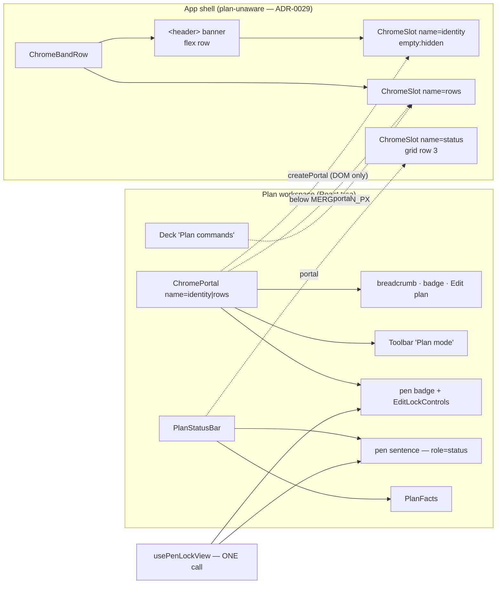
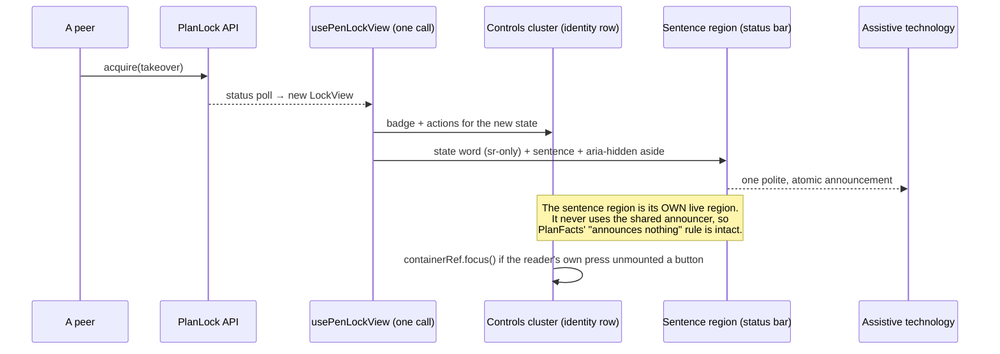
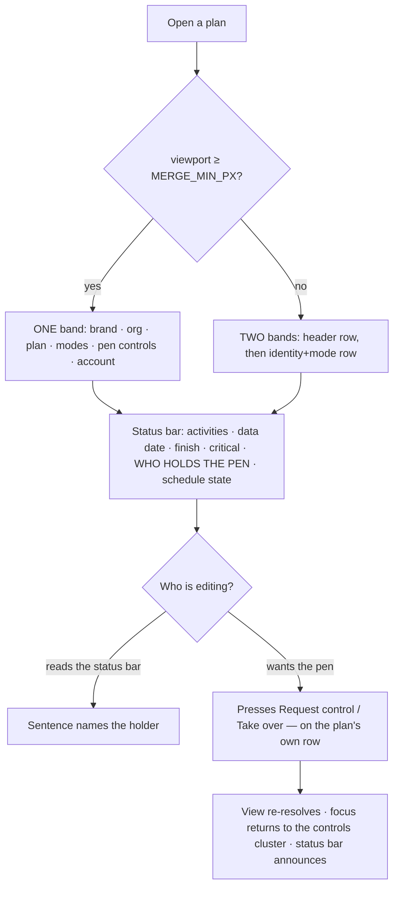

# Feature Spec: The one-row header

- **Status:** Draft — **awaiting approval**
- **Author(s):** feature-analyst (Product Owner / Solution Architect / Technical Lead hats)
- **Date:** 2026-08-26
- **Tracking issue / epic:** _(none yet)_
- **Roadmap link:** _(none — this is a product-owner requirement carried since `web-v0.103.0`)_
- **Related ADR(s):** **ADR-0112 (to be written by this epic** — `docs/adr/` currently ends at
  ADR-0111, verified by `Glob docs/adr/01*.md` on 2026-08-26, so 0112 is free**)**. Amends
  ADR-0110 D3 (the withdrawal this reverses), ADR-0092 D6 and ADR-0091 D4 (the two earlier
  withdrawals of the same merge), ADR-0099 D5 (what the status bar carries), ADR-0093 (an object
  action belongs on the object), ADR-0028 (where the pen speaks).

---

## 1. Business understanding

### Problem

The product owner, on `web-v0.103.0`: _"The header being split over two rows … needs to fit on one
line without question."_ It is the firmest of the three complaints raised against that release and
the **only one still unfixed** (ADR-0110 §Consequences: _"one is fixed and released, one is fixed
here, one is withdrawn with its arithmetic on the page"_).

The plan workspace stacks two full-width bands above the canvas that a reader perceives as one
surface split in half:

| band                    | occupants                                                              | height                                                                   |
| ----------------------- | ---------------------------------------------------------------------- | ------------------------------------------------------------------------ |
| app header (`<header>`) | brand, organisation switcher, account chip                             | `h-14` = 56 px (`app-header.tsx:108`)                                    |
| identity + mode row     | breadcrumb, status badge, Edit-plan pencil, `Mode` toolbar, pen status | 45 px (measured; `plan-workspace-toolbar.tsx:1338-1343` records 53 → 45) |

**This is the fourth costing and it would be the fourth withdrawal.** ADR-0091 D4 withdrew a
three-band merge on measurement; ADR-0092 D6 withdrew it at "134 px short at 1646"; ADR-0110 D3
withdrew it at "536 px short at 1440". Two things make this attempt different rather than a fourth
run at the same wall:

1. **The instrument was defective and is repaired.** `docs/TECH_DEBT.md` #198 — `inkOf` returned
   `max(right) − min(left)` over leaf rectangles, which counts stretched, non-inking leaves. Every
   occupant figure came down when it was fixed (mode cluster 435 → 313, breadcrumb 424 → 388,
   header cells 374 → 358, pen furniture 173 → 157;
   `docs/specs/one-row-header/falsification.md` §Result). ADR-0110 D3's "536 px" was inflated by
   that defect — **the third withdrawal was right for a wrong reason**, and honestly measured the
   shortfall at 1440 is **266 px**, at 1646 **60 px**.
2. **A falsification condition was written before the measurement was taken**
   (`falsification.md`, "condition fixed 2026-08-26, **before** the repaired instrument was run"),
   so the number could not be chosen to suit the answer.

### What the measurement says, and it is the factual base of this spec

Source: `apps/web/measure-output/m0-merged-row.json`, run 2026-08-26T09:21:02Z by
`apps/web/measure-toolbar/m0-merged-row.spec.ts` against a real Chromium, on a plan named
`Riverside Quarter — Phase 2 Substructure`. Nothing below is restated from an earlier epic.

**Occupant ink (constant across widths — the content does not grow, the container does):**

| occupant                                                        | ink        | source key                        |
| --------------------------------------------------------------- | ---------- | --------------------------------- |
| brand + organisation switcher + account chip                    | 131+192+35 | `headerCells[].ink`               |
| breadcrumb + status badge + Edit-plan pencil                    | 388        | `breadcrumb.ink`                  |
| mode cluster (`Mode` caption + `Early｜Visual｜Diagram｜Gantt`) | 313        | `modeCluster` (toolbar alone 283) |
| pen furniture (badge, hand-off buttons, gaps)                   | 157        | `pen.furniture`                   |
| **sub-total, without the pen sentence**                         | **1216**   |                                   |
| pen sentence, worst of ten states (`heldByOtherAdmin`)          | 432        | `pen.widestState`                 |
| **total**                                                       | **1648**   |                                   |

**Against the containers, with the +120 px bar `falsification.md` fixed in advance:**

| viewport | container | with the sentence | verdict  | without the sentence | verdict        |
| -------- | --------- | ----------------- | -------- | -------------------- | -------------- |
| 1280     | 1222      | −426              | **FAIL** | **+6**               | **fails**      |
| 1440     | 1382      | −266              | **FAIL** | **+166**             | passes, thinly |
| 1646     | 1588      | −60               | **FAIL** | **+372**             | passes         |
| 1920     | 1862      | +214              | pass     | **+646**             | passes         |

So the merge **fails as asked** and **succeeds at 1440 and above if the pen sentence leaves the
row**. That is a different decision from the one requested — it changes where the pen model speaks,
in the eight of ten lock states where that sentence is the only thing naming who holds the pen — so
it was put to the product owner as one.

### The decision already taken

Asked with those numbers, the product owner chose:

1. **Move the pen sentence off the identity row**, and **accept that 1280 keeps two rows**.
2. The sentence's new home is **the status bar**.

**This spec documents an approved decision; it does not re-open it.** What it does do is state the
arithmetic honestly, name what is still unmeasured, and refuse to assert a number nobody has run.

### What is still unmeasured, and how this spec handles it

**Inter-element gaps are not in any figure above.** `falsification.md` says so in its own Result
section and calls every slack figure a _best case_. At 1440 there are only **46 px** of headroom
over the bar — a handful of flex gaps would take it.

`apps/web/measure-toolbar/m1-merged-probe.spec.ts` (written, **not yet run** — no
`apps/web/measure-output/m1-merged-probe.json` exists as of 2026-08-26) answers this directly: it
clones the real occupant nodes back into the band, composes them into one `width: max-content` row,
and reports the width that row **requires**, gaps counted once, at 1280/1440/1646/1920, both with
and without the pen sentence.

**Therefore this spec states its responsive rule as a named variable, not a number:**

> **`MERGE_MIN_PX`** — the narrowest width at which the probe reports the merged row (without the
> pen sentence) clearing its container by **≥ 120 px**. Above it, one row. Below it, two.
>
> **Expected: 1440.** **Fallback: 1646**, if measured gaps eat 1440's 46 px of headroom.
> **If the probe clears neither 1440 nor 1646, see Q2 — that is a product-owner decision, and the
> rule for it is fixed in this spec before the number arrives, deliberately.**

### Users

Everyone who opens a plan. The surface is chrome, so it is role-independent — but two roles feel it
differently:

| Role                                  | What changes for them                                                                                                                                                                                                                                        |
| ------------------------------------- | ------------------------------------------------------------------------------------------------------------------------------------------------------------------------------------------------------------------------------------------------------------ |
| **Planner / Org Admin** (pen-capable) | Gains ~45 px of diagram. Reads "who holds the pen" in the status bar; still presses Start/Stop/Request/Take-over beside the plan.                                                                                                                            |
| **Contributor / Viewer**              | Same chrome saving. The pen sentence is the only thing that tells them **why** the authoring commands are shaded — it must stay unmissable.                                                                                                                  |
| **External Guest** (ADR-0051)         | **Unaffected** — the `/share` view is a separate route that does not mount the plan workspace toolbar. Verified rather than assumed: `CompactPenStatus` has exactly one production consumer, `plan-workspace-toolbar.tsx:1311` (grep across `apps/web/src`). |

### Primary use cases

1. A planner opens a plan on a 1646 px screen and sees **one** band of chrome above the diagram.
2. A planner asks "who is editing this?" and finds the answer in the status bar, in a live region
   that announces when it changes.
3. A Contributor tries to author, finds the commands shaded, and reads why.
4. A planner on a 1280 px laptop gets the same information over two rows, with nothing hidden.

### User journeys

Happy path: open plan → one chrome band → work. See §4 "User flow".

Alternates: (a) a peer takes the pen while you are working — the status bar's live region announces
it and the identity row's controls change; (b) the window is resized across `MERGE_MIN_PX` — the
band goes from one row to two with no loss of any control; (c) the window is below `md` — the
activities bar is not mounted (measured, `docs/specs/workspace-chrome-fit/m0-measurement.md`) and
the status bar carries both the facts and the pen sentence.

### Expected outcomes

- One chrome band above the canvas instead of two, at `MERGE_MIN_PX` and above.
- **Expected ~45 px back to the diagram** — `aboveCanvas` 295 → ~250 at 1440/1646/1920
  (`m0-repaired.json`), i.e. canvas 748 → ~793 at 1646, **about +6%**.
  **This figure is an expectation, not a measurement**, and M2 must re-measure it. ADR-0092 D6 costed
  the same row at "45 px of the 240 px above the canvas … about 8% more canvas"; the denominator has
  since moved, which is exactly why it is re-derived rather than carried.
- The product owner's outstanding complaint is closed, or withdrawn a fourth time **with its
  arithmetic on the page** and a rule that was fixed before the number arrived.

### Success criteria

| #   | Criterion                                                                                                                                     | How it is proved                                                                                                          |
| --- | --------------------------------------------------------------------------------------------------------------------------------------------- | ------------------------------------------------------------------------------------------------------------------------- |
| S1  | At `MERGE_MIN_PX` and above, the chrome band above the canvas is **one row**, and no occupant overflows its container in the worst pen state. | Browser measurement (M2), plus the journey asserting a single row.                                                        |
| S2  | `aboveCanvas` falls, and by how much is **measured**, not asserted.                                                                           | `measure-toolbar` harness, before/after, same fixture, same widths.                                                       |
| S3  | The pen sentence is announced on every transition it is announced on today.                                                                   | `CompactPenStatus.test.tsx` extended; the region keeps `role="status" aria-live="polite" aria-atomic="true"`.             |
| S4  | Every ADR-0028 hand-off control remains reachable **beside the plan**, at every width.                                                        | Unit + the flag-on journey with `PLAN_EDIT_LOCK_ENFORCED=true`.                                                           |
| S5  | Every command on the merged row clears 24 × 24 CSS px and a pointer can reach it (WCAG 2.2 §2.5.8).                                           | `apps/web/e2e-workspace-fit/` — the sweep already exists and already runs at four widths; the merged row joins its reach. |
| S6  | Exactly **one** `banner` landmark, and the `sr-only <h1>` still inside `<main>`.                                                              | Unit assertion + axe in the journey.                                                                                      |
| S7  | The mode cluster is visible at every width — never behind a disclosure.                                                                       | Journey asserts all four mode controls are visible and pointer-reachable at all four widths.                              |

### Open questions

**CRITICAL — Q1. The organisation switcher stops being centred.** The header is a
`1fr auto 1fr` grid whose centre cell holds the switcher (`app-header.tsx:57`, and the docblock
explains the choice: _"the centre cell sits at the true midpoint … rather than merely absorbing
whatever space the edges don't claim"_). A merged row cannot keep that: the identity block is ~858 px
of content and there is no cell for it that does not squeeze the brand. The design (§4) makes the
header a flex row — `[brand · organisation switcher] [identity slot, grows] [account]` — so the
switcher moves from **centred** to **leading**, on **all thirteen `_authed` routes**, not only plan
screens.
**Stated default: accept.** The switcher is navigation and belongs with the brand; a plan's identity
is the subject and wants the middle. The alternative — keep the grid and give the identity the
trailing cell — was rejected because 858 px in a `minmax(0,1fr)` cell squeezes the brand to nothing.
**This is on the list because it changes twelve screens the epic is not otherwise about.**

**CRITICAL — Q2. The rule if the probe clears neither 1440 nor 1646.** Fix the answer now, before
the number exists, for the same reason `falsification.md` fixed its condition first. Options:
(a) ship the merge with `MERGE_MIN_PX = 1920` — one row on desktops, two on the product owner's own
Surface Pro, which fails the requirement on the machine it was raised from;
(b) withdraw a fourth time and record the arithmetic;
(c) re-scope again — the next 313 px is the mode cluster, and ADR-0091 D1 plus the `e2e-gantt`
regression say it must not go behind a `⋯`.
**Stated default: (b), withdraw.** ADR-0091's retrospective is explicit that a result which fits at
1920 and fails at 1646 is a withdrawal. Option (c) would be a fifth costing of the same row and
should be a fresh decision, not a rescue.

**Q3 (default stated). Does the pen sentence keep its `(active 2 min ago)` / `(~12s)` aside?**
**Default: yes, unchanged** — it is already `aria-hidden` precisely so a ticking clock never
re-announces the region (`lock-copy.ts:42-58`).

**Q4 (default stated). Does the sentence move at every width, or only where the merge applies?**
**Default: at every width, unconditionally.** Two homes chosen by a breakpoint is the drift this
register keeps recording (ADR-0062: a tab and a dialog that each look right alone). It is also what
makes M1 shippable and revertible on its own.

**Q5 (default stated). Should this epic arm `scripts/frontend-only.json`?**
**Default: no.** The gate is sound and has gone stale **three times out of three**
(`docs/TECH_DEBT.md` #194; the file's own `reason` field, read 2026-08-26, records the third and its
deactivation). A stale declaration does not go quiet — it goes wrong about a **different** change.
The epic is frontend-only and says so in prose and in its ADR instead.

---

## 2. Functional requirements

### User stories & acceptance criteria

> **US-1** — As a **planner**, I want the plan's chrome on one row, so that more of the screen is
> the diagram I came to read.
>
> **Acceptance criteria**
>
> - **Given** a plan open at a viewport ≥ `MERGE_MIN_PX` **when** the workspace renders **then** the
>   brand, organisation switcher, plan breadcrumb, status badge, Edit-plan control, the four mode
>   controls, the pen badge and its hand-off controls, and the account chip are all on **one** row.
> - **Given** the same **when** the row is measured **then** no occupant's box extends past the
>   band's content box, in the **worst** pen state (`heldByOtherAdmin`).
> - **Given** a plan name long enough to overflow **when** the row renders **then** the plan name
>   **truncates with its `title` intact** and nothing else on the row moves or is pushed out.
> - **Given** the merge has landed **when** `aboveCanvas` is measured at 1440/1646/1920 **then** it
>   is lower than before by a number recorded in the milestone write-up. _(A measurement, not a
>   target: if it does not fall, that is the finding.)_

> **US-2** — As a **planner or contributor**, I want to know who is editing this plan, so that I
> know why I can or cannot change it.
>
> **Acceptance criteria**
>
> - **Given** any lock state **when** the workspace renders **then** the sentence for that state is
>   visible in the plan status bar.
> - **Given** the lock state changes **when** it does **then** the change is announced once, politely,
>   as a complete statement — the state word **and** the sentence — by a region that keeps
>   `role="status" aria-live="polite" aria-atomic="true"`.
> - **Given** the `heldByOtherAdmin` state **when** it is announced **then** the announcement names
>   the holder (`lock-copy.ts:41` — `"{firstName} is editing this plan."` + `adminNote`).
> - **Given** the sentence has moved **when** a reader looks at the identity row **then** the pen
>   **badge** is still there, so the hand-off buttons beside it are not unlabelled by state.

> **US-3** — As a **planner**, I want to take, hold and hand over the pen from the plan's own header,
> so that the control is where the work is.
>
> **Acceptance criteria**
>
> - **Given** any lock state **when** the view resolves an action **then** the corresponding control
>   (`Start editing` / `Stop editing` / `Request control` / `Take over now` / `Take over` /
>   `Hand over` / `Keep editing` / `Dismiss` — `lock-copy.ts:74-81`) renders **on the identity row**,
>   not in the status bar.
> - **Given** a reader presses a control that its own success unmounts **when** the view re-resolves
>   **then** focus lands on the **identity-row** cluster, not on `<body>` and **not** on the status
>   bar (WCAG 2.4.3). _(This is the sharp one — see §3 "Dependencies".)_
> - **Given** the pen is lost to a take-over **when** it happens **then** the surface that scrolls
>   into view is the one carrying the controls.

> **US-4** — As a **planner on a 1280 px laptop**, I want the same information over two rows, so that
> nothing is hidden from me to buy a row I do not have the width for.
>
> **Acceptance criteria**
>
> - **Given** a viewport below `MERGE_MIN_PX` **when** the workspace renders **then** the chrome is
>   two rows and **every** control present at 1920 is present, visible and pointer-reachable.
> - **Given** the viewport crosses `MERGE_MIN_PX` in either direction **when** it does **then** no
>   control disappears, focus is not dropped to `<body>`, and no error is thrown.

> **US-5** — As a **screen-reader user**, I want the header to remain one banner and the plan to
> remain the name of the main region.
>
> **Acceptance criteria**
>
> - **Given** a plan open **when** landmarks are enumerated **then** there is exactly **one**
>   `banner`, and `<main>`'s accessible name is the plan name.
> - **Given** the identity content now sits inside `<header>` **when** it renders **then** it is a
>   `<div>` — never a second `<header>` — for the reason already recorded at
>   `plan-workspace-toolbar.tsx:1324-1328`.

### Workflows

1. **Render.** The shell mounts the band. The band renders the header row containing three flex
   groups, the middle one being a **named chrome slot** (`identity`). The plan workspace portals its
   identity + mode block into that slot when the merge applies, or into the band's `rows` slot
   (today's position) when it does not. The shell never learns that a plan is open (ADR-0029).
2. **Pen status.** `CompactPenStatus` calls `usePenLockView` **once** and renders **two** elements
   from it: the controls cluster (identity row) and the sentence region (status bar, by portal, with
   an in-place fallback).
3. **Resize across the threshold.** The band's media query flips; the identity slot's node changes;
   the portal re-targets.

### Edge cases

| Case                                                                | Expected behaviour                                                                                                                                                                           |
| ------------------------------------------------------------------- | -------------------------------------------------------------------------------------------------------------------------------------------------------------------------------------------- |
| No plan open (twelve non-plan `_authed` routes)                     | The identity slot is empty and **contributes no width and no height** — `empty:hidden`, the exact device the status slot already uses (`chrome-slot.tsx:109`).                               |
| Pen layer disabled (`penManaged === false`)                         | `CompactPenStatus` returns `null` today (`CompactPenStatus.tsx:42`). **Both** halves must then render nothing — a stray empty live region in the status bar is a region AT will still visit. |
| Pen status still loading                                            | Today: a terse `role="status" aria-busy` chip. After: the **sentence half** carries the loading copy; the controls half renders the badge placeholder. Neither may render an empty box.      |
| Viewport below `md`                                                 | The activities bar is not mounted at all (measured). The status bar carries the facts **and** the pen sentence. Two rows of chrome above the canvas.                                         |
| Plan name longer than the row                                       | Truncates with `title` (`Breadcrumbs variant="nowrap"`, `min-w-0` on the identity block). The `sr-only <h1>` in `<main>` keeps the full name.                                                |
| Organisation name longer than the switcher                          | Already capped: `max-w-[12rem] truncate` (`app-header.tsx:73`), pinned by `app-header.test.tsx:126-129`. Unchanged.                                                                          |
| Ten lock states                                                     | All ten priced (`m0-merged-row.json` → `pen.states`, 147–432 px). The row must be measured in the **worst**, not the reachable one.                                                          |
| Status bar already carrying the facts, or not (they have two hosts) | The pen region is hosted by `PlanStatusBar` **outside** `PlanFactsHost`, so it does not travel with the facts. See §4 and the M1 falsification note.                                         |
| Two plans open in two tabs                                          | No shared state. Out of scope.                                                                                                                                                               |

### Permissions

**No permission changes, and nothing here is a write.** Mapped anyway, per ADR-0012:

| Capability               | Permission / gate                                                           | Change |
| ------------------------ | --------------------------------------------------------------------------- | ------ |
| See the chrome band      | any org member with read on the plan (org-scoped)                           | none   |
| See the pen sentence     | same — it is a **fact**, and reads are not pen-gated (ADR-0063 M4b's rule)  | none   |
| Press a hand-off control | ADR-0028 unchanged: Start/Stop/Request per role; Override is Org Admin only | none   |
| Edit-plan pencil         | `model.canWrite` (`plan-workspace-toolbar.tsx:1256`)                        | none   |

**No API call, no DTO, no scope check is added or altered.** The whole change is where existing
client-side markup renders.

### Validation rules

None. No form, no field, no input.

### Error scenarios

| Scenario                                        | Detection                                | User-facing result                                                                                                 | Status    |
| ----------------------------------------------- | ---------------------------------------- | ------------------------------------------------------------------------------------------------------------------ | --------- |
| The `identity` chrome slot has not mounted yet  | `ChromePortal` reads `null` from context | Renders `null` for that commit — the existing contract (`chrome-slot.tsx:123-133`), never a double paint           | n/a       |
| The pen-sentence outlet has not registered      | `PenStatusHost` finds no element         | Renders **in place**, beside the badge — i.e. exactly today's surface. This is the parity contract, not a courtesy | n/a       |
| `window.matchMedia` absent (jsdom, old runtime) | `useMediaQuery(query, fallback)`         | Takes the fallback — **`true`, the merged shape**, matching `ActivityEditorDialog.tsx:595`'s precedent             | n/a       |
| Lock status request fails                       | unchanged (`usePenLockView`)             | unchanged                                                                                                          | unchanged |

---

## 3. Technical analysis

| Area           | Impact   | Notes                                                                                                                                                                                                      |
| -------------- | -------- | ---------------------------------------------------------------------------------------------------------------------------------------------------------------------------------------------------------- |
| Frontend       | **high** | `app-header.tsx`, `chrome-band.tsx`, `chrome-slot.tsx` (one new slot **name**), `plan-workspace-toolbar.tsx`, `CompactPenStatus.tsx`, `plan-status-bar.tsx`, one new host module.                          |
| Backend        | **none** | No module, service or endpoint is touched.                                                                                                                                                                 |
| Database       | **none** | No model, column, index, constraint or migration. **`database-architect` is therefore not engaged — because there is no schema change to design, not because one was judged too small** (CLAUDE.md §19.3). |
| API            | **none** | No route, DTO, status code or OpenAPI change.                                                                                                                                                              |
| Security       | **none** | No new data reaches the client; no permission is widened. The pen sentence already renders in this DOM, to the same reader, one row away.                                                                  |
| Performance    | **low**  | One added `matchMedia` listener in the band (the shell already runs two — `app-shell.tsx:105` and `:330`). No new render-path timer, no canvas work. The **canvas painter is not imported**.               |
| Infrastructure | **none** | No env var, no CI service. One CI step is **reused**, not added (see Testing).                                                                                                                             |
| Observability  | **none** | No log, metric or trace.                                                                                                                                                                                   |
| Testing        | **med**  | Unit (header order, landmarks, pen split, host fallback), a **browser measurement** (the fit question cannot be asked in jsdom), and a flag-on journey with the pen enforced.                              |

### The CPM engine and the recalculation parity gate

**The CPM engine is not imported and no migration runs**, so the ADR-0034 recalculation parity gate
is untouched **by construction** — in its honest form: there is nothing here to hold parity for.
Established by scope rather than asserted: every file this epic changes is under `apps/web/src`, and
none of them is in the engine's import graph.

### Dependencies

**Must land first**

1. **M0's probe result.** `MERGE_MIN_PX` is undefined until
   `apps/web/measure-toolbar/m1-merged-probe.spec.ts` has been run and
   `apps/web/measure-output/m1-merged-probe.json` exists. No milestone after M0 may assert a width.

**Depends on, and must not break**

2. **`ToolbarBandProvider` (`toolbar-band.tsx`).** Its invariant — _"the band width may never be an
   input to a fit decision"_ — is the thing three withdrawn decisions turned on. Two facts, both
   verified rather than assumed on 2026-08-26:
   - **`useToolbarBandWidth` has no consumer anywhere in `apps/web/src`** (grep: only its own
     definition), and `resolveLayoutMode` is referenced only by `toolbar-registry.ts` and its own
     test. So today the provider is **inert as a density input** — it is a `<div>` with a class.
     `docs/TECH_DEBT.md` #193 records this and deliberately keeps the machinery.
   - Context follows the **React** tree, not the DOM. After the merge the identity block's DOM
     parent is the header row (inside the header's own provider) while its React parent is still the
     workspace's provider. So the mode `Toolbar` keeps reading the workspace band's width. **This is
     currently a no-op and must be pinned as a test rather than relied on as a fact**, because the
     first `isVisible(ctx, env)` fold added to a mode item makes it live.
3. **The mode cluster must never be hidden.** ADR-0091 D1, and the `e2e-gantt` regression where the
   view switch was unreachable through an overflow menu. **Re-verified for this epic rather than
   inherited:** `Toolbar.tsx` no longer measures anything — it passes `layout: 'comfortable'` as a
   literal (`:104-110`), there is no `⋯`, no priority pass and no ladder, and the container is
   `flex-wrap` (`:181-189`). **The demotion risk is structurally gone.** It is replaced by a
   different one: a toolbar that cannot fit **wraps**, which grows the band's height silently. That
   is the risk this epic must watch, and it is not the risk the old comments warn about.
4. **`app-header.test.tsx:86-104`** pins the brand → organisation switcher → account DOM order, and
   `e2e-designed-chrome`'s tab-order journey depends on it. The merge inserts the identity block
   **between the switcher and the account chip**, so the order assertion still holds and the account
   chip becomes a later tab stop. Both the unit test's intent and the journey must be re-read, not
   just re-run.
5. **The focus-return contract.** `usePenLockView` attaches **one** `containerRef` to "the surface's
   `role="status"` root" and uses it for two jobs — WCAG 2.4.3 focus return after a user's own action
   unmounts the button they pressed (`use-pen-lock-view.ts:50-55`), and `scrollIntoView` on lost
   control (`:58-62`). **Splitting the surface in two makes "the container" ambiguous, and the naive
   split sends focus to the status bar** — across the screen, away from the button that was pressed.
   The design resolves this explicitly (§4).
6. **`PlanFacts` announces nothing, deliberately** (`plan-facts.tsx:33-47`, citing `plan.md` §A14):
   `announcer.tsx` is a single shared app-wide polite region that clears-then-sets, so several facts
   wired to it drop messages. §4 resolves the apparent conflict.

**Affected but not changed**

- `docs/specs/workspace-chrome-fit/` — this epic reverses that epic's D3 withdrawal. Its spec must
  not be edited (ADRs are immutable and specs are the record); ADR-0112 amends ADR-0110 instead.
- `scripts/e2e-sweep.sh:32` — **found while scoping this epic and reported rather than absorbed.**
  Its suite list names `toolbar-fit`, for which there is **no `test:e2e:toolbar-fit` script**
  (`apps/web/package.json:17-62`) and **no `e2e-toolbar-fit/` directory** (Glob), because ADR-0109 D1
  deleted it — while `workspace-fit`, which exists and has both a config and a script, is **absent
  from the list**. So the one sweep this repository runs after a layout change currently runs a
  target that cannot resolve and skips the suite that measures target size. Fixing it is a task in
  this plan, not a note.

---

## 4. Solution design

### Architecture overview

Three moving parts, each an existing mechanism used again rather than a new one:

1. **A named chrome slot returns.** `ChromeSlotName` gains `'identity'` — the name ADR-0097 D1b
   used and Graphite M3 removed; `chrome-slot.tsx:25-36` still carries that history in its own
   docblock. One context, one provider, one portal component; a slot costs a string.
2. **The pen surface splits into two elements from one hook call**, the sentence portalled into the
   status bar through a registry with an in-place fallback — modelled on `PlanFactsHost`
   (`plan-facts-host.tsx`), which is modelled on `CanvasDockProvider`. Third use of one pattern, not
   a fourth mechanism.
3. **The band owns the responsive decision**, through `useMediaQuery` — the hook
   `ActivityEditorDialog.tsx:588-595` already uses for exactly this job, whose docblock says a
   structural switch _"is what `useMediaQuery` is for rather than a CSS utility"_.



### Data flow



### User flow



### Database changes

**None.**

### API changes

**None.**

### Component changes

#### C1 — `app-header.tsx`: the grid becomes a flex row with an identity slot

```
[ brand (+ below-lg drawer trigger) · organisation switcher ]   [ identity slot — grow, min-w-0 ]   [ account chip ]
        shrink-0                                                       empty:hidden                      shrink-0, ml-auto
```

- DOM order stays **brand → organisation switcher → … → account**, so
  `app-header.test.tsx:86-104` still holds and the tab order stays left-to-right.
- The identity slot is `min-w-0` so a long plan name **truncates** rather than pushing the account
  chip out — today's rule for the switcher (`app-header.test.tsx:126-129`), applied to the new item.
- `empty:hidden` on the slot is what keeps the twelve non-plan routes free of a phantom flex item.
  Precedent and reason: `chrome-slot.tsx:107-109` uses exactly this so an empty status row is
  zero-height.
- **Consequence, stated not buried:** the organisation switcher is no longer centred. That is Q1.

#### C2 — `chrome-slot.tsx` / `chrome-band.tsx`: `'identity'`, and who decides

`ChromeSlotName` gains `'identity'`. `ChromeBandRow` renders **exactly one** identity slot element,
in one of two positions, chosen by `useMediaQuery(\`(min-width: ${MERGE_MIN_PX}px)\`, true)`:

| media query | slot position                   | result                          |
| ----------- | ------------------------------- | ------------------------------- |
| matches     | inside `<header>`, middle group | one row                         |
| does not    | below the header, above `rows`  | today's two rows, byte-for-byte |

**Why a viewport media query and not a container query.** ADR-0110 D4 records a Tailwind
`@container` applying `contain: inline-size` and collapsing an auto-width `shrink-0` flex item to
**24 × 48 px**, with every unit gate green because jsdom has no layout. The identity slot is
precisely such an item. The band is **full-bleed** — its width is the viewport minus the shell's
fixed margins — so a viewport query answers the same question with none of that hazard. This is a
reason, not a preference, and it is the reason the design does not reach for the newer tool.

**Why not CSS alone.** CSS cannot move a DOM node between two parents, and the two shapes need
different orders (one row: identity between the switcher and the account; two rows: the header
intact and the identity below it). A `flex-wrap` alternative was worked through and rejected: with
DOM order fixed by the tab-order contract, wrapping puts the **account chip** on line 2 rather than
the identity block, which is not the two-row shape anyone asked for.

**The accepted cost, named in advance.** Changing a portal's container makes React unmount and
remount the portalled subtree — the mode toolbar's roving-`tabindex` state resets. It happens only
when a reader drags the window across `MERGE_MIN_PX`. The journey must assert that nothing is lost
and focus is not dropped (`<body>`) across the boundary; a defect here is invisible to every unit
test, because jsdom will not re-run the query.

#### C3 — `CompactPenStatus.tsx`: two elements, one hook call

```tsx
// shape only — no application code is written at this stage
const { penManaged, view, containerRef, controlsProps } = usePenLockView(...)
if (!penManaged) return null                       // BOTH halves render nothing
return (
  <>
    <div ref={containerRef} tabIndex={-1}>          {/* identity row — NOT a live region */}
      <Badge …>{view.badge}</Badge>
      <EditLockControls {...controlsProps} />
    </div>
    <PenStatusHost>                                  {/* portal → status bar, fallback in place */}
      <div role="status" aria-live="polite" aria-atomic="true">
        <span className="sr-only">{view.badge}. </span>
        {view.message}
        {view.aside ? <span aria-hidden="true">({view.aside})</span> : null}
      </div>
    </PenStatusHost>
  </>
)
```

Four decisions inside that shape, each with its reason:

- **`containerRef` stays with the controls.** It exists for WCAG 2.4.3 focus return after the
  reader's own press unmounts the button (`use-pen-lock-view.ts:50-55`) and for `scrollIntoView` on
  a lost pen (`:58-62`). Both are about **where the reader just acted**. Attaching it to the moved
  sentence would throw focus across the screen after every Start/Stop — a defect that looks like a
  cursor teleport and that no unit test asserting "focus is not on body" would catch.
- **The moved region carries the state word as `sr-only`.** Today the region is `aria-atomic`, so an
  announcement is badge + message together. Moving only the message would announce
  _"Ana is editing this plan."_ without _"Locked"_. The visible badge stays once, on the identity
  row, where the buttons need it; the announced state word rides with the sentence.
- **The badge is not `aria-hidden`.** It sits outside any live region, so exposing it costs no
  double announcement, and hiding it would leave an AT reader on the identity row with a
  `Take over` button and nothing saying what it acts on.
- **Both halves respect `penManaged === false` and the loading state.** An empty `role="status"` in
  the status bar is a region assistive technology still visits.

#### C4 — `PenStatusHost` / `PenStatusOutlet`: the registry, copied not invented

A near-verbatim sibling of `plan-facts-host.tsx`: a context with `{ element, register, unregister }`,
an outlet that registers its node via React 19's ref-cleanup form, a host that portals when an
element exists and renders **in place** when none does, and `unregister` clearing **by node
identity** — copied because that reasoning was learnt the hard way twice already
(`plan-facts-host.tsx:22-31`: a bare `null` empties the host on half the transitions; an
`isConnected` guard inverts it).

Two deliberate differences from `PlanFactsHost`, each with a reason:

1. **Exactly one outlet, mounted by `PlanStatusBar` itself — outside `PlanFactsHost`.** The facts
   have two hosts because the activities row can adopt them; the pen sentence has **one**, so it
   does not move around under a reader as they expand a panel. `PlanStatusBar` is portalled into the
   shell's row 3 at **every** width (`app-shell.tsx:475-479`), so the host is always mounted — which
   is what stops this being ADR-0081's defect (a capability with no host, shipped green).
2. **The in-place fallback is the parity contract.** Every existing suite that mounts
   `CompactPenStatus` standalone (`CompactPenStatus.test.tsx`, and the three workspace suites that
   stub it) registers no outlet, so it renders today's markup — which is why those suites are the
   before/after oracle and should pass **unedited** through M1 (the ADR-0078 barrel-preserving
   argument).

#### C5 — `plan-status-bar.tsx`: hosts the pen region beside the facts

```
[ PlanFactsHost → facts (may portal to the activities row) ]  [ PenStatusOutlet ]  … [ schedule state, ml-auto ]
```

`ScheduleStateRegion` keeps its `ml-auto` trailing position untouched (`plan-facts.tsx:193-200`
explains why it is the only thing on the bar that appears and disappears).

**The rule this does not break, stated because it looks as if it does.** `PlanFacts`'s docblock says
the status bar **announces nothing, deliberately**. That rule is about the **shared app-wide
announcer** (`announcer.tsx`), which clears-then-sets on an animation frame and therefore drops
messages when several producers use it. The pen sentence is not a producer for that announcer; it is
its **own element-scoped live region**, exactly as it is today, one row up. A status bar that
_hosts_ a live region is not a status bar that announces. **The distinction is asserted, not
described**: a unit test pins that `PlanFacts` contains no `aria-live` and calls nothing from
`announcer.tsx`, and that the pen region does not use the shared announcer either.

#### C6 — `plan-workspace-toolbar.tsx`: the portal target, and what stays

The identity block (`data-plan-identity`, `:1210`), the mode cluster (`:1287-1310`) and the pen
controls (`:1311-1314`) move from the band's `rows` slot into a `ChromePortal name="identity"`.
`data-plan-identity` **stays** — it is how `m0-merged-row.spec.ts` and `m1-merged-probe.spec.ts`
locate the block, and removing it would blind the instruments that decide this epic.

Unchanged and load-bearing: the `sr-only <h1>` at `:1147` stays **outside** the portal, inside
`<main>` — the reason is already written at `:1140-1146` and `:1324-1328`, and the merge is exactly
the change that would tempt someone to move it.

### Implementation approach & alternatives

**Chosen: relocate the sentence, then merge behind a measured threshold, in that order.**

The order is the design. The sentence's move is **independently valuable** (it is 432 px of worst
case leaving a row that is 60 px short at 1646, and it puts a fact where facts live), and
**independently revertible** (one commit, one registry). If the merge is withdrawn a fourth time on
Q2, M1 still stands on its own. Doing them together would make the withdrawal expensive and would
mean the epic could not answer "was it the move or the merge?" about any defect it found.

**The framing that makes the move principled rather than a width trick.** ADR-0093's discriminator:
_an action whose subject is the selected object belongs on the object's surface; the command surface
carries actions whose subject is the plan or the view._ Applied one layer along — **who holds the pen
is a fact about the plan, and the plan's facts are the status bar's job (ADR-0099 D5); taking,
requesting and handing over the pen are actions on the plan, and they stay on the plan's own row.**
The 432 px is why the question was asked; it is not the answer to it.

**Alternatives considered and rejected:**

| Alternative                                              | Why not                                                                                                                                                                                                                                        |
| -------------------------------------------------------- | ---------------------------------------------------------------------------------------------------------------------------------------------------------------------------------------------------------------------------------------------- |
| Truncate the pen sentence instead of moving it           | It is already truncated visually (`max-w-[22ch]`, `CompactPenStatus.tsx:72`) and the truncated form is what a sighted reader sees. Truncating harder means the holder's **name** disappears in the state where naming them is the whole point. |
| Put the sentence in a tooltip on the badge               | A tooltip is not a live region; the transition would stop being announced. It also fails "unmissable" for the Contributor who needs to know why authoring is shaded.                                                                           |
| Move the badge **and** the controls to the status bar    | Breaks ADR-0028's hand-off being reachable beside the plan, and contradicts the shipped copy `lockCopy.scheduleReadOnlyHint` — _"use 'Start editing' at the top of Schedule"_ (`lock-copy.ts:67`).                                             |
| Drop the mode cluster (313 px) instead                   | ADR-0091 D1 and the `e2e-gantt` regression. A mode is not a command and must be visible beside the pen.                                                                                                                                        |
| Drop the breadcrumb's project crumb (it was 455 px once) | Already tried and reversed: it is the **only** route from an open plan to its project — `HierarchyTree.tsx:208-219` navigates only for `kind === 'plan'` — and three Playwright suites failed on it (`plan-workspace-toolbar.tsx:1218-1235`).  |
| Icon-only mode switches (~200 px)                        | Reverses ADR-0091 M7 from the same programme. Explicitly rejected there.                                                                                                                                                                       |
| A container query on the band                            | ADR-0110 D4: `contain: inline-size` on an auto-width `shrink-0` item collapsed it to 24 px, green everywhere.                                                                                                                                  |
| `flex-wrap` on the merged row instead of a breakpoint    | Attractive (it is ADR-0109 D1's own principle) but the pinned DOM order makes the **account chip** the item that wraps, not the identity block. Recorded because it is the first idea a reader will have.                                      |
| A `VITE_` flag for rollback                              | ADR-0088 D1: a `VITE_` constant is inlined at build time, `docker-publish.yml` passes none, so it has never been an operator rollback. The rollback is a **commit boundary**, and the milestone slicing is what makes it cheap.                |

**Architecturally significant → ADR-0112.** It reverses a decision recorded in an accepted ADR
(0110 D3), changes where a shipped model speaks (ADR-0028), extends a scope's vocabulary
(a fourth chrome slot name), and sets a rule others will cite: _a state sentence is a fact._

#### ADR-0112 outline (draft)

- **Title:** _A state sentence is a fact, and a row fits because something left it._
- **Status:** Proposed → Accepted per milestone.
- **Context:** Three withdrawals; a defective instrument (#198); the repaired numbers; the product
  owner's decision.
- **D1 — The pen sentence is a fact and moves to the status bar; the hand-off controls are actions
  and stay on the plan's row.** ADR-0093's discriminator, applied to a model rather than a command.
- **D2 — One `usePenLockView` call, two elements; `containerRef` stays with the controls.** The
  focus-return contract is the reason, and the naive split is a WCAG 2.4.3 failure.
- **D3 — A hosted live region is not an announcing status bar.** Reconciles with `PlanFacts`'
  no-announcement rule; asserted, not described.
- **D4 — The merge is threshold-gated on a measured number, and the rule for a failing probe was
  fixed before the number existed.**
- **D5 — A viewport media query, not a container query** — ADR-0110 D4's collapse.
- **D6 — No `VITE_` flag** (ADR-0088 D1); the rollback is a commit boundary.
- **Consequences:** the org switcher is no longer centred (Q1); the header's tab order changes; a
  portal re-target remounts the mode toolbar at the boundary; `aboveCanvas` falls by a **measured**
  amount; `scripts/e2e-sweep.sh` is repaired.

## 5. Links

- Implementation plan: [`./implementation-plan.md`](./implementation-plan.md)
- The measurement that decides it: [`./falsification.md`](./falsification.md)
- Raw readings: `apps/web/measure-output/m0-merged-row.json`, `…/m0-repaired.json`, and
  `…/m1-merged-probe.json` **once M0 has run**
- Docs to update: `docs/adr/0112-*.md` (new), `docs/adr/README.md` (gated by
  `check:adr-coverage` in both directions since ADR-0110 D6), `docs/TECH_DEBT.md` (#193 context,
  a new row for the sweep list if it is not fixed here), `CLAUDE.md` §16, `docs/DESIGN_SYSTEM.md`
  if the header's layout rule is documented there, `scripts/e2e-sweep.sh`
