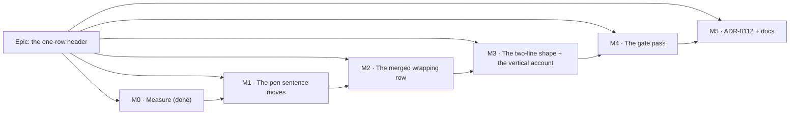

# Implementation Plan: The one-row header

- **Feature spec:** [`./feature-spec.md`](./feature-spec.md) — **Draft, awaiting approval**
- **Status:** Draft — **awaiting approval**
- **Owner:** _(unassigned)_

## Breakdown

### Epic

**The one-row header** — close the last outstanding complaint against `web-v0.103.0` by putting the
plan's identity, its modes and the pen's controls on the same row as the brand, the organisation
switcher and the account chip; and put the pen's _sentence_ where the plan's other facts already
live. Roadmap theme: the plan workspace's vertical budget (ADR-0090 → ADR-0099 → ADR-0110).

**Two product-owner decisions are already taken and are not re-opened by this plan** (feature-spec
§1): the pen sentence moves to the status bar, unconditionally; and the merged row is one line at
1600 px and above, two below. **The second is implemented as a wrap rather than a breakpoint**,
because run 3 measured a wrapping row breaking at a container of 1480 px — between 1440 and 1646,
which is where the decision put it.

**No `VITE_` flag** (ADR-0088 D1: a `VITE_` constant is inlined at build time and
`docker-publish.yml` passes none, so it has never been an operator rollback). **The rollback is a
commit boundary**, and the slicing below is what makes it cheap: M1 and M2 are separately
revertible, and M1 is independently valuable.

---

### Milestone M0 — Measure (already complete; recorded for the record)

**Outcome:** the epic's factual base.
**Entry point:** `Ships dark: a measurement harness. Nothing user-facing exists yet` (ADR-0081 §1).
**Journey:** none — a harness asserts nothing beyond reaching the screen, and
`m1-merged-probe.spec.ts:49` says so in its own docblock (ADR-0081 §3, the rule that a harness
declares where it bypasses the product).

Three runs, all recorded in [`./falsification.md`](./falsification.md) with the condition fixed in
writing beforehand: per-occupant ink (superseded), the shrink-to-fit probe (**1482 px required**),
and the wrap sweep (**breaks at a container of 1480 px**). Nothing after this milestone may assert a
width the harness has not returned.

---

### Milestone M1 — The pen sentence moves to the status bar

**Outcome:** "who holds the pen" is read in the plan status bar, in its own live region, at every
width; the badge and every ADR-0028 hand-off control stay beside the plan. The identity row sheds
**155 px** in the reachable state and **440 px** in the worst, which closes a truncation that is
live today at 1280 and 1440.
**Entry point:** the **plan status bar** (grid row 3) on any plan route — the reader sees, e.g.,
`Editing · You're editing this plan.` beside `Activities`, `Data date`, `Finish`. Nothing is pressed;
the capability is that the sentence is _there and announced_, which is what the journey asserts.
**Journey:** a new spec in `apps/web/e2e-workspace-fit/` (**existing config and existing CI step** —
`playwright.workspace-fit.config.ts` already runs at 1646 with `PLAN_EDIT_LOCK_ENFORCED=true`, and
`.github/workflows/ci.yml:539-555` already invokes `test:e2e:workspace-fit`). It takes the pen and
asserts the sentence is inside the status row, the controls are not, and the announcement is
complete. Lands **with this milestone, not at the end** (ADR-0081 §2).

---

#### Feature: the pen surface splits into a fact and a set of actions

> **Description:** One `usePenLockView` call renders two elements — a controls cluster on the
> identity row and a live-region sentence in the status bar, portalled through a registry with an
> in-place fallback.
> **Complexity:** M
> **Dependencies:** none — M1 is the first shippable slice and does not depend on the merge.
> **Risks:**
> • _Focus is thrown across the screen after a press_ → `containerRef` stays on the controls; a unit
> test asserts the focused element is **inside the controls cluster**, not merely "not `<body>`".
> • _The announcement loses the state word_ → the moved region carries `view.badge` as an `sr-only`
> first child; a test asserts the announced text contains both.
> • _An empty live region is left behind when the pen layer is off_ → both halves return `null`
> together; a test asserts the status bar has no `role="status"` in that state.
> • _The status row gains height where it had none, eating the epic's saving_ → measured in M1-T4,
> not assumed (ADR-0092 M4's "relocating a row inside one column removes nothing", one row down).
> **Testing requirements:** `CompactPenStatus.test.tsx` passes **unedited** against the in-place
> fallback (the before/after oracle); new cases for the split, the announcement and the focus return;
> a new host-registry suite; the journey above; a before/after band measurement.

##### Task M1-T1 — `PenStatusHost` / `PenStatusOutlet` (ships dark)

- **Description:** A near-verbatim sibling of `plan-facts-host.tsx`: context, outlet, host, clearing
  by **node identity**. No consumer yet.
- **Complexity:** S
- **Dependencies:** none
- **Risks:** _Copying the pattern but not its reasoning_ → the docblock states why identity-clearing
  is used (React runs a ref cleanup **before** detaching, so an `isConnected` guard keeps a node that
  is leaving the document — `plan-facts-host.tsx:22-31`), and a unit case drives the
  outlet-swap-and-unmount ordering both ways.
- **Testing:** unit — portals when an outlet exists; renders **in place** when none does; a
  departing outlet that is not the registered one does not clear it.
- **Development steps:**
  1. Add `apps/web/src/components/layout/status/pen-status-host.tsx` with the three exports.
  2. Docblock: what it is copied from, what differs (one outlet, always mounted), and why.
  3. Unit suite, including the identity-clearing case verified red against a bare `null`.

##### Task M1-T2 — Split `CompactPenStatus` into controls + sentence

- **Description:** One hook call, two elements, per feature-spec §4 C3.
- **Complexity:** M
- **Dependencies:** M1-T1
- **Risks:** _`containerRef` moves with the sentence_ → it stays with the controls, by explicit test.
  _`aria-atomic` now announces a partial statement_ → `sr-only` state word.
- **Testing:**
  - `CompactPenStatus.test.tsx` must pass **unedited** (no outlet registered ⇒ in-place fallback ⇒
    today's markup). If it does not, the split changed behaviour and the change is wrong.
  - New: the controls cluster is **not** a live region; the sentence region keeps
    `role="status" aria-live="polite" aria-atomic="true"`; the announced text contains the badge word
    **and** the sentence; `penManaged === false` renders neither half; the loading state renders the
    sentence half's copy and no empty box.
  - New: after an action that unmounts its own button, `document.activeElement` is **inside the
    controls cluster** — verified red against a version holding the ref on the sentence.
- **Development steps:**
  1. Split the render; keep `usePenLockView` called once.
  2. Wrap the sentence in `PenStatusHost`.
  3. Add the `sr-only` state word; keep the `aria-hidden` aside exactly as it is.
  4. Extend the suite; run the existing one unedited first and record that it passed.

##### Task M1-T3 — `PlanStatusBar` mounts the outlet

- **Description:** `PlanStatusBar` renders `<PenStatusOutlet />` **outside** `PlanFactsHost`, so the
  sentence does not travel with the facts when the activities row adopts them.
- **Complexity:** S
- **Dependencies:** M1-T1, M1-T2
- **Risks:** _The "status bar announces nothing" rule looks violated_ → resolved and **asserted**:
  a hosted live region is not an announcing bar (feature-spec §4 C5).
- **Testing:**
  - `plan-status-bar.test.tsx` passes **unedited** (it mounts with no provider).
  - New structural assertion: `PlanFacts` contains no `aria-live` and imports nothing from
    `announcer.tsx`; the pen region does not use the shared announcer either. Verified red by
    temporarily wiring one of them to it.
  - New: with the facts portalled to the activities row, the pen sentence is still in the status row.
- **Development steps:**
  1. Mount the outlet beside `PlanFactsHost`, before the trailing `ScheduleStateRegion`.
  2. Add the two assertions above.
  3. Update `plan-facts.tsx`'s docblock so the "announces nothing" paragraph names the distinction
     rather than leaving the next reader to find an apparent contradiction.

##### Task M1-T4 — Measure the vertical result, before and after

- **Description:** Re-run the band harness on the same fixture and widths, before and after M1-T3,
  and record `aboveCanvas`, the status row's height and the identity row's required width.
- **Complexity:** S
- **Dependencies:** M1-T3
- **Risks:** _The saving is assumed_ → it is measured. **If grid row 3 gains height in a state where
  it previously had none, the epic's net saving is smaller than 45 px and the milestone write-up says
  so.**
- **Testing:** n/a (a harness). `clearMeasurement` is called first, so a dead run cannot leave a
  stale answer on disk (`measure-toolbar/output.ts:29-48`).
- **Development steps:**
  1. Run the harness on `main`, keep the JSON.
  2. Run it on the branch.
  3. Write `docs/specs/one-row-header/m1-measurement.md` with both, and the delta, whatever it says.

##### Task M1-T5 — The journey

- **Description:** `apps/web/e2e-workspace-fit/pen-status.spec.ts`, on the existing config and CI
  step.
- **Complexity:** M
- **Dependencies:** M1-T3
- **Risks:** _A journey that asserts the document rather than the row_ → every assertion is scoped to
  the status row element and to the identity row element by role/landmark, never to `page`.
  (ADR-0073 C2.5 records exactly this passing on the prose alone.)
- **Testing:** it **is** the test. Verified red by pointing it at `main`.
- **Development steps:**
  1. Onboard, create a plan, take the pen (`e2e-workspace-chrome/support.ts` helpers, already used by
     `command-surface.spec.ts`).
  2. Assert: the sentence is inside the status row; `Stop editing` is **not**; the badge is on the
     identity row.
  3. Release the pen and assert the sentence changes in place.
  4. Run `scripts/e2e-local.sh web:workspace-fit` locally **before** pushing (CLAUDE.md §19.8).

---

### Milestone M2 — The merged wrapping row

**Outcome:** at 1646 and above, one row of chrome above the canvas instead of two.
**Entry point:** the **plan workspace header** on any plan route — the planner sees the plan's
breadcrumb, status, Edit-plan pencil, the four mode controls and the pen controls on the same row as
the brand, the organisation switcher and the account chip.
**Journey:** extended in the same `e2e-workspace-fit` spec file — **one line at 1646, two at 1440**,
measured as the row's own height, with the plan name visible in both.

---

#### Feature: the identity slot returns, and the header wraps

> **Description:** `ChromeSlotName` gains `'identity'`; the header row becomes a wrapping flex row
> with the identity slot as its only shrinkable child; the workspace portals its identity + mode +
> pen-controls block into it.
> **Complexity:** L
> **Dependencies:** M1 (the row must be state-independent before it is measured).
> **Risks:**
> • _`flex-1` survives the move and the row never wraps_ → **the single most important line in the
> change**; a browser test asserts two lines at 1440, which is impossible with `flex-1`.
> • _The mode cluster wraps internally, turning one clean row into two ragged ones_ → `shrink-0` on
> its wrapper, plus S3: the mode toolbar's own height equals a single control's, at every width.
> • _Twelve non-plan screens gain a phantom flex item_ → `empty:hidden`, plus a screenshot pass.
> • _The `sr-only <h1>` gets dragged into the banner_ → it stays outside the portal; a landmark test
> asserts `<main>`'s accessible name is the plan name and that there is exactly one `banner`.
> **Testing requirements:** unit (slot name, header order, landmarks, `empty:hidden`), browser
> measurement (line count, truncation, mode-cluster height), the journey, and the target-size sweep
> at the widths where the row is one line and where it is two.

##### Task M2-T1 — `'identity'` joins `ChromeSlotName`

- **Description:** One string, one `className` branch in `ChromeSlot`, one docblock paragraph.
- **Complexity:** S
- **Dependencies:** none
- **Risks:** _A second parallel API is invented instead_ → `chrome-slot.tsx:25-36` already argues
  against that; the docblock cites its own history (this name existed for ADR-0097 D1b and was
  removed by Graphite M3) rather than presenting it as new.
- **Testing:** unit — a portal with `name="identity"` renders into that slot and nowhere else.
- **Development steps:**
  1. Extend the union and the `cn()` branch.
  2. Docblock: what the name carried before, why it is back, and why it is a name rather than a
     provider.

##### Task M2-T2 — The header row becomes a wrapping flex row

- **Description:** Replace the `1fr auto 1fr` grid with `flex flex-wrap items-center gap-3` and three
  children: `[brand · switcher]` `shrink-0`, the identity slot `flex: 0 1 auto; min-width: 0;
empty:hidden`, and `[account]` `shrink-0 ml-auto`.
- **Complexity:** M
- **Dependencies:** M2-T1
- **Risks:**
  • _The organisation switcher stops being centred on twelve non-plan screens_ → **that is Q1, and it
  is a knowing consequence**; the screenshot pass in M2-T5 makes it visible before it is judged.
  • _`ml-auto` on the account plus a wrap distributes free space oddly_ → ADR-0091 M7 records a flex
  line splitting free space **equally between every auto margin**; there is exactly one here, and a
  browser test asserts the account chip is the row's rightmost control on **both** lines states.
- **Testing:**
  - `app-header.test.tsx` — the DOM-order case must pass **unedited**; its docblock is updated to say
    the order now also carries the identity block, and **why the assertion still means what it meant**.
  - New: with an empty identity slot the row's height is unchanged from today's header.
- **Development steps:**
  1. Rewrite `HeaderContents`' container and cells.
  2. Replace the grid docblock — including the `1fr auto 1fr` rationale, which stops being true and
     must not be left standing (this repository's most-recorded drift shape).
  3. Add the empty-slot height case.

##### Task M2-T3 — The workspace portals its identity block into the slot

- **Description:** Wrap the identity + mode + pen-controls block in `ChromePortal name="identity"`;
  change the identity block's `flex-1` to `flex: 0 1 auto` with `min-w-0` kept; keep `shrink-0` on
  the mode wrapper and the pen cluster; keep `data-plan-identity`.
- **Complexity:** M
- **Dependencies:** M2-T1, M2-T2, M1
- **Risks:** _The band's own row wrapper is left behind as an empty bordered strip_ → the
  `border-b`/`py-1` row that held the identity must go with its contents; a browser test asserts the
  band's child count and that there is no zero-content bordered row.
- **Testing:** unit (the block renders into the identity slot; `data-plan-identity` still resolves);
  browser (M2-T4).
- **Development steps:**
  1. Move the block into the portal and delete the now-empty band row.
  2. Change the flex properties, with a comment naming the measurement that chose them.
  3. Re-point the two harness selectors and confirm they still resolve.

##### Task M2-T4 — Measure the shipped row, and re-derive the wrap point

- **Description:** Re-run `m1-merged-probe` against the **shipped** markup; re-run the band harness
  for `aboveCanvas`; record the wrap point the shipped row actually has.
- **Complexity:** S
- **Dependencies:** M2-T3
- **Risks:** _The design's own numbers are carried rather than re-derived_ → the ADR-0091/0092/0099
  rule; every headline number in the write-up is re-derived from the shipped code.
- **Testing:** n/a (harness). **A result that disagrees with run 3 is the finding**, and the
  milestone write-up says so before anything is adjusted.
- **Development steps:**
  1. Run both harnesses; write `docs/specs/one-row-header/m2-measurement.md`.
  2. State the net vertical result **including** anything M1-T4 found the status row gaining.

##### Task M2-T5 — Screenshots of the twelve non-plan screens

- **Description:** Run `apps/web/scripts/shoot.mjs` and look at what the header change did to
  screens this epic is not about.
- **Complexity:** S
- **Dependencies:** M2-T2
- **Risks:** _Q1 is judged from a description rather than a picture_ → ADR-0102 records two defects
  that only photographs found, with every gate green; ADR-0101 records the one surface the shot list
  did not cover being exactly where a four-scrollbar panel reached a user.
- **Testing:** n/a — this is a look, and its output is a paragraph in the milestone write-up.
- **Development steps:**
  1. Shoot before and after.
  2. Record anything the change made worse, however small, rather than only what it made better.

---

### Milestone M3 — The two-line shape, and the row's own assertions

**Outcome:** below the wrap point the row is two lines that look deliberate, nothing is hidden, and
the behaviour is pinned by tests that would fail if it regressed.
**Entry point:** the same header, at 1440 px and below — this milestone adds no new control, so its
claim is about a **state** of an existing surface, and the journey is what makes that claim
checkable.
**Journey:** the S1 assertion, in the browser.

> **Why this is a milestone rather than part of M2.** M2 makes the row wrap; what nobody has looked
> at is whether the wrapped result is a shape a planner would accept — where the line breaks, what
> ends up beside what, and whether the second line is as tall as the first. ADR-0099 M6–M9 record
> four consecutive milestones losing their headline task to a re-read of the problem; this one is
> deliberately kept separate so the two-line state gets looked at rather than inherited.

---

#### Feature: the wrapped row is a designed state

> **Description:** Assert and, if needed, tune the two-line shape: line-break position, vertical
> rhythm, and the guarantee that the plan name is never truncated to nothing to buy a line.
> **Complexity:** M
> **Dependencies:** M2
> **Risks:**
> • _The break lands somewhere ugly (e.g. the account chip alone on line 2)_ → measured in M3-T1; the
> remedy is a grouping change, not a breakpoint.
> • _The two-line height exceeds today's two rows_ → measured; if it does, the epic has made the
> narrow case worse and must say so.
> **Testing requirements:** the S1/S3 browser assertions, the target-size sweep at 1440 and 1280, and
> an axe pass in both states.

##### Task M3-T1 — The line-count assertion (the epic's headline gate)

- **Description:** A browser test asserting **one line at 1646 and two at 1440**, measured as the
  row's own `clientHeight` against a single line's, with the plan name **visible and non-empty** in
  both.
- **Complexity:** M
- **Dependencies:** M2-T3
- **Risks:** _A height assertion passes against a row that is one line because everything truncated
  to nothing_ → the plan-name-visible half is not decoration; without it the gate is satisfied by the
  defect it exists to catch (the ADR-0110 D4 shape — a gate satisfied by the thing it protects being
  broken).
- **Testing:** **verified red twice, against two different wrong states**: against `flex-1` on the
  identity block (never wraps) and against a hypothetical `shrink` on the mode wrapper (wraps too
  early). ADR-0110 D5: _a gate is not finished when it passes; it is finished when it has been made
  to fail by the defect it was written for._
- **Development steps:**
  1. Add the assertion at 1646 and 1440 in the `e2e-workspace-fit` spec.
  2. Add the mode-cluster-height assertion (S3).
  3. Verify red against both wrong states, then green.

##### Task M3-T2 — Target size and axe, in both line states

- **Description:** Extend `command-surface.spec.ts`'s existing sweep to cover the merged row's
  controls, at a width where it is one line and a width where it is two.
- **Complexity:** S
- **Dependencies:** M3-T1
- **Risks:** _The sweep is scoped to the deck and silently covers nothing new_ → ADR-0099 M10 records
  three suites whose `.include()` named deleted rows; the sweep must be **verified red** with a
  deliberately shrunk control on the merged row before it is trusted.
- **Testing:** it is the test.
- **Development steps:**
  1. Widen the sweep's root to the header row as well as the deck.
  2. Verify red at 12 × 36 on one of the new controls.
  3. Add an axe scan in both line states.

##### Task M3-T3 — Tune the wrapped shape if M3-T1 says so

- **Description:** Conditional. Only if the measured break position or the two-line height is worse
  than today's two rows.
- **Complexity:** S–M
- **Dependencies:** M3-T1
- **Risks:** _Tuning by eye_ → any change here is justified by a number from M3-T1's run.
- **Testing:** re-run M3-T1.
- **Development steps:**
  1. Read the measurement.
  2. If nothing is wrong, **record that and change nothing** — a task that ends in no code is a valid
     outcome and should be written down rather than filled.

---

### Milestone M4 — The gate pass

**Outcome:** the specialist reviews and the full journey sweep have run over the combined diff, and
every blocking finding is folded with a regression test verified red first.
**Entry point:** `Ships dark: a review milestone; it adds no capability.`
**Journey:** the **whole estate** — see M4-T2.

---

#### Feature: five specialist reviews and a real sweep

> **Description:** The pass this repository has run for nine consecutive epics, each of which found
> something a human read did not.
> **Complexity:** M
> **Dependencies:** M3
> **Risks:** _Reviews are run and their findings deferred_ → each blocking finding is folded in this
> milestone with a test verified red first; non-blocking findings get a `docs/TECH_DEBT.md` row with
> their evidence.
> **Testing requirements:** as below.

##### Task M4-T1 — The reviews

- **Description:** Run, over the combined diff:
  **accessibility-reviewer** (landmarks, the split live region, focus return, tab order across a
  wrap, target size); **ux-reviewer** (the two-line shape, the un-centred switcher, the pen sentence's
  new neighbours); **component-reviewer** (the flex contract, the slot name, the registry copied from
  `PlanFactsHost`, docblocks that stopped being true); **frontend-performance-reviewer** (that no
  listener/observer/state was added, and the bundle delta); **test-engineer** (the gates' blind spots).
  **CLAUDE.md §19.13 additionally requires accessibility-reviewer and component-reviewer here**,
  because this change moves focus and alters which element owns a keyboard surface.
- **Complexity:** M
- **Dependencies:** M3
- **Risks:** _A reviewer's finding is argued with rather than checked_ → ADR-0086 D8's record: a
  finding that looks answerable was answering the wrong question.
- **Testing:** every folded finding carries a regression test **verified red first**.
- **Development steps:**
  1. Run the five.
  2. Fold blocking findings; file the rest with evidence.
  3. Record how many found something a human read did not — the pass's own running score.

##### Task M4-T2 — Repair `scripts/e2e-sweep.sh`, then run it

- **Description:** The sweep list names `toolbar-fit`, which has **no script and no directory**, and
  omits `workspace-fit`, which has both. Repair it, then run the sweep — this epic is precisely "a
  change that moves a control every journey clicks", the sweep's own stated trigger
  (`e2e-sweep.sh:19-20`).
- **Complexity:** S
- **Dependencies:** M3
- **Risks:** _The list is repaired from memory_ → derive it from `apps/web/package.json`'s
  `test:e2e:*` scripts and check each against a directory, rather than editing the two entries that
  are known wrong. **Other entries may also be stale; the check is the point, not the two examples.**
- **Testing:** the sweep itself. Failures are triaged as product defect vs. stale locator, and
  ADR-0091 M7's rule applies: **locate a toolbar control by `[data-toolbar-item]`, never by its copy.**
- **Development steps:**
  1. Re-derive the suite list; note every mismatch found.
  2. Run `scripts/e2e-sweep.sh`.
  3. Fix what breaks; record which breakages were the product and which were the test.

##### Task M4-T3 — Re-derive the epic's own numbers from the shipped code

- **Description:** Every headline figure in the spec and the ADR is re-measured against the final
  branch.
- **Complexity:** S
- **Dependencies:** M4-T1, M4-T2
- **Risks:** _A number from a mid-epic run is quoted as the shipped one_ → this has happened in this
  register often enough to be a rule.
- **Testing:** n/a.
- **Development steps:**
  1. Re-run both harnesses.
  2. Correct the spec and the ADR draft in place where they disagree, and **say that they were
     corrected** rather than silently updating.

---

### Milestone M5 — ADR-0112 and the documentation

**Outcome:** the decision is recorded where the next person will look, and the documents that
described the old shape no longer do.
**Entry point:** `Ships dark: documentation.`
**Journey:** none.

##### Task M5-T1 — Write ADR-0112

- **Description:** From the outline in feature-spec §4, with the numbers M4-T3 re-derived.
- **Complexity:** M
- **Dependencies:** M4
- **Risks:** _The number is taken from the wrong ADR_ → `docs/adr/` ended at ADR-0111 on 2026-08-26
  (verified by Glob, not by the brief). **Re-verify at the moment of writing**: ADR-0079 records
  losing its intended number between plan and milestone, and ADR-0071 records what happens when a
  collision is noticed and routed around instead of fixed.
- **Testing:** `pnpm check:adr-coverage` — since ADR-0110 D6 it validates the index in **both**
  directions, so a missing `docs/adr/README.md` row fails CI. `pnpm prepush` runs it; running the
  parts by hand is how that gate was missed on 2026-08-22 (CLAUDE.md §19.8).
- **Development steps:**
  1. Write the ADR, D1–D9.
  2. Add the `docs/adr/README.md` row.
  3. Run `pnpm prepush` — **the one command**, not a hand-assembled subset.

##### Task M5-T2 — Update the documents that described the old shape

- **Description:** `CLAUDE.md` §16 (a new ADR entry); `docs/TECH_DEBT.md` (#193 answered — the five
  dead exports stay dead, with what would change that; #198's second half, the leaf measure's
  blindness to padding, recorded as its own finding; any M4 non-blocking findings); `scripts/e2e-sweep.sh`
  if M4-T2 did not already land it.
- **Complexity:** S
- **Dependencies:** M5-T1
- **Risks:** _A docblock left describing the grid_ → `app-header.tsx`'s `1fr auto 1fr` rationale and
  `plan-workspace-toolbar.tsx`'s comments about the identity row's home are the two most likely to be
  left standing. **Both are addressed in M2, not here**; this task checks that they were.
- **Testing:** `pnpm check:doc-links`, `pnpm check:counts`, `pnpm check:claims` (all inside
  `pnpm prepush`).
- **Development steps:**
  1. Grep for the phrases the change falsifies before editing anything.
  2. Update; add a changeset (`web`, minor — a user-visible layout change).

---

## Sequencing & slices

| Slice  | Ships                                            | `main` stays releasable because                                              | Independently revertible |
| ------ | ------------------------------------------------ | ---------------------------------------------------------------------------- | ------------------------ |
| **M1** | The pen sentence in the status bar               | The identity row simply gets narrower; nothing else moves                    | **yes** — one commit     |
| **M2** | The merged wrapping row                          | A wrapping row cannot overflow; the narrow case is two lines, as it is today | **yes** — one commit     |
| **M3** | The two-line shape's assertions (and any tuning) | Tests plus, at most, class changes                                           | yes                      |
| **M4** | Review fixes                                     | Each fix is small and tested                                                 | per-fix                  |
| **M5** | ADR + docs                                       | No product code                                                              | n/a                      |

**No feature flag.** ADR-0088 D1: a `VITE_` constant is inlined at build time,
`docker-publish.yml` passes none, and `.dockerignore` strips `**/.env` from the build context — so a
flag has never been an operator rollback for this product. The rollback is a commit boundary, which
is exactly why M1 and M2 are separate commits and why M1 is sequenced first.

**`scripts/frontend-only.json` is deliberately NOT armed** (feature-spec Q4). It is a good gate that
has gone stale three times out of three (`docs/TECH_DEBT.md` #194), and a stale declaration goes
wrong about a **different** change rather than going quiet. The epic is frontend-only and the ADR
says so.

## Definition of Done (per task)

Each task's PR must satisfy the Feature Completion Criteria in
[`docs/PROCESS.md`](../../PROCESS.md) — code, tests, docs, security, performance, accessibility,
Docker build, CI, changelog, version impact. Two of those have teeth here:

- **"Tests" means the pre-push gate was run, not that tests exist.** `pnpm prepush` — the **one**
  command, which derives ten checks from `package.json` — plus
  `scripts/e2e-local.sh web:workspace-fit` for every milestone that touches the journey. No
  `apps/api` change, so the API e2e half does not apply.
- **A journey drives a real browser.** Line count, truncation, focus destination and target size are
  all layout facts, and jsdom has no layout. CI is the second opinion, never the first.

## Risks & assumptions (rollup)

| Risk / assumption                                                                                                | Likelihood | Impact   | Mitigation                                                                                                                                     |
| ---------------------------------------------------------------------------------------------------------------- | ---------- | -------- | ---------------------------------------------------------------------------------------------------------------------------------------------- |
| **The identity block keeps `flex-1` and the row never wraps** — plan name truncates to nothing on a one-line row | med        | **high** | Measured and stated (`falsification.md` §3); M3-T1 verified red against exactly this state                                                     |
| **The mode cluster wraps internally**, turning one clean row into two ragged ones                                | med        | **high** | `shrink-0` on its wrapper; S3 asserts the cluster's own height at every width                                                                  |
| The status row gains ~24 px where it had none, cutting the epic's saving from ~45 px to ~21                      | med        | med      | Measured in M1-T4 **before** M2 is built; the write-up states the net, whatever it is                                                          |
| The 431 px identity figure is optimistic — the fixture's project crumb reads `Project`                           | **high**   | low      | A wrapping row absorbs it by breaking a line; a breakpoint design would not have. Stated in the spec's "what the reading does not say"         |
| The organisation switcher moving from centred to leading is judged badly on twelve screens the epic is not about | med        | med      | Q1 is raised for decision **before** approval; M2-T5 photographs it                                                                            |
| A reviewer finds a defect in one of this epic's own gates                                                        | **high**   | med      | Expected — ADR-0110 D5's rule; every new gate is verified red against the defect it names before it is trusted                                 |
| `scripts/e2e-sweep.sh` is stale in ways beyond the two found                                                     | med        | med      | M4-T2 re-derives the list from `package.json` rather than patching the two known entries                                                       |
| The ADR number is taken between plan and milestone                                                               | low        | low      | Re-verified at writing time (ADR-0079's record); a collision is fixed, never routed around (ADR-0071's)                                        |
| **Assumption:** no permission, API, DTO or schema change is involved                                             | —          | —        | Verified by scope: every changed file is under `apps/web/src`; `database-architect` is not engaged because there is no schema change to design |
| **Assumption:** the CPM engine is not imported, so the ADR-0034 parity gate is untouched by construction         | —          | —        | Verified by the same scope statement                                                                                                           |
