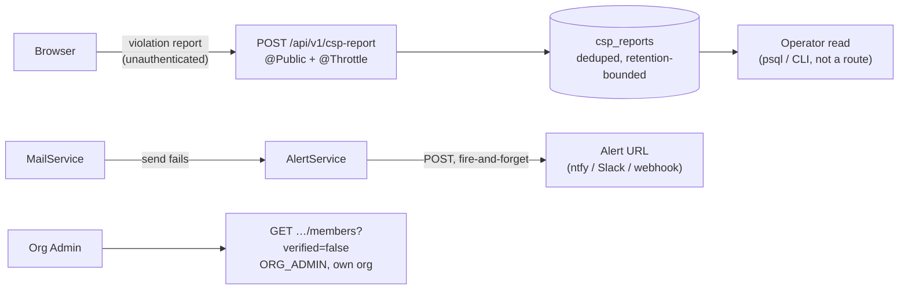

# Feature Spec: Operational self-service

> **Status:** Draft — awaiting approval (docs/PROCESS.md stage 1–4). **No application code is
> written until this and the implementation plan are approved.**
> **Date:** 2026-08-09
> **Origin:** the product owner, on being handed a three-step host runbook: _"rather than doing all
> these steps myself, can we build them into the app so they can run themselves for results, and
> then I can just modify my stack after I know everything works?"_

## 1. Business understanding

### Problem

Three operational facts about this product are knowable only by a person doing something by hand on
the host, and two of them recur.

1. **Whether the Content-Security-Policy is safe to enforce.** `CSP_POLICY` carries **no
   `report-uri` or `report-to`** (verified: `docker-compose.release.yml:145`), so a violation exists
   only in whichever browser console happens to be open when it happens. The documented procedure is
   therefore to flip the header and walk six surfaces watching DevTools — and `apps/web/e2e-csp/`
   states in its own docblock that it cannot cover three of them (canvas export, the printed
   programme, `upgrade-insecure-requests`). The evidence that would make the decision safe is
   produced by real browsers and then discarded.

2. **Whether mail is actually sending.** ADR-0075 decided a failed send is the operator's signal,
   not the caller's — surfacing it to the caller would make "that address was free" distinguishable
   from "that address is taken" on an unauthenticated endpoint. The application emits one alertable
   line, `event: 'mail.send_failed'`. Nothing in the product acts on it; the current answer is a
   host cron that greps `docker logs`, which needs the Docker socket and the container's exact
   Compose-derived name.

3. **Which members have not verified their address.** Once `AUTH_REQUIRE_EMAIL_VERIFICATION` is on,
   an unverified member cannot sign in — and the only way anyone can find out who is in that state
   is `psql`.

### Users

- **The operator** (today, one person; the product owner) — items 1 and 2.
- **An Org Admin** — item 3. This is the distinction that makes item 3 buildable at all; see below.

### Primary use cases

- Enforce a CSP change **knowing** what it will break, from evidence collected during a report-only
  window rather than from a single walkthrough.
- Be told, without watching anything, when the mail relay stops working — before the first person
  who cannot get in tells somebody.
- Answer "why can't this member sign in?" from inside the product.

### Expected outcomes

- The six-surface walk stops being the mechanism by which CSP violations are discovered. It remains
  a reasonable sanity check; it stops being the only evidence.
- A broken relay produces an alert rather than a silence.
- The support question is answerable by the person who is asked it.

### Success criteria

- A deliberately-introduced violation (e.g. an ``) on any of the six surfaces
  appears in the report list without anyone having had a console open.
- Stopping the SMTP container produces an alert within the configured window.
- An Org Admin can see their organisation's unverified members without database access.

### Open questions

- **Retention for CSP reports.** They carry URLs, which are low-sensitivity but not nothing. A short
  window (14–30 days) is proposed; it is a decision, not a default.
- **Whether app-native mail alerting replaces the cron or supplements it.** It cannot cover "the API
  is down", which the cron's `docker logs` failure branch does. Proposed: it supplements.

## 2. Functional requirements

### User stories & acceptance criteria

**M1 — CSP report sink**

- _As the operator, I want browsers to report CSP violations to the API, so I can enforce the policy
  from evidence rather than from a walkthrough._
  - The policy gains report directives; the API accepts the report and stores it.
  - The endpoint is **unauthenticated by necessity** — browsers post violation reports without
    credentials — and is therefore rate-limited, size-capped and retention-bounded.
  - Reports are **deduplicated** by (directive, blocked URI, document URI): one misconfigured
    resource on a busy route must not produce ten thousand rows.
  - The operator can read them, newest first, with a count per distinct violation.

**M2 — Mail failure alerting**

- _As the operator, I want the API to tell me when a send fails, without me running a cron that
  needs the Docker socket._
  - When the mail port reports a failure, the API POSTs to a configured URL.
  - The alert names the message kind and the count in the window — never the recipient address.
  - Alerting failure is itself non-fatal and never blocks the request that triggered the send.
  - With no URL configured, behaviour is byte-identical to today.

**M3 — Unverified members (org-scoped)**

- _As an Org Admin, I want to see which members of my organisation have not verified, so I can
  answer "why can't they sign in?"._
  - The members list can be filtered to unverified.
  - The row offers "resend verification" where that is permitted.

### Permissions

| Surface            | Principal                        | Note                                                               |
| ------------------ | -------------------------------- | ------------------------------------------------------------------ |
| `POST /csp-report` | **none** — `@Public()`           | Browsers cannot authenticate a report. Rate-limited, per ADR-0051. |
| Read CSP reports   | operator only, **not** in-app UI | See §3: there is no principal for a system-wide read.              |
| Mail alert         | none — outbound only             | No endpoint; the API is the client.                                |
| Unverified members | `ORG_ADMIN`, own organisation    | Org-scoped, so an existing principal fits without inventing one.   |

### Edge cases

- A report body that is not valid JSON, or is 2 MB, or arrives 50/second from one IP.
- Reports from a **different origin** than ours (anyone can POST to a public endpoint).
- A mail alert URL that is itself down — must not retry into the request path.
- An organisation with no unverified members (the common case) — an empty state, not a blank table.

## 3. Technical analysis

**The constraint that shapes the whole feature: there is no system administrator.**
`OrganizationRole` is `VIEWER | CONTRIBUTOR | PLANNER | ORG_ADMIN`
(`apps/api/prisma/schema.prisma:110-115`) — every role is scoped to an organisation. Nothing in the
product is a global principal.

Three consequences, and they are the reason this spec is shaped as it is rather than as asked:

1. **The verification backfill cannot be an in-app action.** It is a system-wide irreversible write.
   Minting a super-admin role to press it once is a permanent new attack surface bought for a
   single use. It stays a `psql` script.
2. **The CSP report _reader_ cannot be an in-app screen** for the same reason — the reports are
   system-wide, not org-scoped. It is an operator-facing read: a `docker compose exec` query, or a
   log line, not a route behind a role that does not exist.
3. **The unverified-members view survives**, precisely because it can be scoped to one organisation
   and read by its admin. That is the version worth building; the global count is not.

### Dependencies

- `@nestjs/throttler` — already a dependency, already used for exactly this shape
  (`share-guest.controller.ts:66`, ADR-0051's per-IP `@Throttle`).
- The mail port (`common/mail/`) — the alert hooks the existing failure path, not a new one.
- No new packages proposed.

## 4. Solution design

### Architecture overview

### Database changes

One table, `csp_reports`, deliberately **not** modelled on `audit_events`: it is not evidence about
people, it is telemetry about the policy, so it is ordinary — updatable, deletable, and expired on a
schedule. Deduplicated on `(effective_directive, blocked_uri, document_uri)` with a `count` and
`first_seen_at` / `last_seen_at`, so volume is bounded by the number of _distinct_ violations rather
than by traffic.

No schema change for M2 or M3 — M3 reads `users.email_verified`, which already exists.

### API changes

| Method | Path                                  | Auth        | Note                               |
| ------ | ------------------------------------- | ----------- | ---------------------------------- |
| `POST` | `/api/v1/csp-report`                  | `@Public()` | Rate-limited; always returns `204` |
| `GET`  | `/api/v1/organizations/:slug/members` | member      | Gains a `verified` filter          |

`204` regardless of body validity, deliberately: a report endpoint that returns errors tells an
attacker their probe was interesting, and there is no caller to inform.

### Implementation approach & alternatives

**Considered and rejected: a third-party report collector** (Sentry, report-uri.com). It works and
needs no code — but it sends every violating URL of a private planning tool to a third party, and
this product has no other external data egress. Rejected on that ground alone.

**Considered and rejected: making the mail alert synchronous.** ADR-0075 rejected exactly this for
the send itself, because a failure that blocks the request would create an enumeration oracle on
sign-up. The same reasoning applies to the alert: fire-and-forget, never awaited.

## 5. Links

- ADR-0074 (CSP derivation, the report-only window and what it found)
- ADR-0075 (mail is best-effort; why the failure is the operator's)
- ADR-0051 (the app's first rate limiter — the precedent this reuses)
- `docs/DEPLOYMENT.md` §"Turning the CSP from report-only to enforce", §"Alerting on mail failures"
- `docs/TECH_DEBT.md` #8, #16, #100
