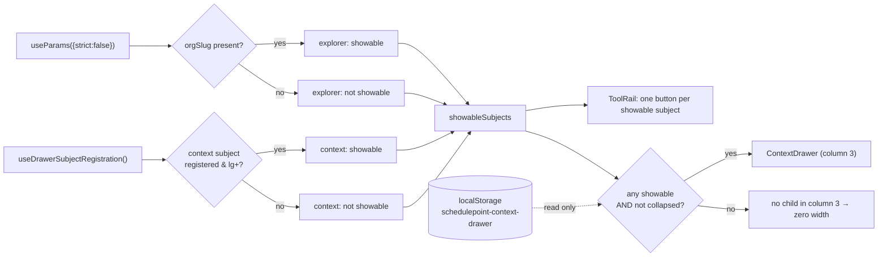
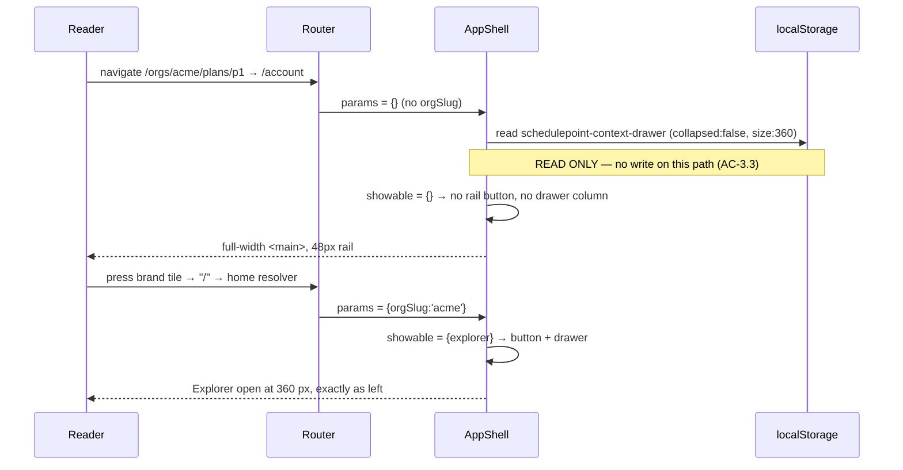
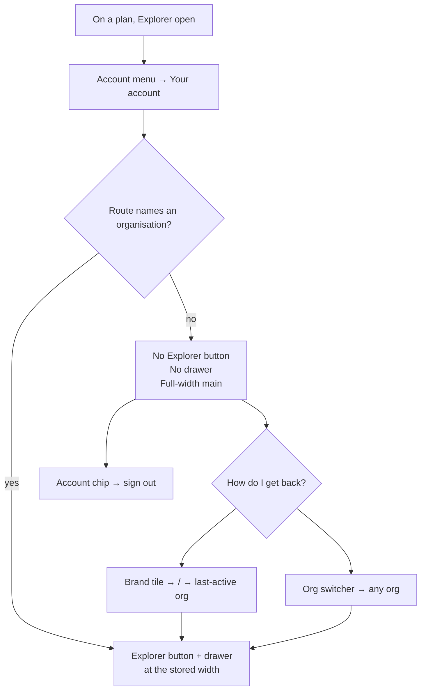

# Feature Spec: The shell on screens that have no organisation

> [!IMPORTANT]
> **This document was written AFTER the implementation, deliberately and as a check — not before
> it, and it must not be read as though it preceded the work.**
>
> `docs/TECH_DEBT.md` #165a was built without a spec or an implementation plan. The product owner
> caught that and ruled that one be produced as a **check on what shipped**, so it was written by
> `feature-analyst` in an isolated git worktree pinned to the pre-change commit `52b6003` — blind
> to the implementation, because a spec written with the solution in view rationalises it instead
> of testing it.
>
> It is recorded this way because the alternative is worse than having no spec: a retroactive
> document presented in the normal order makes the gap invisible, and this repository's own
> ADR-0081 records that a plan is evidence the tasks were done, not that a capability exists.
>
> **What the check found is in `docs/DECISIONS.md`** under the 2026-08-22 entry: it reached the
> same core design independently — which is the part that makes it worth having — and found four
> things the implementation had missed.

- **Status:** Draft — awaiting approval
- **Author(s):** feature-analyst
- **Date:** 2026-08-22
- **Tracking issue / epic:** `docs/TECH_DEBT.md` **#165 finding (a)**
- **Roadmap link:** post-theme consolidation (W1 catalogue → W2 remedies)
- **Related ADR(s):** ADR-0029 (persistent shell), ADR-0082 (omit vs. shade), ADR-0083
  (the inverse ruling for fields), ADR-0093 (an object action belongs on the object),
  ADR-0099 D1/D2 (tool rail + context drawer), ADR-0088 (no `VITE_` flag). **A new ADR is
  recommended — see §4.6.**

> **Scope.** `docs/TECH_DEBT.md` #165 finding **(a)** only. Findings (b) `My activity`'s
> ragged filter row, (c) `All events shown` styled as an action, (d) `client-detail`'s bare
> text row actions and (e) the unphotographed `/staff` console are **out of scope** and not
> designed for here. One interaction is noted in §3: fixing (a) widens `<main>` on
> `/me/activity`, so (b)'s wrapping evidence must be re-photographed after this lands rather
> than reused.

---

## 1. Business understanding

### Problem

The authenticated app shell renders organisation-scoped navigation on three routes that have
no organisation, and the navigation cannot navigate.

At 1646 px (the product owner's Surface Pro, established in ADR-0091's retrospective as the
width two epics never measured at) the Project Explorer drawer is open at ~298 px — about 18 %
of the viewport — on `/account`, `/onboarding` and `/me/activity`. It contains one sentence,
_"Select an organisation to browse."_ (`apps/web/src/components/layout/navigator/navigator-rail.tsx:119`),
above an empty 40 px actions row whose only child is gated on `orgSlug && crud.canWrite`
(`navigator-rail.tsx:90-113`). On `/onboarding` that sentence sits beside a card asking the
reader to create their **first** organisation: there is, by definition, nothing to select on
the first screen a new member ever sees.

**The cause is one missing decision, not three screen bugs.** `AppShell` reads
`orgSlug` from the URL (`app-shell.tsx:126-127`) and hands it to five consumers, each of which
degrades on its own:

| Consumer                                      | Behaviour with no `orgSlug`                       | Evidence                                            |
| --------------------------------------------- | ------------------------------------------------- | --------------------------------------------------- |
| `OrgSwitcher`                                 | renders, showing a `Select organisation` option   | `OrgSwitcher.tsx:20-22, 48-52`                      |
| `OrgDestinationsCollapsed` (the six places)   | **withheld**                                      | `tool-rail.tsx:161`                                 |
| below-`lg` "Show Project Explorer" trigger    | **withheld**                                      | `app-header.tsx:55`                                 |
| `ToolRail`'s `context` panel button           | **withheld**, citing ADR-0082 by name             | `tool-rail.tsx:74-81, 130-141`                      |
| `ToolRail`'s `explorer` panel button + drawer | **rendered, inert**                               | `tool-rail.tsx:120-129`, `app-shell.tsx:441-468`    |
| `useExpansionState(orgSlug ?? '')`            | writes `schedulepoint-nav-expanded:` (empty slug) | `app-shell.tsx:131`, `use-expansion-state.ts:57-63` |

The three "withheld" rows are the same rule applied correctly, twice in the tool rail and once
in the header. The pinned desktop Explorer is the one surface it was never applied to — the
shape this register keeps recording (ADR-0064 §7, ADR-0067, ADR-0092: _one correct pattern
applied to a control and not its neighbour_). **The last row is the tell**: the shell does not
model "no organisation"; it models "an organisation whose slug is the empty string", and writes
a `sessionStorage` key for it.

Nothing ever decided this. `docs/adr/0029-persistent-hierarchy-navigator.md` contains no
occurrence of `no active org`, `Select an organisation` or `without an org`
(established by grep over that file, 2026-08-22): the org-less case was never in the design,
so the empty state is a fallback the shell gets by forgetting rather than a state anyone chose.

**Why now.** The route was photographed for the first time on 2026-08-22 (`shoot.mjs:425-437`),
after the ADR-0102 repaint. Widening that harness 12 → 25 shots during ADR-0102 found two
defects only a photograph could find, both with every gate green; this is the same class. The
screens are live: the product owner's host pulls every release (ADR-0047 with the `autodeploy`
profile), so `/onboarding` is what every new member currently meets.

**What the reader loses.** On `/account` and `/me/activity`, 298 px of the working area to a
panel that offers one instruction the reader cannot follow inside it. On `/onboarding`, the
same, plus a sentence that is false: there is nothing to select, and following the instruction
is precisely the task the card beside it is asking them to begin.

### Users

Every authenticated member of every organisation, in every role (`ORG_ADMIN`, `PLANNER`,
`CONTRIBUTOR`, `VIEWER` — ADR-0016). **This is not a role question**: a Viewer on
`/orgs/acme/plans/x` gets the full Explorer tree today and must keep it. Two populations feel
it differently:

- **A brand-new member on `/onboarding`.** Has no organisation at all. Their whole task is the
  card. The panel is noise beside it and its copy contradicts the screen.
- **An existing member on `/account` or `/me/activity`.** May belong to several organisations;
  the route simply is not scoped to one. They came to change a password or read their own
  audit events, and 18 % of the width is spent inviting them to leave.

External Guests (ADR-0051) never see the shell — `/share` is a sibling of `_authed`
(`router.tsx:377-392`). Staff never see it either — `/staff` hangs off `rootRoute`
(`router.tsx:361-375`), which is why there are exactly **three** affected routes, not four.

### Primary use cases

1. A new member creates their first organisation on `/onboarding` with the screen's attention
   on the card, and no instruction on screen they cannot act on.
2. An existing member changes their password on `/account` with the full stage width.
3. An existing member reads their own audit events on `/me/activity` with the full stage width.
4. From any of the three, a member returns to their work in one press.
5. A member who set the drawer's width and open/closed state finds it exactly as they left it
   when they come back to an organisation route.

### User journeys

**Happy path (existing member).** Signed in on a plan with the Explorer open at their chosen
width → opens the account menu → `Your account` → `/account` renders with no Explorer button
and no drawer; the stage is full width → presses the brand tile → the home resolver
(`router.tsx:152-164`) returns them to their last-active organisation → the Explorer is back,
open, at the same width.

**Happy path (new member).** Signs up → `/onboarding` → a 48 px rail carrying the brand tile
and the account chip, and a card → creates the organisation → lands on the organisation
overview with the Explorer available.

**Alternate — the reader had closed the drawer.** Same as above in both directions; the drawer
stays closed on return. The rule must not change their preference in either direction.

**Alternate — no organisations and second thoughts.** A reader on `/onboarding` who signed up
by mistake must still be able to sign out. The account chip stays.

### Expected outcomes

- Three screens gain ~298 px of stage at 1646 px and lose an instruction that cannot be
  followed on two of them and is false on the third.
- The shell states, once, what it does on a route with no organisation — so the **fourth**
  org-less route inherits the answer instead of re-deriving it.
- One rule replaces five independent degradations of the same missing fact.

### Success criteria

| Criterion                                                                                                      | Instrument                    |
| -------------------------------------------------------------------------------------------------------------- | ----------------------------- |
| No element named "Project Explorer" is in the accessibility tree on the three routes at `lg`+                  | unit                          |
| `<main>` spans the full stage on all three routes (grid column 3 has no child)                                 | unit + photograph             |
| `localStorage['schedulepoint-context-drawer']` is byte-identical across a round trip through an org-less route | unit + journey                |
| Every existing org-present behaviour is unchanged, assertion for assertion                                     | unit (the re-pointed suite)   |
| A fourth org-less route cannot be added without classifying it                                                 | unit (structural, route tree) |
| The three screens photograph as intended at 1646/1920/1280                                                     | photograph                    |

### Open questions

**CQ-1 (CRITICAL) — Omit, shade with a reason, or something else?**
**Recommendation: omit.** Reasoning and the honest seam in ADR-0082's discriminator are in
§4.2. Default if unanswered: omit.

**CQ-2 (CRITICAL) — Is the answer the same on all three routes?**
**Recommendation: yes — one rule, keyed on the route, never on the reader's memberships.**
Reasoning in §4.3, including the mechanical argument (a membership-keyed rule is a _deferred_
rule and would shift the layout 298 px after paint on every `/account` load). Default: uniform.

**CQ-3 (CRITICAL) — Should the Explorer instead be made to WORK here, rooted at the reader's
last-active organisation?** **Recommendation: no**, costed honestly in §4.4 — five costs, of
which two are decisive: it breaks ADR-0029's "selection is a pure projection of the URL"
invariant by design, and it cannot help `/onboarding` at all, so the withholding rule is needed
regardless and the product would then carry two rules discriminated by a fact the reader cannot
see. Default: reject.

**CQ-4 (CRITICAL) — Do the six organisation destinations come back on `/account` and
`/me/activity`?** They are withheld today by the same mechanism (`tool-rail.tsx:161`) and
nobody decided that either. **Recommendation: leave them withheld** — the same "which
organisation?" ambiguity as CQ-3, and the reader already has two working exits (the brand tile
→ `/` → home resolver; the switcher → any organisation). Named here because deciding (a)
without naming it would leave the neighbour half-decided, which is the ADR-0071 failure.
Default: leave withheld, record the decision.

**Q-5 (non-critical) — the brand tile on `/onboarding` links to `/`, and the home resolver
sends an org-less reader straight back to `/onboarding`** (`brand-mark.tsx:86-92` +
`router.tsx:155-163`). It is a self-link. Arguably correct — "home" for a member with no
organisation _is_ onboarding — and it is finding (a)'s neighbour, not (a). **Default: leave it,
record the observation.**

**Q-6 (non-critical) — an ADR or a `docs/DECISIONS.md` entry?** **Recommendation: an ADR**
(§4.6). Default: write the ADR; take the number at filing time, never from this document
(ADR-0071 was cited by shipped code while unfiled; ADR-0079 had to be renumbered because its
plan's number was taken in between). Highest ADR present at the time of writing is **0103**
(`docs/adr/0103-paper-is-a-surface.md`), so 0104 is the likely number and is not reserved.

---

## 2. Functional requirements

### User stories & acceptance criteria

Every criterion names its instrument: **unit** (Vitest + Testing Library), **journey**
(Playwright against a real API), **photograph** (`apps/web/scripts/shoot.mjs`).

> **US-1** — As a **new member on `/onboarding`**, I want the screen to be about creating my
> organisation, so that nothing on it instructs me to do something impossible.
>
> **Acceptance criteria**
>
> - **AC-1.1** _Given_ a signed-in reader with no organisations, _when_ `/onboarding` renders at
>   ≥ 1024 px, _then_ no element with the accessible name "Project Explorer" exists in the
>   accessibility tree — neither a `button` in the rail nor a `complementary` region.
>   **Instrument: unit** (`app-shell.test.tsx`, org-less harness), plus one assertion in the
>   base journey `apps/web/e2e/auth.spec.ts`, which already lands on `/onboarding`
>   (`auth.spec.ts:36-39`). **Journey.**
> - **AC-1.2** _Given_ the same, _then_ the string "Select an organisation to browse." is not
>   rendered anywhere on the page. **Instrument: unit.**
> - **AC-1.3** _Given_ the same, _then_ the rail still renders the brand tile and the account
>   chip, so signing out remains reachable. **Instrument: unit.**
> - **AC-1.4** _Given_ the same, _then_ the screen photographs at 1646/1920/1280 with the card
>   as the only content region beside the 48 px rail. **Instrument: photograph**
>   (`node scripts/shoot.mjs --only onboarding`).

> **US-2** — As an **existing member on `/account` or `/me/activity`**, I want the full stage
> width, so that a screen about me is not sharing space with navigation that leaves it.
>
> **Acceptance criteria**
>
> - **AC-2.1** _Given_ a member of one or more organisations, _when_ `/account` renders at
>   ≥ 1024 px, _then_ the shell grid's trailing column has no child and `<main>` spans the
>   remaining width. **Instrument: unit** (`queryByRole('complementary')` is `null`) **+
>   photograph.**
> - **AC-2.2** Same for `/me/activity`. **Instrument: unit + photograph.**
> - **AC-2.3** _Given_ the reader is on `/account`, _when_ they use the organisation switcher or
>   the brand tile, _then_ they reach an organisation route and the Explorer is available again.
>   **Instrument: journey** (`apps/web/e2e-account/account.spec.ts`).
> - **AC-2.4** _Given_ the reader is on `/account`, _then_ an axe scan reports no new violation
>   and the document's landmark set is coherent with one fewer `complementary`.
>   **Instrument: journey** (axe step in the same suite).

> **US-3** — As **any member**, I want my drawer preferences to survive a visit to an
> unscoped screen, so that the app does not quietly change a setting I chose.
>
> **Acceptance criteria**
>
> - **AC-3.1** _Given_ `localStorage['schedulepoint-context-drawer']` holds
>   `{"collapsed":false,"size":360}`, _when_ the shell renders an org-less route and then an
>   org route again, _then_ the stored **string** is unchanged and the drawer returns open at
>   360 px. Asserted on the raw string, not on a parsed object, because the failure mode is a
>   write and not a shape change. **Instrument: unit** (this is the test that catches the
>   effect-based implementation) **+ journey.**
> - **AC-3.2** _Given_ the reader had **closed** the drawer, _then_ the same round trip leaves
>   it closed and the stored string unchanged. **Instrument: unit.**
> - **AC-3.3** _Given_ any org-less render, _then_ no write to that key occurs at all — asserted
>   by spying on `Storage.prototype.setItem`. **Instrument: unit.**

> **US-4** — As a **keyboard or screen-reader user**, I want focus to stay somewhere real when
> the panel is withheld, so that a navigation does not silently strand me on `<body>`.
>
> **Acceptance criteria**
>
> - **AC-4.1** _Given_ focus is inside the Explorer panel, _when_ the route changes to one with
>   no organisation, _then_ `document.activeElement` is `<main>` (which is already
>   `tabIndex={-1}`, `app-shell.tsx:403-406`) and never `document.body`.
>   **Instrument: unit.** _Reachability of this state by a real reader is **reasoned, not
>   observed** — see §2 Edge cases._
> - **AC-4.2** _Given_ an org route, _then_ closing the drawer still returns focus to the rail
>   button (`focusRailButton`, `app-shell.tsx:196-199`) exactly as today.
>   **Instrument: unit** (existing assertion, preserved).

> **US-5** — As the **next engineer**, I want the shell to have one rule about org-less routes,
> so that a fourth such route inherits it rather than repeating the defect.
>
> **Acceptance criteria**
>
> - **AC-5.1** _Given_ the route tree, _then_ every route under `_authed` either contains
>   `$orgSlug` in its path or appears in a named org-less set, and a route in neither fails the
>   test. Derived from the imported route tree, never a hand-written list — a hand-written list
>   is ADR-0073 C4's defect in miniature. **Instrument: unit (structural).**
> - **AC-5.2** _Given_ any params state, _then_ the rail's Explorer button and the drawer column
>   are present together or absent together — they may not be gated by two independently
>   written expressions. **Instrument: unit** (both params states, both assertions in one test).
> - **AC-5.3** _Given_ an org route, _then_ the below-`lg` "Show Project Explorer" trigger keeps
>   today's rule (`app-header.tsx:55`), pinned so a later refactor cannot silently drop it.
>   **Instrument: unit.**

### Workflows

1. **Render an authenticated route.** The shell derives `orgSlug` from route params. It then
   derives, for each drawer subject, whether that subject is **showable**: `explorer` is
   showable iff there is an organisation in scope; `context` is showable iff a route has
   registered one and the viewport is ≥ `lg` (today's `showingContext` term,
   `app-shell.tsx:80-94`).
2. **Rail buttons.** One button per showable subject. No showable subject ⇒ no buttons.
3. **Drawer column.** Rendered iff at least one subject is showable **and** the reader has not
   collapsed it. The effective subject is the requested one if showable, otherwise the first
   showable one.
4. **Preferences.** `collapsed` and `size` are read and rendered, never written, by this rule.
5. **Route change.** Steps 1–3 re-derive during render. Nothing is corrected in an effect.

### Edge cases

| Case                                                              | Expected behaviour                                                                                                                                                                                                                                                                                                                                                         |
| ----------------------------------------------------------------- | -------------------------------------------------------------------------------------------------------------------------------------------------------------------------------------------------------------------------------------------------------------------------------------------------------------------------------------------------------------------------- |
| Reader has **zero** organisations (`/onboarding`)                 | Same as any org-less route. The switcher already returns `null` (`OrgSwitcher.tsx:20-22`); rail = brand + account chip.                                                                                                                                                                                                                                                    |
| Reader has **many** organisations, on `/account`                  | Identical chrome to the zero-organisation case. See §4.3 for why memberships must not be an input.                                                                                                                                                                                                                                                                         |
| Organisations query still loading                                 | Chrome does not change — the rule reads route params only, so there is no post-paint appearance. **AC in US-5 pins it.**                                                                                                                                                                                                                                                   |
| Below `lg`                                                        | Unchanged. The trigger is already withheld (`app-header.tsx:55`) and the `Sheet` has nothing that can open it.                                                                                                                                                                                                                                                             |
| Drawer collapsed by the reader, then an org-less route, then back | Still collapsed; storage untouched (AC-3.2).                                                                                                                                                                                                                                                                                                                               |
| Focus inside the panel when it is withheld                        | Focus moves to `<main>` (AC-4.1). **Reachability reasoned, not observed:** the Explorer contains no link to an org-less route, so the only paths are browser Back, a restored session, or an AT virtual cursor. Guarded because the cost is one line and this repository has shipped the `<body>` drop at least four times (ADR-0080 M2, TECH_DEBT #64/#67, ADR-0099 M10). |
| Navigating **to** an org route from an org-less one               | The panel appears when the match resolves. A 298 px change at the end of a navigation is expected and has no WCAG criterion against it; within a single route it must never happen (US-5).                                                                                                                                                                                 |
| A future org-less route registers a `context` subject             | The drawer renders for that subject. Unreachable today (no org-less route registers one) and stated so rather than left as an unreachable-but-wrong branch.                                                                                                                                                                                                                |
| `/staff`                                                          | Untouched — outside `_authed`, renders no shell (`router.tsx:361-375`).                                                                                                                                                                                                                                                                                                    |
| Reader on `/onboarding` wants out                                 | The account chip is present; sign-out works.                                                                                                                                                                                                                                                                                                                               |

### Permissions

**No permission change, and this is deliberately not an RBAC decision.** The Explorer is
withheld because the route names no organisation, not because the reader may not read one — a
`VIEWER` on an organisation route keeps the full tree exactly as today
(`app-shell.tsx:132-135` computes `canWrite` only for the New-client action). Nothing in this
change reads a role, and no server call changes. Conflating "not in scope" with "not
permitted" is how a role-shaped shading would creep in later; §4.2 states the discriminator
that prevents it.

### Validation rules

None. There is no input, no form and no field. The only derived value is a boolean over route
params.

### Error scenarios

| Scenario                                           | Detection             | User-facing result                                                                    | Status |
| -------------------------------------------------- | --------------------- | ------------------------------------------------------------------------------------- | ------ |
| `localStorage` unavailable or corrupt              | existing `try/catch`  | Drawer falls back to defaults exactly as today (`use-resizable-panel-prefs.ts:39-56`) | n/a    |
| Route matched with an org slug the reader has left | `ensureOrgMembership` | Existing redirect to `/` → home resolver (`router.tsx:173-182`); not this change's    | n/a    |
| Organisations query fails on an org-less route     | existing query state  | Chrome unaffected — the rule does not read it                                         | n/a    |

No new API calls, so no new HTTP error surface.

---

## 3. Technical analysis

| Area           | Impact  | Notes                                                                                                                                                                                           |
| -------------- | ------- | ----------------------------------------------------------------------------------------------------------------------------------------------------------------------------------------------- |
| Frontend       | **med** | `app-shell.tsx` (the derivation + two call sites), `tool-rail.tsx` (one prop), `navigator-rail.tsx` (its dead empty-state branch), `app-shell.test.tsx` (re-pointed harness). No new component. |
| Backend        | none    | Nothing imported, nothing called.                                                                                                                                                               |
| Database       | none    | No model, column, index or migration — so the **database-architect** agent is not engaged, because there is nothing to design, not because it was judged small (CLAUDE.md §19.3 / §20).         |
| API            | none    | No endpoint, DTO or OpenAPI change.                                                                                                                                                             |
| Security       | none    | No new data reaches the client; no authorisation decision changes. §4.4 records a storage-key observation as a **rejected option's** cost, not a change made here.                              |
| Performance    | small + | One fewer mounted subtree and one fewer virtualized tree on three routes. Not measured and not claimed as a benefit.                                                                            |
| Infrastructure | none    | No new CI step: the journey assertions go into three existing suites (the ADR-0082 precedent).                                                                                                  |
| Observability  | none    | No log, metric or trace.                                                                                                                                                                        |
| Testing        | **med** | ~6 new unit tests; 1 rewritten harness; 3 journey assertions; 3 photographs; 1 structural route gate.                                                                                           |

**The recalculation parity gate is untouched by construction** — in its honest form: the CPM
engine is not imported by any file this change touches, and no migration runs, so there is
nothing here to hold parity _for_.

### Dependencies

- **Nothing must land first.** All three routes and all three screenshot shots already exist
  (`shoot.mjs:429-437`).
- **Affected features:** the persistent shell (ADR-0029/0099). Nothing else reads the drawer's
  subject state.
- **Blocked-on-this:** none.
- **Interaction with #165(b):** widening `<main>` on `/me/activity` changes how that screen's
  filter row wraps. (b)'s evidence must be re-photographed **after** this lands; reusing the
  W1 photograph would describe a layout that no longer exists.
- **Existing test that asserts the defect:** `app-shell.test.tsx:19-41` mocks
  `useParams: () => ({})` — no organisation — and then six tests assert the Explorer panel and
  button are present (`:61-96, :107-160, :174-185`). That suite currently **pins the behaviour
  being removed**. It must be re-pointed, and the fact that it breaks is not evidence the
  design is wrong. Called out because the plausible wrong turn is to gate per-route in order to
  keep the suite green.

---

## 4. Solution design

### 4.1 Architecture overview

One derivation in the shell, read at three call sites. No new component, no new file, no
context, no state.

The load-bearing property is already in the grid: column 3 is `auto`
(`app-shell.tsx:337`) and the command band spans columns 2–3 (`:390-393`), so **rendering no
child gives the stage the width and changes the band by exactly zero**. There is no measurement
to keep correct and no new CSS.

### 4.2 CQ-1 — Omit, shade with a reason, or something else?

**Recommendation: omit the Explorer subject — the rail button and the panel together.**

Applying ADR-0082 §3's table honestly, row by row:

| ADR-0082 row                                                                                  | Does it fit?                                                                                                                                                                                                                                                                                                                                                                              |
| --------------------------------------------------------------------------------------------- | ----------------------------------------------------------------------------------------------------------------------------------------------------------------------------------------------------------------------------------------------------------------------------------------------------------------------------------------------------------------------------------------- |
| Does not apply to this object → **omit**                                                      | **Yes**, reading "object" as the route. The Explorer browses an organisation's tree; this route has no organisation.                                                                                                                                                                                                                                                                      |
| Nothing to show at all (`readable === false`) → **omit** — _shading implies a value is there_ | **Yes, literally.** There are no tree rows, because there is no organisation to have rows in.                                                                                                                                                                                                                                                                                             |
| Feature flag off → omit                                                                       | n/a.                                                                                                                                                                                                                                                                                                                                                                                      |
| Shut by a state the reader can change → shade                                                 | **No** — and this is the seam worth stating. ADR-0082's example is the pen: a state the reader changes **on that screen**, after which the same control on the same screen becomes live. Choosing an organisation **navigates away** (`OrgSwitcher.tsx:39-41` calls `navigate({ to: '/orgs/$orgSlug' })`), so a shaded button's reason would read _"do a thing that closes this screen"_. |
| Shut by role → shade                                                                          | **No.** Role is not the missing fact (see §2 Permissions).                                                                                                                                                                                                                                                                                                                                |
| Not built yet → shade + "Coming soon"                                                         | n/a.                                                                                                                                                                                                                                                                                                                                                                                      |

**Does the discriminator apply cleanly? Almost — and the imperfection is worth recording
rather than glossed.** ADR-0082's subject is _menu items_: actions on an object, where the item
is a verb. The Explorer is a _panel_, and ADR-0083 later drew the **opposite** conclusion for
form fields, on the ground that _"a field's content is its value, so a form of shaded fields is
exactly what the reader came for."_ A panel is closer to a field than to a menu item, so
ADR-0082 alone does not settle it.

What settles it is ADR-0083's own discriminator generalised: **shade what the reader came to
read and cannot act on; omit what has no content at all.** On an org-less route the Explorer
has no content — not content the reader may not change. So: omit.

Two things make this a consistency fix rather than a new opinion:

1. **The shell already applies exactly this rule to its other subject.** `tool-rail.tsx:74-81`:
   _"`null` renders no button at all … a control that opens nothing is worse than an absent
   one, and ADR-0082's rule for a menu whose every item would be shaded is exactly this one
   column along."_
2. **The below-`lg` half of this very control already applies it.** `app-header.tsx:55` renders
   the "Show Project Explorer" trigger only when `shell && orgSlug`. The desktop rail button is
   the same control on the other side of a breakpoint, and it does the opposite.

So the change is: **make the pinned rail agree with the rule its own header, its own sibling
subject and its own destinations list already follow.**

**Rejected: shade the button with a reason.** A shaded button costs a rail slot and a tab stop
to say something the reader can already see — there is no organisation in the URL and the
switcher one control away says "Select organisation". ADR-0082's own clause covers the outcome:
_a menu whose every item would be shaded renders no trigger._

**Rejected: keep the panel and replace its content with a useful org-less subject** (e.g. "Your
organisations"). This is the most seductive third option — it fills the space with something
true — and it fails on three counts: it invents a second navigator nobody has designed; it
duplicates the organisation switcher sitting 40 px away, which is ADR-0093's "one action, two
surfaces" defect that this repository removed a fortnight ago and built a structural gate
against; and it still spends 298 px on a screen whose content is one card.

**Rejected: render no shell at all on these routes** (an `AuthShell`-style bare layout). It
would take the account chip away from `/onboarding`, which is the only route to sign out for a
reader who signed up by mistake; and it is a second authenticated layout, i.e. ADR-0088's
Class A "second product maintained forever" shape.

### 4.3 CQ-2 — Is the answer the same on all three routes?

**Recommendation: yes. One rule, keyed on the route's scope, never on the reader's
memberships.**

The difference the question names is real — on `/onboarding` there is nothing to select; on
`/account` there may be four organisations — but it is a fact about the **reader's account**,
not about the **screen**. Three reasons the chrome must not encode it:

1. **It would be a covert statement about memberships that nothing labels.** Two readers on
   `/account` would get different chrome, and neither would be told why.
2. **The screen's own copy is already uniform.** `account.tsx:23-26`: _"Everything here applies
   to you personally, in every organisation you belong to."_ The screen makes no distinction;
   the shell should not invent one.
3. **It is mechanically worse, and this is the decisive argument.** Memberships come from
   `useOrganizations()`, a query. A membership-keyed rule is therefore a **deferred** rule: the
   shell would paint without the panel and add it a beat later, moving 298 px of layout under
   the reader on every `/account` load. Route params resolve with the match; a query does not.

`/onboarding` is then covered by the same rule for free, which is exactly what makes this **a
shell decision rather than three screen bugs** — the row's own words.

Where the routes legitimately differ is only in what is left: `/onboarding` ends up as a 48 px
rail carrying the brand tile and the account chip beside a card. That is spare, and it is
honest — nothing on it claims a capability the reader does not have.

### 4.4 CQ-3 — Should the Explorer be made to WORK, rooted at the last-active organisation?

**Recommendation: no.** This is the option that makes the navigation navigate, so it deserves a
real costing rather than a dismissal.

**What it would cost to build: almost nothing.** `lib/active-org.ts:8-14` already exists;
`orgSlug ?? getLastActiveOrg() ?? organizations[0]?.slug` is one expression, and the tree, the
six destinations and the New-client button would all light up. Roughly an hour. **The cost is
not the code.**

1. **It breaks ADR-0029's core invariant by design.** `navigator-crud.tsx:47-49` states it:
   _"Selection stays a pure projection of the URL."_ A tree rooted at an organisation the URL
   does not name has, by construction, **no selected node** — so `/account` would show a full
   tree with nothing current. Worse, the switcher beside it renders `Select organisation`
   (`OrgSwitcher.tsx:48-52`): two controls 40 px apart in one 48 px rail, disagreeing about
   which organisation the reader is in. That is **confidently wrong**, which this register
   repeatedly finds is worse than an absence — a wrong statement closes the question
   (TECH_DEBT #167's "a wrong reason is worse than a bare absence").
2. **The hint would be promoted to a source of truth.** `active-org.ts:3-7` says in as many
   words: _"The URL is always the authoritative active org … this is only a hint."_ Today it
   drives one redirect in a `beforeLoad`. Driving a visible, interactive navigator is a
   different job.
3. **The storage key is not user-scoped, and sign-out does not sweep it.**
   `active-org.ts:1` — `schedulepoint-active-org`, no user id; `use-session.ts:430` sweeps only
   `recent-plans`. ADR-0098 deliberately established the opposite rule for its own "Jump back
   in" store (_the key carries the user id and sign-out sweeps it_). On a shared browser, user
   B's `/account` would paint a tree keyed to user A's last organisation until the request
   404s. **Not a data leak** — the API is organisation-scoped and answers 404 to a non-member,
   and `ensureOrgMembership` (`router.tsx:173-182`) is the client half — but a name and a shape
   would flash. Doing this properly means user-scoping the key and sweeping it at sign-out
   first: a separate change with its own tests, taken on for a screen whose main content is a
   password form.
4. **It cannot help `/onboarding` at all.** There is no last-active organisation and no
   organisations. So the withholding rule is needed **regardless**, and this option only
   decides whether the other two routes get a different one — leaving the product with two
   rules discriminated by a fact the reader cannot see, which is §4.3's objection again.
5. **It spends the width the finding is about.** 298 px at 1646 on a tree whose every row
   navigates **away** from the screen the reader deliberately opened.

**What is worth keeping from the idea:** the reader must have a route back, and they do —
**two**, both already correct. The brand tile links to `/` off an organisation route
(`brand-mark.tsx:86-92`), which the home resolver turns into their last-active organisation
(`router.tsx:155-163`); and the switcher offers every organisation. Verified by reading both
files, not assumed. So omitting the Explorer strands nobody.

**CQ-4 falls out of the same reasoning:** the six destinations stay withheld, for cost 1
(which organisation?) and because the two exits above already serve the need. Recorded as a
decision rather than left as an accident of `tool-rail.tsx:161`.

### 4.5 CQ-4 (drawer preferences) — what must not regress, and the trap

`useResizablePanelPrefs` persists on **every** state change, from an effect keyed
`[storageKey, prefs]` (`use-resizable-panel-prefs.ts:62-68`), into
`schedulepoint-context-drawer` (`use-context-drawer-prefs.ts:21`).

**So the obvious one-line implementation is the defect.** Any version that reaches for
`drawer.collapse()` when the route has no organisation — which is what an effect-based fix
looks like — writes `collapsed: true`. The reader who came from a plan with the Explorer open
returns to it **closed**, permanently, per user, across reloads, with nothing on screen saying
why. It is silent and it is sticky.

**The requirement, stated as an invariant:** _the org-less rule may not write to
`schedulepoint-context-drawer` at all._ The implementation is a **render-time derivation**, not
an effect — the same shape as `showingContext`'s viewport term
(`app-shell.tsx:80-94`), whose docblock already explains why: _"Derived rather than corrected in
an effect: an effect would paint the stale panel for a frame first."_

AC-3.1/3.2/3.3 make this checkable in the direction that fails: assert the raw stored string is
unchanged, and spy on `Storage.prototype.setItem`.

### 4.6 Implementation approach & alternatives

**Chosen.** Three edits and one deletion:

1. `app-shell.tsx` — derive the showable-subject set from route params and the existing
   registration; render the drawer column iff it is non-empty and not collapsed; pass the
   explorer's showability to `ToolRail`. One derivation, two call sites, pinned by AC-5.2 —
   two independently written expressions is the ADR-0065 `routeOrthogonal` argument, where the
   two drift and the drift is invisible because each looks right alone.
2. `tool-rail.tsx` — the explorer button becomes conditional, in the same shape as the
   `contextSubject` button five lines below it.
3. `navigator-rail.tsx` — the `orgSlug ? tree : "Select an organisation to browse."` branch
   (`:116-120`) becomes unreachable. **Delete the fallback and require `orgSlug`** rather than
   leaving dead code behind a prop that is now always set: `CLAUDE.md` §5 forbids dead code, and
   a surviving fallback is how the next author re-introduces the panel without noticing.
4. `app-shell.test.tsx` — re-point the harness (see §3 Dependencies).

**Alternatives considered and rejected** — §4.2 (shade; a new org-less subject; no shell at
all), §4.4 (root at the last-active organisation), and:

- **Per-route opt-out** (each org-less screen declares `hideExplorer`). Rejected: it is the
  "three screen bugs" reading the row explicitly rejects, and the fourth org-less route arrives
  without it — the exact class ADR-0064 §7 and ADR-0081 keep recording. AC-5.1's structural
  gate exists because the shell-level rule must be enforceable.
- **Cosmetic half-fix** (rewrite the sentence, keep the panel). Rejected: it keeps the 298 px,
  which is the finding.
- **A `VITE_` feature flag.** Rejected on ADR-0088 D1: a `VITE_` constant is inlined at build
  time, `docker-publish.yml` passes none, so it is not an operator rollback; and this is not
  Class A (there is no second JSX root — it is a withholding). **The rollback is the commit
  boundary**, and the change is one revertible commit.

**Architectural significance and the ADR.** Recommended: **yes, a short ADR**, because the
output is a _rule_ the next org-less route will be judged by, and this repository's own record
is that unrecorded rules get re-litigated (ADR-0071's whole entry). Precedent for an ADR at
this size: ADR-0093 was written for the removal of a single toolbar item because the rule
mattered more than the item. Proposed one-line statement:

> **A shell subject with nothing to show offers no button, and a panel with no showable subject
> is not rendered. An organisation-scoped surface is withheld on a route that names no
> organisation — keyed on the route, never on the reader's memberships.**

Take the number at filing (0104 is the likely next; not reserved).

### Data flow

### User flow

### Database changes

None.

### API changes

None.

### Component changes

| Component                             | Change                                                                                               | States                                   |
| ------------------------------------- | ---------------------------------------------------------------------------------------------------- | ---------------------------------------- |
| `layout/navigator/app-shell.tsx`      | Derive showable subjects; gate the drawer column; pass showability to the rail; focus guard (AC-4.1) | org-present / org-less; collapsed / open |
| `layout/navigator/tool-rail.tsx`      | Explorer button conditional, mirroring the `contextSubject` button beneath it                        | shown / withheld                         |
| `layout/navigator/navigator-rail.tsx` | Remove the unreachable "Select an organisation to browse." fallback and the now-dead branch          | tree only                                |
| `layout/app-header.tsx`               | **No change** — already correct (`:55`); pinned by AC-5.3 so it stays that way                       | —                                        |

No new design-system component, no new token, no one-off styling. Loading/empty/error states
are unchanged: the panel's only empty state was the sentence being removed, and the tree keeps
its own.

---

## 5. Links

- Implementation plan: [./implementation-plan.md](./implementation-plan.md)
- Docs to update by this change: `docs/TECH_DEBT.md` (#165(a) → closed, with what was found),
  `docs/adr/` (the new ADR), `docs/FRONTEND_ARCHITECTURE.md` (one line: the shell's org-less
  rule), `docs/DECISIONS.md` (CQ-4's withheld destinations and Q-5's brand self-link, if the
  reviewer prefers those recorded there rather than in the ADR).
