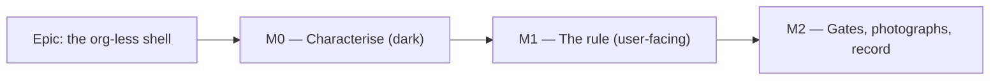

# Implementation Plan: The shell on screens that have no organisation

> [!IMPORTANT]
> **This document was written AFTER the implementation, deliberately and as a check — not before
> it, and it must not be read as though it preceded the work.**
>
> `docs/TECH_DEBT.md` #165a was built without a spec or an implementation plan. The product owner
> caught that and ruled that one be produced as a **check on what shipped**, so it was written by
> `feature-analyst` in an isolated git worktree pinned to the pre-change commit `52b6003` — blind
> to the implementation, because a spec written with the solution in view rationalises it instead
> of testing it.
>
> It is recorded this way because the alternative is worse than having no spec: a retroactive
> document presented in the normal order makes the gap invisible, and this repository's own
> ADR-0081 records that a plan is evidence the tasks were done, not that a capability exists.
>
> **What the check found is in `docs/DECISIONS.md`** under the 2026-08-22 entry: it reached the
> same core design independently — which is the part that makes it worth having — and found four
> things the implementation had missed.

- **Feature spec:** [./feature-spec.md](./feature-spec.md)
- **Status:** Draft — awaiting approval
- **Owner:** unassigned
- **Scope:** `docs/TECH_DEBT.md` #165 finding **(a)** only. (b)–(e) are out of scope.
- **Feature flag:** **none** (ADR-0088 D1 — a `VITE_` constant is inlined at build time and is
  not an operator rollback; this is not Class A). The rollback contract is a **commit
  boundary**: M1 lands as one revertible commit.

## Breakdown

### Epic

**The org-less shell** — the shell states, once, what it does on a route that names no
organisation, and the three routes that are in that state stop offering navigation that cannot
navigate. Roadmap theme: post-theme consolidation (W2 remedies for the W1 catalogue).

---

## Milestone M0 — Characterise the current behaviour and re-point the harness

**Outcome:** nothing changes for a user.
**Entry point:** **Ships dark.** No control is added, removed or altered; this milestone exists
so M1's diff is legible and so the org-present behaviour has a before/after oracle. M1 is the
milestone that surfaces the capability (ADR-0081 §1).
**Journey:** none — and deliberately, because there is no capability to drive. M1 carries the
journey, which is where ADR-0081 §2 puts it.

> **Why it is a milestone rather than a step inside M1.** `app-shell.test.tsx:19-41` mocks
> `useParams: () => ({})` — **no organisation** — and six tests then assert the Explorer panel
> and button are present (`:61-96, :107-160, :174-185`). The suite that would catch a shell
> regression is currently **pinning the behaviour M1 removes**. If M0 and M1 land together, the
> reviewer sees a test file rewritten in the same commit as the behaviour it tests, and cannot
> tell a preserved assertion from a bent one. This is the ADR-0078 S1 pattern: the
> characterisation lands **first, verified green against today's code**, and M1's diff is then a
> small number of deliberate expectation flips.

---

#### Feature M0-F1: an org-present harness, and an explicit org-less case

> **Description:** split `app-shell.test.tsx` so the existing behavioural assertions run against
> a route that **names an organisation**, and add one case asserting today's org-less behaviour.
> **Complexity:** S
> **Dependencies:** none
> **Risks:** rewriting a suite risks silently weakening it → every existing assertion must
> survive verbatim; the PR description lists them and the reviewer checks the count.
> **Testing requirements:** the whole file passes against unmodified product code. That is the
> milestone's acceptance condition and it is checkable: `git stash` the product tree, run the
> suite, it is green.

##### Task M0-T1 — Parameterise the shell test harness (≈ one PR)

- **Description:** make the `useParams` mock configurable so a test can render the shell with
  `{ orgSlug: 'acme' }` or `{}`. Point the six existing tests at the org-present harness.
- **Complexity:** S
- **Dependencies:** none
- **Risks:** the mock is module-level (`vi.mock` at `:19-41`), so a per-test value needs a
  mutable module variable rather than a re-mock → use one `let currentParams` set in each test's
  arrange step, reset in `beforeEach` beside the existing `localStorage.clear()` (`:58`).
- **Testing:** the six existing tests, unchanged in substance. Their assertions on
  `aria-pressed`, the Escape ladder's three cases, the close control, the below-`lg` `Sheet` and
  the skip link are the org-present contract and must read identically.
- **Development steps:**
  1. Introduce the mutable params in the `vi.mock` factory; default `{ orgSlug: 'acme' }`.
  2. Reset in `beforeEach`.
  3. Run: green against unmodified product code.

##### Task M0-T2 — Add the org-less characterisation case

- **Description:** one `describe('with no organisation in the route')` asserting **today's**
  behaviour: the Explorer button exists, the drawer region exists, and the copy "Select an
  organisation to browse." is rendered.
- **Complexity:** S
- **Dependencies:** M0-T1
- **Risks:** a reader six months from now mistakes a characterisation test for a requirement →
  the `describe` carries a docblock naming `docs/TECH_DEBT.md` #165(a) and saying **in terms**
  that these assertions record the defect and are inverted by M1. This repository has been
  bitten by exactly the reverse (a test bent to fit new code, ADR-0082's `menu.test.tsx` note).
- **Testing:** itself.
- **Development steps:**
  1. Add the case with the docblock.
  2. Run: green.
  3. Note in the PR that the next milestone inverts precisely these three assertions.

##### Task M0-T3 — The structural route-scope gate

- **Description:** a new `apps/web/src/app/route-scope.structural.test.ts` asserting that every
  route under `_authed` either contains `$orgSlug` in its path or appears in a named org-less
  set (`/`, `/onboarding`, `/account`, `/me/activity`). Derived from the **imported route
  tree**, never a hand-written path list.
- **Complexity:** S
- **Dependencies:** none
- **Risks:** (i) a hand-written list is ADR-0073 C4's defect in miniature (a cap restated as a
  literal, which fell behind its vocabulary) → derive from `routeTree`; (ii) two routes are
  flag-registered (`resourcesRoute`, the two audit routes, `accountRoute` —
  `router.tsx:499-507`), so the tree's membership depends on build-time constants → the test
  must classify **all declared** routes, not only registered ones, or a flag-off run classifies
  fewer routes and passes for the wrong reason. Establish which is reachable before writing the
  assertion rather than assuming.
- **Testing:** verified **red** first by adding a throwaway org-less route.
- **Development steps:**
  1. Determine whether the declared routes are reachable from the exported tree; if not, export
     what is needed rather than duplicating paths.
  2. Write the assertion; verify red; remove the throwaway route.
  3. Docblock states the blind spot: it proves each route is classified, not that the shell
     honours the classification (M1-T4 is that half).

---

## Milestone M1 — The rule

**Outcome:** on `/account`, `/onboarding` and `/me/activity` the shell offers no Project
Explorer and the stage takes the full width; drawer preferences are untouched.
**Entry point:** this milestone **withholds** rather than adds, so the reachable path is the
observation, not a press: _account menu → **Your account** → `/account` renders with no
"Project Explorer" button in the rail and no drawer._ Stated explicitly because ADR-0081 §1
allows exactly two states — a named entry point or a declared dark milestone — and a withholding
must still say where a reader sees it.
**Journey:** one assertion in each of three **existing** suites, no new CI step (the ADR-0082
precedent): `apps/web/e2e-account/account.spec.ts` (`/account`), `apps/web/e2e/auth.spec.ts`
(the base journey, which already lands on `/onboarding` at `:36-39`), and the audit suite for
`/me/activity`. Per ADR-0096's rule — _change a screen, run the base journey_ — the base suite
runs locally before push, via `scripts/e2e-local.sh web`.

---

#### Feature M1-F1: one derivation, three call sites

> **Description:** the shell derives which drawer subjects are showable and renders buttons and
> the drawer column from that set. The Explorer becomes showable only on a route that names an
> organisation.
> **Complexity:** M
> **Dependencies:** M0
> **Risks:** the whole of §4.5 — an effect-based implementation persists `collapsed: true`.
> Mitigated by making it a render-time derivation and by AC-3.3's `setItem` spy.
> **Testing requirements:** unit for every AC in spec §2; journey for AC-1.1, AC-2.3, AC-2.4,
> AC-3.1; photographs for AC-1.4, AC-2.1, AC-2.2.

##### Task M1-T1 — Derive the showable-subject set in `AppShell`

- **Description:** in `app-shell.tsx`, derive `explorerShowable = orgSlug !== undefined`
  alongside the existing `showingContext` (`:94`); render the drawer column
  (`:441-468`) iff a subject is showable **and** `!drawer.collapsed`; resolve the effective
  subject as _requested if showable, else the first showable_.
- **Complexity:** M
- **Dependencies:** M0-T1
- **Risks:**
  - **Persisting a preference** → derive during render; never call `drawer.collapse()`. The
    docblock at `:80-94` already states the reason for this shape and is the model to follow.
  - **Two independently written gates drifting** (the ADR-0065 `routeOrthogonal` argument — two
    implementations drift and the drift is invisible because each looks right alone) → one
    value, read twice, pinned by M1-T4's paired assertion.
  - **A branch that cannot fire being written wrong** — no org-less route registers a context
    subject today → keep the resolution to ~3 lines, and say in the docblock that the branch is
    currently unreachable rather than leaving a reader to guess.
- **Testing:** AC-1.1, AC-1.2, AC-2.1, AC-2.2; AC-3.1/3.2/3.3 (storage untouched); the six
  org-present tests from M0-T1 unchanged.
- **Development steps:**
  1. Add the derivation with a docblock naming #165(a) and the "keyed on the route, never on
     memberships" rule (spec §4.3).
  2. Gate the drawer column.
  3. Invert M0-T2's three characterisation assertions; each must be **verified red against the
     pre-change code** before the product edit, and the PR says so.
  4. Add the `Storage.prototype.setItem` spy test.

##### Task M1-T2 — Withhold the Explorer button in `ToolRail`

- **Description:** the explorer `Button` (`tool-rail.tsx:120-129`) becomes conditional on a new
  prop, in the same shape as the `contextSubject` button five lines below (`:130-141`).
- **Complexity:** S
- **Dependencies:** M1-T1
- **Risks:** deriving the condition inside `ToolRail` from its own `orgSlug` prop would create
  the second gate M1-T1 exists to avoid → take it as an explicit prop from the shell.
- **Testing:** `tool-rail.test.tsx` — button present with an organisation, absent without; the
  brand tile and account chip present in both (AC-1.3).
- **Development steps:**
  1. Add the prop with a docblock pointing at `:74-81`'s existing statement of the same rule.
  2. Update `tool-rail.test.tsx`.

##### Task M1-T3 — Delete the unreachable empty state in `NavigatorRail`

- **Description:** `navigator-rail.tsx:116-120`'s `orgSlug ? tree : "Select an organisation to
browse."` branch is now unreachable. Make `orgSlug` required and delete the fallback; the
  empty 40 px actions row (`:90-113`) goes with the panel.
- **Complexity:** S
- **Dependencies:** M1-T1, M1-T2
- **Risks:** leaving the dead branch "just in case" violates `CLAUDE.md` §5 and is how the panel
  gets re-introduced by a later author who finds a fallback that looks supported → delete it and
  let the type make the guarantee.
- **Testing:** `navigator-rail.test.tsx` — the copy is asserted nowhere; typecheck enforces the
  required prop.
- **Development steps:**
  1. Narrow the prop type; delete the branch and the sentence.
  2. Sweep for the string across `apps/web` (including e2e) so no locator is left matching
     nothing — the ADR-0099 M5 finding, where three suites named a deleted row.

##### Task M1-T4 — The paired-gate and focus guarantees

- **Description:** (a) a test asserting the rail button and the drawer column are present
  together and absent together across both params states (AC-5.2); (b) the focus guard — if
  focus is inside the Explorer when it is withheld, move it to `<main>` (already
  `tabIndex={-1}`, `app-shell.tsx:403-406`), never `<body>` (AC-4.1); (c) pin
  `app-header.tsx:55`'s existing below-`lg` rule (AC-5.3).
- **Complexity:** S
- **Dependencies:** M1-T1
- **Risks:** the focus case's **reachability by a real reader is reasoned, not observed** — the
  Explorer contains no link to an org-less route, so the paths are browser Back, a restored
  session, or an AT virtual cursor. It is guarded anyway because the cost is one line and this
  repository has shipped the `<body>` drop at least four times (ADR-0080 M2, TECH_DEBT #64/#67,
  ADR-0099 M10). The spec and the test docblock both say which of these is evidence and which is
  reasoning (ADR-0076 §19.10).
- **Testing:** three unit tests, each verified red first.
- **Development steps:**
  1. Paired-gate test.
  2. Focus test: render org-present, focus a node in the panel, re-render org-less, assert
     `document.activeElement`.
  3. Header rule test.

##### Task M1-T5 — Journey assertions in three existing suites

- **Description:** one assertion per suite that the Explorer is not offered, driven against a
  real API in a real browser.
- **Complexity:** S
- **Dependencies:** M1-T1..T3
- **Risks:**
  - **Locating by copy.** The standing rule after three journeys broke on a label change
    (ADR-0091's retrospective, `docs/TECH_DEBT.md` #133) is to locate a control by a stable hook.
    Here the assertion is an **absence**, which is the shape that passes when the locator is
    simply wrong → each assertion is written as a **pair**: present on an organisation route,
    absent on the org-less one, in the same spec. An absence-only assertion proves nothing.
  - **`reuseExistingServer` is true outside CI** (ADR-0099's recorded process finding), so a
    stale dev server from another harness is silently adopted → run through
    `scripts/e2e-local.sh`, which refuses while anything answers on 3000 or 5173.
- **Testing:** itself, plus an axe scan on `/account` (AC-2.4) since the landmark set changes.
- **Development steps:**
  1. `e2e-account/account.spec.ts`: assert present on the org route, absent on `/account`.
  2. `e2e/auth.spec.ts`: assert absent at the existing `/onboarding` step (`:36-39`).
  3. Audit suite: the same pair for `/me/activity`.
  4. Run each locally; run the **base** suite (`scripts/e2e-local.sh web`) per ADR-0096.

---

## Milestone M2 — Gates, photographs and the record

**Outcome:** the change has been looked at by specialists and by a camera, and the register says
what was found.
**Entry point:** **Ships dark** with respect to new capability — it changes nothing a reader
presses. It exists because this repository's enablement passes have found defects that passed a
human read in seven consecutive epics, and because #165 is a row **created by a photograph**:
closing it without taking the photograph would be closing it on reasoning.
**Journey:** none new; M1's run again after any fold-in.

---

#### Feature M2-F1: the gate pass

> **Description:** three specialist reviews over the combined M0+M1 diff, the photographs, and
> the documentation.
> **Complexity:** S
> **Dependencies:** M1
> **Risks:** a review that returns nothing is treated as a pass rather than re-run → re-run it
> (the `csp_reports` lesson, CLAUDE.md §20).
> **Testing requirements:** every folded finding carries a regression test verified red first.

##### Task M2-T1 — Specialist reviews

- **Description:** run **ux-reviewer** (is a 48 px rail with two controls beside a card the
  right answer on `/onboarding`? is the route back discoverable?), **accessibility-reviewer**
  (landmark set with one fewer `complementary`; focus behaviour; the announcement path, since
  `subjectName`/`selectSubject` at `app-shell.tsx:160-179` speak about a panel that may not
  exist), and **component-reviewer** (one derivation not two; no one-off styling; the deleted
  branch really is dead).
- **Complexity:** S
- **Dependencies:** M1
- **Risks:** **security-reviewer and backend-performance-reviewer are deliberately not engaged**
  — no data reaches the client that did not before, no authorisation decision changes, and no
  query is added or removed on the server. Recorded as a decision with its reason rather than an
  omission. **database-architect is not engaged because there is no schema change to design**,
  not because one was judged too small (CLAUDE.md §19.3).
- **Testing:** regression tests for each blocking finding.
- **Development steps:**
  1. Launch the three reviews over the combined diff.
  2. Fold blocking findings with tests; file non-blocking ones as a `docs/TECH_DEBT.md` row.

##### Task M2-T2 — Photograph all three routes at three widths

- **Description:** `node scripts/shoot.mjs --only account`, `--only my-activity`, `--only
onboarding` at 1646/1920/1280 (`shoot.mjs:31`), and look at them.
- **Complexity:** S
- **Dependencies:** M1
- **Risks:** the harness mints a tenant per width (`shoot.mjs:42-64`) and `--only onboarding`
  uses its own fresh context (`:561-566`) → do not assume a failure in one shot is a product
  defect before reading the harness's own docblock, which records a prior run writing a full,
  correct-looking set and then throwing.
- **Testing:** the photographs are the instrument. Record what they show, including anything
  they show that this plan did not predict.
- **Development steps:**
  1. Shoot; compare against the W1 photographs referenced by #165.
  2. Record findings in the PR; anything new becomes its own row, not a silent fix.

##### Task M2-T3 — The ADR and the documentation

- **Description:** write the ADR (spec §4.6), update `docs/TECH_DEBT.md` #165(a), add one line
  to `docs/FRONTEND_ARCHITECTURE.md`, record CQ-4 and Q-5 in `docs/DECISIONS.md`, add a
  changeset.
- **Complexity:** S
- **Dependencies:** M2-T1, M2-T2
- **Risks:** **taking the ADR number from this document.** It was 0104-free when this was
  written and may not be at filing; ADR-0079 had to be renumbered for exactly this, and ADR-0071
  went unfiled while shipped code cited it. Check `docs/adr/` at the moment of filing, and if
  the number has gone, record the collision rather than routing around it.
- **Testing:** `pnpm check:doc-links`, `pnpm check:claims` (the spec and ADR cite no dependency
  internals, so no new register entry is expected — confirm rather than assume).
- **Development steps:**
  1. ADR from `docs/adr/_template.md`, with the rejected options from spec §4.2/§4.4 and their
     reasons.
  2. Close #165(a) with **what was found**, not only what changed — including that the rule was
     already applied correctly in three places in the same feature folder and not in the fourth.
  3. `pnpm changeset` — a **patch** for `@repo/web` (a visible layout correction, no new
     capability, no contract change).

---

## Sequencing & slices

Three slices, each independently releasable, `main` green throughout:

1. **M0** — tests only. No user-visible change; safe to merge alone.
2. **M1** — the behaviour, as **one revertible commit** (this is the rollback contract, since
   there is no flag). Journeys land here, not at the end.
3. **M2** — reviews, photographs, ADR, debt closure.

M0 could technically fold into M1; it is kept separate because M1's honest diff is "three
assertions inverted" and that is only legible if the assertions existed first.

## Definition of Done (per task)

Each task's PR satisfies the Feature Completion Criteria in
[`docs/PROCESS.md`](../../PROCESS.md). For this feature specifically:

- `pnpm lint && pnpm typecheck && pnpm test` **run**, not merely written.
- `scripts/e2e-local.sh web` (the base journey — an authenticated screen changed, ADR-0096) and
  `scripts/e2e-local.sh web:account` for M1-T5. **No `scripts/e2e-local.sh api`**: nothing under
  `apps/api` is touched.
- Photographs taken and looked at (M2-T2) before #165(a) is closed.
- Every folded review finding carries a regression test **verified red first**.

## Risks & assumptions (rollup)

| Risk / assumption                                                                                                                                                 | Likelihood | Impact | Mitigation                                                                                                                 |
| ----------------------------------------------------------------------------------------------------------------------------------------------------------------- | ---------- | ------ | -------------------------------------------------------------------------------------------------------------------------- |
| **An effect-based implementation persists `collapsed: true`**, silently and stickily changing a preference (`use-resizable-panel-prefs.ts:62-68`)                 | **high**   | med    | Render-time derivation only; AC-3.3's `setItem` spy; AC-3.1 asserts the raw stored **string**                              |
| The shell suite currently pins the defect, and breaking it is read as the design being wrong — leading to a per-route opt-out to keep it green                    | **high**   | med    | M0 exists for this; the risk is named in the plan and in the spec's §3 Dependencies                                        |
| Two independently written gates (button vs. drawer) drift; each looks right alone                                                                                 | med        | med    | One derivation, two call sites; AC-5.2 asserts them together (the ADR-0065 argument)                                       |
| Focus drops to `<body>` when the panel is withheld under a reader                                                                                                 | low        | high   | AC-4.1 guard + test. **Reachability reasoned, not observed** — stated as such                                              |
| Gating on memberships instead of the route ⇒ 298 px shift after paint on every `/account` load                                                                    | med        | med    | Spec §4.3 makes the rule params-only; an AC pins that an empty organisations query changes nothing on an org route         |
| Half-fix: the sentence is rewritten and the 298 px stays                                                                                                          | med        | med    | AC-2.1/2.2 assert the **column has no child**, not that the copy is gone                                                   |
| A fourth org-less route arrives later without the rule                                                                                                            | med        | med    | M0-T3's structural gate, verified red                                                                                      |
| Scope creep into #165 (b)–(e), or into `/staff`                                                                                                                   | med        | low    | Scope stated at the top of both documents; `/staff` renders no shell (`router.tsx:361-375`)                                |
| **(b)'s W1 photograph becomes stale** — `<main>` widens on `/me/activity`, changing how its filter row wraps                                                      | **high**   | low    | Named in spec §3; (b) must be re-photographed after this lands rather than designed from the W1 image                      |
| A journey assertion written as an absence passes because the locator is wrong                                                                                     | med        | med    | Each assertion is a present/absent **pair** in the same spec                                                               |
| `reuseExistingServer` adopts a stale dev server, producing a false diagnosis                                                                                      | med        | med    | Run through `scripts/e2e-local.sh` (ADR-0099's recorded finding)                                                           |
| **Assumption:** `useParams({ strict: false })` is `{}` on exactly `/`, `/onboarding`, `/account`, `/me/activity` under `_authed` — read from `router.tsx:152-232` | —          | high   | M0-T3's structural gate turns the assumption into a test                                                                   |
| **Assumption:** removing the drawer's child yields the stage its width with no CSS change — read from the grid at `app-shell.tsx:337, 390-393, 441-442`           | —          | med    | Verified by AC-2.1's unit assertion and by the photographs; if false, it is a CSS change and should be raised, not patched |
