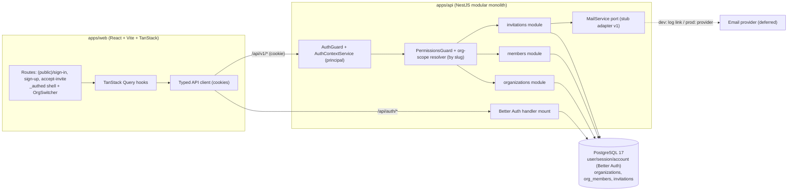
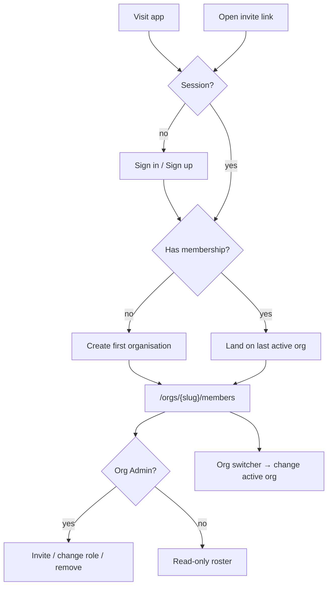
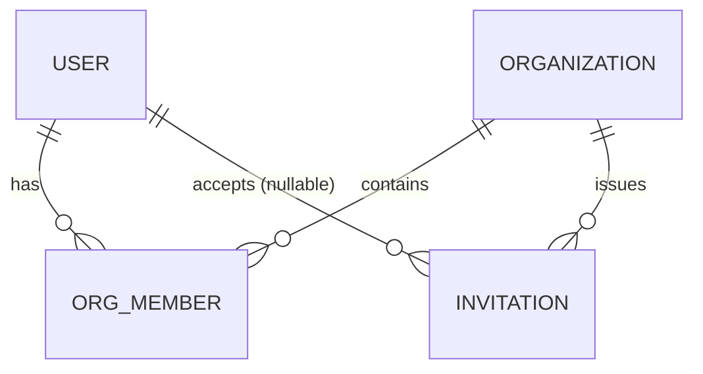

# Feature Spec: Organisation onboarding & membership

- **Status:** Draft
- **Author(s):** Feature Analyst (Solution Architect / Product Owner / Tech Lead hats)
- **Date:** 2026-07-09
- **Tracking issue / epic:** _TBD_ — Epic "Foundation & first vertical slice"
- **Roadmap link:** M1 — Walking skeleton + first feature (see `docs/ROADMAP.md`)
- **Related ADR(s):** ADR-0003 (Better Auth), ADR-0008 (modular monolith),
  ADR-0012 (RBAC + resource scoping), ADR-0014/0015 (reference template).
  **New ADR proposed:** ADR-0016 — Core identity & tenancy model + organisation
  role set (see §4). A mail-port abstraction is also flagged for a decision.

> This is the **first vertical slice** of SchedulePoint and the true **walking
> skeleton**: it exercises web ↔ api ↔ Postgres end-to-end and proves the whole
> cross-cutting stack (Better Auth authN, deny-by-default RBAC, organisation
> resource-scoping, `{data,meta}`/`{error}` envelopes, soft-delete + audit +
> optimistic locking, structured/correlated logging). It also lands the web
> app's first entry point (CLAUDE.md §17, TECH_DEBT).

## 1. Business understanding

### Problem

SchedulePoint is multi-tenant: every client/project/plan/activity will be
**organisation-scoped** (PROJECT_BRIEF §5). Before any scheduling feature can
exist, the product needs the foundation it will scope against — accounts,
organisations, membership, and roles — plus a working web shell and an
authentication flow. Today the repo is a base with **no application code and no
web entry point**; nothing can be built until this foundation and its
cross-cutting patterns are proven end-to-end.

"Why now": it is the prerequisite for literally every other feature, and it is
the cheapest place to validate that the architecture (auth, RBAC, scoping,
envelopes, soft-delete/audit/locking, logging) works as documented before we
pour the CPM/TSLD complexity on top.

### Users

Roles are per **organisation membership** (ADR-0012), matching PROJECT_BRIEF §5.
This slice implements four roles; **External Guest** (per-plan share link) is
**deferred** — plans do not exist yet.

| Role            | Needs in this slice                                                        |
| --------------- | -------------------------------------------------------------------------- |
| **Org Admin**   | Create an org; invite/remove members; change roles; see the member roster. |
| **Planner**     | Sign in; see the orgs they belong to; view the member roster.              |
| **Contributor** | Sign in; see their orgs; view the member roster.                           |
| **Viewer**      | Sign in; see their orgs; view the member roster (read-only).               |
| _Prospective_   | Anyone with an account can create a new org (becomes its first Org Admin). |

### Primary use cases

1. **Sign up / sign in / sign out** and hold a session (Better Auth).
2. **Create an organisation** — the creator becomes its **Org Admin**.
3. **Invite a member** by email with a role; the invitee **accepts** and joins.
4. **List members** of an organisation.
5. **Change a member's role** and **remove a member**.
6. **Switch active organisation** (a user may belong to several).

### User journeys

- **First run (happy path).** Visitor → sign up → lands with no memberships →
  "Create your first organisation" → names it → becomes Org Admin → sees the
  members screen (just them). See the user-flow diagram in §4.
- **Invite & accept.** Org Admin opens Members → "Invite" → enters email + role →
  invitation created and a tokenised link is dispatched via the mail port →
  invitee opens the link, signs in/up, accepts → becomes a member with that role.
- **Manage roster.** Org Admin changes a member's role or removes them; the
  member loses/gains access on next request (server re-checks every time).
- **Multi-org.** A user in several orgs uses the header **org switcher**; the
  active org is reflected in the URL (`/orgs/{orgSlug}/…`) which is authoritative.

### Expected outcomes

- A working, releasable web app: sign-in, an authenticated shell, an org
  switcher, and a members screen — mobile-first, theme-aware, tokens only.
- The canonical `Organization` / `OrgMember` scoping keys the entire product will
  reuse, with deny-by-default, IDOR-safe access proven on real endpoints.
- The reference template's cross-cutting patterns exercised by real code.

### Success criteria

- A new user can go from landing to "created an org, viewing members" in **< 2
  minutes** (p90).
- **Zero cross-tenant leakage**: a user can only see/act on orgs they belong to
  (proven by e2e IDOR tests).
- Member-list read **p95 < 200ms** at expected scale (≤ ~200 members/org).
- WCAG 2.2 AA on all new screens; CI green (lint, typecheck, unit, API e2e,
  Playwright a11y).

### Open questions

- **CRITICAL — Is self-service sign-up open, or invitation-only (closed alpha)?**
  This decides whether the sign-up route and `organization:create` are available
  to any visitor, or whether the only way to get an account is via an
  organisation invite. **Recommended default:** *open self-service sign-up*; any
  authenticated user may create organisations (optionally capped, see below).
- _Non-critical (defaults stated, proceed):_
  - **Email verification blocking?** Better Auth sends a verification email;
    **default:** do **not** block org creation/invite acceptance on verification
    in v1 (design-partner alpha) — revisit before GA.
  - **Cap on orgs a single user may create?** **Default:** soft cap of 10
    (matches PROJECT_BRIEF §12 "10 orgs" scale note); configurable, not enforced
    hard in v1.
  - **Invitation delivery.** **Default/assumption:** transactional email
    (PROJECT_BRIEF §15) is abstracted behind a **`MailService` port**; v1 ships a
    logging/stub adapter so the slice does not hard-depend on a provider. The
    invite is a **tokenised link** and remains retrievable/copyable by the Org
    Admin in the UI (so onboarding works even before a provider is wired). This
    is a follow-up (provider adapter + template).

## 2. Functional requirements

### User stories & acceptance criteria

> **US-1 — Authenticate.** As a visitor, I want to sign up, sign in, and sign
> out, so that I have a secure session.
>
> - **Given** valid, unique credentials **when** I sign up **then** an account is
>   created, I'm signed in (secure http-only same-site cookie), and I land on the
>   post-auth screen.
> - **Given** an email already in use **when** I sign up **then** I get a
>   non-enumerating error (uniform message/timing) and no account is created.
> - **Given** valid credentials **when** I sign in **then** I get a session;
>   **given** invalid credentials **then** I get a uniform "invalid credentials"
>   error (no hint whether the email exists).
> - **Given** I'm signed in **when** I sign out **then** the session is
>   invalidated and protected routes redirect me to sign-in.

> **US-2 — Create an organisation.** As an authenticated user, I want to create
> an organisation, so that I can start working in it as its Org Admin.
>
> - **Given** I'm authenticated **when** I submit a valid org name **then** an
>   organisation is created, a unique immutable `slug` is generated, and I am
>   added as its **Org Admin** in the same transaction.
> - **Given** the derived slug collides **when** the org is created **then** a
>   unique suffix is applied (`acme`, `acme-2`) — no user-facing conflict.
> - **Given** an empty/over-long name **when** I submit **then** I get **422** and
>   nothing is created.
> - **Given** I have no memberships **when** I land post-auth **then** I'm routed
>   to "Create your first organisation".

> **US-3 — List my organisations & switch.** As a member of several orgs, I want
> a header org switcher, so that I can move between them.
>
> - **Given** I belong to N orgs **when** I load the app **then** the switcher
>   lists exactly those N (soft-deleted excluded), and the active org is the one
>   in the URL (`/orgs/{orgSlug}/…`).
> - **Given** I pick another org **when** I switch **then** the URL changes to
>   that org's slug and the view reloads its scoped data; the choice is
>   remembered as "last active org" for the next visit (URL remains authoritative).

> **US-4 — List members.** As any member, I want to see the org's member roster,
> so that I know who has access and at what role.
>
> - **Given** I'm a member of org O **when** I open Members **then** I see a
>   paginated, newest-first list of active members (name, email, role, joined
>   date) with an accessible empty/loading/error state.
> - **Given** I'm **not** a member of O **when** I request its members **then** I
>   get **404** (O is invisible to me — anti-enumeration).

> **US-5 — Invite a member.** As an Org Admin, I want to invite someone by email
> with a role, so that they can join.
>
> - **Given** I'm Org Admin **when** I invite `a@b.com` as `PLANNER` **then** a
>   `PENDING` invitation is created with a hashed token + expiry, and a tokenised
>   link is dispatched via the mail port (and shown/copyable in the UI).
> - **Given** the email is already an active member **when** I invite **then** I
>   get **409** `ALREADY_MEMBER`.
> - **Given** a pending invite for that email already exists **when** I invite
>   **then** I get **409** `INVITATION_EXISTS` (with an option to revoke &
>   re-invite).
> - **Given** I'm not an Org Admin **when** I invite **then** I get **403**.
> - **Given** I try to invite as `EXTERNAL_GUEST` **when** I submit **then** I get
>   **422** (role not available in this slice).

> **US-6 — Accept an invitation.** As an invitee, I want to accept an invite, so
> that I join the org at the offered role.
>
> - **Given** a valid, unexpired token whose email matches my signed-in account
>   **when** I accept **then** I'm added as a member with the invited role, the
>   invitation becomes `ACCEPTED`, and the org appears in my switcher.
> - **Given** I'm not signed in **when** I open the link **then** I'm sent to
>   sign-in/up (with the token preserved) and returned to accept afterwards.
> - **Given** the token is unknown **then** **404**; **expired/revoked** **then**
>   **410**; **already a member** **then** **409**; **email mismatch** **then**
>   **403** `INVITATION_EMAIL_MISMATCH`.

> **US-7 — Change a member's role.** As an Org Admin, I want to change a member's
> role, so that access reflects reality.
>
> - **Given** I'm Org Admin **when** I change a member's role (supplying the
>   current `version`) **then** it updates and `version` increments.
> - **Given** a stale `version` **when** I submit **then** I get **409**
>   (optimistic-lock) and must refetch.
> - **Given** the member is the **last Org Admin** and I demote them **then** I
>   get **409** `LAST_ADMIN` and no change is made.

> **US-8 — Remove a member.** As an Org Admin, I want to remove a member, so that
> access is revoked.
>
> - **Given** I'm Org Admin **when** I remove a member **then** the membership is
>   **soft-deleted** and they lose access on their next request.
> - **Given** the member is the **last Org Admin** **then** **409** `LAST_ADMIN`.
> - **Given** I remove **myself** and I'm not the last admin **then** it succeeds
>   (I "leave" the org).

### Workflows

- **Create org:** validate name → derive+uniquify slug → `$transaction`{ insert
  Organization; insert OrgMember(role=ORG_ADMIN, userId=creator) } → audit log →
  return org.
- **Invite:** authorise (`member:invite` in O) → reject if already member /
  pending invite → generate random token, store **hash** + expiry → persist
  `PENDING` → (after commit) publish to mail port → return invite (with raw
  token/link for the admin UI).
- **Accept:** look up by token hash → validate status/expiry/email-match →
  `$transaction`{ insert OrgMember(role=invited); mark invitation ACCEPTED } →
  audit → return membership.
- **Change role / remove:** authorise → load membership in O → enforce
  last-admin invariant → optimistic-locked update / soft-delete → audit.

### Edge cases

- **Empty roster** never happens (creator is always a member); empty **invites**
  list has a designed empty state.
- **Concurrent role edits** → optimistic-lock 409.
- **Concurrent org creation** with the same name → both succeed via slug suffix.
- **Last-admin invariant** across both demote and remove and self-removal.
- **Re-invite after revoke** allowed (revoked invite no longer blocks).
- **Soft-deleted** orgs/members/invites are excluded from every read.
- **Invite to an email that later signs up under different case** — emails are
  normalised lower-case for matching.
- **Accepting twice** (double-click) → idempotent: second call returns 409
  `ALREADY_MEMBER` or the existing membership.

### Permissions

Deny-by-default (ADR-0012): every endpoint authenticated unless `@Public()`;
every org-scoped endpoint pairs a **permission check** with a **resource-scope
check** (membership in the org owning the resource) — the anti-IDOR control.

**Permission codes** (this feature's `<feature>-permissions.ts`):
`organization:create` (non-scoped capability — any authenticated user),
`organization:read`, `member:read`, `member:invite`, `member:update_role`,
`member:remove`, `invitation:revoke`.

**Role → permission matrix** (× action; blank = deny):

| Action / permission                     | Org Admin | Planner | Contributor | Viewer | Non-member |
| --------------------------------------- | :-------: | :-----: | :---------: | :----: | :--------: |
| Create organisation (`organization:create`, non-scoped) | ✓* | ✓* | ✓* | ✓* | ✓* |
| Read organisation (`organization:read`) |     ✓     |    ✓    |      ✓      |   ✓    |     —      |
| List members (`member:read`)            |     ✓     |    ✓    |      ✓      |   ✓    |     —      |
| Invite member (`member:invite`)         |     ✓     |    —    |      —      |   —    |     —      |
| List/revoke invitations (`invitation:revoke`) | ✓   |    —    |      —      |   —    |     —      |
| Change role (`member:update_role`)      |     ✓     |    —    |      —      |   —    |     —      |
| Remove member (`member:remove`)         |     ✓     |    —    |      —      |   —    |     —      |
| Accept invitation (token-gated, authenticated) | n/a | n/a | n/a | n/a | ✓ (by token) |

\* `organization:create` is a **global authenticated capability**, not
org-scoped (you have no org yet). Accepting an invitation is authenticated and
**token-gated** (not a role permission — the invitee is not yet a member).

> Note: this role set (**ORG_ADMIN / PLANNER / CONTRIBUTOR / VIEWER**) replaces
> the reference template's placeholder `OWNER/MEMBER/VIEWER` enum. Because the
> role enum is a cross-cutting seam (`common/auth/principal`), ADR-0015 requires
> an ADR — see §4 (ADR-0016).

### Validation rules

Shared client↔server where possible (Zod in `@repo/types`/web ↔ `class-validator`
DTOs in the API):

- **Sign-up:** `email` valid + ≤ 254, normalised lower-case; `password` ≥ 12
  chars (Better Auth policy); `name` 1–80.
- **Organization.name:** trimmed, 1–120 chars, non-empty.
- **Organization.slug:** derived `[a-z0-9-]`, 2–64, unique per deployment,
  **immutable** in v1 (not user-editable).
- **Invitation.email:** valid email ≤ 254, lower-cased.
- **role:** enum ∈ `{ORG_ADMIN, PLANNER, CONTRIBUTOR, VIEWER}`; `EXTERNAL_GUEST`
  rejected (422) — deferred.
- **token:** opaque; validated by hash lookup + expiry.
- **version:** required integer on role-change (optimistic lock).
- Pagination `limit` capped server-side (default 20, max 100); cursor opaque.

### Error scenarios

| Scenario                                      | Detection                   | User-facing result                         | Status |
| --------------------------------------------- | --------------------------- | ------------------------------------------ | ------ |
| Not authenticated                             | auth guard                  | redirect to sign-in                        | 401    |
| Not a member of the org in the URL            | scope check                 | org treated as non-existent                | 404    |
| Member of org but insufficient role           | permission + scope check    | friendly forbidden message                 | 403    |
| Invalid payload (name/email/role)             | DTO validation              | inline field errors                        | 422    |
| Duplicate sign-up email                       | unique (Better Auth)        | uniform non-enumerating error              | 409    |
| Invite an existing member                     | membership lookup           | "already a member"                         | 409    |
| Invite when a pending invite exists           | partial-unique constraint   | "invitation already pending" + revoke CTA  | 409    |
| Accept unknown token                          | token-hash lookup           | "invitation not found"                     | 404    |
| Accept expired/revoked token                  | status/expiry check         | "invitation is no longer valid"            | 410    |
| Accept token for a different email            | email match                 | "signed in as a different account"         | 403    |
| Stale role change (optimistic lock)           | zero-row versioned update   | "changed elsewhere — refresh"              | 409    |
| Demote/remove the last Org Admin              | invariant check in tx       | "org must keep at least one Org Admin"     | 409    |
| Rate limit exceeded on auth/invite            | throttler                   | "too many attempts" + `Retry-After`        | 429    |

## 3. Technical analysis

| Area           | Impact | Notes                                                                                                                     |
| -------------- | ------ | ------------------------------------------------------------------------------------------------------------------------- |
| Frontend       | high   | First **web entry point** (`main.tsx`, providers, router). Public auth routes, `_authed` shell, org switcher, members UI. |
| Backend        | high   | Wire Better Auth to the `AuthContextService` seam; new `organizations`, `members`, `invitations` modules; org-scope resolver by slug; `MailService` port. |
| Database       | high   | First real migration. New models: `User` (Better Auth-backed) + `Organization`, `OrgMember`, `Invitation`; role/status enums; auth tables (Better Auth). |
| API            | high   | New `/api/v1/organizations…`, `/api/v1/invitations…`, `/api/v1/me`; Better Auth handler mount. OpenAPI + `API.md` updates. |
| Security       | high   | Deny-by-default; permission + org-scope on every endpoint (IDOR); token **hashed** at rest; CSRF on mutations; auth/invite rate-limits; audit-log entries; non-enumerating auth. |
| Performance    | low    | Small tables; index scoping keys; cursor-paginate member/invite lists. No caching/jobs needed (mail publish is fire-after-commit). |
| Infrastructure | med    | Better Auth secret + config; `MailService` port (stub adapter v1); no new hard external dependency. CI must now build **web** (entry point lands). |
| Observability  | med    | Structured/correlated logs for auth events, invite/accept, role change, remove; append-only **audit log** for membership/permission changes (SECURITY_STANDARDS). |
| Testing        | high   | Unit (services, mocked repo), API e2e (Supertest, real Postgres, IDOR + optimistic-lock + last-admin), web component tests, Playwright journey with a11y checks. |

### Dependencies

- **Prerequisite / must land first:** Better Auth wiring into the API auth seam
  and the web entry point (the walking-skeleton task) — everything else scopes
  through membership resolved from the session.
- **Blocks:** every future org-scoped feature (clients/projects/plans/…) depends
  on `Organization`/`OrgMember` and the scope resolver delivered here.
- **Third parties:** Better Auth (ADR-0003); a transactional email provider is
  **abstracted and stubbed** (not a hard dependency in v1).
- **Reference template:** backend modules are copied from
  `apps/api/examples/reference-feature/` (ADR-0014/0015).

## 4. Solution design

### Architecture overview

Standard modular-monolith layering (controller → service → repository), deny-by-
default guards, and the web feature-first structure — nothing here departs from
`BACKEND_ARCHITECTURE.md` / `FRONTEND_ARCHITECTURE.md` except the two flagged
items (role enum, mail port).



### Data flow — invite then accept

```mermaid
sequenceDiagram
  participant Admin as Org Admin (web)
  participant API as API (guards → InvitationsService)
  participant DB as PostgreSQL
  participant Mail as MailService port
  participant Invitee as Invitee (web)

  Admin->>API: POST /api/v1/organizations/{slug}/invitations {email, role}
  API->>API: authN + member:invite + scope(org by slug)
  API->>DB: assert not member / no pending; INSERT invitation (tokenHash, expiresAt, PENDING)
  DB-->>API: invitation
  API-)Mail: publish invite link (after commit)
  API-->>Admin: 201 { data: invitation (+ copyable link) }
  Invitee->>API: POST /api/v1/invitations/accept { token }
  API->>API: authN; lookup by tokenHash; check status/expiry/email match
  API->>DB: $tx INSERT org_member(role); UPDATE invitation → ACCEPTED
  DB-->>API: membership
  API-->>Invitee: 200 { data: membership }
```

### User flow



### Database changes

First real Prisma migration (the live schema currently has no models). All models
follow `DATABASE.md`: UUID v7 PKs, `snake_case` columns via `@map`, `timestamptz`
UTC, soft delete, auditing, optimistic-locking `version`, scoped indexes. Design
with the **database-architect** agent before writing the migration.

- **Enums:** `OrganizationRole { ORG_ADMIN, PLANNER, CONTRIBUTOR, VIEWER }`
  (`EXTERNAL_GUEST` deferred); `InvitationStatus { PENDING, ACCEPTED, REVOKED, EXPIRED }`.
- **`User`** — backs Better Auth's user table (Better Auth also owns
  `session`/`account`/`verification`). Fields: `id` uuid v7, `email` (unique,
  lower-cased), `name`, `email_verified` bool, `created_at`/`updated_at`. Domain
  relations to `OrgMember`. Better Auth-managed tables are created by its
  migration/adapter and not hand-modelled beyond what relations require.
- **`Organization`** — `id`, `name` text, `slug` text, `version`, audit
  (`created_by`/`updated_by`), `deleted_at`. Indexes: **partial unique**
  `uq_organizations_slug` `WHERE deleted_at IS NULL`.
- **`OrgMember`** (join, own audit columns) — `id`, `organization_id` FK
  (`ON DELETE RESTRICT`), `user_id` FK, `role OrganizationRole`, `version`, audit,
  `deleted_at`. Indexes: `idx_org_members_organization_id`,
  `idx_org_members_user_id`, **partial unique** `uq_org_members_org_user`
  `(organization_id, user_id) WHERE deleted_at IS NULL` (one active membership per
  user per org).
- **`Invitation`** — `id`, `organization_id` FK, `email` (lower-cased),
  `role OrganizationRole`, `token_hash` text, `status InvitationStatus` default
  `PENDING`, `expires_at`, `accepted_by_user_id` nullable FK, `accepted_at`
  nullable, `version`, audit (`created_by` = inviter), `deleted_at`. Indexes:
  `idx_invitations_organization_id_status`, `idx_invitations_token_hash`, **partial
  unique** `uq_invitations_org_email_pending` `(organization_id, email) WHERE
  status = 'PENDING' AND deleted_at IS NULL`. **Raw token never stored** — only a
  hash; the raw token lives only in the emailed link and the create response.



### API changes

All under `/api/v1`, cookie-authenticated (Better Auth), standard
`{data,meta}`/`{error}` envelopes, cursor pagination on lists, CSRF on mutations.
Org-scoped routes use **`:orgSlug`** in the path; members/invitations are
addressed by UUID id.

| Method | Path                                                | Auth / permission                  | Success            | Notes                                        |
| ------ | --------------------------------------------------- | ---------------------------------- | ------------------ | -------------------------------------------- |
| —      | `/api/auth/*`                                        | Better Auth (public sign-up/in)    | per Better Auth    | Provider-mounted handler (sign up/in/out).   |
| GET    | `/api/v1/me`                                          | authenticated                      | 200 `{data}`       | Current user + memberships (drives switcher).|
| POST   | `/api/v1/organizations`                               | `organization:create` (any authed) | 201 `{data:Org}`   | Creator → Org Admin (same tx). `Location`.   |
| GET    | `/api/v1/organizations`                               | authenticated                      | 200 `{data:Org[]}` | Only the caller's orgs.                       |
| GET    | `/api/v1/organizations/:orgSlug`                      | `organization:read` + scope        | 200 / 404          | 404 if not a member (anti-enumeration).       |
| GET    | `/api/v1/organizations/:orgSlug/members`              | `member:read` + scope              | 200 `{data,meta}`  | Cursor-paginated, newest-first.               |
| PATCH  | `/api/v1/organizations/:orgSlug/members/:memberId`    | `member:update_role` + scope       | 200 / 409          | Body `{role, version}`; last-admin guarded.   |
| DELETE | `/api/v1/organizations/:orgSlug/members/:memberId`    | `member:remove` + scope            | 204 / 409          | Soft delete; last-admin guarded.              |
| POST   | `/api/v1/organizations/:orgSlug/invitations`          | `member:invite` + scope            | 201 `{data:Inv}`   | Body `{email, role}`; returns copyable link.  |
| GET    | `/api/v1/organizations/:orgSlug/invitations`          | `invitation:revoke` + scope        | 200 `{data,meta}`  | Pending invites list.                         |
| DELETE | `/api/v1/organizations/:orgSlug/invitations/:id`      | `invitation:revoke` + scope        | 204                | Revoke (status → REVOKED).                     |
| GET    | `/api/v1/invitations/:token`                          | authenticated                      | 200 / 404 / 410    | Preview (org name, role) for the accept card. |
| POST   | `/api/v1/invitations/accept`                          | authenticated (token-gated)        | 200 `{data:member}`| 404/410/403/409 per error table.              |

- **Request DTOs** (`class-validator`): `CreateOrganizationDto{name}`,
  `CreateInvitationDto{email, role}`, `UpdateMemberRoleDto{role, version}`,
  `AcceptInvitationDto{token}`, `ListQueryDto{limit?, cursor?}`.
- **Response DTOs** never expose internal/audit columns or `token_hash`:
  `OrganizationResponseDto`, `OrgMemberResponseDto` (embeds safe user summary),
  `InvitationResponseDto` (includes raw `link`/`token` **only** on the create
  response, never on list).
- **Status codes** per `API.md`; new **410 Gone** for expired/revoked invitations
  — add it to the `API.md` status table as part of this change.

### Component changes

Web, feature-first (`FRONTEND_ARCHITECTURE.md`), design-system tokens/primitives
only — no one-off styling. Every view designs loading (skeleton) / empty / error
(retry) / success (toast) states; mobile-first; theme-aware.

- **App bootstrap:** `apps/web/src/main.tsx`, `app/providers.tsx`,
  `app/router.tsx`, `routes/__root.tsx`, `styles/globals.css` wired — lands the
  missing web entry point (TECH_DEBT).
- **Routes:** `routes/(public)/sign-in.tsx`, `sign-up.tsx`, `accept-invite.tsx`;
  `routes/_authed/` layout (auth guard in `beforeLoad`, renders shell);
  `routes/_authed/onboarding.tsx` (create first org);
  `routes/_authed/orgs/$orgSlug/members.tsx`.
- **Shared layout:** `components/layout/AppShell`, `Header` with **`OrgSwitcher`**
  and `ThemeToggle`.
- **`features/auth`:** `SignInForm`, `SignUpForm` (RHF + Zod + `Form` primitive);
  `useSession`, `useSignIn/useSignUp/useSignOut`.
- **`features/organizations`:** `useOrganizations`, `useCreateOrganization`,
  `CreateOrganizationForm`, `OrgSwitcher`.
- **`features/members`:** `useMembers`, `useInviteMember`, `useUpdateMemberRole`,
  `useRemoveMember`, `useAcceptInvitation`; `MembersTable` (DataTable primitive),
  `InviteMemberDialog`, `RoleSelect`, `AcceptInvitationCard`.

### Implementation approach & alternatives

**Chosen:** copy the reference backend template per module (`organizations`,
`members`, `invitations`), adapt entities/DTOs/permissions, wire Better Auth into
the existing `AuthContextService` seam so `principal.can(permission, orgId)` works
against real memberships. Frontend follows the documented feature template and
lands the app shell + auth flow as the walking skeleton. This maximises reuse and
keeps every cross-cutting pattern identical to the template.

**Alternatives considered:**
- _Use Better Auth's `organization` plugin for orgs/roles/invites._ Rejected for
  v1: it would own the tenancy model outside our Prisma schema and RBAC policy
  layer, weakening the single-source-of-truth scoping key that every future
  feature depends on and diverging from the reference template. Revisit only if
  it proves a net simplification (record in an ADR if adopted later).
- _Store raw invite tokens._ Rejected — tokens are secrets; store a hash, compare
  by hash (defence in depth).
- _Return 403 for non-member org access._ Rejected in favour of **404** to avoid
  leaking which slugs exist (403 reserved for insufficient role *within* an org
  you belong to).

**Is an ADR required?** The design stays within ADR-0003/0008/0012/0014/0015
**except two cross-cutting seams**, so **yes — one ADR is required**:

- **ADR-0016 (required) — Core identity & tenancy model + organisation role
  set.** Establishes the canonical `User`/`Organization`/`OrgMember`/`Invitation`
  models as the product's scoping foundation, and **replaces the reference
  template's placeholder `OWNER/MEMBER/VIEWER` enum** with
  `ORG_ADMIN/PLANNER/CONTRIBUTOR/VIEWER` (+ deferred `EXTERNAL_GUEST`). Because the
  role enum lives in the `common/auth/principal` seam and the template's role→
  permission map, ADR-0015 mandates an ADR; the reference template must be updated
  in step (`scripts/verify-template.sh`).
- **Mail port — flag for decision.** Introducing a `MailService` abstraction is a
  small new infrastructure seam consistent with the existing Storage/Cache
  abstractions (ADR-0010/0011 pattern). Recommend either folding it into ADR-0016
  or a short `DECISIONS.md` entry now, with a dedicated ADR when a real provider
  is selected.

Everything else (URL-authoritative org slug + header switcher, cookie sessions,
deny-by-default scope checks, envelopes, soft-delete/audit/locking) is squarely
within the existing ADRs and needs no new decision record.

## 5. Links

- Implementation plan: [`docs/plans/org-onboarding-membership.md`](../plans/org-onboarding-membership.md)
- Docs to update with this change: `docs/API.md` (new endpoints + 410),
  `docs/DATABASE.md` (first models note), `CLAUDE.md` §1/§17 (product + entry
  point), `docs/ROADMAP.md`/`TECH_DEBT.md` (skeleton landed), new **ADR-0016**,
  reference template role enum, OpenAPI spec, a changeset.
