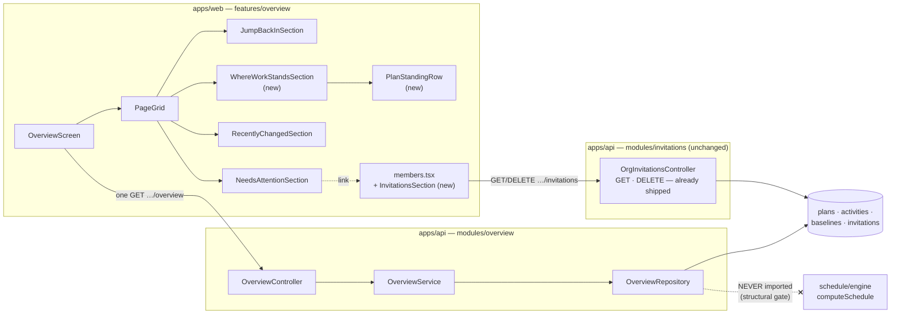
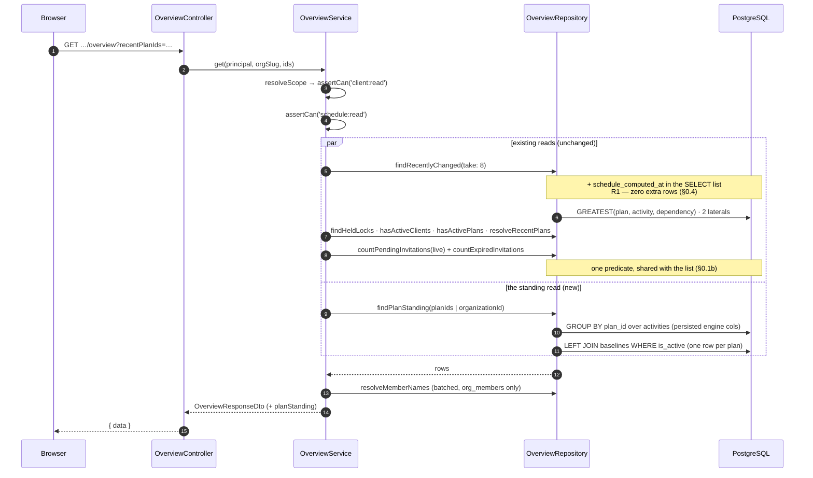
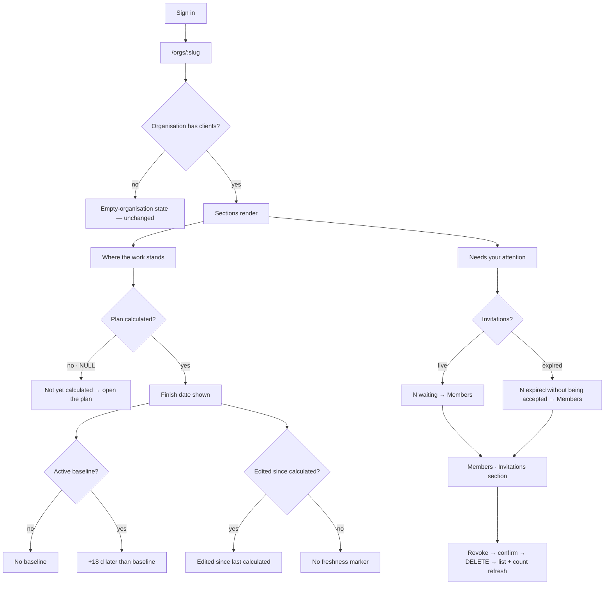

# Feature Spec: The organisation landing answers where the work stands

- **Status:** Approved — the product owner approved the direction on 2026-09-15 and answered
  all three critical questions with the stated defaults: **CQ-1** per-plan (R2) first, with the
  org-wide rollup (R3) measured at M4 and shipped only if FC-2 and FC-3 both pass — withdrawn
  with its number recorded rather than tuned; **CQ-2** the landing states live and expired
  invitations separately, reaping nothing and hiding nothing; **CQ-3** two columns by demand,
  gated on FC-4 and reverted to stacked if any existing section ends up narrower than today.
- **Author(s):** feature-analyst (Product Owner / Solution Architect / Technical Lead hats)
- **Date:** 2026-09-15
- **Tracking issue / epic:** —
- **Roadmap link:** extends "The landing is the organisation overview" (`docs/ROADMAP.md`)
- **Related ADR(s):** amends **ADR-0098** (D10 §3 deferral discharged; D10 §1 narrowed, not
  overturned); builds on ADR-0012/0016 (RBAC + tenancy), ADR-0022/0025 (engine-owned columns,
  baselines), ADR-0082 (omit vs. shade), ADR-0094 (one meaning per word), ADR-0097 (archetypes),
  ADR-0116 (the health report, and why this is **not** it), ADR-0126 (not-assessable with a reason),
  ADR-0143 (`PageGrid`, `StatGrid`, span-by-demand). A new ADR is required — see §4.8.

---

## 0. What I verified, and where the record was wrong

Per `docs/PROCESS.md` "Decision-bearing claims carry their evidence" and ADR-0076: **the brief is not
evidence**. Everything below was read or run. Six findings changed the design.

### 0.1 The reported defect is verified — and it is **three** defects, not one

The brief reported: the overview says "1 invitation is still pending" and links to Members; Members
shows no invitations. All of it holds, and reading it found two more.

**(a) The entry point is missing — ADR-0081's shape, exactly.** `apps/web/src/routes/members.tsx` is
21 lines; it renders `<h1>Members`, `InviteMemberDialog` and `MembersTable`, and the string
"invitation" does not appear in it. Meanwhile
`apps/api/src/modules/invitations/org-invitations.controller.ts:67-80` ships `GET
/organizations/:orgSlug/invitations` — Org-Admin gated, cursor-paginated, `ApiOkResponse`-documented
— and `:82-94` ships `DELETE :invitationId` to revoke, with a 409 for an invitation that is no
longer pending. **Neither has a web caller.**
`apps/web/src/features/members/api/use-invitations.ts` exports `useCreateInvitation`,
`useInvitationPreview` and `useAcceptInvitation` — and no list hook and no revoke hook. The file even
declares `invitationKeys.all(orgSlug)` and invalidates it after a create (`:26`), so there is a
cache key whose only writer is a mutation and whose reader does not exist. Two shipped, documented,
authorised endpoints with no route to them.

**(b) The count and the list are computed by two different predicates, so fixing (a) alone leaves
them able to disagree.** The overview counts with
`this.prisma.invitation.count({ where: { organizationId, status: 'PENDING' } })`
(`overview.repository.ts:178-182`) — **no `deletedAt: null`**. The list reads through
`InvitationRepository.active()`, which adds exactly that (`invitation.repository.ts:18-20`,
`:43-54`). A soft-deleted pending invitation is therefore **counted and not listed**. It is **latent rather
than live**, established rather than assumed: `rg 'invitation\.update|deletedAt.*invitation'
apps/api/src` returns exactly one hit — `invitation.repository.ts:61`, inside `setStatus` — so
nothing in the application writes `invitations.deleted_at` at all today. It is one
`HierarchyLifecycleService` sweep away from being the same user-visible bug again, after the
visible one has been fixed, and that is precisely why the fix is a shared predicate rather than a
second `where` clause that happens to match.

**(c) The number is arithmetically right and substantively misleading, and this is the one the
product owner is most likely actually looking at.** `INVITATION_TTL_MS` is **seven days**
(`invitations.service.ts:27`). Acceptance refuses an expired invitation with a `GoneError`
(`:217-219`) and **changes no row**, and nothing reaps them — no scheduled job touches
`invitations` (`RETENTION_TABLES` covers `csp_reports`, `mail_events`, `perf_probe_results`;
ADR-0087/ADR-0128). So an invitation sent eight days ago is `PENDING` for ever, is counted for ever,
and can never be accepted by anybody. On a one-member installation with one unaccepted invite, "1
invitation is still pending" is almost certainly reporting **a dead invitation as a live
obligation** — on the first screen after every sign-in, in a section headed "Needs your attention".

That is not a copy nit. It is the precise failure ADR-0098 D3 was written to avoid one field along:
an absence or a stale fact the reader cannot distinguish from a live one.

### 0.2 ADR-0098 D10 §3's cost premise is **stale**, and that changes the whole epic

D10 §3 defers portfolio health because "rolling it up is a per-plan schedule read on the LCP path".
Read the per-plan schedule read: `ScheduleService.summary` (`schedule.service.ts:703-769`) says in
its own docblock "**WITHOUT recomputing — a single aggregate over the persisted engine columns**",
and delegates to `ScheduleRepository.summarise` (`schedule.repository.ts:357-432`), which is one
`$queryRaw` of `COUNT(*) FILTER (…)` and `MAX(early_finish)` over `activities` scoped by
`plan_id`/`organization_id`/`deleted_at IS NULL`. **No engine call, no N+1, no transaction, no
lock.**

So the expensive thing D10 §3 feared — N per-plan engine reads — does not exist and never did. The
same aggregate with the `plan_id` predicate replaced by a `GROUP BY plan_id` is **one query** for
the whole organisation. The deferral was right to ask for a measurement; its stated reason for the
expense is not what the code does.

**This does not make it free**, and §5 does not pretend otherwise: the honest cost is
`O(live activities in the organisation)` rather than `O(plans)`, which is a real and measurable
quantity with a specific, documented failure mode in this repository (§0.3).

### 0.3 The specific hazard an org-wide aggregate faces here is **JIT**, and it is documented

`apps/api/prisma/migrations/20260818220000_overview_recently_changed_indexes/migration.sql:30-44`
records the finding that produced ADR-0098's own indexes, measured by `database-architect`:

> the dominant baseline cost is JIT COMPILATION … 241.6 ms with `jit=on`, 25.1 ms with `jit=off`.
> **195 ms of it is LLVM**, paid on every single load of the first screen after sign-in, because JIT
> is per-execution and never cached.
> And it is unstable rather than merely slow: after growing `plans` from 3k to 103k rows, JIT began
> firing on EVERY organisation shape — taking the small "typical" organisation from 3.2 ms to
> 28.6 ms with no change whatsoever to that organisation's data. **A tenant's landing page would get
> slower because a different tenant grew.**

An unindexed `GROUP BY plan_id` over an organisation's whole activity set is exactly the shape that
crosses `jit_above_cost` (100,000). So the measurement this epic owes is **an `EXPLAIN` cost
estimate, not only a timing** — a timing taken on a small database cannot see a cliff whose trigger
is a _different_ tenant's growth. That is FC-3, and it is why FC-3 exists separately from FC-2.

The same file also records the org shapes to measure against, so this epic does not invent its own:
typical `16 plans × 180`, scale `10 × 2,000`, breadth `459 × 40`, extra-large `3,000 × 40`.

### 0.4 One signal is **genuinely free**, and it is the most valuable single fact available

`findRecentlyChanged` already computes, per plan,
`GREATEST(p.updated_at, COALESCE(a.at,'epoch'), COALESCE(d.at,'epoch'))`
(`overview.repository.ts:88-92`). `plans.schedule_computed_at` is a column **on the row already
being selected** (`schema.prisma:836`). So

> **has this plan been edited since its schedule was last calculated?**

costs one more column in the `SELECT` list, zero additional rows, zero additional joins and zero
additional indexes.

**Its correctness depends on one property, which I verified rather than assumed.**
`ScheduleRepository.stampScheduleComputedAt` (`schedule.repository.ts:884-899`) is a raw
`UPDATE plans SET schedule_computed_at = now(), …`. Prisma's `@updatedAt` is a **client-side**
feature, and `grep 'CREATE TRIGGER' apps/api/prisma/migrations` returns only the two
`audit_events` append-only triggers — there is **no database trigger maintaining `updated_at`
anywhere in this schema**. So a recalculation does not move `plans.updated_at`. `writeResults`
likewise "writes only the 21 engine-owned columns and deliberately never touches
`updated_at`/`version`" (ADR-0022; restated in the index migration at `:67-72` as a load-bearing
property). The comparison is therefore meaningful in both directions.

**Its honest limits, stated because the copy has to stay inside them** (the ADR-0098 §2 copy
contract):

- It reports **"edited since last calculated"**, never "the dates are wrong". A settings PATCH moves
  `plans.updated_at` without moving a date — which is correct to report, since the schema itself
  says "a later Recalculate applies the new definition".
- **Auto-arrange is a false positive.** A lane pack stamps `updated_at` on up to 2,000 activities
  (the same migration measures it) and `lane_index` is presentation the engine has never seen. The
  plan reads "edited since calculated" when nothing schedulable changed. Named here so it is not
  discovered as a defect.

### 0.5 "Late" is not derivable; "moved against the baseline" is, and cheaply

There is **no target, contract or planned-finish column on `plans`** — I read the model
(`schema.prisma:705-877`). So "late plans", D10 §3's own phrasing, cannot be computed: the product
does not know what any plan promised.

What it does know is `baselines.captured_project_finish` (`schema.prisma:1843`), a **denormalised
plan-level date** whose own comment says it exists "so the list panel renders without loading
snapshot rows", and `uq_baselines_plan_active ON (plan_id) WHERE is_active = true AND deleted_at IS
NULL` (`:1831-1835`) guarantees at most one active baseline per plan. So baseline movement is a
**one-row-per-plan indexed join**, never a read of `baseline_activities`.

A plan with no active baseline is `NO_BASELINE` — a named reason, never `0` and never "on time"
(ADR-0126's rule).

### 0.6 Two rejections I checked and left standing; one I am narrowing

- **D10 §2 "Assigned to me" — still not derivable.** Verified at the model rather than quoted:
  `model Resource` (`schema.prisma:2556-2600`) carries `organizationId`, `name`, `code`,
  `description`, `kind`, `parentId`, `calendarId` — **no user link of any kind**. The rejection
  stands, unchanged, and nothing in this spec approaches it.
- **D10 §6 "a true activity feed" — still permanently unavailable.** ADR-0073 §3 excludes content
  edits from the audit log **permanently and on purpose**; row attribution says who wrote last, not
  what they did. Stands.
- **D10 §1 "count tiles" — narrowed, not overturned, and §4.8 D8 argues it.** The rejection's reason
  is "a number that only goes up is decoration within a week". Every figure this spec proposes is
  **bidirectional and has an action behind it** (a plan can stop needing recalculation; a slip can
  shrink). A tile row counting _how many clients/projects/plans exist_ stays rejected, by name.
- **D10 §4 cross-plan staleness and D10 §5 charts — stand, untouched.** No charting dependency is
  added; nothing here resolves an upstream closure.

### 0.7 Two instruments are not fit to judge this, and that is M0's job

- **The screenshot fixture is two plans, one of them empty.** `apps/web/scripts/shoot.mjs` has the
  `org-home` shot (`:420`) and its seed (`:253-351`) creates **one** client, **one** project, **one**
  plan of 10 activities, plus one empty plan (`seedEmptyPlan`, `:368-385`). A landing-page redesign
  judged on a two-row page is judged on nothing — the ADR-0143 M0 finding ("the redesign must not
  tune itself to a fixture") one screen along, in the opposite direction.
- **`GET …/overview` has never been measured.** `docs/specs/organisation-landing/feature-spec.md`
  §"Success criteria" promises "p95 < 200 ms … measured against a seeded database, **not
  estimated**", and the index migration's own LIMITS section closes with "**The endpoint was not
  measured, only this query.**" So there is no baseline to compare against and M0 must take one
  before anything is added.

---

## 1. Business understanding

### Problem

The product owner's words: _"Can you fully revitalise the landing page. It looks extremely basic and
primitive and contains very little info. I want this to be a great landing page that gives a user
logging in all the information they will ever need."_

`/orgs/:slug` is the destination of every sign-in (`router.tsx:126-141`). It renders two sections and,
on their installation, about five rows. ADR-0098 built it to answer two questions and it answers
them well; the complaint is that **two is not the number of questions a planner arrives with**.

The temptation, and the thing this spec exists to resist, is to answer the complaint with volume.
ADR-0098 D10 rejected six dashboard sections **by name** precisely so the next person could not
quietly rebuild them, and five of those six rejections are still correct (§0.6). The honest work is
narrower and harder: enumerate what a planner actually arrives with, check each against the schema,
and build **only** what the data can truthfully support.

Doing that produces one substantial new capability, one repair with real user impact, and a
deliberately short list of things this product cannot say — written down so nobody promises them.

**Why now.** Two reasons beyond the request. The cost premise that deferred the most valuable
section is stale (§0.2), so the deferral can be discharged rather than renewed. And the invitations
dead end (§0.1) is live on the one screen every sign-in lands on.

### Users

All four member roles land here; the External Guest never does (`GuestPrincipal`, ADR-0051 — there
is no org-scoped route for one and this spec adds none).

| Role            | What they arrive asking                                   | What this spec adds for them                                                                   |
| --------------- | --------------------------------------------------------- | ---------------------------------------------------------------------------------------------- |
| **Org Admin**   | Is the programme current? Is anything waiting on me?      | Where the work stands; **an invitations screen that works**; a truthful invitation sentence    |
| **Planner**     | Is the programme current? Am I blocking anyone?           | Where the work stands — finish, movement against baseline, and whether the figures are current |
| **Contributor** | Which plans am I reporting against, and are they current? | Where the work stands (`schedule:read` is every member)                                        |
| **Viewer**      | What is the current state of the programme?               | Where the work stands — the section most useful to the role with least else on this screen     |

**Every figure in the new section is readable by every member.** `schedule:read` sits in
`HIERARCHY_READ` (`org-permissions.ts:169-181`), so no part of it is role-gated — which is
deliberate and is what keeps it a single document (§4.8 D6). Money is `cost:read`, Planner-and-up,
and is therefore **excluded entirely** rather than conditionally shown.

### The questions a planner arrives with — enumerated, and each one answered or refused

This table is the spec's spine. Every row is either answered, answered elsewhere on purpose, or
named as not derivable with the reason.

| #   | Question                                                            | Status                                | Where it is answered / why not                                                                                                                                                 |
| --- | ------------------------------------------------------------------- | ------------------------------------- | ------------------------------------------------------------------------------------------------------------------------------------------------------------------------------ |
| Q1  | Where was I?                                                        | **Answered today**                    | "Jump back in" (ADR-0098 D5)                                                                                                                                                   |
| Q2  | What changed while I was away, and who?                             | **Answered today**                    | "Recently changed" (ADR-0098 D2). Limits: last writer only; a deletion cannot appear                                                                                           |
| Q3  | Is anything waiting on me?                                          | **Answered today, one row wrong**     | "Needs your attention". The invitation row is repaired here (§0.1, M1)                                                                                                         |
| Q4  | **Are these figures current, or stale?**                            | **NEW — free**                        | R1: `schedule_computed_at` vs the `GREATEST` already computed (§0.4). Zero marginal cost                                                                                       |
| Q5  | **When does each programme finish?**                                | **NEW — bounded**                     | R2: `MAX(early_finish)` per plan, persisted engine column, no engine call                                                                                                      |
| Q6  | **Has that moved against what we committed?**                       | **NEW — bounded**                     | R2: `baselines.captured_project_finish` where active (§0.5). `NO_BASELINE` is a reason, not a zero                                                                             |
| Q7  | **Is anything flagged in the schedule?**                            | **NEW — bounded**                     | R2: the persisted produce-and-flag columns (`constraint_violated`, `loe_no_span`, `visual_conflict`, `resource_driver_missing`)                                                |
| Q8  | Across the **whole** organisation, not just the plans on this page? | **NEW — gated on measurement**        | R3, and only if FC-2 and FC-3 pass. Withdrawn, not tuned, if either fails                                                                                                      |
| Q9  | Which activities are **mine**?                                      | **Not derivable**                     | `Resource` has no user link (§0.6). ADR-0098 D10 §2 stands. Must never be faked from `updated_by`                                                                              |
| Q10 | What did a colleague actually **do**?                               | **Permanently unavailable**           | ADR-0073 §3 excludes content edits from the audit log on purpose. ADR-0098 D10 §6 stands                                                                                       |
| Q11 | What is happening **this week**?                                    | **Derivable, deliberately not built** | It needs activity-level reads across the organisation (R3's cost class) to answer a question the plan's own Gantt answers where it is actionable — ADR-0098 D10 §4's reasoning |
| Q12 | How well **built** is this plan (DCMA)?                             | **Answered elsewhere**                | ADR-0116's health report, on the plan. Rolling 14 metrics onto a landing page would put an assessment where there is no room to explain it                                     |
| Q13 | How many clients / projects / plans exist?                          | **Rejected**                          | ADR-0098 D10 §1, by name. A monotonic count with no action behind it; the Project Explorer is one rail away                                                                    |
| Q14 | Is a plan **blocked on another plan**?                              | **Rejected for this screen**          | ADR-0098 D10 §4. Needs upstream-closure resolution per plan; the plan's own summary surfaces it where it is actionable                                                         |

**Q4–Q8 is the new capability. Everything else is already right, already refused, or a repair.**

### Primary use cases

1. **Trust.** A planner about to quote a finish date to somebody sees at a glance whether the figure
   in front of them reflects the current logic, or work done since the last calculation.
2. **Notice a slip.** A planner sees that a programme now finishes three weeks after its committed
   baseline, without opening it.
3. **Notice a hole.** A planner sees that a plan has never been calculated — the resting state of
   the seed catalogue and of any freshly imported programme — and can act.
4. **Administer.** An Org Admin opens Members from the landing and can actually see, chase and
   revoke the invitations the landing told them about.
5. **Be told the truth.** An Org Admin is told an invitation **expired** rather than that it is
   waiting for them.

### User journeys

**Happy path.** Sign in → `/` → `/orgs/acme` → the overview paints: `<h1>` Acme Construction; "Jump
back in"; "Where the work stands" listing the organisation's live programmes with a finish date,
movement against baseline, and a freshness marker; "Recently changed"; "Needs your attention" → the
planner sees `Riverside — Phase 2` finishing **+18 d against baseline**, with **3 edits since it was
last calculated** → clicks through to the plan.

**Alternate — nothing has been calculated.** Every plan reads "Not yet calculated", which is one
sentence of explanation and a link, not five em dashes. See §2 edge cases (n=1).

**Alternate — brand-new organisation.** Unchanged: the empty-organisation state renders instead of
any section, exactly as today.

**Alternate — Org Admin follows the invitation row.** "1 invitation expired without being accepted"
→ Members → an **Invitations** section listing it with its expiry, a `Revoke` action, and the
`Invite` control that was already there.

**Alternate — a Viewer.** Sees "Jump back in", "Where the work stands" and "Recently changed"; still
no attention section, still no shaded placeholder (ADR-0082 at section granularity, unchanged).

### Expected outcomes

- The first screen after sign-in answers **seven** questions instead of two, and every one of them is
  true of the data rather than plausible.
- The most common silent failure in this product — relying on a finish date computed before the last
  three edits — becomes visible without opening anything.
- Two shipped, documented, authorised API endpoints acquire a user-facing entry point.
- A sentence that has been misinforming the one member of this installation stops.
- ADR-0098's deferral of D10 §3 is **discharged with a measurement**, which is what it asked for.

### Success criteria

| Criterion                                                  | Measure                                                                                                      | How                                                                                                |
| ---------------------------------------------------------- | ------------------------------------------------------------------------------------------------------------ | -------------------------------------------------------------------------------------------------- |
| Every question this spec claims is answered above the fold | FC-1: on the §5.2 fixture at 1646 × 1000, each of Q1–Q7's answering sentence has `y < 1000`                  | `measure-overview.mjs`, before and after, in one sitting                                           |
| The landing does not get slower                            | FC-2: `GET …/overview` p95 under **200 ms** (`docs/PERFORMANCE.md:13`) at all four org shapes                | API benchmark harness; before/after in one sitting; spread reported                                |
| No JIT cliff is introduced                                 | FC-3: the endpoint's plan carries **no `JIT:` node** and total estimated cost `< 100,000` at all four shapes | `EXPLAIN (ANALYZE, BUFFERS)` — an estimate, because a timing cannot see this                       |
| No row section is narrowed                                 | FC-4: each row section's rendered content width at 1646 is `>=` its measured baseline                        | Browser measurement (ADR-0143 FC-4's shape)                                                        |
| Still one request                                          | FC-5: exactly one `…/overview` request on the landing                                                        | Playwright request interception, with ADR-0098's own `/src/features/overview` false-positive guard |
| The invitation sentence is true                            | An expired invitation is described as expired; a live one as waiting; the count equals the list's length     | API e2e + `e2e-overview` + `e2e-members`                                                           |
| Nothing regresses for a Viewer                             | A Viewer sees the new section and still no attention section                                                 | Unit + role-scoped journey case                                                                    |

### Open questions

Three are **critical** (§6). Everything else has a stated default and is not blocking.

---

## 2. Functional requirements

### User stories & acceptance criteria

> **US-1** — As **any member**, I want to see whether each programme's figures are current, so that I
> do not quote a finish date computed before the last three edits.
>
> - **Given** a plan whose `GREATEST(plan, newest activity, newest dependency)` is later than its
>   `schedule_computed_at`, **when** I open the landing, **then** its row says it has been **edited
>   since it was last calculated**, and says when it was last calculated.
> - **Given** a plan whose `schedule_computed_at` is `NULL`, **then** its row says **"Not yet
>   calculated"** — a distinct state from "edited since", never collapsed into it.
> - **Given** a plan calculated after its last edit, **then** its row carries **no freshness
>   warning at all** — not a green tick, not "up to date". Silence is the healthy state; a badge on
>   every row is how the warning stops being noticed.
> - **Given** the reader lacks `plan:update`, **then** the fact is still shown — reading that a
>   figure is stale is a read, and the remedy's absence is the plan's problem, not this screen's.

> **US-2** — As **any member**, I want each programme's finish date and its movement against the
> committed baseline, so that I can see a slip without opening the plan.
>
> - **Given** a calculated plan, **then** its row shows the project finish (`MAX(early_finish)`),
>   formatted as a calendar date.
> - **Given** that plan has an **active baseline** with a `captured_project_finish`, **then** the row
>   shows the movement in **working days on the plan's own calendar**, signed, with direction in
>   words as well as sign (WCAG 1.4.1 — never colour alone).
> - **Given** the plan has **no active baseline**, **then** the row says **"No baseline"** and shows
>   **no movement figure** — never `0`, never "on time".
> - **Given** the active baseline's `captured_project_finish` is `NULL` (a baseline captured from an
>   uncalculated plan), **then** the row says the baseline recorded no finish — a third state, not
>   folded into "No baseline".

> **US-3** — As **any member**, I want to know that a programme carries engine-flagged problems, so
> that a plan producing impossible dates does not look identical to one that does not.
>
> - **Given** a plan with `constraint_violated`, `loe_no_span`, `resource_driver_missing` or
>   `visual_conflict` activities, **then** its row carries a count and a word naming the kind.
> - **Given** a plan with none, **then** the row says nothing about flags.
> - **This is not ADR-0116's health report and must never be called one** (§4.8 D5). It reports what
>   the **last recalculation hit**; the health report assesses **how the plan is built**.

> **US-4** — As an **Org Admin**, I want the invitation sentence on the landing to be true, so that I
> am not chasing an obligation that expired.
>
> - **Given** an invitation past its `expiresAt` that is still `PENDING`, **then** the landing says
>   it **expired without being accepted**, distinctly from a live one.
> - **Given** both kinds exist, **then** both facts are stated; they are not summed.
> - **Given** no invitations at all, **then** no invitation row appears (unchanged).
> - **Given** the reader lacks `invitation:read`, **then** neither fact appears — absent, not zeroed
>   (ADR-0098 D4, unchanged).
> - **The counts are computed by the same predicate the list uses** — including `deleted_at IS NULL`
>   — and a structural test asserts the two read one rule (§0.1(b)).

> **US-5** — As an **Org Admin**, I want to see and revoke pending invitations on Members, so that
> the screen the landing points me at can answer the question it was sent to answer.
>
> - **Given** pending invitations exist, **when** I open Members, **then** an **Invitations** section
>   lists each with its address, role, sent date and expiry.
> - **Given** an invitation has expired, **then** its row says so and offers `Revoke` — the only
>   action that can clear it.
> - **Given** I press `Revoke` and confirm, **then** the invitation is revoked (`DELETE`), the list
>   and the landing's count both refresh, and the row leaves.
> - **Given** the invitation was already accepted or revoked by somebody else, **then** the 409 is
>   reported as a sentence and the list refreshes rather than retrying.
> - **Given** I lack `invitation:read`, **then** the section is **omitted entirely** — no heading, no
>   empty frame (ADR-0082 / ADR-0098 D4 at section granularity).

> **US-6** — As **any member**, I want the landing to stay fast, so that the coldest path in the
> product does not become the slowest.
>
> - **Given** any of the four measured org shapes, **then** `GET …/overview` p95 stays under 200 ms
>   and the query plan carries no JIT node (FC-2, FC-3).
> - **Given** either condition fails for a rung, **then that rung is withdrawn**, and the withdrawal
>   is recorded with its number. It is not tuned until it passes.

### Workflows

**Landing load.** `OverviewScreen` mounts → reads remembered plan ids from `localStorage` (unchanged)
→ issues **one** `GET …/overview?recentPlanIds=…` → the service resolves scope, asserts
`client:read`, and issues its existing parallel reads **plus** the standing read (R2) → sections
render → `dataUpdatedAt` supplies the clock for every relative time (unchanged).

**Revoke an invitation.** Members → Invitations section → `Revoke` → `ConfirmDialog` naming the
address → `DELETE …/invitations/:id` → on 204 invalidate `invitationKeys.all(orgSlug)` **and** the
overview query key → row leaves, landing count drops on next visit.

### Edge cases

Behaviour is specified at **n = 0, 1 and many**, per the brief.

| Case                                                | Behaviour                                                                                                                                                                       |
| --------------------------------------------------- | ------------------------------------------------------------------------------------------------------------------------------------------------------------------------------- |
| **Organisation is brand new** (no clients)          | Unchanged — the empty-organisation state renders and **no section appears**, including the new one                                                                              |
| **n = 0 plans**                                     | "Where the work stands" is **not rendered**. A section whose subject does not exist is an absence, not an empty frame                                                           |
| **n = 1 plan, never calculated**                    | One row: name, "Not yet calculated", and a link into the plan. **No finish, no movement, no em dashes** — ADR-0061's `ContextStrip` rule (a row of em dashes reads as breakage) |
| **n = 1 plan, calculated, no baseline**             | Finish shown; movement column reads "No baseline"; no freshness warning if current                                                                                              |
| **n = many, all healthy**                           | The section renders finishes and nothing else. This is the state the design must look **good** in, not merely correct                                                           |
| **n > the cap**                                     | The section lists the cap and **states the true total** ("showing 8 of 23") — never a silently truncated list (ADR-0127's rule)                                                 |
| **Plan is `ARCHIVED`**                              | Excluded, matching `findRecentlyChanged`'s `status <> 'ARCHIVED'` (`overview.repository.ts:123`)                                                                                |
| **Plan is `DRAFT`**                                 | **Included.** A draft plan is work in progress — the same judgement `findRecentlyChanged` already makes                                                                         |
| **Plan has 0 active activities**                    | `MAX(early_finish)` is `NULL`; the row reads "No activities yet", a fourth distinct state                                                                                       |
| **Baseline captured, then the plan emptied**        | Baseline finish present, live finish `NULL` → movement is **not assessable**, with that reason                                                                                  |
| **Concurrent**: a recalculation finishes mid-render | The next load reflects it. No live updates; the clock is `dataUpdatedAt` (unchanged)                                                                                            |
| **Auto-arrange just ran**                           | The plan reads "edited since last calculated" though nothing schedulable changed — a **known false positive**, §0.4, named in the ADR                                           |
| **Every invitation is expired**                     | The landing says so in those words; "Needs your attention" still renders the row, because revoking it is an action                                                              |
| **Invitation soft-deleted**                         | Counted by neither the landing nor the list (§0.1(b) — the predicate is unified)                                                                                                |

### Permissions

| Capability                           | Permission                      | Roles     | Behaviour when absent                      |
| ------------------------------------ | ------------------------------- | --------- | ------------------------------------------ |
| Read the overview                    | `client:read` (unchanged)       | Viewer +  | 403                                        |
| Read "Where the work stands"         | `schedule:read`                 | Viewer +  | Section omitted (cannot occur — see below) |
| Read invitation counts               | `invitation:read`               | Org Admin | **Both counts absent from the payload**    |
| Read the Invitations list on Members | `invitation:read`               | Org Admin | **Section omitted entirely**               |
| Revoke an invitation                 | `invitation:revoke`             | Org Admin | Action shaded with its reason (ADR-0082)   |
| Read expiring-deleted count          | `plan:delete` + retention armed | Planner + | Absent (unchanged)                         |

`schedule:read` and `client:read` are both in `HIERARCHY_READ` (`org-permissions.ts:169-181`), so
any caller who can read this endpoint at all can read the standing section. The gate is asserted
anyway, before the read is issued — ADR-0098's rule that a read is gated **before** it is issued,
never issued and filtered.

**No money, at any depth.** `cost:read` is Planner-and-up (`org-permissions.ts:250-254`). Excluding
cost entirely is what makes this one document for every role (§4.8 D6), enforced by reusing
`common/contracts/cost-key-scan.ts` (ADR-0116 G4, whose three known bypasses are already fixed there).

### Validation rules

- `recentPlanIds` — unchanged (`OverviewQueryDto`).
- No new client input. The new section takes **no parameters**: nothing on this screen is filterable,
  sortable or paginated by the caller. That is deliberate — it keeps the read a fixed query whose
  cost can be measured once, and it removes any possibility of a caller-varied query becoming a
  differencing oracle over another organisation's data (ADR-0140 D-clause 2's reasoning).
- Movement is in **working days on the plan's own calendar**, resolved through the plan's
  `hours_per_day_minutes` factor (ADR-0068/ADR-0139) — never calendar days, and never a flat 1440.

### Error scenarios

| Scenario                                 | Detection                    | User-facing result                                         | Status |
| ---------------------------------------- | ---------------------------- | ---------------------------------------------------------- | ------ |
| Not a member of the organisation         | `resolveScope`               | Not found (no existence oracle)                            | 404    |
| Member without `client:read`             | `assertCan`                  | Friendly forbidden                                         | 403    |
| Overview read fails                      | query error                  | One `Retry` for the whole screen (unchanged — one query)   | 5xx    |
| Invitations list fails                   | query error                  | Section-local error with `Retry`; the roster is unaffected | 5xx    |
| Revoke an invitation that is not pending | `invitations.service.revoke` | Sentence: it is no longer pending; the list refreshes      | 409    |
| Revoke without `invitation:revoke`       | `assertCan`                  | Control shaded with its reason — never omitted (ADR-0082)  | 403    |
| Revoke a non-existent invitation         | `findActiveByIdInOrg`        | Not found; the list refreshes                              | 404    |

### Copy contract — what the screen may and may not say

Extending ADR-0098 §2's contract, because every failure this epic repairs is a sentence that outran
its data.

**May say:** "last calculated 3 days ago"; "edited since it was last calculated"; "not yet
calculated"; "finishes 14 Aug 2026"; "18 working days later than baseline"; "no baseline";
"1 invitation expired without being accepted"; "showing 8 of 23".

**May not say:** "up to date" (the freshness check cannot prove the dates are right, only that
nothing has been written since — §0.4); "on time" or "on schedule" (there is no target column —
§0.5); "late" (same); "3 problems" for engine flags (that is ADR-0116's vocabulary — §4.8 D5);
"healthy"; "Sarah changed 4 activities" (ADR-0073 §3, permanently); anything implying an activity
belongs to a person (§0.6).

---

## 3. Technical analysis

| Area               | Impact                                         | Notes                                                                                                                                                                                                                                                     |
| ------------------ | ---------------------------------------------- | --------------------------------------------------------------------------------------------------------------------------------------------------------------------------------------------------------------------------------------------------------- |
| **Frontend**       | **High**                                       | New `WhereWorkStandsSection` + row; overview layout moves to `PageGrid`; `members.tsx` converted to archetypes and gains an Invitations section; two new hooks (list, revoke)                                                                             |
| **Backend**        | **Medium**                                     | `OverviewRepository` gains one grouped aggregate and one column on the existing query; `OverviewService` gains one gated read; DTO extended. No new module                                                                                                |
| **Database**       | **None expected, and that is a claim to test** | No model, column, index or constraint is proposed. **If FC-3 fails and an index is the remedy, that is a schema change and `database-architect` must be run before any migration is written** (CLAUDE.md §19.3 — no exceptions)                           |
| **API**            | **Low**                                        | `GET …/overview` response widens additively. No new route, no version bump. Invitations routes unchanged — they already exist                                                                                                                             |
| **Security**       | **Low**                                        | Org-scoped throughout; new reads gated before issue; no caller-varied parameters; no cost field at any depth (gated); no new audit action (§4.8 D9)                                                                                                       |
| **Performance**    | **HIGH — the epic's real risk**                | This is the LCP path. R1 free, R2 bounded by rows already shown, R3 `O(org activities)` with a documented JIT cliff (§0.3). FC-2 + FC-3 decide                                                                                                            |
| **Infrastructure** | **None**                                       | No new service, env var, container or CI step                                                                                                                                                                                                             |
| **Observability**  | **Low**                                        | The service already logs; add the standing read's row count and duration to the existing structured log so a slow tenant is diagnosable                                                                                                                   |
| **Testing**        | **Medium**                                     | Unit (service gating, the three-valued reports, the row component's five states), API e2e (payload shape, role omission, the unified invitation predicate), `e2e-overview` + a new `e2e-members` journey, two structural gates, two measurement harnesses |

### Dependencies

- **Prerequisite:** none. Every column read exists and is populated.
- **Must land first within the epic:** M0's measurement, because FC-2/FC-3 have no baseline
  otherwise, and M0's fixture, because FC-1 cannot be judged on two plans (§0.7).
- **Affected features:** the Members screen (converted to archetypes); ADR-0098's overview
  (extended, not replaced); ADR-0143's `PageGrid`/`StatGrid` (first consumers outside the staff
  console, which is a convergence and touches `docs/TECH_DEBT.md` #325's neighbourhood).
- **Not affected:** the CPM engine (not imported — §4.8 D2), the recalculation parity gate, the pen
  (no write is added), interchange, the audit log.

---

## 4. Solution design

### 4.1 Architecture overview



### 4.2 Data flow



**R2 vs R3 is one parameter of one method.** `findPlanStanding` takes either a bounded `planIds`
list (R2 — the plans already on the page, ≤ 13) or an organisation id (R3 — every active plan).
Same SQL body, different `WHERE`. That is what makes R3 shippable or withdrawable **without a second
implementation** — the ADR-0065 `routeOrthogonal` argument (two implementations drift, and the drift
is invisible because each looks right alone).

### 4.3 User flow



### 4.4 Database changes

**None proposed.** Every value read is an existing, populated column:

| Value           | Source                                                                                                                     |
| --------------- | -------------------------------------------------------------------------------------------------------------------------- |
| Freshness       | `plans.schedule_computed_at` (`schema.prisma:836`) vs the existing `GREATEST`                                              |
| Finish          | `MAX(activities.early_finish)` (`:1123`) — engine-owned                                                                    |
| Baseline finish | `baselines.captured_project_finish` (`:1843`) where `is_active`                                                            |
| Day factor      | the plan calendar's `hours_per_day_minutes` (ADR-0068)                                                                     |
| Engine flags    | `constraint_violated` (`:1154`), `loe_no_span` (`:1176`), `resource_driver_missing` (`:1190`), `visual_conflict` (`:1211`) |
| Activity count  | `COUNT(*)` over active activities                                                                                          |
| Invitations     | `invitations.status`, `expires_at`, `deleted_at`                                                                           |

**Indexes relied on, and why no new one is proposed yet.** `activities_organization_id_idx`
(`schema.prisma:1354`) and `activities_plan_id_created_at_id_idx` (`:1353`) serve R2 and R3's
predicates; `uq_baselines_plan_active` serves the baseline join;
`plans_organization_id_idx` is recorded in the ADR-0098 migration as **adapting by itself** from seq
scan to bitmap scan as `plans` grows (`:77-83`), with three candidate indexes measured and _none_
chosen by the planner.

**If FC-3 fails, the remedy may be an index — and that is a schema change.** CLAUDE.md §19.3 is
unconditional: `database-architect` runs first, no exceptions, and an unavailable agent is a reason
to wait rather than proceed. The plan carries that as a **conditional task with a hard gate**
(M4-T2), not as a note.

### 4.5 API changes

One route, widened **additively**. No new endpoint, no version bump, no breaking change.

`GET /api/v1/organizations/:orgSlug/overview` — additions to `OverviewResponseDto`:

```ts
/** Where one plan stands. Every field is read from a persisted column; the engine is not called. */
class PlanStandingDto {
  planId: string;
  planName: string;
  projectName: string;
  clientName: string;
  status: PlanStatus; // DRAFT | ACTIVE (never ARCHIVED here)

  /** null = never calculated. Distinct from "calculated and empty". */
  scheduleComputedAt: string | null;
  /** True when the plan has been written since `scheduleComputedAt`. Absent when never calculated. */
  editedSinceCalculated?: boolean;

  /** MAX(early_finish); null when the plan has no active activities or was never calculated. */
  projectFinish: string | null;
  activityCount: number;

  /** Three-valued, never a nullable number (ADR-0126 / ADR-0098 D3). */
  baselineMovement:
    | { kind: 'MOVED'; workingDays: number; baselineFinish: string; baselineName: string }
    | { kind: 'UNCHANGED'; baselineFinish: string; baselineName: string }
    | {
        kind: 'NOT_ASSESSABLE';
        reason: 'NO_BASELINE' | 'BASELINE_HAS_NO_FINISH' | 'PLAN_NOT_SCHEDULED' | 'PLAN_EMPTY';
      };

  /** Engine-flagged counts from the last recalculation. Zero-valued keys are omitted. */
  flags: Partial<
    Record<'constraintViolated' | 'loeNoSpan' | 'resourceDriverMissing' | 'visualConflict', number>
  >;
}

class OverviewResponseDto {
  // … unchanged fields …
  /** Absent for a caller without `schedule:read` — omitted, never an empty array (ADR-0098 D4). */
  planStanding?: { plans: PlanStandingDto[]; shown: number; total: number };
}

class AttentionDto {
  // … unchanged …
  /** Replaces `pendingInvitationCount`. Both omitted without `invitation:read`. */
  liveInvitationCount?: number;
  expiredInvitationCount?: number;
}
```

**`pendingInvitationCount` is replaced rather than supplemented.** A field that sums two facts a
reader must tell apart is the defect (§0.1c); keeping it beside the split would let a later caller
read the wrong one. Pre-1.0, so a minor bump (CLAUDE.md §10), and the web is the only consumer —
verified: `apps/web` reads it in exactly one place (`NeedsAttentionSection.tsx:37`).

**`shown` / `total` ride together, always.** ADR-0127's rule: a list that caps says its true total,
because a picture quietly missing rows is unnoticeable.

### 4.6 Component changes

| Component                                                 | Change                                                                                                                                    |
| --------------------------------------------------------- | ----------------------------------------------------------------------------------------------------------------------------------------- |
| `features/overview/OverviewScreen.tsx`                    | Wraps sections in `PageGrid`; `PageContainer` width decided by **FC-4**, not by preference                                                |
| `features/overview/components/WhereWorkStandsSection.tsx` | **New.** `SectionCard` + `ListRow`s + `ListRowSkeleton`; omitted when `planStanding` is absent or holds no plans                          |
| `features/overview/components/PlanStandingRow.tsx`        | **New.** Five distinct states (never calculated / no activities / current / edited-since / with flags), each a sentence                   |
| `features/overview/components/NeedsAttentionSection.tsx`  | Invitation row splits into live and expired; `undefined` tests preserved (never falsiness — the file's own docblock)                      |
| `routes/members.tsx`                                      | Hand-rolled `mx-auto w-full max-w-6xl` → `PageContainer` + `PageHeader` + `SectionCard`; gains `InvitationsSection`; ADR-0097 convergence |
| `features/members/components/InvitationsSection.tsx`      | **New.** `DataTable` + `ConfirmDialog` + `QueryErrorState`, following `MembersTable`'s shape                                              |
| `features/members/api/use-invitations.ts`                 | Adds `useInvitations(orgSlug)` (paged) and `useRevokeInvitation(orgSlug)`; `invitationKeys.all` acquires its reader                       |

**No new UI primitive.** `StatGrid` is used **if and only if** R3 ships — an organisation-level
figure is what it is for; per-plan rows are `ListRow`s. `archetypes.structural.test.ts` (which
scans the **whole feature directory**, so moving a bespoke frame one file down does not defeat it)
covers the new components unchanged.

### 4.7 Implementation approach & alternatives

**Chosen: three rungs behind one method, each shippable alone, each gated on its own measurement.**

| Rung   | What                                                    | Cost                                                           | Gate                                       |
| ------ | ------------------------------------------------------- | -------------------------------------------------------------- | ------------------------------------------ |
| **R1** | Freshness on the rows already shown                     | **Zero** marginal rows (§0.4)                                  | FC-2 only                                  |
| **R2** | Finish + baseline movement + flags for ≤ 13 plans       | `O(activities in those plans)`, existing composite index       | FC-2 + FC-3                                |
| **R3** | The same, for **every** active plan in the organisation | `O(live activities in the organisation)` — the JIT-cliff shape | FC-2 + FC-3, **withdrawn if either fails** |

R1 ships alone and is useful alone. R2 turns the landing into a programme view. R3 is the only part
whose cost is genuinely unknown, and it is the only part that can be withdrawn without leaving a
hole — because R2 already covers the plans a reader is looking at.

**Alternatives considered and rejected:**

- **Call `GET …/plans/:id/schedule/summary` per plan from the client.** N requests on the LCP path,
  N round trips, and a payload with cost-adjacent vocabulary. Rejected on ADR-0098's
  one-request constraint alone.
- **Import the engine and recompute for freshness.** The whole parity argument dies (§4.8 D2), and
  it answers a question nobody asked — the reader wants to know whether the **saved** figure is
  current, not what a fresh one would be.
- **Persist a plan-level rollup column** (`plans.project_finish`, `plans.is_stale`). Tempting and
  wrong: it makes `plans` an engine-output mirror, needs a writer in the recalc path, needs a
  backfill that is **unbackfillable** for every plan already calculated (the ADR-0125/ADR-0126
  sentinel problem), and buys an aggregate that measurement may show costs nothing. **If FC-2/FC-3
  fail, this becomes the next design question — not this epic's shortcut.**
- **A "Portfolio" nav item / separate route.** Moves the answer off the screen every sign-in lands
  on, which is the one thing this screen has going for it.
- **Put the invitations list on the landing.** ADR-0093's rule: the subject of `Revoke` is an
  invitation, and invitations live on Members. The landing keeps a count and a link — repaired so
  the link leads somewhere.
- **Reap expired invitations with a sweep.** A schema-touching, scheduled-work change (ADR-0087 D2's
  reopen triggers) to fix a sentence. Out of scope; recorded in §6 CQ-2 as an option the product
  owner may prefer.

### 4.8 Decisions

- **D1 — The landing gains one section, not six.** "Where the work stands" answers Q4–Q8. Q9, Q10,
  Q13, Q14 stay refused with their reasons; Q11, Q12 are answered elsewhere on purpose. "All the
  information they will ever need" is served by **answering more questions truthfully**, not by
  filling the page.
- **D2 — The CPM engine is not imported, and a structural gate says so.** Copied from
  `revision-delta-engine-free.structural.spec.ts`, including its recorded blind spot (a transitive
  import is invisible to a one-level scan) and its non-vacuity assertion. This is ADR-0125 D1's
  **strong** form — not ADR-0116 D7's weaker sibling — and the two must not be swapped: nothing here
  computes, so the claim is that `computeSchedule` is not called, not imported and not reachable.
- **D3 — Freshness is "edited since calculated", never "up to date".** §0.4's limits are the copy
  contract's limits.
- **D4 — Every derived figure is three-valued.** `MOVED | UNCHANGED | NOT_ASSESSABLE(reason)`. A
  `?? 0` is the exact lie the reasons exist to prevent (ADR-0126's rule, ADR-0125's `UNKNOWN`
  precedent).
- **D5 — This introduces no fourth word for "something is wrong with a plan", and that is
  deliberate.** ADR-0094 was opened because two surfaces disagreed about what "conflict" meant.
  "Conflict" belongs to the engine's per-run set; "health finding" belongs to ADR-0116's DCMA
  assessment. This section names its three facts **individually** — finish, movement, freshness —
  plus engine flag counts described by their own kind. There is no umbrella noun, so there is
  nothing to collide.
- **D6 — Role-invariant: no cost field at any depth**, gated by reusing
  `common/contracts/cost-key-scan.ts`. One URL, one document, every role — ADR-0116 G4's property,
  and what makes the section safe to render for a Viewer.
- **D7 — The invitation count and the invitation list read one predicate.** A shared, tested helper,
  not two `where` clauses that happen to match today (§0.1b).
- **D8 — ADR-0098 D10 §1 is narrowed, not overturned.** A figure earns a place only if it can
  **go down** and has an action behind it. "12 plans" fails both and stays rejected by name;
  "3 plans edited since last calculated" passes both.
- **D9 — No audit event.** ADR-0073's two tests (durability, blast radius) both answer no for a
  landing read; ADR-0098 D9 already recorded this for the same route. Written down rather than left
  silent because the route census reflects over controller metadata and cannot see the decision in
  either direction (ADR-0087's D-note precedent).
- **D10 — No `VITE_` flag.** ADR-0088 D1: a `VITE_` constant is inlined at build time,
  `docker-publish.yml` passes none, and every published image carries every flag at its default —
  so a flag here is a second JSX root maintained for ever, not a rollback. The rollback is a commit
  boundary, and the epic is sliced so each rung is one.
- **D11 — An ADR is required.** Three things make it architecturally significant: discharging
  ADR-0098 D10 §3's deferral, amending D10 §1, and establishing what the landing may claim about a
  schedule's currency. Drafted in §4.9.

### 4.9 ADR outline (to be filed on approval)

> **ADR-NNNN — The landing says where the work stands, from columns the engine already wrote**
>
> **Context.** ADR-0098 D10 §3 deferred portfolio health as "a per-plan schedule read on the LCP
> path". `ScheduleService.summary` is not a schedule read in that sense — it is one aggregate over
> persisted engine columns, and has been since it shipped. The deferral's condition (its own
> milestone, its own measurement) is met here; its stated reason is corrected.
>
> **Decisions.** D1 one section, not six (Q-table). D2 the engine is not imported (strong form,
> structural gate). D3 freshness is "edited since calculated", with auto-arrange named as a known
> false positive. D4 three-valued reports. D5 no fourth vocabulary for "wrong" (ADR-0094). D6
> role-invariant, no cost at any depth. D7 one invitation predicate. D8 ADR-0098 D10 §1 narrowed to
> "bidirectional and actionable". D9 no audit event. D10 no flag. D11 R3 ships only on FC-2 + FC-3,
> and is **withdrawn rather than tuned** if either fails.
>
> **Consequences.** Positive: seven questions answered where two were; two shipped endpoints acquire
> an entry point; a misleading sentence stops. Negative: the landing's payload grows and its cost
> becomes a thing to defend at every future change; the freshness signal has a named false positive;
> a persisted rollup column becomes the next design question if measurement refuses R3. The CPM
> engine is not imported and no migration runs, so the ADR-0034 parity gate is untouched **by
> construction**.

---

## 5. Falsification conditions

Committed **before** anything is built, in the style of `docs/specs/staff-console-design/`. Each
names its baseline, its bar, and what happens when it fails. **A condition read for its intent in
order to get past it is decoration** (ADR-0143 FC-4's recorded near-miss) — so each states its
failure clause literally.

### 5.1 The conditions

**FC-1 — every question this spec claims to answer is answered above the fold at 1646 × 1000.**
Measured as the document `y` of each answer's own sentence on the §5.2 fixture, at the product
owner's width. Baseline: taken at M0 against the shipped screen (Q1–Q3 only; Q4–Q7 score `absent`).
Bar: after, **every one of Q1–Q7 has `y < 1000`**. Failure: the layout is re-ordered, or a section
is cut — not the condition softened.

**FC-2 — the landing does not get slower.** `GET …/overview` p95 under **200 ms**
(`docs/PERFORMANCE.md:13`) at all four ADR-0098 org shapes, **before and after measured in one
sitting** (ADR-0143 FC-2's lesson: this database grows monotonically, so a before taken yesterday is
not a baseline). The run-to-run spread is reported in the verdict, and a delta smaller than the
spread is reported as **INDETERMINATE**, not as a pass (ADR-0128's fourth verdict). Failure: the
offending rung is **withdrawn**, with the number recorded.

**FC-3 — no JIT cliff.** `EXPLAIN (ANALYZE, BUFFERS)` of the endpoint's queries at all four shapes
carries **no `JIT:` node** and a total estimated cost **below `jit_above_cost` (100,000)**. This is
an **estimate** condition, deliberately, because §0.3 records JIT firing on a small tenant _because
a different tenant grew_ — a timing on this database structurally cannot see it. Failure: R3 is
withdrawn pending a `database-architect` engagement (M4-T2), which is a schema change and has its
own gate.

**FC-4 — no row section is narrowed.** Each existing section's rendered **content** width at 1646 is
`>=` its M0 baseline. ADR-0098 chose `PageContainer width="narrow"` on a measurement (a plan's name
and its timestamp ~800 px apart at the default), and a two-column grid changes the arithmetic in a
way this repository has been wrong about **seven consecutive times**. Failure: the grid is withdrawn
and the sections stack, which costs FC-1 nothing if the ordering is right.

**FC-5 — still one request.** Exactly one `…/overview` request on the landing, counted with
ADR-0098's own guard against the Vite dev server serving `/src/features/overview/…` (which once
reported 19).

**FC-6 — the two invitation numbers agree with the list.** For a fixture holding live, expired,
revoked and soft-deleted invitations, `liveInvitationCount + expiredInvitationCount` equals the
length of what `GET …/invitations` returns, and each addend is correct. Asserted in API e2e against
a real database.

### 5.2 The fixture, and the non-vacuity control — checked FIRST

**A verdict taken on a page with nothing to say is not a verdict.** `shoot.mjs`'s `org-home` seed is
one client, one project, one 10-activity plan and one empty plan (§0.7). It cannot exhibit a single
state this epic adds.

The fixture is extended to hold **at least one plan in each reportable state**:

| Plan | State                                                                         |
| ---- | ----------------------------------------------------------------------------- |
| 1    | Calculated, current, active baseline, **finishing later** than it             |
| 2    | Calculated, **edited since**, no baseline                                     |
| 3    | **Never calculated** (`schedule_computed_at IS NULL`)                         |
| 4    | Calculated, **carries a constraint violation**                                |
| 5    | Calculated, baseline, **unchanged** against it                                |
| 6    | **No activities**                                                             |
| +    | Enough further plans to exceed the section's cap, so `showing N of M` renders |
| +    | One **live** invitation and one **expired** one                               |

**The control runs before any measurement and throws if unsatisfied**, naming what is missing —
the ADR-0143 §11 lesson, where a control written to stop a hierarchy assertion being judged over an
empty set was itself satisfied by two conditions that carry no information. It asserts the presence
of each state **positively**, not that "at least two" are present.

The measurement harness additionally **asserts the `<h1>` is the organisation's name and throws
otherwise**, so a run that never reached the screen cannot print a verdict about it
(`measure-staff.mjs`'s recorded failure, which reported `FC-1: 0 of 5 → FAIL` from the sign-in page).

---

## 6. Critical questions

Only the three whose different answers produce **materially different work**. Everything else has a
default, stated in place, and is not blocking.

> **CQ-1 — Is the organisation-wide rollup (R3) wanted, or is per-plan standing for the plans
> already on the page (R2) enough?**
>
> **Why it matters.** R2 is bounded by rows already shown and is almost certainly cheap. R3 is
> `O(live activities in the organisation)`, carries the documented JIT cliff (§0.3), may require an
> index — which is a schema change, `database-architect`, and a migration — and is the difference
> between a four-milestone epic and a six-milestone one.
>
> **Default if unanswered:** build R1 + R2; take R3's measurement in M4; ship R3 only if FC-2 and
> FC-3 both pass, and **withdraw it rather than tune it** if either fails. This default costs
> nothing to reverse and keeps the decision with the numbers.

> **CQ-2 — What should the landing say about an invitation that expired weeks ago and can never be
> accepted?**
>
> Three materially different answers:
> **(a)** Split the sentence — "1 invitation is waiting", "1 expired without being accepted" — and
> reap nothing. Truthful, no schema change, and the row stays until an Org Admin revokes it.
> **(b)** Count only live invitations. Simplest, and it makes a dead invitation invisible — so
> nobody clears it and the Members list accumulates them silently.
> **(c)** Reap expired invitations (status → `EXPIRED`, or a retention sweep). Cleanest data model,
> and it is scheduled work + a schema change + an ADR-0087 D2 reopen — a large change to fix a
> sentence.
>
> **Default:** (a).

> **CQ-3 — Two columns, or keep the single narrow column?**
>
> **Why it matters.** ADR-0098 chose `narrow` on a measurement, and a grid reverses it. It changes
> the layout milestone's shape and its risk.
>
> **Default:** two columns via `PageGrid` with span-by-demand (ADR-0143), **gated on FC-4** — and
> withdrawn to a stacked single column if any row section measures narrower. This is a default with
> an instrument attached, so it is not blocking; it is offered because the product owner may simply
> have a preference, and if they do it saves a measurement.

### Defaults stated for everything else

| Question                    | Default                                                                                             |
| --------------------------- | --------------------------------------------------------------------------------------------------- |
| Section title               | **"Where the work stands"** — deliberately not "health" or "status" (§4.8 D5)                       |
| Section position            | After "Jump back in", before "Recently changed" — the reader's own work, then the organisation's    |
| Cap on plans listed         | **8**, matching `RECENTLY_CHANGED_LIMIT`, with `showing 8 of N` always stated                       |
| Ordering                    | Movement magnitude descending, then never-calculated, then name — worst news first                  |
| Movement unit               | Working days on the plan's own calendar (ADR-0068/ADR-0139), never calendar days                    |
| Archived plans              | Excluded, matching `findRecentlyChanged`                                                            |
| Draft plans                 | Included                                                                                            |
| Empty-organisation state    | Unchanged                                                                                           |
| Invitations list pagination | The endpoint's existing cursor paging, "Load more" keyboard-reachable as the last row (ADR-0053 M6) |
| Feature flag                | **None** (ADR-0088 D1)                                                                              |
| Audit event                 | **None** (§4.8 D9)                                                                                  |

---

## 7. Links

- Implementation plan: [`./implementation-plan.md`](./implementation-plan.md)
- Predecessor spec: [`../organisation-landing/feature-spec.md`](../organisation-landing/feature-spec.md)
- Measurement style: [`../staff-console-design/m0-measurement.md`](../staff-console-design/m0-measurement.md)
- Docs this change must update: `docs/API.md` (the widened response), `docs/adr/README.md` and
  `CLAUDE.md` §16 (the new ADR — and ADR-0132's entry records that this file is **not** covered by
  `check:adr-coverage`, so it is a person's step or nobody's), `docs/ROADMAP.md`, `docs/TECH_DEBT.md`
  (the invitations entry-point gap, if it is not closed in full here).
