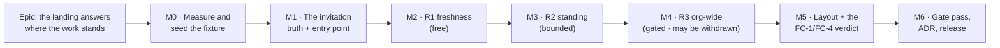

# Implementation Plan: The organisation landing answers where the work stands

- **Feature spec:** [`./feature-spec.md`](./feature-spec.md) — **Approved**, 2026-09-15, with all
  three critical questions answered at their stated defaults. This plan holds the same state; the
  two files are one artefact and their status tokens are gated against disagreeing.
- **Status:** Approved — the product owner approved the direction on 2026-09-15 and answered
  all three critical questions with the stated defaults: **CQ-1** per-plan (R2) first, with the
  org-wide rollup (R3) measured at M4 and shipped only if FC-2 and FC-3 both pass — withdrawn
  with its number recorded rather than tuned; **CQ-2** the landing states live and expired
  invitations separately, reaping nothing and hiding nothing; **CQ-3** two columns by demand,
  gated on FC-4 and reverted to stacked if any existing section ends up narrower than today.
- **Owner:** feature-analyst (hand-off on approval)

---

## Breakdown

### Epic

**The organisation landing answers where the work stands** — discharge ADR-0098 D10 §3's deferral
with a measurement, repair the invitation dead end, and leave the landing answering seven of a
planner's questions instead of two. Maps to the roadmap's "The landing is the organisation overview"
theme.

**The sequencing rule for this epic:** the cheap, high-value, low-risk work lands first and is
independently useful; anything whose cost is unknown is last and has a written withdrawal clause.
M1 and M2 are both shippable on their own and both fix something live.

---

## Milestone M0 — Measure the screen, and give it something to say

**Outcome:** the epic has baselines for FC-1, FC-2, FC-3 and FC-4, and a fixture capable of
exhibiting every state the later milestones add. Nothing about the product changes.
**Ships dark:** M0 changes no product code at all. It changes the screenshot fixture, adds two
measurement harnesses and records numbers. The first user-facing milestone is M1.
**Journey:** none owed — nothing is reachable. M1 carries the epic's first journey step.

> **Why it is first, and not an afterthought.** Two instruments here are unfit for the job
> (spec §0.7): the `org-home` fixture is two plans, one of them empty, so FC-1 would be graded on a
> page with nothing to say; and `GET …/overview` has **never been measured**, so FC-2 has no
> baseline. This repository has three recorded instances of a verdict produced from a missing number
> (ADR-0097 Landing C's `PROCEED` from an `undefined`, ADR-0066's 4.6 ms that measured the cull,
> `measure-staff.mjs` reporting `FC-1: 0 of 5` from the sign-in page). All three harnesses below
> **throw rather than judging** when they have nothing to judge.

---

#### Feature: M0-F1 — A fixture that can exhibit the epic

> **Description:** extend `apps/web/scripts/shoot.mjs`'s `org-home` seed to hold at least one plan
> in each reportable state, plus enough plans to exceed the section cap, plus one live and one
> expired invitation (spec §5.2).
> **Complexity:** M
> **Dependencies:** none
> **Risks:** the fixture becomes the design target → the states are enumerated from the **DTO's own
> union members**, not from what looks good; the non-vacuity control asserts each **positively**.
> An expired invitation cannot be created through the API (7-day TTL) → it is aged by a direct
> `UPDATE` in the seed, and that departure is recorded in the harness docblock.
> **Testing requirements:** the control itself; a `shoot --only org-home` run producing a picture
> with every state visible.

##### Task M0-T1 — Extend the `org-home` seed

- **Description:** six plans across two projects, in the six states of spec §5.2, plus filler to
  exceed the cap of 8.
- **Complexity:** M
- **Dependencies:** none
- **Risks:** seeding through the public API is slow and the shot times out → reuse the existing
  `page.evaluate` batch POST shape; add plans, not activities, for the filler.
- **Testing:** the control in M0-T2.
- **Development steps:**
  1. Extend `seed()` with the five additional plans; recalculate only the ones that must be
     calculated, so "never calculated" is a real state rather than a contrivance.
  2. Capture a baseline on plan 1 and 5 via `POST …/baselines`, then edit plan 1 so it finishes
     later than its baseline.
  3. Create a `constraint_violated` activity on plan 4 via a `MANDATORY_START` before the network
     earliest, and recalculate — assert the flag came back rather than assuming it did.
  4. Create two invitations; age one past `expiresAt`.
  5. Record what each plan is for, in the seed's own comments.

##### Task M0-T2 — The non-vacuity control, checked first and verified red

- **Description:** a control that asserts **each** state is present and **throws**, naming what is
  missing, before any measurement runs.
- **Complexity:** S
- **Dependencies:** M0-T1
- **Risks:** a control satisfied by conditions that are true on every boot → each assertion names a
  **specific plan's** state; none may be satisfied by an ambient default (ADR-0143 §11's finding).
- **Testing:** run it against the **old** seed and confirm it fails, naming all six absences.
- **Development steps:**
  1. Write the control; run it red against `main`'s seed; record the output.
  2. Wire it ahead of both harnesses in M0-T3/T4.

##### Task M0-T3 — `measure-overview.mjs` (FC-1, FC-4)

- **Description:** a Playwright harness that signs in, asserts the `<h1>` is the organisation's name
  and **throws otherwise**, then reports each question's answering-sentence `y` and each section's
  content width at 1280 / 1440 / 1646.
- **Complexity:** M
- **Dependencies:** M0-T2
- **Risks:** it measures the wrong element → it locates sections by `role="region"` + accessible
  name (`SectionCard` renders named regions), never by class; it prints the node it measured.
  `reuseExistingServer` silently adopts a stale dev server (ADR-0099's three false diagnoses) → it
  refuses to run while anything answers on 3000 or 5173.
- **Testing:** the harness's own output against `main`, committed as the baseline record.
- **Development steps:**
  1. Write it; run it against `main`; record FC-1 (Q1–Q3 present, Q4–Q7 `absent`) and FC-4's widths.
  2. Commit the baseline as `m0-measurement.md`, with the environment, build and date.

##### Task M0-T4 — The endpoint benchmark (FC-2, FC-3)

- **Description:** an API-side harness that seeds the four ADR-0098 org shapes (typical 16×180,
  scale 10×2,000, breadth 459×40, extra-large 3,000×40) and reports `GET …/overview` p50/p95 **and**
  `EXPLAIN (ANALYZE, BUFFERS)` for every query the request issues.
- **Complexity:** L
- **Dependencies:** none
- **Risks:** a benchmark over an unrepresentative database says nothing → the shapes are taken from
  the ADR-0098 index migration rather than invented. A single run is reported as a fact → it runs
  repeats, reports the **spread**, and reports `INDETERMINATE` where the delta is inside it
  (ADR-0128's fourth verdict). `tsx` cannot boot this application (ADR-0125's recorded finding) →
  drive the running API over HTTP, not by importing it.
- **Testing:** a deliberate non-vacuity check — the harness asserts the response carries the
  sections it is timing, so a 403 or an empty org cannot produce the fastest number in the run.
- **Development steps:**
  1. Write the shape seeder; confirm row counts against the shapes before timing anything.
  2. Record p50/p95 per shape and the `EXPLAIN` cost + JIT presence per query.
  3. Commit the baseline in `m0-measurement.md`. **Note explicitly whether JIT fires today** — if it
     already does at any shape, that is a pre-existing finding to file, not this epic's regression.

---

## Milestone M1 — The invitation sentence becomes true, and Members can answer it

**Outcome:** an Org Admin reading "1 invitation expired without being accepted" can open Members,
see it, and revoke it. Two shipped endpoints acquire their first caller.
**Entry point:** the **Members** screen (`/orgs/$orgSlug/members`) gains an **Invitations** section;
each row carries a **Revoke** button named `Revoke invitation for <address>`. The landing's
attention row links to it.
**Journey:** `apps/web/e2e-members/` — invite → land on the overview → read the count → follow the
link → find the invitation in the list → revoke it → assert it leaves the list **and** the landing's
count drops. This is the epic's first user-facing milestone, so the journey lands here, not at the
end (ADR-0081 §2).

> **It ships first because it is the live defect**, it is independent of every measurement, and it
> is the one thing on this screen currently telling the one member of this installation something
> untrue.

---

#### Feature: M1-F1 — One invitation predicate, two facts

> **Description:** the landing splits `pendingInvitationCount` into `liveInvitationCount` and
> `expiredInvitationCount`, computed by the **same predicate the list uses** — including
> `deleted_at IS NULL`, which the count is missing today (spec §0.1b).
> **Complexity:** S
> **Dependencies:** none
> **Risks:** the two predicates drift again → a shared helper plus a structural test asserting the
> count and the list read one rule. A breaking DTO change → pre-1.0 minor bump; the field has
> exactly one web consumer (`NeedsAttentionSection.tsx:37`), verified.
> **Testing requirements:** unit (three counts over a fixture holding live/expired/revoked/
> soft-deleted), API e2e (FC-6: the addends equal the list's length), structural test.

##### Task M1-T1 — Unify the predicate and split the count

- **Description:** extract the pending-invitation predicate into one exported helper; have
  `OverviewRepository` and `InvitationRepository` both call it; add the expired/live split.
- **Complexity:** S
- **Dependencies:** none
- **Risks:** `expiresAt` is compared against two clocks → the split is computed in **one** SQL
  expression against `now()`, matching how `findHeldLocks` already evaluates lease expiry
  server-side.
- **Testing:** a unit case per row kind, **verified red** against today's `count()` for the
  soft-deleted case; an API e2e asserting FC-6.
- **Development steps:**
  1. Add the shared predicate; point both repositories at it.
  2. Replace `pendingInvitationCount` with the two fields. **Blast radius, enumerated rather than
     estimated** (`rg pendingInvitationCount`, 2026-09-15): `packages/types/src/index.ts:2434`,
     `apps/api/src/modules/overview/dto/overview-response.dto.ts:94`,
     `overview.service.ts:147`, `overview.service.spec.ts:105,113`,
     `apps/api/test/overview.e2e-spec.ts:59,262,278,289,528`,
     `apps/web/src/features/overview/components/NeedsAttentionSection.tsx:37`,
     `overview-screen.test.tsx:22,323,337` and `docs/API.md:876`. **One production read in
     `apps/web`**; everything else is a type, a test or a document.
  3. Update `NeedsAttentionSection` — two rows, two sentences, **`undefined` tests preserved**
     (the component's own docblock forbids falsiness tests: `0` and "not for you" are different).
  4. Update `docs/API.md` and add a changeset.

##### Task M1-T2 — `useInvitations` + `useRevokeInvitation`

- **Description:** the two missing hooks, against the already-shipped `GET` and `DELETE`.
- **Complexity:** S
- **Dependencies:** none
- **Risks:** the `apiFetch` prefix trap (`API_BASE_URL` is already `/api/v1`; the staff console
  shipped a doubled prefix its own tests agreed with) → **only the journey can see this**, which is
  why M1-T4 exists.
- **Testing:** unit for the query key and the invalidation set; the journey for the path.
- **Development steps:**
  1. `useInvitations(orgSlug)` reading `invitationKeys.all(orgSlug)` — the key that has had a writer
     and no reader since it was written.
  2. `useRevokeInvitation(orgSlug)`, invalidating `invitationKeys.all` **and** the overview key.
  3. Export both from `features/members/index.ts`.

##### Task M1-T3 — The Invitations section, and Members on the archetypes

- **Description:** `InvitationsSection` (address, role, sent, expiry, `Revoke`); `members.tsx`
  converted from its hand-rolled `mx-auto w-full max-w-6xl` frame to
  `PageContainer`/`PageHeader`/`SectionCard`.
- **Complexity:** M
- **Dependencies:** M1-T2
- **Risks:** the section renders an empty frame for a non-admin → **omitted entirely** on
  `invitation:read`, per ADR-0082 at section granularity. `Revoke` disappears without
  `invitation:revoke` → it is **shaded with its reason** (ADR-0082's discriminator: shut by a role
  the reader could in principle change is a shade, not an omission), using `disabledReason`.
  Focus drops to `<body>` when the confirm dialog closes and its row unmounts → the recorded class
  in ADR-0096/ADR-0099/ADR-0143; focus returns to the section heading, asserted in the journey.
- **Testing:** unit (five states: loading, error, empty, admin, non-admin); axe scan in the journey.
- **Development steps:**
  1. Build the section on `DataTable` + `ConfirmDialog` + `QueryErrorState`, following
     `MembersTable`'s shape so the two cannot diverge.
  2. Convert `members.tsx` to the archetypes; confirm the existing `MembersTable.test.tsx` passes
     **unchanged** — it queries by role and caption, which is the contract the conversion preserves.
  3. 409 handling: report it as a sentence and refetch; never retry.

##### Task M1-T4 — `apps/web/e2e-members/`, its config and its CI step

- **Description:** the journey named in the milestone header, with its own Playwright config, its
  own `package.json` script and its own CI step.
- **Complexity:** M
- **Dependencies:** M1-T3
- **Risks:** a new CI step must be added to `ci.yml` **and** to the e2e shard roster, or
  `check:e2e-roster` refuses the PR (ADR-0138) → do both in this task. `scripts/e2e-sweep.sh`'s list
  is derived, so it picks the suite up; confirm rather than assume.
- **Testing:** the journey is the test. It must **fail first** against `main`.
- **Development steps:**
  1. Config + script + CI step + roster entry, in one change.
  2. Drive the whole path against a real API; assert the landing count before and after the revoke.
  3. Run `scripts/e2e-local.sh api` (this touches `apps/api`) and the new suite locally before
     pushing — CI is the second opinion (CLAUDE.md §19.8).

---

## Milestone M2 — R1: is this figure current? (free)

**Outcome:** every row in "Recently changed" says whether its plan has been edited since its schedule
was last calculated, and when that was — the single most valuable fact available, at zero marginal
query cost (spec §0.4).
**Entry point:** the **Recently changed** section on `/orgs/$orgSlug` — each row gains a freshness
line. No new control; the fact is on a row the reader already reads.
**Journey:** extend `apps/web/e2e-overview/` — edit an activity through the real API, return to the
landing, assert the plan's row says it has been edited since it was last calculated; recalculate,
return, assert the line is **gone**. Both directions, because a marker that never clears is
indistinguishable from a marker that is always on.

---

#### Feature: M2-F1 — Freshness from a column already selected

> **Description:** add `schedule_computed_at` to `findRecentlyChanged`'s `SELECT`, compare it with
> the `GREATEST` the query already computes, and surface three states: never calculated, edited
> since, current (which renders **nothing** — silence is the healthy state).
> **Complexity:** S
> **Dependencies:** M0-T4's baseline, so the "zero marginal cost" claim is checkable rather than
> asserted.
> **Risks:** the comparison is meaningless if a recalculation stamps `plans.updated_at` → verified
> it does not (`stampScheduleComputedAt` is raw SQL, Prisma's `@updatedAt` is client-side, and there
> is **no `updated_at` trigger in the schema** — spec §0.4); a **structural test pins that
> `stampScheduleComputedAt` writes no `updated_at`**, so a future change making it do so fails here
> rather than silently inverting the signal. Auto-arrange is a known false positive → named in the
> ADR and in the component's docblock, not discovered later as a defect.
> **Testing requirements:** unit on the three states; API e2e proving the flag flips both ways
> against a real recalculation; FC-2 re-measured.

##### Task M2-T1 — The column, the comparison and the structural pin

- **Description:** one column added to the existing query; `editedSinceCalculated` derived in the
  repository where the `GREATEST` lives, never in the service.
- **Complexity:** S
- **Dependencies:** M0
- **Risks:** deriving it client-side would put a scheduling rule in the browser → it is a server
  fact.
- **Testing:** a repository unit case verified red against a version that compares
  `plans.updated_at` alone; the structural pin on `stampScheduleComputedAt`.
- **Development steps:**
  1. Extend the `SELECT`, the row interface and the DTO (`scheduleComputedAt`,
     `editedSinceCalculated`).
  2. Write the structural pin; verify it red by adding `updated_at = now()` to the stamp.
  3. `docs/API.md`, changeset.

##### Task M2-T2 — The row's freshness line, and the copy contract

- **Description:** `RecentlyChangedRow` gains one line, in three states.
- **Complexity:** S
- **Dependencies:** M2-T1
- **Risks:** the copy claims more than the data (spec §"Copy contract") → a unit test asserts the
  forbidden strings ("up to date", "on time", "on schedule", "late") appear **nowhere** in the
  feature, scanned with comments stripped (four gates in this repository have gone red or green on
  their own prose).
- **Testing:** unit per state; the extended journey.
- **Development steps:**
  1. Three states; "current" renders nothing at all.
  2. The forbidden-string gate, verified red.
  3. Extend `e2e-overview`, both directions.

##### Task M2-T3 — Re-measure FC-2

- **Description:** re-run M0-T4 in **one sitting** against before and after.
- **Complexity:** S
- **Dependencies:** M2-T1
- **Risks:** reporting a delta smaller than the spread as a pass → the verdict reports the spread
  and says `INDETERMINATE` where it must.
- **Testing:** the measurement is the test.

---

## Milestone M3 — R2: where each programme stands (bounded)

**Outcome:** the landing carries a **"Where the work stands"** section: for each plan already on the
page, its finish, its movement against the active baseline, and any engine-flagged counts.
**Entry point:** the **"Where the work stands"** section on `/orgs/$orgSlug`; each row's plan name
is a link into the plan.
**Journey:** extend `apps/web/e2e-overview/` — against the M0 fixture, assert one row of each state
by its **sentence**, including `No baseline` and `Not yet calculated`, and assert the
`showing N of M` line is present and correct.

---

#### Feature: M3-F1 — The standing read, engine-free

> **Description:** `OverviewRepository.findPlanStanding({ planIds })` — one grouped aggregate over
> `activities`' persisted engine columns plus a one-row-per-plan `LEFT JOIN` to the active baseline.
> **Complexity:** L
> **Dependencies:** M0-T4
> **Risks:** somebody reaches for the engine because a case looks easier to recompute → the
> **structural gate** (D2), copied from `revision-delta-engine-free.structural.spec.ts` including
> its non-vacuity assertion and its recorded blind spot. A cost field creeps in "for completeness" →
> the `cost-key-scan` gate (D6), whose three known bypasses are already fixed in the shared scanner.
> Movement computed in calendar days → the day factor comes from the plan calendar's
> `hours_per_day_minutes` (ADR-0068/ADR-0139), and a unit case uses an **eight-hour** calendar,
> because a whole-day fixture passes identically against the defect and against the fix
> (ADR-0139's recorded trap).
> **Testing requirements:** repository unit over a real database; two structural gates; API e2e for
> the role path; the journey.

##### Task M3-T1 — The query and the three-valued reports

- **Description:** the aggregate, the baseline join, and `baselineMovement` as a discriminated union
  with four `NOT_ASSESSABLE` reasons.
- **Complexity:** L
- **Dependencies:** M0-T4
- **Risks:** a `?? 0` collapses "no baseline" into "unchanged" → the union has no numeric fallback,
  so the compiler refuses it. Two active baselines → impossible by
  `uq_baselines_plan_active`; the query takes the active one and a unit case pins the partial-unique
  assumption by reading `pg_indexes` (ADR-0129's method: never the migration file, which describes
  history).
- **Testing:** one unit case per union member, each verified red against a naive nullable-number
  implementation.
- **Development steps:**
  1. Write the SQL, modelled on `ScheduleRepository.summarise` and citing it, so the two aggregates
     read the same columns the same way.
  2. Derive the movement in working days on the plan's own calendar.
  3. The two structural gates, both verified red.

##### Task M3-T2 — The service seam, gated before the read is issued

- **Description:** `assertCan('schedule:read')` before issuing; `planStanding` **omitted** from the
  payload when absent, never an empty object.
- **Complexity:** S
- **Dependencies:** M3-T1
- **Risks:** issuing and filtering → the ADR-0098 rule; the read is not issued at all.
- **Testing:** service unit with a principal lacking the permission; API e2e comparing **whole
  payloads** rather than asserting an empty array (an oracle is a difference — ADR-0098 D5c).

##### Task M3-T3 — `WhereWorkStandsSection` and `PlanStandingRow`

- **Description:** the section and its row, five states, on the archetypes.
- **Complexity:** M
- **Dependencies:** M3-T2
- **Risks:** a row of em dashes for an uncalculated plan reads as breakage (ADR-0061's
  `ContextStrip` finding) → each absent fact is a **sentence**, never a dash. Direction encoded in
  colour alone → the word ("later"/"earlier") carries it; colour is the second channel (WCAG 1.4.1).
  `archetypes.structural.test.ts` scans the whole feature directory → the new files must use the
  archetypes, which is the point.
- **Testing:** unit per state; axe in the journey; the forbidden-string gate extended.

##### Task M3-T4 — Re-measure FC-2 and take FC-3

- **Description:** FC-2 in one sitting; FC-3's `EXPLAIN` at all four shapes.
- **Complexity:** M
- **Dependencies:** M3-T1
- **Risks:** R2 is bounded by ≤ 13 plans and is expected to be cheap — **expected is not
  measured**; if FC-3 shows JIT firing at any shape for R2, the milestone stops and M4-T2's
  `database-architect` engagement is brought forward.
- **Testing:** the measurement.

---

## Milestone M4 — R3: the whole organisation (gated, and withdrawable)

**Outcome:** "Where the work stands" covers **every** active plan in the organisation rather than
the ones already on the page — **if and only if** FC-2 and FC-3 both pass.
**Entry point:** the same section; the change is what it covers, plus a `StatGrid` of two
organisation-level figures (plans edited since last calculated; plans finishing later than baseline)
— both bidirectional and both with an action behind them (spec D8).
**Journey:** extend `e2e-overview` — assert a plan that is **not** in "Recently changed" nevertheless
appears in the standing section.

> **This milestone's outcome may be "withdrawn, with the number recorded".** That is a success, not
> a failure: spec §5 commits to withdrawing rather than tuning, and ADR-0091 D4, ADR-0092 M5,
> ADR-0097 Landing C, ADR-0110 D3 and ADR-0142 D1 are five precedents in this repository for a
> measurement disqualifying its own proposal. R2 already covers what a reader is looking at, so a
> withdrawal leaves no hole.

---

#### Feature: M4-F1 — The org-wide variant of one method

> **Description:** `findPlanStanding` takes an organisation id instead of a plan-id list. **Same SQL
> body, different `WHERE`** — one implementation, so the two cannot drift (the ADR-0065
> `routeOrthogonal` argument).
> **Complexity:** M
> **Dependencies:** M3
> **Risks:** the JIT cliff (spec §0.3) — an `O(org activities)` aggregate is exactly the shape that
> crosses `jit_above_cost`, and its trigger is **another tenant's growth**, which no timing on this
> database can see → FC-3 is an `EXPLAIN` condition, taken at all four shapes.
> **Testing requirements:** FC-2, FC-3, the journey, and a cap test (`showing N of M`).

##### Task M4-T1 — The variant, the cap, and the true total

- **Description:** the org-wide `WHERE`, the cap of 8, and `shown`/`total` always travelling together.
- **Complexity:** M
- **Dependencies:** M3-T1
- **Risks:** a silently truncated list (ADR-0127's rule) → `total` is a separate `COUNT`, asserted
  in a unit case where `total > shown`.
- **Testing:** unit; the journey.

##### Task M4-T2 — **Conditional:** `database-architect`, if and only if FC-3 fails

- **Description:** if FC-3 fails, the remedy is likely an index — **which is a schema change.**
- **Complexity:** L (if it runs)
- **Dependencies:** M4-T1's measurement
- **Risks:** proceeding without the agent. **CLAUDE.md §19.3 is unconditional: every schema change
  goes through `database-architect`, no exceptions, and deciding a change is too small is the
  judgement the agent exists to make. If the agent returns nothing, fails, or is slow, re-run it —
  an unavailable agent is a reason to wait, never a reason to proceed.** A migration is checksummed
  the moment it lands and applies to a real database; a mistake costs a second migration in every
  environment.
- **Testing:** the agent's own measurement, plus FC-3 re-taken.
- **Development steps:**
  1. Record FC-3's failure and its `EXPLAIN` output.
  2. Run `database-architect` with the four shapes, the existing `activities_organization_id_idx`,
     and the ADR-0098 migration's own three declines (which record that
     `plans_organization_id_idx` **adapts by itself** and that three candidate indexes went
     unchosen — do not re-open them on instinct).
  3. If the agent recommends no index, **withdraw R3** and record the number.
  4. If it recommends one, the migration is its design, with its measurements in the comment, to the
     standard of `20260818220000_overview_recently_changed_indexes`.

##### Task M4-T3 — The organisation-level figures, or their absence

- **Description:** two `StatGrid` figures, only if R3 ships.
- **Complexity:** S
- **Dependencies:** M4-T1
- **Risks:** re-creating ADR-0098 D10 §1's rejected tiles → each figure must pass the D8 test
  (bidirectional **and** actionable); a unit test pins the two labels against a list, so a third
  figure is a deliberate change rather than an accretion.
- **Testing:** unit; the `@container` wrapper trap (`StatGrid`'s own docblock: `container-type`
  applies to descendants, so the prop was inert for a whole milestone) is already fixed in the
  primitive — assert the rendered `grid-template-columns` in the journey rather than trusting it.

---

## Milestone M5 — Layout, and the FC-1 verdict

**Outcome:** the sections are arranged so that every question Q1–Q7 is answered above the fold at
1646, and no existing section is narrower than it was.
**Entry point:** `/orgs/$orgSlug` — the whole landing.
**Journey:** `e2e-overview` gains the axe scan over the new arrangement; `measure-overview.mjs`
produces the verdict.

---

#### Feature: M5-F1 — `PageGrid`, span-by-demand, and a withdrawal clause

> **Description:** the overview moves to `PageGrid` with spans assigned by content demand
> (ADR-0143). `PageContainer` width is decided by **FC-4's measurement**, not by preference.
> **Complexity:** M
> **Dependencies:** M0-T3's baseline; M2; M3 (M4 optional)
> **Risks:** ADR-0098 chose `narrow` on a measurement and this reverses it; this repository has been
> wrong about width **seven consecutive times**, always in the same direction → FC-4 is measured,
> and the grid is **withdrawn to a stacked single column** if any row section is narrower.
> `PageGrid` must not re-order (WCAG 1.3.2) — it has no `order` and no `dense` by design, and the
> consequence (a `wide` item between two `narrow` ones leaves a gap) is paid by **ordering the
> sections**, not by CSS.
> **Testing requirements:** FC-1, FC-4; `page-grid.structural.test.ts` unchanged; axe.

##### Task M5-T1 — Arrange, measure, and take the verdict

- **Description:** the grid, the ordering, and the two measurements in one sitting.
- **Complexity:** M
- **Dependencies:** M3
- **Risks:** grading FC-1 on a fixture that cannot exhibit the states → M0-T2's control runs first.
- **Testing:** the harnesses.
- **Development steps:**
  1. Order: Jump back in → Where the work stands → Recently changed → Needs your attention. Worst
     news is not first; **the reader's own work is**, because that is what they came for.
  2. Measure FC-1 and FC-4 at 1280 / 1440 / 1646, before and after, in one sitting.
  3. Record the verdict in `m5-verdict.md`, including the run-to-run spread.
  4. If FC-4 fails, withdraw the grid and re-measure FC-1 stacked; record **both** numbers.

---

## Milestone M6 — The gate pass, the ADR, and the release

**Outcome:** the epic is reviewed by the specialists, its findings folded, its ADR filed and its
documents updated.
**Entry point:** none — this milestone adds no capability.
**Journey:** the full sweep, `scripts/e2e-sweep.sh`, over every suite. **Not only the ones this epic
touched**: ADR-0091's retrospective records three journeys broken across one epic, each found by CI
rather than locally, because the author ran the suite CI named instead of all of them.

---

#### Feature: M6-F1 — Six specialists over the combined diff

> **Description:** `security-reviewer`, `api-reviewer`, `backend-performance-reviewer`,
> `database-architect` (whether or not a migration ran — it re-derives the epic's own numbers),
> `ux-reviewer`, `accessibility-reviewer`, `component-reviewer`.
> **Complexity:** L
> **Dependencies:** M5
> **Risks:** the gate pass is treated as a formality → eight consecutive epics in this register have
> had it find defects that passed a human read, and the commonest shape is **one correct pattern
> applied to a control and not its neighbour**. Every fix carries a regression test **verified red
> first** (ADR-0110 D5).
> **Testing requirements:** every folded finding gets a test; non-blocking findings are filed in
> `docs/TECH_DEBT.md` with numbers, not intentions.

##### Task M6-T1 — Fold the findings

- **Complexity:** L · **Dependencies:** M5 · **Testing:** a red-verified regression test per fix.

##### Task M6-T2 — File the ADR and update the documents

- **Description:** the ADR outlined in spec §4.9; `docs/adr/README.md`; **`CLAUDE.md` §16** —
  ADR-0132's own entry records that `check:adr-coverage` **structurally cannot see `CLAUDE.md`**, so
  the register is checked by a person or not at all, and a person has now missed it twice;
  `docs/API.md`; `docs/ROADMAP.md`; the spec's own `**Status:**` header rewritten to
  `Accepted — shipped (ADR-NNNN)` **in the same change that files the ADR** (ADR-0131 — the header
  drifted by being nobody's step).
- **Complexity:** M
- **Dependencies:** M6-T1
- **Risks:** `pnpm check:spec-status` refuses a `Draft` header whose directory an ADR cites, so
  filing the ADR without the header rewrite fails the push — which is the gate doing its job.
- **Testing:** `pnpm prepush` (one command — running its parts by hand is how a gate gets missed,
  CLAUDE.md §19.8), plus `scripts/e2e-local.sh api` and every web suite.

##### Task M6-T3 — Changeset and release

- **Description:** a minor bump for `@repo/api` (DTO change) and `@repo/web`.
- **Complexity:** S
- **Dependencies:** M6-T2
- **Risks:** merging on a stale check run. Dedupe check runs by name keeping the most recently
  started, and pin the merge to a SHA **obtained** from the API or `git ls-remote`, never completed
  from a short prefix (CLAUDE.md §19.9). After the squash-merge, **reset the branch from `main`
  before doing anything else** (§8).

---

## Sequencing & slices

Each milestone keeps `main` releasable and is independently valuable.

| Slice  | Ships on its own?                                   | Value if the epic stopped here                                                          |
| ------ | --------------------------------------------------- | --------------------------------------------------------------------------------------- |
| **M0** | Yes — no product change                             | Two harnesses, a usable fixture, and the first measurement of this endpoint in its life |
| **M1** | **Yes**                                             | The live defect is fixed; two endpoints get an entry point                              |
| **M2** | **Yes**                                             | The highest-value fact on the screen, at zero query cost                                |
| **M3** | **Yes**                                             | The landing becomes a programme view                                                    |
| **M4** | Yes — **or is withdrawn, with the number recorded** | Organisation-wide coverage, or an honest refusal                                        |
| **M5** | Yes                                                 | The verdict on whether the epic met its own condition                                   |
| **M6** | Yes                                                 | The decision is recorded and the documents match the code                               |

**No feature flag** (spec D10 / ADR-0088 D1): a `VITE_` constant is inlined at build time,
`docker-publish.yml` passes none, and every published image carries every flag at its default — so a
flag here would be a second JSX root maintained for ever, not a rollback. **The rollback is a commit
boundary**, and the slicing above is what makes that real: M1, M2, M3 and M4 are each one revertible
commit boundary.

**Approved work runs to completion** (CLAUDE.md §19.12): on approval, the milestones chain inside the
working turn, a wake-up is armed as the **first** action with a checkable terminal condition, and the
only two reasons to stop are that every milestone is complete or that a question needs an answer only
the product owner can give. A blocking question blocks one milestone, not the programme.

## Definition of Done (per task)

Each task's PR satisfies the Feature Completion Criteria in [`docs/PROCESS.md`](../../PROCESS.md) —
code, tests, docs, security, performance, accessibility, Docker build, CI, changelog, version impact
— and, specifically here:

- **the pre-push gate was run, not just written**: `pnpm prepush`, plus `scripts/e2e-local.sh api`
  for every `apps/api` change and `scripts/e2e-local.sh web:<suite>` for each new or changed journey;
- **every decision-bearing claim names its evidence** — the command, the file and line, or the test
  (ADR-0076). A claim inherited from this plan is checked like any other: **this plan is not
  evidence**, and two of its own citations should be spot-checked before they are relied on;
- **a plan's problem statement is a claim too** (ADR-0099's finding): before starting a milestone,
  re-verify that the thing it complains about is still true. Three milestones in one recent epic lost
  their headline task to a re-read.

## Risks & assumptions (rollup)

| Risk / assumption                                                                                     | Likelihood            | Impact   | Mitigation                                                                                              |
| ----------------------------------------------------------------------------------------------------- | --------------------- | -------- | ------------------------------------------------------------------------------------------------------- |
| The org-wide aggregate crosses `jit_above_cost` and the landing slows **because another tenant grew** | **med**               | **high** | FC-3 is an `EXPLAIN` condition at four shapes; R3 is withdrawn rather than tuned; M4-T2 gates the index |
| R2 is assumed cheap because it is bounded — assumed, not measured                                     | med                   | med      | M3-T4 measures it; the milestone stops if FC-3 fails there                                              |
| The freshness signal's false positive (auto-arrange) erodes trust in the marker                       | med                   | med      | Named in the ADR, the component docblock and the copy contract; the copy says "edited", never "wrong"   |
| The copy outruns the data ("on time", "late", "up to date")                                           | med                   | **high** | An explicit copy contract plus a forbidden-string gate, comments stripped, verified red                 |
| A future change makes the recalculation stamp `updated_at`, silently inverting the freshness signal   | low                   | **high** | A structural pin on `stampScheduleComputedAt`, verified red                                             |
| The count and the list drift apart again                                                              | low                   | med      | One shared predicate + a structural test; FC-6 in API e2e                                               |
| FC-1 is graded on a fixture that cannot exhibit the states                                            | **high** if unguarded | high     | M0-T2's control asserts each state **positively** and throws, run **before** any measurement            |
| A measurement is taken with a copy of the instrument, or against a stale dev server                   | med                   | med      | The harness refuses to run while 3000/5173 answer; it prints the node it measured; ADR-0124's rule      |
| Widening the container narrows the rows ADR-0098 deliberately kept narrow                             | med                   | med      | FC-4, with a written withdrawal to a stacked column                                                     |
| A schema change is made without `database-architect`                                                  | low                   | **high** | M4-T2 is a hard gate; an unavailable agent is a reason to wait, never to proceed (CLAUDE.md §19.3)      |
| A cost field reaches the payload and the section stops being role-invariant                           | low                   | med      | The `cost-key-scan` gate, reused rather than re-implemented (its three bypasses are already fixed)      |
| Somebody reaches for the engine for one awkward case                                                  | low                   | **high** | The structural import gate; its blind spot (transitive imports) is stated rather than implied           |
| A new CI step is added without its roster entry, and `check:e2e-roster` refuses the PR                | med                   | low      | M1-T4 adds both in one change — and the refusal is the gate working                                     |
