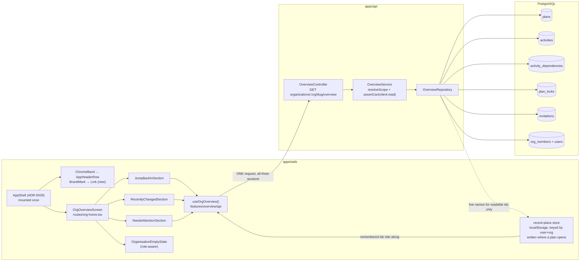
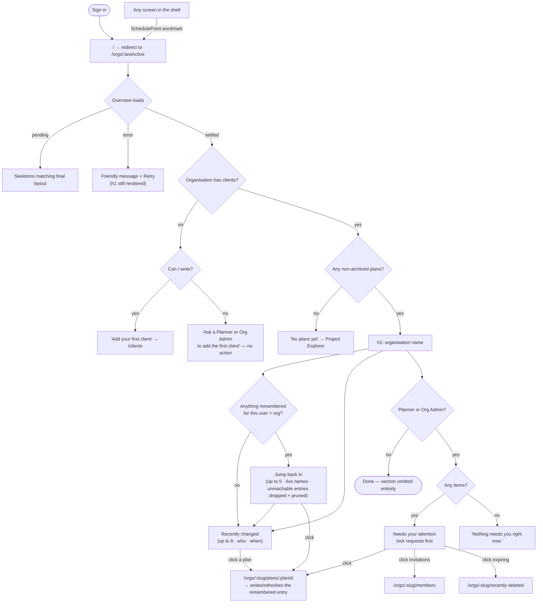

# Feature Spec: The organisation landing page ("Overview")

- **Status:** **Approved** — the three critical questions were answered by the product owner on
  2026-08-18 and are recorded in §6. Ready to build.
- **Author(s):** feature-analyst (Product Owner / Solution Architect / Technical Lead hats)
- **Date:** 2026-08-18 (drafted); 2026-08-18 (decisions folded in)
- **Tracking issue / epic:** _(to be created)_
- **Roadmap link:** [`docs/ROADMAP.md`](../../ROADMAP.md) → "Next → Product features"
- **Related ADR(s):** this epic files **ADR-0098**. _(The draft of this spec reserved **0097**; that
  number was taken on 2026-08-18 by the design-system rewrite, being drafted in parallel by
  `ui-architect`. **The collision is recorded rather than routed around** — ADR-0071 was cited by
  shipped code while absent from the register, and ADR-0079 was filed under a number other than the
  one its own plan named. Three specs were being written the same afternoon, which is exactly the
  condition that produced both. Re-confirm 0098 is still free at filing time anyway; a number
  assumed twice is a number assumed.)_
  Builds on ADR-0012/0016 (RBAC + tenancy), ADR-0028 (the pen), ADR-0029 (the shell), ADR-0055
  (surface scopes), ADR-0073 §3 (what the audit log permanently excludes), ADR-0082 (shade vs.
  omit), ADR-0088 (flag classification), ADR-0091 (the chrome band), ADR-0096 (retention).
  **Runs alongside ADR-0097** (design-system rewrite) — see §0.3 for how, and for what this screen
  needs from it.

---

## 0. What I verified, and where the brief was wrong

The brief that started this work carried four measurements and asked me to check them rather than
trust them (CLAUDE.md §19.10, ADR-0058, ADR-0076). Three held. One did not, and correcting it
changes the design.

| #   | Brief's claim                                                                                                                                                                            | Verdict                                               | Evidence                                                                                                                                                                                                                                                                                                    |
| --- | ---------------------------------------------------------------------------------------------------------------------------------------------------------------------------------------- | ----------------------------------------------------- | ----------------------------------------------------------------------------------------------------------------------------------------------------------------------------------------------------------------------------------------------------------------------------------------------------------- |
| 1   | `/orgs/$orgSlug` renders `OrgHomeScreen`; flag-on it returns `WelcomeEmptyState` and nothing else; nothing derives from the organisation's data                                          | **Confirmed**                                         | `apps/web/src/routes/org-home.tsx:29-31` returns `<WelcomeEmptyState orgSlug isNewOrg/>`; `apps/web/src/routes/welcome-empty-state.tsx:21-62` is a centred `Card` + `ScheduleBackdrop` with one `Link` to `/orgs/$orgSlug/clients`. The only datum consumed is `clients?.length === 0` (`org-home.tsx:30`). |
| 2   | The flag-off branch says "The schedule editor arrives in an upcoming update"; `VITE_NAV_TREE` is `flagDefaultOn` at `env.ts:126`; no user has ever seen that branch                      | **Confirmed, and it is worse than stated** — see §0.1 | `org-home.tsx:44-45` carries the sentence. `apps/web/src/config/env.ts:126`. ADR-0088 D1: `VITE_*` is inlined at build time, `apps/web/Dockerfile` declares one `VITE_` build arg and `docker-publish.yml` passes none.                                                                                     |
| 3   | `app-header.tsx:83` is the only "Overview" entry point; the wordmark is in the `chrome` scope and is not a link                                                                          | **Confirmed**                                         | A `.tsx`-scoped search for `Overview` across `apps/web/src` returns **exactly one file**, `app-header.tsx` (the `<Link>` at `:77-84`). `BrandMark` (`components/layout/brand-mark.tsx:15-27`) renders two `<span>`s — no `<a>`, no `to`, no handler.                                                        |
| 4   | ADR-0073 §3 permanently excludes ordinary content edits from the audit log, so the audit trail is not the feed; row attribution says "this plan changed", never "what changed inside it" | **Confirmed**                                         | ADR-0073's coverage rule (durability + blast radius) and its "content edits are **permanently excluded**, not deferred again".                                                                                                                                                                              |

### 0.1 The claim that did not hold — and it is the brief's central design decision

> The accepted default was: _"the feed is **'What changed'**, derived from **plan row attribution**
> (`updated_by`/`updated_at` on the hierarchy rows)"_.

**`plans.updated_at` does not move when a plan's content changes.** It moves only when somebody
PATCHes the plan _record_ — its name, description, status, calendar, data date or one of the
fourteen scheduling options. A planner who spends a whole day building a programme moves it **not at
all**.

Two independent write paths establish this:

1. **Activity, dependency and progress writes never touch the `plans` row.**
   `apps/api/src/modules/activities/activities.service.ts:594,1144` call
   `activity.repository.ts:170 updateIfVersionMatches`, which writes `activities` only. There is no
   `plan.update` anywhere in `apps/api/src/modules/activities/` (searched).
2. **The recalculation deliberately does not bump it, and there is a test asserting so.**
   `apps/api/src/modules/schedule/schedule.service.spec.ts:236-237`:

   > _"The stamp is part of the engine-owned write path (alongside writeResults) — the recalc
   > **NEVER** calls an optimistic-locked plan update, so it cannot bump `version`/`updated_at`
   > (ADR-0022). The plan repo is only read (`findActiveByIdInOrg`), never written."_

   The recalculation stamps `plans.schedule_computed_at` through a raw UPDATE
   (`schedule.service.ts:288-292`) precisely so that it does **not** disturb the row's version or
   timestamp.

So a "What changed" feed built on `plans.updated_at` alone would ship a screen that is **usually
empty in a busy organisation, and wrong when it is not** — the worst outcome available, because a
blank Overview at least tells the truth. This spec therefore **widens the source while staying
inside the decision the product owner made**: still row attribution, still no new table, still not
the audit log — but reading the attribution rows that actually move (`activities`,
`activity_dependencies`) as well as the plan's own.

**What that costs, stated up front:** two new partial indexes, designed by the **database-architect**
agent and **measured** before they are written (CLAUDE.md §19.3 — unconditional, no
self-assessment of significance). See §3, §4.4 and Critical Question **Q1**.

### 0.2 Two further findings the epic must not step over

**(a) `VITE_NAV_TREE` is misclassified in the flag register, and no gate can see it.**
`scripts/flag-retirement.json:408-415` files it **Class B** with the boilerplate `keep` reason
("gates a capability rather than **selecting between two implementations** of one"). But
`apps/web/src/routes/authed-layout.tsx:15` is:

```ts
if (NAV_TREE_ENABLED) return <AppShell />;
```

— an early return between two whole shell roots, which is ADR-0088 D2's **Class A** shape verbatim,
and `org-home.tsx:29` is a second one between two whole screens. The register's own
`$classA-note` says a flag "branching by early return … is invisible to
[`detect-alternative-surfaces.mjs`] and is legitimately curated by hand", and
`scripts/check-flags.mjs:190` compares the detected count against `classACap` by **equality** — so
with the detector blind and the curation wrong, the gate passes green on a Class A flag registered
as Class B. `classACap` is currently `0`.

The retirement is cheap, which is why this epic should do it rather than file it:
`NAV_TREE_ENABLED` has **three production references in two files** (`org-home.tsx:6,26,29`,
`authed-layout.tsx:6,15`) plus the declaration (`env.ts:126`), **no `playwright*.config.ts` pins it**
(searched), and **no unit test mocks it** (searched). There is therefore no flag-off parity suite and
no harness to convert — the ADR-0084 batch-1 trap does not apply. See §4.6 and **D7**.

**(b) `CardTitle` renders an `<h1>`.** `apps/web/src/components/ui/card.tsx:50`. A dashboard of four
cards would emit four `<h1>`s on the first screen after sign-in. §4.6 says what to do about it.

### 0.3 This screen and ADR-0097 — the design-system rewrite

The product owner reopened the **entire visual design system** on 2026-08-18: the token vocabulary,
the surface-scope model, spacing, density, the type scale, radius and elevation are all open, and
`ui-architect` is drafting **ADR-0097** for it. This landing page is the **first new primary screen**
in that world — the thing a user meets immediately after sign-in.

**Three rules follow, and they shape §4.6 rather than sitting here as a caveat.**

1. **This epic does not block on ADR-0097.** The landing page's value is its content and its data,
   and both are settled: the derivation (§0.1), the sections (§4.7), the permissions (§2). None of
   that is a visual question.
2. **The screen is specified in structure, hierarchy and semantic tokens — never in colours,
   spacing literals or bespoke treatments.** Anything hard-coded now is something the rewrite has to
   unpick, and this epic would become the next instance of a screen "constrained to the existing
   design protocol", which is the failure the owner is asking to end. The existing lint rule already
   forbids colour literals in `className`/`style` (ADR-0055 §5); this spec extends the same
   discipline to spacing, radius and density — **use the scale, name the intent, never a magic
   value.**
3. **Where the current vocabulary genuinely cannot express what the screen needs, that is a
   requirement on ADR-0097 — not a one-off here.** A one-off is how the register filled up with
   findings in the first place.

**What this screen needs that the vocabulary does not have today.** Each was checked against
`apps/web/src/components/ui/` rather than assumed:

| Need                                                                            | Today's answer                                                                                                                                                                       | Why it is not enough here                                                                                                                                                                                                                                                                                    |
| ------------------------------------------------------------------------------- | ------------------------------------------------------------------------------------------------------------------------------------------------------------------------------------ | ------------------------------------------------------------------------------------------------------------------------------------------------------------------------------------------------------------------------------------------------------------------------------------------------------------ |
| **An empty state** (icon + copy + action)                                       | **No primitive.** `NoticeStrip emphasis="dashed"` (`notice-strip.tsx:34-35`) is a one-line strip; `DataTable` takes an `empty` node the **caller** supplies (`data-table.tsx:30,62`) | Already registered as `docs/TECH_DEBT.md` **#21(d)** — "no shared `EmptyState` primitive; empty states are text-only". This screen has **three**, and they are the first thing a new customer sees. Building a fourth bespoke one is precisely the debt #21(d) records                                       |
| **A skeleton**                                                                  | **No primitive at all.** `DataTable` takes a `loadingLabel` (`data-table.tsx:39,63`) — a spinner label                                                                               | `docs/UX_STANDARDS.md` "Perceived performance" says _skeletons over spinners for content; keep skeleton and final layout identical_. That standard currently has **no implementation anywhere in the product**. This spec asks for skeletons (§4.6); without a primitive that is a one-off on the LCP screen |
| **A page-section archetype** with a real heading rank                           | `CardTitle` is hard-wired to `<h1>` (`card.tsx:50`); `FormSection` has `headingLevel?: 2 \| 3` but is a **form**-layout primitive with `role="group"` (`form-layout.tsx:61,107`)     | A multi-section content screen is a normal shape and the system has no word for it. §4.6's `CardTitle` `level` prop is a **bridge, not the answer**                                                                                                                                                          |
| **A list / feed row** — scannable, linked, primary + secondary + metadata ranks | `DataTable`, which is a real `<table>`                                                                                                                                               | "Recently changed" is a list of links with supporting metadata, not tabular data. Forcing it into a table would misrepresent it to assistive technology and to the eye                                                                                                                                       |
| **Density as a system concept**                                                 | Exists **per component** — `NoticeStrip` has its own `density` axis (`notice-strip.tsx:37-42`)                                                                                       | A reading-density content screen sits between the plan workspace (very dense) and a form. Raised as an **observation**, not a blocking requirement: one component having the axis is evidence the system may want it, not proof                                                                              |

**One thing I was about to name and did not, because I checked.** A "this needs you, but nothing is
wrong" rank already exists: `NoticeStrip` has `info` and `warning` tones over `--info-text` /
`--warning-text` (`notice-strip.tsx:29-30`). The attention section uses `info`; it does **not** need
a new tone, and it must not reach for `destructive` — "you are holding the editing lock" is a
prompt, not a failure.

**Sequencing.** If ADR-0097 lands an `EmptyState`, a `Skeleton`, a section archetype or a list-row
archetype **before** the milestone that needs it, this epic **consumes it** rather than building the
bridge. Each affected task below says so explicitly, so the choice is made by whichever lands first
rather than by whoever is at the keyboard.

---

## 1. Business understanding

### Problem

`/orgs/$orgSlug` — the destination of every sign-in, because `app/router.tsx:152-164` redirects `/`
to the last-active organisation — is **a blank page**. It renders one centred card that says
"Welcome to SchedulePoint", "Select a plan from the Project Explorer to view its schedule", and one
link. Nothing on it derives from the organisation's data. A returning planner who has used this
product for six months meets the same screen as somebody who signed up ninety seconds ago.

That has two costs.

1. **It answers no question.** The two questions a planner opening a scheduling tool actually has
   are _"what has happened since I was last here?"_ and _"is anything waiting on me?"_. Today
   neither is answerable anywhere in the product: the only way to learn that a colleague reworked a
   programme is to open it and notice.
2. **It wastes the one screen everybody sees.** It is the LCP path, the first impression, and the
   only surface in the authenticated app with no job.

**Why now.** The application is substantially built — 22 API modules, a closed CPM/GPM conformance
matrix, a canvas-first workspace that four consecutive epics have refined. The last significant
surface with no design pass was the public/auth screens (ADR-0077, 2026-08-06). This is the next
one, and it is the more valuable of the two because it is seen on every visit rather than once.

### Users

All five roles land here. What each can be given differs, and that difference is a design
constraint rather than an afterthought:

| Role               | What they need from this screen                                   | What the system can actually give them                                                                                                                                                   |
| ------------------ | ----------------------------------------------------------------- | ---------------------------------------------------------------------------------------------------------------------------------------------------------------------------------------- |
| **Org Admin**      | Where is the work, and what is waiting on me as the administrator | Jump back in; Recently changed; pens they hold; **pending invitations**; expiring deleted items                                                                                          |
| **Planner**        | Where is the work, and am I blocking anyone                       | Jump back in; Recently changed; pens they hold, **and whether a colleague has asked for one**; expiring deleted items                                                                    |
| **Contributor**    | Which plans am I reporting progress against                       | **Jump back in** and Recently changed. Nothing in the attention section — see "The honest limit" below                                                                                   |
| **Viewer**         | What is the current state of the programme                        | **Jump back in** and Recently changed. Nothing in the attention section                                                                                                                  |
| **External Guest** | —                                                                 | **Never reaches this screen.** A guest holds a `GuestPrincipal` (ADR-0051) and can read exactly one plan through `/share`; there is no org-scoped route for them and this spec adds none |

**The honest limit, and it is a finding rather than a scoping choice.** SchedulePoint persists
almost no per-user state. `Resource` (`apps/api/prisma/schema.prisma:2179-2214`) has
`organizationId`, `name`, `code`, `kind`, `parentId` — and **no user link at all**, so "activities
assigned to me" is not derivable and must not be faked from `updated_by`. The only per-user facts
the database holds are the **edit-lock holder** (`plan_locks.holder_user_id`) and **invitations**,
both of which are Planner-and-up: `plan:acquire_lock` is granted to Planner + Org Admin
"deliberately NOT Contributor" (`apps/api/src/common/auth/org-permissions.ts:241-244`).

Therefore **"Needs your attention" is a writer-only section**, and for a Viewer or Contributor the
section is _omitted_ rather than shown empty (ADR-0082's rule, applied one tier up).

**The product owner's answer to that (Q2, 2026-08-18) was not to accept the omission but to close
the gap from the other side: build "Jump back in".** It is the one genuine personalisation available
without inventing per-user server state — the plans _this reader_ recently opened, remembered by the
browser — and it works for every role including the two the attention section cannot serve. It is
therefore a first-class section of this epic (§4.9), not a later idea.

### Primary use cases

1. **Resume.** A planner signs in and goes straight back to the plan **they** were last in, without
   walking the Project Explorer tree.
2. **Catch up.** A planner sees which plans moved while they were away, and who moved them.
3. **Unblock.** A planner discovers they are still holding the editing lock on a plan they left
   yesterday — and, more urgently, that a colleague has asked for it.
4. **Administer.** An Org Admin sees that two invitations are still unaccepted without going
   looking.
5. **Start.** A brand-new organisation is told what to do first, in words that match what the
   reader's role permits.

### User journeys

**Happy path (returning planner).** Sign in → `/` → redirect to `/orgs/acme` → the overview paints:
`<h1>` Acme Construction, "Jump back in" with the three plans this browser last opened, "Recently
changed" listing up to eight plans with who and when, "Needs your attention" with one item ("You are
holding the editing lock on **Tower B — Substructure**") → click a plan → the workspace opens.

**Alternate — new organisation.** Sign up → onboarding creates the org → `/orgs/acme` → the
overview shows the new-organisation state: one sentence and one action ("Add your first client"),
worded for the reader's role.

**Alternate — Viewer.** Sign in → the overview shows `<h1>`, "Jump back in" (if this browser has
opened plans as this user) and "Recently changed". No attention section, no shaded box, no
explanation of an absence they cannot act on.

**Alternate — a new device, or a first visit.** "Jump back in" has nothing to remember, so the
section is **not rendered at all** — an empty "Jump back in" would ask the reader to explain their
own history to themselves.

**Alternate — from a plan.** A planner deep in the TSLD clicks the **SchedulePoint** wordmark in the
chrome band → back to the overview. (The band renders `AppHeaderRow` above the portalled toolbar on
every screen including a plan — `components/layout/chrome/chrome-band.tsx:39-42` — so the wordmark is
always present. This is what makes removing the nav item safe.)

### Expected outcomes

- The first screen after sign-in answers a question instead of describing the product.
- A forgotten edit-lock becomes visible to its holder without a colleague having to ask.
- The organisation nav loses an item, partially addressing `docs/TECH_DEBT.md` **#23** ("Header
  org-nav was never folded into the rail" — which names Overview explicitly).
- A year-stale false screen (`org-home.tsx:44-45`) is deleted rather than carried through a rewrite,
  and a misclassified Class A flag leaves the estate.

### Success criteria

| Criterion                                 | Measure                                                                                                                                | How                                                                                                                                                        |
| ----------------------------------------- | -------------------------------------------------------------------------------------------------------------------------------------- | ---------------------------------------------------------------------------------------------------------------------------------------------------------- |
| The landing answers "what changed"        | On an organisation with ≥ 1 plan touched in the last 30 days, the overview lists it with the correct actor and timestamp               | Flag-on journey `apps/web/e2e-overview/` drives a real API: edit an activity, return to the overview, assert the plan appears with the editing user's name |
| It costs one request                      | Exactly **one** new network request on the landing, in parallel with the existing clients query                                        | Playwright request interception in the journey                                                                                                             |
| It is fast enough for the LCP path        | `GET …/overview` p95 **< 200 ms** at a realistic org size (docs/PERFORMANCE.md), measured against a seeded database, **not estimated** | A measurement task in M1 with the numbers recorded in the ADR                                                                                              |
| Nothing regresses for a Viewer            | A Viewer sees no attention section and no shaded placeholder                                                                           | Unit test + a role-scoped journey case                                                                                                                     |
| The route home survives                   | `aria-current="page"` on the wordmark when on the landing; the landing reachable from a plan                                           | Journey + unit test                                                                                                                                        |
| Resume works, and costs nothing           | "Jump back in" lists the plan just visited, on the **next** landing, with **no additional request**                                    | Journey: open a plan, go home via the wordmark, assert the plan is listed; request interception asserts the count is unchanged                             |
| A stale remembered plan is not a dead end | A remembered plan that has been deleted, or whose reader has lost access, is **absent** — never a 404 and never a stale name           | API e2e (an id the caller cannot read is dropped) + unit test on the store                                                                                 |

### Open questions

**None outstanding.** The three critical questions were answered on 2026-08-18 and the answers are
recorded in §6; everything else has a stated default.

---

## 2. Functional requirements

### User stories & acceptance criteria

> **US-1** — As a **member of an organisation**, I want the landing page to show which plans have
> changed recently and who changed them, so that I can catch up without opening each one.
>
> **Acceptance criteria**
>
> - **Given** an organisation with at least one active plan, **when** I open `/orgs/:slug`, **then**
>   I see a "Recently changed" section listing up to **8** plans in descending order of last change.
> - **Given** a plan whose most recent change was an activity edit by Sarah 20 minutes ago, **when**
>   the list renders, **then** that plan appears first, showing Sarah's name and "20 minutes ago",
>   with the exact instant available as `<time datetime>` and in the row's accessible text.
> - **Given** a plan whose only change is its own creation, **when** the list renders, **then** it
>   still appears, timestamped and attributed from its creation.
> - **Given** a plan whose `updated_by` names a user who has since left the organisation, **when**
>   the list renders, **then** it reads "A former member" — the name is **not** disclosed.
> - **Given** a row whose attribution column is null, **when** the list renders, **then** the actor
>   reads "Unknown" and the row still appears.
> - **Given** an archived plan (`status = ARCHIVED`), **when** the list renders, **then** it is
>   **excluded** — archiving is how a planner says "stop showing me this".
> - **Given** a soft-deleted plan, project or client, **when** the list renders, **then** nothing
>   from that subtree appears.
> - **Given** I click a row, **then** I navigate to `/orgs/:slug/plans/:planId`.
> - **The copy may not imply more than the data supports** (see §2 "Copy contract"). No row may say
>   or suggest _what_ changed — the source is a last-writer stamp, and ADR-0073 §3 permanently
>   excludes ordinary content edits from the audit log, so there is no record in the system that
>   could back such a claim.

> **US-2** — As a **Planner or Org Admin**, I want to see anything that is waiting on me, so that I
> stop blocking colleagues without knowing it.
>
> **Acceptance criteria**
>
> - **Given** I hold a live editing lock on a plan (`holder_user_id = me`, `expires_at > now()`),
>   **when** I open the overview, **then** "Needs your attention" lists that plan with the words
>   "You are holding the editing lock", and clicking it opens the plan.
> - **Given** a colleague has requested control of a lock I hold (`requested_by_user_id` is not
>   null), **then** that item is **listed first** and says so ("Priya has asked for control").
> - **Given** I am an **Org Admin** and the organisation has pending, unexpired invitations, **then**
>   an item names the count and links to Members.
> - **Given** I am **not** an Org Admin, **then** no invitation item appears, whatever the count.
> - **Given** the host has retention **enabled** (`RETENTION_HIERARCHY_ENABLED`) and I may write to
>   the hierarchy, and something in the recycle bin expires within 7 days, **then** an item names
>   the count and links to Recently deleted.
> - **Given** retention is **disabled** on this host, **then** **no expiry item appears at all** — a
>   countdown that will never fire is a false statement (CLAUDE.md §17: on a host that has not opted
>   in, nothing has ever been permanently deleted).
> - **Given** I could hold such items and have none, **then** the section renders one settled line:
>   "Nothing needs you right now."
> - **Given** I am a **Viewer or Contributor**, **then** the section is **not rendered at all** — no
>   heading, no empty box, no shaded placeholder.

> **US-3** — As a **new user of a brand-new organisation**, I want to be told what to do first, so
> that I am not left staring at a page describing a product I have already bought.
>
> **Acceptance criteria**
>
> - **Given** the organisation has **no clients**, **when** I open the overview, **then** I see the
>   new-organisation state: one heading, one sentence, and — **if my role permits it** — one
>   primary action "Add your first client".
> - **Given** I am a **Viewer or Contributor** in that empty organisation, **then** the copy reads
>   "Ask a Planner or Org Admin to add the first client" and no primary action is offered. _(Today's
>   card offers "Add a client" to every role — `welcome-empty-state.tsx:37-48` branches only on
>   `isNewOrg`.)_
> - **Given** the organisation has clients but no plans, **then** the copy names that state
>   specifically and points at the Project Explorer.

> **US-4** — As **any signed-in user**, I want to return to the landing from anywhere, so that
> removing it from the nav does not strand me.
>
> **Acceptance criteria**
>
> - **Given** I am on any organisation-scoped route, **when** I activate the **SchedulePoint**
>   wordmark, **then** I navigate to `/orgs/:slug`.
> - **Given** I am on a route with **no** organisation in the path (`/account`, `/me/activity`,
>   `/onboarding`), **then** the wordmark navigates to `/`, which the home resolver turns into my
>   last-active organisation or onboarding (`app/router.tsx:152-164`).
> - **Given** I am **already** on `/orgs/:slug`, **then** the wordmark link carries
>   `aria-current="page"` — the affordance the removed nav item provided via
>   `activeOptions={{ exact: true }}` (`app-header.tsx:80`).
> - **Given** I am on a **public** screen (`/sign-in`, `/sign-up`, …), **then** the wordmark is
>   **not** a link. `BrandMark` is also rendered by `brand-panel.tsx:72`, where there is no session
>   and no route home; the link is therefore added at the **header call site**, never inside
>   `BrandMark`.
> - The link's accessible name **contains its visible text** — "SchedulePoint — organisation
>   overview" — so WCAG 2.5.3 Label in Name holds.

> **US-6** — As **any member, in any role**, I want the landing to offer the plans I was recently
> working in, so that resuming takes one click instead of a walk down the tree.
>
> **Acceptance criteria**
>
> - **Given** I have opened plans in this organisation in this browser as this account, **when** I
>   open the overview, **then** a "Jump back in" section lists up to **5**, most recent first.
> - **Given** I open a plan, **when** I next return to the overview, **then** that plan is first in
>   the list — and if it was already listed it **moves** rather than duplicating.
> - **Given** the section renders, **then** the landing makes **no additional network request** for
>   it: the remembered ids ride on the overview request that is already being made (§4.5).
> - **Given** a remembered plan has been **deleted**, **renamed**, **moved**, or is **no longer
>   readable by me**, **then** the entry is **not rendered** if it is unreachable, and renders the
>   **current** name if it is reachable. A stale name is never displayed and a click never lands on a
>   404 (§4.9 D10b).
> - **Given** I am a **Viewer or Contributor**, **then** the section works exactly as it does for a
>   Planner — it is the one personalised section every role gets.
> - **Given** this browser has nothing remembered for this organisation and account, **then** the
>   section is **omitted entirely** — no heading, no empty state.
> - **Given** a different account signs in on this browser, **then** they see **their own** list, not
>   the previous account's (the store is keyed by user id, §4.9 D10a).
> - **Given** I sign out, **then** the remembered list for that account is cleared from this browser.
> - **Given** `localStorage` is unavailable (private mode, disabled), **then** the section is simply
>   absent — never an error (the `lib/active-org.ts:8-22` try/catch precedent).

> **US-5** — As **anyone reading the repository**, I want the flag-off branch of the screen being
> rewritten to be deleted rather than updated, so that a false sentence is not carried forward.
>
> **Acceptance criteria**
>
> - `NAV_TREE_ENABLED` is absent from `apps/web/src/config/env.ts` and `vite-env.d.ts`.
> - `scripts/flag-retirement.json` carries a `retired` entry recording **both** the retirement and
>   the classification correction (Class A, filed as B; the gate could not see it).
> - `pnpm check:flags` passes with `classACap` unchanged at `0`.
> - The sentence "The schedule editor arrives in an upcoming update" exists nowhere in the tree.

### Workflows

**Rendering the overview**

1. The router's `_authed` guard resolves the session; `ensureOrgMembership` resolves the org
   (`app/router.tsx:173-182`) — both already warm from the shell.
2. `OrgOverviewScreen` mounts inside the shell's single `<main>` (`app-shell.tsx:136`) — it adds
   **no** landmark of its own.
3. One query: `GET /api/v1/organizations/:orgSlug/overview`.
4. Pending → skeletons matching the final layout, section by section.
5. Settled → `<h1>`, then the sections; each announces its settled result count once (WCAG 4.1.3,
   the ADR-0053 M6 precedent).
6. Error → a friendly in-place message with **Retry**; the `<h1>` still renders (a failed section is
   not a failed page).

**Deriving "recently changed"** — see §4.2 for the query. In words: for each active, non-archived
plan in the organisation, take the latest of (its own `updated_at`/`created_at`, its newest active
activity's `updated_at`, its newest active dependency's `updated_at`), attribute it to the
`updated_by`/`created_by` of whichever row won, order descending, take 8.

**Deriving "needs your attention"** — four independent bounded reads, each gated on the caller's own
permissions before it is issued (a read that cannot produce a visible item is not issued at all).

**Deriving "jump back in"** — the browser reads its own remembered ids for this organisation and
account, sends them on the overview request it is already making, and renders only what the server
hands back with a live name (§4.9).

### Copy contract — what the screen may and may not say

Row attribution can say **that** a plan changed, when, and who wrote last. It cannot say **what**
changed, because there is no record of that anywhere in the system: `activities.updated_by` is a
stamp, and ADR-0073 §3 excludes ordinary content edits from the audit log **permanently, by
decision**. So the copy is constrained, and the constraint is written down here rather than left to
whoever writes the strings.

| Allowed                                                       | Forbidden, and why                                                                                                                 |
| ------------------------------------------------------------- | ---------------------------------------------------------------------------------------------------------------------------------- |
| Section heading **"Recently changed"**                        | **"Activity"**, **"Timeline"**, **"What's new"**, **"Feed"** — each promises a record of events, which is exactly what this is not |
| Caption **"Plans your organisation has worked on recently."** | "Everything that happened in your organisation" — the list is capped, archived plans are excluded, and a deletion is invisible     |
| Row: **"Sarah Okonkwo · 20 minutes ago"**                     | "Sarah Okonkwo edited 12 activities" — the count does not exist; "Sarah Okonkwo added an activity" — the verb does not exist       |
| Row: **"Last changed by …"**                                  | "Last edited by …" is acceptable; **"Changes by Sarah"** is not — it implies she is the only one, and the data cannot support that |
| Empty: **"No plans have changed here yet."**                  | "Nothing has happened" — a deletion, an archive and a change nobody has a row for all read as nothing                              |

The **ui/ux review at M6 checks this table specifically**, because the tempting sentence is always
the one the data cannot back, and it reads perfectly well.

### Edge cases

| Case                                                                           | Expected behaviour                                                                                                                                            |
| ------------------------------------------------------------------------------ | ------------------------------------------------------------------------------------------------------------------------------------------------------------- |
| Organisation with **no clients**                                               | New-organisation state; role-appropriate copy and action                                                                                                      |
| Clients but **no plans**                                                       | "No plans yet" state pointing at the Project Explorer                                                                                                         |
| Plans exist but **none touched recently**                                      | Cannot occur — every plan has a `created_at`, so the ordering key is always defined. Recorded because the naive design has this state and this one does not   |
| **All** plans archived                                                         | Treated as "no plans yet" (archived plans are excluded)                                                                                                       |
| A plan with **20,000 activities**                                              | The per-plan lookup is a top-1 on an indexed `(plan_id, updated_at DESC)` — bounded regardless of plan size (§4.4)                                            |
| An organisation with **hundreds of plans**                                     | The outer set is bounded and the bound is stated; if measurement says the lateral does not hold, §4.4's rejected alternative is reconsidered **on evidence**  |
| Two people edited the same plan today                                          | Only the **latest** is shown. Row attribution is last-writer-wins; the screen must not imply otherwise                                                        |
| An activity was **deleted**                                                    | Invisible. A soft-deleted row is excluded from the read, so a deletion can _lower_ a plan's position. Stated in §5 as a known limit rather than worked around |
| The actor left the organisation                                                | "A former member" — resolved through `org_members`, never `users` directly (§4.4)                                                                             |
| `updated_by` is null                                                           | "Unknown"; the row still appears                                                                                                                              |
| Clock skew / a future timestamp                                                | Relative time floors at "just now"; never "in 3 minutes"                                                                                                      |
| The reader holds **no** memberships                                            | Unreachable — `indexRoute` redirects to `/onboarding` first                                                                                                   |
| Lock expired between read and click                                            | The plan opens and its own pen status is authoritative; the overview is a hint, not a lease                                                                   |
| Retention **disabled**                                                         | No expiry item, ever                                                                                                                                          |
| Very long plan/client names                                                    | `wrap-anywhere`, already the `Card` primitive's behaviour (`card.tsx:22-26`, added for exactly this)                                                          |
| **Jump back in:** a remembered plan was **deleted**                            | The server does not return it; the entry is dropped from the render **and pruned from the store**, so it stops costing a lookup                               |
| **Jump back in:** a remembered plan was **renamed**                            | The **current** name renders — names come from the server on every load, never from the store (§4.9 D10b)                                                     |
| **Jump back in:** the reader **lost access** (role change, moved out of scope) | Indistinguishable from deleted: absent, with no message. A "you no longer have access to X" line would name a plan to someone who may not know it exists      |
| **Jump back in:** a remembered id from **another organisation**                | The server resolves ids only within the caller's resolved org, so it is dropped silently — the same answer as a made-up id, so there is no oracle             |
| **Jump back in:** a **second account** on the same browser                     | Sees its own list — the store is keyed by user id — and the previous account's list is cleared at its sign-out (§4.9 D10a)                                    |
| **Jump back in:** a **second device**                                          | Empty, so the section is omitted. Per-browser is a stated limit (§5), not a bug                                                                               |
| **Jump back in:** `localStorage` throws or is disabled                         | Section absent; no error surfaces (`lib/active-org.ts:8-22` precedent)                                                                                        |
| **Jump back in:** the overview request fails                                   | The section is absent along with the rest of the body; the failure is the page's, and there is one Retry rather than one per section                          |

### Permissions

Deny-by-default, RBAC + organisation scope (ADR-0012). Nothing new is granted.

| Capability             | Permission                                                | Roles                        | Note                                                                                                                                                             |
| ---------------------- | --------------------------------------------------------- | ---------------------------- | ---------------------------------------------------------------------------------------------------------------------------------------------------------------- |
| Read the overview      | **`client:read`**                                         | Viewer upward (every member) | The representative hierarchy-read permission, exactly as the recycle bin uses it (`recycle-bin.service.ts:36`)                                                   |
| See "recently changed" | same                                                      | every member                 | The plan names and change times a member can already read by browsing                                                                                            |
| See held-lock items    | `plan:acquire_lock`                                       | Planner, Org Admin           | Only a holder is shown their **own** locks — never a roster of who else holds what                                                                               |
| See invitation items   | `member:invite`-equivalent / Org Admin                    | Org Admin                    | Mirrors `canReadAuditLog`'s pattern in `lib/rbac.ts:120-122`                                                                                                     |
| See expiry items       | hierarchy write (`canManageHierarchy`, `lib/rbac.ts:7-9`) | Planner, Org Admin           | Only a writer can restore, so only a writer is told                                                                                                              |
| See "jump back in"     | **`plan:read`** on each id, re-checked server-side        | every member                 | The store is a hint; the **server** decides which remembered ids resolve, so a role change or a lost membership removes the entry without the client knowing why |

**Three security properties worth stating rather than assuming:**

1. ~~The endpoint takes **no id of any kind**.~~ **Corrected in place when Q2 was answered
   (2026-08-18), rather than quietly rewritten.** The draft said the endpoint accepts no id at all;
   "Jump back in" requires it to accept up to five remembered plan ids. The property that mattered
   is preserved and is now stated precisely: **an accepted id is a filter, never a grant.** Each id
   is validated as a UUID, capped at 5, and resolved **only within the organisation the path slug
   already resolved against the caller's own memberships** (`organizations.resolveScope`); an id
   that is unknown, soft-deleted, in another organisation, or otherwise unreadable is **silently
   dropped**, so every one of those cases produces an identical response and there is no existence
   oracle. The organisation itself is still never an input, and no id can widen the scope the slug
   established. Anti-IDOR by construction remains true; the sentence claiming zero ids does not.
2. **Actor names resolve through `org_members`, scoped to this organisation** — never through
   `users` by id. A user id that is not a current member of this org cannot be turned into a name by
   this endpoint, so it cannot be used to probe for the existence or display name of an account
   elsewhere in the installation.
3. The lock section shows **only the caller's own** locks. Showing "Priya is editing Tower B" would
   be a different, defensible feature; it is not this one, and it would need its own decision.

### Validation rules

Read-only; no request body.

**Section sizes are server constants, not client input** — recently changed **8**, attention items
**5 per kind**, jump back in **5** — named constants in the service, with totals surfaced so "and 3
more" is truthful. There is deliberately **no client-supplied `limit`**: on an LCP endpoint that is a
cost lever pointed at the server.

**The one query parameter — `recentPlanIds`** (added by Q2's answer, M3):

| Rule                                        | Value                                               | Why                                                                                                                                          |
| ------------------------------------------- | --------------------------------------------------- | -------------------------------------------------------------------------------------------------------------------------------------------- |
| Type                                        | comma-separated UUIDs                               | `ParseUuidPipe`'s existing validation, applied per element                                                                                   |
| Cardinality                                 | **≤ 5**; more is a **422**, not a silent truncation | A truncation is a cost cap the caller cannot see; a 422 is a contract. The store never sends more, so a request that does is not one of ours |
| Malformed element                           | **422**                                             | A malformed id is a client bug, and answering 200 hides it                                                                                   |
| Unknown / foreign / deleted / unreadable id | **silently dropped**                                | All four must be indistinguishable, or the endpoint becomes an existence oracle for plan ids                                                 |
| Absent                                      | the section is simply not returned                  | The parameter is optional and additive; M1's endpoint is unchanged by M3 for any caller that omits it                                        |

### Error scenarios

| Scenario                                        | Detection                    | User-facing result                                                                                                                                                                                                                            | Status |
| ----------------------------------------------- | ---------------------------- | --------------------------------------------------------------------------------------------------------------------------------------------------------------------------------------------------------------------------------------------- | ------ |
| No valid session                                | `_authed` guard / API auth   | Redirect to `/sign-in?redirect=…`                                                                                                                                                                                                             | 401    |
| Not a member of `:orgSlug`                      | `organizations.resolveScope` | Router redirects to `/` (existing `ensureOrgMembership`); the API answers **404**, not 403 — no existence oracle                                                                                                                              | 404    |
| Member without `client:read`                    | service `assertCan`          | Not reachable today (every role holds it); the API would answer 403 and the screen shows a friendly forbidden message rather than a blank                                                                                                     | 403    |
| Overview query fails (5xx / network)            | TanStack Query error state   | `<h1>` still renders; the body shows a friendly message + **Retry**. Never a raw error                                                                                                                                                        | 500    |
| A section's data is legitimately empty          | count = 0                    | The section's own empty line — **and the two empties are kept apart**: "nothing has changed yet" and "nothing matches" are different facts (the ADR-0073 C1 accessibility finding, which collapsed exactly this distinction in a live region) | 200    |
| Retention disabled                              | `retentionActive` false      | The expiry item is absent, not zeroed                                                                                                                                                                                                         | 200    |
| More than 5 `recentPlanIds`, or a malformed one | DTO validation               | Not user-reachable (the store caps and writes the values); the API answers 422 and the client logs it. Never a silent truncation                                                                                                              | 422    |
| A remembered id the caller cannot read          | server-side resolution       | The entry is absent from the response and pruned from the store. **No message** — naming it would disclose a plan to someone who may not know it exists                                                                                       | 200    |

---

## 3. Technical analysis

| Area               | Impact                                                               | Notes                                                                                                                                                                                                                                                                                                                          |
| ------------------ | -------------------------------------------------------------------- | ------------------------------------------------------------------------------------------------------------------------------------------------------------------------------------------------------------------------------------------------------------------------------------------------------------------------------ |
| **Frontend**       | **High**                                                             | `org-home.tsx` rewritten; new `features/overview/` (screen, sections, hooks, api, **the recent-plans store**); `app-header.tsx` (wordmark link, nav item removal); one write call added where a plan workspace opens; `WelcomeEmptyState` folded into the new empty states; `CardTitle` gains a heading level                  |
| **Backend**        | **Medium**                                                           | One new module `modules/overview/` (controller + service + repository), modelled on `modules/recycle-bin` — an org-wide read model, no writes, no engine. Plus the optional `recentPlanIds` resolution (M3)                                                                                                                    |
| **Database**       | **Medium — and it goes through database-architect, unconditionally** | No new models, no new columns. **Two candidate partial indexes** on existing tables (§4.4). CLAUDE.md §19.3: a new index is a schema change; there is no "too small to need the agent"                                                                                                                                         |
| **API**            | **Low–Medium**                                                       | One new `GET`, standard `{ data }` envelope, one optional query parameter (M3), OpenAPI + `docs/API.md`                                                                                                                                                                                                                        |
| **Security**       | **Low–Medium**                                                       | No new permission, no new grant. **Client-supplied ids arrive (M3)** and are a filter, never a grant — see §2's corrected property 1. Actor resolution is org-scoped. Plan names sit in `localStorage`, keyed by user and cleared at sign-out (§4.9 D10a). No secrets                                                          |
| **Performance**    | **High attention — this is the LCP path**                            | +1 request **total**, including "Jump back in", which adds a parameter to a call already being made rather than a call of its own. Query cost analysed in §4.4 and **measured** in M1 before the screen ships                                                                                                                  |
| **Infrastructure** | **None**                                                             | No new service, no env var, no container change                                                                                                                                                                                                                                                                                |
| **Observability**  | **Low**                                                              | The route inherits the standard request log + correlation id. **No audit event** — see below                                                                                                                                                                                                                                   |
| **Testing**        | **High**                                                             | API e2e (Supertest, roles + scoping, dropped-id cases), unit (service, repository ordering, the store, every screen state), **journey `apps/web/e2e-overview/` landing with M2** (ADR-0081 §2) and extended by M3–M5, a11y checks. Every screen-touching milestone also runs the **base** journey — `scripts/e2e-local.sh web` |

**Auditing — the decision, made explicitly rather than by omission.** `GET …/overview` writes **no**
audit event. ADR-0073's two tests: it is a **read** (not durable) with **no blast radius** (it
changes nothing and grants nothing). ADR-0086's inversion — where a read _is_ the privileged act and
is therefore audited — does not apply: this is member-level data the reader can already reach by
browsing the tree, on a route any member holds. The route census reflects controller metadata, so it
will classify this route once, in `UNAUDITED_ROUTES`, with that reason written down.

**The CPM engine is not imported and no migration to `computeSchedule`'s inputs occurs**, so the
ADR-0034 recalculation parity gate is untouched **by construction** — in its honest form: this epic
reads persisted columns and adds indexes; there is nothing here to hold parity _for_. The candidate
indexes are on `activities` and `activity_dependencies`, and an index changes no value the engine
reads.

### Dependencies

**Prerequisites (all present):** the shell (ADR-0029), the chrome band (ADR-0055/0091), the pen
(ADR-0028) and its `plan_locks` table with `@@index([organizationId])` — whose own schema comment
already anticipates "any org-scoped audit read of held locks"
(`schema.prisma:2057-2062`), invitations with `@@index([organizationId, status])`
(`schema.prisma:256`), retention config served by the recycle bin
(`recycle-bin.service.ts:66-70`), row attribution on all three hierarchy tables and on
`activities`/`activity_dependencies`.

**Must land first, inside this epic:** the index design (database-architect) before the repository
query; the query before the screen.

**Affected features:** the header nav (TECH_DEBT #23); `WelcomeEmptyState` (absorbed); the flag
register.

**Not a dependency, deliberately:** the audit log. ADR-0073 §3 permanently excludes content edits,
so widening it to feed this screen is not on the table and this spec does not leave the door open.

---

## 4. Solution design

### 4.1 Architecture overview



**"Jump back in" is client-remembered and server-validated, and that pairing is the whole design.**
The browser holds the ids; the **server** decides which of them resolve, and returns the current
name. That is what makes a renamed plan render correctly, a deleted one vanish, and one the reader
has lost access to disappear without a message — and it costs no extra round trip, because the ids
ride on the request the page is already making.

**It fits the existing architecture without extending it.** The nearest exemplar is
`modules/recycle-bin` — an organisation-wide read model over the three hierarchy tables, gated on
`client:read`, with no writes and no entity of its own (ADR-0057 says start from the nearest real
exemplar, and this is it). The frontend follows the feature-first rule: everything new lives under
`apps/web/src/features/overview/`, and `routes/org-home.tsx` becomes a thin host.

### 4.2 Data flow

```mermaid
sequenceDiagram
  autonumber
  participant U as Planner
  participant R as Router (_authed)
  participant S as AppShell
  participant Q as TanStack Query
  participant C as OverviewController
  participant V as OverviewService
  participant P as OverviewRepository
  participant DB as PostgreSQL

  U->>R: GET /orgs/acme
  R->>Q: ensureQueryData(session)   %% already warm
  R->>Q: ensureQueryData(organizations)  %% already warm
  Note over R,Q: role for this org read from the organizations<br/>query — zero extra requests (use-org-role.ts:23-26)
  S->>Q: useOrgOverview('acme', readRecentPlanIds(userId, 'acme'))
  Q->>C: GET /api/v1/organizations/acme/overview?recentPlanIds=…
  C->>V: get(principal, 'acme', ids)
  V->>V: resolveScope(principal, slug)  %% 404 if not a member
  V->>V: assertCan('client:read', org.id)
  V->>P: resolveRecentPlans(org.id, ids)  %% PK lookups; unreadable ids silently dropped
  P->>DB: plans WHERE organization_id=? AND deleted_at IS NULL AND id = ANY(?)
  V->>P: recentlyChanged(org.id, 8)
  P->>DB: plans ⨝ LATERAL(top-1 activity) ⨝ LATERAL(top-1 dependency)
  V->>P: myHeldLocks(org.id, principal.userId)   %% only if plan:acquire_lock
  P->>DB: plan_locks WHERE organization_id=? AND holder_user_id=? AND expires_at>now()
  V->>P: pendingInvitations(org.id)              %% only if Org Admin
  P->>DB: COUNT invitations WHERE org=? AND status='PENDING' AND expires_at>now()
  V->>P: expiringDeleted(org.id, cutoff)         %% only if writer AND retention on
  P->>DB: three partial-index counts on deleted_at
  V->>P: resolveActors(org.id, userIds)
  P->>DB: org_members ⨝ users WHERE organization_id=? AND user_id = ANY(?)
  P-->>V: rows
  V-->>C: OverviewResponse
  C-->>Q: { data: { … } }
  Q-->>S: render sections
```

**Note what is _not_ in that diagram.** No engine call. No audit write. No cross-plan closure
resolution. No per-plan schedule summary. Each of those was considered and rejected in §4.7.

### 4.3 User flow



### 4.4 Database changes

**No new models. No new columns. No data migration.** Two candidate indexes on existing tables —
and both are **designed by the database-architect agent and measured before and after they are
written** (CLAUDE.md §19.3; if the agent returns nothing or is slow, re-run it — an unavailable agent
is a reason to wait, never a reason to proceed).

> **Product-owner instruction, 2026-08-18, recorded verbatim in substance:** the indexes go through
> database-architect **before a line of SQL is written**, and are measured **before and after**.
> _"That register's rows are full of indexes that were reasoned about and turned out wrong in both
> directions."_ That is the register's own evidence and it cuts both ways — ADR-0053 M4 measured a
> candidate partial index at **0.14 ms saved for 1,296 kB** and did not ship it; ADR-0073 C1 measured
> a missing one at **681–954 ms** on the cheapest path a caller could reach; ADR-0086 M6 found that a
> strictly _narrower_ partial predicate still sequentially scans, because Postgres matches by
> expression equality rather than pattern containment. Three findings, three directions, none of them
> reachable by reasoning. **So: no index ships on an argument, and none is declined on one either.**

**The query the indexes exist to serve:**

```sql
SELECT p.id, p.name, p.status, p.project_id,
       GREATEST(p.updated_at, COALESCE(a.at, 'epoch'), COALESCE(d.at, 'epoch')) AS changed_at,
       -- attribution follows whichever row won; resolved in a second, batched step
       ...
FROM plans p
LEFT JOIN LATERAL (
  SELECT a.updated_at AS at, a.updated_by AS by
  FROM activities a
  WHERE a.plan_id = p.id AND a.deleted_at IS NULL
  ORDER BY a.updated_at DESC
  LIMIT 1
) a ON true
LEFT JOIN LATERAL ( /* same shape over activity_dependencies */ ) d ON true
WHERE p.organization_id = $1 AND p.deleted_at IS NULL AND p.status <> 'ARCHIVED'
ORDER BY changed_at DESC
LIMIT 8;
```

**Candidate index 1 — `activities`.**
`CREATE INDEX idx_activities_plan_updated_at ON activities (plan_id, updated_at DESC) WHERE deleted_at IS NULL;`
The nearest existing index is `@@index([planId, createdAt, id])` (`schema.prisma:1250`), which
**cannot** serve `ORDER BY updated_at DESC`. Without this index each lateral sorts a plan's entire
active activity set — on the first screen after sign-in, for every plan in the organisation. A
2,000-activity plan (the seed catalogue's scale tier, ADR-0066) would sort 2,000 rows per plan per
page load.

**Candidate index 2 — `activity_dependencies`.** Same shape; the nearest existing index is
`@@index([planId, createdAt, id])` (`schema.prisma:1355`).

**Deliberately _not_ proposed until measured:** an index on `plans` for the outer scan.
`@@index([organizationId])` (`schema.prisma:836`) already serves `organization_id = ?`, and the
outer set — active plans in one organisation — is small. A composite
`(organization_id, updated_at DESC, id)` would not help anyway, because the ordering key is
`GREATEST(...)` and not `plans.updated_at`. Measure first; add nothing on instinct. This is
ADR-0053 M4's lesson (a candidate partial index saved 0.14 ms for 1,296 kB and was not shipped) and
ADR-0073 C1's (measurement changed a decision).

**The bound, and the honest gap.** The lateral runs once per active plan in the organisation, so the
cost is O(plans), not O(activities). The service applies a hard cap on the outer set with the
degradation documented. **If measurement says the lateral does not hold at a realistic org size,
the rejected alternative below is reconsidered on the evidence** — not on preference.

**Rejected: a denormalised `plans.last_edited_at` / `last_edited_by`.** It would make the read a
single indexed scan, and it was still rejected: it puts a write on the `plans` row inside every
activity, dependency and progress edit; it creates an invariant that roughly ten write paths must
maintain forever; and the first path that forgets it produces a screen that is **silently** wrong,
which is precisely the drift class ADR-0058 exists to gate and which no test would catch (each write
path looks correct alone). The index approach has no invariant to keep in step. Recorded here so the
reversal, if measurement forces it, is a decision with a reason rather than a rediscovery.

**Rejected: a new `overview_events` / activity-feed table.** It is what a rich feed would need, it
is what the product owner explicitly ruled out, and it is the right call: an events table is a
second write on every edit and a retention question (ADR-0085/0087) for a display feature.

**"Jump back in" adds no index.** Its lookup is `id = ANY($ids)` over at most five ids with an
`organization_id` predicate — primary-key lookups plus a cheap filter. No new access path, and it is
included in M1-T2's measurement anyway rather than assumed cheap.

### 4.5 API changes

**New:** `GET /api/v1/organizations/:orgSlug/overview`

- **Auth:** session cookie; `client:read` in the resolved organisation.
- **Params:** `orgSlug` in the path; **one optional query parameter, `recentPlanIds`** (≤ 5 UUIDs,
  added in M3 — see §2 "Validation rules" for the full rule table, and §2's corrected security
  property 1 for why an accepted id is a filter and never a grant). The draft of this spec said "no
  query parameters, no ids"; that changed when Q2 was answered, and the sentence is corrected rather
  than deleted.
- **200** — standard `{ data }` envelope, **no `meta`** (nothing to add: not paginated, and the
  retention flags that `GET …/deleted` serves are consumed server-side here rather than echoed).

```jsonc
{
  "data": {
    "organisationName": "Acme Construction",
    "isNewOrganisation": false, // no active clients
    "hasPlans": true, // any active, non-archived plan
    // Present only when `recentPlanIds` was sent. Contains ONLY the ids that resolved to a plan
    // this caller may read, in the order they were sent (most-recently-opened first). An id that
    // was deleted, foreign, unknown or unreadable is simply absent — all four look identical.
    "recentPlans": [
      {
        "planId": "0192…",
        "planName": "Tower B — Substructure",
        "projectName": "Riverside Phase 2",
      },
    ],
    "recentlyChanged": [
      {
        "planId": "0192…",
        "planName": "Tower B — Substructure",
        "projectId": "0192…",
        "projectName": "Riverside Phase 2",
        "clientName": "Riverside Developments",
        "status": "ACTIVE",
        "changedAt": "2026-08-18T09:41:07.221Z",
        "changedBy": { "kind": "MEMBER", "name": "Sarah Okonkwo" },
        //           | { "kind": "FORMER_MEMBER" } | { "kind": "UNKNOWN" }
      },
    ],
    "attention": {
      "heldLocks": [
        {
          "planId": "0192…",
          "planName": "Tower B — Substructure",
          "requestedBy": { "kind": "MEMBER", "name": "Priya Nair" },
        }, // or null
      ],
      "pendingInvitationCount": 2, // omitted for non-Org-Admins
      "expiringDeletedCount": 1, // omitted unless writer AND retention enabled
    },
  },
}
```

**Shape decisions worth naming:**

- `changedBy` is a **discriminated union**, not a nullable string. "Sarah", "a person who has left"
  and "we do not know" are three different facts, and a nullable name collapses the last two into an
  absence the reader cannot distinguish from a bug — the ADR-0073 C3.1 finding, in miniature.
- The two attention counts are **omitted** for readers who may not see them, rather than sent as
  `0`. A zero is a fact about the organisation; an absence is a fact about the reader. Sending `0`
  to a Contributor would leak that there _is_ an answer.
- **One endpoint, not one per section.** All three sections resolve the same organisation, check the
  same permission and read the same database in the same request; partial failure is not a real mode,
  so per-section error isolation buys nothing and costs a second round trip on the LCP path. Section
  skeletons still come from the single query's pending state.
- **`recentPlans` echoes only what resolved, and carries no "why".** There is no
  `{ planId, reason: 'DELETED' }`. Four different causes must produce one answer or the endpoint
  becomes an oracle for plan ids, and the reader has nothing to do with the reason in any case.
- **`recentPlans` preserves the caller's order**, because recency lives in the browser and the
  server has no way to know it. The server filters; it does not rank.
- **The store's cached name is never sent back to the reader.** The client sends ids only and
  renders the name the server returns, which is what makes a rename correct itself and a stale label
  impossible.

**Errors:** 401 (no session), 404 (org not found / not a member — uniform, no existence oracle), 403
(member without `client:read`, unreachable today), 500. `docs/API.md` gains a short
"Organisation overview" subsection; the OpenAPI spec is generated from the DTOs as usual.

### 4.6 Component changes

**New — `apps/web/src/features/overview/`** (feature-first, `docs/FRONTEND_ARCHITECTURE.md` §40–98):

| Path                                    | What it is                                                                                                                                                                                       |
| --------------------------------------- | ------------------------------------------------------------------------------------------------------------------------------------------------------------------------------------------------ |
| `api/overview-queries.ts`               | `overviewQueryOptions(orgSlug, recentPlanIds)` + `useOrgOverview()`; key factory `overviewKeys`                                                                                                  |
| `components/JumpBackInSection.tsx`      | Heading + up to 5 plan links; **returns `null`** when nothing resolved                                                                                                                           |
| `components/RecentlyChangedSection.tsx` | Heading + list of plan rows; loading / empty / error states                                                                                                                                      |
| `components/RecentlyChangedRow.tsx`     | Plan name, `project · client`, actor, `<time>`                                                                                                                                                   |
| `components/NeedsAttentionSection.tsx`  | Heading + items; **returns `null`** when the reader can hold none                                                                                                                                |
| `components/OrganisationEmptyState.tsx` | The three empty states, role-aware                                                                                                                                                               |
| `model/recent-plans.ts`                 | The store: `rememberPlan` / `readRecentPlanIds` / `prunePlans` / `forgetAllForUser`. Pure over an injected `Storage`, so it is testable without a browser and cannot silently depend on a global |
| `model/relative-time.ts`                | Pure `formatRelative(instant, now)`; floors at "just now"; unit-tested against a fixed clock                                                                                                     |
| `index.ts`                              | Barrel                                                                                                                                                                                           |

**Changed:**

- `routes/org-home.tsx` — becomes a thin host: `<h1>` + sections. The flag-off branch and its
  year-stale sentence are **deleted** (US-5).
- `routes/welcome-empty-state.tsx` — its `ScheduleBackdrop` is worth keeping for the
  new-organisation state; the card is superseded. Move the backdrop into
  `features/overview/components/` or delete it with the file, decided during M2 by whether the
  empty state actually reads better with it. **Do not leave both.**
- `components/layout/app-header.tsx` — wrap `BrandMark` in a `<Link>` (M3); remove the Overview
  `<Link>` (M4).
- `components/ui/card.tsx` — `CardTitle` gains `level?: 1 | 2 | 3` **defaulting to `1`**, so every
  existing consumer is byte-identical and the dashboard's sections can be `<h2>`. This is a
  `components/ui` change and goes through **component-reviewer**. _(The alternative — reusing
  `FormSection`, which already has `headingLevel?: 2 | 3` at `form-layout.tsx:61,107` — is rejected:
  it is a **form**-layout primitive and its `role="group"` semantics are wrong for a list of plans.)_
  **This is a bridge, and it is labelled one** (§0.3): if ADR-0097 lands a section archetype with a
  heading rank before M2, this screen consumes that instead and the prop is not added.
- `routes/plan-detail.tsx` — **one call**, `rememberPlan(...)`, where the plan resolves. It is the
  only touch this epic makes to the plan workspace, and it deliberately writes **ids only** plus the
  org and a timestamp — the name is not stored, because the name is what goes stale (§4.9 D10b).
- The sign-out path — **one call**, `forgetAllForUser(userId)`, so a shared machine does not hand the
  next account the previous one's plan list.

**Design-system compliance — and it is written for a system that is being rewritten underneath it
(§0.3).**

- **Semantic tokens only, never literals** — no colours in `className`/`style` (the ADR-0055 lint
  rule), and the same discipline extended to **spacing, radius and density**: use the scale and name
  the intent. A magic value is something ADR-0097 has to find and unpick.
- **Structure and hierarchy are the specification; visual treatment is not.** This spec says "a
  heading, then a list of linked rows, each with a primary name and two supporting facts". It does
  **not** say how tall a row is, how the sections are separated, or whether a section is a card. Those
  are ADR-0097's to answer, and if it answers them differently the screen should not need editing.
- **Reach for the existing archetype or raise the requirement — never invent a one-off.** The four
  gaps in §0.3 (`EmptyState`, `Skeleton`, a section archetype, a list-row archetype) are named there
  as requirements on ADR-0097. If one has not landed when its milestone arrives, the bridge is built
  **inside `features/overview/`, not in `components/ui/`**, and carries a docblock pointing at §0.3
  — so it is visibly a stand-in rather than a fifth pattern with squatters' rights.
- The screen sits inside the shell's existing `<main>` and adds **no landmark**.
- The wordmark link's hover/focus treatment uses `chrome`-scope rebound names, and **if a new token
  pair is needed it lands in `token-contrast.test.ts` before the CSS is written** (the ADR-0083
  ordering rule — a contrast gate written after the fact is a gate that passes because it was fitted
  to the answer). If ADR-0097 has re-cut the scopes by then, the rule survives the rename: the pair
  is gated before it is painted.

**States, all five, per the UX_STANDARDS "every view" rule:** loading (skeletons matching the final
layout), empty (three distinct organisation states + two distinct section empties; "Jump back in"
has **no** empty state by design — it is omitted), error (in-place + retry, `<h1>` preserved),
partial (not applicable — one query), success (content).

### 4.7 Implementation approach & alternatives

**Chosen:** a read-model endpoint over existing row attribution, a three-section screen, the wordmark
as the route home, and the flag retired rather than the stale branch updated.

**Sections rejected — and this is the part the product owner asked for.** Every one of these is a
thing a dashboard usually has, and each is refused for a stated reason.

1. **"At a glance" count tiles** (_3 clients · 8 projects · 14 plans_). **Rejected.** It answers no
   question a planner has; the Project Explorer already shows the tree, permanently, one rail away;
   and a number that only goes up is decoration within a week. This is the single most common
   dashboard mistake and it is worth naming rather than quietly not building.
2. **"Assigned to me" / "my activities".** **Rejected — not derivable.** `Resource`
   (`schema.prisma:2179-2214`) has no user link, so SchedulePoint genuinely does not know which
   activities are anyone's. The only tempting proxy is `activities.updated_by`, which means "the last
   person who touched this", not "the person responsible for it" — shipping that would be a
   confident false statement on the first screen after sign-in.
3. **Portfolio health** (late plans, negative float, critical counts). **Deferred, not rejected** —
   this is the most valuable _future_ section, and it is the most expensive: every plan's finish and
   float is persisted, but rolling it up across an organisation is a per-plan schedule read on the
   LCP path. It gets its own milestone and its own measurement (M6, unscheduled).
4. **Cross-plan staleness** ("this programme's dates were computed against an older upstream").
   **Rejected for this screen.** It needs upstream-closure resolution per plan (ADR-0045 §5), and
   the plan's own schedule summary already surfaces it where it is actionable.
5. **Charts.** **Rejected.** No charting dependency exists, and adding a component library is an
   ADR-level decision (ADR-0006). A dashboard that answers two questions does not need one.
6. **A true activity-level feed** ("Sarah added _Pour slab_ and 11 others"). **Rejected, and named
   as the thing not being built so nobody promises it later.** It is what a reader actually wants,
   and row attribution structurally cannot give it: the row says who touched it last, not what they
   did, and a deleted row is simply gone. Getting it means an event table or widening the audit log
   — and ADR-0073 §3 excludes content edits **permanently**, on purpose.

**Approach alternatives considered:**

- **Client-side aggregation** (walk the tree with the existing endpoints and sort in the browser) —
  **rejected.** N+1 over the wire on the LCP path, and the "recently changed" ordering needs a
  per-plan MAX the client cannot compute without downloading every activity.
- **Reuse `GET …/deleted`'s shape with a `UNION ALL`** — the recycle bin's technique — **partially
  adopted**: the pattern (org-wide read model, member permission, one round trip) is copied; the
  `UNION ALL` is not, because these rows are all plans and the aggregation is a lateral rather than a
  merge.
- **A feature flag for the new screen** — **rejected, and this is a deliberate departure from
  habit.** See D7 below.

### 4.8 Decisions

- **D1 — The landing is the organisation overview**, with one `<h1>` (the organisation name) and
  three sections. It is not a settings page, not a report, and not a product tour.
- **D2 — "Recently changed" is derived from row attribution across `plans` + `activities` +
  `activity_dependencies`**, ordered by `GREATEST(...)`, attributed to the winning row. The
  product owner's decision (row attribution; not a new table; not the audit log) is kept; its
  _source set_ is corrected, because `plans.updated_at` alone does not move (§0.1).
- **D2a — `plans.schedule_computed_at` is excluded** from the ordering key. It moves on every
  recalculation, which makes it tempting — and it is **unattributed** (there is no
  `recalculated_by`), so a row won by it would say "this changed" with nobody's name against it. It
  also always follows an attributed edit, so it would mostly duplicate a row that is already there.
- **D3 — "Needs your attention" carries only items the reader can act on**, ordered by urgency
  (lock requests first). It is **omitted entirely** for readers who can hold none — ADR-0082's
  "when every item would be shaded, show no trigger at all", applied at section level.
- **D4 — The empty states are role-aware.** An action the reader cannot take is not offered, and the
  copy says who can. Today's card offers "Add a client" to a Viewer.
- **D5 — The wordmark becomes the route home, at the header call site**, never inside `BrandMark`
  (which `brand-panel.tsx:72` also renders on the public screens, where there is no route home).
  It carries `aria-current="page"` on the landing and an accessible name containing its visible text.
- **D6 — The Overview nav item is removed in M4, after the page has content** — not before.
  Removing the only labelled route home while the destination is still a blank card is a regression
  wearing a cleanup's clothes. The sequencing _is_ the decision. Restoring the item later is one
  line, and the epic says so rather than pretending the choice is permanent.
- **D7 — No feature flag for this epic.** Three reasons, in order of weight: (a) a flag here would
  select between two whole screens, which is ADR-0088 D2's **Class A** shape, and the estate has just
  reached `classACap: 0` after two epics of work — introducing a new Class A flag one week later
  would be a decision worth an argument, not a default; (b) ADR-0088 D1 established that a `VITE_`
  flag **cannot be switched off on a deployed image**, so it would not be an operator rollback
  whatever the docblock said; (c) the rollback that actually exists is `git revert` of one commit,
  and the epic is sequenced so the screen lands as one. This follows ADR-0061 and ADR-0077, both of
  which shipped structural surface changes unflagged with the commit boundary as the mitigation.
- **D8 — `VITE_NAV_TREE` is retired in M0**, with the register's classification corrected in the
  same commit (§0.2a). Evidence for the cost: 3 production references, 2 files, **0** Playwright
  pins, **0** unit mocks. Retiring it in the epic that rewrites its host file is cheaper than
  carrying a year-stale false screen through a rewrite — which is what the alternative literally is.
- **D9 — No audit event, and the reason is written down** (§3), because ADR-0087 D-note records that
  a rule with a reason is a better artefact than a silence, and the census cannot see this decision
  in either direction.
- **D10 — "Jump back in" exists, and it is the one section every role gets** (§4.9). It is the
  product owner's answer to Q2, and it is the only personalisation available without inventing
  per-user server state.
- **D10a — The store is keyed by user id and cleared at sign-out.** Without the key, a shared machine
  hands the second account the first account's plan names — commercially sensitive strings, on the
  first screen after sign-in, with no action anyone took to cause it.
- **D10b — The store holds ids; the server supplies names.** This is the load-bearing half. It is
  what makes a rename correct itself, a deleted plan vanish, and a plan the reader has lost access to
  disappear silently — none of which a name cached in the browser could do.

---

### 4.9 "Jump back in" — the design in full

The product owner's answer to Q2. The section is worth its own subsection because two of its
properties are the kind that ship wrong, and both were named when the decision was handed down.

**What it is.** Up to **5** plans this browser has opened, for this organisation and this signed-in
account, most recent first. Rendered as plain links. Omitted entirely when empty.

**How it costs nothing.** The remembered ids ride on the overview request the page is already
making (§4.5). There is **no second request**, which is the constraint that made this section
acceptable on the LCP path in the first place — and the constraint is about the _request_, not about
server involvement, which is why validating server-side does not violate it.

**The two failure modes, and what each does:**

| Named risk                                                                                                                    | What is built                                                                                                                                                                                                                                                                                                                                             |
| ----------------------------------------------------------------------------------------------------------------------------- | --------------------------------------------------------------------------------------------------------------------------------------------------------------------------------------------------------------------------------------------------------------------------------------------------------------------------------------------------------- |
| **It is per-browser, not per-user.** A shared machine could show another person's recent plans; a second device shows nothing | The store key includes the **user id** (`schedulepoint-recent-plans:<userId>:<orgSlug>`), and **sign-out clears that account's entries**, so the shared-machine case is closed at both ends. The second-device case is left as-is and stated as a limit (§5) — syncing it means per-user server state, which is exactly what this section exists to avoid |
| **An entry can be stale** — the plan may have been deleted, renamed, moved, or put out of the reader's reach                  | The store holds **ids and a timestamp, never a name**. Names come from the server on every load; an id that does not resolve is **absent from the render and pruned from the store**, so it stops costing a lookup. A stale name therefore cannot be displayed, and a click cannot land on a 404, because the entry is gone before the link is drawn      |

**Does the copy need to admit any of this?** **No, and that is a decision rather than an oversight.**
The heading "Jump back in" claims only what is true — these are plans _you_ were recently in — and
the failure the reader could actually be misled by (a name or a plan that is no longer real) is
**designed out** rather than explained away. An explanatory line ("remembered on this device only")
would be chrome on a shortcut, and would be the only sentence on the screen describing a storage
mechanism. The per-device limit belongs in §5 for whoever reads the spec, not on the screen for a
planner resuming work. **The ux review at M6 gets to disagree**, and this paragraph is what it is
disagreeing with.

**Rejected: render straight from `localStorage` with the cached name.** Genuinely zero server
involvement, and it produces exactly the two failures the product owner named — a renamed plan shown
under its old name, and a click into a 404. Refused for that reason.

**Rejected: a separate request to resolve the names.** Correct, and it spends the request this
section was scoped not to spend.

**Rejected: storing the plan name as a fallback for when the server call fails.** Tempting, because
it would let the section render during an error. It is refused because the fallback is precisely the
stale-name case: the one time the cached name gets used is the one time nobody has checked it.

---

## 5. Known limits of this design — say them out loud

Four things this screen will **not** do. Each is a consequence of an accepted data source, and each
is worth stating so that nobody later reads the absence as a bug or promises the fix casually.

1. **It says "this plan changed", never what changed inside it.** No "added 12 activities", no
   "moved the milestone". Row attribution is a stamp, not a record, and ADR-0073 §3 excludes ordinary
   content edits from the audit log **permanently** — so there is no other source to reach for. The
   §2 copy contract exists to keep the strings inside that boundary.
2. **It shows one person per plan — the last one.** If three people worked on a plan today, two are
   invisible. Last-writer-wins is what `updated_by` means.
3. **A deletion is invisible, and can move a plan _down_ the list.** Soft-deleted rows are excluded
   from the read, so deleting the most recently edited activity removes the timestamp that put the
   plan at the top.
4. **"Jump back in" is per-browser.** A second device starts empty, and clearing browser data clears
   it. That is the price of a personalised section that costs no server state and no request; making
   it follow the user means a table, a write on every plan open, and a retention question
   (ADR-0085/0087) — which is a different feature with a different justification.

The screen's own copy carries the honest framing ("Plans your organisation has worked on recently"),
rather than a heading like "Activity" that promises the feed this is not.

---

## 6. Critical questions — asked, and answered

Three questions changed the design or scope. All three were put to the product owner on 2026-08-18;
two were answered and the third was left to its stated default. The questions are kept in place with
their answers rather than being replaced by the outcome, so the next reader can see what was
uncertain and why.

> **Q1 — The feed's source must widen, which adds two indexes.**
> _Measurement (§0.1) showed `plans.updated_at` does not move when a plan's content changes, so the
> accepted "plan row attribution" default would have shipped an almost-always-empty feed._
>
> **ANSWERED 2026-08-18 — widen it.** `plans` + `activities` + `activity_dependencies`; still row
> attribution, still no new table, still not the audit log. **The two partial indexes go through the
> database-architect agent before a line of SQL is written, and are measured before and after** —
> because the register's rows are full of indexes that were reasoned about and turned out wrong in
> **both** directions (§4.4 names three such findings). Built as §4.4 and M1.

> **Q2 — "Needs your attention" is empty for Viewers and Contributors. Accept, or add
> personalisation?**
> _Every per-user signal the database holds (the pen, invitations, the recycle bin) is Planner-and-up,
> and "assigned to me" is not derivable because `Resource` has no user link._
>
> **ANSWERED 2026-08-18 — add "Jump back in", in this epic.** The omission was **not** accepted;
> the gap is closed from the other side with the client-side recent-plans list — localStorage, the
> `lib/active-org.ts` precedent, **zero additional requests**, and it works for every role. Two
> conditions came with the answer and both are designed rather than noted: it is **per-browser, not
> per-user** (closed by keying the store on user id and clearing at sign-out), and **an entry can go
> stale** (closed by storing ids only and taking names from the server, so a stale name is
> impossible and a click can never 404). Built as §4.9 and M3.

> **Q3 — When does "Overview" leave the nav?**
> **NOT ANSWERED — the recommended default therefore stands:** M4, after the page has content, with
> the wordmark link landing in M3 so the route home exists before the labelled one goes.
>
> **The challenge stays on the record, and deliberately so** — it is reasoning, not a bargaining
> position, and dropping it now that the answer went the way I recommended would be the worse habit.
> A wordmark-home is discoverable **by convention only**; it carries no label saying where it goes;
> and here the destination is **organisation-scoped**, which a wordmark does not signal — this is not
> a marketing home page, it is _this org's_ overview, and a reader switching organisations has no cue
> that the mark follows them. I still recommend the removal (it is what every user expects, the nav
> is at six items, TECH_DEBT #23 wants it thinner, and restoring the item is a one-line revert) —
> but the first week of real use is the measurement, not this paragraph. **If the product owner or
> anyone else finds it undiscoverable, put the item back; that is a correction, not a failure.**

**Stated as defaults, not asked:** no feature flag (D7); `VITE_NAV_TREE` retired in M0 (D8); no audit
event (D9); `schedule_computed_at` excluded (D2a); the six rejected sections (§4.7); the copy
contract (§2); no on-screen explanation of "Jump back in"'s storage (§4.9).

---

## 7. Links

- Implementation plan: [`./implementation-plan.md`](./implementation-plan.md)
- Docs this change updates: `docs/API.md` (new endpoint), `docs/FRONTEND_ARCHITECTURE.md` (the new
  feature folder), `docs/TECH_DEBT.md` (#23 partially addressed; #21(d) `EmptyState` touched),
  `scripts/flag-retirement.json` (the retirement + the classification correction), `CLAUDE.md` §16
  (the new ADR) and the stage-banner counts via `pnpm check:counts`.
