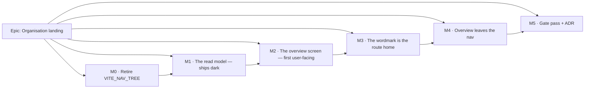

# Implementation Plan: The organisation landing page ("Overview")

- **Feature spec:** [`./feature-spec.md`](./feature-spec.md) — **Draft, awaiting approval**
- **Status:** Draft — **do not start; the spec is not approved**
- **Owner:** _(to be assigned)_

> **No feature flag** (spec D7). The rollback contract is the **commit boundary**: each milestone is
> one revertible PR, and M2 — the milestone that replaces the screen — is deliberately a single
> commit. A `VITE_` flag here would select between two whole screens (ADR-0088 D2 Class A) one week
> after the estate reached `classACap: 0`, and could not be switched off in a published image
> anyway (ADR-0088 D1).

## Breakdown

### Epic

**Organisation landing** — turn `/orgs/:orgSlug` from a static welcome card into a screen that
answers _"what changed"_ and _"what needs me"_ from data the system already persists, and make the
wordmark the route home. Roadmap theme: **Next → Product features**.

---

## Milestone 0 — Retire `VITE_NAV_TREE` and delete the stale branch

**Outcome:** the year-stale "The schedule editor arrives in an upcoming update" screen no longer
exists, and a flag misclassified in the register leaves the estate before the epic rewrites its host
file.
**Ships dark:** nothing user-facing changes — the flag is compiled ON in every published image
(ADR-0088 D1), so deleting its off-branch is a no-op for every user. There is no entry point to name
because there is no new capability (ADR-0081 §1).
**Journey:** none required (no user-facing capability). The **existing** base journey
`apps/web/e2e/` is the regression check and must pass unchanged.

#### Feature: flag retirement + register correction

> **Description:** delete `NAV_TREE_ENABLED` and both of its early-return branches; record the
> retirement and the fact that the register had it classified wrongly.
> **Complexity:** S
> **Dependencies:** none — this is deliberately first, so the epic never edits a file that still
> carries a false alternative.
> **Risks:** a hidden consumer → mitigated by deleting the constant and letting **typecheck** find
> every reference, which is the backstop the `VITE_LIBRARY_SCOPING` retirement note names as the one
> that actually worked.
> **Testing requirements:** `pnpm typecheck`, `pnpm test`, `pnpm check:flags`, and the base
> Playwright journey run locally (`scripts/e2e-local.sh web:base`) — not left to CI.

##### Task M0-T1 — Delete the flag and its branches (≈ one PR)

- **Description:** remove `NAV_TREE_ENABLED` from `apps/web/src/config/env.ts:126` and
  `VITE_NAV_TREE` from `apps/web/src/vite-env.d.ts`; delete the flag-off branch of
  `routes/authed-layout.tsx:14-31` (the whole `AuthedLayout` becomes `return <AppShell/>`, or the
  component collapses into the route); delete the flag-off card in `routes/org-home.tsx:33-64` and
  the `enabled:` guard at `:26`.
- **Complexity:** S
- **Dependencies:** none
- **Risks:** `AppHeader` (as opposed to `AppHeaderRow`) is **still used** by
  `chrome-band.tsx:27` on the `DESIGNED_CHROME_ENABLED`-off path — **do not delete it** with the
  layout. Verified before writing this task; stated because it is the obvious over-reach.
- **Testing:** typecheck is the primary instrument; add nothing new — there is no flag-off parity
  suite to convert, because none exists (searched: no `playwright*.config.ts` pins `VITE_NAV_TREE`,
  no unit test mocks `NAV_TREE_ENABLED`).
- **Development steps:**
  1. Delete the declaration in `env.ts` and `vite-env.d.ts`.
  2. Run `pnpm typecheck` and fix the three call sites it names.
  3. Collapse `AuthedLayout`; confirm `AppHeader` survives for the chrome-band-off path.
  4. Delete the stale card from `org-home.tsx`; the screen becomes the unconditional
     `WelcomeEmptyState` until M2 replaces it.
  5. Grep the tree for "arrives in an upcoming update" and confirm zero hits.
  6. `scripts/e2e-local.sh web:base`.

##### Task M0-T2 — Correct the register and record the finding

- **Description:** move `VITE_NAV_TREE` from `flags` to `retired` in
  `scripts/flag-retirement.json`, with a `note` recording **both** the retirement **and** that it was
  filed Class B while `authed-layout.tsx:15` was the Class A early-return shape — and that
  `check-flags.mjs:190`'s equality against `classACap` could not see it, because
  `detect-alternative-surfaces.mjs` is blind to early returns (the register's own `$classA-note`
  says so).
- **Complexity:** S
- **Dependencies:** M0-T1
- **Risks:** raising `classACap` — **do not**. Retiring in the same commit means the detected count
  stays 0 and the cap never moves; raising it would need an ADR (the register says so) for a flag
  that is leaving anyway.
- **Testing:** `pnpm check:flags` green with `classACap` unchanged at `0`.
- **Development steps:**
  1. Move the entry; write the note (retirement + classification correction + why no gate caught it).
  2. Run `pnpm check:flags`; confirm assertions 4/4a/4b pass (no declaration left behind).
  3. Add a `docs/DECISIONS.md` line for the classification finding — it is a fact about the _gate_,
     not just about this flag, and the next curator needs it.
  4. Changeset (patch; no user-visible change).

---

## Milestone 1 — The read model (ships dark)

**Outcome:** `GET /api/v1/organizations/:orgSlug/overview` returns the two sections' data, correctly
scoped, correctly permissioned, and **measured**.
**Ships dark:** deliberately. Nothing in the web app calls it; M2 is the milestone that surfaces it.
No entry point is claimed (ADR-0081 §1).
**Journey:** none at this milestone — there is no surface to drive. The API e2e suite
(`apps/api/test/`, Supertest against a real Postgres) is the equivalent gate and lands here.

#### Feature: the overview read model

> **Description:** a new `modules/overview/` — controller, service, repository, DTOs — modelled on
> `modules/recycle-bin` (org-wide read model, `client:read`, no writes).
> **Complexity:** L
> **Dependencies:** M0 (so the epic is not building on a file with a dead branch).
> **Risks:** the "recently changed" query is the whole epic's performance story → mitigated by
> designing the indexes with **database-architect first** and by a dedicated measurement task
> (M1-T2) whose numbers go in the ADR rather than in a sentence.
> **Testing requirements:** unit (service permission gating, section omission, actor resolution);
> API e2e for **all four roles** plus the cross-org 404; a measurement script.

##### Task M1-T1 — Design the indexes (database-architect) — **blocking**

- **Description:** hand the two candidate indexes (spec §4.4) to the **database-architect** agent
  together with the query, the existing indexes (`schema.prisma:1250` activities,
  `:1355` dependencies, `:836` plans) and the outer-set bound question. Take its design.
- **Complexity:** S (elapsed), but it is a **hard gate**
- **Dependencies:** none
- **Risks:** the agent returns nothing, fails, or is slow → **re-run it**. CLAUDE.md §19.3 and §20
  are explicit and unconditional: an unavailable agent is a reason to wait, never a reason to
  proceed, and deciding a change is too small to need it is exactly the judgement the agent exists to
  make. `csp_reports` is the recorded precedent for what hand-writing one costs.
- **Testing:** n/a (design task); its output is M1-T2's subject.
- **Development steps:**
  1. Launch database-architect with the query, the schema excerpts and the bound question.
  2. Record its answer, including any index it declines to add and why.
  3. If it proposes a denormalised column instead, bring that back as a spec amendment rather than
     absorbing it — §4.4 rejected one with reasons, and reversing that is a decision.

##### Task M1-T2 — Measure before shipping the query

- **Description:** seed a realistic organisation (the ADR-0066 catalogue's scale tier — 2,000-activity
  plans — plus a breadth case of many small plans), then `EXPLAIN (ANALYZE, BUFFERS)` the recently-changed
  query **with and without** each candidate index, and record p50/p95 for the whole endpoint.
- **Complexity:** M
- **Dependencies:** M1-T1
- **Risks:** measuring the wrong thing — a warm single-plan case says nothing about O(plans).
  Measure **both** axes (plan count and activity count) and say which dominates.
- **Testing:** the measurement itself; its numbers are the acceptance evidence for
  "p95 < 200 ms" (docs/PERFORMANCE.md).
- **Development steps:**
  1. Seed via `schedulepoint-seed` (the public REST API path — ADR-0066's point).
  2. `EXPLAIN (ANALYZE, BUFFERS)` the query in four configurations.
  3. Record the numbers **in the ADR draft**, including any that contradict the plan. Four
     consecutive epics have had a headline number falsified by their own measurement; assume this
     one will too and leave room to say so.
  4. If the lateral does not hold, raise it as a spec amendment (§4.4's rejected alternative) rather
     than quietly denormalising.

##### Task M1-T3 — Migration for the indexes

- **Description:** write the migration the architect designed (raw SQL for the partial predicates —
  Prisma cannot express `WHERE`), with the measured numbers in the migration's own comment, following
  the house convention (`schema.prisma:593-598` is the model: the index lives in the migration, and
  **no `@@index` is declared in the schema**, because a declared index the database does not have is
  what broke `prisma:check-drift`, TECH_DEBT #54).
- **Complexity:** S
- **Dependencies:** M1-T1, M1-T2
- **Risks:** declaring the partial index in `schema.prisma` → drift. Mitigated by the convention
  above and by `pnpm prisma:check-drift`.
- **Testing:** `pnpm prisma:check-drift`; the migration applies to a real database in the API e2e run.

##### Task M1-T4 — `OverviewRepository`

- **Description:** the four bounded reads and the actor resolution. Recently-changed via the lateral
  query; held locks; pending invitation count; expiring-deleted count. Actor resolution via
  `org_members ⨝ users` **scoped to the organisation**, one batched `id = ANY(...)`.
- **Complexity:** L
- **Dependencies:** M1-T3
- **Risks:** resolving actors through `users` directly would let this endpoint turn an arbitrary user
  id into a display name → the org-scoped join is the control, and there is a unit test asserting a
  non-member id resolves to `FORMER_MEMBER` rather than a name.
- **Testing:** unit tests for the ordering key (`GREATEST` across three sources, including the
  plan-created-only case), the archived exclusion, the soft-delete exclusion, and actor resolution
  (member / former member / null).
- **Development steps:**
  1. Repository with the soft-delete filter centralised (the `plan.repository.ts:62-64` pattern).
  2. Raw SQL for the lateral (Prisma has no lateral); parameterised — never string-built.
  3. Batched actor resolution.
  4. Unit tests, including a case that fails against a naive `plans.updated_at`-only ordering — the
     regression test for §0.1's finding.

##### Task M1-T5 — `OverviewService` + `OverviewController` + DTOs

- **Description:** `resolveScope` → `assertCan('client:read')` → the four reads, each **gated on the
  caller's own permission before it is issued**; project to the response DTO with the discriminated
  `changedBy` union and the omitted-not-zeroed counts.
- **Complexity:** M
- **Dependencies:** M1-T4
- **Risks:** issuing a read whose result the caller may not see, then filtering in the DTO — the
  filtering would be correct and the _cost_ would still be paid, and a later refactor could leak it.
  Gate before the read.
- **Testing:** unit (per-role gating; the section-omission matrix); API e2e for Org Admin / Planner /
  Contributor / Viewer, plus a cross-org 404 and an unauthenticated 401.
- **Development steps:**
  1. DTOs with `@ApiProperty`; the union documented in OpenAPI.
  2. Service with per-permission gating and named constants for the section sizes.
  3. Thin controller; register the module.
  4. Classify the route in the audit census's `UNAUDITED_ROUTES` with the written reason (spec §3).
  5. `docs/API.md` subsection; regenerate/verify the OpenAPI spec.
  6. `scripts/e2e-local.sh api` — **run it**, do not leave it to CI.

---

## Milestone 2 — The overview screen (**first user-facing milestone**)

**Outcome:** `/orgs/:orgSlug` shows the organisation name, "Recently changed" and — for writers —
"Needs your attention", with all five states designed.
**Entry point:** the **Overview** item in the organisation nav (`app-header.tsx:83`), and the URL
`/orgs/:orgSlug`, which is where every sign-in already lands. The item is still there at this
milestone **by design** — it does not leave until M4.
**Journey:** `apps/web/e2e-overview/overview.spec.ts`, its own CI step, landing **with this
milestone** (ADR-0081 §2 — the enforcement half). First step: sign in, land on `/orgs/:slug`, assert
the organisation name is the `<h1>` and that a plan edited by the test user appears in "Recently
changed" with that user's name.

#### Feature: the overview screen

> **Description:** `features/overview/` plus a rewritten `routes/org-home.tsx`.
> **Complexity:** L
> **Dependencies:** M1.
> **Risks:** (a) multiple `<h1>`s, because `CardTitle` renders one (`card.tsx:50`) → M2-T1;
> (b) the journey finding defects no unit suite can see — this is the _expected_ outcome, not a risk:
> every enablement journey in this repository's history has found something on its first run.
> **Testing requirements:** unit for every state and both empties; a11y (axe) on the settled screen;
> the flag-on journey.

##### Task M2-T1 — `CardTitle` gains a heading level

- **Description:** add `level?: 1 | 2 | 3` to `CardTitle`, **defaulting to `1`** so every existing
  consumer renders byte-identically.
- **Complexity:** S
- **Dependencies:** none
- **Risks:** changing the default would silently restructure every card in the product → the default
  is pinned by a test asserting `<h1>` with no prop.
- **Testing:** unit; run the **whole** web suite — this is a shared primitive.
- **Development steps:**
  1. Add the prop; keep the `jsx-a11y/heading-has-content` suppression.
  2. Test: no prop → `<h1>`; `level={2}` → `<h2>`.
  3. Send to **component-reviewer** (a `components/ui` change).
  4. `docs/DESIGN_SYSTEM.md` note.

##### Task M2-T2 — Query hook + relative-time model

- **Description:** `overviewQueryOptions(orgSlug)` / `useOrgOverview()`; a pure
  `formatRelative(instant, now)` that floors at "just now" and never renders a future time.
- **Complexity:** S
- **Dependencies:** M1-T5
- **Risks:** a relative time is a poor primary for people accountable for dates (UX_STANDARDS §6) →
  the exact instant rides in `<time datetime>` and in the row's accessible text, never only as a
  hover title.
- **Testing:** unit against a **fixed clock** (docs/TESTING.md: no wall-clock reliance) — boundaries
  at 0 s, 59 s, 60 s, 23 h, 24 h, 6 d, 7 d, and a future instant.

##### Task M2-T3 — "Recently changed" section

- **Description:** heading, list, row (plan · `project · client` · actor · time · status), skeleton,
  empty, error+retry, and a settled result-count announcement.
- **Complexity:** M
- **Dependencies:** M2-T1, M2-T2
- **Risks:** the two empties collapsing into one message — "nothing has changed yet" and "this
  organisation has no plans" are different facts, and the ADR-0073 C1 review caught exactly this
  collapse in a live region.
- **Testing:** unit for all five states, both empties, the three `changedBy` kinds, and the archived
  exclusion rendering.

##### Task M2-T4 — "Needs your attention" section

- **Description:** the four item kinds, lock-requests first; **returns `null`** when the reader can
  hold none; a settled "Nothing needs you right now." when they can and have none.
- **Complexity:** M
- **Dependencies:** M2-T2
- **Risks:** rendering an empty box for a Viewer — the defect this task exists to avoid. Pin it with
  a test asserting the heading is **absent** from the DOM for Viewer and Contributor, not merely
  hidden.
- **Testing:** unit across the role matrix; retention-off asserts the expiry item is absent rather
  than zero.

##### Task M2-T5 — The three empty states, role-aware

- **Description:** new organisation (writer / non-writer copy), clients-but-no-plans, and the
  decision on `ScheduleBackdrop` — keep it (moved) or delete it with the file. **Not both.**
- **Complexity:** M
- **Dependencies:** M2-T1
- **Risks:** leaving `welcome-empty-state.tsx` orphaned → the task's definition of done includes
  deleting it or moving its one reusable part, and `welcome-empty-state.test.tsx` goes with whichever
  happens.
- **Testing:** unit per state × writer/non-writer.

##### Task M2-T6 — Rewrite `routes/org-home.tsx` + the journey

- **Description:** the thin host: `<h1>{organisation.name}</h1>` then the sections, inside the
  shell's existing `<main>` (**no new landmark**). Plus `apps/web/e2e-overview/` and its CI step.
- **Complexity:** M
- **Dependencies:** M2-T3, M2-T4, M2-T5
- **Risks:** the journey will find defects the unit suite cannot — a wrong locator, an accessible
  name that differs from the assumption, a section collapsed at the configured viewport. Budget for
  it; that is the milestone working, not failing.
- **Testing:** journey — sign in → land → `<h1>` is the organisation name → edit an activity in a
  seeded plan → return → the plan is listed with the actor → click it → the workspace opens. Plus an
  axe pass on the settled screen. Run locally via `scripts/e2e-local.sh web:overview` **before**
  pushing.
- **Development steps:**
  1. Rewrite the route component.
  2. Wire the CI step beside the other `e2e-*` suites.
  3. Write the journey; **run it locally**; fix what it finds and record each finding.
  4. Changeset (minor — user-visible).

---

## Milestone 3 — The wordmark is the route home

**Outcome:** the **SchedulePoint** wordmark navigates to the organisation overview from every screen
in the shell, including a plan.
**Entry point:** the wordmark in the chrome band — accessible name "SchedulePoint — organisation
overview".
**Journey:** extends `apps/web/e2e-overview/` — from a plan workspace, activate the wordmark and
assert arrival at `/orgs/:slug`; and on the landing, assert `aria-current="page"`.

#### Feature: wordmark home link

> **Description:** wrap `BrandMark` in a `<Link>` **at the header call site**.
> **Complexity:** S
> **Dependencies:** M2 (the destination must be worth reaching first).
> **Risks:** breaking the public auth screens, which render the same `BrandMark`
> (`brand-panel.tsx:72`) with no session and no route home → the link is added in `app-header.tsx`,
> never inside `BrandMark`, and there is a test asserting `brand-panel` renders no link.
> **Testing requirements:** unit (org route → `/orgs/:slug`; no-org route → `/`; `aria-current` on
> the landing; public panel unaffected); a11y; journey.

##### Task M3-T1 — Link the wordmark

- **Description:** in `HeaderContents`, wrap `<BrandMark/>` in a `<Link>` to `/orgs/$orgSlug` when
  `orgSlug` is present and to `/` otherwise (`/account`, `/me/activity`, `/onboarding` and `/staff`
  carry no `orgSlug` — `app/router.tsx`). `aria-current="page"` on exact match.
- **Complexity:** S
- **Dependencies:** none
- **Risks:** the accessible name. `aria-label="SchedulePoint — organisation overview"` **contains**
  the visible text "SchedulePoint", so WCAG 2.5.3 Label in Name holds. Send it to
  **accessibility-reviewer** rather than deciding it alone.
- **Testing:** unit for all four cases; axe.
- **Development steps:**
  1. Add the `<Link>`; derive the target from `orgSlug`.
  2. Hover/focus treatment from `chrome`-scope rebound tokens only — **no colour literals** (the
     ADR-0055 lint rule). If a new token pair is needed, it lands in `token-contrast.test.ts`
     **before** the CSS (ADR-0083's ordering rule).
  3. Test that `brand-panel.tsx`'s usage renders no anchor.
  4. Extend the journey.

---

## Milestone 4 — "Overview" leaves the nav

**Outcome:** the organisation nav drops to five items; the wordmark is the route home.
**Entry point:** unchanged — the wordmark, delivered in M3. This milestone **removes** an entry
point rather than adding one, which is why it is last of the user-facing four.
**Journey:** extends `apps/web/e2e-overview/` — assert no nav link named "Overview", and that the
landing is still reachable from a plan.

#### Feature: nav item removal

> **Description:** delete the `<Link>` at `app-header.tsx:77-84`.
> **Complexity:** S
> **Dependencies:** M3 — the labelled route home does not go until the conventional one exists.
> **Risks:** discoverability (spec Q3). Mitigated by ordering and by the fact that restoring the item
> is a one-line revert; the first week of use is the measurement.
> **Testing requirements:** unit (nav renders five items in order); journey; update the base journey
> if it locates anything by that link.

##### Task M4-T1 — Remove the item and sweep the journeys

- **Description:** delete the link; then **run every Playwright suite**, not only the one CI names.
- **Complexity:** S
- **Dependencies:** M3
- **Risks:** a journey navigating via "Overview". ADR-0091's retrospective records three journeys
  breaking across one label change, each found by CI rather than by the author, because only the
  suite CI named was fixed. The rule it wrote is: **after any label or layout change, run every
  journey, and locate a control by a stable attribute rather than by its copy.** Apply it here.
- **Testing:** grep the `e2e*` trees for `Overview` before touching anything; sweep all suites
  locally.
- **Development steps:**
  1. Grep first; convert any journey that navigates by the label.
  2. Delete the link.
  3. Sweep every suite locally.
  4. `docs/TECH_DEBT.md` #23 updated — partially addressed, with what remains.
  5. Changeset (minor).

---

## Milestone 5 — Gate pass, ADR, documentation

**Outcome:** the specialist reviews are folded, the ADR is filed, and the docs match the code.
**Ships dark:** no new capability; it is the quality gate over the combined diff.
**Journey:** the full sweep, on every `e2e-*` suite.

#### Feature: enablement review

> **Description:** the deferred specialist reviews over the whole epic diff, then the ADR.
> **Complexity:** M
> **Dependencies:** M4.
> **Risks:** treating this as a formality. Six consecutive epics found blocking defects here that a
> human read had passed, and the recurring shape is **one correct pattern applied to a control and
> not its neighbour**. Expect that shape; look for it specifically.
> **Testing requirements:** every blocking finding folded with a regression test **verified to fail
> against the old code first**.

##### Task M5-T1 — Six specialist reviews

- **Description:** **security-reviewer** (org scoping, actor resolution, the no-id property),
  **backend-performance-reviewer** (the lateral, the indexes, N+1, the LCP cost — re-deriving M1-T2's
  numbers from the final code rather than trusting them), **api-reviewer** (envelope, status codes,
  OpenAPI, the omitted-not-zeroed counts), **accessibility-reviewer** (headings, the wordmark's name
  and `aria-current`, live-region counts, focus), **ux-reviewer** (copy, hierarchy, the five states,
  the two distinct empties), **component-reviewer** (`CardTitle`, token usage, no one-offs).
- **Complexity:** M
- **Dependencies:** M4
- **Risks:** a reviewer being partly wrong and being followed anyway — ADR-0095 records exactly that.
  Check each finding against the code before folding it.
- **Testing:** a regression test per blocking finding, red-first.

##### Task M5-T2 — File the ADR

- **Description:** file the ADR. **Check the next free number at filing time** — ADR-0071 is the
  record of what happens when a number is assumed, and ADR-0079 is the record of one being taken
  between the plan and the milestone. Record a collision rather than routing around it.
- **Complexity:** S
- **Dependencies:** M5-T1
- **Risks:** the ADR-0071 failure — filing it in `docs/specs/` and never moving it to `docs/adr/`.
  The task is not done until `docs/adr/README.md` lists it.
- **Testing:** `pnpm check:doc-links`, `pnpm check:counts`, `pnpm check:claims` (every dependency
  citation registered).
- **Development steps:**
  1. Write the ADR: the `plans.updated_at` finding and its evidence; the six rejected sections; the
     no-flag decision; the `VITE_NAV_TREE` classification correction; **the measured numbers,
     including any that contradicted this plan**.
  2. Add it to `docs/adr/README.md` and the `CLAUDE.md` §16 register.
  3. Update `docs/API.md`, `docs/FRONTEND_ARCHITECTURE.md`, `docs/TECH_DEBT.md`, `docs/ROADMAP.md`.
  4. `pnpm check:counts`.

---

## Sequencing & slices

| Slice                  | Releasable on its own?              | Why it is ordered here                                                                                |
| ---------------------- | ----------------------------------- | ----------------------------------------------------------------------------------------------------- |
| **M0** flag retirement | Yes — no user-visible change        | First, so the epic never edits a file carrying a false alternative                                    |
| **M1** read model      | Yes — dark, nothing calls it        | The endpoint must be measured before a screen depends on it                                           |
| **M2** the screen      | Yes — the nav item still reaches it | The first user-facing slice, and the one that must land as **one commit** (the rollback contract, D7) |
| **M3** wordmark link   | Yes — additive                      | The conventional route home must exist before the labelled one goes                                   |
| **M4** nav removal     | Yes                                 | Last of the user-facing four, deliberately                                                            |
| **M5** gates + ADR     | Yes                                 | Over the combined diff, where cross-cutting defects live                                              |

**`main` stays releasable at every boundary.** M2's single-commit rule is the mitigation that
replaces a feature flag; if it has to be split for review, the split must not leave the screen half
replaced across a merge.

## Definition of Done (per task)

Each task's PR satisfies the Feature Completion Criteria in [`docs/PROCESS.md`](../../PROCESS.md).
Two are called out because they are the ones most often written rather than run:

- **The pre-push gate was run** — `pnpm lint && pnpm typecheck && pnpm test`, **plus**
  `scripts/e2e-local.sh api` for M1 (it touches `apps/api`) and `scripts/e2e-local.sh web:overview`
  for M2–M4. CI is the second opinion, never the first.
- **Every decision-bearing claim names its evidence** (ADR-0076) — the command, the file and line, or
  the test. Including claims inherited from this plan: **this plan is not evidence.**

## Risks & assumptions (rollup)

| Risk / assumption                                                | Likelihood         | Impact   | Mitigation                                                                                                                                                                                                                         |
| ---------------------------------------------------------------- | ------------------ | -------- | ---------------------------------------------------------------------------------------------------------------------------------------------------------------------------------------------------------------------------------- |
| The lateral query does not hold at a realistic organisation size | med                | high     | M1-T2 measures both axes before the screen exists; §4.4's rejected denormalisation is reconsidered **on evidence**, as a spec amendment                                                                                            |
| The two indexes are not enough / are the wrong shape             | med                | med      | database-architect designs them (M1-T1, blocking); `EXPLAIN ANALYZE` with and without                                                                                                                                              |
| "Recently changed" reads as an activity feed and disappoints     | med                | med      | The heading and caption say "Plans your organisation has worked on recently"; §5 states the three limits; the ADR records what is deliberately not built                                                                           |
| A Viewer or Contributor gets an empty-feeling landing            | **high**           | med      | Accepted, and it is Critical Question **Q2**. "Recently changed" serves everyone; the attention section is omitted rather than shown empty. The client-side "Jump back in" list is the cheap answer if the product owner wants one |
| Removing "Overview" hurts discoverability                        | med                | low      | M3 before M4; `aria-current` preserved; restoring the item is one line, and the first week is the measurement                                                                                                                      |
| Multiple `<h1>`s from `CardTitle`                                | high without M2-T1 | med      | M2-T1, defaulting to `1` so nothing else moves                                                                                                                                                                                     |
| A journey breaks elsewhere on the label change                   | **high**           | med      | ADR-0091's rule: grep first, sweep every suite, locate by attribute not copy (M4-T1)                                                                                                                                               |
| Actor resolution leaks a non-member's name                       | low                | **high** | Resolve through `org_members` scoped to the org, never `users`; unit test pins `FORMER_MEMBER`                                                                                                                                     |
| The gate pass finds blocking defects                             | **high**           | med      | Expected. Six consecutive epics did. M5 is budgeted for it, red-first regression tests included                                                                                                                                    |
| An assumption in this plan is wrong                              | **high**           | varies   | Four consecutive epics had a headline number falsified by their own measurement. Verify before relying; record the correction in place rather than deleting it                                                                     |
