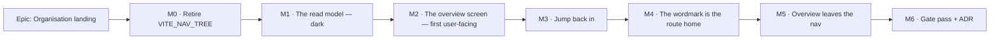

# Implementation Plan: The organisation landing page ("Overview")

- **Feature spec:** [`./feature-spec.md`](./feature-spec.md) — **Approved 2026-08-18**
- **Status:** **Approved — ready to build**
- **Owner:** _(to be assigned)_
- **ADR this epic files:** **ADR-0098.** The spec's draft reserved 0097; that number went to the
  design-system rewrite. Recorded in spec §"Related ADRs" rather than quietly swapped.

> **Two numbering notes, because both are the kind of thing that gets read wrong later.**
>
> 1. **Nav removal moved from M4 to M5, and that is a renumbering, not a change of plan.** The
>    approval message says "Overview leaving the nav at M4", which is this plan's numbering **before**
>    "Jump back in" was inserted as M3. The **order** is unchanged and is the thing that was agreed:
>    screen → jump back in → wordmark link → nav removal. Nothing leaves the nav until the wordmark
>    reaches the landing.
> 2. **This epic runs alongside ADR-0097** (the design-system rewrite) and does **not** block on it.
>    Spec §0.3 names the four primitives this screen needs that the vocabulary does not have, and
>    every task that would otherwise invent one says what to do if ADR-0097 has landed it first.

> **No feature flag** (spec D7). The rollback contract is the **commit boundary**: each milestone is
> one revertible PR, and M2 — the milestone that replaces the screen — is deliberately a single
> commit. A `VITE_` flag here would select between two whole screens (ADR-0088 D2 Class A) one week
> after the estate reached `classACap: 0`, and could not be switched off in a published image
> anyway (ADR-0088 D1).

> **The pre-push gate, in the form this epic needs it.** `pnpm lint && pnpm typecheck && pnpm test`,
> **plus**:
>
> - `scripts/e2e-local.sh api` — for **M1** (it touches `apps/api`) and **M3** (it adds a query
>   parameter).
> - `scripts/e2e-local.sh web` — **for every milestone that changes a screen: M0, M2, M3, M4, M5.**
>   This is the **base** journey, covering the shipped default configuration. It became runnable
>   locally only on **2026-08-18** (`scripts/e2e-local.sh:95-111`, commit `9f1147b`): every other
>   target maps `web:<suite>` → `test:e2e:<suite>` and the base is `test:e2e` with **no suffix**, so
>   `web` was an unknown target and the one suite covering the default screen was the one the
>   documented gate could not run. That is how `e2e/recently-deleted.spec.ts` reached CI still
>   asserting a screen ADR-0096 had replaced. **This plan's own first draft said
>   `scripts/e2e-local.sh web:base`, which resolves to a script that does not exist** — the same
>   mistake, in the document written to prevent it.
> - `scripts/e2e-local.sh web:overview` — the epic's own journey, from M2 onwards.

## Breakdown

### Epic

**Organisation landing** — turn `/orgs/:orgSlug` from a static welcome card into a screen that
answers _"what changed"_, _"where was I"_ and _"what needs me"_ from data the system already holds,
and make the wordmark the route home. Roadmap theme: **Next → Product features**.

---

## Milestone 0 — Retire `VITE_NAV_TREE` and delete the stale branch

**Outcome:** the year-stale "The schedule editor arrives in an upcoming update" screen no longer
exists, and a flag misclassified in the register leaves the estate before the epic rewrites its host
file.
**Ships dark:** nothing user-facing changes — the flag is compiled ON in every published image
(ADR-0088 D1), so deleting its off-branch is a no-op for every user. There is no entry point to name
because there is no new capability (ADR-0081 §1).
**Journey:** none added. The **base** journey is the regression check and must pass unchanged —
`scripts/e2e-local.sh web`.

#### Feature: flag retirement + register correction

> **Description:** delete `NAV_TREE_ENABLED` and both of its early-return branches; record the
> retirement and the fact that the register had it classified wrongly.
> **Complexity:** S
> **Dependencies:** none — this is deliberately first, so the epic never edits a file that still
> carries a false alternative.
> **Risks:** a hidden consumer → mitigated by deleting the constant and letting **typecheck** find
> every reference, which is the backstop the `VITE_LIBRARY_SCOPING` retirement note names as the one
> that actually worked.
> **Testing requirements:** `pnpm typecheck`, `pnpm test`, `pnpm check:flags`, and
> `scripts/e2e-local.sh web` — run locally, not left to CI.

##### Task M0-T1 — Delete the flag and its branches (≈ one PR)

- **Description:** remove `NAV_TREE_ENABLED` from `apps/web/src/config/env.ts:126` and
  `VITE_NAV_TREE` from `apps/web/src/vite-env.d.ts`; delete the flag-off branch of
  `routes/authed-layout.tsx:14-31` (the whole `AuthedLayout` becomes `return <AppShell/>`, or the
  component collapses into the route); delete the flag-off card in `routes/org-home.tsx:33-64` and
  the `enabled:` guard at `:26`.
- **Complexity:** S
- **Dependencies:** none
- **Risks:** `AppHeader` (as opposed to `AppHeaderRow`) is **still used** by `chrome-band.tsx:27` on
  the `DESIGNED_CHROME_ENABLED`-off path — **do not delete it** with the layout. Verified before
  writing this task; stated because it is the obvious over-reach.
- **Testing:** typecheck is the primary instrument; add nothing new — there is no flag-off parity
  suite to convert, because none exists (searched: no `playwright*.config.ts` pins `VITE_NAV_TREE`,
  no unit test mocks `NAV_TREE_ENABLED`).
- **Development steps:**
  1. Delete the declaration in `env.ts` and `vite-env.d.ts`.
  2. Run `pnpm typecheck` and fix the three call sites it names.
  3. Collapse `AuthedLayout`; confirm `AppHeader` survives for the chrome-band-off path.
  4. Delete the stale card from `org-home.tsx`; the screen becomes the unconditional
     `WelcomeEmptyState` until M2 replaces it.
  5. Grep the tree for "arrives in an upcoming update" and confirm zero hits.
  6. `scripts/e2e-local.sh web`.

##### Task M0-T2 — Correct the register and record the finding

- **Description:** move `VITE_NAV_TREE` from `flags` to `retired` in
  `scripts/flag-retirement.json`, with a `note` recording **both** the retirement **and** that it was
  filed Class B while `authed-layout.tsx:15` was the Class A early-return shape — and that
  `check-flags.mjs:190`'s equality against `classACap` could not see it, because
  `detect-alternative-surfaces.mjs` is blind to early returns (the register's own `$classA-note`
  says so).
- **Complexity:** S
- **Dependencies:** M0-T1
- **Risks:** raising `classACap` — **do not**. Retiring in the same commit means the detected count
  stays 0 and the cap never moves; raising it would need an ADR (the register says so) for a flag
  that is leaving anyway.
- **Testing:** `pnpm check:flags` green with `classACap` unchanged at `0`.
- **Development steps:**
  1. Move the entry; write the note (retirement + classification correction + why no gate caught it).
  2. Run `pnpm check:flags`; confirm assertions 4/4a/4b pass (no declaration left behind).
  3. Add a `docs/DECISIONS.md` line for the classification finding — it is a fact about the _gate_,
     not just about this flag, and the next curator needs it.
  4. Changeset (patch; no user-visible change).

---

## Milestone 1 — The read model (ships dark)

**Outcome:** `GET /api/v1/organizations/:orgSlug/overview` returns the two server-derived sections,
correctly scoped, correctly permissioned, and **measured**.
**Ships dark:** deliberately. Nothing in the web app calls it; M2 is the milestone that surfaces it.
No entry point is claimed (ADR-0081 §1).
**Journey:** none at this milestone — there is no surface to drive. The API e2e suite
(`apps/api/test/`, Supertest against a real Postgres) is the equivalent gate and lands here:
`scripts/e2e-local.sh api`.

#### Feature: the overview read model

> **Description:** a new `modules/overview/` — controller, service, repository, DTOs — modelled on
> `modules/recycle-bin` (org-wide read model, `client:read`, no writes).
> **Complexity:** L
> **Dependencies:** M0 (so the epic is not building on a file with a dead branch).
> **Risks:** the "recently changed" query is the whole epic's performance story → mitigated by
> designing the indexes with **database-architect first** and by a dedicated measurement task
> (M1-T2) whose numbers go in the ADR rather than in a sentence.
> **Testing requirements:** unit (service permission gating, section omission, actor resolution);
> API e2e for **all four roles** plus the cross-org 404; a measurement script.

##### Task M1-T1 — Design the indexes (database-architect) — **blocking**

- **Description:** hand the two candidate indexes (spec §4.4) to the **database-architect** agent
  together with the query, the existing indexes (`schema.prisma:1250` activities,
  `:1355` dependencies, `:836` plans) and the outer-set bound question. Take its design.
- **Complexity:** S (elapsed), but it is a **hard gate**
- **Dependencies:** none
- **Risks:** the agent returns nothing, fails, or is slow → **re-run it**. CLAUDE.md §19.3 and §20
  are explicit and unconditional: an unavailable agent is a reason to wait, never a reason to
  proceed, and deciding a change is too small to need it is exactly the judgement the agent exists to
  make. `csp_reports` is the recorded precedent for what hand-writing one costs. The product owner
  restated this instruction when approving the spec — **before a line of SQL is written.**
- **Testing:** n/a (design task); its output is M1-T2's subject.
- **Development steps:**
  1. Launch database-architect with the query, the schema excerpts and the bound question.
  2. Record its answer, including any index it declines to add and why.
  3. If it proposes a denormalised column instead, bring that back as a spec amendment rather than
     absorbing it — §4.4 rejected one with reasons, and reversing that is a decision.

##### Task M1-T2 — Measure **before and after**

- **Description:** seed a realistic organisation (the ADR-0066 catalogue's scale tier —
  2,000-activity plans — plus a breadth case of many small plans), then `EXPLAIN (ANALYZE, BUFFERS)`
  the recently-changed query **with and without** each candidate index, and record p50/p95 for the
  whole endpoint in both states.
- **Complexity:** M
- **Dependencies:** M1-T1
- **Risks:** measuring the wrong thing — a warm single-plan case says nothing about O(plans).
  Measure **both** axes (plan count and activity count) and say which dominates. Also measure the
  **index's own cost**: size on disk and the write amplification on `activities`, which is the most
  frequently written table in the product. ADR-0053 M4 declined an index that saved 0.14 ms for
  1,296 kB; that comparison is only available if both sides are measured.
- **Testing:** the measurement itself; its numbers are the acceptance evidence for "p95 < 200 ms"
  (docs/PERFORMANCE.md).
- **Development steps:**
  1. Seed via `schedulepoint-seed` (the public REST API path — ADR-0066's point).
  2. `EXPLAIN (ANALYZE, BUFFERS)` in four configurations; record index size and the insert cost.
  3. Record the numbers **in the ADR draft**, including any that contradict this plan. Four
     consecutive epics have had a headline number falsified by their own measurement; assume this one
     will too and leave room to say so.
  4. If the lateral does not hold, raise it as a spec amendment (§4.4's rejected alternative) rather
     than quietly denormalising.

##### Task M1-T3 — Migration for the indexes

- **Description:** write the migration the architect designed (raw SQL for the partial predicates —
  Prisma cannot express `WHERE`), with the measured numbers in the migration's own comment, following
  the house convention (`schema.prisma:593-598` is the model: the index lives in the migration, and
  **no `@@index` is declared in the schema**, because a declared index the database does not have is
  what broke `prisma:check-drift`, TECH_DEBT #54).
- **Complexity:** S
- **Dependencies:** M1-T1, M1-T2
- **Risks:** declaring the partial index in `schema.prisma` → drift. Mitigated by the convention
  above and by `pnpm prisma:check-drift`.
- **Testing:** `pnpm prisma:check-drift`; the migration applies to a real database in the API e2e run.

##### Task M1-T4 — `OverviewRepository`

- **Description:** the four bounded reads and the actor resolution. Recently-changed via the lateral
  query; held locks; pending invitation count; expiring-deleted count. Actor resolution via
  `org_members ⨝ users` **scoped to the organisation**, one batched `id = ANY(...)`.
- **Complexity:** L
- **Dependencies:** M1-T3
- **Risks:** resolving actors through `users` directly would let this endpoint turn an arbitrary user
  id into a display name → the org-scoped join is the control, and there is a unit test asserting a
  non-member id resolves to `FORMER_MEMBER` rather than a name.
- **Testing:** unit tests for the ordering key (`GREATEST` across three sources, including the
  plan-created-only case), the archived exclusion, the soft-delete exclusion, and actor resolution
  (member / former member / null).
- **Development steps:**
  1. Repository with the soft-delete filter centralised (the `plan.repository.ts:62-64` pattern).
  2. Raw SQL for the lateral (Prisma has no lateral); parameterised — never string-built.
  3. Batched actor resolution.
  4. Unit tests, including a case that fails against a naive `plans.updated_at`-only ordering — the
     regression test for spec §0.1's finding.

##### Task M1-T5 — `OverviewService` + `OverviewController` + DTOs

- **Description:** `resolveScope` → `assertCan('client:read')` → the four reads, each **gated on the
  caller's own permission before it is issued**; project to the response DTO with the discriminated
  `changedBy` union and the omitted-not-zeroed counts.
- **Complexity:** M
- **Dependencies:** M1-T4
- **Risks:** issuing a read whose result the caller may not see, then filtering in the DTO — the
  filtering would be correct and the _cost_ would still be paid, and a later refactor could leak it.
  Gate before the read.
- **Testing:** unit (per-role gating; the section-omission matrix); API e2e for Org Admin / Planner /
  Contributor / Viewer, plus a cross-org 404 and an unauthenticated 401.
- **Development steps:**
  1. DTOs with `@ApiProperty`; the union documented in OpenAPI.
  2. Service with per-permission gating and named constants for the section sizes.
  3. Thin controller; register the module.
  4. Classify the route in the audit census's `UNAUDITED_ROUTES` with the written reason (spec §3).
  5. `docs/API.md` subsection; regenerate/verify the OpenAPI spec.
  6. `scripts/e2e-local.sh api` — **run it**, do not leave it to CI.

---

## Milestone 2 — The overview screen (**first user-facing milestone**)

**Outcome:** `/orgs/:orgSlug` shows the organisation name, "Recently changed" and — for writers —
"Needs your attention", with all five states designed.
**Entry point:** the **Overview** item in the organisation nav (`app-header.tsx:83`), and the URL
`/orgs/:orgSlug`, which is where every sign-in already lands. The item is still there at this
milestone **by design** — it does not leave until M5.
**Journey:** `apps/web/e2e-overview/overview.spec.ts`, its own CI step, landing **with this
milestone** (ADR-0081 §2 — the enforcement half). First step: sign in, land on `/orgs/:slug`, assert
the organisation name is the `<h1>` and that a plan edited by the test user appears in "Recently
changed" with that user's name.
**Also run:** `scripts/e2e-local.sh web` — this milestone replaces the default landing screen, which
is exactly what the base journey covers.

#### Feature: the overview screen

> **Description:** `features/overview/` plus a rewritten `routes/org-home.tsx`.
> **Complexity:** L
> **Dependencies:** M1.
> **Risks:** (a) multiple `<h1>`s, because `CardTitle` renders one (`card.tsx:50`) → M2-T1;
> (b) the journey finding defects no unit suite can see — this is the _expected_ outcome, not a risk:
> every enablement journey in this repository's history has found something on its first run.
> **Testing requirements:** unit for every state and both empties; a11y (axe) on the settled screen;
> the flag-on journey; the base journey.

##### Task M2-T1 — A section heading rank (**check ADR-0097 first**)

- **Description:** the screen needs sections with a real heading rank below the page `<h1>`.
  **First action: check whether ADR-0097 has landed a section archetype.** If it has, consume it and
  **do not do the rest of this task.** If it has not, the bridge is: add `level?: 1 | 2 | 3` to
  `CardTitle`, **defaulting to `1`** so every existing consumer renders byte-identically.
- **Complexity:** S
- **Dependencies:** none (but see the first action)
- **Risks:** (a) changing the default would silently restructure every card in the product → the
  default is pinned by a test asserting `<h1>` with no prop; (b) **the bridge outliving its reason**
  → if the prop is added, its docblock cites spec §0.3 and says it is a stand-in for the section
  archetype, so ADR-0097's author can find it.
- **Testing:** unit; run the **whole** web suite — this is a shared primitive.
- **Development steps:**
  1. Check ADR-0097's status. If the archetype exists, use it and stop.
  2. Otherwise add the prop; keep the `jsx-a11y/heading-has-content` suppression.
  3. Test: no prop → `<h1>`; `level={2}` → `<h2>`.
  4. Send to **component-reviewer** (a `components/ui` change) **and tell `ui-architect`**, because a
     patch to a primitive it is redesigning is information it needs.
  5. `docs/DESIGN_SYSTEM.md` note.

##### Task M2-T2 — Query hook + relative-time model

- **Description:** `overviewQueryOptions(orgSlug)` / `useOrgOverview()`; a pure
  `formatRelative(instant, now)` that floors at "just now" and never renders a future time.
- **Complexity:** S
- **Dependencies:** M1-T5
- **Risks:** a relative time is a poor primary for people accountable for dates (UX_STANDARDS §6) →
  the exact instant rides in `<time datetime>` and in the row's accessible text, never only as a
  hover title.
- **Testing:** unit against a **fixed clock** (docs/TESTING.md: no wall-clock reliance) — boundaries
  at 0 s, 59 s, 60 s, 23 h, 24 h, 6 d, 7 d, and a future instant.

##### Task M2-T3 — "Recently changed" section

- **Description:** heading, list, row (plan · `project · client` · actor · time · status), skeleton,
  empty, error+retry, and a settled result-count announcement.
  **Two of those have no primitive** (spec §0.3): there is no `Skeleton` in `components/ui/` at all,
  and no `EmptyState` (`docs/TECH_DEBT.md` #21(d)). **Check ADR-0097 first**; if neither has landed,
  build both **inside `features/overview/`, not `components/ui/`**, each with a docblock citing
  §0.3 — a stand-in that is visibly a stand-in, rather than a fifth pattern acquiring squatters'
  rights. The row is a **list of links, not a `DataTable`**: `DataTable` renders a real `<table>`,
  and this is not tabular data.
- **Complexity:** M
- **Dependencies:** M2-T1, M2-T2
- **Risks:** (a) the two empties collapsing into one message — "nothing has changed yet" and "this
  organisation has no plans" are different facts, and the ADR-0073 C1 review caught exactly this
  collapse in a live region; (b) **copy that promises more than the data holds** → the strings come
  from spec §2's copy contract, and the task is not done until every string on the screen appears in
  its "allowed" column or is added to it deliberately.
- **Testing:** unit for all five states, both empties, the three `changedBy` kinds, and the archived
  exclusion rendering.

##### Task M2-T4 — "Needs your attention" section

- **Description:** the four item kinds, lock-requests first; **returns `null`** when the reader can
  hold none; a settled "Nothing needs you right now." when they can and have none.
  Tone is **`info`**, which already exists (`notice-strip.tsx:29`) — **not** `destructive`. "You are
  holding the editing lock" is a prompt, not a failure, and this epic does **not** need a new tone
  (spec §0.3 records that being checked before it was requested).
- **Complexity:** M
- **Dependencies:** M2-T2
- **Risks:** rendering an empty box for a Viewer — the defect this task exists to avoid. Pin it with
  a test asserting the heading is **absent** from the DOM for Viewer and Contributor, not merely
  hidden.
- **Testing:** unit across the role matrix; retention-off asserts the expiry item is absent rather
  than zero.

##### Task M2-T5 — The three empty states, role-aware

- **Description:** new organisation (writer / non-writer copy), clients-but-no-plans, and the
  decision on `ScheduleBackdrop` — keep it (moved) or delete it with the file. **Not both.**
  These are the **three empty states** spec §0.3 names as the strongest case for an `EmptyState`
  primitive, and they are the first thing a new customer sees. Same rule as M2-T3: consume ADR-0097's
  if it exists; otherwise a labelled stand-in inside `features/overview/`.
- **Complexity:** M
- **Dependencies:** M2-T1
- **Risks:** (a) leaving `welcome-empty-state.tsx` orphaned → the task's definition of done includes
  deleting it or moving its one reusable part, and `welcome-empty-state.test.tsx` goes with whichever
  happens; (b) **inventing bespoke visual treatment for the new-organisation screen** — it is the
  most tempting screen in the product to decorate, and it is being redesigned. Structure and copy
  here; ADR-0097 decides how it looks.
- **Testing:** unit per state × writer/non-writer.

##### Task M2-T6 — Rewrite `routes/org-home.tsx` + the journey

- **Description:** the thin host: `<h1>{organisation.name}</h1>` then the sections, inside the
  shell's existing `<main>` (**no new landmark**). Plus `apps/web/e2e-overview/` and its CI step.
- **Complexity:** M
- **Dependencies:** M2-T3, M2-T4, M2-T5
- **Risks:** the journey will find defects the unit suite cannot — a wrong locator, an accessible
  name that differs from the assumption, a section collapsed at the configured viewport. Budget for
  it; that is the milestone working, not failing.
- **Testing:** journey — sign in → land → `<h1>` is the organisation name → edit an activity in a
  seeded plan → return → the plan is listed with the actor → click it → the workspace opens. Plus an
  axe pass on the settled screen.
- **Development steps:**
  1. Rewrite the route component.
  2. Wire the CI step beside the other `e2e-*` suites.
  3. Write the journey; **run it locally** (`scripts/e2e-local.sh web:overview`); fix what it finds
     and record each finding.
  4. **Run the base journey** (`scripts/e2e-local.sh web`) — this task replaces the screen it
     covers.
  5. Changeset (minor — user-visible).

---

## Milestone 3 — "Jump back in"

**Outcome:** the landing offers the plans this reader was recently working in — for **every** role,
including the two the attention section cannot serve — with **no additional network request**.
**Entry point:** the **Jump back in** section at the top of `/orgs/:orgSlug`; each entry is a link
named for the plan. (The section is absent until the reader has opened a plan, which is correct and
is not "dark": the capability is reachable the moment there is anything to remember.)
**Journey:** extends `apps/web/e2e-overview/` — open a plan, return to the overview via the
wordmark or the nav, assert the plan is listed; assert the landing's request count is unchanged.
**Also run:** `scripts/e2e-local.sh api` (a new query parameter) and `scripts/e2e-local.sh web`.

#### Feature: the recent-plans store and its section

> **Description:** a `localStorage` store keyed by user + organisation, an optional `recentPlanIds`
> parameter on the existing endpoint, and the section.
> **Complexity:** M
> **Dependencies:** M2.
> **Risks:** the two the product owner named when approving it — per-browser leakage on a shared
> machine, and stale entries. Both are closed by design (spec §4.9) rather than documented, and each
> has its own task below.
> **Testing requirements:** unit on the store (pure over an injected `Storage`); API e2e for every
> dropped-id case; the journey.

##### Task M3-T1 — The store

- **Description:** `features/overview/model/recent-plans.ts` — `rememberPlan`, `readRecentPlanIds`,
  `prunePlans`, `forgetAllForUser`. **Pure over an injected `Storage`**, so it is testable without a
  browser and cannot silently depend on a global. Key: `schedulepoint-recent-plans:<userId>:<orgSlug>`.
  Stores **ids and a timestamp only — never a name.** Cap 5, most recent first, re-opening moves
  rather than duplicates.
- **Complexity:** S
- **Dependencies:** none
- **Risks:** storing the name "as a fallback" — refused in spec §4.9, because the one time a cached
  name would be used is the one time nobody has checked it. A test asserts the persisted shape holds
  no name.
- **Testing:** unit — cap, move-not-duplicate, prune, per-user isolation, and a throwing `Storage`
  (private mode) degrading to an empty list with no error (`lib/active-org.ts:8-22` precedent).

##### Task M3-T2 — `recentPlanIds` on the endpoint

- **Description:** optional query parameter, ≤ 5 UUIDs; resolve within the already-resolved
  organisation; return `recentPlans` in **the caller's order**; drop anything unreadable **silently**.
- **Complexity:** S
- **Dependencies:** M3-T1, M1-T5
- **Risks:** leaking an existence oracle. Unknown, foreign, deleted and unreadable must produce an
  **identical** response — there is no `reason` field, and there is an API e2e case per cause
  asserting the four responses are the same.
- **Testing:** API e2e — a readable id resolves with its **current** name; a soft-deleted id is
  absent; another organisation's id is absent; a random UUID is absent; six ids → 422; a malformed id
  → 422. Plus the OpenAPI declaration for the 422.
- **Development steps:**
  1. DTO with per-element UUID validation and the cardinality cap.
  2. Repository method: `id = ANY($ids)` with the `organization_id` + `deleted_at IS NULL` predicate.
  3. Preserve caller order in the service (the server filters; it does not rank).
  4. `docs/API.md` + OpenAPI.
  5. `scripts/e2e-local.sh api`.

##### Task M3-T3 — Write the entry where a plan opens, and clear it at sign-out

- **Description:** one `rememberPlan(...)` call in `routes/plan-detail.tsx` where the plan resolves;
  one `forgetAllForUser(userId)` on the sign-out path.
- **Complexity:** S
- **Dependencies:** M3-T1
- **Risks:** writing on **every render** rather than on plan change → an effect keyed on the plan id,
  with a test asserting one write per plan open. Second risk: putting the call in the plan **feature**
  rather than importing the overview model — that would be a second implementation of the store's
  shape. Import the model.
- **Testing:** unit on both call sites; the journey covers the round trip.

##### Task M3-T4 — The section

- **Description:** `JumpBackInSection` — up to 5 links, **returns `null`** when nothing resolved,
  prunes ids the server did not return.
- **Complexity:** S
- **Dependencies:** M3-T2, M3-T3
- **Risks:** rendering an empty heading on a new device — the section must be **absent**, asserted by
  a test querying for the heading rather than for its contents.
- **Testing:** unit — renders resolved entries in order; renders nothing when the list is empty;
  prunes an id the server omitted; renders the **server's** name when the store's id maps to a plan
  that has been renamed (a regression test for the stale-name failure the product owner named).
- **Development steps:**
  1. The section, ordered above "Recently changed".
  2. Prune on settle.
  3. Extend the journey: open a plan → wordmark home → the plan is listed; then delete that plan and
     assert the entry disappears rather than 404s.
  4. `scripts/e2e-local.sh web:overview` and `scripts/e2e-local.sh web`.
  5. Changeset (minor).

---

## Milestone 4 — The wordmark is the route home

**Outcome:** the **SchedulePoint** wordmark navigates to the organisation overview from every screen
in the shell, including a plan.
**Entry point:** the wordmark in the chrome band — accessible name "SchedulePoint — organisation
overview".
**Journey:** extends `apps/web/e2e-overview/` — from a plan workspace, activate the wordmark and
assert arrival at `/orgs/:slug`; and on the landing, assert `aria-current="page"`.
**Also run:** `scripts/e2e-local.sh web` — the header is on every screen the base journey drives.

#### Feature: wordmark home link

> **Description:** wrap `BrandMark` in a `<Link>` **at the header call site**.
> **Complexity:** S
> **Dependencies:** M2 (the destination must be worth reaching first).
> **Risks:** breaking the public auth screens, which render the same `BrandMark`
> (`brand-panel.tsx:72`) with no session and no route home → the link is added in `app-header.tsx`,
> never inside `BrandMark`, and there is a test asserting `brand-panel` renders no link.
> **Testing requirements:** unit (org route → `/orgs/:slug`; no-org route → `/`; `aria-current` on
> the landing; public panel unaffected); a11y; journey; base journey.

##### Task M4-T1 — Link the wordmark

- **Description:** in `HeaderContents`, wrap `<BrandMark/>` in a `<Link>` to `/orgs/$orgSlug` when
  `orgSlug` is present and to `/` otherwise (`/account`, `/me/activity`, `/onboarding` and `/staff`
  carry no `orgSlug` — `app/router.tsx`). `aria-current="page"` on exact match.
- **Complexity:** S
- **Dependencies:** none
- **Risks:** the accessible name. `aria-label="SchedulePoint — organisation overview"` **contains**
  the visible text "SchedulePoint", so WCAG 2.5.3 Label in Name holds. Send it to
  **accessibility-reviewer** rather than deciding it alone.
- **Testing:** unit for all four cases; axe.
- **Development steps:**
  1. Add the `<Link>`; derive the target from `orgSlug`.
  2. Hover/focus treatment from `chrome`-scope rebound tokens only — **no colour literals** (the
     ADR-0055 lint rule). If a new token pair is needed, it lands in `token-contrast.test.ts`
     **before** the CSS (ADR-0083's ordering rule).
  3. Test that `brand-panel.tsx`'s usage renders no anchor.
  4. Extend the journey; run it and the base journey locally.

---

## Milestone 5 — "Overview" leaves the nav

**Outcome:** the organisation nav drops to five items; the wordmark is the route home.
**Entry point:** unchanged — the wordmark, delivered in M4. This milestone **removes** an entry point
rather than adding one, which is why it is last of the user-facing five.
**Journey:** extends `apps/web/e2e-overview/` — assert no nav link named "Overview", and that the
landing is still reachable from a plan.
**Also run:** `scripts/e2e-local.sh web`, **and every other `e2e-*` suite** — see the risk below.

#### Feature: nav item removal

> **Description:** delete the `<Link>` at `app-header.tsx:77-84`.
> **Complexity:** S
> **Dependencies:** M4 — the labelled route home does not go until the conventional one exists.
> **Risks:** discoverability (spec Q3, unanswered, default stands). Mitigated by ordering and by the
> fact that restoring the item is a one-line revert; the first week of use is the measurement.
> **Testing requirements:** unit (nav renders five items in order); the epic journey; the base
> journey; a full sweep of the remaining suites.

##### Task M5-T1 — Remove the item and sweep the journeys

- **Description:** delete the link; then **run every Playwright suite**, not only the one CI names.
- **Complexity:** S
- **Dependencies:** M4
- **Risks:** a journey navigating via "Overview". ADR-0091's retrospective records three journeys
  breaking across one label change, each found by CI rather than by the author, because only the
  suite CI named was fixed. The rule it wrote is: **after any label or layout change, run every
  journey, and locate a control by a stable attribute rather than by its copy.** Apply it here.
- **Testing:** grep the `e2e*` trees for `Overview` before touching anything; sweep all suites
  locally, starting with `scripts/e2e-local.sh web`.
- **Development steps:**
  1. Grep first; convert any journey that navigates by the label.
  2. Delete the link.
  3. Sweep every suite locally.
  4. `docs/TECH_DEBT.md` #23 updated — partially addressed, with what remains.
  5. Changeset (minor).

---

## Milestone 6 — Gate pass, ADR, documentation

**Outcome:** the specialist reviews are folded, the ADR is filed, and the docs match the code.
**Ships dark:** no new capability; it is the quality gate over the combined diff.
**Journey:** the full sweep, on every `e2e-*` suite plus `scripts/e2e-local.sh web`.

#### Feature: enablement review

> **Description:** the deferred specialist reviews over the whole epic diff, then the ADR.
> **Complexity:** M
> **Dependencies:** M5.
> **Risks:** treating this as a formality. Six consecutive epics found blocking defects here that a
> human read had passed, and the recurring shape is **one correct pattern applied to a control and
> not its neighbour**. Expect that shape; look for it specifically.
> **Testing requirements:** every blocking finding folded with a regression test **verified to fail
> against the old code first**.

##### Task M6-T1 — Six specialist reviews

- **Description:** **ui-architect first** (does the screen still sit inside ADR-0097's vocabulary as
  it now stands, and have any of §0.3's stand-ins been superseded and left behind?), then
  **security-reviewer** (org scoping, actor resolution, and specifically the
  `recentPlanIds` filter-not-grant property and the four-causes-one-answer rule),
  **backend-performance-reviewer** (the lateral, the indexes, N+1, the LCP cost — re-deriving
  M1-T2's numbers from the final code rather than trusting them), **api-reviewer** (envelope, status
  codes, OpenAPI, the omitted-not-zeroed counts, the 422 contract), **accessibility-reviewer**
  (headings, the wordmark's name and `aria-current`, live-region counts, focus), **ux-reviewer**
  (hierarchy, the five states, the two distinct empties, **and spec §2's copy contract line by
  line** — plus §4.9's decision not to explain the store on screen, which is written down precisely
  so it can be argued with), **component-reviewer** (`CardTitle`, token usage, no one-offs).
- **Complexity:** M
- **Dependencies:** M5
- **Risks:** a reviewer being partly wrong and being followed anyway — ADR-0095 records exactly that.
  Check each finding against the code before folding it.
- **Testing:** a regression test per blocking finding, red-first.

##### Task M6-T2 — File **ADR-0098**

- **Description:** file the ADR as **0098**. **Re-confirm the number is still free at filing time**
  — it has already moved once (0097 → 0098) while three specs were being written in one afternoon,
  and ADR-0079 is the record of a number being taken between a plan and its milestone. If it has
  moved again, **record the collision** rather than routing around it, as this plan did.
- **Complexity:** S
- **Dependencies:** M6-T1
- **Risks:** the ADR-0071 failure — filing it in `docs/specs/` and never moving it to `docs/adr/`.
  The task is not done until `docs/adr/README.md` lists it.
- **Testing:** `pnpm check:doc-links`, `pnpm check:counts`, `pnpm check:claims` (every dependency
  citation registered).
- **Development steps:**
  1. Write the ADR: the `plans.updated_at` finding and its evidence; the six rejected sections; the
     no-flag decision; the `VITE_NAV_TREE` classification correction; the "Jump back in"
     client-remembered/server-validated pairing and why the cached name was refused; **the measured
     numbers, including any that contradicted this plan**; and **which of §0.3's four gaps this
     screen ended up bridging itself**, so ADR-0097 inherits a list rather than a rumour.
  2. Add it to `docs/adr/README.md` and the `CLAUDE.md` §16 register.
  3. Update `docs/API.md`, `docs/FRONTEND_ARCHITECTURE.md`, `docs/TECH_DEBT.md` (#23 partially
     addressed; **#21(d) updated with whatever this epic did or did not build**), `docs/ROADMAP.md`.
  4. `pnpm check:counts`.

---

## Sequencing & slices

| Slice                  | Releasable on its own?                     | Why it is ordered here                                                                                                   |
| ---------------------- | ------------------------------------------ | ------------------------------------------------------------------------------------------------------------------------ |
| **M0** flag retirement | Yes — no user-visible change               | First, so the epic never edits a file carrying a false alternative                                                       |
| **M1** read model      | Yes — dark, nothing calls it               | The endpoint must be measured before a screen depends on it                                                              |
| **M2** the screen      | Yes — the nav item still reaches it        | The first user-facing slice, and the one that must land as **one commit** (the rollback contract, D7)                    |
| **M3** jump back in    | Yes — additive section, additive parameter | After the screen exists to host it; before the nav changes, so the resume path is live when the labelled route home goes |
| **M4** wordmark link   | Yes — additive                             | The conventional route home must exist before the labelled one goes                                                      |
| **M5** nav removal     | Yes                                        | Last of the user-facing five, deliberately                                                                               |
| **M6** gates + ADR     | Yes                                        | Over the combined diff, where cross-cutting defects live                                                                 |

**`main` stays releasable at every boundary.** M2's single-commit rule is the mitigation that
replaces a feature flag; if it has to be split for review, the split must not leave the screen half
replaced across a merge.

## Definition of Done (per task)

Each task's PR satisfies the Feature Completion Criteria in [`docs/PROCESS.md`](../../PROCESS.md).
Three are called out because they are the ones most often written rather than run:

- **The pre-push gate was run** — `pnpm lint && pnpm typecheck && pnpm test`, plus
  `scripts/e2e-local.sh api` for **M1 and M3**, `scripts/e2e-local.sh web:overview` from **M2**
  onwards, and **`scripts/e2e-local.sh web`** for **every milestone that changes a screen (M0, M2,
  M3, M4, M5)**. CI is the second opinion, never the first.
- **Every decision-bearing claim names its evidence** (ADR-0076) — the command, the file and line, or
  the test. Including claims inherited from this plan: **this plan is not evidence**, and it has
  already been wrong once (the `web:base` target).
- **Every string on a new screen appears in spec §2's copy contract**, or is added to it in the same
  PR with a reason. The tempting sentence is always the one the data cannot back.

## Risks & assumptions (rollup)

| Risk / assumption                                                               | Likelihood                | Impact   | Mitigation                                                                                                                                                                                                                                         |
| ------------------------------------------------------------------------------- | ------------------------- | -------- | -------------------------------------------------------------------------------------------------------------------------------------------------------------------------------------------------------------------------------------------------- |
| The lateral query does not hold at a realistic organisation size                | med                       | high     | M1-T2 measures both axes **before and after** the indexes, and the indexes' own cost; §4.4's rejected denormalisation is reconsidered **on evidence**, as a spec amendment                                                                         |
| The two indexes are not enough / are the wrong shape / are not worth their cost | med                       | med      | database-architect designs them (M1-T1, **blocking, before any SQL**); `EXPLAIN ANALYZE` with and without; index size and write amplification measured, because ADR-0053 M4 declined one on exactly that comparison                                |
| "Recently changed" reads as an activity feed and disappoints                    | med                       | med      | The copy contract (spec §2) constrains every string; §5 states the limits; the ux review checks the table line by line at M6                                                                                                                       |
| A "Jump back in" entry shows a stale name or 404s the reader                    | **high if built naively** | med      | Designed out: the store holds **ids only**, names come from the server every load, unresolved ids are dropped **and pruned**. Regression tests for the renamed and deleted cases (M3-T4)                                                           |
| A shared machine shows one person their colleague's plan list                   | med                       | med      | Store keyed by user id; cleared at sign-out (M3-T1, M3-T3)                                                                                                                                                                                         |
| `recentPlanIds` becomes an existence oracle for plan ids                        | low                       | **high** | Four causes, one identical answer, no `reason` field; an API e2e case per cause asserting the responses match (M3-T2)                                                                                                                              |
| Removing "Overview" hurts discoverability                                       | med                       | low      | M4 before M5; `aria-current` preserved; restoring the item is one line. Spec Q3 records the argument against, and the first week is the measurement                                                                                                |
| Multiple `<h1>`s from `CardTitle`                                               | high without M2-T1        | med      | M2-T1, defaulting to `1` so nothing else moves                                                                                                                                                                                                     |
| A journey elsewhere breaks on the label change                                  | **high**                  | med      | ADR-0091's rule: grep first, sweep every suite, locate by attribute not copy (M5-T1)                                                                                                                                                               |
| The base journey is not run because the target is misremembered                 | med                       | med      | It is named explicitly, per milestone, in three places in this plan — because this plan's first draft got it wrong (`web:base`, which resolves to nothing)                                                                                         |
| Actor resolution leaks a non-member's name                                      | low                       | **high** | Resolve through `org_members` scoped to the org, never `users`; unit test pins `FORMER_MEMBER`                                                                                                                                                     |
| The gate pass finds blocking defects                                            | **high**                  | med      | Expected. Six consecutive epics did. M6 is budgeted for it, red-first regression tests included                                                                                                                                                    |
| **ADR-0097 lands mid-epic and moves the ground under a built screen**           | **high**                  | low–med  | The screen is specified in structure and semantic tokens, not literals (spec §0.3), so a re-cut vocabulary should repaint it rather than rebuild it. M6-T1 opens with a **ui-architect** pass for exactly this                                     |
| **A §0.3 stand-in becomes a permanent fifth pattern**                           | med                       | med      | Stand-ins live in `features/overview/`, never `components/ui/`, each with a docblock citing §0.3; M6-T2 records which were built so ADR-0097 inherits a list                                                                                       |
| **The number moves again** (three specs, one afternoon)                         | med                       | low      | Re-confirmed at filing time; a collision is recorded, not routed around — ADR-0071 and ADR-0079 are what routing around costs                                                                                                                      |
| An assumption in this plan is wrong                                             | **high**                  | varies   | Four consecutive epics had a headline number falsified by their own measurement. Verify before relying; record the correction in place rather than deleting it. This plan has already been wrong twice — the `web:base` target, and the ADR number |
