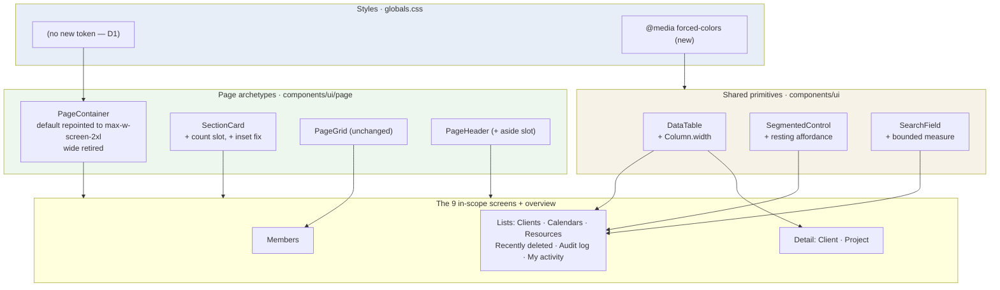
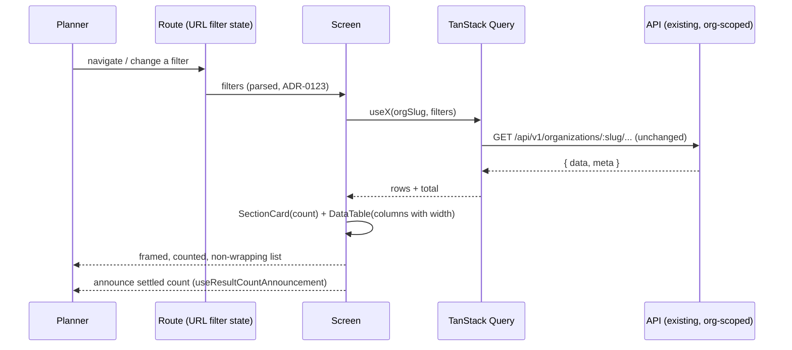
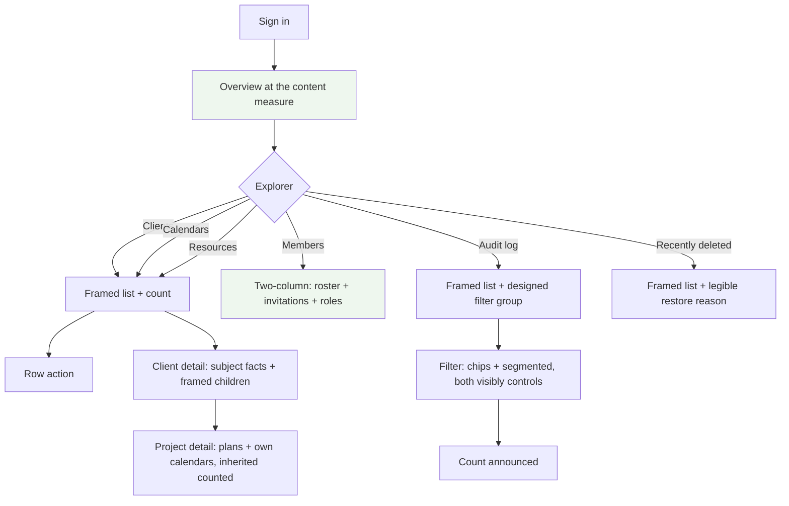

# Feature Spec: Page composition — measure, frame, density and information

- **Status:** Draft
- **Author(s):** feature-analyst (Product Owner / Solution Architect / Technical Lead hats)
- **Date:** 2026-09-17
- **Tracking issue / epic:** _(to be assigned)_
- **Roadmap link:** follows "A screen is assembled from the archetypes" (ADR-0145) in `docs/ROADMAP.md`
- **Related ADR(s):** proposes **ADR-0146** — _A page is composed, not assembled._ Builds on / amends
  ADR-0097 (archetypes, surface scopes), ADR-0098 (the landing), ADR-0143 (the console), **ADR-0145
  (whose M4-T2 remedy this epic partly reverses — see §1.2.4)**. Cites ADR-0082 (omit vs shade),
  ADR-0088 D1 (no `VITE_` flag), ADR-0105 (why this is a full spec), ADR-0111 §19.13 (primitive
  keyboard/focus review before release), ADR-0142 D4 (a remedy is measured before it is built).

---

## 0. How to read this spec, and what is already established

Every number below is either **(a)** read out of a named file at a named line, **(b)** computed from
Tailwind's own scale, or **(c)** observed by the product owner in a screenshot at a stated window
size. Nothing here is estimated. Where a claim is **not** established, it is labelled
`[TO MEASURE — M0]` and no remedy depends on it (ADR-0076 Class 3; `docs/PROCESS.md` "Decision-bearing
claims carry their evidence").

**The product owner has taken four requirements decisions.** They are inputs, not questions:

1. Scope is **both look and information** — a screen's information architecture is in scope, and new
   API fields / counts / aggregates are permitted where a screen genuinely needs one.
2. Page width is **wide but bounded, with column caps**.
3. Members gets **both** a two-column layout and richer sections.
4. **Summary rows on list screens where they earn their place** — only where they say something a
   reader cannot get by looking.

**They have since answered all four of this spec's critical questions.** Those answers are recorded
as **decisions in §1.10**, not as defaults, and the design in §4 is written to them. Nothing in this
spec is now blocked on a requirements answer.

### 0.1 Independent verification of the load-bearing claims

Four claims that decide what gets built were re-derived from the code by a second reader and **all
four hold** (recorded here as verification rather than left as assertions — `docs/PROCESS.md`
"Decision-bearing claims carry their evidence"):

| Claim                                                                                                                                                                           | Verified                                          |
| ------------------------------------------------------------------------------------------------------------------------------------------------------------------------------- | ------------------------------------------------- |
| `WIDTHS` in `page-container.tsx` — `default: max-w-6xl` (1152), `wide: max-w-screen-2xl` (1536), minus `p-6` twice → **1104 / 1488**                                            | ✓ matches the owner's measured 1103 / 1483        |
| Only `OverviewScreen.tsx:180` and `staff.tsx:139` pass `width="wide"`                                                                                                           | ✓                                                 |
| `section-card.tsx:156` applies `flush && 'p-0'` to `CardContent` while `CardHeader` keeps `p-6`; `data-table.tsx:162,253` default cells to `py-2 pr-4` with **no left padding** | ✓ — the 24px inset is fully explained             |
| The fixed column caps at the cited lines                                                                                                                                        | ✓ — **and the census was incomplete; see §1.2.4** |

A fifth measure is in use that the first pass missed: **`staff.tsx:107` passes `width="narrow"`**, so
three of the four measures are live, not two (§4.2).

---

## 1. Business understanding

### 1.1 Problem

**The previous epic aligned the parts and nobody composed the whole.**

ADR-0145 put nine non-canvas screens onto the ADR-0097 page archetypes: one `PageHeader`, one
heading rhythm, one row-action shape, one empty state. It measurably succeeded at what it set out to
do. The product owner then used the result and reported that the screens "still all feel
'different'", that "the landing page is great but the others just don't follow", and that several are
"just lists" with no "white holding box".

That is not a complaint that the previous epic failed. It is the observation that **using the same
components is not the same as composing the same page**, and the three decisions that make a page
feel finished — _how wide is the content_, _what frames it_, _what does it tell me_ — were never
anybody's decision. They are taken today in three unrelated places, by accident:

| Decision                | Where it is actually taken                              | Consequence                            |
| ----------------------- | ------------------------------------------------------- | -------------------------------------- |
| How wide is the content | a `width` prop at each route                            | two screens are 1488px, ten are 1104px |
| What frames the content | whether a route happens to import `SectionCard`         | six screens have no card at all        |
| How wide is a column    | a Tailwind class on a `cellClassName` in a feature file | content wraps beside unused width      |

**This is the ADR-0058 rule applied to the previous epic's problem statement** (CLAUDE.md §19.11):
ADR-0145's problem was _component drift_, and it fixed it. The problem the product owner has now is
_composition_, which that spec did not name, and which is therefore not a stale complaint — it is a
different one that only became visible once the component drift was gone.

#### 1.2 What is wrong, with the cause established in code

##### 1.2.1 The measure is the single most literal cause, and it is one prop

`apps/web/src/components/ui/page/page-container.tsx:18-23` declares four measures. Content width is
the measure minus `p-6` twice (`:45`), i.e. **−48px**:

| `width`   | class              | frame  | **content** |
| --------- | ------------------ | ------ | ----------- |
| `narrow`  | `max-w-4xl`        | 896px  | 848px       |
| `default` | `max-w-6xl`        | 1152px | **1104px**  |
| `wide`    | `max-w-screen-2xl` | 1536px | **1488px**  |
| `full`    | `max-w-none`       | —      | —           |

The product owner measured the overview's content at **x≈360 → 1843 (~1483px)** and Members / Clients
/ Calendars / Resources at **x≈552 → 1655 (~1103px)**. Those are 1488 and 1104 to within a pixel of
rounding. So:

- `width="wide"` is passed by exactly **two** screens — `OverviewScreen.tsx:180` and `staff.tsx:139`.
  Both are screens somebody redesigned on purpose (ADR-0098, ADR-0143).
- Every other authenticated screen takes the **default**, most of them without ever mentioning it.
  `members.tsx:11-13` says so in as many words: the conversion was "width-neutral by construction".

**"Feels different" is, in large part, a 384px difference in one prop that nobody chose.**

##### 1.2.2 Six screens have no white box, and the list matches the complaint exactly

`SectionCard` is imported by `project-detail.tsx`, `client-detail.tsx`, `members.tsx`,
`ProjectCalendarsSection.tsx`, the four overview sections and the staff console. It is imported by
**zero** of: `ClientsTable.tsx`, `CalendarsTable.tsx`, `ResourcesTable.tsx`, `AuditEventList.tsx`,
`RecentlyDeletedTable.tsx`, `my-activity.tsx`.

That is a 1:1 match with the screens the product owner named as lacking a holding box, **plus My
activity**, which they did not name — almost certainly because it sits outside any organisation and
is less visited, not because it is different. It is in scope.

##### 1.2.3 The prose measure is `max-w-prose` on 14px text

`page-header.tsx:63` renders the page description as
`className="text-muted-foreground mt-1 max-w-prose text-sm"`. `max-w-prose` is **65ch**; at
`text-sm` (14px) in the product's typeface that lands at **≈545px** — exactly the wrap point the
product owner measured on Audit log and Recently deleted, inside an 1104px column.

The cap itself is right and was added deliberately (`page-header.tsx:47-54`: without it, two
descriptions on sibling screens rendered 267px and 736px wide). What is wrong is that **a 545px
paragraph under an 1104px heading inside a 1628px window reads as a page that stopped halfway**. The
fix is not to remove the measure — it is to stop the measure being the only thing establishing the
column's width, i.e. to give the header row something to the right of the description (§4.6).

##### 1.2.4 The wrapping columns are the previous epic's own remedy, and widening the page makes them worse

This is the most important finding in the spec, because it means **the obvious fix and the obvious
other fix fight each other.**

The product owner observed four separate wrap/truncate defects and asked for one cause. There are
two, and the larger one is not a bug in anybody's code — it is a correct remedy applied to a goal
that this epic changes:

**ADR-0145 M4-T2 added fixed-width caps to bounded columns — and the census of them was wrong twice
before it was run.** The first pass of this spec named two sites; a second reader named four; the
grep says **15 declarations across 5 files**. It is recorded in that order rather than corrected
silently, because a count nobody re-derived is ADR-0076 Class 1 and this one governs M2's blast
radius:

| Screen                      | Column         | Class                 | Computed  | File                                            |
| --------------------------- | -------------- | --------------------- | --------- | ----------------------------------------------- |
| **Calendars**               | `Working days` | `md:w-44`             | **176px** | `CalendarsTable.tsx:220`                        |
| **Resources**               | `Kind`         | `md:w-32`             | 128px     | `ResourcesTable.tsx:287`                        |
| **Resources**               | `Code`         | `md:w-24`             | **96px**  | `ResourcesTable.tsx:292`                        |
| **Resources**               | `Group`        | `lg:w-36`             | 144px     | `ResourcesTable.tsx:303`                        |
| **Project detail**          | `Working days` | `md:w-44`             | **176px** | `ProjectCalendarsSection.tsx:129`               |
| **Client + Project detail** | `Status`       | `md:w-28`             | 112px     | `PlansTable.tsx:62`                             |
| Staff console               | nine columns   | `md:w-28` … `md:w-96` | 112–384px | `staff.tsx:291,296,303,464,468,472,811,892,897` |

**The population splits in two, and only one half is a defect today.** The staff console was
_already_ at `width="wide"`, so its nine caps were measured against a 1438px table (ADR-0143) and are
at their final width — they are in the column model's conversion scope but are **not** made worse by
this epic's widening. The four screens moving 1104 → 1488 are Calendars, Resources, **Project
detail** and **Client detail**, and `ProjectCalendarsSection.tsx:129` is the one that matters most to
the complaint: it carries the same 176px `Working days` cap on a screen the product owner named.

`"Mon, Tue, Wed, Thu, Fri, Sat"` does not fit in 176px at `text-sm` → it wraps after `Fri,`, which is
precisely the two-line cell in the screenshot. `NL-HYDROPUMP` in `font-mono text-xs` plus `pr-4` does
not fit in 96px → it breaks at the hyphen, which is a legitimate soft-wrap opportunity, producing
`NL-` / `HYDROPUMP`. Both observed wraps are explained to the character.

**The caps were measured, and the measurement was of the wrong quantity.**
`docs/specs/page-consistency/m4-measurement.md:51-69` records them reducing `factSpread` — the
distance between a row's first and last fact — by **−34, −122, −65, −65px**. That is a real
improvement and the numbers are real. But `factSpread` measures _distance_, not _fit_: nothing in
that milestone asked whether the capped content still rendered on one line. The remedy was correct
for the goal it had, and the goal was "pull the facts together at an 1104px measure".

**So the caps and the widening interact, and the interaction is adverse.** The caps are absolute
`rem` values. Widening the page hands the surplus to the _uncapped_ columns and leaves
`Working days` at 176px and `Code` at 96px **wrapping exactly as they do today, next to even more
unused width**. An epic that widens the page and leaves the caps in place ships _more_ visible
wrapping, not less.

The second cause is the measure itself (§1.2.1): Audit log's `Subject` and Recently deleted's restore
control are in uncapped columns, and their crowding is the 1104px container. `[TO MEASURE — M0]`
whether Recently deleted's `Restore … first…` is clipped by an ancestor `overflow-hidden` or is
`text-overflow` inside the control — the cell carries `whitespace-nowrap` (`RecentlyDeletedTable.tsx:231`)
and `Button`'s CVA base carries `whitespace-nowrap` and **no** `truncate` (`button.tsx:7`), so the
ellipsis has no cause I can name from source and must not be guessed at.

##### 1.2.5 The audit filter bar uses two control vocabularies for one job

Not a framing problem, as the product owner correctly suspected. Read from the primitives:

- `ToggleChip` unpressed: `border-input text-muted-foreground` over a `rounded-full border` base
  (`toggle-chip.tsx:7,29`) — **a visible bordered pill**.
- `SegmentedControl` unselected: `text-muted-foreground hover:text-foreground`
  (`segmented-control.tsx:138`) — **no border, no fill: plain text**.

The audit bar renders four `ToggleChip`s for categories and a `SegmentedControl` for outcome, 20px
apart (`AuditFilterBar.tsx:74-109`). With no outcome chosen — which is the state the screen opens in,
deliberately (`:96-99`) — **all three outcome options are bare text sitting beside four bordered
pills**.

**The semantic split is right and must be kept**: categories are independent booleans, outcome is
one-of-N, and both primitives' docblocks argue this at length. What is wrong is that the design
system has never decided what a _resting, unselected_ segmented control looks like, so one of two
adjacent filter controls does not read as a control at all. This is a **primitive** defect, not a
screen one, and fixing it fixes every future filter bar.

One more thing the bar already knows and nobody acted on: `AuditFilterBar.tsx:118-122` records that
the bar is **1104px at 1646, 1280 and 1920 alike — constant — against 1254px of items plus 96px of
gaps, i.e. ~246px over at every width**. It is measurably too narrow for its own contents today, and
that measurement was taken before anybody proposed widening the page. §4.2's widening is the first
thing that has ever addressed it.

##### 1.2.6 `flush` makes a table bleed past the heading that names it

The product owner read this as "wording hard against margins" and it is the opposite: the heading is
inset and the table is not.

`SectionCard` renders `CardHeader` (`p-6` — `card.tsx:42`) and `CardContent`, and `flush` sets
`CardContent` to `p-0` (`section-card.tsx:156`). `client-detail.tsx:75` and `project-detail.tsx:118`
both pass `flush`, with the comment _"the body is a full-bleed table … not padding around a table
that already has its own"_.

**That comment is false as implemented.** `DataTable` renders
`<div className="overflow-x-auto"><table className="w-full text-sm">` (`data-table.tsx:217-225`) with
cell padding `py-2 pr-4` — **vertical and right padding only, no left padding and no horizontal
inset**. So the table has no leading padding of its own, and `flush` removes the card's. Measured by
the product owner: card at x≈551, "Projects" heading at x≈575, `Name` header at **x≈551**. Exactly
24px, exactly `p-6`.

This is why a card _with_ a table in it still looks unfinished, and it is the single cheapest visual
fix in the epic.

##### 1.2.7 `Outcome` is empty by design — neither a data condition nor a defect

The product owner asked which of two things the always-blank `Outcome` column is. It is a third
thing. `AuditEventList.tsx:96-107`:

```
event.outcome === 'SUCCESS' ? <span className="sr-only">Succeeded</span> : <span …>Denied|Failed</span>
```

Success renders `sr-only` **on purpose** — the comment says "SUCCESS is the overwhelming majority and
saying so on every row would drown the two outcomes worth noticing", which is correct reasoning.
What was never considered is the _column-level_ consequence: a visible `<th>Outcome</th>` claims a
column of facts, takes width, and is blank on almost every row of almost every installation. A
reader cannot tell that from a broken column. The render rule is right; the column is wrong.

##### 1.2.8 "—" is a placeholder for a fact that is absent, used where the fact is absent for everyone

`Description` renders `—` on Clients, Calendars, Client detail and Project detail; `Group` on
Resources; `Calendar` on Resources. On this installation several are `—` for **every** row. A column
of em dashes costs width, costs a header, and tells a reader nothing — but making a column's
presence depend on the current page of data would make the table's shape change as a reader pages,
which is worse (§2 US-5, §4.5).

##### 1.2.9 The two-column landing is unbalanced, and Members is sparse

Observed: the overview's right column holds one short item with ~250px of empty card beneath it
(left card ~460px, right ~230px). `PageGrid` is span-by-demand and deliberately does **not**
re-order or use `dense` (`page-grid.tsx:36-47`), and its docblock states the ragged consequence as
the accepted price of DOM order being reading order. That decision stands. What is not decided is
what a `narrow` section does when it has one item — which is a _content_ decision the same docblock
says belongs "where the sections are listed".

Members is the inverse: two full-width cards, each holding a one-row table, at 1104px. Its roster
shows Name / Email / Role / Remove — and `OrgMemberSummary` **already carries `joinedAt`**
(`packages/types/src/index.ts:145`), which the screen does not render. Likewise `InvitationSummary`
already carries `expiresAt` **and** `createdAt` (`:96-103`), and `ClientSummary` already carries
`createdAt`/`updatedAt` (`:187-195`). **A meaningful part of "add extra detail so they don't look so
sparse" needs no API change at all** — the fields are on the wire and unrendered.

##### 1.2.10 The project page is largely a copy of the Calendars screen

`project-detail.tsx:122` renders `ProjectCalendarsSection`, which lists every calendar the project
_can use_ — its own plus the whole organisation library (ADR-0053 M2). On a project with no
project-scoped calendars, that is the org library, rendered inside the project page, every row badged
`Organisation`. The behaviour is correct per ADR-0053 and the **information architecture is not**:
the project's own detail page is mostly a table of things that are not the project's.

##### 1.2.11 The disclosure reads as a heading with missing content

`CoverageDisclosure` renders a `variant="ghost" size="sm"` `Button` with the label "What this
records" and `className="text-muted-foreground -ml-3"` (`CoverageDisclosure.tsx:50-61`). A ghost
button is transparent until hover, carries no chevron and no border, and sits in muted ink — so at
rest it is visually indistinguishable from a small bold label. Its **accessible** mechanics are
correct and hard-won (`aria-expanded`, `aria-controls`, `sr-only` rather than `hidden`, with a CDP
measurement in its docblock disproving the `<details>` version). Nothing about that changes. What is
missing is a **visual** disclosure affordance.

##### 1.2.12 The search field takes all the width there is

`SearchField` has no intrinsic maximum (`search-field.tsx:50`); every caller passes
`className="min-w-56 flex-1"` (`CalendarsTable.tsx:328`, `ResourcesTable.tsx:407`, and the equivalent
in `ClientsTable`). In a `flex-wrap` row `flex-1` absorbs **all** remaining width, so on Clients —
whose filter row holds only the search and `Clear filters` — the input renders ~970px wide for a
single-field search. Widening the page makes this worse by exactly the width added.

#### 1.3 Why now

Three reasons, in order of weight:

1. **The product owner has looked at the product and said it is not good enough.** These are the
   screens every planner passes through to reach the diagram, and the one an administrator lives in.
2. **The interaction in §1.2.4 is a trap that gets worse with delay.** The longer the fixed caps sit
   there, the more tables copy the pattern — `ResourcesTable.tsx:265-284` already documents it as a
   rule for "the next person adding a cap".
3. **`docs/TECH_DEBT.md` #324 is a level-A accessibility defect across the whole product**, verified
   on 2026-09-17 with a measurement, and its remedy touches the same shared primitives this epic is
   already opening. Doing it separately means opening them twice.

### 1.4 Users

| Persona                  | Org role                | What they need from these screens                                                                                               |
| ------------------------ | ----------------------- | ------------------------------------------------------------------------------------------------------------------------------- |
| **Planner**              | `PLANNER`               | Find a client/project/plan fast; check a calendar's working week without opening it; see what a resource is and where it sits.  |
| **Administrator**        | `ORG_ADMIN`             | Who is in this organisation, what can they do, what is outstanding; what has been removed and by whom; what is about to expire. |
| **Contributor / Viewer** | `CONTRIBUTOR`, `VIEWER` | Read the same screens with fewer actions, and be told **why** an action is unavailable rather than shown a gap (ADR-0082).      |
| **External Guest**       | share link              | **Out of scope** — the guest surface is `/share` and renders none of these screens.                                             |

No new role, no new permission, no change to any existing gate. Every screen keeps the exact
permission model it has today; that is an acceptance condition, not an aspiration (§2 US-8).

### 1.5 Primary use cases

1. Scan a list of clients / calendars / resources and act on one, at the width the window offers.
2. Read a client's or project's detail page and learn something about the _subject_, not only list
   its children.
3. Administer an organisation's people and invitations from one screen that says how many of each
   there are.
4. Narrow the audit log with filters that look like filters, and read a table with no permanently
   blank column.
5. Check what was deleted, what it took with it, and when it expires — with the blocked-restore
   explanation legible rather than clipped.
6. Do all of the above with a keyboard, under Windows High Contrast, and at 320px CSS width.

### 1.6 User journeys

**Happy path (Planner, Calendars).** Sign in → land on the overview → Calendars in the Explorer →
the page is as wide as the overview, the list sits in a framed section headed with its own count,
`Working days` reads on one line, `Description` is a second line under the name where there is one
and absent where there is not → type into a search field that is the width of a search field →
results announced → `Edit`.

**Alternate (Org Admin, Members).** Members → a summary strip states the membership and how many
invitations are outstanding → Roster (framed, with `Joined`) → beside/below it, Pending invitations
with `Expires`, and a short "what these roles can do" panel → invite.

**Alternate (Viewer).** The same screens, with write actions shaded and carrying their reason, and
sections whose content they may not read **omitted entirely** rather than framed and empty
(ADR-0082 clause 1; `members.tsx:15-19` already does this for invitations).

**Failure (any screen).** The list query fails → one `QueryErrorState` inside the section frame, not
a bare page. Unchanged behaviour; it gains a frame.

### 1.7 Expected outcomes

- The nine screens read as one product with the landing, because they share a measure, a frame and a
  density rather than only a component set.
- No table cell wraps or truncates while its own table has unused width.
- Every screen says how much of the thing it lists there is.
- The detail screens say something about their subject.
- A focus indicator exists in Windows High Contrast (`#324` closes).

### 1.8 Success criteria

Stated as **falsification conditions**, committed in `falsification.md` **before** any remedy is
built (ADR-0142 D4; this repository has eight consecutive recorded instances of a width expectation
contradicted by its own measurement, so a condition written afterwards is worth nothing).

| #        | Condition                                                                                                                                                                                                        | Judged by                             | Withdrawal clause                                                                                                      |
| -------- | ---------------------------------------------------------------------------------------------------------------------------------------------------------------------------------------------------------------- | ------------------------------------- | ---------------------------------------------------------------------------------------------------------------------- |
| **FC-1** | Every in-scope screen's content width is within **2px** of every other's at 1280, 1646 and 1920 — **including the overview and the staff console**, which D1 brings onto the same measure rather than exempting. | `measure-page-drift.mjs`              | —                                                                                                                      |
| **FC-2** | At 1280, 1646 and 1920, **zero** cells in any in-scope table wrap to more than one line, except in columns declared `auto`.                                                                                      | new probe, M0                         | If a column cannot meet this without truncating, it is declared `auto` and the exception is recorded with its content. |
| **FC-3** | The widened measure costs **no** screen content width at any of the three widths (monotonic non-regression).                                                                                                     | `measure-page-drift.mjs`              | —                                                                                                                      |
| **FC-4** | Every in-scope list screen's rows sit inside a framed section with an accessible name.                                                                                                                           | `page-frame.structural.test.ts`       | —                                                                                                                      |
| **FC-5** | Under `forced-colors: active`, focusing a control by keyboard changes at least one pixel of its box, on every primitive in the census.                                                                           | new `forcedColors` Playwright project | —                                                                                                                      |
| **FC-6** | At **320px CSS width** every in-scope screen's `documentElement.scrollWidth ≤ 320` (WCAG 1.4.10).                                                                                                                | reflow probe, M0 + M8                 | **None. This one does not get a withdrawal clause** — see §1.9.                                                        |
| **FC-7** | The ADR-0097 weight ratchet and sizing ratchet do not rise.                                                                                                                                                      | existing gates                        | —                                                                                                                      |
| **FC-8** | No in-scope screen's first-contentful list is pushed below the fold at 1646 by anything this epic adds.                                                                                                          | `measure-page-density.mjs`            | A summary strip that pushes the list down is withdrawn (it has not earned its place — decision 4).                     |

FC-1, FC-3 and FC-8 have **baselines taken at M0 and committed**; a condition without a baseline
cannot be judged.

**Restated after D1, rather than carried forward silently.** Two of these were written against the
rejected 1400px proposal and one of them was **unsatisfiable under it**:

- **FC-1 is unchanged in wording and materially easier to meet.** Under 1400 it required nine screens
  at 1352px to agree with the overview and staff console at 1488px — a 136px gap at 1920, i.e. the
  condition failing on the two reference screens (§1.10 D1). Under D1 every screen shares one value,
  so FC-1 becomes a statement about one number rather than a reconciliation of two. Its **2px
  allowance is unchanged** (`SectionCard`'s own border, ADR-0145 FC-3's measured range).
- **FC-3's bar is unchanged and its expected delta is not.** The condition is monotonic
  non-regression, which is value-independent; but the _expected_ gain is now **+204px at 1646 and
  +384px at 1920**, against the +204/+248 the 1400 proposal would have produced. The M0 baseline is
  the same 1104/1488 either way, so no baseline is invalidated — only the target.
- FC-2 and FC-4…FC-8 are untouched by D1.

No falsification condition is weakened by any of the four answers, and none had to be.

### 1.9 "Desktop app" is a design stance, not a waiver

The product owner's instruction — _"remember this isn't a mobile app it's a desktop app"_ — is
adopted in full as a **design** stance: the layouts are designed for 1280–1920, density is chosen for
a mouse and a large window, and nothing is compromised to look better on a phone.

**It is not a waiver of WCAG 2.2 §1.4.10 Reflow**, and this spec states that explicitly so nobody
later reads "desktop" as licence. CLAUDE.md §13 makes WCAG 2.2 AA a **merge requirement**. 1.4.10
requires content to reflow to 320 CSS pixels without two-dimensional scrolling, and it is about
_zoom_, not about phones: a user at 400% zoom in a 1280px window has a 320px viewport. That user is
on a desktop.

Concretely, this constrains three of this epic's own decisions:

- The measure is a **maximum**, never a minimum — `max-w-*`, never `w-*` or `min-w-*` on a container.
- Column width declarations are **breakpoint-prefixed** (the existing caps already are — `md:`,
  `lg:`), so the narrow layout keeps automatic table layout.
- `PageGrid` stays single-column below `md` (`page-grid.tsx:54`), unchanged.

Tables are the known-hard case and `DataTable` already answers it: a horizontally scrollable,
focusable, labelled `region` (`data-table.tsx:217-224`). 1.4.10 explicitly exempts content requiring
two-dimensional layout — a data table is the canonical example — so a table that scrolls sideways
inside a page that does not is compliant. **FC-6 measures the page, not the table.**

### 1.10 Decisions taken

All four critical questions were answered by the product owner on 2026-09-17. They are recorded here
as **decisions with their answer**, not as questions with a default.

#### D1 — The measure is `max-w-screen-2xl` (1536px frame / **1488px content**)

**Decided: reuse the existing `wide` value. No new token.** This is _against_ the analyst's
recommended 1400px default, and it is the better answer for a reason the recommendation had missed —
see the correction below. It also simplifies the work: no token to introduce, no value to justify,
and the landing page's measure becomes **the product's** measure rather than one screen's exception.

**Delivered by repointing `PageContainer`'s `default`, not by converting call sites.** The product
owner's instruction, and it follows from this spec's own diagnosis: the failure mode is _a screen
saying nothing and getting the narrow one_, and converting ten call sites to `width="wide"` leaves
that failure mode fully armed for screen eleven. §4.2 settles what happens to the now-duplicate
`wide` key.

**The analyst's own risk framing was under-stated and is corrected in place rather than deleted**
(ADR-0076 Class 1 — the correction is the useful part). The first version argued the ceiling choice
was nearly free because at the product owner's 1646px Surface Pro both candidates give an identical
page — region ≈1356px, below both caps. That is true and was independently verified. But **the
screenshots this epic was opened on are from a 1920px monitor**, where the region is ≈1630px and the
two candidates differ by **136px of content — 1352 (1400 cap) against 1488 (`wide`)**. The owner
chose on that display. Both widths are now stated wherever the arithmetic appears (§4.2), because a
spec that calls a choice "nearly free" about the very screen the complaint came from is the claim
this register keeps recording.

**A second thing the 1400 proposal got wrong, found only by checking it against this spec's own
falsification condition.** §1.8 FC-1 requires every in-scope screen's content width to agree within
2px, and §4.13's first draft said `wide` "survives as a named exception". Those two are
**incompatible**: at 1920 the nine screens would have been 1352px and the overview and staff console
1488px, so **FC-1 would have failed on the two reference screens** — the epic's headline condition,
broken by the epic's own design, at the width it was reported from. The 1536 answer does not merely
simplify the milestone; it **repairs an internal contradiction**. Recorded because it was asserted
and not checked, which is the Class 3 failure `docs/PROCESS.md` names.

#### D2 — Project detail defaults to the project's own calendars

**Decided: the analyst's recommendation.** The Calendars section on Project detail shows the
project's **own** calendars by default, states the inherited organisation count in a sentence, and
keeps the full list reachable.

**ADR-0053 M2's scoping rule is unchanged, and this spec says so explicitly** because a reader
skimming it will otherwise conclude the tier rule moved. That guarantee is about the **picker** —
that a calendar picker can never offer a calendar the write seam would refuse with a 422 — and the
picker's source is **not touched by this epic**. What changes is one section's _default view_ on one
screen. The distinction is an acceptance condition (§2 US-7, plan M5-T3), not a note.

#### D3 — The detail screens get child counts; cost measured first; no index unless the measurement demands one

**Decided: the analyst's recommendation, in full, including its sequencing.** `projectCount` and
`planCount` ship as optional additive fields on existing reads.

**ADR-0144's precedent is carried as reasoning, not cited as authority.** That epic designed an
`INCLUDE` index for a landing-page aggregate and **declined to build it** — not because it was slow,
but because any index making that aggregate index-only must contain the column the recalculation
writes, so it **spends the HOT-update exemption**: measured, HOT went 28.4% → 0.0% and index growth
+92% → +447%, deterministically, on an installation holding 28 activities. The same test applies
here: an index is justified only if the measurement demands one _and_ it does not put a write-path
cost on every recalculation to make a detail page's count cheaper.

**This ships the API change, so three reviewers move from conditional to in scope**:
`api-reviewer`, `security-reviewer` and `backend-performance-reviewer`. `database-architect` runs
**unconditionally** (CLAUDE.md §19.3), and **"no schema change" is a legitimate output** from it —
recorded as a decision rather than read as a skipped step.

#### D4 — A column that rarely carries anything stops being a column

**Decided: the analyst's recommendation.** The fact moves to a secondary line under the row's
subject, **never data-dependent** — a given screen has the same columns whatever the current page
holds. The `Resources.Calendar` exception stands, because there absence is informative (`—` means
"inherits the plan calendar" and `Not scheduled` means "is a group").

The **discriminator**, stated so the next screen is decided by the rule rather than by whoever is
looking, is §4.5. Its first clause is the one that does the work: _a column earns its place if it
carries a fact that differs between rows on a typical installation_ — a design-time judgement, not a
runtime test.

#### D5 — `#324`: both remedies, global block first _(analyst's decision, not the product owner's)_

**This was filed as a critical question and should not have been.** It is an implementation choice,
not a requirements one; the product owner approved "fix `#324`" without qualification. It is taken on
the analyst's own authority and renumbered out of the CQ set so the document does not carry two.

**Decided: both, in that order** — one global `@media (forced-colors: active)` block as the safety
net, then migrating the shared primitives' CVA bases, with a census so the count cannot silently grow
again (§4.7). **The specificity/cascade caveat remains explicitly unmeasured** and M0-T2 settles it
in a browser before anything depends on it.

#### Non-critical decisions (analyst's, stated so they are not re-litigated)

(i) **Summary strips**: count, plus composition only where the composition is not visible in the
first page of rows (product-owner decision 4, read strictly). (ii) **Members' third panel**: a short
static "what these roles can do" section — the roles are what an administrator on that screen is
deciding about. (iii) **Density toggle**: not built; nobody asked, and it doubles the layout surface.
(iv) **Saved filter views**: not built; out of scope. (v) **My activity**: in scope for frame, measure
and columns; its security caveat stays **visible**, because ADR-0145 D5 declined to move it and that
decision stands. (vi) **`/account` and the plan workspace**: see §3.1 — both classified, neither
in scope, and the reason each is excluded is recorded rather than assumed.

### 1.11 What is still open

Nothing on requirements. The remaining unknowns are all **measurements**, they are all labelled
`[TO MEASURE — M0]`, and no remedy depends on any of them before M0 answers it:

- the real Explorer width at each viewport, at both its 200px and 420px extremes;
- whether `w-px whitespace-nowrap` resolves a column to its content under `table-layout: auto`;
- the `forced-colors` cascade-layer question (D5);
- the cause of Recently deleted's clipped restore control;
- the reflow baseline at 320px.

---

## 2. Functional requirements

### User stories & acceptance criteria

> **US-1 — One measure.** As a planner, I want every screen in the organisation to use the same
> content width, so that moving between them does not feel like moving between products.
>
> - **Given** any two in-scope screens **when** rendered at the same window width and Explorer width
>   **then** their content columns differ by no more than 2px (FC-1).
> - **Given** a window at 1280, 1646 or 1920 **when** any in-scope screen renders **then** its
>   content width is **greater than or equal to** today's (FC-3) — the epic never costs width.
> - **Given** a window narrower than the ceiling **then** the content fills the available region
>   minus padding, and the ceiling has no effect.
> - **Given** a 320px CSS viewport **then** `documentElement.scrollWidth ≤ 320` (FC-6).

> **US-2 — One frame.** As a planner, I want a list to sit in a titled box like the landing's
> sections, so the page reads as designed rather than as a table dropped on a background.
>
> - **Given** any in-scope list screen **when** it renders **then** its rows sit inside a
>   `SectionCard` with an accessible name (FC-4).
> - **Given** a framed section containing a table **when** it renders **then** the table's first
>   cell and the section's heading share a left edge (§1.2.6).
> - **Given** a section the caller may not read **then** the section is **omitted entirely**, not
>   rendered empty (ADR-0082 clause 1; unchanged from `members.tsx:33`).
> - **Given** a loading / error / empty state **then** it renders inside the same frame, and the
>   existing `DataTable` state machine is unchanged.

> **US-3 — Columns fit.** As a planner, I want a cell to be readable on one line when the table has
> room, so I can scan a list instead of decoding it.
>
> - **Given** any in-scope table at 1280, 1646 or 1920 **then** no cell wraps to more than one line
>   unless its column is declared `auto` (FC-2).
> - **Given** a column whose content is short and bounded **then** it takes exactly the width its
>   content needs and surrenders the rest.
> - **Given** a column of genuinely unbounded free text **then** it is declared `auto` and may wrap.
> - **Given** a narrow viewport **then** automatic table layout applies and the table scrolls inside
>   its own labelled region — unchanged behaviour.

> **US-4 — Filters look like filters.** As an administrator, I want the audit log's controls to read
> as one designed control group.
>
> - **Given** the audit filter bar with no outcome chosen **then** every outcome option is visibly a
>   control, distinguishable from static text without hovering.
> - **Given** the same bar **then** the categories remain `aria-pressed` buttons and the outcome
>   remains a `radiogroup` — the semantics do not change (`segmented-control.tsx:9-16`).
> - **Given** a keyboard user **then** roving `tabindex`, Arrow/Home/End and focus-follows-selection
>   behave exactly as today.
> - **Given** the widened measure **then** the bar's items and gaps fit within it (`AuditFilterBar.tsx:118-122`
>   measured ~246px over at every width today).

> **US-5 — No permanently blank column.** As an administrator, I want the table's columns to carry
> facts.
>
> - **Given** a column that is blank for every row on this installation by construction **then** it
>   does not exist as a column; its fact is carried in the row it belongs to.
> - **Given** any table **then** its column set is a **static** property of the screen — it does not
>   change with the current page of data, so paging never changes the table's shape.
> - **Given** an audit event that did not succeed **then** its outcome is visible on that row.
> - **Given** an audit event that succeeded **then** its outcome remains available to assistive
>   technology (today's `sr-only` guarantee is preserved, not dropped).

> **US-6 — Screens say how much.** As an administrator, I want a screen to tell me the size of what
> it is listing.
>
> - **Given** an in-scope list screen **then** its section names the total it is showing.
> - **Given** a filtered list **then** the count describes the filtered set and says so.
> - **Given** a count that changes **then** it is announced (WCAG 4.1.3) — reusing
>   `useResultCountAnnouncement`, never a second mechanism.
> - **Given** a summary strip that does not tell the reader something the rows do not **then** it is
>   not built (decision 4; FC-8).

> **US-7 — Detail screens describe their subject.** As a planner, I want a client's page to tell me
> about the client.
>
> - **Given** Client detail **then** it shows the client's description where one exists, when it was
>   created, and how many projects and plans it holds (D3 — counts ship subject to M5-T2's cost
>   measurement, and are withdrawn rather than shipped slow if it fails).
> - **Given** a client with no description **then** the field is **absent**, not an em dash.
> - **Given** Project detail **then** the Calendars section defaults to the project's own calendars
>   and states how many are inherited (D2), with the full list one reveal away and the picker's
>   source unchanged.

> **US-8 — Nothing about permissions changes.** As a security reviewer, I want to see that this epic
> is presentation only.
>
> - **Given** every in-scope screen **then** the permission predicate gating each control is
>   byte-identical to today's, pinned by the existing suites passing **unchanged**.
> - **Given** any new API field **then** it is returned under the existing route's existing
>   org-scoped guard, with no new permission and no widening of an existing one.
> - **Given** a Viewer **then** every shaded control keeps its reason (ADR-0082).

> **US-9 — Focus is visible in High Contrast.** As a keyboard user on Windows High Contrast, I want
> to see where I am.
>
> - **Given** `forced-colors: active` **when** any control in the census is focused by keyboard
>   **then** its rendered box differs from its unfocused box (FC-5).
> - **Given** `forced-colors: none` **then** every focus treatment is **pixel-identical** to today's
>   — the remedy adds a mode, it does not change the product's appearance.

### Workflows

1. **Read a list.** Navigate → skeleton in frame → rows in frame with a count → optionally filter →
   count re-announced → act on a row.
2. **Read a detail page.** Navigate → breadcrumb → subject header with description and facts →
   framed child sections, each with a count.
3. **Administer members.** Navigate → summary → roster (framed, `Joined`) → invitations (framed,
   `Expires`) → roles panel → invite / change role / revoke, all behaving exactly as today.
4. **Narrow the audit log.** Toggle categories (chips) → choose an outcome (segmented) → set dates →
   count announced → `Clear filters` (always mounted, `aria-disabled` when empty — unchanged).

### Edge cases

| Case                                                 | Expected behaviour                                                                                                                                                     |
| ---------------------------------------------------- | ---------------------------------------------------------------------------------------------------------------------------------------------------------------------- |
| Zero rows, no filter                                 | Empty state inside the frame; the section heading still names the section; the count reads zero or is withheld — never a bare `0` that could be mistaken for a defect. |
| Zero rows, filtered                                  | The distinct "nothing matches" copy plus the clear action. Unchanged (`CalendarsTable.tsx:416-440`).                                                                   |
| Query error                                          | `QueryErrorState` inside the frame.                                                                                                                                    |
| Loading                                              | `DataTable`'s skeleton, with the frame already painted so the page does not reflow when rows arrive.                                                                   |
| One very long single-token value (a URL, an address) | `wrap-anywhere` already on `CardTitle`/`CardDescription` (`card.tsx:45-65`); an `auto` column may wrap it; a `fit` column must not be used for it.                     |
| Every value in a column absent                       | The column is not built (US-5). Static, decided per screen, never per page.                                                                                            |
| Window narrower than the ceiling                     | Ceiling inert; content fills the region.                                                                                                                               |
| 320px viewport                                       | Single column, automatic table layout, table scrolls in its region, page does not (FC-6).                                                                              |
| Explorer dragged to 420px (its max)                  | Content region shrinks; the ceiling is a maximum so nothing overflows. `[TO MEASURE — M0]` at both Explorer extremes.                                                  |
| `forced-colors: active`                              | Focus indicator present (FC-5); no other visual change is asserted.                                                                                                    |
| Viewer / Contributor                                 | Sections omitted or controls shaded exactly as today.                                                                                                                  |

### Permissions

**No change.** Every screen keeps its current predicate, mapped to ADR-0012 RBAC + organisation
scope:

| Screen                 | Read gate                     | Write gate                                                                    |
| ---------------------- | ----------------------------- | ----------------------------------------------------------------------------- |
| Clients, Client detail | org membership                | `canManageHierarchy`                                                          |
| Project detail         | org membership                | `canManageHierarchy`; import `canImportSchedule`                              |
| Calendars              | org membership                | `canManageHierarchy`; shared library `canManageOrgCalendars`                  |
| Resources              | org membership                | `canManageHierarchy`                                                          |
| Members                | org membership                | role change / remove per current gate; invitations `canAdministerInvitations` |
| Audit log              | `canReadAuditLog` (Org Admin) | —                                                                             |
| Recently deleted       | org membership                | `canWrite` for restore                                                        |
| My activity            | self                          | —                                                                             |

Any new field (D3) is served by the existing org-scoped route under its existing guard. No new
permission is introduced, and a structural test asserts the gate objects are the same objects
(the ADR-0062 identity-assertion pattern).

### Validation rules

None. This epic introduces no user input beyond controls that already exist. The existing filter
parsers (`pickText` / `pickParam`, ADR-0123) are unchanged.

### Error scenarios

| Scenario                           | Detection               | User-facing result                                                             | Status |
| ---------------------------------- | ----------------------- | ------------------------------------------------------------------------------ | ------ |
| List query fails                   | `query.isError`         | `QueryErrorState` with retry, inside the section frame                         | —      |
| Detail subject missing / no access | `query.isError`         | Existing `role="alert"` + exit link (`client-detail.tsx:43-54`) — unchanged    | 404    |
| Audit log read by non-admin        | `canReadAuditLog` false | Existing `NoticeStrip` refusal — unchanged                                     | 403    |
| Count aggregate fails (D3)         | field absent in payload | The count is **omitted**, never rendered as `0` — a zero is a claim (ADR-0126) | 200    |

---

## 3. Technical analysis

| Area               | Impact                       | Notes                                                                                                                                                                                                                                                                                                                                                                                                                |
| ------------------ | ---------------------------- | -------------------------------------------------------------------------------------------------------------------------------------------------------------------------------------------------------------------------------------------------------------------------------------------------------------------------------------------------------------------------------------------------------------------- |
| **Frontend**       | **high**                     | The epic. ~11 route/feature files; 5 shared primitives (`PageContainer`, `SectionCard`/`Card`, `DataTable`, `SegmentedControl`, `SearchField`); 1 new sub-component (`CoverageDisclosure`'s affordance); `globals.css` for `forced-colors`.                                                                                                                                                                          |
| **Backend**        | **low, in scope**            | **D3 ships**: a `_count` selection on the existing clients/projects reads. No new module, no new route, no new guard.                                                                                                                                                                                                                                                                                                |
| **Database**       | **none expected**            | No model, column, index or constraint is proposed. A `_count` is a query shape. **`database-architect` runs unconditionally** (CLAUDE.md §19.3 forbids self-assessing that a change is too small), and **"no schema change" is a legitimate output** — recorded as a decision, not read as a skipped step. An index is weighed against ADR-0144's HOT-exemption measurement (§1.10 D3); default is not to build one. |
| **API**            | **low, in scope**            | D3 adds optional fields to two existing response DTOs. `docs/API.md` and the OpenAPI spec update in lock-step (CLAUDE.md §6); a changeset is required. **`api-reviewer` in scope.**                                                                                                                                                                                                                                  |
| **Security**       | **none by design, verified** | No new route, permission or scope. US-8 pins it. **`security-reviewer` in scope** (D3 ships an API change) — to confirm rather than assume, including that a count cannot leak a resource's existence across an org boundary.                                                                                                                                                                                        |
| **Performance**    | **low, in scope**            | D3's aggregate is measured against the seed catalogue's scale tiers with the bar committed first (ADR-0144's precedent). **`backend-performance-reviewer` in scope.** Frontend: column-width work is CSS; `check:bundle-size` guards the rest.                                                                                                                                                                       |
| **Infrastructure** | **low**                      | One new Playwright project for `forcedColors` (FC-5) and one CI step — **itself an ADR-0105 trigger**, planned here rather than discovered (M7). `check:ci-roster` (ADR-0136) requires the roster entry in the same change.                                                                                                                                                                                          |
| **Observability**  | **none**                     | No new logs, metrics or traces.                                                                                                                                                                                                                                                                                                                                                                                      |
| **Testing**        | **high**                     | Unit: primitives + column model. Structural: frame census, measure census, reflow. Journey: one new flag-less journey driving the real screens (ADR-0081), plus a `forcedColors` project. Measurement: `measure-page-drift.mjs` extended; a new wrap/fit probe; a reflow probe.                                                                                                                                      |

### 3.1 The full census, and the two screens nobody had classified

**D1 changes `PageContainer`'s default value, so it reaches every screen that does not pass a
width.** That makes the census a scoping document rather than a formality, and it is 13 files —
larger than the nine the complaint named:

`features/overview/OverviewScreen.tsx` and `routes/{account, audit-log, calendars, client-detail,
clients, members, my-activity, plan-detail, project-detail, recently-deleted, resources, staff}.tsx`.

`SectionCard`'s consumers (excluding `components/ui` and tests) are `ProjectCalendarsSection`,
`InvitationsSection`, the four overview sections, `staff/ui/panel.tsx`,
`staff/ui/status-summary.tsx`, and the routes `client-detail`, `members`, `project-detail`. The
no-card set is therefore `clients`, `calendars`, `resources`, `audit-log`, `recently-deleted`,
`my-activity` — **six, confirmed independently by two readers** (§1.2.2).

Two screens in the census needed classifying and neither had been named. Both are **out of scope**,
and the reason each is out is recorded rather than assumed:

#### `/account` — a deliberate narrow exception, and structurally immune to D1

**It does not call `PageContainer` at all.** `account.tsx:22` hand-writes
`mx-auto w-full max-w-2xl flex-1 p-6` — a 672px frame, **624px of content**, recorded as a declared
exception at `page-container.structural.test.ts:45-54`. So **repointing the default cannot touch
it**, which is worth stating plainly: the one screen in the product that is deliberately narrow is
the one screen D1 structurally cannot widen by accident.

**And the narrow measure is right there, so the spec says why rather than leaving a reader to
wonder.** It is a form screen — a stack of single-column fields about the reader's own account — and
a 1488px form puts a label at one end of the screen and its field at the other. The exception is
kept, and §4.2.1's exception list gains it as a **second, differently-shaped** entry: `narrow` is a
value of the archetype; `/account` opts out of the archetype entirely.

That file's own comment records a real hole this epic should not widen: its `PageHeader` adoption is
**ungated**, because `routes/archetypes.structural.test.ts` scopes itself to the nine in-scope
screens and would have to exempt this one to see it. M1-T2's census therefore asserts `/account`
**does not** use `PageContainer` — turning a documented exception into a checked one, which is the
thing that could otherwise regress silently.

#### `plan-detail` — an error wrapper, and the plan workspace is out of scope

**Established by reading rather than assumed.** `plan-detail.tsx` has exactly one `PageContainer`
(`:54`), and it is inside the `planQuery.isError` branch. Loading is a bespoke workspace-shaped
skeleton (`:33-49`, deliberately, per ADR-0030) and the success branch is the canvas workspace, which
owns its own chrome (ADR-0099 / ADR-0109).

**So the plan workspace and the Gantt are explicitly out of scope** — their chrome model is a
different decision with its own register — **and `plan-detail`'s not-found state is in scope by
inheritance**, because D1 changes how wide a "Plan not found" message is on the product's primary
surface. That is a desirable consequence rather than a surprise: it brings the error state onto the
same measure as every other screen. It is written down here so it is not discovered at M8.

One incidental finding, filed rather than fixed here: `plan-detail.tsx:61` renders a bare
`<h1 className="mt-2 text-2xl font-semibold tracking-tight">` instead of `PageHeader`, in a file that
already imports the archetypes — a hand-rolled header ADR-0145's sweep missed. It is one line, it is
in the epic's blast radius anyway, and M1-T5 picks it up.

### Dependencies

- **Must land first:** M0's measurement and `falsification.md`. Nothing is built before the baseline
  exists — this is the epic's own rule and the register's eight contradicted width expectations are
  why.
- **Interacts with:** `docs/TECH_DEBT.md` **#335** (`headClassName`/`cellClassName` replace rather
  than merge). §4.4's column API needs the primitive to compose its default with a caller's width, so
  **#335 is inside this epic's blast radius**. ADR-0145 M4-T2 declined to fix it on measurement —
  seven `cellClassName` sites deliberately omit `py-2` and would silently regain it. This epic must
  read all of them (M2-T1) rather than inherit that decision.
- **Depends on nothing unbuilt.** No flag, no new service, no migration.
- **Affected but out of scope:** `/staff` (ADR-0143) and the overview (ADR-0098) consume the same
  primitives. They are **re-measured, not re-designed** — FC-3 covers them, and any change to their
  rendered width is a finding rather than an outcome.
- **Explicitly out of scope, named so the boundary is a decision:** `/account` (a declared exception
  to the frame gate, `page-container.structural.test.ts`), the six public screens (ADR-0077's `auth`
  and `brand` scopes), `/onboarding`, the plan workspace and Gantt (ADR-0099/0109 chrome model), the
  `/share` guest view.

---

## 4. Solution design

### 4.1 Architecture overview

Nothing new is introduced at the architecture level. The change is that three decisions currently
taken at call sites move into the archetype layer, where ADR-0097 already put the others.



**The load-bearing decision: the measure becomes a property of the archetype, not of the route.**
`PageContainer`'s `default` is repointed to `max-w-screen-2xl` (D1), so a screen gets the right width
by saying nothing — which is the only way a rule like this stays true, because the failure mode today
is precisely that ten screens said nothing and got the narrow one. `wide` is **retired** as a
now-duplicate key; `narrow` and `full` survive as **named, justified exceptions**, and `/account`
joins them on a second list as a screen that opts out of the archetype entirely (§3.1, §4.2.1).

### 4.2 The measure (D1)

**No new token.** `PageContainer`'s `default` is repointed to the existing `max-w-screen-2xl`
(1536px frame, **1488px content**). This is the smallest possible change to the largest number of
screens: ten screens get the right measure by continuing to say nothing.

Arithmetic at the observed ~290px Explorer (`[TO MEASURE — M0]` at both Explorer extremes), with
**both** the widths this epic was judged on:

| Window                              | Region | Today (`default`) | **Decided (1536)**       | _(the rejected 1400)_ |
| ----------------------------------- | ------ | ----------------- | ------------------------ | --------------------- |
| 1280                                | ~990   | 942               | **942** (ceiling inert)  | 942 (inert)           |
| **1646** — the owner's Surface Pro  | ~1356  | 1104              | **1308** (ceiling inert) | 1308 (inert)          |
| **1920** — the screenshots' monitor | ~1630  | 1104              | **1488**                 | 1352                  |

Three things this table settles, stated because two of them were previously stated wrongly:

1. **At 1646 the choice was genuinely free** — the region is below both caps, so both candidates give
   an identical page. The gain there is **+204px**, and it comes from removing the 1104 cap, not from
   the ceiling.
2. **At 1920 the choice was worth 136px**, and 1920 is the display the complaint came from. The first
   version of this spec generalised (1) into "this choice is nearly free" without stating (2). It is
   not nearly free on the screen that produced the screenshots.
3. **The ceiling only binds above ~1690px window width.** Below that the content fills the region and
   the value is inert — which is why FC-3 (no screen loses width) is satisfiable at every width.

#### 4.2.1 What happens to `wide`, `narrow` and the exception gate

Repointing `default` makes `wide` **the same value as `default`**, so it must be disposed of rather
than left. Three options, and the choice affects whether the M1-T2 census still says anything true:

- **(a) Retire `wide`** — delete the key, drop the two `width="wide"` call sites. One name, one
  value.
- **(b) Keep it as a deliberate alias.** Rejected: two names for one value is precisely the drift
  this epic removes, and a reader would have no way to know which to reach for.
- **(c) Repoint `wide` to something wider still.** Rejected: it invents a fifth measure to answer a
  question nobody asked, and re-creates the two-measure split one notch up.

**Chosen: (a), retire it.** `OverviewScreen.tsx:180` and `staff.tsx:139` drop the prop and are
thereby brought onto the same rule as everything else — which is the point of D1. Two docblocks cite
the retired name and are corrected **in the same commit** rather than left to rot
(`page-grid.tsx:32`, `staff.tsx:210`); that is the ADR-0071 lesson, where a decision was cited by
name in five places while the name meant something else.

**The measures that survive are `default`, `narrow` and `full`**, and the census gate still says
something true because **`narrow` has a live consumer**: `staff.tsx:107`, the staff console's
not-found branch — a three-line refusal message, where 848px is right and 1488px would be absurd. So
the exception list is non-empty and M1-T2's pinned positive case works.

**A stale docblock surfaces here and is fixed with it.** `page-container.tsx:9-14` justifies `narrow`
by the organisation overview at 1646px — a screen that now passes `wide` and will shortly pass
nothing. `narrow`'s only real consumer is a refusal page. The docblock is rewritten to the reason
that is true, rather than the reason that was true when it was written.

### 4.3 The frame

Every in-scope list screen's rows move inside a `SectionCard`. Two changes to the archetype:

**(a) A count slot.** The section names its own total. `SectionCard` already has an `action` slot
whose docblock says a `fill` caller "owes its reader a count … which is the `action` slot's job"
(`section-card.tsx:26-29`). This epic gives that obligation a first-class prop so it renders
consistently rather than as nine hand-built strings, and so the announcement is wired once.

**(b) The `flush` inset fix (§1.2.6).** The honest reading of the current comment is that it asserts
something about `DataTable` that is not true. Two candidate remedies, and the choice matters:

- **Give `DataTable` a horizontal inset** — its cells gain leading padding. This changes every table
  in the product, including those not in a card, and would also change the plan workspace's tables.
  Rejected as too wide a blast radius for a card-layout problem.
- **Make `flush` mean what it says** — remove the _header's_ horizontal padding too, so the heading
  and the table share an edge, and let the card's frame supply the boundary. This is the smaller
  change, keeps `DataTable` untouched, and is what "full-bleed" means.

**Chosen: the second.** `flush` becomes a genuine full-bleed mode — header and body share a left
edge — and the card's own vertical rhythm is preserved. `[TO MEASURE — M0]` whether the resulting
edge-to-edge table reads as intentional at 1488px, with the fallback being to give `flush` an
explicit inset instead. Either way the heading and the first cell align; that is the acceptance
condition, not the particular value.

### 4.4 The column model — the unifying answer to the wrapping

This is the remedy for §1.2.4, and it replaces ADR-0145 M4-T2's fixed caps rather than tuning them.

`Column<T>` gains a **`width`** discriminator. Three values, chosen because they are the three things
a table column can be, not because three is a nice number:

| `width`     | Renders                                            | For                                                                                         |
| ----------- | -------------------------------------------------- | ------------------------------------------------------------------------------------------- |
| `'fit'`     | `w-px whitespace-nowrap`                           | Content that is short and bounded: an enum label, a code, a date, a badge, an actions cell. |
| `'bounded'` | `max-w-*`, and it still WRAPS — see the note below | Free text that is usually short and occasionally not: a description.                        |

> **Corrected at M3 by the component review: `bounded` WRAPS, it does not truncate.** This table said
> "truncation with the full value available", and truncation hides content — which is the defect this
> epic spent M0 establishing does _not_ exist on Recently deleted, where an ellipsis turned out to be
> a deliberate label suffix that a reader nonetheless read as a cut-off sentence. A table cell that
> silently drops the end of a value is worse than one that is two lines tall, and "the full value
> available" needs a disclosure mechanism this epic does not build. So `bounded` caps the measure and
> lets the text wrap, and the difference from `fit` is precisely that it _may_.
>
> It currently has **no consumer**: every column in §4.4's assignment table is `fit` or `auto`. It is
> kept rather than deleted because a closed vocabulary with a missing member forces the next caller
> to reach for the nearest wrong one (ADR-0133), and it is covered by the primitive's own unit tests
> rather than by a screen.
> | `'auto'` (default) | today's behaviour | The subject of the row, and genuinely unbounded text. |

**Why `w-px whitespace-nowrap` and not a `rem` cap.** Under `table-layout: auto`, a width declaration
is a _preference_ and the used width is never below the column's min-content. `whitespace-nowrap`
makes min-content equal to the content's full single-line width; `w-px` then asks for less than that,
so the browser resolves the column to **exactly its content and no more** — and hands every pixel of
surplus to the flexible columns. It is the standard shrink-to-fit table idiom, and it solves both
halves of the defect at once:

- it **cannot wrap** (that is what `nowrap` guarantees), so FC-2 holds by construction rather than by
  choosing a number that happens to fit today's longest value;
- it **takes no slack**, which is the property ADR-0145 M4-T2 wanted and bought with a fixed number
  that then had to be right.

It also survives the widening, which a fixed `rem` cap does not: a `fit` column is a function of its
content, so it is correct at 1104px and at 1488px and at any future measure. **That is the reason to
prefer it over simply enlarging the existing caps**, which would work today and break the next time
somebody changes the page width or a label.

`[TO MEASURE — M0]` the behaviour when the sum of `fit` min-content widths exceeds the container —
the expectation is that automatic layout compresses the `auto` columns first and then the table
scrolls in its region, but that is a claim about a browser and gets a probe, not a paragraph.

**Assignments** (each screen's column set, with the reason):

| Screen                      | `fit`                                | `bounded` | `auto`      |
| --------------------------- | ------------------------------------ | --------- | ----------- |
| Clients                     | Actions                              | —         | Name        |
| Calendars                   | Working days, Scope, Actions         | —         | Name        |
| Resources                   | Kind, Code, Group, Calendar, Actions | —         | Name        |
| Recently deleted            | Type, Deleted, Actions               | —         | Name        |
| Audit log                   | When, Actor, Actions                 | —         | Subject     |
| Members                     | Role, Joined, Actions                | —         | Name, Email |
| Invitations                 | Role, Sent, Expires, Status, Actions | —         | Email       |
| Projects / Plans (in cards) | Status, Planned start, Actions       | —         | Name        |

`Description` does not appear because it is being removed as a column (§4.5).

**#335 is opened deliberately.** For a caller to declare a width without restating `py-2 pr-4`, the
primitive must compose rather than replace. M2-T1 reads **every** `headClassName`/`cellClassName` in
the estate — the seven sites that deliberately omit `py-2` are named in
`page-consistency/m4-measurement.md:79-83` — and converts them explicitly before the merge lands.
The conversion is what proves it safe; the change itself does not.

#### 4.4.1 Blast radius, re-derived

**15 cap declarations across 5 files** (§1.2.4), not the two the first pass named. They do not all
need the same thing, and conflating them would either under-scope M2 or drag the staff console into a
redesign it does not need:

| File                          | Caps | Treatment                                                                                                                                                                                                                                                                   |
| ----------------------------- | ---- | --------------------------------------------------------------------------------------------------------------------------------------------------------------------------------------------------------------------------------------------------------------------------- |
| `CalendarsTable.tsx`          | 1    | **Defect today.** Replace with `fit`; the 176px cap is the observed two-line wrap.                                                                                                                                                                                          |
| `ResourcesTable.tsx`          | 3    | **Defect today.** Replace with `fit`; the 96px `Code` cap is the observed mid-token break.                                                                                                                                                                                  |
| `ProjectCalendarsSection.tsx` | 1    | **Defect today, on a complained-about screen.** Same 176px `Working days` cap as Calendars — the first pass missed it entirely.                                                                                                                                             |
| `PlansTable.tsx`              | 1    | On Client **and** Project detail. `md:w-28` on `Status`; convert to `fit`.                                                                                                                                                                                                  |
| `staff.tsx`                   | 9    | **Not a defect today** — the console was already at `wide`, so these were measured against a 1438px table (ADR-0143) and are at their final width. Converted to the model for consistency; **no visual change intended, and that is the acceptance condition**, not a hope. |

The staff console is therefore **dragged into the conversion whether or not this epic wanted it**,
and the honest framing is that this is a cost rather than a benefit: its caps work today. The
alternative — leaving one table in the product on the old mechanism — is worse, because it leaves the
pattern alive for the next person to copy, which is exactly how 15 of them accumulated. Its nine
columns are asserted pixel-unchanged at M2, and any movement is a finding.

### 4.5 The `—` rule (D4)

**A column is a static property of a screen. Absence is a property of a row.** Those are different
things and the em dashes come from conflating them.

The rule, in the form the next person adding a column will need it:

1. **A column earns its place if it carries a fact that differs between rows on a typical
   installation.** That is a judgement made once, when the screen is designed — not a runtime test.
2. **Where a column does not earn its place, its fact moves into the row it belongs to**, as a
   secondary line under the row's subject, rendered only when present. This is a pattern the estate
   already uses twice: `RecentlyDeletedTable.tsx:166-204` (the disclosure line under `Name`) and
   `CalendarsTable.tsx:225-232` (the shift suffix).
3. **A column's presence never depends on the current page of data.** This is the constraint the
   product owner named, and it is the reason rule 1 is a design-time judgement: a runtime "hide
   empty columns" rule makes the table's shape change as a reader pages, which is worse than an em
   dash because it is unpredictable.
4. **`—` survives only where absence is itself informative** — where some rows have the fact and
   others do not, and knowing which is the point. `Resources.Calendar` is the clear case: `—` means
   "inherits the plan calendar" and `Not scheduled` means "is a group", and the file already draws
   that distinction deliberately (`ResourcesTable.tsx:318-323`).

**Applied:** `Description` leaves Clients and Calendars (secondary line under Name, present only when
non-null). `Group` leaves Resources (secondary line; the tree indentation already carries it
visually, and `ResourcesTable.tsx:252-256` says the Group column exists so nesting is not conveyed by
layout alone — the secondary line preserves that guarantee in text). `Outcome` leaves Audit log
(§4.5.1). `Calendar` **stays**, by rule 4.

#### 4.5.1 Outcome specifically

The render rule is right and is kept; the column is removed. A non-success outcome becomes a badge on
the row, beside the action — where a reader looking at "what happened" will see it — and the
`sr-only` "Succeeded" is preserved on success rows, so the assistive-technology guarantee that exists
today does not regress. **That preservation is an acceptance criterion, not a note** (US-5): dropping
it would be a silent WCAG regression of the kind this register records shipping more than once.

### 4.6 Screen compositions

**Lists** (Clients, Calendars, Resources, Recently deleted, Audit log, My activity):

```
PageHeader( title, description, actions )
SectionCard( title, count, filters-in-header-or-body, DataTable )
```

The filter row moves **inside** the section it filters. This is where §1.2.5's framing complaint is
answered — not by boxing the filter bar separately, which `AuditFilterBar.tsx:57-62` explicitly
rejected as "a one-off recipe, and a visual claim that this row is a different KIND of thing from
every other filter bar". **That rejection was right and is preserved**: the bar still gets no box of
its own; it gets the box of the thing it filters. One frame, not two.

`SearchField` gains a bounded measure so it stops absorbing the row (§1.2.12).

**Detail** (Client, Project):

```
Breadcrumbs
PageHeader( subject name, description, actions )
  └─ aside: the subject's own facts (created, counts) — see below
PageGrid
  ├─ wide:   SectionCard( "Projects" | "Plans", count, table )
  └─ narrow: SectionCard( "Calendars", count, … )   [project only — D2]
```

**D2 in detail.** The project's Calendars section defaults to the project's **own** calendars and
states the inherited organisation count in a sentence ("and 12 available from the organisation"),
with the full list one reveal away. **ADR-0053 M2's tier guarantee is untouched, and this spec says
so explicitly** because a reader skimming it will otherwise conclude the scoping rule moved: that
guarantee is about the **picker** — a calendar picker may never offer a calendar the write seam would
refuse with a 422 — and **this epic does not change the picker's source**. What changes is one
section's default view on one screen. That distinction is an acceptance condition (US-7, plan M5-T3),
not a note.

`PageHeader` gains an **`aside`** slot. This is what answers §1.2.3 structurally rather than
cosmetically: the description's 545px measure stops reading as an unfinished page once something
occupies the width beside it, and the subject's own facts are the honest thing to put there. It also
means the measure itself does not have to change, which keeps `page-header.tsx:47-54`'s hard-won
reasoning intact.

**Members** (product-owner decision 3 — both):

```
PageHeader( "Members", description, InviteMemberDialog )
SectionCard( summary: N members · X admins · Y planners · Z pending )   [if it earns its place]
PageGrid
  ├─ wide:   SectionCard( "Roster", count, table + Joined )
  ├─ narrow: SectionCard( "Pending invitations", count, table + Expires )   [Org Admin only]
  └─ narrow: SectionCard( "What these roles can do", static )
```

`joinedAt` and `expiresAt` are **already on the wire** (`packages/types/src/index.ts:145`, `:101`) —
no API change. The roles panel is static copy, and it is the honest occupant of a `narrow` slot
because it is the thing an administrator on this screen is deciding about.

**The overview keeps its design** and gains only the `SectionCard` count slot. Its unbalanced right
column (§1.2.9) is addressed by _content_ — the narrow column gains the roles-style short panel or
is re-paired — never by `order` or `dense`, which `page-grid.tsx:36-47` forbids for a WCAG 1.3.2
reason that stands.

### 4.7 `#324` — the focus ring under forced colours (D5)

The register row is verified: `box-shadow` computes to `none` under `forced-colors: active`, both
`outline-style` and `outline-width` are already `none`/`0px`, and **focusing changes zero pixels**
(`docs/TECH_DEBT.md:10505-10515`). 61 occurrences across 49 files.

**Option A — one `@media (forced-colors: active)` block in `globals.css`** restoring an `outline` on
`:focus-visible`.

- _For:_ one place; covers all 61 sites **and every future one**, including controls that never opted
  into the convention and third-party focusables. Given that the defect's scope is "every focusable
  control in the product, not a corner of one", a remedy that is not itself exhaustive leaves the
  same class of hole behind.
- _Against, and this is the part that must be verified before it is chosen:_ a bare `:focus-visible`
  selector has specificity (0,1,0) while Tailwind's `.focus-visible\:outline-none:focus-visible`
  has (0,2,0) — so on specificity alone **the utility wins and the block does nothing**. Tailwind v4
  puts utilities in a cascade layer, and an **unlayered** rule beats any layered rule regardless of
  specificity, which would make the block work without `!important` — but only if it is authored
  outside every `@layer`. `globals.css` has an `@layer base` at `:1515` and `@theme inline` at
  `:1400`, so the placement is load-bearing and is **exactly the kind of claim this repository
  requires to be observed rather than reasoned** (ADR-0076 Class 2/3).

**Option B — pair every ring with a transparent outline** (`focus-visible:outline-2
focus-visible:outline-transparent` in place of `outline-none`). Forced colours override
`transparent` with a system colour, so the outline appears.

- _For:_ explicit, local, no cascade subtleties, and it is the remedy the register row itself
  suggests.
- _Against:_ 61 sites; and it is exhaustive only over the sites it touches, so the next control
  written to the old convention is broken again with nothing to report it.

**Decided (D5): both, in that order, and the order is the point.** Option A ships first as the
global safety net — one block, verified in a real browser before anything depends on it — which
closes the defect for the whole product immediately. Option B then migrates the shared primitives'
CVA bases opportunistically, so the convention itself becomes correct and A is defence in depth
rather than the only thing holding it up. A **census test** (`focus-ring.structural.test.ts`) pins
that a `focus-visible:ring-*` is never written without one of the two protections, so the count
cannot silently grow again.

**This touches a shared primitive's focus treatment, so ADR-0111 §19.13 applies**: it goes to
`accessibility-reviewer` **and** `component-reviewer` **before release**, not at the next epic's gate
pass. That rule exists because exactly this class of change shipped wrong twice in two days.

### 4.8 Data flow



The only sequence change is that the **count** the section renders comes from the same response the
rows do — never a second request. Where a total is not already in `meta`, the section states the
count it is showing and says so ("12 shown"), rather than implying a total it does not have. That is
D3-adjacent but independent: it needs no API change because understating precisely is honest and
inventing a total is not.

### 4.9 User flow



### 4.10 Database changes

**None proposed.** No model, column, index or constraint.

D3's counts are a `_count` relation selection on an existing query — a query shape, not
a schema delta. **`database-architect` is engaged for it anyway**, because CLAUDE.md §19.3 is
unconditional and explicitly names "deciding a change is too small to need it" as the judgement the
agent exists to make. Its likely output is "no schema change and here is the query shape", and that
is a recorded decision rather than a skipped step. If it proposes an index, ADR-0144's HOT-exemption
finding is the precedent to weigh it against, and the default is **not to build one**.

### 4.11 API changes

**One additive change, decided (D3):**

- `GET /api/v1/organizations/:orgSlug/clients` — `ClientSummary` gains optional `projectCount` and
  `planCount`.
- `GET /api/v1/organizations/:orgSlug/clients/:clientId/projects` — `ProjectSummary` gains optional
  `planCount`.

Optional, additive, no version change, no new permission, served under the existing org-scoped guard.
`docs/API.md` and the OpenAPI spec update in the same PR (CLAUDE.md §6). A changeset is required
because the API surface changes.

Fields **already available and simply unrendered** — needing no API work at all — are
`OrgMemberSummary.joinedAt`, `InvitationSummary.expiresAt`/`createdAt`, and
`ClientSummary.createdAt`/`updatedAt`.

### 4.12 Component changes

| Component            | Change                                                    | Contract impact                                                 |
| -------------------- | --------------------------------------------------------- | --------------------------------------------------------------- |
| `PageContainer`      | `default` repointed to `max-w-screen-2xl`; `wide` retired | **Public contract** — ADR-0105 trigger (a prop's union narrows) |
| `SectionCard`        | `count` slot; `flush` becomes true full-bleed             | **Public contract**                                             |
| `PageHeader`         | New `aside` slot                                          | **Public contract**                                             |
| `DataTable`          | `Column.width`; compose class defaults (#335)             | **Public contract**                                             |
| `SegmentedControl`   | Resting affordance for unselected options                 | Visual only; keyboard model untouched — **ADR-0111 review**     |
| `SearchField`        | Bounded default measure                                   | Visual only                                                     |
| `CoverageDisclosure` | Chevron + visible affordance                              | Visual only; a11y mechanics untouched                           |
| `globals.css`        | `forced-colors` block                                     | A new mode. **No new token** (D1)                               |

Every one of the first four is an ADR-0105 trigger in its own right, which is why this epic is a
full spec rather than a set of debt rows.

### 4.13 Implementation approach & alternatives

**Chosen: move the three unowned decisions into the archetype layer, measure before each remedy, and
sequence so the interacting pair lands together.** With D1, the first of those becomes a
_value_ change to an existing key rather than a new token — which is why M1 gets smaller and not
larger (see the plan's _What the answers changed_).

The sequencing constraint is §1.2.4 and it is not negotiable: **the measure and the column model must
ship in the same releasable state**, because widening the page while the fixed caps remain makes the
visible wrapping worse. They are M1 and M2 and M2 may not be deferred past a release boundary.

**Alternatives considered:**

1. **Tune the existing caps to fit their content.** Cheapest; rejected because it is correct only
   until the next measure change or the next longer label, and it re-creates the same trap for the
   next person — which the caps' own call-site comment would then be teaching them
   (`ResourcesTable.tsx:265-284`).
2. **`w-full` on the trailing column.** Rejected, and not re-proposed: ADR-0143 M5 withdrew it on
   measurement (it squeezes every other column to `min-content`) and ADR-0145 M4-T2 records the
   withdrawal.
3. **`table-layout: fixed` with explicit percentages.** Rejected: it makes every column width a
   number somebody has to maintain per screen, which is the class of problem this epic exists to
   remove, and it breaks the narrow/reflow case that automatic layout handles for free.
4. **`width="wide"` on every screen, changing nothing else.** The one-line version, and the obvious
   reading of D1. Rejected on the product owner's own instruction and on this spec's diagnosis: it
   leaves the real failure mode — _a screen saying nothing and getting the wrong measure_ — fully
   armed for screen eleven, and it does nothing about the frame, the columns, the filters or the
   information. Per §1.2.4 it also actively worsens two visible defects, because widening without
   retiring the fixed caps leaves them wrapping beside more slack.
5. **A new 1400px `--measure-content` token.** This spec's original recommendation, **rejected by the
   product owner**, and their answer was the better one: §1.10 D1 records that the 1400 proposal was
   internally inconsistent with this spec's own FC-1 at 1920. Kept in the list because the reasoning
   that produced it is the reasoning a future reader will re-derive.
6. **A new "list screen" archetype component** that composes header + frame + filters + table.
   Genuinely attractive, and rejected **for this epic**: the nine screens differ in their filter sets
   and empty states, and an archetype derived from nine call sites before they have converged bakes
   in the differences. Revisit once they have; noted as a follow-up rather than done here.
7. **A `VITE_` flag.** Rejected per **ADR-0088 D1** — Vite inlines `import.meta.env.VITE_*` at build
   time, `apps/web/Dockerfile` declares one `VITE_` build arg and `docker-publish.yml` passes none,
   so every published image carries every flag at its default and an operator cannot switch one off.
   A flag here would be a second JSX root for ten screens, maintained forever. **The rollback is a
   commit boundary**, and the milestones are sequenced so each is independently revertible.

**ADR-0146 is proposed** because three of the four are architecturally significant: the measure moves
from the call site to the archetype (amending ADR-0097), the column model replaces ADR-0145 M4-T2's
remedy, and the `forced-colors` decision changes a product-wide focus convention.

---

## 5. Links

- Implementation plan: [`./implementation-plan.md`](./implementation-plan.md)
- Falsification conditions (committed at M0, before any remedy): `./falsification.md`
- Predecessor: [`docs/specs/page-consistency/`](../page-consistency/) — ADR-0145, whose M4-T2
  remedy §4.4 replaces
- Docs to update: `docs/DESIGN_SYSTEM.md` (the measure, the column model, the segmented-control
  resting state, the `—` rule), `docs/UX_STANDARDS.md` (page composition; the desktop stance and its
  reflow obligation), `docs/API.md` + OpenAPI (D3), `docs/TECH_DEBT.md` (#324 closes; #335
  closes or is re-scoped; #319 re-verified), `CLAUDE.md` §16 register entry, `docs/ROADMAP.md`
