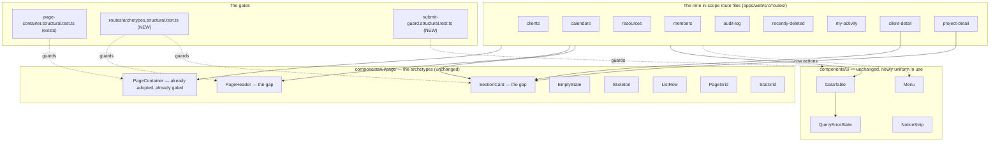

# Feature Spec: Page consistency — the non-canvas screens

- **Status:** Approved — product owner, 2026-09-16 (see §7)
- **Author(s):** feature-analyst (Product Owner / Solution Architect / Technical Lead hats)
- **Date:** 2026-09-16
- **Tracking issue / epic:** _(none yet)_
- **Roadmap link:** new entry required — `docs/ROADMAP.md`, under the design/UI theme
  (`check:adr-coverage` refuses an ADR that neither appears there nor carries a written exemption,
  `scripts/check-adr-coverage.mjs:49-67`)
- **Related ADR(s):** ADR-0097 (the archetypes, the surface scopes, the ratchets, Landing F1's row
  actions), ADR-0098 (the archetypes as a **gate**, and the row-spread defect), ADR-0143 (the same
  job done for one screen — and the two remedies it withdrew on measurement), ADR-0142 D4 (a remedy
  is measured before it is built), ADR-0110 D5 (a gate is verified red against the defect it names),
  ADR-0113 (a problem statement can be stale because of a state the product was put into),
  ADR-0083 / ADR-0082 (shading, and the field/button discriminator), ADR-0118 (the control-height
  axis), ADR-0088 D1 (no `VITE_` flag), ADR-0105 (what makes a spec mandatory).
  **A new ADR is required — see §4.10. `ADR-0145` is the next free number today** (`docs/adr/` tops
  out at 0144); re-derive at filing, because ADR-0071 and ADR-0079 both record a number being taken
  between the plan and the milestone.

---

## 0. What I verified before writing this, and what it changed

Per `docs/PROCESS.md` "Decision-bearing claims carry their evidence" and CLAUDE.md §19.11 — **the
brief is not evidence.** Every grounding claim handed to me was re-checked against the code. Most
held. **Three did not**, and two of the three change the work.

| #   | Claim as briefed                                                                                | Verdict                                         | Evidence                                                                                                                                                                                                                                                                                                                                                                                                   |
| --- | ----------------------------------------------------------------------------------------------- | ----------------------------------------------- | ---------------------------------------------------------------------------------------------------------------------------------------------------------------------------------------------------------------------------------------------------------------------------------------------------------------------------------------------------------------------------------------------------------- |
| 1   | Five screens hand-roll `mt-2 flex flex-wrap items-center justify-between gap-4` + a bare `<h1>` | **holds**                                       | `clients.tsx:15-18`, `calendars.tsx:55-58`, `resources.tsx:64-74`, `recently-deleted.tsx:19-21`, `client-detail.tsx:67-75`, `project-detail.tsx:95-118`. `audit-log.tsx:41` and `my-activity.tsx:38` carry the bare `<h1>` with no row at all.                                                                                                                                                             |
| 2   | `PageHeader` is used by 1 of 6; `SectionCard` by 1 of 8                                         | **holds**                                       | `rg 'PageHeader\|SectionCard' apps/web/src --glob '!**/*.test.*'` returns 17 files; outside the primitives, `features/overview/` and `features/staff/`, the only in-scope consumers are `routes/members.tsx:3` and its own `features/members/components/InvitationsSection.tsx`. Members is the converted exemplar; the other **eight** route files use neither.                                           |
| 3   | Three treatments exist for "a named sub-section"                                                | **holds**                                       | `SectionCard` (`members.tsx:30`); a bare `<h2 className="mt-6 text-lg font-medium">` (`client-detail.tsx:76`, `project-detail.tsx:119`); the same `<h2>` inside a flex action row (`ProjectCalendarsSection.tsx:187-198`).                                                                                                                                                                                 |
| 4   | Persistent `Clear filters` is on audit-log only                                                 | **holds**                                       | `AuditFilterBar.tsx:178` renders it in the bar. `CalendarsTable.tsx:372` and `ResourcesTable.tsx:427` render it **inside the empty state only**, so a filtered result of 3 rows offers no route back.                                                                                                                                                                                                      |
| 5   | Clients has no search or filter at all                                                          | **holds, and it is backend**                    | The API accepts **no `q` parameter**: `clients.service.ts:42` takes `{ limit, cursor }` and `client.repository.ts:46-57` builds no `where` beyond org scope and soft-delete. Compare `calendar.repository.ts:25-28`. So this is an API change, not a UI one — see CQ-1.                                                                                                                                    |
| 6   | Native `disabled` on a self-mutating submit is at **eight** dialogs                             | **UNDERCOUNT — it is TEN**                      | `rg 'type="submit"[^>]*\sdisabled=' apps/web/src` (multiline) returns ten. The brief's eight, plus **`ShareLinksDialog.tsx:312`** and **`CreateOrganizationForm.tsx:45`**. Of 23 `type="submit"` sites in `apps/web/src`, ten use the native attribute and thirteen already use `aria-disabled`. See §0.1.                                                                                                 |
| 7   | `--row-h` governs nothing                                                                       | **holds, and the claim is false in TWO places** | `rg 'row-h' apps/web` returns the declaration (`globals.css:941`), the gate that compares it to `GANTT_ROW_HEIGHT` (`row-rhythm.structural.test.ts:26`), a docblock example, and **two false claims**: `globals.css:936-937` ("ONE rhythm for the Gantt … and the tables") and `list-row.tsx:72` ("Its height comes from `--row-h`" — the class string is `border-b py-2`). No production CSS consumes it. |
| 8   | The page **frame** is drifting                                                                  | **DOES NOT HOLD — it is done**                  | `PageContainer` is imported by all nine in-scope route files and the frame is already a **gate** (`page-container.structural.test.ts`, verified red against thirteen sites in nine files). Nobody should plan frame work. What drifts is the **header row and the section**, which that gate does not see.                                                                                                 |
| 9   | ADR-0097 Landing F1 is the precedent for one row-action shape                                   | **holds, with a caveat that matters**           | `CalendarsTable.tsx:232-244` records the decision — primary visible, the rest behind `⋯`. But Landing F **deliberately narrowed** from ~10 tables to **one**, on crowding. Clients (2 actions) and Resources (3) were knowingly left. This epic's argument is **uniformity**, which F1 did not ask — see §4.5, which states that rather than letting it read as a quiet reversal.                          |

### 0.1 The ten sites, re-derived

Ten `type="submit"` controls take the native attribute. `DESIGN_SYSTEM.md:599-607` forbids it by
name — _"A control that blocks itself during its own mutation uses `aria-disabled` plus a
submit/click guard — never the native `disabled` attribute"_ — because the control leaves the tab
order the instant the request starts and returns when it settles, throwing a keyboard user to
`<body>` twice per save. `TECH_DEBT` #17a records it re-learnt at ADR-0060 M6, ADR-0063 M6 and
ADR-0074 M2.

| File                                                              | Line |
| ----------------------------------------------------------------- | ---- |
| `features/clients/components/ClientFormDialog.tsx`                | 110  |
| `features/projects/components/ProjectFormDialog.tsx`              | 110  |
| `features/plans/components/PlanFormDialog.tsx`                    | 138  |
| `features/resources/components/ResourceFormDialog.tsx`            | 424  |
| `features/members/components/InviteMemberDialog.tsx`              | 114  |
| `features/baselines/components/CreateBaselineDialog.tsx`          | 93   |
| `features/dependencies/components/EditDependencyDialog.tsx`       | 205  |
| `features/cross-plan-dependencies/.../AddCrossPlanLinkDialog.tsx` | 367  |
| **`features/share/components/ShareLinksDialog.tsx`**              | 312  |
| **`features/organizations/.../CreateOrganizationForm.tsx`**       | 45   |

The correct shape is already in the tree at `CalendarFormDialog.tsx:456-466`: `aria-disabled` +
`aria-busy` + `className="aria-disabled:pointer-events-none aria-disabled:opacity-60"`.

**`MembersTable.tsx:32` is a different case and falls in a hole between two design-system
clauses.** It is `disabled={changeRole.isPending}` on a native `<select>` inside a table row. The
field table at `DESIGN_SYSTEM.md:632` makes native `<select>` a named exception — _"there is no
read-only `<select>`"_ — but that exception is written for a **gated** field (no permission, pen
held elsewhere), not for a control disabling itself during its own mutation, which is the
**button** clause's subject. Neither clause covers "a select during its own mutation". §4.7 decides
it and §6 CQ-3 asks for the accessibility reviewer's sign-off, because the resolution involves
`aria-disabled` on a control ADR-0083 says elsewhere must not carry it.

### 0.2 The scope is NINE route files, and the harness measures a different eight

Stated first because I got it wrong in my own first draft, which is the exact failure this epic is
about. The product owner's scope is the six named screens plus four neighbours:

| In scope (9 route files + 1 component)                                                                                                                                                             | Not in scope                                                                             |
| -------------------------------------------------------------------------------------------------------------------------------------------------------------------------------------------------- | ---------------------------------------------------------------------------------------- |
| `clients`, `calendars`, `resources`, `members`, `audit-log`, `recently-deleted`, `my-activity`, `client-detail`, `project-detail`, and `features/calendars/components/ProjectCalendarsSection.tsx` | `account` and `onboarding` (declared exceptions); `plan-detail` and every canvas surface |

**`measure-page-drift.mjs:21-30` measures a different eight**: it includes `account` — a declared
exception — and **omits `client-detail` and `project-detail` entirely**, which carry **four** of the
ten hand-rolled `<h1>` sites and **two** of the three `<h2>` sites between them. So §1's "three
vertical rhythms across eight screens" is a true statement about a page list that is neither the
scope nor a subset of it.

It does not invalidate §1 — the three rhythms are three rhythms — but it means **two in-scope screens
have never been measured**, and both of them sit under a `Breadcrumbs` and therefore have a fourth
rhythm of their own that nothing has recorded. M0-T1 fixes the page list before any conditions are
judged against it. FC-1 is written over the **scope**, not over the harness's list.

### 0.3 Two things the M0 harnesses do not record, and one cross-check that passed

`measure-page-drift.mjs` and `measure-page-density.mjs` (both written for this epic) do not record
**the Project Explorer's width**, and every `x` offset in §1 is conditional on it. That is
ADR-0113's finding one instrument along: _the state the product had been put into_ silently became
part of the measurement.

It is worth stating because the numbers survive the check. The Explorer's default is **276 px**
(`use-explorer-prefs.ts:25`), expanded by default. At a 1646 viewport that leaves `main` at
≈1370 px; `PageContainer`'s default `max-w-6xl` is 1152, centred, so the container's left edge is
`276 + (1370 − 1152) / 2 ≈ 384.5`, and `p-6` puts content at **≈408.5**. The harness reported a
client's name at **x = 410**. Two derivations sharing no code, agreeing to 1.5 px — so §1's figures
are from the default Explorer state, and the **content measure today is 1104 px**, which is also
the widest of the four description measures §1 reports. Everything ties.

M0-T1 makes the harness record the state rather than leaving the next reader to do that arithmetic,
**and fixes its page list per §0.2 in the same task** — the two defects are in the same twelve lines.

---

## 1. Business understanding

### Problem

The product owner, 2026-09-16, verbatim:

> _"do you think the learnings and new approach should be used across the rest of the pages that
> don't include the canvas. i'm thinking Clients, Calendars, Resources, Members, Audit Log, recently
> deleted pages which all appear to be drifting from a uniform standard"_

Asked whether the complaint was uniformity or density, they answered **both**. Both are real, they
have different causes, and the second one inverts the obvious remedy.

**Uniformity.** ADR-0097 Landing A built **six** page archetypes — and ADR-0143 added `PageGrid` and
`StatGrid`, making eight — so that a screen's frame, heading, section, empty state, loading shape and
row are each **one decision**. ADR-0098 made "assembled from
the archetypes" a **gate** for the organisation landing; ADR-0143 pointed a second copy of that gate
at the staff console. The six screens a planner uses every day got neither. Measured at 1646:

| Measure                     | Finding                                                                                                                                                          |
| --------------------------- | ---------------------------------------------------------------------------------------------------------------------------------------------------------------- |
| `<h1>` top edge             | **75 / 83 / 85 px** — three vertical rhythms across the eight screens the harness visits (§0.2: a fourth, on the two breadcrumbed detail screens, is unmeasured) |
| Page-description measure    | **267 / 624 / 672 / 1104 px** — four measures for the same kind of prose                                                                                         |
| Screens using `PageHeader`  | **1 of 6** (members). Five hand-roll a near byte-identical `
` + bare `<h1>`                                                                                 |
| Screens using `SectionCard` | **1 of 8**. Three different treatments exist for "a named sub-section"                                                                                           |
| Row first-fact → last-fact  | **754–1030 px** — a client's name at x=410, its actions at x=1164                                                                                                |
| Row actions                 | **Three patterns** — bare `Edit`/`Delete` text buttons (clients); `Edit` + `⋯` (calendars); three always-visible ghost buttons (resources)                       |
| Persistent `Clear filters`  | Audit-log only. On calendars and resources it exists **only inside the empty state**, so a planner looking at 3 filtered rows has no one-click way back          |

Nothing here is a mistake anybody made. Each screen was built or last touched by the epic that
needed it, each was reviewed alone, and each was locally reasonable. That is precisely the mechanism
`page-container.structural.test.ts` was written for after the **frame** drifted thirteen times — and
that gate cannot see a heading or a section, so those two went on drifting behind it.

**Density, and why the obvious remedy is wrong.** Row height is **49 px on every table** (53 on
members) and is **not the problem**. The organisation landing's rows were 60/81/121 px, so the 2×
density defect `RowSubject` was built to fix **does not exist here**. What varies is the chrome
**before the first row**:

| Screen    | rows | px before first row | % of viewport | rows visible | screens tall |
| --------- | ---: | ------------------: | ------------: | -----------: | -----------: |
| clients   |  123 |                 180 |           18% |           16 |         6.51 |
| calendars |   81 |                 304 |           30% |           14 |         4.47 |
| resources |   80 |                 276 |           28% |           14 |         4.39 |
| audit-log |   27 |                 414 |       **41%** |            9 |         2.11 |
| members   |    1 |                 269 |           27% |            1 |         1.00 |

The audit log spends **414 px** — a bare `<h1>`, four lines of hand-rolled prose, and a filter bar —
before one row of data, and shows **9 rows** where clients shows 16. Reclaiming that to clients'
180 px would take it to ~13 rows per screen, **+44 % information per screen with no change to row
height at all.**

Two further defects are visible only at volume. **Clients has no search or filter** — 123 rows over
6.5 screens with no way to narrow, on the one list where calendars and resources both have one. And
`Edit`/`Delete` repeated per row becomes **246 text buttons** down that page.

**Why now.** ADR-0143 did exactly this job for one screen a day ago, and recorded two remedies it
had to **withdraw on measurement** — so the method and its traps are fresh and citable rather than
re-derivable at cost. Doing the remaining nine screens now means the archetypes are proven on every
non-canvas surface in the product, and the gate that keeps them there is written once rather than a
third and fourth time.

### Users

Every authenticated role, on the screens they can reach. RBAC is unchanged by this epic — no
permission, scope or gate moves — but the shading rules interact with it and are stated:

- **Org Admin** — the only reader of `/audit-log` and of the invitations section; sees every row
  action on every library screen.
- **Planner** — the primary user of Clients, Calendars, Resources and Recently deleted; holds
  `calendar:manage_org` and therefore sees the shared-library write affordances.
- **Contributor / Viewer** — read the same screens with the write affordances **omitted, not
  shaded**, which is today's behaviour on all six (`canWrite ? … : null`) and stays.
- **External Guest** — reaches none of these screens. `/share` is a sibling of `_authed` and is out
  of scope entirely.

### Primary use cases

1. Open any of the nine screens and find the title, the description and the primary action in the
   same place, at the same size, at the same height down the page.
2. Read a list at volume — 123 clients, 81 calendars — and get a useful number of rows in the first
   screenful.
3. Narrow a long list and get back out of the filter in one press, from wherever you are.
4. Act on a row, with the same shape of affordance on every list.
5. Save a form from the keyboard without being thrown to the top of the document twice.

### User journeys

**Happy path (today).** A planner moves Clients → a client → a project → Calendars. The title jumps
10 px between screens, the description is a different width each time, the row actions change shape
three times, and the audit log gives them 9 rows of 27.

**Happy path (after).** The same walk: one title position, one description measure, one row-action
shape, one filter-clearing affordance, and the same list screens showing measurably more of the list
they exist to show. The diagrams are in §4.

### Expected outcomes

- Every non-canvas screen is assembled from the archetypes, and a **gate** says so — so the next
  screen inherits the system rather than a copy of it.
- The worst-offending screen's chrome falls by a measured amount, and no screen's table gets
  narrower doing it.
- Ten dialogs stop dropping keyboard focus on save.
- Two false claims about `--row-h` stop being in the tree.

### Success criteria

Measured at **1646 × 1000** with the **Explorer at its 276 px default, stated in the output**,
against the §1 baseline and the same seeded fixture (123 clients / 81 calendars / 80 resources).
These are also the falsification conditions, and they are committed **before any build** per
ADR-0142 D4 — this repository has six consecutive epics whose width expectation was contradicted by
its own measurement.

| #        | Criterion                                                                                                                                                                                                                           | Instrument                                         |
| -------- | ----------------------------------------------------------------------------------------------------------------------------------------------------------------------------------------------------------------------------------- | -------------------------------------------------- |
| **FC-1** | `h1.top` takes **exactly one** distinct value across all **nine** in-scope screens (today: three across the eight measured, plus an unmeasured fourth — §0.2), and the page-description measure takes **exactly one** (today: four) | `measure-page-drift.mjs`, page list fixed by M0-T1 |
| **FC-2** | The **spread** of chrome-before-first-row across the five tabular screens falls from **234 px** (180–414) to **≤ 80 px**, **and** the worst screen falls by **≥ 100 px**                                                            | `measure-page-density.mjs`                         |
| **FC-3** | **No in-scope table is narrower after than before**, at 1646 and at 1280                                                                                                                                                            | `measure-page-drift.mjs` (`headers`)               |
| **FC-4** | `SCREEN_WEIGHT_CEILING` **falls by ≥ 10** from 168; `ARBITRARY_SIZING_CEILING` does not rise above 17                                                                                                                               | `test token-architecture`                          |
| **FC-5** | The new archetype gate was **verified red** against the pre-conversion tree and named **all nine** in-scope route files; it carries a pinned positive case                                                                          | vitest                                             |
| **FC-6** | Zero `type="submit"` controls in `apps/web/src` carry the native `disabled` attribute, gated                                                                                                                                        | vitest, verified red at ten sites                  |

**Derivations, so none of these is a number tuned to an answer.**

- **FC-2's 234 px** is `414 − 180`, read off §1. **The ≥ 100 px** is conservative against a derived
  128: the audit log's two description paragraphs are 253 and 297 characters at `text-sm` across a
  1104 px measure, which is ~3 lines each — `6 × 20 px` line-height plus two `mt-1` margins ≈ 128 px,
  and that block is entirely reducible (§4.4).
- **FC-4's ≥ 10** is conservative against a derived 13: the conversion removes **ten** hand-rolled
  `<h1 … font-semibold …>` and **three** `<h2 … font-medium>` from screen files into primitives
  (`rg 'h[12] className=' apps/web/src --glob '!**/*.test.*'`), leaving 3 of headroom for new code.
  The nine in-scope route files hold **21** weight sites between them today — all of them in the
  eight that are unconverted; `members.tsx` holds **zero**, which is the clearest single piece of
  evidence that the conversion pays this ratchet back.
- **FC-3 is not decoration.** It is ADR-0143 §8.1's condition restated, because that epic shipped an
  approved "two columns throughout" that arithmetic nobody had done would have made every table
  **narrower**. This epic touches container widths and column widths and must not repeat it.

### Withdrawal bars — what makes this epic stop

Stated now, so a failing measurement is a verdict rather than a negotiation.

- **If FC-2's worst screen falls by < 60 px**, the **density half is withdrawn** and the epic ships
  as uniformity only. The uniformity half stands on FC-1/FC-4/FC-5, which do not depend on it.
- **If FC-3 fails**, the change that caused it is reverted, not reinterpreted. ADR-0143 records
  reading a committed condition's intent clause in order to get past it as _"exactly the move that
  makes conditions decoration"_.
- **If FC-1 cannot reach one value without a per-screen override**, the archetype is wrong and the
  finding goes back to the product owner rather than being papered over with a `className`.

### Open questions

Three are **CRITICAL** and are in §6. Everything else has a stated default and is not blocking:

- **Container width.** Default: **unchanged** (`default`, `max-w-6xl`). Reasoning in §4.3 — both
  obvious alternatives are already disproved in the register.
- **`account.tsx` / `onboarding.tsx`.** Default: the **frame** exception stands exactly as
  `page-container.structural.test.ts:45-54` declares it. `account.tsx` additionally adopts
  `PageHeader`, which costs **zero width** (the header does not set the measure) and removes one
  more hand-rolled `<h1>`; `onboarding.tsx` has no `<h1>` at all and is untouched.
- **`plan-detail.tsx:61`'s not-found `<h1>`.** Default: **out of scope**. It is the canvas route,
  which the product owner's scope excludes, and converting one branch of it would leave that file
  half-converted — worse than not starting.
- **Feature flag.** Default: **none.** ADR-0088 D1 — `import.meta.env.VITE_*` is inlined at build
  time, `docker-publish.yml` passes no `VITE_` build arg, so a flag is a second JSX root maintained
  forever and never an operator rollback. The rollback is a commit boundary, and this epic is sliced
  so each milestone is one.

---

## 2. Functional requirements

### User stories & acceptance criteria

> **US-1** — As **any planner**, I want every screen's title and description in the same place at
> the same size, so that moving between screens does not move the page under me.
>
> **Acceptance criteria**
>
> - **Given** any of the nine in-scope screens, **when** it renders at 1646, **then** the `<h1>`'s
>   top edge is the same value on all nine — with the two breadcrumbed detail screens forming their
>   own internally-consistent group **only if** M1-T3 measures that the breadcrumb legitimately
>   displaces them, and the amendment is written down rather than assumed (§1, FC-1's risk).
> - **Given** any screen with a page description, **then** it is rendered by `PageHeader`'s
>   `description` slot, so it is wired with `aria-describedby` to the title rather than left as a
>   stray following paragraph (the ADR-0073 C2.5 rule: a caveat reachable only by reading serially
>   is not reachable).
> - **Given** a screen with a primary action, **then** it is in `PageHeader`'s `actions` slot.
> - **Given** the pre-conversion tree, **then** the gate that asserts this **fails**, naming all
>   eight files.

> **US-2** — As **a planner reading a long list**, I want more of the list in the first screenful,
> so that 123 clients is a list rather than six screens of scrolling.
>
> - **Given** the audit log at 1646, **then** the chrome before its first row is at least 100 px
>   shorter than today's 414.
> - **Given** the five tabular screens, **then** the spread between the shortest and tallest chrome
>   is ≤ 80 px (today 234).
> - **Given** any of them, **then** no table is narrower than it is today — reclaiming height must
>   not be paid for in width.
> - **Given** the prose that is removed from a page header, **then** the fact it carried is still
>   reachable — relocated, never deleted (§4.4).

> **US-3** — As **a planner acting on a row**, I want one row-action shape on every list, so that
> the same operation does not wear three appearances.
>
> - **Given** a row with more than one action, **then** the primary is visible and the rest sit
>   behind a `⋯` menu (ADR-0097 Landing F1's shape).
> - **Given** an action the reader cannot take, **then** it is **shaded with its reason** inside the
>   menu and stays an arrow-key stop (ADR-0082; `UX_STANDARDS.md:130-140`).
> - **Given** a row every one of whose items would be shaded, **then** no trigger renders at all.
> - **Given** a keyboard user, **then** the menu is reachable from the row without a pointer.

> **US-4** — As **a planner who has filtered a list**, I want one press back to everything, from
> wherever I am.
>
> - **Given** any active filter on calendars, resources, audit-log or my-activity, **then** a
>   `Clear filters` control is present **in the filter bar**, not only inside the empty state.
> - **Given** no active filter, **then** no such control renders (there is nothing to clear —
>   ADR-0082's omit clause).
> - **Given** it is pressed, **then** focus is not dropped to `<body>`.

> **US-5** — As **a keyboard user saving a form**, I want to keep my place.
>
> - **Given** any of the ten dialogs in §0.1, **when** the submit is pressed and the mutation is in
>   flight, **then** the control keeps its place in the tab order and `document.activeElement` is
>   still that control.
> - **Given** it is pressed again while in flight, **then** no second request is sent — the guard,
>   not the attribute, is what prevents that.
> - **Given** the tree, **then** a structural gate refuses a `type="submit"` carrying native
>   `disabled`, verified red at all ten sites.

> **US-6** — As **an engineer reading the tree**, I want `--row-h` to describe what it governs.
>
> - **Given** `globals.css:936-937` and `list-row.tsx:72`, **then** neither claims the token governs
>   the tables.
> - **Given** the Gantt, **then** its rhythm and its gate are **unchanged** — this story changes
>   comments and scope, not a pixel.

> **US-7** — _(conditional on CQ-1)_ As **a planner with 123 clients**, I want to search them.
>
> - **Given** a `?q=` term, **then** the list narrows server-side, case-insensitively, on name.
> - **Given** the term, **then** it lives in the URL so the narrowed view survives a reload and can
>   be pasted to a colleague (`UX_STANDARDS.md`; the rule calendars and resources already follow).
> - **Given** a term matching nothing, **then** the empty state says so as a **filtered** empty —
>   distinct from "this organisation has no clients".

### Workflows

**W-1 Arrive at a list.** Route renders `PageContainer` → `PageHeader` (title, one-sentence
description, primary action) → optional filter bar → `DataTable`. Loading is `DataTable`'s skeleton;
failure is `QueryErrorState`; empty is `DataTable`'s framed `empty`. None of those four changes.

**W-2 Narrow and clear.** Filter bar writes to `useUrlFilterState` → URL → query. `Clear filters`
appears in the bar the moment any filter is non-default, and returns focus to itself.

**W-3 Act on a row.** Primary action in the open; `⋯` opens the APG `Menu`; Esc/selection returns
focus to the trigger (`menu.tsx`, unchanged).

**W-4 Save.** Submit sets `aria-disabled` + `aria-busy`; `pointer-events-none` covers the pointer;
the form's `onSubmit` guard covers Enter. Focus never moves.

### Edge cases

| Case                                                         | Expected                                                                                                                  |
| ------------------------------------------------------------ | ------------------------------------------------------------------------------------------------------------------------- |
| A screen with no description (`clients`, `calendars`)        | `PageHeader` renders no paragraph and no `aria-describedby` — it already branches on this (`page-header.tsx:44`)          |
| A screen with no primary action (`audit-log`, `my-activity`) | No `actions` slot; the header must not reserve width for it (`page-header.tsx:60` already conditional)                    |
| A very long client / project name                            | `PageHeader`'s `wrap-anywhere` + `min-w-0` (`page-header.tsx:47-49`) — better than today's bare `<h1>`, which has neither |
| `client-detail` / `project-detail` **not-found** branch      | Keeps `role="alert"` + destructive ink and its exit link (`client-detail.tsx:36-54`) — an **error**, not an empty state   |
| A Contributor on a library screen                            | Write affordances **omitted** (today's behaviour); if every row item would be shaded, no `⋯` trigger renders              |
| A row with exactly one action                                | It stays visible with **no** `⋯` — a one-item menu is a click bought for nothing (§4.5)                                   |
| Filter active **and** the list non-empty                     | `Clear filters` in the bar — the case today's empty-state-only placement misses entirely                                  |
| Below `md`                                                   | Any column-width preference is `md:`-prefixed, so narrow viewports are byte-for-byte what they are (ADR-0143 M5's rule)   |
| Mutation fails after the submit was shaded                   | `aria-disabled` clears, focus is still on the control, the error renders where the dialog already renders it              |
| Two rapid submits                                            | The second is swallowed by the `onSubmit` guard, not by the DOM                                                           |

### Permissions

**No RBAC change, and none is intended.** Every `canWrite` / `canManageOrg` / `canReadAuditLog`
derivation is untouched; `useOrgRole` and `lib/rbac` are not modified. Two shading rules interact
with permissions and are stated because getting them wrong is invisible:

- **Omit, do not shade, where the object does not offer the action to this reader at all** — which
  is today's `canWrite ? … : null` on all six screens (ADR-0082's first omit clause).
- **Shade with a reason inside a `⋯` menu** where the action exists and is refused by a state the
  reader can change. This epic introduces no such case on these screens; the rule is stated so the
  next one is not a judgement call.

### Validation rules

None new, unless CQ-1 is taken. If it is: `q` is an optional trimmed string, max 100 characters,
matching the `ListCalendarsQuery` DTO's existing shape so the two cannot drift.

### Error scenarios

| Scenario                         | Detection         | User-facing result                                              | Status |
| -------------------------------- | ----------------- | --------------------------------------------------------------- | ------ |
| A list query fails               | `query.isError`   | `QueryErrorState` with retry — **unchanged**, one shape already | 5xx    |
| Non-Org-Admin opens `/audit-log` | `canReadAuditLog` | `NoticeStrip` refusal — **unchanged** (`audit-log.tsx:92-105`)  | n/a    |
| Client/project does not exist    | `query.isError`   | `role="alert"` + exit link — **unchanged**                      | 404    |
| Submit pressed twice in flight   | `onSubmit` guard  | One request; no focus movement                                  | n/a    |
| `?q=` with no matches (CQ-1)     | empty page        | Filtered-empty copy + `Clear filters`, never "no clients"       | 200    |

---

## 3. Technical analysis

| Area           | Impact                         | Notes                                                                                                                                                                                                                                                                                                                                   |
| -------------- | ------------------------------ | --------------------------------------------------------------------------------------------------------------------------------------------------------------------------------------------------------------------------------------------------------------------------------------------------------------------------------------- |
| Frontend       | **high**                       | 8 route files, ~8 feature table/section components, 10 dialogs, 1 new structural gate. No new primitive is required — the archetype set is complete for this work (§4.9).                                                                                                                                                               |
| Backend        | **none — unless CQ-1**         | If clients search is taken: `client.repository.ts`, `clients.service.ts`, `clients.controller.ts` + a query DTO, mirroring `calendar.repository.ts:25-28` exactly.                                                                                                                                                                      |
| Database       | **none**                       | No model, column, index, constraint or migration. **`database-architect` is deliberately not engaged because there is nothing to design** — recorded so "the agent was not run" cannot later read as an oversight (CLAUDE.md §19.3's own distinction). **If CQ-1 is taken it IS engaged**, for the index question alone (§4.8).         |
| API            | **none — unless CQ-1**         | Then one optional query parameter and its OpenAPI declaration.                                                                                                                                                                                                                                                                          |
| Security       | **none**                       | No guard, scope, permission or audit row moves. No new route under the default scope.                                                                                                                                                                                                                                                   |
| Performance    | **low; one measured question** | Client-only for M1–M6. CQ-1 adds an unindexed `name ILIKE '%q%'`, which is exactly what ADR-0053 M4 measured for calendars (0.21 ms default page / 2.9 ms worst-case search at 5,000 rows) — **re-measured for clients, never inherited** (§4.8).                                                                                       |
| Infrastructure | **none**                       | **No Playwright config and no CI step is added.** Every in-scope screen already has a journey: `e2e/clients.spec.ts`, `e2e/members.spec.ts`, `e2e/recently-deleted.spec.ts`, `e2e-library/library.spec.ts`, `e2e-audit/audit.spec.ts`, `e2e-shell/org-less-screens.spec.ts`. So `check:ci-roster` and `check:e2e-roster` are untouched. |
| Observability  | **none**                       |                                                                                                                                                                                                                                                                                                                                         |
| Testing        | **high**                       | Two new structural gates; existing unit suites are the before/after oracle; **eight journeys must be run**, not one (below).                                                                                                                                                                                                            |

**The testing cost is larger than it looks and is stated rather than discovered.** CLAUDE.md §19.8
and ADR-0096's finding require the **base** journey (`test:e2e`, no suffix) whenever a screen
changes — it is the suite covering the shipped default and the one `scripts/e2e-local.sh` could not
reach for months. ADR-0091's retrospective adds: after any label or layout change, run **every**
journey (`scripts/e2e-sweep.sh`), because three journeys broke across that epic and CI found each
one separately. This epic changes labels and layout on nine screens. Budget the sweep.

### Dependencies

**Prerequisites**

- **M0 must land first.** Not because the numbers in §1 are doubted — they cross-check (§0.3) — but
  because the harness measures the wrong page list (§0.2), records none of the state its figures
  depend on (§0.3), and does not attribute the row spread **per table**, which is what §4.3's remedy
  is chosen against.

**Affected features (blast radius outside the six named screens)**

- `features/projects/ProjectsTable`, `features/plans/PlansTable` — reached through `client-detail`
  and `project-detail`, which the product owner put in scope as neighbours.
- `features/share/ShareLinksDialog`, `features/organizations/CreateOrganizationForm`,
  `features/baselines/CreateBaselineDialog`, `features/dependencies/EditDependencyDialog`,
  `features/cross-plan-dependencies/AddCrossPlanLinkDialog` — the submit fix reaches these five
  **outside** the six screens. That is deliberate: leaving them is the failure this register records
  most often, one correct pattern applied to a control and not its neighbour (ADR-0064 §7,
  ADR-0067, ADR-0121). It is flagged in the plan as the one task whose diff leaves the epic's
  nominal scope.

**Explicitly NOT dragged in**

- **The canvas surfaces.** `plan-detail.tsx`, the workspace, the Gantt, the activities panel. The
  product owner's scope is the non-canvas screens and `apps/web/src/features/tsld|gantt|activities`
  contributes zero files to this epic's diff.
- **`DataTable`'s column-class contract.** See §4.9 F1 — it is a real defect, it is out of scope,
  and it is filed rather than smuggled in.
- **The activities-panel virtualization finding** — filed as tech debt by decision, not fixed here.

---

## 4. Solution design

### 4.1 The governing rule, quoted rather than invented

`docs/DESIGN_SYSTEM.md:546-550`:

> **The authoring rule: reach for the archetype, or raise the requirement — never invent a one-off.**
> A hand-rolled frame that happens to match today's archetype looks identical on screen and drifts
> the first time either changes, which is a defect nobody can see. A screen that needs something
> these do not offer wants a **seventh archetype**, not a bespoke layout in a feature folder.

Everything below follows from that. The notable thing about this epic is that it needs **no new
archetype at all** — the set built by ADR-0097 and extended by ADR-0143 covers all nine screens.
That is itself evidence the system is right and only its adoption is behind.

### 4.2 Architecture overview

### 4.3 The container is unchanged, and the row spread is closed at the columns

**This is the decision most likely to be got wrong, and both obvious answers are already disproved
in the register.**

- **`narrow` (`max-w-4xl`, 896 px)** would cut the 754 px spread by 256 and is what ADR-0098 chose
  for the organisation landing. It does not transfer: that screen is a `ListRow` list pairing two
  facts, and these are 3–6 column tables. Narrowing them is ADR-0143 §8.1's trap in the mirror —
  that epic's approved "two columns throughout" would have made every table narrower while the page
  got wider, and the arithmetic had not been done.
- **`wide` (`max-w-screen-2xl`)** makes the spread **worse**, since at 1646 the available width is
  ≈1322 and the container would take all of it.
- **`w-full` on the trailing column** is already **withdrawn on measurement** (ADR-0143 M5): it does
  take the surplus and squeezes every other column to `min-content` doing it — headings wrapped onto
  three lines, an address broken mid-word across four, the page grew 11,066 → 13,172 px.

**What shipped for the staff console, and what ships here, is a width preference on the _leading_
columns**, `md:`-prefixed — a preference rather than a claim on the remainder, so a column still
grows past it when its content needs to, and below `md` the tables are byte-for-byte unchanged.

**The remedy is chosen per table, because the cause differs per table.** M0-T2 attributes the
754–1030 px spread to a named table before any column is touched. The shapes already visible:

- **clients** — 3 columns (Name | Description | Actions) with Description empty on roughly half the
  rows in a realistic fixture. The spread is real and its cause is a **sparse** column, not a wide
  one.
- **calendars / resources** — 5–6 columns that genuinely fill the measure; a wide first-to-last
  distance is what a table with six columns looks like and may be **no defect at all**.

Saying that now matters: importing ADR-0098's diagnosis wholesale onto a table would be exactly the
inherited-claim failure §0 exists to catch.

### 4.4 The prose: one description, and the rest relocated rather than deleted

`PageHeader` offers **one** `description` slot, rendered `mt-1 text-sm` and wired with
`aria-describedby` to the `<h1>`. Four of the nine screens carry more than one paragraph; the audit
log carries two long ones and `my-activity` three.

**The finding that makes this cheap: the audit log's page prose largely restates its own empty
state.** `audit-log.tsx:58-75` explains what the log records and what it deliberately does not;
`AuditEventList`'s `emptyMessage` at `audit-log.tsx:139` says the same thing compressed — _"Editing
an activity's own fields does not appear in this log — anything that removes something, or that
changes the rules other people's work is judged by, does."_ The page-level version is a
**restatement**, permanently occupying ~128 px above every reader including the ones who already
know.

So: **one sentence in `description`; the coverage rule moves into a collapsed disclosure directly
beneath the header, and stays `aria-describedby`-linked to the table region** — which
`AuditEventList` already supports through `describedById` (`my-activity.tsx:88` uses it today for
exactly this purpose).

Two things are stated rather than assumed:

- **Nothing is deleted.** The audit log's coverage rule is a fact a reader cannot infer and went
  wrong twice in opposite directions before reaching its present wording (`audit-log.tsx:42-57`
  records both). It is relocated, not cut.
- **`aria-describedby` resolving to a collapsed `
`** is **reasoned from specification, not
  observed** — the accname spec resolves hidden referenced elements, and this is an established
  technique, but a closed `
` is `content-visibility`-hidden rather than `display:none` and
  I have not put a screen reader on it. It carries the same honest label ADR-0083 and ADR-0122 use,
  and M3's journey verifies the accessible description is non-empty in both states.

### 4.5 One row-action shape — and why this is not a quiet reversal of ADR-0097 Landing F1

`CalendarsTable.tsx:232-244` records the decided shape: **the primary action stays visible; the rest
move behind a `⋯`**, with every shaded item keeping its reason. Its own comment is careful to say
what it is not — _"It is NOT 'put the row's actions in a menu'"_ — because `UX_STANDARDS.md:124`'s
row-menu rule is about **dense list and tree rows**, which have nowhere to show actions at all, and
a table with a visible actions column is not that.

**Landing F asked "which tables are crowded?" and correctly answered "one."** Clients (2 actions)
and Resources (3) were knowingly left. This epic asks a **different** question — "do three tables
answer the same question three ways?" — and the answer is yes. Both can be true, and recording that
is what stops this reading as a settled decision being re-opened by whoever touched it last.

**The rule, stated so the next table is not a judgement call:**

> A row with **one** action shows it. A row with **more than one** shows the primary and puts the
> rest behind a `⋯`.

The rule is uniform even where its output differs, which is the same contract `PageContainer`'s
`width` prop has. Its per-table consequence, so nothing is discovered later:

| Table                   | Today                                    | After                           |
| ----------------------- | ---------------------------------------- | ------------------------------- |
| Clients                 | `Edit` `Delete`                          | `Edit` + `⋯`(Delete)            |
| Resources               | `Edit` `Archive` `Delete` (+`View`)      | `Edit` + `⋯`(Archive, Delete…)  |
| Calendars               | `Edit` + `⋯`                             | **unchanged** — it is the model |
| ProjectCalendarsSection | up to 3 visible (`Move to…`, `Edit`, …)  | `Edit` + `⋯`                    |
| Projects / Plans        | per `ProjectsTable:68` / `PlansTable:69` | the same rule, applied          |
| Members                 | one `Remove` + an inline role `<select>` | **unchanged** — one action      |
| Recently deleted        | one `Restore`                            | **unchanged** — one action      |

**The accepted cost is written down:** Clients' `Delete` goes behind a press. It is the rarer of the
two and the destructive one, so burying it is defensible on its own merits — but the honest framing
is that this trades one press on a rare action for a uniform shape, and CQ-2 puts that to the
product owner rather than deciding it for them.

### 4.6 `Clear filters` is persistent

One shape, in the bar, whenever any filter is non-default — the shape `AuditFilterBar.tsx:178`
already has. The empty-state copy keeps its own `Clear filters`, because a reader who has scrolled
to an empty result should not have to scroll back; two routes to one action is not drift when one of
them is a contextual shortcut. What **is** drift is the current state, where calendars and resources
offer the action only in the state where the list is empty — i.e. never, for the commonest case.

### 4.7 The submit guard, and the select that falls between two rules

Ten sites take `CalendarFormDialog.tsx:456-466`'s shape verbatim: `aria-disabled` + `aria-busy` +
`aria-disabled:pointer-events-none aria-disabled:opacity-60`, **plus an `onSubmit` guard**, which is
the half `DESIGN_SYSTEM.md:599` says actually prevents the double submit — `pointer-events-none`
covers the pointer and nothing covers Enter on a focused button.

**`MembersTable.tsx:32`.** A native `<select>` disabling itself during its own mutation, inside a
table row, so the focus drop lands the reader somewhere unrelated in a long roster. §0.1 establishes
that neither design-system clause covers it: the field table's `<select>` exception is written for a
**gated** field, and the button clause is written for a button.

**Decided:** it is the button clause's subject — a control blocking itself during its own mutation —
so the treatment is `aria-disabled` + a guard, and the guard is free here because the select is
**controlled** (`value={member.role}`). Ignoring the change while pending re-renders it back to the
stored role by itself; no manual revert, no uncontrolled-value problem.

**Flagged, not asserted:** `aria-disabled` on a control that remains operable is a false announcement
by ADR-0083's own reasoning for text fields (_"the field IS operable, and saying otherwise is a false
announcement"_), and the alternative — `aria-busy` alone plus the guard — announces the truth but
offers no visual affordance. **CQ-3** puts it to the accessibility reviewer rather than deciding it
here, because the two clauses genuinely disagree and picking one silently is how the hole stays.

### 4.8 `--row-h`: retire the claim, change nothing else

**The finding.** `--row-h: 1.75rem` (28 px) is declared at `globals.css:941` and **no production CSS
consumes it**. `globals.css:936-937` says it is _"ONE rhythm for the Gantt (down from 32) and the
tables"_ and `list-row.tsx:72` says _"Its height comes from `--row-h`"_ over a class string reading
`border-b py-2`. Both claims are false. The Gantt does not consume the token either — it uses the
TypeScript constant `GANTT_ROW_HEIGHT`, with the duplication deliberately **pinned** by
`row-rhythm.structural.test.ts`, whose docblock explains why (the virtualizer needs a number before
layout).

**Why "adopt it" is the wrong answer, and the design system already says so.** A table row measures
**49 px**, and that decomposes exactly: `--control-h-sm` (2rem = 32 px, the `Button size="sm"` in
the actions cell) + `py-2` × 2 (16 px) + the 1 px `border-b`. The row's height is set by a real
pointer target, not by its text. Reaching 28 px means either removing the in-row control or shrinking
it to `icon-sm`, and `DESIGN_SYSTEM.md:596-598` names `icon-sm` as ADR-0118 §D1's second exception
_"for a control inside a container whose height is fixed independently of it"_ and then says, in as
many words: **"Do not reach for it to make something compact."** The route is already closed.

**Why "re-value it" is also wrong.** 28 was the product owner's own choice at ADR-0097 CQ-B and the
Gantt is pinned to it; moving the token to match the tables would silently change the Gantt's
rhythm, which is the one thing the pinning gate exists to prevent.

**And M0 says the question does not matter.** Row height is uniform at 49 px across every table and
is **not** the density defect; the chrome is. Chasing the rhythm would spend the epic's budget on the
measurement that came back flat.

**So: retire the claim.** Correct `globals.css:936-937` to say the token is the Gantt's row rhythm;
correct `list-row.tsx:72` to describe what `ListRow` actually does (`py-2` + a border, giving a
content-sized row); leave the value, the Gantt and the gate untouched. Record in the ADR that
ADR-0097 CQ-B's "one rhythm across the Gantt and the tables" **was never built and cannot be built as
stated** without a trade the product owner has not been offered — which is the honest disposition,
and is ADR-0058's rule applied to a decision rather than to a description.

**Naming is deliberately left alone.** Renaming `--row-h` → `--gantt-row-h` would make the scope
self-evident and is tempting for exactly the reason the false docblock got written. It is declined
here because it touches a shared token and its gate for a readability gain, which is a change that
wants its own reason rather than a ride on this epic (the ADR-0105 shape). Filed as a candidate.

### 4.9 Component changes

| Component                                  | Where                    | Change                                                                                                                                        | Gated by                      |
| ------------------------------------------ | ------------------------ | --------------------------------------------------------------------------------------------------------------------------------------------- | ----------------------------- |
| `PageContainer`                            | `components/ui/page/`    | **unchanged**, already adopted by all nine                                                                                                    | existing frame gate           |
| `PageHeader`                               | `components/ui/page/`    | **unchanged**; newly consumed by eight more screens (members has it already)                                                                  | new `routes/` archetype gate  |
| `SectionCard`                              | `components/ui/page/`    | **unchanged**; newly consumed by 3 sites. Its `id` prop replaces `ProjectCalendarsSection`'s hand-rolled `ref` + `tabIndex={-1}` focus target | the same gate                 |
| `DataTable`                                | `components/ui/`         | **unchanged.** Column widths are set by callers through the existing `headClassName`                                                          | FC-3                          |
| `Menu` / a shared row-action menu          | `components/ui/menu.tsx` | **unchanged**; `CalendarRowMenu` is the model the other tables follow                                                                         | unit + journey                |
| Ten dialog submits + `MembersTable` select | 10 feature files         | `aria-disabled` + guard                                                                                                                       | new submit gate, verified red |
| `globals.css`, `list-row.tsx`              | —                        | **comments only**                                                                                                                             | —                             |

**No new primitive, no new token, no new surface scope.** If a screen turns out to need something the
archetypes do not offer, that is a **finding**, not a licence to hand-roll — and it is the finding
ADR-0098's condition exists to surface.

**Findings recorded rather than fixed:**

- **F1 — `DataTable`'s `cellClassName` replaces rather than merges with its `py-2 pr-4` default.**
  ADR-0143 M5 found this on three staff-console columns, fixed those three, and did not sweep. Five
  columns elsewhere therefore have **no cell padding at all**:
  `CrossPlanLinksSection.tsx:86`, `DependencyTable.tsx:83`, `ActivitiesTable.tsx:660`,
  `ActivitiesTable.tsx:675`, `BaselinesPanel.tsx:83`. All five are on canvas/plan surfaces this epic
  excludes. **The obvious fix is not free**: `cn('py-2 pr-4', cellClassName)` would, via
  `tailwind-merge`, **add** `pr-4` to the ~15 right-aligned action columns that deliberately omit it,
  moving every row's actions 16 px off the table edge. Filed as a new `TECH_DEBT` row with that
  arithmetic in it, so the next reader does not rediscover the trap.
- **F2 — the M0 harness measures a different eight, and records no state.** §0.2 and §0.3. Fixed in
  M0-T1 rather than filed, because this epic's own verdict depends on both.
- **F3 — `components/ui/page/index.ts:4` says "Six components" and the barrel exports eight.**
  ADR-0143 added `PageGrid` and `StatGrid` and did not update the sentence above them. A one-line
  correction, folded into M1 rather than filed: it is the epic's own subject — a document describing
  the code wrongly, in the file a reader opens to learn what the archetypes are.

### 4.10 Implementation approach & alternatives

**Chosen: convert the header first and alone, then the section, then the prose, then the row — each a
separate, independently releasable milestone.**

The order is the argument. Adopting `PageHeader` is provably close to neutral on measure (the header
does not set the container width), so M1 can be judged on one question — _does anything look
different?_ — against M0's numbers. Everything after it lands against a page whose frame **and**
heading are already the system's, so each diff is about one thing. Doing them together produces a
diff nobody can review, on nine screens at once. This is ADR-0143's own sequencing, and the product
owner's brief says the previous epic's first slice "was the right size".

**Alternatives considered**

1. **One big conversion PR across all nine screens.** Rejected: nine screens × four concerns is a
   diff whose review degenerates to "it still renders". The register's recurring finding is that
   defects survive human reads precisely at this size.
2. **A ninth page archetype — `ListPage`, taking title + filters + table.** Tempting, and rejected
   for now. The nine screens differ in ways a single component would have to accept as props
   (a description or not, filters or not, one section or three), and a props-shaped archetype is the
   bespoke layout wearing the system's clothes. If M1–M4 show the same five-line composition eight
   times, **that** is the evidence for promoting one, and it is a follow-up with a measurement behind
   it rather than a guess in front of it.
3. **Narrowing the container to close the row spread.** Rejected on §4.3's evidence.
4. **Fixing `DataTable`'s column-class contract in this epic.** Rejected: it changes ~15 tables
   across surfaces this epic excludes, for a defect none of the nine screens exhibits. §4.9 F1.
5. **Deferring the submit fix to its own epic.** Rejected: ten dialogs, one mechanical change, a
   rule already written down and re-learnt three times, and a gate that makes an eleventh
   impossible. Deferring it is how it reaches four.

**A new ADR is required.** This epic settles rules the next non-canvas screen inherits — _a screen's
header and sections belong to the archetypes and a gate says so_; _a row with more than one action
shows the primary and hides the rest_; _a control blocking itself during its own mutation is never
natively disabled, including a select_ — and it disposes of a product-owner decision (ADR-0097
CQ-B's one rhythm) that was never built. Draft outline in the plan's final milestone.

---

## 5. Links

- Implementation plan: [./implementation-plan.md](./implementation-plan.md)
- Docs this change updates: `docs/DESIGN_SYSTEM.md` (the authoring rule gains the row-action
  threshold; the `<select>`-during-mutation case joins the gated-field table), `docs/UX_STANDARDS.md`
  (persistent filter clearing; the row-action threshold), `docs/TECH_DEBT.md` (new rows for §4.9 F1
  and the `--row-h` rename candidate; `#17a` narrowed once the gate lands), `docs/ROADMAP.md` (the new
  ADR's entry), `CLAUDE.md` §16 (the register entry), `docs/adr/README.md` (the index row).

---

## 6. Critical questions

Three. Everything else in this document has a stated default and proceeds without an answer.

### CQ-1 — Should Clients gain search? _(new capability — product decision)_

**It is the sharpest volume defect in §1** — 123 rows over 6.5 screens with no way to narrow, on the
one list of the three that has no filter — and it is **a new capability, not a consistency fix**, so
it is not mine to assume. It crosses ADR-0105's triggers twice (a user-facing entry point, an API
contract), which is why it is in this spec rather than in a register row.

**Cost, derived not estimated.** The API accepts no `q` at all (`clients.service.ts:42`,
`client.repository.ts:46-57`). The work is one repository `where` fragment, one service parameter,
one controller DTO + OpenAPI declaration, and on the web side the `useUrlFilterState` + `SearchField`
composition calendars and resources already have. **`calendar.repository.ts:25-28` is a four-line
function** and this is its twin — `name: { contains, mode: 'insensitive' }`, no index, bounded by the
org composite in cursor order.

**The honest cost on the other side:** a filter bar **raises** clients' chrome from 180 px to
≈270 px, taking it from 16 rows per screen to ~14. That works against FC-2 and is called out so it
cannot later be presented as a surprise. It buys the ability to take 123 rows to 3.

**Recommendation: BUILD**, as its own milestone after the consistency work, with ADR-0053 M4's
measurement **re-run for clients rather than inherited** and `database-architect` engaged for the
index question alone. If it is declined, M7 is dropped and nothing else in the plan moves.

### CQ-2 — Does Clients' `Delete` go behind the `⋯`?

The uniform rule in §4.5 says yes: more than one action ⇒ primary visible, rest hidden. The
consequence is that deleting a client becomes two presses instead of one.

Arguments both ways, briefly. **For:** one shape on every list, which is the epic's whole subject;
and the buried action is the destructive one, which is where a moment's friction is cheapest.
**Against:** it removes a shipped affordance from the most-used list in the product to satisfy a rule
about other lists, and ADR-0097 Landing F1 already declined to touch this table on crowding grounds.

**Recommendation: YES**, on the grounds that the epic was commissioned for uniformity and this is
where uniformity costs something real. If the answer is no, the rule becomes "**three or more**
actions take the `⋯`", clients and members stay as they are, resources converts, and §4.5's table is
amended — a coherent alternative, not a fudge.

### CQ-3 — `aria-disabled` on the members role `<select>` during its own mutation?

Two design-system clauses disagree and neither covers this case (§0.1, §4.7). `aria-disabled` gives
the reader a visual and announced signal but announces "disabled" about a control that is still
focusable; `aria-busy` alone is truthful and silent-looking.

**This is not for the product owner** — it is for **accessibility-reviewer**, before the change
ships (CLAUDE.md §19.13: a shared primitive's keyboard or state contract is reviewed before release,
not after; twice in two days such a change passed every gate here and was wrong, the second time
inside the fix for the first). **Default while it is pending: `aria-disabled` + guard**, matching the
button clause, because the alternative leaves ten sibling controls on one rule and this one on
another.

---

## 7. Approval

**Approved by the product owner, 2026-09-16**, with the three critical questions answered:

| Question                                              | Answer                                                                                                                               | Relative to my recommendation                                                                                                                                                                                                                                                                     |
| ----------------------------------------------------- | ------------------------------------------------------------------------------------------------------------------------------------ | ------------------------------------------------------------------------------------------------------------------------------------------------------------------------------------------------------------------------------------------------------------------------------------------------- |
| **CQ-1** — should Clients gain search?                | **Build it, inside this epic as M7.**                                                                                                | I recommended BUILD and proposed splitting the milestone into its own epic once the cost turned out to be an API change; **that half was overruled**. M7 stays here, so this epic now carries an API contract change and a `database-architect` engagement it did not have when §4.8 was written. |
| **CQ-2** — does Clients' `Delete` go behind `⋯`?      | **Yes — one row-action shape everywhere.**                                                                                           | As recommended. §4.5's rule stands unamended; the alternative ("three or more actions") is not taken.                                                                                                                                                                                             |
| **CQ-3** — `aria-disabled` on the members `<select>`? | Not a product decision. **Stands referred to accessibility-reviewer at M5**, defaulting to `aria-disabled` + guard until it answers. | Unchanged.                                                                                                                                                                                                                                                                                        |

**What CQ-1's answer changes, stated here rather than left to be discovered.** §4.6's "no backend
work" and §4.8's "`database-architect` is deliberately not engaged" are both **conditional clauses
whose condition has now fired**. M7 engages that agent for the index question (CLAUDE.md §19.3 is
unconditional), re-runs ADR-0053 M4's measurement for clients rather than inheriting it, and raises
clients' chrome from 180 px to ≈270 px — which works against FC-2 and is why FC-2's bar is judged on
the screens M1–M6 touch, with clients' filter bar accounted separately.
