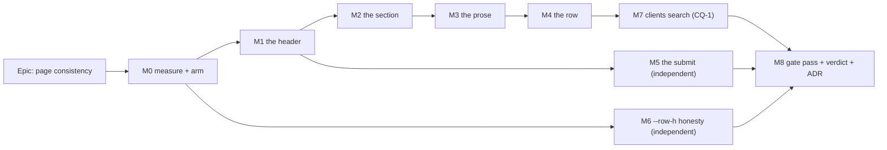

# Implementation Plan: Page consistency — the non-canvas screens

- **Feature spec:** [./feature-spec.md](./feature-spec.md) — **Approved, 2026-09-16**
- **Status:** Approved — building
- **Owner:** _(unassigned)_

## Breakdown

### Epic

**Page consistency across the non-canvas screens** — take ADR-0097's archetypes and ADR-0143's
method to the nine screens a planner uses every day, so the frame, the heading, the section, the
prose, the row and the save behave the same on all of them, and a gate keeps them there. Maps to the
design/UI theme in `docs/ROADMAP.md`.

**Scope, fixed by the product owner:** **nine route files** — `clients`, `calendars`, `resources`,
`members`, `audit-log`, `recently-deleted`, plus the neighbours `client-detail`, `project-detail`
and `my-activity` — together with `features/calendars/components/ProjectCalendarsSection.tsx`.
`account.tsx` and `onboarding.tsx` keep their declared **frame** exception; `account.tsx`
additionally adopts `PageHeader`, which costs no width. The canvas surfaces are out.

**Note the count.** `measure-page-drift.mjs` measures a _different_ eight — it includes `account`
and omits both detail screens (spec §0.2), which between them carry four of the ten hand-rolled
`<h1>` sites. M0-T1 fixes the page list before anything is judged against it.

**Two rules govern every milestone below.**

1. **Every gate is verified red against the defect it names before it is committed** (ADR-0110 D5) —
   a gate is not finished when it passes, it is finished when the defect has made it fail — and every
   gate carries a **pinned positive case**, because "no file hand-rolls a frame" passes perfectly
   against a scan that found no files (ADR-0093, and four repeats since).
2. **A milestone that changes a screen runs the base journey**, and the epic's last milestone runs
   `scripts/e2e-sweep.sh` over **all** of them (CLAUDE.md §19.8; ADR-0091's retrospective, where
   three journeys broke across one epic and CI found each separately).

---

## Milestone M0 — Measure, complete the instrument, arm the conditions

**Outcome:** the falsification conditions are committed, the harness records the state it measures
in, and the row spread is attributed to a named table.
**Ships dark:** nothing is user-facing. No product code changes at all.
**Journey:** none — there is no capability to drive.

---

#### Feature: a measurement that can be re-taken and compared

> **Description:** §1's numbers are sound and cross-check (spec §0.3), but the harness measures a
> page list that is not the scope (spec §0.2), does not record the Explorer's width, and does not
> attribute the row spread per table. The second is ADR-0113's finding one instrument along; the
> third is what §4.3's remedy needs.
> **Complexity:** S
> **Dependencies:** none
> **Risks:** the harness is run against a tree that is half-changed → every number is noise (ADR-0099
> records exactly this). Mitigation: M0's runs happen before any product commit, and the output
> records the git SHA.
> **Testing requirements:** none — this is an instrument, and its own correctness is checked by the
> §0.3 cross-check being reproduced by the harness rather than by hand.

##### Task M0-T1 — The harness measures the scope, and records its own state

- **Description:** Two defects in the same twelve lines. `measure-page-drift.mjs:21-30` measures a
  page list that is **neither the scope nor a subset of it** — it includes `account` (a declared
  exception) and omits `client-detail` and `project-detail`, which carry four of the ten hand-rolled
  `<h1>` sites and two of the three `<h2>` sites. And neither harness records the Explorer's width,
  so every `x` offset is conditional on a state it does not name (ADR-0113).
- **Complexity:** S
- **Dependencies:** none
- **Risks:** adding the two detail screens needs a seeded client **and** project to navigate to;
  the density harness seeds clients but not projects. Mitigation: seed one of each, through the
  public API as the existing seeder does (ADR-0066's rule).
- **Testing:** the harness reproduces spec §0.3's arithmetic (Explorer 276 → content at ≈408.5) from
  its own recorded numbers rather than requiring a reader to do it.
- **Development steps:**
  1. `PAGES` becomes the nine in-scope routes. `account` is **kept and labelled a declared
     exception** rather than dropped — a measurement of what is deliberately different is worth
     having, and dropping it would make the exception invisible to the instrument.
  2. Add a state block to both probes: Explorer width, `main` width, the container's computed
     `max-width`, the viewport, and the git SHA.
  3. Re-run both at 1646 and 1280 against the seeded fixture; commit the output to
     `m0-measurement.md` beside this plan.
  4. **Expect a fourth `h1.top` value** from the two breadcrumbed screens. It is new information,
     not a regression, and FC-1's wording already anticipates it.
  5. If any §1 figure moves, **record the correction in place** rather than quietly updating —
     a measurement that disagrees with its predecessor is a finding, and this repository's register
     is mostly made of them.

##### Task M0-T2 — Attribute the row spread per table

- **Description:** `measure-page-drift.mjs` already returns `firstCellX` / `lastCellX` per table; the
  output is reported per table with its column count and each column's rendered width, so §4.3's
  remedy is chosen against a named cause.
- **Complexity:** S
- **Dependencies:** M0-T1
- **Risks:** the fixture's `description` is populated on half the client rows by design, so the
  clients table's spread depends on it. Mitigation: report the natural content width of each column
  as well as its rendered width — the number ADR-0143 M5 used.
- **Testing:** n/a.
- **Development steps:**
  1. Extend the `tables` probe with per-column natural width.
  2. Run; write the attribution into `m0-measurement.md`.
  3. **State explicitly for each table whether its spread is a defect or is what a table with that
     many columns looks like.** Do not assume ADR-0098's diagnosis transfers.

##### Task M0-T3 — Commit the falsification conditions

- **Description:** FC-1 … FC-6 and the withdrawal bars (spec §1) land in
  `falsification.md` beside this plan, **in their own commit, before M1**.
- **Complexity:** S
- **Dependencies:** M0-T1, M0-T2
- **Risks:** a condition written after the result is not a condition. Mitigation: the commit
  ordering is the mitigation, and it is checkable in the log.
- **Testing:** n/a.
- **Development steps:**
  1. Write `falsification.md` with each condition, its derivation and its instrument.
  2. Commit alone.

---

## Milestone M1 — The header

**Outcome:** all nine screens' titles, descriptions and primary actions are one decision, and a gate
says so.
**Entry point:** every one of the nine screens — `Clients`, `Calendars`, `Resources`, `Members`,
`Audit log`, `Recently deleted`, `My activity`, and the client/project detail screens. The heading a
planner reads at the top of each is the deliverable.
**Journey:** `e2e/clients.spec.ts` gains one step asserting the page heading by role and name after
the conversion, and the **base** journey is run in full; `e2e-library`, `e2e-audit` and `e2e-shell`
are run because they locate these screens' headings. (No new config, no new CI step — spec §3.)

---

#### Feature: `PageHeader` on nine screens

> **Description:** Replace ten hand-rolled `<h1 className="text-2xl font-semibold tracking-tight">`
> and the five `mt-2 flex flex-wrap items-center justify-between gap-4` rows with `PageHeader`.
> **Complexity:** M
> **Dependencies:** M0
> **Risks:** (a) journeys locating a heading by class or by DOM shape break → mitigated by the
> existing suites querying by role and name, which is the contract `members.tsx`'s own conversion
> preserved. (b) `PageHeader` renders `items-start justify-between` where five screens render
> `items-center flex-wrap`, so a long title beside an action may sit differently → this is a real
> visual difference and M1's judgement question; measure it, do not assume it.
> **Testing requirements:** existing unit suites pass **unchanged** (the before/after oracle); the
> new structural gate verified red; `measure-page-drift.mjs` re-run for FC-1.

##### Task M1-T1 — The gate, written first and verified red

- **Description:** `apps/web/src/routes/archetypes.structural.test.ts`, a third copy of the pattern
  at `features/overview/archetypes.structural.test.ts` and `features/staff/archetypes.structural.test.ts`.
  **Extend the pattern; do not invent one.**
- **Complexity:** S
- **Dependencies:** M0
- **Risks:** a scan that matches its own docblock — this repository has shipped **five** of those
  (`reset-fills.structural.test.ts`, both `token-architecture` ratchets, and the overview gate's
  first version). Mitigation: strip comments before matching, exactly as both precedents do.
- **Testing:** this IS the test. It must be run against the pre-conversion tree and **name the eight
  unconverted files** — `members.tsx` is already converted and must NOT appear, which is the cheapest
  available proof that the scan discriminates rather than matching everything. That red output is
  committed in the task's PR description.
- **Development steps:**
  1. Copy `features/staff/archetypes.structural.test.ts`'s shape. `SURFACE` is the **nine** route
     files plus `features/calendars/components/ProjectCalendarsSection.tsx`.
  2. Assertions: (i) **pinned positive case** — the scan found ≥ 10 files and the set contains
     `routes/clients.tsx`; (ii) the surface imports `@/components/ui/page` and uses `PageContainer`,
     `PageHeader` and `SectionCard`; (iii) hand-rolls no `<h1`; (iv) hand-rolls no `<h2`;
     (v) hand-rolls no `mx-auto…max-w-` frame (redundant with the existing frame gate and cheap —
     it keeps this gate readable standing alone).
  3. Run red. Record the eight-file output, and record that `members.tsx` is absent from it.
  4. Land the gate **skipped or failing-with-a-reason** only if M1-T2 is a separate PR; otherwise
     land them together and let the red run live in the PR description. Prefer together: a
     deliberately red gate on `main` is a gate people learn to ignore.

##### Task M1-T2 — Convert the eight unconverted screens

- **Description:** Each screen's header row becomes `<PageHeader title=… description=… actions=… />`.
- **Complexity:** M
- **Dependencies:** M1-T1
- **Risks:** `audit-log` and `my-activity` have **two and three** description paragraphs and
  `PageHeader` offers one slot. Mitigation: M1 passes the **first** paragraph as `description` and
  leaves the rest as siblings **for now**; M3 relocates them. Splitting it this way keeps M1's diff
  about the header and M3's about the prose, which is the whole sequencing argument.
- **Testing:** every existing unit suite over these screens passes unchanged; `token-architecture`
  re-run for FC-4.
- **Development steps:**
  1. `clients`, `calendars`, `resources`, `recently-deleted` — the mechanical four.
  2. `members` — already converted; verify it needs no change and say so rather than touching it.
  3. `client-detail`, `project-detail` — **two `<h1>` each**: the name and the not-found branch. The
     not-found branch keeps `role="alert"` + destructive ink and its exit link; only the heading
     moves.
  4. `audit-log`, `my-activity` — title + first paragraph.
  5. `account.tsx` — adopt `PageHeader` only; **leave its frame exception exactly as
     `page-container.structural.test.ts:45-54` declares it**, and leave the declared reason intact.
     Note that this adoption is **ungated** — the new gate's surface is the nine in-scope files, and
     `account` is deliberately not one of them — so it can regress silently. That is accepted rather
     than solved by widening the gate to a file whose frame it would then have to exempt; the
     alternative is an exception list inside a gate whose whole value is having none.
  6. Correct `components/ui/page/index.ts:4`, which says "Six components" over a barrel exporting
     **eight** — ADR-0143 added `PageGrid` and `StatGrid` and did not update the sentence above them.
     One line, folded here rather than filed, because it is this epic's own subject in the file a
     reader opens to learn what the archetypes are (spec §4.9 F3).
  7. Run the gate green. Run the base journey, `e2e-library`, `e2e-audit`, `e2e-shell`.

##### Task M1-T3 — Measure, and judge FC-1

- **Description:** Re-run `measure-page-drift.mjs` (with M0-T1's corrected page list); FC-1 must
  reach **one** `h1.top` across all nine.
- **Complexity:** S
- **Dependencies:** M1-T2
- **Risks:** it reaches two, because a screen's header sits under a `Breadcrumbs` (client-detail,
  project-detail) and therefore legitimately starts lower. **Anticipate this:** FC-1's "one value" is
  over screens **with the same preceding chrome**, and the breadcrumbed pair form a second, internally
  consistent group of their own. If that is the outcome, **amend FC-1 in place with the reason**
  rather than declaring a pass against a condition that meant something else.
- **Testing:** the harness.
- **Development steps:**
  1. Run at 1646 and 1280.
  2. Write `m1-measurement.md`; state FC-1's verdict and FC-4's number.
  3. If FC-1 fails on anything other than the breadcrumb case, **stop and report** — that is the
     archetype being wrong, which is a finding, not a tuning problem.

---

## Milestone M2 — The section

**Outcome:** "a named sub-section" is one shape everywhere.
**Entry point:** the **Projects** section on a client, the **Plans** and **Calendars** sections on a
project. A reader sees three sections drawn the same way as Members' Roster.
**Journey:** `e2e/plans.spec.ts` and `e2e-library/library.spec.ts` locate these sections; both run.

---

#### Feature: `SectionCard` at the three remaining sites

> **Description:** `client-detail.tsx:76`, `project-detail.tsx:119` and
> `ProjectCalendarsSection.tsx:187-198` adopt `SectionCard`.
> **Complexity:** S
> **Dependencies:** M1
> **Risks:** `SectionCard` renders a **card** — a border and padding — where these three render bare
> headings over tables. That is a visible change and it costs horizontal room to the card's padding.
> Mitigation: `flush` exists for exactly this (`section-card.tsx:15`) and removes the body padding for
> a full-bleed table. Measure against FC-3 before and after.
> **Testing requirements:** existing suites unchanged; FC-3 re-run; a11y — each section becomes a
> named `region`, so check the landmark count does not collide (`ProjectCalendarsSection` already has
> a focus target).

##### Task M2-T1 — Convert, using `SectionCard`'s own `id` for the focus target

- **Description:** Three conversions. `ProjectCalendarsSection`'s hand-rolled
  `ref={regionRef} tabIndex={-1} className="… outline-none"` is **deleted** in favour of
  `SectionCard`'s `id` prop, which sets `tabIndex={-1}` **and** a focus ring — the archetype's own
  docblock records the ring being missing once and being a WCAG 2.4.7 failure
  (`section-card.tsx:84-101`).
- **Complexity:** S
- **Dependencies:** M1
- **Risks:** whatever scrolls to that section today targets the old ref → find every caller before
  deleting it.
- **Testing:** a unit case asserting the section is reachable as a named region and that focusing it
  shows a ring; `e2e-library` for the scroll-to behaviour.
- **Development steps:**
  1. `client-detail` **Projects**, `project-detail` **Plans** → `SectionCard flush`.
  2. `ProjectCalendarsSection` → `SectionCard` with `action` (the create button), `description`
     (its existing sentence) and `id` (the focus target). Its `<h2>` goes.
  3. Run the gate — the `<h2` assertion should now be green for the first time.
  4. Re-run FC-3.

---

## Milestone M3 — The prose, and the density it costs

**Outcome:** one page description per screen, one measure, and the audit log gives a reader
measurably more of its list.
**Entry point:** the **Audit log** and **My activity** screens — the reader sees a one-sentence
description and, beneath it, a `What this records` disclosure holding the coverage rule.
**Journey:** `e2e-audit/audit.spec.ts` gains a step opening the disclosure and asserting the table's
accessible description is non-empty in **both** states.

---

#### Feature: one description, the rest relocated

> **Description:** Four screens carry more than one page-level paragraph. Each keeps one sentence in
> `PageHeader`'s `description`; the explanatory remainder moves into a collapsed disclosure that stays
> `aria-describedby`-linked to the table.
> **Complexity:** M
> **Dependencies:** M1
> **Risks:** **(a)** a fact a reader needs is quietly lost. Mitigation: nothing is deleted — the audit
> log's coverage rule went wrong twice in opposite directions before reaching today's wording
> (`audit-log.tsx:42-57` records both), so it is relocated and the relocation is asserted.
> **(b)** `aria-describedby` resolving into a **collapsed** `
` is **reasoned from
> specification, not observed** (spec §4.4). Mitigation: the journey asserts the computed description
> in both states, and if it is empty when collapsed the disclosure is replaced with a
> `
` + a visible toggle — a known-good shape — rather than the fact being dropped.
> **Testing requirements:** unit cases for both states; the journey above; `measure-page-density.mjs`
> for FC-2.

##### Task M3-T1 — Audit log and My activity

- **Description:** One sentence up top; the coverage rule and the "Not signed in" caveat into the
  disclosure; `describedById` kept wired to the table.
- **Complexity:** M
- **Dependencies:** M1-T2
- **Risks:** `my-activity`'s attempts note is a **security** caveat whose own comment says the two
  things a reader jumps to are both wrong (`my-activity.tsx:54-60`). Burying it behind a press is the
  riskiest single change in this epic. **Mitigation and decision:** that paragraph **stays visible**
  and only the two coverage paragraphs move. Stated here so it is a decision rather than an
  oversight.
- **Testing:** unit — the description is associated in both disclosure states; journey — as above.
- **Development steps:**
  1. `audit-log`: sentence = what the log is; disclosure = the two coverage paragraphs.
  2. `my-activity`: sentence = what the log is; disclosure = the two coverage paragraphs; the
     attempts caveat **stays**.
  3. Remove the `<strong className="text-foreground font-medium">` lead-ins **only where the
     surrounding prose is cut** — ADR-0143 M5's rule: cut the bodies first, then re-judge the
     lead-ins, rather than removing them as a policy.
  4. Re-run FC-4.

##### Task M3-T2 — `recently-deleted` and the two detail screens

- **Description:** `recently-deleted.tsx:22-25`'s `max-w-2xl` paragraph — one of the four measures —
  becomes `PageHeader`'s `description`. The detail screens' optional `client.description` /
  `project.description` likewise.
- **Complexity:** S
- **Dependencies:** M3-T1
- **Risks:** a client's own description can be long and arbitrary; `PageHeader` has no measure cap.
  Mitigation: measure it in the fixture (descriptions there are ~80 characters) and decide from the
  number, not from the possibility.
- **Testing:** FC-1's description-measure limb.
- **Development steps:** convert; re-run FC-1.

##### Task M3-T3 — Judge FC-2

- **Description:** Re-run `measure-page-density.mjs`; write `m3-measurement.md`.
- **Complexity:** S
- **Dependencies:** M3-T1, M3-T2
- **Risks:** **the epic's own withdrawal bar fires** — the worst screen falls by < 60 px. That is a
  real possible outcome and the response is written down in spec §1: the density half is withdrawn,
  the epic ships as uniformity, and the measurement goes to the product owner. Do not reinterpret the
  condition.
- **Testing:** the harness.
- **Development steps:**
  1. Run at 1646 and 1280, in **one sitting** — ADR-0143 M7 records this page family drifting 555 px
     between sittings with no product change.
  2. Report chrome-before-first-row, the spread, and rows-visible per screen.
  3. State the verdict against FC-2 and FC-3 in the same paragraph as the numbers.

---

## Milestone M4 — The row, and the filter

**Outcome:** one row-action shape on every list, and one press back out of any filter.
**Entry point:** the `⋯` button on a client row and a resource row; the `Clear filters` button in the
calendars and resources filter bars.
**Journey:** `e2e/clients.spec.ts` opens the `⋯` and deletes a client through it;
`e2e-library/library.spec.ts` filters to a non-empty result and presses `Clear filters` **in the
bar** — the state today's placement cannot reach.

---

#### Feature: one row-action shape

> **Description:** The `Edit` + `⋯` shape `CalendarsTable.tsx:232-256` already uses, applied by the
> §4.5 rule to clients, resources, `ProjectCalendarsSection`, projects and plans.
> **Complexity:** M
> **Dependencies:** M2; **CQ-2's answer** (which decides whether the threshold is "more than one" or
> "three or more").
> **Risks:** **(a)** journeys locate `Edit`/`Delete` by accessible name at the row; moving one behind
> a menu breaks them. Mitigation: this is the expected cost and the journeys are updated in the same
> PR, per ADR-0091's rule that a control is located by a stable attribute rather than by its position.
> **(b)** A menu whose every item is shaded must render **no trigger** (ADR-0082) — and the roving
> focus must include shaded items, which `Menu` handles since ADR-0082 but which is easy to undo at a
> call site.
> **Testing requirements:** unit per table; the journeys above; an a11y check that a shaded item is an
> arrow-key stop and carries its reason.

##### Task M4-T1 — Extract the row-action shape, do not copy it

- **Description:** `CalendarRowMenu` is the model. Decide from the diff whether the shape is
  **extracted** into one shared component or whether each table keeps its own menu with shared
  primitives.
- **Complexity:** M
- **Dependencies:** M2
- **Risks:** copying it five times is the ADR-0065 / ADR-0121 failure — two implementations drift and
  the drift is invisible because each looks right alone. Mitigation: if the five menus share nothing
  but shape, a component is wrong and a **documented pattern plus the structural gate** is right; say
  which, with the reason, in the PR.
- **Testing:** unit per table.
- **Development steps:**
  1. Write the five menus' item lists side by side before extracting anything.
  2. Extract only what is genuinely shared.
  3. Convert clients, resources, `ProjectCalendarsSection`, projects, plans.
  4. Leave members and recently-deleted alone — one action each.

##### Task M4-T2 — Column widths, per the M0-T2 attribution

- **Description:** Where M0-T2 named a table's spread as a defect, add a `md:`-prefixed width
  preference on its **leading** columns.
- **Complexity:** S
- **Dependencies:** M0-T2, M4-T1
- **Risks:** **`w-full` on the trailing column is already withdrawn on measurement** (ADR-0143 M5) —
  it squeezes every other column to `min-content`. Do not re-propose it. Mitigation: FC-3 fails if
  any table gets narrower.
- **Testing:** FC-3 at 1646 and 1280.
- **Development steps:**
  1. Widths on leading columns only, `md:`-prefixed.
  2. Re-run FC-3. Revert anything that fails it.

##### Task M4-T3 — Persistent `Clear filters`

- **Description:** Calendars and resources gain the control **in the bar** whenever any filter is
  non-default, matching `AuditFilterBar.tsx:178`.
- **Complexity:** S
- **Dependencies:** none within M4
- **Risks:** focus dropped when the control disappears after being pressed — this register records
  that defect four times, and it is precisely this shape (a control that removes itself by
  succeeding). Mitigation: return focus deliberately to the search field, and assert it.
- **Testing:** unit (present when filtered, absent when not, focus lands somewhere real); the
  `e2e-library` step above.
- **Development steps:**
  1. Add the control to both filter bars.
  2. Keep the empty-state copy's own `Clear filters` — two routes to one action, one of which is a
     contextual shortcut, is not drift.
  3. Assert focus after the press.

---

## Milestone M5 — The submit

**Outcome:** ten dialogs stop throwing keyboard focus to `<body>` twice per save, and an eleventh
cannot be added.
**Entry point:** every one of the ten dialogs — creating a client, a project, a plan, a resource, an
invitation, a baseline, a dependency, a cross-plan link, a share link, an organisation. A keyboard
user pressing Save keeps their place.
**Journey:** `e2e/clients.spec.ts` submits the create-client dialog and asserts
`document.activeElement` is still the submit while the request is in flight — the only place this is
testable, since jsdom has no focus ring and a mocked fetch settles instantly.

**Order-independent:** this milestone depends on nothing above M1 and can be pulled forward.

---

#### Feature: `aria-disabled` + guard at ten sites, and one select

> **Description:** Replace the native `disabled` attribute on ten `type="submit"` controls with the
> shape already in the tree at `CalendarFormDialog.tsx:456-466`, plus an `onSubmit` guard — which is
> the half that actually prevents the double submit.
> **Complexity:** M
> **Dependencies:** none (M1 only for merge order)
> **Risks:** **(a)** `pointer-events-none` covers the pointer and **nothing covers Enter** on a
> focused button; a conversion that stops at the attribute swap makes double submission _easier_ than
> before. Mitigation: the guard is part of the same task and has its own test. **(b)** The five sites
> outside the six named screens widen the blast radius — stated in spec §3 and accepted, because
> leaving them is this register's most-repeated failure.
> **Testing requirements:** unit per dialog (focus retained; second submit swallowed); the structural
> gate verified red at all ten; the journey above.

##### Task M5-T1 — The gate, verified red at ten sites

- **Description:** `apps/web/src/components/ui/submit-guard.structural.test.ts` — a scan refusing a
  `type="submit"` in the same element as a `disabled=` attribute, comments stripped, with a pinned
  positive case.
- **Complexity:** S
- **Dependencies:** none
- **Risks:** the scan matches its own docblock (five precedents) or reads lines rather than balanced
  expressions, so a formatter defeats it. Mitigation: strip comments; match the element, not the line
  — `page-container.structural.test.ts:72-82` is the model for reading balanced literals.
- **Testing:** run red; it must name all ten files from spec §0.1.
- **Development steps:**
  1. Write the scan and its pinned positive case (a fixture string with the shape, and one without).
  2. Run red. Record the ten-file output in the PR.
  3. Add a `DECLARED_EXCEPTIONS` map **only if** a genuine static-unavailability case appears —
     `DESIGN_SYSTEM.md:605-607` keeps native `disabled` correct for a control that is statically
     unavailable, and an exception with a written reason is the speed bump.

##### Task M5-T2 — Convert the ten

- **Description:** Mechanical, ten files, one shape.
- **Complexity:** M
- **Dependencies:** M5-T1
- **Risks:** a dialog whose submit is _also_ gated on something static (e.g.
  `blockedByOrgPermission`) needs both conditions in `aria-disabled` — `CalendarFormDialog.tsx:462`
  shows the shape.
- **Testing:** per-dialog unit case: press submit, assert `document.activeElement` is unchanged;
  press twice, assert one mutation call.
- **Development steps:**
  1. Convert, file by file, running each file's existing suite as you go.
  2. Add the `onSubmit` guard in each form.
  3. Run the gate green; run the base journey and `e2e-share`.

##### Task M5-T3 — The members role `<select>` _(blocked on CQ-3)_

- **Description:** `MembersTable.tsx:32`. Default treatment `aria-disabled` + an `onChange` guard;
  the select is **controlled**, so ignoring the change re-renders it back to the stored role with no
  manual revert.
- **Complexity:** S
- **Dependencies:** CQ-3's answer from **accessibility-reviewer** (CLAUDE.md §19.13 — reviewed before
  release, not after).
- **Risks:** `aria-disabled` on an operable control is a false announcement by ADR-0083's own
  reasoning for text fields. That is exactly why this is CQ-3 and not a decision made in passing.
- **Testing:** unit — focus retained across a role change; a second change while pending is
  discarded and the displayed value is the stored one.
- **Development steps:**
  1. Get the answer.
  2. Apply it.
  3. Add the resulting rule to `DESIGN_SYSTEM.md`'s gated-field table as a **new row** —
     "a `<select>` during its own mutation" — because neither existing clause covers it, and the hole
     is what produced this.

---

## Milestone M6 — `--row-h` honesty

**Outcome:** two false claims leave the tree; the Gantt, the token's value and its gate are
untouched.
**Ships dark:** comments and documentation only. Nothing renders differently.
**Journey:** none — there is nothing to drive, and saying so is the ADR-0081 declaration.

---

#### Feature: the token describes what it governs

> **Description:** Correct `globals.css:936-937` and `list-row.tsx:72`; record in the ADR that
> ADR-0097 CQ-B's "one rhythm for the Gantt and the tables" was never built for the tables and cannot
> be as stated.
> **Complexity:** S
> **Dependencies:** M0 (its measurement is the evidence)
> **Risks:** somebody reads "retire the claim" as "retire the token" and deletes it, breaking
> `row-rhythm.structural.test.ts`. Mitigation: the task says in its own words that the value, the
> Gantt and the gate are unchanged, and the gate is run.
> **Testing requirements:** `row-rhythm.structural.test.ts` passes **unedited** — an invariant you
> have to touch to make room for your change was never an invariant.

##### Task M6-T1 — Correct both claims

- **Description:** Two comment edits and a note in the ADR.
- **Complexity:** S
- **Dependencies:** M0
- **Risks:** none material.
- **Testing:** `row-rhythm.structural.test.ts` unedited and green.
- **Development steps:**
  1. `globals.css:936-937` → the token is the **Gantt's** row rhythm; the tables are content-sized.
  2. `list-row.tsx:72` → describe what `ListRow` does (`py-2` + a border), not what it was believed
     to do.
  3. Record the 49 px decomposition (`--control-h-sm` 32 + `py-2`×2 + 1 px border) so the next reader
     does not have to re-derive why 28 is unreachable, and cite `DESIGN_SYSTEM.md:596-598`'s
     "Do not reach for it to make something compact".
  4. File the `--row-h` → `--gantt-row-h` rename as a **candidate** `TECH_DEBT` row with its reason,
     rather than doing it here (spec §4.8).
  5. File the §4.9 F1 row — `DataTable`'s `cellClassName` replaces rather than merges — **with its
     arithmetic**, including why the obvious fix moves ~15 tables' actions 16 px.

---

## Milestone M7 — Clients search _(CQ-1 answered BUILD — unconditional)_

**Outcome:** 123 clients can be narrowed to 3.
**Entry point:** a search field on the **Clients** screen, matching the one on Calendars and
Resources.
**Journey:** `e2e/clients.spec.ts` types a term, asserts the list narrows, reloads the page and
asserts the narrowed view survived (the URL contract).

**If CQ-1 is declined, this milestone is dropped and nothing else moves.**

---

#### Feature: `?q=` on the clients list

> **Description:** A server-side case-insensitive `name` search, mirroring
> `calendar.repository.ts:25-28` exactly, with the term in the URL.
> **Complexity:** M
> **Dependencies:** M4; CQ-1
> **Risks:** **(a)** an unindexed `ILIKE '%q%'` — measured for calendars at 0.21 ms / 2.9 ms at 5,000
> rows, and **re-measured for clients rather than inherited**. **(b)** the filter bar raises clients'
> chrome from 180 px to ≈270 px, working against FC-2 — stated in spec CQ-1 so it cannot be presented
> later as a surprise.
> **Testing requirements:** API e2e (a term narrows; a term matching nothing returns an empty page,
> not an error; the term composes with the cursor); unit for the filter state; the journey above.

##### Task M7-T1 — The API

- **Description:** `q` on the list endpoint.
- **Complexity:** S
- **Dependencies:** CQ-1
- **Risks:** the search must compose with keyset pagination rather than replacing it.
- **Testing:** Supertest — narrowed page, second page of a narrowed result, empty result.
- **Development steps:**
  1. `clientSearchWhere()` in `client.repository.ts`, the twin of `calendarSearchWhere`.
  2. Thread through `clients.service.ts` and the controller DTO; declare it in OpenAPI.
  3. Update `docs/API.md`.
  4. **Engage `database-architect`** for the index question alone — the only schema-adjacent decision
     in the epic — and record its answer, including if the answer is "no index" (ADR-0053 M4's
     precedent: the candidate partial saved 0.14 ms for 1,296 kB and was declined).

##### Task M7-T2 — The screen

- **Description:** `useUrlFilterState` + the shared `SearchField`, as `calendars.tsx:48-51` does.
- **Complexity:** S
- **Dependencies:** M7-T1
- **Risks:** the empty state must distinguish "no clients" from "no matches" — the distinction
  `AuditEventList`'s two messages already make and which this register records being collapsed once.
- **Testing:** unit for both empty states; the journey.
- **Development steps:**
  1. Parse `q` from the URL; thread to the table.
  2. Two empty messages; persistent `Clear filters` per M4-T3.
  3. Re-measure clients' chrome and report it against FC-2 honestly.

---

## Milestone M8 — The gate pass, the verdict, the ADR

**Outcome:** the epic's claims are checked by people who did not write it, the measurement gets a
verdict, and the decisions are filed.
**Entry point:** none — this is the review.
**Journey:** `scripts/e2e-sweep.sh` over **every** suite (ADR-0091's rule after a layout change).

---

#### Feature: review, measure, file

> **Description:** Specialist review over the combined diff, the final measurement, the ADR.
> **Complexity:** M
> **Dependencies:** M1–M7
> **Risks:** the reviews block on findings — which is the gate working. This register records eight
> consecutive epics whose gate pass found defects that had passed a human read; budget for folding
> them with regression tests **verified red first**.
> **Testing requirements:** every suite; every gate; the full sweep.

##### Task M8-T1 — Specialist review

- **Description:** Over the combined diff.
- **Complexity:** M
- **Dependencies:** M1–M7
- **Risks:** running them too late to act on. Mitigation: they run before the final measurement, not
  after.
- **Testing:** n/a.
- **Development steps:**
  1. **`ux-reviewer`** — hierarchy, copy, the relocated prose, the row-action cost.
  2. **`accessibility-reviewer`** — CQ-3's answer if not already taken; the disclosure's
     `aria-describedby`; the menus' shaded items; focus after `Clear filters`; the new named regions.
  3. **`component-reviewer`** — whether M4-T1 extracted or duplicated; the archetype adoption; token
     and variant use.
  4. **`performance-reviewer`** — bundle delta over nine screens.
  5. **`api-reviewer`** + **`backend-performance-reviewer`** + **`security-reviewer`** — **only if M7
     ran.** Say so explicitly if it did not, so "not run" does not read as "skipped".
  6. **`database-architect`** — engaged in M7-T1 if M7 ran; otherwise **deliberately not engaged
     because there is no schema change to design**, recorded in the ADR in those words.

##### Task M8-T2 — The verdict

- **Description:** Final run of both harnesses; FC-1 … FC-6 judged.
- **Complexity:** S
- **Dependencies:** M8-T1
- **Risks:** judging across sittings. Mitigation: one sitting, the spread reported beside the delta —
  a verdict whose delta is smaller than the instrument's own spread is INDETERMINATE and must say so
  (ADR-0128).
- **Testing:** the harnesses; `token-architecture`; every structural gate.
- **Development steps:**
  1. Run both harnesses at 1646 and 1280 in one sitting.
  2. Write `m8-verdict.md`: each condition, its number, its verdict, and the instrument's spread.
  3. **Where a condition failed, say so and say what happens next** — do not soften it.

##### Task M8-T3 — File the ADR

- **Description:** `ADR-0145` (re-derive the number).
- **Complexity:** S
- **Dependencies:** M8-T2
- **Risks:** the ADR-0071 failure — a decision cited by number and absent from the register.
  Mitigation: `pnpm check:adr-coverage` gates the roadmap and the index; **CLAUDE.md §16 it cannot
  see** (`TECH_DEBT` #291), so that entry is written by hand and checked by hand.
- **Testing:** `pnpm prepush`.
- **Development steps:**
  1. Write the ADR: the archetype adoption and its gate; the row-action threshold and its
     relationship to ADR-0097 Landing F1; the submit rule and the `<select>` hole; `--row-h`'s
     disposition and CQ-B's unbuilt half; the withdrawn alternatives (`narrow`, `wide`, `w-full` on
     trailing) **with their evidence**; every corrected claim from spec §0.
  2. Add the `docs/ROADMAP.md` entry and the `docs/adr/README.md` index row.
  3. Add the `CLAUDE.md` §16 register entry **by hand**.
  4. Set this spec's header to `Accepted — shipped (ADR-0145)` and this plan's to match —
     `check:spec-status` refuses a plan that disagrees with its spec.
  5. Add a changeset (`web` minor; `api` minor if M7 ran).

---

## Sequencing & slices

| Order | Milestone | Ships                                 | Releasable alone                                   |
| ----- | --------- | ------------------------------------- | -------------------------------------------------- |
| 1     | M0        | measurement + conditions (dark)       | yes                                                |
| 2     | M1        | the header on nine screens + its gate | **yes**                                            |
| 3     | M2        | three sections                        | yes                                                |
| 4     | M3        | the prose + FC-2's verdict            | yes                                                |
| 5     | M4        | one row shape, column widths, filters | yes                                                |
| —     | M5        | the submit guard + its gate           | yes — **order-independent, may be pulled forward** |
| —     | M6        | comment corrections                   | yes — order-independent                            |
| 6     | M7        | clients search _(CQ-1)_               | yes                                                |
| 7     | M8        | review, verdict, ADR                  | yes                                                |

**M1 is the first slice and is the right size** — it is the equivalent of the previous epic's frame
conversion: one concern, eight files changed of nine in scope, a gate, and a measurement that judges
it.

**No feature flag** (ADR-0088 D1): `import.meta.env.VITE_*` is inlined at build time and
`docker-publish.yml` passes no `VITE_` build arg, so a flag would be a second JSX root maintained
forever and never an operator rollback. **The rollback is a commit boundary**, which is what the
slicing above buys.

## Definition of Done (per task)

Each task's PR must satisfy the Feature Completion Criteria in
[`docs/PROCESS.md`](../../PROCESS.md). Two are called out because this epic makes them expensive and
they are the ones most likely to be skipped:

- **The pre-push gate is run, not written** — `pnpm prepush`, plus **the base journey**
  (`scripts/e2e-local.sh web`) on any milestone that changes a screen, and the **full sweep** at M8.
- **Every new gate is verified red against the defect it names**, and the red output goes in the PR
  description.

## Risks & assumptions (rollup)

| Risk / assumption                                                           | Likelihood | Impact | Mitigation                                                                                                   |
| --------------------------------------------------------------------------- | ---------- | ------ | ------------------------------------------------------------------------------------------------------------ |
| FC-2's density gain is smaller than 100 px and the withdrawal bar fires     | med        | med    | Written into spec §1 as a verdict, not a negotiation; the uniformity half stands on FC-1/FC-4/FC-5           |
| A conversion makes a table narrower                                         | med        | high   | FC-3, run at M2 and M4; `narrow`, `wide` and `w-full`-on-trailing all pre-rejected with evidence             |
| Journeys break on moved affordances                                         | **high**   | med    | Expected, not a surprise: M4 moves a control behind a menu. Updated in the same PR; full sweep at M8         |
| M4 duplicates the row menu five times instead of extracting                 | med        | med    | M4-T1 requires the five item lists written side by side **before** extracting, and a stated decision         |
| The `
` `aria-describedby` claim does not hold in a real AT         | med        | med    | Labelled "reasoned from specification, not observed"; the journey asserts it; a known-good fallback is named |
| A gate matches its own docblock (five precedents)                           | med        | low    | Comments stripped in both new gates, as both precedents do                                                   |
| `my-activity`'s security caveat is buried                                   | low        | high   | Decided in M3-T1: it **stays visible**; only coverage prose moves                                            |
| M7's search costs more chrome than the density work reclaims on that screen | high       | low    | Stated in CQ-1 up front with the numbers; it is a trade, not a regression                                    |
| An eleventh native-`disabled` submit is added after M5                      | low        | low    | The M5-T1 gate makes it a failure                                                                            |
| CQ-3 comes back against the default and M5-T3 needs a different shape       | med        | low    | M5-T3 is the last task of its milestone and blocks nothing                                                   |
| **Assumption:** the fixture (123/81/80) is representative                   | —          | med    | Stated as an assumption by the harness's own docblock, not presented as a finding                            |
| **Assumption:** RBAC is untouched                                           | —          | high   | Checkable: `useOrgRole`, `lib/rbac` and every `can*` derivation contribute zero files to the diff            |
