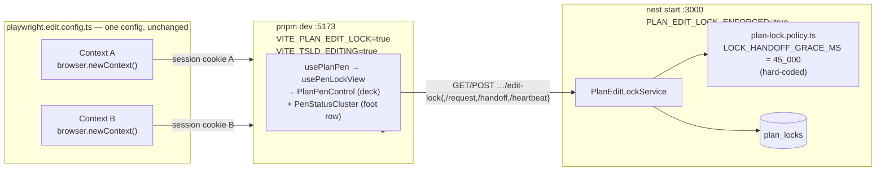
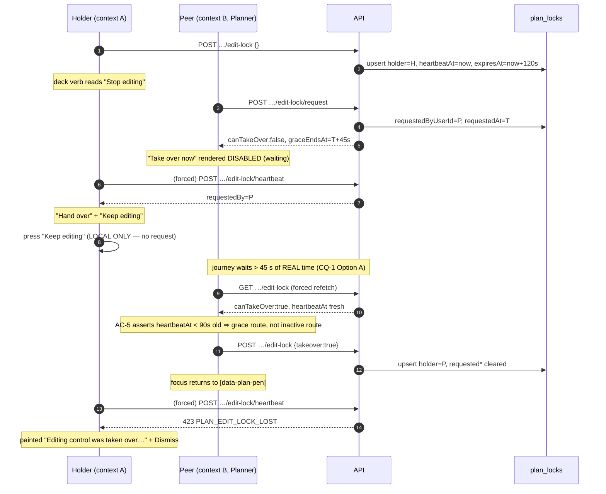
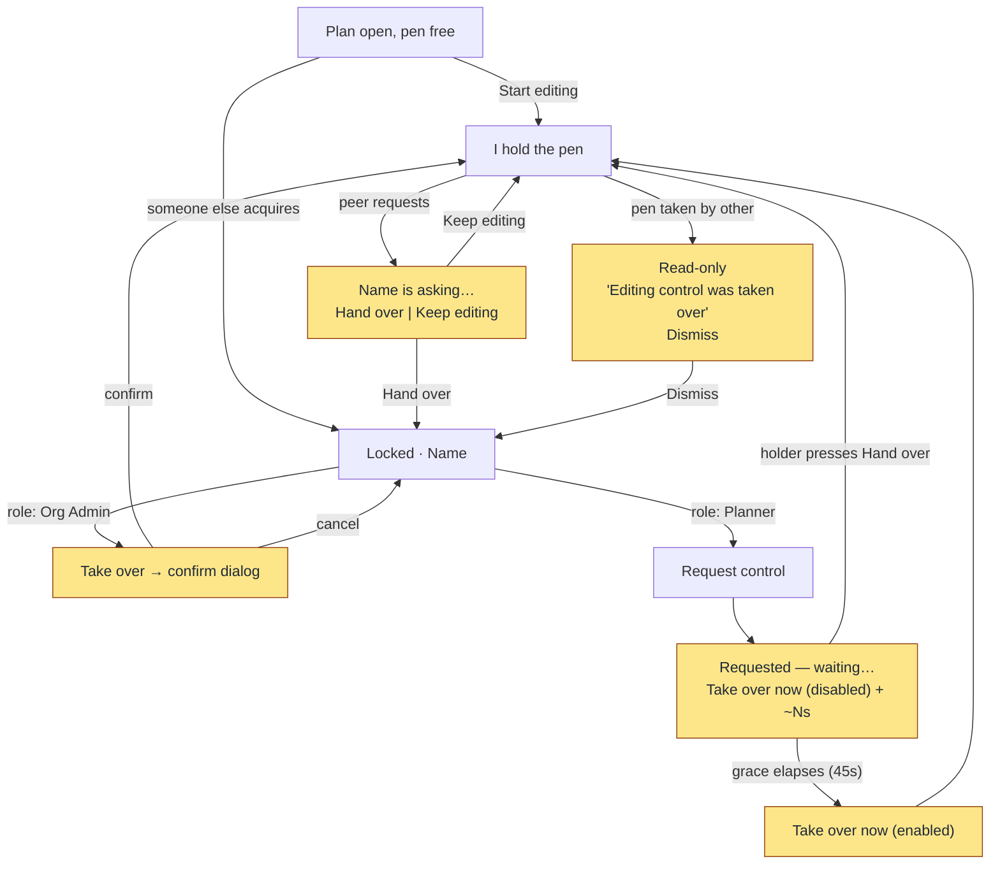

# Feature Spec: A journey that drives the pen changing hands

- **Status:** Draft — awaiting approval before implementation.
- **Author(s):** feature-analyst (Claude Opus 5)
- **Date:** 2026-09-10
- **Tracking issue / epic:** `docs/TECH_DEBT.md` [#286](../../TECH_DEBT.md) — "No journey drives a peer take-over or an admin override"
- **Roadmap link:** none — this is register work, not a roadmap theme.
- **Related ADR(s):** [ADR-0028](../../adr/0028-plan-edit-lock.md) (the pen),
  [ADR-0081](../../adr/0081-milestone-entry-point-and-journey.md) (a milestone lands with a
  journey), [ADR-0105](../../adr/0105-a-register-row-is-not-a-spec.md) (when a row needs a spec),
  [ADR-0110](../../adr/0110-a-gate-is-verified-against-the-defect-it-names.md) (verify the gate
  red), [ADR-0076](../../adr/0076-wrong-claims-are-a-defect-class.md) (wrong claims are a defect
  class). No new ADR is proposed — see §4 "Implementation approach".

---

## 0. Corrections to the brief and to the register row, made before anything else

This repository's rule is _verify the claim; do not trust the document_
([`docs/RECONCILE.md`](../../RECONCILE.md), ADR-0058/0076). Four claims that framed this work were
checked against the code and **three of them are wrong**. Each correction changes the work, so they
lead rather than sit in a footnote.

### C1 — `#286`'s headline sentence is false, and its own stated method is why

The row says ADR-0028's pen has five ways to change hands and **"not one of them is driven end to
end by any Playwright suite in this repository"**, and it names its method: _"Verified by searching
every `e2e-*` directory: the three files that match `take over` or `override` match on a
progress-tab phrase and two CSS comments."_

Two of the five **are** driven end to end, in one existing suite:

| Transition                | Covered? | Evidence                                           |
| ------------------------- | -------- | -------------------------------------------------- |
| A peer **requests**       | **Yes**  | `apps/web/e2e-edit/pen-handoff.spec.ts:95,140,152` |
| The holder **hands over** | **Yes**  | `apps/web/e2e-edit/pen-handoff.spec.ts:156-167`    |

That suite runs under `apps/web/playwright.edit.config.ts`, whose API `webServer` pins
`PLAN_EDIT_LOCK_ENFORCED: 'true'` (`playwright.edit.config.ts:56`), opens **two browser contexts**
(`:55, :79`), and moves the lock from actor A to actor B. So the row's second sentence — _"No suite
opens two sessions against a real API with `PLAN_EDIT_LOCK_ENFORCED=true` and moves the lock between
them"_ — is also false as written.

The cause is exactly the failure this register keeps recording: **the instrument could not see its
subject.** The button that hands the pen over is labelled `Hand over` (`lock-copy.ts:87`), and
`Hand over` contains neither `take over` nor `override`. A search scoped by two strings reported an
absence, and the absence became a sentence. Re-run with the labels read from `lock-copy.ts` rather
than guessed, the picture is the table in §1.

**This does not make the row wrong about the thing it cares about.** Its own strongest paragraph —
_"the one interaction ADR-0028 exists for — the pen changing hands under a planner who did not ask —
has never been exercised against a real lock lease by anything"_ — is **true**, and is what this
spec is scoped to. What is wrong is the count and the absolute phrasing, and correcting them
halves the fixture work: the two-actor fixture the row prices as new **already exists**.

### C2 — `assertHoldsPen` is not in `apps/api/src/common/**`

The brief pointed there. It is at
`apps/api/src/modules/plan-lock/plan-lock.service.ts:277-300`, and the timing policy is at
`apps/api/src/modules/plan-lock/plan-lock.policy.ts`. `common/` holds the domain errors
(`common/errors/domain-errors.ts` → `LockedError`), the advisory-lock helper
(`common/db/plan-advisory-lock.ts`) and the permission list
(`common/auth/org-permissions.ts:118-120`), and nothing else the pen owns. Minor, but the grace
window is the plan's largest risk and it is not where the brief said to look.

### C3 — the five transitions are **not** all covered at the API, they are all covered at the API

Stated the other way round, because it is the finding that most changes the scope. The Supertest
suite `apps/api/test/plan-lock.e2e-spec.ts` **already proves every server-side transition**:

| Case                                                             | Line           |
| ---------------------------------------------------------------- | -------------- |
| request → premature take-over 423 → post-grace take-over         | `:198`         |
| peer take-over of an **inactive** holder (no grace needed)       | `:227`         |
| holder hand-off transfers the pen                                | `:245`         |
| Org Admin **immediate** override of a live, active lock          | `:274`         |
| the demoted holder's next heartbeat is 423 `PLAN_EDIT_LOCK_LOST` | `:152`, `:224` |

`apps/api/test/plan-lock-write-gate.e2e-spec.ts` separately proves the 423 write gate across
activities, dependencies, recalculate, the positions batch, resource assignments and weighted steps
(`:139-305`).

**So the gap is not the lock policy. The gap is entirely client-side**: whether a browser puts the
right control in front of the right person at the right moment, and what happens to the person the
pen is taken from. Everything this spec proposes is a claim about the browser. Scoping it that way
is what keeps it a single spec file rather than an epic.

### C4 — the brief's assumption that this fires ADR-0105's Playwright-config trigger

It does not, under the recommended option. See §4 "Does this need a new Playwright config?" — the
answer is **no**, and that is argued from what `playwright.edit.config.ts` pins. It **would** fire
under the rejected Option C. The trigger analysis is therefore a decision input, not a formality,
and it is the reason the spec exists at all rather than the reason it must.

---

## 1. Business understanding

### Problem

ADR-0028 exists for one interaction: **the pen changes hands under a planner who did not ask for it
to.** A peer takes over after a grace window; an Org Admin overrides immediately. In both cases
somebody who was mid-edit is dropped to read-only, by somebody else's action, with no gesture of
their own.

Nothing in this repository has ever driven that through a browser.

What exists is:

- **Server proof** — complete (C3). The policy, the 423s, the grace arithmetic, the RBAC split and
  the anti-IDOR 404 are all covered by Supertest against a real Postgres.
- **Client proof** — unit only. Every one of `apps/web/src/features/plan-lock/`'s suites hands
  `resolveLockView` a **mocked `PlanEditLockStatus` literal**. A mocked status is a snapshot: it
  cannot express grace elapsing, a heartbeat lapsing, two clients racing, or a control unmounting
  under the cursor of the person who pressed it.
- **One browser journey** — `pen-handoff.spec.ts`, covering the _consensual_ half (request →
  hand over).

The uncovered half is the non-consensual half, and it is the half with the sharp edges:

1. A control that is **native `disabled` and flips to enabled without the reader acting**
   (`EditLockControls.tsx:91-95` renders the `waiting` action as `<Button … disabled>`).
2. A **confirm dialog** in front of the override (`EditLockControls.tsx:111-124`), i.e. a native
   `<dialog>` closing and restoring focus in the same tick as the control behind it unmounts —
   verbatim the shape ADR-0099 M10 records shipping as a WCAG 2.4.3 failure that also silently
   killed every workspace keyboard accelerator.
3. A **`lost` banner** that is the only state in `resolveLockView` where the sentence is painted
   rather than `sr-only` (`lock-view.ts:88-99`, `CompactPenStatus.tsx:230`) — because the reader
   did nothing and the badge cannot carry the fact.
4. A **`Keep editing`** control that is purely client-local (`use-pen-lock-view.ts:193-195` sets a
   dismissed-request id and makes no request), so it dismisses a prompt and does **not** refuse the
   request — a distinction nothing on screen or in any test currently states.

### Why now

`#286` was found because [`docs/specs/workspace-console/feature-spec.md:401-415`](../workspace-console/feature-spec.md)
claimed a journey proved the pen's permission model against a real API and no such journey existed.
The claim was corrected in place. The register row is the honest residue, and it will stay open —
and stay quotable as "the pen's hand-off is untested in a browser" — until something drives it.

There is a second, sharper reason. The console epic (ADR-0099 M5 / workspace-console M5-T1)
**split this surface across two hosts**: the pen's verb went to the command deck
(`PlanPenControl.tsx`) while the badge, the live-region sentence and the seven hand-off actions
stayed in the plan's foot row, filtered by `only={HANDOFF_ACTIONS}`
(`plan-workspace-toolbar.tsx:1836`). That split is held up today by three static arguments the
security review named (`workspace-console/feature-spec.md:407-412`): `resolveLockView` is
untouched, `only` is a `filter` and can only narrow, and
`action-partition.structural.test.ts` pins the two sets disjoint. Those are good arguments about
**which actions can render**. None of them is a statement about whether pressing one works, where
focus lands, or what the other actor sees.

### Users

| Role                 | Organisation role    | What they need from this                                                                                                                                                   |
| -------------------- | -------------------- | -------------------------------------------------------------------------------------------------------------------------------------------------------------------------- |
| The **holder**       | Planner or Org Admin | To be told, unmistakably, when the pen has been taken — and not to lose their keyboard context doing it.                                                                   |
| The **peer**         | **Planner only**     | To request, to see the wait is real and bounded, and to take over when it elapses.                                                                                         |
| The **Org Admin**    | Org Admin            | To override immediately, with a confirmation that says what it costs the holder.                                                                                           |
| Viewer / Contributor | —                    | Nothing changes. They hold neither `plan:acquire_lock` nor `plan:request_control` (`org-permissions.ts:244`), and see no hand-off control at all (`lock-view.ts:217-225`). |

**"Planner only" for the peer is not a simplification — it is a rule, and a non-obvious one.**
`resolveLockView` tests `status.canOverride` **before** `status.canTakeOver`
(`lock-view.ts:176-193`), so an Org Admin locked out of a plan is offered `override` and never
`request`/`takeover`, even though the server grants them `plan:request_control`
(`org-permissions.ts:244` puts it in `LOCK_COORDINATE`, held by Planner **and** Org Admin, and
`computeCapabilities` therefore returns `canRequest: true` for them, `plan-lock.policy.ts:113`).
**The peer take-over affordance is unreachable in the UI for an Org Admin.** A journey that used
the org creator as its peer would find no `Take over now` button and would be debugging the wrong
thing.

### Primary use cases

1. An Org Admin takes the pen back from a Planner who is mid-edit, immediately, through the
   confirmation.
2. A Planner asks a peer for the pen, is told to wait, watches the wait run down, and takes over
   when it elapses.
3. The holder dismisses an incoming request and keeps editing — and the request survives it.
4. The person who lost the pen finds out.

### User journeys

See the user-flow diagram in §4. The happy paths are the four above. The alternates that matter are
in §2 "Edge cases".

### Expected outcomes

- `docs/TECH_DEBT.md` #286 closes, with its own false claims corrected in place rather than
  deleted (this repository's convention — ADR-0071's lesson, and the row itself was written that
  way about the workspace-console spec).
- The console epic's action-partition argument gains the dynamic half it does not have.
- If any of the four sharp edges in §1 is broken today, it is found now rather than by a planner.
  **That outcome is not predicted.** Two of the four (the confirm-dialog focus restore, the
  native-`disabled` flip) are places where this register has recorded a defect in a structurally
  identical control, and the honest position is that the journey is being written to find out.

### Success criteria

| #   | Criterion                                                                                                                                                    | How it is judged                                                                                                                                                                                  |
| --- | ------------------------------------------------------------------------------------------------------------------------------------------------------------ | ------------------------------------------------------------------------------------------------------------------------------------------------------------------------------------------------- |
| S1  | Every `LockAction` in `lock-view.ts:6-15` is either pressed by a Playwright journey or **named in this spec as out of scope with a reason**.                 | The table in §2 "Coverage census".                                                                                                                                                                |
| S2  | The peer take-over is proven to have gone through the **grace** route and not the **inactive-holder** route.                                                 | An assertion on the holder's `heartbeatAt` freshness taken from the API immediately before the take-over — see §2 US-2 AC-5. Without it the test passes for the wrong reason and nothing says so. |
| S3  | After each of `takeover`, `override` and `handover`, focus is on a **named element**, not merely "not `<body>`".                                             | `expect(locator('[data-plan-pen]')).toBeFocused()`. `CompactPenStatus.tsx:73-75` records in its own words that an assertion of the weaker form "would pass against" the broken behaviour.         |
| S4  | The new specs run inside `pnpm --filter @repo/web test:e2e:edit` with **no new config, no new package script, no new CI step and no `e2e-sweep.sh` change**. | Reading the diff. If any of those four appears, Option A was abandoned and §4's trigger analysis must be redone (ADR-0105).                                                                       |
| S5  | Added wall-clock to the `test:e2e:edit` CI step is stated as a measured number in the PR, not estimated.                                                     | Timed locally via `scripts/e2e-local.sh web:edit` before and after.                                                                                                                               |

### Open questions

> **CQ-1 (CRITICAL) — do we pay 45 seconds of real time, or make the grace window configurable?**
>
> The grace window is `LOCK_HANDOFF_GRACE_MS = 45_000`, a **hard-coded module constant**
> (`plan-lock.policy.ts:29`). It is read by three pure functions in the same file
> (`isGraceElapsed :64-67`, `graceEndsAt :70-73`, `canTakeOverNow :81-92`) and by nothing else in
> `apps/api/src` — verified by grepping the whole repository for the identifier, which returns only
> that file, its two unit specs, and a **hand-copied literal** at
> `apps/api/test/plan-lock.e2e-spec.ts:28`. It is not an env var, not a database column, and not
> injectable. The file's own docblock sanctions a promotion path — _"They are module constants for
> v1; promote to env-validated config if they ever need per-deployment tuning"_
> (`plan-lock.policy.ts:8-12`) — so this is a decision the code anticipated, not a hack.
>
> Options, with what each costs, are in §4 "Implementation approach". **Recommended default: Option
> A, wait the real 45 seconds.** The recommendation turns on one thing that is not a cost argument:
> a 2-second grace window makes the `waiting` state and its `~Ns` countdown
> (`lock-copy.ts:62-66`) unobservable, so the test would prove the take-over gate under a
> configuration no host runs, and would prove nothing at all about what a planner sees while
> waiting — which is half of what US-2 is for.
>
> **This is the question the product owner must answer**, because Option C changes `apps/api`, adds
> a production configuration knob whose only consumer is a test, and fires ADR-0105's
> Playwright-config and CI-step triggers.

> **CQ-2 (CRITICAL) — is the inactive-holder take-over in scope?**
>
> `canTakeOverNow` has two peer routes: grace elapsed, **or** holder inactive
> (`plan-lock.policy.ts:89-91`), where inactive means no heartbeat for
> `LOCK_INACTIVE_AFTER_MS = 90_000` (`:24`). It is **reachable** in a browser journey — abort the
> holder's heartbeat with `page.route()` and wait 91 seconds — and I recommend **excluding it**,
> for a reason that is about the client rather than about the cost: `resolveLockView` branches on
> `status.canTakeOver` and **cannot see which route produced it** (`lock-view.ts:186-193`). The
> affordance, the copy (`lockCopy.canTakeOver`, whose own comment at `lock-copy.ts:69-70` says it
> is worded to cover both routes) and the resulting call are byte-identical. So the journey would
> spend 91 seconds re-proving `plan-lock.e2e-spec.ts:227` and add **zero** client coverage.
>
> **Assumed default: excluded, and named in the coverage census as excluded.**

> **Q-3 (non-critical) — one long test or two?**
>
> `playwright.edit.config.ts` sets `workers: 1` and `fullyParallel: false` (`:22,25`), so
> everything is serial regardless. Two independent tests each pay ~40 s of sign-up/invite
> onboarding; one combined test pays it once but makes a CI retry (`retries: 2`, `:24`) re-run the
> 45-second wait as well as everything else.
> **Assumed default: two tests, sharing extracted helpers.** The 45-second wait lives in the second
> one alone, so a retry of the first costs nothing extra. The alternative — a `beforeAll`-scoped
> shared fixture — is rejected because Playwright re-runs `beforeAll` for a retried serial group
> anyway, so it buys the saving only on the happy path.

> **Q-4 (non-critical) — assert the countdown text?**
>
> `graceCountdown` renders `~44s` inside an `aria-hidden` span (`lock-copy.ts:62-66`,
> `CompactPenStatus.tsx:236-240`) and its once-a-second tick **pauses while the tab is hidden**
> (`use-pen-lock-view.ts:60-83`). With two contexts, the peer's tab is hidden whenever the holder's
> is in front. **Assumed default: assert the countdown is _present and non-empty_ while waiting,
> and never assert a specific number.** A number would be a timing assertion about a paused timer.

> **Q-5 (non-critical) — what to do about the native-`disabled` `waiting` button.**
>
> `EditLockControls.tsx:91-95` renders it as `<Button size="sm" variant="outline" disabled>`. This
> is a control that **flips to enabled underneath a reader who did nothing**, which is precisely
> the case `docs/DESIGN_SYSTEM.md`'s native-`disabled` clause carves out (ADR-0083's narrative), it
> carries no `aria-disabled` + reason (ADR-0082's pattern, used by the row menu one feature over),
> and a keyboard user cannot rest focus on it to hear why.
> **Assumed default: observe, do not fix.** This spec adds no product code (§4). If the journey
> confirms the behaviour, raise a register row; do not fold a design-system change into a coverage
> epic. It is recorded here because noticing it and saying nothing is the ADR-0071 failure.

---

## 2. Functional requirements

### Coverage census — the S1 gate

Every member of `LockAction` (`lock-view.ts:6-15`), with its disposition. This table is the
deliverable of §1 S1 and the thing a later reader should check rather than re-derive.

| `LockAction` | Control label (`lock-copy.ts`) | Today           | After     | Where                                   |
| ------------ | ------------------------------ | --------------- | --------- | --------------------------------------- |
| `start`      | `Start editing`                | Covered         | unchanged | `pen-smoke.spec.ts:36`, `support.ts:56` |
| `stop`       | `Stop editing`                 | Covered         | unchanged | `pen-smoke.spec.ts:47`                  |
| `request`    | `Request control`              | Covered         | unchanged | `pen-handoff.spec.ts:140`               |
| `handover`   | `Hand over`                    | Covered         | unchanged | `pen-handoff.spec.ts:156`               |
| `override`   | `Take over` + confirm          | **Not covered** | **US-1**  | new                                     |
| `dismiss`    | `Dismiss` (the `lost` banner)  | **Not covered** | **US-1**  | new                                     |
| `keep`       | `Keep editing`                 | **Not covered** | **US-3**  | new                                     |
| `waiting`    | `Take over now`, disabled      | **Not covered** | **US-2**  | new                                     |
| `takeover`   | `Take over now`, enabled       | **Not covered** | **US-2**  | new                                     |

Two server behaviours are named as **deliberately excluded**, so a later reader does not read their
absence as an oversight:

- **Inactive-holder take-over** — CQ-2. Same client branch, 91 s, no new client coverage.
- **Lease expiry / `EXPIRED` reclaim** — 120 s TTL (`plan-lock.policy.ts:15`). Proven at
  `plan-lock.e2e-spec.ts:179`; the client branch (`lock-view.ts:141-147`) is a two-line
  `badge`/`message` swap over the same `canAcquire` flag `FREE` already exercises.

---

> **US-1** — As an **Org Admin**, I want to take editing control of a plan a Planner is holding,
> immediately and with a confirmation, so that I can unblock the team without waiting out a grace
> window — and I want the Planner to be told it happened.
>
> **Acceptance criteria**
>
> - **AC-1 Given** a Planner holds the pen on a plan and an Org Admin has it open, **when** the
>   admin's lock status resolves, **then** the foot row offers exactly one hand-off control,
>   labelled `Take over`, and **no** `Request control` and **no** `Take over now`.
>   _Why stated negatively as well: this is the `canOverride`-first branch (`lock-view.ts:176-184`),
>   and its whole content is which controls are absent._
> - **AC-2 Given** that state, **when** the admin presses `Take over`, **then** a confirmation
>   appears titled `Take over editing?` naming the holder's first name and stating that the plan
>   becomes read-only for them and unsaved work is untouched (`lock-copy.ts:97-99`), and **the pen
>   has not moved** — proven by reading `GET …/edit-lock` from the page and finding
>   `state: 'HELD_BY_OTHER'`.
>   _The negative half is the point: a confirm that acts before it confirms looks identical on
>   screen._
> - **AC-3 Given** the confirmation, **when** the admin confirms, **then** the admin's pen verb in
>   the command deck reads `Stop editing`, the foot row offers no hand-off control at all, and the
>   API reports the admin as holder.
> - **AC-4 Given** AC-3, **then** focus is on `[data-plan-pen]` (§1 S3). **If this fails it is a
>   product defect, not a test bug** — the pressed control is inside a native `<dialog>` that
>   restores focus as it closes, while the control behind it unmounts, which is ADR-0099 M10's
>   recorded shape. Verify by instrumenting the actual focus sequence before changing anything.
> - **AC-5 Given** AC-3, **when** the demoted Planner's client next contacts the server, **then**
>   their surface shows the `lost` state: the sentence
>   `Editing control was taken over — you're now read-only.` (`lock-copy.ts:77-80`) is **visibly
>   painted** (not `sr-only` — `lock-view.ts:96-98`, `CompactPenStatus.tsx:230`), the badge reads
>   `Read-only`, and the only control is `Dismiss`.
> - **AC-6 Given** AC-5, **when** the Planner presses `Dismiss`, **then** the banner resolves to
>   the ordinary locked state naming the admin as holder, and no editing affordance returns.

> **US-2** — As a **Planner**, I want to ask a peer for the pen, see that the wait is real and
> bounded, and take control when it elapses, so that a colleague who has walked away does not block
> me indefinitely.
>
> **Acceptance criteria**
>
> - **AC-1 Given** actor H holds the pen and Planner P has the plan open, **when** P presses
>   `Request control`, **then** P's `role="status"` region reads
>   `Requested — waiting for {H's first name} to hand over.` and the foot row offers a
>   `Take over now` control that is **not operable**.
> - **AC-2 Given** AC-1, **then** the status region carries a non-empty countdown aside
>   (Q-4: presence only, never a number).
> - **AC-3 Given** AC-1, **when** P attempts a structural write, **then** it is refused and no
>   editing affordance appears. _(Cheapest form: assert `New activity` has count 0 — the affordance
>   gate. The 423 itself is proven at `plan-lock-write-gate.e2e-spec.ts:139`.)_
> - **AC-4 Given** AC-1, **when** more than `LOCK_HANDOFF_GRACE_MS` has elapsed since the request
>   **and** P's client has re-read the status, **then** `Take over now` becomes operable.
> - **AC-5 Given** AC-4, **and before pressing it**, **then** the API reports the holder's
>   `heartbeatAt` as **less than `LOCK_INACTIVE_AFTER_MS` old** — so the take-over about to happen
>   is the **grace** route and not the inactive route (§1 S2). Without this the test would pass
>   identically for the wrong reason, and nothing on screen distinguishes them (CQ-2).
> - **AC-6 Given** AC-5, **when** P presses `Take over now`, **then** P holds the pen, focus is on
>   `[data-plan-pen]`, and H's client reaches the `lost` state as in US-1 AC-5.

> **US-3** — As the **holder**, I want to decline an incoming request and carry on, so that I am not
> forced off a plan mid-thought — while understanding that declining does not cancel the request.
>
> **Acceptance criteria**
>
> - **AC-1 Given** H holds the pen and P has requested control, **when** H's client re-reads the
>   status, **then** H's status region reads `{P's first name} is asking to edit this plan.`
>   **visibly** (`lock-view.ts:66`, one of the only two painted states), beside `Hand over` and
>   `Keep editing`.
> - **AC-2 Given** AC-1, **when** H presses `Keep editing`, **then** both controls disappear, the
>   status region returns to `You're editing this plan.`, and H keeps every editing affordance.
> - **AC-3 Given** AC-2, **then** the API still reports `requestedBy` as P and a non-null
>   `graceEndsAt`. **This is the load-bearing assertion of US-3**: `Keep editing` writes nothing to
>   the server (`use-pen-lock-view.ts:193-195` only sets a local `dismissedRequestId`), so it
>   dismisses a prompt and does not refuse a request — a distinction a reader is likely to get
>   wrong from the label alone, and which nothing currently states.
> - **AC-4 Given** AC-3, **then** P can still take over once grace elapses. _Folded into US-2's
>   test rather than duplicated: US-2's holder presses `Keep editing` before the wait begins._

### Workflows

**US-1** — sign up admin A → create org → invite Planner B as `PLANNER` → B accepts → **B takes the
pen** and adds one activity → A opens the plan → A presses `Take over` → confirm → assert A holds,
B lost.

Note the inversion from `pen-handoff.spec.ts`, where the admin is the holder. Here the **Planner**
must hold, because only a non-holder with `plan:override_lock` sees `override`.

**US-2 + US-3** — same fixture, roles the other way round: **A (admin) takes the pen**, B (Planner)
requests, A presses `Keep editing`, B waits out grace, B takes over. Two actors, not three: the
peer take-over rule (`canTakeOverNow`) does not care what role the **holder** has, only that the
**taker** holds `plan:request_control` and not `plan:override_lock`.

### Edge cases

| Case                                               | Expected                                                                                                                                                                       | Note                                                                                                                                                                                                                                                                                                                 |
| -------------------------------------------------- | ------------------------------------------------------------------------------------------------------------------------------------------------------------------------------ | -------------------------------------------------------------------------------------------------------------------------------------------------------------------------------------------------------------------------------------------------------------------------------------------------------------------- |
| Peer's tab is backgrounded during the grace wait   | The countdown tick pauses (`use-pen-lock-view.ts:60-83`); the 15 s status poll (`use-plan-edit-lock.ts:20,36`) is unreliable — `pen-handoff.spec.ts:11-14` records it as such. | The journey forces a re-read rather than waiting for a poll — see §4 "Propagation". Q-4 is why the countdown's _number_ is never asserted.                                                                                                                                                                           |
| Holder's tab is backgrounded during the grace wait | The 30 s heartbeat may be throttled.                                                                                                                                           | Structurally safe at 45 s: even with **zero** heartbeats, `now − heartbeatAt` cannot reach 90 s within a 45–55 s window that began at or after the acquire, because `writeLeaseToHolder` stamps `heartbeatAt: now` on acquire (`plan-lock.repository.ts:70`). AC-5 asserts it rather than relying on the arithmetic. |
| Both actors press at once                          | Serialised by the plan advisory lock (`plan-lock.service.ts:84,205,243`); the loser gets 423 `PLAN_EDIT_LOCK_HELD`.                                                            | Out of scope — proven at `plan-lock.e2e-spec.ts:129`, and a browser race is not deterministically stageable.                                                                                                                                                                                                         |
| Holder navigates away mid-wait                     | `pagehide` fires a keepalive `DELETE` (`use-plan-edit-lock.ts:169-185`), the lock is **freed**, and the peer sees `Available`/`Start editing` rather than `Take over now`.     | Explicitly **not** the same as an inactive holder. This is why CQ-2's inactive path cannot be staged by closing a page.                                                                                                                                                                                              |
| Same peer requests twice                           | Newest wins (`stampRequest`, `plan-lock.repository.ts:144-154`) — the grace clock **restarts**.                                                                                | Journey must not press `Request control` twice; noted so a later author does not add a "retry" that silently resets the clock.                                                                                                                                                                                       |
| Holder dismisses, peer re-requests                 | `dismissedRequestId` is compared by **requester id** (`lock-view.ts:149-152`), so the same peer's fresh request stays dismissed while the clock restarts.                      | Out of scope; recorded because it is surprising.                                                                                                                                                                                                                                                                     |

### Permissions

No permission changes. Restating what the journey exercises, mapped to ADR-0012:

| Action                                   | Permission             | Roles (`org-permissions.ts:244,247`) | Scope               |
| ---------------------------------------- | ---------------------- | ------------------------------------ | ------------------- |
| acquire / heartbeat / release / hand off | `plan:acquire_lock`    | Planner, Org Admin                   | plan's organisation |
| request control, post-grace take-over    | `plan:request_control` | Planner, Org Admin                   | plan's organisation |
| immediate override, force-release        | `plan:override_lock`   | **Org Admin only**                   | plan's organisation |
| read lock status                         | rides `plan:read`      | every member                         | plan's organisation |

Every check is server-side (`plan-lock.service.ts:345-353`, resolved from memberships at `:305-316`
with a uniform 404 for a cross-org plan). **The journey asserts affordances; it does not and cannot
prove authorisation** — that is `plan-lock.e2e-spec.ts:286,301`, and saying so here is the point of
the row's own "it is not an exposure" paragraph.

### Validation rules

None. No forms, no DTOs, no user input beyond button presses and the existing sign-up/invite
fields.

### Error scenarios

| Scenario                                 | Detection                                                                           | User-facing result                                                          | Status                        |
| ---------------------------------------- | ----------------------------------------------------------------------------------- | --------------------------------------------------------------------------- | ----------------------------- |
| A non-holder attempts a structural write | `assertHoldsPen` (`plan-lock.service.ts:277-300`)                                   | 423 routed through `pen.onWriteRejected` → the `lost` banner                | 423 `PLAN_EDIT_LOCK_REQUIRED` |
| The demoted holder's heartbeat           | conditional `UPDATE … RETURNING` returns no row (`plan-lock.repository.ts:115-141`) | `onLost` → the `lost` banner                                                | 423 `PLAN_EDIT_LOCK_LOST`     |
| A premature take-over                    | `canTakeOverNow` false (`plan-lock.service.ts:123-126`)                             | the control was never operable, so unreachable from the UI                  | 423 `PLAN_EDIT_LOCK_HELD`     |
| Hand-off with no pending request         | `plan-lock.service.ts:254-256`                                                      | unreachable from the UI (`handover` only renders when `requestedBy` is set) | 409                           |

The last two rows are the useful ones: **both server errors are unreachable through the affordances
this journey drives**, which is the client-side statement the API suite cannot make.

---

## 3. Technical analysis

| Area           | Impact                                            | Notes                                                                                                                                                                                                                                                                    |
| -------------- | ------------------------------------------------- | ------------------------------------------------------------------------------------------------------------------------------------------------------------------------------------------------------------------------------------------------------------------------ |
| Frontend       | **none** (Option A)                               | No `apps/web/src` change. New files under `apps/web/e2e-edit/` only, plus helper extraction into the existing `e2e-edit/support.ts`.                                                                                                                                     |
| Backend        | **none** (Option A) / **medium** (Option C)       | Option C threads a config value through `env.validation.ts`, `app-config.service.ts`, three pure functions in `plan-lock.policy.ts`, three call sites in `plan-lock.service.ts`, two unit specs and one hand-copied literal at `plan-lock.e2e-spec.ts:28`.               |
| Database       | **none**                                          | No model, column, index, constraint or migration. **`database-architect` is therefore not engaged, and that is a statement rather than an omission** (CLAUDE.md §19.3's rule is about schema changes; there is no schema change here, confirmed against the diff shape). |
| API            | **none** (Option A)                               | No route, DTO or OpenAPI change. Option C adds one env var to the operator surface (`.env.example`, `docs/DEPLOYMENT.md`).                                                                                                                                               |
| Security       | **none** (Option A) / **low but real** (Option C) | Option C adds a production knob that shortens a coordination policy. Not an exposure — it is org-internal and the write gate is unaffected — but it is a lever with no consumer except a test, which ADR-0088 D1's reasoning is unsympathetic to.                        |
| Performance    | none                                              |                                                                                                                                                                                                                                                                          |
| Infrastructure | **none** (Option A)                               | No new Playwright config, package script, CI step or `e2e-sweep.sh` entry. See §4.                                                                                                                                                                                       |
| Observability  | none                                              | Take-overs already emit structured `plan_edit_lock.*` events (`plan-lock.service.ts:411-428`).                                                                                                                                                                           |
| Testing        | **the whole change**                              | Two new Playwright specs in `e2e-edit/`; helper extraction. No unit tests are added: there is nothing new to unit-test, and adding one would be the ADR-0081 shape (a test validating something no user reaches).                                                        |

### Dependencies

- `apps/web/playwright.edit.config.ts` must keep pinning `PLAN_EDIT_LOCK_ENFORCED: 'true'` (`:56`),
  `VITE_PLAN_EDIT_LOCK` and `VITE_TSLD_EDITING` (`:69-72`). If a future ADR-0088 batch retires
  either web flag, this config's `env` block shrinks and these specs must be re-homed — they are
  **Class C** in ADR-0088's terms (pinned by a harness), and that should be written into the
  retirement register when #286 closes.
- A local Postgres with migrations applied (the standing requirement of every journey here).
- Nothing must land first.

---

## 4. Solution design

### Architecture overview

The point of the diagram is what is **not** in it: no test-only route, no database client in
`apps/web`, no second config, no clock injection. The journey's only levers on server state are the
same five HTTP calls the product makes.

### Data flow — the peer take-over, and how the journey forces each transition

**Propagation — why "forced" appears three times.** The client polls status every 15 s
(`use-plan-edit-lock.ts:20,36`) and heartbeats every 30 s (`:22,154`), and with two contexts one tab
is always hidden. That this is a real problem is **observed rather than reasoned**:
`pen-handoff.spec.ts:11-14` records it in its own words — _"a backgrounded tab pauses the interval
and headless focus events are unreliable"_ — as the reason that suite exists in the form it does.
One mechanism is verified in this repository's own code (`use-pen-lock-view.ts:60-83` stops its tick
on `document.hidden`); **whether TanStack Query's `refetchInterval` also pauses for a hidden tab is
NOT established here** — it is a claim about a dependency's internals, this spec does not depend on
it, and it must not be repeated as fact without a registered citation (ADR-0076 Class 2). The
journey's design does not care which mechanism pauses: it forces the read either way.
`pen-handoff.spec.ts:23-26` already solved this: `bringToFront()` plus a dispatched
`visibilitychange`, which triggers the query's focus refetch **and** — this is the part the existing
helper does not document — the heartbeat hook's immediate recovery beat
(`use-plan-edit-lock.ts:159-166`, which fires `beatRef.current()` on `visibilitychange` while
`holding`). That second effect is what makes the demoted holder's 423 arrive in a second rather than
in up to thirty, and it is why the journey does not need to sleep for the heartbeat interval.

### User flow

Shaded nodes are the states no browser has ever reached in this repository. Note that the two
unshaded transitions out of `Wait` and `Ask` (`Hand over`) are the ones `pen-handoff.spec.ts`
covers — which is the shape of C1's correction, drawn.

### Database changes

None.

### API changes

None under Option A. Option C would add `PLAN_EDIT_LOCK_GRACE_MS` to the environment contract; it
changes no route, DTO or status code.

### Component changes

None. No file under `apps/web/src/` is modified. This is a coverage epic, and the moment it starts
changing product code it has stopped being one — Q-5's observation is filed rather than fixed for
exactly that reason.

New and changed **test** files:

| File                                     | Change                                                                                                                                                                          |
| ---------------------------------------- | ------------------------------------------------------------------------------------------------------------------------------------------------------------------------------- |
| `apps/web/e2e-edit/support.ts`           | Extract `signUp` and the invite flow from `pen-handoff.spec.ts:28-35,65-72`, and promote `refetchLock` (`pen-handoff.spec.ts:23-26`) with the heartbeat side effect documented. |
| `apps/web/e2e-edit/pen-handoff.spec.ts`  | Consume the extracted helpers. **No assertion changes** — it is the extraction's before/after oracle (the ADR-0078 barrel-preserving argument).                                 |
| `apps/web/e2e-edit/pen-override.spec.ts` | **New** — US-1. No wait.                                                                                                                                                        |
| `apps/web/e2e-edit/pen-takeover.spec.ts` | **New** — US-2 + US-3. Carries the 45 s wait.                                                                                                                                   |

### Implementation approach & alternatives

#### CQ-1 — the grace window

**Option A (recommended) — wait the real 45 seconds.**
Zero product change, zero new dependency, zero new configuration surface, and the constant under
test is the constant that ships. It is **deterministic, not flaky**: `isGraceElapsed` is a pure
`now() − requestedAt >= 45_000` comparison on the server's clock
(`plan-lock.policy.ts:64-67`), so waiting 50 s and then forcing a status re-read cannot be racy in
the way a timing assertion usually is. Cost: ~50 s of wall clock in one test, in a step that already
runs serially. It also **buys** the `waiting` state and its countdown, which is half of US-2.

**Option B — give the journey database access.**
Age `requested_at` the way the API suite does (`plan-lock.e2e-spec.ts:215-218`). _Rejected._
**No Playwright suite in this repository has ever had database access** — verified by grepping
`apps/web/**` for `globalSetup`, `PrismaClient`, `DATABASE_URL` and `from 'pg'`, which returns one
comment in `playwright.config.ts:38` and a source map. It would mean a Prisma or `pg` dependency in
`apps/web`, a `globalSetup`, `DATABASE_URL` reaching the test runner, and a precedent that any
journey may reach behind the API. That last is the real objection: these journeys are valuable
precisely because their only lever is the one a planner has.

**Option C — promote the constants to env config.**
`plan-lock.policy.ts:8-12` sanctions it. It would let a new Playwright config pin
`PLAN_EDIT_LOCK_GRACE_MS=2000` and cut ~48 s. _Rejected as the default_, for four reasons in
descending weight:

1. **It would test a configuration no host runs, and would delete US-2's other half.** A 2-second
   grace makes `waiting` and its `~Ns` countdown unobservable.
2. It fires **ADR-0105's triggers** (a new Playwright config _and_ a new CI step), converting a
   test-only change into an `apps/api` change with an operator-facing knob.
3. The three pure policy functions are deliberately Nest-free (`plan-lock.policy.ts:3-12`), so the
   value must become a **parameter** of `isGraceElapsed`, `graceEndsAt` and `canTakeOverNow` and be
   threaded from `plan-lock.service.ts` — touching two unit specs, and leaving
   `plan-lock.e2e-spec.ts:28`'s hand-copied `45_000` as a **third** copy that would silently stop
   agreeing.
4. It adds a production lever whose only consumer is a test.

**If the product owner prefers C**, the plan's M2 is replaced wholesale by the M2′ sketched in the
implementation plan, and this spec must be re-approved — because C changes the answer to §4's next
question.

#### Does this need a new Playwright config?

**No, under Option A — and the argument is from what the config pins, not from convenience.**

A Playwright config in this repository exists to bake a **distinct server environment**, because
`webServer` env vars are baked at start and are global to a config
(`playwright.edit.config.ts:8-14` states this explicitly). The environment US-1/US-2/US-3 need is:

| Need                              | `playwright.edit.config.ts`                     |
| --------------------------------- | ----------------------------------------------- |
| API enforcing the pen             | `PLAN_EDIT_LOCK_ENFORCED: 'true'` (`:56`)       |
| Pen layer live in the bundle      | `VITE_PLAN_EDIT_LOCK: 'true'` (`:71`)           |
| Editing surface live              | `VITE_TSLD_EDITING: 'true'` (`:70`)             |
| Serial (a shared plan is mutated) | `fullyParallel: false`, `workers: 1` (`:22,25`) |
| Two contexts in one browser       | already done, `pen-handoff.spec.ts:55,79`       |

That is an exact match. A second config would start the same two servers with the same environment
against the same `testDir` sibling, and would add a package script, a CI step and an
`e2e-sweep.sh` entry for nothing. And because the sweep's list is **derived** from
`apps/web/package.json`'s `test:e2e:*` scripts (`scripts/e2e-sweep.sh:48-57`), a new spec inside
`e2e-edit/` joins the sweep automatically while a new config would need CI edited by hand.

**Consequence for ADR-0105.** Its triggers are _a new user-facing entry point, a Playwright config
or CI step, a component's public contract, a shared gate, or the schema_. Under Option A this change
adds **none** of them, so strictly the register row would have covered stages 1–2 and this spec is
not mandatory. It was written anyway because CQ-1 is a genuine fork whose other branch does fire two
triggers, and because ADR-0105's own reasoning is that the person deciding "this one is small" is
the person about to skip the step. **That reasoning is recorded so a later reader does not cite this
spec as evidence that a coverage change always needs one.**

#### Two contexts or two browsers?

**Two contexts, and this is settled by an existing passing test rather than by reasoning.**
`browser.newContext()` gives independent cookie jars in one browser process, and
`pen-handoff.spec.ts` already signs two Better Auth sessions up in two contexts (`:55-57`, `:79-81`),
accepts an invitation across them (`:82-84`), and drives both against the same plan. Better Auth's
http-only same-site cookies are per-context; nothing is shared. Two browsers would cost a second
browser launch per test for no isolation this does not already have.

**What seeding two members with different roles costs**, measured against the existing code path
rather than estimated: sign-up (`pen-handoff.spec.ts:28-35`) → create org (`:58-63`) → Members →
`Invite member` → set `Role` to `PLANNER` (`:65-70`) → copy the invitation link out of the
`Invitation link` field (`:71`) → second sign-up → `goto(acceptUrl)` → `accept and join` (`:82-84`).
Roughly forty seconds of UI, already written, and about to become two shared helpers.

#### Why a journey rather than more unit tests

Stated because the register asks for it. Each of these is invisible to `apps/web`'s unit tier by
construction:

- **Grace elapsing** is a server clock comparison. A mocked `PlanEditLockStatus` sets `canTakeOver`
  by hand; it cannot be wrong about when.
- **A control unmounting under the cursor of the person who pressed it** needs a real focus ring.
  jsdom has none, which is why `use-pen-lock-view.ts:111-117`'s `lost` condition — three ways of
  detecting a dropped focus — has never been observed against a real browser.
- **A native `<dialog>`'s focus restore racing an unmount** needs the browser's top layer. jsdom has
  none (ADR-0067 M4 records exactly this class costing a released defect).
- **Two clients disagreeing** needs two clients. Every `plan-lock` unit suite has one.

---

## 5. Links

- Implementation plan: [./implementation-plan.md](./implementation-plan.md)
- Register row this closes: [`docs/TECH_DEBT.md` #286](../../TECH_DEBT.md)
- The false claim that produced it: [`docs/specs/workspace-console/feature-spec.md:401-415`](../workspace-console/feature-spec.md)
- Docs to update when this lands: `docs/TECH_DEBT.md` (#286 → closed, and its own two false
  sentences corrected in place), `docs/TESTING.md` (the `e2e-edit` suite's description),
  `docs/specs/workspace-console/feature-spec.md` (the corrected paragraph gains the journey it was
  waiting for). **No `CLAUDE.md` change**: no architecture, standard, tooling or process changes.
