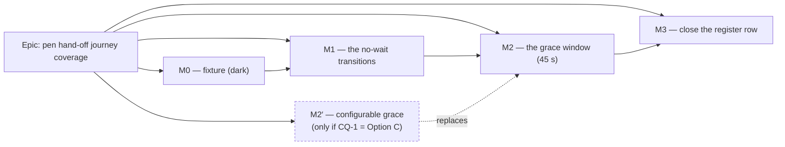

# Implementation Plan: A journey that drives the pen changing hands

- **Feature spec:** [./feature-spec.md](./feature-spec.md) — **Draft**, awaiting approval.
- **Status:** Draft | **awaiting approval before implementation**
- **Owner:** unassigned (web)

> **Nothing in this plan may start before CQ-1 is answered.** CQ-1 chooses between Milestone 2 and
> Milestone 2′, and the two are not variations of one task: M2 adds a test file, M2′ changes
> `apps/api`, adds an operator-facing environment variable, adds a Playwright config and a CI step,
> and therefore **fires ADR-0105's triggers and needs the spec re-approved**. M0 and M1 are common
> to both and may proceed on approval of the spec alone.

## Breakdown

### Epic

**Pen hand-off journey coverage** — put a browser through the four ADR-0028 transitions no browser
has ever driven (peer take-over, admin override, keep-editing, and the demoted holder's loss), so
that `docs/TECH_DEBT.md` #286 closes on evidence rather than on a paragraph. Maps to no roadmap
theme; this is register work.

---

## Milestone 0 — the two-actor fixture, extracted

**Outcome:** nothing a planner can do changes.
**Entry point:** **Ships dark** — this is a pure test-helper extraction with no product surface. M1
is the first milestone with an entry point.
**Journey:** none of its own. **Its oracle is the existing journey**: `pen-handoff.spec.ts` must
pass with **its assertions unedited** after consuming the extracted helpers. If any assertion has to
change, the extraction changed behaviour and the milestone is wrong (the ADR-0078 barrel-preserving
argument, applied to a test fixture).

---

#### Feature: shared two-actor onboarding helpers

> **Description:** Move `signUp`, the invite-a-Planner flow and `refetchLock` out of
> `pen-handoff.spec.ts` into `e2e-edit/support.ts`, so M1 and M2 do not each grow a third copy.
> **Complexity:** S
> **Dependencies:** none.
> **Risks:** the extraction silently changes a wait or an assertion → mitigated by the oracle above,
> and by making this its own PR so the diff is readable as "moved, not changed".
> **Testing requirements:** `scripts/e2e-local.sh web:edit` green, with `pen-handoff.spec.ts`
> untouched below its import line.

##### Task M0-T1 — extract `signUp` and `invitePlanner` into `e2e-edit/support.ts` (≈ one PR)

- **Description:** `signUp` is `pen-handoff.spec.ts:28-35`. The invite flow is `:65-72` and returns
  the accept URL. Both move verbatim; the invite gains a `role` parameter defaulted to `'PLANNER'`
  so M1 can invite the same way without a second literal.
- **Complexity:** S
- **Dependencies:** none
- **Risks:** `support.ts`'s existing `onboard` (`support.ts:10-22`) already does sign-up **and**
  org creation for the single-actor suites, so there is a near-duplicate. **Do not merge them.**
  `onboard` returns a slug and asserts a URL; `signUp` deliberately stops at the create-organisation
  screen because the second actor never creates one. Collapsing them would put a branch inside a
  helper two suites depend on.
- **Testing:** the oracle above. No new assertions.
- **Development steps:**
  1. Move the two functions, exporting them from `support.ts`. Keep the docblocks; add one sentence
     to `signUp` saying why it stops where it does.
  2. Import them in `pen-handoff.spec.ts`; delete the local copies; change nothing else.
  3. Run `scripts/e2e-local.sh web:edit` and confirm green.

##### Task M0-T2 — promote `refetchLock`, and document the side effect it relies on

- **Description:** `refetchLock` (`pen-handoff.spec.ts:23-26`) moves to `support.ts`. Its docblock
  today explains the query refetch and **not** the second effect M1/M2 depend on: dispatching
  `visibilitychange` also fires the heartbeat hook's immediate recovery beat
  (`apps/web/src/features/plan-lock/api/use-plan-edit-lock.ts:159-166`, which calls
  `beatRef.current()` on `visibilitychange` while `holding`). That beat is what makes a demoted
  holder's 423 `PLAN_EDIT_LOCK_LOST` arrive in about a second instead of within thirty.
- **Complexity:** S
- **Dependencies:** M0-T1
- **Risks:** a later author "tidies" the dispatch into a plain `page.reload()`, which fires
  `pagehide` and **releases the holder's pen** (`use-plan-edit-lock.ts:169-185`) — the existing
  docblock already warns of this and the warning must survive the move.
- **Testing:** the oracle above.
- **Development steps:**
  1. Move the function; extend the docblock with the heartbeat side effect, citing the file and
     lines.
  2. Import in `pen-handoff.spec.ts`.
  3. Re-run.

---

## Milestone 1 — the transitions that need no wait

**Outcome:** an Org Admin can be seen taking a plan back from a Planner, through the confirmation,
and the Planner can be seen finding out.
**Entry point:** the plan workspace foot row's `Take over` button (accessible name `Take over`,
`EditLockControls.tsx:101-110`), its confirmation `Take over editing?`, and the demoted holder's
`Dismiss` (`:143-147`).
**Journey:** `apps/web/e2e-edit/pen-override.spec.ts`, run by the existing
`pnpm --filter @repo/web test:e2e:edit` CI step. **No new config, script, CI step or sweep entry** —
see the spec §4 "Does this need a new Playwright config?".

---

#### Feature: admin override, end to end, with the demoted holder's side

> **Description:** US-1 in full. Two contexts; **Planner holds, admin overrides** — the inversion of
> `pen-handoff.spec.ts`, and required, because `resolveLockView` offers `override` only to a
> non-holder with `canOverride` (`lock-view.ts:176-184`).
> **Complexity:** M
> **Dependencies:** M0.
> **Risks:** the biggest is listed as its own task (M1-T2) because it is likely to be a **product
> defect** rather than a test problem, and discovering that mid-task is how a coverage epic turns
> into an unplanned fix.
> **Testing requirements:** the spec's US-1 AC-1…AC-6, each an assertion.

##### Task M1-T1 — the override path up to and including the confirmation

- **Description:** Fixture: A signs up, creates the org, invites B as `PLANNER`, B accepts; A
  creates the plan (`support.ts:25-43`) and sets the planned start. **B** takes the pen and adds one
  activity. A opens the plan. Assert AC-1 (exactly `Take over`; **no** `Request control`, **no**
  `Take over now`), press it, assert AC-2 — the dialog's title and body, **and** that
  `GET …/edit-lock` still reports `HELD_BY_OTHER`.
- **Complexity:** M
- **Dependencies:** M0-T1
- **Risks:**
  - Locating the dialog by copy rather than by role → use `getByRole('alertdialog')`
    (`EditLockControls.tsx:42` records that it is one) and assert the copy inside it.
  - AC-2's negative half is the easy one to drop. It is the only assertion that would fail against a
    confirm that acts before confirming, which looks identical on screen.
- **Testing:** AC-1, AC-2.
- **Development steps:**
  1. Write the fixture using the M0 helpers; assert B holds the pen before A arrives (read
     `GET …/edit-lock` through `page.evaluate` + `fetch(..., { credentials: 'include' })`, the
     pattern `support.ts:111-131` already uses).
  2. Assert AC-1 with both negatives.
  3. Press `Take over`; assert the dialog; assert the API still says `HELD_BY_OTHER`.
  4. **Verify red**: temporarily assert `Request control` is present and confirm the test fails, so
     the negative assertions are known to discriminate (ADR-0110 D5 — a gate is finished when it has
     been made to fail by the defect it names).

##### Task M1-T2 — confirm, and settle where focus goes

- **Description:** Confirm the dialog; assert AC-3 (A holds; the deck verb reads `Stop editing`; the
  foot row offers no hand-off control) and **AC-4: focus is on `[data-plan-pen]`**.
- **Complexity:** M
- **Dependencies:** M1-T1
- **Risks:** **AC-4 may legitimately fail, and if it does it is a product defect.** The pressed
  control is inside a native `<dialog>`, which restores focus as it closes, while the control behind
  it unmounts and `usePenLockView`'s restore effect (`use-pen-lock-view.ts:111-117`) runs on the
  `signature` change. ADR-0099 M10 records exactly this ordering shipping as a WCAG 2.2 §2.4.3
  failure that also silently disabled the workspace keyboard accelerators.
  **Mitigation is procedural, not technical:** if it fails, do not weaken the assertion and do not
  fix it inside this task. Instrument the real focus sequence, record it, and take the fix to a
  register row — this epic changes no product code (spec §4 "Component changes"), and a fix smuggled
  into a coverage PR is the thing ADR-0105 exists to stop.
- **Testing:** AC-3, AC-4.
- **Development steps:**
  1. Confirm; assert AC-3 on both the deck and the foot row.
  2. Assert AC-4 against the **named** element. Do **not** write "focus is not on `<body>`":
     `CompactPenStatus.tsx:73-75` records that that form passes against the broken behaviour.
  3. If red, instrument (`document.activeElement` at each step) before concluding anything, and
     open a register row with the observed sequence.

##### Task M1-T3 — the demoted holder finds out, and dismisses

- **Description:** Assert AC-5 and AC-6 on B's context: after `refetchLock(b)`, B's `role="status"`
  region reads `Editing control was taken over — you're now read-only.`, the badge reads
  `Read-only`, `Dismiss` is the only control, and the sentence is **painted** rather than `sr-only`.
  Pressing `Dismiss` resolves to the ordinary locked state.
- **Complexity:** M
- **Dependencies:** M1-T2
- **Risks:**
  - **A race worth naming**: `refetchLock` triggers both a status refetch and a heartbeat. If the
    status lands first, B's view is `locked` for an instant before the heartbeat's 423 sets
    `lostControl` (which then overrides everything — `lock-view.ts:120-128`). So assert on the
    `lost` **sentence** with a generous timeout (`pen-handoff.spec.ts:16`'s `CROSS_ACTOR` = 20 s),
    never on a snapshot immediately after the dispatch.
  - Asserting "painted" needs care: eight of the ten states render the sentence `sr-only`
    (`CompactPenStatus.tsx:230`), and an `sr-only` element still satisfies Playwright's
    `toBeVisible()` because it has a 1×1 box — which is why `pen-handoff.spec.ts:152` can assert
    `toBeVisible()` on an `sr-only` region. **So `toBeVisible()` does not distinguish the two**; if
    AC-5's "painted" half is to mean anything, assert the absence of the `sr-only` class on the
    region, or drop the claim and say so.
- **Testing:** AC-5, AC-6.
- **Development steps:**
  1. `refetchLock(b)`; assert the `lost` sentence, badge and sole control.
  2. Decide and implement the "painted" discriminator per the risk above; whichever is chosen, write
     the reason in the spec beside the assertion.
  3. Press `Dismiss`; assert the locked state naming A, and that no editing affordance returned.
  4. Update `docs/TESTING.md`'s description of the `e2e-edit` suite.

---

## Milestone 2 — the grace window (CQ-1 Option A)

**Outcome:** a Planner can be seen asking, waiting, and taking control when the wait elapses — and
the holder can be seen declining without that cancelling the request.
**Entry point:** the foot row's `Take over now` (disabled, then operable —
`EditLockControls.tsx:91-100`) and `Keep editing` (`:132-142`).
**Journey:** `apps/web/e2e-edit/pen-takeover.spec.ts`, same CI step.

> **This milestone contains the only real-time wait in the epic.** It is one `test()`, so a CI retry
> (`playwright.edit.config.ts:24`, `retries: 2`) re-runs 45 seconds and not the whole epic.

---

#### Feature: request → keep editing → wait out grace → take over

> **Description:** US-2 and US-3 as one narrative, because US-3 AC-4 ("keeping does not refuse")
> is only provable by then taking over anyway.
> **Complexity:** L — not for difficulty, for the wait and the number of cross-actor synchronisation
> points.
> **Dependencies:** M0, and M1 for the `lost`-state assertions it reuses.
> **Risks:** rolled up in the table at the foot of this plan.
> **Testing requirements:** US-2 AC-1…AC-6 and US-3 AC-1…AC-4.

##### Task M2-T1 — request, and the `waiting` state

- **Description:** Fixture as M1 but **A (admin) holds** and **B (Planner) requests**. Assert US-2
  AC-1 (`Requested — waiting for A…`, a `Take over now` that is not operable), AC-2 (a non-empty
  countdown aside) and AC-3 (no `New activity` affordance for B).
- **Complexity:** M
- **Dependencies:** M0
- **Risks:**
  - The `waiting` control is rendered with the **native `disabled` attribute**
    (`EditLockControls.tsx:91-95`), so `getByRole('button', { name: 'Take over now' })` still
    resolves it. Assert `toBeDisabled()`, not absence.
  - The countdown is `aria-hidden` (`CompactPenStatus.tsx:236-240`), so it is invisible to
    `getByRole` and visible to Playwright's text engine. **Never assert a specific number** (spec
    Q-4: the tick pauses for a hidden tab).
  - **Do not press `Request control` twice.** `stampRequest` is newest-wins
    (`plan-lock.repository.ts:144-154`), so a retry inside the test restarts the 45 s clock.
- **Testing:** US-2 AC-1, AC-2, AC-3.
- **Development steps:**
  1. Fixture; A takes the pen and adds one activity so B has something to be locked out of.
  2. B requests; assert the three ACs, scoping the sentence assertion to `getByRole('status')` (the
     reason is written at `pen-handoff.spec.ts:141-151`: the same words are legitimately on screen
     twice, once as a shaded control's `aria-describedby` target).
  3. **Record the timestamp of the request** — M2-T3's wait is measured from here, not from the
     start of the test.

##### Task M2-T2 — the holder declines, and the request survives

- **Description:** US-3. `refetchLock(a)`; assert A sees `{B} is asking to edit this plan.` visibly
  beside `Hand over` and `Keep editing`; press `Keep editing`; assert both controls vanish and the
  region returns to `You're editing this plan.`; then assert **from the API** that `requestedBy` is
  still B and `graceEndsAt` is still non-null.
- **Complexity:** M
- **Dependencies:** M2-T1
- **Risks:** the last assertion is the whole point of the task and is the one a reviewer will read
  as redundant. It is not: `Keep editing` writes nothing to the server
  (`use-pen-lock-view.ts:193-195` sets a local id only), so "declined" and "still pending" are the
  same server state and only the API read distinguishes them. Put that sentence in the test.
- **Testing:** US-3 AC-1, AC-2, AC-3.
- **Development steps:**
  1. `refetchLock(a)`; assert AC-1. Note the incoming-request state is one of only two where the
     sentence is painted (`lock-view.ts:55-67`).
  2. Press `Keep editing`; assert AC-2, including that A's editing affordances survive.
  3. Read `GET …/edit-lock` from A's page; assert AC-3.

##### Task M2-T3 — wait out grace, prove it was the grace route, take over

- **Description:** Wait until more than `LOCK_HANDOFF_GRACE_MS` (45 s, `plan-lock.policy.ts:29`) has
  elapsed since M2-T1's recorded request time. `refetchLock(b)`; assert **AC-5 first** — the API
  reports the holder's `heartbeatAt` as younger than `LOCK_INACTIVE_AFTER_MS` (90 s,
  `plan-lock.policy.ts:24`) — then AC-4 (`Take over now` operable) and AC-6 (press it; B holds;
  focus on `[data-plan-pen]`; A reaches the `lost` state).
- **Complexity:** L
- **Dependencies:** M2-T2
- **Risks:**
  - **AC-5 is not decoration and must not be dropped as slow.** Without it, a take-over permitted by
    the _inactive-holder_ route (`plan-lock.policy.ts:89-91`) is indistinguishable from the grace
    route — `resolveLockView` cannot see which produced `canTakeOver` (`lock-view.ts:186-193`) — so
    the test would pass while proving something else, with nothing on screen to notice.
  - Keep the holder alive across the wait: `refetchLock(a)` immediately before the wait begins fires
    an immediate heartbeat (M0-T2's documented side effect), which pins `heartbeatAt` near the start
    of the window. Even with **zero** heartbeats, 45–55 s cannot reach the 90 s inactive threshold
    from an acquire that stamps `heartbeatAt: now` (`plan-lock.repository.ts:70`) — but AC-5 asserts
    it rather than trusting the arithmetic.
  - `test.setTimeout` must be raised well past `pen-handoff.spec.ts:50`'s 120 s. Budget the wait plus
    the fixture plus two cross-actor settles; state the measured figure in the PR (spec S5).
  - Do not implement the wait as a bare sleep from "now": measure from the recorded request time, or
    a slow fixture silently makes the wait shorter than it looks.
- **Testing:** US-2 AC-4, AC-5, AC-6; US-3 AC-4.
- **Development steps:**
  1. `refetchLock(a)` to pin the holder's heartbeat; begin the wait, computed from M2-T1's timestamp
     with a margin over 45 s.
  2. `refetchLock(b)`; poll `GET …/edit-lock` until `canTakeOver` is true, asserting `heartbeatAt`
     freshness in the same read.
  3. Assert `Take over now` is operable; press it; assert AC-6 including the named focus target.
  4. `refetchLock(a)`; assert A's `lost` state (reusing M1-T3's helper if one emerged).
  5. **Verify the grace gate red**: run the same test with the wait shortened below 45 s and confirm
     it fails at AC-4. A test that would pass without waiting has not tested the grace window.
  6. Record the measured added wall clock for `test:e2e:edit`.

---

## Milestone 2′ — configurable grace (**only if CQ-1 is answered Option C**)

**Outcome:** identical to M2 from a planner's point of view; the difference is that CI spends ~2 s
instead of ~50 s, and the product gains an operator-facing knob.
**Entry point:** unchanged from M2.
**Journey:** a **new** `apps/web/playwright.pen-handoff.config.ts` pinning
`PLAN_EDIT_LOCK_GRACE_MS`, a new `test:e2e:pen-handoff` script, and a new CI step.

> **This milestone requires the spec to be re-approved before it starts** (ADR-0105: a new Playwright
> config and a new CI step are both triggers, and it is an `apps/api` change besides). It is written
> out so the cost is a decision rather than a discovery.

---

#### Feature: promote the lock timings to env-validated config

> **Description:** What `plan-lock.policy.ts:8-12` sanctions — _"promote to env-validated config if
> they ever need per-deployment tuning"_.
> **Complexity:** M
> **Dependencies:** none, but it invalidates M2.
> **Risks:** see the task.
> **Testing requirements:** the existing `plan-lock.policy.spec.ts` and `plan-lock.service.spec.ts`
> keep passing with the value passed explicitly; `plan-lock.e2e-spec.ts` imports the value rather
> than restating it.

##### Task M2′-T1 — thread `graceMs` through the pure policy

- **Description:** Add `PLAN_EDIT_LOCK_GRACE_MS` to `env.validation.ts` (the
  `RETENTION_HIERARCHY_DAYS` shape at `:205` is the precedent: `z.coerce.number().int().min().max().default()`),
  a getter on `app-config.service.ts`, and a **parameter** on `isGraceElapsed`, `graceEndsAt` and
  `canTakeOverNow` (`plan-lock.policy.ts:64,70,81`), passed from the three call sites in
  `plan-lock.service.ts`.
- **Complexity:** M
- **Dependencies:** none
- **Risks:**
  - `apps/api/test/plan-lock.e2e-spec.ts:28` holds a **hand-copied** `const GRACE_MS = 45_000`. Left
    alone it becomes a third copy that stops agreeing silently. It must import the config value or
    the constant, and that is the first thing to do, not the last.
  - `z.coerce.boolean()` is `Boolean(value)` — ADR-0096 D10 records that trap shipping in
    `.env.example`. This is a number, so use `z.coerce.number()`, and set a floor (`min`) so a
    mistyped `0` cannot make every live lock instantly stealable.
  - A production knob whose only consumer is a test is a maintenance liability
    (ADR-0088's reasoning). Document the intent in the env docblock.
- **Testing:** the two unit specs; the API e2e; `.env.example` and `docs/DEPLOYMENT.md` updated.
- **Development steps:**
  1. Fix the hand-copied literal first, so the change has one source of truth before it moves.
  2. Env schema → config getter → policy parameters → service call sites.
  3. Update both unit specs to pass the value explicitly.
  4. Run `scripts/e2e-local.sh api`.

##### Task M2′-T2 — a new Playwright config, script and CI step

- **Description:** Copy `playwright.edit.config.ts`, add `PLAN_EDIT_LOCK_GRACE_MS` to the API
  `webServer.env`, point `testDir` at a new `e2e-pen-handoff/`, add the package script (which is
  what enrols it in `scripts/e2e-sweep.sh:48-57`'s derived list), and add the CI step beside the
  others in `.github/workflows/ci.yml`.
- **Complexity:** M
- **Dependencies:** M2′-T1
- **Risks:** the CI step must run **after** the preceding Playwright runs tear their servers down —
  every config here reuses ports 3000/5173 and the ordering is load-bearing
  (`playwright.edit.config.ts:12-14`).
- **Testing:** as M2, with the shortened wait.
- **Development steps:** as above, then re-run M2's assertions against the short grace, **and keep
  US-2 AC-2** — with a 2 s window the countdown may be unobservable, which is the spec's principal
  objection to Option C. If AC-2 cannot be asserted, say so in the spec rather than deleting it.

---

## Milestone 3 — close the register row honestly

**Outcome:** a reader of `docs/TECH_DEBT.md` gets a true picture.
**Entry point:** **Ships dark** — documentation only.
**Journey:** none.

---

#### Feature: correct and close #286

> **Description:** #286 closes, **and its two false sentences are corrected in place rather than
> deleted with the row.**
> **Complexity:** S
> **Dependencies:** M1 and M2 (or M2′).
> **Risks:** closing the row and deleting the wrong claims loses the finding. ADR-0071's lesson is
> that noticing drift and stepping over it leaves the register exactly as wrong as not noticing.
> **Testing requirements:** `pnpm check:debt-status`, `pnpm check:doc-links`, `pnpm check:spec-status`.

##### Task M3-T1 — the register, the spec header, and the workspace-console paragraph

- **Description:**
  1. `docs/TECH_DEBT.md` #286 → closed, carrying the C1 correction: two of the five transitions
     (`request`, `handover`) were already covered by `pen-handoff.spec.ts`, and the row's own search
     could not see them because the button is labelled `Hand over`.
  2. This spec's header → `Accepted — shipped` or `Approved`, per `check:spec-status`'s vocabulary
     (`scripts/check-spec-status.mjs:79`). Note that **no ADR cites this spec**, so S3 does not
     apply and `Approved` is admissible; but if an ADR is filed, `Accepted — shipped (ADR-NNNN)` is
     required (`:310-318`).
  3. `docs/specs/workspace-console/feature-spec.md:401-415` — the corrected paragraph gains a
     sentence naming the journey that now exists, without re-asserting the original false claim.
  4. `docs/TESTING.md` — the `e2e-edit` suite's description.
- **Complexity:** S
- **Dependencies:** M1, M2
- **Risks:** #286's own "sized M, not S" paragraph says the work needs "a two-context Playwright
  fixture, two seeded members with different roles, and control over the grace window — none of
  which any existing harness provides". The first two **were** provided (C1). Record that, because
  a sizing claim that was wrong is the same defect class as the coverage claim that was wrong.
- **Testing:** the three `check:*` gates, plus `pnpm prepush`.
- **Development steps:**
  1. Edit the four documents.
  2. Add a register row for anything M1-T2 or Q-5 turned up (the confirm-dialog focus sequence; the
     native-`disabled` `waiting` control) — **as rows, not fixes**.
  3. `pnpm prepush`; `scripts/e2e-local.sh web:edit`.

---

## Sequencing & slices

`main` stays releasable throughout: **no product code changes** under Option A, so every slice is a
test-only PR.

| Order | Slice       | Releasable? | Notes                                                                                                                                       |
| ----- | ----------- | ----------- | ------------------------------------------------------------------------------------------------------------------------------------------- |
| 1     | M0 (T1, T2) | yes         | One PR. Its whole content is "moved, not changed".                                                                                          |
| 2     | M1 (T1–T3)  | yes         | One PR, or two if M1-T2 turns up a product defect — in which case the defect goes to a register row and its own change, never into this PR. |
| 3     | M2 (T1–T3)  | yes         | One PR. Report the measured wall-clock delta.                                                                                               |
| 4     | M3 (T1)     | yes         | Docs only.                                                                                                                                  |

**Feature flags:** none, and none is possible. A `VITE_` constant is inlined at build time
(ADR-0088 D1) and could not gate a test suite anyway. The two flags this work **depends on** —
`VITE_PLAN_EDIT_LOCK` and `VITE_TSLD_EDITING` — are pinned on by `playwright.edit.config.ts:69-72`,
which makes these specs **ADR-0088 Class C** (pinned by a harness). M3 should say so where the
retirement register can see it, so a future batch does not retire a flag and strand this coverage —
which is the ADR-0084 batch-1 failure exactly.

## Definition of Done (per task)

Each task's PR must satisfy the Feature Completion Criteria in
[`docs/PROCESS.md`](../../PROCESS.md). Three of them bind unusually here:

- **Tests** means `pnpm prepush` **and** `scripts/e2e-local.sh web:edit` were run locally. For this
  epic the e2e half is not a supplementary check — it is the entire deliverable, and CI is the
  second opinion (CLAUDE.md §19.8).
- **Changeset:** **none.** Nothing user-visible changes and no package's public contract moves.
  Under Option C, M2′-T1 does change `apps/api`'s environment contract and **does** need one.
- **Accessibility:** no UI changes, so no reviewer pass is owed. If M1-T2's focus assertion fails,
  the resulting fix is a separate change and **does** owe an `accessibility-reviewer` pass
  (CLAUDE.md §19.13 — a shared primitive's focus behaviour).

## Risks & assumptions (rollup)

| Risk / assumption                                                                      | Likelihood | Impact   | Mitigation                                                                                                                                                                                                          |
| -------------------------------------------------------------------------------------- | ---------- | -------- | ------------------------------------------------------------------------------------------------------------------------------------------------------------------------------------------------------------------- |
| **CQ-1 is answered Option C**, invalidating M2                                         | med        | med      | M2′ is written out, so the cost is visible before the choice. The spec must be re-approved.                                                                                                                         |
| **US-1 AC-4 (focus after the confirm dialog) fails** — a real defect                   | med        | med      | Recorded as an expected possibility in M1-T2 with a procedural response: instrument, record, file a row. Do not fix inside the coverage PR.                                                                         |
| The 45 s wait makes `test:e2e:edit` the long pole                                      | low        | low      | It is one `test()`, so a retry costs 45 s and not the epic. Report the measured delta (S5); if it is material, the honest response is to reopen CQ-1, not to shorten the wait.                                      |
| The take-over passes via the **inactive** route and nothing notices                    | med        | **high** | US-2 AC-5 asserts the holder's `heartbeatAt` freshness from the API immediately before the press. This is the single most important assertion in the epic, because its absence is invisible.                        |
| Cross-actor propagation is flaky                                                       | med        | med      | Force reads with `refetchLock` rather than waiting on a poll; keep `pen-handoff.spec.ts:16`'s 20 s `CROSS_ACTOR` backstop. Never assert a snapshot immediately after a dispatch.                                    |
| The "painted vs `sr-only`" discriminator is not what the test thinks                   | med        | low      | Named explicitly in M1-T3: `toBeVisible()` passes for an `sr-only` 1×1 element (`pen-handoff.spec.ts:152` relies on that), so it cannot carry AC-5's "painted" half. Choose a real discriminator or drop the claim. |
| Retiring `VITE_PLAN_EDIT_LOCK` or `VITE_TSLD_EDITING` later strands the suite          | low        | med      | M3-T1 records these specs as ADR-0088 **Class C**. The ADR-0084 batch-1 incident is the precedent.                                                                                                                  |
| A later author "simplifies" `refetchLock` to `page.reload()`                           | med        | med      | M0-T2 keeps the existing warning in the moved docblock: a reload fires `pagehide` and **releases** the pen.                                                                                                         |
| **Assumption:** two `browser.newContext()` calls give independent Better Auth sessions | —          | —        | Not an assumption — `pen-handoff.spec.ts:55-84` does it today and passes in CI.                                                                                                                                     |
| **Assumption:** the grace window cannot be shortened without changing `apps/api`       | —          | —        | Established by grepping the repository for `LOCK_HANDOFF_GRACE_MS`: `plan-lock.policy.ts`, its two unit specs, and a hand-copied literal in the API e2e. No env var, no column, no injection.                       |
