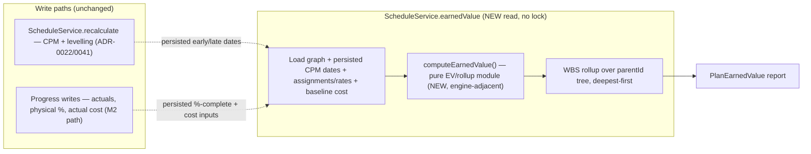
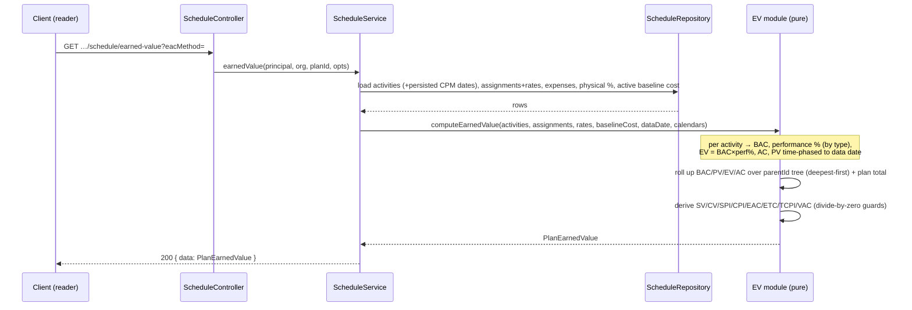
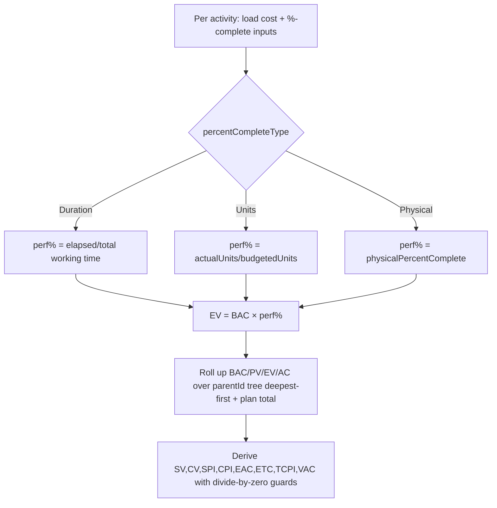

# Feature Spec: Percent-complete types & Earned Value (M7 cost/EV rung)

- **Status:** Draft (awaiting approval — no application code written)
- **Author(s):** feature-analyst (Product Owner / Solution Architect / Technical Lead hats), with James Ewbank
- **Date:** 2026-07-17
- **Tracking issue / epic:** Engine conformance & validation framework (ADR-0034) — capability epic **M7 (the Resource dimension)**, rung: **Percent-complete types & Earned Value**. Follows the resource model (ADR-0039), duration/units types (ADR-0040), and resource levelling (ADR-0041); it is the **cost/EV** rung those ADRs each named as "a later rung with its own ADR".
- **Roadmap link:** `docs/specs/engine-conformance-framework/CAPABILITY_MATRIX.md` — the ⚪ **"Percent-complete / earned value / cost / curves / accrual"** row (`pct_physical` `pct_units` `code_steps` `cost_*` `accrual_*` `*_curve_*`, owned by **M7**). This rung flips the **%-complete-type** and **cost / earned-value** halves of that group to ✅; **resource curves / histograms, cost accrual/period trending, and activity steps (`code_steps`) remain ⚪** and are explicitly out of scope (§2 / §4).
- **Related ADR(s):**
  - **ADR-0042 _(NEW — Proposed; drafted alongside this rung)_** — Percent-complete types & Earned Value: the per-activity `percentCompleteType` (Duration / Units / Physical), the separation of **schedule %-complete** (drives the CPM remaining) from **performance %-complete** (drives EV, changes no dates), and the decision that **Earned Value is a pure read-model / rollup analysis — NOT a CPM write pass and NOT an engine-owned column set** (the key contrast with ADR-0041 levelling).
  - **ADR-0035 _(new clause proposed, Accept under this rung's conformance slice)_** — a new **§29 (percent-complete-type & earned-value semantics)**: which %-complete type feeds EV, the 0/100 milestone rule, LOE/WBS/resource-dependent EV behaviour, the BAC/PV/EV/AC definitions, the default **EAC** formula, and the divide-by-zero guards. Plus negative-case additions to §25 (**N22** negative cost/rate; **N23** physical %-complete out of 0–100; **N24** actual cost/units on a not-started activity).
  - **ADR-0025 _(amendment proposed)_** — extend the baseline **snapshot** (`BaselineActivity`) with a captured **budgeted cost**, so the active baseline can serve as the **cost baseline** (the PV / BCWS S-curve). Additive; a baseline captured before this rung simply reads a null cost baseline (PV falls back to the live budget, flagged).
  - **Builds on:** ADR-0039 (`Resource`/`ResourceAssignment`; **cost + earned-value columns reserved "for their later rungs" — this rung activates them**), ADR-0040 (`unitsPerHour` rate + the `Units = Duration × Units/Time` triad — the quantity backbone EV costs ride on), ADR-0037 (absolute working-instant axis — time-phasing PV/duration-%-complete uses working time on the activity's own calendar), ADR-0023/0033 (the **data date** = the EV status date), ADR-0038 (the `parentId` WBS tree — EV rolls up over it, like the M5-epic date rollup), ADR-0022/0028 (recalc + edit-pen — untouched; EV adds a **read** endpoint, not a write pass), ADR-0012/0016 (RBAC + org scope).

> **This rung gives SchedulePoint the headline commercial-controls capability of _Earned Value Management_: measuring whether a project is ahead/behind and over/under budget against a committed plan, using the P6 metric set (BAC, PV/BCWS, EV/BCWP, AC/ACWP → SV, CV, SPI, CPI → EAC, ETC, TCPI, VAC).** Two things make it distinct from every prior engine rung. **First,** it introduces the crucial distinction between **schedule %-complete** (duration/units-based, drives the CPM remaining work and therefore the dates — already partly present as `percentComplete`) and **performance / physical %-complete** (a manually-entered measure of _value earned_ that changes **no** dates). **Second,** unlike levelling (ADR-0041), Earned Value **does not schedule anything** — it is derived analytics. So it is a **pure read-model / rollup analysis** (a sibling of `float-paths.ts` and the baseline-variance read), computed live from cost + %-complete inputs on a **read endpoint**, **not** an additive pass inside `computeSchedule` and **not** a set of engine-owned persisted columns. It is sliced as an epic of shippable rungs like ADR-0039/0040/0041: **EV1** (cost + %-complete-type schema, dark), **EV2** (the pure EV computation module + read endpoint + WBS rollup), **EV3** (conformance — flip the `pct_*`/`cost_*` matrix rows, Accept ADR-0035 §29), **EV4** (flagged web surface, deferred). Resource curves/histograms, cost **accrual / period trending** (the stored S-curve over time), and **activity steps** (`code_steps`, weighted physical %) are named later rungs, out of scope.

---

## 1. Business understanding

### Problem

A construction planner can now build, calendar, resource, and level a schedule, and progress it (M2 actuals). What they **cannot** do is answer the two questions every project controls / commercial team asks at each reporting cycle: **"Are we ahead or behind, and are we over or under budget — measured against the committed plan?"** The CPM dates say _when_, and the ADR-0025 baseline says _versus what plan_, but there is no **cost dimension** and no **earned-value** analysis tying budget, schedule, and physical progress together. The resource model deliberately **reserved** cost and earned-value columns "for their later rungs" (ADR-0039); the conformance fixture's `pct_physical` / `pct_units` / `cost_*` / `accrual_*` / `*_curve_*` tags sit unrunnable at ⚪.

Two sub-problems live inside this. (1) **%-complete is overloaded.** Today `percentComplete` is a single schedule figure that drives the CPM remaining duration. P6 distinguishes three **%-complete types** — **Duration** (elapsed vs total duration), **Units** (actual vs budgeted work), and **Physical** (a hand-entered assessment) — and lets each activity choose which one represents its progress _for value-earned purposes_. Physical %-complete in particular is a **performance measure that must not move the schedule** (a wall can be "60% built" while its remaining duration is independently forecast). (2) **There is no cost data and no EV maths.** Budget-at-completion, the planned-value S-curve, earned value, actual cost, and the derived indices (SPI/CPI) and forecasts (EAC/ETC/TCPI/VAC) do not exist.

**Why now.** The prerequisites landed across M7: the **quantity backbone** (`budgetedUnits`, the `unitsPerHour` rate, and the `Units = Duration × Units/Time` triad, ADR-0039/0040), the **committed-plan snapshot** (ADR-0025 baselines — the natural home of the cost baseline / PV curve), the **status date** (the plan `plannedStart` = the CPM data date, ADR-0023/0033), the **working-instant axis** for time-phasing (ADR-0037), and the **WBS tree** for rollup (ADR-0038). EV is the last quadrant of the P6-class fixture that construction planners feel commercially, and every input it needs is now either present or one additive column away.

### Users

Roles are per **organisation membership** (ADR-0012/0016). Setting a resource's cost rate, an activity's %-complete type, its budget/expense, its physical %-complete, and its actual cost are **definition/progress writes** (the same classes as editing a duration or entering an actual); computing and reading the EV analysis is a new **read** action. No new write pass, no new edit-pen surface.

| Role                                | Need in this rung                                                                                                                                                                                                                              |
| ----------------------------------- | ---------------------------------------------------------------------------------------------------------------------------------------------------------------------------------------------------------------------------------------------- |
| **Org Admin**                       | Full definition access; set resource cost rates; read every EV figure; never locked out of the org's data.                                                                                                                                     |
| **Planner**                         | Set a resource's cost rate; set an activity's `percentCompleteType`, budget/expense, and (for physical) its physical %-complete; capture a cost baseline; read the plan's SPI/CPI/EAC and the per-activity/WBS EV breakdown. The primary user. |
| **Contributor**                     | Enter **progress** — actual cost/units, physical %-complete — for activities in scope (pen-gated, the M2 progress path); smaller scope.                                                                                                        |
| **Viewer / External Guest**         | Read the EV analysis (BAC/PV/EV/AC, SPI/CPI, EAC) and the per-activity/WBS breakdown. No edits.                                                                                                                                                |
| **Engine / conformance maintainer** | Flip the `pct_physical` / `pct_units` / `cost_*` capability rows to ✅ with first-principles EV goldens (BAC/PV/EV/AC → SPI/CPI/EAC computed from a hand-worked fixture) + a differential; Accept ADR-0035 §29; keep the CPM path untouched.   |

### Primary use cases

1. **Cost a resource** — a Planner sets a crew/plant resource's **cost rate** (activating the ADR-0039-reserved column), so assignments carry a budgeted cost.
2. **Budget an activity** — the activity's **BAC** derives from its assignments (`budgetedUnits × rate`) plus any activity-level expense; a lump-sum-only activity carries a direct budgeted expense.
3. **Choose how progress is measured** — a Planner sets an activity's **`percentCompleteType`** (Duration / Units / Physical). Physical activities get a hand-entered **physical %-complete**.
4. **Capture the cost baseline** — capturing an ADR-0025 baseline now also freezes each activity's budgeted cost, giving the **PV / BCWS** S-curve a committed reference.
5. **Status the project** — a Contributor enters actual cost / actual units / physical %-complete as of the **data date**.
6. **Read the earned-value analysis** — a reader requests the EV read endpoint: per-activity and WBS-rolled-up **BAC, PV, EV, AC, SV, CV, SPI, CPI, EAC, ETC, TCPI, VAC** plus plan totals, all **as of the data date**.
7. **(Conformance)** flip the `pct_*` / `cost_*` rows to ✅ — first-principles EV goldens + a differential, Accept ADR-0035 §29.

### User journeys

**Happy path — is the job earning its budget?** A Planner costs the resources and captures a Contract Baseline (freezing the PV curve). Three months in, at the data date, contributors have entered actual costs and physical %-complete. The Planner opens the EV analysis: the plan shows **BAC** (total budget), **PV** (what should have been earned by now, from the baseline curve), **EV** (what has actually been earned = Σ BAC×performance-%), **AC** (what has been spent). SchedulePoint reports **SV = EV − PV** (behind by £X of work), **CV = EV − AC** (over by £Y), **SPI = EV/PV = 0.92**, **CPI = EV/AC = 0.88**, and a forecast **EAC = BAC/CPI** (this job will cost £Z at current performance). The dates are unchanged — EV read nothing into the schedule.

**Happy path — physical %-complete does not move the schedule.** A concrete pour is entered at **60% physical** while its **remaining duration** is independently forecast at 4 days. The EV earned = 60% × its BAC; the CPM schedule uses the remaining-duration forecast, unaffected by the 60%. The two are decoupled by design.

**Alternate — WBS rollup.** A reader reads EV at a `WBS_SUMMARY`: its BAC/PV/EV/AC are the **sum of its branch leaves** (deepest-first over the `parentId` tree, the M5-epic rollup pattern); its SPI/CPI derive from those sums. A summary carries no cost of its own.

**Alternate — no cost baseline.** A plan with no active baseline (or a baseline captured before this rung) has no committed PV curve; PV **falls back to the live time-phased budget** and the response flags `costBaselineMissing` so SPI/SV are read with the right caveat.

**Alternate — zero-division guards.** An activity with **AC > 0** but **EV = 0** (spent, earned nothing) makes CPI = 0; **EAC = BAC/CPI** would divide by zero. The module **guards** (returns a defined "cannot forecast by CPI" sentinel / falls back to `AC + (BAC − EV)`), never `Infinity`/`NaN`.

**Read-only (Viewer/Guest).** Reads the plan and per-activity/WBS EV figures; no edit affordance.

**Conformance journey.** The maintainer hand-works a small costed fixture, adds first-principles goldens (BAC/PV/EV/AC → SPI/CPI/EAC to the penny), makes the `pct_physical`/`pct_units`/`cost_*` rows runnable, flips the matrix, adds the ADR-0035 §29 acceptance row, and confirms the CPM golden suite is **untouched** (EV never enters `computeSchedule`).

### Expected outcomes

- SchedulePoint gains **Earned Value Management** — the P6 metric set (BAC, PV, EV, AC → SV, CV, SPI, CPI → EAC, ETC, TCPI, VAC) — as a read-only analysis over the live schedule + cost data.
- The reserved `Resource` / `ResourceAssignment` **cost columns** become live; assignments carry budgeted/actual cost, and activities a budget.
- The **three P6 %-complete types** exist, with **physical %-complete** cleanly separated from the schedule (it earns value but moves no dates).
- The ADR-0025 baseline becomes a **cost baseline** (the PV curve); the conformance gap closes (`pct_*` / `cost_*` rows flip ✅); ADR-0035 gains a documented §29.
- The CPM engine and its golden suite are **byte-identical** — EV adds no write pass and no engine-owned column (the strongest possible parity guarantee).

### Success criteria

- **Correctness (first-principles).** For a hand-worked costed fixture, the module reproduces BAC/PV/EV/AC and the derived SPI/CPI/EAC **exactly** (to the penny / minor unit), so goldens assert without an external oracle (ADR-0034).
- **Decoupling.** Setting an activity's **physical %-complete** changes **no** CPM date (asserted): the recalc output is identical before/after a physical-% edit.
- **Parity.** The CPM engine, `computeSchedule`, and every existing golden/scenario are **unchanged** — EV is a separate read path.
- **Rollup.** A `WBS_SUMMARY`'s EV figures equal the sum of its branch leaves (deepest-first), matching the M5-epic date-rollup semantics.
- **Robustness.** Every derived metric guards divide-by-zero (PV=0, AC=0, EV=0, CPI=0) with defined outputs — never `NaN`/`Infinity`.
- **Performance.** The EV read computes over a 2,000-activity plan within the read budget (**p95 < 300 ms**, the baseline-variance precedent), single-query load + one linear rollup pass.

### Open questions

Marked **CRITICAL** where the answer changes design or scope; the rest have a stated default and do not block drafting.

> **Resolved 2026-07-17 (product owner).** The four CRITICAL questions were decided as the assumed defaults below: **Q1 = both** (assignment-derived + activity-level lump-sum expense); **Q2 = active ADR-0025 baseline** (amended to snapshot budgeted cost), with the flagged live-budget fallback; **Q3 = `EAC = BAC / CPI`** as the default, the other two selectable; **Q4 = a single manual `physicalPercentComplete` field**, weighted activity steps a later rung. Q5/Q6 stand at their stated defaults. This design is approved to build.

- **[CRITICAL] Q1 — Cost source of truth.** Is an activity's budget **derived** from its resource assignments (`Σ budgetedUnits × resource rate`), **entered directly** as an activity-level cost, or **both**? **Assumed default:** _both_ — BAC = `Σ (assignment budgeted cost)` + an optional activity-level **budgeted expense** (for lump-sum / non-resourced work); AC = `Σ (assignment actual cost)` + activity actual expense. This makes EV useful for resourced _and_ lump-sum plans. Confirm, as it shapes the schema (assignment cost columns vs activity cost columns) and the rollup.
- **[CRITICAL] Q2 — Cost baseline for PV/BCWS.** Is Planned Value measured against the **active ADR-0025 baseline** (extended to snapshot budgeted cost — the committed S-curve) or against the **current plan's** time-phased budget? **Assumed default:** _the active baseline_ (the committed plan is the correct PV reference); when none exists, **fall back to the live time-phased budget and flag `costBaselineMissing`**. This requires the ADR-0025 amendment (a `budgetedCost` column on `BaselineActivity`).
- **[CRITICAL] Q3 — Default EAC formula.** Which EAC is the default forecast: **`EAC = BAC / CPI`** (performance-factor / "typical", P6's default), **`EAC = AC + (BAC − EV)`** ("atypical" — remaining work at budget), or **`EAC = AC + (BAC − EV)/(CPI × SPI)`** (schedule-and-cost-adjusted)? **Assumed default:** _`BAC / CPI`_ as the headline forecast, with the other two exposed as selectable methods (a plan-level `eacMethod` option / a read-endpoint query param). This is the one genuinely contested EV call and is offered for decision.
- **[CRITICAL] Q4 — Physical %-complete entry model.** Is physical %-complete a **single manual field** per activity, or built from **weighted activity steps** (P6 `code_steps` — a checklist whose weighted completion rolls up to a physical %)? **Assumed default:** _a single manual `physicalPercentComplete` field_ this rung; **weighted activity steps (`code_steps`) are a named later rung**, out of scope. Confirm, as steps are a whole sub-model (a new child table).
- **Q5 — %-complete-type default.** **Default (stated, not blocking):** `percentCompleteType = DURATION` per activity (behaviour-preserving — today's `percentComplete` is duration-based), with an optional plan-level default the create path can apply. Duration-% is derived from the schedule; Units-% from `actualUnits / budgetedUnits`; Physical-% from the manual field.
- **Q6 — Cost representation & currency.** **Default (stated, not blocking):** money as **integer minor units + a per-plan ISO-4217 `currencyCode`** (the template's money rule; single currency per plan; org default), with `database-architect` confirming integer-minor-units vs `Decimal(18,4)` (the units precedent). Multi-currency/FX is out of scope (CLAUDE.md §17 i18n roadmap).
- **Q7 — Live read vs stored period trend.** **Default (stated, not blocking):** EV is computed **live, as of the current data date** (like baseline variance / float-paths); **stored period snapshots** (the accrual/S-curve-over-time trend, `accrual_*`) are a named later rung, out of scope.
- **Q8 — Actual-cost source.** **Default (stated, not blocking):** actual cost is **directly entered** (`actualCost` on the assignment/activity), with an optional derive-from-`actualUnits × rate`; construction actuals usually come from the cost system, not units.

## 2. Functional requirements

### User stories & acceptance criteria

> **US-1** — As a **Planner**, I want to give a resource a cost rate, so that its assignments carry a budgeted cost.
>
> **Acceptance criteria**
>
> - **Given** an org resource, **when** I set a non-negative cost rate, **then** it persists and is used to value that resource's assignments.
> - **Given** a **negative** rate, **then** it is rejected at the boundary (`@Min(0)` + a nullable-safe CHECK — **N22**), 422.
> - **Given** a null/unset rate, **then** the resource contributes **zero** cost (not an error) — parity-preserving.

> **US-2** — As a **Planner**, I want an activity's budget (BAC), so that earned value has a denominator.
>
> **Acceptance criteria**
>
> - **Given** an activity with resource assignments, **when** I read its BAC, **then** BAC = `Σ (assignment budgetedUnits × resource rate)` + the activity's budgeted expense (Q1 default).
> - **Given** a lump-sum activity with no assignments, **when** I set a budgeted expense, **then** BAC equals that expense.
> - **Given** a `WBS_SUMMARY`, **then** its BAC = the sum of its branch leaves' BAC (never entered directly).

> **US-3** — As a **Planner**, I want to choose an activity's %-complete type, so that its earned value reflects the right progress measure.
>
> **Acceptance criteria**
>
> - **Given** `percentCompleteType = PHYSICAL`, **when** I enter a physical %-complete, **then** EV earns `BAC × physical%` and **no CPM date changes** (asserted).
> - **Given** `= UNITS`, **then** performance % = `actualUnits / budgetedUnits` (capped 0–100; 0 when budget is 0).
> - **Given** `= DURATION` (default), **then** performance % = the schedule's duration %-complete (elapsed working time / total, floored/capped 0–100).

> **US-4** — As a **Planner/Contributor**, I want to status cost and physical progress as of the data date, so that EV is current.
>
> **Acceptance criteria**
>
> - **Given** I enter an `actualCost` / `actualUnits` / `physicalPercentComplete`, **then** it persists via the pen-gated progress path and is org-scoped.
> - **Given** a physical %-complete outside 0–100, **then** it is rejected (**N23**), 422.
> - **Given** an actual cost/units on a **not-started** activity, **then** it is **warned** (**N24**), not silently accepted as earned (counted in a warning total).

> **US-5** — As a **reader**, I want the plan's earned-value analysis as of the data date, so that I know schedule and cost performance.
>
> **Acceptance criteria**
>
> - **Given** a costed, progressed plan, **when** I GET the EV endpoint, **then** I get per-activity + WBS-rolled + plan-total **BAC, PV, EV, AC, SV, CV, SPI, CPI, EAC, ETC, TCPI, VAC**, all as of the data date.
> - **Given** PV = 0 (nothing scheduled yet), **then** SPI is reported as a defined sentinel (e.g. `null`), never `Infinity`.
> - **Given** AC = 0, **then** CPI and the CPI-based EAC are reported as defined sentinels, never divide-by-zero.
> - **Given** no active baseline, **then** PV uses the live budget and the response flags `costBaselineMissing`.

> **US-6** — As a **Planner**, I want the active baseline to freeze the cost budget, so PV reflects the committed plan.
>
> **Acceptance criteria**
>
> - **Given** I capture a baseline, **then** each snapshot row also freezes the activity's budgeted cost (ADR-0025 amendment).
> - **Given** a baseline captured before this rung, **then** its cost baseline reads null and PV falls back to the live budget (flagged), never an error.

> **US-7** — As a **conformance maintainer**, I want to prove EV against a hand-worked fixture, so the `pct_*`/`cost_*` rows flip ✅ honestly.
>
> **Acceptance criteria**
>
> - **Given** a costed fixture, **when** I run the EV goldens, **then** BAC/PV/EV/AC and SPI/CPI/EAC match the hand-worked values exactly.
> - **Given** a physical-% differential, **then** flipping an activity's physical % changes EV but **not** the CPM dates.
> - **Given** the EV path, **then** the existing CPM goldens/scenarios are byte-identical.

### Workflows

**Read the earned-value analysis (the core loop).**

1. `GET …/plans/:planId/schedule/earned-value` (`schedule:read`, org-scoped; optional `?eacMethod=` / `?asOf=` — default the plan data date).
2. Load, in one query set: the active graph (activities + calendars + the CPM-computed dates already persisted), the active assignments + their resource cost rates, activity budgeted/actual expense, physical %-complete, and (for PV) the **active baseline's** cost snapshot.
3. Run the **pure EV module** (no schedule mutation): per activity compute BAC, performance % (per `percentCompleteType`), EV, AC, and time-phase PV to the data date on the activity's calendar (ADR-0037).
4. **Roll up** BAC/PV/EV/AC over the `parentId` WBS tree (deepest-first, M5-epic pattern) and to the plan total; derive SV/CV/SPI/CPI/EAC/ETC/TCPI/VAC at each level with divide-by-zero guards.
5. Return the EV report (`{ data: PlanEarnedValue }`). **No write, no recalc, no lock** — a pure read.

**Set cost / %-complete-type / progress.** Planner/Contributor edits resource rates, activity `percentCompleteType` / budgeted expense (definition, pen-gated) and `actualCost` / `actualUnits` / `physicalPercentComplete` (progress, pen-gated) through the existing resource/activity/progress write paths — validated, org-scoped.

### Edge cases

- **Empty / no cost data** — BAC = 0 everywhere; EV = AC = PV = 0; indices report defined sentinels; not an error.
- **Milestone (0 duration)** — duration %-complete is **binary 0/100** (the 0/100 rule); a pure milestone's BAC is typically 0, so it earns nothing; a milestone carrying an expense earns its full BAC on completion.
- **Level-of-Effort** — LOE has no independent physical progress; its performance % defaults to **Duration** (elapsed over its derived span, ADR-0035 §21); its cost is apportioned across the span. (Physical-% on an LOE is ignored with a warning.)
- **WBS-summary** — carries **no cost of its own**; every EV figure is the rollup of its branch; a directly-entered budget/actual on a summary is rejected/ignored.
- **Resource-dependent** — EV identical to a TASK; cost from its assignments (driving and non-driving both carry budgeted/actual cost).
- **Not-started with actual cost** (N24) — warned; EV still = BAC × 0 for a duration/physical activity at 0% (spend without earn is exactly the CV signal, surfaced, not hidden).
- **Over-100% actuals** — `actualUnits > budgetedUnits` caps units-% at 100 for EV but preserves the raw AC (over-run shows in CV/CPI).
- **No baseline** — PV falls back to the live budget, `costBaselineMissing` flagged.
- **Divide-by-zero** — PV=0 ⇒ SPI sentinel; AC=0 ⇒ CPI sentinel + CPI-EAC guard; EV=0 & AC>0 ⇒ CPI=0 ⇒ CPI-EAC falls back per §29.
- **Concurrent progress edits** — the EV read is a plain snapshot read (no lock); it reflects whatever is persisted, like baseline variance.

### Permissions

Deny-by-default RBAC + org scope (ADR-0012), reusing existing write paths and one new read:

- `resource.rate`, `activity.percentCompleteType`, `activity.budgetedExpense` — **definition writes**, Planner + Org Admin (Contributor in scope), pen-gated (ADR-0028), org-scoped (IDOR-safe via existing resource/activity write paths).
- `activity.actualCost` / `actualUnits` / `physicalPercentComplete` — **progress writes** (the M2 progress path), Contributor+, pen-gated, org-scoped.
- `GET …/earned-value` — `schedule:read` (every member, incl. Viewer/Guest per plan share). No new permission; no pen (read).

### Validation rules

- Resource `rate`, assignment `budgetedCost`/`actualCost`, activity `budgetedExpense`/`actualExpense` — money (integer minor units per Q6; `>= 0`, DTO `@Min(0)` + nullable-safe CHECK, **N22**). Shared client↔server (Zod / class-validator).
- `physicalPercentComplete` — integer **0–100** (or null = unset); **N23** reject outside range.
- `actualUnits` — `Decimal(18,4) >= 0` (the ADR-0039/0040 units precedent).
- `percentCompleteType` — enum `DURATION | UNITS | PHYSICAL`, default `DURATION`.
- `eacMethod` (plan option / query) — enum `CPI | REMAINING_AT_BUDGET | CPI_TIMES_SPI`, default `CPI` (Q3).
- **No engine-owned EV columns.** EV outputs are **computed on read**, never persisted, never in a write DTO — the strongest data-integrity posture (nothing to accidentally accept).

### Error scenarios

| Scenario                                              | Detection             | User-facing result                               | Status |
| ----------------------------------------------------- | --------------------- | ------------------------------------------------ | ------ |
| Negative cost / rate (**N22**)                        | DTO `@Min(0)` + CHECK | inline field error                               | 422    |
| Physical %-complete outside 0–100 (**N23**)           | DTO range validator   | inline field error                               | 422    |
| Actual cost/units on a not-started activity (**N24**) | EV/progress service   | accepted + `costWarningCount` (warn, not reject) | 200    |
| Direct budget/actual on a `WBS_SUMMARY`               | service invariant     | rejected (summaries carry no own cost)           | 422    |
| Not a member / wrong org (IDOR)                       | org scope resolve     | not found                                        | 404    |
| No `schedule:read` permission                         | authz check           | forbidden                                        | 403    |
| PV = 0 / AC = 0 / CPI = 0 (divide-by-zero)            | EV module guards      | defined sentinel (null) for the affected index   | 200    |
| No active baseline (PV reference missing)             | EV module             | PV from live budget + `costBaselineMissing` flag | 200    |

## 3. Technical analysis

| Area           | Impact         | Notes                                                                                                                                                                                                                                                                                                                                                                                                             |
| -------------- | -------------- | ----------------------------------------------------------------------------------------------------------------------------------------------------------------------------------------------------------------------------------------------------------------------------------------------------------------------------------------------------------------------------------------------------------------- |
| Frontend       | low (deferred) | No UI in the core rungs. A **flagged** web surface (cost/rate fields, `percentCompleteType` picker, physical-% field, an EV table + KPI tiles + an S-curve) is EV4, behind `VITE_EARNED_VALUE` — mirrors `VITE_RESOURCES` / `VITE_RESOURCE_LEVELLING`.                                                                                                                                                            |
| Backend        | med-high       | A new **pure EV computation module** in the schedule domain (`earned-value.ts`, a sibling of `float-paths.ts`), a new **read** endpoint on `ScheduleController`, and a `ScheduleService.earnedValue(...)` read method. Resource/activity/progress write paths gain the new cost + %-complete-type fields. **No write pass.**                                                                                      |
| Database       | med            | Activate reserved **cost** columns on `Resource` (rate) + `ResourceAssignment` (`budgetedCost`?/`actualCost`/`actualUnits`); add `activities.percent_complete_type`, `physical_percent_complete`, `budgeted_expense`/`actual_expense`; amend `BaselineActivity` with `budgeted_cost` (cost baseline). Plan `eac_method` + `currency_code`. All additive/constant-default. **`database-architect` pass required.** |
| API            | med            | **One new read endpoint** (`GET …/schedule/earned-value`). Additive DTO fields on resource/activity/assignment/progress DTOs + a new `PlanEarnedValue` response DTO. OpenAPI + `docs/API.md` updated.                                                                                                                                                                                                             |
| Security       | low-med        | New definition/progress fields ride existing pen-gated, org-scoped write paths. EV read is `schedule:read`, org-scoped (IDOR review). **No engine-owned columns** to protect (EV never persisted). Cost is org-sensitive — the plan-share (Guest) read scope is reviewed.                                                                                                                                         |
| Performance    | med            | The EV read is the cost centre but bounded: one batched load (activities + assignments + rates + baseline cost) + one linear WBS rollup, no per-minute scan (time-phasing PV uses the closed-form working-time helpers, ADR-0037). Budget: p95 < 300 ms @ 2,000 (the baseline-variance precedent). `backend-performance-reviewer` at EV2.                                                                         |
| Infrastructure | none           | Synchronous read; no queue, no lock, no Redis. No new services.                                                                                                                                                                                                                                                                                                                                                   |
| Observability  | low            | The EV read logs its counts (activities valued, `costWarningCount`, `costBaselineMissing`) per ADR-0013; no new metric surface required.                                                                                                                                                                                                                                                                          |
| Testing        | high           | Unit (the pure EV module: BAC/PV/EV/AC per %-complete-type, WBS rollup, divide-by-zero guards, milestone 0/100, LOE apportionment); service integration (the read endpoint, cost-baseline fallback, physical-% changes no dates); conformance (first-principles EV goldens + a physical-% differential + matrix flip); no a11y until EV4.                                                                         |

### Dependencies

- **Must be in place (are):** ADR-0039/0040 resource + units model (cost columns reserved), ADR-0025 baselines (extended for the cost baseline), ADR-0023/0033 data date, ADR-0037 instant axis (PV time-phasing), ADR-0038 WBS tree (rollup), M2 progress ingestion (`percentComplete`, actuals).
- **This rung lands first:** EV1 (schema + cost baseline amendment) before EV2 (EV module + read endpoint) before EV3 (conformance + ADR-0035 §29) before EV4 (flagged web).
- **Sibling later rungs (out of scope, unblocked by this one):** resource curves/histograms, cost **accrual / period trending** (stored S-curve over time, `accrual_*`), **activity steps** (`code_steps`, weighted physical %), multi-currency/FX.

## 4. Solution design

### Architecture overview

Earned Value is **not** a scheduling computation, so — unlike levelling — it does **not** live inside `computeSchedule` and produces **no** engine-owned persisted columns. It is a **pure read-model analysis** (a sibling of `float-paths.ts` and the baseline-variance read): a dependency-free module that consumes the already-persisted CPM dates + cost/%-complete inputs and returns a report, invoked by a **read** endpoint. This is the load-bearing design decision (ADR-0042).

### Data flow (the EV read)

### The earned-value model (definitions & formulas)

Measured **as of the data date** (the status date, ADR-0023/0033). Per activity, then rolled up:

- **BAC** (Budget at Completion) = `Σ (assignment budgetedUnits × resource rate)` + `budgetedExpense` (Q1 default).
- **Performance %** = per `percentCompleteType`: **Duration** → elapsed working time / total (schedule-derived, capped 0–100; 0/100 for milestones); **Units** → `actualUnits / budgetedUnits` (capped); **Physical** → the manual `physicalPercentComplete`.
- **EV / BCWP** (Earned Value) = `BAC × performance%`.
- **AC / ACWP** (Actual Cost) = `Σ (assignment actualCost)` + `actualExpense`.
- **PV / BCWS** (Planned Value) = the **cost-baseline** budget **time-phased** and summed for work **scheduled to be complete by the data date** — spread across each baselined activity's baseline start→finish on its calendar (linear spread by default), summed to the data date.
- **Derived (each level, guarded):** `SV = EV − PV`; `CV = EV − AC`; `SPI = EV / PV` (null if PV=0); `CPI = EV / AC` (null if AC=0); `EAC = BAC / CPI` (Q3 default; guarded fallback `AC + (BAC − EV)` when CPI undefined/0); `ETC = EAC − AC`; `TCPI = (BAC − EV) / (BAC − AC)` (guarded); `VAC = BAC − EAC`.

### Database changes

Designed with **database-architect** before the migration (required). All additive/constant-default → no table rewrite; the CPM path is untouched.

- `resources.<rate>` — **activate** the ADR-0039-reserved cost column: money (integer minor units per Q6, or `Decimal(18,4)` — database-architect confirms), nullable (NULL = no cost), nullable-safe `>= 0` CHECK (**N22**). Client-settable.
- `resource_assignments.actual_cost` (money, default 0) + `actual_units` (`Decimal(18,4)`, default 0) + optional `budgeted_cost` **override** (money, nullable — NULL derives from `budgetedUnits × rate`, Q1). All `>= 0` CHECKs (N22). `actual_cost`/`actual_units` are **progress** writes; `budgeted_cost`/derivation is definition.
- `activities.percent_complete_type` (enum `DURATION|UNITS|PHYSICAL`, default `DURATION` — behaviour-preserving) + `physical_percent_complete` (`SMALLINT`, nullable, 0–100 CHECK, **N23**) + `budgeted_expense` / `actual_expense` (money, nullable, `>= 0` CHECK). No index (read on the plan-scoped EV load only — the `secondary_constraint_type` precedent).
- `plans.eac_method` (enum, default `CPI`) + `plans.currency_code` (CHAR(3) ISO-4217, org default) — client-settable options.
- **`baseline_activities.budgeted_cost`** (money, nullable) — the **cost baseline** (ADR-0025 amendment); captured with the snapshot, immutable. Null for pre-rung baselines (PV fallback).
- **No engine-owned EV output columns** — EV is computed on read (the key departure from every prior rung). Nothing new on the recalc write path.

### API changes

- **New read endpoint:** `GET /api/v1/organizations/:orgId/plans/:planId/schedule/earned-value` (`schedule:read`; optional `?eacMethod=` / `?asOf=`); returns `200 { data: PlanEarnedValue }` — plan totals + per-activity + WBS-rolled EV figures, `costBaselineMissing` / `costWarningCount` flags; `404` for a plan not in scope. Money is integer minor units + `currencyCode`.
- Additive DTO fields (write): resource `rate`; assignment `budgetedCost`/`actualCost`/`actualUnits`; activity `percentCompleteType`/`budgetedExpense`/`actualExpense`; progress `physicalPercentComplete`/`actualCost`/`actualUnits`; plan `eacMethod`/`currencyCode` — validated (`@Min(0)`, 0–100, enum), pen-gated.
- Additive read fields on the resource/activity/assignment summaries for the new inputs.
- `@repo/types` gains `PercentCompleteType`, `EacMethod`, an `ActivityEarnedValue` + `PlanEarnedValue` shape, and the new input fields on the existing summaries — in lock-step. OpenAPI (`@nestjs/swagger`) + `docs/API.md` updated.

### Component changes (deferred to EV4, flagged)

Behind `VITE_EARNED_VALUE`, reusing the design system (no one-offs): resource **rate** field, an activity **%-complete-type** picker + **physical-%** field (RHF+Zod), **cost/expense** fields, an **EV table** (BAC/PV/EV/AC/SV/CV/SPI/CPI/EAC columns) with WBS grouping, **KPI tiles** (SPI/CPI/EAC), and a **PV/EV/AC S-curve** over time — extending the ADR-0026/0030 canvas / panels. Loading/empty/error states per `docs/UX_STANDARDS.md`; WCAG 2.2 AA (SPI/CPI status never colour-alone; the S-curve keyboard-accessible with a data table). Full design is a `ui-architect` task at EV4, out of scope here.

### Implementation approach & alternatives

**Chosen:** a **pure read-model / rollup analysis** (`earned-value.ts`) invoked by a **read endpoint**, with additive cost + %-complete-type inputs and an ADR-0025 cost-baseline amendment. EV changes **no** dates, adds **no** write pass, and persists **no** engine-owned column — so the CPM parity gate is _trivially, structurally_ preserved (nothing in the write path changes at all). WBS rollup reuses the M5-epic `parentId` deepest-first pattern; PV time-phasing reuses the ADR-0037 working-time helpers.

**Alternatives considered:**

- **An additive engine pass (the levelling shape).** Rejected: EV does not schedule; forcing it into `computeSchedule` or a second write pass would couple derived analytics to the CPM recalc, add engine-owned columns to protect, and make the recalc do work no date depends on. A read-model is the honest architecture (float-paths / baseline-variance precedent).
- **Persist EV outputs as engine-owned columns (recompute on recalc).** Rejected for the core rung: EV changes whenever cost/progress changes (not only on recalc), so persisted EV would be stale between recalcs; live read is always current. Stored **period snapshots** (for trend/accrual) are a _separate, deliberate_ later rung, not a substitute for the live read.
- **Physical %-complete drives the schedule** (like the existing `percentComplete`). Rejected: conflates a value measure with a duration forecast — the exact overload this rung fixes; physical-% must earn value while changing no date.
- **Derive all cost from units only (no activity expense).** Rejected as the sole model: lump-sum / non-resourced construction activities need a direct budget; Q1's _both_ is the useful default (confirm).
- **PV against the live plan only (no cost baseline).** Rejected as the default: PV must reference the **committed** plan to be meaningful; the ADR-0025 cost-baseline amendment gives that, with a live-budget fallback when no baseline exists.
- **Weighted activity steps for physical %.** Deferred (Q4): a whole child-table sub-model; a single manual field is the right first rung.

## 5. Links

- Implementation plan: `docs/specs/percent-complete-earned-value/implementation-plan.md`
- New ADR: `docs/adr/0042-percent-complete-and-earned-value.md` (Proposed)
- Amended on landing: `docs/adr/0025-baselines-snapshot-and-variance.md` (cost-baseline snapshot amendment), `docs/adr/0035-schedulepoint-cpm-semantics.md` (§29 + N22–N24, Accept under EV3), `docs/specs/engine-conformance-framework/CAPABILITY_MATRIX.md` (`pct_*` / `cost_*` rows), `CLAUDE.md` §16 (ADR-0042 row), `docs/adr/README.md`, `docs/API.md`, `@repo/types`.
