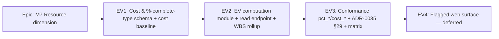

# Implementation Plan: Percent-complete types & Earned Value (M7 cost/EV rung)

- **Feature spec:** `docs/specs/percent-complete-earned-value/feature-spec.md` (awaiting approval)
- **Status:** Draft (awaiting approval — do not implement before the spec + ADR-0042 are approved)
- **Owner:** TBD (engine/backend)

> **Sequencing principle.** Each milestone is a **shippable slice** that keeps the CPM path untouched. Because Earned Value is a **read-model** (no write pass, no engine-owned column), the parity gate is _structurally_ trivial — the recalc write path never changes across this entire epic, so every existing CPM golden/scenario stays byte-identical by construction. `main` stays releasable after every task. Conventional Commits with the allowed scopes — **engine-adjacent module work commits under `api`** (no `engine` scope); schema under `db`; docs under `docs`; shared types under `types`; web under `web`.

## Breakdown

### Epic

**M7 — the Resource dimension** (roadmap: the engine-conformance capability programme, ADR-0034). This rung: **Percent-complete types & Earned Value** (`pct_physical` `pct_units` `cost_*`), the cost/EV analysis over the resourced, progressed schedule. Consumes ADR-0039/0040 (resource + units model, cost columns reserved), ADR-0025 (baselines → the cost baseline), ADR-0038 (WBS rollup), M2 (progress).

---

### Milestone: EV1 — Cost & %-complete-type schema + cost baseline (dark, additive)

**Outcome:** a Planner can cost a resource, budget an activity (assignment cost + expense), choose an activity's `percentCompleteType`, enter physical %-complete / actual cost / actual units, pick a plan `eacMethod`/currency, and capture a baseline that **freezes the cost budget**. **No behaviour change** — nothing computes EV yet, and the CPM path is untouched. The shippable first slice.

#### Feature: Cost + %-complete-type schema + shared types

> **Description:** Activate the reserved `Resource` rate + `ResourceAssignment` cost/units columns; add `activities.percent_complete_type` / `physical_percent_complete` / `budgeted_expense` / `actual_expense`; add `plans.eac_method` / `currency_code`; amend `BaselineActivity` with `budgeted_cost` (the cost baseline, ADR-0025). Land `@repo/types` + write/read DTOs.
> **Complexity:** L
> **Dependencies:** ADR-0039/0040/0025 (present). ADR-0042 + the ADR-0025 amendment approved.
> **Risks:** speculative-schema creep → add **only** the columns this rung needs (the ADR-0039 lean posture; steps/accrual/curves deferred). Money-representation drift → settle integer-minor-units vs Decimal with database-architect **before** the migration (Q6). Non-additive change → additive/constant-default constraint + a CPM-parity smoke.
> **Testing requirements:** migration applies clean; N22 (negative cost/rate) + N23 (physical % outside 0–100) boundary rejects (unit + API); baseline capture freezes `budgeted_cost`; CPM recalc smoke unchanged (no EV column exists to diverge).

##### Task 1 — database-architect design pass (no code)

- **Description:** Run **database-architect** on the deltas: resource rate, assignment `actual_cost`/`actual_units`/`budgeted_cost`-override, activity `percent_complete_type`/`physical_percent_complete`/`budgeted_expense`/`actual_expense`, plan `eac_method`/`currency_code`, baseline `budgeted_cost` — money representation (integer minor units vs Decimal), nullability, defaults, CHECKs, index need (expected: none new).
- **Complexity:** S
- **Dependencies:** ADR-0042 approved.
- **Risks:** wrong money type propagates everywhere → decide + record before any migration.
- **Testing:** design review only.
- **Development steps:**
  1. Settle money representation (Q6) and record it (DATABASE.md / migration comment).
  2. Confirm each column's type/default/nullability + CHECKs (N22/N23).
  3. Confirm `budgeted_cost` on `BaselineActivity` is captured immutably; no new indexes.
  4. Record the decision (DECISIONS.md).

##### Task 2 — Prisma migration (additive)

- **Description:** One additive migration adding all EV1 columns + CHECKs + the `PercentCompleteType` / `EacMethod` enums; forward-only (ADR-0018), direction noted.
- **Complexity:** M
- **Dependencies:** Task 1.
- **Risks:** table rewrite on `activities` / `resource_assignments` → constant-default (metadata-only in PG 11+), nullable where no sensible default.
- **Testing:** migration up on a seeded DB; column/enum/CHECK assertions; a CPM smoke recalc unchanged.
- **Development steps:**
  1. `schema.prisma` edits + raw-SQL CHECKs.
  2. Generate + name migration (`…_m7_cost_and_earned_value_schema`).
  3. Verify additive; update `docs/DATABASE.md` only if a new pattern appears (money-minor-units may be the first — document it).

##### Task 3 — `@repo/types` + DTOs (inputs only)

- **Description:** Add `PercentCompleteType` / `EacMethod` unions + the new **input** fields to resource/activity/assignment/progress/plan read+write DTOs and summaries. Validators (`@Min(0)`, 0–100, enum). (The `PlanEarnedValue` response type lands in EV2 with the module.)
- **Complexity:** M
- **Dependencies:** Task 2.
- **Risks:** a WBS-summary accepting a direct budget → service invariant + validation.
- **Testing:** DTO validation unit tests (N22/N23 rejects; enum defaults); type build (ADR-0019).
- **Development steps:**
  1. `@repo/types` unions + input fields (lock-step with DTOs).
  2. Resource/activity/assignment/progress/plan write+read DTOs.
  3. OpenAPI decorators; update `docs/API.md` (input fields).
  4. Changeset (additive fields).

#### Feature: Cost-baseline capture (ADR-0025 amendment)

> **Description:** Extend baseline **capture** to snapshot each activity's budgeted cost into `baseline_activities.budgeted_cost`, giving the active baseline a committed PV reference.
> **Complexity:** S
> **Dependencies:** the schema Feature.
> **Risks:** a pre-rung baseline reads null cost → EV handles the fallback (EV2); assert null, never error.
> **Testing requirements:** capture writes `budgeted_cost`; a baseline captured before the migration reads null (fallback path validated in EV2).

##### Task 1 — Snapshot budgeted cost on capture

- **Description:** In the baseline capture service, compute each activity's budgeted cost (per Q1) at freeze time and write it into the snapshot batch; document immutability (ADR-0025 snapshot-copy).
- **Complexity:** S
- **Dependencies:** EV1 schema.
- **Risks:** capture cost drifts from EV BAC → compute both via one shared helper.
- **Testing:** capture integration test (snapshot cost present + correct); ADR-0025 amendment note.

---

### Milestone: EV2 — EV computation module + read endpoint + WBS rollup

**Outcome:** a reader can GET the plan's earned-value analysis — per-activity, WBS-rolled, and plan-total BAC/PV/EV/AC → SV/CV/SPI/CPI → EAC/ETC/TCPI/VAC — as of the data date, with divide-by-zero guards and a cost-baseline fallback. The CPM path is untouched. The core rung.

#### Feature: Pure earned-value module (`schedule/earned-value.ts`)

> **Description:** A pure, dependency-free module (a sibling of `float-paths.ts`) consuming activities + persisted CPM dates + assignments/rates + expenses + %-complete inputs + baseline cost + calendars, producing per-activity EV figures, the WBS rollup, and plan totals. Implements the three %-complete types, PV time-phasing on the activity calendar (ADR-0037), the milestone 0/100 rule, LOE apportionment, WBS-summary rollup, and every divide-by-zero guard + the Q3 EAC methods.
> **Complexity:** XL
> **Dependencies:** EV1; ADR-0042; the Q1/Q2/Q3 decisions.
> **Risks:** rounding drift in money → fix on integer minor units end-to-end + document rounding (round half-up at each derived index). PV time-phasing complexity → reuse the ADR-0037 working-time helpers (closed-form, no per-minute scan). Rollup mismatch with the M5-epic date rollup → reuse the same deepest-first `parentId` traversal.
> **Testing requirements:** first-principles unit tests (hand-worked BAC/PV/EV/AC → SPI/CPI/EAC to the minor unit); each %-complete type; milestone 0/100; LOE apportionment; WBS rollup equals Σ leaves; every guard (PV=0, AC=0, EV=0/CPI=0); each EAC method; cost-baseline fallback.

##### Task 1 — EV module types + per-activity computation

- **Description:** Define `ActivityEarnedValue` / `PlanEarnedValue` (in `@repo/types` + the module), and compute per-activity BAC, performance % (by `percentCompleteType`), EV, AC, and PV time-phased to the data date.
- **Complexity:** L
- **Dependencies:** EV1.
- **Risks:** duration-% derivation must match the schedule's own elapsed logic → reuse the M2 remaining/percent semantics; unit-test against progressed fixtures.
- **Testing:** per-activity goldens for each type + milestone/LOE; PV time-phasing golden (linear spread to the data date).
- **Development steps:** module `computeEarnedValue(...)`; per-activity BAC/perf%/EV/AC; PV spread; `@repo/types` shapes.

##### Task 2 — WBS rollup + derived indices + guards

- **Description:** Roll up BAC/PV/EV/AC over the `parentId` tree deepest-first (M5-epic pattern) and to the plan total; derive SV/CV/SPI/CPI/EAC/ETC/TCPI/VAC at each level with the Q3 EAC method and full divide-by-zero guards (defined sentinels, never NaN/Infinity).
- **Complexity:** L
- **Dependencies:** Task 1.
- **Risks:** summary carrying own cost → assert summaries contribute only rollup. Guard sentinels inconsistent → one documented guard helper.
- **Testing:** rollup-equals-Σ-leaves; nested-summary rollup; every guard; the three EAC methods.

#### Feature: EV read endpoint + service

> **Description:** A new `GET …/schedule/earned-value` endpoint + `ScheduleService.earnedValue(...)`: org-scoped `schedule:read` (no pen, no lock), one batched load, run the module, map to `{ data: PlanEarnedValue }`, honour `?eacMethod=` / `?asOf=`, surface `costBaselineMissing` / `costWarningCount`.
> **Complexity:** M
> **Dependencies:** the EV module Feature.
> **Risks:** N+1 on assignment/rate/baseline load → one batched query set on the existing ADR-0039 partial indexes (backend-performance-reviewer). Cost exposure to Guests → confirm the plan-share read scope includes/excludes cost per the security review.
> **Testing requirements:** endpoint e2e (Supertest): shape, org-scope 404, `schedule:read` 403, `eacMethod` switch, cost-baseline fallback; **physical-% changes no CPM date** (a recalc-before/after assertion); performance assert @ 2,000 activities (< 300 ms p95).

##### Task 1 — Repository load

- **Description:** Add a batched read: activities (+persisted CPM dates), active assignments + resource rates, expenses, physical %, active baseline cost — one query set, org-scoped.
- **Complexity:** M
- **Dependencies:** EV module.
- **Risks:** N+1 / over-fetch → batched joins on existing indexes; no new index expected (database-architect confirms).
- **Testing:** repository query tests; scope filter test.

##### Task 2 — Controller + service + mapping

- **Description:** Wire the endpoint → service → module → DTO; query-param validation; structured log (counts, flags); OpenAPI + `docs/API.md`.
- **Complexity:** M
- **Dependencies:** Task 1.
- **Risks:** money serialisation (minor units + currency) inconsistent → one mapper; document the envelope.
- **Testing:** the endpoint e2e suite above; log-shape test; changeset.

---

### Milestone: EV3 — Conformance: pct__/cost__ + ADR-0035 §29 + matrix flip

**Outcome:** the `pct_physical` / `pct_units` / `cost_*` capability rows flip ⚪ → ✅ with first-principles EV goldens + a physical-% differential; ADR-0035 gains an Accepted §29 (%-complete-type + EV semantics) + N22–N24; the CPM suite is confirmed untouched.

#### Feature: EV conformance

> **Description:** Add a costed slice to the fixture adapter (resource rates, assignment/activity cost, physical %, `percentCompleteType`), first-principles EV goldens (hand-worked BAC/PV/EV/AC → SPI/CPI/EAC), a physical-% differential (flip a physical % ⇒ EV moves, CPM dates do not), flip the matrix rows, and add the ADR-0035 §29 acceptance row — matching how prior resource rungs (ADR-0039 §23, ADR-0040 dt_*, ADR-0041 §28) were done.
> **Complexity:** L
> **Dependencies:** EV2.
> **Risks:** no external EV oracle → hand-work the numbers first-principles and document them in ADR-0035 §29 (the no-oracle golden strategy, ADR-0034 §2). Fixture cost data absent → the adapter synthesises a small, documented costed set.
> **Testing requirements:** first-principles EV goldens (to the minor unit); physical-% differential (EV differs, CPM identical); `pct_units` (actual/budget units) golden; WBS-rollup golden; parity (the CPM goldens byte-identical — structurally guaranteed).

##### Task 1 — Adapter cost/%-complete slice

- **Description:** Extend `adaptFixture` to expose resource rates, assignment/activity cost, physical %, and `percentCompleteType`; a `honorEarnedValue` knob (default off = the existing CPM path).
- **Complexity:** M
- **Dependencies:** EV2.
- **Risks:** synthesised cost data must be honest → documented `approximations` notes (ADR-0034 §2).
- **Testing:** adapter unit tests; notes assert honesty.

##### Task 2 — EV goldens + physical-% differential

- **Description:** Add first-principles EV goldens + a physical-% differential in the conformance suite; assert the CPM layer is unchanged.
- **Complexity:** M
- **Dependencies:** Task 1.
- **Risks:** rounding disagreements → assert on the documented rounding (§29).
- **Testing:** the goldens + differential above.

##### Task 3 — Matrix + ADR-0035 §29 + docs

- **Description:** Flip the `pct_physical`/`pct_units`/`cost_*` capability rows to ✅ (with the curves/accrual/steps sub-tags left ⚪ + noted); add ADR-0035 **§29** + **N22–N24** and set their acceptance row to **Accepted (this rung)**; add the ADR-0042 row to `CLAUDE.md` §16 + `docs/adr/README.md`; note the ADR-0025 amendment.
- **Complexity:** S
- **Dependencies:** Tasks 1–2.
- **Risks:** matrix drift → the ADR-0034 §8 same-PR rule.
- **Testing:** structural validator (coverage completeness) green; docs links valid.
- **Development steps:** matrix rows; ADR-0035 §29 + ledger row; ADR-0042 status note; changeset.

---

### Milestone: EV4 — Flagged web surface (deferred)

**Outcome:** behind `VITE_EARNED_VALUE`, a Planner costs resources/activities, sets %-complete type + physical %, and reads an EV table + SPI/CPI/EAC KPI tiles + a PV/EV/AC S-curve. **Named but out of immediate scope** — mirrors the `VITE_RESOURCES` / `VITE_RESOURCE_LEVELLING` flagged-web pattern; designed by `ui-architect`, reviewed by ux/component/accessibility/performance reviewers when scheduled.

#### Feature: Earned-value UI (flagged)

> **Description:** Resource **rate** field; activity **%-complete-type** picker + **physical-%** field; **cost/expense** fields; an **EV table** (BAC/PV/EV/AC/SV/CV/SPI/CPI/EAC, WBS-grouped); **KPI tiles** (SPI/CPI/EAC); a **PV/EV/AC S-curve** over time (ADR-0026/0030 canvas/panels).
> **Complexity:** L (deferred)
> **Dependencies:** EV3; `ui-architect` design.
> **Risks:** one-off styling → design-system tokens only; SPI/CPI status colour-only → WCAG 2.2 AA (icon + text + value, never colour alone); the S-curve must have a keyboard-accessible data-table equivalent.
> **Testing requirements:** component tests, Playwright journey + a11y checks, performance-reviewer on the S-curve. Out of scope for this plan's core rungs.

## Sequencing & slices

1. **EV1** (schema + cost baseline, dark) — releasable immediately; nothing reads the fields.
2. **EV2** (EV module + read endpoint) — releasable; a new read only; the CPM write path is untouched (parity structural).
3. **EV3** (conformance) — flips the `pct_*`/`cost_*` matrix rows and Accepts ADR-0035 §29.
4. **EV4** (flagged web) — deferred; behind `VITE_EARNED_VALUE`.

Feature flags: **none server-side** (EV is a read endpoint that simply reports zeros until cost data is entered — no server flag needed, the ADR-0040/0041 opt-in precedent, here even simpler because there is no write pass to gate); the web surface is behind `VITE_EARNED_VALUE`.

## Definition of Done (per task)

Each task's PR must satisfy the Feature Completion Criteria in [`docs/PROCESS.md`](../../PROCESS.md) — code, tests (≥ 80% changed-code; regression tests), docs/ADR updates, security review (cost is org-sensitive; Guest read scope; N22–N24; org-scope/IDOR; no EV column is client-writable because none is persisted), performance (the < 300 ms read budget @ 2,000), accessibility (EV4 only), Docker build, CI green, changeset, version impact.

## Recommended specialised agents

- **database-architect** — EV1 (before the migration; required — money representation, cost-baseline amendment).
- **security-reviewer** — EV1/EV2 (cost sensitivity + Guest read scope, N22–N24 boundary, org-scope/IDOR on the new writes and the EV read).
- **api-reviewer** — EV1/EV2/EV3 (the new read endpoint envelope + money serialisation, additive DTO fields, OpenAPI).
- **backend-performance-reviewer** — EV2 (the batched EV load N+1, the rollup + PV time-phasing cost, the 2,000-activity read budget).
- **test-engineer** — EV2/EV3 (the pure-module first-principles suite, the read e2e, the EV goldens + physical-% differential).
- **ui-architect** + **ux-reviewer** / **component-reviewer** / **accessibility-reviewer** / **performance-reviewer** — EV4 (flagged web; the S-curve a11y).

## Risks & assumptions (rollup)

| Risk / assumption                            | Likelihood | Impact | Mitigation                                                                                                                 |
| -------------------------------------------- | ---------- | ------ | -------------------------------------------------------------------------------------------------------------------------- |
| Cost source-of-truth (Q1) contested          | med        | high   | Surface as CRITICAL; default assignment-derived **+** activity expense; database-architect finalises the columns.          |
| Cost baseline (Q2) — baseline vs live budget | med        | high   | Surface as CRITICAL; default the active ADR-0025 baseline (amend snapshot) with a flagged live-budget fallback.            |
| Default EAC formula (Q3) contested           | med        | med    | Surface as CRITICAL; default `BAC/CPI`, other methods selectable; record in ADR-0035 §29 so goldens have an authority.     |
| Physical-% entry model (Q4) — field vs steps | low        | med    | Default single field; weighted steps (`code_steps`) a named later rung; keeps this rung's schema lean.                     |
| Money representation / currency (Q6)         | med        | med    | database-architect decides integer-minor-units vs Decimal before the migration; single currency per plan; FX out of scope. |
| Rounding drift across derived indices        | med        | med    | Integer minor units end-to-end + one documented rounding rule (§29); first-principles goldens to the minor unit.           |
| Physical-% accidentally moving the schedule  | low        | high   | EV never enters `computeSchedule`; a recalc-before/after assertion proves date-invariance.                                 |
| Parity drift (CPM path changed)              | very low   | high   | Structural — EV is a read-model; the recalc write path is not modified anywhere in the epic; CPM goldens byte-identical.   |
| EV read too slow at 2,000 activities         | low        | med    | One batched load + one linear rollup + closed-form PV time-phasing; the < 300 ms baseline-variance precedent; perf assert. |
| Cost exposure to External Guests             | low        | med    | security-reviewer confirms the plan-share read scope for cost fields; deny-by-default.                                     |
