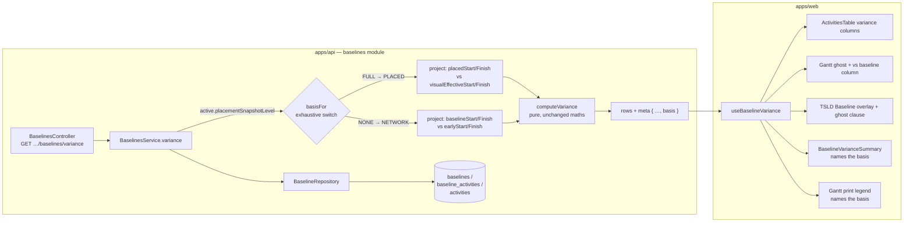
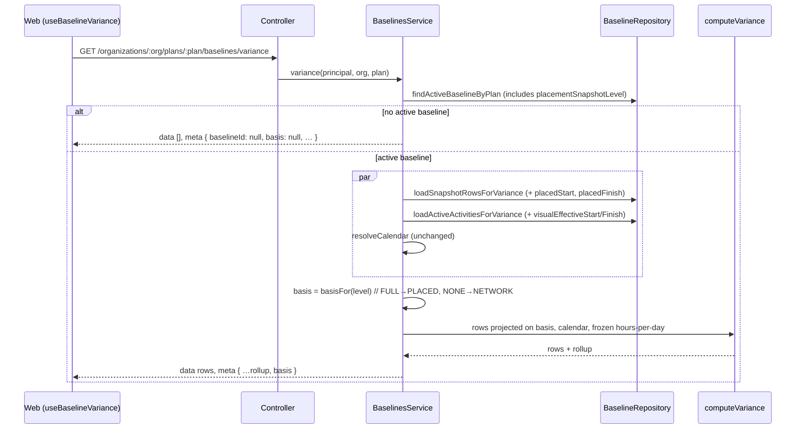
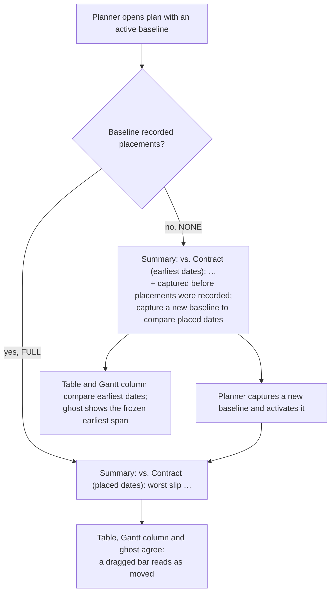

# Feature Spec: Baseline variance on the placed basis

- **Status:** Draft — awaiting approval before implementation
- **Author(s):** feature-analyst (for the product owner)
- **Date:** 2026-09-28
- **Tracking issue / epic:** `docs/TECH_DEBT.md` #359 (approved for fixing by the product owner, 2026-09-28)
- **Roadmap link:** none; this finishes two rows of `docs/specs/one-planning-surface/` §4.11 that were specified and not built
- **Related ADR(s):** ADR-0025 (baselines and variance; amended here, §4.7), ADR-0148 (a bar is drawn where it is placed), ADR-0126 (capture-level snapshot columns), ADR-0155 (finish-milestone dates), ADR-0088 D1 (no flag), ADR-0081 (entry point and journey), ADR-0105 (why this needs a spec)

**Why a spec and not a register fix (ADR-0105).** The change alters what `BaselineVarianceRow`'s
date fields mean for some baselines, adds a field to `PlanVarianceSummary` and two public DTOs, and
changes what the Gantt ghost bar, the TSLD Baseline overlay and the activities table report. That is
a component's public contract, so the row does not stand in for stages 1–4.

---

## 0. What was checked, and five places the row is wrong

The row was re-read against the code rather than taken as given (CLAUDE.md §19.11). Most of it holds.
These parts do not, and two of them change the design.

| #   | Row's claim                                                                                                       | What the code says                                                                                                                                                                                                                                                                                                                                                                                                                                                                                                                                                                                                                                                                                                                                                                                                                                                                           | Effect                                                               |
| --- | ----------------------------------------------------------------------------------------------------------------- | -------------------------------------------------------------------------------------------------------------------------------------------------------------------------------------------------------------------------------------------------------------------------------------------------------------------------------------------------------------------------------------------------------------------------------------------------------------------------------------------------------------------------------------------------------------------------------------------------------------------------------------------------------------------------------------------------------------------------------------------------------------------------------------------------------------------------------------------------------------------------------------------- | -------------------------------------------------------------------- |
| C1  | Title: variance "compares a frozen network date against a live placed one".                                       | False as shipped. Both sides are network: the frozen side is `baselineStart`/`baselineFinish` (`baselines.service.ts:413-414`), which capture writes from `earlyStart`/`earlyFinish` (`baseline.repository.ts:238-239`), and the live side is `earlyStart`/`earlyFinish` (`baselines.service.ts:421-422`). The title describes the naive fix, not the defect.                                                                                                                                                                                                                                                                                                                                                                                                                                                                                                                                | Title corrected when the row closes.                                 |
| C2  | Route `GET …/baselines/:id/variance`.                                                                             | The route is `GET …/plans/:planId/baselines/variance` and reads the **active** baseline only (`baselines.controller.ts:108`, `baselines.service.ts:385`). There is no per-id variance route. The same wrong path is in `docs/specs/one-planning-surface/feature-spec.md:669`.                                                                                                                                                                                                                                                                                                                                                                                                                                                                                                                                                                                                                | No design change. No new route is added.                             |
| C3  | "The Gantt draws the baseline variance bar from it, so the picture agrees with the wrong figure."                 | The picture and the figure **disagree**. The ghost is drawn from the row's frozen `baselineStart`/`baselineFinish` (`bar-geometry.ts:139-155`), the live bar from the placed dates (`bar-geometry.ts:61` → `bar-dates.ts:85-86`; `barDateSourceFor` returns `'visual'` unless the Late overlay is on, `bar-dates.ts:54-56`), and the column text from `startVarianceDays` (`grid-columns.ts:152-162`). For a stripped activity on a pre-strip baseline the ghost and the bar both sit on the old constraint date and the text says "early".                                                                                                                                                                                                                                                                                                                                                  | Strengthens the case; the fix makes the text agree with the picture. |
| C4  | `NONE` → network-vs-network fixes "reports a converted activity as ahead of baseline when its bar has not moved". | It does not fix that case for any `NONE` baseline. M-C (capture freezes placement) and M-I (the strip) shipped in one release, `api-v0.70.0` (`apps/api/CHANGELOG.md:348` and `:408`), and the strip runs at boot (ADR-0018). So every baseline that froze a pre-strip date is `NONE`, except a `FULL` capture taken after deploy and before the plan's first recalculation (the strip leaves engine columns stale, `20260921120000_strip_drag_constraints/migration.sql:63-70`). On a `NONE` baseline, network-vs-network still compares the frozen constraint-bound early start with today's logic-earliest start, so the stripped activity and **its whole downstream chain** still read as ahead (the strip lowers successors' early dates, `migration.sql:83-85`). It also stays blind to every later drag, because since ADR-0148 a drag writes `visualStart` and moves no early date. | Open question Q1. The default keeps the row's rule and labels it.    |
| C5  | (Implicit) `placementSnapshotLevel` is the only discriminator needed.                                             | Correct, and the schema says the read must branch on it with an exhaustive switch (`schema.prisma:686-692`). But `@repo/types` has no `PlacementSnapshotLevel` union yet, although the schema comment requires lock-step "when the comparison surfaces it" (`schema.prisma:697-698`). This epic is that moment.                                                                                                                                                                                                                                                                                                                                                                                                                                                                                                                                                                              | Adds the union and a lock-step check (§4.5).                         |

Also found, not about the row:

- **F1. The frozen placed span stores start and finish.** `baseline_activities.placed_start` and
  `placed_finish` are both `@db.Date` (`schema.prisma:2395-2396`), copied from
  `activities.visual_effective_start`/`_finish` (`baseline.repository.ts:362-363`, `:380-383`). These
  are the same two columns every view draws a bar from (`bar-dates.ts:85-86`). No reconstruction
  from `visualStart` + duration is needed or wanted. `visualStart` is also frozen (`:266`) but it is
  the planner's input, not a position, and variance does not read it.
- **F2. Float variance must stay on total float.** `float-basis.structural.spec.ts:62-65` pins
  `variance.ts` to `totalFloat` and bans the text `remainingFloat` **anywhere in the file, comments
  included** (`:75-77`, a raw-text check). No baseline freezes remaining float at all: the only
  placement columns are the three above (`schema.prisma:2395-2397`). That gate's own `why` string
  says remaining float "was frozen by no baseline before M-C", which implies a later baseline freezes
  it. None does. Corrected in M1 (text only).
- **F3. The estate count is contradictory.** On 2026-09-21T09:14Z the staff diagnostic
  `baselines-over-placed-plans` examined **2** live baselines (`one-planning-surface/m0/estate-readings.md:79`;
  its denominator is every live baseline, `staff-diagnostics.registry.ts:361-366`). ADR-0155 decision
  7 records on 2026-09-23 that "no baseline has been captured on the installation"
  (`docs/adr/0155-…:48-51`). Both cannot be true at their dates unless the two were deleted. It
  decides how many real baselines Q1 affects (0 or 2, all test data). One press of that diagnostic
  settles it; this spec does not depend on the answer.
- **F4. Other baseline readers stay on the network basis** and will disagree with variance after this
  change for any hand-placed bar. They are listed in §3 "Dependencies" and left out of scope on
  purpose.
- **F5. ADR-0025 records two amendments** (`docs/adr/0025-…:98`, `:105`) while the schema calls the
  placement snapshot the fifth amendment to its model (`schema.prisma:651-653`). The amendment this
  spec adds (§4.7) should be numbered after whatever the amendments section actually holds, not after
  the schema's count.

---

## 1. Business understanding

### Problem

Since ADR-0148 a bar is drawn where it is **placed** (`visualEffectiveStart`/`Finish`), and a drag
writes a placement, not a constraint. Baseline variance still measures the **earliest the network
allows** on both sides. So:

1. **A bar that moved reads as unmoved.** A planner captures a baseline and then drags an activity a
   week later. The early start does not change, so variance says "On plan". The Gantt ghost shows
   the gap; the number beside it says there is none.
2. **A bar that did not move reads as moved.** Removing a binding constraint and placing the bar
   where the constraint held it (which is exactly what the ADR-0148 strip did to migrated rows,
   `migration.sql:234-238`, and what a planner can do by hand today) lowers the early start. Variance
   reports the activity and everything downstream of it as ahead of baseline. Nothing on the
   diagram moved.

M-C froze the placed span on every baseline captured since `api-v0.70.0` **for this read**
(`m-c/placement-snapshot.md:13-16`), and nothing reads it (`grep placedStart apps/api/src` finds the
capture path in `baseline.repository.ts`, its fixture in `baselines.service.spec.ts:137-138`, and the
unrelated cross-plan conformance adapter; no reader).

### Users

Every organisation member reads variance (`baseline:read`: Org Admin, Planner, Contributor, Viewer).
Planners use it to report progress against the plan of record; the people they report to read the
Gantt ghost bars and the printed programme. External guests never see baselines
(`docs/API.md:555`); unchanged.

### Primary use cases

1. A planner hand-places or drags activities after capturing a baseline and sees how far each moved.
2. A planner opens a migrated plan against its baseline and sees no false "ahead" figures.
3. A reader of the workspace or a printed programme can tell whether the figures compare placed
   dates or earliest dates.

### User journeys

Capture a baseline → drag an activity five working days later → the plan recalculates → the
activities table's Start and Finish variance read **+5**, the Gantt `vs baseline` column reads
`+5d late`, the ghost sits five days to the left of the bar, and the summary line reads
"vs. Contract (placed dates): …". On a baseline captured before placements were recorded, the same
screens state "earliest dates" and say how to get a placed comparison (§4.6).

### Expected outcomes

- On every baseline that recorded placements, variance measures where bars are drawn, so the number
  agrees with the ghost bar.
- Every variance read says which question it answered.
- `GET …/baselines` and `GET …/baselines/:id` expose the frozen placement and the level.

### Success criteria

- SC-1. The regression cases R1 and R2 (§2, "Regression tests") fail against today's code and pass
  after M1.
- SC-2. On a `FULL` baseline, for any activity, `startVarianceDays` equals the working days between
  the frozen and live **placed** starts; changing either side to early fails a test (four-quadrant
  fixture, §2).
- SC-3. On a `NONE` baseline the response is byte-identical to today's apart from the new `basis`
  field (characterisation case R3).
- SC-4. Every surface that shows a variance figure states its basis (§4.6), verified by the journey.
- SC-5. `computeSchedule` is not called by the variance read (unchanged; it builds a calendar port
  only, `baselines.service.ts:24-25`, `:446-458`).

### Open questions

See §6. One is critical in the sense that it changes behaviour (Q1); it has a default, so work is not
blocked.

---

## 2. Functional requirements

### User stories & acceptance criteria

> **US-1** — As a **Planner**, I want baseline variance to measure where my bars are placed, so
> that moving a bar shows as movement and removing a constraint that held a bar in place does not.
>
> **Acceptance criteria**
>
> - **Given** the active baseline has `placementSnapshotLevel = FULL`, **when** I read variance,
>   **then** every row's `baselineStart`/`baselineFinish` are the frozen `placedStart`/`placedFinish`,
>   `currentStart`/`currentFinish` are the live `visualEffectiveStart`/`visualEffectiveFinish`, the
>   start and finish variances are the signed working days between them, and `meta.basis = 'PLACED'`.
> - **Given** a `FULL` baseline and an activity dragged `k` working days later after capture, **when**
>   the plan is recalculated, **then** `startVarianceDays = finishVarianceDays = k` (today: 0).
> - **Given** a `FULL` baseline captured while activity A was held by a binding `SNET` at date X,
>   **when** the constraint is removed, `visualStart` is set to X and the plan is recalculated,
>   **then** A and its finish-to-start successor B report 0 start and finish variance, and their
>   `visualEffectiveStart` values are unchanged from capture (today: both report negative, "ahead").
> - `worstFinishSlipDays` and `behindCount` follow the basis, because they are derived from
>   `finishVarianceDays` (`variance.ts:96-101`).

> **US-2** — As any **member**, I want every variance figure to say which dates it compares, so that
> the same plan reporting different numbers against different baselines is not a surprise.
>
> **Acceptance criteria**
>
> - **Given** an active baseline, the summary line in the activities panel names the basis:
>   "placed dates" or "earliest dates".
> - **Given** an active `NONE` baseline, the summary line adds one sentence explaining that the
>   baseline was captured before placements were recorded, so bars moved by hand are not counted, and
>   that capturing a new baseline compares placed dates.
> - **Given** a printed Gantt programme with a baseline, the legend's Baseline entry names the basis.
> - **Given** the baselines panel, each baseline shows which dates it compares.
> - **Given** a response with no `basis` (an older API image during a rolling update, ADR-0047), no
>   basis wording is shown. Nothing is guessed.

> **US-3** — As an **API consumer**, I want the frozen placement and the snapshot level on the
> baseline reads, so that I can compare placed dates myself.
>
> **Acceptance criteria**
>
> - `GET …/baselines` and `GET …/baselines/:id` carry `placementSnapshotLevel: 'NONE' | 'FULL'`.
> - Each snapshot row in `GET …/baselines/:id` carries `placedStart`, `placedFinish`, `visualStart`
>   (calendar days or null). The OpenAPI description says a null means nothing on a `FULL` baseline
>   (unplaced or not calculated) and "not recorded" on a `NONE` baseline, so the level must be read,
>   never the nulls.

### Workflows

1. The variance read resolves the active baseline (unchanged).
2. It maps `placementSnapshotLevel` to a basis with an exhaustive switch: `FULL → PLACED`,
   `NONE → NETWORK`. A third level is a compile error (`schema.prisma:690-692`).
3. It projects both sides on that basis: PLACED reads `placedStart`/`placedFinish` from the snapshot
   and `visualEffectiveStart`/`Finish` from the live plan; NETWORK reads `baselineStart`/`Finish`
   and `earlyStart`/`Finish` (today's projection).
4. It calls the unchanged pure diff (`variance.ts:67`) with basis-neutral field names, and returns
   `meta.basis`.
5. Float variance is total float on both bases, always (F2).

### Edge cases

| Case                                                                                                                                                       | Behaviour                                                                                                                                                                                                                                                                                                                                                                                                                                                                                                                                             |
| ---------------------------------------------------------------------------------------------------------------------------------------------------------- | ----------------------------------------------------------------------------------------------------------------------------------------------------------------------------------------------------------------------------------------------------------------------------------------------------------------------------------------------------------------------------------------------------------------------------------------------------------------------------------------------------------------------------------------------------- |
| `FULL` row with null `placedStart` but non-null `baselineStart` (a plan last computed before the placed columns existed, captured without a recalculation) | Start/finish variance null ("—"). **The basis is chosen per read, never per row**: falling back to network for one row would mix two questions in one table.                                                                                                                                                                                                                                                                                                                                                                                          |
| Activity added after capture                                                                                                                               | `inBaseline: false`, variance null (unchanged).                                                                                                                                                                                                                                                                                                                                                                                                                                                                                                       |
| Baselined activity deleted since capture                                                                                                                   | `removed: true`; `baselineStart`/`Finish` carry the frozen dates on the read's basis (placed on `FULL`).                                                                                                                                                                                                                                                                                                                                                                                                                                              |
| Finish milestone                                                                                                                                           | Both placed dates use the same reporting rule on a baseline captured after ADR-0155, so the difference is exact. A `FULL` baseline captured between `api-v0.70.0` (2026-09-21) and the ADR-0155 release (2026-09-23) froze the old rule and can be one working day out for a finish milestone. That residual already exists on the network basis (ADR-0155 consequences, `:104-105`) and is not introduced here. The ghost already places a finish milestone through `axisDayOf` (`bar-geometry.ts:147-150`), which works for placed dates unchanged. |
| Late overlay on                                                                                                                                            | Variance ignores view overlays (unchanged). The ghost clause already says "vs the late view" (`a11y.ts:285`).                                                                                                                                                                                                                                                                                                                                                                                                                                         |
| `FULL` capture taken after the strip but before the plan's first recalculation                                                                             | Frozen early and frozen placed are both the stale constraint date. Placed-vs-placed reads 0; network would read "ahead". This is fixture R1's real-world instance.                                                                                                                                                                                                                                                                                                                                                                                    |
| No active baseline                                                                                                                                         | Empty rows, `meta.basis: null` (with `baselineId: null`).                                                                                                                                                                                                                                                                                                                                                                                                                                                                                             |
| Plan calendar with no working time                                                                                                                         | 422 `CALENDAR_HAS_NO_WORKING_TIME`, unchanged (`baselines.controller.ts:117-122`).                                                                                                                                                                                                                                                                                                                                                                                                                                                                    |

### Permissions

Unchanged. `baseline:read` for all three reads (`baselines.service.ts:78`, `:102`, `:380`), org scope
re-resolved from the caller's memberships, uniform 404 for another organisation's plan. Read-only:
not a structural write, so the pen (ADR-0028) is not involved. Guests have no baseline route.

### Validation rules

No new input. The new response fields are server-derived.

### Error scenarios

| Scenario                          | Detection                  | User-facing result               | Status |
| --------------------------------- | -------------------------- | -------------------------------- | ------ |
| Not a member of the organisation  | org scope resolution       | not found                        | 404    |
| Member without `baseline:read`    | permission check           | forbidden (no role lacks it now) | 403    |
| Plan calendar has no working time | calendar build (unchanged) | calendar named in the message    | 422    |

### Regression tests (the ones that fail today)

Fixtures use the existing e2e helpers in `apps/api/test/baselines.e2e-spec.ts` (all-days calendar, as
its comment at `:551` records). Dates below are relative to the plan's data date D.

- **R1 — the stripped activity reads as ahead while its bar has not moved (fails today).** A: 3 days,
  `SNET` at D+9 (binding: early start D+9). B: 2 days, FS successor of A. Recalculate. Capture
  (auto-active, `FULL`). PATCH A `{ constraintType: null, constraintDate: null, visualStart: D+9 }`,
  the same transformation the strip applies (`migration.sql:234-238`). Recalculate. Assert first
  that the bars have not moved: A's `visualEffectiveStart` is D+9 and B's is D+12, as at capture.
  Then read variance. **Today:** A and B `startVarianceDays = -9` (ahead). **After M1:** 0 and 0,
  `meta.basis = 'PLACED'`, `meta.worstFinishSlipDays = null`, `behindCount = 0`.
- **R2 — a dragged bar reads as unmoved (fails today).** A: 3 days, unconstrained; B: FS successor.
  Recalculate, capture. PATCH A `visualStart: D+5`. Recalculate. **Today:** A start and finish
  variance 0. **After M1:** A +5/+5, B +5/+5, `behindCount = 2`.
- **R3 — `NONE` keeps today's answer (characterisation).** Repeat R1 and R2, but after capture set the
  baseline to how a pre-M-C capture reads (`placement_snapshot_level = 'NONE'`, the three placement
  columns null) through Prisma in the test. Assert `meta.basis = 'NETWORK'` and R1 = -9/-9, R2 = 0/0.
  This pins the Q1 default and states the residual in a test rather than a paragraph. If Q1 is
  answered otherwise, this case changes with it.
- **U1 — four-quadrant unit case (service level).** Frozen early D+4, frozen placed D+7, live early
  D+5, live placed D+11, all on an all-days calendar. Placed-vs-placed = +4; network = +1;
  frozen-early-vs-live-placed = +7; frozen-placed-vs-live-early = -2. Each wrong mix gives a
  different answer, so switching only one side fails the case. Verified red against each of the
  three wrong mixes before merge (ADR-0110 D5).
- **U2 — per-read basis.** A `FULL` baseline row with `placedStart` null and `baselineStart` set gives
  null variance, not the network figure.

---

## 3. Technical analysis

| Area           | Impact | Notes                                                                                                                                                                                                                                                                                                                                                                                                                         |
| -------------- | ------ | ----------------------------------------------------------------------------------------------------------------------------------------------------------------------------------------------------------------------------------------------------------------------------------------------------------------------------------------------------------------------------------------------------------------------------- |
| Frontend       | low    | Summary line, baselines panel column, print legend, one column header. No change to ghost or table logic: they read the rows, which now carry the read's basis.                                                                                                                                                                                                                                                               |
| Backend        | low    | `baselines.service.ts` variance projection; two repository loaders gain two columns each; `variance.ts` field rename only.                                                                                                                                                                                                                                                                                                    |
| Database       | none   | No schema change. The level (`schema.prisma:2112`) and the placed columns (`:2395-2397`) exist and are written by every capture since `api-v0.70.0` (`baseline.repository.ts:217`, `:264-266`). No index: rows are read by `baseline_id`, as today (`schema.prisma:2384-2386`). Two schema docblocks that say the columns are "dark" or unread (`:2394`, `:697-698`) are updated as comments only; they produce no migration. |
| API            | med    | Public contract: `PlanVarianceSummary.basis` added; `BaselineSummary.placementSnapshotLevel` added; snapshot rows gain three fields; the **meaning** of the variance row's date fields follows `meta.basis`. Behaviourally breaking for a consumer who assumed early dates; additive in shape.                                                                                                                                |
| Security       | none   | Same routes, same permission, same scope. No new data class: placed dates are already on the activity read for members.                                                                                                                                                                                                                                                                                                       |
| Performance    | none   | Two date columns per row on each side of a bounded, plan-scoped read (ADR-0025 NFR: < 300 ms p95 at 2,000). The existing 500-activity smoke (`baselines.e2e-spec.ts:599-626`) stays.                                                                                                                                                                                                                                          |
| Infrastructure | none   | No env, no flag (ADR-0088 D1).                                                                                                                                                                                                                                                                                                                                                                                                |
| Observability  | none   | —                                                                                                                                                                                                                                                                                                                                                                                                                             |
| Testing        | med    | API e2e R1–R3, detail/list field cases; service unit U1–U2; web unit for the four copy sites; base journey `apps/web/e2e/baselines.spec.ts` extended.                                                                                                                                                                                                                                                                         |

### Dependencies

- **Must exist (does):** M-C capture (`api-v0.70.0`), the placed columns on live activities.
- **Readers that stay on the network basis, and will disagree with variance for hand-placed bars.**
  Out of scope here; filed as one sibling register row at M3 so the disagreement is recorded rather
  than discovered:
  - The revision comparison's delta, `REDATED` class and ghosts read early dates on both sides
    (`revision-projections.ts:102-103`, `:126-127`); `apps/api/CHANGELOG.md:304-305` says so.
    `m-c/placement-snapshot.md:116-118` expected `REDATED` to move to placed "at M-F"; it did not.
  - The overview's plan standing compares `captured_project_finish` with `MAX(early_finish)`
    (`overview.repository.ts:282`, `:290`), and `capturedProjectFinish` is itself the maximum
    **early** finish at capture (`baselines.service.ts:489-497`).
  - Earned Value phases PV on the frozen early dates (`schedule.service.ts:1199-1200`,
    `earned-value.ts:577-579`).
  - DCMA health reads total float and network dates, and **should**
    (`float-basis.structural.spec.ts:14-16`; `one-planning-surface` §4.11 row "unchanged").
    Not part of the sibling row.

---

## 4. Solution design

### 4.1 Architecture overview

The basis choice lives in **one** place in the service. The pure function stays basis-blind, the same
property that let baseline-vs-baseline come free for the revision delta
(`schedule.service.ts:1936-1947`).

### 4.2 Data flow

### 4.3 User flow

### 4.4 Database changes

**None.** Verified: `baselines.placement_snapshot_level` (`schema.prisma:2112`, default `NONE`) and
`baseline_activities.placed_start` / `placed_finish` / `visual_start` (`:2395-2397`) exist and every
capture writes them (`baseline.repository.ts:217`, `:264-266`). No backfill, and none possible
(`schema.prisma:694-697`, `:2372-2379`). No index: the read stays `WHERE baseline_id = …`.

`database-architect` is not engaged because there is nothing to design: no model, column, index,
constraint or data migration changes. The only `schema.prisma` edits are two comments (M3), which CI's
drift check (`prisma migrate diff --exit-code`) will confirm produce no migration. If review finds any
reason to touch a column, index or constraint, the work stops and goes to `database-architect` first
(CLAUDE.md §19.3).

### 4.5 API changes

**`GET /api/v1/organizations/:orgSlug/plans/:planId/baselines/variance`** — shape additive, meaning
changed.

- `meta` (`PlanVarianceSummary`) gains `basis: 'PLACED' | 'NETWORK' | null`. `null` only when
  `baselineId` is `null`.
- Row (`BaselineVarianceRow`) shape unchanged. Its `baselineStart`, `baselineFinish`,
  `currentStart`, `currentFinish` and the start/finish variances are **on `meta.basis`**. The
  OpenAPI descriptions and the `@repo/types` docblock say so. `currentTotalFloat`,
  `baselineTotalFloat` and `floatVarianceDays` are total float on both bases.
- **Why `basis` and not a reused `placementNotAssessableReason`.** The revision routes already carry
  `placementNotAssessableReason` (`packages/types/src/index.ts:3231`), where `null` means "nothing
  prevents a placed comparison" and the comparison still runs on early dates
  (`apps/api/CHANGELOG.md:304-306`). Here `null` would have to mean "a placed comparison was done".
  One field name with two implications is the drift this repository keeps recording. `basis` names
  the question that was answered.
- **Why `basis` and not `placementSnapshotLevel` on `meta`.** The level is a fact about the capture;
  the basis is the read's policy. The client should render the policy, not re-derive it. The level is
  exposed on the baseline reads below, where it is the right noun.

**`GET …/baselines`** and **`GET …/baselines/:baselineId`** — additive.

- `BaselineSummary` (and so `BaselineDetail`) gains `placementSnapshotLevel: 'NONE' | 'FULL'`.
- `BaselineActivitySnapshot` gains `placedStart`, `placedFinish`, `visualStart`: `string | null`,
  `YYYY-MM-DD`. OpenAPI description: "Meaningful only when the parent baseline's
  `placementSnapshotLevel` is `FULL`; a null there means unplaced (`visualStart`) or not calculated
  (`placedStart`/`placedFinish`). On a `NONE` baseline these are null because nothing was recorded.
  Read the level; never infer it from the nulls."

**`@repo/types`** gains `export type PlacementSnapshotLevel = 'NONE' | 'FULL'` and
`export type VarianceBasis = 'PLACED' | 'NETWORK'`. A compile-time check in the API DTO file asserts
Prisma's `PlacementSnapshotLevel` enum and the union are mutually assignable, closing the lock-step
obligation in `schema.prisma:697-698`.

**Status codes:** unchanged (200, 404, 422). **Versioning:** pre-1.0, so a minor bump for `api` and
`types` (CLAUDE.md §10). The changeset states the behavioural change on `FULL` baselines in the first
sentence.

**Release order.** M1 (API and types) releases before M2 (web). During ADR-0047's independent image
recreation, a new web bundle against an old API sees no `basis` and shows no basis wording (US-2 last
criterion). An old web bundle against the new API renders correct placed figures without the label,
which is no worse than today.

### 4.6 Component changes (web)

No new components. No flag (ADR-0088 D1).

| Surface                                                                     | File                                                                                                    | Change                                                                                                                                                                                                                                                                                                                                                                                                                                |
| --------------------------------------------------------------------------- | ------------------------------------------------------------------------------------------------------- | ------------------------------------------------------------------------------------------------------------------------------------------------------------------------------------------------------------------------------------------------------------------------------------------------------------------------------------------------------------------------------------------------------------------------------------- |
| Variance summary line (activities panel)                                    | `features/baselines/components/BaselineVarianceSummary.tsx` (mounted at `activity-bottom-panel.tsx:79`) | "vs. Contract (placed dates): …" or "vs. Contract (earliest dates): …". For `NETWORK`, a second muted sentence: "This baseline was captured before placements were recorded, so bars moved by hand are not counted. Capture a new baseline to compare placed dates." Plain text, not an `Alert`: it is a standing condition, and ADR-0132 says a condition takes no live-region role. `basis` undefined → today's text, no qualifier. |
| Baselines panel                                                             | `features/baselines/components/BaselinesPanel.tsx`                                                      | New column **Compares**: "Placed dates" (`FULL`) or "Earliest dates" (`NONE`), so a planner choosing which baseline to activate knows what they will get.                                                                                                                                                                                                                                                                             |
| Printed programme legend                                                    | `features/gantt/components/GanttPrintSurface.tsx:252-257`                                               | "Baseline (placed dates)" / "Baseline (earliest dates)". Paper is read by people who were not in the room, and it has no tooltip.                                                                                                                                                                                                                                                                                                     |
| Activities table float variance header                                      | `features/activities/components/ActivitiesTable.tsx:836`                                                | "Float variance" becomes "Total float variance". The column beside it is "Float left" (remaining float, `:789-795`), and without the word a reader takes the variance to be of that column. F2 is why it is total float.                                                                                                                                                                                                              |
| Gantt `vs baseline` column, ghost bars, TSLD Baseline overlay, ghost speech | `grid-columns.ts:152`, `bar-geometry.ts:139`, `lenses.ts:377`, `a11y.ts:276`                            | **No change.** They read the row, and the row is now on the read's basis, so the ghost and the number agree by construction.                                                                                                                                                                                                                                                                                                          |

Wording ("placed" / "earliest") is a proposal for ux-reviewer. "Earliest" is the planner's word for
what the network basis is; "network" is the code's word and is kept out of the UI. States: loading,
empty and error are the existing variance query's; the only new state is "basis absent", which
renders nothing extra.

### 4.7 Implementation approach & alternatives

**Chosen:** the row's shape, verified. Basis per read, from the level: `FULL → PLACED`,
`NONE → NETWORK`. Float stays total. The level and the basis are on the response. Pure diff unchanged
apart from basis-neutral field names on its live input (`earlyStart`/`earlyFinish` become
`start`/`finish`), because a field named "early" holding placed dates is the silent redefinition
ADR-0148 refused elsewhere (`apps/api/CHANGELOG.md:400-403`).

| Alternative                                                                               | Why not                                                                                                                                                                                                                                                                                                                                                                                                                                                        |
| ----------------------------------------------------------------------------------------- | -------------------------------------------------------------------------------------------------------------------------------------------------------------------------------------------------------------------------------------------------------------------------------------------------------------------------------------------------------------------------------------------------------------------------------------------------------------- |
| Switch only the live side to placed, on every baseline                                    | Compares a frozen early date with a live placed one on `FULL` baselines where both placed dates exist. Wrong wherever a bar was hand-placed at capture.                                                                                                                                                                                                                                                                                                        |
| `NONE`: frozen early vs live placed (option N-b in Q1)                                    | Fixes C4 for pre-strip `NONE` baselines, and matches the ghost picture that already ships. But it assumes the bar sat at its early date at capture. That was true on an Early-mode plan and for any unplaced bar, and false for a bar hand-placed in the old Visual mode. `plans.scheduling_mode` is dropped and FC-1's pre-collapse counts were never taken (`estate-readings.md:7-13`), so the assumption cannot be checked. Offered in Q1, not the default. |
| `NONE`: withhold start/finish variance (N-c in Q1)                                        | Honest, but removes the feature for every existing baseline until recaptured.                                                                                                                                                                                                                                                                                                                                                                                  |
| Per-row fallback to network where a placed date is null                                   | Mixes two questions in one table (edge-case table, §2).                                                                                                                                                                                                                                                                                                                                                                                                        |
| Derive a frozen remaining float (`totalFloat` minus placed drift)                         | Remaining float is rounded once, in minutes, on the activity's calendar (`docs/API.md:255-261`); a derivation from day-denominated columns gives a different number. Freezing it would be a schema change and belongs to a separate decision if ever wanted.                                                                                                                                                                                                   |
| Add separate `baselinePlacedStart` / `currentPlacedStart` fields beside the existing ones | Every consumer (ghost, table, speech, print) would have to choose, which is the "every consumer chooses its own column" defect ADR-0148 removed (`docs/adr/0148-…:195-198`).                                                                                                                                                                                                                                                                                   |
| Fold in the revision comparison, overview standing and EV                                 | Each is its own design (criticality must stay network; PV phasing changes EV numbers). Filed as a sibling row (§3).                                                                                                                                                                                                                                                                                                                                            |

**ADR.** Not a new ADR. The decision is small, and ADR-0148 already made placed the plan's answer.
It is recorded as an **amendment to ADR-0025** (its variance decision §3 says the join is on early
dates, `docs/adr/0025-…:44-49`). Outline:

- **Title:** "Variance measures the placed span where the baseline recorded it (`docs/TECH_DEBT.md` #359)".
- **Decision:** basis per read from `placement_snapshot_level`; `FULL → PLACED`, `NONE → NETWORK`,
  permanently, because the placement cannot be backfilled; float variance stays total float;
  `meta.basis` names the answer; the pure diff is basis-blind.
- **Consequences:** the same plan reports different numbers against a `NONE` and a `FULL` baseline;
  on a `NONE` baseline, constraint-to-placement conversions and later drags are not movement (Q1);
  the revision comparison, overview standing and EV remain network and will disagree for hand-placed
  bars until their own row is worked.
- ADR-0148's References gain this spec; `one-planning-surface/feature-spec.md` §4.11 rows are marked
  built here.

**Recalculation parity (ADR-0034).** Untouched in its strong form: the variance read does not call
`computeSchedule`. It imports the engine barrel for a type and builds a calendar port only
(`baselines.service.ts:24-25`, `:446-458`). Nothing in the engine, the recalculation or capture
changes.

---

## 5. Links

- Implementation plan: [`./implementation-plan.md`](./implementation-plan.md)
- Docs updated by this change: `docs/API.md` (a "Baseline variance basis" subsection beside the
  placement notes at `:263-271`), `docs/adr/0025-baselines-snapshot-and-variance.md` (amendment),
  `docs/adr/0148-visual-is-the-plan.md` (References), `docs/specs/one-planning-surface/feature-spec.md`
  §4.11 (rows marked built, route path corrected), `docs/TECH_DEBT.md` (#359 deleted and ledgered;
  one sibling row), `apps/api/prisma/schema.prisma` (two comments), CLAUDE.md §16 ADR-0025 entry (one
  clause).

---

## 6. Questions

**Q1 (changes behaviour; has a default).** On a baseline captured before placements were recorded
(`NONE`), what should variance compare?

- **(a) Earliest vs earliest (default, the row's rule, already approved).** Today's numbers,
  labelled "earliest dates" with the recapture sentence. Accepts that on such a baseline a
  constraint-to-placement conversion reads as "ahead" for the activity and everything after it, and
  that later drags are not counted (C4). R3 pins this.
- **(b) Frozen earliest vs live placed.** Fixes the stripped case and counts drags, and agrees with
  the ghost that already ships. Wrong for any bar that was hand-placed in the old Visual mode when
  the baseline was captured; the product cannot tell which bars those were.
- **(c) Withhold start and finish variance** on `NONE`, with the recapture sentence. Never wrong,
  shows nothing until a new baseline is captured.

Default (a), because it states no inference and the affected set is small and closed: only
baselines captured before `api-v0.70.0`, which on the one installation is 0 or 2 baselines of test
data (F3), and capturing a new baseline removes the problem. Choose (b) or (c) only if a real
`NONE` baseline must be reported against. Answering changes R3 and one line of the service; nothing
else.

Everything else has a stated default above (wording in §4.6; sibling readers out of scope; no ADR,
an amendment).
