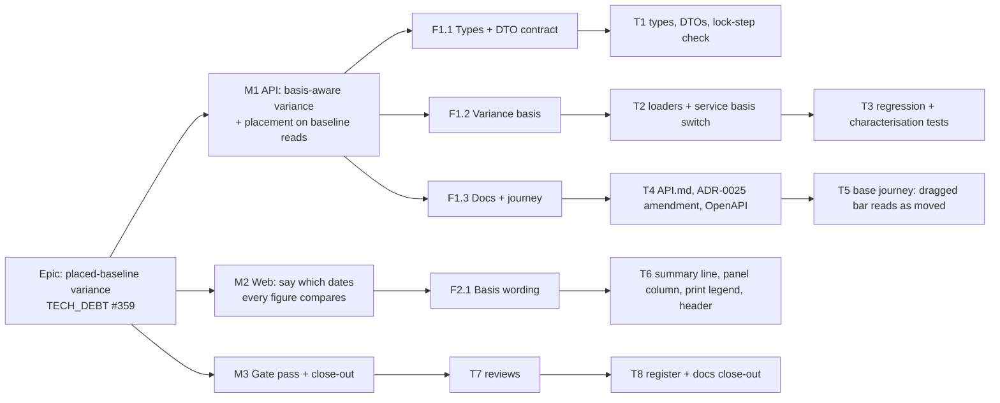

# Implementation Plan: Baseline variance on the placed basis

- **Feature spec:** [`./feature-spec.md`](./feature-spec.md)
- **Status:** Draft — awaiting approval before implementation
- **Owner:** api + web

## Breakdown

### Epic

**Placed-baseline variance** — finish `docs/specs/one-planning-surface/` §4.11's two unbuilt rows
(`docs/TECH_DEBT.md` #359): variance measures where bars are placed wherever the baseline recorded
it, and every variance figure says which dates it compares.

**Parity (ADR-0034):** untouched in the strong form. The variance read does not call
`computeSchedule`; no engine, recalculation or capture code changes.
**Pen (ADR-0028):** not involved; every change is to a read.
**Flag:** none (ADR-0088 D1). The rollback is the commit boundary between M1 and M2.
**Schema:** none (feature-spec §4.4). `database-architect` is not engaged because there is nothing to
design. If any task finds a reason to touch a model, column, index, constraint or data migration, it
stops and goes to that agent first (CLAUDE.md §19.3).

---

### Milestone M1: the API answers on the placed basis (shippable slice)

**Outcome:** on a baseline captured since `api-v0.70.0`, a bar dragged after capture reads as moved,
and a constraint converted to a placement no longer reads as "ahead", in the activities table's
variance columns, the Gantt `vs baseline` column and ghost, and the TSLD Baseline overlay. The API
reads expose the placement and the snapshot level.
**Entry point:** the plan workspace, activities panel, **Start variance** / **Finish variance**
columns (`ActivitiesTable.tsx:834-835`), which appear when the plan has an active baseline.
**Journey:** `apps/web/e2e/baselines.spec.ts` (the base journey, `scripts/e2e-local.sh web`), extended
in T5: capture a baseline, hand-place an activity later through the API, recalculate, and assert the
**Start variance** cell for that row reads the positive offset.

---

#### Feature F1.1: the contract

> **Description:** add the two unions and the new response fields, and document what the variance
> row's dates mean.
> **Complexity:** S
> **Dependencies:** none
> **Risks:** a type added as required breaks web test fixtures that build `BaselineSummary` or
> `PlanVarianceSummary` literals → fix them in the same PR; they are compile errors, not silent.
> **Testing requirements:** typecheck; DTO mapping unit cases; the lock-step check fails if Prisma's
> enum and the union diverge.

##### Task T1 — types, DTOs, lock-step check (≈ one PR with T2–T3)

- **Description:** `@repo/types`: `PlacementSnapshotLevel = 'NONE' | 'FULL'`,
  `VarianceBasis = 'PLACED' | 'NETWORK'`; `BaselineSummary.placementSnapshotLevel`;
  `BaselineActivitySnapshot.placedStart | placedFinish | visualStart`;
  `PlanVarianceSummary.basis: VarianceBasis | null`. Docblocks on `BaselineVarianceRow` state that its
  date fields and start/finish variances are on `meta.basis`, and float fields are total float on
  both bases. API DTOs (`baseline-response.dto.ts`, `baseline-variance-response.dto.ts`) mirror them
  with `@ApiProperty` enums and the "read the level, never the nulls" description from spec §4.5.
- **Complexity:** S
- **Dependencies:** —
- **Risks:** `BaselineResponseDto.from` builds the list shape from a `Baseline` row; the level is on
  that row, so no loader change is needed. Confirm `findManyActiveByPlan` and
  `findActiveWithCountByIdInPlan` select the full row (they return `Baseline &` today).
- **Testing:** DTO unit cases: `FULL` baseline maps placed columns and level; `NONE` maps level and
  nulls. Compile-time mutual-assignability check between `@prisma/client`'s `PlacementSnapshotLevel`
  and the `@repo/types` union (closes `schema.prisma:697-698`), verified red by adding a third member
  to the union locally.
- **Development steps:**
  1. Add the unions and fields to `packages/types/src/index.ts` beside `BaselineSummary` (`:1428`).
  2. Extend the three DTO classes and their `from` mappers; `formatCalendarDate` for the three dates.
  3. Add the lock-step assertion in the DTO file.
  4. Update web fixtures that construct these literals (compile-driven).

---

#### Feature F1.2: the variance basis

> **Description:** choose the basis once per read from the active baseline's level, project both
> sides on it, and return it.
> **Complexity:** M
> **Dependencies:** F1.1
> **Risks:** see T2 and T3.
> **Testing requirements:** API e2e R1, R2, R3 (spec §2) — R1 and R2 fail against today's code;
> service unit U1 (four quadrants) and U2 (per-read basis); existing variance e2e cases unchanged.

##### Task T2 — loaders and the basis switch

- **Description:**
  - `BaselineRepository.loadSnapshotRowsForVariance` (`baseline.repository.ts:448-472`) also selects
    `placedStart`, `placedFinish`.
  - `loadActiveActivitiesForVariance` (`:708-734`) also selects `visualEffectiveStart`,
    `visualEffectiveFinish`.
  - `BaselinesService.variance` (`baselines.service.ts:402-437`): a private `basisFor(level)` with an
    exhaustive `switch` and a `never` default; a projection that picks both sides' dates from the
    basis; `summary.basis` on both return paths (`null` in the no-active-baseline branch at
    `:387-400`).
  - `variance.ts`: rename `VarianceLiveRow.earlyStart/earlyFinish` to `start/finish`; update the
    docblock to say the function is basis-blind and the caller chooses the basis. **Do not write the
    word `remainingFloat` anywhere in this file**, comments included: `float-basis.structural.spec.ts`
    bans that text in `variance.ts` (`:62-65`, `:75-77`). Say "remaining float" if it must be said.
  - Correct `float-basis.structural.spec.ts:64`'s `why` string: no baseline freezes remaining float
    (spec F2). Text only; the assertion does not change.
- **Complexity:** M
- **Dependencies:** T1
- **Risks:**
  - Switching one side only (the obvious slip) → U1's four distinct answers make any one-sided switch
    fail.
  - Per-row fallback to network when a placed date is null → U2.
  - The level is read from the `Baseline` row that `findActiveBaselineByPlan` already returns
    (`:437-445`); no extra query.
- **Testing:** U1, U2 in `baselines.service.spec.ts` (it already fixtures
  `placementSnapshotLevel: 'NONE'` at `:83` and placed columns at `:137-138`); existing
  `variance.spec.ts` cases pass after the field rename with no assertion changed (the pure maths is the
  before/after oracle).
- **Development steps:**
  1. Widen the two loaders.
  2. Add `basisFor` and the projection; thread `basis` into the summary.
  3. Rename the pure function's live fields; run `variance.spec.ts` unchanged.
  4. Write U1 and U2; mutate each (live-only switch, frozen-only switch, per-row fallback) and watch
     each fail before restoring.

##### Task T3 — regression and characterisation e2e

- **Description:** in `apps/api/test/baselines.e2e-spec.ts`, add R1 (the stripped activity and its
  successor: bars unmoved, variance today −9, after 0), R2 (dragged bar: today 0, after +5), R3 (the
  same two on a baseline forced to `NONE` through Prisma: `basis: 'NETWORK'`, today's numbers kept),
  plus list/detail cases for `placementSnapshotLevel` and the three placed fields on a fixture where
  placed ≠ early (one hand-placed bar), so freezing the early span twice would fail
  (`m-c/placement-snapshot.md:25-34` explains why a plain fixture cannot).
- **Complexity:** M
- **Dependencies:** T2
- **Risks:**
  - R1 must assert the bars have not moved (`visualEffectiveStart` before and after) **before** it
    asserts variance; without that, a passing 0 could come from a fixture where both moved.
  - R1 reproduces the strip through the public PATCH, not the migration SQL. That is the same row
    transformation (`20260921120000_strip_drag_constraints/migration.sql:234-238`), and the SQL
    itself is already covered by `strip-drag-constraints-migration.e2e-spec.ts`. Running the
    migration SQL here would convert other tests' rows, since it is not plan-scoped.
  - R1 and R2 must be run once against the pre-change service and seen failing (record the red
    numbers in the PR description, ADR-0110 D5).
- **Testing:** `scripts/e2e-local.sh api`.
- **Development steps:**
  1. Write R1–R3 against the current code; confirm R1 and R2 fail with the predicted numbers and R3
     passes except for the missing `basis`.
  2. Land T2; confirm all pass.
  3. Add the list/detail cases.

---

#### Feature F1.3: documentation, OpenAPI and the journey

> **Description:** record the decision and prove the entry point in a real browser.
> **Complexity:** S
> **Dependencies:** F1.2
> **Risks:** the journey asserting on copy that M2 changes → assert on the **Start variance** cell's
> number, not the summary text, in M1.
> **Testing requirements:** base Playwright journey with its axe scan.

##### Task T4 — docs and OpenAPI

- **Description:** `docs/API.md`: a "Baseline variance basis" subsection next to the placement notes
  (`:263-271`) stating the basis rule, `meta.basis`, the per-read rule, total float on both bases, and
  the correct route path. ADR-0025: the amendment outlined in spec §4.7, numbered after the
  amendments the file actually holds (spec F5). ADR-0148 References: add this spec. Changesets: `api`
  minor and `types` minor, first sentence naming the behavioural change on `FULL` baselines.
- **Complexity:** S
- **Dependencies:** T2
- **Risks:** a stale route path copied forward → use `GET …/plans/:planId/baselines/variance`
  (`baselines.controller.ts:108`).
- **Testing:** `pnpm check:doc-links`, `pnpm prepush`.
- **Development steps:**
  1. Write the API.md subsection and the ADR amendment.
  2. Update the `@ApiOperation` description on the variance route (`baselines.controller.ts:109-115`)
     to mention `meta.basis`.
  3. Add the changesets.

##### Task T5 — base journey: a dragged bar reads as moved

- **Description:** extend `apps/web/e2e/baselines.spec.ts`: after capture, PATCH one activity's
  `visualStart` five days later through the API (the spec's existing setup path), recalculate through
  the UI, and assert that row's **Start variance** cell shows +5 and **Finish variance** shows +5.
  Keep the existing axe scan.
- **Complexity:** S
- **Dependencies:** T2
- **Risks:** the base journey is `test:e2e` with no suffix; run it with `scripts/e2e-local.sh web`
  (ADR-0096 note in CLAUDE.md §16).
- **Testing:** that journey, locally and in CI.
- **Development steps:**
  1. Add the steps; run once against pre-T2 code to see it fail (cell reads 0 / "On plan").
  2. Run against T2.

---

### Milestone M2: every figure says which dates it compares (shippable slice)

**Outcome:** a reader can tell whether variance compares placed or earliest dates, on screen and on
paper, and knows how to get a placed comparison from an older baseline.
**Entry point:** the variance summary line in the activities panel ("vs. <baseline> (placed dates):
…"), the **Compares** column in the Baselines panel, and the printed programme's legend.
**Journey:** the same base journey, extended in T6 to assert the summary text names "placed dates".
**Release order:** merge after M1 has released, so the web never meets an API without `basis` except
during an image recreation, which it tolerates (spec US-2).

#### Feature F2.1: basis wording

> **Description:** state the basis wherever a variance figure appears without one.
> **Complexity:** S
> **Dependencies:** M1 released
> **Risks:** wording that says more than the data supports → the `NONE` sentence names the cause
> (captured before placements were recorded) and the remedy, nothing else; ux-reviewer approves copy.
> **Testing requirements:** unit per surface, journey, axe.

##### Task T6 — summary line, panel column, print legend, float header

- **Description:** the four changes in spec §4.6. `basis` absent renders today's text with no
  qualifier. `NONE` sentence is plain muted text, not an `Alert` (ADR-0132: a standing condition).
- **Complexity:** S
- **Dependencies:** M1
- **Risks:**
  - "Float variance" → "Total float variance" changes an accessible column name; update any test or
    journey locating that header (search `'Float variance'` across `apps/web`).
  - `EMPTY_SUMMARY` in `use-baselines.ts:26-34` needs `basis: null`.
- **Testing:**
  - `BaselineVarianceSummary.test.tsx`: PLACED, NETWORK (with the sentence), absent (no qualifier).
  - `BaselinesPanel.test.tsx`: the column for `FULL` and `NONE`.
  - `GanttPrintSurface.test.tsx`: the legend for both bases.
  - `ActivitiesTable.test.tsx`: the header name.
  - Base journey: summary contains "placed dates"; axe clean.
- **Development steps:**
  1. Thread `summary.basis` to the summary component (already has `summary`) and to the print surface
     (it receives `varianceByActivityId`; add the basis beside it from the workspace model).
  2. Add the panel column from `BaselineSummary.placementSnapshotLevel`.
  3. Rename the header.
  4. Web changeset (`web` minor).

---

### Milestone M3: gate pass and close-out

**Outcome:** reviewed, recorded, and the register says what is true.
**Entry point:** none new. `Ships dark` does not apply; this milestone changes no behaviour.

##### Task T7 — reviews

- **Description:** run over the combined M1+M2 diff: **api-reviewer** (contract meaning change,
  OpenAPI, the `basis` vs `placementNotAssessableReason` choice), **test-engineer** (R1–R3, U1–U2
  discriminate), **ux-reviewer** and **accessibility-reviewer** (copy, the renamed header, the new
  column), **component-reviewer** (panel column, print legend). **backend-performance-reviewer** only
  if a reviewer disputes spec §3's "two date columns" claim. security-reviewer is not needed: same
  routes, same permission, same scope, no new data class (placed dates are already on the member
  activity read).
- **Complexity:** S
- **Dependencies:** M2
- **Risks:** findings that change the contract after M1 released → fold as an additive follow-up, not
  a breaking change.
- **Testing:** every blocking fix carries a test verified red first.
- **Development steps:** run, fold, record findings in the PR.

##### Task T8 — register and docs close-out

- **Description:**
  - `docs/TECH_DEBT.md` #359: delete and ledger, pointing at this spec, with the five corrections
    (spec §0 C1–C4 and F2) in the ledger line.
  - New sibling row: "Four baseline readers still measure earliest dates after #359" — revision
    comparison delta/`REDATED`/ghosts, overview plan standing, `capturedProjectFinish`, EV PV phasing
    (spec §3 Dependencies), with DCMA named as correctly network. Trigger: the next epic that touches
    any of them.
  - `docs/specs/one-planning-surface/feature-spec.md` §4.11: mark the two rows built here and correct
    the route to `GET …/baselines/variance` (spec C2).
  - `apps/api/prisma/schema.prisma`: two comment-only edits (the "DARK until M-C writes them" line at
    `:2394` and the lock-step note at `:697-698`). Confirm CI's drift check reports no difference.
  - CLAUDE.md §16 ADR-0025 entry: one clause noting the variance basis amendment.
  - F3 (0 or 2 baselines on the installation): record the discrepancy in the ledger line; it does not
    block anything. The product owner can settle it with one press of the
    `baselines-over-placed-plans` diagnostic.
- **Complexity:** S
- **Dependencies:** T7
- **Risks:** `check:debt-status` vocabulary has no `closed`; the row is deleted and ledgered
  (ADR-0138's precedent).
- **Testing:** `pnpm prepush` (debt-status, doc-links, adr-coverage, spec-status).
- **Development steps:** edit, run `pnpm prepush`, commit.

## Sequencing & slices

1. **M1** (T1 → T2 → T3, then T4 and T5): one PR, or two if T4/T5 are split out. Releases `api` and
   `types`. Before this lands, the variance route answers on earliest dates for every baseline; after
   it, on placed dates for `FULL` baselines. `main` stays releasable: the web reads the same row shape.
2. **M2** (T6): after M1's release. Releases `web`.
3. **M3** (T7, T8): the review pass can start on M1's diff while M2 is built; T8 lands last.

No flag. Rolling back M2 is reverting one commit; rolling back M1 is reverting its commit and
publishing, since the response change is read-only and stores nothing.

## Definition of Done (per task)

Each task's PR must satisfy the Feature Completion Criteria in
[`docs/PROCESS.md`](../../PROCESS.md): code, tests, docs, security, performance, accessibility, Docker
build, CI, changelog, version impact. "Tests" means `pnpm prepush` was run, plus
`scripts/e2e-local.sh api` for M1 and `scripts/e2e-local.sh web` for M1 T5 and M2.

## Risks & assumptions (rollup)

| Risk / assumption                                                                                              | Likelihood        | Impact                   | Mitigation                                                                                              |
| -------------------------------------------------------------------------------------------------------------- | ----------------- | ------------------------ | ------------------------------------------------------------------------------------------------------- |
| Q1 default leaves `NONE` baselines reporting a converted constraint as "ahead"                                 | certain on `NONE` | low (0–2 test baselines) | Labelled on screen with the recapture remedy; pinned by R3; Q1 lets the product owner choose otherwise. |
| Only one side switched to placed                                                                               | med               | high                     | U1's four distinct answers.                                                                             |
| A `FULL` row with a null placed date silently falls back to network                                            | low               | med                      | U2; spec rule "basis per read".                                                                         |
| `remainingFloat` written into `variance.ts` in a comment                                                       | med               | low                      | Called out in T2; the float-basis gate fails loudly.                                                    |
| Variance (placed) disagrees with revision comparison, overview standing and EV (earliest) for hand-placed bars | certain           | med                      | Stated in the ADR amendment and filed as one sibling row at T8.                                         |
| External API consumers assumed early dates in variance rows                                                    | low               | med                      | Minor bump with the change in the changeset's first sentence; `meta.basis` makes it detectable.         |
| New web meets old API during a rolling update                                                                  | low               | low                      | Release M1 first; the web shows no basis wording when `basis` is absent.                                |
| Finish milestones on a `FULL` baseline captured 2026-09-21 to 09-23 read one working day out                   | low               | low                      | Pre-existing on the network basis (ADR-0155 consequences); not introduced here; noted in the amendment. |
