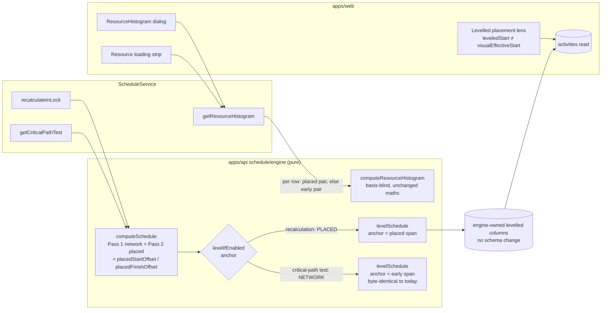
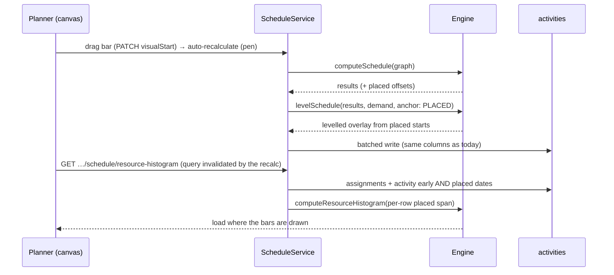
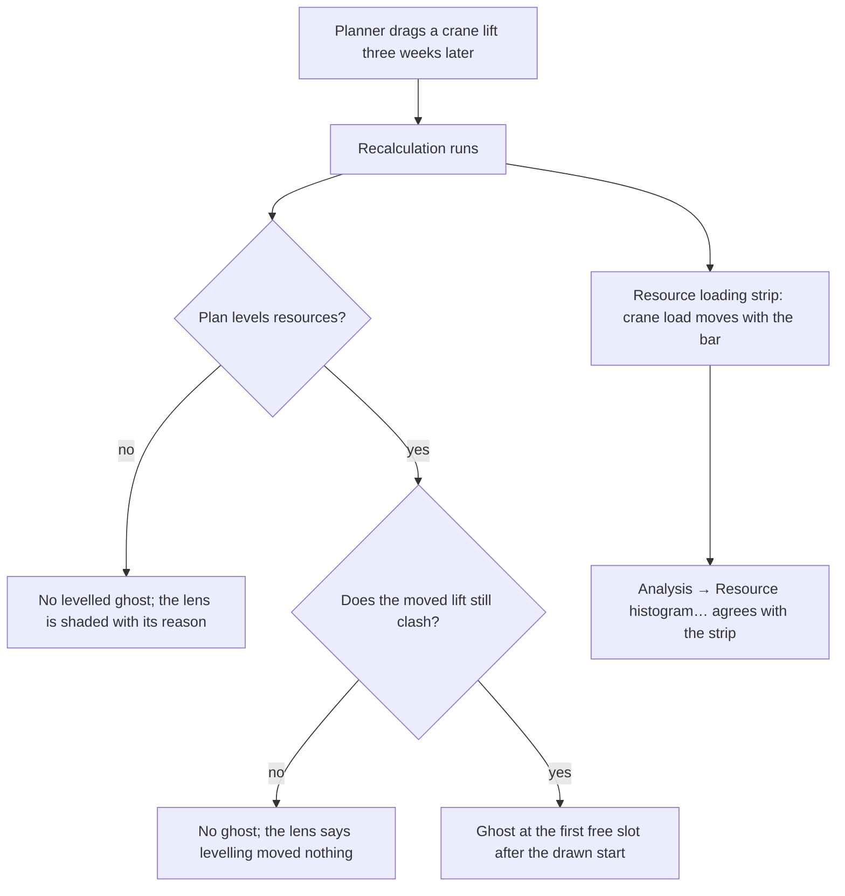

# Feature Spec: Resource load and levelling start where the bar is drawn

- **Status:** Approved — by the product owner, 2026-09-30. Q1: **(c)** — the levelled ghost now; a
  separate "Apply levelled dates" command later, under its own spec. Q2: **no** — metric 12 stays
  network-anchored. Q3–Q6: defaults accepted. M0's suspected completion-carrier defect: **check it
  first, then stop for a decision** if it is real.
- **Author(s):** feature-analyst (for the product owner)
- **Date:** 2026-09-30
- **Tracking issue / epic:** `docs/TECH_DEBT.md` #413
- **Roadmap link:** none. This finishes the last pair of readers ADR-0148 left on the network basis.
- **Related ADR(s):** a new **ADR-0166** is required (outline in §4.8). It amends ADR-0041 (§1, §3, §7),
  ADR-0071 (Gate B's scope), ADR-0044 §3 and ADR-0035 §28/§31, and it makes true a Consequences
  sentence in ADR-0148 that is false today (C3). It follows ADR-0148 D9 (levelled is a lens, never an
  authority), ADR-0088 D1 (no flag), ADR-0081 (entry point and journey), and the precedent of
  ADR-0025 Amendment 3 (#359) and ADR-0042 Amendment 1 (#405 c).

**Product-owner decision, 2026-09-30: "Follow placed bars".** The resource histogram, the canvas resource
strip **and** resource levelling all move to the placed (drawn) dates, together. This spec designs how.
It does not reopen that decision.

**Why a spec and not a register fix (ADR-0105).** It changes the meaning of two public reads' figures
(`GET …/schedule/resource-histogram`; the levelled fields on the activity and schedule-summary reads),
it changes a documented engine semantic (ADR-0035 §28), it changes user-visible copy, and it adds a seed
plan and journey steps.

---

## 0. What was checked, and where the row and its neighbours are wrong

Every claim below was **read** in the file cited; C5 is also read, not run, and M0 runs it.

| #   | Claim                                                                                                                                                    | What the code says                                                                                                                                                                                                                                                                                                                                                                                                                                                                                                                                                  | Effect                                                                                                                                                                              |
| --- | -------------------------------------------------------------------------------------------------------------------------------------------------------- | ------------------------------------------------------------------------------------------------------------------------------------------------------------------------------------------------------------------------------------------------------------------------------------------------------------------------------------------------------------------------------------------------------------------------------------------------------------------------------------------------------------------------------------------------------------------- | ----------------------------------------------------------------------------------------------------------------------------------------------------------------------------------- |
| C1  | #413: `loadResourceHistogramAssignments` (`schedule.repository.ts:660-691`) selects only `earlyStart/earlyFinish`.                                       | **True.** Now `:660-692`; the select is `activity: { earlyStart, earlyFinish, calendarId }` at `:679`. The service formats them into the engine's `start`/`finish` at `schedule.service.ts:1322-1323`. The engine fields are basis-neutral by name but their docblocks say "early start" (`engine/resource-histogram.ts:112-115`).                                                                                                                                                                                                                                  | M2 changes the loader and the service mapping. The engine's maths does not change; its docblocks do.                                                                                |
| C2  | #413: "the leveller starts every activity from `earlyStartOffset` (`engine/level.ts:165`, `:216`)".                                                      | **True, and understated: seven sites, not two.** `:165-166` (pinned start and finish), `:174-175` (a pinned activity's levelled dates are its early dates), `:206-207` (the sort key's third term), `:216` (the levellable anchor), `:268-270` (the negative-float guard clamps to early start), `:286` (`levelingDelay` is measured from early start), `:318-319` (a non-participant's finish in the levelled project finish).                                                                                                                                     | All seven move together (M1). Missing one gives a pass that anchors on the placed date but measures, clamps or reports against the early one.                                       |
| C3  | ADR-0148's header: "Amends … ADR-0041 §7". Its Consequences (`:225-226`): "a placement shifts a span the levelling pass reads".                          | **False today.** `level.ts` reads no placement: every match for `visual\|placed` in it is the phrase "already-placed intervals" (`:36-40`, `:135`, `:218`, `:338`, `:357`, `:388`, `:437`). ADR-0041 carries only the ADR-0071 amendment (`0041-…md:132`), none from ADR-0148. The ADR-0042 spec found the EV half of the same sentence false (`ev-placed-planned-value/spec.md` C5).                                                                                                                                                                               | This epic makes the sentence true. ADR-0166 says so, and ADR-0148's References gain it.                                                                                             |
| C4  | (not in the row) The levelled ghost and its spoken clause already disagree with the bar.                                                                 | The ghost is drawn when `leveledStart !== earlyStart` (`apps/web/src/features/tsld/render/lenses.ts:466`), fed from `TsldPanel.tsx:1313`. `a11y.ts:503-510` says in its own docblock that `levelingDelayDays` "is `leveledStart - earlyStart`, while the bar is drawn at the PLACED start", and states a date instead of an offset to avoid it.                                                                                                                                                                                                                     | The same defect as the row, on a surface the row does not name. M3 changes the predicate. The clause stays as it is (a date is correct on both bases).                              |
| C5  | (not in the row) "`visualEffective*` equals `early*` wherever nothing is placed" (FC-11), which every parity claim here rests on.                        | **Suspected false for successors of progressed or expected-finish activities.** Pass 2 propagates a predecessor's finish as `prop + durationMinutes` (`compute.ts:348-351`), from a start floored at the data date. Pass 1 uses the actual finish for a complete activity and `workStart + remaining` for an in-progress one (`:282-295`), and the expected-finish resize (`:263-281`). FC-11's fixture (`compute.visual.spec.ts:400-440`) and the product gate (`test/placed-basis-parity.e2e-spec.ts:149-160`) contain **no successor** of a progressed activity. | **M0-T1 runs it.** If it is real, it is a canvas defect in its own right (a bar drawn late on an unplaced plan), filed as its own row. It narrows this epic's parity claims (§4.7). |
| C6  | `docs/API.md:1666-1669`: DCMA metric 12 levels each pass "exactly as a recalculation would".                                                             | True today (`critical-path-test.ts:156`, `:198` call the shared `levelIfEnabled`). After this epic the recalculation levels from placed dates, and placements are stay-and-flag (`compute.ts:347-348`): a placed completion carrier does not move when logic pushes it. So a placement-anchored metric 12 can report FAIL on a sound network.                                                                                                                                                                                                                       | Q2. Default: metric 12 stays network-anchored.                                                                                                                                      |
| C7  | `schedule.service.ts:1057-1061`: the what-if uses levelling because the product "no longer persists" the pure network dates once `levelResources` is on. | **False.** The write persists `early_*` on every recalculation (`schedule.repository.ts:871-874`) beside the levelled columns (`:889-893`). Levelling is an overlay (ADR-0041 §3, ADR-0148 D9).                                                                                                                                                                                                                                                                                                                                                                     | Corrected in M1-T3 as part of Q2.                                                                                                                                                   |
| C8  | The label (#413 "The label shipped").                                                                                                                    | `RESOURCE_LOAD_BASIS_NOTE` (`ResourceHistogram.tsx:43-44`) is the accessible description of the dialog section (`:103-116`) and of the strip panel (`resource-strip-panel.tsx:249-251`, `:290-294`); both are pinned by `ResourceHistogram.test.tsx:262-263` and `resource-strip-panel.test.tsx:83-84`.                                                                                                                                                                                                                                                             | M2 rewords the constant. The wiring and both tests stay (Q4).                                                                                                                       |
| C9  | The seed catalogue can demonstrate this.                                                                                                                 | **It cannot.** `visualStart` is set only in `apps/seed-cli/src/capabilities/visual-placements.ts` (grep: `:60`, `:64`, `:71`, `:80`, `:134`; `builders.ts:57` sets null). Neither placement plan has a resource. `plan:capability-levelling` (`resources.ts:157-195`) has no placement.                                                                                                                                                                                                                                                                             | M4 adds one plan (§2, "Seed catalogue").                                                                                                                                            |

Two smaller wording defects are fixed on the way (M3): the summary strip says levelling extended "past their
total float" (`ScheduleSummaryStrip.tsx:196-198`), and the OpenAPI text for `leveledStart`,
`levelingDelayDays` (`activity-response.dto.ts:402-427`) does not say what the delay is measured from.

---

## 1. Business understanding

### Problem

Since ADR-0148 a bar is drawn where it is **placed**. Dragging a bar writes a placement and does not
change the network's earliest dates. On 2026-09-29 the header's finish, baseline variance, the revision
comparison, the landing's standing and Earned Value all moved to placed dates (#404, #405). Three
resource readers did not:

1. **The resource histogram** (Analysis → Resource histogram…) counts each activity's load on its
   earliest dates. Drag a crane lift three weeks later and the chart still shows the crane busy in the
   week the bar left.
2. **The canvas resource strip** reads the same endpoint, so the load drawn directly under the bars is
   not the load of those bars.
3. **Resource levelling** starts every activity from its earliest date. A planner who has already moved
   two clashing lifts apart by hand still sees levelling report a clash and draw a levelled ghost for a
   conflict that is no longer on the plan. The reverse also happens: two bars dragged into the same week
   clash on the plan, and levelling does not see it.

The only thing telling the planner is a sentence under the chart ("Load is counted on each activity's
earliest dates, not where its bar is drawn."), shipped on 2026-09-29 as a stop-gap.

### Users

- **Planner** and **Org Admin**: they read the chart and strip, turn levelling on, read the levelled
  ghost, and drag bars. They are the people this is for.
- **Contributor** and **Viewer**: they read the chart and strip (`schedule:read`,
  `schedule.service.ts:1291`) and see the levelled ghost. Nothing about their access changes.
- **External Guest**: no change. The share module has no histogram route (grep `histogram` in
  `apps/api/src/modules/share`: 0 matches), and the guest projection is not touched.

### Primary use cases

1. A planner drags a bar and the resource strip underneath shows the load moving with it.
2. A planner separates two clashing activities by hand. Levelling then reports no clash for them and
   draws no ghost.
3. A planner drags two bars into the same week on one resource with a capacity. Levelling sees the clash
   and draws a ghost showing where the lower-priority one would have to go.

### User journeys

- Plan workspace → **Analysis** → **Resource histogram…** (`plan-actions-menu.tsx:90-91`, opening
  `ResourceHistogram` from `plan-chrome-dialogs.tsx:193-199`).
- Plan workspace canvas → reveal **Resource loading** (the strip, `resource-strip-panel.tsx:248`).
- Plan workspace → **View** → **Levelled placement** (the checkbox the journey already drives,
  `e2e-workspace-chrome/placement-overlays.spec.ts:47`).

See §4.3.

### Expected outcomes

On a plan with placed bars, the chart, the strip, levelling and the levelled ghost all describe the plan
as drawn, and they agree with EV and variance, which already do. On a plan with no placement, nothing
changes (subject to C5).

### Success criteria

- SC-1. H1 (histogram) and L1/L2 (levelling) fail against today's code and pass after M1–M2.
- SC-2. The histogram golden H2, recorded against today's code on an unplaced plan, is equal afterwards.
- SC-3. `level.parity.spec.ts`'s snapshot corpus passes with **no snapshot updated**, and the S10
  conformance slice and the histogram conformance slice pass unedited.
- SC-4. `computeSchedule`'s network outputs are byte-identical for every input: `compute.spec.ts` is not
  edited, and `compute.visual.spec.ts` only gains cases.
- SC-5. DCMA metric 12 on a placed, levelled plan gives the same verdict and `detail` as today (Q2 default).
- SC-6. The histogram read's p95 is unchanged within noise (two date columns added to an existing select).

### Open questions

Two are critical (Q1, Q2) and four have defaults (Q3–Q6). See §6.

---

## 2. Functional requirements

### User stories & acceptance criteria

> **US-1**: As a **Planner**, I want the resource histogram and strip to count load where each bar is
> drawn, so that the chart under the diagram describes the diagram.
>
> - **Given** an activity with a placement, **when** I read the histogram, **then** each of its
>   assignments' units are spread over its `visualEffectiveStart`–`visualEffectiveFinish` span (plus the
>   assignment's own lag and curve, unchanged).
> - **Given** an activity with no placement, **then** its load is where it was, because its placed span is
>   its early span (FC-11; C5 scopes this).
> - **Given** a row whose `visualEffectiveStart` or `visualEffectiveFinish` is null and whose early dates
>   are not (a row not recalculated since 2026-07-14, when the columns were added with no backfill,
>   `migrations/20260714120000_add_scheduling_modes_columns/migration.sql:39`), **then** both dates fall
>   back to early **as a pair**. This is the `placedFinishSql` rule (`placed-finish.ts:17-23`). A row with
>   no date on either basis stays excluded, as today (`resource-histogram.ts:112-115`).
> - **Given** a started or complete activity, **then** its span is its actual span, because a placement
>   cannot override an actual (`compute.ts:943-948`).

> **US-2**: As a **Planner** with levelling on, I want levelling to start from where I drew each bar,
> so that it sees the clashes on my plan and not the clashes on the network's earliest version of it.
>
> - **Given** two activities contending for a capacity-1 resource at their early dates, one of which I
>   have placed after the other finishes, **then** levelling delays neither and draws no ghost.
> - **Given** two activities that do not contend at their early dates, placed so they overlap on a
>   capacity-1 resource, **then** levelling delays the lower-priority one and draws its ghost at the
>   first free slot at or after its **placed** start.
> - **Given** a levelled activity, **then** `levelingDelayDays` is the working time from its **placed**
>   start to its levelled start, on its own calendar.
> - **Given** an activity levelling never moves (mandatory, LOE, WBS summary, milestone, started), **then**
>   it occupies the resource where its bar is drawn, and its `leveledStart`/`leveledFinish` equal its
>   `visualEffectiveStart`/`visualEffectiveFinish`.
> - **Given** `levelWithinFloatOnly`, **then** the cap is still "levelled finish ≤ late finish". Measured
>   from the placed start, that is a delay of at most the **remaining float** (ADR-0148 D3). A levelled
>   start is never earlier than the placed start.
> - Levelling **never writes a placement** and never changes `early*`, `late*`, float or criticality
>   (ADR-0041 §3, ADR-0148 D9). The bar stays where the planner put it; the ghost is the rival position
>   (Q1).

> **US-3**: As a **Planner**, I want the levelled ghost drawn only for bars levelling actually moved.
>
> - **Given** a participant levelling did not delay, **then** no ghost is drawn, including when the bar is
>   placed away from its early date. The predicate is `leveledStart !== visualEffectiveStart`.

> **US-4**: As a **Planner** reading DCMA metric 12, I want the verdict to test the logic network, so
> that a placement cannot make a sound network fail (Q2).
>
> - **Given** a levelled plan with placements, **when** I run the Critical Path Test, **then** the verdict
>   and `detail` are exactly today's.

### Workflows

1. **Recalculation** (under the pen, as today). `computeSchedule` runs, now also returning each
   activity's placed start/finish as plan-frame offsets (§4.6). If the plan levels, `levelIfEnabled`
   runs `levelSchedule` with `anchor: 'PLACED'`. The batched write persists the same columns as today.
2. **Histogram read.** The loader selects the placed pair beside the early pair. The service picks the
   pair per row (placed, else early) and calls the unchanged `computeResourceHistogram`.
3. **Critical Path Test.** Unchanged. It calls `levelIfEnabled` with `anchor: 'NETWORK'` (Q2 default).
4. **Canvas.** After a drag, auto-recalculation invalidates the histogram query
   (`features/schedule/api/use-schedule.ts:88-92`), so the strip refetches. The levelled ghost reads the
   new predicate.

### Edge cases

| Case                                                                           | Behaviour                                                                                                                                                                                                                                                                              |
| ------------------------------------------------------------------------------ | -------------------------------------------------------------------------------------------------------------------------------------------------------------------------------------------------------------------------------------------------------------------------------------- |
| A placement earlier than logic allows (`EARLIER_THAN_LOGIC`)                   | Load is counted, and levelling anchors, at the **drawn** start (Q6 default). The bar already carries the conflict flag. The ghost can therefore sit before logic allows. That is honest about a bar that already does.                                                                 |
| A placement past an `SNLT`/`FNLT`/`MSO`/`MFO` bound (`LATER_THAN_BOUND`)       | Anchored at the drawn start. Remaining float is negative, so under `levelWithinFloatOnly` the cap's arithmetic walks before the placed start. The guard (today `level.ts:268-271`) clamps to the **placed** start instead of the early one.                                            |
| A placed mandatory-constrained activity                                        | Pinned (never moved), and occupies where it is drawn.                                                                                                                                                                                                                                  |
| A placed WBS summary                                                           | Pinned. A summary carries no assignments in practice. If it has one, it occupies its drawn span (`compute.ts:782-785`).                                                                                                                                                                |
| Started or complete, with a placement                                          | Actual wins (`compute.ts:943-948`); placed = early for that row. Pinned at it, as today.                                                                                                                                                                                               |
| A lagged assignment (ADR-0071)                                                 | The demand window is `[anchor ⊕ lag, finish)` for levelling (`level.ts:111-118`) and the histogram span starts `lag` into the activity. Both follow the anchor with no change.                                                                                                         |
| An activity pushed later by a **placed predecessor** but not placed itself     | Its `visualEffectiveStart` already includes the push (`compute.ts:314-321`, `:348`). Load and levelling follow it, because that is where it is drawn.                                                                                                                                  |
| A plan with no placement                                                       | Histogram and levelling output are unchanged wherever `visualEffective*` equals `early*` (FC-11). C5 may find a class where it does not. That is then a canvas defect, and this epic follows the canvas.                                                                               |
| `levelResources` off                                                           | Levelling does not run (Gate A, unchanged). The histogram still moves to placed dates.                                                                                                                                                                                                 |
| Levelling on and the histogram                                                 | The chart shows load **where bars are drawn**, not where levelling would move them (Q3). An over-allocation the ghost resolves is still visible on the chart, and that is correct: the plan as drawn is over-allocated.                                                                |
| Row with null placed dates but early dates                                     | Pair fallback to early (US-1). Levelling never meets it, because the recalculation that levels computes both.                                                                                                                                                                          |
| Stale web bundle against the new API (ADR-0047 recreates images independently) | The old predicate `leveledStart !== earlyStart` draws a ghost on top of a placed, undelayed participant, until the web image is recreated. It is limited to levelled plans with a placed participant, and it lasts minutes. Sequencing (plan) puts the web change in the same release. |

### Permissions

Unchanged. The histogram is `schedule:read` in the caller's organisation, and another organisation's
plan is a 404 (`schedule.service.ts:1290-1294`). Levelling runs inside the recalculation, which already
needs the pen (ADR-0028). **No new write, structural or otherwise.** Levelling still writes only the
engine-owned levelled columns and never a placement.

### Validation rules

No new input. `levelingPriority` keeps its validation.

### Error scenarios

| Scenario                          | Detection                                           | User-facing result | Status |
| --------------------------------- | --------------------------------------------------- | ------------------ | ------ |
| Not a member of the organisation  | scope resolve                                       | not found          | 404    |
| Granularity too fine for the span | `HistogramTooManyBucketsError` (`:1336-1340`)       | unchanged message  | 422    |
| Lag walk past a calendar horizon  | `rejectIfWorkingTimeHorizonExceeded` (`:1346-1349`) | unchanged          | 422    |

The placed span can be longer or later than the early span, so a plan near the horizon can now meet the
422 on the histogram where it did not before. That is the correct answer for the span being drawn.

### Regression tests (the design's proof)

All data dates are D = plan start, on a five-day calendar unless stated. "Today" means against the
pre-change code, recorded in the PR (ADR-0110 D5).

**Engine (`engine/level.spec.ts`, `compute.visual.spec.ts`).**

- **L0: FC-11 at the instant level.** In FC-11's fixture, every activity's `placedStartOffset` equals
  `earlyStartOffset` and `placedFinishOffset` equals `earlyFinishOffset`. Extended with whatever class
  M0-T1 finds (if C5 is real, that class is expected to **differ**, and the case documents it).
- **L1: a hand-separated clash disappears (red today).** A and B, 3 days each, both assign crane
  (capacity 1, 1 unit/h), no logic, both early at D. B placed at D+5. **Today:** one is delayed to D+3 and
  a ghost is drawn. **After:** `levelingDelay` 0 for both, `leveledStart` = the placed start, no ghost.
- **L2: a hand-made clash appears (red today).** P (5 days) → B (3 days). A (3 days) placed at D+5; B's
  early start is D+5 too. Both assign the crane. **Today:** no contention (A at D, B at D+5), no delay.
  **After:** the lower-priority one is delayed to D+8, and its `levelingDelay` is 3 days from its placed
  start.
- **L3: every one of C2's seven sites.** Separate cases for: pinned occupancy at the placed span; a
  pinned activity's levelled dates equal its placed dates; `levelingDelay` measured from placed; the
  negative-float guard clamps to placed; the levelled project finish uses a non-participant's placed
  finish. Each is written to fail if only that site is left on early.
- **L4: priority key (Q5).** Two equal-priority contenders, one with less **remaining** float but more
  total float. The one with less remaining float is placed first.
- **L5: `anchor: 'NETWORK'` is today's pass.** On L1's and L2's fixtures, `anchor: 'NETWORK'` returns
  today's recorded results exactly.
- **Gate A (unchanged):** levelling off, recalculation byte-identical.
- **Gate B (unchanged):** `level.parity.spec.ts`, zero lag, **no snapshot updated**. Its fixtures carry
  no placement, so it also serves as Gate C at the engine.
- **Conformance:** `levelling_test`/S10 (`conformance/adapter.ts:453-472`) and
  `resource-histogram-conformance.spec.ts` pass unedited. The fixture has no placement
  (`packages/engine-conformance`: grep `visual`, 0 matches).

**API e2e (`apps/api/test/`).**

- **H1: histogram follows a drag (red today).** A (5 days, one assignment, 10 units, UNIFORM), placed at
  D+10. `DAY` granularity. **Today:** load in D…D+3, 2.5 units a day (measured in M0: the histogram
  spreads `[start, finish)` and is handed the inclusive display finish, so the last day carries none).
  **After:** load in D+10…D+13 on the same convention, and the total is still 10 (units conserved).
  This bullet said "D…D+4" and "D+10…D+14" until M0 read the response.
  **Convention corrected, 2026-09-30 (`docs/TECH_DEBT.md` #423):** the last day now carries load, so
  H1 reads D…D+4 and D+10…D+14 at 2 units a day, as this bullet first said, and H2's golden was
  re-derived. The "same convention" above describes what shipped with #413, not what holds now.
- **H2: unplaced golden (characterisation).** A plan with no placement: plain tasks, a lagged assignment,
  a BELL curve, a started task and a complete task **with no successor** (C5 kept out). Record the whole
  histogram response against today's code and commit it as a literal. After the change it is `toEqual`.
- **H3: pair fallback.** As H1, then set `visual_effective_start`/`_finish` to null through Prisma. The
  load returns to the early span, and never half on each.
- **LV1: levelled placement over the public route.** L1's shape through the REST API with
  `levelResources: true`. After recalculation, `leveledStart` equals the placed start and
  `levelingDelayDays` is 0. Read through Prisma first to confirm the fixture (the placed and early
  starts differ).
- **LV2: metric 12 stays network-anchored (Q2).** A levelled plan whose completion carrier is placed.
  `GET …/critical-path-test` returns the same verdict and `detail` as recorded against today's code.

**Web unit.** `lenses` (predicate: a placed, undelayed participant draws no ghost; a placed, delayed one
does); `ResourceHistogram` and `resource-strip-panel` (the reworded constant is still the accessible
description); `ScheduleSummaryStrip` (copy).

**Playwright (ADR-0081).** `e2e-resource-view/resource-view.spec.ts`: drag or place a bar through the
API, reveal **Resource loading**, open **Show data table**, and read the load in the placed bucket.
`e2e-workspace-chrome/placement-overlays.spec.ts`: on a levelled plan with two clashing bars, one placed
clear, the **Levelled placement** lens is offered and draws nothing, and says so.

**Seed catalogue.** A new plan, `plan:capability-levelling-placed`: `plan:capability-levelling`'s three
lifts on one crane, with **V3 placed after V2's levelled slot**. Correct: V3's load in the chart sits in
its placed week, V3 is not delayed and has no ghost, V1/V2 are still serialised. Wrong: V3's load at its
early dates, V3 delayed or ghosted, or V3 and its neighbours reading the same as
`plan:capability-levelling` (the matched pair, like Retained Logic and Progress Override). The playbook's
existing `capability-levelling` row keeps its reading, because that plan has no placement.

---

## 3. Technical analysis

| Area           | Impact   | Notes                                                                                                                                                                                                                                                                                                                                                                                                          |
| -------------- | -------- | -------------------------------------------------------------------------------------------------------------------------------------------------------------------------------------------------------------------------------------------------------------------------------------------------------------------------------------------------------------------------------------------------------------- |
| Frontend       | low      | Ghost predicate (`lenses.ts:462-476`, `TsldPanel.tsx:1308-1316`); `RESOURCE_LOAD_BASIS_NOTE` reworded; `ScheduleSummaryStrip` copy. No new component, no new state.                                                                                                                                                                                                                                            |
| Backend        | med      | Engine: two offsets on `EngineResult`; `levelSchedule` gains an `anchor` option and moves seven sites; `levelIfEnabled` passes it. Service: histogram pair selection; recalculation passes `PLACED`; critical-path test passes `NETWORK`. Loader: two columns.                                                                                                                                                 |
| Database       | **none** | Every column exists: `visual_effective_start`/`_finish` (`migration 20260714120000`, `:39`), `leveled_start`/`_finish`/`leveling_delay_minutes` (written at `schedule.repository.ts:889-893`). The new engine offsets are in memory and are **not persisted**. No migration, no index. database-architect is not engaged; any task that finds a reason to touch schema stops and goes to it (CLAUDE.md §19.3). |
| API            | low      | No shape change. The meaning of histogram buckets and of `leveledStart`/`leveledFinish`/`levelingDelayDays`/`leveledProjectFinish` changes for plans with placements. OpenAPI descriptions and `docs/API.md` (`:1617-1629`, `:1661-1679`) updated. `api` minor.                                                                                                                                                |
| Security       | none     | Same routes, permissions and scopes. No new data class. The guest projection is untouched.                                                                                                                                                                                                                                                                                                                     |
| Performance    | none     | Two date columns on a plan-scoped select that already joins `activity`. Levelling swaps an anchor and adds no pass. The critical-path test's cost is unchanged (#406 stands as it is).                                                                                                                                                                                                                         |
| Infrastructure | none     | No env var, no flag (ADR-0088 D1). The rollback is the commit.                                                                                                                                                                                                                                                                                                                                                 |
| Observability  | none     | —                                                                                                                                                                                                                                                                                                                                                                                                              |
| Testing        | med      | §2's cases, one seed plan, two journey extensions.                                                                                                                                                                                                                                                                                                                                                             |

### Dependencies

- Exists: ADR-0148 D0 (Pass 2 knows Pass 1's branches), FC-11, `placedFinishSql` (#404), the EV and
  variance moves (#405, #359).
- **M0-T1 (C5) first.** If Pass 2 diverges from Pass 1 for successors of progressed activities, that is a
  canvas defect, and every placed-basis reader, including the ones already shipped, inherits it. The
  product owner decides whether it is fixed before this epic's M1 (recommended: yes, if it is real; it
  would be its own register row and its own small spec, because it changes `compute.ts`).
- Siblings: #405's rename (deferred) is not touched. #406 (throttle) is not affected under the Q2 default.

---

## 4. Solution design

### 4.1 Architecture overview

### 4.2 Data flow

### 4.3 User flow

### 4.4 Database changes

**None.** Reasons are in the §3 row. This is stated explicitly because CLAUDE.md §19.3 routes every schema
change through database-architect: this design needs no column, index, constraint or data migration. The
two new engine offsets are never written.

### 4.5 API changes

Shapes are unchanged. Meanings change:

- `GET …/schedule/resource-histogram`: units are spread over each activity's **placed** span (pair
  fallback to early). OpenAPI description and `docs/API.md:1617-1629` ("reads the persisted CPM dates
  only") are updated to say "the placed span (`visualEffectiveStart`/`Finish`), as drawn".
- Activity read: `leveledStart`/`leveledFinish` are "the levelled position, levelled from the placed
  start"; `levelingDelayDays` is "working days from the placed start to the levelled start"
  (`activity-response.dto.ts:402-427`).
- Schedule summary: `leveledProjectFinish` is the latest finish under levelling, where a
  non-participant counts at its placed finish. It now agrees with the header's placed `projectFinish`
  (#404) on an unlevelled plan.
- `GET …/critical-path-test`: unchanged under the Q2 default. `docs/API.md:1666-1669` changes "exactly as
  a recalculation would" to "levelled from the network dates, not the placed ones, because metric 12
  tests the logic network".
- **Changesets:** `api` **minor** (behavioural change to public figures, pre-1.0, the #359 precedent). The
  first sentence: "The resource histogram and resource levelling now work from where each bar is drawn;
  plans with hand-placed bars read differently." `web` **minor** (copy and ghost predicate). No `types`
  change.

### 4.6 Engine design (the part that needs care)

**Placed offsets.** `EngineResult` gains `placedStartOffset` and `placedFinishOffset`, plan-frame
working-minute offsets like `earlyStartOffset` (`types.ts:258-262`). They are derived from **the same
instants that produce `visualEffectiveStart`/`Finish`**, so the date and the offset cannot disagree:

- frozen by actuals (`compute.ts:877`): `esInst` / `efInst`, exactly Pass 1's;
- an unplaced WBS summary (`:782-785`): `esInst` / `efInst`;
- otherwise: `vDisplayInst` (`:763`) and `vPlacedFinishInst` (`:834-835`), which already exist.

They are required fields, not optional. A plain `computeSchedule` result always has a placed span, and
optional fields would let a hand-built test result omit them and silently fall back. `compute.spec.ts`
is not affected: its only whole-result assertion is the empty plan (`compute.spec.ts:199`). The
`level.parity.spec.ts` snapshots project named fields only (`__snapshots__/level.parity.spec.ts.snap:5-11`),
so they are unaffected by the new fields. Any hand-built `EngineResult` in a spec must add the two
fields, and the compiler finds them.

**`levelSchedule(…, options.anchor: 'PLACED' | 'NETWORK')`.** One switch at the top of the pass picks the
anchor pair and the float term:

| Site (C2)              | `NETWORK` (today)                        | `PLACED`                                         |
| ---------------------- | ---------------------------------------- | ------------------------------------------------ |
| anchor start / finish  | `earlyStartOffset` / `earlyFinishOffset` | `placedStartOffset` / `placedFinishOffset`       |
| pinned levelled dates  | `earlyStart` / `earlyFinish`             | `visualEffectiveStart` / `visualEffectiveFinish` |
| sort key, second term  | `totalFloat`                             | `remainingFloatMinutes` (Q5)                     |
| sort key, third term   | `earlyStartOffset`                       | `placedStartOffset`                              |
| delay measured from    | early start                              | placed start                                     |
| negative-float clamp   | early start                              | placed start                                     |
| non-participant finish | `earlyFinishOffset` / `earlyFinish`      | `placedFinishOffset` / `visualEffectiveFinish`   |

`anchor` is required, with no default, so every caller states its basis and a new caller cannot inherit
one by accident. That is the same rule `varianceBasisFor` and `pvBasisFor` follow (exhaustive switch, no
`default`, `schedule.service.ts:1796-1799`).

- Recalculation (`schedule.service.ts:562`): `PLACED`.
- Critical-path test (`critical-path-test.ts:156`, `:198`): `NETWORK` (Q2).
- Conformance adapter (`conformance/adapter.ts:456`): `PLACED`, the production path. The fixture has no
  placement, so S10 reads the same, and that is itself evidence for Gate C.

`levelSchedule`'s docblock (`level.ts:17-72`) and ADR-0035 §28 are rewritten to say "at or after its
anchor start", with the anchor defined.

### 4.7 Parity (ADR-0034) and what each gate means now

- **`computeSchedule`'s network outputs: byte-identical, structurally.** Pass 1 is not touched. Pass 2's
  outputs are not touched. Two fields are **added**, derived from values that already exist.
- **Gate A (ADR-0041 §7): unchanged.** Levelling off → the pass does not run.
- **Gate B (ADR-0071): unchanged and restated.** Zero lag and no placement → `level.parity.spec.ts`
  corpus, no snapshot updated.
- **Gate C (new): unplaced levelling.** With levelling on and no placement, the placed anchor equals the
  early anchor for every participant **wherever FC-11 holds**, so the output is today's. Proven at the
  engine by the unedited corpus and S10, and at the product by LV1's unplaced twin. **C5 is the honest
  limit:** if Pass 2 diverges for successors of progressed activities, Gate C does not hold for those
  successors on an unplaced plan, because the canvas already draws them elsewhere. This spec does not
  hide that behind a narrower fixture. It sends it to M0-T1.
- **Histogram parity:** H2's golden (unplaced, C5's shape excluded and named).

### 4.8 ADR-0166 (outline): "Resource load and levelling start where the bar is drawn"

- **Context:** #413, C1–C3, the product-owner decision of 2026-09-30.
- **D1:** the histogram spreads units over the placed span, with a per-row pair fallback to early.
- **D2:** levelling anchors on the placed span. Seven sites move together (C2). The pass still never
  writes a placement and never recomputes float (ADR-0041 §3 and ADR-0148 D9 stand).
- **D3:** the priority key's float term is remaining float under `PLACED` (Q5).
- **D4:** `anchor` is a required option. DCMA metric 12 is `NETWORK` (Q2), and why.
- **D5:** the parity argument becomes Gates A, B (restated) and C, with C5 named as its limit.
- **D6:** no flag (ADR-0088 D1). The web ghost predicate ships in the same release.
- **Amends:** ADR-0041 §1/§3/§7; ADR-0071 (Gate B's scope); ADR-0044 §3; ADR-0035 §28 (first bullet) and
  §31 (first bullet, "effective span"); ADR-0116 D7 / #248 (the what-if's levelling basis). **Makes
  true:** ADR-0148 Consequences `:225-226` (C3).
- **Alternatives:** the rows in §4.9.
- The ADR is written at M4, when the spec is approved. Until then no ADR cites this directory, because
  `check:spec-status` S3 refuses a `Draft` spec an ADR cites.

### 4.9 Implementation approach & alternatives

**Chosen:** one engine anchor switch plus one histogram loader change, with the histogram engine and the
levelling algorithm unchanged.

| Alternative                                                                          | Why not                                                                                                                                                                                                                                                                                |
| ------------------------------------------------------------------------------------ | -------------------------------------------------------------------------------------------------------------------------------------------------------------------------------------------------------------------------------------------------------------------------------------- |
| Levelling moves the placed bars (writes `visualStart`)                               | Levelling would become an authority. That reverses ADR-0148 D9 and ADR-0041 §3, turns an engine pass into a write of planner-owned input under optimistic locking, and can overwrite a placement somebody made on purpose, which is the defect ADR-0148 was written to remove. Q1 (b). |
| An explicit "Apply levelled dates" command that writes placements from the ghost     | A real feature and possibly wanted, but it adds a surface, a bulk structural write, undo and audit. It needs its own spec. Q1 (c).                                                                                                                                                     |
| Move the histogram only (the row's option a)                                         | The chart would show load levelling does not see. That is the row's own reason for waiting. The product owner has decided both.                                                                                                                                                        |
| Rebuild the placed instant in `level.ts` from the `visualEffectiveStart` date string | Day-granular: loses sub-day placement pushes (ADR-0070), and it would be a second derivation of one fact, the thing the feasible window's single derivation exists to prevent.                                                                                                         |
| Histogram shows the **levelled** load when levelling is on                           | The chart would describe a position the plan is not in. The ghost already shows the rival. A "levelled load" option can be added later (Q3).                                                                                                                                           |
| Per-read basis on the histogram (the EV/variance shape)                              | No baseline is involved, so there is no read-wide discriminator. The only null case is a never-recalculated row, which `placedFinishSql` already handles per row.                                                                                                                      |
| Metric 12 follows placed levelling                                                   | Placements are stay-and-flag. A placed carrier does not move when the critical path is pushed, so a sound network can FAIL. Q2 (b).                                                                                                                                                    |

---

## 5. Links

- Implementation plan: [`./implementation-plan.md`](./implementation-plan.md)
- Docs updated by this change: `docs/API.md` (`:1617-1629`, `:1661-1679`), `docs/adr/0166-…` (new),
  amendment notes in ADR-0041/0071/0044/0035, ADR-0148 References, `docs/TEST_PLAYBOOK.md` (new row),
  `docs/TECH_DEBT.md` #413 (closed) and a new row if C5 is confirmed, CLAUDE.md §16 (one line) and the
  stage banner's ADR count (`pnpm check:counts`).

---

## 6. Questions

**Q1 (critical: sets the scope). What does levelling produce once it starts from placed bars?**

- **(a) Default: the levelled ghost, as today.** Levelling reads the drawn bars and draws a ghost where
  resources would push one. The bar never moves by itself (ADR-0148 D9). The planner drags it if they
  agree.
- (b) Levelling moves the bars (rewrites the placements). Rejected in §4.9: it overwrites hand placements.
- (c) (a) now, plus a separate "Apply levelled dates" command later, specified on its own.

Recommended: **(a)**, with (c) as a later request if planners ask for it.

**Q2 (critical: changes a DCMA verdict). Should the Critical Path Test follow placed levelling?**

- **(a) Default: no.** Metric 12 levels from the network dates, so a placement cannot make a sound network
  fail. Its result is byte-identical to today.
- (b) Yes. The test runs on exactly what the recalculation persists. A placed completion carrier then does
  not move when the critical path is pushed, and the test reports FAIL.

Recommended: **(a)**.

**Defaults (no answer needed unless you disagree):**

- **Q3.** With levelling on, the chart shows load **where bars are drawn**, not where levelling would put
  them. A "levelled load" view is a possible later addition.
- **Q4.** The note under the chart and strip stays, reworded to **"Load is counted where each bar is
  drawn."** Removing it is also defensible. It stays for one release because planners have seen the old
  sentence, and the new one tells them the change happened.
- **Q5.** Levelling's tie-break uses the float **left from where the bar is drawn** (remaining float),
  matching the float planners are shown (ADR-0148 D3) and the within-float cap. It changes order only on
  plans with placements.
- **Q6.** A bar placed earlier than logic allows counts its load, and levels, from where it is drawn. It
  already carries a conflict flag.

Every other point has a default above: the pair fallback, no schema change, `api` and `web` minor, no flag,
the web change in the same release, and C5 sent to M0.
