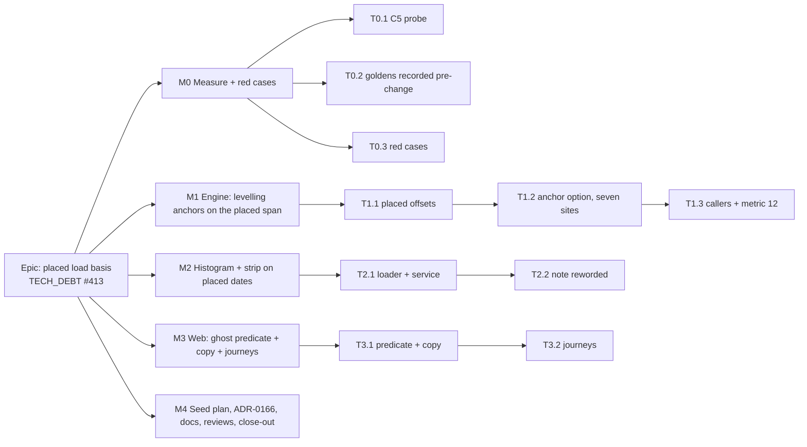

# Implementation Plan: Resource load and levelling start where the bar is drawn

- **Feature spec:** [`./feature-spec.md`](./feature-spec.md)
- **Status:** Approved — by the product owner, 2026-09-30. Q1: **(c)** — the levelled ghost now; a
  separate "Apply levelled dates" command later, under its own spec. Q2: **no** — metric 12 stays
  network-anchored. Q3–Q6: defaults accepted. M0's suspected completion-carrier defect: **check it
  first, then stop for a decision** if it is real.
- **Owner:** api (engine + schedule module), web (copy + ghost)

## Breakdown

### Epic

**Placed load basis.** The resource histogram, the canvas resource strip and resource levelling all work
from where each bar is drawn (product-owner decision, 2026-09-30). This finishes ADR-0148 for the
resource readers.

**Parity (ADR-0034):** `computeSchedule`'s network and placed outputs are byte-identical; two fields are
added. Gates A and B unchanged; Gate C added (spec §4.7). **Pen:** no new write; levelling still runs inside
the recalculation. **Flag:** none (ADR-0088 D1); the rollback is a commit boundary. **Schema:** none
(spec §4.4). If any task finds a reason to touch one, it stops and goes to `database-architect`
(CLAUDE.md §19.3).

**Release rule.** M1, M2 and M3 must all be on `main` before the next Version Packages PR is merged, so
the chart, levelling and the ghost change in one release (the product owner's "together"). Each
milestone keeps `main` releasable on its own. The only thing that goes wrong if a release cuts between
M1 and M3 is a ghost drawn on top of a placed, undelayed participant on levelled plans (spec §2, edge
cases), which is why the rule exists.

---

### Milestone M0: measure and red cases (no behaviour change)

**Outcome:** the one unverified premise (C5) is settled, and every golden that proves parity is recorded
against today's code.
**Entry point:** `Ships dark: tests and a measurement record only; M2 and M3 surface the change.`

> **T0.1 result, 2026-09-30: C5 is REAL.** An unplaced successor of a complete, in-progress or
> expected-finish predecessor is drawn 5-12 working days later than its early start. Filed as
> `docs/TECH_DEBT.md` #421, pinned by three `it.fails` cases in `compute.visual.spec.ts`, numbers in
> [`m0-measurement.md`](./m0-measurement.md). T0.2 and T0.3 are **paused** for the product owner's
> decision on #421.
>
> **Resolved 2026-09-30: fixed first, #421 is closed** (ADR-0148 Amendment 1). T0.2 and T0.3 can resume.

##### Task T0.1: probe C5 (Pass 2 after a progressed predecessor)

- **Description:** Add a case to `compute.visual.spec.ts`: an unplaced successor (FS) of (i) a complete
  activity, (ii) an in-progress one with remaining < duration, (iii) a not-started activity resized by an
  expected finish with `useExpectedFinishDates` on. Assert `visualEffectiveStart === earlyStart`. Also
  read `plan:capability-retained-logic`'s R3 (successor of the started R2, `progress.ts:139-153`) over the
  public activities read after seeding.
- **Complexity:** S
- **Dependencies:** none
- **Risks:** a fixture whose actuals coincide with the data date hides the defect (the lesson recorded at
  `placed-basis-parity.e2e-spec.ts:144-148`). Put the actuals before the data date and give the
  predecessor a duration longer than its remaining work.
- **Testing:** the case itself. Record the result in `docs/specs/placed-load-basis/m0-measurement.md`.
- **Development steps:**
  1. Write the case and run it.
  2. **If it passes:** keep it as an FC-11 extension. C5 is closed, and Gate C holds everywhere FC-11 does.
  3. **If it fails:** mark it `it.fails` with a pointer, file a `docs/TECH_DEBT.md` row ("Pass 2 propagates
     a progressed predecessor's full duration"), and **stop and ask the product owner** whether to fix it
     before M1. That fix changes `compute.ts` and is its own spec. It is not folded in here.

##### Task T0.2: record the goldens against today's code

- **Description:** H2 (the histogram, unplaced) and LV2 (metric 12 on a placed levelled plan) in
  `apps/api/test/schedule.e2e-spec.ts` or a new `placed-load-basis.e2e-spec.ts`. Record each whole
  response and commit it as a literal **before** any production change.
- **Complexity:** S
- **Dependencies:** T0.1 (H2's fixture excludes whatever class C5 finds)
- **Risks:** a golden written after M1/M2 proves nothing. test-engineer checks the commit order at M4.
- **Testing:** `scripts/e2e-local.sh api`.

##### Task T0.3: red cases

- **Description:** L1, L2, L3 (one case per C2 site), L4, L0 in `engine/level.spec.ts` and
  `compute.visual.spec.ts`; H1, H3, LV1 in the API e2e file. All exactly as spec §2 defines them.
- **Complexity:** S–M
- **Dependencies:** T0.2
- **Risks:** a fixture in which placed and early agree tests nothing. Every placed case first asserts
  that the placed and early starts differ (ADR-0093).
- **Testing:** run against today's code. Record the red numbers in the PR (ADR-0110 D5). L5, Gate A, Gate B
  and the conformance slices pass today and must still pass.
- **Development steps:** write → run red → commit with the M1/M2 code in the same PR (red tests alone
  would fail CI on `main`), or as `it.fails` flipped by M1/M2.

---

### Milestone M1: levelling anchors on the placed span

**Outcome:** on a levelled plan, levelling reads the bars as drawn. A clash the planner has separated by
hand is no longer reported, and a clash made by hand is.
**Entry point:** plan workspace → **View** → **Levelled placement** (the ghost), and the schedule summary's
**Levelled finish** / **Levelled activities** (`ScheduleSummaryStrip.tsx:143-144`). The ghost predicate
lands in M3 under the release rule above.
**Journey:** M3-T3.2, because the ghost is not correct on a placed plan until M3's predicate lands.

#### Feature F1: placed-anchored levelling

> **Description:** the engine emits placed offsets. `levelSchedule` takes a required `anchor` and moves
> all seven sites together.
> **Complexity:** M
> **Dependencies:** M0
> **Risks:** see tasks.
> **Testing requirements:** L0–L5 green; `level.parity.spec.ts` with no snapshot updated; S10 and
> `compute.spec.ts` unedited; LV1, LV2.

##### Task T1.1: placed offsets on `EngineResult`

- **Description:** add required `placedStartOffset`/`placedFinishOffset` to `EngineResult`
  (`engine/types.ts:258`), set in `compute.ts`'s results loop (`:900-960`) from the instants spec §4.6
  names. Update every hand-built `EngineResult` in specs and the conformance adapters; the compiler lists
  them.
- **Complexity:** S
- **Dependencies:** T0.1
- **Risks:**
  - An offset derived by a new expression, rather than from the instants the dates use, lets the two
    disagree. Use `vDisplayInst`, `vPlacedFinishInst`, `esInst` and `efInst` directly. L0 pins equality
    with the early offsets where nothing is placed.
  - A mutated expected value in an existing spec during the type update. Review every `*.spec.ts` diff for
    changed `expect` lines. There should be none, only added fields in fixtures.
- **Testing:** L0; `compute.spec.ts` untouched; `compute.visual.spec.ts` only gains cases.

##### Task T1.2: `levelSchedule` anchor, seven sites

- **Description:** `LevelingOptions.anchor: 'PLACED' | 'NETWORK'` (required, `types.ts:196`). One
  exhaustive switch at the top of `levelSchedule` (`level.ts:73`) selects the anchor accessors. Replace the
  seven sites in C2 through those accessors (spec §4.6 table). Rewrite the docblock (`:17-72`),
  `earliestFeasibleStart`'s docblock (`:410-439`) and `leveledDate` stays as it is.
- **Complexity:** M
- **Dependencies:** T1.1
- **Risks:**
  - One site left on early → L3's per-site case fails. Also run a mutation sweep: revert each site in turn
    and watch its case go red (ADR-0110 D5).
  - The priority change (Q5) reorders ties on placed plans only. L4 pins it. Gate B's corpus has no
    placement and shows it does not reorder unplaced plans.
  - Adding `remainingFloatMinutes` to `level.ts` is correct here. `float-basis.structural.spec.ts` guards
    the analyses (DCMA, float paths, variance, criticality) and does not list `level.ts`. Do **not** add it
    there, and say why in the ADR.
- **Testing:** L1–L5, Gate B corpus with no snapshot updated, `level.spec.ts`'s existing cases unedited
  (they are passed `anchor: 'NETWORK'` where they build options by hand; they must still pass unchanged).

##### Task T1.3: callers, and metric 12 (Q2)

- **Description:** `levelIfEnabled` (`level-if-enabled.ts:39-54`) takes and forwards the anchor.
  Recalculation (`schedule.service.ts:562`) passes `PLACED`. The critical-path test
  (`critical-path-test.ts:156`, `:198`) passes `NETWORK`. The conformance adapter
  (`conformance/adapter.ts:456-466`) passes `PLACED`. Correct the what-if's docblock at
  `schedule.service.ts:1057-1061` (C7). Update the OpenAPI descriptions for `leveledStart`,
  `leveledFinish`, `levelingDelayDays` (`activity-response.dto.ts:402-427`) and the summary's
  `leveledProjectFinish`.
- **Complexity:** S
- **Dependencies:** T1.2
- **Risks:** if Q2 is answered (b), the critical-path test passes `PLACED`, LV2 is replaced by a case
  that pins the new verdict, and `docs/API.md:1666-1669` says so. #406's throttle is unaffected either way.
- **Testing:** LV1, LV2 (`scripts/e2e-local.sh api`); S10 unedited; pairwise
  (`pnpm --filter @repo/api test:e2e:pairwise`), because the recalculation's write path runs a changed
  pass (TEST_PLAYBOOK tier 3).

---

### Milestone M2: the histogram and the strip count load where bars are drawn

**Outcome:** after a drag, the resource strip under the diagram and the histogram dialog show the load
in the weeks the bar now occupies.
**Entry point:** plan workspace → **Analysis** → **Resource histogram…** (`plan-actions-menu.tsx:90-91`),
and the canvas **Resource loading** strip (`resource-strip-panel.tsx:248`).
**Journey:** `apps/web/e2e-resource-view/resource-view.spec.ts`, extended in T3.2 (in this milestone's PR
if M3 lands separately).

##### Task T2.1: loader and service

- **Description:** `loadResourceHistogramAssignments` (`schedule.repository.ts:660-692`) selects
  `visualEffectiveStart`/`visualEffectiveFinish` beside `earlyStart`/`earlyFinish` (`:679`); widen
  `ResourceHistogramAssignmentRow`. In `getResourceHistogram` (`schedule.service.ts:1316-1330`), choose
  the pair per row: placed if both placed dates are non-null, else both early (spec US-1). Put that choice
  in one small pure helper beside `placedProjectFinishOf` (`placed-finish.ts:30-39`) so the pair rule
  has one owner. Rewrite the docblocks at `schedule.service.ts:1264-1274`, `schedule.repository.ts:653-659`
  and `engine/resource-histogram.ts:7-16`, `:112-115` to say "the span the bar is drawn on".
- **Complexity:** S
- **Dependencies:** M0 (can proceed in parallel with M1, but lands under the release rule)
- **Risks:**
  - A fallback per **field** mixes bases (placed start with early finish). H3 sets one of the two nulls
    and asserts the pair fell back together.
  - The recalc → histogram invalidation (`use-schedule.ts:88-92`) is assumed for the drag path. Verify in
    T3.2's journey that the strip changes after a drag without a manual refresh.
- **Testing:** H1 red → green, H2 equal, H3; `resource-histogram.spec.ts` and the conformance slice
  unedited.

##### Task T2.2: the note (Q4)

- **Description:** `RESOURCE_LOAD_BASIS_NOTE` (`ResourceHistogram.tsx:36-44`) becomes "Load is counted
  where each bar is drawn." Its docblock records #413's close and says the sentence may be removed at the
  next change to either surface. The `aria-describedby` wiring in both components stays.
- **Complexity:** XS
- **Dependencies:** T2.1
- **Testing:** `ResourceHistogram.test.tsx:262-263` and `resource-strip-panel.test.tsx:83-84` pass
  unedited (they import the constant).

---

### Milestone M3: the levelled ghost follows the drawn bar

**Outcome:** the Levelled placement lens draws a ghost only for bars levelling actually moved from where
they are drawn.
**Entry point:** plan workspace → **View** → **Levelled placement** checkbox
(`placement-overlays.spec.ts:47`).
**Journey:** `apps/web/e2e-workspace-chrome/placement-overlays.spec.ts`, extended in T3.2.

##### Task T3.1: predicate and copy

- **Description:** `LevellableActivity` (`lenses.ts:429-436`) replaces `earlyStart` with
  `visualEffectiveStart`. The predicate (`:466`) becomes `leveledStart === visualEffectiveStart → skip`.
  Update the docblock (`:438-461`, which cites `level.ts:174` and changes with M1) and the call site
  (`TsldPanel.tsx:1308-1316`). `a11y.ts:503-510`: the docblock's reason for stating a date is now
  historical; the clause itself does not change. `ScheduleSummaryStrip.tsx:189-198`: "past their total
  float" → "past the float left from where their bars are drawn", and "Levelling delayed N activities" is
  unchanged.
- **Complexity:** S
- **Dependencies:** M1 (for meaning; it compiles without it)
- **Risks:** a stale web bundle (spec §2). Covered by the release rule.
- **Testing:** `levelled-ghosts.test.ts` and `lenses` cases for a placed undelayed participant (no ghost)
  and a placed delayed one (ghost); `ScheduleSummaryStrip` test for the copy. **accessibility-reviewer**
  is not required: no keyboard contract or focus behaviour changes (ADR-0111).

##### Task T3.2: journeys (ADR-0081)

- **Description:**
  - `e2e-resource-view/resource-view.spec.ts`: create a resourced activity with a placement through the
    API, recalculate, reveal **Resource loading**, open **Show data table**, and assert the units sit in
    the placed week's bucket. Then place it again through the canvas or API and assert the table changes
    without a reload.
  - `e2e-workspace-chrome/placement-overlays.spec.ts`: a levelled plan with two lifts on a capacity-1
    crane, one placed clear of the other. **Levelled placement** is offered, draws nothing, and its
    status sentence says levelling moved nothing (the existing "levelling on, nothing moved" case's
    reading, now reached through a placement).
- **Complexity:** S
- **Dependencies:** T2.1, T3.1
- **Risks:** asserting on copy instead of cells. Assert on the table cells and the lens's own status text.
- **Testing:** `scripts/e2e-local.sh web:e2e-resource-view` and `web:e2e-workspace-chrome`. Run each once
  against pre-change code and see it fail. Keep the axe scans.

---

### Milestone M4: seed plan, ADR, docs, reviews, close-out

**Entry point:** none new (no behaviour change).

##### Task T4.1: seed plan

- **Description:** `levellingPlacedPlan()` in `apps/seed-cli/src/capabilities/resources.ts`, next to
  `levellingPlan()` (`:157-195`): the same three lifts and crane, with V3 placed after V2's levelled slot.
  Register it in `capabilities/index.ts`. Add a `docs/TEST_PLAYBOOK.md` row under "Resources, cost and
  earned value" (spec §2, "Seed catalogue", with its matched-pair "Wrong" column).
- **Complexity:** S
- **Dependencies:** M1, M2
- **Testing:** `pnpm check:playbook`; `coverage.spec.ts`; seed it locally and read V3 in the histogram
  and the lens.

##### Task T4.2: ADR-0166 and amendments

- **Description:** write ADR-0166 from spec §4.8. Add dated amendment notes to ADR-0041 (§1, §3, §7),
  ADR-0071, ADR-0044 §3, ADR-0035 §28 (first bullet: "at or after its anchor start") and §31 (first bullet),
  and a References line in ADR-0148 saying its `:225-226` sentence is true from this ADR. Add one line to
  CLAUDE.md §16 and update the stage banner's ADR count (165 → 166), which `pnpm check:counts` requires.
  `docs/API.md` `:1617-1629` and `:1661-1679`.
- **Complexity:** S
- **Dependencies:** spec approved (the ADR can then cite an `Approved` spec, `check:spec-status` S3)
- **Testing:** `pnpm prepush` (adr-coverage, counts, spec-status, doc-links, claims).

##### Task T4.3: reviews and register

- **Description:**
  - **api-reviewer:** meanings changed with shapes unchanged; OpenAPI text; the changeset's first sentence.
  - **test-engineer:** red-first order, goldens recorded before the change, every placed fixture asserting
    that placed and early differ, and the per-site L3 mutation sweep.
  - **backend-performance-reviewer:** only if the "two columns, no new pass" claim is disputed. Otherwise
    SC-6's read of the histogram p95 before and after on `scale-2000` is enough.
  - **component-reviewer:** the `LevellableActivity` shape change.
  - **security-reviewer:** not needed. Same routes, permissions and scopes, no new data class, the guest
    projection untouched.
  - `docs/TECH_DEBT.md`: close #413 with a pointer to this spec. File C5's row if T0.1 confirmed it.
  - Spec and plan headers → `Accepted — shipped (ADR-0166)` at release.
  - Changesets: `api` minor, `web` minor (spec §4.5).
- **Complexity:** S
- **Dependencies:** T4.1, T4.2
- **Testing:** `pnpm prepush` (debt-status, playbook, spec-status).

## Sequencing & slices

1. **M0** (one PR, tests plus a measurement note). If T0.1 finds C5 real, pause for the product owner's
   call before M1.
2. **M1** and **M2** in parallel PRs. Each is green and releasable alone.
3. **M3** after M1. Then the Version Packages PR can be merged (release rule).
4. **M4** last. T4.2 can be drafted as soon as the spec is approved.

Size: M0 **S–M**, M1 **M**, M2 **S**, M3 **S**, M4 **S–M**. Overall **M**, about four PRs.

## Definition of Done (per task)

Each task's PR meets the Feature Completion Criteria in [`docs/PROCESS.md`](../../PROCESS.md). "Tests"
means `pnpm prepush` was run, plus `scripts/e2e-local.sh api` for M0–M2 and M4-T4.1, and
`scripts/e2e-local.sh web:<suite>` for M3.

## Risks & assumptions (rollup)

| Risk / assumption                                                                                         | Likelihood | Impact | Mitigation                                                                                                         |
| --------------------------------------------------------------------------------------------------------- | ---------- | ------ | ------------------------------------------------------------------------------------------------------------------ |
| C5 is real: Pass 2 draws successors of progressed activities later than Pass 1, so "unplaced" plans shift | med        | high   | M0-T0.1 runs it first; a failing result stops the epic for a product-owner decision and gets its own row and spec. |
| One of the seven levelling sites left on early dates                                                      | med        | high   | L3's per-site cases and the mutation sweep.                                                                        |
| Goldens (H2, LV2) written after the change                                                                | med        | high   | T0.2 lands before any production change; test-engineer checks commit order.                                        |
| A release is cut between M1 and M3, so a ghost is drawn on top of a placed undelayed bar                  | low        | low    | The release rule; limited to levelled plans with a placement.                                                      |
| External consumers read `leveledStart`/`levelingDelayDays` or histogram buckets as early-date quantities  | low        | med    | `api` minor with the change in the changeset's first sentence.                                                     |
| Q2 answered (b): metric 12 FAILs placed levelled plans whose network is sound                             | —          | med    | Default (a); if (b), LV2 is rewritten to pin the new verdict and API.md states it.                                 |
| Priority by remaining float surprises a planner used to total-float ordering                              | low        | low    | Only placed plans; stated in ADR-0166 and the summary copy.                                                        |
| Deployed estate has few placed, resourced, levelled plans, so the change is invisible there               | high       | low    | The seed plan exhibits it; every release is reviewed by a person (CLAUDE.md §17).                                  |
