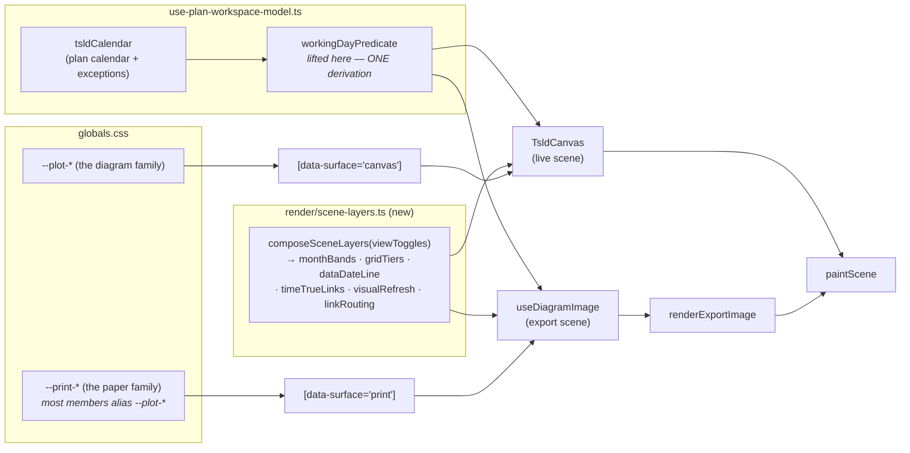
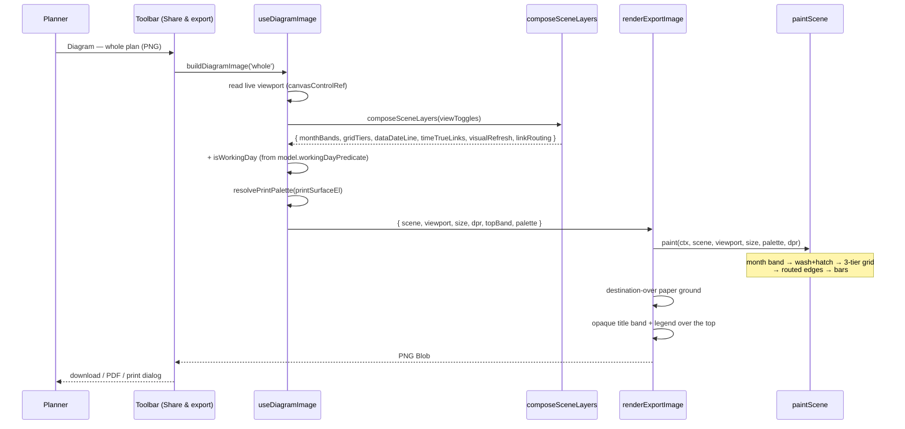
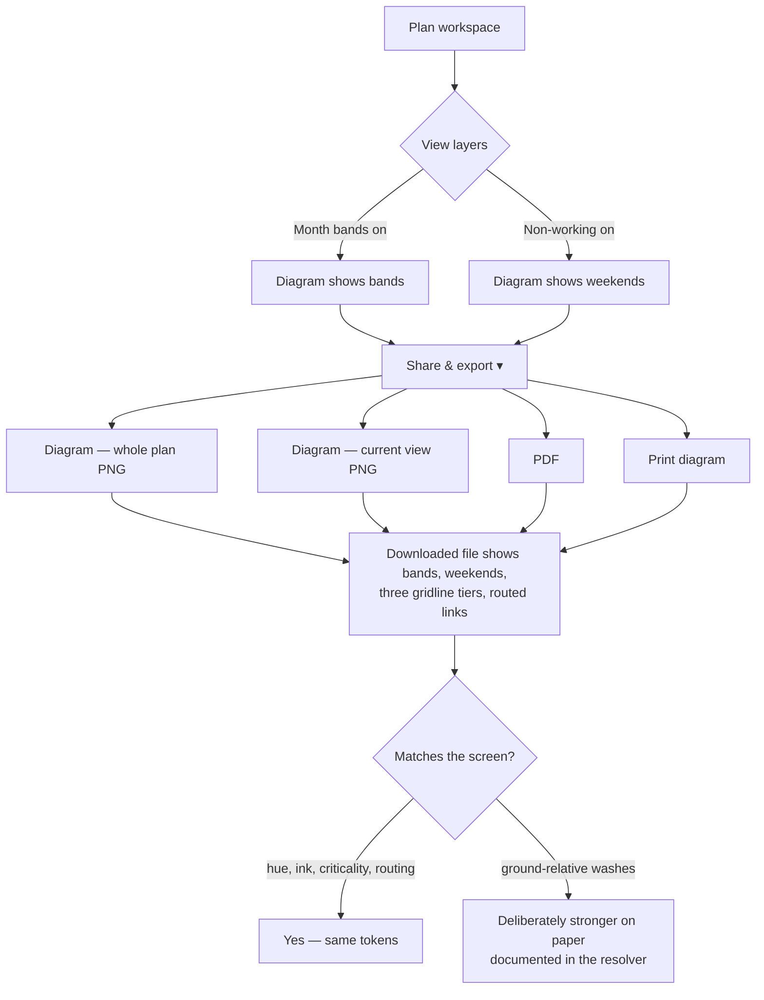

# Feature Spec: the exported diagram is the diagram

- **Status:** Draft — awaiting approval
- **Author(s):** feature-analyst
- **Date:** 2026-08-21
- **Tracking issue / epic:** post-theme consolidation (W1 · W2 · W3)
- **Roadmap link:** none — this is register work, not a roadmap theme
- **Related ADR(s):** amends **ADR-0055 §1** and **ADR-0097 D1** — it adds a **seventh** entry to
  `token-contrast.test.ts`'s `SCOPES` (`page`, `chrome`, `panel`, `brand`, `auth`, `canvas`, and now
  `print`) and a **fifth** to `token-architecture.test.ts`'s `FAMILIES`. Builds on ADR-0026,
  ADR-0052, ADR-0056, ADR-0065, ADR-0102. Closes `docs/TECH_DEBT.md` **#163** and **#164**.
  An ADR **is** required — see §4.7.

---

## 0. What this document covers, and what it deliberately does not

The brief describes a programme of three items. **Only W3 is a feature**, and this spec covers only
W3. That is a scoping statement rather than a hedge, and the reason is worth writing down because
the alternative — padding all three into a spec shape — is how a spec stops being read:

| Item                                    | What it is                                                                                                     | Why it is not in this spec                                                                                                                                                                                                                                             |
| --------------------------------------- | -------------------------------------------------------------------------------------------------------------- | ---------------------------------------------------------------------------------------------------------------------------------------------------------------------------------------------------------------------------------------------------------------------- |
| **W1** — photograph five unseen screens | **Investigation.** It runs an existing instrument over five routes and files what it sees.                     | It has no user story, no acceptance criteria, no permissions and no schema. Stages 1–4 would be five empty tables. The product owner's decision is _catalogue, then choose_ — so its output is register rows, and the work it may generate is specified after it runs. |
| **W2** — narrow reconciliation pass     | **Process**, with a runbook of its own (`docs/RECONCILE.md`) and a numbered procedure this spec must not fork. | Writing a Feature Spec for a reconciliation pass would create a second, thinner description of a document that already exists and is authoritative. `docs/PROCESS.md` §"Repository maintenance" names the runbook, not a spec.                                         |
| **W3** — the exported diagram's layers  | **A product change**, with a defect, a user, an artefact, tokens, gates and a rollback story.                  | —                                                                                                                                                                                                                                                                      |

All three appear in the **implementation plan** beside this file, which is where a plan belongs.

---

## 1. Business understanding

### Problem

**The picture SchedulePoint hands to a client is not the picture SchedulePoint draws.**

`docs/TECH_DEBT.md` #164 records that the export's scene sets neither `monthBands` nor
`isWorkingDay`, so the exported PNG/PDF and the printed diagram have never shown weekends or month
banding. That is true. **It is also an understatement, and the size of the understatement is this
spec's headline finding.**

`TsldCanvas.tsx:850-890` composes a `TsldScene` with **22 keys**. `use-diagram-image.ts:85-97`
composes one with **six**. Seven of the difference are deliberately screen-only (`selectedId`,
`selectedIds`, `showEdgeHandles`, `hoverId`, `lagHandles`, `activeLagId`, `gestureSourceId` — a
selection ring and a drag ghost have no business in a deliverable). The rest are not:

| Scene key omitted by the export | What it draws                                                 | Gate on the screen                               | Evidence                                                                           |
| ------------------------------- | ------------------------------------------------------------- | ------------------------------------------------ | ---------------------------------------------------------------------------------- |
| `isWorkingDay`                  | The non-working (weekend / holiday) column wash + its hatch   | `toggles.nonWorking`, default **on**             | `paint.ts:832`; `TsldCanvas.tsx:858`                                               |
| `monthBands`                    | The alternating month band — the diagram's own ground         | `VITE_CANVAS_VISUAL_LANGUAGE`, **on** 2026-07-26 | `paint.ts:813`; `TsldCanvas.tsx:844,861`; `env.ts:824-828`                         |
| `gridTiers`                     | The **three-tier** day / month / year gridline ladder         | `VITE_CANVAS_TIME_AXIS`, **on** 2026-07-27       | `paint.ts:849` vs the `else` at `:879-895`; `TsldCanvas.tsx:865`; `env.ts:845-847` |
| `timeTrueLinks`                 | Time-true GPM lag anchoring **and directional arrowheads**    | `VITE_CANVAS_DIRECT_MANIPULATION`, **on** 07-25  | `paint.ts:916-918`; `TsldCanvas.tsx:873`; `env.ts:756-760`                         |
| `visualRefresh`                 | The ADR-0052 M4 bar visual refresh                            | same flag                                        | `TsldCanvas.tsx:876`                                                               |
| `linkRouting`                   | Obstacle-aware orthogonal corridors that step **around** bars | `VITE_CANVAS_LINK_ROUTING`, **on** 2026-07-31    | `TsldCanvas.tsx:880`; `env.ts:1012-1013`                                           |

Every one of those flags is default-on and, per ADR-0088 D1, **unreachable** — a published image
carries every flag at its default, so there is no configuration in which a planner sees the legacy
picture on screen. The export therefore does not render an old option; it renders a picture
**nobody can see anywhere else**, and has done since 2026-07-31 at the latest.

The sharpest instance is `linkRouting`. ADR-0065 exists because "a line drawn straight through an
unrelated bar makes the reader disprove a relationship the picture appears to assert, which is the
opposite of what a TSLD is for". That epic shipped, was measured, was enabled, and **is absent from
the one artefact a planner sends to somebody who was not in the room.** The defect ADR-0065 was
written to remove is live, today, in the deliverable.

**Why now.** Three reasons, in order of weight:

1. `docs/TECH_DEBT.md` **#158 closed today** by giving paper its own light ground. That closure
   makes the four print palette fields (`nonWorking`, `nonWorkingHatch`, `monthBand`,
   `gridLineDay`) _correct and still unread_ — the gate's own docblock says so
   (`print-palette.structural.test.ts:139-143`). A gate guarding fields nothing draws is a gate
   waiting to be deleted by someone who checks whether it matters.
2. #158's fix also **changed the ground under these layers** from `--canvas` (`oklch(0.958)`) to
   `--print-ground` (`oklch(1 0 0)`). Turning the layers on without deriving paper values would
   inherit a relationship that no longer holds — see §4.3, where the month band's **polarity
   inverts**.
3. The artefact is now photographed (`shoot.mjs:403`, `export-diagram`), so for the first time
   there is an instrument that can prove the fix and, more importantly, prove a regression.

### The brief's own reason is stale, and is corrected here rather than carried

The brief states the reason for _print-tuned, not screen-matched_ as: reusing screen values "would
put a known-too-loud treatment onto the deliverable", citing ADR-0101's record of the weekend hatch
measuring ~9:1 on a light ground.

**That is no longer true, and the file that fixed it says so in as many words.**
`globals.css:515-525` records the hatch being **inverted for the light ground** during ADR-0102 —
"Carried onto a 0.965 wash that same near-black ink is a 9:1 step, and the screenshot showed
it… 0.925 restores the dark theme's own step". The shipped value is `oklch(0.925 0.006 252)`, and
on true-white paper it measures **1.25:1** (derivation in §4.3). The too-loud treatment was
removed yesterday.

**The decision survives, on better evidence.** Three measured facts justify paper-specific values
independently of the stale one, and they are in §4.3: the month band **inverts polarity** against
white paper; the non-working wash gains **5× its screen separation**; and a 3.5 % wash is at the
edge of what a printer renders as anything at all. This is ADR-0076 Class 3 — a decision-bearing
claim inherited from a brief, checked, found false, and the decision re-grounded rather than
rubber-stamped. Two of the last four specs in this repository carried exactly this failure into
three artefacts each; this one did not.

### A second brief claim, corrected

The brief says "the exported PNG/PDF and the **printed programme** have never shown weekends or
month banding". Three artefacts are affected and the printed programme is **not one of them**:

- `exportDiagramPng` (`use-tsld-toolbar-context.tsx:606-607`) — the PNG download
- `exportDiagramPdf` (`:638-640`) — the PDF
- `printDiagram` (`:680,705`) — the printed **diagram** (`PrintSurface`)

All three call the same `buildDiagramImage`. The printed **programme** is the Gantt
(`GanttPrintSurface.tsx`, ADR-0059 M4) — a DOM table that contains no month-band or non-working
concept at any point (`grep -i 'nonWorking|weekend|monthBand'` returns nothing in that file), so
it has not lost anything and #164 does not reach it. Whether it _should_ gain weekend shading is
**CQ-3**.

### Users

| Role                                           | What they need                                                                                                                                                    |
| ---------------------------------------------- | ----------------------------------------------------------------------------------------------------------------------------------------------------------------- |
| **Planner** (`PLANNER`, `ORG_ADMIN`)           | To hand over a picture that matches the one they built the plan in — so a question about it can be answered from the sheet rather than from a shared screen.      |
| **Contributor / Viewer**                       | Same artefact, read-only. Export is not pen-gated; it reads persisted state.                                                                                      |
| **The recipient** (QS, client, sub-contractor) | To read a printed programme and see which days are not worked. On a construction programme, "does that fortnight contain two weekends or three?" is the question. |
| **External Guest** (ADR-0051)                  | **Unaffected**, and deliberately: the guest view has no export. Noted so nobody reads a scope boundary as an oversight.                                           |

### Primary use cases

1. Export the whole plan as a PNG and drop it into a progress report.
2. Export as PDF for a client pack.
3. Print the diagram directly.

In all three the planner's expectation is the same and is not currently met: **what I see is what
I send.**

### User journeys

**Happy path.** Planner opens a plan → the diagram shows banded months, hatched weekends,
three-tier gridlines and links that route around bars → `Share & export ▾ → Diagram — whole plan
(PNG)` → the downloaded file shows the same four things, on paper-derived values.

**Alternate — layers turned off.** The planner has switched `View ▾ ▸ Structure ▸ Month bands` off
and `Non-working` off. The export omits both, because the export reads the same `viewToggles` the
canvas does (`use-diagram-image.ts:88` already passes `view: viewToggles`). The picture continues
to be the planner's picture, not a fixed one.

**Alternate — no calendar.** The plan has no calendar bound, so `model.tsldCalendar` is null and
there is no working-day predicate. The wash is absent from screen and export alike. Not an error.

**Alternate — a long programme.** A whole-plan export of a multi-year programme falls below
`NON_WORKING_MIN_PX = 3` (`paint.ts:98`) and the wash is culled, exactly as it is on screen at the
same scale. The month band has no such threshold and still paints. See **CQ-2**.

### Expected outcomes

- The exported/printed diagram stops being a different picture from the screen.
- Four print palette fields stop being gated-but-unreachable; three more (`gridLineDay`,
  `gridLineMonth`, `gridLineYear`) start being read for the first time.
- `docs/TECH_DEBT.md` #163 and #164 close.
- The recurrence is closed **structurally**: the two scene compositions become one derivation, so
  the next default-on layer cannot reach the screen and miss the deliverable.

### Success criteria

| #   | Criterion                                                                                                     | How it is measured                                                          |
| --- | ------------------------------------------------------------------------------------------------------------- | --------------------------------------------------------------------------- |
| 1   | A weekend column in the exported PNG is not paper-white, and matches the paper wash within tolerance.         | Pixel assertion on the downloaded artefact, in Chromium (§4.8 gate 2).      |
| 2   | Two adjacent months in the exported PNG differ.                                                               | Same.                                                                       |
| 3   | The month, day and year gridline tiers are distinguishable in the artefact.                                   | Same, sampling three known boundary columns.                                |
| 4   | Milestone 1 changes **no pixel** of the artefact.                                                             | Same-session before/after pixel diff of `export-diagram.png` (§4.8 gate 3). |
| 5   | Every paper mark clears its WCAG floor against both paper grounds (white paper **and** the paper month band). | `print-palette.structural.test.ts`, extended (§4.8 gate 1).                 |
| 6   | A layer key added to the canvas scene and not to the export fails the build.                                  | The shared composer + its structural test (§4.5).                           |

### Open questions

Marked **CRITICAL** where a different answer means materially different work. Everything else
carries a stated default and is not asked.

- **CQ-1 (CRITICAL) — budget: extend the trio, or build the print scope?** §4.6 recommends the
  scope. Trio-extension is ~S and grows the exact truncated family #163 filed; the scope is ~M,
  closes #163, and rewrites two gate assertions. **Default if unanswered: build the scope**, sliced
  so M1 is a provable no-op.
- **CQ-2 (CRITICAL) — the LOD threshold on paper.** `NON_WORKING_MIN_PX = 3` is a _CSS-pixel_
  threshold. Paper is rasterised at `devicePixelRatio` and printed at 300 dpi, so 3 CSS px is 6+
  device px and legible where a screen's is not. Do we give the export a lower threshold? That
  means a print-aware parameter in the **shared painter**, which every screen frame then carries.
  **Default: no — one painter, one rule.** A whole-plan export of a long programme shows no
  weekend wash, the same way the screen does not at that zoom, and a planner who wants them
  exports the current view.
- **CQ-3 (CRITICAL) — the printed Gantt programme.** It has never had weekend shading or month
  banding and #164 does not cover it. The brief's wording suggests it may be wanted.
  **Default: out of scope**, filed as a register row. Including it roughly doubles the epic and is
  a DOM/CSS problem with no shared code.
- CQ-4 — polarity. On paper the month band becomes _darker_ than the ground where on screen it is
  _lighter_ (§4.3). **Default: accept it.** Alternating banding carries no polarity meaning, and
  light-grey bands on white is the printed convention. The alternative — an off-white paper ground
  — reverses a decision made yesterday (`globals.css:486-489`, "Ground is TRUE white because that
  is what paper is") for no reader benefit.
- CQ-5 — should the Colour-by lens (`barFill`/`barInk`), the baseline ghosts and the conflict flags
  also reach the export? **Default: not in this epic.** They are a larger question about what an
  export _is_, three of them are lenses rather than ground, and folding them in would make M2
  unfalsifiable. Filed as a register row with this spec's enumeration attached, which is the
  durable part.
- CQ-6 — a feature flag? **Default: none.** ADR-0088 D1 established that a `VITE_` constant is
  inlined at build time and is not an operator rollback; ADR-0098 and ADR-0102 both shipped
  unflagged for that reason. The rollback is a commit boundary, and M1/M2 are separately
  revertible.

---

## 2. Functional requirements

### User stories & acceptance criteria

> **US-1** — As a **planner**, I want the diagram I export to show the same non-working days,
> month bands and gridlines as the diagram on screen, so that the sheet I hand over answers
> questions instead of raising them.
>
> **Acceptance criteria**
>
> - **Given** a plan with a working-day calendar and `View ▾ ▸ Non-working` on **when** I export
>   the whole plan as PNG **then** the Saturday and Sunday columns are shaded with the paper wash
>   and its hatch, and are visually distinct from a working column.
> - **Given** the same plan **when** I export **then** consecutive calendar months are drawn on
>   alternating grounds, with the parity taken from the absolute month ordinal (so the same month
>   is banded the same way in every export of that plan).
> - **Given** the same plan **when** I export **then** day, month and year gridlines are drawn at
>   their three distinct weights and colours, not as one undifferentiated tier.
> - **Given** the same plan **when** I export **then** dependency links route around intervening
>   bars and carry directional arrowheads, as they do on screen.
> - **Given** a plan whose calendar is not bound **when** I export **then** no wash is drawn and
>   nothing errors.

> **US-2** — As a **planner**, I want the exported picture to respect the layers I turned off, so
> that the export is my picture rather than a fixed one.
>
> **Acceptance criteria**
>
> - **Given** `Month bands` off **when** I export **then** the picture has no bands.
> - **Given** `Non-working` off **when** I export **then** the picture has no wash, calendar or no
>   calendar.
> - **Given** both off **when** I export **then** the picture is byte-identical to today's export
>   for those two layers. _(This is the honest form of the parity claim: `gridTiers`,
>   `timeTrueLinks`, `visualRefresh` and `linkRouting` have **no** user toggle — they are
>   build-time flags — so turning them on in the export is unconditional and there is no off-state
>   to preserve.)_

> **US-3** — As a **recipient**, I want weekends legible on a printed sheet, so that I can count
> working days without a calendar beside me.
>
> **Acceptance criteria**
>
> - **Given** the printed diagram at A3 **then** a non-working column is distinguishable from a
>   working one at normal reading distance, and from the month band it may sit on.
> - **Given** the same sheet **then** the wash is not the loudest thing on it — the bars are.

> **US-4** — As a **maintainer**, I want a default-on canvas layer to be unable to reach the screen
> without reaching the deliverable, so that this defect class does not recur.
>
> **Acceptance criteria**
>
> - **Given** a new flag-derived scene key added to `TsldCanvas`'s composition **when** the export's
>   composition is not updated **then** the build fails with a message naming the key.

### Workflows

**Export (unchanged control flow, changed inputs).**

1. Planner picks `Share & export ▾ → Diagram — whole plan (PNG)`.
2. `buildDiagramImage(extent)` reads the live viewport, derives the export viewport, and composes
   the scene — **now via the shared layer composer, and now carrying the working-day predicate the
   canvas is using.**
3. `resolvePrintPalette` resolves against a **print-scoped** element (§4.6).
4. `renderExportImage` paints, lays the paper ground with `destination-over`, then paints the
   opaque title band over the top.
5. Blob → download / PDF / print.

**One ordering fact that matters and is already correct.** `paintScene` paints the month band and
the wash across the full canvas height including the reserved title strip
(`paint.ts:822,842` — `0 … size.height`). `drawTitleBand` then fills that strip opaquely with
`palette.ground` (`render-export-image.ts:169-171`). So the title band is protected, and no change
is needed there. Established by reading the composition order, not assumed.

### Edge cases

| Case                                                     | Expected behaviour                                                                                                                                                                                  |
| -------------------------------------------------------- | --------------------------------------------------------------------------------------------------------------------------------------------------------------------------------------------------- |
| No plan calendar                                         | No wash. Bands and grid tiers still paint. No error.                                                                                                                                                |
| Calendar still loading when export fires                 | Same as no calendar for that one export. `model.tsldCalendar` is query-backed; the export is a callback, so it takes whatever is resolved. Acceptable, and identical to the canvas's own behaviour. |
| `pxPerDay < 3` on a whole-plan export                    | Wash culled (`paint.ts:832`). Bands and grid still paint. See CQ-2.                                                                                                                                 |
| `pxPerDay < 6`                                           | Day tier culled (`paint.ts:872`), month and year tiers still drawn. Matches the screen.                                                                                                             |
| Every column non-working (a calendar with an empty week) | The whole picture is washed. Correct, and the same on screen. Authorable since ADR-0067.                                                                                                            |
| `scaledToFit` raster clamp                               | The wash and bands scale with everything else; the `dpr` transform is set once by `paintScene`.                                                                                                     |
| WBS band on                                              | `paintWbsBand` clears its own strip before the ground is laid (`render-export-image.ts:129-146`); the wash/band painted under it is removed with everything else. No change.                        |
| `createPattern` unavailable in the export canvas         | `paint.ts:837-839` already falls back to the flat wash. The fillRect count is identical either way.                                                                                                 |
| Export fired with the minimap panel open                 | Irrelevant — the minimap is DOM, and the export builds its own off-screen canvas.                                                                                                                   |
| Guest share view                                         | No export path exists. Untouched.                                                                                                                                                                   |

### Permissions

**No permission change.** Export reads persisted plan state on the client from data the caller has
already been authorised to read; it is not pen-gated (ADR-0028 gates _writes_), makes no request,
and calls no engine. The RBAC surface (ADR-0012) is untouched, and the org-scope of the underlying
reads is unchanged because no read is added.

### Validation rules

None. No user input, no DTO, no form. The only new _values_ are CSS tokens, validated by
`token-architecture.test.ts` and `token-contrast.test.ts` at build time.

### Error scenarios

| Scenario                                         | Detection                                                                                                                                      | User-facing result                          | Status |
| ------------------------------------------------ | ---------------------------------------------------------------------------------------------------------------------------------------------- | ------------------------------------------- | ------ |
| 2D context unavailable for the off-screen canvas | `renderExportImage:121-122`                                                                                                                    | Existing user-safe export error. Unchanged. | n/a    |
| A print token resolves empty in the browser      | Falls back to the literal in `PRINT_TOKEN_SOURCES`; **the fallback is pinned to the live token** by `print-palette.structural.test.ts:178-197` | Correct colour, silently                    | n/a    |
| The print-scoped element is missing from the DOM | **Build-time**, not runtime — see the D3 risk in §4.7                                                                                          | n/a                                         | n/a    |

---

## 3. Technical analysis

| Area           | Impact   | Notes                                                                                                                                                                                                                 |
| -------------- | -------- | --------------------------------------------------------------------------------------------------------------------------------------------------------------------------------------------------------------------- |
| Frontend       | **med**  | One shared scene-layer composer; one prop threaded from `plan-workspace-toolbar` to `useDiagramImage`; a seventh `SurfaceTone`; a `[data-surface="print"]` block and a `--print-*` family in `globals.css`.           |
| Backend        | **none** | No module, service or endpoint.                                                                                                                                                                                       |
| Database       | **none** | No model, column, index, constraint or migration. **The database-architect agent is therefore not engaged, because there is no schema change to design** — not because one was judged too small (CLAUDE.md §19.3).    |
| API            | **none** | No endpoint, no DTO, no OpenAPI change.                                                                                                                                                                               |
| Security       | **none** | No new input, no new request, no new surface. Export remains client-side over already-authorised data.                                                                                                                |
| Performance    | **low**  | Three extra painter layers on an **off-screen, one-shot** canvas. The live per-frame budget (ADR-0026 §16 / TECH_DEBT #75) is untouched: `renderExportImage` allocates its own canvas and never touches the live one. |
| Infrastructure | **none** | No service, env var, container or CI service change. One new CI step if a dedicated journey config is added (see the plan).                                                                                           |
| Observability  | **none** | No log, metric or trace.                                                                                                                                                                                              |
| Testing        | **high** | This is where the work is. Three gate layers, §4.8 — and the middle one is the only one that could have caught the defect.                                                                                            |

**The CPM engine is not imported and no migration runs**, so the ADR-0034 recalculation parity gate
is untouched by construction. In its honest form: there is nothing here to hold parity _for_.

### Dependencies

- **Must land first:** nothing in code. **But** `docs/DESIGN_SYSTEM.md` §"The palette (Graphite)"
  is live-wrong — it quotes `--page-background: oklch(0.177 0.011 260.6)` at `:227-228` against a
  shipped `oklch(0.982 0.002 248)` (`globals.css:556`), and lines 15/39/41 still call light and
  dark "first-class". That is the governing document for colour, and an implementer deriving paper
  values from it would derive them against a dark ground. **A one-commit correction of that file
  should precede M2** — it is the narrow slice of W2 that W3 depends on.
- **Affected features:** the TSLD export commands; the printed diagram; the screenshot harness.
- **Not affected:** the Gantt printed programme (CQ-3), the guest share view, the CSV export, the
  interchange export.
- **Third parties:** none.

---

## 4. Solution design

### 4.1 Architecture overview

Two seams, and each closes one half of the defect:

- **The composer** closes the _behaviour_ half. Two hand-written scene compositions is why six
  layers diverged; one derivation with two callers is the ADR-0063 `wbs-band-source.ts` /
  ADR-0065 `routeOrthogonal` argument applied here — two implementations drift, and the drift is
  invisible because each looks right alone.
- **The print scope** closes the _value_ half, and closes #163 while doing it.

### 4.2 Data flow

### 4.3 The paper values — measured, not chosen

Derived by hand from `globals.css` using the same relative-luminance path
`@/test/colour` uses, and cross-checked against that file's own stated figures: my method
reproduces its "1.13:1 on the wash, 1.10:1 on the ground" for the hatch exactly
(`globals.css:520-521`), which is the reason to trust the rest. **M2-T1 re-derives every figure
below with `@/test/colour` and the gate carries them; these are the design input, not the record.**

| Token                        | Value                    | On screen (ground `--canvas` 0.958) | On paper (`--print-ground` 1.000)  |
| ---------------------------- | ------------------------ | ----------------------------------- | ---------------------------------- |
| `--canvas-band` (month band) | `oklch(0.976 0.003 250)` | ΔL **+0.018** — band is **lighter** | ΔL **−0.024** — band is **darker** |
| `--muted` (non-working wash) | `oklch(0.965 0.002 248)` | ΔL **+0.007**, ~1.02:1              | ΔL **−0.035**, ~1.11:1 (**5×**)    |
| `--canvas-nonworking-hatch`  | `oklch(0.925 0.006 252)` | 1.10:1 on ground, 1.13:1 on wash    | **1.25:1** on paper                |
| `--canvas-grid-day`          | `oklch(0.905 0.004 250)` | ~1.18:1                             | ~1.33:1                            |
| `--canvas-grid-month`        | `oklch(0.568 0.012 254)` | 3.25:1 (gated ≥ 3)                  | ~4.50:1                            |
| `--canvas-grid-year`         | `oklch(0.48 0.014 256)`  | 3.05:1 (gated ≥ 3)                  | ~6.54:1                            |

**Three findings, and they are the design.**

1. **The month band inverts polarity.** On screen it is lighter than the ground; on white paper it
   is darker. This is precisely ADR-0097's completeness rule — _"the defect is a **pair** whose two
   halves are governed by different scopes"_ — and #158's split created it: the ground moved to
   `--print-*`, the band did not. `print-palette.structural.test.ts:132-153` already gates the
   band as "a tint of paper" (a _lightness floor_), which is satisfied by both polarities and
   therefore cannot see this. **This is the strongest single argument for paper-derived values**,
   and it is a fact about the code rather than a preference.
2. **The wash gains 5× its screen separation** — #164's own note, and its own words are "probably
   right for print but a deliberate divergence rather than parity". Confirmed by the arithmetic
   above. Paper wants more separation than a lit screen, so this is the right direction; it should
   be a _chosen_ number rather than a number the ground flip produced.
3. **The hatch is now gentle, not loud** (1.25:1). The brief's stated fear is stale. If anything
   the risk on paper is the opposite — a 3.5 % wash and a 7 % hatch are near the floor of what a
   printer resolves at all, and a laser printer's halftone may drop them.

**Proposed paper values** (M2-T1 derives and gates them; these are the starting point, and the
`--print-*` family is where they live):

| Field                 | Proposal                                    | Reason                                                                                                                   |
| --------------------- | ------------------------------------------- | ------------------------------------------------------------------------------------------------------------------------ |
| `--print-muted`       | ≈ `oklch(0.955)` (wash)                     | Restores roughly the screen's _ratio_ on the new ground rather than its _value_, and lifts it clear of a halftone floor. |
| `--print-canvas-band` | ≈ `oklch(0.982)`                            | Keeps the band a genuine third value between paper and wash, with the ordering paper > band > wash on paper.             |
| hatch                 | keep at ≈ 1.25:1 relative to the paper wash | Already correct; do not amplify. ADR-0056 F7a's job is "a different **kind** of surface", not a louder one.              |
| `gridLineDay`         | alias `--plot-*`                            | 1.33:1 on paper is a rhythm, which is what the day tier is for (`token-contrast.test.ts:279-282`).                       |
| everything else       | alias `--plot-*`                            | "A printed diagram cannot drift from the one on screen" holds by construction for every aliasing member.                 |

### 4.4 User flow

### 4.5 Component changes

| Change                                                                                   | Where                                                             | Note                                                                                                                                                                                        |
| ---------------------------------------------------------------------------------------- | ----------------------------------------------------------------- | ------------------------------------------------------------------------------------------------------------------------------------------------------------------------------------------- |
| **New:** `composeSceneLayers(viewToggles)`                                               | `features/tsld/render/scene-layers.ts`                            | Pure. Returns the six flag-derived keys. Consumed by `TsldCanvas.tsx:850,940` and `use-diagram-image.ts:85`.                                                                                |
| **New:** structural test asserting neither consumer composes a layer key by hand         | `render/scene-layers.structural.test.ts`                          | Reads both files and fails on a literal `monthBands:` / `gridTiers:` / `timeTrueLinks:` / `visualRefresh:` / `linkRouting:` / `dataDateLine:` outside the composer. **Verified red first.** |
| **Lifted:** `workingDayPredicate`                                                        | `use-plan-workspace-model.ts` (beside `tsldCalendar`, `:425-436`) | Today it lives in `TsldPanel.tsx:1418-1421`. The export host (`plan-workspace-toolbar.tsx:279`) already has `model`; the canvas host already has `model.tsldCalendar`.                      |
| **Changed:** `TsldPanel` takes `workingDayPredicate` instead of deriving from `calendar` | `TsldPanel.tsx:386,1418`                                          | Two hosts: `plan-workspace-toolbar.tsx:671` passes `model.workingDayPredicate`; `GuestPlanView.tsx:245` calls `makeWorkingDayPredicate` itself (one line).                                  |
| **Changed:** `useDiagramImage` takes `isWorkingDay`                                      | `use-diagram-image.ts:32-44`                                      | Threaded through `useTsldToolbarContext`.                                                                                                                                                   |
| **New:** `SurfaceTone` gains `'print'`                                                   | `components/ui/surface.tsx:53`                                    | One union member. `RESET_TONES` unchanged.                                                                                                                                                  |
| **Changed:** `resolvePrintPalette` resolves against a print-scoped element               | `render/palette.ts:246`, `use-diagram-image.ts:111`               | See §4.6 D3.                                                                                                                                                                                |

**No new dialog, no new control, no new copy.** The entry points are the four existing export menu
items. That matters for ADR-0081: M2 claims user-facing capability through controls that already
exist, so the plan names them rather than inventing one.

### 4.6 The load-bearing design decision — where the paper values live

`docs/TECH_DEBT.md` #163 is the reason this is not obvious, and its argument is sound and is
adopted: `--print-ground` / `--print-ink` / `--print-muted-ink` were introduced as a "pack" on the
`--ground`/`--ground-end` precedent, and **the repository's own discriminator excludes them** —
`token-architecture.test.ts:110` states it verbatim, _"if the thing has a semantic sibling in the
base vocabulary, rebind it; if it does not, pack it"_ — and all three have exact siblings
(`--background`, `--foreground`, `--muted-foreground`). They are a surface family truncated to
three members: ADR-0055 §1's founding three-token header stub, one medium along.

**Option A — extend the trio to six** (`--print-nonworking`, `--print-nonworking-hatch`,
`--print-band`). Cheapest: three declarations and three entries in
`OUTSIDE_THE_CLOSURE.deferredScopes` (`token-architecture.test.ts:144`).
**Rejected.** It grows the exact stub #163 filed, from three members to six, and each growth makes
the next reader more likely to treat the stub as the pattern. The failure mode is named in that
row: latent only because the print document renders no `Badge`, no `text-muted-foreground` and no
footer — "one component away". Six members is not less of a trap than three; it is a bigger one
with more precedent behind it.

**Option B — build `[data-surface="print"]` as a full surface scope.** **Recommended.**

The shape that makes it affordable is already in this repository and already gated. ADR-0097
Landing E introduced the `canvas` scope by rebinding **every closure name onto the page's values**,
so arrival was byte-identical by construction, and gave it a value set of its own in a **separate
commit** — `token-architecture.test.ts:373-393` records exactly that reasoning. The same shape
here:

- Declare a `--print-*` family of all 31 closure members at `:root`.
- **Most members alias `--plot-*`** — so `resolvePrintPalette`'s standing promise, "a printed
  diagram cannot drift from the one on screen", holds _by construction_ for every aliasing member
  rather than by a hand-maintained token table.
- The handful that genuinely differ on paper (§4.3) are declared literally, are **enumerable**, and
  each carries its reason at the declaration.
- `[data-surface='print']` rebinds the closure onto `--print-*`, and `print` joins `FAMILIES` in
  `token-architecture.test.ts:61`, which is what makes completeness a gate rather than a promise.

**What it costs, stated rather than glossed:**

1. `print-palette.structural.test.ts:91-99` — "no surface scope rebinds a `--print-*` token" —
   **goes red by design**, because a `[data-surface='print']` block will contain `var(--print-*)`
   on the right-hand side and its regex matches either side. Its _intent_ ("paper is light by
   declaration") is preserved and sharpened: assert that `--print-background` is a **literal**
   light colour rather than an alias to `--page-*` or `--plot-*`.
2. Three of the `--print-*` names change spelling (`--print-ground` → `--print-background`,
   `--print-ink` → `--print-foreground`, `--print-muted-ink` → `--print-muted-foreground`) to join
   the family. `PrintSurface.css` and `GanttPrintSurface.css` read all three
   (`globals.css:478-479`), so both move in the same commit — which is exactly the property #158
   just bought and must not be spent.
3. `OUTSIDE_THE_CLOSURE.deferredScopes` is **deleted**, along with its 10-line justification. That
   is the right kind of deletion: the key exists to record a deferral, and the deferral ends.

**Option C — do the behaviour fix now with today's screen values and decide tokens later.**
**Rejected**, and named because it will be the tempting shortcut under time pressure. It ships the
polarity inversion of §4.3 into the deliverable, and #158's closing note is explicit that the
lesson of that row was the _shape_ of the fix rather than its numbers.

**The plumbing is not the blocker, and that was checked rather than assumed.** #163 records a
claim that the image export has no DOM node to carry the attribute, checked and found **false**:
`use-diagram-image.ts:111` resolves against a live attached element, and `lib/print-document.ts`
already creates and appends a real container. That row also records the claim being asserted before
it was checked, so it would not later be cited as evidence the scope is expensive. It is not being
cited that way here.

### 4.7 Implementation approach, alternatives, and the ADR

**Approach.** Two milestones, split so that the first is a **provable no-op on the artefact** and
the second is the single commit in which the picture changes:

- **M1 — the scope, dark.** The `--print-*` family (aliasing `--plot-*` throughout), the
  `[data-surface='print']` block, `SurfaceTone`, the print-scoped element,
  `resolvePrintPalette` resolving against it, and the two gate rewrites. **The four fields this
  changes the resolution path for are never read into a drawn pixel today** — established by #164's
  own sampling of the artefact, not inferred — so M1 must change nothing, and gate 3 proves it.
- **M2 — the picture.** The shared composer, the threaded predicate, the paper-derived values, the
  extended contrast assertions and the artefact journey.

That ordering is the point. The reverse (paint first, tune later) puts screen-tuned washes with an
inverted band polarity into a real deliverable for at least one release, on a host that auto-pulls
every release (ADR-0047) and where every release is reviewed by a person.

**Alternatives considered and rejected:**

| Alternative                                                                | Why not                                                                                                                                                                            |
| -------------------------------------------------------------------------- | ---------------------------------------------------------------------------------------------------------------------------------------------------------------------------------- |
| Add the two keys to `use-diagram-image.ts` and stop (the literal #164 fix) | Fixes two of six, leaves the composition duplicated, and the seventh layer added next quarter diverges the same way. It also ships the polarity inversion.                         |
| Reuse the live canvas's scene object instead of composing a second one     | The export needs a _different_ viewport, a different extent, no selection and no gesture state. Reusing it would couple the deliverable to transient interaction state.            |
| Freeze the print palette to literals                                       | Already rejected once, in #158's closing note, on measurement: the frozen literals paired white ink with the on-schedule fill at **3.56:1**. Freezing is the wrong _shape_ of fix. |
| A print-aware `NON_WORKING_MIN_PX`                                         | Puts a print parameter into the shared painter, which every live frame then carries. **CQ-2**; default is no.                                                                      |
| A `VITE_EXPORT_LAYERS` flag                                                | ADR-0088 D1: a `VITE_` constant is inlined at build time and is not an operator rollback. It would buy nothing and add a second product to maintain.                               |

**An ADR is required**, and for two reasons that are each sufficient:

1. It adds a **seventh surface scope** and deletes an `OUTSIDE_THE_CLOSURE` key — a change to the
   token architecture ADR-0055 §1 and ADR-0097 D1 govern.
2. It establishes a rule with reach beyond this epic: **an off-screen render of a shared painter
   composes its layers from the same derivation the on-screen one does.** That is the generalisable
   half, and it is the half that stops the recurrence.

Draft outline:

> **ADR-0103 — The deliverable is a surface, and its layers are composed once.**
> _Context:_ the export scene carried 6 of 22 keys; four default-on epics (ADR-0052, ADR-0056,
> ADR-0065, ADR-0055 §4) never reached the artefact; #158 split paper from diagram and created a
> pair governed by two scopes (the month band's polarity).
> _Decisions:_ **D1** one `composeSceneLayers`, two callers, structural gate. **D2** the working-day
> predicate is derived once by the workspace model and passed to both surfaces. **D3** `print`
> becomes a full surface scope whose members alias `--plot-*` except where paper genuinely differs;
> `deferredScopes` is deleted. **D4** paper values are derived against the paper ground and gated
> against **both** paper grounds. **D5** the gate that proves it is a pixel assertion on the
> downloaded artefact, because every unit suite runs in jsdom where `getComputedStyle` yields
> nothing and no canvas paints. **D6** the LOD thresholds stay the painter's (CQ-2). **D7** the
> Gantt printed programme is out of scope (CQ-3).
> _Consequences:_ #163 and #164 close; `resolvePrintPalette`'s "cannot drift" promise becomes
> structural rather than table-maintained; the export gains three painter layers on an off-screen
> canvas; a documented divergence (paper washes are stronger than screen washes) is recorded at the
> resolver rather than rediscovered from an artefact.

### 4.8 What proves it works

The defect existed because **unit suites run in jsdom and the artefact was never captured**. Any
gate that could have been green through this one is not the gate.

**Gate 1 — structural, cheap, prevents the value half.** Extend
`print-palette.structural.test.ts`:

- Rewrite `:91-99` for the print scope (see §4.6 cost 1).
- Rewrite the docblock at `:139-143`, which currently states the four wash fields are "gated but
  not currently reachable in the deliverable". After M2 that sentence is **false**, and leaving it
  would be a false comment created in the commit that removes the condition it describes — the
  defect class #158's own closing note records committing while removing it. It must move in the
  same commit.
- Add the **paper month band** as a second ground: today `:155-176` sweeps marks against
  `canvasGround` only, and after M2 half the picture's ground is the band. Assert month and year
  gridlines ≥ 3:1 against **both**, mirroring `PLOT_GROUNDS` (`token-contrast.test.ts:288-293`).
- Keep the day tier and the hatch **reported rather than asserted**, with the reason restated —
  the precedent at `token-contrast.test.ts:279-286`, and the reason a floor could never catch
  "too loud" anyway.

**Gate 2 — the artefact, in a real browser. This is the decisive one.** A Playwright journey that
downloads the PNG, decodes it (`createImageBitmap` + `OffscreenCanvas.getImageData`) and asserts
**pixel colours at computed coordinates**:

- a known non-working column is not paper-white, and is within tolerance of the paper wash;
- two adjacent months differ;
- a month-boundary column is darker than a day-boundary column;
- the title band is still paper.

**No stored golden image.** `render-export-image.ts:191` draws `Generated ${generatedAtIso}` into
the title band, so a committed golden rots daily and gets deleted rather than fixed (ADR-0058's
rule). Computed pixel assertions are date-independent and font-independent.

It must be **verified red against `main` first**, which is trivially available: #164 established by
sampling that every pixel outside a gridline or a bar is currently pure white.

**Gate 3 — M1's no-op proof.** Run `shoot.mjs --only export-diagram` before and after M1 **in the
same session** and pixel-diff. Same session because the title band carries the generation date; a
`sha256` across sessions reports "everything changed" for a milestone whose whole condition is
"nothing changed" — the ADR-0099 M2 finding, in a smaller radius.

**Gate 4 — the human instrument, already built.** `export-diagram` in `shoot.mjs` stays and is
looked at. ADR-0102 found two defects that only photographs could find; both of its instruments —
the contrast matrix and the axe scan — were green.

**What none of these cover, stated rather than implied:** none of them proves the artefact is
legible **on paper**. A halftone drops a 3.5 % wash where a screen shows it. The only instrument
for that is a printed sheet, and it should be printed once during M2 rather than reasoned about.

---

## 5. Links

- Implementation plan: [`./implementation-plan.md`](./implementation-plan.md) — covers **W1, W2 and
  W3**.
- Docs this change updates: `docs/TECH_DEBT.md` (#163, #164 close), `docs/DESIGN_SYSTEM.md`
  (the palette section, which is independently stale — see §3 Dependencies), `docs/adr/` (new ADR
  - `README.md` row + `CLAUDE.md` §16 entry + the banner count, in **one** commit —
    `scripts/check-counts.mjs` derives the ADR count from `docs/adr/`).

---

# Review amendments (2026-08-22)

**This section is authoritative where it contradicts the body above.** The body is kept as reviewed
rather than rewritten, because two of the corrections are to arguments the body makes well and one
is to its headline claim — and a clean file would hide that the strongest-sounding argument was the
weakest one.

Two specialist reviews, both blocking. Every figure below was recomputed independently through
`@/test/colour`, not taken from the body.

## A1 — The polarity finding is real, unfixable, and was NOT the strongest argument (blocking)

§4.3 finding 1 calls the month band's polarity inversion "the strongest single argument for
paper-derived values". **Struck.** `--print-ground` is `oklch(1 0 0)` — maximum lightness — so no
band value can be lighter than paper. The inversion is a mathematical consequence of the true-white
decision, not something paper-derived values can remedy, and the spec's own CQ-4 already accepts it
on the correct ground: an alternating band carries no polarity meaning, and light-grey bands on
white _is_ the printed convention. The two statements sat 250 lines apart in one document and
contradict each other.

The finding stays as an observation — it is real, it was created by #158's own fix, and a lightness
**floor** structurally cannot see it (verified: band luminance is Y = 0.930 under both polarities,
so `> 0.5` passes either way). The decision now rests on findings 2 and 3, which is where it always
belonged.

The ADR-0097 citation is also imprecise and is corrected: `--print-ground` and `--canvas-band` are
both `:root` pack tokens, so the split is of **intent**, not of scope. It becomes a genuine
ADR-0097 split pair only once §4.6's scope exists.

## A2 — The proposed band value is 25% weaker than the shipped one, and below this repo's own threshold (blocking)

|               | value          | ΔL vs paper | ratio    |
| ------------- | -------------- | ----------- | -------- |
| shipped       | `oklch(0.976)` | 0.024       | 1.0714:1 |
| proposed §4.6 | `oklch(0.982)` | 0.018       | 1.0529:1 |

`token-architecture.test.ts:757-767` sets this repository's own perceptibility threshold at
`distance >= 0.02`, and `:738` flags a ΔL 0.018 pair as _"below threshold"_ in as many words. The
proposal lands the month band — half the diagram's ground — exactly there, **on paper**, where
§4.3 finding 3 separately warns halftone may drop faint tints. It was derived from the wash rather
than from visibility against paper. **Keep `oklch(0.976)`**, or justify going below 0.02 in the
declaration; success criterion 2 otherwise passes on a step no reader can see.

## A3 — The hatch row cites the wrong ground and its instruction contradicts its number (blocking)

§4.6 says "hatch — keep at ≈ 1.25:1 relative to the paper wash. Already correct; do not amplify."
1.2472:1 is the hatch against **paper**, not against the wash. The hatch is only ever drawn inside a
non-working column (`paint.ts:426-435` builds the tile as hatch-over-wash; `:839` sets one
`fillStyle`), so the operative pair is hatch-vs-wash:

|                                    | ratio    |
| ---------------------------------- | -------- |
| hatch 0.925 on shipped wash 0.965  | 1.1271:1 |
| hatch 0.925 on proposed wash 0.955 | 1.0942:1 |

So "keep it" as written produces a **weaker** hatch. Holding ≈1.127:1 against a 0.955 wash needs
the hatch at ≈`oklch(0.915)`. This matters more than its size: see A5.

## A4 — There are THREE grounds, not two (blocking)

§4.8 widens the sweep to "paper and the paper month band". The non-working wash is **opaque** and
paints over the band (`paint.ts:839` — `fillStyle` then `fillRect`, no `globalAlpha`), so after M2
the diagram has three. Recomputed, **nothing currently asserted fails** — worst case `edge`
5.749 → 5.365 against a floor of 3 — but the sweep must be three or it does not say what §4.8
claims. Add `bar`/`critical`/`nearCritical` at 3:1 while there: the ladder was solved for "≥ 3:1 on
the 0.958 ground" and on the proposed wash `bar` is **3.126:1**, the narrowest margin in the
picture and currently unswept.

A consequence the body does not name: **a weekend column erases the band**, because both paint
opaquely. Today that is nearly harmless (band↔wash 1.0328:1); under the proposal it becomes
1.0826:1, so a month boundary landing on a weekend goes invisible for that column's width.

## A5 — On paper, the hatch is the SOLE weekend channel, and the screen's 1.4.1 exemption does not transfer (blocking)

The wash alone measures 1.1066:1 (shipped) / 1.1398:1 (proposed) against paper — no meaningful
colour signal at print, which §4.3 finding 3 concedes. `token-contrast.test.ts:283-286` already
rules that 1.4.1 is satisfied because "the hatch distinguishes non-working **by kind** rather than
being the only cue" — **but that ruling was made for the screen**, where the wash carries some
signal and the hatch is a second channel. On paper the wash carries none, so the hatch is the only
one and the exemption's own premise no longer holds.

Worse, `paint.ts:832,836-839` paints wash and hatch as one `fillStyle`, both culled below
`NON_WORKING_MIN_PX = 3` — so a whole-plan export of a long programme loses weekends **entirely**,
not gracefully. CQ-2 defers this as "exactly as on screen at the same scale". The artefact is not
the screen: a planner can zoom, a sheet of paper cannot. The print gate's docblock must state which
channel carries non-working on paper and why 1.4.1 holds, rather than inheriting a screen-derived
exemption.

## A6 — The divergence is SEVEN layers and 25 keys, not six and 22 (blocking)

Verified by counting: `TsldCanvas.tsx:850-890` composes **25** scene keys; `use-diagram-image.ts`
composes six. The body accounts for 7 screen-only + 6 named = 13, and CQ-5 covers 4 more. **Two are
named nowhere: `todayFraction` and `dimmedIds`.**

`todayFraction` is a seventh divergent default-on layer of exactly the same class: `paint.ts:1353`
interpolates the Today line by it, `:1367` gates the **Today pill** on it being non-null, and
`env.ts:833` records `VITE_CANVAS_TIME_AXIS` as default-on since 2026-07-27. So the deliverable
draws a whole-day Today line with no pill while the screen draws a fractional one with a pill —
unreported, in the artefact a planner sends out. This strengthens the epic's case and enlarges M2.
