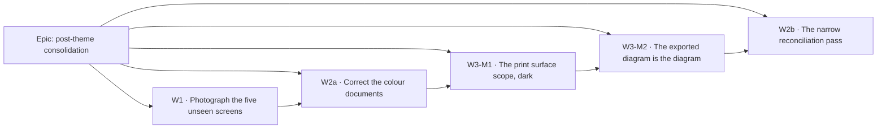

# Implementation Plan: post-theme consolidation (W1 · W2 · W3)

- **Feature spec:** [`./feature-spec.md`](./feature-spec.md) — covers **W3 only**; W1 is
  investigation and W2 is process, and the spec says so in its §0 rather than padding them into a
  spec shape.
- **Status:** Draft — **awaiting approval before implementation**
- **Owner:** unassigned

## Breakdown

### Epic

**Post-theme consolidation** — close the gap between what the light corporate theme (ADR-0102,
released 2026-08-21) actually painted and what anybody has looked at, and close the two register
rows its review left behind. Maps to no roadmap theme: this is register and drift work, plus one
product defect.

---

## Milestone W1 — Photograph the five unseen screens

**Outcome:** the product owner has 15 pictures (5 screens × 3 widths) of screens the light theme
repainted and nobody has seen, plus register rows for what they show. **No screen is fixed in this
milestone** — that is the decision already taken.

**Entry point:** none — **ships dark by design.** This milestone changes no user-facing behaviour.
Its deliverable is `.screenshots/` output, a report, and `docs/TECH_DEBT.md` rows. The one code
change (four new `SHOTS` entries and an opt-in fifth) is to a developer harness that is not part of
the bundle.

**Journey:** not applicable — ADR-0081 §2 attaches a journey to a milestone claiming _user-facing
capability_, and this one explicitly claims none. The harness **is** the instrument.

### The shot list was re-derived, not trusted

The brief said five routes have no same-named shot and asked me to verify. **The list is correct**,
and here is what it was checked against rather than a restatement of it:

- `apps/web/scripts/shoot.mjs:262-404` declares **26** shots. Counted: `sign-in`, `sign-up`,
  `forgot-password`, `reset-password`, `verify-email`, `accept-invite`, `org-home-empty`,
  `org-home`, `clients`, `calendars`, `resources`, `members`, `recently-deleted`, `audit-log`,
  `project-detail`, `clients-error`, `clients-loading`, `plan-workspace`,
  `plan-workspace-readonly`, `plan-workspace-editor`, `gantt`, `gantt-arrows`,
  `plan-workspace-minimap`, `plan-workspace-lenses`, `share-guest`, `export-diagram`.
- `apps/web/src/routes/` holds **22** non-test route files. Matched against the registered paths in
  `apps/web/src/app/router.tsx` rather than by filename, because a filename is not a route:
  - `plan-detail.tsx` → `/orgs/$orgSlug/plans/$planId` (`:302`) — **covered** by
    `plan-workspace*` ×5 and `gantt*` ×2, exactly as the brief guessed.
  - `share.tsx` → `/share` (`:379`) — **covered** by `share-guest`.
  - `authed-layout.tsx` — a layout, not a screen. Photographed in every authenticated shot.
  - the index route (`:154`) has **no component**: it is a `beforeLoad` redirect.
- Genuinely uncovered, with their registered paths:

  | Route file          | Path (`router.tsx`)                | Note                                                                                                                                                               |
  | ------------------- | ---------------------------------- | ------------------------------------------------------------------------------------------------------------------------------------------------------------------ |
  | `onboarding.tsx`    | `/onboarding` (`:168`)             | **The harness drives through it on every single run** (`shoot.mjs:60` waits on its "Create your organisation" heading) and has never photographed it. Free to add. |
  | `account.tsx`       | `/account` (`:230`)                | ADR-0074 M3.                                                                                                                                                       |
  | `my-activity.tsx`   | `/me/activity` (`:223`)            | ADR-0073 C2. **Sits outside any organisation** — ADR-0073's own retrospective records a test failing because the org nav link is not rendered there.               |
  | `client-detail.tsx` | `/orgs/$orgSlug/clients/$clientId` | Needs a client id; `seedProgramme` already returns `clientId` (`shoot.mjs:234`) and `project-detail` already uses the same trick.                                  |
  | `staff.tsx`         | `/staff` (`:363`)                  | The one with an obstacle. See below.                                                                                                                               |

**Expected yield, from precedent rather than optimism.** ADR-0102 widened this list 12 → 25 and
found two defects **only photographs could find** (the weekend hatch's dark-to-light step; the
minimap frame's polarity-agnostic gate), plus four rows in `docs/TECH_DEBT.md` #161 from four
newly-photographed screens — a rate of roughly one finding per two new screens. Five screens
suggests two or three rows. Two of #161's four rows (c and d) were **already resolved by the
release that filed them**, which is a caution about the reporting rather than the shooting: see
W1-T4.

### The `staff` obstacle — costed, with the answer

**It is worth doing, and the path is already documented and working.** The evidence:

- `apps/web/playwright.staff.config.ts:54-85` boots an API with
  `STAFF_EMAILS: ' Ops@SchedulePoint.test , unverified@schedulepoint.test '` and an SMTP sink on
  `E2E_SMTP_PORT` (default 3026). This is a **shipped, CI-green configuration**
  (`.github/workflows/ci.yml:588-589`).
- `apps/web/e2e-staff/staff.spec.ts:24-26,159-185` performs the whole dance the guard demands —
  sign up, follow a **real emailed** verification link, **sign in again** (the file records that
  verifying does not leave you signed in, "observed, not assumed").

So the cost is not "make staff reachable" — it is "let the harness attach to an API that already
has it". `shoot.mjs` boots **no servers**: it attaches to `E2E_BASE_URL` (`:25`). Recommended
shape:

- The `staff` shot is **opt-in** behind `SHOOT_STAFF=1` and **skips loudly** otherwise, with the
  one-line instruction in the message. A shot that silently produces nothing is the
  "green result about nothing" this harness has already been bitten by twice (`shoot.mjs:550-562`,
  `:593-608`).
- The operator runs the API once with `STAFF_EMAILS` set — the same variable
  `docs/DEPLOYMENT.md:942-948` already documents for a real host.
- The harness reuses `e2e-account/smtp-sink`, which `e2e-staff` already imports (`staff.spec.ts:4`).

**One inconsistency found while costing this, recorded rather than stepped over:**
`playwright.staff.config.ts:19` says "the spec verifies addresses through the API rather than
through mail, **so no SMTP sink is needed**", and sixty lines below it (`:62-66`) configures an
SMTP sink whose comment says it is needed "because the guard demands `emailVerified`
unconditionally". The spec starts a sink at `:51-52` and reads mail at `:163`. **The docblock is
wrong**; the config and the spec are right. W1-T3 fixes the sentence.

**If the answer is "not worth it"** — a defensible call, since `/staff` is reachable by nobody on
a stock install — then the honest alternative is to say so in `shoot.mjs`'s `SHOTS` list as a
comment naming the reason, not to leave the gap unexplained. A gap with no note reads as an
oversight and gets re-derived by the next reader, which is the cost this milestone exists to stop
paying.

---

#### Feature: five more screens in the instrument

> **Description:** four unconditional shots plus one opt-in, then look at the output and file.
> **Complexity:** **S**
> **Dependencies:** none. A local Postgres + API + dev server, which `scripts/e2e-local.sh` already
> stands up.
> **Risks:** the harness is ordered, shared state — `plan-workspace-editor`'s docblock records a
> shot passing under `--only` and failing in the full run because a sibling gave the pen away
> (`shoot.mjs:336-341`). → Every new shot is validated in a **full** run, never only under `--only`.
> **Testing requirements:** the harness is the test. Each new shot must reach the state it is named
> for or throw (the `expectText` / 404-guard contract, `shoot.mjs:555-562,593-608`).

##### Task W1-T1 — The four unconditional shots

- **Description:** add `onboarding`, `account`, `my-activity`, `client-detail` to `SHOTS`.
- **Complexity:** S
- **Dependencies:** none
- **Risks:**
  - `onboarding` is only reachable by an account with **no** organisation, and `onboard()` creates
    one at `:60-64`. → Shoot it in its own anonymous context that signs up and stops at the
    heading, mirroring the `signedOut` branch (`:522-529`). **This is the only one of the four
    that is not a two-line addition, and it is the one that will be under-estimated.**
  - `my-activity` sits outside any organisation, so the shell renders differently. → That is the
    point of photographing it; assert it reached its own heading via `expectText`.
- **Testing:** a full `node scripts/shoot.mjs` run at all three widths writes 30 files with no
  throw.
- **Development steps:**
  1. Add `client-detail` using the `clientId` already returned by `seedProgramme` (`:234`), with
     `programme: true` — the `project-detail` pattern verbatim (`:285-289`).
  2. Add `account` and `my-activity` as plain authenticated shots with `expectText` guards.
  3. Add `onboarding` as an anonymous shot that signs up and waits for the heading.
  4. Full run at 1646, 1920, 1280.

##### Task W1-T2 — The opt-in `staff` shot

- **Description:** `SHOOT_STAFF=1` adds a `/staff` shot that signs up an allow-listed address,
  verifies via the SMTP sink, signs in again, and photographs the console.
- **Complexity:** **M** — the only non-trivial task in W1.
- **Dependencies:** W1-T1 (so the full-run ordering is already settled)
- **Risks:**
  - The harness starts no server, so a wrong `STAFF_EMAILS` produces a 404 that looks like a
    broken route. → The guard is `/staff`'s deliberate uniform 404 (`router.tsx:352-354`), so the
    shot must **detect it and throw with the configuration instruction**, never photograph it.
  - Port collision with a running `e2e-account` sink. → Reuse `E2E_SMTP_PORT`, default 3026, the
    value `playwright.staff.config.ts:66` already picked to avoid exactly this.
- **Testing:** run once with `SHOOT_STAFF=1` against a correctly-configured API (expect a picture)
  and once against a stock one (expect a clear skip message, not a picture of "Not found").
- **Development steps:**
  1. Extract the verify-by-mail helper from `e2e-staff/staff.spec.ts:159-185` rather than
     re-writing it — one implementation, the ADR-0065 argument.
  2. Add the shot, gated on `SHOOT_STAFF`, skipping with an instruction otherwise.
  3. Document the one-liner in `apps/web/README.md` beside the harness invocation.

##### Task W1-T3 — Fix the `playwright.staff.config.ts` docblock

- **Description:** the "no SMTP sink is needed" sentence at `:19` contradicts the sink configured
  at `:62-66` and used at `staff.spec.ts:51,163`.
- **Complexity:** S
- **Dependencies:** none — do it first, it is two minutes
- **Risks:** none
- **Testing:** none needed; prose.
- **Development steps:** correct the sentence to say what the file does, and why.

##### Task W1-T4 — Report, and file

- **Description:** put the 15 (or 18) pictures in front of the product owner with a per-screen
  note, and open register rows. **Fix nothing.**
- **Complexity:** S
- **Dependencies:** W1-T1, W1-T2
- **Risks:**
  - **Reporting something already fixed.** `docs/TECH_DEBT.md` #161c and #161d were both filed on
    2026-08-21 and both **resolved in `web-v0.97.0`, the release that filed them** — and #161d was
    labelled "the one item here that is a product-owner question" when it had already been
    answered. Left standing a day, that row would have sent the product owner a question they had
    already answered. → **Every finding is re-checked against the released build immediately
    before the report is written**, and the report says when it was checked.
  - A WCAG failure gets queued behind a preference decision. → **Carve-out (recommended, see
    §"Where a decision looks wrong"):** a measurable accessibility failure is fixed without a round
    trip; only _preferences_ wait.
- **Testing:** n/a
- **Development steps:**
  1. Write the report inline (not as a file — the product owner reads the message).
  2. Open one register row per finding, each naming the shot and the width.
  3. Note explicitly which screens were photographed and found **fine** — that is the evidence the
     next widening is worth running.

---

## Milestone W2a — Correct the colour documents (a narrow slice, pulled forward)

**Outcome:** `docs/DESIGN_SYSTEM.md` stops describing a palette that was replaced two days ago.

**Entry point:** none — **ships dark.** Documentation only.

**Journey:** n/a.

**Why this slice is pulled out of W2 and put before W3.** It is a dependency, not tidying.
`docs/DESIGN_SYSTEM.md` is the governing document for colour, and W3-M2 derives paper values
against a ground. Verified today:

- `:216` is headed **"The palette (Graphite)"**.
- `:227-228` states "The live tokens are `--chrome: oklch(0.154 0.009 264.3)` and
  `--page-background: oklch(0.177 0.011 260.6)` — a dark graphite chrome around a dark graphite
  stage". The shipped value is `--page-background: oklch(0.982 0.002 248)`
  (`apps/web/src/styles/globals.css:556`).
- `:15` — "**Themeable.** Light and dark are first-class" — and `:39,41` — "reliable light/dark
  pairs… Full values (light + dark) are in `globals.css`" — are stale since ADR-0097 collapsed the
  product to one theme.
- `:202-208` records that the _heading_ of §"one theme" was corrected. **Lines 15, 39 and 41 were
  not.** That is `docs/RECONCILE.md` §1's own warning verbatim — _when you patch a gate, ask
  whether the same hole is in its siblings_ — and the 2026-08-20 pass found this exact file wrong
  about this exact palette one day after it changed.

An implementer reading `:227` would derive a paper wash against `oklch(0.177)`.

#### Feature: the colour documents describe the shipped theme

> **Description:** correct `DESIGN_SYSTEM.md`'s palette section and its light/dark survivals.
> **Complexity:** S
> **Dependencies:** none
> **Risks:** restating token values in prose is what made this wrong twice. → Where the file must
> name a value, point at `globals.css` and the contrast gate rather than copying a number; where a
> number is genuinely load-bearing to the argument, say when it was read.
> **Testing requirements:** `pnpm check:doc-links`. No gate can check "does this prose describe the
> system" — that is why this is a reconciliation task and not a CI step.

##### Task W2a-T1 — The palette section

- **Description:** rewrite `:216-268` for the light corporate theme; correct `:15,39,41`.
- **Complexity:** S
- **Dependencies:** none
- **Risks:** as above
- **Testing:** `pnpm check:doc-links`, `pnpm format:check`
- **Development steps:**
  1. Re-derive the current chrome/page/canvas grounds from `globals.css` and rewrite the section as
     the **rule** (cool means interface, warm means attention; the matrix owns the ratios) rather
     than as a value list — the shape the 2026-08-20 pass adopted for the same file.
  2. Correct the three light/dark survivals to the single-theme statement already made at `:198`.
  3. Sweep the file for other pre-ADR-0102 colour claims before closing the task.

---

## Milestone W3-M1 — The print surface scope (dark; provable no-op)

**Outcome:** paper has a complete surface family instead of a three-token stub. **Nothing a user
can see changes.** `docs/TECH_DEBT.md` #163 closes.

**Entry point:** none — **ships dark by design.** The four print palette fields whose resolution
path this changes are not drawn into any pixel of the artefact today (established by #164's
sampling of the exported PNG). W3-M2 is the milestone that surfaces it.

**Journey:** none in this milestone — nothing user-facing to drive. The **artefact pixel-diff**
(W3-M1-T5) is its equivalent, and it is the assertion that this milestone did what it claims.

#### Feature: `[data-surface="print"]`

> **Description:** a full 31-member `--print-*` family, most members aliasing `--plot-*`, behind a
> `[data-surface='print']` scope; `resolvePrintPalette` resolves against a print-scoped element.
> **Complexity:** **M**
> **Dependencies:** none in code; W2a-T1 recommended first so the values are derived against the
> right document.
> **Risks:**
>
> - The three existing `--print-*` names change spelling, and `PrintSurface.css` +
>   `GanttPrintSurface.css` both read them (`globals.css:478-479`). A partial rename re-creates the
>   drift #158 just closed. → **All three files move in one commit**, and gate `:208-216` is widened
>   to assert both stylesheets read the new names.
> - The scope's arrival must be byte-identical, and "I believe it is" is not evidence. → T5.
>   **Testing requirements:** `token-architecture.test.ts` (closure, `:root` sweep, `FAMILIES`),
>   `token-contrast.test.ts`, `print-palette.structural.test.ts` (rewritten), `surface-seams`, plus
>   the pixel diff.

##### Task W3-M1-T1 — Draft and file ADR-0103

- **Description:** the seventh surface scope and the compose-once rule (spec §4.7 outline).
- **Complexity:** S
- **Dependencies:** none
- **Risks:** ADR-0071 lived in a spec directory for a whole epic while shipped code cited it by
  number. → **File it first**, and in **one commit** with `docs/adr/README.md`, the `CLAUDE.md` §16
  entry and the banner count, because `scripts/check-counts.mjs` re-derives the ADR count from
  `docs/adr/` and will otherwise fail the build.
- **Testing:** `pnpm check:counts`, `pnpm check:doc-links`, `pnpm check:adr-coverage`
- **Development steps:** draft → assign the number → land the four files together.

##### Task W3-M1-T2 — The `--print-*` family and the scope block

- **Description:** declare 31 `--print-*` members at `:root` (all aliasing `--plot-*` at this
  milestone) and a `[data-surface='print']` block rebinding the closure onto them.
- **Complexity:** M
- **Dependencies:** T1
- **Risks:**
  - A member declared as an alias where the theme contract wants a literal. `token-architecture`
    `:358-369` records exactly this trap for `--field`/`--canvas`. → The paper _background_ is
    declared literally; the rest alias, which is the `canvas` scope's own L1 shape
    (`token-architecture.test.ts:373-393`).
  - The `:root` sweep (`:258-295`) fails on any unaccounted `:root` colour token. → The `--print-`
    prefix joins the allowed-prefix regex at `:288`, and `deferredScopes` is **deleted**.
- **Testing:** `token-architecture.test.ts` green with `print` added to `FAMILIES` (`:61`);
  `token-contrast.test.ts` green with `'print'` added to `SCOPES` (`:25-26`).
- **Development steps:**
  1. Rename `--print-ground`/`--print-ink`/`--print-muted-ink` →
     `--print-background`/`--print-foreground`/`--print-muted-foreground`, updating
     `PrintSurface.css`, `GanttPrintSurface.css` and `PRINT_TOKEN_SOURCES` in the same commit.
  2. Declare the remaining 28 members aliasing `--plot-*`.
  3. Add `[data-surface='print']`.
  4. Add `print` to `FAMILIES` and to `SCOPES`; delete `OUTSIDE_THE_CLOSURE.deferredScopes` and its
     justification.

##### Task W3-M1-T3 — `SurfaceTone` and the print-scoped element

- **Description:** `'print'` joins `SurfaceTone` (`surface.tsx:53`); the export resolves its
  palette against a print-scoped element rather than the canvas one.
- **Complexity:** S
- **Dependencies:** T2
- **Risks:**
  - `useCanvasSurface()`'s fallback to `document.documentElement` is "the honest weak point of this
    design" per its own docblock, and `docs/TECH_DEBT.md` #159 records a host that hit it. A print
    equivalent must not repeat it. → The print element is created and attached by the export path
    itself, so there is no host to forget; if it cannot be created the export throws the existing
    user-safe error rather than silently resolving against the page.
  - `Surface`'s dev-mode nesting warning (`surface.tsx:107-113`) fires if a print surface is nested
    in another print surface. → It is created per export and removed; assert removal.
- **Testing:** a unit test that `resolvePrintPalette` is called with an element carrying
  `data-surface="print"`; `surface-seams.structural.test.ts` green.
- **Development steps:**
  1. Add the tone.
  2. Create/attach/detach the print-scoped element in the export path (`lib/print-document.ts`
     already establishes the container convention).
  3. Point `use-diagram-image.ts:111` at it.

##### Task W3-M1-T4 — Rewrite the two gate assertions

- **Description:** `print-palette.structural.test.ts:91-99` ("no surface scope rebinds a
  `--print-*` token") is red by design after T2; replace it with the assertion that carries the
  same intent.
- **Complexity:** S
- **Dependencies:** T2
- **Risks:** replacing an assertion is how a gate quietly stops proving anything. → The replacement
  is **verified red** against a `--print-background` aliased to `--page-background`, which is the
  defect the original guarded.
- **Testing:** the gate itself, verified red first, four ways as its docblock records the original
  being.
- **Development steps:**
  1. Replace `:91-99` with "paper's background is a **literal** light colour, not an alias".
  2. Widen `:208-216` to assert **both** print stylesheets read the family names.
  3. Update the docblock at `:14-37` to describe the scope rather than the trio.

##### Task W3-M1-T5 — Prove the no-op

- **Description:** the artefact is pixel-identical before and after M1.
- **Complexity:** S
- **Dependencies:** T2, T3, T4
- **Risks:** a cross-session comparison reports "everything changed", because
  `render-export-image.ts:191` draws the generation date into the title band. → Capture **before**
  and **after** in the same session; diff pixels, not hashes. (ADR-0099 M2 hit the same thing with
  a per-run tenant name.)
- **Testing:** `node scripts/shoot.mjs --only export-diagram` on the base commit and on the branch,
  same session; a diff of zero differing pixels.
- **Development steps:** capture, diff, record the result in the PR body as the milestone's
  acceptance evidence.

---

## Milestone W3-M2 — The exported diagram is the diagram

**Outcome:** the exported PNG, the exported PDF and the printed diagram show month bands, the
non-working wash and hatch, the three gridline tiers, time-true link anchoring with arrowheads, the
bar visual refresh and obstacle-aware link routing — on values derived for paper.
`docs/TECH_DEBT.md` #164 closes.

**Entry point — named, per ADR-0081 §1:** the four existing controls,
`Share & export ▾ → Diagram — whole plan (PNG)` / `Diagram — current view (PNG)` /
`… (PDF)` / `Print diagram`. **No new control is added**, so there is no risk of the ADR-0081
failure mode (a capability with no entry point) — but the milestone names them anyway, because
"the picture changed" is not a claim that anyone can reach the picture.

**Journey — lands with this milestone, not at some later enablement (ADR-0081 §2):** a Playwright
spec that opens the plan workspace, presses `Share & export ▾ → Diagram — whole plan (PNG)`,
captures the **download**, decodes it and asserts pixel colours (spec §4.8 gate 2). **Verified red
against `main` first**, which is trivially available: every pixel outside a gridline or a bar is
currently pure white.

#### Feature: one scene composition, two surfaces

> **Description:** a shared layer composer, the working-day predicate threaded to the export, and
> the paper values.
> **Complexity:** **M**
> **Dependencies:** W3-M1 (all tasks); W2a-T1 recommended
> **Risks:**
>
> - The predicate lift changes `TsldPanel`'s prop, and `GuestPlanView.tsx:245` is a second host.
>   → Both hosts change in one commit; the guest host calls `makeWorkingDayPredicate` itself (one
>   line), which keeps `TsldPanel` host-agnostic.
> - Painting three more layers in an export could regress the **live** frame budget. It cannot —
>   `renderExportImage:118` allocates its own canvas — but the claim must be checkable rather than
>   asserted. → The existing counting-stub budget gates (`paint.band-budget.test.ts` and siblings)
>   stay untouched and green, which is the evidence.
>   **Testing requirements:** the structural composer gate, the extended contrast gate, the artefact
>   journey, one printed sheet.

##### Task W3-M2-T1 — Derive and gate the paper values

- **Description:** compute the paper wash, band and hatch against `--print-background` and declare
  them literally in the `--print-*` family.
- **Complexity:** M — mostly judgement
- **Dependencies:** W3-M1-T2
- **Risks:**
  - **Deriving the wrong quantity.** A contrast _floor_ cannot express "too loud" and a _ceiling_
    was rejected on measurement (`docs/TECH_DEBT.md` #157, and ADR-0102's own analysis of the
    two-point window). → The gate asserts floors and **reports** the wash/hatch, the
    `token-contrast.test.ts:279-286` precedent; loudness is judged from the printed sheet.
  - The month band's polarity inverts on paper (spec §4.3). → Accepted (CQ-4), and **written at the
    declaration** so it is not rediscovered from an artefact.
- **Testing:** `print-palette.structural.test.ts` extended to sweep marks against **both** paper
  grounds (paper and the paper month band); `token-contrast.test.ts` with `print` in `SCOPES`.
- **Development steps:**
  1. Re-derive every figure in spec §4.3 with `@/test/colour` — the spec's numbers are hand-derived
     design input, not the record.
  2. Declare `--print-muted`, `--print-canvas-band`-equivalent and the hatch literally; leave the
     rest aliasing `--plot-*`.
  3. Add the paper month band to the gate's grounds; keep day tier + hatch reported, with reasons.

##### Task W3-M2-T2 — `composeSceneLayers`, and its structural gate

- **Description:** one pure derivation of the six flag-derived scene keys, called by `TsldCanvas`
  (`:850`, `:940`) and by `useDiagramImage` (`:85`).
- **Complexity:** M
- **Dependencies:** none (can land before T1)
- **Risks:**
  - **This is the task that prevents recurrence, and it is the one most likely to be trimmed under
    time pressure** into "just add the two keys #164 named". That would fix two of six and leave
    the seventh layer to diverge next quarter. → The structural gate is written **first**, verified
    red against `main`, so trimming the task fails the build.
  - `TsldCanvas` composes the scene twice (`:850` initial ref and `:940` resync effect) and
    `:838-844` records a component-review finding about those two drifting. → The composer removes
    the possibility; assert both call sites use it.
- **Testing:** `render/scene-layers.structural.test.ts`, verified red; every existing painter and
  canvas suite green **unchanged** — that is the before/after oracle (the ADR-0078 barrel-preserving
  argument).
- **Development steps:**
  1. Write the structural test; verify it red against `main`.
  2. Extract `composeSceneLayers(viewToggles)` returning `monthBands`, `dataDateLine`, `gridTiers`,
     `timeTrueLinks`, `visualRefresh`, `linkRouting`.
  3. Re-point both `TsldCanvas` call sites and the export.
  4. Confirm every pre-existing suite passes **unchanged**.

##### Task W3-M2-T3 — Thread the working-day predicate

- **Description:** lift `workingDayPredicate` from `TsldPanel.tsx:1418-1421` into
  `use-plan-workspace-model.ts` (beside `tsldCalendar`, `:425-436`); pass it to both surfaces.
- **Complexity:** M
- **Dependencies:** T2
- **Risks:**
  - Referential stability. The canvas requires a memoised predicate or it repaints every render
    (`TsldCanvas.tsx:324-326`, ADR-0026 D3). → It is a `useMemo` in the model keyed on
    `[tsldCalendar, dataDate]`, exactly as today.
  - The export could be handed a _different_ predicate than the canvas — the drift this task
    exists to remove, reintroduced. → One derivation, one field, and a structural assertion that
    `use-diagram-image` reads it from the model rather than building its own.
- **Testing:** unit — a plan with a Mon–Fri calendar produces an export scene whose `isWorkingDay`
  answers false for the Saturday offset; the flag-off/no-calendar case yields `null` and no wash.
- **Development steps:**
  1. Add `workingDayPredicate` to the workspace model.
  2. Change `TsldPanel`'s prop from `calendar` to `workingDayPredicate`; update
     `plan-workspace-toolbar.tsx:671` and `GuestPlanView.tsx:245`.
  3. Thread it through `useTsldToolbarContext` into `useDiagramImage`.

##### Task W3-M2-T4 — The artefact journey

- **Description:** the decisive gate — a real browser, a real download, computed pixel assertions.
- **Complexity:** M
- **Dependencies:** T1, T2, T3
- **Risks:**
  - A stored golden rots daily because the title band carries the generation date. → **No golden.**
    Assert computed pixel colours at computed coordinates.
  - A pixel coordinate derived from an assumption about the viewport is a test that passes for the
    wrong reason. → Derive the sample x from the export's own viewport, read out of the page, and
    assert a **control** pixel (a mid-week column) is paper.
  - CI time. → Its own config + CI step, the pattern every flag-on journey here uses.
- **Testing:** itself, **verified red against `main` first**.
- **Development steps:**
  1. New Playwright config + `e2e-export/` directory + a `test:e2e:export` script + a CI step.
  2. Seed a programme (reuse `seedProgramme`'s shape), take the pen, export, capture the download.
  3. Decode with `createImageBitmap` + `OffscreenCanvas.getImageData`; assert weekend, band parity,
     three gridline tiers, paper title band, and one control pixel.
  4. Run it locally via `scripts/e2e-local.sh` **before pushing** — CI is the second opinion, never
     the first (`docs/PROCESS.md` DoD).

##### Task W3-M2-T5 — Correct the comments the fix makes false

- **Description:** three docblocks describe a state this milestone ends.
- **Complexity:** S
- **Dependencies:** T1–T4
- **Risks:** **this is the task that gets dropped**, and dropping it creates a false comment in the
  commit that removes the condition it describes — which is the defect class `docs/TECH_DEBT.md`
  #158's own closing note records committing _while removing it_. → It is a task, not a step of
  another task, so it is visible when it is skipped.
- **Testing:** none automatable; it is prose. That is why it is called out.
- **Development steps:**
  1. `print-palette.structural.test.ts:139-143` — "the export's scene sets neither `monthBands` nor
     `isWorkingDay`… these four fields are gated but not currently reachable in the deliverable" is
     **false** after T2/T3.
  2. `resolvePrintPalette`'s docblock (`palette.ts:222-227`) — its "what cannot drift" paragraph
     gains the enumeration of what now does reach paper, and the paper-vs-screen wash divergence is
     stated as chosen.
  3. `use-diagram-image.ts:91-96` — the comment claiming the scene makes "the SAME composition
     `TsldCanvas` makes" was **wrong when written** (it made 1 of 7). It goes with the composer.
  4. Close `docs/TECH_DEBT.md` #163 and #164 by **deleting** the rows, not annotating them CLOSED —
     the register's own opening paragraph forbids that in bold, and the last three reconciliation
     passes each found rows breaking it.

##### Task W3-M2-T6 — Print one sheet

- **Description:** print the exported PDF at A3 and look at it.
- **Complexity:** S
- **Dependencies:** T1–T4
- **Risks:** a 3.5 % wash may halftone away, which no gate in this repository can see.
- **Testing:** a human and a printer.
- **Development steps:** print, look, and either record "legible at A3, checked <date>" or raise a
  row. **Record the result either way** — "we did not check" and "we checked and it was fine" must
  not be the same absence.

---

## Milestone W2b — The narrow reconciliation pass

**Outcome:** ADR-0100, ADR-0101, ADR-0102 and the rows they filed are verified against the code.

**Entry point:** none — **ships dark.** Process.

**Journey:** n/a.

**Scope, deliberately narrow.** Not the full `docs/RECONCILE.md` runbook: the last full pass was
**2026-08-20** (that file's banner), and these three epics landed after it. Steps **1, 2, 3, 6**
are skipped as recently done, with two exceptions noted below.

**It is warranted on evidence, not on a calendar.** Four stale claims were found in this exact
territory on 2026-08-21:

- `docs/TECH_DEBT.md` **#161c** and **#161d** — both filed the same day the release resolving them
  shipped; #161d was labelled "the one item here that is a product-owner question" and had already
  been answered.
- **#158**'s "GanttPrintSurface.css has neither the defect nor the drift" — wrong twice, found
  independently from two directions.
- That file's own "so the two printed artefacts look like one product" docblock — a claim its
  values had already falsified.

Plus two found while writing this plan, before the pass has even started:

- `docs/DESIGN_SYSTEM.md`'s palette section (→ W2a, pulled forward as a dependency).
- `playwright.staff.config.ts:19` contradicting `:62-66` (→ W1-T3).

**And two checks came back clean, which is worth recording so the next pass does not redo them:**
`docs/ROADMAP.md` names ADR-0100/0101/0102 (3 matches), and `docs/adr/README.md:126-128` carries
all three rows. That is the **fifth consecutive pass** where ROADMAP silence was the headline
finding — `pnpm check:adr-coverage` was added for it on 2026-08-13 and appears to be holding.
`docs/adr/` holds **102** files, matching the `CLAUDE.md` banner.

#### Feature: verify the three epics' claims

> **Description:** RECONCILE.md steps 4, 5 and 7, scoped to ADR-0100/0101/0102.
> **Complexity:** M
> **Dependencies:** W1 (its photographs are input — ADR-0102's own findings came from photographs)
> and W3 (which produces its own doc changes; running the pass first means re-checking them).
> **Risks:** a narrow pass that quietly widens costs a day. → The scope is the three ADRs and the
> rows they filed. Anything else found is **filed, not fixed**.
> **Testing requirements:** the automated gates are assumed green and are not redone by hand
> (`docs/RECONCILE.md` §"What is already automated").

##### Task W2b-T1 — Verify the rows the three epics filed

- **Description:** `docs/TECH_DEBT.md` **#152, #154–#158, #159–#164** row by row against the code.
- **Complexity:** M
- **Dependencies:** W3-M2
- **Risks:** **the register's own rule was broken by the last three passes** — rows annotated
  "CLOSED" in the title rather than deleted. → Delete resolved rows; rewrite partly-resolved ones
  to be about what is **left**.
- **Testing:** n/a — this is the manual judgement step
- **Development steps:**
  1. Re-check #161a and #161b, which were filed as pre-existing and may have been swept up by
     ADR-0102's own screen work.
  2. Confirm #159's outstanding half ("a gate that pins every JS token read names an unprefixed
     token") is still owed, and whether W3-M1 makes it cheap.
  3. Confirm #162 (the legend's slack chip naming `--card`) is still live.
  4. Confirm #154 (the AT observations owed by ADR-0100) and #155.

##### Task W2b-T2 — Verify the three ADRs against what shipped

- **Description:** read each ADR's decision list and confirm the code agrees.
- **Complexity:** M
- **Dependencies:** none
- **Risks:** an ADR is immutable once accepted — corrections go in a "reviewed against what landed"
  note (the ADR-0097 precedent at `:54-55`), never by editing a decision.
- **Testing:** n/a
- **Development steps:**
  1. **A candidate is already in hand:** ADR-0097 **D1**'s table says the closure is **29** names
     (`:191`); `token-architecture.test.ts:397` asserts "exactly the closure, **all 31** of it", and
     `CLAUDE.md`'s ADR-0099 entry says 31. One of the three is wrong and it is the ADR. Check
     whether ADR-0097 already carries a correction note for it before writing another.
  2. ADR-0101's two "labelled stopgap" values — confirm ADR-0102 discharged both, and that
     ADR-0101's text is not now describing values that have moved.
  3. ADR-0100's decision 10 (persistence) and its `docs/TECH_DEBT.md` #152 finding.

##### Task W2b-T3 — Point the specialists at the unreviewed diff

- **Description:** RECONCILE.md step 7 — the highest-yield step, and the one most often skipped.
- **Complexity:** M
- **Dependencies:** W3-M2 (so the reviewers see this epic's code too)
- **Risks:** pointing them at already-reviewed code produces nothing. → Point them at what landed
  **after** ADR-0102's own gate pass, plus this epic's diff.
- **Testing:** the reviewers' findings become tests, each verified red first.
- **Development steps:**
  1. `component-reviewer` + `accessibility-reviewer` on W3's token and surface changes.
  2. `ux-reviewer` on W1's photographs — the natural pairing, and it is what produced #161.
  3. `frontend performance-reviewer` on the three added painter layers, to confirm the off-screen
     claim rather than accept it.

##### Task W2b-T4 — Record the pass

- **Description:** `docs/DECISIONS.md` entry, a `docs/RECONCILE.md` "Passes run" row, and the
  banner date — **all three in the same commit**, which that file's own banner records having got
  wrong about itself once.
- **Complexity:** S
- **Dependencies:** W2b-T1–T3
- **Risks:** recording what changed instead of **what was found wrong**. The findings are the
  evidence the next pass is worth running.
- **Testing:** `pnpm check:doc-links`
- **Development steps:** write it; say what was wrong; note it was a **narrow** pass and that the
  full-pass clock still runs from 2026-08-20.

---

## Sequencing & slices

**Recommended order: W1 → W2a → W3-M1 → W3-M2 → W2b.**

The reasoning, since the order is not the obvious one:

1. **W1 first, because its output can change the rest.** It is hours of work, it needs nothing, and
   if it finds a live defect on `/account` or `/staff` the product owner may want that before a
   defect in an export path. Doing it first makes that a choice rather than a discovery made too
   late. It is also **input to W2b**: ADR-0102's own findings came from photographs, and running a
   reconciliation pass over ADR-0102 without looking at what it painted is the "trust the document"
   failure that pass exists to catch.
2. **W2a next, because W3 reads it.** `docs/DESIGN_SYSTEM.md` currently states the page ground as
   `oklch(0.177)` against a shipped `oklch(0.982)`. It is the governing document for colour and
   W3-M2 derives values against a ground. This is one commit and it is a genuine dependency, not
   tidying — which is why it is pulled out of W2 rather than left to the end.
3. **W3-M1 before W3-M2, because M1 is a provable no-op and M2 is the single commit where the
   picture changes.** The reverse ordering ships screen-tuned washes with an inverted band polarity
   into a real deliverable for at least one release, on a host that auto-pulls every release
   (ADR-0047).
4. **W2b last, because W3 produces documentation the pass would otherwise have to re-check.**
   Running it before W3 means auditing `docs/TECH_DEBT.md` #163 and #164 immediately before closing
   them.

**`main` stays releasable at every boundary.** W1 touches only a developer harness. W2a is prose.
W3-M1 is a proven no-op on the artefact. W3-M2 is one behaviour change behind three gates. W2b is
documentation.

**Feature flags: none.** ADR-0088 D1 established that a `VITE_` constant is inlined at build time,
that `apps/web/Dockerfile` declares one `VITE_` build arg and `docker-publish.yml` passes none —
so a flag here would not be an operator rollback. It would be a second product to maintain. The
rollback is the commit boundary between M1 and M2, which is why the split exists.

## Definition of Done (per task)

Each task's PR satisfies the Feature Completion Criteria in
[`docs/PROCESS.md`](../../PROCESS.md). Two are load-bearing here and are called out because they
are the ones this epic could plausibly skip:

- **The pre-push gate was run, not just written** — `pnpm lint && pnpm typecheck && pnpm test`,
  **plus `scripts/e2e-local.sh web:export`** for W3-M2-T4. A journey drives a real browser against
  a real API; no unit suite in this repository could have caught the defect W3 fixes, and none can
  catch a wrong locator in the test that fixes it.
- **A changeset** for W3-M2 (user-visible: the exported artefact changes) and for W3-M1 (a token
  rename that other stylesheets read). W1, W2a and W2b are not user-visible.

## Risks & assumptions (rollup)

| Risk / assumption                                                                                                                                      | Likelihood | Impact   | Mitigation                                                                                                                                        |
| ------------------------------------------------------------------------------------------------------------------------------------------------------ | ---------- | -------- | ------------------------------------------------------------------------------------------------------------------------------------------------- |
| W3-M2-T2 is trimmed to "add the two keys #164 named", leaving four layers diverged and the composition duplicated                                      | **high**   | **high** | The structural gate is written **first** and verified red; trimming the task fails the build.                                                     |
| W3-M2-T5 (correct the now-false comments) is dropped as tidying                                                                                        | **high**   | med      | It is a **task**, not a step inside another one, so skipping it is visible in the plan.                                                           |
| The paper wash halftones away on a real printer — invisible to every gate here                                                                         | med        | med      | W3-M2-T6 prints one sheet and records the result either way.                                                                                      |
| The `--print-*` rename lands in `globals.css` but not both consuming stylesheets                                                                       | med        | **high** | One commit, and gate `:208-216` widened to assert both stylesheets read the family names. This re-creates exactly the drift #158 just closed.     |
| CQ-1 answered as "extend the trio" after M1 is designed for the scope                                                                                  | low        | med      | M1 is the only task affected; the answer is wanted before M1 starts. Named as CRITICAL for that reason.                                           |
| The `staff` shot photographs a uniform 404 and reports success                                                                                         | med        | med      | Detect the 404 and throw with the configuration instruction — the `shoot.mjs:550-562` precedent, which exists because this already happened once. |
| W1 reports a finding the product owner has already resolved                                                                                            | med        | low      | Re-check every finding against the released build immediately before reporting, and say when it was checked (#161c/#161d, both on 2026-08-21).    |
| A W1 photograph shows a WCAG failure that then waits behind a preference decision                                                                      | med        | med      | The carve-out: measurable accessibility failures are fixed without a round trip. **This needs the product owner's agreement** — see below.        |
| **Assumption:** the export's whole-plan `pxPerDay` clears `NON_WORKING_MIN_PX` for a typical programme. **Not measured.**                              | —          | med      | W3-M2-T4 measures it on the seeded programme and records the figure. If it does not clear, CQ-2 becomes live rather than defaulted.               |
| **Assumption:** every pre-existing painter and canvas suite passes unchanged through W3-M2-T2. If any needs editing, the extraction changed behaviour. | —          | **high** | Treated as the before/after oracle (ADR-0078). An edited assertion is a finding, not a fix.                                                       |

---

## Where a decision above looks wrong, said plainly

Three of the brief's positions are examined here rather than accepted. Two survive on corrected
reasoning; one is a scoping suggestion.

**1. W3's stated reason is stale — the decision is right, the argument is not.** The brief justifies
_print-tuned, not screen-matched_ on ADR-0101's record of the hatch measuring ~9:1 on a light
ground. `globals.css:515-525` records ADR-0102 **inverting that value for the light ground** the
day before, and the shipped hatch measures ~1.25:1 on paper. The too-loud treatment was removed
yesterday. The decision stands on three other measured facts (spec §4.3) — the month band's
**polarity inversion** on white paper, the wash's **5×** separation, and the halftone floor — and
the first of those is a genuine ADR-0097 split-pair defect rather than a preference. Recorded
because a decision resting on a false premise gets reversed by the first person who checks the
premise.

**2. "The printed programme" in the brief names the wrong artefact.** Three artefacts are affected
— the PNG, the PDF and the **printed diagram** — all via `buildDiagramImage`. The printed
**programme** is the Gantt (`GanttPrintSurface.tsx`), which contains no month-band or non-working
concept at all and has lost nothing. That is **CQ-3**: if weekend shading on the printed programme
is actually wanted, it is a separate, larger, DOM-side piece of work with no shared code, and it
should be decided as such rather than absorbed.

**3. W1's "catalogue, then choose" is right, with one carve-out.** The decision is correct for
preferences — the empty-state archetype, the loading skeleton, whether the rail compresses. It is
the wrong shape for a **measurable accessibility failure**, and ADR-0102 produced exactly one of
those from a photograph: the minimap frame, whose gate is polarity-agnostic by design and stayed
green with a white stroke on a near-white ground. A 1.4.11 failure is not a matter of taste, and
routing it through a decision cycle leaves it shipped for the duration. **Recommendation:** W1
fixes a measured WCAG failure without a round trip and reports that it did; everything else waits.

**One thing the brief got exactly right and is worth reinforcing.** "Verify that list yourself
rather than trusting it" — the five-route list was correct, and checking it turned up three things
the list could not show: that `onboarding` is traversed by the harness on every run and never
photographed; that `plan-detail` and `share` are covered under differently-named shots as the brief
suspected; and that the `staff` obstacle is already solved in a shipped, CI-green Playwright config
that nobody had connected to the harness.

---

## Critical questions — the ones that change the work

Everything else in this plan carries a stated default and is not asked. These four do not, and each
one changes what gets built.

1. **CQ-1 — Budget: extend the `--print-*` trio (S), or build `[data-surface="print"]` (M)?**
   The trio grows the exact truncated family `docs/TECH_DEBT.md` #163 filed, from three members to
   six. The scope closes #163, makes "a printed diagram cannot drift from the one on screen" a
   structural property instead of a hand-maintained table, and rewrites two gate assertions.
   _Default if unanswered: build the scope._ Needed **before W3-M1 starts**.

2. **CQ-2 — Does paper get a lower `NON_WORKING_MIN_PX`?** Paper is rasterised at `dpr` and printed
   at 300 dpi, so 3 CSS px is legible on a sheet where it is not on a screen. Lowering it means a
   print-aware parameter in the **shared painter**, which every live frame then carries.
   _Default: no — one painter, one rule._ A whole-plan export of a long programme shows no weekend
   wash, exactly as the screen does not at that zoom.

3. **CQ-3 — Does the printed Gantt programme need weekend shading and month banding too?**
   It has never had them and #164 does not reach it. Including it roughly doubles the epic and
   shares no code with W3. _Default: out of scope, filed as a register row._

4. **CQ-4 — The W1 accessibility carve-out.** Does "catalogue, then the product owner chooses"
   admit an exception for a measured WCAG failure, or is every finding — including a live 1.4.11
   failure — held for the decision cycle? _Default: the carve-out applies._

---

**Awaiting approval before implementation.** Nothing in this plan has been built; no application
code has been written.
